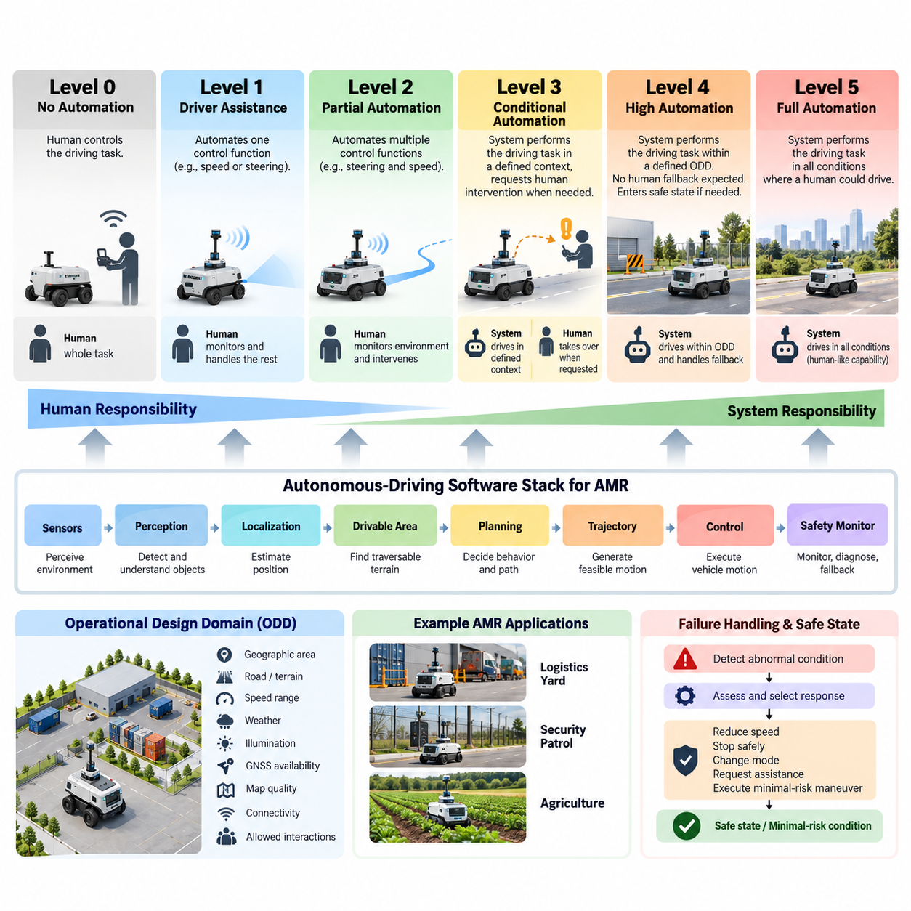
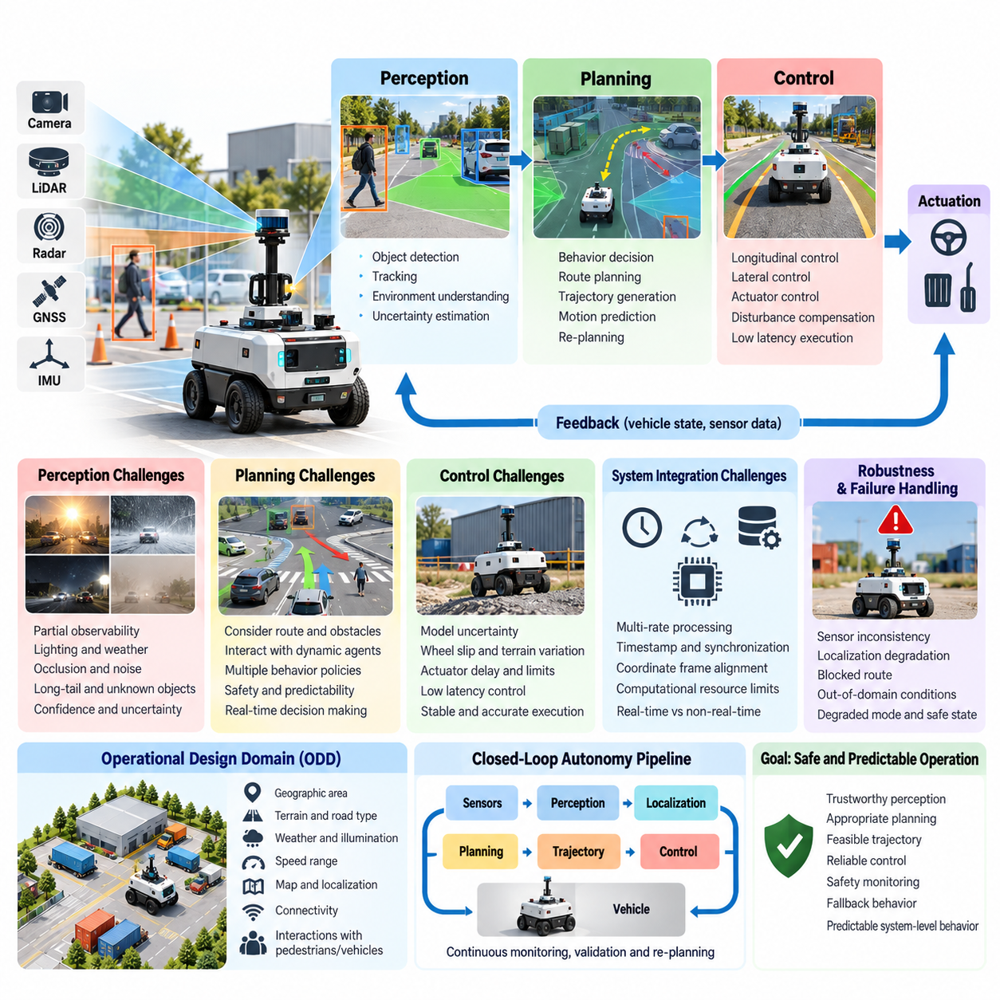
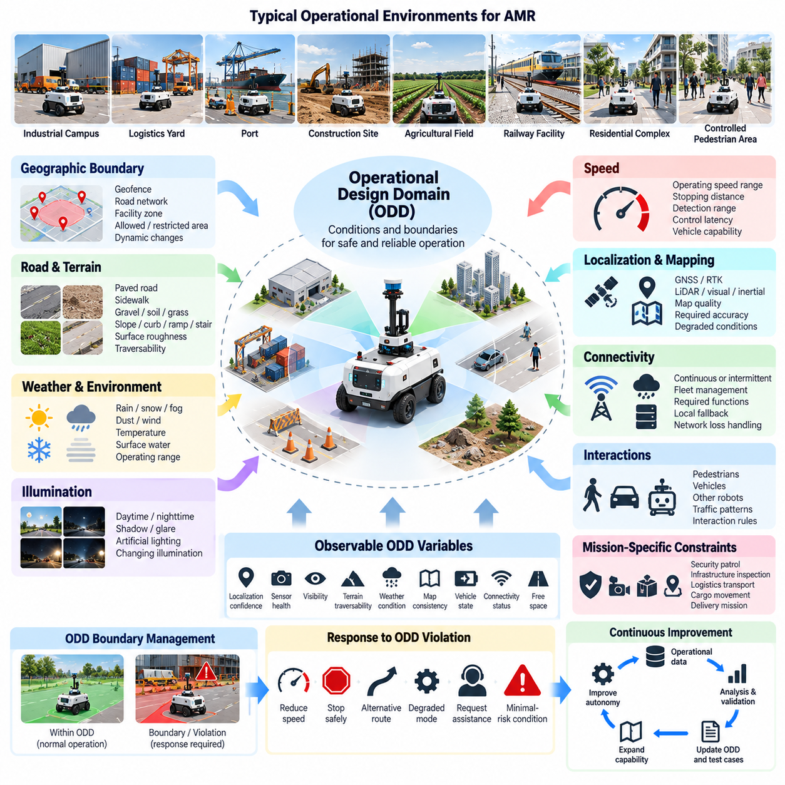
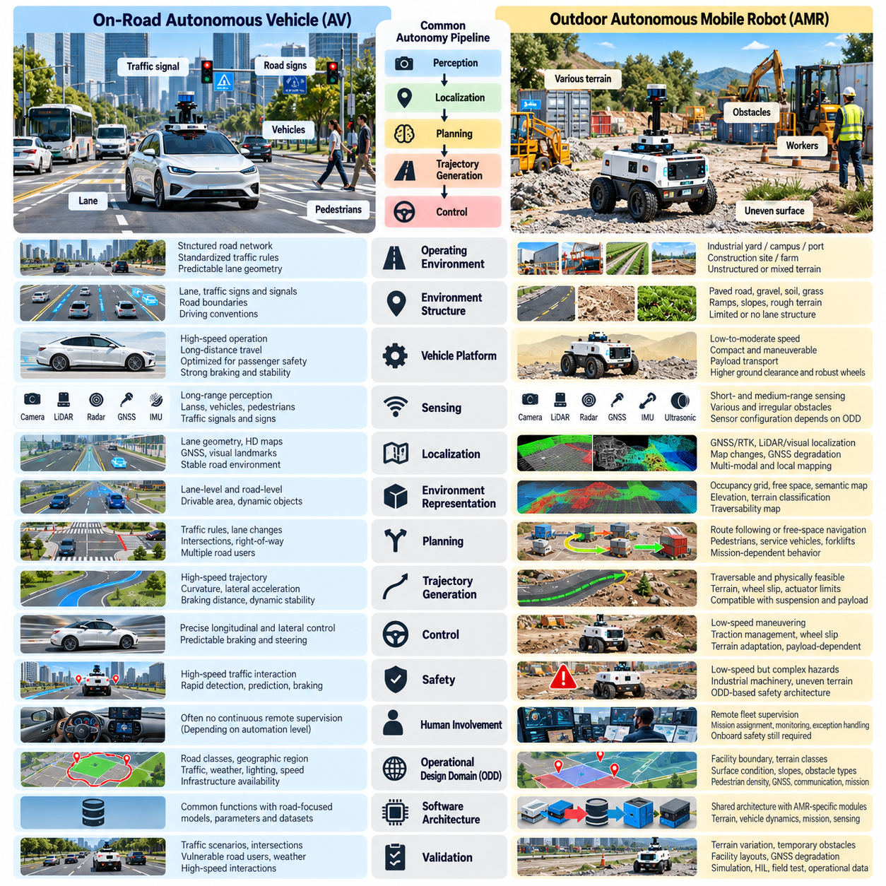
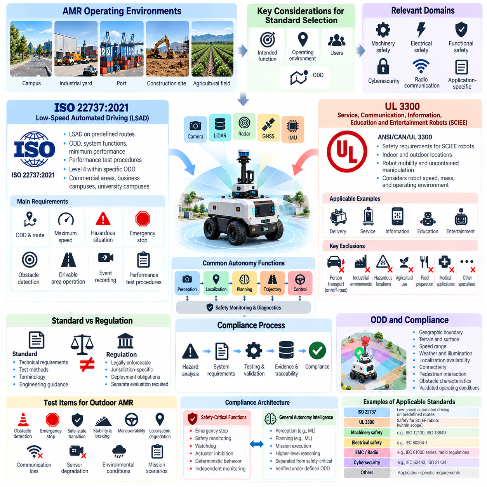
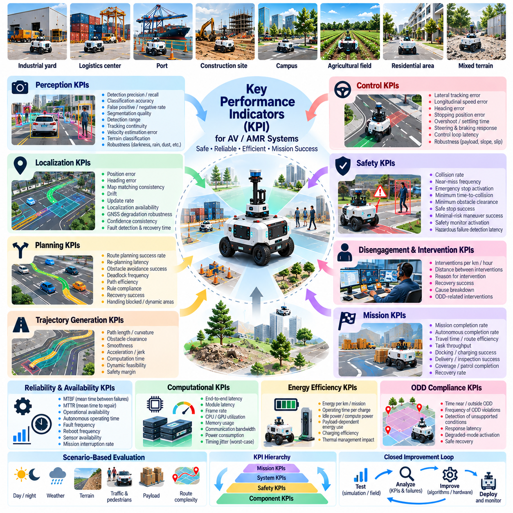
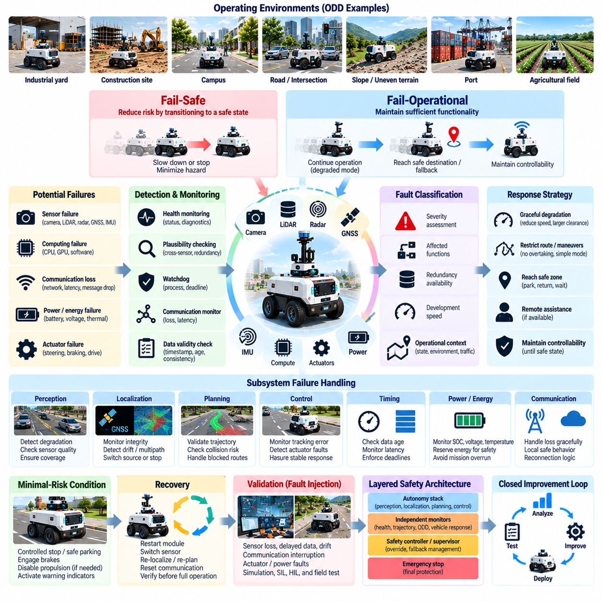
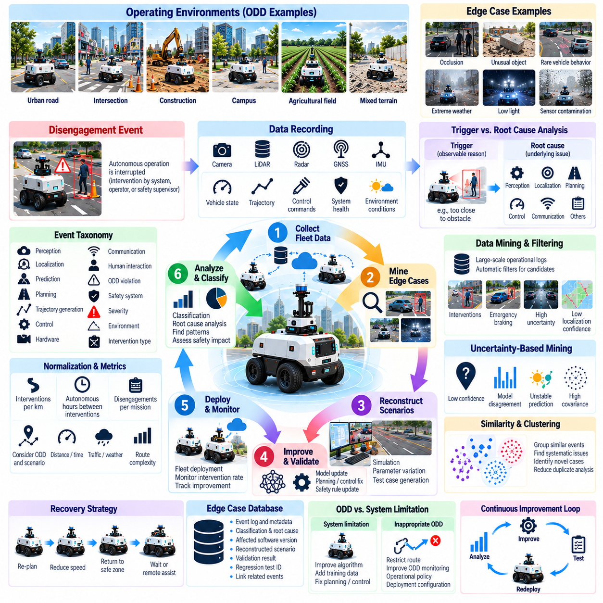
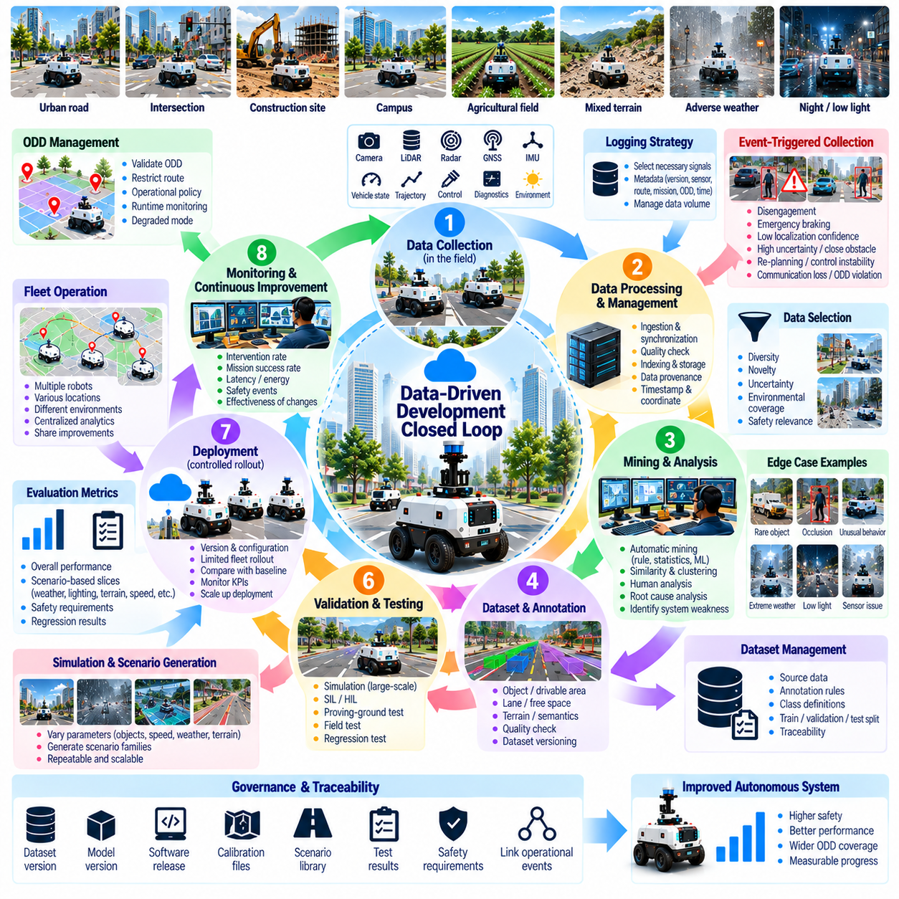
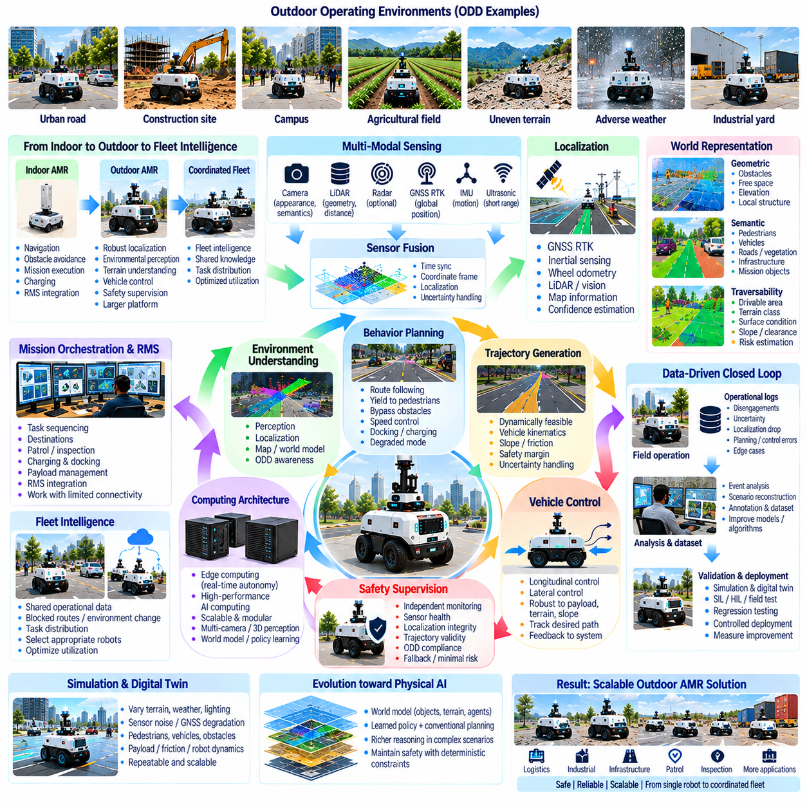

**Volume 12. Autonomous Driving Software**

# Chapter 01. Autonomous Driving Fundamentals

## 01.01. Autonomous Driving Levels SAE L0 to L5 for AMR

{width="7.268055555555556in" height="7.268055555555556in"}

Autonomous driving levels provide a structured way to describe how responsibility for sensing, decision making, and vehicle control is divided between a human operator and an automated driving system. The SAE J3016 framework defines six levels, from Level 0 to Level 5. Although originally developed for road vehicles, its conceptual separation of human and machine responsibility is also useful when designing autonomous mobile robots operating in outdoor environments.

At Level 0, the machine does not perform the dynamic driving task on a sustained basis. Automated functions may provide warnings, emergency interventions, or limited assistance, but a human remains responsible for observing the environment and controlling motion. For an AMR, this corresponds to teleoperation or manual driving in which collision warnings, proximity sensors, or emergency braking may assist the operator without assuming continuous navigation responsibility.

Level 1 introduces sustained automation of a specific control function while the human remains responsible for the rest of the driving task. A road vehicle might automate either longitudinal or lateral control. In an AMR interpretation, a robot could automatically regulate speed, maintain a predefined heading, or follow a simple path while an operator supervises perception and handles obstacles, intersections, route changes, and abnormal environmental conditions.

Level 2 combines multiple automated control functions so that the system can simultaneously manage motion along a path and regulate speed. However, environmental monitoring and supervisory responsibility remain with the human operator. An outdoor AMR at this level might follow a mapped route, control steering and velocity, and stop for detected obstacles, while requiring continuous operator supervision and immediate intervention when perception or planning becomes unreliable.

Level 3 represents conditional automation. The automated system performs the complete dynamic driving task within a defined operational context and monitors the surrounding environment, but it may request human intervention when it reaches a condition that it cannot handle. Applied to AMRs, the robot can autonomously perceive obstacles, localize itself, plan trajectories, and execute control within its supported environment, while maintaining a defined fallback procedure for takeover situations.

The transition from Level 2 to Level 3 is therefore more significant than simply adding better perception algorithms. The responsibility for monitoring the operational environment moves from the human supervisor to the automated system while automation is active. This requires reliable object detection, localization, traversability estimation, behavior planning, trajectory generation, system diagnostics, and mechanisms that determine when the robot is approaching the boundary of its autonomous capabilities.

Level 4 introduces high automation within a defined Operational Design Domain, or ODD. When operating inside that domain, the automated system can perform the driving task without expecting a human to provide the fallback response. If continued operation becomes impossible, the system must autonomously transition toward a safe state or minimal-risk condition. This concept is particularly relevant to commercial outdoor AMRs deployed within geographically or operationally constrained facilities.

An outdoor AMR can therefore achieve Level-4-like operation without being capable of navigating every possible public environment. Its ODD may specify a logistics yard, industrial campus, port, construction site, agricultural field, or controlled pedestrian area together with permitted speeds, slopes, surfaces, weather conditions, illumination ranges, communication assumptions, and localization availability. The autonomy claim is meaningful only when these boundaries are explicitly defined and validated.

For example, a security patrol AMR could autonomously execute scheduled missions inside a mapped industrial complex, navigate roads and walkways, avoid pedestrians and vehicles, re-plan around temporary obstacles, return to its charging station, and enter a safe state after critical failures. Such behavior resembles Level 4 when the robot can complete or safely terminate its mission without depending on immediate human intervention within its declared ODD.

Level 5 represents full automation without dependence on a restricted driving domain comparable to the limitations imposed on lower automation levels. Conceptually, the system would perform the complete driving task under all conditions in which a human driver could reasonably operate. Translating this directly to robotics is difficult because AMRs encounter highly diverse terrain, unstructured spaces, extreme weather, sensor degradation, unusual objects, and mission-specific physical constraints.

Consequently, Level 5 should not simply be interpreted as a more accurate Level 4 AMR. It implies a fundamental expansion of environmental and operational generality. A Level-5-like mobile robot would need to understand unfamiliar environments, adapt its behavior to previously unseen situations, reason about uncertain terrain and dynamic agents, recover from unexpected failures, and maintain safe operation without relying on predefined maps, routes, or narrowly specified environmental assumptions.

The SAE levels describe allocation of the driving task rather than a direct measure of AI intelligence, perception accuracy, or hardware performance. A robot equipped with powerful GPUs, multiple LiDARs, cameras, radar, GNSS RTK, and sophisticated neural networks is not automatically Level 4. The decisive question is which entity performs perception, decision making, control, supervision, and fallback under explicitly defined operating conditions and system failures.

This distinction is especially important for AMRs because autonomy is often described using terms such as autonomous navigation, obstacle avoidance, or unmanned operation. These capabilities alone do not define an automation level. A robot may navigate autonomously during normal operation but still depend on remote operators whenever localization fails or an unknown obstacle appears. Its practical autonomy architecture must therefore include degraded modes, fallback behavior, and recovery mechanisms.

Remote supervision also requires careful interpretation. A Level-4-like AMR may communicate with a fleet management or remote operations center without requiring a human to continuously perform the driving task. Operators can assign missions, observe status, authorize exceptional actions, or assist recovery while the onboard autonomy remains responsible for real-time safe motion. Continuous remote driving, by contrast, represents human control rather than high driving automation.

For outdoor AMRs, the progression from L0 toward L4 can therefore be understood as a transfer of operational responsibility from human control to machine autonomy. Manual control evolves into assisted control, supervised navigation, conditional autonomy, and finally domain-bounded autonomous operation with machine-managed fallback. Each transition increases requirements for perception coverage, localization integrity, planning robustness, fault detection, redundancy, validation, and runtime safety supervision.

This progression naturally connects autonomy levels with the remainder of an autonomous-driving software stack. Sensor processing establishes trustworthy observations; drivable-area estimation identifies usable terrain; detection and tracking represent dynamic agents; behavior planning determines appropriate actions; trajectory generation produces feasible motion; and control converts trajectories into physical actuation. Safety monitoring and localization provide essential constraints across these functions.

Higher automation also changes the importance of failure management. At lower levels, a human can compensate for many automation limitations. At higher levels, the system itself must detect sensor faults, localization degradation, blocked routes, actuator abnormalities, communication loss, and environmental conditions outside its supported domain. It must then select an appropriate response such as reducing speed, stopping safely, changing operating mode, requesting assistance, or executing a minimal-risk maneuver.

The software architecture must therefore distinguish nominal autonomy from safety mechanisms. A primary perception-planning-control pipeline attempts to accomplish the mission, while independent monitoring functions evaluate whether its outputs remain trustworthy and safe. Watchdogs, health monitoring, redundant sensing, fallback planning, emergency braking, and safety cages can prevent a single autonomy failure from directly becoming hazardous physical behavior. These themes form dedicated safety and redundancy topics later in the volume.

Operational Design Domain definition becomes increasingly important as autonomy increases. The ODD establishes where, when, and under what conditions the autonomous function is intended to operate. For an outdoor AMR, relevant dimensions include geographic boundaries, road and terrain characteristics, maximum gradients, obstacle classes, pedestrian density, weather, illumination, speed range, GNSS availability, map quality, wireless connectivity, and permissible interactions with other machines.

An ODD should also be machine-observable wherever practical. It is insufficient to document that the robot operates only under acceptable weather or localization conditions if the system cannot determine whether those conditions are currently satisfied. Runtime monitors can estimate localization confidence, sensor visibility, terrain quality, communication health, actuator status, and environmental severity so that the robot can recognize when its assumptions are becoming invalid.

The AMR interpretation of SAE levels should ultimately be treated as an engineering analogy rather than a replacement for robot-specific safety standards or deployment requirements. SAE levels provide a useful vocabulary for reasoning about responsibility and fallback, while actual AMR design must additionally consider machinery safety, industrial environments, robot-specific hazards, fleet operation, cybersecurity, remote assistance, and application-dependent risk controls.

For system development, the most useful objective is therefore not merely to attach a numerical autonomy label to a robot. Engineers should specify the automated functions, ODD, human responsibilities, fallback strategy, minimal-risk condition, failure responses, performance limits, and validation evidence associated with the claimed capability. This produces a testable autonomy definition that can be connected directly to software requirements, simulation scenarios, field testing, and safety arguments.

In this volume, that interpretation establishes the foundation for the autonomous-driving software architecture used for outdoor AMRs. The subsequent structure progresses from system challenges and ODD definition through regulatory considerations, KPIs, fail-safe principles, disengagement analysis, and data-driven development before moving into perception, planning, control, localization, and safety validation. The broader robotics software tree places these topics within Autonomous Driving Software alongside simulation, SLAM, perception, navigation, fleet intelligence, and robot learning.

## 01.02. AV System Challenges Perception Planning Control

{width="7.268055555555556in" height="7.268055555555556in"}

Autonomous vehicle and autonomous mobile robot systems must transform uncertain physical environments into safe and executable actions. The fundamental challenge is not a single perception, planning, or control algorithm, but the continuous interaction among these functions. Sensors observe the environment, perception extracts meaningful objects and terrain information, planning determines what the vehicle should do, and control converts the planned motion into physical movement. Errors or delays in one function can propagate through the entire autonomy pipeline.

Perception is the first major challenge because the physical environment is only partially observable. Cameras, LiDAR, radar, GNSS, and inertial sensors provide different and incomplete measurements. Lighting changes, rain, dust, reflections, occlusion, sensor noise, and dynamic objects can reduce reliability. An outdoor AMR must therefore combine multiple sensing modalities and maintain useful environmental representations even when individual sensors become degraded. Perception should produce not only object detections but also confidence, uncertainty, and information about the quality of the observations.

Object understanding is also more complicated than detecting predefined classes. An autonomous system must estimate object position, orientation, velocity, and motion tendency while distinguishing relevant obstacles from traversable terrain. Pedestrians, vehicles, infrastructure, vegetation, curbs, construction materials, and unusual objects can appear in locations or configurations that were not represented adequately during training. Long-tail and previously unseen situations therefore require robust perception strategies, sensor fusion, temporal tracking, and appropriate uncertainty handling.

Planning introduces a different class of difficulty because the system must convert environmental understanding into decisions. A planner must consider the current route, obstacles, road or terrain constraints, vehicle dimensions, speed, acceleration, stopping distance, and interactions with dynamic agents. The same perception result may lead to different actions depending on mission objectives and environmental context. An outdoor AMR performing security patrol, infrastructure inspection, or logistics transport may therefore require different behavior policies even when operating in the same physical environment.

Behavior planning determines the qualitative action that should be taken before a detailed trajectory is generated. The system may continue forward, slow down, stop, yield, avoid an obstacle, change its route, or enter a recovery behavior. Rule-based logic, finite-state machines, decision trees, optimization, machine learning, and hybrid approaches can be used. For safety-critical applications, the planner must remain predictable enough to support verification while still handling complex and uncertain situations.

Trajectory generation converts a selected behavior into a feasible path and time sequence. A mathematically valid path is not necessarily executable by the robot. Curvature, velocity, acceleration, steering limits, tire constraints, terrain conditions, actuator limitations, and vehicle dynamics must be considered. The trajectory must also remain consistent with the continuously changing environment. Consequently, autonomous systems require frequent re-planning and trajectory validation rather than generating a route once and assuming that it remains valid.

Control is responsible for closing the gap between planned motion and actual physical behavior. Even a high-quality trajectory can fail because of actuator delay, wheel slip, inaccurate vehicle models, changing payload, uneven terrain, or disturbances. Longitudinal and lateral control must therefore operate with sufficiently low latency while compensating for model uncertainty. For outdoor AMRs, traction variation and terrain interaction make this problem particularly important because the relationship between commanded motion and actual motion can change rapidly.

The interfaces between perception, planning, and control create another major system challenge. Each module may operate at a different frequency, use different coordinate frames, and experience different processing delays. Sensor timestamps, localization updates, prediction horizons, and control cycles must remain temporally consistent. A perception result that is accurate but several hundred milliseconds old may produce an unsafe planning decision when a nearby pedestrian or vehicle is moving rapidly.

Computational resources also constrain autonomous system design. High-resolution camera processing, three-dimensional LiDAR perception, radar processing, multi-object tracking, localization, planning, and neural-network inference can compete for CPU, GPU, memory, and communication bandwidth. An outdoor AMR therefore requires explicit latency and computational budgets. Hardware acceleration, efficient data movement, asynchronous processing, model optimization, and appropriate separation of real-time and non-real-time workloads become important architectural considerations.

Robustness must extend beyond normal operating conditions. An autonomous system should recognize when sensor measurements are inconsistent, localization confidence has degraded, a planned route has become blocked, or an environmental condition has exceeded its supported operating range. Rather than producing an apparently confident but incorrect action, the system should reduce speed, stop, re-plan, change operating mode, or request assistance according to its safety architecture. This requires health monitoring and explicit degraded-mode behavior throughout the autonomy stack.

The Operational Design Domain (ODD) provides an important framework for controlling system complexity. An autonomous AMR does not need to solve every possible driving problem simultaneously if its intended operating environment is clearly defined. Geographic boundaries, terrain types, weather conditions, illumination, speed ranges, localization availability, map quality, communication assumptions, and interaction with pedestrians or vehicles can all become part of the ODD. The autonomy system must then determine whether current conditions remain compatible with those assumptions.

The most difficult cases occur when perception, planning, and control interact under uncertainty at the boundary of the ODD. A perception system may recognize an object with low confidence, localization may simultaneously become unreliable, and the planner may have only a small amount of free space for avoidance. In such situations, treating each module independently is insufficient. The complete system must reason about confidence, timing, feasibility, and safety together and select a response that remains acceptable despite incomplete information.

For this reason, autonomous-driving software should be developed as a closed-loop system rather than as a collection of independent algorithms. Sensor data flows through preprocessing and perception into localization and environmental representation, while planning produces trajectories that are executed by control. The resulting vehicle state and new sensor observations then feed the next cycle. Continuous monitoring, validation, logging, simulation, and field testing are required to determine whether the complete loop remains stable and reliable.

For outdoor AMRs, the central engineering objective is therefore not maximum performance in an isolated module but predictable system-level behavior. Perception must provide sufficiently trustworthy information, planning must select appropriate actions, trajectory generation must produce physically feasible motion, and control must execute that motion within the available dynamic limits. Safety mechanisms must monitor the entire chain and provide fallback behavior when assumptions fail. This integrated perspective establishes the foundation for the subsequent software architecture, perception, planning, control, safety, localization, and validation topics in this volume.

## 01.03. Operational Design Domain ODD Definition for AMR

{width="7.268055555555556in" height="7.268055555555556in"}

Operational Design Domain (ODD) defines the specific conditions and boundaries under which an autonomous mobile robot (AMR) is designed, validated, and permitted to operate. For an AMR, ODD is more than a geographic boundary because autonomous behavior depends on terrain, road structure, weather, illumination, speed, localization, connectivity, traffic, and mission conditions. A clearly defined ODD establishes the assumptions under which perception, planning, control, and safety functions are expected to operate reliably.

An AMR ODD should begin with the operational environment in which the robot is intended to perform its mission. Typical environments include industrial campuses, logistics yards, ports, construction sites, agricultural fields, railway facilities, residential complexes, and controlled pedestrian areas. Each environment has different physical and behavioral characteristics. A logistics yard may contain trucks and containers, while a construction site may contain irregular terrain, temporary structures, dust, and frequently changing routes.

Geographic boundaries are one of the most visible components of an ODD. The system should define where autonomous operation is permitted and where it is prohibited. Boundaries can be represented using maps, geofences, road networks, facility zones, or semantic regions. The boundary should not be considered only as a static map object because temporary closures, construction, restricted areas, and operational changes can modify the effective autonomous region during actual deployment.

Road and terrain characteristics are equally important for outdoor AMRs. The ODD may specify paved roads, sidewalks, gravel, compacted soil, grass, slopes, curbs, ramps, stairs, or other terrain categories. Surface roughness, maximum slope, obstacle height, clearance, traction, and traversability can determine whether a particular robot configuration can safely operate. For off-road AMRs, terrain capability must be connected directly to vehicle dynamics, suspension, wheel configuration, payload, and available traction.

Weather and environmental conditions should also be explicitly represented. Rain, snow, fog, dust, strong sunlight, darkness, wind, and surface water can affect cameras, LiDAR, radar, GNSS, and vehicle traction differently. An ODD may therefore define acceptable operating ranges rather than simply declaring the system suitable for outdoor operation. Runtime monitoring should determine whether actual environmental conditions remain inside those validated ranges.

Illumination is particularly important for camera-based perception. Daylight, nighttime, shadows, glare, artificial lighting, and rapidly changing illumination can produce substantially different sensor observations. A system validated primarily during daytime operation should not automatically assume equivalent performance at night. The ODD should therefore connect illumination conditions with the capabilities and validation evidence of the perception system, especially when cameras contribute to object detection, semantic understanding, or drivable-area estimation.

Speed is another important ODD dimension because increasing speed reduces the time available for perception, prediction, planning, and braking. A robot operating at low speed in a controlled industrial area may tolerate different perception and planning characteristics from a high-speed outdoor platform. Maximum speed should therefore be considered together with stopping distance, obstacle detection range, control latency, localization uncertainty, road condition, and the expected behavior of surrounding agents.

Localization and mapping conditions must also be included in the ODD. Outdoor AMRs may use GNSS, RTK, LiDAR localization, visual localization, inertial estimation, or combinations of these technologies. The system should define the localization quality required for autonomous operation and identify conditions in which localization becomes unreliable. GNSS obstruction, multipath, signal loss, degraded map quality, or insufficient geometric features can all reduce localization confidence and should trigger an appropriate operational response.

Connectivity assumptions form another important dimension, particularly for fleet-operated AMRs. Some missions may require continuous communication with a fleet management system, while others may be designed to continue safely during temporary network loss. The ODD should therefore distinguish functions that require connectivity from functions that must remain available locally. A robust architecture should avoid making immediate physical safety dependent on a remote connection when autonomous local fallback is technically required.

Interaction with pedestrians, vehicles, and other robots must be explicitly considered. A controlled industrial area with limited pedestrian traffic has different interaction requirements from a campus, residential complex, or public-facing facility. The ODD should describe expected dynamic agents, their operating areas, traffic patterns, and interaction rules. Perception and behavior planning must then be validated against the types and densities of agents expected within the defined operating environment.

The ODD should also include mission-specific constraints because the same AMR may perform substantially different tasks under different operational conditions. Security patrol, infrastructure inspection, logistics transport, cargo movement, and delivery missions can require different routes, speeds, sensor configurations, stopping policies, and interaction behaviors. Consequently, ODD should be associated not only with the physical robot but also with the mission profile and operational mode being executed.

A useful ODD is not merely a document describing ideal conditions. Its boundaries should be connected to observable system variables whenever practical. The AMR should continuously estimate whether current conditions remain compatible with the assumptions used during development and validation. Examples include localization confidence, sensor health, visibility, terrain traversability, communication status, vehicle state, weather conditions, map consistency, and available free space.

This leads to the concept of machine-observable ODD boundaries. A statement such as "operate only in good weather" is difficult to implement unless the system has measurable criteria for determining what constitutes acceptable weather. Similarly, "operate on suitable terrain" requires measurable relationships among slope, roughness, traction, clearance, wheel slip, and vehicle capability. Turning ODD assumptions into measurable conditions makes them useful for runtime monitoring and safety decisions.

ODD management must also account for temporary changes inside an otherwise valid operating area. A familiar road may become blocked by a parked vehicle, construction equipment, fallen objects, flooding, or an unexpected crowd. The geographic region may still belong to the approved ODD, but the local operating condition may no longer satisfy the assumptions required for autonomous motion. The robot should therefore distinguish between global ODD membership and instantaneous operational validity.

When an ODD boundary is approached or exceeded, the response should be defined before deployment. Depending on the situation, the robot may reduce speed, stop, select an alternative route, enter a degraded mode, return to a safe location, request remote assistance, or execute a minimal-risk condition. The appropriate response depends on the severity and duration of the ODD violation. Importantly, the system should not continue normal autonomous behavior simply because the original mission remains incomplete.

ODD definition is closely connected to safety architecture because it establishes the conditions under which the autonomous function is considered valid. Perception, planning, and control are designed and tested against ODD assumptions, while safety monitoring determines whether those assumptions remain valid during operation. If an assumption fails, the safety architecture must prevent the autonomy stack from producing behavior outside its validated capability envelope.

ODD boundaries should also evolve through operational data and validation. Field operation can reveal environmental conditions, object types, terrain characteristics, or interaction patterns that were insufficiently represented during initial development. These observations can be analyzed and incorporated into updated scenarios, test cases, maps, operating constraints, and perception datasets. In this way, ODD management becomes part of a closed-loop development process rather than a one-time documentation activity.

For an outdoor AMR platform, ODD can therefore be viewed as the contract between the autonomous system and its operating environment. The environment provides conditions within a defined envelope, while the robot provides autonomous behavior that has been engineered and validated for that envelope. The strength of this contract depends on how precisely the boundaries are defined, how reliably they can be observed, and how safely the robot responds when conditions move outside them.

The practical objective is not to make the ODD unnecessarily narrow, but to make it explicit, measurable, testable, and expandable through evidence. A well-designed ODD allows engineers to identify exactly where autonomous behavior is expected to work, where additional validation is required, and where fallback or human assistance must be available. This provides a systematic foundation for developing outdoor AMR autonomy while preventing broad claims of capability from exceeding the conditions actually supported by the system.

## 01.04. Outdoor AMR vs On Road AV Requirements Comparison

{width="7.268055555555556in" height="7.268055555555556in"}

Outdoor AMRs and on-road autonomous vehicles share a common autonomy pipeline based on perception, localization, planning, trajectory generation, and control, but their operational requirements are significantly different. An on-road autonomous vehicle is primarily designed around structured road networks, standardized traffic rules, predictable lane geometry, and interactions with road users. An outdoor AMR may operate across industrial yards, campuses, ports, construction sites, farms, or mixed terrain where road structure can be incomplete or absent. These differences directly influence system architecture, sensing, vehicle dynamics, planning, safety, and validation.

On-road autonomous vehicles generally operate within environments where lanes, traffic signs, signals, road boundaries, and driving conventions provide strong structural information. Their autonomy stack can exploit standardized road geometry and established traffic behavior when determining feasible actions. Outdoor AMRs frequently encounter environments that lack such regularity. A robot may move between paved roads, sidewalks, gravel, soil, grass, ramps, or rough terrain within a single mission. Consequently, AMR autonomy must place greater emphasis on traversability, local environmental understanding, terrain estimation, and adaptation to irregular operating spaces.

The vehicle platform itself creates another major difference. Passenger vehicles and road vehicles are optimized for relatively high-speed operation, road stability, braking performance, occupant safety, and long-distance travel. Outdoor AMRs are often optimized for low-to-moderate speed operation, compact maneuvering, payload transportation, extended operating duration, and operation in restricted facilities. Their dimensions, wheelbase, steering mechanism, suspension, ground clearance, tire characteristics, and payload distribution can therefore differ substantially from conventional road vehicles. These mechanical characteristics must be incorporated directly into the autonomy and control architecture.

Sensing requirements also differ because the environmental assumptions are different. On-road autonomous vehicles commonly require long-range perception of lanes, vehicles, pedestrians, traffic signals, signs, and road geometry. Outdoor AMRs may require a wider combination of short-range and medium-range sensing because obstacles can appear directly in the robot\'s path and may not conform to conventional road-object categories. LiDAR, cameras, radar, GNSS, IMU, ultrasonic sensors, and other sensors can be combined to provide complementary information. The sensor configuration should be determined by the ODD and mission rather than by a fixed assumption that every platform requires the same sensing architecture.

Localization presents a similar distinction. On-road autonomous vehicles can frequently exploit lane geometry, road maps, visual landmarks, GNSS, and high-definition map information. Outdoor AMRs may operate where lane markings are absent, maps change frequently, or GNSS performance is degraded by buildings, structures, vegetation, or other environmental conditions. LiDAR localization, visual localization, inertial estimation, GNSS or RTK, and local mapping may therefore need to operate together. The localization architecture must also recognize confidence degradation and provide an appropriate response rather than continuing normal operation with an unreliable pose estimate.

The representation of the environment is consequently different. Road vehicles often rely heavily on lane-level and road-level representations that describe where vehicles can legally and physically travel. Outdoor AMRs may instead require occupancy grids, free-space representations, semantic maps, elevation information, terrain classifications, and traversability maps. A paved surface, loose gravel, wet soil, grass, curb, ditch, or construction debris may all have different implications for a robot even when they are not conventional road objects. Environmental representation must therefore capture both geometric obstacles and the physical properties of the terrain.

Planning requirements also diverge because the available space and interaction rules are different. On-road vehicles must consider traffic regulations, lane changes, intersections, traffic signals, right-of-way, and interactions with many road users. Outdoor AMRs may encounter pedestrians, service vehicles, forklifts, other robots, temporary barriers, containers, machinery, or unexpected objects. Their planner may need to decide whether to follow a designated route, cross an open area, avoid an obstacle locally, stop and wait, or select an alternative path. Mission objectives can also strongly influence behavior because an inspection robot and a logistics robot may use the same physical environment differently.

Trajectory generation must reflect the physical characteristics of the platform and its operating environment. A road vehicle traveling at relatively high speed requires precise consideration of curvature, lateral acceleration, braking distance, steering limits, and dynamic stability. An outdoor AMR may operate more slowly but encounter rough terrain, wheel slip, changing traction, uneven surfaces, and constrained maneuvering areas. For such systems, a geometrically attractive trajectory is not sufficient. The trajectory must also remain physically traversable and compatible with the robot\'s suspension, wheel configuration, payload, actuator limits, and terrain conditions.

Control architecture therefore requires different priorities. On-road autonomous vehicles generally emphasize precise longitudinal and lateral control at relatively high speeds, with strong requirements for predictable braking and steering response. Outdoor AMRs may place greater emphasis on low-speed maneuvering, traction management, wheel slip, terrain adaptation, and payload-dependent dynamics. If the same robot platform changes from an empty configuration to a heavily loaded configuration, its acceleration, braking, wheel loading, and traction characteristics can change. Control algorithms must account for these variations when converting planned trajectories into actuator commands.

Safety requirements are also shaped by the operating environment. Road vehicles may interact continuously with high-speed traffic and therefore require extremely rapid detection, prediction, braking, and fallback behavior. Outdoor AMRs may operate at lower speeds but can encounter industrial machinery, uneven terrain, restricted spaces, pedestrians, or heavy payloads. A lower maximum speed does not eliminate safety requirements; it changes the nature of the hazards and available mitigation strategies. The safety architecture should therefore be derived from the actual ODD, vehicle characteristics, mission, and foreseeable failure conditions.

Human involvement and remote supervision can differ substantially as well. An on-road autonomous vehicle may be expected to operate without continuous remote supervision once its automated function is active, depending on its automation level and operational design. An outdoor AMR deployed within a controlled facility may use remote fleet supervision for mission assignment, status monitoring, exception handling, or recovery. However, remote supervision should not replace onboard safety mechanisms. Immediate collision avoidance, emergency stopping, actuator protection, and minimal-risk behavior generally need to remain available locally when communication is delayed or unavailable.

The ODD consequently becomes a central mechanism for comparing the two domains. An on-road vehicle may define its operating conditions using road classes, geographic regions, traffic environments, weather, lighting, speed, and infrastructure availability. An outdoor AMR may define its ODD using facility boundaries, terrain classes, surface conditions, maximum slopes, obstacle characteristics, pedestrian density, GNSS availability, communication coverage, weather, and mission constraints. The ODD should specify not only where the robot can operate but also the environmental and system conditions under which its validated autonomy remains applicable.

Software architecture must reflect these differences without unnecessarily duplicating the entire autonomy stack. Both platforms can share common functional concepts such as sensor processing, perception, localization, planning, trajectory generation, control, diagnostics, and safety monitoring. However, the implementations, models, parameters, data representations, and validation scenarios may differ substantially. A modular architecture with clear interfaces allows common autonomy functions to be reused while platform-specific components address terrain, vehicle dynamics, sensing configuration, mission requirements, and operating constraints.

Validation strategy is another important point of separation. On-road systems require extensive testing across traffic scenarios, intersections, vulnerable road users, weather conditions, road configurations, and high-speed interactions. Outdoor AMRs require strong coverage of terrain variation, temporary obstacles, facility-specific layouts, pedestrian interactions, GNSS degradation, localization failure, changing routes, payload variation, and environmental disturbances. Simulation, hardware-in-the-loop testing, controlled field testing, and operational data should be combined so that the autonomy system is evaluated against the conditions actually represented by its intended deployment.

The key distinction is therefore not that outdoor AMRs are simply smaller or slower autonomous vehicles. They represent a different autonomy problem shaped by less structured environments, mission-specific operation, variable terrain, different vehicle dynamics, and potentially changing operating boundaries. On-road autonomous vehicles can exploit standardized road infrastructure and traffic conventions, whereas outdoor AMRs must often construct a more flexible understanding of where and how the robot can move. Both require perception, planning, and control, but the relative importance and implementation of these functions change with the operating domain.

For an outdoor AMR development program, the practical objective is to establish a system architecture in which sensing, environmental understanding, localization, traversability estimation, behavior planning, trajectory generation, and control are explicitly connected to the robot\'s physical capabilities and ODD. The comparison with on-road autonomous vehicles is valuable because it clarifies which technologies can be reused and which assumptions cannot simply be transferred. This distinction provides the foundation for designing an AMR-specific autonomy stack that remains predictable, testable, and safe across its intended outdoor operating environments.

## 01.05. Regulatory Landscape ISO 22737 UL 3300 Overview

{width="7.268055555555556in" height="7.268055555555556in"}

Regulatory and standards requirements for autonomous mobile robots (AMRs) should be understood as a layered framework rather than as a single certification rule. An outdoor AMR may involve automated-driving functions, machinery safety, electrical safety, functional safety, cybersecurity, radio communication, and application-specific requirements. ISO 22737 and UL 3300 are useful reference points, but they address different robot and operating contexts. Therefore, selecting a standard must begin with the robot\'s intended function, operating environment, users, and Operational Design Domain (ODD).

ISO 22737:2021 addresses low-speed automated driving (LSAD) systems operating on predefined routes. It specifies requirements related to the ODD, system functions, minimum performance, and performance test procedures for safe operation. The standard is designed around Level 4 automation within a specific ODD and is particularly relevant to low-speed automated transportation applications such as commercial areas, business campuses, and university campuses. ([ISO][1])

An important characteristic of ISO 22737 is that it does not prescribe a particular sensor technology. Instead, it establishes system and performance expectations that an LSAD system must satisfy within its intended operating conditions. Its structure includes hazardous-situation determination, minimal-risk manoeuvre (MRM), operation within the drivable area, emergency stop, maximum vehicle speed, obstacle detection, safety-critical event recording, and associated performance test procedures. This makes the standard useful for connecting autonomy requirements with measurable system behavior. ([ISO][2])

For an outdoor AMR, ISO 22737 can therefore provide a useful conceptual and engineering reference when the robot performs low-speed autonomous movement along predefined routes. This is especially applicable to campus transportation, controlled logistics routes, industrial or commercial premises, and other environments where the route and operating conditions can be explicitly defined. However, applicability should be assessed against the actual deployment because an off-road AMR operating freely across construction terrain or agricultural fields may have requirements that differ substantially from predefined-route LSAD operation.

UL 3300 addresses a different category. The current ANSI/CAN/UL 3300 is titled "Service, Communication, Information, Education and Entertainment Robots" and establishes safety requirements for SCIEE robots. Its requirements supplement applicable safety requirements for the non-robotic function of the product. The standard can cover applicable robotics intended for indoor and outdoor locations and considers hazards associated with robot mobility and uncontained manipulation, including the effects of robot speed, mass, and operating environment. ([UL Standards Shop][3])

The scope of UL 3300 is particularly important when evaluating whether it is appropriate for a specific AMR. The standard includes SCIEE robots intended for use by, or in close proximity to, general consumers, but explicitly excludes several categories, including on-road or off-road transport of persons, industrial environments, hazardous locations, agricultural use, food preparation, medical applications, and certain other specialized applications. Consequently, UL 3300 should not automatically be interpreted as a universal safety standard for every outdoor industrial AMR. ([UL Standards Shop][3])

The current status of UL 3300 should also be tracked because standards evolve. UL 3300 Edition 1 was published on May 14, 2024, and the UL Standards & Engagement record shows a revision dated August 14, 2026, with ANSI and SCC approval. The 2026 revision includes changes such as clarification of ambient-light conditions for testing, modifications to robot stability testing, and changes to obstacle testing. A development program should therefore identify the applicable edition and revision rather than relying on an older copy or secondary summary. ([UL Standards Shop][3])

The distinction between a standard and a regulation is also essential. A standard normally provides technical requirements, test methods, terminology, or engineering guidance, while a regulation establishes legally enforceable obligations within a particular jurisdiction. Certification or conformity assessment may demonstrate that a product satisfies a specified standard, but compliance with a standard does not automatically mean that every legal requirement for deployment has been satisfied. AMR manufacturers must therefore evaluate the applicable national, regional, site, and application-specific regulatory framework separately.

For autonomous-driving functions, the regulatory analysis should begin by defining the vehicle\'s intended function and ODD. A robot operating at low speed on a predefined campus route has a different regulatory profile from a heavy outdoor AMR transporting cargo through a port, construction site, railway facility, or mining environment. Important variables include maximum speed, robot mass, payload, route structure, terrain, interaction with pedestrians and vehicles, remote supervision, environmental conditions, and whether the robot carries people.

Safety requirements should then be translated into system-level engineering requirements. Concepts such as emergency stop, hazardous-situation detection, minimal-risk maneuver, obstacle detection, safe-state transition, and safety-critical event recording should become explicit system behaviors rather than remaining only as documentation. The autonomy software, vehicle controller, safety controller, sensors, actuators, communication interfaces, and human-machine interfaces should have clearly defined responsibilities and testable safety requirements.

The relationship between ODD and compliance is particularly important. An autonomous system may satisfy its defined performance requirements within a restricted ODD while remaining unsuitable for operation outside that domain. Therefore, the regulatory and safety case should identify the conditions under which the system has been designed and validated. Geographic boundaries, terrain, speed, weather, illumination, localization availability, connectivity, pedestrian interaction, and obstacle characteristics can all become relevant parts of the compliance evidence.

Testing should connect the written requirements to repeatable evidence. For an outdoor AMR, this may include obstacle detection, emergency stopping, safe-state transitions, stability, braking, maneuverability, localization degradation, communication loss, sensor degradation, environmental conditions, and representative mission scenarios. Simulation and hardware-in-the-loop testing can support development, but physical testing remains important for characteristics that depend strongly on the real vehicle, terrain, tires, payload, sensors, and actuators.

A useful compliance architecture should also separate safety-critical functions from general autonomy intelligence. Perception and planning may use sophisticated machine-learning models, but emergency stopping, safety monitoring, watchdog functions, actuator inhibition, and other critical mechanisms may require more deterministic behavior and independent monitoring. The regulatory objective is not simply to demonstrate that an AI model performs well, but to demonstrate that the complete physical system remains acceptably safe under defined operating conditions and foreseeable failures.

For industrial outdoor AMRs, the practical approach is therefore to construct a standards matrix rather than select one standard as a universal answer. ISO 22737 can provide relevant guidance for low-speed automated-driving systems operating on predefined routes, while UL 3300 may be relevant to particular service or consumer-oriented robot categories within its stated scope. Other machinery, electrical, functional-safety, electromagnetic compatibility, cybersecurity, and application-specific requirements may also become applicable depending on the robot and deployment environment. The exact combination must be determined from the product\'s function and jurisdiction.

The most important engineering principle is that compliance should be designed into the autonomy architecture from the beginning rather than treated as a final certification activity. ODD definition, hazard analysis, system requirements, safety mechanisms, performance targets, test scenarios, event recording, traceability, and evidence generation should evolve together. This approach allows an outdoor AMR developer to demonstrate not only that the robot can navigate autonomously, but also that its autonomous behavior is bounded, measurable, testable, and appropriately controlled when operating conditions or system assumptions are violated.

[1]: https://www.iso.org/standard/73767.html?utm_source=chatgpt.com "ISO 22737:2021 - Intelligent transport systems --- Low-speed automated driving (LSAD) systems for predefined routes"

[2]: https://www.iso.org/obp/ui?_escaped_fragment_=iso%3Astd%3Aiso%3A22737%3Aed-1%3Av1%3Aen&utm_source=chatgpt.com "ISO 22737:2021(en), Intelligent transport systems ? Low-speed automated driving (LSAD) systems for predefined routes ? Performance requirements, system requirements and performance test procedures"

[3]: https://www.shopulstandards.com/ProductDetail.aspx?productId=UL3300_1_S_20240514&utm_source=chatgpt.com "UL 3300 \| UL Standards & Engagement \| UL Standard"

## 01.06. Key Performance Indicators KPI for AV AMR Systems

{width="7.268055555555556in" height="7.268055555555556in"}

Key Performance Indicators (KPIs) provide measurable criteria for evaluating whether an autonomous vehicle (AV) or autonomous mobile robot (AMR) performs its intended mission safely, reliably, and efficiently. A useful KPI framework should evaluate the complete autonomy system rather than only individual algorithms. Perception accuracy, localization precision, planning success, control quality, safety behavior, mission completion, computational performance, and operational availability must therefore be connected to the Operational Design Domain (ODD) and system-level requirements.

Perception KPIs measure how accurately and consistently the system understands its surroundings. Common indicators include object detection precision and recall, classification accuracy, false-positive and false-negative rates, segmentation quality, detection range, tracking continuity, and velocity-estimation error. For outdoor AMRs, perception evaluation should additionally consider terrain classification, drivable-area estimation, obstacle height, free-space detection, and performance degradation caused by darkness, rain, dust, glare, occlusion, or sensor contamination.

A perception KPI should not be represented only by an average accuracy value. Safety-relevant performance often depends on distance, object type, relative velocity, environmental condition, and confidence. Detecting a pedestrian at short range after the available stopping distance has already been exceeded is operationally different from detecting the same pedestrian early enough for safe braking. Therefore, perception metrics should be connected to reaction time, stopping distance, vehicle speed, and the severity of missed or delayed detections.

Localization KPIs quantify how accurately and robustly the robot estimates its position and orientation. Position error, heading error, relative localization error, map-matching consistency, drift, update rate, and localization availability can be measured. Outdoor AMRs using GNSS RTK, LiDAR, cameras, and inertial sensors should also evaluate performance during GNSS degradation, multipath, temporary signal loss, insufficient environmental features, map changes, and transitions between different localization sources.

Localization integrity is often more important than nominal localization accuracy. A system that normally provides centimeter-level estimates but occasionally produces a large undetected error can be more dangerous than a less accurate system that reliably reports its uncertainty. KPIs should therefore include confidence consistency, fault-detection latency, recovery time, and the frequency of incorrect localization states that are not detected by monitoring functions. These measurements connect localization directly to planning and safety behavior.

Planning KPIs evaluate whether the autonomous system selects safe, feasible, and mission-appropriate actions. Metrics can include route-planning success rate, re-planning latency, obstacle-avoidance success, deadlock frequency, path efficiency, rule compliance, and recovery success. For outdoor AMRs, planners should also be evaluated against blocked routes, temporary construction areas, narrow passages, moving vehicles, pedestrians, other robots, and terrain regions that become temporarily non-traversable.

Trajectory-generation performance can be measured using path length, curvature, clearance from obstacles, smoothness, acceleration, jerk, computation time, and dynamic feasibility. The shortest trajectory is not necessarily the best trajectory because excessive curvature, acceleration, or proximity to obstacles may reduce safety and controllability. A useful KPI set therefore balances efficiency with vehicle dynamics, comfort where relevant, terrain constraints, actuator capability, and required safety margins.

Control KPIs describe how closely the physical platform follows the commanded trajectory. Lateral tracking error, longitudinal speed error, heading error, stopping-position error, overshoot, settling time, steering response, braking response, and control-loop latency are common indicators. Outdoor AMRs should additionally measure performance under payload changes, slopes, uneven terrain, variable traction, wheel slip, and actuator degradation because these factors can significantly change the relationship between control commands and actual vehicle motion.

Safety KPIs should measure both the prevention of hazardous events and the effectiveness of responses when abnormal conditions occur. Relevant indicators include collision rate, near-miss frequency, emergency-stop activation, minimum time-to-collision, minimum obstacle clearance, safe-stop success, minimal-risk maneuver success, safety-monitor activation, and hazardous-failure detection latency. These indicators should be interpreted according to exposure because the number of events alone is meaningless without considering operating distance, time, missions, or encountered scenarios.

Disengagement and intervention metrics provide another view of autonomy maturity. A disengagement occurs when autonomous operation is terminated or transferred because the system cannot safely continue under the current conditions. Useful measurements include interventions per kilometer, interventions per operating hour, distance between interventions, reason for intervention, recovery success, and the percentage of interventions associated with perception, localization, planning, control, hardware, or ODD violations.

However, a lower disengagement count does not automatically indicate a safer or more capable system. Different fleets may operate in substantially different environments, and reporting policies may define disengagement differently. An AMR operating on a simple closed route cannot be directly compared with another robot operating among pedestrians, vehicles, slopes, and changing obstacles using only interventions per kilometer. KPI interpretation must therefore include ODD complexity, environmental exposure, mission difficulty, and event severity.

Mission-level KPIs connect autonomy performance with the actual purpose of the robot. Mission completion rate, autonomous mission completion rate, travel time, route efficiency, task throughput, docking success, charging success, delivery success, inspection coverage, patrol completion, and recovery rate can be measured depending on the application. These metrics reveal whether technically successful navigation translates into useful operational performance rather than merely producing movement without accomplishing the intended task.

Reliability and availability KPIs measure whether the system can sustain useful operation over time. Mean time between failures (MTBF), mean time to repair (MTTR), operational availability, autonomous operating time, fault frequency, reboot frequency, sensor availability, and mission interruption rate can provide important information. For commercial AMRs, a technically sophisticated autonomy system has limited value if frequent software faults, sensor failures, thermal problems, or recovery procedures repeatedly interrupt service.

Computational KPIs are increasingly important because modern autonomy stacks combine multiple neural networks, sensor-processing pipelines, localization algorithms, planners, and controllers on limited edge-computing resources. End-to-end latency, module latency, frame rate, CPU utilization, GPU utilization, memory consumption, communication bandwidth, power consumption, and timing jitter should be monitored. Worst-case and percentile latency can be more informative than average latency for safety-sensitive real-time functions.

Energy efficiency should also be included for battery-powered AMRs. Energy consumption per kilometer, energy per mission, operating time per charge, idle power, compute power, payload-dependent energy consumption, and charging efficiency influence fleet productivity. Aggressive acceleration, unnecessary re-planning, inefficient routes, excessive computing loads, and poor thermal management can reduce operational endurance even when navigation accuracy remains high.

ODD compliance KPIs determine whether the robot remains within the conditions for which its autonomy has been validated. Measurements may include time spent near or outside ODD boundaries, frequency of ODD violations, successful detection of unsupported conditions, response latency, degraded-mode activation, and safe recovery. These metrics transform the ODD from a static specification into an observable runtime property that can be monitored during simulation, testing, and deployment.

A mature KPI framework should organize measurements hierarchically from component metrics to system and mission metrics. High object-detection accuracy does not guarantee safe navigation, and low trajectory-tracking error does not guarantee successful missions. Component KPIs explain subsystem behavior, system KPIs measure integrated autonomy performance, safety KPIs evaluate risk-related behavior, and operational KPIs determine whether the robot delivers useful service over sustained deployment.

KPIs should also be evaluated across representative scenarios rather than only over aggregated datasets. Performance should be separated by daytime and nighttime operation, weather, terrain, speed, payload, pedestrian density, localization quality, route complexity, and sensor condition where these factors belong to the ODD. Scenario-conditioned metrics expose weaknesses that can disappear inside fleet-wide averages and provide better evidence for engineering decisions and validation.

Thresholds for each KPI should ultimately be derived from system requirements and safety analysis rather than selected only because they are convenient to measure. Maximum stopping distance, allowable localization error, minimum obstacle clearance, control latency, perception range, mission availability, and recovery time should be connected to vehicle dynamics, sensor capability, ODD assumptions, and identified hazards. This creates traceability from engineering requirements to measurable validation evidence.

The most useful KPI architecture therefore forms a closed measurement loop. Simulation, controlled testing, and field operation generate metrics; failures and weak scenarios are identified; perception, planning, control, hardware, or ODD assumptions are improved; and the system is tested again. Through this process, KPIs become more than reporting statistics. They provide quantitative evidence for autonomy maturity, safety validation, operational optimization, and continuous development of AV and outdoor AMR systems.

## 01.07. Fail Safe and Fail Operational Design Principles

{width="7.268055555555556in" height="7.268055555555556in"}

Fail-safe and fail-operational design principles define how an autonomous vehicle (AV) or autonomous mobile robot (AMR) should respond when faults, degraded conditions, or unexpected events threaten normal operation. Fail-safe design aims to transition the system toward a condition in which unacceptable risk is reduced, typically by slowing or stopping. Fail-operational design instead seeks to preserve sufficient functionality to continue operation, at least temporarily, until a safe destination, recovery point, or minimal-risk condition can be reached.

The distinction between these concepts depends strongly on the mission and Operational Design Domain (ODD). A small AMR operating at low speed inside a controlled area may safely stop immediately after detecting a critical fault. A heavy outdoor AMR moving on a slope, crossing an intersection, carrying a large payload, or operating near other vehicles may create additional hazards if it stops abruptly. The appropriate failure response must therefore consider vehicle state, environment, traffic interaction, terrain, mission context, and remaining system capability.

Fail-safe behavior begins with reliable fault detection. Sensors, computing hardware, communication networks, power systems, actuators, localization modules, and autonomy software can all fail in different ways. Some failures are complete and obvious, while others produce degraded, delayed, intermittent, or incorrect information. The system must detect not only loss of function but also situations in which a component continues operating while its output is no longer sufficiently trustworthy for autonomous operation.

Fault detection should therefore be combined with health monitoring and plausibility checking. Sensor outputs can be compared across redundant or complementary modalities, actuator commands can be compared with measured motion, and localization estimates can be checked against independent observations. Watchdogs can detect stalled software processes or missed deadlines, while communication monitors can identify message loss and excessive latency. These mechanisms create evidence about whether the autonomy stack remains capable of safe operation.

Once a fault is detected, the system must determine its severity and operational impact. Not every fault requires an emergency stop. Loss of a nonessential camera may allow continued operation if other sensors maintain sufficient environmental coverage, while loss of steering control may require immediate safety action. Fault classification should therefore consider which functions are affected, whether redundancy remains available, how rapidly the condition is developing, and whether the current operating situation allows controlled degradation.

Graceful degradation is an important bridge between normal operation and complete shutdown. Instead of treating autonomy as simply available or unavailable, the system can operate through multiple capability levels. A robot may reduce speed, increase obstacle clearance, disable overtaking or complex maneuvers, restrict its route, increase monitoring thresholds, or switch to a simpler navigation mode. This allows useful functionality to continue while reducing the demands placed on degraded sensing, computation, localization, or actuation.

Fail-operational capability requires sufficient redundancy and independence to tolerate selected failures without immediately losing the ability to control the vehicle safely. Redundant sensing, computing, communication, power, braking, steering, or localization functions may be used depending on the hazard analysis. However, duplication alone does not guarantee fault tolerance. Two identical components can fail simultaneously because of a shared power source, software defect, environmental condition, network dependency, or physical damage.

Common-cause failure must therefore be considered explicitly when designing redundancy. Diverse sensors such as camera, LiDAR, radar, GNSS, and inertial sensing can provide different failure characteristics, while independent power paths or computing channels can reduce shared dependencies. Functional diversity can also be valuable. A sophisticated AI perception pipeline may support normal autonomy, while a simpler independent safety channel monitors protective zones and can command braking when the primary autonomy system becomes unreliable.

Fail-operational design does not necessarily mean that the original mission must continue after a failure. The objective may instead be to preserve enough capability to execute a controlled fallback. For example, an AMR may stop accepting new missions, reduce speed, leave an intersection, move away from an unsafe slope, reach a designated safe zone, return to a maintenance location, or remain controllable until remote assistance becomes available. The required duration of continued operation should be derived from the specific hazard and fallback strategy.

The minimal-risk condition provides a target state for many fallback strategies. Depending on the platform and environment, this condition may involve a controlled stop, parking outside an active traffic path, engaging mechanical brakes, disabling propulsion, activating warning indicators, or maintaining limited steering capability. A minimal-risk condition is therefore context dependent. Simply removing motor power may not be safe for a heavy AMR on a slope or for a platform occupying a location where other machines continue to operate.

Perception failures require particularly careful treatment because incorrect environmental understanding can propagate directly into planning decisions. Camera obstruction, LiDAR contamination, radar degradation, excessive glare, darkness, dust, rain, or sensor misalignment can reduce perception capability without producing a complete hardware failure. Runtime monitoring should estimate sensor quality and coverage, identify disagreement among sensing channels, and determine whether the remaining perception capability is sufficient for the current speed and operating environment.

Localization failures create a similar problem. A robot may continue receiving position estimates even when GNSS multipath, map mismatch, feature scarcity, inertial drift, or sensor failure has made those estimates unreliable. Localization integrity monitoring should evaluate uncertainty and consistency rather than relying only on the availability of position messages. When confidence falls below an acceptable threshold, the system may reduce speed, restrict motion, switch localization sources, stop, or initiate another predefined fallback strategy.

Planning and control functions also require failure containment. A planner can generate an infeasible or unsafe trajectory because of corrupted inputs, software defects, timing violations, or unexpected environmental conditions. Independent trajectory validation can check collision risk, curvature, velocity, acceleration, and operating boundaries before execution. Similarly, control monitoring can compare commanded and measured vehicle motion to identify excessive tracking error, wheel slip, actuator saturation, steering faults, or braking degradation.

Timing failures are especially important in distributed autonomy architectures. A perception result may be logically correct but too old to support safe control, or a planner may miss its computation deadline while the vehicle continues moving. Safety monitoring should therefore consider data age, timestamp consistency, execution deadlines, communication latency, and control-loop timing. Fail-safe behavior must be triggered when information is no longer temporally valid, even if individual software modules appear to be functioning normally.

Power and energy failures must also be integrated into the fallback architecture. Battery state of charge, voltage, temperature, current limits, power-distribution faults, and computing power availability can influence whether the robot can complete its mission or reach a safe state. Energy management should reserve sufficient capacity for safety-critical functions and fallback maneuvers. A robot should not consume its remaining energy completing a mission if doing so eliminates the energy required for braking, communication, safe parking, or recovery.

Communication loss should be handled according to the autonomy architecture rather than automatically causing unsafe behavior. Fleet management, remote supervision, cloud services, or remote assistance may be useful for mission operation, but immediate physical safety should generally remain supported locally. When communication is lost, the robot may continue a permitted local behavior, complete a short fallback maneuver, stop at a safe location, or wait for reconnection according to predefined rules and the requirements of its ODD.

A layered safety architecture helps prevent a single autonomy failure from directly producing hazardous physical motion. The primary autonomy stack performs perception, localization, planning, and control, while independent monitors evaluate system health, trajectory validity, ODD compliance, and vehicle response. A safety controller or supervisory layer can override normal commands when necessary. Emergency stopping may form the final protective layer, but it should not be the only strategy available for every degraded condition.

Recovery is another essential part of fault management. Some failures are transient and can be resolved by restarting a module, switching sensors, re-localizing, re-planning, resetting communication, or waiting for an environmental condition to improve. Recovery logic should prevent repeated oscillation between normal and degraded modes and should verify that the underlying condition has actually returned to an acceptable state before full autonomous capability is restored.

Validation of fail-safe and fail-operational behavior requires deliberate fault injection rather than testing only nominal missions. Sensor loss, corrupted measurements, delayed messages, localization drift, communication interruption, actuator degradation, power faults, blocked routes, and computing overload can be introduced in simulation, software-in-the-loop, hardware-in-the-loop, and physical testing. The objective is to verify not only that faults are detected, but that the complete system transitions through the intended degraded and fallback states.

The final design should connect every important failure mode to detection, isolation, degradation, fallback, recovery, and validation evidence. This creates traceability from hazard analysis to runtime behavior and test results. For outdoor AMRs, fail-safe and fail-operational engineering therefore becomes a system-level architecture rather than a single emergency-stop function. The goal is to ensure that faults reduce capability in controlled and predictable ways while preserving the functions required to prevent unacceptable physical risk.

## 01.08. Disengagement Analysis and Edge Case Mining

{width="7.268055555555556in" height="7.268055555555556in"}

Disengagement analysis and edge-case mining are essential processes for understanding where an autonomous vehicle (AV) or autonomous mobile robot (AMR) reaches the limits of its autonomous capability. A disengagement occurs when autonomous operation is interrupted because the system, safety supervisor, remote operator, or onboard driver determines that continued autonomous control is inappropriate or unsafe. Rather than treating disengagements only as failures, development teams can use them as high-value evidence about weaknesses in perception, localization, planning, control, system integration, and Operational Design Domain (ODD) assumptions.

A disengagement should be recorded with sufficient context to reconstruct what happened before, during, and after the event. Useful information includes timestamped sensor data, vehicle pose, velocity, planned trajectory, control commands, localization confidence, object tracks, system health, ODD status, software state, operator actions, and environmental conditions. Recording only the final intervention provides limited engineering value because the actual cause may have developed several seconds or even minutes before the visible failure.

Disengagement analysis begins by distinguishing the trigger from the root cause. An operator may intervene because the robot approaches an obstacle too closely, but the underlying cause could be delayed perception, inaccurate object tracking, localization drift, an inappropriate planning cost, excessive control error, or stale data caused by communication latency. Effective analysis therefore reconstructs the causal chain instead of assigning every event to the subsystem that produced the final observable symptom.

A structured taxonomy improves consistency across large numbers of events. Disengagements can be categorized according to perception, localization, prediction, planning, trajectory generation, control, hardware, communication, human interaction, ODD violation, or safety-system activation. Additional attributes can describe severity, environmental condition, recoverability, intervention type, affected mission, and whether the event represents a known problem or a previously unseen failure mode.

Normalization is necessary when disengagement statistics are used to compare software releases or operational periods. Raw event counts can be misleading because exposure changes with distance, operating time, mission count, route complexity, traffic density, weather, or terrain. Metrics such as interventions per kilometer, autonomous hours between interventions, or disengagements per mission are more useful when combined with ODD and scenario information. A decrease in intervention frequency is meaningful only when the underlying operational exposure is sufficiently comparable.

Edge cases are situations that occur infrequently or lie near the boundaries of the system\'s training, validation, or operational experience but can produce disproportionately important consequences. Examples include unusual object shapes, partially occluded pedestrians, unexpected vehicle behavior, temporary road structures, reflective surfaces, extreme illumination, rare terrain geometry, unusual payload conditions, sensor contamination, GNSS multipath, or combinations of otherwise familiar conditions that have not previously appeared together.

Not every rare event is an important edge case. Edge-case mining should prioritize situations according to safety relevance, novelty, uncertainty, frequency, and potential impact on mission performance. A visually unusual object located far outside the robot\'s path may have little operational importance, while a slightly unusual obstacle near the stopping-distance boundary may require immediate investigation. The objective is therefore to identify rare situations that challenge decision boundaries or expose insufficient system robustness.

Mining begins with large-scale operational data collection. Fleet logs can contain camera images, LiDAR point clouds, radar observations, localization estimates, trajectories, control states, diagnostics, and mission information from thousands of operating hours. Because manually inspecting all data is impractical, automated filters should identify segments containing interventions, emergency braking, abnormal acceleration, low localization confidence, high prediction uncertainty, close obstacle encounters, repeated re-planning, safety-monitor activation, or other indicators of unusual behavior.

Event-triggered logging can reduce storage and analysis requirements while preserving high-value information. Instead of storing every high-bandwidth signal indefinitely, the system can maintain rolling buffers and save selected intervals when a trigger occurs. Pre-event data explains how the situation developed, while post-event data reveals recovery behavior and secondary effects. Multiple trigger types can be combined so that safety events, uncertainty peaks, sensor anomalies, and unusual planner behavior automatically generate analysis packages.

Uncertainty can serve as a powerful edge-case discovery signal. Neural perception models may produce low confidence, disagreement between models, unstable predictions across consecutive frames, or representations that differ significantly from known training data. Localization systems may report increasing covariance, while planners may repeatedly alternate between candidate trajectories. Such signals do not prove that a failure exists, but they can rank operational segments for deeper inspection and reduce dependence on manually defined triggers.

Similarity analysis and clustering help organize large collections of candidate events. Feature embeddings derived from images, point clouds, scenes, trajectories, or system-state vectors can group events with similar characteristics. Frequently repeated clusters may reveal systematic weaknesses, while isolated samples can indicate genuinely novel situations. Clustering also prevents engineering teams from spending excessive effort analyzing hundreds of nearly identical disengagements caused by the same underlying defect.

Scenario reconstruction converts an operational event into a reproducible engineering asset. Sensor recordings, map information, dynamic-object trajectories, environmental conditions, and robot states can be used to recreate the event in simulation or controlled testing. A useful reconstructed scenario preserves the factors that caused the original difficulty while allowing parameters such as vehicle speed, pedestrian position, obstacle size, illumination, friction, or localization error to be varied systematically.

Parameter variation transforms a single discovered edge case into a family of related test cases. If an AMR disengages because a pedestrian emerges from behind a parked vehicle, testing only the exact recorded trajectory provides limited coverage. The scenario can instead vary pedestrian speed, emergence time, occlusion level, robot velocity, braking capability, sensor noise, and illumination. This produces a boundary around the original failure and reveals where the autonomy system transitions between successful and unsuccessful behavior.

Edge-case mining should connect directly to the data and learning pipeline. Confirmed perception failures can be added to annotation queues, difficult scenes can become targeted training samples, and synthetic data can expand rare environmental combinations. Planning or control failures may generate regression scenarios rather than training data. The appropriate corrective action therefore depends on the failure mechanism instead of assuming that every disengagement should simply produce more neural-network training data.

Regression testing ensures that corrected edge cases remain solved as the software evolves. Once a disengagement has been reproduced and its root cause understood, the corresponding scenario should become part of an automated validation suite whenever practical. Future software versions can then be tested against previously discovered failures. This converts field experience into accumulated organizational knowledge and reduces the probability that an old problem will silently reappear after unrelated software changes.

Edge-case databases should preserve metadata and traceability. Each event can link the original operational log, classification, root-cause analysis, affected software version, ODD conditions, corrective action, reconstructed scenario, validation result, and regression-test identifier. Duplicate or related events should be connected rather than treated independently. Over time, the database becomes a structured representation of known autonomy limitations and the evidence used to address them.

Fleet-scale operation creates an important advantage because multiple robots collectively explore a much larger range of environmental conditions than a single development vehicle. Centralized analytics can compare event patterns across locations, robot configurations, sensor versions, software releases, and mission types. When one robot discovers a meaningful edge case, the resulting scenario, model update, planning correction, or safety rule can potentially improve the entire fleet after validation.

Disengagement analysis should also distinguish autonomous-system limitations from inappropriate ODD exposure. A robot may encounter terrain, weather, traffic interaction, communication conditions, or environmental geometry that was never intended to be supported. In such cases, the corrective action may be improved ODD monitoring, route restriction, operational policy, or deployment configuration rather than modification of the autonomy algorithm itself. This distinction prevents uncontrolled expansion of system requirements.

A mature process forms a closed development loop from operation to improvement. Fleet operation produces events, automated mining identifies candidates, engineers classify and analyze them, important cases are reconstructed, corrective changes are implemented, and simulation or physical testing verifies the result before redeployment. New field data then measures whether the intervention rate and failure pattern have changed under comparable conditions.

The ultimate purpose of disengagement analysis and edge-case mining is not to drive the disengagement count toward zero without context. The objective is to systematically discover the boundaries of autonomous capability, understand why those boundaries exist, and convert operational experience into measurable improvements. For outdoor AMRs, this process creates a continuously expanding connection between real-world operation, ODD management, data engineering, simulation, validation, safety assurance, and autonomous-system development.

## 01.09. Data Driven AV Development Closed Loop Approach

{width="7.268055555555556in" height="7.268055555555556in"}

Data-driven development treats operational data as a primary engineering resource for continuously improving autonomous vehicle (AV) and autonomous mobile robot (AMR) systems. Instead of relying only on predefined requirements and manually designed test cases, the development process learns from actual system behavior. Fleet operation, controlled testing, simulation, and validation continuously generate evidence about perception, localization, planning, control, safety, and Operational Design Domain (ODD) performance.

A closed-loop approach connects deployment directly back to development. Robots operate in the field, relevant data is collected, important events are discovered, engineering teams analyze weaknesses, improvements are implemented, and updated software is validated before being deployed again. The next operational cycle then generates new evidence about whether those changes were effective. This repeated feedback mechanism transforms autonomous-system development from a largely sequential process into a continuously evolving engineering loop.

The process begins with systematic data collection rather than unrestricted recording of every available signal. Cameras, LiDAR, radar, GNSS, inertial sensors, vehicle controllers, diagnostics, localization modules, planners, and safety systems can produce enormous data volumes. Logging policies should therefore identify which signals are necessary for reconstruction, performance measurement, failure analysis, and learning. Metadata such as software version, sensor configuration, route, mission, ODD state, and timestamps is equally important.

Event-triggered collection helps concentrate storage and engineering effort on high-value operational segments. Disengagements, emergency braking, safety-monitor activation, low localization confidence, perception uncertainty, close obstacle encounters, repeated re-planning, control instability, communication loss, and ODD violations can automatically trigger detailed recording. Rolling buffers can preserve information before and after an event, enabling engineers to reconstruct how a problematic situation developed and how the system responded.

Data selection is critical because more data does not automatically produce a better autonomous system. Thousands of nearly identical observations from simple routes may contribute less information than a small number of difficult or novel situations. Data pipelines should therefore measure diversity, novelty, uncertainty, environmental coverage, and safety relevance. Sampling strategies can emphasize rare weather, unusual obstacles, complex interactions, degraded sensors, difficult terrain, or operating conditions near the boundaries of the ODD.

Once collected, data must pass through ingestion, synchronization, quality checking, indexing, and storage processes before it becomes useful. Sensor streams operating at different rates need consistent timestamps and coordinate frames. Missing packets, corrupted files, calibration changes, sensor replacements, and software-version differences must be identified. A reliable data platform preserves provenance so that every training sample, scenario, metric, or validation result can be traced back to its operational source and configuration.

Automated mining converts large operational datasets into manageable engineering candidates. Rules can search for predefined conditions such as small obstacle clearance or high tracking error, while statistical methods can identify outliers and unusual state combinations. Machine-learning models can rank scenes using uncertainty, prediction disagreement, or embedding distance from known data. Combining deterministic triggers with learned mining methods provides coverage for both known failure patterns and previously unseen situations.

Human analysis remains important after automated mining. Engineers can determine whether a candidate represents a sensor artifact, labeling problem, software defect, environmental limitation, ODD violation, or genuinely new scenario. Root-cause analysis should connect the observed behavior with the subsystem and condition that produced it. This prevents the organization from treating every difficult event as a perception problem and adding data when the actual correction belongs in planning, control, hardware, calibration, or operational policy.

When learning-based components are involved, selected data enters an annotation and dataset-management pipeline. Objects, drivable areas, terrain, lanes, free space, semantic classes, trajectories, or other task-specific targets may be labeled depending on the model. Dataset versions should record source data, annotation rules, class definitions, quality checks, and train-validation-test partitions. Versioning makes model results reproducible and prevents uncontrolled mixing of datasets collected under different assumptions.

Training should be connected to measurable weaknesses rather than performed simply because additional data is available. If analysis reveals poor pedestrian detection under backlighting, the next dataset can deliberately increase coverage of relevant illumination and occlusion conditions. If terrain classification fails on wet gravel, targeted real data and synthetic variations can be introduced. Data-driven development therefore changes dataset construction from passive accumulation into an active process guided by observed system limitations.

Synthetic data and simulation can expand coverage where real-world collection is expensive, dangerous, or statistically rare. Once an important scenario is identified, simulation can vary object position, vehicle speed, weather, illumination, friction, sensor noise, terrain, and traffic behavior. Domain randomization and parameter sweeps can generate large scenario families around a discovered weakness. Real data provides operational relevance, while simulation provides controllability, repeatability, and scalable coverage.

Model evaluation should extend beyond global accuracy metrics. Performance must be measured across scenario slices representing ODD dimensions such as weather, illumination, terrain, speed, object distance, sensor condition, and interaction complexity. A new model may improve average accuracy while becoming worse in a safety-critical subset. Release decisions should therefore examine both aggregate metrics and targeted regression results associated with known weaknesses and operational hazards.

The closed loop also includes planning, control, and system-level software that may not rely directly on machine learning. Field data can reveal inefficient routes, planner oscillation, deadlocks, uncomfortable trajectories, tracking errors, excessive braking, or inappropriate fallback behavior. Recorded events can be reconstructed in simulation, converted into regression tests, and used to modify algorithms or parameters. Data-driven development is therefore broader than neural-network training and applies to the entire autonomy stack.

Continuous validation prevents improvements in one area from creating regressions elsewhere. Candidate software should be tested against historical failures, representative ODD scenarios, safety-critical cases, and newly discovered edge cases. Simulation enables large-scale regression testing, while software-in-the-loop, hardware-in-the-loop, proving-ground, and field testing progressively increase physical realism. Release gates can combine functional performance, safety requirements, computational limits, and regression criteria.

Deployment should be controlled so that field feedback can be interpreted reliably. Software versions, configuration parameters, hardware revisions, maps, and model versions should be traceable for each robot. New releases may first be deployed to a limited subset of the fleet, where performance can be compared with established baselines before broader rollout. Monitoring should determine whether intervention frequency, mission success, latency, energy consumption, safety events, and other KPIs improve under comparable operating conditions.

Fleet-scale operation significantly increases the power of the closed loop. Multiple robots operating at different locations can collectively encounter a wider distribution of terrain, weather, human behavior, infrastructure, and mission conditions. Central analytics can identify recurring patterns and determine whether an event is isolated or systematic. A meaningful case discovered by one robot can become a regression scenario, training example, or safety rule that benefits other robots after verification.

ODD management must remain connected to the data loop because not every field difficulty should expand autonomous capability. Operational data may reveal that certain terrain, weather, traffic conditions, or localization environments are consistently outside validated capability. The engineering response may be to improve the autonomy system, but it may instead be to restrict routes, modify deployment conditions, strengthen runtime ODD monitoring, or define a degraded operating mode. Data therefore supports both capability expansion and boundary enforcement.

Governance and traceability become increasingly important as the loop grows. Dataset versions, model versions, software releases, calibration files, scenario libraries, test results, safety requirements, and operational events should maintain identifiable relationships. Engineers should be able to determine which data produced a model, which software used that model, which tests supported a release, and which field results followed deployment. This lineage turns continuous development into an auditable engineering process.

A mature closed-loop architecture ultimately connects fleet operation, data engineering, edge-case mining, annotation, training, simulation, validation, deployment, and monitoring into one continuous system. The purpose is not merely to accumulate large datasets or retrain models frequently. The objective is to convert real operational evidence into prioritized engineering actions, verify that those actions improve measurable system behavior, and feed the resulting knowledge back into the next development cycle.

For outdoor AMRs, this approach is particularly valuable because environmental variability cannot be completely represented during initial development. Terrain changes, weather, construction activity, pedestrians, vehicles, sensor degradation, communication conditions, and mission requirements continuously introduce new combinations. A data-driven closed loop allows the autonomy system and its ODD definition to evolve together while maintaining measurable links among field evidence, engineering changes, validation results, and operational performance.

## 01.10. Robotics Outdoor AMR Autonomy Vision

{width="7.268055555555556in" height="7.268055555555556in"}

Robotics' outdoor Autonomous Mobile Robot (AMR) autonomy vision extends mobile robotics beyond structured indoor environments toward large-scale outdoor operations where terrain, weather, localization quality, communication conditions, and interactions with people and vehicles continuously change. The objective is not simply to make an indoor AMR operate outside, but to establish an autonomy architecture that can perceive, reason, plan, control, recover, and manage missions reliably across increasingly complex Operational Design Domains (ODDs).

The development direction can be viewed as a progression from indoor autonomy to outdoor autonomy and eventually toward coordinated fleet intelligence. Indoor AMRs provide the foundation through navigation, obstacle avoidance, mission execution, charging, and Robot Management System (RMS) integration. Outdoor platforms extend these capabilities with stronger localization, environmental perception, terrain understanding, vehicle-level control, safety supervision, and computing resources suitable for substantially larger and heavier robotic systems.

Outdoor autonomy requires a different interpretation of the environment from conventional indoor navigation. Indoor robots often operate on relatively flat floors with predictable geometry, while outdoor AMRs may encounter slopes, curbs, uneven pavement, gravel, vegetation, construction areas, puddles, degraded surfaces, and temporary obstacles. The autonomy system must therefore estimate not only free space but also drivable area, terrain class, traversability, surface condition, slope, clearance, and the risk associated with entering a particular region.

Multi-modal sensing forms the foundation of this environmental understanding. Cameras provide appearance, semantic information, object recognition, and visual context, while LiDAR provides geometric structure and obstacle distance. GNSS RTK supports globally referenced outdoor localization, inertial sensing maintains short-term motion information, and ultrasonic sensors provide additional short-range coverage. Optional higher-resolution LiDAR, radar, or pan-tilt-zoom sensing can extend perception according to mission requirements and environmental complexity.

Sensor fusion should transform these heterogeneous observations into a consistent representation of the surrounding world. The system must associate measurements with accurate timestamps, coordinate frames, vehicle motion, and localization estimates before higher-level reasoning occurs. Rather than treating sensors as independent devices, the autonomy architecture should evaluate their complementary strengths and failure modes so that uncertainty, temporary degradation, or loss of one modality does not automatically result in uncontrolled behavior.

Localization is a central capability for outdoor operation because navigation quality depends on both global position and local environmental alignment. GNSS RTK can provide high-precision positioning in suitable open environments, but buildings, structures, trees, multipath, interference, or signal blockage can degrade performance. Robust outdoor localization should therefore combine GNSS, inertial sensing, wheel motion, LiDAR, vision, and map information where appropriate, while continuously estimating confidence and detecting localization degradation.

The world representation should support multiple autonomy layers simultaneously. A geometric representation provides obstacles, free space, elevation, and local structure, while semantic information describes pedestrians, vehicles, roads, vegetation, infrastructure, and mission-relevant objects. A traversability representation evaluates where the physical platform can safely move. Together, these representations create a local world model that connects perception with behavior planning, trajectory generation, safety monitoring, and mission-level decision making.

Behavior planning determines what the AMR should do as the operational situation changes. The robot may follow a route, yield to pedestrians, wait for a moving vehicle, bypass a blocked region, reduce speed on uncertain terrain, approach a docking location, return to a charging point, or enter a degraded operating mode. Behavior selection should consider mission priority, ODD conditions, traffic interaction, robot capability, payload, energy state, localization confidence, and safety constraints rather than optimizing only travel distance.

Trajectory generation converts behavioral decisions into dynamically feasible motion. Outdoor platforms are affected by wheelbase, steering geometry, turning radius, vehicle mass, payload, acceleration limits, braking distance, slope, surface friction, and actuator capability. A trajectory that is geometrically collision-free may still be physically unsuitable for a heavy AMR. Planning must therefore connect environmental understanding with vehicle dynamics and preserve sufficient margins for tracking error, uncertainty, obstacle movement, and emergency response.

Vehicle control forms the final connection between autonomous decisions and physical motion. Longitudinal and lateral control must track the desired speed and path while remaining robust to payload variation, slopes, uneven terrain, wheel slip, steering response, and braking characteristics. Feedback from actual vehicle motion should continuously return to localization, planning, diagnostics, and safety monitoring so that discrepancies between commanded and measured behavior can be detected before they develop into hazardous conditions.

Safety should be implemented as an architectural property rather than as a single emergency-stop function. The primary autonomy stack can perform perception, localization, planning, and control, while independent monitoring evaluates sensor health, localization integrity, trajectory validity, vehicle response, timing, and ODD compliance. When normal autonomy becomes unreliable, the robot should be capable of reducing speed, restricting behavior, executing controlled fallback, reaching a safe location, or transitioning toward a minimal-risk condition.

The computing architecture must support both real-time autonomy and increasingly advanced Physical AI workloads. Edge computing executes latency-sensitive perception, localization, planning, control, and safety-related functions close to the vehicle. Higher-performance computing can support multi-camera processing, 3D perception, neural models, world-model inference, advanced terrain understanding, and future policy-learning functions. Compute scaling should therefore be modular so that different vehicle classes and missions can use appropriate capability levels.

Mission-level orchestration extends autonomy beyond navigation. A useful outdoor robot must understand task sequences, destinations, patrol or inspection objectives, charging requirements, payload conditions, docking operations, mission priorities, and recovery procedures. The RMS can coordinate mission assignment, robot state, operational status, maps, charging, diagnostics, and fleet information, while safety-critical physical behavior remains executable locally even when external connectivity becomes degraded or temporarily unavailable.

Fleet intelligence becomes increasingly important as the number of deployed robots grows. Multiple AMRs can share operational knowledge about blocked routes, environmental changes, difficult terrain, localization quality, charging resources, and mission demand. Fleet-level coordination can reduce congestion, distribute tasks, select appropriate robots, and optimize utilization. Over time, operational data from many robots can also provide the foundation for discovering edge cases and improving autonomy across the complete deployed fleet.

A data-driven closed loop should connect outdoor deployment directly with engineering development. Operational logs can identify disengagements, perception uncertainty, localization degradation, planning failures, control errors, unusual terrain, safety interventions, and ODD boundary events. Important cases can be reconstructed in simulation, converted into regression scenarios, added to datasets where appropriate, and used to improve models or algorithms before validated updates return to the field.

Simulation and digital twins provide a scalable environment for this continuous improvement process. Terrain, weather, illumination, sensor noise, GNSS degradation, pedestrians, vehicles, obstacles, payload, friction, and robot dynamics can be varied systematically before expensive or risky physical testing. Software-in-the-loop and hardware-in-the-loop testing can connect autonomy software with increasingly realistic vehicle behavior, allowing discovered field problems to become repeatable engineering tests rather than isolated operational experiences.

The longer-term autonomy vision can evolve from perception and navigation toward richer world models and adaptive Physical AI. A world model can represent objects, terrain, agents, spatial relationships, temporal changes, robot state, and possible future outcomes. Learned policies can eventually complement conventional planning by improving behavior in complex interactions or changing environments, while deterministic constraints and independent safety mechanisms continue to protect safety-critical boundaries.

This evolution should remain incremental and evidence driven. Advanced AI capability is valuable only when its operational benefit can be measured and its limitations understood. New perception models, world models, learned policies, or reasoning functions should therefore be introduced through defined ODDs, measurable KPIs, scenario-based validation, regression testing, runtime monitoring, and controlled deployment. The architecture must allow intelligence to increase without making system behavior impossible to supervise or validate.

The resulting Hills Robotics outdoor AMR vision is a layered Physical AI system connecting multi-modal sensing, robust localization, world representation, behavior planning, trajectory generation, vehicle control, safety supervision, edge computing, mission orchestration, RMS integration, fleet intelligence, simulation, and data-driven improvement. This architecture provides a path from individual outdoor robots toward scalable autonomous fleets capable of operating across logistics, industrial, infrastructure, patrol, inspection, and other complex outdoor environments.
