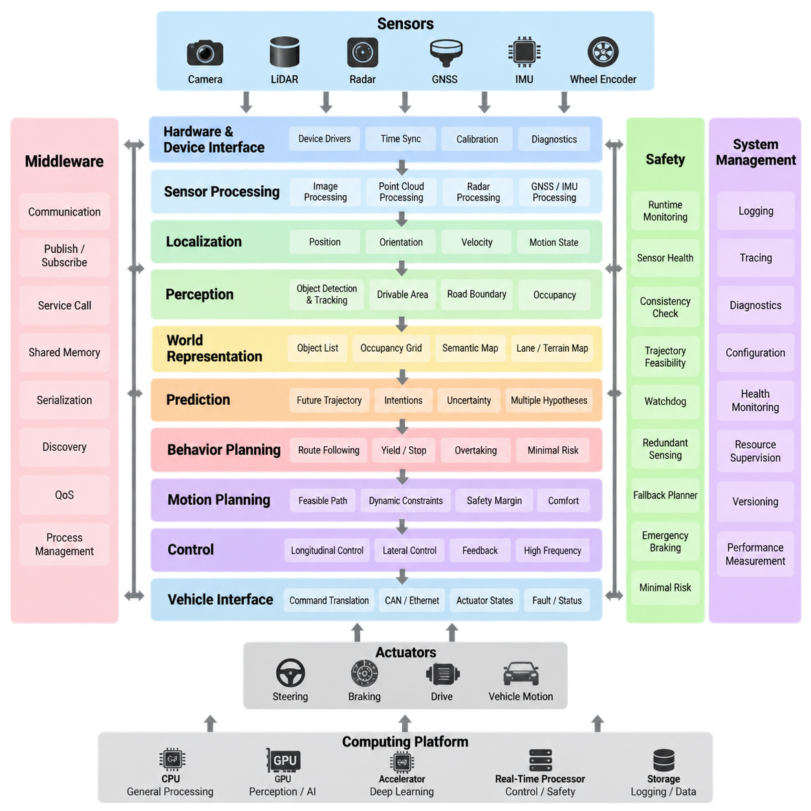
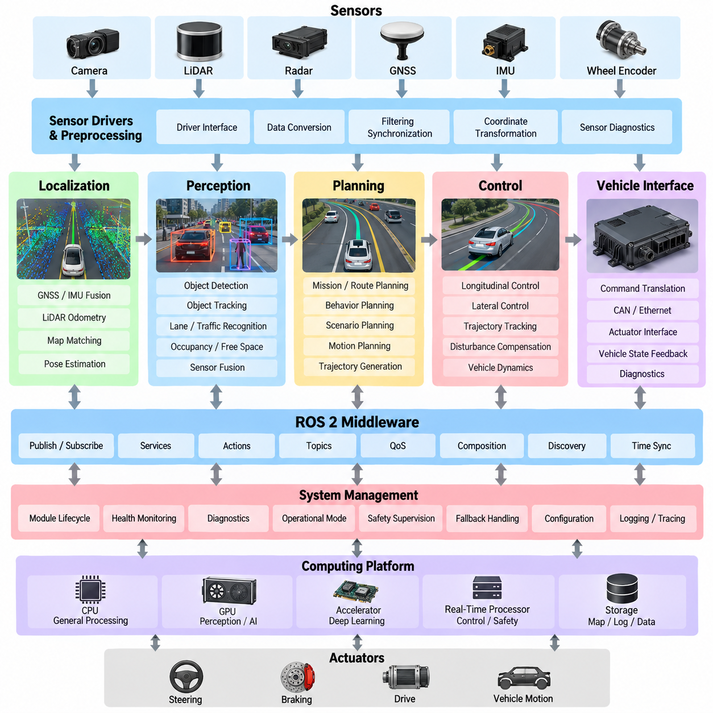
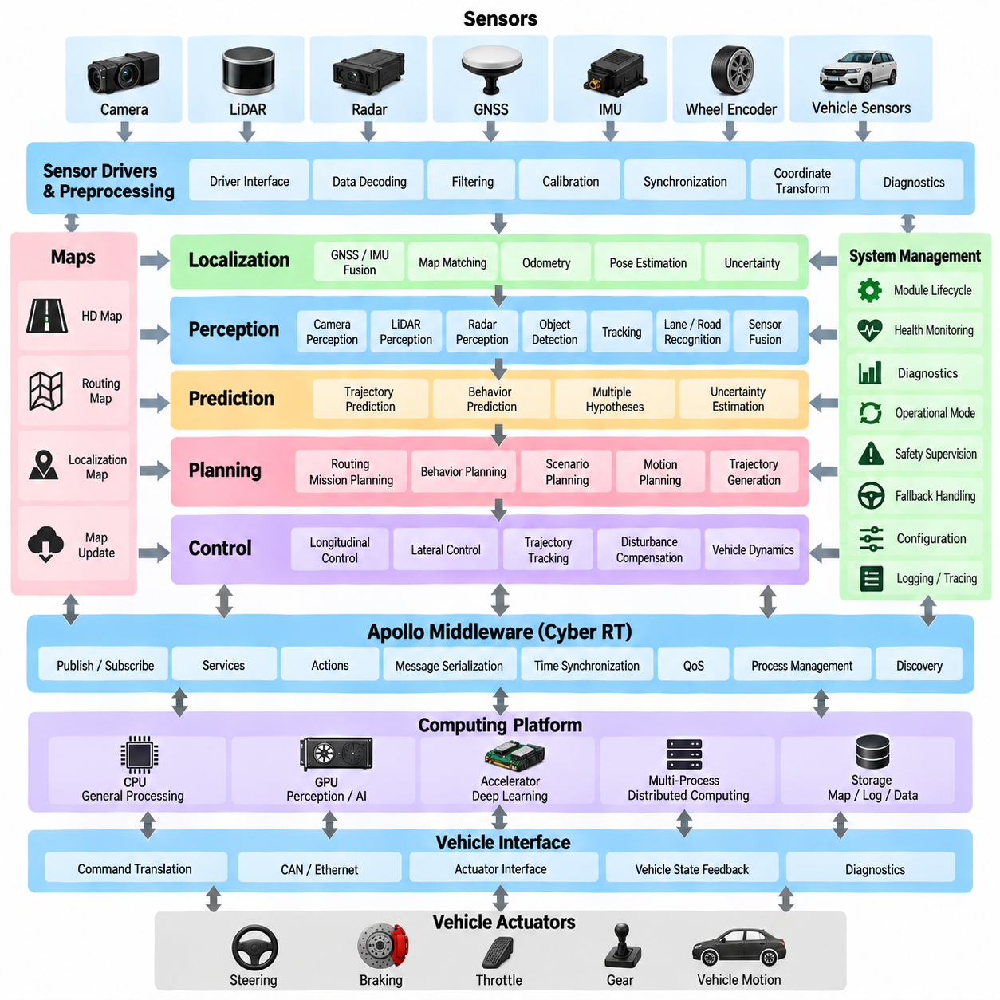
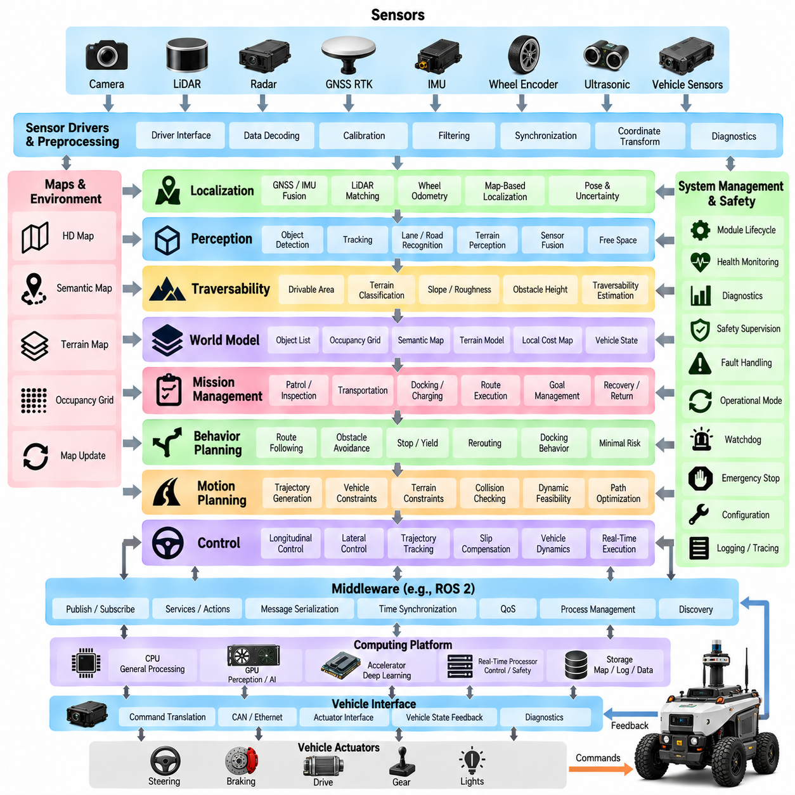
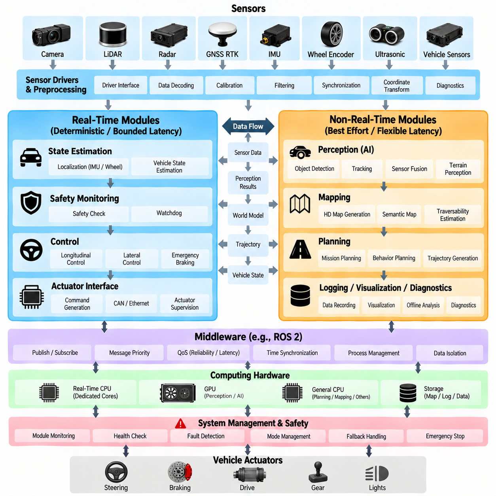
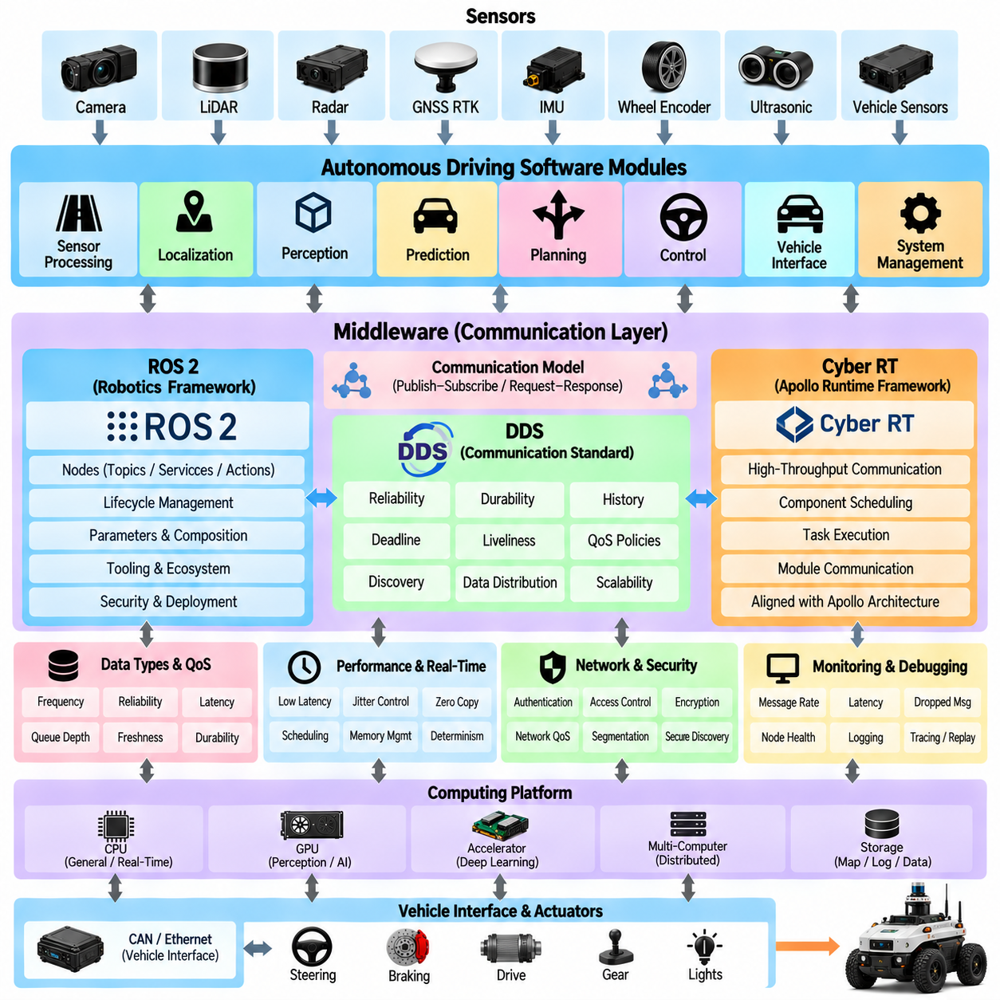
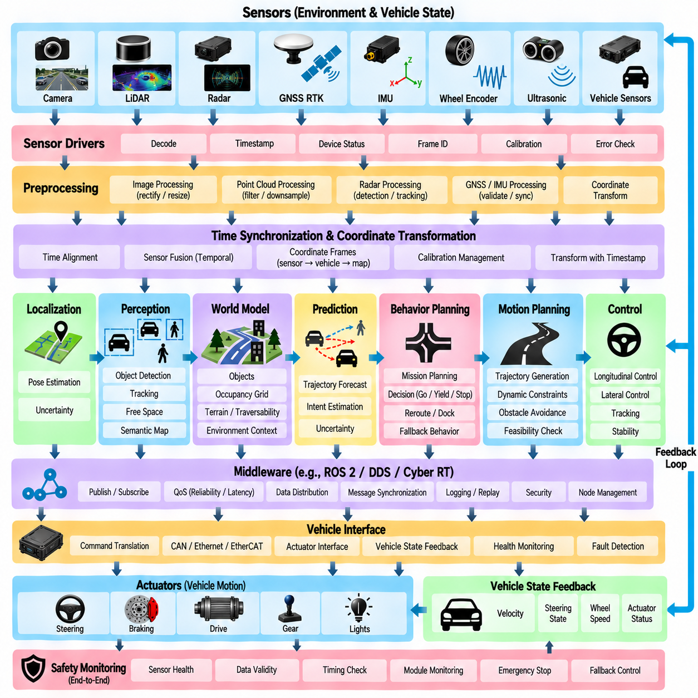
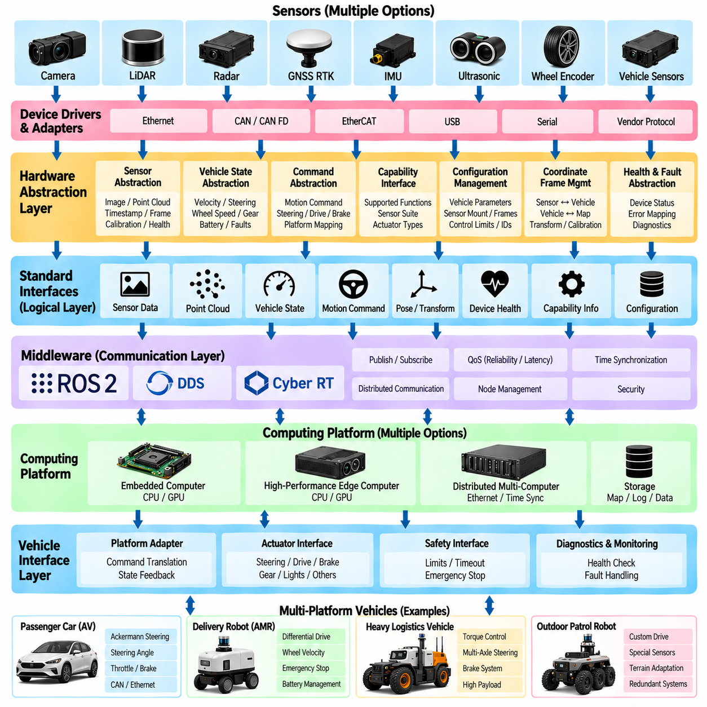
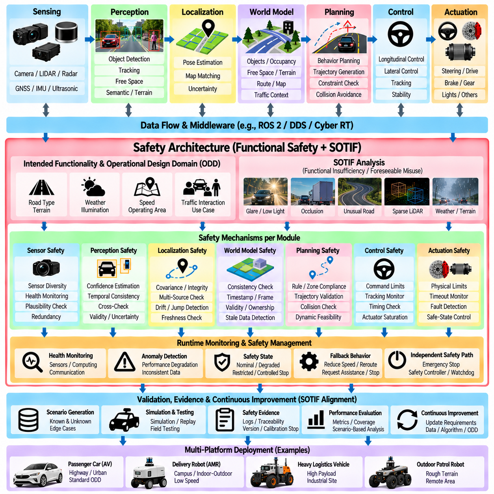
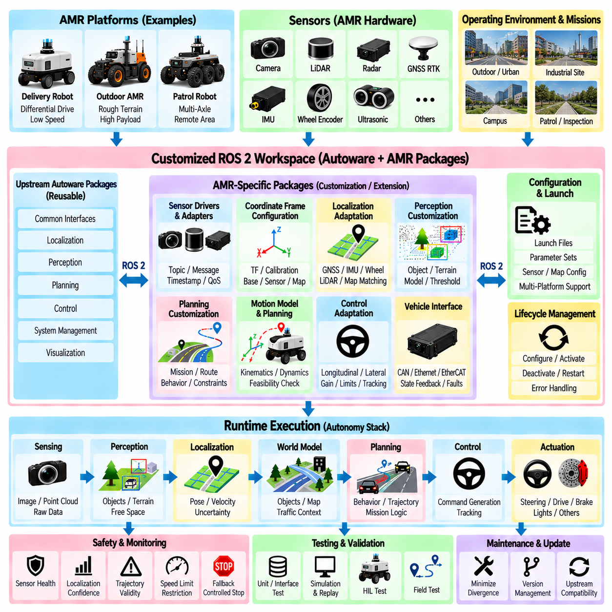

**Volume 12. Autonomous Driving Software**


# Chapter 02. AV Software Architecture

##  

## 02.01. AV SW Stack Layered Architecture Overview

{width="7.268055555555556in" height="7.268055555555556in"}

An autonomous vehicle software stack is commonly organized as a layered architecture in which each layer transforms information into progressively higher-level representations and actions. Raw physical signals enter through sensors, pass through hardware interfaces and processing modules, become an interpreted representation of the environment, and finally drive planning and control decisions. This decomposition allows complex autonomy software to be developed, tested, replaced, and validated as manageable subsystems.

At the lowest level, the hardware and device-interface layer connects computing platforms with cameras, LiDARs, radars, GNSS receivers, IMUs, wheel encoders, vehicle networks, and actuators. Device drivers convert hardware-specific protocols into standardized software interfaces while preserving timestamps, calibration parameters, diagnostic states, and sensor metadata. Hardware abstraction reduces dependencies between autonomy algorithms and particular sensor or vehicle configurations.

Above the device interfaces, the sensor-processing layer converts raw measurements into representations suitable for perception and localization. Camera pipelines may perform decoding, distortion correction, rectification, exposure handling, and image synchronization, while LiDAR pipelines perform point-cloud decoding, filtering, motion compensation, and coordinate transformation. Radar, GNSS, and inertial data undergo corresponding preprocessing before being distributed to downstream modules.

Time synchronization and coordinate management form important cross-layer services rather than isolated algorithms. Autonomous systems combine measurements generated at different frequencies, transported with different delays, and expressed in different coordinate frames. Accurate timestamps, clock synchronization, calibration, transformation trees, and latency tracking therefore determine whether apparently correct sensor measurements describe the same physical state when they are fused.

The localization layer estimates the vehicle\'s position, orientation, velocity, and motion state relative to a local or global reference. GNSS, RTK, IMU, wheel odometry, LiDAR matching, visual odometry, and map information may be combined according to the operational environment. The resulting vehicle-state estimate provides a common spatial reference for perception, mapping, prediction, planning, and control, making localization one of the central dependencies of the autonomy stack.

Perception transforms processed sensor data into an understanding of the surrounding environment. Typical outputs include detected and tracked objects, free space, drivable areas, road boundaries, terrain properties, semantic classes, occupancy representations, and obstacle geometry. Modern stacks increasingly combine camera, LiDAR, and radar information to improve coverage and robustness rather than relying on a single sensing modality, particularly under difficult environmental conditions.

A world representation layer organizes localization, perception, map, and vehicle-state information into a coherent model consumed by decision-making modules. Depending on the architecture, this representation may include object lists, occupancy grids, semantic maps, lane structures, terrain maps, or learned latent features. Separating world representation from individual perception algorithms helps downstream components operate against stable interfaces even when sensing algorithms evolve.

Prediction extends perception from understanding the current scene to estimating how relevant dynamic entities may evolve. It can estimate future positions, velocities, trajectories, intentions, or multiple possible behaviors of pedestrians, vehicles, bicycles, and other agents. Prediction uncertainty is especially important because planning should not treat every estimated future state as deterministic. The planning system must reason about plausible alternatives while maintaining safety margins.

Behavior planning determines what the autonomous system should do at a semantic level. Decisions may include following a route, yielding, stopping, overtaking, avoiding an obstacle, entering an intersection, approaching a docking location, or transitioning into a minimal-risk condition. Behavior logic may use finite-state machines, rule systems, optimization, probabilistic reasoning, machine learning, or hybrid methods while remaining constrained by operational and safety requirements.

Motion planning converts behavioral intent into a geometrically and dynamically feasible path or trajectory. It considers vehicle dimensions, kinematic and dynamic constraints, obstacle geometry, predicted agent motion, terrain conditions, speed limits, comfort, and safety margins. In outdoor AMRs, the planner may additionally account for uneven terrain, slopes, curbs, narrow passages, surface traversability, wheel slip, and restricted maneuvering areas that differ from conventional road-driving assumptions.

The control layer transforms a planned trajectory into commands that the physical platform can execute. Longitudinal control regulates velocity, acceleration, braking, or drive torque, while lateral control regulates steering or differential wheel motion depending on vehicle configuration. Feedback from odometry, steering, IMU, and actuator states closes the loop. Control typically operates at higher frequencies and tighter timing constraints than perception or behavioral planning.

A vehicle-interface layer bridges autonomy software and the drive-by-wire or robot motion system. It translates normalized commands such as target velocity, steering angle, acceleration, braking demand, or wheel torque into platform-specific CAN, Ethernet, serial, or controller messages. In the opposite direction, it publishes actuator states, wheel speeds, fault codes, battery information, emergency-stop status, and other feedback required by autonomy and safety software.

Middleware provides the communication fabric connecting these layers. Publish-subscribe messaging, service calls, shared memory, data serialization, discovery, quality-of-service policies, and process lifecycle management allow independently developed modules to operate as one distributed system. The attached structure treats middleware selection, real-time separation, sensor-to-actuation data flow, and hardware abstraction as dedicated architectural concerns within the AV software architecture chapter.

Safety functions should span the entire stack instead of being implemented as a single final layer. Runtime monitors can check sensor health, localization confidence, perception consistency, trajectory feasibility, communication status, actuator responses, and computing resources. Watchdogs, redundant sensing, fallback planners, emergency braking, safety cages, and minimal-risk behaviors provide independent mechanisms capable of restricting or overriding nominal autonomy when predefined safety conditions are violated.

System management and observability are similarly cross-cutting capabilities. Logging, tracing, diagnostics, configuration management, health monitoring, resource supervision, software versioning, and performance measurement allow engineers to understand the behavior of a distributed autonomy system. Recording timestamps and intermediate outputs across the processing chain is particularly valuable because failures observed at the actuator may originate much earlier in sensing, synchronization, localization, or planning.

Layered architecture does not imply that every module must execute sequentially. Production autonomy systems contain parallel pipelines, asynchronous data streams, feedback paths, shared services, GPU workloads, and real-time control loops operating at different frequencies. Camera perception may execute at tens of frames per second while low-level control operates much faster. Architecture must therefore define not only functional boundaries but also timing, scheduling, concurrency, and data ownership.

Real-time and non-real-time workloads should be separated according to their timing consequences. Vehicle control, emergency response, critical state estimation, and selected safety functions may require deterministic or bounded execution, whereas map management, logging, visualization, fleet communication, and some AI processing can tolerate greater latency variation. Explicit separation prevents computationally expensive perception or background services from interfering with time-critical vehicle functions.

Well-defined interfaces are therefore as important as individual algorithms. Every interface should specify message semantics, coordinate frames, units, timestamp conventions, update rates, validity states, uncertainty, timeout behavior, and failure handling. A perception message without a clear timestamp or coordinate frame can be more dangerous than a missing message because downstream software may interpret valid numerical values within the wrong temporal or spatial context.

The layered approach also supports portability across vehicle platforms. If algorithms depend on abstract vehicle-state, sensor, and actuator interfaces rather than vendor-specific hardware details, the same perception and planning software can be deployed on multiple AMR sizes or vehicle configurations. Platform-specific differences can remain within drivers, calibration packages, vehicle interfaces, and configuration data, reducing the amount of autonomy software that must be rewritten for each platform.

Deployment architecture must map these logical layers onto actual computing resources. Sensor processing and deep neural networks may execute on GPUs or dedicated accelerators, planning may execute on CPU cores, and safety-critical control may run on isolated processors or controllers. Communication between computing domains introduces additional latency and failure modes, so software architecture and hardware architecture must be designed together rather than treated as independent engineering activities.

A mature AV stack is ultimately a closed-loop cyber-physical system rather than a simple chain from sensors to actuators. Sensors observe the environment and vehicle, software constructs state and world representations, planning selects future motion, controllers generate commands, and physical motion changes the next sensor observations. Continuous feedback makes latency, uncertainty, synchronization, and failure propagation fundamental architectural properties rather than implementation details.

For outdoor AMRs, the classical AV layering remains useful but must be adapted to lower-speed yet highly variable operational environments. The software may need to handle mixed pedestrian spaces, unstructured roads, construction areas, slopes, rough surfaces, GNSS degradation, changing payloads, and docking or mission workflows. This explains why the broader volume separates architecture from sensor processing, drivable-area estimation, detection, behavior planning, trajectory generation, control, safety, localization, and SOTIF validation.

The most effective layered architecture therefore combines modular functional decomposition with explicit cross-layer contracts. Sensors, localization, perception, prediction, planning, control, and vehicle interfaces provide the main autonomy flow, while middleware, timing, safety, diagnostics, data management, and hardware abstraction support the entire stack. This structure creates a foundation on which individual algorithms can evolve without losing system-level traceability, deterministic behavior, testability, portability, and operational safety.

자율주행 차량(Autonomous Vehicle) 소프트웨어 스택(Software Stack)은 일반적으로 각 계층이 정보를 점진적으로 더 높은 수준의 표현과 동작으로 변환하는 계층형 아키텍처(Layered Architecture)로 구성된다. 물리적인 원시 신호(Raw Physical Signal)는 센서(Sensor)를 통해 입력되고, 하드웨어 인터페이스(Hardware Interface)와 처리 모듈(Processing Module)을 거쳐 환경에 대한 해석된 표현으로 변환된 후 최종적으로 계획(Planning)과 제어(Control) 결정으로 이어진다. 이러한 분해 구조를 통해 복잡한 자율주행 소프트웨어를 관리 가능한 서브시스템(Subsystem) 단위로 개발하고 시험하며 교체하고 검증할 수 있다.

가장 하위 수준에서 하드웨어 및 장치 인터페이스 계층(Hardware and Device-Interface Layer)은 컴퓨팅 플랫폼(Computing Platform)을 카메라(Camera), 라이다(LiDAR), 레이더(Radar), 위성항법시스템 수신기(GNSS Receiver), 관성측정장치(IMU), 휠 인코더(Wheel Encoder), 차량 네트워크(Vehicle Network), 액추에이터(Actuator)와 연결한다. 장치 드라이버(Device Driver)는 타임스탬프(Timestamp), 캘리브레이션 파라미터(Calibration Parameter), 진단 상태(Diagnostic State), 센서 메타데이터(Sensor Metadata)를 유지하면서 하드웨어별 프로토콜을 표준화된 소프트웨어 인터페이스로 변환한다. 하드웨어 추상화(Hardware Abstraction)는 자율주행 알고리즘과 특정 센서 또는 차량 구성 사이의 종속성을 줄인다.

장치 인터페이스 상위의 센서 처리 계층(Sensor-Processing Layer)은 원시 측정값을 인지(Perception)와 위치추정(Localization)에 적합한 표현으로 변환한다. 카메라 파이프라인(Camera Pipeline)은 디코딩(Decoding), 왜곡 보정(Distortion Correction), 정류(Rectification), 노출 처리(Exposure Handling), 영상 동기화(Image Synchronization)를 수행할 수 있으며, 라이다 파이프라인(LiDAR Pipeline)은 포인트 클라우드(Point Cloud) 디코딩, 필터링(Filtering), 모션 보상(Motion Compensation), 좌표 변환(Coordinate Transformation)을 수행한다. 레이더, GNSS, 관성 데이터(Inertial Data) 역시 하위 모듈로 전달되기 전에 각각 적절한 전처리(Preprocessing)를 수행한다.

시간 동기화(Time Synchronization)와 좌표 관리(Coordinate Management)는 독립된 알고리즘이라기보다 중요한 교차 계층 서비스(Cross-Layer Service)를 형성한다. 자율주행 시스템은 서로 다른 주기로 생성되고, 서로 다른 지연을 통해 전달되며, 서로 다른 좌표계(Coordinate Frame)로 표현되는 측정값을 결합한다. 따라서 정확한 타임스탬프, 클록 동기화(Clock Synchronization), 캘리브레이션, 변환 트리(Transformation Tree), 지연 추적(Latency Tracking)은 겉으로는 정상적인 센서 측정값들이 융합될 때 실제로 동일한 물리적 상태를 나타내는지를 결정한다.

위치추정 계층(Localization Layer)은 로컬 또는 글로벌 기준에 대한 차량의 위치(Position), 자세(Orientation), 속도(Velocity), 운동 상태(Motion State)를 추정한다. 운용 환경(Operational Environment)에 따라 GNSS, 실시간 이동측위(RTK), IMU, 휠 오도메트리(Wheel Odometry), 라이다 정합(LiDAR Matching), 비주얼 오도메트리(Visual Odometry), 지도 정보(Map Information)를 결합할 수 있다. 이렇게 생성된 차량 상태 추정값(Vehicle-State Estimate)은 인지, 매핑(Mapping), 예측(Prediction), 계획, 제어에 공통 공간 기준을 제공하므로 위치추정은 자율주행 스택의 핵심적인 의존 요소 가운데 하나가 된다.

인지(Perception)는 처리된 센서 데이터를 주변 환경에 대한 이해로 변환한다. 일반적인 출력에는 검출 및 추적 객체(Detected and Tracked Object), 자유 공간(Free Space), 주행 가능 영역(Drivable Area), 도로 경계(Road Boundary), 지형 특성(Terrain Property), 의미 클래스(Semantic Class), 점유 표현(Occupancy Representation), 장애물 형상(Obstacle Geometry) 등이 포함된다. 현대적인 스택은 특히 어려운 환경 조건에서 단일 센싱 방식에 의존하기보다 카메라, 라이다, 레이더 정보를 결합하여 탐지 범위와 강건성(Robustness)을 향상시키는 방향으로 발전하고 있다.

월드 표현 계층(World Representation Layer)은 위치추정, 인지, 지도(Map), 차량 상태 정보를 의사결정 모듈(Decision-Making Module)이 사용할 수 있는 일관된 모델로 구성한다. 아키텍처에 따라 객체 목록(Object List), 점유 격자(Occupancy Grid), 의미 지도(Semantic Map), 차선 구조(Lane Structure), 지형 지도(Terrain Map), 학습된 잠재 특징(Learned Latent Feature) 등이 포함될 수 있다. 개별 인지 알고리즘으로부터 월드 표현을 분리하면 센싱 알고리즘이 변경되더라도 하위 의사결정 컴포넌트가 안정적인 인터페이스를 기반으로 동작할 수 있다.

예측(Prediction)은 현재 장면을 이해하는 인지 기능을 확장하여 관련 동적 객체(Dynamic Entity)가 앞으로 어떻게 변화할지를 추정한다. 보행자(Pedestrian), 차량(Vehicle), 자전거(Bicycle) 및 기타 에이전트(Agent)의 미래 위치, 속도, 궤적(Trajectory), 의도(Intention) 또는 여러 가능한 행동을 추정할 수 있다. 계획 시스템은 모든 미래 상태 추정치를 결정론적(Deterministic)으로 취급해서는 안 되므로 예측 불확실성(Prediction Uncertainty)이 특히 중요하다. 계획 시스템은 안전 여유(Safety Margin)를 유지하면서 여러 가능한 미래 상황을 고려해야 한다.

행동 계획(Behavior Planning)은 자율주행 시스템이 의미적 수준(Semantic Level)에서 무엇을 수행해야 하는지를 결정한다. 여기에는 경로 추종(Route Following), 양보(Yielding), 정지(Stopping), 추월(Overtaking), 장애물 회피(Obstacle Avoidance), 교차로 진입(Intersection Entry), 도킹 위치 접근(Docking Approach), 최소 위험 상태(Minimal-Risk Condition)로의 전환 등이 포함될 수 있다. 행동 로직(Behavior Logic)은 유한상태기계(Finite-State Machine), 규칙 시스템(Rule System), 최적화(Optimization), 확률적 추론(Probabilistic Reasoning), 머신러닝(Machine Learning), 또는 하이브리드 방법(Hybrid Method)을 사용할 수 있으며 운용 및 안전 요구사항의 제약을 받아야 한다.

모션 계획(Motion Planning)은 행동 의도를 기하학적 및 동역학적으로 실행 가능한 경로(Path) 또는 궤적(Trajectory)으로 변환한다. 차량 크기, 운동학적 및 동역학적 제약(Kinematic and Dynamic Constraint), 장애물 형상, 예측된 에이전트 움직임, 지형 조건, 속도 제한, 승차감(Comfort), 안전 여유를 고려한다. 야외 자율이동로봇(Outdoor AMR)의 경우 일반적인 도로 주행 가정과 달리 불규칙 지형(Uneven Terrain), 경사(Slope), 연석(Curb), 좁은 통로(Narrow Passage), 지면 주행성(Surface Traversability), 휠 슬립(Wheel Slip), 제한된 기동 공간(Restricted Maneuvering Area) 등을 추가로 고려할 수 있다.

제어 계층(Control Layer)은 계획된 궤적을 실제 플랫폼이 실행할 수 있는 명령으로 변환한다. 종방향 제어(Longitudinal Control)는 속도, 가속도, 제동 또는 구동 토크(Drive Torque)를 조절하며, 횡방향 제어(Lateral Control)는 차량 구성에 따라 조향(Steering) 또는 차동 휠 운동(Differential Wheel Motion)을 제어한다. 오도메트리, 조향, IMU, 액추에이터 상태로부터의 피드백(Feedback)이 폐루프(Closed Loop)를 구성한다. 일반적으로 제어는 인지나 행동 계획보다 높은 주파수와 더 엄격한 시간 제약 조건에서 동작한다.

차량 인터페이스 계층(Vehicle-Interface Layer)은 자율주행 소프트웨어와 드라이브 바이 와이어(Drive-by-Wire) 또는 로봇 모션 시스템(Robot Motion System)을 연결한다. 목표 속도, 조향각, 가속도, 제동 요구량, 휠 토크와 같은 정규화된 명령(Normalized Command)을 플랫폼별 CAN, 이더넷(Ethernet), 직렬 통신(Serial), 또는 컨트롤러 메시지(Controller Message)로 변환한다. 반대 방향으로는 액추에이터 상태, 휠 속도, 고장 코드(Fault Code), 배터리 정보, 비상 정지(Emergency Stop) 상태 및 자율주행과 안전 소프트웨어에 필요한 기타 피드백을 제공한다.

미들웨어(Middleware)는 이러한 계층들을 연결하는 통신 기반(Communication Fabric)을 제공한다. 발행-구독 메시징(Publish-Subscribe Messaging), 서비스 호출(Service Call), 공유 메모리(Shared Memory), 데이터 직렬화(Data Serialization), 디스커버리(Discovery), 서비스 품질 정책(Quality-of-Service Policy), 프로세스 생명주기 관리(Process Lifecycle Management)를 통해 독립적으로 개발된 모듈들이 하나의 분산 시스템(Distributed System)으로 동작할 수 있다. 자율주행 소프트웨어 아키텍처에서는 미들웨어 선택, 실시간 분리(Real-Time Separation), 센서에서 액추에이션까지의 데이터 흐름(Sensor-to-Actuation Data Flow), 하드웨어 추상화를 주요 아키텍처 요소로 다룬다.

안전 기능(Safety Function)은 하나의 최종 계층으로 구현되기보다 전체 스택을 가로질러 적용되어야 한다. 런타임 모니터(Runtime Monitor)는 센서 상태, 위치추정 신뢰도(Localization Confidence), 인지 일관성(Perception Consistency), 궤적 실행 가능성(Trajectory Feasibility), 통신 상태, 액추에이터 응답, 컴퓨팅 자원을 검사할 수 있다. 워치독(Watchdog), 중복 센싱(Redundant Sensing), 폴백 플래너(Fallback Planner), 비상 제동(Emergency Braking), 안전 케이지(Safety Cage), 최소 위험 행동(Minimal-Risk Behavior)은 사전에 정의된 안전 조건이 위반될 경우 정상 자율주행 기능을 제한하거나 재정의할 수 있는 독립적인 메커니즘을 제공한다.

시스템 관리(System Management)와 관측 가능성(Observability) 역시 교차 계층 기능(Cross-Cutting Capability)에 해당한다. 로깅(Logging), 트레이싱(Tracing), 진단(Diagnostics), 구성 관리(Configuration Management), 상태 모니터링(Health Monitoring), 자원 감독(Resource Supervision), 소프트웨어 버전 관리(Software Versioning), 성능 측정(Performance Measurement)을 통해 엔지니어는 분산형 자율주행 시스템의 동작을 이해할 수 있다. 특히 전체 처리 체인에서 타임스탬프와 중간 출력을 기록하면 액추에이터에서 관찰된 문제가 실제로는 센싱, 동기화, 위치추정 또는 계획 단계에서 시작되었는지를 추적하는 데 유용하다.

계층형 아키텍처가 모든 모듈이 순차적으로 실행되어야 함을 의미하지는 않는다. 실제 자율주행 시스템에는 서로 다른 주기로 동작하는 병렬 파이프라인(Parallel Pipeline), 비동기 데이터 스트림(Asynchronous Data Stream), 피드백 경로(Feedback Path), 공유 서비스(Shared Service), GPU 워크로드(GPU Workload), 실시간 제어 루프(Real-Time Control Loop)가 존재한다. 카메라 인지는 초당 수십 프레임으로 실행될 수 있지만 저수준 제어는 훨씬 높은 주파수로 동작할 수 있다. 따라서 아키텍처는 기능적 경계뿐만 아니라 타이밍(Timing), 스케줄링(Scheduling), 동시성(Concurrency), 데이터 소유권(Data Ownership)도 정의해야 한다.

실시간(Real-Time) 및 비실시간(Non-Real-Time) 워크로드는 각각의 타이밍 특성이 시스템에 미치는 영향에 따라 분리해야 한다. 차량 제어, 비상 대응, 핵심 상태 추정(Critical State Estimation), 일부 안전 기능은 결정론적 또는 제한된 실행 시간(Deterministic or Bounded Execution)을 요구할 수 있는 반면, 지도 관리, 로깅, 시각화(Visualization), 플릿 통신(Fleet Communication), 일부 AI 처리는 더 큰 지연 변동을 허용할 수 있다. 이러한 명확한 분리는 계산량이 큰 인지 처리나 백그라운드 서비스가 시간 임계 차량 기능(Time-Critical Vehicle Function)을 방해하는 것을 방지한다.

따라서 잘 정의된 인터페이스(Well-Defined Interface)는 개별 알고리즘만큼 중요하다. 각 인터페이스는 메시지 의미(Message Semantics), 좌표계, 단위(Unit), 타임스탬프 규칙(Timestamp Convention), 업데이트 주기(Update Rate), 유효 상태(Validity State), 불확실성(Uncertainty), 타임아웃 동작(Timeout Behavior), 고장 처리(Failure Handling)를 명확하게 정의해야 한다. 명확한 타임스탬프나 좌표계가 없는 인지 메시지는 단순히 메시지가 없는 경우보다 더 위험할 수 있는데, 이는 하위 소프트웨어가 정상적인 수치 값을 잘못된 시간적 또는 공간적 맥락에서 해석할 수 있기 때문이다.

계층형 접근 방식(Layered Approach)은 여러 차량 플랫폼 간의 이식성(Portability)도 지원한다. 알고리즘이 특정 공급업체의 하드웨어 세부사항 대신 추상화된 차량 상태, 센서 및 액추에이터 인터페이스에 의존한다면 동일한 인지 및 계획 소프트웨어를 다양한 크기의 AMR이나 서로 다른 차량 구성에 배포할 수 있다. 플랫폼별 차이는 드라이버, 캘리브레이션 패키지(Calibration Package), 차량 인터페이스, 구성 데이터(Configuration Data)에 한정할 수 있어 각 플랫폼마다 다시 작성해야 하는 자율주행 소프트웨어의 양을 줄일 수 있다.

배포 아키텍처(Deployment Architecture)는 이러한 논리 계층(Logical Layer)을 실제 컴퓨팅 자원에 매핑해야 한다. 센서 처리와 심층신경망(Deep Neural Network)은 GPU 또는 전용 가속기(Dedicated Accelerator)에서 실행될 수 있고, 계획은 CPU 코어에서 실행될 수 있으며, 안전 핵심 제어(Safety-Critical Control)는 격리된 프로세서나 컨트롤러에서 실행될 수 있다. 컴퓨팅 영역 간 통신은 추가적인 지연과 고장 모드(Failure Mode)를 발생시키므로 소프트웨어 아키텍처와 하드웨어 아키텍처는 서로 독립적인 엔지니어링 영역이 아니라 함께 설계되어야 한다.

성숙한 자율주행 스택(AV Stack)은 궁극적으로 센서에서 액추에이터로 이어지는 단순한 처리 체인이 아니라 폐루프 사이버 물리 시스템(Closed-Loop Cyber-Physical System)이다. 센서는 환경과 차량을 관측하고, 소프트웨어는 상태 및 월드 표현을 구성하며, 계획 모듈은 미래 움직임을 선택하고, 컨트롤러는 명령을 생성하며, 실제 차량의 움직임은 다시 다음 센서 관측을 변화시킨다. 이러한 지속적인 피드백 구조 때문에 지연, 불확실성, 동기화, 고장 전파(Failure Propagation)는 단순한 구현 세부사항이 아니라 핵심적인 아키텍처 특성이 된다.

야외 자율이동로봇(Outdoor AMR)의 경우 전통적인 자율주행 계층 구조는 여전히 유용하지만, 상대적으로 낮은 속도와 매우 다양한 운용 환경에 맞게 조정되어야 한다. 소프트웨어는 보행자 혼재 공간(Mixed Pedestrian Space), 비정형 도로(Unstructured Road), 건설 현장, 경사로, 거친 노면(Rough Surface), GNSS 성능 저하(GNSS Degradation), 변화하는 페이로드(Payload), 도킹 및 임무 워크플로(Docking and Mission Workflow)를 처리해야 할 수 있다. 이러한 특성 때문에 전체 자율주행 소프트웨어 구조에서는 아키텍처를 센서 처리, 주행 가능 영역 추정, 객체 검출, 행동 계획, 궤적 생성, 제어, 안전, 위치추정, 의도된 기능의 안전성(SOTIF) 검증과 구분하여 체계적으로 다룬다.

따라서 효과적인 계층형 아키텍처는 모듈화된 기능 분해(Modular Functional Decomposition)와 명시적인 교차 계층 계약(Cross-Layer Contract)을 결합한다. 센서, 위치추정, 인지, 예측, 계획, 제어, 차량 인터페이스가 주요 자율주행 흐름을 구성하며, 미들웨어, 타이밍, 안전, 진단, 데이터 관리(Data Management), 하드웨어 추상화가 전체 스택을 지원한다. 이러한 구조는 개별 알고리즘이 지속적으로 발전하더라도 시스템 수준의 추적 가능성(Traceability), 결정론적 동작(Deterministic Behavior), 시험 가능성(Testability), 이식성, 운용 안전성(Operational Safety)을 유지할 수 있는 기반을 제공한다.

##  

## 02.02. Autoware Universe Architecture and Module Map [w/Code]

{width="7.268055555555556in" height="7.268055555555556in"}

Autoware Universe is organized as a modular autonomous-driving software platform in which perception, localization, planning, control, vehicle interface, and system-management functions are separated into cooperating software components. Its architecture follows the general autonomous-driving software-stack concept, but provides a practical implementation structure in which individual functions can be developed, tested, configured, and replaced without redesigning the entire system. This modularity is particularly important for adapting the stack to different vehicles, sensors, operational environments, and autonomy requirements.

At the foundation of the architecture, ROS 2 provides the communication and execution framework connecting autonomous-driving modules. Nodes or composable components exchange structured messages through publish-subscribe communication, services, and actions. Topics carry continuously changing information such as sensor measurements, localization states, detected objects, trajectories, and vehicle states. The middleware therefore acts as the communication backbone that allows independently developed modules to operate as one distributed autonomy system.

The sensing portion of the module map receives raw information from cameras, LiDARs, radars, GNSS receivers, IMUs, and vehicle sensors. Sensor drivers and preprocessing components convert hardware-specific data into standardized representations that downstream modules can consume. Typical processing includes point-cloud filtering, image preprocessing, coordinate transformation, synchronization, and sensor-specific feature extraction. The separation between hardware drivers and higher-level autonomy functions allows different sensor configurations to be integrated without rewriting the complete software stack.

Localization modules estimate the vehicle\'s pose and motion relative to a map or reference coordinate system. Autoware-based systems can combine GNSS, IMU, wheel odometry, LiDAR matching, and other available measurements depending on the deployment environment. Localization outputs provide the spatial reference required by perception and planning. The architecture must therefore maintain consistent coordinate frames, timestamps, covariance or confidence information, and state validity so that downstream modules can determine whether the estimated vehicle state is suitable for autonomous operation.

The perception section transforms sensor observations into structured environmental information. Its module map can contain object detection, object tracking, traffic-related recognition, point-cloud processing, occupancy or free-space estimation, and other scene-understanding functions. Camera and LiDAR perception may operate independently or contribute to sensor-fusion pipelines. The resulting objects and environmental representations are published through defined interfaces so that prediction and planning modules do not need to know the internal implementation details of each perception algorithm.

Planning is generally divided into multiple levels because an autonomous vehicle must first determine an appropriate behavior and then generate a physically executable motion. Mission or route planning establishes the intended route, while behavior and scenario-level planning determine decisions such as stopping, yielding, following, avoiding obstacles, or changing lanes where applicable. Motion planning then generates a trajectory that satisfies vehicle constraints and environmental conditions. This separation prevents high-level decisions from becoming unnecessarily coupled to low-level trajectory generation.

Trajectory planning connects behavioral decisions with vehicle control. A trajectory normally contains spatial and temporal information such as position, orientation, velocity, acceleration, and sometimes curvature or additional dynamic constraints. The planner evaluates collision risk, vehicle dimensions, road or terrain constraints, and trajectory feasibility before publishing a candidate motion. The control system then attempts to follow this trajectory rather than directly interpreting high-level behavioral commands, creating a clear boundary between planning and physical execution.

The control portion converts the planned trajectory into commands appropriate for the vehicle platform. Longitudinal control manages velocity, acceleration, and braking-related behavior, while lateral control manages steering or equivalent directional motion. Controllers use vehicle-state feedback to compensate for disturbances, modeling errors, actuator delay, and trajectory-tracking errors. Because control is timing-sensitive, its execution requirements differ from computationally intensive perception or map-processing functions, making scheduling, latency, and deterministic communication important architectural considerations.

The vehicle interface forms the boundary between Autoware software and the actual vehicle control system. It translates abstract autonomy commands into platform-specific signals and receives feedback such as vehicle velocity, steering state, acceleration, gear state, actuator status, and diagnostic information. A properly designed vehicle interface isolates hardware and vehicle-specific implementation from the rest of the autonomy stack. This allows a common planning and perception architecture to be reused across different vehicle platforms while replacing only the necessary interface and configuration components.

System-management modules coordinate the operational state of the autonomous-driving system. They can manage module activation, lifecycle states, health information, operational modes, diagnostics, and transitions between autonomous and fallback conditions. A complete autonomy stack must know not only what each module calculates but also whether the module is alive, producing valid data, and operating within its expected timing and quality limits. System management therefore provides an important supervisory layer above individual functional modules.

The module map should also be understood as a data-flow architecture rather than merely a collection of software packages. Sensor data moves toward perception and localization, these modules produce environmental and vehicle-state representations, planning consumes those representations to generate a trajectory, and control converts the trajectory into vehicle commands. Feedback then returns through vehicle-state measurements and updated environmental observations. This closed-loop flow means that message definitions, timestamps, coordinate frames, update frequencies, quality-of-service settings, and failure states are fundamental parts of the architecture.

For practical customization, Autoware Universe allows a deployment to select and configure the modules appropriate for its operational design domain rather than treating every available capability as mandatory. An outdoor AMR, for example, may require LiDAR-based localization, terrain-aware perception, drivable-area estimation, obstacle tracking, and low-speed trajectory control while not requiring every road-vehicle function. The architecture can therefore be interpreted as a reusable autonomy framework whose modules are assembled according to vehicle characteristics, sensor configuration, mission requirements, and environmental constraints.

The most important architectural concept is the separation of responsibilities combined with well-defined interfaces. Perception should produce environmental information, localization should provide vehicle state, planning should determine feasible future motion, control should execute that motion, and the vehicle interface should translate software commands into physical actuation. ROS 2 communication connects these responsibilities while system management and safety-related mechanisms supervise their operation. This structure makes Autoware Universe useful not simply as a collection of algorithms, but as a reference architecture for constructing and customizing complete autonomous-driving systems.

Autoware Universe는 인지(Perception), 위치추정(Localization), 계획(Planning), 제어(Control), 차량 인터페이스(Vehicle Interface), 시스템 관리(System Management) 기능을 서로 협력하는 소프트웨어 컴포넌트(Software Component)로 분리한 모듈형 자율주행 소프트웨어 플랫폼(Modular Autonomous-Driving Software Platform)으로 구성된다. 그 아키텍처는 일반적인 자율주행 소프트웨어 스택(Autonomous-Driving Software Stack)의 개념을 따르면서도 개별 기능을 전체 시스템을 다시 설계하지 않고 개발, 시험, 구성, 교체할 수 있는 실용적인 구현 구조를 제공한다. 이러한 모듈성(Modularity)은 서로 다른 차량, 센서, 운용 환경(Operational Environment), 자율주행 요구사항에 맞게 스택을 조정하는 데 특히 중요하다.

아키텍처의 기반에서 ROS 2는 자율주행 모듈들을 연결하는 통신 및 실행 프레임워크(Communication and Execution Framework)를 제공한다. 노드(Node) 또는 컴포저블 컴포넌트(Composable Component)는 발행-구독 통신(Publish-Subscribe Communication), 서비스(Service), 액션(Action)을 통해 구조화된 메시지(Structured Message)를 교환한다. 토픽(Topic)은 센서 측정값, 위치추정 상태, 검출 객체, 궤적(Trajectory), 차량 상태와 같이 지속적으로 변화하는 정보를 전달한다. 따라서 미들웨어(Middleware)는 독립적으로 개발된 모듈들이 하나의 분산 자율주행 시스템(Distributed Autonomy System)으로 동작할 수 있도록 하는 통신 백본(Communication Backbone) 역할을 한다.

센싱 부분(Sensing Portion)은 카메라(Camera), 라이다(LiDAR), 레이더(Radar), GNSS 수신기(GNSS Receiver), IMU 및 차량 센서(Vehicle Sensor)로부터 원시 정보를 수신한다. 센서 드라이버(Sensor Driver)와 전처리 컴포넌트(Preprocessing Component)는 하드웨어별 데이터를 하위 모듈에서 사용할 수 있는 표준화된 표현(Standardized Representation)으로 변환한다. 일반적인 처리에는 포인트 클라우드(Point Cloud) 필터링, 영상 전처리(Image Preprocessing), 좌표 변환(Coordinate Transformation), 동기화(Synchronization), 센서별 특징 추출(Feature Extraction)이 포함된다. 하드웨어 드라이버와 상위 자율주행 기능을 분리하면 전체 소프트웨어 스택을 다시 작성하지 않고도 서로 다른 센서 구성을 통합할 수 있다.

위치추정 모듈(Localization Module)은 지도(Map) 또는 기준 좌표계(Reference Coordinate System)에 대한 차량의 자세(Pose)와 운동(Motion)을 추정한다. Autoware 기반 시스템은 배포 환경에 따라 GNSS, IMU, 휠 오도메트리(Wheel Odometry), 라이다 정합(LiDAR Matching) 및 기타 이용 가능한 측정값을 결합할 수 있다. 위치추정 출력은 인지와 계획에 필요한 공간적 기준(Spatial Reference)을 제공한다. 따라서 아키텍처는 일관된 좌표 프레임(Coordinate Frame), 타임스탬프(Timestamp), 공분산(Covariance) 또는 신뢰도 정보(Confidence Information), 상태 유효성(State Validity)을 유지해야 하며, 하위 모듈이 추정된 차량 상태가 자율주행에 적합한지를 판단할 수 있도록 해야 한다.

인지 부분(Perception Section)은 센서 관측값을 구조화된 환경 정보(Structured Environmental Information)로 변환한다. 모듈 맵(Module Map)에는 객체 검출(Object Detection), 객체 추적(Object Tracking), 교통 관련 인식(Traffic-Related Recognition), 포인트 클라우드 처리(Point-Cloud Processing), 점유(Occupancy) 또는 자유 공간(Free-Space) 추정 및 기타 장면 이해(Scene Understanding) 기능이 포함될 수 있다. 카메라 및 라이다 인지는 독립적으로 동작하거나 센서 융합(Sensor Fusion) 파이프라인에 함께 기여할 수 있다. 생성된 객체 및 환경 표현(Environmental Representation)은 정의된 인터페이스를 통해 발행되므로 예측(Prediction) 및 계획(Planning) 모듈은 각 인지 알고리즘의 내부 구현 세부사항을 알 필요가 없다.

계획(Planning)은 자율주행 차량이 먼저 적절한 행동을 결정한 다음 물리적으로 실행 가능한 움직임을 생성해야 하기 때문에 일반적으로 여러 수준으로 분리된다. 미션 또는 경로 계획(Mission or Route Planning)은 의도된 주행 경로를 설정하고, 행동 및 시나리오 수준 계획(Behavior and Scenario-Level Planning)은 정지, 양보, 장애물 회피, 차선 변경 등과 같은 결정을 수행한다. 이후 모션 계획(Motion Planning)은 차량 제약조건과 환경 조건을 만족하는 궤적을 생성한다. 이러한 분리는 높은 수준의 의사결정이 낮은 수준의 궤적 생성과 불필요하게 결합되는 것을 방지한다.

궤적 계획(Trajectory Planning)은 행동 결정과 차량 제어 사이를 연결한다. 궤적에는 일반적으로 위치(Position), 자세(Orientation), 속도(Velocity), 가속도(Acceleration), 그리고 경우에 따라 곡률(Curvature)이나 추가적인 동역학 제약(Dynamic Constraint)과 같은 공간적 및 시간적 정보가 포함된다. 계획기는 충돌 위험(Collision Risk), 차량 크기, 도로 또는 지형 제약, 속도 및 궤적 실행 가능성을 평가한 후 후보 움직임을 발행한다. 이후 제어 시스템은 높은 수준의 행동 명령을 직접 해석하는 것이 아니라 이 궤적을 추종하여 명확한 계획-제어 경계를 형성한다.

제어 부분(Control Portion)은 계획된 궤적을 차량 플랫폼에 적합한 명령으로 변환한다. 종방향 제어(Longitudinal Control)는 속도, 가속도, 제동 관련 동작을 관리하고, 횡방향 제어(Lateral Control)는 조향(Steering) 또는 이와 동등한 방향성 움직임을 관리한다. 제어기는 차량 상태 피드백(Vehicle-State Feedback)을 사용하여 외란(Disturbance), 모델링 오차(Modeling Error), 액추에이터 지연(Actuator Delay), 궤적 추종 오차(Trajectory-Tracking Error)를 보상한다. 제어는 시간에 민감한 기능이므로 계산량이 큰 인지 또는 지도 처리 기능과는 실행 요구사항이 다르며, 이에 따라 스케줄링, 지연, 결정론적 통신(Deterministic Communication)이 중요한 아키텍처 고려사항이 된다.

차량 인터페이스(Vehicle Interface)는 Autoware 소프트웨어와 실제 차량 제어 시스템 사이의 경계를 형성한다. 추상화된 자율주행 명령(Autonomy Command)을 플랫폼별 신호로 변환하고 차량 속도, 조향 상태, 가속도, 기어 상태, 액추에이터 상태, 진단 정보(Diagnostic Information)와 같은 피드백을 수신한다. 적절하게 설계된 차량 인터페이스는 하드웨어 및 차량별 구현을 자율주행 스택의 나머지 부분으로부터 격리한다. 이를 통해 필요한 인터페이스와 구성 컴포넌트만 교체하면서 서로 다른 차량 플랫폼에서 공통적인 계획 및 인지 아키텍처를 재사용할 수 있다.

시스템 관리 모듈(System-Management Module)은 자율주행 시스템의 운용 상태(Operational State)를 관리한다. 모듈 활성화(Module Activation), 생명주기 상태(Lifecycle State), 상태 정보(Health Information), 운용 모드(Operational Mode), 진단(Diagnostics), 자율주행과 폴백 상태(Fallback Condition) 사이의 전환을 관리할 수 있다. 완전한 자율주행 스택은 각 모듈이 무엇을 계산하는지뿐만 아니라 해당 모듈이 정상적으로 실행되고 있는지, 유효한 데이터를 생성하는지, 예상된 시간 및 품질 범위 내에서 동작하는지도 알아야 한다. 따라서 시스템 관리는 개별 기능 모듈 상위에서 중요한 감독 계층(Supervisory Layer)을 제공한다.

모듈 맵은 단순히 소프트웨어 패키지의 집합이 아니라 데이터 흐름 아키텍처(Data-Flow Architecture)로 이해해야 한다. 센서 데이터는 인지 및 위치추정으로 이동하고, 이 모듈들은 환경 및 차량 상태 표현을 생성하며, 계획은 이러한 표현을 사용하여 궤적을 생성하고, 제어는 궤적을 차량 명령으로 변환한다. 이후 피드백은 차량 상태 측정값과 갱신된 환경 관측을 통해 다시 입력된다. 이러한 폐루프 흐름(Closed-Loop Flow) 때문에 메시지 정의(Message Definition), 타임스탬프, 좌표 프레임, 업데이트 주기, 서비스 품질 설정(Quality-of-Service Setting), 고장 상태(Failure State)는 아키텍처의 핵심 요소가 된다.

실제 커스터마이징(Customization)을 위해 Autoware Universe는 모든 기능을 필수적으로 사용하는 대신 운용 설계 영역(Operational Design Domain)에 적합한 모듈을 선택하고 구성할 수 있도록 한다. 예를 들어 야외 자율이동로봇(Outdoor AMR)은 모든 도로 차량 기능을 필요로 하지 않으면서도 라이다 기반 위치추정, 지형 인지(Terrain-Aware Perception), 주행 가능 영역 추정(Drivable-Area Estimation), 장애물 추적, 저속 궤적 제어 등을 필요로 할 수 있다. 따라서 이 아키텍처는 차량 특성, 센서 구성, 임무 요구사항, 환경 제약에 따라 모듈을 조합할 수 있는 재사용 가능한 자율주행 프레임워크(Reusable Autonomy Framework)로 해석할 수 있다.

가장 중요한 아키텍처 개념은 명확하게 정의된 인터페이스와 책임 분리(Separation of Responsibilities)의 결합이다. 인지는 환경 정보를 생성하고, 위치추정은 차량 상태를 제공하며, 계획은 실행 가능한 미래 움직임을 결정하고, 제어는 그 움직임을 실행하며, 차량 인터페이스는 소프트웨어 명령을 실제 물리적 작동(Physical Actuation)으로 변환해야 한다. ROS 2 통신은 이러한 책임들을 연결하고, 시스템 관리 및 안전 관련 메커니즘은 그 동작을 감독한다. 이러한 구조 때문에 Autoware Universe는 단순히 알고리즘의 집합이 아니라 완전한 자율주행 시스템을 구축하고 커스터마이징하기 위한 참조 아키텍처(Reference Architecture)로 활용할 수 있다.

##  

## 02.03. Apollo AD Platform Architecture Overview [w/Code]

{width="7.268055555555556in" height="7.268055555555556in"}

Apollo is an open-source autonomous-driving platform developed around a modular software architecture for integrating perception, localization, prediction, planning, control, routing, and vehicle interfaces. Its architecture is designed to connect heterogeneous sensors and vehicle platforms with a coordinated autonomy pipeline. Within the Volume 12 structure, Apollo is positioned after the general AV software-stack architecture and alongside Autoware Universe, providing a platform-level reference for understanding how a large autonomous-driving software system organizes functional modules and their interactions.

A central architectural characteristic of Apollo is the separation of autonomous-driving functions into relatively independent modules connected through defined communication interfaces. Sensor data enters through hardware and sensor drivers, is processed into perception and localization information, and is subsequently consumed by prediction and planning components. Control modules transform the resulting trajectory into vehicle commands, while vehicle-interface components connect those commands to the physical platform. This separation allows individual modules to evolve without requiring the complete autonomy system to be implemented as one monolithic application.

The sensor and hardware layer provides the connection between physical devices and Apollo\'s software environment. Cameras, LiDARs, radars, GNSS receivers, IMUs, and vehicle-state sensors produce measurements that must be decoded, timestamped, calibrated, and transformed before higher-level algorithms can consume them. Hardware-specific differences should remain concentrated near this boundary whenever possible. Such abstraction allows the same perception or planning concepts to be reused when sensors, computing platforms, or vehicle hardware are changed.

Localization provides the spatial and temporal reference required by the rest of the autonomous-driving system. Apollo-style architectures can combine positioning sources such as GNSS, inertial measurements, odometry, and map-based localization to estimate vehicle pose and motion. The localization result must be associated with consistent coordinate frames, timestamps, and uncertainty information. Accurate localization is particularly important because perception objects, map elements, predicted trajectories, and planned paths must all be interpreted within a common spatial reference.

The perception layer converts sensor observations into structured descriptions of the surrounding environment. Depending on the configuration, this may include camera-based recognition, LiDAR-based object detection, traffic-related perception, lane or road understanding, obstacle estimation, and sensor fusion. The objective is not simply to identify individual objects but to generate information that can support downstream decision-making. Perception outputs therefore need stable semantics, coordinate conventions, timestamps, confidence values, and validity states so that prediction and planning can interpret them consistently.

Prediction operates between perception and planning by estimating how relevant dynamic objects may evolve. Current observations provide information about where an object is and how it is moving, while prediction attempts to estimate possible future states or trajectories. Multiple hypotheses may be necessary because human drivers, pedestrians, and other agents do not behave deterministically. Planning can then use these predicted possibilities to evaluate collision risk, maneuver feasibility, and appropriate safety margins instead of relying exclusively on the current scene state.

Planning transforms environmental understanding into an intended vehicle motion. A large-scale autonomous-driving architecture generally separates routing or mission-level planning from behavior and motion planning. Routing determines where the vehicle should travel, behavior planning determines what maneuver or action should be performed, and motion planning generates a geometrically and dynamically feasible trajectory. This decomposition allows high-level decisions to remain distinct from the numerical generation of vehicle motion.

The planning system must continuously integrate information from localization, perception, prediction, maps, vehicle state, and operational constraints. A planned trajectory may contain position, orientation, velocity, acceleration, curvature, and timing information. The planner must evaluate whether the trajectory is collision-free and executable by the vehicle. When the environment changes, new objects appear, localization confidence decreases, or the current trajectory becomes infeasible, the planning pipeline must be capable of updating its decision and generating an alternative motion.

The control layer provides the connection between planned motion and physical vehicle behavior. It receives the selected trajectory and vehicle-state feedback and generates steering, acceleration, braking, or other motion commands. Longitudinal and lateral control can be implemented as separate control functions while sharing common vehicle-state information. Control operates under tighter timing constraints than many high-level autonomy functions, so computational scheduling, communication latency, actuator delay, and deterministic execution become important architectural concerns.

The vehicle interface isolates Apollo\'s autonomy logic from platform-specific actuation mechanisms. A vehicle may expose steering, throttle, brake, gear, wheel-speed, chassis-state, and diagnostic interfaces through CAN, Ethernet, or other communication mechanisms. The vehicle interface converts abstract software commands into the signals required by the actual platform and publishes feedback back to the autonomy stack. This boundary is essential when adapting an autonomous-driving platform to different vehicle architectures because the higher-level planning and perception modules should not depend directly on individual actuator implementations.

Communication middleware forms the connective structure between functional modules. Autonomous-driving applications exchange large quantities of sensor data, perception results, localization states, predicted objects, trajectories, and vehicle feedback. The communication architecture must therefore support appropriate message serialization, publish-subscribe behavior, data delivery policies, synchronization, and process management. Middleware design also affects latency, determinism, bandwidth consumption, fault propagation, and the ability to distribute workloads across multiple computing processes or machines.

Apollo\'s architecture should be considered as a distributed closed-loop system rather than a simple one-way pipeline. Sensor observations produce updated vehicle and environmental states, those states influence prediction and planning, planning produces a trajectory, control executes the trajectory, and vehicle motion generates new sensor observations. Errors or delays at one stage can therefore propagate into downstream decisions. Architectural interfaces must consequently define not only normal data values but also timestamps, validity, uncertainty, timeout behavior, and failure states.

A practical Apollo deployment also requires explicit management of computational resources. Perception workloads can be computationally intensive and may benefit from GPU acceleration, while planning and control require predictable CPU execution and communication timing. Logging, visualization, diagnostics, map processing, and other supporting functions can operate with different timing requirements. Separating workloads according to their computational and temporal characteristics helps prevent resource contention from degrading safety-relevant functions.

System management and operational supervision provide another important architectural dimension. A complete autonomous-driving platform must coordinate module startup, shutdown, configuration, health monitoring, diagnostics, and operational-mode transitions. It must also detect when a module stops producing valid information or exceeds an expected latency boundary. These mechanisms allow the autonomy system to distinguish between normal operation, degraded operation, and conditions requiring a fallback or controlled intervention.

For an outdoor AMR, the Apollo architectural concepts can be reused while adapting the functional scope to a different operational domain. An AMR may operate at lower speeds than a passenger vehicle but encounter unstructured roads, pedestrian areas, construction zones, rough terrain, restricted spaces, changing payloads, and GNSS degradation. Consequently, Apollo-inspired modularity can be retained while emphasizing terrain perception, traversability, obstacle avoidance, low-speed trajectory generation, docking behavior, and mission-oriented autonomy where appropriate.

The comparison with Autoware is useful because both architectures demonstrate how complex autonomous-driving functions can be decomposed into reusable software modules, although their implementation structures and ecosystem assumptions differ. The purpose of examining Apollo in this chapter is therefore not to treat one platform as universally applicable, but to understand how a large autonomous-driving platform organizes functional responsibilities, communication, data flow, and vehicle integration. This architectural understanding can then inform the design of a customized AV or outdoor-AMR software stack.

For system architects, the most important lesson is that Apollo should be understood at the level of interfaces and responsibilities rather than merely as a collection of individual algorithms. Sensor processing, localization, perception, prediction, planning, control, and vehicle integration must form a coherent closed loop. Middleware, configuration, diagnostics, timing, resource management, and safety supervision must support that loop without creating hidden dependencies. This architectural viewpoint makes it possible to reuse selected concepts while designing a platform appropriate for the specific vehicle, sensors, computing hardware, and operational design domain.

Apollo는 인지(Perception), 위치추정(Localization), 예측(Prediction), 계획(Planning), 제어(Control), 경로 설정(Routing), 차량 인터페이스(Vehicle Interface)를 통합하기 위해 모듈형 소프트웨어 아키텍처(Modular Software Architecture)를 기반으로 개발된 오픈소스 자율주행 플랫폼(Open-Source Autonomous-Driving Platform)이다. 그 아키텍처는 다양한 센서와 차량 플랫폼을 하나의 통합된 자율주행 파이프라인으로 연결하도록 설계되었다. Volume 12의 구조에서는 Apollo를 일반적인 자율주행 소프트웨어 스택 이후에 배치하고 Autoware Universe와 함께 대규모 자율주행 소프트웨어 시스템이 기능 모듈과 상호작용을 어떻게 구성하는지를 이해하기 위한 플랫폼 수준의 참조 대상으로 다룬다.

Apollo의 핵심 아키텍처 특성은 자율주행 기능을 비교적 독립적인 모듈로 분리하고 정의된 통신 인터페이스를 통해 연결하는 것이다. 센서 데이터는 하드웨어 및 센서 드라이버를 통해 입력되고, 인지 및 위치추정 정보로 처리된 후 예측 및 계획 컴포넌트에서 사용된다. 제어 모듈은 생성된 궤적을 차량 명령으로 변환하며, 차량 인터페이스 컴포넌트는 이러한 명령을 실제 물리적 플랫폼과 연결한다. 이러한 분리 구조를 통해 전체 자율주행 시스템을 하나의 모놀리식 애플리케이션(Monolithic Application)으로 구현하지 않고도 개별 모듈을 발전시킬 수 있다.

센서 및 하드웨어 계층(Sensor and Hardware Layer)은 물리적 장치와 Apollo 소프트웨어 환경 사이의 연결을 제공한다. 카메라, 라이다, 레이더, GNSS 수신기, IMU, 차량 상태 센서(Vehicle-State Sensor)는 측정값을 생성하며, 상위 수준의 알고리즘이 이를 사용할 수 있도록 디코딩(Decoding), 타임스탬프 처리(Timestamping), 캘리브레이션(Calibration), 변환(Transformation)이 수행되어야 한다. 가능한 경우 하드웨어별 차이는 이 경계 영역에 집중되어야 한다. 이러한 추상화를 통해 센서, 컴퓨팅 플랫폼 또는 차량 하드웨어가 변경되더라도 동일한 인지 또는 계획 개념을 재사용할 수 있다.

위치추정(Localization)은 자율주행 시스템의 나머지 부분에서 필요한 공간적 및 시간적 기준(Spatial and Temporal Reference)을 제공한다. Apollo와 같은 아키텍처는 차량의 위치와 운동을 추정하기 위해 GNSS, 관성 측정, 오도메트리(Odometry), 지도 기반 위치추정(Map-Based Localization)과 같은 위치 정보원을 결합할 수 있다. 위치추정 결과는 일관된 좌표 프레임(Coordinate Frame), 타임스탬프, 불확실성 정보(Uncertainty Information)와 연결되어야 한다. 정확한 위치추정은 특히 중요하다. 인지 객체, 지도 요소, 예측 궤적, 계획된 경로가 모두 공통된 공간적 기준 안에서 해석되어야 하기 때문이다.

인지 계층(Perception Layer)은 센서 관측값을 주변 환경에 대한 구조화된 설명(Structured Description)으로 변환한다. 구성에 따라 카메라 기반 인식(Camera-Based Recognition), 라이다 기반 객체 검출(LiDAR-Based Object Detection), 교통 관련 인지(Traffic-Related Perception), 차선 또는 도로 이해(Lane or Road Understanding), 장애물 추정(Obstacle Estimation), 센서 융합(Sensor Fusion) 등이 포함될 수 있다. 목적은 단순히 개별 객체를 식별하는 것이 아니라 하위 의사결정(Decision-Making)을 지원할 수 있는 정보를 생성하는 것이다. 따라서 인지 출력은 안정적인 의미론(Semantics), 좌표 규칙(Coordinate Convention), 타임스탬프, 신뢰도 값(Confidence Value), 유효 상태(Validity State)를 가져야 하며, 예측과 계획이 이를 일관되게 해석할 수 있어야 한다.

예측(Prediction)은 인지와 계획 사이에서 관련 동적 객체가 어떻게 변화할지를 추정한다. 현재 관측값은 객체의 위치와 움직임에 대한 정보를 제공하지만, 예측은 가능한 미래 상태 또는 궤적을 추정하는 것을 목표로 한다. 사람 운전자, 보행자, 기타 에이전트(Agent)는 결정론적으로 행동하지 않기 때문에 여러 가설(Multiple Hypothesis)이 필요할 수 있다. 계획 시스템은 이러한 예측된 가능성을 사용하여 충돌 위험(Collision Risk), 기동 가능성(Maneuver Feasibility), 적절한 안전 여유(Safety Margin)를 평가할 수 있으며, 현재 장면 상태에만 의존하지 않을 수 있다.

계획(Planning)은 환경에 대한 이해를 의도된 차량 움직임으로 변환한다. 대규모 자율주행 아키텍처는 일반적으로 경로 설정 또는 미션 수준 계획(Route or Mission-Level Planning)과 행동 및 모션 계획(Behavior and Motion Planning)을 분리한다. 경로 설정은 차량이 어디로 이동해야 하는지를 결정하고, 행동 계획은 어떤 기동 또는 행동을 수행해야 하는지를 결정하며, 모션 계획은 기하학적 및 동역학적으로 실행 가능한 궤적을 생성한다. 이러한 분해 구조를 통해 높은 수준의 의사결정과 수치적인 차량 움직임 생성 기능을 명확하게 구분할 수 있다.

계획 시스템은 위치추정, 인지, 예측, 지도, 차량 상태, 운용 제약사항(Operational Constraint)으로부터 얻은 정보를 지속적으로 통합해야 한다. 계획된 궤적에는 위치, 자세, 속도, 가속도, 곡률(Curvature), 시간 정보 등이 포함될 수 있다. 계획기는 해당 궤적이 충돌 없이 실행 가능하며 차량이 실제로 수행할 수 있는지를 평가해야 한다. 환경이 변화하거나 새로운 객체가 나타나거나 위치추정 신뢰도가 감소하거나 현재 궤적이 실행 불가능해지는 경우 계획 파이프라인은 의사결정을 갱신하고 대체 움직임을 생성할 수 있어야 한다.

제어 계층(Control Layer)은 계획된 움직임과 실제 차량 동작 사이의 연결을 제공한다. 제어기는 선택된 궤적과 차량 상태 피드백(Vehicle-State Feedback)을 입력으로 받아 조향, 가속, 제동 또는 기타 차량 운동 명령을 생성한다. 종방향 제어(Longitudinal Control)와 횡방향 제어(Lateral Control)는 별도의 제어 기능으로 구현하면서도 공통 차량 상태 정보를 사용할 수 있다. 제어는 많은 상위 자율주행 기능보다 더 엄격한 시간 제약 조건에서 동작하므로 계산 스케줄링, 통신 지연, 액추에이터 지연, 결정론적 실행(Deterministic Execution)이 중요한 아키텍처 고려사항이 된다.

차량 인터페이스(Vehicle Interface)는 Apollo의 자율주행 로직과 플랫폼별 액추에이션 메커니즘(Actuation Mechanism)을 분리한다. 차량은 CAN, Ethernet 또는 기타 통신 메커니즘을 통해 조향, 스로틀(Throttle), 제동, 기어, 휠 속도, 차체 상태(Chassis State), 진단 인터페이스를 제공할 수 있다. 차량 인터페이스는 추상화된 소프트웨어 명령을 실제 플랫폼에 필요한 신호로 변환하고 피드백을 다시 자율주행 스택으로 전달한다. 이 경계는 자율주행 플랫폼을 서로 다른 차량 아키텍처에 적용할 때 중요하며, 상위 수준의 계획 및 인지 모듈이 개별 액추에이터 구현에 직접 의존하지 않도록 한다.

통신 미들웨어(Communication Middleware)는 기능 모듈 사이를 연결하는 구조를 형성한다. 자율주행 애플리케이션은 대량의 센서 데이터, 인지 결과, 위치추정 상태, 예측 객체, 궤적, 차량 피드백을 교환한다. 따라서 통신 아키텍처는 적절한 메시지 직렬화(Message Serialization), 발행-구독 동작(Publish-Subscribe Behavior), 데이터 전달 정책(Data Delivery Policy), 동기화(Synchronization), 프로세스 관리를 지원해야 한다. 미들웨어 설계는 지연 시간(Latency), 결정론성(Determinism), 대역폭 사용량(Bandwidth Consumption), 고장 전파(Fault Propagation), 여러 프로세스 또는 컴퓨터에 워크로드를 분산하는 능력에도 영향을 준다.

Apollo의 아키텍처는 단순한 단방향 파이프라인이 아니라 분산 폐루프 시스템(Distributed Closed-Loop System)으로 이해해야 한다. 센서 관측은 갱신된 차량 및 환경 상태를 생성하고, 이러한 상태는 예측과 계획에 영향을 주며, 계획은 궤적을 생성하고, 제어는 그 궤적을 실행하며, 차량의 움직임은 다시 새로운 센서 관측을 생성한다. 따라서 한 단계에서 발생한 오류나 지연은 하위 단계의 의사결정으로 전파될 수 있다. 그러므로 아키텍처 인터페이스는 정상적인 데이터 값뿐만 아니라 타임스탬프, 유효성, 불확실성, 타임아웃 동작(Timeout Behavior), 고장 상태(Failure State)도 정의해야 한다.

실제 Apollo 배포에서는 컴퓨팅 자원(Computational Resource)에 대한 명시적인 관리도 필요하다. 인지 워크로드는 계산량이 많을 수 있으며 GPU 가속을 활용할 수 있는 반면, 계획과 제어는 예측 가능한 CPU 실행과 통신 타이밍을 필요로 한다. 로깅(Logging), 시각화(Visualization), 진단(Diagnostics), 지도 처리(Map Processing) 및 기타 지원 기능은 서로 다른 시간 요구사항을 가지고 동작할 수 있다. 워크로드를 계산 특성과 시간 특성에 따라 분리하면 자원 경쟁(Resource Contention)이 안전 관련 기능의 성능을 저하시키는 것을 방지하는 데 도움이 된다.

시스템 관리(System Management)와 운용 감독(Operational Supervision)은 또 다른 중요한 아키텍처 영역을 형성한다. 완전한 자율주행 플랫폼은 모듈의 시작과 종료, 구성(Configuration), 상태 모니터링(Health Monitoring), 진단, 운용 모드 전환을 조정해야 한다. 또한 특정 모듈이 유효한 정보를 생성하지 않거나 예상된 지연 시간 범위를 초과하는 경우 이를 감지해야 한다. 이러한 메커니즘을 통해 자율주행 시스템은 정상 운용, 성능 저하 운용(Degraded Operation), 폴백(Fallback) 또는 통제된 개입(Controlled Intervention)이 필요한 상태를 구분할 수 있다.

야외 자율이동로봇(Outdoor AMR)의 경우 Apollo 아키텍처 개념을 다른 운용 영역(Operational Domain)에 맞게 조정하여 재사용할 수 있다. AMR은 승용차보다 낮은 속도로 운용될 수 있지만 비정형 도로, 보행자 공간, 건설 현장, 거친 지형, 제한된 공간, 변화하는 페이로드, GNSS 성능 저하와 같은 다양한 상황을 만날 수 있다. 따라서 Apollo에서 영감을 받은 모듈화 구조를 유지하면서 지형 인지(Terrain Perception), 주행성(Traversability), 장애물 회피(Obstacle Avoidance), 저속 궤적 생성(Low-Speed Trajectory Generation), 도킹 행동(Docking Behavior), 임무 중심 자율주행(Mission-Oriented Autonomy)을 필요한 범위에서 강조할 수 있다.

Autoware와의 비교는 두 아키텍처 모두 복잡한 자율주행 기능을 재사용 가능한 소프트웨어 모듈로 분해하는 방법을 보여준다는 점에서 유용하지만, 각자의 구현 구조와 생태계에 대한 가정은 서로 다르다. 따라서 이 장에서 Apollo를 살펴보는 목적은 특정 플랫폼을 보편적으로 적용 가능한 것으로 간주하는 것이 아니라, 대규모 자율주행 플랫폼이 기능적 책임, 통신, 데이터 흐름, 차량 통합을 어떻게 구성하는지를 이해하는 것이다. 이러한 아키텍처에 대한 이해는 이후 맞춤형 자율주행 또는 야외 AMR 소프트웨어 스택을 설계하는 데 활용할 수 있다.

시스템 아키텍트(System Architect)에게 가장 중요한 점은 Apollo를 단순히 개별 알고리즘의 집합으로 보는 것이 아니라 인터페이스와 책임의 관점에서 이해하는 것이다. 센서 처리, 위치추정, 인지, 예측, 계획, 제어, 차량 통합은 일관된 폐루프를 형성해야 한다. 미들웨어, 구성, 진단, 타이밍, 자원 관리, 안전 감독(Safety Supervision)은 숨겨진 의존성을 만들지 않으면서 이러한 폐루프를 지원해야 한다. 이러한 아키텍처 관점은 특정 차량, 센서, 컴퓨팅 하드웨어, 운용 설계 영역(Operational Design Domain)에 적합한 플랫폼을 설계하면서 필요한 개념만 선택적으로 재사용할 수 있도록 한다.

##  

## 02.04. Custom AV SW Architecture for Outdoor AMR [w/Code]

{width="7.268055555555556in" height="7.268055555555556in"}

A custom autonomous-vehicle software architecture for an outdoor AMR should begin with the operational characteristics of the robot rather than directly copying a passenger-vehicle AV stack. Outdoor AMRs may operate on roads, sidewalks, industrial yards, construction areas, campuses, ports, and mixed pedestrian spaces. Their software must therefore combine autonomous navigation with terrain awareness, mission execution, docking, obstacle avoidance, and vehicle-specific motion control. Within the Volume 12 structure, this topic follows the general AV architecture and the Autoware and Apollo platform examples, providing a basis for designing a customized architecture.

The architecture should maintain a clear separation between hardware-dependent functions and autonomy intelligence. Cameras, LiDARs, GNSS RTK, IMUs, wheel encoders, ultrasonic sensors, radar, and vehicle controllers may differ between AMR platforms. Device drivers, calibration, hardware abstraction, and vehicle interfaces should isolate these differences from perception, localization, planning, and AI modules. This allows the same autonomy software to operate across multiple robot configurations while platform-specific information remains concentrated in well-defined interface layers.

The sensor-processing layer converts heterogeneous sensor outputs into synchronized and geometrically consistent information. Camera images require decoding, calibration, distortion correction, and synchronization, while LiDAR data may require filtering, ground segmentation, motion compensation, and coordinate transformation. GNSS and IMU measurements must be time-aligned with other sensors, and wheel or actuator feedback must be associated with accurate timestamps. For outdoor AMRs, sensor preprocessing should also account for vibration, dust, rain, changing illumination, and mechanical mounting differences.

Localization should be designed as a multi-source estimation system because outdoor AMRs cannot always depend on a single positioning technology. GNSS RTK can provide highly accurate global positioning in open environments, while LiDAR matching, IMU integration, wheel odometry, and map-based localization can maintain local motion estimation when GNSS quality decreases. The architecture should expose position, orientation, velocity, covariance or confidence, coordinate frames, and validity states through a stable interface so that planning and control can react appropriately to degraded localization.

Perception for an outdoor AMR should extend beyond conventional road-vehicle object detection. The system may need to recognize pedestrians, vehicles, obstacles, curbs, slopes, vegetation, road boundaries, terrain structures, free space, and traversable surfaces. Multi-sensor fusion can combine complementary information from cameras, LiDAR, radar, and ultrasonic sensors. The output should be expressed in a common coordinate system and should include confidence and temporal information so that downstream modules can distinguish reliable observations from uncertain or outdated information.

A dedicated drivable-area and traversability representation is particularly important for outdoor AMRs. A passenger vehicle often assumes that road geometry provides a relatively strong constraint, whereas an AMR may encounter unstructured surfaces and areas where the concept of a conventional lane is not meaningful. Traversability estimation should consider slope, roughness, obstacle height, surface condition, vehicle dimensions, wheel configuration, clearance, and expected wheel slip. The resulting representation can guide both global navigation and local motion planning.

The world model should integrate localization, perception, maps, terrain information, vehicle state, and mission context into a consistent representation. Depending on the application, this may include occupancy grids, point-cloud maps, semantic maps, object lists, terrain maps, and local cost representations. The world model should not become an uncontrolled data repository; its interfaces should define ownership, update rates, timestamps, coordinate frames, and validity conditions. This makes the information predictable for planning and reduces hidden dependencies between modules.

Mission management is another important difference between an outdoor AMR and a conventional passenger AV. An AMR may be assigned missions such as patrol, inspection, transportation, scanning, docking, charging, or repeated route execution. A mission manager should convert these high-level objectives into operational states and navigation goals. It should also coordinate task completion, interruption, charging requirements, manual intervention, recovery behavior, and return-to-base operations without embedding these responsibilities directly into low-level motion algorithms.

Behavior planning should connect mission objectives with environmental conditions. The AMR may need to decide whether to continue along a route, stop for a pedestrian, avoid an obstacle, wait for a blocked passage, reroute around an inaccessible region, approach a docking station, or enter a minimal-risk condition. A hybrid architecture combining deterministic rules with learned components can provide flexibility while keeping safety-critical decisions constrained by explicit policies. The behavior layer should produce understandable intentions that can be evaluated independently from trajectory generation.

Motion planning converts those intentions into executable trajectories while respecting the physical characteristics of the AMR. Vehicle length, width, wheelbase, steering geometry, turning radius, maximum acceleration, braking capability, payload, ground clearance, suspension behavior, and terrain constraints must be included in feasibility checks. For high-payload or off-road platforms, the planner may also need to consider wheel slip, uneven ground, slopes, narrow passages, and stability limitations. The trajectory should therefore represent more than a geometric path when dynamic execution constraints are significant.

The control architecture should remain closely connected to the actual vehicle dynamics. Lateral motion may use steering control or differential-drive control depending on the platform, while longitudinal motion may regulate velocity, acceleration, braking, or wheel torque. Feedback from wheel encoders, IMU, steering sensors, and vehicle-state interfaces closes the control loop. Because control requires predictable timing, real-time execution should be separated from computationally variable workloads such as large neural-network inference, map processing, visualization, and logging.

The vehicle interface should provide a stable boundary between the customized autonomy stack and the AMR\'s embedded controllers. Commands such as target velocity, steering, braking, drive torque, or wheel commands should be converted into platform-specific CAN, Ethernet, or other control messages. Feedback should include actuator state, vehicle velocity, battery state, faults, emergency-stop status, and other diagnostic information. This separation makes it possible to reuse the autonomy architecture when the underlying motor controller, drive system, or vehicle platform changes.

ROS 2 or another suitable middleware can connect the functional modules, but the middleware should not define the autonomy architecture itself. The architecture should first establish data ownership and functional responsibilities, then select communication mechanisms that satisfy latency, reliability, bandwidth, quality-of-service, and real-time requirements. High-rate sensor streams, perception results, trajectories, vehicle states, diagnostics, and mission events may require different communication policies. This separation prevents middleware configuration from becoming an implicit dependency between autonomy functions.

Safety and fault handling should be designed across the entire architecture. Runtime monitors can evaluate sensor health, localization confidence, perception validity, trajectory feasibility, communication status, actuator response, and computing resources. When necessary, the system should transition from nominal autonomy to degraded operation, controlled stopping, fallback navigation, or a minimal-risk condition. Watchdogs, emergency-stop interfaces, independent safety controllers, and actuator-level protections should provide layers of defense rather than relying exclusively on the autonomy software.

Computing architecture should reflect the different characteristics of each workload. GPU resources may be assigned to deep-learning perception, sensor fusion, and other AI workloads, while CPU resources handle planning, system management, communication, and general processing. Real-time processors or dedicated controllers may execute safety-critical control functions. The architecture should explicitly manage memory, inter-process communication, data transfer, and computational budgets because an overloaded AI workload must not prevent the vehicle from maintaining safe control behavior.

The resulting custom architecture should preserve the proven functional structure of modern AV platforms while adapting it to the actual outdoor AMR mission. Sensor processing, localization, perception, traversability estimation, world representation, mission management, behavior planning, motion planning, control, and vehicle integration form the main autonomy loop. Middleware, safety, diagnostics, timing, configuration, and computing infrastructure support this loop across all layers. The objective is not to reproduce Autoware or Apollo completely, but to select appropriate architectural principles and combine them into a maintainable, testable, portable, and safety-oriented AMR software platform.

야외 자율이동로봇(Outdoor AMR)을 위한 맞춤형 자율주행 차량 소프트웨어 아키텍처(Custom Autonomous-Vehicle Software Architecture)는 승용차용 자율주행 스택(AV Stack)을 그대로 복사하는 것보다 먼저 로봇의 운용 특성(Operational Characteristics)에서 출발해야 한다. 야외 AMR은 도로, 보도, 산업 현장, 건설 현장, 캠퍼스, 항만 및 보행자가 혼재하는 공간에서 운용될 수 있다. 따라서 소프트웨어는 자율주행뿐만 아니라 지형 인지(Terrain Awareness), 임무 수행(Mission Execution), 도킹(Docking), 장애물 회피(Obstacle Avoidance), 차량별 모션 제어(Motion Control)를 함께 처리해야 한다. Volume 12의 구조에서는 이 주제가 일반적인 AV 아키텍처와 Autoware 및 Apollo 플랫폼 사례 이후에 배치되어 있으며, 맞춤형 아키텍처 설계를 위한 기반을 제공한다.

아키텍처는 하드웨어 의존 기능(Hardware-Dependent Function)과 자율주행 지능(Autonomy Intelligence)을 명확하게 분리해야 한다. 카메라(Camera), 라이다(LiDAR), GNSS RTK, IMU, 휠 인코더(Wheel Encoder), 초음파 센서(Ultrasonic Sensor), 레이더(Radar), 차량 컨트롤러(Vehicle Controller)는 AMR 플랫폼에 따라 달라질 수 있다. 장치 드라이버(Device Driver), 캘리브레이션(Calibration), 하드웨어 추상화(Hardware Abstraction), 차량 인터페이스(Vehicle Interface)는 이러한 차이를 인지, 위치추정, 계획, AI 모듈로부터 격리해야 한다. 이를 통해 동일한 자율주행 소프트웨어를 여러 로봇 구성에서 사용할 수 있으며 플랫폼별 정보는 명확하게 정의된 인터페이스 계층에 집중시킬 수 있다.

센서 처리 계층(Sensor-Processing Layer)은 서로 다른 센서에서 생성되는 이질적인 출력(Heterogeneous Output)을 동기화되고 기하학적으로 일관된 정보로 변환한다. 카메라 영상은 디코딩(Decoding), 캘리브레이션, 왜곡 보정(Distortion Correction), 동기화가 필요하며, 라이다 데이터는 필터링(Filtering), 지면 분할(Ground Segmentation), 모션 보상(Motion Compensation), 좌표 변환(Coordinate Transformation)이 필요할 수 있다. GNSS와 IMU 측정값은 다른 센서와 시간적으로 정렬되어야 하며, 휠 또는 액추에이터 피드백은 정확한 타임스탬프(Timestamp)와 연결되어야 한다. 야외 AMR의 센서 전처리는 진동, 먼지, 비, 조명 변화, 기계적 장착 차이도 고려해야 한다.

위치추정(Localization)은 야외 AMR이 항상 하나의 위치추정 기술에 의존할 수 없기 때문에 다중 정보원 추정 시스템(Multi-Source Estimation System)으로 설계해야 한다. GNSS RTK는 개방된 환경에서 높은 정확도의 글로벌 위치를 제공할 수 있으며, GNSS 품질이 저하될 경우 라이다 정합(LiDAR Matching), IMU 적분, 휠 오도메트리(Wheel Odometry), 지도 기반 위치추정(Map-Based Localization)이 국부적인 운동 추정을 유지하는 데 활용될 수 있다. 아키텍처는 위치(Position), 자세(Orientation), 속도(Velocity), 공분산(Covariance) 또는 신뢰도(Confidence), 좌표 프레임(Coordinate Frame), 유효 상태(Validity State)를 안정적인 인터페이스로 제공해야 하며, 계획과 제어가 위치추정 성능 저하에 적절하게 대응할 수 있도록 해야 한다.

야외 AMR의 인지(Perception)는 기존 도로 차량의 객체 검출(Object Detection)을 넘어 확장되어야 한다. 시스템은 보행자, 차량, 장애물, 연석(Curb), 경사(Slope), 식생(Vegetation), 도로 경계(Road Boundary), 지형 구조(Terrain Structure), 자유 공간(Free Space), 주행 가능한 표면(Traversable Surface) 등을 인식해야 할 수 있다. 다중 센서 융합(Multi-Sensor Fusion)은 카메라, 라이다, 레이더, 초음파 센서의 상호 보완적인 정보를 결합할 수 있다. 출력 정보는 공통 좌표계(Common Coordinate System)로 표현되어야 하며 신뢰도와 시간 정보를 포함해야 한다. 이를 통해 하위 모듈은 신뢰할 수 있는 관측과 불확실하거나 오래된 정보를 구분할 수 있다.

전용 주행 가능 영역 및 주행성 표현(Drivable-Area and Traversability Representation)은 야외 AMR에 특히 중요하다. 승용차는 상대적으로 강한 제약조건을 제공하는 도로 구조를 가정하는 경우가 많지만, AMR은 비정형 표면과 전통적인 차선 개념이 적용되지 않는 공간을 만날 수 있다. 주행성 추정(Traversability Estimation)은 경사도, 거칠기(Roughness), 장애물 높이, 노면 상태, 차량 크기, 휠 구성, 지상고(Ground Clearance), 예상 휠 슬립(Wheel Slip)을 고려해야 한다. 이렇게 생성된 표현은 전역 내비게이션(Global Navigation)과 지역 모션 계획(Local Motion Planning)을 모두 안내할 수 있다.

월드 모델(World Model)은 위치추정, 인지, 지도, 지형 정보, 차량 상태, 임무 맥락(Mission Context)을 일관된 표현으로 통합해야 한다. 애플리케이션에 따라 점유 격자(Occupancy Grid), 포인트 클라우드 지도(Point-Cloud Map), 의미 지도(Semantic Map), 객체 목록(Object List), 지형 지도(Terrain Map), 지역 비용 표현(Local Cost Representation) 등이 포함될 수 있다. 월드 모델은 통제되지 않은 데이터 저장소가 되어서는 안 되며, 인터페이스는 데이터 소유권(Data Ownership), 업데이트 주기(Update Rate), 타임스탬프, 좌표 프레임, 유효 조건(Validity Condition)을 정의해야 한다. 이를 통해 계획 모듈에서 정보를 예측 가능하게 사용할 수 있으며 모듈 간 숨겨진 의존성을 줄일 수 있다.

임무 관리(Mission Management)는 야외 AMR과 일반적인 승용차 AV의 중요한 차이점 중 하나이다. AMR은 순찰(Patrol), 검사(Inspection), 운송(Transportation), 스캐닝(Scanning), 도킹, 충전(Charging), 반복 경로 실행(Repeated Route Execution)과 같은 임무를 부여받을 수 있다. 임무 관리자는 이러한 높은 수준의 목표를 운용 상태(Operational State)와 내비게이션 목표(Navigation Goal)로 변환해야 한다. 또한 낮은 수준의 모션 알고리즘에 이러한 책임을 직접 포함하지 않고도 작업 완료, 임무 중단, 충전 요구, 수동 개입(Manual Intervention), 복구 동작(Recovery Behavior), 기지 복귀(Return-to-Base) 등을 조정해야 한다.

행동 계획(Behavior Planning)은 임무 목표와 환경 조건을 연결해야 한다. AMR은 경로를 계속 주행할지, 보행자를 위해 정지할지, 장애물을 회피할지, 통로가 막힌 경우 대기할지, 접근할 수 없는 영역을 우회하여 재경로 설정(Rerouting)할지, 도킹 스테이션에 접근할지, 또는 최소 위험 상태(Minimal-Risk Condition)로 진입할지를 결정해야 할 수 있다. 결정론적 규칙(Deterministic Rule)과 학습 기반 컴포넌트(Learned Component)를 결합한 하이브리드 아키텍처(Hybrid Architecture)는 유연성을 제공하면서도 안전 관련 의사결정을 명시적인 정책(Explicit Policy)으로 제한할 수 있다. 행동 계층은 궤적 생성(Trajectory Generation)과 독립적으로 평가할 수 있는 이해 가능한 의도(Intent)를 생성해야 한다.

모션 계획(Motion Planning)은 이러한 의도를 AMR의 물리적 특성을 고려한 실행 가능한 궤적으로 변환한다. 차량의 길이, 폭, 휠베이스(Wheelbase), 조향 기하(Steering Geometry), 회전반경(Turning Radius), 최대 가속도, 제동 능력, 페이로드, 지상고, 서스펜션 특성, 지형 제약을 실행 가능성 검사(Feasibility Check)에 포함해야 한다. 고하중 또는 오프로드 플랫폼의 경우 계획기는 휠 슬립, 불균일 지면(Uneven Ground), 경사, 좁은 통로, 안정성 제한(Stability Limitation)도 고려해야 할 수 있다. 따라서 동역학적 실행 제약이 중요한 경우 궤적은 단순한 기하학적 경로 이상의 정보를 표현해야 한다.

제어 아키텍처(Control Architecture)는 실제 차량 동역학(Vehicle Dynamics)과 밀접하게 연결되어야 한다. 플랫폼에 따라 횡방향 운동은 조향 제어(Steering Control) 또는 차동 구동 제어(Differential-Drive Control)를 사용할 수 있으며, 종방향 운동은 속도, 가속도, 제동 또는 휠 토크(Wheel Torque)를 제어할 수 있다. 휠 인코더, IMU, 조향 센서(Steering Sensor), 차량 상태 인터페이스에서 얻은 피드백이 제어 루프(Control Loop)를 구성한다. 제어는 예측 가능한 타이밍을 필요로 하기 때문에 대규모 신경망 추론, 지도 처리, 시각화, 로깅과 같이 계산량이 가변적인 워크로드로부터 실시간 실행(Real-Time Execution)을 분리해야 한다.

차량 인터페이스는 맞춤형 자율주행 스택과 AMR의 임베디드 컨트롤러(Embedded Controller) 사이에 안정적인 경계를 제공해야 한다. 목표 속도, 조향, 제동, 구동 토크, 휠 명령과 같은 명령은 플랫폼별 CAN, Ethernet 또는 기타 제어 메시지로 변환되어야 한다. 피드백에는 액추에이터 상태, 차량 속도, 배터리 상태, 고장(Fault), 비상 정지(Emergency Stop) 상태 및 기타 진단 정보가 포함되어야 한다. 이러한 분리를 통해 모터 컨트롤러, 구동 시스템 또는 차량 플랫폼이 변경되더라도 자율주행 아키텍처를 재사용할 수 있다.

ROS 2 또는 적절한 다른 미들웨어(Middleware)는 기능 모듈들을 연결할 수 있지만, 미들웨어 자체가 자율주행 아키텍처를 정의해서는 안 된다. 먼저 데이터 소유권과 기능적 책임을 정의한 다음 지연 시간(Latency), 신뢰성(Reliability), 대역폭(Bandwidth), 서비스 품질(Quality of Service), 실시간 요구사항(Real-Time Requirement)을 만족하는 통신 메커니즘을 선택해야 한다. 고주파 센서 스트림, 인지 결과, 궤적, 차량 상태, 진단 정보, 임무 이벤트는 서로 다른 통신 정책을 필요로 할 수 있다. 이러한 분리는 미들웨어 설정이 자율주행 기능 사이의 암묵적인 의존성이 되는 것을 방지한다.

안전 및 고장 처리(Safety and Fault Handling)는 전체 아키텍처를 가로질러 설계되어야 한다. 런타임 모니터(Runtime Monitor)는 센서 상태, 위치추정 신뢰도, 인지 유효성, 궤적 실행 가능성, 통신 상태, 액추에이터 응답, 컴퓨팅 자원을 평가할 수 있다. 필요한 경우 시스템은 정상 자율주행(Nominal Autonomy)에서 성능 저하 운용(Degraded Operation), 통제된 정지(Controlled Stop), 폴백 내비게이션(Fallback Navigation), 최소 위험 상태로 전환해야 한다. 워치독(Watchdog), 비상 정지 인터페이스, 독립 안전 컨트롤러(Independent Safety Controller), 액추에이터 수준 보호 기능은 자율주행 소프트웨어에만 의존하지 않는 다중 방어 계층을 제공해야 한다.

컴퓨팅 아키텍처(Computing Architecture)는 각 워크로드의 서로 다른 특성을 반영해야 한다. GPU 자원은 심층학습 기반 인지(Deep-Learning Perception), 센서 융합 및 기타 AI 워크로드에 할당할 수 있으며, CPU 자원은 계획, 시스템 관리, 통신, 일반 처리를 담당할 수 있다. 실시간 프로세서(Real-Time Processor) 또는 전용 컨트롤러는 안전 핵심 제어(Safety-Critical Control)를 실행할 수 있다. 아키텍처는 메모리, 프로세스 간 통신(Inter-Process Communication), 데이터 전송, 계산 예산(Computational Budget)을 명시적으로 관리해야 한다. 과부하된 AI 워크로드가 차량의 안전한 제어 동작을 방해해서는 안 되기 때문이다.

최종적으로 구성되는 맞춤형 아키텍처는 현대적인 AV 플랫폼의 검증된 기능 구조를 유지하면서 실제 야외 AMR의 임무에 맞게 조정해야 한다. 센서 처리, 위치추정, 인지, 주행성 추정, 월드 표현(World Representation), 임무 관리, 행동 계획, 모션 계획, 제어, 차량 통합(Vehicle Integration)이 주요 자율주행 루프를 구성한다. 미들웨어, 안전, 진단, 타이밍, 구성(Configuration), 컴퓨팅 인프라(Computing Infrastructure)는 모든 계층에서 이 루프를 지원한다. 목적은 Autoware나 Apollo를 완전히 재현하는 것이 아니라, 적절한 아키텍처 원칙을 선택하여 유지보수성(Maintainability), 시험 가능성(Testability), 이식성(Portability), 안전성을 갖춘 AMR 소프트웨어 플랫폼으로 통합하는 것이다.

##  

## 02.05. Real Time and Non Real Time Module Separation

{width="7.268055555555556in" height="7.268055555555556in"}

An autonomous vehicle software system contains workloads with fundamentally different timing requirements. Vehicle control, emergency braking, actuator supervision, and selected state-estimation functions may require deterministic or tightly bounded execution, while perception, mapping, logging, visualization, diagnostics, and AI model processing can tolerate greater timing variation. Separating these workloads is therefore an architectural requirement rather than merely an optimization. The module structure places real-time and non-real-time separation within the AV software architecture, alongside middleware, data flow, hardware abstraction, and safety architecture.

Real-time execution means that correctness depends not only on producing the correct result but also on producing it within a defined temporal constraint. A steering command that is mathematically correct but arrives too late may produce unacceptable vehicle behavior. Similarly, a delayed emergency-stop response can be more important than the numerical accuracy of a perception result. Real-time modules therefore require bounded latency, predictable scheduling, controlled resource access, and carefully defined execution periods. The objective is usually deterministic or sufficiently bounded behavior rather than simply achieving the highest possible average processing speed.

Typical real-time functions include low-level vehicle control, actuator command generation, emergency braking, watchdog supervision, critical vehicle-state estimation, and selected safety monitoring. These functions often execute at relatively high frequencies and interact directly with physical hardware. Their execution must remain stable even when computationally intensive perception or AI workloads experience temporary load increases. For this reason, real-time functions should have protected CPU resources, controlled memory usage, predictable communication paths, and clearly defined timing budgets. Hardware controllers or dedicated processors may also be used when stronger isolation is required.

Non-real-time modules have different characteristics and can accept greater execution-time variation. Deep neural-network inference, point-cloud processing, object detection, map generation, visualization, data recording, fleet communication, and offline analytics may consume substantial computational resources without requiring every execution cycle to finish at exactly the same time. This does not mean that these modules can tolerate unlimited latency. Instead, their timing requirements are generally expressed through acceptable ranges, deadlines, throughput targets, or freshness constraints rather than strict deterministic cycles.

The separation should occur at several architectural levels. At the process level, critical functions can execute in dedicated processes or containers, while non-critical workloads run separately. At the CPU level, specific cores or scheduling classes can be reserved for real-time execution. At the memory level, critical processes should avoid uncontrolled allocation and excessive memory contention. At the communication level, high-priority control messages should not be delayed by large sensor streams or background data transfers. These mechanisms collectively reduce interference between workloads with different timing characteristics.

Middleware configuration is particularly important because communication can undermine otherwise well-designed real-time separation. A real-time controller may have deterministic computation but still experience unpredictable behavior if its messages are delayed by queue congestion, excessive serialization, network contention, or inappropriate quality-of-service settings. Communication channels should therefore be designed according to message priority, frequency, reliability, bandwidth, and latency requirements. High-rate sensor data and low-rate diagnostic information should not automatically share identical communication policies.

The perception pipeline illustrates why separation is necessary. Camera and LiDAR processing may generate large volumes of data and may use GPU acceleration, asynchronous execution, batching, and variable processing times. A temporary increase in scene complexity can increase inference or point-cloud processing time. If perception executes on the same unrestricted resources as the control loop, this computational variation can propagate into control latency. Isolating perception resources and defining bounded interfaces allows perception to degrade or drop data without directly disrupting the vehicle\'s fundamental motion-control loop.

Planning occupies an intermediate architectural position. Mission planning, behavior planning, and trajectory generation may not require the same deterministic frequency as low-level control, but their outputs must remain sufficiently fresh for the current operating situation. A planner that produces a trajectory several seconds after the environment has changed may generate an internally valid but operationally obsolete result. Planning should therefore use deadline monitoring, trajectory freshness checks, cancellation or replacement mechanisms, and explicit timeout behavior. The architecture should distinguish computational flexibility from unlimited delay.

Control requires the strongest timing discipline because it closes the loop between software commands and physical vehicle motion. A controller normally receives vehicle-state feedback, calculates an updated command, and sends that command to the actuator interface at a defined control period. Jitter, communication delay, sensor delay, and actuator response time all contribute to the effective control-loop latency. The architecture should therefore define the expected period, maximum allowable jitter, input freshness, execution deadline, and behavior when a cycle is missed.

Safety functions should remain capable of operating when non-real-time modules fail or become overloaded. A runtime safety monitor, emergency-stop path, watchdog, or independent safety controller may need to detect excessive latency, missing heartbeats, invalid commands, or communication failures without depending on the normal perception or planning pipeline. This creates a layered safety architecture in which failure of a computationally complex module does not automatically imply loss of the ability to place the vehicle into a safer state. The separation boundary must therefore include explicit failure and fallback behavior.

For an outdoor AMR, real-time separation becomes especially relevant because the robot may combine high-compute AI perception with relatively simple but safety-critical motion control. Cameras, LiDARs, radar, terrain analysis, object detection, and traversability estimation can consume significant GPU and CPU resources, while wheel control, braking, steering, and emergency stopping require predictable execution. An appropriate architecture can allow AI workloads to operate flexibly while protecting the motion-control and safety paths. This is particularly important when payload, terrain, wheel slip, or operating speed changes the vehicle\'s dynamic response.

The practical design should define a timing contract for every important interface. Such a contract can specify execution period, expected latency, maximum latency, jitter tolerance, message freshness, queue depth, timeout threshold, and fallback behavior. Monitoring these values during operation makes timing behavior observable rather than relying on assumptions. When a module exceeds its timing contract, the system can record the event, reduce operational capability, replace the module output, or transition toward a controlled stopping or minimal-risk condition depending on the severity.

Real-time and non-real-time separation should ultimately be treated as a system-level design principle connecting software, middleware, computing hardware, and safety engineering. The objective is not to make every module real-time, because doing so can increase complexity and resource requirements without providing meaningful benefit. Instead, each function should receive the timing guarantees appropriate to its physical and operational consequences. This approach creates an architecture in which computationally intensive autonomy functions can evolve independently while critical control and safety functions retain predictable execution, clear timing boundaries, and controlled behavior under degraded conditions.

자율주행 차량 소프트웨어 시스템은 근본적으로 서로 다른 시간 요구사항(Timing Requirement)을 갖는 워크로드(Workload)를 포함한다. 차량 제어(Vehicle Control), 비상 제동(Emergency Braking), 액추에이터 감독(Actuator Supervision), 일부 상태 추정(State Estimation) 기능은 결정론적이거나 매우 엄격하게 제한된 실행 시간(Execution Time)을 요구할 수 있는 반면, 인지(Perception), 매핑(Mapping), 로깅(Logging), 시각화(Visualization), 진단(Diagnostics), AI 모델 처리(AI Model Processing)는 더 큰 시간 변동을 허용할 수 있다. 따라서 이러한 워크로드를 분리하는 것은 단순한 최적화가 아니라 아키텍처 요구사항이다. 모듈 구조에서도 실시간 및 비실시간 분리(Real-Time and Non-Real-Time Separation)는 미들웨어, 데이터 흐름, 하드웨어 추상화, 안전 아키텍처와 함께 AV 소프트웨어 아키텍처의 중요한 요소로 배치된다.

실시간 실행(Real-Time Execution)은 올바른 결과를 생성하는 것뿐만 아니라 정의된 시간 제약(Temporal Constraint) 안에서 결과를 생성하는 것이 정확성(Correctness)에 포함된다는 의미이다. 수학적으로는 올바른 조향 명령(Steering Command)이라도 너무 늦게 도착하면 허용할 수 없는 차량 동작을 유발할 수 있다. 마찬가지로 지연된 비상 정지(Emergency Stop) 응답은 인지 결과의 수치적 정확도보다 더 중요할 수 있다. 따라서 실시간 모듈은 제한된 지연 시간(Bounded Latency), 예측 가능한 스케줄링(Predictable Scheduling), 통제된 자원 접근(Controlled Resource Access), 명확하게 정의된 실행 주기를 필요로 한다. 목적은 단순히 가능한 가장 높은 평균 처리 속도를 달성하는 것이 아니라 결정론적이거나 충분히 제한된 실행 동작을 확보하는 것이다.

일반적인 실시간 기능에는 저수준 차량 제어(Low-Level Vehicle Control), 액추에이터 명령 생성(Actuator Command Generation), 비상 제동, 워치독 감독(Watchdog Supervision), 핵심 차량 상태 추정(Critical Vehicle-State Estimation), 일부 안전 모니터링(Safety Monitoring)이 포함된다. 이러한 기능은 비교적 높은 주파수로 실행되며 물리적 하드웨어와 직접 상호작용하는 경우가 많다. 따라서 계산량이 많은 인지 또는 AI 워크로드에서 일시적으로 부하가 증가하더라도 안정적인 실행을 유지해야 한다. 이를 위해 실시간 기능에는 보호된 CPU 자원, 통제된 메모리 사용, 예측 가능한 통신 경로, 명확하게 정의된 타이밍 예산(Timing Budget)이 필요하다. 더 강한 격리가 필요한 경우 하드웨어 컨트롤러 또는 전용 프로세서를 사용할 수도 있다.

비실시간 모듈(Non-Real-Time Module)은 다른 특성을 가지며 더 큰 실행 시간 변동을 허용할 수 있다. 심층신경망 추론(Deep Neural Network Inference), 포인트 클라우드 처리(Point-Cloud Processing), 객체 검출(Object Detection), 지도 생성(Map Generation), 시각화, 데이터 기록(Data Recording), 플릿 통신(Fleet Communication), 오프라인 분석(Offline Analytics)은 상당한 컴퓨팅 자원을 사용할 수 있지만 모든 실행 주기가 정확히 동일한 시간에 완료되어야 하는 것은 아니다. 그렇다고 이러한 모듈이 무제한의 지연을 허용한다는 의미는 아니다. 일반적으로 이러한 모듈의 시간 요구사항은 엄격한 결정론적 주기보다는 허용 가능한 범위, 마감 시간(Deadline), 처리량 목표(Throughput Target), 데이터 최신성(Freshness) 제약 등으로 표현된다.

분리는 여러 아키텍처 수준에서 이루어져야 한다. 프로세스 수준(Process Level)에서는 핵심 기능을 전용 프로세스 또는 컨테이너(Container)에서 실행하고 중요도가 낮은 워크로드를 별도로 실행할 수 있다. CPU 수준에서는 특정 코어 또는 스케줄링 클래스(Scheduling Class)를 실시간 실행에 예약할 수 있다. 메모리 수준에서는 핵심 프로세스가 통제되지 않은 메모리 할당과 과도한 메모리 경쟁을 피해야 한다. 통신 수준에서는 대용량 센서 스트림이나 백그라운드 데이터 전송으로 인해 우선순위가 높은 제어 메시지가 지연되지 않도록 해야 한다. 이러한 메커니즘을 종합적으로 적용하면 서로 다른 시간 특성을 가진 워크로드 사이의 간섭을 줄일 수 있다.

미들웨어 구성(Middleware Configuration)은 잘 설계된 실시간 분리를 통신 자체가 무력화할 수 있기 때문에 특히 중요하다. 실시간 제어기가 결정론적인 계산을 수행하더라도 메시지가 큐 혼잡(Queue Congestion), 과도한 직렬화(Serialization), 네트워크 경쟁(Network Contention), 부적절한 서비스 품질 설정(Quality-of-Service Setting)으로 인해 지연된다면 예측할 수 없는 동작이 발생할 수 있다. 따라서 통신 채널은 메시지 우선순위, 주파수, 신뢰성, 대역폭, 지연 시간 요구사항에 따라 설계해야 한다. 고주파 센서 데이터와 저주파 진단 정보에 동일한 통신 정책을 자동으로 적용해서는 안 된다.

인지 파이프라인(Perception Pipeline)은 왜 이러한 분리가 필요한지를 보여주는 대표적인 사례이다. 카메라와 라이다 처리는 대량의 데이터를 생성하며 GPU 가속, 비동기 실행(Asynchronous Execution), 배치 처리(Batching), 가변적인 처리 시간을 사용할 수 있다. 장면의 복잡도가 일시적으로 증가하면 추론 또는 포인트 클라우드 처리 시간이 증가할 수 있다. 인지가 제어 루프와 동일한 제한되지 않은 자원을 사용한다면 이러한 계산 변동이 제어 지연으로 전달될 수 있다. 인지 자원을 격리하고 제한된 인터페이스를 정의하면 인지 성능이 저하되거나 일부 데이터가 손실되더라도 차량의 기본적인 모션 제어 루프가 직접적인 영향을 받지 않도록 할 수 있다.

계획(Planning)은 아키텍처에서 중간적인 위치를 차지한다. 미션 계획(Mission Planning), 행동 계획(Behavior Planning), 궤적 생성(Trajectory Generation)은 저수준 제어와 동일한 결정론적 주파수를 요구하지 않을 수 있지만, 그 출력은 현재 운용 상황에 충분히 최신 상태로 유지되어야 한다. 환경이 변경된 후 수 초가 지나서 궤적을 생성하는 계획기는 내부적으로는 유효한 궤적을 생성하더라도 운용 측면에서는 이미 오래된 결과를 생성할 수 있다. 따라서 계획은 마감 시간 모니터링(Deadline Monitoring), 궤적 최신성 검사(Trajectory Freshness Check), 취소 또는 교체 메커니즘(Cancellation or Replacement Mechanism), 명시적인 타임아웃 동작(Timeout Behavior)을 사용해야 한다. 아키텍처는 계산의 유연성과 무제한 지연을 명확하게 구분해야 한다.

제어(Control)는 소프트웨어 명령과 물리적 차량 운동 사이의 폐루프를 구성하기 때문에 가장 강력한 시간 규율(Timing Discipline)을 필요로 한다. 일반적으로 제어기는 차량 상태 피드백을 수신하고, 갱신된 명령을 계산한 후, 정의된 제어 주기(Control Period)에 맞추어 해당 명령을 액추에이터 인터페이스로 전달한다. 지터(Jitter), 통신 지연, 센서 지연, 액추에이터 응답 시간은 모두 실제 제어 루프 지연에 영향을 미친다. 따라서 아키텍처는 예상 주기, 최대 허용 지터, 입력 최신성(Input Freshness), 실행 마감 시간, 제어 주기를 놓쳤을 때의 동작을 정의해야 한다.

안전 기능(Safety Function)은 비실시간 모듈이 고장 나거나 과부하 상태가 되더라도 계속 동작할 수 있어야 한다. 런타임 안전 모니터(Runtime Safety Monitor), 비상 정지 경로(Emergency-Stop Path), 워치독, 독립 안전 컨트롤러(Independent Safety Controller)는 정상적인 인지 또는 계획 파이프라인에 의존하지 않고 과도한 지연, 하트비트(Heartbeat) 누락, 잘못된 명령, 통신 장애를 감지해야 할 수 있다. 이를 통해 계산량이 많은 모듈의 고장이 차량을 더 안전한 상태로 전환할 수 있는 능력의 상실로 자동 연결되지 않는 계층형 안전 아키텍처를 구성할 수 있다. 따라서 분리 경계에는 명시적인 고장 및 폴백 동작(Fallback Behavior)이 포함되어야 한다.

야외 자율이동로봇(Outdoor AMR)에서는 로봇이 고성능 AI 인지와 비교적 단순하지만 안전에 중요한 모션 제어를 동시에 수행할 수 있기 때문에 실시간 분리가 특히 중요하다. 카메라, 라이다, 레이더, 지형 분석(Terrain Analysis), 객체 검출, 주행성 추정(Traversability Estimation)은 상당한 GPU 및 CPU 자원을 사용할 수 있는 반면, 휠 제어(Wheel Control), 제동, 조향, 비상 정지는 예측 가능한 실행을 필요로 한다. 적절한 아키텍처를 사용하면 AI 워크로드는 유연하게 실행하면서도 모션 제어 및 안전 경로를 보호할 수 있다. 이는 페이로드, 지형, 휠 슬립 또는 운용 속도가 차량의 동적 응답에 영향을 미치는 경우 특히 중요하다.

실제 설계에서는 모든 중요한 인터페이스에 대해 타이밍 계약(Timing Contract)을 정의해야 한다. 이러한 계약에는 실행 주기, 예상 지연 시간, 최대 지연 시간, 지터 허용 범위, 메시지 최신성, 큐 깊이(Queue Depth), 타임아웃 임계값, 폴백 동작을 지정할 수 있다. 운용 중 이러한 값을 모니터링하면 타이밍 동작을 가정에 의존하지 않고 관측 가능한 상태로 만들 수 있다. 특정 모듈이 타이밍 계약을 초과하면 시스템은 해당 이벤트를 기록하고, 운용 능력을 낮추거나, 해당 모듈의 출력을 교체하거나, 심각도에 따라 통제된 정지 또는 최소 위험 상태(Minimal-Risk Condition)로 전환할 수 있다.

궁극적으로 실시간 및 비실시간 분리는 소프트웨어, 미들웨어, 컴퓨팅 하드웨어, 안전 엔지니어링을 연결하는 시스템 수준의 설계 원칙(System-Level Design Principle)으로 다루어야 한다. 모든 모듈을 실시간으로 만드는 것이 목적은 아니다. 그렇게 하면 의미 있는 이점 없이 복잡성과 자원 요구사항만 증가할 수 있다. 대신 각 기능에는 해당 기능의 물리적 및 운용적 영향에 적합한 시간 보장을 제공해야 한다. 이러한 접근은 계산량이 많은 자율주행 기능이 독립적으로 발전할 수 있도록 하면서도 핵심 제어 및 안전 기능은 예측 가능한 실행, 명확한 시간 경계, 성능 저하 상황에서의 통제된 동작을 유지할 수 있는 아키텍처를 만든다.

##  

## 02.06. AV Middleware Selection ROS2 Cyber RT DDS [w/Code]

{width="7.268055555555556in" height="7.268055555555556in"}

Middleware is the communication foundation that connects sensing, localization, perception, prediction, planning, control, vehicle interfaces, diagnostics, and system management within an autonomous vehicle. Middleware selection therefore affects far more than message transport. It influences latency, determinism, data distribution, component isolation, scalability, debugging, deployment, and hardware integration. In the AV software architecture, ROS 2, Cyber RT, and DDS represent important technologies for understanding how distributed autonomy modules exchange information.

An AV middleware must support communication patterns ranging from high-bandwidth camera and LiDAR streams to small but timing-critical control and safety messages. These data flows have different requirements for frequency, reliability, latency, queue depth, durability, and message freshness. Applying one communication policy to every channel can create unnecessary overhead or unpredictable delay. Middleware architecture should therefore begin by classifying data according to operational importance and temporal behavior rather than simply connecting every software module through default settings.

ROS 2 provides a distributed robotics framework in which nodes communicate through topics, services, and actions. Its publish-subscribe model is well suited to modular autonomy software because sensor processing, perception, localization, planning, and control can be implemented as independent components with explicit message interfaces. ROS 2 also provides lifecycle management, parameter handling, component composition, logging, tooling, and ecosystem integration. The broader robotics software structure treats ROS 2 fundamentals, communication, real-time behavior, security, lifecycle management, deployment, and AMR applications as dedicated middleware concerns.

A major architectural characteristic of ROS 2 is its use of DDS-oriented communication through the ROS middleware abstraction layer. DDS provides a data-centric publish-subscribe model designed for distributed systems and exposes Quality of Service policies that control communication behavior. Reliability, durability, history depth, deadline, liveliness, and related policies allow communication to be adapted to different data classes. This flexibility is useful in autonomous systems, but incorrect QoS combinations can also cause communication failures or unexpected buffering, making configuration part of system architecture rather than a secondary deployment detail.

DDS should be understood as a communication standard and middleware foundation rather than as a complete autonomous-driving framework. It provides mechanisms for discovery, data distribution, publisher-subscriber communication, and configurable delivery behavior across distributed processes and machines. Different DDS implementations can provide different performance characteristics and tooling while following common concepts. In an AV architecture, DDS can therefore serve as the transport foundation beneath higher-level robotics or autonomy frameworks while the application layer defines perception, planning, control, and vehicle-specific semantics.

Cyber RT was developed as the runtime framework associated with Apollo\'s autonomous-driving software ecosystem. Its design addresses high-throughput data communication, component scheduling, task execution, and communication between autonomy modules. Rather than providing the broad general-purpose robotics ecosystem associated with ROS 2, Cyber RT is closely aligned with Apollo\'s component architecture and autonomous-driving data flow. This makes it useful when studying how a large AV platform integrates runtime scheduling and communication around a defined autonomy software framework.

The choice between ROS 2 and Cyber RT should therefore be considered together with the surrounding software ecosystem. A system based heavily on Autoware, ROS-compatible sensors, robotics packages, and existing ROS development tools naturally benefits from ROS 2 integration. A system derived from Apollo modules may benefit from Cyber RT because the runtime and component model are aligned with Apollo\'s architecture. Middleware selection should consequently consider software reuse, developer expertise, available drivers, integration cost, debugging tools, long-term maintenance, and deployment requirements in addition to raw communication performance.

Latency is a critical selection criterion, but average latency alone is insufficient. Autonomous systems must also consider latency distribution, worst-case delay, jitter, queue accumulation, serialization overhead, memory copies, and scheduling interference. A middleware configuration that achieves excellent average throughput but occasionally produces large delays may be inappropriate for control-related communication. Performance evaluation should therefore measure end-to-end behavior under realistic concurrent workloads, including cameras, LiDARs, perception inference, planning, logging, and vehicle communication.

High-bandwidth sensor transport introduces another important design issue. Transferring large images and point clouds between processes can consume memory bandwidth and CPU resources through repeated serialization and copying. Intra-process communication, shared-memory transport, loaned-message concepts, component composition, or other zero-copy-oriented techniques can reduce this overhead where supported. The architectural objective is to avoid unnecessary data movement while preserving module isolation and maintainability. Optimization should focus especially on communication paths that carry large data at high frequency.

Real-time requirements further influence middleware configuration. Low-level control, actuator supervision, emergency response, and selected safety functions may require bounded communication behavior, while mapping, visualization, logging, and fleet communication can tolerate more variation. Middleware cannot make an inherently non-deterministic application real-time by itself, but it can support a real-time architecture through appropriate scheduling, queue control, memory management, QoS configuration, and transport selection. Communication design must therefore be coordinated with operating-system and process-level real-time strategies.

Reliability requirements also vary according to message semantics. Losing an occasional camera frame may be acceptable if a newer frame is already available, whereas losing a mode-transition or critical vehicle-state message may have different consequences. Conversely, guaranteeing delivery of every high-rate sensor message can cause queues to grow when consumers fall behind. The middleware policy should therefore reflect whether the application requires the newest available sample, guaranteed delivery, bounded history, transient persistence, or explicit acknowledgement behavior.

Distributed deployment introduces network-level considerations. Autonomous systems may place sensor processing, AI inference, planning, control, logging, or supervision on different processors or computers. Communication then crosses Ethernet or other networks and becomes sensitive to bandwidth, congestion, packet loss, clock synchronization, and topology. Middleware discovery and data distribution must operate predictably across these computing domains. Where critical traffic shares a physical network with bulk data, network segmentation, traffic prioritization, and bandwidth budgeting may be necessary.

Security is another middleware-selection dimension because AV and AMR communication can cross process, computer, vehicle, and fleet boundaries. Authentication, access control, encryption, identity management, secure discovery, and software configuration become increasingly important as systems become connected. Security mechanisms introduce computational and operational overhead, so they should be designed together with communication performance rather than added after deployment. The robotics software structure consequently treats ROS 2 security and robot cybersecurity as dedicated architectural areas.

Observability and debugging should also influence the middleware decision. Engineers need to inspect message rates, latency, dropped samples, queue behavior, node health, topology, timestamps, and resource usage when diagnosing autonomy failures. A communication framework that provides strong runtime introspection and mature tooling can significantly reduce integration effort. Recorded data should also preserve sufficient timing and message information for offline replay, regression testing, and failure reconstruction, especially when problems appear only during complex field operations.

For an outdoor AMR, ROS 2 is particularly relevant when the system combines robotics navigation, custom AI perception, heterogeneous sensors, vehicle controllers, and fleet interfaces. DDS-based QoS can be configured differently for camera streams, LiDAR data, localization, trajectories, diagnostics, and control states. Cyber RT remains valuable as an architectural reference and as a runtime choice when Apollo components form a substantial part of the software platform. The decision should follow the intended software ecosystem rather than assuming that one middleware is universally superior.

A hybrid system may also contain multiple communication domains. Real-time vehicle controllers can communicate through CAN, EtherCAT, or dedicated embedded interfaces, while ROS 2 or Cyber RT connects higher-level autonomy processes and Ethernet-based sensors. Cloud or fleet communication may use separate API or messaging technologies. Middleware architecture should therefore define explicit gateways between domains instead of forcing every communication requirement into a single technology. This preserves clear timing, safety, security, and ownership boundaries.

The final middleware architecture should be selected through workload-driven validation. Representative sensor rates, message sizes, process placement, CPU and GPU loads, network conditions, and failure cases should be reproduced before deployment. End-to-end latency, jitter, throughput, packet loss, CPU consumption, memory usage, and recovery behavior can then be measured. The purpose of middleware selection is not merely to choose ROS 2, Cyber RT, or DDS by name, but to establish a predictable communication infrastructure that supports modularity, performance, safety, maintainability, and future expansion of the autonomous-driving or outdoor-AMR software stack.

미들웨어(Middleware)는 자율주행 차량(Autonomous Vehicle) 내부에서 센싱(Sensing), 위치추정(Localization), 인지(Perception), 예측(Prediction), 계획(Planning), 제어(Control), 차량 인터페이스(Vehicle Interface), 진단(Diagnostics), 시스템 관리(System Management)를 연결하는 통신 기반(Communication Foundation)이다. 따라서 미들웨어 선택은 단순한 메시지 전송 이상의 영역에 영향을 미친다. 지연 시간(Latency), 결정론성(Determinism), 데이터 분배(Data Distribution), 컴포넌트 격리(Component Isolation), 확장성(Scalability), 디버깅(Debugging), 배포(Deployment), 하드웨어 통합(Hardware Integration)에 영향을 준다. AV 소프트웨어 아키텍처에서 ROS 2, Cyber RT, DDS는 분산 자율주행 모듈(Distributed Autonomy Module)이 정보를 교환하는 방식을 이해하는 데 중요한 기술이다.

AV 미들웨어는 고대역폭 카메라 및 라이다 스트림부터 크기는 작지만 시간적으로 중요한 제어 및 안전 메시지까지 다양한 통신 패턴(Communication Pattern)을 지원해야 한다. 이러한 데이터 흐름은 주파수(Frequency), 신뢰성(Reliability), 지연 시간, 큐 깊이(Queue Depth), 지속성(Durability), 메시지 최신성(Message Freshness)에 대해 서로 다른 요구사항을 가진다. 모든 채널에 하나의 통신 정책을 적용하면 불필요한 오버헤드(Overhead)나 예측하기 어려운 지연이 발생할 수 있다. 따라서 미들웨어 아키텍처는 단순히 모든 소프트웨어 모듈을 기본 설정으로 연결하는 것이 아니라 운용 중요도와 시간적 특성에 따라 데이터를 분류하는 것에서 시작해야 한다.

ROS 2는 노드(Node)가 토픽(Topic), 서비스(Service), 액션(Action)을 통해 통신하는 분산 로보틱스 프레임워크(Distributed Robotics Framework)를 제공한다. 발행-구독 모델(Publish-Subscribe Model)은 센서 처리, 인지, 위치추정, 계획, 제어를 명시적인 메시지 인터페이스를 가진 독립적인 컴포넌트로 구현할 수 있기 때문에 모듈형 자율주행 소프트웨어에 적합하다. ROS 2는 또한 생명주기 관리(Lifecycle Management), 파라미터 처리(Parameter Handling), 컴포넌트 구성(Component Composition), 로깅(Logging), 도구(Tooling), 생태계 통합(Ecosystem Integration)을 제공한다. 보다 넓은 로보틱스 소프트웨어 구조에서는 ROS 2 기초, 통신, 실시간 동작, 보안, 생명주기 관리, 배포 및 AMR 적용을 각각 독립적인 미들웨어 영역으로 다룬다.

ROS 2의 주요 아키텍처 특성 중 하나는 ROS 미들웨어 추상화 계층(ROS Middleware Abstraction Layer)을 통해 DDS 지향 통신(DDS-Oriented Communication)을 사용한다는 점이다. DDS는 분산 시스템을 위해 설계된 데이터 중심 발행-구독 모델(Data-Centric Publish-Subscribe Model)을 제공하며 통신 동작을 제어하는 서비스 품질 정책(Quality of Service Policy)을 제공한다. 신뢰성, 지속성, 이력 깊이(History Depth), 마감 시간(Deadline), 활성 상태(Liveliness) 및 관련 정책을 통해 서로 다른 데이터 클래스에 맞게 통신을 조정할 수 있다. 이러한 유연성은 자율주행 시스템에서 유용하지만 잘못된 QoS 조합은 통신 장애나 예상하지 못한 버퍼링(Buffering)을 발생시킬 수도 있으므로, 설정 자체를 부수적인 배포 세부사항이 아니라 시스템 아키텍처의 일부로 다루어야 한다.

DDS는 완전한 자율주행 프레임워크라기보다 통신 표준(Communication Standard) 및 미들웨어 기반(Middleware Foundation)으로 이해해야 한다. DDS는 분산된 프로세스와 컴퓨터 사이에서 디스커버리(Discovery), 데이터 분배, 발행자-구독자 통신(Publisher-Subscriber Communication), 구성 가능한 데이터 전달 동작을 위한 메커니즘을 제공한다. 서로 다른 DDS 구현체(DDS Implementation)는 공통된 개념을 따르면서도 서로 다른 성능 특성과 도구를 제공할 수 있다. 따라서 AV 아키텍처에서 DDS는 상위 로보틱스 또는 자율주행 프레임워크 아래에 위치하는 전송 기반(Transport Foundation)이 될 수 있으며, 애플리케이션 계층은 인지, 계획, 제어 및 차량별 의미론(Vehicle-Specific Semantics)을 정의한다.

Cyber RT는 Apollo 자율주행 소프트웨어 생태계와 연계된 런타임 프레임워크(Runtime Framework)로 개발되었다. 그 설계는 고처리량 데이터 통신(High-Throughput Data Communication), 컴포넌트 스케줄링(Component Scheduling), 작업 실행(Task Execution), 자율주행 모듈 사이의 통신을 다룬다. ROS 2와 연계된 광범위한 범용 로보틱스 생태계(General-Purpose Robotics Ecosystem)를 제공하기보다는 Cyber RT는 Apollo의 컴포넌트 아키텍처 및 자율주행 데이터 흐름과 밀접하게 정렬되어 있다. 따라서 정의된 자율주행 소프트웨어 프레임워크를 중심으로 대규모 AV 플랫폼이 런타임 스케줄링과 통신을 어떻게 통합하는지를 연구할 때 유용하다.

따라서 ROS 2와 Cyber RT의 선택은 주변 소프트웨어 생태계와 함께 고려해야 한다. Autoware, ROS 호환 센서, 로보틱스 패키지, 기존 ROS 개발 도구를 많이 사용하는 시스템은 자연스럽게 ROS 2 통합의 이점을 얻을 수 있다. Apollo 모듈을 기반으로 구축되는 시스템은 런타임 및 컴포넌트 모델이 Apollo 아키텍처와 정렬되어 있기 때문에 Cyber RT의 이점을 얻을 수 있다. 따라서 미들웨어 선택에서는 순수한 통신 성능뿐만 아니라 소프트웨어 재사용(Software Reuse), 개발자 전문성(Developer Expertise), 사용 가능한 드라이버, 통합 비용(Integration Cost), 디버깅 도구, 장기 유지보수(Long-Term Maintenance), 배포 요구사항을 함께 고려해야 한다.

지연 시간은 중요한 선택 기준이지만 평균 지연 시간(Average Latency)만으로는 충분하지 않다. 자율주행 시스템은 지연 시간 분포(Latency Distribution), 최악 조건 지연(Worst-Case Delay), 지터(Jitter), 큐 누적(Queue Accumulation), 직렬화 오버헤드(Serialization Overhead), 메모리 복사(Memory Copy), 스케줄링 간섭(Scheduling Interference)도 고려해야 한다. 평균 처리량이 매우 우수하더라도 간헐적으로 큰 지연이 발생하는 미들웨어 구성은 제어 관련 통신에는 적합하지 않을 수 있다. 따라서 성능 평가는 카메라, 라이다, 인지 추론, 계획, 로깅, 차량 통신이 동시에 실행되는 실제적인 동시 워크로드(Concurrent Workload) 환경에서 종단 간 동작(End-to-End Behavior)을 측정해야 한다.

고대역폭 센서 전송(High-Bandwidth Sensor Transport)은 또 다른 중요한 설계 문제를 제기한다. 대용량 이미지와 포인트 클라우드를 프로세스 사이에서 전송하면 반복적인 직렬화와 복사로 인해 메모리 대역폭과 CPU 자원을 소비할 수 있다. 프로세스 내부 통신(Intra-Process Communication), 공유 메모리 전송(Shared-Memory Transport), 대여 메시지(Loaned Message) 개념, 컴포넌트 구성 또는 기타 제로 카피 지향 기법(Zero-Copy-Oriented Technique)을 지원하는 경우 이러한 오버헤드를 줄일 수 있다. 아키텍처의 목적은 모듈 격리와 유지보수성을 유지하면서 불필요한 데이터 이동을 방지하는 것이다. 특히 높은 주파수로 대용량 데이터를 전달하는 통신 경로를 중심으로 최적화해야 한다.

실시간 요구사항(Real-Time Requirement)도 미들웨어 구성에 영향을 미친다. 저수준 제어(Low-Level Control), 액추에이터 감독, 비상 대응(Emergency Response), 일부 안전 기능은 제한된 통신 동작(Bounded Communication Behavior)을 요구할 수 있는 반면, 매핑, 시각화, 로깅, 플릿 통신(Fleet Communication)은 더 큰 시간 변동을 허용할 수 있다. 미들웨어 자체만으로 본질적으로 비결정론적인 애플리케이션을 실시간 시스템으로 만들 수는 없지만, 적절한 스케줄링, 큐 제어, 메모리 관리, QoS 구성, 전송 방식 선택을 통해 실시간 아키텍처를 지원할 수 있다. 따라서 통신 설계는 운영체제 및 프로세스 수준의 실시간 전략과 함께 조정되어야 한다.

신뢰성 요구사항(Reliability Requirement) 역시 메시지 의미론(Message Semantics)에 따라 달라진다. 더 최신의 프레임이 이미 사용 가능한 경우 간헐적인 카메라 프레임 손실은 허용될 수 있지만, 모드 전환(Mode Transition) 또는 핵심 차량 상태 메시지의 손실은 서로 다른 결과를 초래할 수 있다. 반대로 모든 고주파 센서 메시지의 전달을 보장하면 소비자가 처리 속도를 따라가지 못할 경우 큐가 계속 증가할 수 있다. 따라서 미들웨어 정책은 애플리케이션이 최신 가용 샘플(Newest Available Sample), 전달 보장(Guaranteed Delivery), 제한된 이력(Bounded History), 일시적 지속성(Transient Persistence), 명시적 확인 응답 동작(Explicit Acknowledgement Behavior) 중 무엇을 필요로 하는지를 반영해야 한다.

분산 배포(Distributed Deployment)는 네트워크 수준의 고려사항을 추가한다. 자율주행 시스템에서는 센서 처리, AI 추론, 계획, 제어, 로깅 또는 감독 기능을 서로 다른 프로세서나 컴퓨터에 배치할 수 있다. 이 경우 통신은 Ethernet 또는 기타 네트워크를 통과하며 대역폭, 혼잡(Congestion), 패킷 손실(Packet Loss), 클록 동기화(Clock Synchronization), 네트워크 토폴로지(Network Topology)의 영향을 받는다. 미들웨어 디스커버리와 데이터 분배는 이러한 컴퓨팅 영역 전체에서 예측 가능하게 동작해야 한다. 핵심 트래픽과 대용량 데이터가 동일한 물리적 네트워크를 공유한다면 네트워크 분할(Network Segmentation), 트래픽 우선순위화(Traffic Prioritization), 대역폭 예산(Bandwidth Budgeting)이 필요할 수 있다.

보안(Security)은 AV 및 AMR 통신이 프로세스, 컴퓨터, 차량, 플릿의 경계를 넘을 수 있기 때문에 또 다른 미들웨어 선택 요소이다. 인증(Authentication), 접근 제어(Access Control), 암호화(Encryption), 신원 관리(Identity Management), 보안 디스커버리(Secure Discovery), 소프트웨어 구성은 시스템 연결성이 증가할수록 더욱 중요해진다. 보안 메커니즘은 계산 및 운용 오버헤드를 발생시키므로 배포 이후 추가하기보다는 통신 성능과 함께 설계해야 한다. 따라서 로보틱스 소프트웨어 구조에서도 ROS 2 보안과 로봇 사이버보안(Robot Cybersecurity)을 독립적인 아키텍처 영역으로 다룬다.

관측 가능성(Observability)과 디버깅 역시 미들웨어 결정에 영향을 주어야 한다. 엔지니어는 자율주행 장애를 진단할 때 메시지 전송률(Message Rate), 지연 시간, 손실된 샘플, 큐 동작, 노드 상태(Node Health), 토폴로지, 타임스탬프, 자원 사용량을 검사할 수 있어야 한다. 강력한 런타임 내부 관찰(Runtime Introspection)과 성숙한 도구를 제공하는 통신 프레임워크는 통합 작업을 크게 줄일 수 있다. 기록된 데이터는 오프라인 재생(Offline Replay), 회귀 테스트(Regression Testing), 장애 재구성(Failure Reconstruction)을 수행하기 위한 충분한 타이밍 및 메시지 정보를 보존해야 하며, 특히 복잡한 현장 운용에서만 문제가 나타나는 경우 중요하다.

야외 자율이동로봇(Outdoor AMR)의 경우 시스템이 로보틱스 내비게이션(Robotics Navigation), 맞춤형 AI 인지(Custom AI Perception), 이종 센서(Heterogeneous Sensor), 차량 컨트롤러, 플릿 인터페이스를 결합한다면 ROS 2가 특히 중요하다. DDS 기반 QoS는 카메라 스트림, 라이다 데이터, 위치추정, 궤적, 진단, 제어 상태에 서로 다르게 구성할 수 있다. Cyber RT는 Apollo 컴포넌트가 소프트웨어 플랫폼의 상당 부분을 구성하는 경우 런타임 선택지로 활용할 수 있으며 아키텍처 참조 대상으로서도 가치가 있다. 이러한 결정은 하나의 미들웨어가 보편적으로 우수하다고 가정하기보다 목표 소프트웨어 생태계를 기준으로 이루어져야 한다.

하이브리드 시스템(Hybrid System)은 여러 개의 통신 영역(Communication Domain)을 포함할 수도 있다. 실시간 차량 컨트롤러는 CAN, EtherCAT 또는 전용 임베디드 인터페이스(Dedicated Embedded Interface)를 통해 통신할 수 있으며, ROS 2 또는 Cyber RT는 상위 수준의 자율주행 프로세스와 Ethernet 기반 센서를 연결할 수 있다. 클라우드 또는 플릿 통신은 별도의 API 또는 메시징 기술(Messaging Technology)을 사용할 수 있다. 따라서 미들웨어 아키텍처는 모든 통신 요구사항을 하나의 기술에 강제로 통합하기보다 각 영역 사이에 명시적인 게이트웨이(Gateway)를 정의해야 한다. 이를 통해 명확한 타이밍, 안전, 보안, 데이터 소유권 경계를 유지할 수 있다.

최종 미들웨어 아키텍처는 워크로드 기반 검증(Workload-Driven Validation)을 통해 선택해야 한다. 실제 배포 전에 대표적인 센서 전송률, 메시지 크기, 프로세스 배치(Process Placement), CPU 및 GPU 부하, 네트워크 조건, 고장 상황을 재현해야 한다. 이후 종단 간 지연 시간, 지터, 처리량(Throughput), 패킷 손실, CPU 사용량, 메모리 사용량, 복구 동작(Recovery Behavior)을 측정할 수 있다. 미들웨어 선택의 목적은 단순히 ROS 2, Cyber RT 또는 DDS라는 이름의 기술을 선택하는 것이 아니라, 자율주행 또는 야외 AMR 소프트웨어 스택의 모듈성(Modularity), 성능, 안전, 유지보수성(Maintainability), 향후 확장성을 지원하는 예측 가능한 통신 인프라(Predictable Communication Infrastructure)를 구축하는 것이다.

##  

## 02.07. AV Data Flow Architecture Sensor to Actuation

{width="7.268055555555556in" height="7.268055555555556in"}

Autonomous vehicle data flow architecture defines how information moves from physical sensing to vehicle actuation through the complete autonomy stack. Sensors observe the environment and vehicle state, processing modules transform raw measurements into usable representations, planning modules determine intended motion, and controllers convert trajectories into actuator commands. The architecture must preserve timing, coordinate frames, confidence, validity, and ownership throughout this flow. Within the Volume 12 structure, sensor-to-actuation data flow follows middleware selection and precedes hardware abstraction and safety architecture.

The data flow begins with physical sensors such as cameras, LiDAR, radar, GNSS, IMU, wheel encoders, ultrasonic sensors, and vehicle-state interfaces. Each sensor produces data with different rates, formats, bandwidths, coordinate systems, and uncertainty characteristics. Camera streams may contain millions of pixels per frame, while an IMU generates compact measurements at much higher frequency. The architecture should therefore treat sensor data as heterogeneous time-dependent observations rather than as interchangeable messages.

Sensor drivers form the first software boundary between physical devices and the autonomy stack. They receive device-specific packets, decode proprietary formats, verify communication status, and convert measurements into standardized internal representations. Accurate timestamps should be assigned as close to the measurement source as practical because downstream fusion depends on temporal consistency. Drivers should also expose device health, sequence information, frame identifiers, calibration references, and error states instead of forwarding only measurement values.

Preprocessing transforms raw sensor measurements into representations suitable for downstream algorithms. Camera pipelines may perform decoding, rectification, resizing, and image normalization, while LiDAR pipelines can apply filtering, motion compensation, downsampling, and coordinate transformation. Radar processing may produce detections or tracks, and GNSS, IMU, and wheel measurements may undergo validation and synchronization. This stage should preserve the relationship between processed data and its original measurement time so that later modules can reason about data freshness.

Time synchronization is a fundamental property of the complete sensor-to-actuation path. Sensors rarely capture measurements at exactly the same instant, and communication or computation introduces additional delay. The system may therefore use hardware timestamps, synchronized clocks, buffering, interpolation, or temporal alignment to create consistent observations. Every important data product should carry sufficient timing information to determine when the underlying physical event occurred, when processing was completed, and whether the information remains valid for the current control cycle.

Coordinate transformation provides the spatial counterpart to time synchronization. Sensor measurements may originate in camera, LiDAR, radar, IMU, vehicle, local-map, or global-map coordinate frames. Calibration and transformation chains convert these measurements into common frames so that information can be fused correctly. Incorrect frame definitions can create errors that appear to be perception or localization failures. The data architecture should therefore manage frame identifiers, static calibration, dynamic transforms, and transformation timestamps as explicit parts of the information flow.

Localization converts GNSS, IMU, wheel odometry, LiDAR matching, visual information, or map references into an estimate of vehicle pose and motion. Its output normally includes position, orientation, velocity, and some representation of confidence or uncertainty. This state becomes a major reference for perception, mapping, planning, and control. Because localization quality can change rapidly, downstream modules should receive not only the estimated pose but also validity, covariance, source status, and timestamp information that indicate how strongly the estimate can be trusted.

Perception transforms synchronized sensor information into an environmental representation that is useful for autonomous decision making. Object detection, tracking, free-space estimation, road or terrain segmentation, obstacle extraction, and traversability analysis may operate in parallel. Their outputs can include object lists, occupancy information, semantic regions, terrain properties, and predicted motion. These products should use clearly defined coordinate frames and timestamps so that a planner does not unknowingly combine observations representing different locations or different moments.

A world-model or environment-model layer integrates perception, localization, maps, and vehicle state into a coherent representation. Rather than forcing every planning module to interpret raw sensor outputs independently, this layer can expose objects, free space, occupancy, semantic information, terrain costs, route context, and dynamic predictions through controlled interfaces. The model should define data ownership and update rules because multiple modules may otherwise attempt to modify the same representation asynchronously and create inconsistent interpretations of the environment.

Prediction extends the current environmental state into possible future states. Tracked pedestrians, vehicles, or other dynamic objects may be associated with estimated velocities, trajectories, intentions, or uncertainty envelopes. For outdoor AMRs, prediction may also include changes in traversable space caused by moving equipment, temporary obstacles, or human activity. Prediction data must remain temporally connected to the observation from which it was generated because an accurate prediction based on stale input can still be inappropriate for current planning.

Behavior planning interprets mission objectives, route information, world-model state, and predicted interactions to determine what the vehicle should do next. The output may represent intentions such as continue, yield, stop, avoid, reroute, dock, or enter a fallback state. This layer reduces complex environmental information into a decision context for motion planning. The interface should communicate both the requested behavior and constraints associated with that behavior so that trajectory generation does not need to reconstruct high-level mission logic from raw perception data.

Motion planning converts behavioral intent and environmental constraints into an executable path or trajectory. The resulting data may contain position, heading, curvature, velocity, acceleration, and time references along the future motion sequence. Vehicle geometry, steering limits, braking capability, obstacle boundaries, terrain conditions, and dynamic constraints should be incorporated before the trajectory is released to control. A trajectory should also contain identifiers, generation timestamps, validity intervals, and status information so that obsolete trajectories can be detected and rejected.

The control layer receives the desired trajectory together with current vehicle-state feedback and computes commands required to reduce tracking error. Longitudinal control may determine velocity, acceleration, braking, or drive torque, while lateral control can calculate steering angle, curvature, or differential wheel commands. The controller operates at a higher and more regular frequency than many planning functions, so it must continue receiving fresh state estimates between trajectory updates. Timing consistency between reference trajectory and feedback state is therefore essential.

Vehicle-interface software translates generic autonomy commands into platform-specific actuator communication. Steering, propulsion, braking, gear, wheel torque, or differential-drive commands may be encoded into CAN, Ethernet, EtherCAT, serial, or proprietary messages depending on the platform. The same interface returns measured velocity, steering state, wheel speed, actuator status, battery information, faults, and emergency conditions. This bidirectional path closes the information loop between autonomy software and the physical vehicle.

Actuation is not the end of the data flow because every physical command changes the state that subsequent sensors observe. Steering changes vehicle orientation, propulsion changes velocity, braking changes acceleration, and terrain interaction can introduce slip or disturbance. Sensors measure the resulting motion and feed it back into localization, perception, state estimation, and control. Autonomous driving should therefore be understood as a continuously operating closed-loop data system rather than a one-directional pipeline from sensors to actuators.

Safety monitoring should observe data across the entire pipeline rather than operating only at the final actuator interface. Missing sensor updates, stale localization, inconsistent perception, invalid trajectories, control overruns, communication loss, and actuator faults can all indicate unsafe conditions. Health and validity information should propagate alongside functional data so that downstream modules can respond to degraded inputs. Independent watchdogs or safety controllers may additionally supervise critical commands and force controlled stopping when normal data flow becomes unreliable.

The complete architecture should finally be evaluated through end-to-end latency and data provenance. Engineers should be able to trace an actuator command backward through control, trajectory generation, behavior decisions, environmental representation, perception, and the sensor measurements that contributed to it. Timestamps, sequence identifiers, frame information, validity states, and diagnostic metadata make this trace possible. A well-designed sensor-to-actuation architecture therefore provides not only efficient data movement but also temporal consistency, spatial consistency, observability, fault containment, and a verifiable closed loop between the physical environment and autonomous vehicle behavior.

자율주행 차량 데이터 흐름 아키텍처(Autonomous Vehicle Data Flow Architecture)는 물리적 센싱(Physical Sensing)에서 차량 액추에이션(Vehicle Actuation)에 이르기까지 전체 자율주행 스택(Autonomy Stack)을 통해 정보가 이동하는 방식을 정의한다. 센서는 환경과 차량 상태를 관측하고, 처리 모듈은 원시 측정값을 활용 가능한 표현으로 변환하며, 계획 모듈은 의도된 움직임을 결정하고, 제어기는 궤적을 액추에이터 명령으로 변환한다. 아키텍처는 이러한 전체 흐름에서 타이밍(Timing), 좌표 프레임(Coordinate Frame), 신뢰도(Confidence), 유효성(Validity), 데이터 소유권(Ownership)을 유지해야 한다. Volume 12의 구조에서 센서-액추에이션 데이터 흐름(Sensor-to-Actuation Data Flow)은 미들웨어 선택(Middleware Selection) 이후에 위치하며 하드웨어 추상화(Hardware Abstraction)와 안전 아키텍처(Safety Architecture)에 선행한다.

데이터 흐름은 카메라(Camera), 라이다(LiDAR), 레이더(Radar), GNSS, 관성측정장치(IMU), 휠 인코더(Wheel Encoder), 초음파 센서(Ultrasonic Sensor), 차량 상태 인터페이스(Vehicle-State Interface)와 같은 물리적 센서에서 시작된다. 각 센서는 서로 다른 전송률, 형식, 대역폭, 좌표계, 불확실성 특성을 가진 데이터를 생성한다. 카메라 스트림은 프레임마다 수백만 개의 픽셀을 포함할 수 있는 반면, IMU는 훨씬 높은 주파수에서 작은 크기의 측정값을 생성한다. 따라서 아키텍처는 센서 데이터를 서로 교환 가능한 메시지가 아니라 이질적인 시간 의존적 관측(Heterogeneous Time-Dependent Observation)으로 다루어야 한다.

센서 드라이버(Sensor Driver)는 물리적 장치와 자율주행 스택 사이의 첫 번째 소프트웨어 경계(Software Boundary)를 형성한다. 센서 드라이버는 장치별 패킷(Device-Specific Packet)을 수신하고, 독자적인 형식(Proprietary Format)을 디코딩하며, 통신 상태를 검증하고, 측정값을 표준화된 내부 표현(Standardized Internal Representation)으로 변환한다. 하위 단계의 센서 융합이 시간적 일관성(Temporal Consistency)에 의존하기 때문에 정확한 타임스탬프(Timestamp)는 가능한 한 실제 측정이 이루어지는 지점에 가깝게 부여해야 한다. 드라이버는 측정값뿐만 아니라 장치 상태(Device Health), 시퀀스 정보, 프레임 식별자(Frame Identifier), 캘리브레이션 참조(Calibration Reference), 오류 상태(Error State)도 제공해야 한다.

전처리(Preprocessing)는 원시 센서 측정값을 하위 알고리즘에서 사용할 수 있는 표현으로 변환한다. 카메라 파이프라인(Camera Pipeline)은 디코딩, 영상 보정(Rectification), 크기 조정(Resizing), 영상 정규화(Image Normalization)를 수행할 수 있으며, 라이다 파이프라인은 필터링(Filtering), 모션 보상(Motion Compensation), 다운샘플링(Downsampling), 좌표 변환(Coordinate Transformation)을 적용할 수 있다. 레이더 처리는 검출 결과 또는 트랙(Track)을 생성할 수 있으며, GNSS, IMU, 휠 측정값에는 검증 및 동기화가 적용될 수 있다. 이 단계에서는 이후 모듈이 데이터 최신성(Data Freshness)을 판단할 수 있도록 처리된 데이터와 원래 측정 시간 사이의 관계를 유지해야 한다.

시간 동기화(Time Synchronization)는 센서에서 액추에이션까지 이어지는 전체 경로의 핵심적인 특성이다. 센서는 정확히 동일한 순간에 측정값을 획득하는 경우가 드물며 통신과 계산 과정에서도 추가적인 지연이 발생한다. 따라서 시스템은 일관된 관측을 생성하기 위해 하드웨어 타임스탬프(Hardware Timestamp), 동기화된 클록(Synchronized Clock), 버퍼링(Buffering), 보간(Interpolation), 시간 정렬(Temporal Alignment)을 사용할 수 있다. 모든 중요한 데이터 결과에는 실제 물리적 사건이 언제 발생했는지, 처리가 언제 완료되었는지, 해당 정보가 현재 제어 주기에서 여전히 유효한지를 판단할 수 있는 충분한 시간 정보가 포함되어야 한다.

좌표 변환(Coordinate Transformation)은 시간 동기화에 대응하는 공간적 처리 과정이다. 센서 측정값은 카메라, 라이다, 레이더, IMU, 차량, 로컬 지도(Local Map), 글로벌 지도(Global Map) 등 서로 다른 좌표 프레임에서 생성될 수 있다. 캘리브레이션 및 변환 체인(Transformation Chain)은 이러한 측정값을 공통 프레임(Common Frame)으로 변환하여 정보를 올바르게 융합할 수 있도록 한다. 잘못된 프레임 정의는 인지 또는 위치추정 장애처럼 보이는 오류를 발생시킬 수 있다. 따라서 데이터 아키텍처는 프레임 식별자, 정적 캘리브레이션(Static Calibration), 동적 변환(Dynamic Transform), 변환 타임스탬프를 정보 흐름의 명시적인 구성요소로 관리해야 한다.

위치추정(Localization)은 GNSS, IMU, 휠 오도메트리(Wheel Odometry), 라이다 정합(LiDAR Matching), 시각 정보(Visual Information), 지도 참조(Map Reference)를 차량 자세 및 운동 상태 추정값으로 변환한다. 출력에는 일반적으로 위치(Position), 자세(Orientation), 속도(Velocity), 신뢰도 또는 불확실성(Uncertainty)을 나타내는 정보가 포함된다. 이러한 상태는 인지, 매핑, 계획, 제어를 위한 주요 기준 정보가 된다. 위치추정 품질은 빠르게 변할 수 있으므로 하위 모듈에는 추정된 자세뿐만 아니라 해당 추정값을 어느 정도 신뢰할 수 있는지를 나타내는 유효성, 공분산(Covariance), 소스 상태(Source Status), 타임스탬프도 함께 전달해야 한다.

인지(Perception)는 동기화된 센서 정보를 자율주행 의사결정에 활용할 수 있는 환경 표현(Environmental Representation)으로 변환한다. 객체 검출(Object Detection), 추적(Tracking), 자유 공간 추정(Free-Space Estimation), 도로 또는 지형 분할(Road or Terrain Segmentation), 장애물 추출(Obstacle Extraction), 주행성 분석(Traversability Analysis)이 병렬로 동작할 수 있다. 출력에는 객체 목록(Object List), 점유 정보(Occupancy Information), 의미 영역(Semantic Region), 지형 특성(Terrain Property), 예측된 움직임(Predicted Motion)이 포함될 수 있다. 이러한 결과는 명확하게 정의된 좌표 프레임과 타임스탬프를 사용해야 하며, 이를 통해 계획기가 서로 다른 위치나 서로 다른 시점의 관측값을 인식하지 못한 채 결합하는 것을 방지할 수 있다.

월드 모델(World Model) 또는 환경 모델 계층(Environment-Model Layer)은 인지, 위치추정, 지도, 차량 상태를 일관된 표현으로 통합한다. 모든 계획 모듈이 원시 센서 출력을 독립적으로 해석하도록 하는 대신 이 계층은 객체, 자유 공간, 점유 정보, 의미 정보, 지형 비용(Terrain Cost), 경로 맥락(Route Context), 동적 예측(Dynamic Prediction)을 통제된 인터페이스를 통해 제공할 수 있다. 여러 모듈이 동일한 표현을 비동기적으로 수정하여 환경에 대한 일관되지 않은 해석을 생성하지 않도록 모델은 데이터 소유권(Data Ownership)과 업데이트 규칙(Update Rule)을 정의해야 한다.

예측(Prediction)은 현재의 환경 상태를 가능한 미래 상태로 확장한다. 추적된 보행자, 차량 또는 기타 동적 객체에는 추정 속도, 궤적, 의도(Intention), 불확실성 영역(Uncertainty Envelope)이 연결될 수 있다. 야외 자율이동로봇(Outdoor AMR)의 경우 이동 장비, 임시 장애물, 사람의 활동으로 인해 발생하는 주행 가능 공간(Traversable Space)의 변화도 예측에 포함될 수 있다. 예측 데이터는 생성의 기반이 된 관측값과 시간적으로 연결되어 있어야 한다. 오래된 입력(Stale Input)을 기반으로 생성된 정확한 예측이라 하더라도 현재 계획에는 부적절할 수 있기 때문이다.

행동 계획(Behavior Planning)은 임무 목표(Mission Objective), 경로 정보(Route Information), 월드 모델 상태, 예측된 상호작용을 해석하여 차량이 다음에 무엇을 수행해야 하는지를 결정한다. 출력은 계속 진행(Continue), 양보(Yield), 정지(Stop), 회피(Avoid), 재경로 설정(Reroute), 도킹(Dock), 폴백 상태(Fallback State) 진입과 같은 의도를 표현할 수 있다. 이 계층은 복잡한 환경 정보를 모션 계획(Motion Planning)을 위한 의사결정 맥락(Decision Context)으로 축약한다. 인터페이스는 요청된 행동뿐만 아니라 해당 행동과 관련된 제약조건도 전달해야 하며, 이를 통해 궤적 생성 모듈이 원시 인지 데이터로부터 상위 수준의 임무 논리를 다시 구성할 필요가 없도록 해야 한다.

모션 계획(Motion Planning)은 행동 의도(Behavioral Intent)와 환경 제약조건(Environmental Constraint)을 실행 가능한 경로 또는 궤적(Trajectory)으로 변환한다. 생성되는 데이터에는 미래 운동 시퀀스(Future Motion Sequence)를 따라 위치, 헤딩(Heading), 곡률(Curvature), 속도, 가속도, 시간 참조(Time Reference)가 포함될 수 있다. 궤적을 제어 모듈에 전달하기 전에 차량 형상(Vehicle Geometry), 조향 한계(Steering Limit), 제동 능력(Braking Capability), 장애물 경계, 지형 조건, 동역학적 제약(Dynamic Constraint)을 반영해야 한다. 또한 오래된 궤적을 탐지하고 거부할 수 있도록 궤적에는 식별자, 생성 타임스탬프, 유효 시간 구간(Validity Interval), 상태 정보가 포함되어야 한다.

제어 계층(Control Layer)은 목표 궤적과 현재 차량 상태 피드백(Vehicle-State Feedback)을 함께 수신하고 추종 오차(Tracking Error)를 줄이기 위해 필요한 명령을 계산한다. 종방향 제어(Longitudinal Control)는 속도, 가속도, 제동 또는 구동 토크(Drive Torque)를 결정할 수 있으며, 횡방향 제어(Lateral Control)는 조향각(Steering Angle), 곡률 또는 차동 휠 명령(Differential Wheel Command)을 계산할 수 있다. 제어기는 많은 계획 기능보다 더 높은 주파수와 일정한 주기로 동작하므로 궤적 갱신 사이에도 최신 상태 추정값을 지속적으로 수신해야 한다. 따라서 기준 궤적과 피드백 상태 사이의 시간적 일관성이 필수적이다.

차량 인터페이스 소프트웨어(Vehicle-Interface Software)는 일반화된 자율주행 명령을 플랫폼별 액추에이터 통신(Platform-Specific Actuator Communication)으로 변환한다. 플랫폼에 따라 조향, 추진(Propulsion), 제동, 기어(Gear), 휠 토크 또는 차동 구동 명령을 CAN, Ethernet, EtherCAT, 직렬 통신(Serial) 또는 독자적인 메시지로 인코딩할 수 있다. 동일한 인터페이스를 통해 측정 속도, 조향 상태, 휠 속도, 액추에이터 상태, 배터리 정보, 고장(Fault), 비상 상태(Emergency Condition)가 다시 반환된다. 이러한 양방향 경로(Bidirectional Path)는 자율주행 소프트웨어와 물리적 차량 사이의 정보 루프를 완성한다.

액추에이션은 데이터 흐름의 끝이 아니다. 모든 물리적 명령은 이후 센서가 관측하게 될 차량 상태를 변화시키기 때문이다. 조향은 차량 방향을 변경하고, 추진은 속도를 변화시키며, 제동은 가속도를 변화시키고, 지형과의 상호작용은 슬립(Slip)이나 외란(Disturbance)을 발생시킬 수 있다. 센서는 그 결과로 발생한 운동을 측정하여 위치추정, 인지, 상태 추정, 제어에 다시 피드백한다. 따라서 자율주행은 센서에서 액추에이터로 이어지는 단방향 파이프라인이 아니라 지속적으로 동작하는 폐루프 데이터 시스템(Closed-Loop Data System)으로 이해해야 한다.

안전 모니터링(Safety Monitoring)은 최종 액추에이터 인터페이스에서만 동작하는 것이 아니라 전체 데이터 파이프라인을 관찰해야 한다. 센서 업데이트 누락, 오래된 위치추정(Stale Localization), 일관되지 않은 인지, 유효하지 않은 궤적, 제어 실행 시간 초과(Control Overrun), 통신 손실, 액추에이터 고장은 모두 안전하지 않은 상태를 나타낼 수 있다. 상태 및 유효성 정보(Health and Validity Information)는 기능 데이터와 함께 전달되어 하위 모듈이 성능이 저하된 입력에 대응할 수 있도록 해야 한다. 독립적인 워치독(Watchdog) 또는 안전 컨트롤러(Safety Controller)는 핵심 명령을 추가로 감독하고 정상적인 데이터 흐름의 신뢰성이 상실되면 통제된 정지(Controlled Stop)를 강제할 수 있다.

전체 아키텍처는 최종적으로 종단 간 지연 시간(End-to-End Latency)과 데이터 출처 추적성(Data Provenance)을 통해 평가해야 한다. 엔지니어는 하나의 액추에이터 명령에서 출발하여 제어, 궤적 생성, 행동 결정, 환경 표현, 인지, 그리고 해당 결정에 사용된 센서 측정값까지 역방향으로 추적할 수 있어야 한다. 타임스탬프, 시퀀스 식별자(Sequence Identifier), 프레임 정보, 유효 상태, 진단 메타데이터(Diagnostic Metadata)는 이러한 추적을 가능하게 한다. 따라서 잘 설계된 센서-액추에이션 아키텍처는 효율적인 데이터 이동뿐만 아니라 시간적 일관성, 공간적 일관성(Spatial Consistency), 관측 가능성(Observability), 고장 격리(Fault Containment), 물리적 환경과 자율주행 차량 동작 사이의 검증 가능한 폐루프(Verifiable Closed Loop)를 제공한다.

##  

## 02.08. Hardware Abstraction for Multi Platform AV SW

{width="7.268055555555556in" height="7.268055555555556in"}

Hardware abstraction allows autonomous-driving software to operate across different vehicle and robot platforms without requiring perception, localization, planning, and autonomy logic to understand every hardware-specific implementation. Cameras, LiDARs, GNSS receivers, IMUs, motor controllers, steering systems, and computing devices may change between platforms, but the upper software layers should interact with stable logical interfaces. Within the Volume 12 architecture, hardware abstraction follows sensor-to-actuation data flow and precedes AV software safety architecture.

A multi-platform AV architecture should separate physical devices from functional capabilities. Instead of allowing an application to depend directly on a specific LiDAR model, CAN message identifier, steering controller, or GNSS receiver, the software should request capabilities such as point-cloud input, vehicle pose, steering command, wheel velocity, or actuator status. Device-specific drivers then translate between these logical capabilities and actual hardware. This separation reduces coupling and makes hardware replacement possible without redesigning the complete autonomy stack.

The lowest abstraction layer normally contains device drivers and communication adapters. Drivers communicate with sensors, embedded controllers, and actuators through interfaces such as Ethernet, CAN, CAN FD, EtherCAT, USB, serial communication, or vendor-specific protocols. They decode packets, verify communication state, manage device configuration, and expose measurements or commands through standardized software interfaces. Hardware-specific behavior should remain concentrated within this layer rather than spreading into perception, planning, or control modules.

Sensor abstraction should normalize information while preserving the characteristics required by autonomy algorithms. Different cameras may provide different resolutions, frame rates, encoding formats, and calibration models, while LiDAR devices may differ in channel count, scan pattern, field of view, and point representation. An abstraction layer can expose common image or point-cloud structures, timestamps, coordinate frames, calibration information, and health status. It should not hide meaningful physical differences that affect algorithm performance or safety.

Vehicle-state abstraction performs a similar role for chassis and motion information. Different platforms may represent velocity, steering angle, wheel speed, gear state, brake status, battery condition, or fault information using completely different communication messages. A standardized vehicle-state interface converts these signals into a common internal model. Localization, planning, control, diagnostics, and safety modules can then consume consistent vehicle information without depending directly on platform-specific CAN databases or embedded-controller protocols.

Command abstraction is particularly important because vehicle actuation varies substantially among platforms. Ackermann-steered vehicles may require steering-angle and longitudinal commands, differential-drive AMRs may require left and right wheel velocities, and more complex platforms may expose torque, brake pressure, wheel steering, or individual motor commands. The autonomy stack should generate a platform-independent motion request whenever practical, while a vehicle adapter converts that request into commands appropriate for the actual drivetrain and steering architecture.

A capability-based interface is often more scalable than an interface based only on device names. Each platform can declare whether it supports functions such as steering control, independent wheel torque, service braking, parking braking, reverse motion, GNSS RTK, radar, or redundant localization. Higher-level modules can configure themselves according to available capabilities instead of assuming identical hardware. This approach becomes increasingly useful when one autonomy software family must support indoor AMRs, outdoor patrol robots, heavy logistics platforms, and other mobile systems.

Configuration management separates platform differences that can be represented as parameters from differences that require software changes. Vehicle dimensions, wheelbase, turning radius, sensor mounting positions, communication addresses, control limits, topic names, calibration files, and device identifiers should normally be loaded from platform-specific configuration. The executable software can remain common while deployment packages select the appropriate configuration. Version control of these parameters is essential because an incorrect configuration can produce behavior as dangerous as an incorrect algorithm.

Coordinate-frame abstraction is necessary when sensors are mounted differently across platforms. The autonomy algorithms should operate with clearly defined frames such as sensor, base, vehicle, odometry, local-map, and global-map frames rather than embedding physical mounting coordinates in application code. Platform-specific calibration defines the transformations between these frames. When a sensor position changes, updating calibration should be sufficient wherever possible, preventing geometry assumptions from being duplicated across multiple perception and localization modules.

Computing hardware also requires abstraction. One platform may use an embedded CPU and GPU, another may use a high-performance edge computer, and another may distribute workloads across several computers. Software should minimize unnecessary assumptions about processor model, GPU count, storage device, or network topology. Hardware-aware optimization can still be provided through backend implementations, acceleration libraries, or deployment profiles while the functional interface presented to autonomy modules remains stable.

Middleware contributes to hardware abstraction by separating communication endpoints from their physical location. A perception module can consume a standardized sensor topic regardless of whether the producer runs in the same process, another container, or another computer. ROS 2, DDS, Cyber RT, or comparable communication mechanisms can provide this logical connectivity. Middleware alone, however, does not create a good abstraction; message definitions, ownership rules, timing semantics, and error behavior must also remain stable across platform implementations.

Hardware abstraction must include timing and synchronization semantics because two devices that produce similar data may behave differently in time. Sensor latency, timestamp source, trigger mechanism, clock domain, update frequency, and communication delay can affect sensor fusion and control. Standard interfaces should therefore describe not only the value of a measurement but also when it was captured and how timing validity is determined. A replacement device should not be considered equivalent merely because it produces the same nominal data type.

Fault and health abstraction is equally important. Vendors may report communication loss, overheating, degraded accuracy, saturation, initialization failure, or internal faults using different mechanisms. The hardware abstraction layer should translate these conditions into a consistent health model that system management and safety modules can interpret. Common states such as initializing, operational, degraded, unavailable, and faulted can simplify supervisory logic while detailed vendor information remains accessible for diagnostics and maintenance.

Safety boundaries should prevent hardware abstraction from concealing conditions that require platform-specific protection. Maximum steering rate, braking capability, actuator timeout, payload limitation, thermal limits, emergency-stop behavior, and safe-state transitions may differ significantly among vehicles. These properties should be represented through explicit constraints and safety interfaces rather than hidden behind a generic command API. The abstraction should simplify integration while preserving every hardware characteristic that can influence safe motion.

Testing becomes significantly easier when hardware interfaces are abstracted. Real devices can be replaced by simulators, recorded-data sources, software mocks, or hardware-in-the-loop systems while the upper autonomy modules continue using the same interface. This enables perception, planning, control, and fault-handling logic to be tested before the target vehicle is available. The same architecture also supports regression testing when a sensor, controller, or computing platform is replaced during the product lifecycle.

For outdoor AMRs, abstraction should accommodate substantial differences in size, payload, steering geometry, terrain capability, sensor configuration, and computing performance. A small patrol AMR and a heavy logistics vehicle may share localization, perception, mission management, and planning concepts while requiring different motion models and actuator interfaces. Platform profiles can bind common autonomy modules to specific sensor suites, vehicle dynamics, safety limits, and control backends without creating separate software stacks for every robot.

The resulting multi-platform architecture should therefore define a stable boundary between reusable autonomy intelligence and replaceable hardware implementations. Device drivers, vehicle adapters, calibration, configuration, capability descriptions, timing semantics, health models, and hardware-specific safety constraints form the abstraction layer beneath the autonomy stack. When these boundaries are designed carefully, new sensors, controllers, computers, and vehicle platforms can be integrated with limited impact on higher-level software, enabling portability, reuse, testing, maintainability, and systematic expansion across multiple autonomous vehicle and AMR families.

하드웨어 추상화(Hardware Abstraction)는 인지(Perception), 위치추정(Localization), 계획(Planning), 자율주행 로직(Autonomy Logic)이 모든 하드웨어별 구현(Hardware-Specific Implementation)을 직접 이해하지 않고도 자율주행 소프트웨어가 서로 다른 차량 및 로봇 플랫폼에서 동작할 수 있도록 한다. 카메라(Camera), 라이다(LiDAR), GNSS 수신기(GNSS Receiver), 관성측정장치(IMU), 모터 컨트롤러(Motor Controller), 조향 시스템(Steering System), 컴퓨팅 장치(Computing Device)는 플랫폼마다 달라질 수 있지만 상위 소프트웨어 계층은 안정적인 논리 인터페이스(Logical Interface)를 통해 이들과 상호작용해야 한다. Volume 12 아키텍처에서 하드웨어 추상화는 센서-액추에이션 데이터 흐름(Sensor-to-Actuation Data Flow) 이후에 위치하며 AV 소프트웨어 안전 아키텍처(AV Software Safety Architecture)에 선행한다.

다중 플랫폼 AV 아키텍처(Multi-Platform AV Architecture)는 물리적 장치(Physical Device)와 기능적 역량(Functional Capability)을 분리해야 한다. 애플리케이션이 특정 라이다 모델, CAN 메시지 식별자, 조향 컨트롤러 또는 GNSS 수신기에 직접 의존하도록 하는 대신 포인트 클라우드 입력(Point-Cloud Input), 차량 자세(Vehicle Pose), 조향 명령(Steering Command), 휠 속도(Wheel Velocity), 액추에이터 상태(Actuator Status)와 같은 기능을 요청하도록 해야 한다. 장치별 드라이버(Device-Specific Driver)는 이러한 논리적 기능과 실제 하드웨어 사이를 변환한다. 이러한 분리는 결합도(Coupling)를 낮추고 전체 자율주행 스택을 재설계하지 않고도 하드웨어를 교체할 수 있도록 한다.

가장 낮은 추상화 계층(Abstraction Layer)은 일반적으로 장치 드라이버(Device Driver)와 통신 어댑터(Communication Adapter)를 포함한다. 드라이버는 Ethernet, CAN, CAN FD, EtherCAT, USB, 직렬 통신(Serial Communication), 공급업체별 프로토콜(Vendor-Specific Protocol)과 같은 인터페이스를 통해 센서, 임베디드 컨트롤러(Embedded Controller), 액추에이터와 통신한다. 드라이버는 패킷을 디코딩하고 통신 상태를 검증하며 장치 설정을 관리하고 표준화된 소프트웨어 인터페이스를 통해 측정값이나 명령을 제공한다. 하드웨어별 동작은 인지, 계획 또는 제어 모듈로 확산되지 않고 이 계층에 집중되어야 한다.

센서 추상화(Sensor Abstraction)는 자율주행 알고리즘에 필요한 특성을 유지하면서 정보를 표준화해야 한다. 서로 다른 카메라는 해상도, 프레임률(Frame Rate), 인코딩 형식(Encoding Format), 캘리브레이션 모델(Calibration Model)이 다를 수 있으며, 라이다 장치는 채널 수, 스캔 패턴(Scan Pattern), 시야각(Field of View), 포인트 표현(Point Representation)이 다를 수 있다. 추상화 계층은 공통 이미지 또는 포인트 클라우드 구조, 타임스탬프(Timestamp), 좌표 프레임(Coordinate Frame), 캘리브레이션 정보, 상태 정보(Health Status)를 제공할 수 있다. 그러나 알고리즘 성능이나 안전에 영향을 미치는 의미 있는 물리적 차이까지 숨겨서는 안 된다.

차량 상태 추상화(Vehicle-State Abstraction)는 섀시(Chassis) 및 운동 정보에 대해 유사한 역할을 수행한다. 서로 다른 플랫폼은 속도, 조향각(Steering Angle), 휠 속도, 기어 상태(Gear State), 브레이크 상태(Brake Status), 배터리 상태(Battery Condition), 고장 정보를 완전히 다른 통신 메시지로 표현할 수 있다. 표준화된 차량 상태 인터페이스(Standardized Vehicle-State Interface)는 이러한 신호를 공통 내부 모델(Common Internal Model)로 변환한다. 이를 통해 위치추정, 계획, 제어, 진단, 안전 모듈은 플랫폼별 CAN 데이터베이스나 임베디드 컨트롤러 프로토콜에 직접 의존하지 않고 일관된 차량 정보를 사용할 수 있다.

명령 추상화(Command Abstraction)는 차량의 액추에이션 방식이 플랫폼에 따라 크게 달라지기 때문에 특히 중요하다. 애커먼 조향 차량(Ackermann-Steered Vehicle)은 조향각 및 종방향 명령(Longitudinal Command)을 요구할 수 있으며, 차동 구동 AMR(Differential-Drive AMR)은 좌우 휠 속도를 요구할 수 있다. 보다 복잡한 플랫폼은 토크(Torque), 제동 압력(Brake Pressure), 휠 조향(Wheel Steering), 개별 모터 명령(Individual Motor Command)을 제공할 수 있다. 가능한 경우 자율주행 스택은 플랫폼 독립적인 모션 요청(Platform-Independent Motion Request)을 생성하고 차량 어댑터(Vehicle Adapter)가 이를 실제 구동계(Drivetrain)와 조향 아키텍처에 적합한 명령으로 변환해야 한다.

기능 기반 인터페이스(Capability-Based Interface)는 장치 이름만을 기반으로 하는 인터페이스보다 확장성이 높은 경우가 많다. 각 플랫폼은 조향 제어, 독립 휠 토크(Independent Wheel Torque), 서비스 브레이크(Service Braking), 주차 브레이크(Parking Braking), 후진 주행(Reverse Motion), GNSS RTK, 레이더, 중복 위치추정(Redundant Localization) 등의 기능을 지원하는지 선언할 수 있다. 상위 모듈은 동일한 하드웨어를 가정하는 대신 사용 가능한 기능에 따라 자체 구성을 변경할 수 있다. 이러한 접근법은 하나의 자율주행 소프트웨어 제품군이 실내 AMR, 야외 순찰 로봇(Outdoor Patrol Robot), 중량물 물류 플랫폼(Heavy Logistics Platform), 기타 이동 시스템을 지원해야 할 때 더욱 유용하다.

구성 관리(Configuration Management)는 파라미터(Parameter)로 표현할 수 있는 플랫폼 차이와 소프트웨어 변경이 필요한 차이를 분리한다. 차량 크기, 휠베이스(Wheelbase), 회전반경(Turning Radius), 센서 장착 위치, 통신 주소, 제어 한계(Control Limit), 토픽 이름(Topic Name), 캘리브레이션 파일, 장치 식별자는 일반적으로 플랫폼별 구성(Platform-Specific Configuration)에서 불러와야 한다. 실행 소프트웨어는 공통으로 유지하면서 배포 패키지(Deployment Package)가 적절한 구성을 선택할 수 있다. 잘못된 구성은 잘못된 알고리즘만큼 위험한 동작을 발생시킬 수 있으므로 이러한 파라미터에 대한 버전 관리(Version Control)는 필수적이다.

좌표 프레임 추상화(Coordinate-Frame Abstraction)는 플랫폼마다 센서 장착 위치가 다른 경우 필요하다. 자율주행 알고리즘은 물리적 장착 좌표를 애플리케이션 코드에 직접 포함하기보다 센서 프레임(Sensor Frame), 베이스 프레임(Base Frame), 차량 프레임(Vehicle Frame), 오도메트리 프레임(Odometry Frame), 로컬 지도 프레임(Local-Map Frame), 글로벌 지도 프레임(Global-Map Frame)과 같이 명확하게 정의된 프레임을 사용해야 한다. 플랫폼별 캘리브레이션은 이러한 프레임 사이의 변환을 정의한다. 가능한 경우 센서 위치가 변경되더라도 캘리브레이션만 갱신하면 되도록 설계하여 기하학적 가정(Geometry Assumption)이 여러 인지 및 위치추정 모듈에 중복되는 것을 방지해야 한다.

컴퓨팅 하드웨어(Computing Hardware) 역시 추상화가 필요하다. 하나의 플랫폼은 임베디드 CPU와 GPU를 사용할 수 있고, 다른 플랫폼은 고성능 엣지 컴퓨터(High-Performance Edge Computer)를 사용할 수 있으며, 또 다른 플랫폼은 여러 컴퓨터에 워크로드를 분산할 수 있다. 소프트웨어는 프로세서 모델, GPU 수, 저장장치, 네트워크 토폴로지(Network Topology)에 대한 불필요한 가정을 최소화해야 한다. 하드웨어 인식 최적화(Hardware-Aware Optimization)는 백엔드 구현(Backend Implementation), 가속 라이브러리(Acceleration Library), 배포 프로파일(Deployment Profile)을 통해 제공할 수 있으며, 자율주행 모듈에 제공되는 기능 인터페이스는 안정적으로 유지되어야 한다.

미들웨어(Middleware)는 통신 엔드포인트(Communication Endpoint)를 물리적 위치로부터 분리함으로써 하드웨어 추상화에 기여한다. 인지 모듈은 데이터 생산자가 동일한 프로세스, 다른 컨테이너(Container), 다른 컴퓨터 중 어디에서 실행되는지와 관계없이 표준화된 센서 토픽을 사용할 수 있다. ROS 2, DDS, Cyber RT 또는 이와 유사한 통신 메커니즘은 이러한 논리적 연결성을 제공할 수 있다. 그러나 미들웨어 자체만으로 우수한 추상화가 만들어지는 것은 아니다. 메시지 정의(Message Definition), 소유권 규칙(Ownership Rule), 타이밍 의미론(Timing Semantics), 오류 동작(Error Behavior)도 플랫폼 구현 전반에서 안정적으로 유지되어야 한다.

하드웨어 추상화는 타이밍 및 동기화 의미론(Timing and Synchronization Semantics)을 포함해야 한다. 유사한 데이터를 생성하는 두 장치라도 시간적 동작은 서로 다를 수 있기 때문이다. 센서 지연 시간(Sensor Latency), 타임스탬프 소스(Timestamp Source), 트리거 메커니즘(Trigger Mechanism), 클록 도메인(Clock Domain), 업데이트 주파수, 통신 지연은 센서 융합과 제어에 영향을 미칠 수 있다. 따라서 표준 인터페이스는 측정값 자체뿐만 아니라 측정이 언제 이루어졌으며 타이밍 유효성(Timing Validity)을 어떻게 판단하는지도 설명해야 한다. 동일한 명목상의 데이터 형식을 생성한다는 이유만으로 교체 장치를 동등한 장치로 간주해서는 안 된다.

고장 및 상태 추상화(Fault and Health Abstraction)도 마찬가지로 중요하다. 공급업체마다 통신 손실, 과열(Overheating), 정확도 저하(Degraded Accuracy), 포화(Saturation), 초기화 실패(Initialization Failure), 내부 고장(Internal Fault)을 서로 다른 방식으로 보고할 수 있다. 하드웨어 추상화 계층은 이러한 상태를 시스템 관리 및 안전 모듈이 해석할 수 있는 일관된 상태 모델(Consistent Health Model)로 변환해야 한다. 초기화 중(Initializing), 정상 동작(Operational), 성능 저하(Degraded), 사용 불가(Unavailable), 고장(Faulted)과 같은 공통 상태를 사용하면 감독 로직(Supervisory Logic)을 단순화할 수 있으며, 세부적인 공급업체 정보는 진단과 유지보수를 위해 별도로 접근할 수 있어야 한다.

안전 경계(Safety Boundary)는 플랫폼별 보호 기능이 필요한 조건을 하드웨어 추상화가 숨기지 않도록 해야 한다. 최대 조향 속도(Maximum Steering Rate), 제동 능력, 액추에이터 타임아웃(Actuator Timeout), 페이로드 제한(Payload Limitation), 열 한계(Thermal Limit), 비상 정지 동작(Emergency-Stop Behavior), 안전 상태 전환(Safe-State Transition)은 차량마다 크게 다를 수 있다. 이러한 특성은 일반적인 명령 API 뒤에 숨기기보다 명시적인 제약조건과 안전 인터페이스(Safety Interface)를 통해 표현해야 한다. 추상화는 통합을 단순화하면서도 안전한 운동에 영향을 미칠 수 있는 모든 하드웨어 특성을 보존해야 한다.

하드웨어 인터페이스가 추상화되면 시험(Testing)은 상당히 쉬워진다. 상위 자율주행 모듈이 동일한 인터페이스를 계속 사용하는 동안 실제 장치를 시뮬레이터(Simulator), 기록 데이터 소스(Recorded-Data Source), 소프트웨어 목(Mock), 하드웨어 인더루프 시스템(Hardware-in-the-Loop System)으로 대체할 수 있다. 이를 통해 대상 차량이 준비되기 전에도 인지, 계획, 제어, 고장 처리 로직(Fault-Handling Logic)을 시험할 수 있다. 동일한 아키텍처는 제품 수명주기(Product Lifecycle) 중 센서, 컨트롤러 또는 컴퓨팅 플랫폼이 교체될 때 회귀 테스트(Regression Testing)도 지원한다.

야외 자율이동로봇(Outdoor AMR)의 경우 추상화는 크기, 페이로드, 조향 기하(Steering Geometry), 지형 주행 능력(Terrain Capability), 센서 구성, 컴퓨팅 성능의 상당한 차이를 수용해야 한다. 소형 순찰 AMR과 대형 물류 차량(Heavy Logistics Vehicle)은 위치추정, 인지, 임무 관리(Mission Management), 계획 개념을 공유하면서도 서로 다른 운동 모델(Motion Model)과 액추에이터 인터페이스를 필요로 할 수 있다. 플랫폼 프로파일(Platform Profile)은 로봇마다 별도의 소프트웨어 스택을 생성하지 않고도 공통 자율주행 모듈을 특정 센서 구성, 차량 동역학(Vehicle Dynamics), 안전 한계, 제어 백엔드(Control Backend)에 연결할 수 있다.

따라서 최종적인 다중 플랫폼 아키텍처(Multi-Platform Architecture)는 재사용 가능한 자율주행 지능(Reusable Autonomy Intelligence)과 교체 가능한 하드웨어 구현(Replaceable Hardware Implementation) 사이에 안정적인 경계를 정의해야 한다. 장치 드라이버, 차량 어댑터, 캘리브레이션, 구성, 기능 설명(Capability Description), 타이밍 의미론, 상태 모델, 하드웨어별 안전 제약조건이 자율주행 스택 아래의 추상화 계층을 구성한다. 이러한 경계를 신중하게 설계하면 새로운 센서, 컨트롤러, 컴퓨터, 차량 플랫폼을 상위 소프트웨어에 미치는 영향을 제한하면서 통합할 수 있으며, 이를 통해 여러 자율주행 차량 및 AMR 제품군 전반에서 이식성(Portability), 재사용성(Reuse), 시험 가능성(Testability), 유지보수성(Maintainability), 체계적인 확장성을 확보할 수 있다.

##  

## 02.09. AV SW Safety Architecture SOTIF Alignment

{width="7.268055555555556in" height="7.268055555555556in"}

Autonomous vehicle software safety architecture must address not only failures of hardware and software components but also hazards that can occur when correctly functioning autonomy functions behave inadequately in difficult operating conditions. Perception uncertainty, incomplete environmental understanding, ambiguous scenes, unusual road geometry, and unexpected interactions can produce unsafe behavior without a conventional component failure. SOTIF provides an important framework for addressing these limitations of intended functionality. Within the Volume 12 structure, this topic follows hardware abstraction and precedes Autoware ROS 2 package customization.

Traditional functional safety and SOTIF address related but different sources of risk. Functional safety primarily considers hazards resulting from malfunctioning behavior, while SOTIF focuses on hazards caused by functional insufficiencies or foreseeable misuse when the system may technically operate as designed. An autonomous-driving architecture should therefore avoid treating safety as a single monitor added after development. Safety requirements must influence sensing, perception, localization, planning, control, interfaces, computing, diagnostics, and operational constraints throughout the software architecture.

The safety architecture begins with a clear definition of intended functionality and operating conditions. The system should specify where, when, and under what environmental and vehicle conditions autonomous operation is expected to perform safely. Road type, terrain, weather, illumination, speed, sensor visibility, localization availability, communication conditions, and interaction with pedestrians or vehicles may all affect capability. These assumptions form an operational boundary against which perception limitations, planning behavior, and fallback strategies can be evaluated.

SOTIF-oriented analysis places particular emphasis on functional insufficiencies. A camera may operate correctly but fail to detect an object under glare, a LiDAR may provide valid measurements while sparse returns reduce classification quality, or localization may remain active while uncertainty becomes too large for precise navigation. These situations are not necessarily conventional faults. The architecture must therefore represent uncertainty, confidence, validity, environmental conditions, and performance limitations explicitly instead of reducing every module output to a simple available-or-failed state.

Perception safety requires multiple mechanisms because environmental understanding is inherently uncertain. Sensor diversity, cross-checking, confidence estimation, temporal consistency, plausibility checks, and redundancy can help identify unreliable perception results. A detected object should include confidence and timing information, while free-space or traversability outputs should indicate validity and uncertainty where appropriate. The safety architecture can then distinguish between high-confidence environmental knowledge and situations where the vehicle should reduce speed, increase margins, request additional evidence, or stop.

Localization safety follows similar principles. Position estimates should include covariance, integrity, source status, and freshness rather than providing only a pose. GNSS RTK, IMU, wheel odometry, LiDAR localization, and map matching can provide complementary information, but agreement between sources should be monitored. Sudden jumps, excessive drift, stale updates, inconsistent coordinate transforms, or degraded GNSS conditions should trigger defined responses. Planning should never assume that a numerically available localization result is automatically trustworthy.

The world model represents another important safety boundary because it integrates information used by downstream decision making. Objects, occupancy, free space, terrain, routes, and vehicle state may be generated at different rates and from different sources. Each data product should carry timestamps, frame information, validity, and ownership. Consistency checks can detect stale or contradictory information before it reaches planning. This prevents apparently valid planning decisions from being based on an internally inconsistent representation of the environment.

Planning safety should constrain behavior and trajectory generation even when perception inputs appear valid. Behavioral decisions must respect operational rules, exclusion zones, speed limits, stopping requirements, and mission constraints. Trajectory generation should verify collision clearance, curvature, acceleration, braking distance, vehicle geometry, dynamic feasibility, and terrain constraints. Independent trajectory validation can provide an additional protection layer by checking a proposed trajectory before control execution rather than assuming that the planner always produces safe output.

Control safety requires predictable timing and explicit command limits. Steering, velocity, acceleration, braking, torque, and wheel commands should remain within platform-specific physical and safety boundaries. Control modules should detect stale trajectories, missing feedback, excessive tracking error, actuator saturation, and missed execution deadlines. A command that is mathematically reasonable may still be unsafe if it is based on outdated state information. Timing validity must therefore be considered part of command validity.

Runtime monitoring connects these safety mechanisms across the software stack. Monitors can observe sensor health, perception confidence, localization integrity, world-model consistency, planner status, trajectory validity, control timing, middleware communication, computing load, and actuator response. Monitoring should identify both explicit faults and gradual degradation. The resulting safety state can be represented through defined modes such as nominal operation, degraded operation, restricted operation, controlled stop, or minimal-risk condition.

Fallback behavior must be designed before failures or functional limitations occur. When confidence decreases, the system may reduce speed, increase following distance, restrict maneuver options, switch localization sources, disable a mission function, reroute, request remote assistance, or perform a controlled stop. The appropriate response depends on the vehicle, operating environment, and severity of the condition. A fallback strategy should itself have clearly defined prerequisites because a maneuver cannot be considered safe if the sensors or actuators required to execute it are unavailable.

Independent safety paths can reduce dependence on the main autonomy pipeline. An emergency-stop system, safety controller, watchdog, collision monitor, or low-level actuator protection may operate separately from high-compute perception and planning. Such mechanisms should not blindly duplicate the complete autonomy stack; instead, they provide simpler protective functions with limited dependencies. Architectural independence can help prevent a single software overload, middleware failure, corrupted state, or computing fault from eliminating every available safety response.

SOTIF alignment also requires systematic treatment of known and unknown hazardous scenarios. Development should identify conditions in which functional limitations are already understood and search for additional triggering conditions through simulation, recorded-data replay, scenario generation, field testing, and edge-case analysis. Rare combinations of weather, lighting, object appearance, terrain, sensor degradation, and traffic interaction are especially important. Newly discovered scenarios should feed back into requirements, datasets, algorithms, monitors, and operational constraints.

Safety evidence depends heavily on observability and traceability. When unsafe or unexpected behavior occurs, engineers should be able to reconstruct which sensor observations, localization states, perception outputs, world-model information, planning decisions, and control commands contributed to the event. Consistent timestamps, software versions, calibration identifiers, configuration versions, diagnostic states, and event logs support this reconstruction. Traceability also helps connect identified hazards with requirements, implementation changes, tests, and verification results.

For outdoor AMRs, SOTIF considerations extend beyond conventional road-driving scenarios. Uneven terrain, slopes, curbs, vegetation, dust, rain, low illumination, GNSS degradation, wheel slip, temporary obstacles, mixed pedestrian areas, and changing payloads can create functional limitations without producing explicit hardware faults. Traversability estimation, localization confidence, vehicle stability, stopping capability, and terrain-dependent control should therefore participate in the safety architecture. Operational limits may need to change dynamically as environmental confidence decreases.

The resulting AV software safety architecture should combine preventive design, runtime monitoring, validation, fallback behavior, and continuous scenario-based improvement. SOTIF alignment does not mean adding a single SOTIF software module; it means ensuring that functional limitations and triggering conditions are considered throughout perception, localization, world modeling, planning, control, hardware abstraction, middleware, and system management. The objective is an autonomy system that can recognize uncertainty and degradation, constrain its behavior accordingly, and transition toward a safer state when the assumptions required for intended autonomous operation are no longer sufficiently satisfied.

자율주행 차량 소프트웨어 안전 아키텍처(Autonomous Vehicle Software Safety Architecture)는 하드웨어 및 소프트웨어 컴포넌트의 고장뿐만 아니라 정상적으로 동작하는 자율주행 기능이 어려운 운용 조건에서 불충분하게 동작함으로써 발생할 수 있는 위험(Hazard)도 다루어야 한다. 인지 불확실성(Perception Uncertainty), 불완전한 환경 이해(Incomplete Environmental Understanding), 모호한 장면(Ambiguous Scene), 비정상적인 도로 형상, 예상하지 못한 상호작용은 기존 의미의 컴포넌트 고장이 없어도 위험한 동작을 발생시킬 수 있다. SOTIF는 이러한 의도된 기능(Intended Functionality)의 한계를 다루기 위한 중요한 프레임워크를 제공한다. Volume 12의 구조에서 이 주제는 하드웨어 추상화(Hardware Abstraction) 이후에 위치하며 Autoware ROS 2 패키지 커스터마이징(Package Customization)에 선행한다.

전통적인 기능 안전(Functional Safety)과 SOTIF는 서로 연관되어 있지만 서로 다른 위험 원인(Source of Risk)을 다룬다. 기능 안전은 주로 오작동 동작(Malfunctioning Behavior)으로 인해 발생하는 위험을 고려하는 반면, SOTIF는 시스템이 기술적으로 설계된 대로 동작하고 있더라도 기능적 불충분성(Functional Insufficiency)이나 예측 가능한 오사용(Foreseeable Misuse)으로 인해 발생하는 위험에 초점을 둔다. 따라서 자율주행 아키텍처는 안전을 개발 완료 후 추가되는 하나의 모니터로 취급해서는 안 된다. 안전 요구사항(Safety Requirement)은 소프트웨어 아키텍처 전반에서 센싱, 인지, 위치추정, 계획, 제어, 인터페이스, 컴퓨팅, 진단, 운용 제약조건에 영향을 미쳐야 한다.

안전 아키텍처는 의도된 기능과 운용 조건(Operating Condition)을 명확하게 정의하는 것에서 시작한다. 시스템은 어디에서, 언제, 어떠한 환경 및 차량 조건에서 자율주행이 안전하게 수행될 것으로 기대되는지를 정의해야 한다. 도로 유형, 지형(Terrain), 날씨, 조도(Illumination), 속도, 센서 가시성(Sensor Visibility), 위치추정 가용성(Localization Availability), 통신 조건, 보행자 또는 차량과의 상호작용은 모두 시스템의 기능에 영향을 줄 수 있다. 이러한 가정은 인지 한계, 계획 동작, 폴백 전략(Fallback Strategy)을 평가할 수 있는 운용 경계(Operational Boundary)를 형성한다.

SOTIF 지향 분석(SOTIF-Oriented Analysis)은 특히 기능적 불충분성을 중요하게 다룬다. 카메라는 정상적으로 동작하지만 강한 눈부심(Glare)으로 인해 객체를 검출하지 못할 수 있고, 라이다는 유효한 측정값을 제공하지만 희소한 반사점(Sparse Return)으로 인해 분류 품질이 저하될 수 있으며, 위치추정 기능은 계속 동작하지만 불확실성이 정밀 내비게이션을 수행하기에는 지나치게 커질 수 있다. 이러한 상황은 반드시 전통적인 의미의 고장이라고 할 수는 없다. 따라서 아키텍처는 모든 모듈 출력을 단순히 사용 가능 또는 고장 상태로 축소하지 않고 불확실성, 신뢰도(Confidence), 유효성(Validity), 환경 조건, 성능 한계(Performance Limitation)를 명시적으로 표현해야 한다.

인지 안전(Perception Safety)은 환경 이해 자체가 본질적으로 불확실하기 때문에 여러 메커니즘을 필요로 한다. 센서 다양성(Sensor Diversity), 교차 검증(Cross-Checking), 신뢰도 추정(Confidence Estimation), 시간적 일관성(Temporal Consistency), 개연성 검사(Plausibility Check), 중복성(Redundancy)은 신뢰할 수 없는 인지 결과를 식별하는 데 도움을 줄 수 있다. 검출된 객체에는 신뢰도와 시간 정보가 포함되어야 하며, 자유 공간(Free Space) 또는 주행성(Traversability) 출력에는 필요한 경우 유효성과 불확실성이 표시되어야 한다. 이를 통해 안전 아키텍처는 신뢰도가 높은 환경 정보와 차량이 속도를 줄이거나, 안전 여유를 증가시키거나, 추가적인 정보를 요구하거나, 정지해야 하는 상황을 구분할 수 있다.

위치추정 안전(Localization Safety)도 유사한 원칙을 따른다. 위치 추정값은 단순한 자세(Pose)만 제공하는 것이 아니라 공분산(Covariance), 무결성(Integrity), 소스 상태(Source Status), 최신성(Freshness)을 포함해야 한다. GNSS RTK, IMU, 휠 오도메트리(Wheel Odometry), 라이다 위치추정(LiDAR Localization), 지도 정합(Map Matching)은 상호 보완적인 정보를 제공할 수 있지만 각 정보원 사이의 일치 여부를 모니터링해야 한다. 갑작스러운 위치 점프, 과도한 드리프트(Drift), 오래된 업데이트, 일관되지 않은 좌표 변환, GNSS 성능 저하가 발생하면 정의된 대응을 시작해야 한다. 계획 모듈은 수치적으로 사용 가능한 위치추정 결과라고 해서 자동으로 신뢰할 수 있다고 가정해서는 안 된다.

월드 모델(World Model)은 하위 의사결정에 사용되는 정보를 통합하기 때문에 또 하나의 중요한 안전 경계(Safety Boundary)를 형성한다. 객체, 점유 정보(Occupancy), 자유 공간, 지형, 경로, 차량 상태는 서로 다른 주기와 서로 다른 정보원으로부터 생성될 수 있다. 각각의 데이터 결과에는 타임스탬프(Timestamp), 프레임 정보(Frame Information), 유효성, 데이터 소유권(Ownership)이 포함되어야 한다. 일관성 검사(Consistency Check)를 통해 오래되거나 서로 모순되는 정보가 계획 단계에 도달하기 전에 탐지할 수 있다. 이를 통해 외형적으로는 유효해 보이는 계획 결정이 내부적으로 일관되지 않은 환경 표현을 기반으로 생성되는 것을 방지할 수 있다.

계획 안전(Planning Safety)은 인지 입력이 유효해 보이는 경우에도 행동 및 궤적 생성을 제한해야 한다. 행동 결정(Behavioral Decision)은 운용 규칙, 진입 금지 영역(Exclusion Zone), 속도 제한, 정지 요구사항, 임무 제약조건(Mission Constraint)을 준수해야 한다. 궤적 생성(Trajectory Generation)은 충돌 여유(Collision Clearance), 곡률(Curvature), 가속도, 제동 거리(Braking Distance), 차량 형상(Vehicle Geometry), 동역학적 실행 가능성(Dynamic Feasibility), 지형 제약조건을 검증해야 한다. 독립적인 궤적 검증(Independent Trajectory Validation)은 계획기가 항상 안전한 출력을 생성한다고 가정하지 않고 제어 실행 전에 제안된 궤적을 검사함으로써 추가적인 보호 계층을 제공할 수 있다.

제어 안전(Control Safety)은 예측 가능한 타이밍과 명시적인 명령 제한(Command Limit)을 필요로 한다. 조향, 속도, 가속도, 제동, 토크, 휠 명령은 플랫폼별 물리적 한계 및 안전 경계 내에 있어야 한다. 제어 모듈은 오래된 궤적(Stale Trajectory), 누락된 피드백, 과도한 추종 오차(Tracking Error), 액추에이터 포화(Actuator Saturation), 실행 마감 시간 누락(Missed Execution Deadline)을 감지해야 한다. 수학적으로 합리적인 명령이라도 오래된 상태 정보를 기반으로 한다면 안전하지 않을 수 있다. 따라서 타이밍 유효성(Timing Validity)은 명령 유효성의 일부로 간주해야 한다.

런타임 모니터링(Runtime Monitoring)은 소프트웨어 스택 전체에 걸쳐 이러한 안전 메커니즘을 연결한다. 모니터는 센서 상태(Sensor Health), 인지 신뢰도, 위치추정 무결성, 월드 모델 일관성, 계획기 상태(Planner Status), 궤적 유효성, 제어 타이밍, 미들웨어 통신, 컴퓨팅 부하(Computing Load), 액추에이터 응답을 관찰할 수 있다. 모니터링은 명시적인 고장뿐만 아니라 점진적인 성능 저하(Gradual Degradation)도 식별해야 한다. 그 결과로 생성되는 안전 상태(Safety State)는 정상 운용(Nominal Operation), 성능 저하 운용(Degraded Operation), 제한 운용(Restricted Operation), 통제된 정지(Controlled Stop), 최소 위험 상태(Minimal-Risk Condition)와 같이 정의된 모드로 표현할 수 있다.

폴백 동작(Fallback Behavior)은 고장이나 기능적 한계가 실제로 발생하기 전에 설계되어야 한다. 신뢰도가 감소하면 시스템은 속도를 낮추고, 추종 거리를 증가시키고, 가능한 기동(Maneuver)을 제한하고, 위치추정 정보원을 전환하고, 특정 임무 기능을 비활성화하고, 경로를 재설정하고, 원격 지원(Remote Assistance)을 요청하거나 통제된 정지를 수행할 수 있다. 적절한 대응은 차량, 운용 환경, 상황의 심각도에 따라 달라진다. 폴백 전략 자체에도 명확한 전제조건(Prerequisite)이 정의되어야 한다. 해당 기동을 수행하는 데 필요한 센서나 액추에이터를 사용할 수 없다면 그 기동을 안전하다고 간주할 수 없기 때문이다.

독립 안전 경로(Independent Safety Path)는 주 자율주행 파이프라인(Main Autonomy Pipeline)에 대한 의존성을 줄일 수 있다. 비상 정지 시스템(Emergency-Stop System), 안전 컨트롤러(Safety Controller), 워치독(Watchdog), 충돌 모니터(Collision Monitor), 저수준 액추에이터 보호(Low-Level Actuator Protection)는 고연산 인지 및 계획 기능과 별도로 동작할 수 있다. 이러한 메커니즘은 전체 자율주행 스택을 그대로 중복하는 것이 아니라 제한된 의존성을 가진 보다 단순한 보호 기능을 제공한다. 아키텍처 독립성(Architectural Independence)은 하나의 소프트웨어 과부하, 미들웨어 장애, 손상된 상태 정보 또는 컴퓨팅 고장이 모든 안전 대응 수단을 동시에 상실시키는 것을 방지하는 데 도움을 줄 수 있다.

SOTIF 정렬(SOTIF Alignment)은 알려진 위험 시나리오와 알려지지 않은 위험 시나리오를 체계적으로 다루는 것도 요구한다. 개발 과정에서는 기능적 한계가 이미 알려진 조건을 식별하고 시뮬레이션(Simulation), 기록 데이터 재생(Recorded-Data Replay), 시나리오 생성(Scenario Generation), 현장 시험(Field Testing), 엣지 케이스 분석(Edge-Case Analysis)을 통해 추가적인 트리거 조건(Triggering Condition)을 탐색해야 한다. 날씨, 조명, 객체 외형, 지형, 센서 성능 저하, 교통 상호작용이 드물게 결합되는 상황은 특히 중요하다. 새롭게 발견된 시나리오는 요구사항, 데이터셋, 알고리즘, 모니터, 운용 제약조건으로 다시 반영되어야 한다.

안전 증거(Safety Evidence)는 관측 가능성(Observability)과 추적성(Traceability)에 크게 의존한다. 안전하지 않거나 예상하지 못한 동작이 발생하면 엔지니어는 어떤 센서 관측값, 위치추정 상태, 인지 출력, 월드 모델 정보, 계획 결정, 제어 명령이 해당 사건에 영향을 미쳤는지 재구성할 수 있어야 한다. 일관된 타임스탬프, 소프트웨어 버전, 캘리브레이션 식별자(Calibration Identifier), 구성 버전(Configuration Version), 진단 상태(Diagnostic State), 이벤트 로그(Event Log)는 이러한 재구성을 지원한다. 추적성은 식별된 위험을 요구사항, 구현 변경, 시험, 검증 결과와 연결하는 데에도 도움을 준다.

야외 자율이동로봇(Outdoor AMR)의 경우 SOTIF 고려사항은 일반적인 도로 자율주행 시나리오를 넘어 확장된다. 불균일한 지형(Uneven Terrain), 경사(Slope), 연석(Curb), 식생(Vegetation), 먼지, 비, 낮은 조도, GNSS 성능 저하, 휠 슬립(Wheel Slip), 임시 장애물, 보행자 혼재 영역(Mixed Pedestrian Area), 변화하는 페이로드는 명시적인 하드웨어 고장을 발생시키지 않으면서도 기능적 한계를 만들 수 있다. 따라서 주행성 추정(Traversability Estimation), 위치추정 신뢰도, 차량 안정성(Vehicle Stability), 정지 능력(Stopping Capability), 지형 의존적 제어(Terrain-Dependent Control)가 안전 아키텍처에 포함되어야 한다. 환경에 대한 신뢰도가 감소함에 따라 운용 한계(Operational Limit)를 동적으로 변경해야 할 수도 있다.

최종적인 AV 소프트웨어 안전 아키텍처는 예방적 설계(Preventive Design), 런타임 모니터링, 검증(Validation), 폴백 동작, 지속적인 시나리오 기반 개선(Continuous Scenario-Based Improvement)을 결합해야 한다. SOTIF 정렬은 하나의 SOTIF 소프트웨어 모듈을 추가한다는 의미가 아니라 인지, 위치추정, 월드 모델링(World Modeling), 계획, 제어, 하드웨어 추상화, 미들웨어, 시스템 관리 전반에서 기능적 한계와 트리거 조건을 고려한다는 의미이다. 목표는 자율주행 시스템이 불확실성과 성능 저하를 인식하고 이에 따라 자신의 동작을 제한하며, 의도된 자율 운용에 필요한 가정이 더 이상 충분히 충족되지 않을 경우 보다 안전한 상태로 전환할 수 있도록 하는 것이다.

##  

## 02.10. Autoware ROS2 Package Customization for AMR [w/Code]

{width="7.268055555555556in" height="7.268055555555556in"}

Customizing Autoware ROS 2 packages for an autonomous mobile robot requires adapting a road-vehicle-oriented autonomy framework to the geometry, dynamics, sensors, operating environment, and mission structure of the target AMR. The objective is not to modify every Autoware component, but to preserve reusable localization, perception, planning, control, and system-management functions while replacing or extending interfaces that depend on vehicle assumptions. Within the Volume 12 structure, this topic completes the AV software architecture chapter after safety architecture and SOTIF alignment.

The customization process should begin by defining which Autoware functions can remain unchanged and which functions require adaptation. Generic ROS 2 communication, coordinate transforms, diagnostics, localization concepts, perception pipelines, and visualization tools may often be reused. Vehicle interfaces, motion models, planning constraints, map assumptions, and control parameters are more likely to depend on the AMR platform. Establishing this boundary early prevents unnecessary source-code modification and reduces the maintenance burden when upstream Autoware packages evolve.

A dedicated AMR integration workspace can contain platform-specific packages while maintaining upstream Autoware packages separately. The customized workspace may provide sensor drivers, vehicle interfaces, launch configurations, parameter files, calibration data, motion-model adapters, mission interfaces, and safety extensions. ROS 2 package dependencies should remain explicit so that customized functions can be rebuilt and tested independently. This overlay-oriented approach is generally easier to maintain than directly editing large numbers of upstream package sources.

Sensor integration should expose AMR hardware through interfaces expected by the autonomy stack. Camera, LiDAR, GNSS RTK, IMU, wheel encoder, radar, and ultrasonic data may require custom ROS 2 drivers or adapters. Topic names, message types, timestamps, frame identifiers, update frequencies, and QoS policies must be consistent with downstream consumers. When an existing Autoware component expects a particular representation, an adapter can convert platform-specific data rather than forcing the perception or localization algorithm to understand the original hardware protocol.

Coordinate-frame configuration is one of the most important customization tasks. The AMR should define stable relationships among sensor frames, the robot or vehicle base frame, odometry, local map, and global map. Static transformations can describe sensor mounting positions, while localization provides dynamic transformations associated with vehicle motion. Calibration data should remain outside algorithm source code whenever possible. This allows sensor positions or platform dimensions to change without requiring modifications throughout the autonomy software.

Localization customization depends strongly on the AMR operating environment. An outdoor AMR may combine GNSS RTK, IMU, wheel odometry, LiDAR localization, and map matching, while indoor or GNSS-denied operation may require a different source combination. Existing localization packages can be reused where their assumptions remain valid, while fusion logic and configuration can be adapted to the available sensors. The customized interface should continue to provide consistent pose, velocity, uncertainty, status, and coordinate-frame information to downstream modules.

Perception customization should focus on the objects and terrain conditions relevant to AMR operation. A road-oriented detector may emphasize passenger vehicles, lanes, and traffic participants, whereas an outdoor AMR may additionally require curbs, vegetation, industrial equipment, small obstacles, uneven terrain, slopes, and traversable surfaces. Existing point-cloud and image-processing packages can remain useful, but model weights, classes, thresholds, regions of interest, fusion logic, or output adapters may require modification. The interface to planning should remain stable despite these internal changes.

Planning often requires deeper customization because AMR missions and motion constraints can differ significantly from passenger-vehicle assumptions. Route planning may need to support patrol points, inspection locations, docking stations, charging areas, restricted zones, or repeated industrial routes. Behavior planning can add AMR-specific states such as mission waiting, docking approach, obstacle bypass, remote intervention, or return to base. These extensions should preferably be introduced through clearly defined packages and interfaces instead of embedding mission logic directly into generic trajectory algorithms.

Motion planning must reflect the actual kinematic and dynamic model of the AMR. An Ackermann-steered outdoor platform may reuse more road-vehicle planning concepts, while differential-drive, skid-steer, multi-axle, or independently driven platforms may require different feasibility checks and trajectory representations. Vehicle dimensions, minimum turning radius, steering limits, velocity limits, acceleration, braking capability, ground clearance, payload, and terrain constraints should be represented through configuration or dedicated model interfaces rather than scattered constants.

Control packages must also be matched to the physical vehicle. Existing longitudinal and lateral controllers can be retained when their underlying vehicle assumptions are compatible with the AMR, but controller gains, limits, feedback signals, and command representations require platform-specific tuning. A different drive architecture may require a custom control backend that converts a planned trajectory into wheel velocity, steering, torque, or braking commands. The rest of the autonomy stack should remain isolated from these actuator-level differences.

The vehicle interface package forms the principal boundary between Autoware and the AMR embedded system. It translates generic autonomy commands into CAN, Ethernet, EtherCAT, serial, or proprietary controller messages and converts vehicle feedback into standardized state information. Steering state, velocity, wheel speed, brake state, battery condition, drive mode, emergency-stop status, and faults can be exposed through this interface. Keeping protocol-specific implementation here prevents hardware details from spreading throughout higher-level packages.

ROS 2 launch and parameter architecture should support multiple AMR configurations without duplicating the complete software stack. Platform-specific launch files can select sensors, localization sources, perception models, planners, controllers, and vehicle adapters. Parameter sets can define dimensions, limits, QoS settings, topic remapping, map locations, and algorithm thresholds. Configuration inheritance or layered parameter files can separate common autonomy settings from platform-specific values, simplifying deployment across several robot variants.

Lifecycle management can improve startup, shutdown, and recovery behavior. Drivers and autonomy components should not become active before required calibration, transforms, maps, and vehicle interfaces are ready. Managed transitions can coordinate configuration, activation, deactivation, error handling, and restart. This is especially useful for AMRs that repeatedly power on in operational environments or recover from communication and sensor faults. System state should therefore be coordinated rather than relying only on arbitrary process startup order.

Safety customization should preserve the architecture developed around monitoring, fallback, and SOTIF-related limitations. AMR-specific safety nodes can monitor sensor availability, localization confidence, traversability validity, trajectory freshness, control timing, communication state, and actuator feedback. Speed reduction, restricted operation, mission cancellation, controlled stopping, or emergency stopping can be triggered according to defined conditions. Safety logic should remain sufficiently independent from high-compute perception and planning to remain available during overload or partial failure.

Testing should accompany every customization layer. Individual ROS 2 packages can be verified with unit and interface tests, while recorded sensor data can support perception and localization regression testing. Simulation can validate planning, control, and mission behavior before deployment, and hardware-in-the-loop testing can exercise actual controllers and communication interfaces. Field tests should then verify timing, calibration, vehicle dynamics, fallback behavior, and complete sensor-to-actuation performance under representative outdoor AMR conditions.

Long-term maintenance requires minimizing divergence from upstream Autoware. Custom packages should use stable interfaces where possible, document every modified assumption, and isolate unavoidable patches. Changes to message definitions, package APIs, dependencies, or ROS 2 versions should be evaluated through automated builds and regression tests. Maintaining a clear boundary between upstream software and AMR-specific extensions makes it easier to adopt future improvements without repeatedly reconstructing the customized autonomy stack.

The resulting system should therefore be viewed as an Autoware-based AMR software platform rather than a completely rewritten AV stack. Reusable Autoware and ROS 2 capabilities provide the foundation, while AMR-specific packages adapt sensors, coordinate frames, localization, perception, missions, motion models, control, vehicle interfaces, configuration, and safety behavior. Careful package boundaries allow the same architecture to support multiple AMR platforms while preserving portability, testability, maintainability, and a practical path for continued integration with the evolving Autoware ecosystem.

자율이동로봇(Autonomous Mobile Robot)을 위한 Autoware ROS 2 패키지 커스터마이징(Customization)은 도로 차량 중심의 자율주행 프레임워크를 대상 AMR의 형상(Geometry), 동역학(Dynamics), 센서, 운용 환경(Operating Environment), 임무 구조(Mission Structure)에 맞게 조정하는 과정이다. 목표는 모든 Autoware 컴포넌트를 수정하는 것이 아니라 재사용 가능한 위치추정(Localization), 인지(Perception), 계획(Planning), 제어(Control), 시스템 관리(System Management) 기능은 유지하면서 차량에 대한 가정에 의존하는 인터페이스를 교체하거나 확장하는 것이다. Volume 12의 구조에서 이 주제는 안전 아키텍처(Safety Architecture)와 SOTIF 정렬(SOTIF Alignment)에 이어 AV 소프트웨어 아키텍처 장을 마무리한다.

커스터마이징 과정은 어떤 Autoware 기능을 변경 없이 유지할 수 있으며 어떤 기능을 조정해야 하는지를 정의하는 것에서 시작해야 한다. 일반적인 ROS 2 통신, 좌표 변환(Coordinate Transform), 진단(Diagnostics), 위치추정 개념, 인지 파이프라인(Perception Pipeline), 시각화 도구(Visualization Tool)는 그대로 재사용할 수 있는 경우가 많다. 반면 차량 인터페이스(Vehicle Interface), 운동 모델(Motion Model), 계획 제약조건(Planning Constraint), 지도에 대한 가정(Map Assumption), 제어 파라미터(Control Parameter)는 AMR 플랫폼에 의존할 가능성이 높다. 이러한 경계를 초기에 설정하면 불필요한 소스 코드 수정을 방지하고 상위 Autoware 패키지가 발전할 때 발생하는 유지보수 부담을 줄일 수 있다.

전용 AMR 통합 워크스페이스(AMR Integration Workspace)는 상위 Autoware 패키지를 별도로 유지하면서 플랫폼별 패키지(Platform-Specific Package)를 포함할 수 있다. 커스터마이징된 워크스페이스는 센서 드라이버(Sensor Driver), 차량 인터페이스, 실행 구성(Launch Configuration), 파라미터 파일(Parameter File), 캘리브레이션 데이터(Calibration Data), 운동 모델 어댑터(Motion-Model Adapter), 임무 인터페이스(Mission Interface), 안전 확장 기능(Safety Extension)을 제공할 수 있다. ROS 2 패키지 의존성(Package Dependency)은 명시적으로 유지하여 커스터마이징된 기능을 독립적으로 빌드하고 시험할 수 있도록 해야 한다. 이러한 오버레이 지향 접근법(Overlay-Oriented Approach)은 많은 상위 패키지 소스를 직접 수정하는 것보다 일반적으로 유지보수가 쉽다.

센서 통합(Sensor Integration)은 자율주행 스택이 요구하는 인터페이스를 통해 AMR 하드웨어를 제공해야 한다. 카메라(Camera), 라이다(LiDAR), GNSS RTK, 관성측정장치(IMU), 휠 인코더(Wheel Encoder), 레이더(Radar), 초음파 센서(Ultrasonic Sensor) 데이터에는 맞춤형 ROS 2 드라이버 또는 어댑터(Adapter)가 필요할 수 있다. 토픽 이름(Topic Name), 메시지 형식(Message Type), 타임스탬프(Timestamp), 프레임 식별자(Frame Identifier), 업데이트 주파수(Update Frequency), 서비스 품질 정책(QoS Policy)은 하위 데이터 소비 모듈과 일관되어야 한다. 기존 Autoware 컴포넌트가 특정 표현을 요구하는 경우 인지 또는 위치추정 알고리즘이 원래의 하드웨어 프로토콜을 직접 이해하도록 변경하기보다 어댑터를 통해 플랫폼별 데이터를 변환할 수 있다.

좌표 프레임 구성(Coordinate-Frame Configuration)은 가장 중요한 커스터마이징 작업 중 하나이다. AMR은 센서 프레임(Sensor Frame), 로봇 또는 차량 베이스 프레임(Base Frame), 오도메트리(Odometry), 로컬 지도(Local Map), 글로벌 지도(Global Map) 사이에 안정적인 관계를 정의해야 한다. 정적 변환(Static Transform)은 센서 장착 위치를 표현할 수 있으며 위치추정은 차량 운동에 따른 동적 변환(Dynamic Transform)을 제공한다. 가능한 경우 캘리브레이션 데이터는 알고리즘 소스 코드 외부에 유지해야 한다. 이를 통해 센서 위치나 플랫폼 크기가 변경되더라도 자율주행 소프트웨어 전반을 수정할 필요가 없도록 할 수 있다.

위치추정 커스터마이징(Localization Customization)은 AMR의 운용 환경에 크게 의존한다. 야외 AMR은 GNSS RTK, IMU, 휠 오도메트리(Wheel Odometry), 라이다 위치추정(LiDAR Localization), 지도 정합(Map Matching)을 결합할 수 있으며, 실내 또는 GNSS 음영 환경(GNSS-Denied Environment)에서는 다른 정보원 조합이 필요할 수 있다. 기존 위치추정 패키지는 해당 가정이 유효한 범위에서 재사용할 수 있으며 융합 로직(Fusion Logic)과 구성은 사용 가능한 센서에 맞게 조정할 수 있다. 커스터마이징된 인터페이스는 하위 모듈에 일관된 자세(Pose), 속도(Velocity), 불확실성(Uncertainty), 상태(Status), 좌표 프레임 정보를 지속적으로 제공해야 한다.

인지 커스터마이징(Perception Customization)은 AMR 운용과 관련된 객체 및 지형 조건에 초점을 맞추어야 한다. 도로 중심 검출기(Road-Oriented Detector)는 승용차, 차선, 교통 참여자(Traffic Participant)를 중요하게 다룰 수 있지만 야외 AMR에서는 연석(Curb), 식생(Vegetation), 산업 장비(Industrial Equipment), 소형 장애물, 불균일한 지형(Uneven Terrain), 경사(Slope), 주행 가능 표면(Traversable Surface)을 추가로 인식해야 할 수 있다. 기존 포인트 클라우드 및 영상 처리 패키지는 계속 활용할 수 있지만 모델 가중치(Model Weight), 클래스(Class), 임계값(Threshold), 관심 영역(Region of Interest), 융합 로직, 출력 어댑터(Output Adapter)는 수정이 필요할 수 있다. 이러한 내부 변경에도 불구하고 계획 모듈과의 인터페이스는 안정적으로 유지해야 한다.

계획(Planning)은 AMR 임무와 운동 제약조건이 승용차의 가정과 크게 다를 수 있기 때문에 보다 깊은 커스터마이징이 필요한 경우가 많다. 경로 계획(Route Planning)은 순찰 지점(Patrol Point), 검사 위치(Inspection Location), 도킹 스테이션(Docking Station), 충전 구역(Charging Area), 제한 구역(Restricted Zone), 반복 산업 경로(Repeated Industrial Route)를 지원해야 할 수 있다. 행동 계획(Behavior Planning)에는 임무 대기(Mission Waiting), 도킹 접근(Docking Approach), 장애물 우회(Obstacle Bypass), 원격 개입(Remote Intervention), 기지 복귀(Return to Base)와 같은 AMR 전용 상태를 추가할 수 있다. 이러한 확장 기능은 임무 로직을 일반적인 궤적 알고리즘에 직접 삽입하기보다 명확하게 정의된 패키지와 인터페이스를 통해 도입하는 것이 바람직하다.

모션 계획(Motion Planning)은 실제 AMR의 운동학적 및 동역학적 모델(Kinematic and Dynamic Model)을 반영해야 한다. 애커먼 조향(Ackermann Steering) 방식의 야외 플랫폼은 도로 차량의 계획 개념을 더 많이 재사용할 수 있지만 차동 구동(Differential Drive), 스키드 스티어(Skid-Steer), 다축(Multi-Axle), 독립 구동(Independently Driven) 플랫폼은 서로 다른 실행 가능성 검사(Feasibility Check)와 궤적 표현(Trajectory Representation)을 필요로 할 수 있다. 차량 크기, 최소 회전반경(Minimum Turning Radius), 조향 한계(Steering Limit), 속도 제한, 가속도, 제동 능력(Braking Capability), 지상고(Ground Clearance), 페이로드(Payload), 지형 제약조건은 여러 위치에 상수로 분산시키지 않고 구성 또는 전용 모델 인터페이스를 통해 표현해야 한다.

제어 패키지(Control Package) 역시 실제 차량과 일치하도록 조정해야 한다. 기존 종방향 및 횡방향 제어기(Longitudinal and Lateral Controller)는 기반 차량 가정이 AMR과 호환되는 경우 유지할 수 있지만 제어기 게인(Controller Gain), 제한값, 피드백 신호(Feedback Signal), 명령 표현(Command Representation)은 플랫폼별 튜닝이 필요하다. 서로 다른 구동 아키텍처에서는 계획된 궤적을 휠 속도, 조향, 토크 또는 제동 명령으로 변환하는 맞춤형 제어 백엔드(Custom Control Backend)가 필요할 수 있다. 자율주행 스택의 나머지 부분은 이러한 액추에이터 수준의 차이로부터 격리되어야 한다.

차량 인터페이스 패키지(Vehicle Interface Package)는 Autoware와 AMR 임베디드 시스템(Embedded System) 사이의 주요 경계를 형성한다. 이 패키지는 일반적인 자율주행 명령을 CAN, Ethernet, EtherCAT, 직렬 통신(Serial) 또는 독자적인 컨트롤러 메시지로 변환하고 차량 피드백을 표준화된 상태 정보로 변환한다. 조향 상태, 속도, 휠 속도, 브레이크 상태, 배터리 상태, 주행 모드(Drive Mode), 비상 정지 상태(Emergency-Stop Status), 고장(Fault)을 이 인터페이스를 통해 제공할 수 있다. 프로토콜별 구현(Protocol-Specific Implementation)을 이 영역에 집중시키면 하드웨어 세부사항이 상위 패키지 전체로 확산되는 것을 방지할 수 있다.

ROS 2 실행 및 파라미터 아키텍처(Launch and Parameter Architecture)는 전체 소프트웨어 스택을 복제하지 않고도 여러 AMR 구성을 지원해야 한다. 플랫폼별 실행 파일(Platform-Specific Launch File)은 센서, 위치추정 정보원, 인지 모델, 계획기(Planner), 제어기(Controller), 차량 어댑터를 선택할 수 있다. 파라미터 집합(Parameter Set)은 차량 크기, 제한값, QoS 설정, 토픽 리매핑(Topic Remapping), 지도 위치, 알고리즘 임계값을 정의할 수 있다. 구성 상속(Configuration Inheritance) 또는 계층형 파라미터 파일(Layered Parameter File)을 사용하면 공통 자율주행 설정과 플랫폼별 값을 분리하여 여러 로봇 변형(Robot Variant)에 대한 배포를 단순화할 수 있다.

생명주기 관리(Lifecycle Management)는 시작, 종료, 복구 동작을 개선할 수 있다. 필요한 캘리브레이션, 좌표 변환, 지도, 차량 인터페이스가 준비되기 전에 드라이버와 자율주행 컴포넌트가 활성화되어서는 안 된다. 관리형 상태 전환(Managed Transition)은 구성(Configuration), 활성화(Activation), 비활성화(Deactivation), 오류 처리(Error Handling), 재시작(Restart)을 조정할 수 있다. 이는 실제 운용 환경에서 반복적으로 전원을 켜거나 통신 및 센서 고장에서 복구해야 하는 AMR에 특히 유용하다. 따라서 시스템 상태는 임의적인 프로세스 시작 순서에만 의존하지 않고 체계적으로 조정되어야 한다.

안전 커스터마이징(Safety Customization)은 모니터링, 폴백(Fallback), SOTIF 관련 기능 한계를 중심으로 구축된 안전 아키텍처를 유지해야 한다. AMR 전용 안전 노드(Safety Node)는 센서 가용성(Sensor Availability), 위치추정 신뢰도(Localization Confidence), 주행성 유효성(Traversability Validity), 궤적 최신성(Trajectory Freshness), 제어 타이밍(Control Timing), 통신 상태, 액추에이터 피드백을 모니터링할 수 있다. 정의된 조건에 따라 감속(Speed Reduction), 제한 운용(Restricted Operation), 임무 취소(Mission Cancellation), 통제된 정지(Controlled Stop), 비상 정지(Emergency Stop)를 실행할 수 있다. 안전 로직은 과부하나 부분적인 고장 상황에서도 사용 가능하도록 고연산 인지 및 계획 기능으로부터 충분한 독립성을 유지해야 한다.

시험(Testing)은 모든 커스터마이징 계층과 함께 수행되어야 한다. 개별 ROS 2 패키지는 단위 시험(Unit Test)과 인터페이스 시험(Interface Test)을 통해 검증할 수 있으며, 기록된 센서 데이터는 인지 및 위치추정 회귀 시험(Regression Testing)에 활용할 수 있다. 시뮬레이션(Simulation)을 통해 실제 배포 전에 계획, 제어, 임무 동작을 검증할 수 있으며, 하드웨어 인더루프 시험(Hardware-in-the-Loop Testing)을 통해 실제 컨트롤러와 통신 인터페이스를 시험할 수 있다. 이후 현장 시험(Field Test)을 통해 대표적인 야외 AMR 조건에서 타이밍, 캘리브레이션, 차량 동역학, 폴백 동작, 전체 센서-액추에이션 성능(Sensor-to-Actuation Performance)을 검증해야 한다.

장기 유지보수(Long-Term Maintenance)를 위해서는 상위 Autoware와의 차이(Divergence)를 최소화해야 한다. 맞춤형 패키지는 가능한 경우 안정적인 인터페이스를 사용하고 변경된 모든 가정을 문서화하며 불가피한 패치(Patch)를 격리해야 한다. 메시지 정의, 패키지 API, 의존성, ROS 2 버전의 변경은 자동 빌드(Automated Build)와 회귀 시험을 통해 평가해야 한다. 상위 소프트웨어와 AMR 전용 확장 기능 사이에 명확한 경계를 유지하면 커스터마이징된 자율주행 스택을 반복적으로 재구축하지 않고도 향후 개선 사항을 보다 쉽게 적용할 수 있다.

따라서 최종 시스템은 완전히 새롭게 작성된 AV 스택이 아니라 Autoware 기반 AMR 소프트웨어 플랫폼(Autoware-Based AMR Software Platform)으로 이해해야 한다. 재사용 가능한 Autoware 및 ROS 2 기능이 기반을 제공하고, AMR 전용 패키지는 센서, 좌표 프레임, 위치추정, 인지, 임무, 운동 모델, 제어, 차량 인터페이스, 구성, 안전 동작을 조정한다. 패키지 경계(Package Boundary)를 신중하게 설계하면 동일한 아키텍처로 여러 AMR 플랫폼을 지원하면서 이식성(Portability), 시험 가능성(Testability), 유지보수성(Maintainability)을 확보하고 지속적으로 발전하는 Autoware 생태계와 통합할 수 있는 실용적인 경로를 유지할 수 있다.
