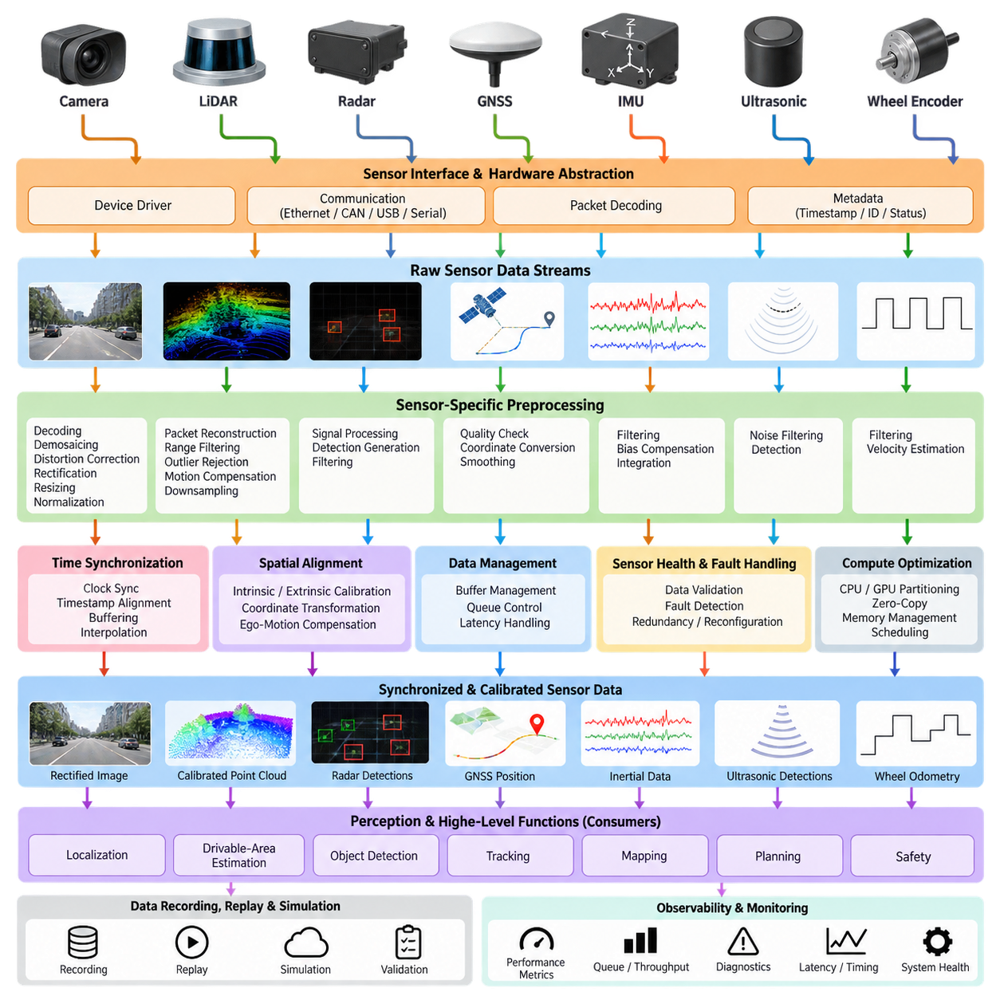
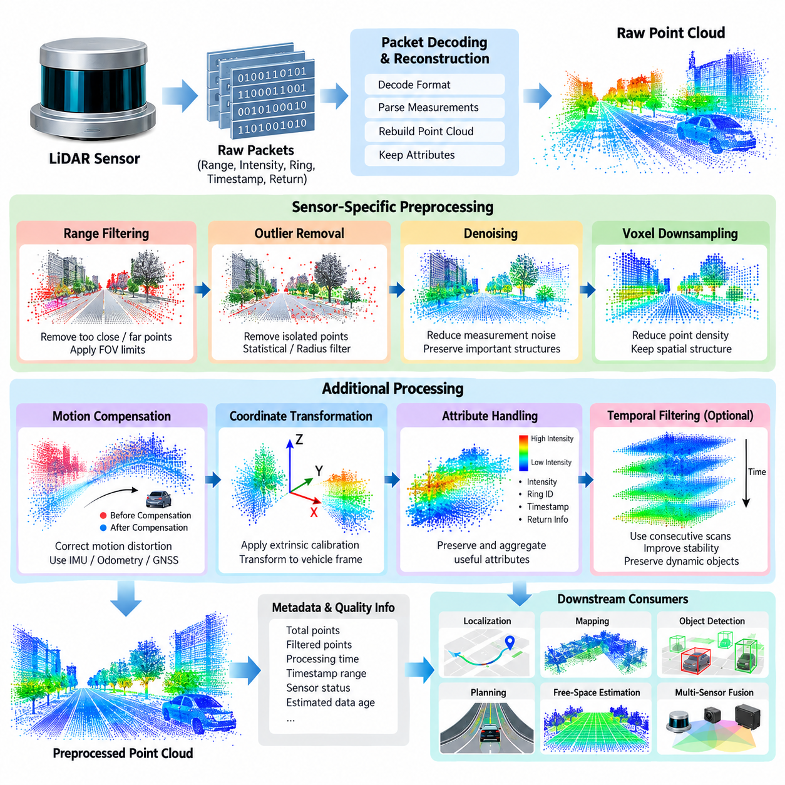
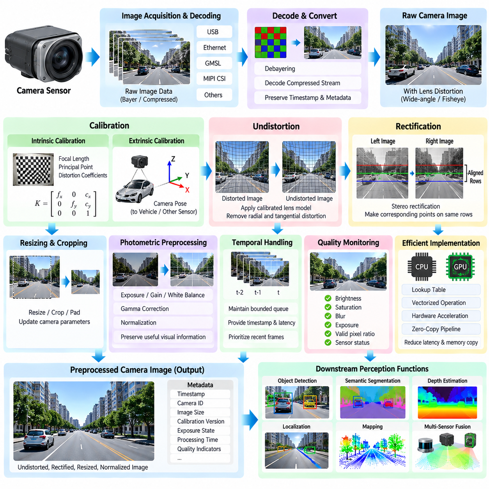
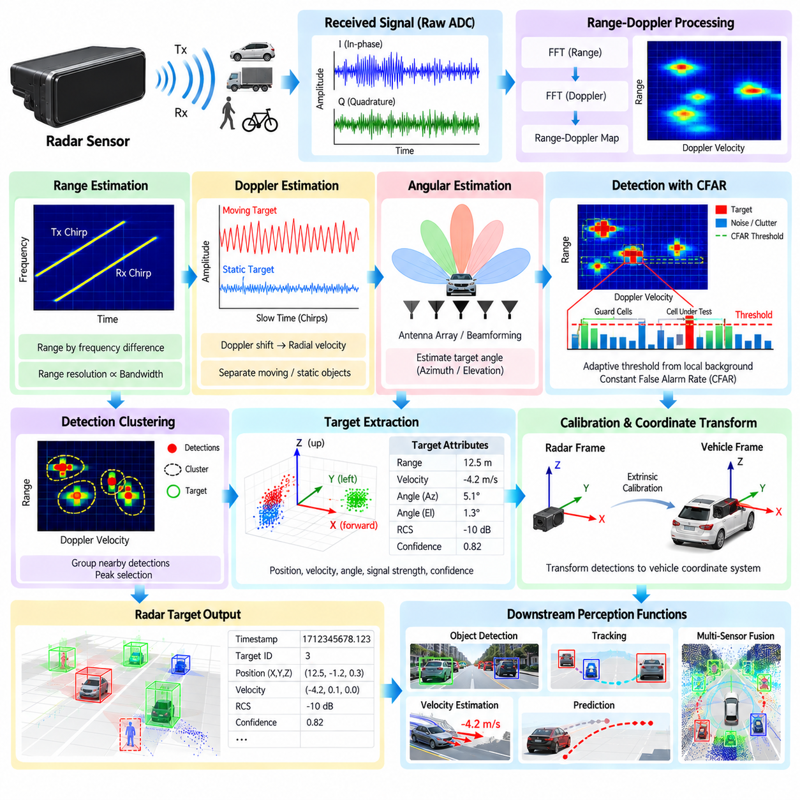
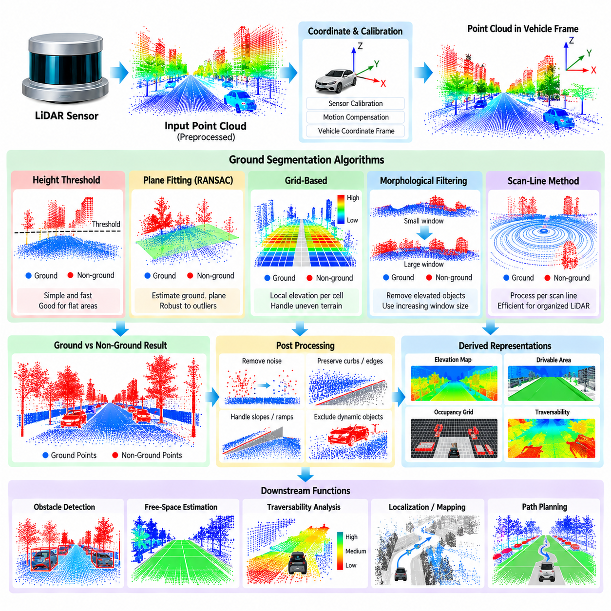
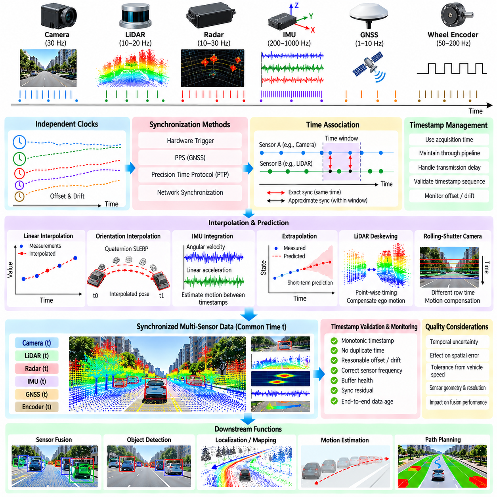
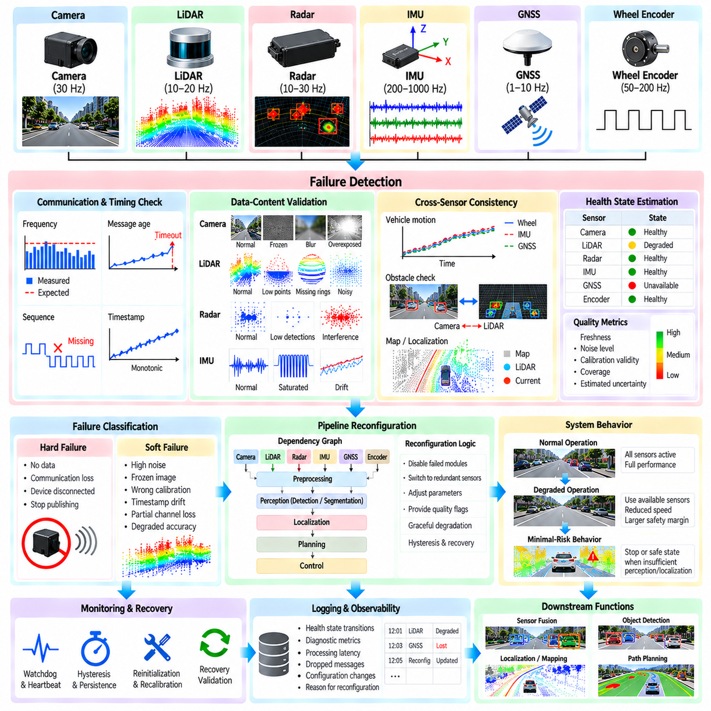
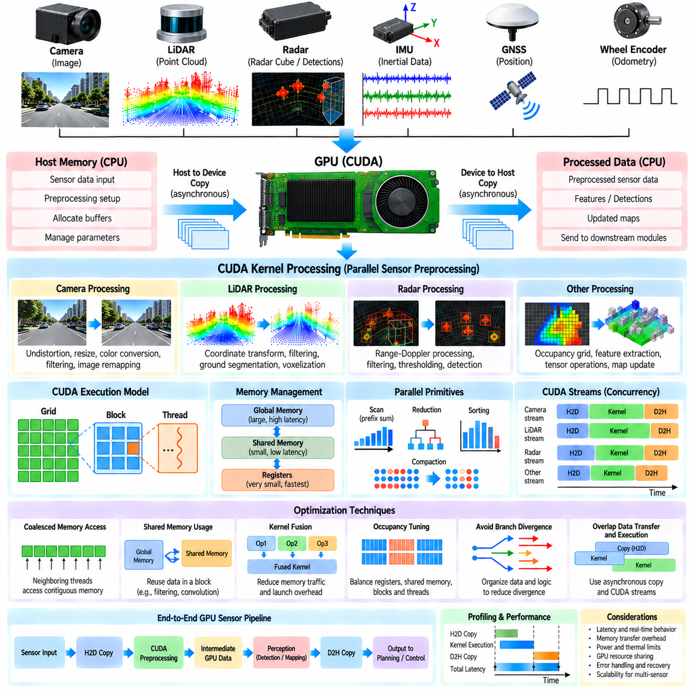
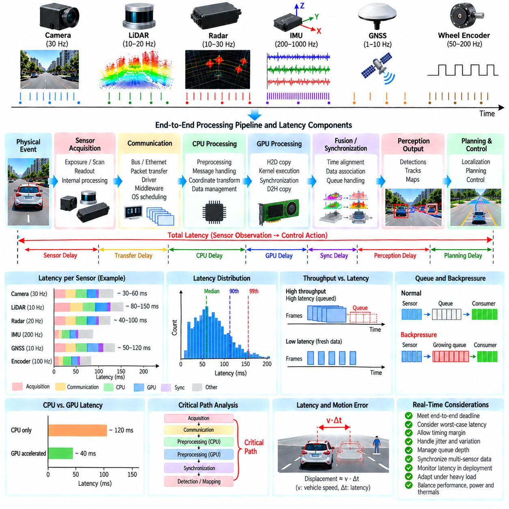
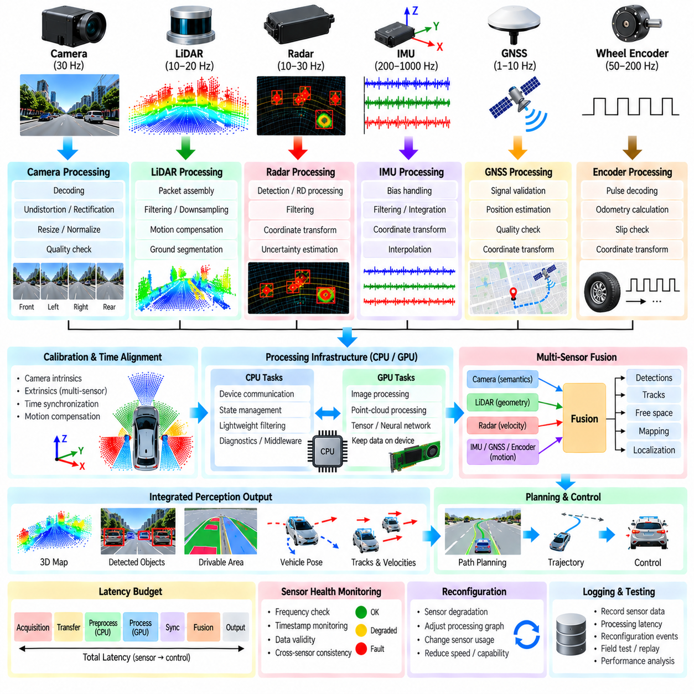

**Volume 12. Autonomous Driving Software**

# Chapter 03. Sensor Processing Pipeline

## 03.01. Sensor Processing Pipeline Architecture and Data Flow

{width="7.268055555555556in" height="7.268055555555556in"}

A sensor processing pipeline forms the first computational bridge between the physical environment and the autonomous driving software stack. Cameras, LiDARs, radars, GNSS receivers, IMUs, ultrasonic sensors, and wheel encoders continuously generate measurements with different rates, formats, coordinate systems, resolutions, and uncertainty characteristics. The pipeline converts these heterogeneous streams into synchronized and structured information suitable for perception, localization, mapping, planning, and safety functions.

The pipeline normally begins at the sensor interface and hardware abstraction layer. Device drivers communicate with sensors through interfaces such as Ethernet, CAN, CAN FD, USB, serial links, or dedicated automotive networks. Raw packets are decoded into standardized software representations while preserving essential metadata including sensor identifiers, sequence numbers, hardware timestamps, exposure parameters, measurement status, and diagnostic information required by downstream processing.

Time is a fundamental architectural dimension because individual sensors operate asynchronously. A camera may generate frames at tens of hertz, a LiDAR may produce scans at another frequency, while IMU measurements can arrive at hundreds of hertz. Hardware timestamps should therefore be captured as close as possible to the measurement event. Clock synchronization, timestamp alignment, buffering, interpolation, and motion compensation establish a common temporal reference before measurements from different sensors are combined.

Spatial alignment is equally important. Every sensor observes the environment from its own coordinate frame, while autonomous functions generally require data in common vehicle, base, odometry, map, or world frames. Calibration provides intrinsic parameters for imaging sensors and extrinsic transformations between sensors and the vehicle. A transformation hierarchy allows points, images, detections, and motion estimates to be consistently related across the complete autonomous driving software stack.

Raw sensor measurements are rarely passed directly into high-level perception algorithms. Each sensor requires modality-specific preprocessing that improves data quality while controlling computational cost. Camera pipelines may perform decoding, debayering, distortion correction, rectification, resizing, and normalization. LiDAR processing commonly includes packet reconstruction, range filtering, outlier rejection, motion compensation, and point-cloud downsampling, while radar processing converts signal-level measurements into usable detections.

A well-designed architecture separates acquisition, preprocessing, synchronization, transformation, and semantic processing into modular stages. This separation prevents sensor-specific implementation details from propagating through the entire autonomy stack. Standardized interfaces allow downstream modules to consume normalized images, calibrated point clouds, radar targets, inertial measurements, or derived features without depending on the exact hardware model. Sensors can consequently be upgraded with limited changes to higher software layers.

Data flow can be organized as streams rather than as a single sequential program. Multiple sensor pipelines execute concurrently, with each stage producing messages consumed by one or more downstream modules. Camera preprocessing may feed object detection and semantic segmentation simultaneously, while a LiDAR stream may support obstacle detection, localization, ground segmentation, and free-space estimation. Middleware therefore becomes responsible for efficient message transport, buffering, scheduling, and quality-of-service behavior.

The boundary between preprocessing and perception should remain explicit. Sensor processing is primarily concerned with converting measurements into geometrically, temporally, and numerically consistent representations. Perception interprets those representations to estimate objects, surfaces, free space, semantics, and scene structure. This distinction is particularly important because later chapters separately address drivable-area estimation and object detection, while the sensor pipeline provides their common data foundation.

Multi-sensor architectures introduce synchronization policies based on the requirements of each consumer. Strict synchronization may be useful when camera and LiDAR measurements are fused at measurement or feature level, whereas localization may combine high-rate IMU observations with lower-rate GNSS or LiDAR updates asynchronously. The pipeline should therefore support exact, approximate, and asynchronous association rather than forcing every sensor stream into one universal synchronization mechanism.

Buffer management strongly influences both accuracy and latency. Buffers compensate for differences in sensor frequency, communication delay, and processing time, but excessive buffering makes the autonomous system react to an outdated representation of the environment. Practical implementations establish bounded queues, maximum data age, timeout policies, and deterministic discard rules. The objective is not merely to maximize throughput but to deliver sufficiently recent and coherent information within the latency budget of the autonomy stack.

Coordinate transformation and ego-motion compensation are particularly important for moving platforms. During a LiDAR scan or between asynchronous sensor observations, the vehicle can translate and rotate significantly. Without compensation, stationary structures may appear distorted and measurements from different timestamps may not align. Vehicle motion estimated from IMU, wheel odometry, GNSS, or localization can therefore be used to transform measurements toward a selected reference time before subsequent fusion or perception.

Sensor health information should travel alongside measurement data. Missing packets, frozen frames, abnormal timestamp jumps, excessive noise, calibration errors, communication faults, or implausible values can invalidate otherwise well-formed messages. A robust pipeline continuously evaluates freshness, integrity, range validity, timing consistency, and diagnostic state. Downstream modules can then distinguish valid observations from degraded inputs and modify their behavior instead of silently processing unreliable measurements.

Fault handling becomes an architectural function rather than an isolated diagnostic feature. If one sensor becomes unavailable, the processing graph may disable dependent algorithms, switch to alternative data sources, reduce operating speed, or request a minimal-risk behavior. This capability requires explicit dependencies between sensors and processing modules as well as runtime health states. The chapter structure consequently treats sensor failure detection and pipeline reconfiguration as part of the sensor-processing problem itself.

High-bandwidth sensors create substantial memory and computation requirements. Multiple cameras and dense LiDARs can generate hundreds of megabytes or more of intermediate data each second. Repeated serialization and memory copying can consume resources without improving perception. Efficient architectures therefore use techniques such as preallocated buffers, shared memory, zero-copy transport, pinned memory, batching, and direct GPU transfer where supported, while carefully controlling ownership and lifetime of data.

CPU and GPU workloads should be partitioned according to computational characteristics rather than simply moving every operation to an accelerator. Packet handling, state management, diagnostics, and lightweight transformations may remain efficient on CPUs, while image operations, point-cloud kernels, neural-network preprocessing, and parallel geometric calculations can benefit from GPUs. The pipeline must account for transfer overhead, synchronization barriers, kernel execution, and memory pressure when evaluating actual end-to-end acceleration.

Latency must be analyzed across the entire measurement path. Sensor exposure or scan acquisition, network transmission, driver handling, decoding, synchronization, preprocessing, memory transfer, inference, fusion, and message delivery all contribute to the age of information reaching planning. Optimizing one kernel provides little benefit if queueing dominates elsewhere. For this reason, latency budgets should be assigned to pipeline stages and measured with timestamped traces under realistic sensor loads.

Throughput and latency are related but distinct requirements. A pipeline may process every frame eventually while still being unsuitable for autonomous operation because results arrive too late. Conversely, deliberately dropping obsolete frames can improve real-time behavior by keeping computation focused on current observations. Scheduling policies should therefore prioritize freshness, bounded execution time, and predictable degradation over unlimited queue growth, particularly when the platform is moving rapidly or operating near obstacles.

Outdoor AMRs impose additional requirements because sensor conditions change dramatically with weather, illumination, vibration, terrain, dust, water, and platform motion. Camera exposure may vary under direct sunlight, LiDAR returns may degrade in rain or dust, GNSS can become unreliable near structures, and vibration can affect inertial measurements. The pipeline should preserve sensor-specific confidence and diagnostic information so later autonomy modules can adapt to changing observation quality rather than assuming constant sensor performance.

The processed outputs ultimately form shared inputs for localization, drivable-area estimation, object detection, tracking, mapping, and other autonomy functions. This makes the sensor pipeline a cross-cutting infrastructure layer rather than merely a collection of filters. Its interfaces define how physical measurements become software-visible evidence, while its timing and failure behavior constrain every higher-level algorithm. The surrounding volume explicitly places this pipeline between AV software architecture and subsequent perception-oriented functions.

A scalable implementation should also support recording, replay, simulation, and validation through the same logical interfaces used during live operation. Recorded sensor streams can reproduce field events, simulated sensors can exercise algorithms before deployment, and deterministic replay can isolate timing or perception failures. When live, recorded, and simulated sources share compatible schemas and timestamps, developers can test individual pipeline stages without rewriting the downstream autonomy software.

Observability completes the architecture. Processing nodes should expose execution time, queue depth, input frequency, dropped-message counts, timestamp skew, memory consumption, sensor health, and output freshness. These measurements make it possible to locate bottlenecks and distinguish sensor failures from software overload. Combined with reproducible recording and replay, observability turns the sensor pipeline into an engineering system that can be profiled, validated, optimized, and continuously monitored.

The resulting architecture can be understood as a continuous transformation from physical measurement to trustworthy machine-readable state: sensor acquisition establishes the raw evidence; timing and calibration establish consistency; preprocessing improves usability; transport distributes normalized representations; health monitoring establishes confidence; and downstream perception extracts environmental meaning. Designing these stages as a coherent data-flow system provides the foundation for reliable autonomous driving and outdoor AMR operation.

## 03.02. LiDAR Preprocessing Filtering Downsampling Denoising [w/Code]

{width="7.268055555555556in" height="7.268055555555556in"}

LiDAR preprocessing is the first computational stage that transforms raw three-dimensional range measurements into a point cloud suitable for autonomous driving perception, localization, mapping, and planning. A LiDAR sensor produces large numbers of points containing position, range, intensity, ring, timestamp, and sometimes additional return information. These measurements inevitably include noise, outliers, duplicated observations, missing returns, and points outside the useful operating region. Preprocessing therefore establishes a clean and computationally manageable representation while preserving geometric information that later algorithms depend on.

The preprocessing pipeline normally begins with packet reception and point-cloud reconstruction. A LiDAR driver receives network or serial packets and converts them into individual measurements according to the sensor-specific packet format. Each point should retain its timestamp, coordinate information, intensity, and sensor identity whenever available. The reconstructed cloud is then expressed in a consistent coordinate frame. Correct packet decoding is essential because an error at this stage can appear later as geometric distortion, incorrect object locations, or unstable localization rather than as an obvious software failure.

Range filtering removes measurements that are physically or operationally outside the useful sensing region. Very close points may correspond to the robot body, sensor housing, cables, or other self-obstacles, while extremely distant points may have poor measurement reliability and limited relevance to immediate navigation. Horizontal and vertical field-of-view limits can also be applied according to the sensor mounting configuration. Range filtering reduces unnecessary computation, but thresholds should be selected carefully because aggressive filtering can remove legitimate obstacles, terrain features, or distant landmarks required by localization.

Outlier removal addresses isolated measurements that do not represent meaningful physical surfaces. LiDAR outliers can arise from sensor noise, reflective materials, atmospheric effects, multipath behavior, packet corruption, or imperfect returns. Statistical filtering can identify points whose neighborhood characteristics differ significantly from the surrounding cloud, while radius-based methods can remove points that lack sufficient nearby neighbors. The appropriate method depends on point density and the intended application. Filtering should improve geometric consistency without destroying thin structures such as poles, signs, cables, or pedestrian features.

Voxel-based downsampling is widely used to reduce point-cloud density while retaining the overall spatial structure. The three-dimensional space is divided into regular voxels, and multiple points occupying the same voxel are represented by a selected representative, commonly the centroid. This can dramatically reduce memory consumption and the computational cost of nearest-neighbor searches, registration, segmentation, and neural-network inference. The voxel size becomes an important design parameter because a smaller voxel preserves more geometric detail while increasing computational load, whereas a larger voxel improves efficiency but may remove small objects and sharp geometric boundaries.

Downsampling should therefore be treated as an application-dependent operation rather than a fixed preprocessing rule. A localization module may require relatively detailed structural information, while an object detector may use a representation optimized for its network architecture. Similarly, an outdoor AMR operating at low speed may tolerate higher point density than a high-speed platform where perception latency is more critical. Multiple representations can be generated from the same incoming cloud when necessary, allowing different consumers to receive appropriately sampled data without forcing every downstream algorithm to process the full-resolution stream.

Denoising is related to outlier removal but focuses more broadly on reducing measurement variation while maintaining meaningful surfaces. A LiDAR cloud can contain random range errors that create small deviations around otherwise smooth walls, roads, or vehicle surfaces. Spatial filters, neighborhood statistics, temporal consistency checks, and model-based techniques can reduce such disturbances. Excessive denoising, however, may smooth away important discontinuities. For autonomous driving, curbs, steps, road edges, small obstacles, and terrain transitions can be safety-relevant, so preprocessing must preserve features that may later influence traversability or collision avoidance.

Ground-related preprocessing requires particular care because road and terrain surfaces often contain the majority of LiDAR points. A simple height threshold can work in a constrained environment but becomes unreliable on slopes, ramps, uneven terrain, and off-road surfaces. More advanced processing may use local surface models, geometric relationships, elevation statistics, or segmentation methods to distinguish ground-like structures from obstacles. Because ground segmentation is treated as a dedicated topic later in the chapter structure, the preprocessing stage should primarily prepare a stable and appropriately filtered cloud rather than duplicate the complete semantic ground-analysis function.

Motion distortion is another important consideration for a moving AMR. A rotating LiDAR does not necessarily acquire every point at exactly the same instant. During one scan, the vehicle may translate or rotate sufficiently to produce visible distortion in the reconstructed cloud. If the platform is moving quickly or operating on uneven terrain, this effect can become significant. Ego-motion information from IMU, wheel odometry, GNSS, or localization can be used to transform measurements toward a common reference time. Correcting this distortion improves geometric alignment for mapping, registration, obstacle estimation, and multi-sensor fusion.

Coordinate transformation and calibration should be applied consistently with the overall sensor-processing architecture. The LiDAR may be physically mounted above or below the robot center, with a nonzero translation and rotation relative to the vehicle coordinate frame. Extrinsic calibration defines this transformation. A preprocessing pipeline should avoid embedding platform-specific assumptions throughout the code and instead maintain explicit transformation parameters. This makes the same processing framework reusable across different AMR configurations, LiDAR mounting positions, and sensor models.

Intensity and auxiliary attributes can also be preserved during preprocessing. Although geometric coordinates are normally the primary information, return intensity can provide useful evidence for localization, surface characterization, and certain perception methods. Ring identifiers and acquisition timestamps may support organized point-cloud processing, motion compensation, or sensor diagnostics. Consequently, downsampling and filtering should define which attributes are retained and how they are aggregated. A centroid calculated from several points, for example, may require an explicit policy for combining their intensity and timestamp values rather than silently discarding them.

Temporal filtering can exploit consecutive scans to improve stability, but it must distinguish sensor noise from actual environmental motion. Static walls and road surfaces should remain spatially consistent over time, while pedestrians, vehicles, and other dynamic objects can change position rapidly. A preprocessing stage that blindly averages successive scans may therefore create ghost structures or smear moving objects. Temporal methods should be designed with the intended downstream perception behavior in mind. For dynamic environments, preserving current observations and controlling data age can be more important than maximizing apparent point-cloud smoothness.

Computational efficiency becomes increasingly important as LiDAR resolution and sensor count increase. A modern outdoor AMR may combine multiple cameras with one or more LiDAR sensors, creating substantial CPU, memory, and network traffic. Repeated allocation and copying of point-cloud buffers can introduce avoidable latency. Efficient implementations can use preallocated memory, contiguous data structures, parallel neighborhood operations, spatial indexing, and GPU acceleration where appropriate. The goal is not simply to process the maximum number of points but to provide sufficiently informative data within a predictable real-time latency budget.

The preprocessing pipeline should also expose quality information rather than returning only a point-cloud array. Useful metadata includes the number of received points, retained points, filtered points, dropped packets, processing duration, timestamp range, sensor status, and estimated data age. Sudden changes in point count or processing time may indicate contamination, communication problems, sensor degradation, or computational overload. Such information can be consumed by higher-level health monitoring and fault-management functions. The broader sensor-processing architecture therefore treats preprocessing and sensor health as connected components rather than completely independent modules.

Parameter selection should be validated against representative operating conditions rather than optimized using a single ideal dataset. Urban roads, open campuses, construction sites, vegetation, reflective surfaces, rain, dust, nighttime operation, and uneven terrain can produce very different LiDAR characteristics. A filter that performs well on a clean road may remove useful information in an off-road environment. Evaluation should therefore examine geometric preservation, object retention, point density, computational latency, localization stability, and downstream detection performance. This connects LiDAR preprocessing directly to system-level validation rather than treating it as an isolated numerical filtering problem.

For an outdoor AMR, a practical LiDAR preprocessing chain can be viewed as a controlled transformation from raw measurements to a compact and trustworthy geometric representation. Packet decoding reconstructs the observations, coordinate transformation establishes a consistent frame, range and validity checks remove clearly unusable measurements, outlier filtering suppresses abnormal points, denoising improves local consistency, motion compensation reduces temporal distortion, and downsampling controls computational cost. The resulting cloud becomes a common input for ground segmentation, free-space estimation, object detection, localization, mapping, and multi-sensor fusion.

The most important design principle is therefore to preserve information that can affect autonomous decisions while removing information that primarily consumes computational resources. Filtering, downsampling, and denoising are not independent cosmetic operations; together they determine the quality, latency, and reliability of the geometric information available to the autonomy stack. A well-designed pipeline remains configurable, measurable, hardware-independent, and aware of motion and environmental conditions. This provides a stable foundation for the subsequent LiDAR perception and autonomous driving functions defined throughout the sensor-processing chapter.

## 03.03. Camera Preprocessing Undistortion Rectification [w/Code]

{width="7.268055555555556in" height="7.268055555555556in"}

Camera preprocessing is the stage that converts raw camera frames into geometrically corrected and numerically consistent images for autonomous driving perception. A camera produces image data affected by lens distortion, sensor characteristics, exposure, noise, rolling-shutter effects, and mounting geometry. Before object detection, segmentation, depth estimation, visual localization, or camera-LiDAR fusion, these effects should be controlled. The preprocessing pipeline therefore establishes a stable image representation while preserving the visual information required by downstream algorithms.

The pipeline begins with image acquisition and decoding. Camera data may arrive through USB, Ethernet, GMSL, MIPI CSI, or another hardware interface, depending on the platform. The driver and capture layer should preserve frame identifiers, timestamps, exposure information, camera parameters, and image format. Raw Bayer data may require debayering, while compressed streams require decoding. At this stage, it is important to preserve the original acquisition timestamp because later synchronization with LiDAR, radar, IMU, and other sensors depends on accurate temporal information.

Camera calibration provides the mathematical parameters required to correct geometric distortions. Intrinsic calibration describes properties such as focal length, principal point, and lens distortion coefficients, while extrinsic calibration defines the camera pose relative to the vehicle or another sensor. These parameters are normally obtained through calibration procedures using known targets or carefully designed reference environments. Calibration quality directly affects image geometry, especially when pixel coordinates are later projected into three-dimensional space or associated with measurements from another sensor.

Lens distortion is particularly important for wide-angle and fisheye cameras commonly used on mobile robots. An ideal pinhole camera assumes a simple projection relationship, but real lenses introduce radial and tangential distortion. Straight lines near the image boundaries can therefore appear curved, and the apparent position of objects can shift relative to an ideal projection. Undistortion applies the calibrated camera model to map distorted pixels toward corrected coordinates. The correction should be consistent across the complete image sequence so that downstream geometric algorithms operate on a stable projection.

Undistortion is commonly implemented through a precomputed mapping from output pixels to corresponding source-image coordinates. Instead of solving the distortion equation independently for every frame, the required coordinate transformation can be calculated during initialization and reused during runtime. Image remapping then applies interpolation to obtain the corrected pixel values. The interpolation method influences image sharpness and computational cost, while the selected output resolution and valid image region determine how much of the original field of view is retained.

Rectification becomes important when multiple cameras are used as a stereo pair or when camera images must be geometrically aligned with another reference. Stereo rectification transforms two camera views so that corresponding points lie on approximately common image rows, simplifying disparity estimation and depth reconstruction. For multi-camera systems, a consistent rectification strategy also helps establish predictable relationships between overlapping fields of view. Rectification should therefore be treated as part of the calibrated geometric pipeline rather than as a simple image enhancement operation.

Image resizing and cropping must be coordinated with calibration parameters. A neural network may require a particular input resolution or aspect ratio, but changing image dimensions also changes the relationship between pixels and the camera model. Intrinsic parameters must therefore be scaled or transformed consistently when images are resized, cropped, padded, or transformed into another representation. If this relationship is ignored, object positions and projected three-dimensional coordinates can contain systematic errors even though the resulting images appear visually correct.

Photometric preprocessing addresses variations in brightness and image quality rather than geometric distortion. Exposure, gain, white balance, gamma characteristics, sensor noise, motion blur, and illumination changes can strongly influence perception performance. Normalization may be required before neural-network inference, while adaptive exposure or camera-specific processing may be handled closer to the acquisition layer. However, preprocessing should avoid removing useful information such as shadows, texture, contrast boundaries, or color cues that may contribute to semantic understanding.

Outdoor AMRs create particularly challenging camera conditions because illumination can change rapidly. Direct sunlight, backlighting, nighttime scenes, reflections, rain, fog, dust, and artificial lighting can produce large differences between consecutive frames. A preprocessing pipeline should therefore distinguish between calibration parameters that remain stable and operational parameters that may change dynamically. Monitoring image brightness, saturation, blur, exposure, and valid-pixel ratios can provide useful indicators of camera quality and help higher-level software recognize degraded visual observations.

Camera preprocessing must also consider temporal behavior. A frame may be geometrically correct but still unsuitable for real-time autonomy if it is delayed significantly by buffering, decoding, image conversion, or excessive copying. The pipeline should maintain bounded queues and expose frame timestamps and processing latency. When computational resources become constrained, processing policies may prioritize recent frames rather than allowing an increasingly old image queue to accumulate. This is especially important for moving platforms where perception decisions depend on current environmental conditions.

Efficient implementation becomes increasingly important when an AMR uses multiple high-resolution cameras. Debayering, undistortion, rectification, resizing, normalization, and color conversion can consume substantial CPU and memory bandwidth. Precomputed lookup tables, vectorized operations, hardware image processing, GPU acceleration, pinned memory, and zero-copy data paths can reduce unnecessary computation and memory movement. The objective is to achieve predictable throughput and latency while maintaining the image quality required by downstream perception and sensor-fusion algorithms.

The processed camera output should include both the corrected image and relevant metadata. Useful information includes frame timestamp, camera identifier, image dimensions, calibration version, exposure state, processing duration, and quality indicators. These data allow downstream systems to associate images with other sensor observations and to diagnose failures. A camera frame should therefore be treated as a structured measurement rather than merely as an array of pixels. This approach supports the broader sensor-processing architecture in which synchronized and calibrated data are provided to perception and higher-level autonomy functions.

Camera preprocessing ultimately provides the visual foundation for object detection, semantic segmentation, depth estimation, localization, mapping, and multi-sensor fusion. The processing sequence can be understood as acquisition, decoding, calibration, undistortion, rectification, geometric transformation, resizing or cropping, photometric normalization, quality assessment, and delivery to downstream consumers. Each operation should have a clearly defined purpose and measurable effect. The architecture defined for this chapter places camera preprocessing immediately after LiDAR preprocessing and before radar processing, ground segmentation, timestamp alignment, fault handling, GPU acceleration, and latency analysis, making it an integral component of the complete sensor-processing pipeline.

## 03.04. Radar Signal Processing CFAR Detection [w/Code]

{width="7.268055555555556in" height="7.268055555555556in"}

Radar signal processing converts raw radio-frequency measurements into reliable target observations that can be consumed by autonomous driving and outdoor AMR perception systems. Unlike cameras and LiDAR, radar measures electromagnetic reflections and can provide range, relative velocity, and angular information under conditions where optical sensors may degrade. The processing chain must therefore transform noisy signal measurements into detections while preserving the physical characteristics that make radar valuable for robust perception.

A radar front end typically transmits electromagnetic signals and receives reflections from objects in the environment. Depending on the radar architecture, the received signal is processed through analog and digital stages before producing a range-Doppler representation or another intermediate signal representation. The software pipeline then extracts meaningful peaks or target candidates from this representation. Sampling configuration, waveform design, antenna arrangement, bandwidth, and integration time influence the resulting resolution and detection characteristics.

Range estimation is obtained from the relationship between the transmitted waveform and the received reflection. In frequency-modulated continuous-wave radar, for example, the frequency difference between transmitted and received signals can be related to target distance. The resulting range information forms one dimension of the radar measurement space. Range resolution is strongly influenced by signal bandwidth, while practical detection performance also depends on signal-to-noise ratio, propagation conditions, antenna characteristics, and processing configuration.

Doppler processing provides information about relative radial velocity. Reflections from moving objects produce frequency shifts that can be estimated through processing across multiple measurements or chirps. The resulting range-Doppler representation separates targets according to distance and relative motion. This capability is particularly useful for detecting moving vehicles and pedestrians and for distinguishing stationary environmental structures from objects whose radial velocity differs from the surrounding scene.

Angular estimation uses information from multiple receiving channels or antenna elements to determine the direction of an observed reflection. Techniques such as beamforming, digital beamforming, and array-processing methods can transform measurements from multiple channels into angular responses. The resulting range, velocity, and angle information can be combined into radar target observations. Calibration of antenna channels and knowledge of the radar mounting pose are important because angular errors propagate directly into the estimated position of detected objects.

Before target detection, radar measurements generally contain background noise, clutter, sidelobes, interference, and reflections that do not correspond to objects of interest. A fixed detection threshold is often inadequate because the background level can vary substantially across range, angle, and environmental conditions. Constant False Alarm Rate, or CFAR, detection addresses this problem by estimating local background statistics and adapting the detection threshold accordingly. CFAR is therefore an important signal-processing mechanism for converting continuous radar measurements into discrete detection candidates.

The central idea of CFAR is to evaluate a cell under test against neighboring reference cells. Guard cells are normally placed around the cell under test so that the potential target does not contaminate the background estimate. Reference cells surrounding the guard region provide information about the local noise or clutter level. A threshold is then calculated from this local estimate, usually with an additional scaling factor related to the desired false-alarm behavior. If the cell under test exceeds the threshold, it becomes a detection candidate.

Different CFAR strategies use different methods to estimate the local background. Cell-Averaging CFAR estimates the background from the average level of reference cells and is effective when the surrounding environment is relatively homogeneous. Greatest-of CFAR and Smallest-of CFAR can be useful near clutter transitions because they select background information according to different local conditions. Ordered-Statistic CFAR uses an ordered set of reference-cell values and can provide greater robustness when some reference cells contain strong interfering targets. The appropriate strategy depends on the expected radar environment and computational requirements.

The selection of the training-window size, guard-window size, threshold scaling, and false-alarm target is an important engineering problem. A window that is too small may produce an unstable background estimate, while a window that is too large may fail to represent local clutter conditions. Excessive guard regions can reduce available reference samples, whereas insufficient guard regions can allow target energy to influence the background estimate. These parameters should therefore be evaluated using representative radar data rather than selected only from theoretical assumptions.

CFAR detection can be performed independently along different dimensions of the radar representation. Range CFAR evaluates measurements across distance, Doppler CFAR evaluates velocity-related structure, and two-dimensional CFAR considers a local neighborhood in range-Doppler space. Depending on the radar architecture, angular dimensions may also participate in detection processing. Two-dimensional processing can improve target separation in complex scenes but increases computational requirements and parameter-management complexity.

After CFAR, detected cells normally require additional processing before they become stable radar targets. Neighboring detections may represent the same physical reflector and can therefore be grouped into clusters. Detection clustering can combine nearby range, velocity, and angle measurements into a single target hypothesis. Peak selection may also be applied to reduce multiple detections generated by the same object. The resulting target representation can contain position, radial velocity, signal strength, confidence, and other radar-specific attributes.

Radar measurements are affected by multipath reflections and extended targets. A large vehicle may generate multiple strong reflection points rather than a single compact detection, while buildings, guardrails, road surfaces, and vegetation can create distributed clutter. Multipath can produce apparent targets at locations that do not correspond directly to the physical object. Signal processing should therefore avoid treating every detection as an independent object. Subsequent tracking and multi-sensor fusion can provide additional spatial and temporal context for interpreting these measurements.

Interference management is increasingly important as multiple radar sensors operate in the same environment. Signals from other radar systems, communication equipment, or internal electronic sources can introduce additional peaks or distort the background statistics. Radar processing may therefore include interference identification, suppression, filtering, or quality assessment before CFAR detection. The exact method depends strongly on radar waveform and hardware architecture, so the processing pipeline should expose sufficient diagnostics to distinguish genuine environmental reflections from degraded measurements.

Calibration and coordinate transformation connect radar detections to the vehicle coordinate system. Radar measurements are naturally expressed relative to the radar sensor, while downstream autonomous functions require a consistent vehicle or world reference. Extrinsic calibration defines the radar pose relative to the robot, and the detection position can then be transformed into the required coordinate frame. Timestamp information must also be preserved because radar detections may later be associated with camera images, LiDAR point clouds, IMU measurements, and localization states.

Radar preprocessing should maintain uncertainty information whenever possible. Range, velocity, and angular measurements have different error characteristics, and the uncertainty can vary according to signal strength, target geometry, and environmental conditions. Rather than presenting every detection as equally reliable, the processing pipeline can provide confidence or quality indicators together with the measurement. Downstream tracking and sensor fusion can then incorporate the reliability of individual radar observations when estimating object state.

For outdoor AMRs, radar can provide valuable complementary information under rain, darkness, dust, and other conditions that challenge optical perception. However, radar should not be treated as a universally reliable replacement for LiDAR or cameras. The characteristics of radar reflections differ substantially from visual and geometric observations, and some objects may produce weak or ambiguous returns. A robust architecture therefore uses radar as one component of a heterogeneous sensing system, with its measurements combined according to their physical strengths and limitations.

Real-time performance requires careful control of computational cost and processing latency. Range-Doppler transformations, beamforming, CFAR searches, clustering, and coordinate transformations can become expensive as channel count and measurement resolution increase. Parallel processing can accelerate operations that naturally map to independent range, Doppler, or spatial cells. At the same time, memory transfers, synchronization overhead, and data movement must be included in the end-to-end latency analysis rather than evaluating individual algorithms in isolation.

Radar quality monitoring should accompany the signal-processing pipeline. Useful indicators can include received signal statistics, noise level, detection count, processing latency, timestamp continuity, channel health, interference indicators, and the distribution of detected targets. Abrupt changes in these measurements can indicate sensor contamination, hardware degradation, communication problems, or environmental changes. Such information can be passed to the broader sensor-health and fault-management architecture so that downstream autonomy functions can respond appropriately.

The complete processing flow can therefore be viewed as a transformation from electromagnetic measurements into structured target observations: signal acquisition provides the raw measurements, range and Doppler processing establishes distance and relative motion, angular processing estimates direction, background estimation characterizes local noise and clutter, CFAR generates adaptive detection candidates, clustering and peak selection consolidate measurements, and calibration transforms the resulting targets into the vehicle coordinate system. Quality information and timestamps remain associated with the detections throughout this process.

The resulting radar detections provide a common input for object detection, tracking, velocity estimation, prediction, and multi-sensor fusion. Their greatest value comes from combining radar\'s direct relative-velocity information and operation under challenging environmental conditions with the geometric detail of LiDAR and the semantic information of cameras. Within the sensor-processing chapter, radar signal processing and CFAR detection therefore form the bridge between low-level electromagnetic measurements and higher-level autonomous perception functions. The chapter structure places this topic after LiDAR and camera preprocessing and before ground segmentation, timestamp alignment, sensor-failure handling, GPU acceleration, latency analysis, and integrated outdoor AMR sensor processing.

## 03.05. Point Cloud Ground Segmentation Algorithms [w/Code]

{width="7.268055555555556in" height="7.268055555555556in"}

Ground segmentation is the process of separating ground-like surfaces from non-ground structures in a three-dimensional LiDAR point cloud. For an autonomous driving system or outdoor AMR, this distinction provides an important geometric foundation for obstacle detection, free-space estimation, traversability analysis, localization, and mapping. Roads, sidewalks, ramps, soil, and other terrain surfaces generally form continuous spatial structures, while vehicles, pedestrians, buildings, vegetation, curbs, and equipment rise above or differ from those surfaces. A ground segmentation algorithm must identify this distinction efficiently while remaining robust to changing terrain.

The input to ground segmentation is normally a preprocessed point cloud whose invalid measurements, excessive noise, and unnecessary density have already been reduced. Each point is represented by spatial coordinates and may also contain intensity, ring, timestamp, or other attributes. The algorithm first establishes the coordinate frame in which height and surface geometry will be evaluated. In a vehicle-centered frame, the vertical axis should be consistently defined because many ground models depend directly on elevation relative to the robot. Accurate sensor calibration and motion compensation are therefore prerequisites for reliable segmentation.

The simplest ground segmentation approach uses a fixed height threshold. Points below a predefined elevation are classified as ground, while points above it are treated as non-ground. This method is computationally inexpensive and can work in flat, controlled environments where the sensor mounting height and terrain elevation are relatively stable. However, a fixed threshold becomes unreliable on slopes, ramps, uneven roads, curbs, embankments, and off-road terrain. It can also fail when the vehicle body moves significantly relative to the ground because of suspension motion or platform attitude changes.

A more flexible approach models the ground surface explicitly. Plane fitting methods estimate a surface from the point cloud and classify points according to their distance from the estimated plane. RANSAC-based plane fitting is commonly used because it can tolerate a substantial number of non-ground outliers while estimating a dominant planar structure. This approach is effective on relatively flat surfaces such as paved roads, but a single plane cannot adequately represent strongly curved, inclined, stepped, or irregular terrain. Outdoor AMRs therefore often require locally adaptive rather than globally planar ground models.

Grid-based methods divide the surrounding environment into two-dimensional cells and estimate ground elevation within each cell. The point cloud is projected into a top-down representation, and local height statistics or surface models are calculated for individual grid regions. Neighboring cells can then be analyzed for elevation continuity and slope. This representation is useful because it converts a complex three-dimensional segmentation problem into a structured spatial problem. It also provides outputs that can be directly consumed by occupancy grids, elevation maps, traversability estimation, and local planning modules.

Local slope and height differences provide important geometric evidence for classification. Ground surfaces usually exhibit relatively continuous elevation changes, whereas obstacles create abrupt vertical transitions. A segmentation algorithm can therefore evaluate the height difference between neighboring points or grid cells and compare the estimated slope with predefined limits. However, the acceptable slope depends on the operating environment. A threshold suitable for a paved road may incorrectly classify a steep but traversable outdoor ramp as an obstacle, while a threshold designed for off-road terrain may allow dangerous vertical structures to be treated as ground.

Progressive morphological filtering provides another strategy for separating terrain from elevated structures. The point cloud can be represented as an elevation surface, and morphological operations are applied using structuring elements of increasing size. Small elevated structures can be progressively distinguished from broader terrain surfaces. This approach can be useful in environments containing roads, vegetation, and man-made structures because the characteristic spatial scales of terrain and obstacles differ. Its performance nevertheless depends on appropriate window sizes and elevation thresholds.

Scan-line methods exploit the organized structure of many rotating LiDAR sensors. Points belonging to individual laser rings can be processed sequentially, allowing local elevation and slope relationships to be evaluated along each scan line. This can be computationally efficient because the algorithm follows the natural acquisition structure of the sensor. However, scan-line methods can become sensitive to sparse sampling, sensor orientation, steep terrain, and objects that interrupt the scan pattern. They should therefore be evaluated according to the specific LiDAR configuration rather than assuming identical behavior across sensors.

For outdoor AMRs, ground segmentation should account for the vehicle\'s changing attitude. Pitch and roll can change significantly when the robot crosses uneven terrain, and the apparent height of ground points in the sensor frame can consequently change even when the physical terrain remains continuous. IMU measurements and vehicle pose estimates can be used to transform the point cloud into a stabilized reference frame. This reduces the risk that platform motion will be interpreted as terrain geometry and improves consistency across successive scans.

Negative obstacles require special attention because conventional ground segmentation primarily identifies surfaces that are physically observed by the LiDAR. Pits, holes, drop-offs, and sudden depressions may not produce a conventional elevated obstacle cluster. A segmentation system that only searches for points above the estimated ground surface may therefore fail to recognize dangerous terrain discontinuities. For this reason, ground modeling should also preserve information about missing returns, elevation discontinuities, and expected terrain continuity so that subsequent negative-obstacle detection can identify hazardous depressions.

Curbs and small elevation changes create another important boundary condition. A curb may be only several centimeters or tens of centimeters above the road surface but can still be significant for an AMR depending on wheel diameter, suspension travel, and intended traversability. If the segmentation threshold is too tolerant, the curb may be absorbed into the ground model. If it is too strict, ordinary road roughness may generate excessive false obstacles. Ground segmentation should therefore be designed together with the vehicle\'s physical mobility characteristics and the downstream traversability requirements.

Dynamic objects should normally not be incorporated into the ground model. Vehicles, pedestrians, bicycles, animals, and moving equipment can temporarily occupy regions that otherwise contain ground. If these points are used to update a persistent terrain model, the estimated ground surface may become corrupted. Temporal consistency checks and object-aware filtering can help prevent dynamic structures from influencing long-term terrain estimation. This also illustrates why ground segmentation should remain connected to the broader perception architecture rather than operating as an isolated point-cloud filter.

The choice of segmentation method should reflect the operating environment and computational constraints. Fixed thresholds are simple but have limited adaptability. Plane fitting provides a useful geometric model for planar environments but becomes restrictive on complex terrain. Grid-based and local surface methods provide greater adaptability, while morphological and scan-line techniques can exploit particular spatial or sensor structures. In practical systems, hybrid methods can combine several of these principles, such as using a coarse ground model for initialization followed by local refinement around difficult terrain transitions.

Ground segmentation must operate within a strict real-time budget because its output can directly influence downstream obstacle and free-space processing. High-resolution LiDAR can produce large point clouds at relatively high frequency, making inefficient neighborhood operations expensive. Spatial indexing, organized point-cloud access, parallel processing, and GPU acceleration can reduce computational cost where appropriate. Nevertheless, acceleration should be evaluated using end-to-end latency because memory transfer, synchronization, and downstream data conversion can offset the benefit of a faster individual segmentation kernel.

Quality assessment should evaluate more than simple point-wise classification accuracy. Important measures include ground precision, ground recall, obstacle preservation, boundary accuracy, processing latency, point reduction, and stability across consecutive frames. For outdoor AMRs, testing should include flat pavement, slopes, ramps, rough terrain, gravel, grass, curbs, vegetation, construction areas, and changing weather conditions. The objective is to ensure that the segmentation output remains useful for the actual autonomous functions rather than maximizing performance on a limited benchmark environment.

The resulting ground and non-ground representations can be passed to multiple downstream functions. Ground points may support elevation estimation, localization, mapping, and terrain modeling, while non-ground points can support obstacle detection and object perception. A compact ground model can also contribute to drivable-area estimation and traversability analysis. Because these consumers have different requirements, the segmentation pipeline should preserve sufficient geometric information rather than reducing the result to a single binary label whenever richer representations are useful.

For an outdoor AMR, ground segmentation is therefore best understood as an adaptive geometric interpretation layer between LiDAR preprocessing and higher-level perception. The process begins with a calibrated and motion-compensated point cloud, estimates local or global terrain structure, separates points according to height, slope, continuity, or surface-model consistency, and produces ground and non-ground representations together with relevant quality information. The selected method should adapt to the physical environment, vehicle dynamics, LiDAR characteristics, and computational resources.

The chapter structure places point-cloud ground segmentation after LiDAR preprocessing, camera preprocessing, and radar signal processing, and before sensor timestamp alignment, sensor-failure handling, GPU-accelerated processing, latency analysis, and integrated outdoor AMR sensor processing. This position reflects its role as a geometric processing stage that converts raw or preprocessed three-dimensional measurements into terrain-aware information for subsequent autonomous perception. A robust implementation should remain configurable, measurable, computationally efficient, and sufficiently conservative around terrain boundaries so that the resulting representation supports safe and reliable outdoor AMR operation.

## 03.06. Sensor Timestamp Alignment and Interpolation [w/Code]

{width="7.268055555555556in" height="7.268055555555556in"}

Sensor timestamp alignment is the process of establishing a consistent temporal relationship among measurements produced by cameras, LiDARs, radars, IMUs, GNSS receivers, wheel encoders, and other sensors. These devices operate at different frequencies and acquire observations at different moments. Without temporal alignment, measurements describing different physical states may be combined as if they were simultaneous, producing spatial errors, incorrect motion estimates, unstable fusion, and degraded autonomous driving performance.

Each sensor should ideally assign a timestamp as close as possible to the physical measurement event. A timestamp generated after network transmission or software processing represents arrival time rather than acquisition time and may contain variable communication and scheduling delays. Hardware timestamping therefore provides a stronger temporal reference when supported. The sensor-processing architecture should preserve acquisition timestamps through drivers, middleware, preprocessing, recording, and downstream fusion instead of repeatedly replacing them with local software time.

A multi-sensor platform can contain several independent clocks. Cameras, LiDARs, radars, embedded controllers, GNSS receivers, and computing units may each maintain their own oscillator, producing offset and drift between time domains. Clock offset represents an initial difference between clocks, while clock drift causes that difference to change gradually over time. Synchronization mechanisms must therefore establish not only a common time origin but also continued agreement during long-duration operation.

Hardware synchronization provides one approach to reducing temporal uncertainty. Trigger lines can cause multiple sensors to acquire measurements from a shared timing event, while pulse-per-second signals from GNSS can provide a precise periodic reference. Precision Time Protocol and related network synchronization mechanisms can distribute a common clock across Ethernet-connected devices. The appropriate mechanism depends on sensor capabilities, network architecture, required accuracy, and the temporal sensitivity of downstream algorithms.

Software synchronization is required when sensors cannot be triggered simultaneously or when measurements naturally operate at different rates. A synchronization module maintains time-ordered buffers and associates measurements according to their timestamps. Exact synchronization requires timestamps to match within a very small tolerance, whereas approximate synchronization selects measurements within an acceptable temporal window. The tolerance should be determined from vehicle dynamics and algorithm requirements rather than selected only for implementation convenience.

Different sensor frequencies make exact correspondence impossible in many practical systems. A camera may operate at 30 Hz, a LiDAR at 10 or 20 Hz, an IMU at several hundred hertz, and GNSS at a substantially lower frequency. Instead of forcing all sensors to operate at the same rate, the processing pipeline can select a reference timestamp and estimate the state of other measurements at that moment. This approach preserves the natural characteristics of each sensor while providing temporally consistent information for fusion.

Interpolation estimates a measurement or state between two known timestamps. For scalar values such as temperature or simple sensor status, linear interpolation may be sufficient. Vehicle position can also be interpolated over short intervals when motion is smooth, although the selected motion model should reflect the required accuracy. Interpolation should not be interpreted as creating new physical observations; it estimates an intermediate state from available measurements and therefore carries uncertainty associated with the temporal gap and motion dynamics.

Orientation interpolation requires special treatment because rotations cannot generally be interpolated correctly by independently interpolating Euler angles. Quaternion-based interpolation provides a more appropriate representation for three-dimensional orientation. Spherical linear interpolation can estimate an intermediate rotation between two orientation states while maintaining valid rotational geometry. This is useful when camera, LiDAR, or radar observations must be transformed using a vehicle pose estimated at a slightly different timestamp.

High-rate IMU measurements play an important role in temporal alignment because they provide frequent observations of angular velocity and linear acceleration. IMU integration or preintegration can estimate motion between lower-rate sensor measurements, supporting LiDAR deskewing, image motion compensation, and state propagation. However, inertial measurements accumulate bias and integration error. Timestamp accuracy is therefore closely connected to IMU calibration, bias estimation, and the quality of the state estimator used for motion compensation.

LiDAR synchronization presents a distinctive problem because a complete scan is acquired over a finite time interval rather than at one instantaneous moment. Individual points or packets may therefore have different acquisition times. When the vehicle moves during the scan, treating the entire cloud as if it were captured at a single timestamp creates geometric distortion. Point-level or packet-level timing combined with estimated ego motion can transform measurements toward a common reference time, producing a deskewed point cloud.

Camera timing also contains subtleties related to exposure and sensor readout. A global-shutter camera captures the image approximately at one common exposure interval, while a rolling-shutter camera exposes different rows at different moments. For rapidly moving platforms, this temporal structure can produce geometric distortion even when the nominal frame timestamp is correct. Accurate fusion may therefore require knowledge of exposure timing, readout direction, and frame acquisition characteristics in addition to the timestamp attached to the image.

Radar measurements similarly require a clear definition of measurement time. A radar processing cycle can contain multiple chirps and signal-processing stages before a detection list becomes available. The time when software receives the detection list may differ substantially from the time represented by the underlying electromagnetic measurements. Radar interfaces should therefore distinguish acquisition time from processing or publication time so that detected targets can be associated correctly with vehicle motion and observations from other sensors.

Buffering is necessary for asynchronous sensor alignment but introduces additional latency. A synchronization module may need to wait for measurements from slower or delayed sensors before constructing a synchronized set. Excessive waiting produces temporally consistent but outdated data, while insufficient waiting can increase missing associations. Practical systems therefore define bounded buffers, maximum waiting times, synchronization tolerances, and expiration policies. Real-time autonomy requires balancing temporal correspondence against information freshness.

Extrapolation may be required when a measurement at the desired reference time is not yet available. Unlike interpolation, extrapolation predicts beyond the latest known state and therefore becomes increasingly uncertain as the prediction interval grows. Short-term pose propagation using velocity or inertial information can be useful for latency compensation, but long extrapolation intervals should be avoided. Systems should explicitly track extrapolation age and reject predictions when they exceed the validity assumptions of the motion model.

Timestamp validation should be integrated into sensor health monitoring. Non-monotonic timestamps, duplicated times, sudden clock jumps, excessive drift, missing sequences, or implausible differences between acquisition and arrival times can indicate synchronization failures. These faults may not change the numerical values of individual measurements, yet they can severely corrupt multi-sensor fusion. The processing pipeline should therefore monitor temporal integrity continuously and expose synchronization quality to downstream modules.

Temporal uncertainty should be treated as part of measurement uncertainty rather than as a purely software-level issue. A timestamp error translates into spatial error according to vehicle and object motion. At higher vehicle speeds or angular rates, even a small timing offset can create significant projection or association errors. The acceptable synchronization tolerance should consequently be derived from platform velocity, sensor geometry, perception resolution, and required localization or fusion accuracy.

Recording and replay systems must preserve the same temporal semantics used during live operation. Sensor data should be recorded with acquisition timestamps, clock-domain information, and relevant synchronization metadata whenever possible. During replay, maintaining original temporal relationships allows developers to reproduce fusion behavior and diagnose synchronization problems. Artificially replacing timestamps with replay time can hide the original timing characteristics and prevent accurate reconstruction of field events.

Observability is essential for validating the timing architecture. Useful metrics include sensor frequency, inter-arrival time, timestamp offset, synchronization residual, clock drift, buffer depth, interpolation interval, extrapolation age, dropped associations, and end-to-end data age. These quantities can be monitored during normal operation and stressed under heavy computational or network load. Temporal performance should be evaluated as an end-to-end property rather than only by verifying that individual sensors publish at their nominal rates.

The complete process can therefore be understood as a temporal normalization layer within the sensor-processing pipeline. Hardware or network synchronization establishes common clock references, timestamps preserve acquisition time, buffers organize asynchronous observations, association selects measurements around a reference instant, interpolation estimates intermediate states, and motion compensation transforms measurements toward temporal consistency. Validation and health monitoring then determine whether the resulting synchronized data remain trustworthy.

Within the chapter structure, sensor timestamp alignment and interpolation follow LiDAR, camera, radar, and point-cloud ground processing and precede sensor-failure detection, pipeline reconfiguration, GPU-accelerated processing, latency-budget analysis, and integrated outdoor AMR sensor processing. Reliable temporal alignment provides the common time foundation required for these heterogeneous sensor streams to become a coherent representation of the environment rather than a collection of individually accurate but temporally inconsistent observations.

## 03.07. Sensor Failure Detection and Pipeline Reconfiguration [w/Code]

{width="7.268055555555556in" height="7.268055555555556in"}

Sensor failure detection is the process of continuously determining whether measurements entering an autonomous driving sensor pipeline remain valid, timely, and sufficiently reliable for their intended functions. Cameras, LiDARs, radars, IMUs, GNSS receivers, and wheel encoders can fail completely or degrade gradually. A robust autonomy stack must therefore recognize not only missing data but also measurements that continue to arrive while no longer representing the physical environment correctly.

Sensor failures can be classified broadly as hard failures and soft failures. A hard failure may appear as complete loss of communication, missing frames, a disconnected device, or a sensor that stops publishing data. Soft failures are more difficult because the sensor continues producing plausible-looking measurements. Examples include increasing noise, frozen images, incorrect calibration, timestamp drift, partial LiDAR channel loss, GNSS degradation, radar interference, or slowly developing bias in inertial measurements.

Basic health monitoring begins with communication and timing checks. Each sensor stream can be monitored for expected publication frequency, sequence continuity, message age, timestamp monotonicity, packet loss, and timeout conditions. A camera expected at 30 Hz should not silently fall to a few frames per second without producing a health warning. Similarly, a LiDAR stream may continue publishing complete messages even when network loss causes significant portions of individual scans to disappear.

Data-content validation examines whether the measurements themselves remain physically plausible. Camera monitoring can evaluate frozen frames, excessive saturation, darkness, blur, or corrupted image regions. LiDAR monitoring can inspect point count, range distribution, missing rings, intensity statistics, and spatial coverage. Radar monitoring can examine detection count, noise level, interference indicators, and channel status, while IMU validation can identify saturation, unrealistic acceleration, excessive bias, or values that remain unexpectedly constant.

Consistency checking provides another layer of failure detection by comparing information across sensors or over time. Vehicle motion estimated from wheel encoders can be compared with IMU, GNSS, or localization estimates. LiDAR obstacle structure can be checked against camera or radar observations without requiring exact agreement between modalities. Persistent disagreement beyond expected uncertainty can indicate a degraded sensor, calibration error, synchronization problem, or failure in a preprocessing stage rather than an actual environmental change.

Failure detection should distinguish sensor hardware faults from pipeline faults. A healthy sensor can appear unavailable when its driver crashes, middleware queues overflow, GPU processing stalls, synchronization fails, or a downstream node stops consuming messages. Monitoring should therefore cover the complete path from physical acquisition through drivers, preprocessing, transport, synchronization, and perception interfaces. This allows the system to localize the failure domain instead of immediately assuming that the sensing hardware itself is defective.

A useful health model represents each sensor or processing stage using more than a simple healthy or failed flag. States such as healthy, degraded, unreliable, unavailable, and recovering allow the autonomy system to respond progressively. A camera affected by glare may remain usable for some functions while being unreliable for others. Similarly, degraded GNSS may still provide coarse position information even when it can no longer support precise localization. Health state should therefore be associated with functional capability.

Confidence and quality metrics can complement discrete health states. Each sensor stream may expose freshness, noise level, calibration validity, temporal consistency, coverage, and estimated uncertainty. These metrics can be combined into a quality assessment that downstream modules use when selecting or weighting measurements. The objective is not necessarily to compute one universal confidence score, but to communicate enough diagnostic information for consumers to understand which capabilities remain trustworthy.

Pipeline reconfiguration begins when the detected failure affects functions that depend on the degraded component. The system should maintain explicit dependencies between sensor inputs, preprocessing stages, perception modules, localization functions, and planning capabilities. If a LiDAR becomes unavailable, LiDAR-dependent ground segmentation and point-cloud obstacle detection may be disabled or marked invalid. Camera- or radar-based functions can continue if they provide sufficient capability for the current operational condition.

Redundant sensing allows the processing graph to switch between alternative sources. A localization system may normally combine GNSS, IMU, wheel odometry, and LiDAR localization but continue temporarily using inertial and odometric information when GNSS is unavailable. Obstacle perception may use LiDAR as a primary geometric sensor while retaining camera and radar observations as complementary inputs. Reconfiguration should be based on defined capability relationships rather than assuming that one sensor can universally replace another.

Graceful degradation is preferable to an immediate transition from full autonomy to complete shutdown when safe operation remains possible. The platform can reduce speed, increase obstacle margins, restrict its operational area, disable high-risk maneuvers, or require stronger confirmation before executing motion. The permitted behavior should correspond to the remaining sensing capability. A degraded sensor configuration that is adequate for low-speed movement in an open area may be inadequate for high-speed operation near pedestrians or complex obstacles.

Some failures require transition to a minimal-risk behavior rather than continued autonomous operation. If the remaining sensors cannot provide sufficient obstacle awareness, localization confidence, or vehicle-state estimation, the system may need to stop in a controlled manner or move to a predefined safe condition. Sensor-pipeline reconfiguration must therefore communicate with planning, control, and safety supervision rather than remaining an isolated perception function. The response to failure is ultimately a system-level decision.

Reconfiguration should avoid rapid oscillation between configurations when a sensor repeatedly crosses a health threshold. Hysteresis, persistence timers, and recovery criteria can prevent unstable switching. A sensor may be declared degraded only after a fault condition persists for a defined interval and returned to normal only after sustained healthy operation. Recovery can also require reinitialization, recalibration checks, synchronization validation, or comparison with redundant measurements before the sensor is trusted again.

Watchdogs and heartbeat mechanisms provide additional supervision of processing components. Nodes can periodically report that they are alive and meeting expected execution deadlines. A missing heartbeat may indicate software termination, deadlock, excessive processing time, or communication failure. However, an alive process is not necessarily a correct process, so heartbeat monitoring should be combined with timing, data-quality, and semantic plausibility checks. This layered strategy provides stronger coverage than any single diagnostic mechanism.

Fault isolation becomes increasingly important in complex multi-sensor systems. If camera-LiDAR fusion becomes inconsistent, the cause could be the camera, LiDAR, calibration parameters, timestamp alignment, coordinate transformation, or the fusion algorithm itself. Diagnostic logic should use multiple observations to narrow the likely source rather than disabling every related component. Maintaining provenance information for measurements and transformations helps trace abnormal outputs back through the processing graph.

The reconfiguration architecture should preserve deterministic and auditable behavior. For each recognized failure state, the system should define which data paths remain active, which modules are disabled, what quality flags are propagated, and which operational restrictions are imposed. Dynamic reconfiguration should not create an unpredictable software graph. Explicit state machines, capability tables, or policy rules can make transitions reproducible and easier to verify during simulation, hardware-in-the-loop testing, and field validation.

Outdoor AMRs require particular attention because environmental conditions can produce temporary degradation that resembles hardware failure. Rain, fog, dust, direct sunlight, mud, vibration, vegetation, multipath GNSS, and radar interference can reduce sensing quality without physically damaging a sensor. Health monitoring should therefore distinguish environmental degradation from permanent hardware faults when possible. Both conditions may require operational adaptation, but their recovery logic and maintenance implications are different.

Logging and observability are essential for diagnosing failures that occur intermittently in the field. The system should record health-state transitions, timestamps, diagnostic metrics, processing latency, dropped messages, configuration changes, and the reason for each reconfiguration decision. When synchronized with sensor recordings and vehicle state, these logs allow engineers to reconstruct the sequence leading to a degraded mode or emergency response and determine whether the diagnostic logic behaved as intended.

Validation should include deliberate fault injection rather than relying only on naturally occurring failures. Tests can simulate dropped packets, frozen frames, delayed timestamps, corrupted calibration, missing LiDAR channels, GNSS outages, IMU bias, radar interference, driver termination, processing overload, and communication loss. The objective is to verify not only whether the fault is detected but also whether isolation, reconfiguration, degradation, recovery, and downstream safety behavior occur within the required time.

The complete architecture can therefore be viewed as a closed diagnostic and adaptation loop. Sensor and pipeline observations feed health monitors; monitors detect anomalies and estimate component states; dependency logic determines which autonomy capabilities are affected; the reconfiguration manager activates valid processing paths and disables unreliable ones; planning and safety functions adjust operation according to remaining capability; and recovery monitoring determines when failed components can safely re-enter the pipeline.

Within the chapter structure, sensor failure detection and pipeline reconfiguration follow sensor timestamp alignment and interpolation and precede GPU-accelerated sensor processing, latency-budget analysis, and the integrated outdoor AMR multi-sensor case. The broader volume separately develops sensor redundancy and voting, fallback planning, watchdogs, and safety intervention within its safety chapter, so this stage focuses specifically on detecting degradation inside the sensor-processing chain and maintaining a valid data path for subsequent autonomous functions.

## 03.08. GPU Accelerated Sensor Processing CUDA Kernels [w/Code]

{width="7.268055555555556in" height="7.268055555555556in"}

GPU-accelerated sensor processing uses massively parallel computation to reduce the execution time of operations that must be repeated across large images, point clouds, radar tensors, occupancy grids, and other sensor representations. Autonomous driving pipelines are well suited to this model because many preprocessing operations apply similar mathematical transformations independently to thousands or millions of data elements. CUDA kernels allow these operations to execute concurrently on NVIDIA GPUs rather than sequentially across a limited number of CPU cores.

A CUDA kernel is a function executed by many GPU threads in parallel. Threads are organized into blocks, while blocks form a grid representing the complete kernel launch. Sensor data can be mapped naturally onto this hierarchy. Image pixels may correspond to two-dimensional thread coordinates, point-cloud elements to one-dimensional indices, and voxel or tensor operations to multidimensional grids. Efficient mapping is important because GPU performance depends not only on arithmetic throughput but also on thread organization, memory access, and workload balance.

Camera preprocessing provides a direct example of data-parallel acceleration. Undistortion, rectification, resizing, normalization, color conversion, filtering, and image remapping perform similar calculations for large numbers of pixels. A CUDA kernel can assign individual pixels or small image regions to separate threads, allowing many transformations to proceed simultaneously. When several cameras are used around an AMR, GPU execution can also process independent camera streams concurrently while preserving the timestamps and calibration parameters associated with each frame.

LiDAR processing can similarly exploit parallelism because individual points frequently undergo independent transformations. Coordinate transformation, range filtering, intensity filtering, region-of-interest selection, point validity checks, and motion compensation can operate on large point arrays. Ground segmentation and voxelization may require neighborhood or cell-level interaction, but substantial portions can still be parallelized. The design should minimize unnecessary conversion between CPU-oriented point structures and GPU-oriented contiguous arrays.

Radar processing also benefits from GPU acceleration when signal or tensor operations are computationally intensive. Range, Doppler, angle, filtering, thresholding, and detection stages may contain highly parallel numerical workloads. Depending on the radar interface, some low-level signal processing may already occur inside the sensor, leaving the vehicle computer to process detection lists or radar cubes. GPU acceleration should therefore target the actual data representation exposed by the sensor rather than assuming that every platform performs raw radar processing externally.

Memory transfer is one of the most important constraints in GPU sensor processing. A fast CUDA kernel provides limited benefit if large sensor buffers must repeatedly move between host memory and device memory. The processing architecture should reduce unnecessary host-to-device and device-to-host copies and keep intermediate representations on the GPU whenever several consecutive stages can execute there. Pinned host memory, asynchronous transfers, and reusable device buffers can further reduce transfer overhead and allocation cost.

Coalesced memory access is essential for efficient CUDA kernels. Neighboring threads should preferably access neighboring memory locations so that global-memory transactions can be combined efficiently. Sensor data structures designed for CPU convenience may contain pointers, padding, or irregular layouts that produce inefficient GPU access. Structure-of-arrays representations can sometimes provide better access patterns than array-of-structures layouts, particularly when a kernel requires only selected attributes such as point coordinates, intensity, or timestamps.

Shared memory provides low-latency storage that can be accessed by threads within the same block. Image convolution, local filtering, neighborhood operations, histogram computation, and selected point-cloud algorithms can load frequently reused data into shared memory rather than repeatedly reading global memory. However, shared memory is limited, and excessive allocation can reduce occupancy. Kernel design must therefore balance data reuse against the number of active blocks and threads that can reside simultaneously on each streaming multiprocessor.

GPU occupancy describes how effectively available execution resources can support active warps, but maximum occupancy does not automatically imply maximum application performance. Register usage, shared-memory requirements, branch divergence, memory bandwidth, and instruction latency all influence kernel efficiency. Sensor-processing kernels should therefore be profiled using actual workloads instead of optimized according to a single theoretical metric. A memory-bound filtering kernel requires different optimization decisions from a compute-bound geometric transformation.

Branch divergence occurs when threads within the same warp follow different execution paths. Sensor processing frequently contains conditional operations such as rejecting invalid points, checking image boundaries, applying range thresholds, or classifying terrain. Heavy divergence can reduce parallel efficiency because different branches may execute serially within a warp. Algorithms can sometimes reorganize data, separate processing stages, or use compacted valid-element lists to reduce divergence while preserving the required processing semantics.

CUDA streams allow independent operations to overlap when hardware resources and dependencies permit. Sensor pipelines can use separate streams for camera, LiDAR, radar, or preprocessing tasks, while asynchronous memory copies can overlap with kernel execution. Events can express dependencies between operations without forcing global synchronization. This is particularly useful in multi-sensor systems where different sensors publish asynchronously and should not unnecessarily block one another while waiting for unrelated GPU work.

Kernel fusion can reduce intermediate memory traffic and launch overhead by combining several simple operations into a single GPU kernel. For example, point validation, coordinate transformation, and region-of-interest filtering may be performed during one traversal of a LiDAR buffer. However, excessively large fused kernels can increase register pressure, complexity, and synchronization requirements. Fusion should therefore be guided by profiling and data-flow analysis rather than applied automatically to every consecutive processing stage.

Parallel prefix sums, reductions, sorting, and compaction are important primitives for irregular sensor workloads. A filtering kernel may mark valid LiDAR points in parallel, but producing a dense output array requires determining where each surviving point should be stored. Scan and compaction algorithms can perform this operation efficiently on the GPU. Similar primitives support histogram generation, voxel construction, feature aggregation, candidate selection, and other stages where parallel computation must produce a variable-sized result.

CUDA libraries can reduce the need to implement every operation as a custom kernel. Image processing, linear algebra, FFT operations, tensor computation, and deep-learning inference can often use optimized libraries or frameworks. Custom CUDA kernels are most valuable when the sensor-processing operation has platform-specific data layouts, unusual geometric transformations, strict latency requirements, or functionality not efficiently represented by existing libraries. Maintaining custom kernels also requires careful testing across GPU architectures and software versions.

Real-time sensor processing requires predictable latency rather than only high average throughput. A kernel that is extremely fast under nominal load but occasionally experiences long delays may be unsuitable for a control-critical pipeline. GPU contention with neural-network inference, visualization, mapping, or other workloads can increase execution time. The system should therefore measure kernel duration, queueing delay, memory-transfer time, synchronization time, and complete sensor-to-output latency under realistic concurrent workloads.

GPU scheduling must also respect dependencies between preprocessing and downstream perception. A camera frame cannot enter an inference stage until the required image transformations are complete, while a LiDAR detector may depend on filtering, deskewing, and voxelization. CUDA events or framework-level synchronization can express these relationships without unnecessarily synchronizing the entire device. Explicit dependency management helps preserve concurrency while ensuring that downstream modules never consume incomplete or stale GPU buffers.

Error handling is important because GPU failures can propagate across multiple sensor streams. Kernel launch errors, invalid memory access, allocation failure, timeout conditions, or corrupted buffers should be detected and reported to the sensor health architecture. A GPU-accelerated stage should have defined failure behavior rather than silently preventing downstream data publication. Depending on the function, the system may retry processing, switch to a reduced CPU implementation, disable the affected path, or trigger a degraded operational mode.

Profiling is required to determine whether GPU acceleration actually improves the complete pipeline. Measurements should separate CPU preparation, memory copies, kernel execution, synchronization, and output conversion. GPU utilization alone is insufficient because high utilization may coexist with excessive queueing or unnecessary data movement. Profiling should use representative sensor resolution, point density, frame rate, concurrent inference load, and environmental complexity so that optimization decisions reflect deployed operating conditions.

For outdoor AMRs, power and thermal limits must be considered together with computational performance. Continuous high GPU utilization increases electrical consumption and heat generation, which can affect battery endurance and sustained compute frequency. Processing architecture can therefore prioritize GPU acceleration for operations that provide meaningful latency or throughput improvements while retaining lightweight tasks on CPU cores. The objective is balanced heterogeneous computing rather than transferring every sensor-processing function to the GPU.

A practical GPU pipeline is therefore built around persistent data flow. Sensor buffers enter GPU-accessible memory, CUDA kernels perform highly parallel preprocessing, intermediate results remain on the device when subsequent GPU stages need them, asynchronous streams preserve concurrency, and only necessary outputs return to CPU-side modules. Profiling and health monitoring verify that acceleration improves end-to-end behavior while remaining within latency, memory, power, and reliability constraints.

Within the chapter structure, GPU-accelerated sensor processing follows sensor failure detection and pipeline reconfiguration and precedes sensor-processing latency-budget analysis and the integrated outdoor AMR multi-sensor processing case. This placement connects the earlier sensor-specific preprocessing and synchronization stages with the performance analysis that follows, treating CUDA acceleration as an implementation mechanism for meeting real-time processing requirements rather than as an independent perception function.

## 03.09. Sensor Processing Latency Budget Analysis

{width="7.268055555555556in" height="7.268055555555556in"}

Sensor processing latency is the elapsed time between a physical event being observed by a sensor and the corresponding processed information becoming available to downstream autonomy functions. In an autonomous vehicle or outdoor AMR, latency determines how old the perceived environment is when localization, planning, and control make decisions. A latency budget therefore defines how much time each processing stage may consume while keeping the complete sensing-to-decision pipeline within an acceptable real-time response interval.

Latency begins before software receives a sensor message. A camera requires exposure and readout time, a rotating LiDAR accumulates points over a scan interval, and radar performs acquisition and internal signal processing before publishing detections. These acquisition delays are part of the effective sensor age even when they are not visible in application-level profiling. Accurate analysis should therefore distinguish physical acquisition time, sensor-internal processing, communication, software processing, and downstream delivery.

The sensor interface introduces additional delay through buses, Ethernet links, device drivers, packet assembly, middleware, and operating-system scheduling. Network transmission may be small on average but variable under contention or packet retransmission. Middleware queues can also accumulate messages when consumers operate more slowly than producers. Measuring only the execution time of a preprocessing function can therefore underestimate the actual age of the data entering the perception system.

A latency budget decomposes the end-to-end path into measurable stages. For a camera pipeline, these stages may include exposure, transfer, decoding, rectification, resizing, GPU upload, preprocessing, inference preparation, and publication. A LiDAR path may include scan acquisition, packet reception, point-cloud construction, filtering, deskewing, ground segmentation, and data publication. The exact decomposition should follow the deployed data flow rather than an idealized software architecture.

Average latency alone is insufficient for real-time autonomy. A processing stage that usually completes quickly but occasionally requires much longer can delay perception at precisely the moment when rapid response is required. Latency analysis should therefore consider distribution statistics such as median, upper percentiles, maximum observed latency, and deadline-miss frequency. Tail latency is especially important when CPU scheduling, GPU contention, memory allocation, network congestion, or background processes introduce occasional execution spikes.

Throughput and latency must be distinguished carefully. A pipeline capable of processing 30 frames per second does not necessarily provide a 33 ms response time. Several frames may be queued and processed at high throughput while each individual frame experiences substantial waiting time. For autonomous systems, the age of the newest useful information is often more important than aggregate processing throughput. Queue depth and data age should therefore be measured together with frames or scans processed per second.

Sensor frequency establishes another important timing constraint. A 10 Hz LiDAR produces a new scan approximately every 100 ms, while a 30 Hz camera produces frames more frequently. Processing substantially slower than the sensor period causes backlog unless frames are dropped or work is otherwise bounded. The processing budget should therefore consider both the maximum acceptable end-to-end latency and the arrival period of each stream so that the system remains stable during continuous operation.

Multi-sensor synchronization can add intentional waiting time. A fusion module may delay processing until camera, LiDAR, radar, or pose measurements corresponding to a common reference time become available. A larger synchronization window can improve measurement association but increases data age, while an excessively small window can cause missing associations. Synchronization delay should therefore be included explicitly in the latency budget rather than treated as an invisible property of the fusion layer.

CPU execution time includes preprocessing, message handling, coordinate transformations, serialization, memory management, and other supporting operations. Even individually small functions can create significant cumulative latency when data passes through many nodes. Context switches, locks, cache misses, dynamic allocation, and thread contention can further increase execution time. Profiling should identify both computationally expensive algorithms and structural overhead introduced by the software architecture.

GPU acceleration can reduce computation time but introduces its own latency components. Host-to-device copies, kernel queueing, kernel execution, synchronization, device-to-host transfers, and contention with neural-network inference all contribute to the final timing result. A kernel that executes in a few milliseconds may still belong to a much slower GPU processing path. The budget should therefore measure complete GPU transactions rather than reporting kernel execution time as the acceleration result.

Asynchronous processing can improve resource utilization by overlapping communication, CPU computation, memory transfer, and GPU execution. However, concurrency also makes latency analysis more complex because operations from several sensor streams may compete for shared resources. CUDA streams, CPU thread pools, middleware executors, and network queues can create dependencies that are not obvious from individual function timing. End-to-end tracing is therefore required to reconstruct the actual critical path of each sensor sample.

The critical path is the sequence of dependent operations that determines when a sensor result becomes available. Optimizing a stage outside this path may improve resource utilization without reducing final response latency. Latency-budget analysis should identify which operations directly delay the required output and which can execute concurrently. This distinction helps engineering teams prioritize optimization work and prevents substantial effort from being spent on components that do not constrain the real-time deadline.

Jitter describes variation in processing or delivery time across successive samples. High jitter makes system behavior less predictable even when average latency remains acceptable. Sources include operating-system scheduling, variable algorithm complexity, memory allocation, garbage collection, network contention, thermal throttling, and GPU workload interference. Real-time pipelines should control these sources where practical and reserve sufficient timing margin so that normal variation does not immediately produce deadline violations.

Backpressure occurs when a downstream stage cannot consume data as quickly as it arrives. Queues then grow, increasing data age even if individual processing functions maintain unchanged execution time. For perception systems, processing every old frame is often less useful than discarding stale information and operating on recent data. Queue policies may therefore limit depth, overwrite old samples, or prioritize the newest measurement according to the semantics and safety requirements of the consuming function.

A practical budget should reserve margin rather than allocate the entire deadline to nominal processing. Environmental complexity, denser point clouds, increased object count, additional sensor streams, logging, diagnostics, and temporary compute contention can increase workload. Thermal or power limitations may also reduce available compute performance during extended operation. Timing margin allows the system to absorb these variations without immediately violating the end-to-end requirement.

Latency is closely related to spatial error because the platform and surrounding objects continue moving while data is being processed. If a vehicle travels at velocity v and the effective perception delay is Δt, a simple first-order displacement associated with that delay is approximately vΔt. Rotational motion introduces additional angular error, while dynamic objects create their own displacement. Acceptable latency should therefore be derived from vehicle speed, environment, sensing range, and required safety margin rather than selected as an arbitrary software target.

Outdoor AMRs often operate at lower speeds than road vehicles, but this does not eliminate latency requirements. They may navigate close to pedestrians, curbs, structures, machinery, or uneven terrain where small spatial errors matter. Higher-speed outdoor platforms further tighten the available response interval. Latency targets should consequently reflect the operational design domain, stopping distance, controller update rate, obstacle proximity, and the uncertainty of the perception system.

Instrumentation should propagate timestamps through the complete processing graph. Acquisition time, node-entry time, node-exit time, queue residence, synchronization delay, GPU events, and publication time can be recorded or traced. A common clock reference is essential because timestamps from unsynchronized processors cannot be compared reliably. The timing architecture described earlier in the sensor pipeline therefore becomes a prerequisite for meaningful end-to-end latency measurement.

Latency monitoring should continue during deployment rather than being limited to development benchmarks. Runtime metrics can expose increasing queue depth, missed deadlines, GPU contention, overloaded CPU cores, delayed sensor streams, and abnormal data age. Thresholds can generate diagnostic events or trigger degraded operation when timing guarantees are no longer satisfied. This connects performance monitoring with sensor health and pipeline reconfiguration rather than treating latency solely as an offline optimization problem.

A complete latency budget is therefore a system-level timing contract. It connects sensor acquisition, communication, synchronization, CPU and GPU preprocessing, queueing, publication, and downstream consumption to a measurable end-to-end deadline. The analysis should identify the critical path, characterize both typical and worst-case behavior, allocate margin, and continuously verify that real deployed workloads remain within the assumptions used when the autonomous system was designed.

Within the chapter structure, sensor-processing latency-budget analysis follows GPU-accelerated sensor processing and immediately precedes the integrated outdoor AMR multi-sensor processing case. This placement makes latency analysis the performance-integration step for the preceding camera, LiDAR, radar, ground-processing, synchronization, failure-management, and GPU-processing topics before they are combined into the chapter\'s final outdoor AMR case.

## 03.10. Outdoor AMR Multi Sensor Processing Integration Case

{width="7.268055555555556in" height="7.268055555555556in"}

An outdoor AMR multi-sensor processing system integrates heterogeneous sensing streams into a coherent real-time representation of the robot and its surroundings. Cameras provide rich appearance information, LiDAR measures three-dimensional geometry, radar contributes range and relative velocity observations, while IMU, GNSS, and wheel encoders describe vehicle motion and position. Integration begins by treating these sensors as complementary sources rather than expecting any single modality to provide complete environmental awareness.

The processing architecture starts at sensor acquisition and hardware interfaces. Each device operates at its own sampling rate, data volume, coordinate frame, and communication protocol. Camera frames, LiDAR packets, radar detections, inertial samples, GNSS fixes, and encoder measurements enter independent input paths before being converted into standardized internal representations. Device drivers should preserve acquisition timestamps, sequence information, calibration identifiers, and diagnostic status so that downstream modules retain the context required to interpret every measurement.

Camera streams pass through decoding, image-format conversion, undistortion, rectification, resizing, and optional normalization before perception processing. Multi-camera configurations require independent calibration and carefully defined coordinate transformations for each optical frame. Exposure, blur, direct sunlight, shadows, rain, and low illumination can affect image quality outdoors. The preprocessing stage should therefore provide both corrected images and quality information so that downstream functions can distinguish geometrically valid data from visually degraded observations.

LiDAR processing converts incoming packets into point clouds and prepares them for geometric interpretation. Invalid returns and irrelevant regions can be removed before coordinate transformation, motion compensation, downsampling, and ground segmentation. The remaining points represent obstacles, structures, vegetation, terrain, and other surfaces around the AMR. Outdoor operation makes this stage challenging because slopes, curbs, irregular ground, dust, rain, and moving vegetation can violate assumptions that work well in structured indoor environments.

Radar provides complementary sensing characteristics when visibility or optical appearance becomes unreliable. Depending on the sensor interface, the pipeline may process radar detections or richer range-Doppler representations. Filtering removes low-quality returns, while coordinate transformation maps observations into the robot reference frame. Radar measurements can support detection of moving objects and relative velocity, but multipath, clutter, interference, and limited angular resolution require uncertainty to remain associated with the processed observations.

IMU, GNSS, and wheel encoder measurements form the motion-estimation backbone of the integrated pipeline. IMU data provides high-rate angular velocity and acceleration, wheel encoders describe wheel or vehicle motion, and GNSS provides global positioning when satellite conditions are adequate. These streams differ substantially in rate and uncertainty. Preprocessing includes unit conversion, bias handling, validity checks, coordinate transformation, and interpolation so that motion information can be evaluated at the timestamps required by other sensors.

Temporal alignment is essential because the sensors observe a moving robot and a changing environment at different times. A LiDAR scan may accumulate measurements across an interval while cameras capture discrete exposures and the IMU produces much higher-rate samples. The pipeline establishes a common time reference, buffers measurements, interpolates vehicle state, and associates observations within defined synchronization tolerances. Motion compensation can then transform measurements toward a consistent reference time before multi-sensor processing.

Spatial calibration provides the corresponding geometric relationship among sensors. Extrinsic transformations describe the position and orientation of each sensor relative to the AMR body frame, while camera intrinsic parameters describe optical projection. These transformations form a connected coordinate-frame tree linking camera, LiDAR, radar, IMU, GNSS, and vehicle frames. Calibration errors can appear as perception inconsistencies, so calibration validity should be monitored rather than treated as an immutable configuration established only during manufacturing.

The integrated processing graph should preserve modality-specific information before fusion. Prematurely converting every sensor into one simplified representation can discard useful characteristics such as radar velocity, camera semantics, LiDAR geometry, or measurement uncertainty. Instead, preprocessing should produce well-defined outputs with timestamps, coordinate frames, quality indicators, and uncertainty information. Fusion modules can then combine observations at the representation level appropriate for localization, obstacle detection, free-space estimation, or mapping.

CPU and GPU resources are allocated according to workload characteristics. Device communication, state management, lightweight filtering, diagnostics, and middleware handling may remain on CPU cores, while image operations, point-cloud transformations, voxelization, tensor processing, and neural-network inference can execute on the GPU. Keeping consecutive GPU operations on device memory reduces unnecessary transfers. Asynchronous execution allows camera, LiDAR, and other processing paths to overlap while explicit dependencies preserve correct ordering.

Real-time integration requires a latency budget across the entire processing chain. Sensor acquisition, communication, preprocessing, synchronization, GPU execution, fusion, and publication each consume part of the available response interval. Queue growth must be controlled because processing stale sensor data can be more harmful than dropping selected old samples. End-to-end timestamps allow engineers to measure the actual age of information delivered to perception, localization, planning, and control rather than relying only on individual algorithm execution times.

Sensor health monitoring operates alongside normal processing. Each input stream is checked for expected frequency, timestamp progression, message freshness, missing data, abnormal content, and diagnostic status. Cross-sensor consistency can reveal failures that are difficult to identify from one stream alone. For example, disagreement between wheel motion, IMU integration, and GNSS displacement may indicate degraded localization input, while persistent camera-LiDAR inconsistency may indicate synchronization or calibration problems.

When degradation is detected, the processing graph can reconfigure according to remaining sensing capability. Temporary GNSS loss may increase dependence on inertial, wheel, and LiDAR-based motion estimates. Camera degradation from glare or darkness may shift obstacle interpretation toward LiDAR and radar. A failed LiDAR cannot simply be assumed replaceable by another modality, so reconfiguration must follow explicit capability rules. Vehicle speed or permitted maneuvers may also be reduced when the remaining sensor configuration provides lower confidence.

The integration layer should provide stable interfaces to downstream perception and localization rather than exposing every hardware-specific detail. Processed images, point clouds, radar observations, motion estimates, health states, and synchronized transforms can be published using consistent message contracts. This separation allows sensors or compute hardware to evolve without requiring every downstream algorithm to be rewritten, while preserving metadata needed to determine measurement origin, timestamp, coordinate frame, and processing history.

Observability is necessary for field operation and engineering analysis. Logs should record sensor timestamps, processing-stage latency, dropped messages, synchronization offsets, health-state transitions, GPU load, queue depth, and reconfiguration events. Selected raw or processed sensor data can be recorded around abnormal events for later replay. Correlating these records makes it possible to distinguish perception errors caused by algorithms from those caused by timing, calibration, communication, compute overload, or physical sensor degradation.

Integration testing should progress from individual sensors to complete closed-loop operation. Recorded-data replay can verify deterministic preprocessing, while simulation can expose the system to controlled weather, lighting, traffic, and sensor faults. Hardware-in-the-loop testing adds actual compute devices and interfaces, and field tests expose the AMR to real vibration, temperature, terrain, network behavior, and environmental complexity. The objective is to validate not merely each algorithm but the interactions among timing, data quality, computation, and failure response.

A representative outdoor mission illustrates the complete flow. As the AMR moves through a mixed pedestrian and vehicle environment, cameras provide semantic context, LiDAR describes three-dimensional obstacles and terrain, radar contributes motion-sensitive observations, and IMU, GNSS, and wheel encoders estimate platform motion. The processing system aligns these observations in time and space, evaluates their health, accelerates suitable operations on the GPU, and delivers consistent data products to localization and perception.

If GNSS quality decreases near structures, the system can continue motion estimation using available inertial, odometric, and geometric information while reporting reduced positioning confidence. If sunlight degrades one camera, other sensing paths can remain active while the affected image stream is marked degraded. If compute load increases, queue policies and scheduling protect time-critical data paths. These responses demonstrate that integration concerns not only combining measurements but also maintaining valid system behavior as operating conditions change.

The resulting architecture is best understood as a continuously supervised data-flow system. Sensor acquisition feeds modality-specific preprocessing; calibration and timing establish common spatial and temporal references; health monitoring evaluates validity; CPU and GPU scheduling provide bounded computation; synchronized outputs feed perception and localization; and latency monitoring verifies freshness. Reconfiguration closes the loop by adapting active processing paths when sensors or computational resources become degraded.

The chapter structure places this outdoor AMR integration case after the architecture, LiDAR, camera, radar, ground-segmentation, timestamp-alignment, failure-management, GPU-processing, and latency-budget topics of the sensor-processing pipeline. It therefore serves as the integration point for Chapter 03 before the volume proceeds to drivable-area estimation, object detection and tracking, behavior planning, trajectory generation, control, safety, localization, and later outdoor AMR case studies.
