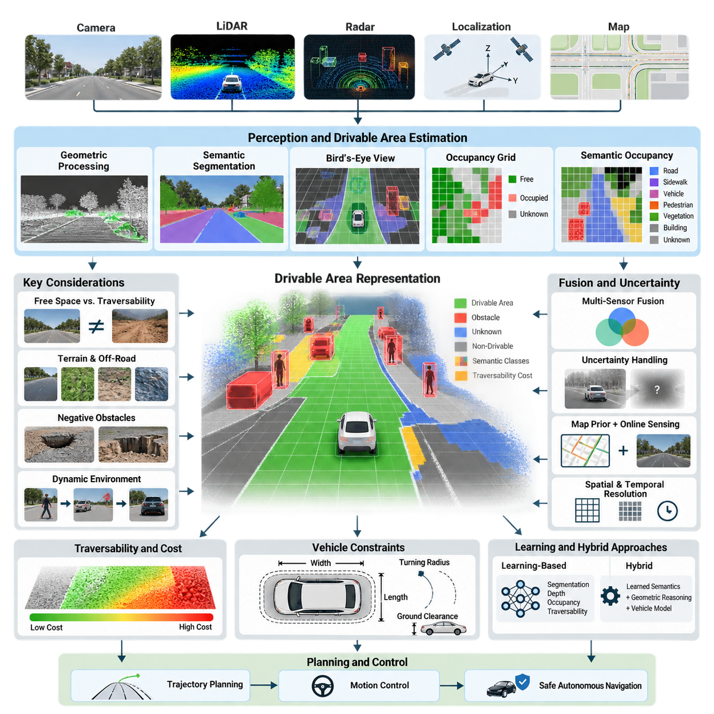
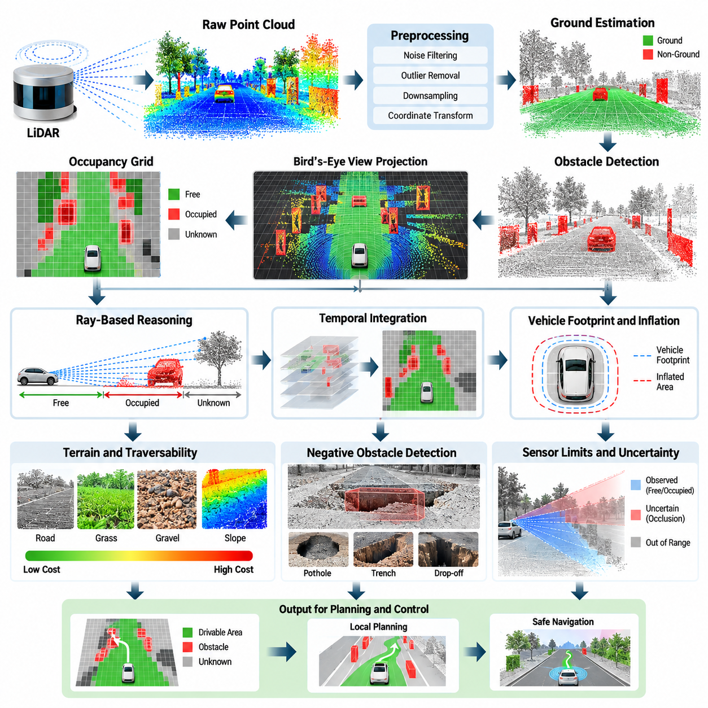
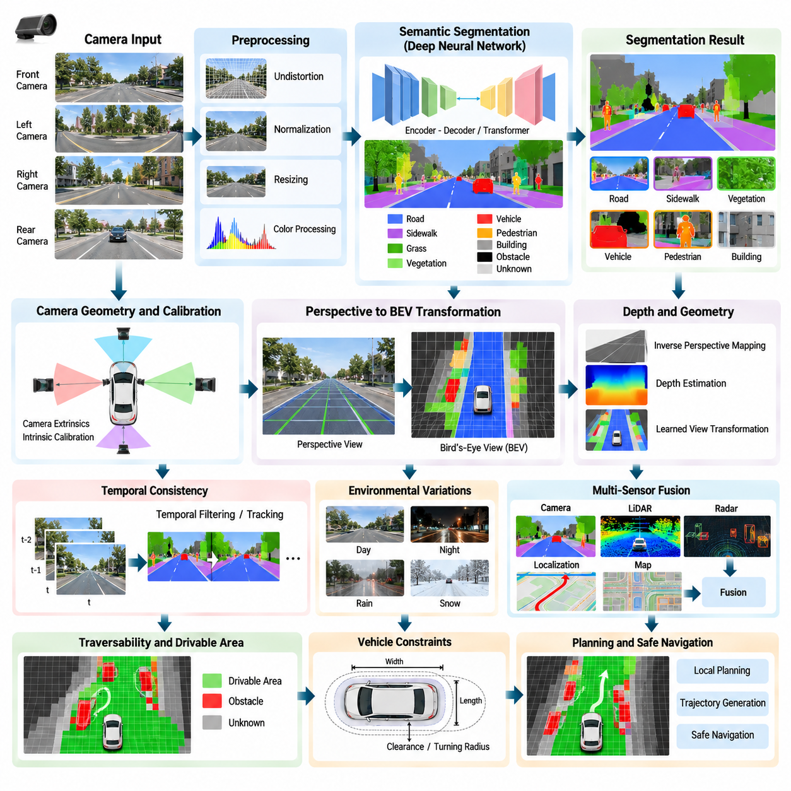
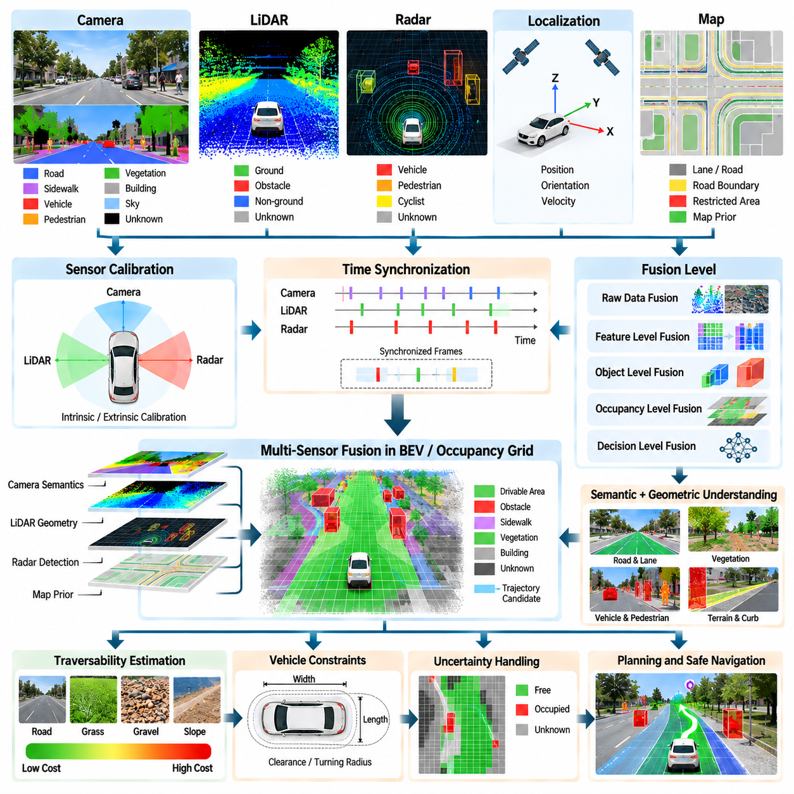
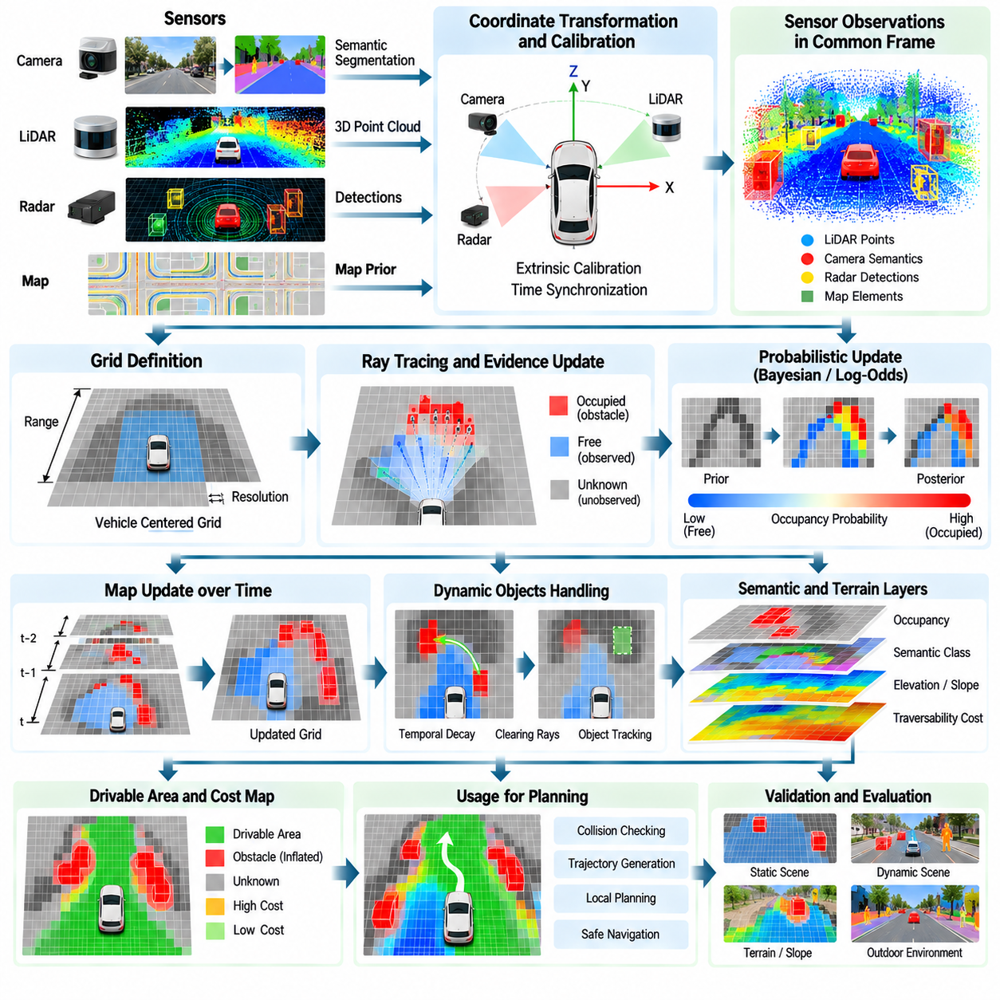
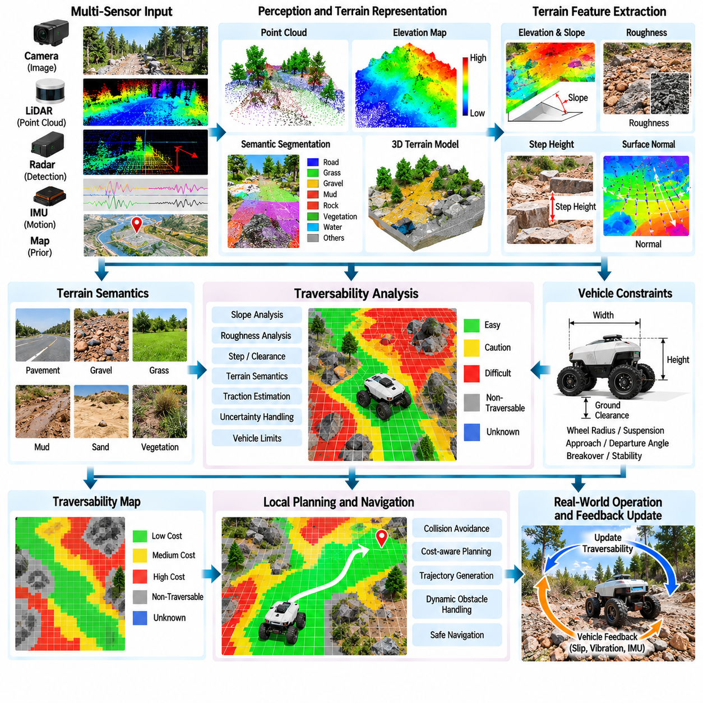
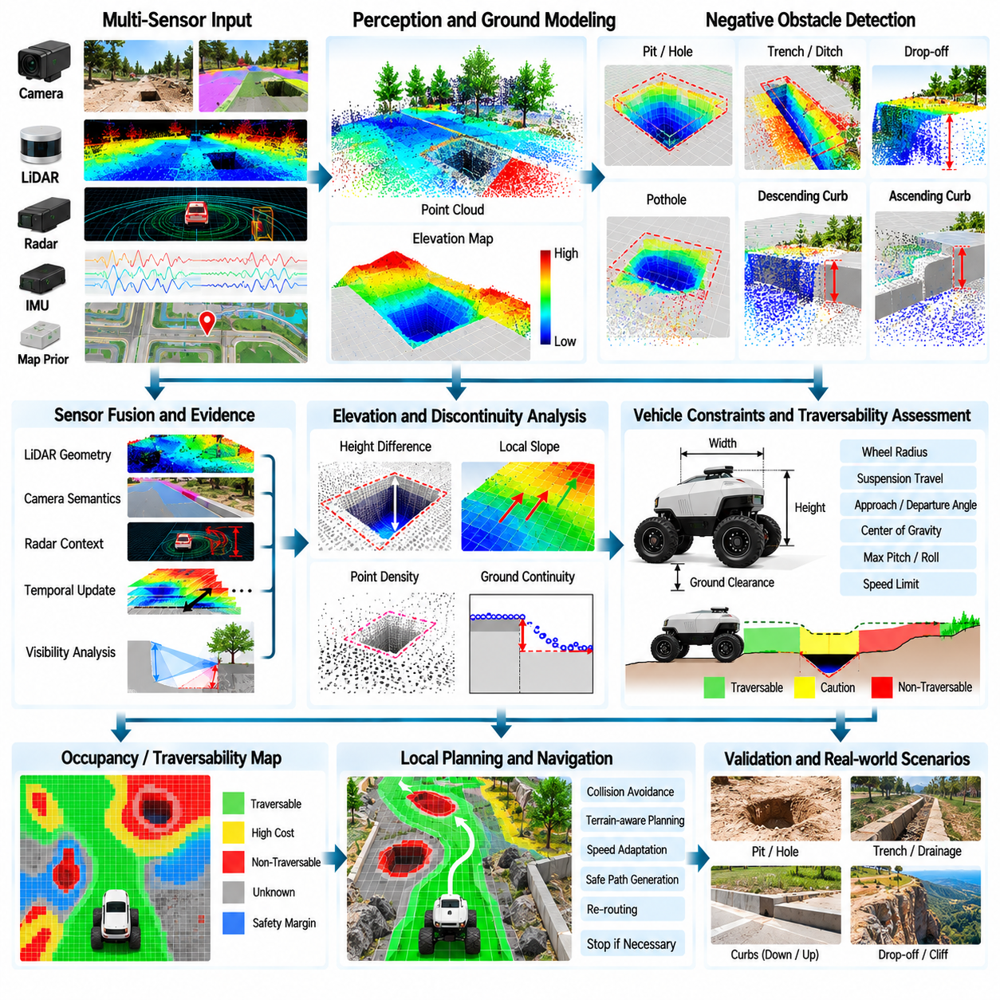
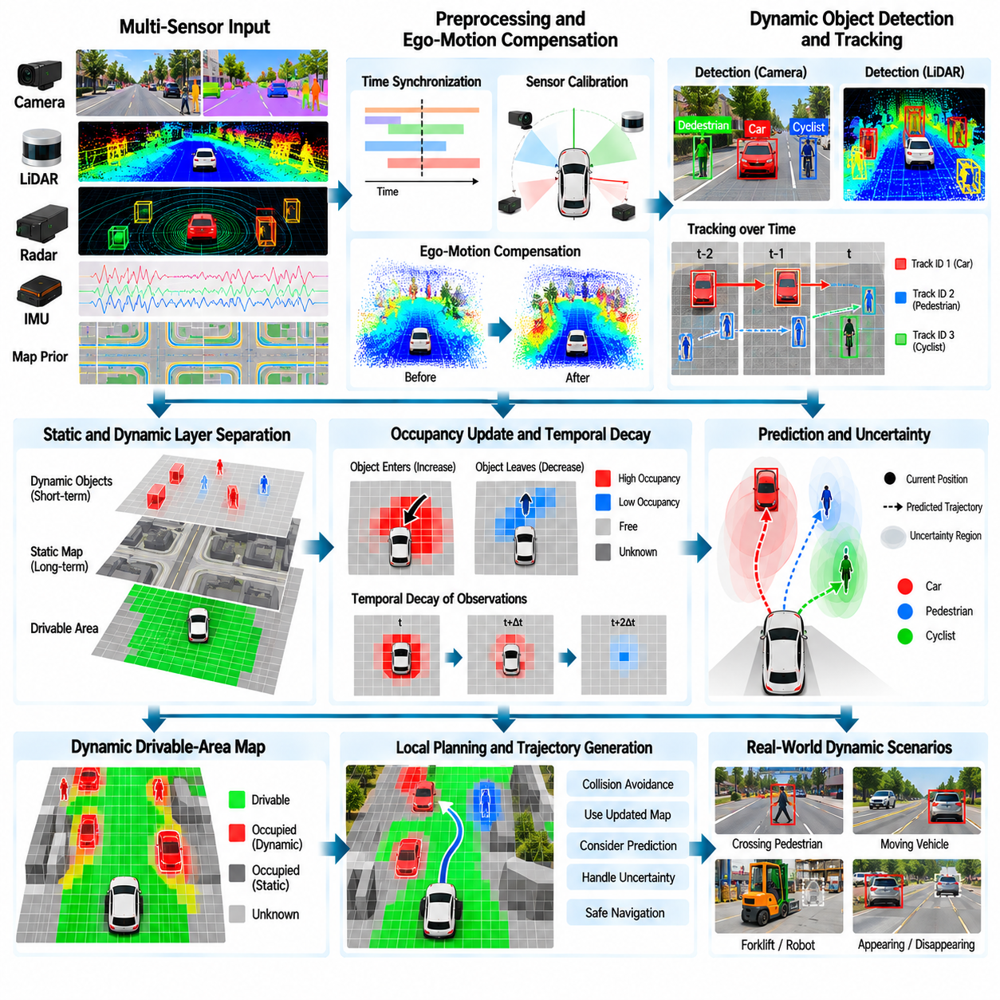
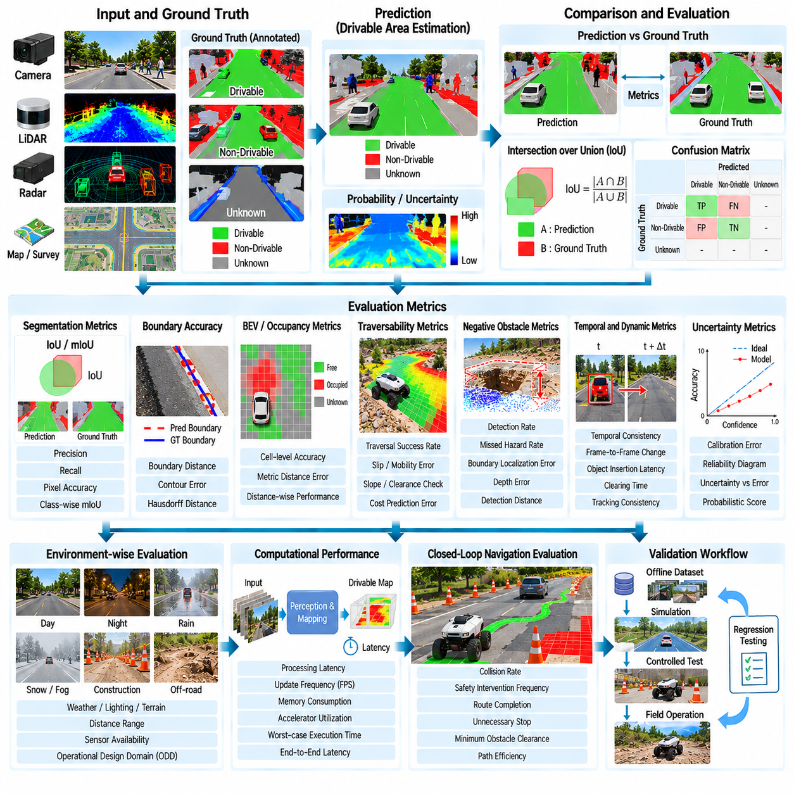
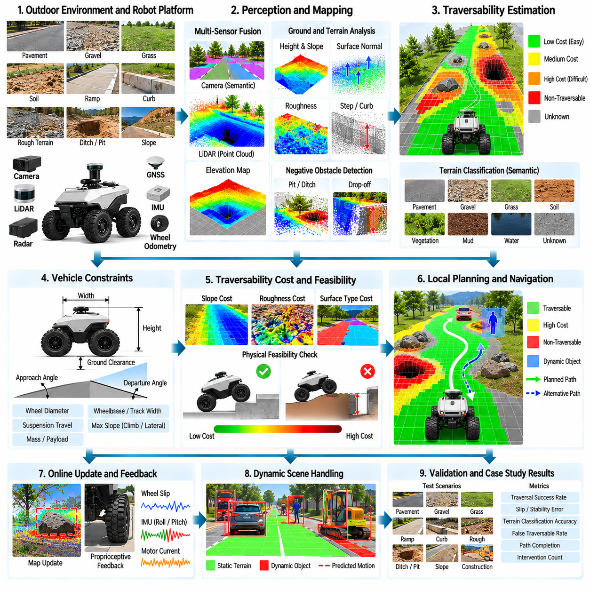

**Volume 12. Autonomous Driving Software**


# Chapter 04. Drivable Area Estimation

##  

## 04.01. Drivable Area Estimation Methods Overview

{width="7.268055555555556in" height="7.268055555555556in"}

Drivable area estimation determines which portions of the surrounding environment can be safely occupied by an autonomous vehicle or mobile robot. Unlike object detection, which identifies discrete entities such as pedestrians or vehicles, drivable area estimation reasons about continuous space. Its output forms a geometric and semantic representation of where the platform may move while respecting terrain, obstacles, boundaries, and operational constraints.

Within an autonomous driving software stack, drivable area estimation connects sensor processing with planning and control. Raw camera images, LiDAR point clouds, radar observations, localization information, and map data are transformed into representations such as free-space polygons, segmentation masks, occupancy grids, or traversability maps. These representations allow downstream planners to distinguish feasible motion regions from occupied, uncertain, or prohibited space.

A fundamental distinction exists between free-space detection and traversability estimation. Free space indicates that no obstacle has currently been observed in a region, but this does not necessarily mean that the region can be traversed safely. A surface may appear unoccupied while containing excessive slope, loose soil, deep water, vegetation, stairs, potholes, or other terrain properties that exceed the vehicle\'s physical capabilities.

Classical geometric approaches estimate drivable space primarily from sensor geometry. LiDAR-based systems analyze point heights, local surface normals, gradients, discontinuities, and point density to separate ground from obstacles. After ground segmentation, regions without detected obstacles can be projected onto a two-dimensional plane or bird\'s-eye-view representation. These methods are computationally efficient and remain valuable when explicit geometric reasoning is required.

Camera-based approaches infer drivable regions from visual appearance and scene semantics. Traditional techniques used color, texture, edges, vanishing points, and geometric assumptions, while modern systems typically employ convolutional neural networks or transformer-based semantic segmentation models. Pixels may be classified into road, sidewalk, grass, vegetation, obstacle, unknown, and other categories before being transformed into a spatial representation suitable for navigation.

Bird\'s-eye-view representations are particularly useful because motion planning operates naturally in a ground-referenced coordinate system. Perspective camera observations can be projected into BEV using geometric transformations or learned view transformations. LiDAR and radar measurements can also be represented in the same coordinate frame, enabling multiple sensor modalities to contribute to a unified description of the space surrounding the vehicle.

Occupancy grids provide another widely used representation. The environment is divided into cells whose states indicate free, occupied, or unknown space, often with probabilistic values rather than binary labels. Measurements accumulated over time update these probabilities as the robot moves. Occupancy representations are especially useful for local planning because they provide a compact interface between perception and collision-aware trajectory generation.

Semantic occupancy extends geometric occupancy by describing what occupies each region. Instead of merely determining that a cell is occupied, the system may distinguish vehicles, pedestrians, vegetation, curbs, walls, terrain, or other semantic classes. This additional information enables planners to apply different policies to different environmental structures and provides a foundation for richer scene understanding and predictive autonomous behavior.

Multi-sensor fusion improves robustness by exploiting complementary sensing characteristics. Cameras provide dense appearance and semantic information, LiDAR provides accurate three-dimensional geometry, radar contributes velocity and robust ranging under difficult visibility conditions, while GNSS and inertial localization place observations in consistent coordinates. Fusion can occur at raw-data, feature, object, occupancy, or decision levels depending on system architecture and computational constraints.

Outdoor AMRs require a broader interpretation of drivable space than conventional road vehicles. Their operational domains may include sidewalks, industrial yards, construction sites, ports, campuses, gravel roads, grass, ramps, and partially structured terrain. Consequently, lane boundaries alone cannot define mobility. The system must estimate whether terrain is physically traversable according to vehicle dimensions, ground clearance, wheel configuration, slope limits, traction, and stability.

Traversability can therefore be represented as a continuous cost rather than a binary decision. Flat pavement may receive a low traversal cost, while rough ground, steep slopes, narrow passages, or uncertain terrain receive progressively higher costs. Completely blocked or physically infeasible regions receive prohibitive costs. Such cost maps allow planners to optimize trajectories by balancing distance, safety margin, terrain difficulty, energy consumption, and mission objectives.

Negative obstacles create a particularly difficult perception problem. A wall or parked vehicle produces positive geometric returns, whereas a ditch, hole, downward step, or missing road surface may be characterized by an absence or sudden disappearance of measurements. Detecting these hazards requires reasoning about surface continuity, expected ground geometry, visibility, sensor occlusion, and temporal evidence rather than simply searching for elevated points.

Dynamic environments further require the drivable-area representation to evolve continuously. A region that was free seconds earlier may become occupied by a pedestrian, vehicle, forklift, or another robot. Conversely, temporarily blocked space may become available again. Sensor observations must therefore be time-aligned and repeatedly integrated so that the representation reflects current conditions rather than preserving stale obstacles indefinitely.

Uncertainty is essential because absence of evidence must not automatically be interpreted as evidence of free space. Occluded regions, areas beyond sensor range, surfaces with poor reflectivity, severe shadows, precipitation, dust, or sparse point-cloud coverage may remain unknown. A safety-oriented system explicitly represents this uncertainty and allows planning policies to treat unknown regions differently from confidently observed free regions.

Map information can complement online perception by providing prior knowledge about roads, lanes, sidewalks, restricted zones, buildings, and expected boundaries. However, maps should not replace real-time sensing because construction, parked equipment, temporary barriers, vegetation, and environmental changes can invalidate prior information. Practical systems therefore combine map priors with current observations and preserve mechanisms for detecting disagreements between them.

The spatial resolution and temporal update rate of drivable-area estimation directly affect planning quality and computational demand. Fine grids preserve narrow obstacles and detailed boundaries but consume more memory and processing time. Coarse representations are efficient but may hide small hazards. Designers therefore select resolution, sensing range, update frequency, and representation format according to vehicle speed, stopping distance, platform dimensions, and available compute resources.

Drivable area estimation must also account for the physical footprint of the vehicle. A point may lie in free space while the complete vehicle body cannot pass through the surrounding geometry. Obstacle inflation, footprint convolution, swept-volume analysis, or configuration-space reasoning converts perceived environmental geometry into regions that are feasible for a platform with finite width, length, turning radius, and steering constraints.

Modern learning-based methods increasingly estimate geometry, semantics, depth, occupancy, and traversability jointly. Multi-task networks can share representations across segmentation, depth estimation, object detection, and BEV prediction, reducing redundant computation and improving contextual reasoning. Learned approaches can recognize complex terrain patterns that are difficult to encode manually, but their reliability depends strongly on training coverage, domain diversity, calibration, and uncertainty handling.

Hybrid architectures combine learned perception with explicit geometric reasoning. A neural network may identify semantic terrain classes while LiDAR estimates surface geometry and an analytical vehicle model determines whether the resulting terrain is traversable. This separation is useful because semantic recognition and physical feasibility are different questions. A surface classified as grass, for example, may be traversable for one AMR configuration but prohibited for another.

The resulting drivable-area representation ultimately serves as a contract between perception and motion planning. It should communicate not only where the robot can move, but also confidence, terrain cost, obstacle boundaries, semantic restrictions, and relevant temporal changes. The attached software structure consequently develops this topic from LiDAR and camera methods through sensor fusion, occupancy grids, off-road traversability, negative obstacles, dynamic updates, validation, and an outdoor AMR case study.

For Physical AI systems, drivable area estimation can evolve beyond static perception toward predictive environmental understanding. A world model may estimate how free space will change as agents move, how terrain properties affect future vehicle motion, and how uncertainty propagates through planned actions. This transforms drivable-area estimation from simple road segmentation into an active spatial reasoning process connecting perception, vehicle embodiment, prediction, planning, and safe autonomous action.

주행 가능 영역 추정(Drivable Area Estimation)은 자율주행 차량(Autonomous Vehicle)이나 이동 로봇(Mobile Robot)이 주변 환경에서 안전하게 점유하며 이동할 수 있는 공간을 판단하는 과정이다. 보행자나 차량과 같은 개별 객체를 식별하는 객체 검출(Object Detection)과 달리, 주행 가능 영역 추정은 연속적인 공간(Continuous Space)을 대상으로 추론한다. 그 결과는 플랫폼이 지형, 장애물, 경계 및 운용 제약을 고려하면서 이동할 수 있는 위치를 기하학적(Geometric)·의미론적(Semantic) 형태로 표현한다.

자율주행 소프트웨어 스택(Autonomous Driving Software Stack)에서 주행 가능 영역 추정은 센서 처리(Sensor Processing)와 계획 및 제어(Planning and Control)를 연결한다. 카메라 영상, 라이다 포인트 클라우드(LiDAR Point Cloud), 레이더 관측(Radar Observation), 위치추정(Localization) 정보 및 지도(Map) 데이터는 자유 공간 폴리곤(Free-Space Polygon), 분할 마스크(Segmentation Mask), 점유 격자(Occupancy Grid), 주행성 지도(Traversability Map) 등의 표현으로 변환된다. 이러한 표현을 통해 하위 계획기(Planner)는 이동 가능한 영역을 점유 공간, 불확실 공간 또는 진입 금지 공간과 구분할 수 있다.

기본적으로 자유 공간 검출(Free-Space Detection)과 주행성 추정(Traversability Estimation)은 서로 구분되어야 한다. 자유 공간은 특정 영역에서 현재 장애물이 관측되지 않았다는 것을 의미하지만, 해당 영역을 반드시 안전하게 주행할 수 있다는 의미는 아니다. 표면에 장애물이 없어 보이더라도 과도한 경사, 느슨한 토양, 깊은 물, 식생, 계단, 포트홀(Pothole) 또는 차량의 물리적 한계를 초과하는 지형 특성이 존재할 수 있다.

고전적인 기하학 기반 접근법(Geometric Approach)은 주로 센서에서 획득한 기하 정보를 이용하여 주행 가능 공간을 추정한다. 라이다 기반 시스템(LiDAR-Based System)은 포인트 높이, 국부 표면 법선(Local Surface Normal), 기울기, 불연속성 및 포인트 밀도를 분석하여 지면과 장애물을 분리한다. 지면 분할(Ground Segmentation) 이후 장애물이 검출되지 않은 영역은 2차원 평면 또는 조감도(Bird\'s-Eye View, BEV) 표현으로 투영할 수 있다. 이러한 방식은 계산 효율성이 높으며 명시적인 기하 추론(Geometric Reasoning)이 필요한 환경에서 여전히 중요하다.

카메라 기반 접근법(Camera-Based Approach)은 시각적 외형과 장면의 의미 정보를 이용하여 주행 가능 영역을 추론한다. 전통적인 방식에서는 색상, 질감, 에지(Edge), 소실점(Vanishing Point), 기하학적 가정을 사용했지만, 현대 시스템에서는 일반적으로 합성곱 신경망(Convolutional Neural Network, CNN) 또는 트랜스포머 기반(Transformer-Based) 의미론적 분할(Semantic Segmentation) 모델을 활용한다. 픽셀은 도로, 보도, 잔디, 식생, 장애물, 미확인 영역 등의 클래스로 분류된 후 내비게이션(Navigation)에 적합한 공간 표현으로 변환될 수 있다.

조감도 표현(Bird\'s-Eye-View Representation)은 모션 계획(Motion Planning)이 지면 기준 좌표계(Ground-Referenced Coordinate System)에서 자연스럽게 수행되기 때문에 특히 유용하다. 원근 카메라 관측(Perspective Camera Observation)은 기하학적 변환 또는 학습 기반 시점 변환(Learned View Transformation)을 통해 BEV로 투영할 수 있다. 라이다와 레이더 측정값도 동일한 좌표계에 표현할 수 있으므로 여러 센서 모달리티(Sensor Modality)를 주변 공간에 대한 통합 표현으로 결합할 수 있다.

점유 격자(Occupancy Grid)는 널리 사용되는 또 다른 표현 방법이다. 환경을 여러 셀(Cell)로 분할하고 각 셀의 상태를 자유(Free), 점유(Occupied), 미확인(Unknown)으로 나타내며, 이진 값 대신 확률값(Probabilistic Value)을 사용할 수도 있다. 로봇이 이동하면서 시간에 따라 누적되는 측정값을 이용해 이러한 확률을 지속적으로 갱신한다. 점유 표현(Occupancy Representation)은 인지(Perception)와 충돌 회피 기반 궤적 생성(Collision-Aware Trajectory Generation) 사이에 간결한 인터페이스를 제공하므로 지역 경로 계획(Local Planning)에 특히 유용하다.

의미론적 점유(Semantic Occupancy)는 각 영역에 무엇이 존재하는지를 설명함으로써 기하학적 점유 개념을 확장한다. 단순히 특정 셀이 점유되었다고 판단하는 것을 넘어 차량, 보행자, 식생, 연석(Curb), 벽, 지형 또는 기타 의미론적 클래스(Semantic Class)를 구분할 수 있다. 이러한 추가 정보는 계획기가 환경 구조에 따라 서로 다른 정책(Policy)을 적용하도록 하며, 보다 풍부한 장면 이해(Scene Understanding)와 예측 기반 자율 행동(Predictive Autonomous Behavior)의 기반을 제공한다.

다중 센서 융합(Multi-Sensor Fusion)은 서로 보완적인 센서 특성을 활용하여 시스템의 강건성(Robustness)을 향상시킨다. 카메라는 밀집된 외형 및 의미 정보를 제공하고, 라이다는 정확한 3차원 기하 정보를 제공하며, 레이더는 어려운 가시성 조건에서도 속도와 거리 정보를 제공한다. GNSS와 관성 기반 위치추정(Inertial Localization)은 이러한 관측값을 일관된 좌표계에 배치한다. 시스템 구조와 계산 제약에 따라 원시 데이터(Raw Data), 특징(Feature), 객체(Object), 점유(Occupancy) 또는 의사결정(Decision) 수준에서 융합할 수 있다.

야외 자율이동로봇(Outdoor AMR)은 일반적인 도로 차량보다 더 넓은 의미의 주행 가능 공간을 요구한다. 운용 설계 영역(Operational Design Domain, ODD)에는 보도, 산업 단지, 건설 현장, 항만, 캠퍼스, 자갈길, 잔디, 경사로 및 부분적으로 구조화된 지형이 포함될 수 있다. 따라서 차선 경계만으로 이동 가능 영역을 정의할 수 없다. 시스템은 차량 크기, 지상고(Ground Clearance), 휠 구성, 허용 경사도, 견인력(Traction), 안정성(Stability)을 고려하여 지형의 물리적 주행 가능성을 판단해야 한다.

따라서 주행성(Traversability)은 이진 판단(Binary Decision)이 아니라 연속적인 비용(Continuous Cost)으로 표현할 수 있다. 평탄한 포장도로에는 낮은 주행 비용(Traversal Cost)을 부여하고, 거친 지면, 급경사, 좁은 통로 또는 불확실한 지형에는 점차 높은 비용을 부여할 수 있다. 완전히 차단되거나 물리적으로 통과할 수 없는 영역에는 금지 수준의 비용(Prohibitive Cost)을 부여한다. 이러한 비용 지도(Cost Map)를 이용하면 계획기는 거리, 안전 여유(Safety Margin), 지형 난이도, 에너지 소비 및 임무 목표를 종합적으로 고려하여 궤적을 최적화할 수 있다.

음의 장애물(Negative Obstacle)은 특히 어려운 인지 문제를 만든다. 벽이나 주차 차량과 같은 일반적인 장애물은 양의 기하학적 반사값을 생성하지만, 도랑, 구덩이, 하향 단차 또는 사라진 노면은 측정값이 없거나 갑자기 사라지는 형태로 나타날 수 있다. 이러한 위험 요소를 검출하려면 단순히 높은 포인트를 탐색하는 것이 아니라 표면 연속성(Surface Continuity), 예상 지면 형상, 가시성, 센서 가림(Occlusion), 시간적 관측 정보(Temporal Evidence)를 함께 추론해야 한다.

동적 환경(Dynamic Environment)에서는 주행 가능 영역 표현 역시 지속적으로 변화해야 한다. 몇 초 전까지 자유 공간이었던 영역이 보행자, 차량, 지게차 또는 다른 로봇에 의해 점유될 수 있다. 반대로 일시적으로 차단되었던 공간이 다시 사용 가능해질 수도 있다. 따라서 센서 관측은 시간 동기화(Time Alignment)되어 반복적으로 통합되어야 하며, 주행 가능 영역 표현은 오래된 장애물 정보를 유지하는 것이 아니라 현재 환경 상태를 반영해야 한다.

불확실성(Uncertainty)의 표현도 중요하다. 관측 증거가 없다는 사실을 자동으로 자유 공간의 증거로 해석해서는 안 된다. 가려진 영역, 센서 범위를 벗어난 공간, 낮은 반사율을 가진 표면, 심한 그림자, 강수, 먼지 또는 희박한 포인트 클라우드 영역은 미확인 상태로 남을 수 있다. 안전 중심 시스템(Safety-Oriented System)은 이러한 불확실성을 명시적으로 표현하고 계획 정책이 미확인 영역과 신뢰도 높게 관측된 자유 영역을 서로 다르게 처리하도록 한다.

지도 정보(Map Information)는 도로, 차선, 보도, 제한 구역, 건물 및 예상 경계에 대한 사전 지식(Prior Knowledge)을 제공하여 온라인 인지(Online Perception)를 보완할 수 있다. 그러나 공사, 주차된 장비, 임시 장벽, 식생 변화 및 기타 환경 변화로 인해 기존 지도 정보가 실제 환경과 달라질 수 있으므로 지도만으로 실시간 센싱(Real-Time Sensing)을 대체해서는 안 된다. 실제 시스템에서는 지도 사전정보(Map Prior)와 현재 센서 관측을 결합하면서 두 정보 사이의 불일치를 검출할 수 있는 메커니즘을 유지해야 한다.

주행 가능 영역 추정의 공간 해상도(Spatial Resolution)와 시간적 갱신율(Temporal Update Rate)은 계획 성능과 계산 부하에 직접적인 영향을 미친다. 세밀한 격자는 좁은 장애물과 상세한 경계를 보존하지만 더 많은 메모리와 연산량을 요구한다. 반대로 거친 표현은 효율적이지만 작은 위험 요소를 놓칠 수 있다. 따라서 설계자는 차량 속도, 정지 거리(Stopping Distance), 플랫폼 크기 및 가용 연산 자원을 고려하여 해상도, 센싱 범위, 갱신 주기 및 표현 형식을 결정해야 한다.

주행 가능 영역 추정은 차량의 실제 외형 크기(Vehicle Footprint)도 고려해야 한다. 특정 지점 자체는 자유 공간에 위치하더라도 차량 전체가 주변 구조물 사이를 통과하지 못할 수 있다. 장애물 팽창(Obstacle Inflation), 차량 외형 합성(Footprint Convolution), 스윕 볼륨 분석(Swept-Volume Analysis) 또는 구성 공간 추론(Configuration-Space Reasoning)을 사용하면 인지된 환경의 기하 정보를 차량의 폭, 길이, 최소 회전 반경 및 조향 제약을 고려한 실제 이동 가능 영역으로 변환할 수 있다.

현대의 학습 기반 방법(Learning-Based Method)은 기하 구조, 의미 정보, 깊이(Depth), 점유 상태 및 주행성을 공동으로 추정하는 방향으로 발전하고 있다. 다중 작업 신경망(Multi-Task Network)은 분할, 깊이 추정, 객체 검출 및 BEV 예측 사이에서 특징 표현을 공유함으로써 중복 연산을 줄이고 상황적 추론(Contextual Reasoning)을 향상시킬 수 있다. 학습 기반 접근법은 수작업 규칙으로 표현하기 어려운 복잡한 지형 패턴을 인식할 수 있지만 신뢰성은 학습 데이터의 범위, 도메인 다양성, 보정(Calibration), 불확실성 처리 능력에 크게 의존한다.

하이브리드 구조(Hybrid Architecture)는 학습 기반 인지와 명시적인 기하학적 추론을 결합한다. 신경망이 의미론적 지형 클래스(Semantic Terrain Class)를 식별하고 라이다가 표면의 기하 구조를 추정한 후, 해석적 차량 모델(Analytical Vehicle Model)이 해당 지형을 실제로 통과할 수 있는지 판단할 수 있다. 이러한 분리는 의미론적 인식과 물리적 이동 가능성이 서로 다른 문제이기 때문에 유용하다. 예를 들어 잔디로 분류된 표면도 특정 AMR 구성에서는 주행 가능하지만 다른 플랫폼에서는 진입 금지 영역이 될 수 있다.

최종적으로 생성된 주행 가능 영역 표현은 인지(Perception)와 모션 계획(Motion Planning) 사이의 인터페이스 계약(Interface Contract) 역할을 한다. 이는 로봇이 이동할 수 있는 위치뿐만 아니라 신뢰도, 지형 비용, 장애물 경계, 의미론적 제한 및 중요한 시간적 변화까지 전달해야 한다. 따라서 전체 소프트웨어 구조에서는 라이다 및 카메라 기반 방법에서 시작하여 센서 융합, 점유 격자, 오프로드 주행성, 음의 장애물, 동적 갱신, 검증(Validation), 야외 AMR 사례 연구(Case Study)로 단계적으로 확장된다.

피지컬 AI(Physical AI) 시스템에서 주행 가능 영역 추정은 정적인 환경 인지를 넘어 예측적 환경 이해(Predictive Environmental Understanding)로 발전할 수 있다. 월드 모델(World Model)은 주변 에이전트가 이동함에 따라 자유 공간이 어떻게 변화하는지, 지형 특성이 미래의 차량 움직임에 어떤 영향을 미치는지, 계획된 행동 과정에서 불확실성이 어떻게 전파되는지를 예측할 수 있다. 이를 통해 주행 가능 영역 추정은 단순한 도로 분할(Road Segmentation)을 넘어 인지, 차량의 체화 특성(Embodiment), 예측, 계획 및 안전한 자율 행동을 연결하는 능동적 공간 추론(Active Spatial Reasoning) 과정으로 발전한다.

##  

## 04.02. LiDAR Based Free Space Detection [w/Code]

{width="7.268055555555556in" height="7.268055555555556in"}

LiDAR-based free-space detection identifies regions around an autonomous vehicle or AMR where no physical obstacle is detected and where movement may potentially be possible. Unlike camera segmentation, which primarily reasons from visual appearance, LiDAR provides direct three-dimensional geometric measurements. The fundamental task is therefore to transform a point cloud into a spatial representation that distinguishes ground or traversable surfaces from obstacles, unknown regions, and geometrically unsafe areas.

The processing pipeline normally begins with LiDAR point-cloud acquisition and preprocessing. Raw measurements may contain noise, outliers, reflections, motion distortion, and points originating from the robot itself. Filtering, coordinate transformation, and downsampling are therefore applied before free-space estimation. The processed points are transformed into a vehicle-centered coordinate frame so that subsequent ground estimation, obstacle detection, and spatial projection can be performed consistently with localization and motion-planning modules.

Ground estimation is one of the central operations in LiDAR-based free-space detection. A typical approach analyzes the height and local geometric structure of points relative to the expected ground surface. Methods based on height thresholds, local slope, surface normals, plane fitting, elevation maps, or scan-line characteristics can separate probable ground points from elevated obstacles. For outdoor AMRs, however, the ground cannot always be modeled as a single flat plane because roads, ramps, slopes, gravel, and uneven terrain can produce significant elevation changes.

After ground estimation, the remaining points are interpreted as potential obstacles or non-traversable structures. Objects such as vehicles, pedestrians, walls, poles, curbs, barriers, and equipment produce geometric discontinuities above the estimated ground surface. The system can project these measurements into a two-dimensional bird\'s-eye-view representation and mark corresponding regions as occupied. This representation provides a direct spatial interface for local planning because obstacle locations are expressed relative to the robot rather than only as image coordinates.

Free space can then be estimated from the relationship between observed ground and occupied regions. Areas containing valid ground observations and without detected obstacles are considered candidate free space, while regions containing obstacles are classified as occupied. Areas outside the LiDAR observation range or hidden behind obstacles should generally remain unknown rather than automatically being classified as free. This distinction is important because LiDAR measures only the portions of the environment that are geometrically visible to the sensor.

Ray-based reasoning can further improve free-space estimation. A LiDAR beam travels from the sensor toward a measured return, and the space before the return provides evidence that the beam path was not occupied by a detected obstacle. The measured endpoint can represent an obstacle or surface boundary depending on its height and local geometry. By accumulating these ray observations into a grid, the system can estimate free, occupied, and unknown cells while preserving the relationship between sensor visibility and environmental geometry.

The resulting representation is often converted into an occupancy grid or local cost map. Each cell can store a state or probability describing whether the region is free, occupied, or unknown. Temporal integration allows multiple LiDAR scans to reinforce stable observations and reduce the effect of individual noisy measurements. However, temporal accumulation must also account for moving objects and changing environments. Stale obstacle information can otherwise remain in the map and incorrectly restrict subsequent motion planning.

Vehicle geometry must be considered after free-space extraction. A LiDAR point may indicate that a particular location is free while the complete AMR footprint cannot pass through that region. The free-space representation therefore needs to account for vehicle width, length, ground clearance, turning characteristics, and safety margins. Obstacle inflation or footprint-based spatial filtering can convert point-level observations into a representation that more accurately reflects whether the entire platform can physically occupy a region.

Outdoor AMRs introduce additional challenges because their environments are not necessarily structured around conventional road geometry. A robot may operate on pavement, grass, gravel, soil, ramps, industrial yards, construction areas, or mixed terrain. LiDAR geometry can identify whether a surface is physically present, but free space alone does not guarantee traversability. Terrain slope, roughness, step height, clearance, expected traction, and vehicle stability may need to be evaluated separately before a candidate region is accepted as operationally traversable.

Negative obstacles require particular attention because they may not generate conventional obstacle returns. Pits, trenches, drop-offs, holes, and missing ground can appear as discontinuities or unexpected gaps in the point cloud. A simple rule that treats every unoccupied region as free can therefore create dangerous decisions. Reliable detection requires reasoning about expected ground continuity, elevation changes, point distribution, sensor visibility, and the geometry of the surrounding surface to distinguish genuine free space from potentially hazardous unknown space.

LiDAR-based free-space detection is also sensitive to sensor configuration and environmental conditions. Sensor height, vertical field of view, angular resolution, range, mounting position, and scan frequency determine which portions of the environment can be observed. Dust, rain, fog, vegetation, reflective materials, transparent surfaces, and sparse returns can degrade geometric reliability. Consequently, a practical system should associate confidence or uncertainty with its free-space estimate rather than treating every LiDAR-derived cell as equally reliable.

For an autonomous driving software architecture, LiDAR-based free-space detection is best regarded as a perception component that supplies structured spatial evidence to downstream modules. Its output can be fused with camera-based semantic information, radar observations, localization, and map data to construct a more complete drivable-area representation. This layered approach separates geometric evidence from semantic interpretation while allowing the final planning system to reason about obstacles, free space, uncertainty, and vehicle-specific traversability within a common spatial framework.

라이다 기반 자유 공간 검출(LiDAR-Based Free-Space Detection)은 자율주행 차량(Autonomous Vehicle)이나 자율이동로봇(AMR) 주변에서 물리적 장애물이 검출되지 않고 잠재적으로 이동이 가능한 영역을 식별하는 기술이다. 시각적 외형을 중심으로 추론하는 카메라 분할(Camera Segmentation)과 달리 라이다는 직접적인 3차원 기하 측정(Three-Dimensional Geometric Measurement)을 제공한다. 따라서 핵심 과제는 포인트 클라우드(Point Cloud)를 지면 또는 주행 가능한 표면, 장애물, 미확인 영역 및 기하학적으로 위험한 영역으로 구분되는 공간 표현으로 변환하는 것이다.

처리 파이프라인(Processing Pipeline)은 일반적으로 라이다 포인트 클라우드 획득(LiDAR Point-Cloud Acquisition)과 전처리(Preprocessing)부터 시작한다. 원시 측정값(Raw Measurement)에는 노이즈(Noise), 이상치(Outlier), 반사(Reflection), 모션 왜곡(Motion Distortion) 및 로봇 자체에서 발생하는 포인트가 포함될 수 있다. 따라서 자유 공간 추정(Free-Space Estimation) 이전에 필터링(Filtering), 좌표 변환(Coordinate Transformation), 다운샘플링(Downsampling)이 적용된다. 처리된 포인트는 차량 중심 좌표계(Vehicle-Centered Coordinate Frame)로 변환되어 지면 추정(Ground Estimation), 장애물 검출(Obstacle Detection), 공간 투영(Spatial Projection)이 위치추정(Localization) 및 모션 계획(Motion Planning) 모듈과 일관되게 수행되도록 한다.

지면 추정(Ground Estimation)은 라이다 기반 자유 공간 검출의 핵심 작업 중 하나이다. 일반적인 방법은 예상되는 지면 표면(Expected Ground Surface)을 기준으로 포인트의 높이와 국부적인 기하 구조(Local Geometric Structure)를 분석한다. 높이 임계값(Height Threshold), 국부 경사(Local Slope), 표면 법선(Surface Normal), 평면 피팅(Plane Fitting), 고도 지도(Elevation Map) 또는 스캔 라인 특성(Scan-Line Characteristics)에 기반한 방법을 사용하여 지면으로 판단되는 포인트와 높게 형성된 장애물을 분리할 수 있다. 그러나 야외 AMR에서는 지면을 항상 하나의 평탄한 평면으로 모델링할 수 없다. 도로, 램프, 자갈, 경사면 및 불균일한 지형은 상당한 고도 변화를 발생시킬 수 있기 때문이다.

지면 추정 이후 나머지 포인트는 잠재적인 장애물 또는 비주행 가능 구조물(Non-Traversable Structure)로 해석된다. 차량, 보행자, 벽, 기둥, 연석, 장벽 및 장비와 같은 객체는 일반적으로 추정된 지면 표면보다 높은 위치에서 기하학적 불연속성(Geometric Discontinuity)을 생성한다. 시스템은 이러한 측정값을 2차원 조감도(Bird\'s-Eye View, BEV) 표현으로 투영하고 해당 영역을 점유(Occupied) 상태로 표시할 수 있다. 이러한 표현은 장애물의 위치가 단순한 영상 좌표가 아니라 로봇을 기준으로 표현되기 때문에 지역 계획(Local Planning)을 위한 직접적인 공간 인터페이스를 제공한다.

자유 공간은 관측된 지면과 점유 영역 사이의 관계를 이용하여 추정할 수 있다. 유효한 지면 관측값이 존재하고 검출된 장애물이 없는 영역은 후보 자유 공간(Candidate Free Space)으로 간주할 수 있으며, 장애물이 포함된 영역은 점유 영역(Occupied Area)으로 분류된다. 라이다 관측 범위를 벗어난 영역이나 장애물 뒤에 가려진 영역은 자동으로 자유 공간으로 분류하기보다는 일반적으로 미확인 영역(Unknown Area)으로 유지해야 한다. 이는 라이다가 센서에서 기하학적으로 관측 가능한 환경의 일부만 측정하기 때문에 중요하다.

광선 기반 추론(Ray-Based Reasoning)을 적용하면 자유 공간 추정의 성능을 더욱 향상시킬 수 있다. 라이다 빔(LiDAR Beam)은 센서에서 측정된 반사점(Return)까지 이동하며, 해당 반사점 이전의 빔 경로는 검출된 장애물이 존재하지 않았다는 증거를 제공한다. 측정된 끝점(Endpoint)은 높이와 국부적인 기하 구조에 따라 장애물 또는 표면 경계를 나타낼 수 있다. 이러한 광선 관측값을 격자(Grid)에 누적하면 센서의 가시성(Environmental Visibility)과 기하 구조 사이의 관계를 유지하면서 자유(Free), 점유(Occupied), 미확인(Unknown) 셀을 추정할 수 있다.

결과적인 표현은 일반적으로 점유 격자(Occupancy Grid) 또는 지역 비용 지도(Local Cost Map)로 변환된다. 각 셀은 해당 영역이 자유, 점유 또는 미확인인지 나타내는 상태 또는 확률을 저장할 수 있다. 시간적 통합(Temporal Integration)을 사용하면 여러 라이다 스캔을 결합하여 안정적인 관측을 강화하고 개별 측정값의 노이즈 영향을 줄일 수 있다. 그러나 시간적 누적은 이동 객체와 변화하는 환경도 고려해야 한다. 그렇지 않으면 오래된 장애물 정보가 지도에 남아 이후의 모션 계획을 잘못 제한할 수 있다.

자유 공간 추출 이후에는 차량의 기하학적 형상(Vehicle Geometry)을 고려해야 한다. 라이다 포인트가 특정 위치가 자유롭다는 것을 나타내더라도 전체 AMR의 차체 외형(Footprint)이 해당 영역을 통과하지 못할 수 있다. 따라서 자유 공간 표현은 차량의 폭, 길이, 지상고(Ground Clearance), 회전 특성(Turning Characteristics) 및 안전 여유(Safety Margin)를 고려해야 한다. 장애물 팽창(Obstacle Inflation)이나 차체 외형 기반 공간 필터링(Footprint-Based Spatial Filtering)을 사용하면 포인트 수준의 관측값을 전체 플랫폼이 실제로 해당 영역을 점유하고 통과할 수 있는지를 보다 정확하게 나타내는 표현으로 변환할 수 있다.

야외 AMR은 기존 도로 차량과 달리 환경이 반드시 전통적인 도로 구조를 중심으로 구성되어 있지 않기 때문에 추가적인 어려움이 발생한다. 로봇은 포장도로, 잔디, 자갈, 토양, 램프, 산업 단지, 건설 현장 또는 다양한 지형이 혼합된 환경에서 운용될 수 있다. 라이다 기하 정보는 표면이 물리적으로 존재하는지를 식별할 수 있지만, 자유 공간이라는 사실만으로 주행 가능성이 보장되는 것은 아니다. 지형 경사, 거칠기(Roughness), 단차 높이, 지상고, 예상 견인력(Traction), 차량 안정성(Stability) 등을 별도로 평가해야 후보 영역이 실제 운용 가능한 주행 영역으로 인정될 수 있다.

음의 장애물(Negative Obstacle)은 라이다 기반 자유 공간 검출에서 특히 주의해야 할 문제이다. 구덩이, 도랑, 낭떠러지, 홀(Hole), 지면의 단절 등은 일반적인 장애물과 같은 반사점을 생성하지 않을 수 있다. 따라서 점유되지 않은 모든 영역을 자유 공간으로 처리하는 단순한 규칙은 위험한 판단을 만들 수 있다. 신뢰성 있는 검출을 위해서는 예상되는 지면 연속성(Ground Continuity), 고도 변화(Elevation Change), 포인트 분포(Point Distribution), 센서 가시성(Sensor Visibility), 주변 표면의 기하 구조를 함께 추론하여 실제 자유 공간과 잠재적으로 위험한 미확인 공간을 구분해야 한다.

라이다 기반 자유 공간 검출은 센서 구성과 환경 조건에도 민감하다. 센서 높이, 수직 시야각(Vertical Field of View), 각해상도(Angular Resolution), 측정 거리(Range), 장착 위치 및 스캔 주기(Scan Frequency)는 환경에서 어느 영역을 관측할 수 있는지를 결정한다. 먼지, 비, 안개, 식생, 반사율이 높은 물체, 투명한 표면 및 희박한 반사점(Sparse Return)은 기하학적 신뢰성을 저하시킬 수 있다. 따라서 실제 시스템에서는 모든 라이다 기반 셀을 동일하게 신뢰하기보다는 자유 공간 추정값에 신뢰도(Confidence) 또는 불확실성(Uncertainty)을 함께 부여하는 것이 바람직하다.

자율주행 소프트웨어 구조(Autonomous Driving Software Architecture)에서 라이다 기반 자유 공간 검출은 하위 모듈에 구조화된 공간 정보를 제공하는 인지 구성요소(Perception Component)로 보는 것이 적절하다. 출력 결과는 카메라 기반 의미 정보(Camera-Based Semantic Information), 레이더 관측(Radar Observation), 위치추정(Localization) 및 지도 정보(Map Data)와 융합되어 보다 완전한 주행 가능 영역 표현(Drivable-Area Representation)을 구성할 수 있다. 이러한 계층적 접근법은 기하학적 증거(Geometric Evidence)와 의미론적 해석(Semantic Interpretation)을 분리하면서도 최종 계획 시스템이 공통 공간 표현(Common Spatial Representation) 안에서 장애물, 자유 공간, 불확실성 및 차량별 주행성을 함께 추론할 수 있도록 한다.

##  

## 04.03. Camera Based Road Segmentation BEV [w/Code]

{width="7.268055555555556in" height="7.268055555555556in"}

Camera-based road segmentation estimates which image regions correspond to road or potentially drivable surfaces by analyzing visual information captured from onboard cameras. Unlike LiDAR-based methods, which rely primarily on three-dimensional geometry, camera segmentation uses appearance, texture, color, shape, context, and learned semantic representations. Its output can provide dense spatial information that is particularly useful for identifying road boundaries, sidewalks, vegetation, vehicles, and other scene elements before transforming the result into a representation suitable for autonomous navigation.

The processing pipeline normally begins with camera image acquisition and preprocessing. Lens distortion, exposure variation, image noise, motion blur, and differences between cameras can affect segmentation quality. Image rectification, normalization, resizing, and color-space processing may therefore be applied before inference. The camera coordinate system must also be calibrated with respect to the vehicle coordinate system so that image-based road regions can later be transformed into a geometrically meaningful representation for planning.

Traditional road segmentation methods relied on manually designed visual features. Color thresholds, edge detection, texture analysis, region growing, vanishing-point estimation, and perspective geometry were commonly used to distinguish road surfaces from surrounding environments. These methods can be computationally efficient and understandable, but their performance can degrade when road appearance changes because of lighting, weather, pavement materials, shadows, vegetation, or unusual road structures.

Modern systems generally use deep neural networks for semantic segmentation. Convolutional neural networks can extract hierarchical spatial features from images, while encoder-decoder architectures preserve both high-level semantic information and fine spatial details. More recent transformer-based models can use broader contextual relationships across the image. The segmentation network may classify each pixel into categories such as road, sidewalk, grass, vegetation, obstacle, building, or unknown, creating a dense semantic representation of the visible environment.

Road segmentation should not be interpreted as a simple binary classification problem in an autonomous robot. A visually road-like region may contain temporary obstacles, damaged pavement, water, snow, construction materials, or surfaces that are unsuitable for the vehicle. Conversely, an AMR may intentionally operate outside conventional roads on grass, gravel, industrial yards, or other terrain. The semantic segmentation result should therefore provide environmental evidence that is subsequently combined with geometry and vehicle-specific traversability reasoning.

A major advantage of camera-based segmentation is its ability to capture semantic boundaries that may be difficult to obtain from sparse geometric measurements. Curbs, painted road boundaries, pedestrian areas, vegetation, and visually distinctive terrain can often be recognized through appearance and context. This semantic information can complement LiDAR geometry by explaining what a surface represents rather than only describing its physical shape.

BEV transformation converts image-based segmentation from perspective coordinates into a ground-referenced representation. A conventional image contains strong perspective distortion, so identical physical distances appear differently depending on their position in the image. Camera calibration, camera pose, depth estimation, inverse perspective mapping, or learned view transformation can be used to generate a bird\'s-eye-view representation in which road regions and surrounding structures are expressed relative to the vehicle.

The quality of BEV road segmentation depends strongly on geometric calibration and depth reasoning. A simple perspective transformation may work adequately when the ground is approximately planar, but it becomes less reliable on slopes, uneven terrain, ramps, or irregular outdoor environments. Learned BEV approaches can infer spatial structure directly from visual features, while explicit depth or multi-view information can provide additional geometric constraints. The selected method should reflect the expected operational environment and required accuracy.

Camera-based segmentation also benefits from temporal information. Consecutive frames contain overlapping observations of the same road and environmental structures, allowing the system to stabilize segmentation boundaries and reduce frame-to-frame fluctuations. Temporal filtering, optical-flow information, feature tracking, or sequential neural models can help maintain a consistent road representation. However, moving objects and sudden environmental changes must be handled carefully so that temporal smoothing does not preserve obsolete information.

Outdoor operation introduces substantial variation in visual conditions. Illumination changes between day and night, shadows can resemble boundaries, rain and fog reduce visibility, and wet surfaces can change road appearance. Seasonal vegetation, dust, snow, construction activity, and different pavement materials can also produce domain shifts. Robust camera segmentation therefore requires diverse training data, appropriate augmentation, calibration, confidence estimation, and validation across the expected operational design domain.

Camera segmentation becomes significantly more useful when fused with other perception sources. LiDAR can provide precise surface geometry and obstacle locations, while cameras provide dense semantic classification. Radar can contribute motion and range information, and localization and map data can provide spatial context. A fusion system can therefore combine the semantic evidence from camera segmentation with geometric and temporal evidence from other sensors to construct a more reliable drivable-area representation.

For an outdoor AMR, the final output should not simply be a road mask. It should provide information that can be transformed into a drivable-area or traversability representation while considering vehicle footprint, terrain properties, obstacles, uncertainty, and operational restrictions. Camera-based road segmentation therefore serves as an important perception layer between raw visual sensing and spatial reasoning. When integrated with BEV processing and multi-sensor fusion, it provides a dense semantic foundation for downstream planning, trajectory generation, and safe autonomous navigation.

카메라 기반 도로 분할(Camera-Based Road Segmentation)은 탑재된 카메라에서 획득한 영상을 분석하여 어떤 영상 영역이 도로 또는 잠재적으로 주행 가능한 표면에 해당하는지를 추정하는 기술이다. 3차원 기하 구조에 주로 의존하는 라이다 기반 방법(LiDAR-Based Method)과 달리 카메라 분할(Camera Segmentation)은 외형(Appearance), 질감(Texture), 색상(Color), 형상(Shape), 주변 문맥(Context) 및 학습된 의미론적 표현(Learned Semantic Representation)을 활용한다. 그 결과는 도로 경계, 보도, 식생, 차량 및 기타 장면 요소를 식별하는 데 유용한 밀집 공간 정보(Dense Spatial Information)를 제공하며, 이후 자율주행 내비게이션에 적합한 표현으로 변환할 수 있다.

처리 파이프라인(Processing Pipeline)은 일반적으로 카메라 영상 획득(Camera Image Acquisition)과 전처리(Preprocessing)부터 시작한다. 렌즈 왜곡(Lens Distortion), 노출 변화(Exposure Variation), 영상 노이즈(Image Noise), 모션 블러(Motion Blur), 카메라 간 차이는 분할 품질에 영향을 줄 수 있다. 따라서 추론(Inference) 이전에 영상 보정(Image Rectification), 정규화(Normalization), 크기 조정(Resizing), 색 공간 처리(Color-Space Processing) 등이 적용될 수 있다. 또한 카메라 좌표계(Camera Coordinate System)는 차량 좌표계(Vehicle Coordinate System)에 대해 보정(Calibration)되어야 하며, 이를 통해 영상 기반 도로 영역을 이후 계획에 사용할 수 있는 기하학적으로 의미 있는 표현으로 변환할 수 있다.

전통적인 도로 분할 방법(Traditional Road Segmentation Method)은 수작업으로 설계된 시각적 특징(Hand-Crafted Visual Feature)에 의존했다. 색상 임계값(Color Threshold), 에지 검출(Edge Detection), 질감 분석(Texture Analysis), 영역 성장(Region Growing), 소실점 추정(Vanishing-Point Estimation), 원근 기하(Perspective Geometry) 등이 도로 표면과 주변 환경을 구분하는 데 사용되었다. 이러한 방법은 계산 효율성이 높고 이해하기 쉽다는 장점이 있지만 조명, 날씨, 포장 재료, 그림자, 식생 또는 비정상적인 도로 구조가 변화하면 성능이 저하될 수 있다.

현대 시스템은 일반적으로 의미론적 분할(Semantic Segmentation)을 위해 심층 신경망(Deep Neural Network)을 사용한다. 합성곱 신경망(Convolutional Neural Network, CNN)은 영상에서 계층적인 공간 특징(Hierarchical Spatial Feature)을 추출할 수 있으며, 인코더-디코더 구조(Encoder-Decoder Architecture)는 높은 수준의 의미 정보와 세밀한 공간 정보를 함께 보존한다. 최근의 트랜스포머 기반 모델(Transformer-Based Model)은 영상 전체에서 보다 광범위한 문맥 관계(Contextual Relationship)를 활용할 수 있다. 분할 네트워크(Segmentation Network)는 각 픽셀을 도로, 보도, 잔디, 식생, 장애물, 건물 또는 미확인 영역 등의 클래스로 분류하여 보이는 환경에 대한 밀집된 의미론적 표현(Dense Semantic Representation)을 생성할 수 있다.

도로 분할(Road Segmentation)은 자율 로봇(Autonomous Robot)에서 단순한 이진 분류(Binary Classification) 문제로 해석해서는 안 된다. 시각적으로 도로처럼 보이는 영역에도 일시적인 장애물, 손상된 포장, 물, 눈, 건설 자재 또는 차량에 적합하지 않은 표면이 존재할 수 있다. 반대로 AMR은 기존 도로가 아닌 잔디, 자갈, 산업 단지 또는 기타 지형에서 의도적으로 운용될 수도 있다. 따라서 의미론적 분할 결과(Semantic Segmentation Result)는 환경에 대한 증거를 제공하고, 이후 기하 정보(Geometry) 및 차량별 주행성(Traversability) 추론과 결합되어야 한다.

카메라 기반 분할의 주요 장점은 희소한 기하학적 측정(Sparse Geometric Measurement)만으로는 얻기 어려운 의미론적 경계(Semantic Boundary)를 포착할 수 있다는 것이다. 연석(Curb), 도로 표시 경계(Road Boundary Marking), 보행자 영역(Pedestrian Area), 식생(Vegetation), 시각적으로 구별되는 지형은 외형과 주변 문맥을 통해 인식할 수 있다. 이러한 의미 정보는 라이다 기하(LiDAR Geometry)를 보완하여 단순히 표면의 물리적 형태를 설명하는 것을 넘어 해당 표면이 무엇을 의미하는지를 설명할 수 있다.

BEV 변환(BEV Transformation)은 영상 기반 분할 결과를 지면 기준 표현(Ground-Referenced Representation)으로 변환한다. 일반적인 영상에는 강한 원근 왜곡(Perspective Distortion)이 존재하기 때문에 동일한 물리적 거리도 영상 내 위치에 따라 서로 다르게 나타난다. 카메라 보정(Camera Calibration), 카메라 자세(Camera Pose), 깊이 추정(Depth Estimation), 역원근 매핑(Inverse Perspective Mapping) 또는 학습 기반 시점 변환(Learned View Transformation)을 이용하여 조감도(Bird\'s-Eye View) 표현을 생성할 수 있으며, 이를 통해 도로 영역과 주변 구조물을 차량 기준으로 표현할 수 있다.

BEV 도로 분할의 품질은 기하학적 보정(Geometric Calibration)과 깊이 추론(Depth Reasoning)에 크게 의존한다. 단순한 원근 변환(Perspective Transformation)은 지면이 대략 평면인 경우에는 충분히 작동할 수 있지만 경사면, 불균일한 지형, 램프 또는 불규칙한 야외 환경에서는 신뢰성이 낮아질 수 있다. 학습 기반 BEV 접근법(Learned BEV Approach)은 시각적 특징에서 공간 구조를 직접 추론할 수 있으며, 명시적인 깊이 정보(Explicit Depth) 또는 다중 시점 정보(Multi-View Information)는 추가적인 기하학적 제약을 제공할 수 있다. 선택되는 방법은 예상되는 운용 환경과 요구되는 정확도에 맞추어야 한다.

카메라 기반 분할은 시간 정보(Temporal Information)를 활용함으로써 더욱 향상될 수 있다. 연속된 영상 프레임에는 동일한 도로와 환경 구조에 대한 중복 관측이 포함되므로, 이를 이용하여 분할 경계를 안정화하고 프레임 간 변동(Frame-to-Frame Fluctuation)을 줄일 수 있다. 시간 필터링(Temporal Filtering), 광학 흐름(Optical Flow), 특징 추적(Feature Tracking) 또는 순차 신경망 모델(Sequential Neural Model)을 사용하여 일관된 도로 표현을 유지할 수 있다. 그러나 이동 객체와 갑작스러운 환경 변화는 신중하게 처리해야 하며, 시간적 평활화(Temporal Smoothing)가 오래된 정보를 계속 유지하지 않도록 해야 한다.

야외 운용(Outdoor Operation)은 시각적 조건에 상당한 변화를 발생시킨다. 낮과 밤 사이의 조명 변화, 경계처럼 보이는 그림자, 가시성을 저하시키는 비와 안개, 그리고 젖은 표면에 따른 도로 외관 변화가 존재한다. 계절에 따른 식생 변화, 먼지, 눈, 건설 활동 및 다양한 포장 재료 역시 도메인 변화(Domain Shift)를 발생시킬 수 있다. 따라서 강건한 카메라 분할(Robust Camera Segmentation)을 위해서는 다양한 학습 데이터, 적절한 데이터 증강(Data Augmentation), 보정(Calibration), 신뢰도 추정(Confidence Estimation) 및 예상 운용 설계 영역(Operational Design Domain)에 대한 검증이 필요하다.

카메라 분할은 다른 인지 정보와 융합될 때 그 가치가 크게 향상된다. 라이다는 정확한 표면 기하와 장애물 위치를 제공하는 반면, 카메라는 밀집된 의미론적 분류(Dense Semantic Classification)를 제공한다. 레이더는 움직임과 거리 정보를 제공할 수 있으며, 위치추정(Localization)과 지도(Map) 데이터는 공간적 문맥(Spatial Context)을 제공한다. 따라서 센서 융합 시스템(Sensor Fusion System)은 카메라 분할에서 얻은 의미론적 증거를 다른 센서의 기하학적 및 시간적 증거와 결합하여 보다 신뢰성 높은 주행 가능 영역 표현(Drivable-Area Representation)을 구축할 수 있다.

야외 AMR에서 최종 출력은 단순한 도로 마스크(Road Mask)가 되어서는 안 된다. 차량 외형(Vehicle Footprint), 지형 특성(Terrain Property), 장애물(Obstacle), 불확실성(Uncertainty) 및 운용 제한(Operational Restriction)을 고려하면서 주행 가능 영역(Drivable Area) 또는 주행성(Traversability) 표현으로 변환할 수 있는 정보를 제공해야 한다. 따라서 카메라 기반 도로 분할은 원시 시각 센싱(Raw Visual Sensing)과 공간 추론(Spatial Reasoning) 사이를 연결하는 중요한 인지 계층(Perception Layer)으로 기능한다. BEV 처리 및 다중 센서 융합(Multi-Sensor Fusion)과 통합될 경우, 하위 계획(Planning), 궤적 생성(Trajectory Generation) 및 안전한 자율주행(Safe Autonomous Navigation)을 위한 밀집된 의미론적 기반(Dense Semantic Foundation)을 제공한다.

##  

## 04.04. Multi Sensor Drivable Area Fusion [w/Code]

{width="7.268055555555556in" height="7.268055555555556in"}

Multi-sensor drivable-area fusion combines complementary observations from cameras, LiDAR, radar, localization systems, and map information to construct a more reliable representation of the space available for autonomous motion. Each sensor observes the environment differently: cameras provide dense semantic information, LiDAR provides accurate three-dimensional geometry, radar provides range and motion information under challenging visibility, while localization and maps provide spatial reference. Fusion therefore reduces dependence on any single sensing modality.

The primary objective is not simply to combine sensor outputs, but to establish a common spatial representation in which heterogeneous measurements can be compared and integrated. Camera segmentation may describe a region as road or grass, while LiDAR may indicate its surface elevation and obstacle geometry. Radar may identify a moving object that is difficult to segment visually. These observations must be transformed into a consistent coordinate system and associated with appropriate timestamps before they can contribute reliably to a shared drivable-area representation.

Sensor calibration is a fundamental requirement for reliable fusion. Camera intrinsic parameters describe the internal optical characteristics, while extrinsic calibration defines the spatial relationship between the camera, LiDAR, radar, and vehicle coordinate frames. Even small calibration errors can cause projected points or semantic regions to shift relative to one another. For an outdoor AMR, calibration should therefore be treated as an operational engineering parameter that requires verification after sensor replacement, mechanical modification, or significant vibration.

Time synchronization is equally important because the environment is dynamic. A camera image, LiDAR scan, and radar measurement acquired at slightly different times may correspond to different positions of a moving pedestrian or vehicle. Hardware timestamps, synchronized clocks, interpolation, and motion compensation can reduce these inconsistencies. The fusion pipeline should preserve temporal information so that an observation is not treated as spatially correct when it has already become outdated.

Fusion can be implemented at several abstraction levels. Raw-data fusion combines sensor measurements before high-level interpretation, while feature-level fusion combines learned or geometric features extracted from different modalities. Object-level fusion associates independently detected objects, and occupancy-level fusion integrates spatial evidence directly into a common grid or BEV representation. Decision-level fusion combines the outputs of separate perception systems. The appropriate level depends on sensor characteristics, computational resources, latency requirements, and system architecture.

A common practical representation is a local BEV or occupancy grid in the vehicle coordinate frame. Camera-based semantic segmentation can be projected into this representation, while LiDAR points are accumulated according to their geometric positions and radar detections are inserted according to range and velocity. Each grid cell can maintain multiple attributes, such as occupancy probability, semantic class, traversability cost, confidence, and observation time. This creates a richer spatial representation than any individual sensor can normally provide.

Sensor fusion should also distinguish between positive evidence and missing evidence. A LiDAR return can provide strong evidence that a physical surface or obstacle exists, while the absence of a return does not necessarily prove that the corresponding region is free. Camera visibility may be blocked by an object, radar may detect through some visual conditions, and map information may provide prior knowledge where current sensing is incomplete. A fusion system should therefore represent free, occupied, and unknown states together with confidence rather than forcing every region into a binary classification.

Semantic and geometric information provide different but complementary evidence. A camera may recognize vegetation, road markings, pedestrians, or vehicles even when their geometric structure is difficult to distinguish. LiDAR can determine surface height, slope, obstacle boundaries, and three-dimensional structure even when visual appearance is ambiguous. Combining these observations allows the system to distinguish visually plausible but physically unsuitable areas from genuinely traversable surfaces. This is particularly important for outdoor AMRs operating beyond conventional road environments.

Radar contributes another dimension by measuring range and relative motion. It can remain useful when lighting is poor or visibility is degraded by rain, fog, or other environmental conditions. Radar observations can therefore support the identification of dynamic obstacles and provide temporal information that complements camera and LiDAR perception. Because radar measurements can be sparse or ambiguous, they should generally be integrated with other evidence rather than interpreted independently as a complete drivable-area solution.

Map information and localization can provide additional spatial priors during fusion. A map may describe expected roads, paths, restricted zones, or environmental boundaries, while localization determines where the current sensor observations belong within that spatial context. However, the map represents prior information and may differ from the current environment because of construction, temporary obstacles, parked equipment, vegetation, or other changes. Online sensor observations should therefore be capable of overriding outdated map assumptions when sufficient evidence indicates that the environment has changed.

The final fused representation should be converted into a vehicle-aware drivable-area or traversability model. Vehicle dimensions, ground clearance, turning radius, slope capability, traction, stability, and safety margins determine whether an apparently free region can actually be occupied by the platform. Terrain information can further assign different traversal costs to pavement, grass, gravel, mud, slopes, or rough surfaces. Consequently, fusion provides the evidence, while vehicle-specific reasoning determines how that evidence should influence autonomous motion.

A robust multi-sensor fusion architecture should continuously evaluate sensor health and disagreement. A failed camera, degraded LiDAR return pattern, radar malfunction, inaccurate localization estimate, or inconsistent map association should not silently produce a normal-looking output. Confidence monitoring, sensor-status information, temporal consistency checks, and fallback behavior can identify degraded conditions and allow the system to reduce reliance on unreliable observations. The resulting architecture provides a structured connection between heterogeneous perception, drivable-area estimation, traversability reasoning, and downstream planning for outdoor autonomous robots.

다중 센서 주행 가능 영역 융합(Multi-Sensor Drivable-Area Fusion)은 카메라(Camera), 라이다(LiDAR), 레이더(Radar), 위치추정 시스템(Localization System) 및 지도(Map) 정보에서 얻은 상호 보완적인 관측값을 결합하여 자율 이동에 사용할 수 있는 공간을 보다 신뢰성 있게 표현하는 기술이다. 각 센서는 서로 다른 방식으로 환경을 관측한다. 카메라는 밀집된 의미론적 정보(Dense Semantic Information)를 제공하고, 라이다는 정확한 3차원 기하 정보를 제공하며, 레이더는 열악한 가시성 조건에서도 거리와 움직임 정보를 제공한다. 위치추정과 지도는 공간적 기준을 제공한다. 따라서 센서 융합(Sensor Fusion)은 특정 단일 센서에 대한 의존성을 줄일 수 있다.

주요 목적은 단순히 센서 출력값을 결합하는 것이 아니라, 서로 다른 센서의 이질적인 측정값(Heterogeneous Measurement)을 비교하고 통합할 수 있는 공통 공간 표현(Common Spatial Representation)을 구축하는 것이다. 카메라 분할(Camera Segmentation)은 특정 영역을 도로 또는 잔디로 표현할 수 있는 반면, 라이다는 해당 영역의 표면 고도와 장애물 기하 구조를 나타낼 수 있다. 레이더는 시각적으로 분할하기 어려운 이동 객체를 식별할 수 있다. 이러한 관측값은 공유된 주행 가능 영역 표현에 안정적으로 기여하기 전에 일관된 좌표계(Common Coordinate System)로 변환되고 적절한 타임스탬프(Timestamp)와 연결되어야 한다.

센서 보정(Sensor Calibration)은 신뢰성 있는 융합을 위한 기본 요구사항이다. 카메라 내부 파라미터(Camera Intrinsic Parameter)는 내부 광학 특성을 나타내며, 외부 보정(Extrinsic Calibration)은 카메라, 라이다, 레이더 및 차량 좌표계 사이의 공간적 관계를 정의한다. 작은 보정 오차도 투영된 포인트나 의미 영역이 서로 상대적으로 이동하도록 만들 수 있다. 따라서 야외 AMR에서는 센서 교체, 기계적 구조 변경 또는 심각한 진동 이후에 보정을 검증해야 하며, 이를 운용 엔지니어링 파라미터(Operational Engineering Parameter)로 관리하는 것이 중요하다.

시간 동기화(Time Synchronization) 역시 중요하다. 환경이 동적으로 변화하기 때문이다. 서로 다른 시간에 획득된 카메라 영상, 라이다 스캔 및 레이더 측정값은 이동 중인 보행자나 차량의 서로 다른 위치를 나타낼 수 있다. 하드웨어 타임스탬프(Hardware Timestamp), 동기화된 클록(Synchronized Clock), 보간(Interpolation) 및 모션 보상(Motion Compensation)을 적용하면 이러한 불일치를 줄일 수 있다. 융합 파이프라인(Fusion Pipeline)은 관측값의 시간 정보를 보존하여 이미 오래된 관측을 현재의 공간 정보인 것처럼 처리하지 않도록 해야 한다.

센서 융합은 여러 추상화 수준(Abstraction Level)에서 구현할 수 있다. 원시 데이터 융합(Raw-Data Fusion)은 고수준 해석 이전에 센서 측정값을 결합하고, 특징 수준 융합(Feature-Level Fusion)은 서로 다른 모달리티에서 추출된 학습 특징 또는 기하 특징을 결합한다. 객체 수준 융합(Object-Level Fusion)은 독립적으로 검출된 객체를 연관시키며, 점유 수준 융합(Occupancy-Level Fusion)은 공간 정보를 공통 격자 또는 BEV 표현으로 직접 통합한다. 의사결정 수준 융합(Decision-Level Fusion)은 서로 독립적으로 동작하는 인지 시스템의 결과를 결합한다. 적절한 융합 수준은 센서 특성, 계산 자원, 지연시간 요구사항 및 전체 시스템 구조에 따라 결정된다.

일반적인 실용적 표현은 차량 좌표계(Vehicle Coordinate Frame)를 기준으로 구성한 지역 BEV(Local BEV) 또는 점유 격자(Occupancy Grid)이다. 카메라 기반 의미론적 분할(Camera-Based Semantic Segmentation)은 이 표현으로 투영할 수 있으며, 라이다 포인트는 기하학적 위치에 따라 누적되고 레이더 검출값은 거리와 속도에 따라 삽입될 수 있다. 각 격자 셀(Grid Cell)은 점유 확률(Occupancy Probability), 의미론적 클래스(Semantic Class), 주행성 비용(Traversability Cost), 신뢰도(Confidence), 관측 시간(Observation Time)과 같은 여러 속성을 유지할 수 있다. 이를 통해 개별 센서가 일반적으로 제공할 수 있는 것보다 훨씬 풍부한 공간 표현을 구축할 수 있다.

센서 융합에서는 긍정적 증거(Positive Evidence)와 관측되지 않은 증거(Missing Evidence)를 구분해야 한다. 라이다 반사값(LiDAR Return)은 물리적 표면이나 장애물이 존재한다는 강한 증거를 제공할 수 있지만, 반사값이 없다는 사실만으로 해당 영역이 자유롭다고 판단해서는 안 된다. 카메라의 가시성이 특정 객체에 의해 차단될 수 있고, 레이더는 일부 시각적 조건을 통과하여 관측할 수 있으며, 지도 정보는 현재 센싱이 불완전한 영역에 대한 사전 지식(Prior Knowledge)을 제공할 수 있다. 따라서 융합 시스템은 모든 영역을 이진 분류로 강제하기보다는 자유(Free), 점유(Occupied), 미확인(Unknown) 상태와 함께 신뢰도를 표현해야 한다.

의미론적 정보(Semantic Information)와 기하학적 정보(Geometric Information)는 서로 다른 형태이지만 상호 보완적인 증거를 제공한다. 카메라는 식생, 도로 표시, 보행자 또는 차량을 인식할 수 있으며, 이들의 기하 구조를 구분하기 어려운 경우에도 의미 정보를 제공할 수 있다. 라이다는 시각적 외형이 모호한 상황에서도 표면 높이, 경사, 장애물 경계 및 3차원 구조를 결정할 수 있다. 이러한 관측을 결합하면 시각적으로는 주행 가능한 것처럼 보이지만 물리적으로는 적합하지 않은 영역과 실제로 주행 가능한 표면을 구분할 수 있다. 이는 기존 도로 환경을 벗어나 운용되는 야외 AMR에서 특히 중요하다.

레이더는 거리와 상대 움직임(Relative Motion)을 측정함으로써 또 다른 정보를 제공한다. 조명이 부족하거나 비, 안개 등으로 가시성이 저하된 상황에서도 유용할 수 있다. 따라서 레이더 관측은 동적 장애물(Dynamic Obstacle)의 식별을 지원하고 카메라 및 라이다 인지를 보완하는 시간 정보를 제공할 수 있다. 레이더 측정은 희소하거나 모호할 수 있으므로 일반적으로 독립적으로 완전한 주행 가능 영역을 결정하기보다는 다른 센서의 증거와 함께 통합하는 것이 적절하다.

지도 정보와 위치추정은 융합 과정에서 추가적인 공간적 사전정보(Spatial Prior)를 제공할 수 있다. 지도는 예상되는 도로, 경로, 제한 구역 또는 환경 경계를 나타낼 수 있으며, 위치추정은 현재 센서 관측값이 이러한 공간적 문맥에서 어디에 위치하는지를 결정한다. 그러나 지도는 사전 정보이며 공사, 임시 장애물, 주차된 장비, 식생 변화 또는 기타 환경 변화로 인해 실제 환경과 달라질 수 있다. 따라서 충분한 증거가 환경의 변화를 나타낼 경우 온라인 센서 관측이 오래된 지도 가정을 수정할 수 있어야 한다.

최종 융합 표현은 차량을 고려한 주행 가능 영역 또는 주행성 모델(Vehicle-Aware Drivable-Area or Traversability Model)로 변환되어야 한다. 차량의 크기, 지상고(Ground Clearance), 회전 반경(Turning Radius), 경사 주행 능력(Slope Capability), 견인력(Traction), 안정성(Stability) 및 안전 여유(Safety Margin)는 겉보기에는 자유로운 영역을 실제 플랫폼이 점유할 수 있는지 결정한다. 지형 정보는 포장도로, 잔디, 자갈, 진흙, 경사면 또는 거친 표면에 서로 다른 주행 비용을 부여할 수도 있다. 따라서 센서 융합은 환경에 대한 증거를 제공하고, 차량별 추론(Vehicle-Specific Reasoning)은 그 증거가 자율 이동에 어떤 영향을 미쳐야 하는지를 결정한다.

강건한 다중 센서 융합 구조(Robust Multi-Sensor Fusion Architecture)는 센서 상태와 센서 간 불일치(Disagreement)를 지속적으로 평가해야 한다. 카메라 고장, 라이다 반사 패턴의 저하, 레이더 오작동, 부정확한 위치추정 또는 잘못된 지도 연계(Map Association)가 발생했을 때 이를 정상적인 출력처럼 조용히 전달해서는 안 된다. 신뢰도 모니터링(Confidence Monitoring), 센서 상태 정보(Sensor Status Information), 시간적 일관성 검사(Temporal Consistency Check) 및 폴백 동작(Fallback Behavior)을 활용하면 성능 저하 상태를 식별하고 신뢰할 수 없는 관측에 대한 의존도를 줄일 수 있다. 이러한 구조를 통해 이질적인 인지 정보, 주행 가능 영역 추정, 주행성 추론 및 하위 계획(Planning) 사이를 체계적으로 연결할 수 있으며, 야외 자율 로봇을 위한 보다 강건한 자율주행 시스템을 구축할 수 있다.

##  

## 04.05. Occupancy Grid Map Construction and Update [w/Code]

{width="7.268055555555556in" height="7.268055555555556in"}

An occupancy grid map represents the surrounding environment as a regular two-dimensional or three-dimensional grid in which each cell stores an estimate of whether the corresponding region is free, occupied, or unknown. For autonomous driving and outdoor AMR systems, this representation provides a practical interface between perception and motion planning. Instead of passing raw LiDAR points or camera pixels directly to the planner, the perception system converts heterogeneous observations into a spatial map that can be continuously queried for collision avoidance and navigation.

The construction process begins by defining the grid coordinate system, resolution, spatial range, and reference frame. A vehicle-centered local grid is commonly useful because it can be updated efficiently as the robot moves. The resolution must balance geometric detail against computational and memory requirements. A fine grid can preserve small obstacles and narrow passages, whereas a coarse grid reduces processing cost but may remove important spatial details. The selected resolution should therefore reflect vehicle dimensions, operating speed, sensor range, and planning requirements.

Sensor observations are transformed into the grid coordinate system before updating individual cells. LiDAR points can be projected according to their three-dimensional positions, while camera-based segmentation can contribute semantic information and radar can provide additional detections and motion evidence. Localization information determines the relationship between the current vehicle pose and the map coordinate system. When multiple sensors are used, calibration and timestamp consistency are essential because spatial or temporal errors can place observations in incorrect cells and produce unstable occupancy estimates.

A basic occupancy grid distinguishes free, occupied, and unknown states. A cell becomes occupied when sensor evidence indicates that an obstacle or physical structure exists within the corresponding region. Free-space evidence can be generated from observed ground surfaces or from the portion of a sensor ray between the sensor origin and a measured obstacle. Unknown cells represent areas that have not been sufficiently observed, such as regions outside the sensor range or areas hidden behind obstacles. Maintaining the unknown state prevents the system from incorrectly treating unobserved space as guaranteed free space.

Probabilistic occupancy mapping provides a more flexible representation than a simple binary grid. Instead of assigning an absolute state immediately, each cell maintains an occupancy probability that is updated as new observations arrive. Bayesian or log-odds formulations can accumulate repeated evidence efficiently. A strong obstacle observation increases the estimated occupancy, while consistent free-space observations reduce it. This allows the map to represent confidence and tolerate individual noisy measurements rather than allowing a single sensor return to determine the permanent state of a cell.

Ray tracing is an important mechanism for generating free-space evidence from range sensors. For each LiDAR measurement, the system considers the path from the sensor origin toward the measured endpoint. Cells along the visible path can receive free-space evidence, while the endpoint may be marked as occupied when its geometry indicates an obstacle. This process captures the visibility structure of the sensor and prevents the map from being filled with unexplained free cells. Care is required near reflective surfaces, sparse returns, and measurement boundaries where the interpretation of a ray may be uncertain.

Map updating must account for the continuous movement of the robot. A local occupancy grid is typically transformed or reconstructed relative to the current vehicle pose so that the planner always receives a current spatial representation. Efficient implementations may use rolling grids, coordinate transformations, spatial hashing, or other memory-management techniques. The update cycle must also fit within the perception and planning latency budget because an occupancy map that is geometrically accurate but significantly delayed can still produce unsafe or inefficient navigation decisions.

Dynamic objects create another important update problem. A pedestrian, vehicle, forklift, or another AMR can occupy a cell temporarily and then move away. If occupied cells are never cleared, the map gradually becomes contaminated by stale information. Temporal decay, clearing rays, observation timestamps, object tracking, and repeated free-space measurements can remove obsolete occupancy evidence. The update policy should therefore distinguish persistent structures from temporary objects while avoiding excessive clearing that could erase real obstacles during short periods of sensor occlusion.

Semantic information can extend the occupancy grid beyond simple spatial occupancy. A cell may store semantic class, confidence, velocity, terrain type, or traversability cost in addition to occupancy probability. For example, a vehicle and a grass region may both occupy physical cells differently, but the planner should treat them according to different rules. Similarly, a free cell containing steep terrain may not be operationally equivalent to a free cell representing flat pavement. A multi-layer grid can therefore connect geometric occupancy with semantic and physical reasoning.

Outdoor AMRs require particular attention to terrain and negative obstacles. Uneven ground, slopes, gravel, vegetation, curbs, ditches, potholes, and drop-offs may not fit a simple occupied-versus-free model. Elevation maps or terrain layers can be associated with the occupancy grid to estimate surface slope, roughness, and discontinuities. A region with insufficient geometric evidence can remain unknown rather than being declared free. This allows downstream traversability analysis to incorporate both environmental geometry and the physical capabilities of the AMR.

The occupancy grid should ultimately serve as a planning-oriented representation rather than an isolated perception product. Obstacle inflation can incorporate the vehicle footprint and safety margin, while cost layers can represent terrain difficulty, proximity to obstacles, restricted areas, or other navigation preferences. The resulting local map can then be consumed by trajectory generation and motion-planning modules. A well-designed interface keeps the representation sufficiently detailed for collision checking while avoiding unnecessary information that increases computational load.

Validation of occupancy-map construction should examine both spatial accuracy and temporal behavior. Important characteristics include obstacle localization error, free-space accuracy, unknown-area handling, update latency, map persistence, clearing behavior, and robustness to sensor noise. Testing should include static and dynamic scenes as well as difficult outdoor conditions. For the autonomous driving software architecture, occupancy-grid construction therefore acts as a central spatial layer that converts continuously changing multi-sensor observations into an actionable representation for drivable-area estimation, traversability analysis, local planning, and safe autonomous navigation.

점유 격자 지도(Occupancy Grid Map)는 주변 환경을 일정한 2차원 또는 3차원 격자(Grid)로 표현하며, 각 셀(Cell)에 해당 영역이 자유(Free), 점유(Occupied) 또는 미확인(Unknown)인지에 대한 추정값을 저장한다. 자율주행(Autonomous Driving) 및 야외 자율이동로봇(Outdoor AMR) 시스템에서 이러한 표현은 인지(Perception)와 모션 계획(Motion Planning) 사이를 연결하는 실용적인 인터페이스를 제공한다. 원시 라이다 포인트(Raw LiDAR Point)나 카메라 픽셀(Camera Pixel)을 계획기(Planner)에 직접 전달하는 대신, 인지 시스템은 서로 다른 센서의 관측값을 지속적으로 조회할 수 있는 공간 지도(Spatial Map)로 변환하여 충돌 회피(Collision Avoidance)와 내비게이션(Navigation)에 활용할 수 있도록 한다.

점유 격자 지도 구축(Occupancy Grid Construction)은 먼저 격자의 좌표계(Coordinate System), 해상도(Resolution), 공간 범위(Spatial Range), 기준 좌표계(Reference Frame)를 정의하는 것에서 시작한다. 차량 중심 지역 격자(Vehicle-Centered Local Grid)는 로봇이 이동하면서 효율적으로 갱신할 수 있기 때문에 일반적으로 유용하다. 해상도는 기하학적 세부 정보(Geometric Detail)와 계산 및 메모리 요구사항(Computational and Memory Requirements) 사이의 균형을 결정해야 한다. 세밀한 격자는 작은 장애물과 좁은 통로를 보존할 수 있지만, 거친 격자는 처리 비용을 줄이는 대신 중요한 공간 세부 정보를 제거할 수 있다. 따라서 선택되는 해상도는 차량 크기, 운용 속도, 센서 범위 및 계획 요구사항을 반영해야 한다.

센서 관측값(Sensor Observation)은 개별 셀을 갱신하기 전에 격자 좌표계(Grid Coordinate System)로 변환된다. 라이다 포인트(LiDAR Point)는 3차원 위치에 따라 투영할 수 있으며, 카메라 기반 분할(Camera-Based Segmentation)은 의미론적 정보(Semantic Information)를 제공하고 레이더(Radar)는 추가적인 검출 및 움직임 정보를 제공할 수 있다. 위치추정 정보(Localization Information)는 현재 차량 자세(Vehicle Pose)와 지도 좌표계(Map Coordinate System) 사이의 관계를 결정한다. 여러 센서를 사용하는 경우 보정(Calibration)과 타임스탬프 일관성(Timestamp Consistency)이 필수적이다. 공간적 또는 시간적 오차가 발생하면 관측값이 잘못된 셀에 배치되어 불안정한 점유 추정을 만들 수 있기 때문이다.

기본적인 점유 격자(Basic Occupancy Grid)는 자유(Free), 점유(Occupied), 미확인(Unknown)의 세 가지 상태를 구분한다. 센서 증거가 해당 영역에 장애물 또는 물리적 구조물이 존재함을 나타내면 해당 셀은 점유 상태가 된다. 자유 공간 증거(Free-Space Evidence)는 관측된 지면 표면이나 센서 광선이 센서 원점에서 측정된 장애물까지 이동하는 구간을 통해 생성될 수 있다. 미확인 셀은 센서 범위 밖의 영역이나 장애물 뒤에 가려져 충분히 관측되지 않은 영역을 나타낸다. 미확인 상태를 유지하면 관측되지 않은 공간을 확실하게 자유롭다고 잘못 판단하는 것을 방지할 수 있다.

확률적 점유 지도(Probabilistic Occupancy Mapping)는 단순한 이진 격자(Binary Grid)보다 더욱 유연한 표현을 제공한다. 각 셀에 즉시 절대적인 상태를 부여하는 대신, 새로운 관측값이 들어올 때마다 갱신되는 점유 확률(Occupancy Probability)을 유지한다. 베이지안(Bayesian) 방식이나 로그 오즈(Log-Odds) 방식은 반복적인 증거를 효율적으로 누적할 수 있다. 강한 장애물 관측은 추정된 점유 확률을 증가시키고, 일관된 자유 공간 관측은 이를 감소시킨다. 이를 통해 단일 노이즈 측정값이 셀의 영구적인 상태를 결정하는 것을 방지하면서 지도에 신뢰도(Confidence)를 표현할 수 있다.

광선 추적(Ray Tracing)은 거리 센서(Range Sensor)에서 자유 공간 증거를 생성하기 위한 중요한 방법이다. 각각의 라이다 측정값에 대해 시스템은 센서 원점에서 측정된 끝점(Endpoint)까지의 경로를 고려한다. 관측 가능한 경로를 따라 존재하는 셀에는 자유 공간 증거를 부여할 수 있으며, 끝점은 그 기하 구조가 장애물을 나타내는 경우 점유 상태로 표시할 수 있다. 이 과정은 센서의 가시성 구조(Visibility Structure)를 지도에 반영하고, 설명되지 않은 자유 셀로 지도가 채워지는 것을 방지한다. 반사 표면, 희소한 반사점(Sparse Return), 측정 경계에서는 광선의 의미가 불확실할 수 있으므로 주의가 필요하다.

지도 갱신(Map Update)은 로봇의 지속적인 움직임을 고려해야 한다. 지역 점유 격자(Local Occupancy Grid)는 일반적으로 현재 차량 자세를 기준으로 변환되거나 재구성되어 계획기가 항상 최신의 공간 표현을 제공받도록 한다. 효율적인 구현에서는 롤링 격자(Rolling Grid), 좌표 변환(Coordinate Transformation), 공간 해싱(Spatial Hashing) 또는 기타 메모리 관리 기법을 사용할 수 있다. 갱신 주기는 인지 및 계획 지연시간 예산(Perception and Planning Latency Budget)에 맞아야 한다. 기하학적으로 정확하더라도 상당히 지연된 점유 지도는 안전하지 않거나 비효율적인 내비게이션 결정을 초래할 수 있기 때문이다.

동적 객체(Dynamic Object)는 또 다른 중요한 갱신 문제를 발생시킨다. 보행자, 차량, 지게차 또는 다른 AMR은 특정 셀을 일시적으로 점유한 후 이동할 수 있다. 점유 셀이 절대로 제거되지 않는다면 지도에는 오래된 정보(Stale Information)가 계속 축적된다. 시간 감쇠(Temporal Decay), 제거 광선(Clearing Ray), 관측 타임스탬프(Observation Timestamp), 객체 추적(Object Tracking), 반복적인 자유 공간 측정값을 활용하면 오래된 점유 증거를 제거할 수 있다. 따라서 갱신 정책은 영구적인 구조물(Persistent Structure)과 일시적인 객체(Temporary Object)를 구분하면서도 짧은 센서 가림(Sensor Occlusion) 상황에서 실제 장애물을 과도하게 제거하지 않아야 한다.

의미론적 정보(Semantic Information)를 추가하면 점유 격자를 단순한 공간 점유 표현 이상으로 확장할 수 있다. 하나의 셀은 점유 확률 외에도 의미론적 클래스(Semantic Class), 신뢰도(Confidence), 속도(Velocity), 지형 유형(Terrain Type), 주행성 비용(Traversability Cost) 등을 저장할 수 있다. 예를 들어 차량과 잔디 영역은 모두 공간적인 셀을 점유하지만 계획기는 서로 다른 규칙에 따라 이들을 처리해야 한다. 마찬가지로 자유 셀이라고 하더라도 급경사 지형을 포함한다면 평탄한 포장도로를 나타내는 자유 셀과 동일하게 취급해서는 안 된다. 따라서 다중 계층 격자(Multi-Layer Grid)는 기하학적 점유(Geometric Occupancy)를 의미론적 및 물리적 추론(Physical Reasoning)과 연결할 수 있다.

야외 AMR에서는 지형(Terrain)과 음의 장애물(Negative Obstacle)에 특별한 주의가 필요하다. 불균일한 지면, 경사면, 자갈, 식생, 연석, 도랑, 포트홀 및 낙차(Drop-Off)는 단순한 점유와 자유의 이진 모델에 적절하게 표현되지 않을 수 있다. 따라서 고도 지도(Elevation Map) 또는 지형 계층(Terrain Layer)을 점유 격자와 연결하여 표면 경사, 거칠기(Roughness), 불연속성을 추정할 수 있다. 기하학적 증거가 충분하지 않은 영역은 자유 공간으로 선언하기보다 미확인 상태로 유지할 수 있다. 이를 통해 하위 주행성 분석(Traversability Analysis)은 환경의 기하 구조와 AMR의 물리적 능력을 함께 고려할 수 있다.

점유 격자는 궁극적으로 독립적인 인지 결과물이 아니라 계획 지향적 표현(Planning-Oriented Representation)으로 기능해야 한다. 장애물 팽창(Obstacle Inflation)은 차량 외형(Vehicle Footprint)과 안전 여유(Safety Margin)를 반영할 수 있으며, 비용 계층(Cost Layer)은 지형 난이도, 장애물과의 거리, 제한 구역 또는 기타 내비게이션 선호 조건을 나타낼 수 있다. 이렇게 구성된 지역 지도(Local Map)는 이후 궤적 생성(Trajectory Generation) 및 모션 계획(Motion Planning) 모듈에서 사용할 수 있다. 잘 설계된 인터페이스는 충돌 검사(Collision Checking)에 충분한 세부 정보를 유지하면서도 계산 부하를 증가시키는 불필요한 정보를 최소화한다.

점유 지도 구축의 검증(Validation)은 공간적 정확도(Spatial Accuracy)와 시간적 동작(Temporal Behavior)을 모두 평가해야 한다. 중요한 평가 항목에는 장애물 위치 오차(Obstacle Localization Error), 자유 공간 정확도(Free-Space Accuracy), 미확인 영역 처리(Unknown-Area Handling), 갱신 지연(Update Latency), 지도 지속성(Map Persistence), 제거 동작(Clearing Behavior), 센서 노이즈에 대한 강건성(Robustness to Sensor Noise) 등이 포함된다. 검증은 정적 및 동적 장면뿐만 아니라 다양한 어려운 야외 환경 조건에서도 수행되어야 한다. 자율주행 소프트웨어 구조(Autonomous Driving Software Architecture)에서 점유 격자 구축은 지속적으로 변화하는 다중 센서 관측값(Multi-Sensor Observation)을 주행 가능 영역 추정(Drivable-Area Estimation), 주행성 분석(Traversability Analysis), 지역 계획(Local Planning) 및 안전한 자율주행(Safe Autonomous Navigation)에 활용할 수 있는 실행 가능한 공간 표현(Actionable Spatial Representation)으로 변환하는 핵심 공간 계층(Spatial Layer)으로 기능한다.

##  

## 04.06. Terrain Traversability Analysis for Off Road AMR [w/Code]

{width="7.268055555555556in" height="7.268055555555556in"}

Terrain traversability analysis determines whether an off-road autonomous mobile robot can safely and efficiently move across natural or unstructured terrain. Unlike conventional drivable-area estimation, which often distinguishes road from non-road regions, traversability analysis evaluates the physical interaction between the robot and the terrain. The same surface may be traversable for a lightweight four-wheel AMR but unsuitable for a heavy platform with limited ground clearance, traction, or stability.

The analysis begins with perception of terrain geometry and surface characteristics. LiDAR point clouds, stereo or monocular cameras, depth sensors, radar, and inertial measurements can provide complementary observations of the surrounding ground. These measurements are transformed into a vehicle-centered spatial representation such as an elevation map, voxel map, point-cloud surface, or multi-layer grid. The representation should preserve information relevant to mobility rather than merely indicating whether a region contains an obstacle.

Elevation is one of the most fundamental terrain properties. A local elevation map records estimated ground height across spatial cells and enables the system to identify slopes, steps, depressions, ridges, and discontinuities. Elevation differences between neighboring cells can reveal terrain that exceeds the robot\'s climbing or descending capability. However, elevation measurements are affected by sensor noise, vegetation, occlusion, and sparse observations, so confidence and uncertainty should accompany the geometric estimate.

Terrain slope directly influences mobility, traction, energy consumption, and rollover risk. Longitudinal slope affects climbing and braking requirements, while lateral slope can reduce stability by shifting the effective center of gravity relative to the support polygon. Local surface normals or elevation gradients can be used to estimate slope direction and magnitude. These values are compared with vehicle-specific limits rather than applying a universal threshold, because allowable terrain depends strongly on chassis geometry and loading conditions.

Surface roughness describes smaller-scale height variations that may cause vibration, wheel impact, loss of contact, or reduced controllability. Roughness can be estimated from local point distributions, residual errors from fitted surfaces, height variance, or geometric descriptors derived from neighboring cells. A region may have an acceptable average slope but still be difficult to traverse because of rocks, roots, broken pavement, or repeated surface irregularities that exceed suspension and wheel capabilities.

Step height and ground clearance provide additional geometric constraints. Rocks, curbs, logs, ledges, and abrupt terrain transitions can interfere with wheels or the underbody even when sufficient open space exists around the robot. Traversability analysis should therefore compare detected geometric features with wheel radius, suspension travel, approach angle, departure angle, breakover characteristics, and minimum ground clearance. This converts environmental geometry into platform-specific mobility constraints.

Terrain semantics provide information that geometry alone cannot fully describe. Camera-based perception may classify pavement, gravel, grass, soil, mud, sand, vegetation, water, or other surface categories. Two regions with similar geometric profiles may have very different traction and sinkage properties. Semantic classification can therefore contribute prior knowledge about expected terrain behavior, although the predicted class should not be treated as direct proof of physical traversability.

Traction is especially important for off-road AMRs because wheel-terrain interaction changes substantially across different surfaces. Loose gravel, mud, wet grass, sand, snow, or steep soil may cause longitudinal or lateral slip even when the geometric slope is acceptable. Wheel speed, vehicle velocity, IMU measurements, motor current, and control errors can provide online evidence of slip. Such proprioceptive information allows the robot to refine terrain costs based on its actual physical interaction with the environment.

A traversability map typically combines several terrain attributes into a continuous cost representation. Flat and firm terrain may receive a low traversal cost, while increasing slope, roughness, uncertainty, vegetation, or expected slip raises the cost. Regions that violate hard vehicle limits can be marked non-traversable. This continuous representation is more useful than a simple binary map because the planner can compare alternative routes and trade path length against terrain difficulty, risk, energy consumption, and mission objectives.

Vehicle footprint must be evaluated over the terrain rather than at a single point. A large AMR may simultaneously place its wheels on surfaces with different elevations, producing chassis roll, pitch, or insufficient clearance. Footprint-based terrain evaluation examines the geometry underneath and around the complete vehicle configuration. For articulated, skid-steer, four-wheel-drive, or six-wheel platforms, the evaluation may also account for axle arrangement, wheel contact locations, suspension behavior, and steering constraints.

Negative obstacles such as ditches, holes, trenches, and drop-offs are particularly hazardous in off-road operation. They may generate few direct sensor returns because the surface disappears away from the sensor. Traversability analysis must therefore reason about missing ground, sudden elevation discontinuities, visibility, expected surface continuity, and neighboring observations. Unknown regions near potential drop-offs should generally receive conservative costs until sufficient evidence confirms that they can be traversed safely.

Uncertainty should remain an explicit component of the traversability model. Sparse point clouds, distant terrain, dense vegetation, dust, rain, darkness, and sensor occlusion can reduce confidence in surface estimates. Instead of forcing uncertain cells into traversable or non-traversable categories, the system can maintain confidence values or uncertainty costs. The planner can then prefer well-observed terrain while still allowing uncertain regions to be considered when mission requirements and safety policies permit.

Traversability should also be updated from experience as the robot moves. Predicted terrain properties can be compared with measured wheel slip, body acceleration, suspension response, motor torque, pitch, roll, and achieved velocity. A region predicted to be easy but producing severe slip or vibration indicates that the perception-based terrain model was incomplete. This feedback enables adaptive traversability estimation in which exteroceptive sensing and proprioceptive vehicle response jointly characterize terrain.

For local planning, the traversability map can be combined with obstacle occupancy, dynamic-object information, restricted regions, and route objectives. The planner searches for trajectories that remain collision-free while avoiding terrain that exceeds physical limits or carries excessive cost. At higher speeds, the analysis should consider stopping distance and future terrain along the predicted trajectory rather than evaluating only the area immediately beneath the vehicle. This links terrain perception directly with motion feasibility.

Validation should cover representative off-road conditions rather than only visually diverse scenes. Test environments should include different slopes, rough surfaces, loose materials, vegetation, steps, depressions, wet or degraded terrain, and transitions between surface types. Evaluation should compare predicted traversability with actual vehicle behavior, including successful passage, slip, stability, clearance, speed reduction, intervention, or failure. Such testing connects perception accuracy with the physical performance that ultimately defines traversability.

For an outdoor AMR, terrain traversability analysis therefore acts as the bridge between environmental perception and embodied mobility. It transforms geometric, semantic, inertial, and vehicle-response information into an estimate of where the specific platform can move and at what cost. When integrated with occupancy mapping, vehicle constraints, uncertainty modeling, and local planning, traversability analysis enables autonomous navigation beyond structured roads and supports operation across complex off-road environments.

지형 주행성 분석(Terrain Traversability Analysis)은 오프로드 자율이동로봇(Off-Road Autonomous Mobile Robot)이 자연 지형이나 비정형 지형(Unstructured Terrain)을 안전하고 효율적으로 이동할 수 있는지를 판단한다. 일반적인 주행 가능 영역 추정(Drivable-Area Estimation)이 도로와 비도로 영역을 구분하는 데 중점을 두는 것과 달리, 주행성 분석은 로봇과 지형 사이의 물리적 상호작용(Physical Interaction)을 평가한다. 동일한 표면이라도 경량 4륜 AMR에는 주행 가능할 수 있지만 지상고, 견인력 또는 안정성이 제한된 중량 플랫폼에는 적합하지 않을 수 있다.

분석은 지형의 기하 구조(Terrain Geometry)와 표면 특성(Surface Characteristics)을 인지하는 것에서 시작한다. 라이다 포인트 클라우드(LiDAR Point Cloud), 스테레오 또는 단안 카메라(Stereo or Monocular Camera), 깊이 센서(Depth Sensor), 레이더(Radar), 관성 측정(Inertial Measurement)은 주변 지면에 대한 상호 보완적인 관측 정보를 제공할 수 있다. 이러한 측정값은 고도 지도(Elevation Map), 복셀 지도(Voxel Map), 포인트 클라우드 표면(Point-Cloud Surface), 다중 계층 격자(Multi-Layer Grid)와 같은 차량 중심 공간 표현(Vehicle-Centered Spatial Representation)으로 변환된다. 이러한 표현은 단순히 장애물 존재 여부만 나타내는 것이 아니라 이동성(Mobility)과 관련된 정보를 보존해야 한다.

고도(Elevation)는 가장 기본적인 지형 특성 중 하나이다. 지역 고도 지도(Local Elevation Map)는 공간 셀별로 추정된 지면 높이를 기록하며 경사면, 단차, 함몰부, 융기부 및 불연속 영역을 식별할 수 있도록 한다. 인접한 셀 사이의 고도 차이는 로봇의 등판 또는 하강 능력을 초과하는 지형을 식별하는 데 사용할 수 있다. 그러나 고도 측정은 센서 노이즈, 식생, 가림(Occlusion), 희소한 관측의 영향을 받으므로 기하학적 추정값에는 신뢰도(Confidence)와 불확실성(Uncertainty)이 함께 포함되어야 한다.

지형 경사(Terrain Slope)는 이동성, 견인력(Traction), 에너지 소비 및 전복 위험(Rollover Risk)에 직접적인 영향을 미친다. 종방향 경사(Longitudinal Slope)는 등판 및 제동 요구조건에 영향을 주며, 횡방향 경사(Lateral Slope)는 유효 무게중심(Effective Center of Gravity)이 지지 다각형(Support Polygon)에 대해 이동하도록 하여 안정성을 감소시킬 수 있다. 국부 표면 법선(Local Surface Normal)이나 고도 기울기(Elevation Gradient)를 이용하여 경사의 방향과 크기를 추정할 수 있다. 허용 가능한 지형은 차체 구조와 적재 조건에 크게 의존하므로 이러한 값은 보편적인 임계값이 아니라 차량별 한계(Vehicle-Specific Limit)와 비교되어야 한다.

표면 거칠기(Surface Roughness)는 진동, 바퀴 충격, 접지 손실 또는 제어 성능 저하를 발생시킬 수 있는 작은 규모의 높이 변화를 나타낸다. 거칠기는 국부 포인트 분포(Local Point Distribution), 피팅된 표면(Fitted Surface)의 잔차 오차, 높이 분산(Height Variance), 인접 셀에서 계산한 기하학적 기술자(Geometric Descriptor)를 이용하여 추정할 수 있다. 특정 영역의 평균 경사가 허용 가능한 수준이더라도 바위, 나무뿌리, 파손된 포장 또는 반복적인 표면 불규칙성이 서스펜션과 휠의 허용 능력을 초과한다면 주행이 어려울 수 있다.

단차 높이(Step Height)와 지상고(Ground Clearance)는 추가적인 기하학적 제약을 제공한다. 바위, 연석, 통나무, 턱 및 급격한 지형 변화는 주변에 충분한 개방 공간이 존재하더라도 바퀴나 차체 하부와 간섭할 수 있다. 따라서 주행성 분석은 검출된 기하학적 특징을 휠 반경(Wheel Radius), 서스펜션 스트로크(Suspension Travel), 접근각(Approach Angle), 이탈각(Departure Angle), 브레이크오버 특성(Breakover Characteristics), 최소 지상고와 비교해야 한다. 이를 통해 환경의 기하 구조를 플랫폼별 이동성 제약(Platform-Specific Mobility Constraint)으로 변환할 수 있다.

지형 의미 정보(Terrain Semantics)는 기하 정보만으로는 완전히 설명할 수 없는 정보를 제공한다. 카메라 기반 인지(Camera-Based Perception)는 포장도로, 자갈, 잔디, 토양, 진흙, 모래, 식생, 물 또는 기타 표면 유형을 분류할 수 있다. 기하학적으로 유사한 두 영역도 견인력과 침하(Sinkage) 특성은 크게 다를 수 있다. 따라서 의미론적 분류(Semantic Classification)는 예상되는 지형 거동에 대한 사전 정보(Prior Knowledge)를 제공할 수 있지만, 예측된 지형 클래스 자체를 물리적 주행 가능성에 대한 직접적인 증거로 간주해서는 안 된다.

견인력(Traction)은 서로 다른 표면에서 바퀴와 지형 사이의 상호작용이 크게 변화하기 때문에 오프로드 AMR에서 특히 중요하다. 느슨한 자갈, 진흙, 젖은 잔디, 모래, 눈 또는 급경사의 토양에서는 기하학적 경사가 허용 가능한 수준이더라도 종방향 또는 횡방향 슬립(Slip)이 발생할 수 있다. 휠 속도(Wheel Speed), 차량 속도(Vehicle Velocity), 관성측정장치(IMU) 측정값, 모터 전류(Motor Current), 제어 오차(Control Error)는 슬립에 대한 온라인 증거(Online Evidence)를 제공할 수 있다. 이러한 고유수용성 정보(Proprioceptive Information)를 활용하면 로봇이 환경과 실제로 물리적 상호작용을 수행한 결과를 기반으로 지형 비용을 개선할 수 있다.

주행성 지도(Traversability Map)는 일반적으로 여러 지형 속성을 결합하여 연속적인 비용 표현(Continuous Cost Representation)을 생성한다. 평탄하고 단단한 지형에는 낮은 주행 비용(Traversal Cost)을 부여하고, 경사, 거칠기, 불확실성, 식생 또는 예상 슬립이 증가할수록 비용을 높일 수 있다. 차량의 물리적 한계를 초과하는 영역은 비주행 가능(Non-Traversable) 영역으로 표시할 수 있다. 이러한 연속적 표현은 계획기(Planner)가 대체 경로를 비교하고 경로 길이와 지형 난이도, 위험, 에너지 소비 및 임무 목표 사이의 균형을 결정할 수 있기 때문에 단순한 이진 지도보다 유용하다.

차량 외형(Vehicle Footprint)은 하나의 지점이 아니라 전체 지형에 걸쳐 평가되어야 한다. 대형 AMR은 서로 다른 고도를 가진 표면에 여러 바퀴를 동시에 위치시킬 수 있으며, 이로 인해 차체 롤(Chassis Roll), 피치(Pitch) 또는 부족한 지상고 문제가 발생할 수 있다. 차량 외형 기반 지형 평가(Footprint-Based Terrain Evaluation)는 전체 차량 구성 아래와 주변의 기하 구조를 평가한다. 관절형(Articulated), 스키드 스티어(Skid-Steer), 4륜 구동(Four-Wheel-Drive) 또는 6륜 플랫폼에서는 차축 배치, 휠 접촉 위치, 서스펜션 거동 및 조향 제약도 함께 고려할 수 있다.

도랑, 구덩이, 참호 및 낙차와 같은 음의 장애물(Negative Obstacle)은 오프로드 운용에서 특히 위험하다. 이러한 장애물은 표면이 센서에서 멀어지는 방향으로 사라지기 때문에 직접적인 센서 반사값을 거의 생성하지 않을 수 있다. 따라서 주행성 분석은 사라진 지면(Missing Ground), 갑작스러운 고도 불연속(Elevation Discontinuity), 가시성(Visibility), 예상되는 표면 연속성(Surface Continuity), 주변 관측값을 함께 추론해야 한다. 잠재적인 낙차 주변의 미확인 영역은 안전하게 주행할 수 있다는 충분한 증거가 확보될 때까지 보수적인 비용(Conservative Cost)을 부여하는 것이 적절하다.

불확실성(Uncertainty)은 주행성 모델의 명시적인 구성요소로 유지되어야 한다. 희소한 포인트 클라우드, 원거리 지형, 밀집된 식생, 먼지, 비, 어두운 환경 및 센서 가림은 표면 추정의 신뢰도를 감소시킬 수 있다. 불확실한 셀을 강제로 주행 가능 또는 비주행 가능 범주로 분류하는 대신 시스템은 신뢰도 값(Confidence Value)이나 불확실성 비용(Uncertainty Cost)을 유지할 수 있다. 이를 통해 계획기는 충분히 관측된 지형을 우선적으로 선택하면서도 임무 요구사항과 안전 정책이 허용하는 경우 불확실한 영역도 고려할 수 있다.

주행성(Traversability)은 로봇이 이동하면서 실제 경험을 기반으로 지속적으로 갱신되어야 한다. 예측된 지형 특성은 측정된 휠 슬립, 차체 가속도(Body Acceleration), 서스펜션 응답(Suspension Response), 모터 토크(Motor Torque), 피치, 롤 및 실제 도달 속도(Achieved Velocity)와 비교할 수 있다. 주행하기 쉬운 것으로 예측된 영역에서 심각한 슬립이나 진동이 발생한다면 인지 기반 지형 모델이 불완전했음을 의미한다. 이러한 피드백을 통해 외부수용성 센싱(Exteroceptive Sensing)과 고유수용성 차량 응답(Proprioceptive Vehicle Response)이 지형 특성을 공동으로 평가하는 적응형 주행성 추정(Adaptive Traversability Estimation)이 가능해진다.

지역 계획(Local Planning)을 위해 주행성 지도는 장애물 점유(Obstacle Occupancy), 동적 객체 정보(Dynamic-Object Information), 제한 구역(Restricted Region), 경로 목표(Route Objective)와 결합될 수 있다. 계획기는 충돌을 방지하면서 차량의 물리적 한계를 초과하거나 과도한 비용을 갖는 지형을 회피하는 궤적을 탐색한다. 고속 주행에서는 차량 바로 아래의 영역만 평가하는 것이 아니라 정지 거리(Stopping Distance)와 예측 궤적(Predicted Trajectory)을 따라 존재하는 미래 지형까지 고려해야 한다. 이를 통해 지형 인지(Terrain Perception)를 모션 실현 가능성(Motion Feasibility)과 직접 연결할 수 있다.

검증(Validation)은 시각적으로 다양한 장면만 평가하는 것이 아니라 대표적인 오프로드 조건을 포함해야 한다. 시험 환경에는 다양한 경사면, 거친 표면, 느슨한 재질, 식생, 단차, 함몰부, 젖거나 열화된 지형, 서로 다른 표면 유형 사이의 전이 구간이 포함되어야 한다. 평가는 예측된 주행성과 실제 차량 거동을 비교해야 하며, 성공적인 통과, 슬립, 안정성, 지상고, 속도 감소, 개입(Intervention) 또는 실패(Failure) 등을 포함할 수 있다. 이러한 시험은 인지 정확도(Perception Accuracy)를 궁극적으로 주행성을 결정하는 차량의 실제 물리적 성능과 연결한다.

따라서 야외 AMR에서 지형 주행성 분석(Terrain Traversability Analysis)은 환경 인지(Environmental Perception)와 체화된 이동성(Embodied Mobility)을 연결하는 핵심 역할을 수행한다. 이는 기하학적 정보, 의미론적 정보, 관성 정보 및 차량 응답 정보를 특정 플랫폼이 어디를 이동할 수 있으며 어느 정도의 비용이 필요한지를 나타내는 추정값으로 변환한다. 점유 지도(Occupancy Mapping), 차량 제약(Vehicle Constraints), 불확실성 모델링(Uncertainty Modeling), 지역 계획(Local Planning)과 통합될 경우 주행성 분석은 구조화된 도로를 넘어 복잡한 오프로드 환경에서의 자율 내비게이션(Autonomous Navigation)을 가능하게 한다.

##  

## 04.07. Negative Obstacle Detection Pits Curbs [w/Code]

{width="7.268055555555556in" height="7.268055555555556in"}

Negative obstacle detection identifies terrain hazards that extend downward from the expected ground surface rather than upward into the robot\'s path. Pits, ditches, trenches, drop-offs, potholes, drainage channels, and descending curbs may produce little or no direct obstacle return from a forward-looking sensor. For an outdoor AMR, these hazards can be more difficult than conventional positive obstacles because the dangerous region may appear as empty space instead of a clearly measurable object.

A positive obstacle such as a wall, rock, vehicle, or raised curb normally generates sensor measurements above the estimated ground plane. A negative obstacle behaves differently because the expected ground surface disappears, drops abruptly, or becomes invisible because of sensor geometry. Detection must therefore reason about missing ground, elevation discontinuities, visibility, and expected surface continuity rather than relying only on the presence of elevated points.

LiDAR provides important geometric evidence for negative obstacle detection. Consecutive laser returns can be analyzed for sudden changes in range, height, local slope, or point density. If beams that previously intersected a continuous ground surface suddenly travel significantly farther before returning, the system may infer a depression or drop-off. However, missing LiDAR returns can also result from low reflectivity, excessive range, water, vegetation, or occlusion, so absence of points alone is insufficient evidence.

Elevation maps provide a useful representation for identifying pits and abrupt terrain transitions. Ground measurements are accumulated into spatial cells, and neighboring elevations are compared to estimate local height differences, slopes, and discontinuities. A sudden downward transition can indicate a ditch or step-down, while a localized depression may represent a pothole or pit. Confidence values should accompany these estimates because sparse measurements can create apparent elevation changes that do not correspond to real terrain hazards.

Curbs require both positive and negative geometric reasoning. An ascending curb produces a raised edge that may interfere with wheels or the vehicle underbody, whereas a descending curb creates a downward step whose safety depends on curb height, wheel radius, suspension travel, ground clearance, and vehicle stability. A curb that is easily traversable by one AMR may exceed the physical capability of another, so detection and traversability assessment should remain separate but closely connected processes.

Camera information can complement geometric sensing by identifying visual cues associated with terrain boundaries. Changes in texture, shading, road edges, curb appearance, drainage structures, and semantic classes may indicate a potential drop or depression before sufficient LiDAR geometry is available. Stereo cameras can additionally estimate depth discontinuities. However, shadows, illumination changes, wet surfaces, vegetation, and visually uniform terrain can resemble negative obstacles, making camera-only decisions unreliable in difficult outdoor conditions.

Sensor fusion improves robustness by combining geometric, semantic, and temporal evidence. LiDAR can provide surface geometry, cameras can recognize curb and terrain context, radar may contribute information about surrounding structures, and localization allows observations to be accumulated consistently over time. A suspected negative obstacle supported by several independent observations can receive greater confidence than a region identified only because one sensor temporarily failed to observe the ground.

Visibility analysis is essential because an unobserved region should not automatically be classified as a pit. Terrain may disappear from the sensor because it lies behind a positive obstacle, outside the field of view, beyond effective range, or at an unfavorable incidence angle. Ray-based reasoning and sensor models can distinguish expected occlusion from unexpected loss of ground returns. Regions that remain ambiguous should be represented as unknown rather than incorrectly classified as either safe ground or definite hazards.

Temporal processing can reduce false detections and improve geometric consistency. As the AMR approaches a suspected pit or curb, new viewpoints provide additional observations of the terrain. Measurements from consecutive frames can be transformed into a common coordinate system and accumulated to determine whether the apparent discontinuity persists. A true terrain feature should generally become geometrically clearer, whereas transient noise or isolated missing measurements may disappear as additional evidence becomes available.

Vehicle motion must be considered during this temporal accumulation. Pitch and roll caused by acceleration, braking, suspension movement, or uneven terrain can change the apparent orientation of the ground relative to the sensors. IMU measurements and vehicle pose estimates can compensate for these effects so that a temporary chassis attitude change is not interpreted as a terrain discontinuity. Accurate sensor extrinsics and time synchronization are therefore particularly important for detecting small curbs or shallow depressions.

Negative obstacle severity should be evaluated relative to vehicle capability. Relevant parameters include wheel diameter, wheelbase, track width, ground clearance, approach and departure angles, suspension travel, center-of-gravity height, maximum allowable pitch and roll, and expected operating speed. The same detected depth or step height can represent a minor traversal cost, a region requiring reduced speed, or a completely non-traversable hazard depending on the physical configuration of the AMR.

The detected hazard can be inserted into an occupancy or traversability map using a conservative spatial representation. Definite pits or unsafe drop-offs may be marked as non-traversable, while uncertain regions can receive high traversal costs or remain unknown. Safety margins can expand the effective hazard boundary because localization error, perception uncertainty, and vehicle footprint make driving immediately beside a pit risky even when the geometric edge has been estimated accurately.

Detection distance is important for higher-speed outdoor platforms. A negative obstacle discovered only immediately before the front wheels reach it may leave insufficient distance for safe braking or avoidance. The perception system should therefore evaluate terrain sufficiently far ahead according to vehicle speed, stopping distance, sensing geometry, processing latency, and control response. Long-range detection may have greater uncertainty, requiring the system to refine the estimate continuously as the vehicle approaches.

Validation should include physically representative negative obstacles rather than relying only on ordinary obstacle-detection benchmarks. Test scenarios should contain pits of different dimensions, shallow and deep depressions, trenches, ascending and descending curbs, road edges, drainage channels, slopes, shadows, vegetation, and partially occluded terrain. Performance should be evaluated using detection range, boundary accuracy, false-positive rate, missed hazards, update latency, and the resulting ability of the AMR to stop or reroute safely.

For an outdoor AMR, negative obstacle detection is therefore a combined problem of geometry, visibility, uncertainty, vehicle embodiment, and temporal reasoning. Reliable operation requires the system to understand not only what the sensors detect but also where ground should have been observed and why it may be missing. When integrated with elevation mapping, terrain traversability, multi-sensor fusion, occupancy mapping, and local planning, negative obstacle detection enables safer navigation through complex off-road and semi-structured environments.

음의 장애물 검출(Negative Obstacle Detection)은 로봇의 이동 경로 위로 돌출되는 것이 아니라 예상되는 지면 표면(Expected Ground Surface)보다 아래쪽으로 형성되는 지형 위험 요소를 식별한다. 구덩이(Pit), 도랑(Ditch), 참호(Trench), 낙차(Drop-Off), 포트홀(Pothole), 배수로(Drainage Channel), 하향 연석(Descending Curb)은 전방을 바라보는 센서에서 직접적인 장애물 반사값을 거의 또는 전혀 생성하지 않을 수 있다. 야외 AMR에서 이러한 위험 요소는 위험 영역이 명확하게 측정되는 객체가 아니라 빈 공간처럼 나타날 수 있기 때문에 일반적인 양의 장애물(Positive Obstacle)보다 검출하기 어려울 수 있다.

벽, 바위, 차량 또는 돌출된 연석과 같은 양의 장애물(Positive Obstacle)은 일반적으로 추정된 지면 평면(Ground Plane)보다 높은 위치에서 센서 측정값을 생성한다. 음의 장애물은 예상되는 지면 표면이 사라지거나 갑자기 낮아지거나 센서의 기하학적 특성 때문에 보이지 않게 된다는 점에서 다르게 동작한다. 따라서 검출 과정에서는 단순히 높은 위치의 포인트 존재 여부에 의존하는 것이 아니라 사라진 지면(Missing Ground), 고도 불연속(Elevation Discontinuity), 가시성(Visibility), 예상되는 표면 연속성(Expected Surface Continuity)을 함께 추론해야 한다.

라이다(LiDAR)는 음의 장애물 검출을 위한 중요한 기하학적 증거(Geometric Evidence)를 제공한다. 연속적인 레이저 반사값(Laser Return)을 분석하여 거리, 높이, 국부 경사(Local Slope), 포인트 밀도(Point Density)의 급격한 변화를 검출할 수 있다. 이전까지 연속적인 지면 표면과 교차하던 빔이 갑자기 훨씬 먼 거리에서 반사된다면 시스템은 함몰부나 낙차의 존재를 추론할 수 있다. 그러나 라이다 반사값의 부재는 낮은 반사율, 과도한 거리, 물, 식생 또는 가림(Occlusion)에 의해서도 발생할 수 있으므로 포인트가 없다는 사실만으로 음의 장애물이라고 판단해서는 안 된다.

고도 지도(Elevation Map)는 구덩이와 급격한 지형 변화를 식별하는 데 유용한 표현을 제공한다. 지면 측정값을 공간 셀(Spatial Cell)에 누적하고 인접한 셀의 고도를 비교하여 국부적인 높이 차이, 경사 및 불연속을 추정할 수 있다. 갑작스러운 하향 변화는 도랑이나 하향 단차(Step-Down)를 나타낼 수 있으며, 국부적인 함몰 영역은 포트홀이나 구덩이를 나타낼 수 있다. 희소한 측정값이 실제 지형 위험 요소와 관계없는 겉보기 고도 변화를 생성할 수 있으므로 이러한 추정값에는 신뢰도(Confidence)를 함께 부여해야 한다.

연석(Curb)은 양의 기하학적 추론(Positive Geometric Reasoning)과 음의 기하학적 추론(Negative Geometric Reasoning)을 모두 요구한다. 상향 연석(Ascending Curb)은 바퀴 또는 차량 하부와 간섭할 수 있는 돌출된 경계를 생성하지만, 하향 연석(Descending Curb)은 연석 높이, 휠 반경(Wheel Radius), 서스펜션 스트로크(Suspension Travel), 지상고(Ground Clearance), 차량 안정성(Vehicle Stability)에 따라 안전성이 달라지는 하향 단차를 생성한다. 한 AMR이 쉽게 통과할 수 있는 연석도 다른 AMR의 물리적 능력을 초과할 수 있으므로 검출(Detection)과 주행성 평가(Traversability Assessment)는 서로 분리하되 긴밀하게 연결되어야 한다.

카메라 정보(Camera Information)는 지형 경계와 관련된 시각적 단서(Visual Cue)를 식별하여 기하학적 센싱(Geometric Sensing)을 보완할 수 있다. 질감(Texture), 음영(Shading), 도로 경계, 연석의 외형, 배수 구조물 및 의미론적 클래스(Semantic Class)의 변화는 충분한 라이다 기하 정보가 확보되기 전에 잠재적인 낙차 또는 함몰부를 나타낼 수 있다. 스테레오 카메라(Stereo Camera)는 추가적으로 깊이 불연속(Depth Discontinuity)을 추정할 수 있다. 그러나 그림자, 조명 변화, 젖은 표면, 식생 및 시각적으로 균일한 지형도 음의 장애물과 유사하게 보일 수 있으므로 어려운 야외 환경에서는 카메라만을 이용한 판단의 신뢰성이 낮아질 수 있다.

센서 융합(Sensor Fusion)은 기하학적, 의미론적, 시간적 증거(Temporal Evidence)를 결합하여 강건성(Robustness)을 향상시킨다. 라이다는 표면의 기하 구조를 제공하고, 카메라는 연석과 지형의 문맥(Context)을 인식할 수 있으며, 레이더(Radar)는 주변 구조물에 대한 추가 정보를 제공할 수 있다. 위치추정(Localization)을 이용하면 이러한 관측값을 시간에 따라 일관되게 누적할 수 있다. 여러 독립적인 관측값에 의해 지지되는 의심스러운 음의 장애물은 하나의 센서가 일시적으로 지면을 관측하지 못했다는 이유만으로 식별된 영역보다 높은 신뢰도를 부여할 수 있다.

가시성 분석(Visibility Analysis)은 관측되지 않은 영역을 자동으로 구덩이로 분류해서는 안 되기 때문에 필수적이다. 지형은 양의 장애물 뒤에 위치하거나 센서 시야(Field of View) 밖에 있거나 유효 측정 범위를 벗어나거나 불리한 입사각(Incidence Angle)을 갖기 때문에 센서에서 사라질 수 있다. 광선 기반 추론(Ray-Based Reasoning)과 센서 모델(Sensor Model)을 이용하면 예상 가능한 가림(Expected Occlusion)과 예상하지 못한 지면 반사값의 손실을 구분할 수 있다. 여전히 모호한 영역은 안전한 지면 또는 명확한 위험 요소로 잘못 분류하지 않고 미확인(Unknown) 상태로 표현해야 한다.

시간적 처리(Temporal Processing)는 오검출(False Detection)을 줄이고 기하학적 일관성(Geometric Consistency)을 향상시킬 수 있다. AMR이 의심되는 구덩이나 연석에 접근함에 따라 새로운 시점(Viewpoint)에서 추가적인 지형 관측값을 획득할 수 있다. 연속 프레임의 측정값을 공통 좌표계(Common Coordinate System)로 변환하고 누적하여 관측된 불연속성이 지속적으로 존재하는지를 판단할 수 있다. 실제 지형 특징은 일반적으로 접근할수록 기하학적으로 더욱 명확해지는 반면, 일시적인 노이즈나 고립된 누락 측정값은 추가 증거가 확보되면서 사라질 수 있다.

이러한 시간적 누적 과정에서는 차량 움직임(Vehicle Motion)을 고려해야 한다. 가속, 제동, 서스펜션 움직임 또는 불균일한 지형에 의해 발생하는 피치(Pitch)와 롤(Roll)은 센서에 대한 지면의 겉보기 방향을 변화시킬 수 있다. 관성측정장치(IMU)의 측정값과 차량 자세 추정(Vehicle Pose Estimation)을 이용하면 이러한 영향을 보상하여 일시적인 차체 자세 변화가 지형 불연속으로 잘못 해석되는 것을 방지할 수 있다. 따라서 작은 연석이나 얕은 함몰부를 검출하려면 정확한 센서 외부 파라미터(Sensor Extrinsics)와 시간 동기화(Time Synchronization)가 특히 중요하다.

음의 장애물의 위험도(Negative Obstacle Severity)는 차량의 물리적 능력(Vehicle Capability)을 기준으로 평가해야 한다. 관련 파라미터에는 휠 직경(Wheel Diameter), 휠베이스(Wheelbase), 윤거(Track Width), 지상고, 접근각(Approach Angle), 이탈각(Departure Angle), 서스펜션 스트로크, 무게중심 높이(Center-of-Gravity Height), 최대 허용 피치 및 롤, 예상 운용 속도 등이 포함된다. 동일한 깊이나 단차 높이라도 AMR의 물리적 구성에 따라 작은 주행 비용, 감속이 필요한 영역 또는 완전히 주행할 수 없는 위험 요소로 평가될 수 있다.

검출된 위험 요소는 보수적인 공간 표현(Conservative Spatial Representation)을 이용하여 점유 지도(Occupancy Map) 또는 주행성 지도(Traversability Map)에 삽입할 수 있다. 명확한 구덩이나 안전하지 않은 낙차는 비주행 가능(Non-Traversable) 영역으로 표시할 수 있으며, 불확실한 영역은 높은 주행 비용(High Traversal Cost)을 부여하거나 미확인 상태로 유지할 수 있다. 위치추정 오차(Localization Error), 인지 불확실성(Perception Uncertainty), 차량 외형(Vehicle Footprint) 때문에 기하학적 경계가 정확하게 추정되었더라도 구덩이 바로 옆을 주행하는 것은 위험할 수 있으므로 안전 여유(Safety Margin)를 이용하여 실제 위험 경계를 확장할 수 있다.

검출 거리(Detection Distance)는 고속으로 운용되는 야외 플랫폼에서 중요하다. 전륜이 음의 장애물에 도달하기 직전에 위험을 검출하면 안전한 제동이나 회피를 수행하기 위한 거리가 충분하지 않을 수 있다. 따라서 인지 시스템은 차량 속도, 정지 거리(Stopping Distance), 센서 기하(Sensing Geometry), 처리 지연시간(Processing Latency), 제어 응답(Control Response)을 고려하여 충분히 먼 전방의 지형을 평가해야 한다. 장거리 검출은 더 높은 불확실성을 가질 수 있으므로 차량이 접근하면서 추정값을 지속적으로 정밀화해야 한다.

검증(Validation)은 일반적인 장애물 검출 벤치마크만 사용하는 것이 아니라 물리적으로 대표성이 있는 음의 장애물을 포함해야 한다. 시험 시나리오에는 다양한 크기의 구덩이, 얕고 깊은 함몰부, 참호, 상향 및 하향 연석, 도로 가장자리, 배수로, 경사면, 그림자, 식생 및 부분적으로 가려진 지형이 포함되어야 한다. 성능은 검출 거리, 경계 정확도(Boundary Accuracy), 오검출률(False-Positive Rate), 미검출 위험 요소(Missed Hazard), 갱신 지연(Update Latency), 그리고 AMR이 결과적으로 안전하게 정지하거나 우회할 수 있는 능력을 기준으로 평가해야 한다.

따라서 야외 AMR에서 음의 장애물 검출(Negative Obstacle Detection)은 기하 구조(Geometry), 가시성(Visibility), 불확실성(Uncertainty), 차량 체화 특성(Vehicle Embodiment), 시간적 추론(Temporal Reasoning)이 결합된 문제이다. 신뢰성 있는 운용을 위해 시스템은 센서가 무엇을 검출했는지만 이해하는 것이 아니라 지면이 어디에서 관측되어야 했는지, 그리고 왜 지면이 관측되지 않았는지를 함께 이해해야 한다. 고도 지도(Elevation Mapping), 지형 주행성(Terrain Traversability), 다중 센서 융합(Multi-Sensor Fusion), 점유 지도(Occupancy Mapping), 지역 계획(Local Planning)과 통합하면 복잡한 오프로드 및 반정형 환경(Semi-Structured Environment)에서 더욱 안전한 자율 내비게이션(Autonomous Navigation)을 구현할 수 있다.

##  

## 04.08. Dynamic Scene Update in Drivable Area Map [w/Code]

{width="7.268055555555556in" height="7.268055555555556in"}

Dynamic scene updating maintains a drivable-area map as the environment changes around an autonomous vehicle or AMR. A region classified as free at one moment may become occupied by a pedestrian, vehicle, forklift, bicycle, or another robot, while a previously blocked region may later become available. The map must therefore represent the current operational state rather than preserve a static interpretation of past observations.

The update process begins with repeated acquisition of sensor observations from cameras, LiDAR, radar, and other perception sources. Each observation is associated with a timestamp and transformed into a common vehicle or map coordinate frame. Accurate calibration, localization, and time synchronization are essential because apparent environmental changes can otherwise be created by sensor misalignment, vehicle motion, or timing differences rather than by actual movement in the scene.

Ego-motion compensation separates movement of the sensing platform from movement of surrounding objects. As the vehicle translates and rotates, static structures appear to move relative to onboard sensors even though their world positions remain unchanged. Localization, odometry, and IMU information can transform consecutive observations into a consistent reference frame. After compensation, remaining spatial changes provide stronger evidence that objects or environmental conditions are genuinely dynamic.

Dynamic-object detection identifies observations that should not be permanently integrated into the static drivable-area representation. Vehicles, pedestrians, cyclists, forklifts, mobile equipment, and other robots can be detected through object detection, motion segmentation, optical flow, point-cloud comparison, or radar velocity measurements. Semantic information helps determine what type of object is moving, while geometric information determines its location, dimensions, and relationship to the currently available free space.

Object tracking provides temporal continuity between individual detections. Instead of treating every sensor frame independently, the system associates observations belonging to the same object over time and estimates position, velocity, heading, and potentially acceleration. Kalman filtering, probabilistic tracking, or learned tracking methods can support this process. Stable object identities allow the drivable-area map to distinguish persistent motion from isolated sensor noise and short-lived detection errors.

A dynamic drivable-area map should separate static and dynamic evidence whenever possible. Buildings, walls, fixed curbs, permanent barriers, and stable terrain can be retained with relatively long persistence, whereas observations associated with moving objects should be updated rapidly. Maintaining separate static and dynamic layers prevents temporary obstacles from contaminating the long-term representation while still allowing them to influence immediate local planning and collision avoidance.

Occupancy-grid updates can represent dynamic changes at the cell level. When an object enters a previously free cell, new measurements increase its occupancy probability. When the object leaves, subsequent free-space observations reduce that probability and eventually restore the region to free space. This clearing process is essential because a map that only adds obstacles will gradually accumulate stale occupancy and incorrectly reduce the available drivable area.

Temporal decay provides another mechanism for removing outdated information. Each observation can carry an age or timestamp, and its influence can decrease when it is not confirmed by newer measurements. Dynamic objects may use short decay periods, while static structures use much longer persistence. The decay rate should be selected carefully because aggressive clearing can erase temporarily occluded obstacles, whereas slow clearing can preserve objects that have already left the scene.

Occlusion complicates dynamic updates because a tracked object may temporarily disappear behind another vehicle, building, vegetation, or environmental structure. Immediate deletion of the object would incorrectly create free space. Tracking systems can maintain a predicted state for a limited period while representing increasing uncertainty. Visibility reasoning can determine whether the object should have been observable, helping distinguish true disappearance from temporary sensor occlusion.

Prediction extends dynamic mapping from the present state into the near future. Estimated velocity and motion history can be used to predict where pedestrians, vehicles, or other mobile agents may move during the planning horizon. Instead of representing only current occupied cells, the system can generate predicted occupancy or dynamic risk regions. This allows the planner to avoid trajectories that are currently free but are likely to become occupied before the autonomous platform reaches them.

Uncertainty should accompany both current and predicted dynamic states. Sensor noise, partial observations, ambiguous object associations, occlusion, and uncertain future behavior can all reduce confidence. A dynamic map can therefore store occupancy probability, object confidence, predicted motion uncertainty, and observation age. The planner can use these values to apply larger safety margins around uncertain moving agents rather than assuming that every estimated trajectory is exact.

Multi-sensor fusion improves dynamic-scene updating because different sensing modalities provide complementary temporal information. Cameras provide semantic classification and visual motion, LiDAR provides precise spatial geometry, and radar can directly measure relative radial velocity. Combining these observations helps distinguish moving objects from static structures and improves tracking when one sensor becomes unreliable because of lighting, weather, range, or partial occlusion.

The drivable-area map must also account for environmental changes that are not conventional moving objects. Doors may open or close, temporary barriers may be installed, equipment may be relocated, construction zones may change, and parked vehicles may appear or disappear. These changes occur more slowly than pedestrian or vehicle motion but still invalidate static assumptions. Map updating therefore requires multiple temporal scales rather than a single persistence rule for every environmental feature.

Dynamic updates must remain computationally efficient because perception, mapping, prediction, and planning operate continuously. Local rolling grids, region-of-interest updates, sparse data structures, parallel processing, and selective tracking can reduce computational load. Update frequency should reflect vehicle speed and stopping distance: faster platforms require more frequent and lower-latency map updates because stale information can become dangerous within a much shorter travel distance.

The updated representation is ultimately consumed by local planning and trajectory generation. Static obstacles define persistent geometric constraints, dynamic objects introduce time-dependent collision constraints, and uncertain regions contribute additional risk or cost. The planner can then select trajectories that remain within traversable space while accounting for where surrounding agents are expected to move. Dynamic scene updating therefore connects perception history directly with predictive motion planning.

Validation should evaluate not only detection accuracy but also the temporal correctness of the map. Important characteristics include object insertion latency, tracking consistency, stale-obstacle clearing time, occlusion handling, free-space recovery, prediction accuracy, and end-to-end planning response. Test scenarios should include crossing pedestrians, approaching vehicles, moving forklifts, stopped and restarting objects, temporary occlusions, disappearing obstacles, and changes to previously static environmental structures.

For outdoor AMRs, dynamic scene updating transforms the drivable-area map from a static geometric product into a continuously evolving world representation. By combining ego-motion compensation, object detection and tracking, occupancy updates, temporal decay, visibility reasoning, prediction, uncertainty, and multi-sensor fusion, the system maintains an actionable estimate of where the robot can move now and where it is likely to move safely in the near future.

동적 장면 갱신(Dynamic Scene Updating)은 자율주행 차량(Autonomous Vehicle) 또는 자율이동로봇(AMR) 주변 환경이 변화함에 따라 주행 가능 영역 지도(Drivable-Area Map)를 지속적으로 최신 상태로 유지하는 과정이다. 특정 시점에 자유 공간(Free Space)으로 분류된 영역도 보행자, 차량, 지게차, 자전거 또는 다른 로봇에 의해 점유될 수 있으며, 이전에 차단되었던 영역이 이후 다시 사용 가능해질 수도 있다. 따라서 지도는 과거 관측의 정적인 해석을 유지하는 것이 아니라 현재의 운용 상태(Current Operational State)를 반영해야 한다.

갱신 과정은 카메라(Camera), 라이다(LiDAR), 레이더(Radar) 및 기타 인지 센서(Perception Sensor)로부터 반복적으로 관측값을 획득하는 것에서 시작한다. 각각의 관측값에는 타임스탬프(Timestamp)가 연결되며 공통 차량 좌표계(Common Vehicle Coordinate Frame) 또는 지도 좌표계(Map Coordinate Frame)로 변환된다. 정확한 보정(Calibration), 위치추정(Localization), 시간 동기화(Time Synchronization)가 필수적인데, 그렇지 않으면 실제 장면의 움직임이 아니라 센서 정렬 오차, 차량 움직임 또는 센서 간 시간 차이로 인해 환경이 변화한 것처럼 보일 수 있기 때문이다.

자차 움직임 보상(Ego-Motion Compensation)은 센싱 플랫폼 자체의 움직임과 주변 객체의 움직임을 분리한다. 차량이 병진 및 회전 운동을 수행하면 정적인 구조물도 온보드 센서(Onboard Sensor)를 기준으로 움직이는 것처럼 나타나지만 실제 월드 좌표(World Coordinate)에서는 동일한 위치에 존재한다. 위치추정, 오도메트리(Odometry), 관성측정장치(IMU) 정보를 이용하면 연속적인 관측값을 일관된 기준 좌표계로 변환할 수 있다. 이러한 보상 이후에도 남아 있는 공간 변화는 객체 또는 환경 조건이 실제로 동적이라는 더욱 강한 증거가 된다.

동적 객체 검출(Dynamic-Object Detection)은 정적인 주행 가능 영역 표현에 영구적으로 통합해서는 안 되는 관측값을 식별한다. 차량, 보행자, 자전거 이용자, 지게차, 이동 장비 및 다른 로봇은 객체 검출(Object Detection), 움직임 분할(Motion Segmentation), 광학 흐름(Optical Flow), 포인트 클라우드 비교(Point-Cloud Comparison) 또는 레이더 속도 측정(Radar Velocity Measurement)을 통해 검출할 수 있다. 의미론적 정보(Semantic Information)는 어떤 유형의 객체가 움직이는지를 판단하는 데 도움을 주며, 기하학적 정보(Geometric Information)는 객체의 위치, 크기 및 현재 자유 공간과의 관계를 결정한다.

객체 추적(Object Tracking)은 개별 검출 결과 사이에 시간적 연속성(Temporal Continuity)을 제공한다. 각각의 센서 프레임을 독립적으로 처리하는 대신 시스템은 시간에 따라 동일한 객체에 속하는 관측값을 연관시키고 위치, 속도, 진행 방향(Heading), 필요에 따라 가속도를 추정한다. 칼만 필터링(Kalman Filtering), 확률적 추적(Probabilistic Tracking), 학습 기반 추적(Learned Tracking) 방법을 이러한 과정에 사용할 수 있다. 안정적인 객체 식별 정보(Object Identity)를 유지하면 주행 가능 영역 지도는 지속적인 움직임을 단발성 센서 노이즈나 일시적인 검출 오류와 구분할 수 있다.

동적 주행 가능 영역 지도(Dynamic Drivable-Area Map)는 가능한 경우 정적 증거(Static Evidence)와 동적 증거(Dynamic Evidence)를 분리해야 한다. 건물, 벽, 고정된 연석, 영구 장벽 및 안정적인 지형은 비교적 긴 지속시간(Persistence)을 갖도록 유지할 수 있지만, 이동 객체와 관련된 관측값은 빠르게 갱신해야 한다. 정적 계층(Static Layer)과 동적 계층(Dynamic Layer)을 분리하여 유지하면 일시적인 장애물이 장기 지도 표현을 오염시키는 것을 방지하면서도 즉각적인 지역 계획(Local Planning)과 충돌 회피(Collision Avoidance)에 영향을 줄 수 있다.

점유 격자 갱신(Occupancy-Grid Update)은 동적인 변화를 셀(Cell) 수준에서 표현할 수 있다. 객체가 이전에 자유 상태였던 셀로 진입하면 새로운 측정값에 따라 해당 셀의 점유 확률(Occupancy Probability)이 증가한다. 객체가 이동하여 영역을 벗어나면 이후 획득되는 자유 공간 관측값이 점유 확률을 감소시키고 최종적으로 해당 영역을 다시 자유 공간으로 복원한다. 이러한 제거 과정(Clearing Process)은 매우 중요하다. 장애물을 추가하기만 하는 지도는 오래된 점유 정보(Stale Occupancy)를 지속적으로 축적하여 실제 사용 가능한 주행 영역을 잘못 감소시키기 때문이다.

시간 감쇠(Temporal Decay)는 오래된 정보를 제거하는 또 다른 방법을 제공한다. 각 관측값은 시간 정보 또는 타임스탬프를 포함할 수 있으며, 새로운 측정값으로 확인되지 않으면 그 영향력을 점차 감소시킬 수 있다. 동적 객체에는 짧은 감쇠 시간(Decay Period)을 적용하고 정적 구조물에는 훨씬 긴 지속시간을 적용할 수 있다. 감쇠율(Decay Rate)은 신중하게 설정해야 한다. 지나치게 빠른 제거는 일시적으로 가려진 장애물을 삭제할 수 있고, 지나치게 느린 제거는 이미 장면에서 사라진 객체를 계속 유지할 수 있기 때문이다.

가림(Occlusion)은 추적 중인 객체가 다른 차량, 건물, 식생 또는 환경 구조물 뒤에서 일시적으로 사라질 수 있기 때문에 동적 갱신을 어렵게 한다. 객체가 보이지 않는 즉시 삭제하면 실제로는 점유되어 있는 영역을 잘못 자유 공간으로 만들 수 있다. 추적 시스템(Tracking System)은 제한된 시간 동안 예측 상태(Predicted State)를 유지하면서 불확실성(Uncertainty)을 점차 증가시킬 수 있다. 가시성 추론(Visibility Reasoning)을 사용하면 해당 객체가 실제로 관측 가능했어야 하는지를 판단할 수 있으며, 이를 통해 실제 소멸과 일시적인 센서 가림을 구분할 수 있다.

예측(Prediction)은 동적 지도(Dynamic Mapping)를 현재 상태에서 가까운 미래까지 확장한다. 추정된 속도와 이동 이력(Motion History)을 이용하여 계획 구간(Planning Horizon) 동안 보행자, 차량 또는 다른 이동 에이전트(Mobile Agent)가 어디로 이동할지를 예측할 수 있다. 현재 점유된 셀만 표현하는 대신 시스템은 예측 점유(Predicted Occupancy) 또는 동적 위험 영역(Dynamic Risk Region)을 생성할 수 있다. 이를 통해 계획기는 현재는 자유롭지만 자율 플랫폼이 도착하기 전에 점유될 가능성이 높은 궤적을 회피할 수 있다.

불확실성(Uncertainty)은 현재 상태와 예측된 동적 상태 모두에 포함되어야 한다. 센서 노이즈, 부분 관측(Partial Observation), 모호한 객체 연관(Object Association), 가림 및 불확실한 미래 행동은 모두 신뢰도를 감소시킬 수 있다. 따라서 동적 지도는 점유 확률, 객체 신뢰도(Object Confidence), 예측 움직임 불확실성(Predicted Motion Uncertainty), 관측 경과 시간(Observation Age)을 저장할 수 있다. 계획기는 이러한 값을 이용하여 모든 추정 궤적이 정확하다고 가정하는 대신 불확실한 이동 에이전트 주변에 더 큰 안전 여유(Safety Margin)를 적용할 수 있다.

다중 센서 융합(Multi-Sensor Fusion)은 서로 다른 센서 모달리티(Sensor Modality)가 상호 보완적인 시간 정보를 제공하기 때문에 동적 장면 갱신 성능을 향상시킨다. 카메라는 의미론적 분류(Semantic Classification)와 시각적 움직임을 제공하고, 라이다는 정확한 공간 기하 정보를 제공하며, 레이더는 상대 방사 속도(Relative Radial Velocity)를 직접 측정할 수 있다. 이러한 관측값을 결합하면 이동 객체와 정적 구조물을 더욱 정확하게 구분할 수 있으며 조명, 날씨, 거리 또는 부분적인 가림 때문에 특정 센서의 신뢰성이 낮아지는 상황에서도 추적 성능을 향상시킬 수 있다.

주행 가능 영역 지도는 일반적인 이동 객체가 아닌 환경 변화도 고려해야 한다. 문이 열리거나 닫힐 수 있고, 임시 장벽이 설치될 수 있으며, 장비가 다른 위치로 이동하거나 공사 구역이 변경될 수 있고, 주차된 차량이 새롭게 나타나거나 사라질 수 있다. 이러한 변화는 보행자나 차량의 움직임보다 느리게 발생하지만 기존의 정적 가정(Static Assumption)을 무효화할 수 있다. 따라서 지도 갱신(Map Updating)은 모든 환경 특징에 하나의 지속성 규칙(Persistence Rule)을 적용하는 것이 아니라 여러 시간 척도(Multiple Temporal Scales)를 고려해야 한다.

인지, 매핑(Mapping), 예측 및 계획은 지속적으로 수행되므로 동적 갱신은 계산 효율성(Computational Efficiency)도 유지해야 한다. 지역 롤링 격자(Local Rolling Grid), 관심 영역 갱신(Region-of-Interest Update), 희소 데이터 구조(Sparse Data Structure), 병렬 처리(Parallel Processing), 선택적 추적(Selective Tracking)을 사용하면 계산 부하를 줄일 수 있다. 갱신 주기는 차량 속도와 정지 거리(Stopping Distance)를 반영해야 한다. 고속 플랫폼에서는 오래된 정보가 훨씬 짧은 이동 거리 안에서도 위험해질 수 있기 때문에 더욱 높은 갱신 빈도와 낮은 지연시간(Low Latency)이 요구된다.

갱신된 표현은 최종적으로 지역 계획(Local Planning)과 궤적 생성(Trajectory Generation)에 사용된다. 정적 장애물(Static Obstacle)은 지속적인 기하학적 제약을 정의하고, 동적 객체는 시간에 따라 변화하는 충돌 제약(Time-Dependent Collision Constraint)을 추가하며, 불확실한 영역은 추가적인 위험 또는 비용을 제공한다. 계획기는 주변 에이전트가 이동할 것으로 예상되는 위치를 고려하면서 주행 가능한 공간 내부에 유지되는 궤적을 선택할 수 있다. 따라서 동적 장면 갱신은 인지 이력(Perception History)을 예측 기반 모션 계획(Predictive Motion Planning)과 직접 연결한다.

검증(Validation)은 단순한 검출 정확도뿐만 아니라 지도의 시간적 정확성(Temporal Correctness)도 평가해야 한다. 중요한 특성에는 객체 삽입 지연(Object Insertion Latency), 추적 일관성(Tracking Consistency), 오래된 장애물 제거 시간(Stale-Obstacle Clearing Time), 가림 처리(Occlusion Handling), 자유 공간 복원(Free-Space Recovery), 예측 정확도(Prediction Accuracy), 엔드투엔드 계획 응답(End-to-End Planning Response)이 포함된다. 시험 시나리오에는 횡단하는 보행자, 접근하는 차량, 이동하는 지게차, 정지 후 다시 움직이는 객체, 일시적인 가림, 사라지는 장애물 및 이전까지 정적이었던 환경 구조의 변화가 포함되어야 한다.

야외 AMR에서 동적 장면 갱신(Dynamic Scene Updating)은 주행 가능 영역 지도를 정적인 기하학적 결과물에서 지속적으로 변화하는 월드 표현(Continuously Evolving World Representation)으로 전환한다. 자차 움직임 보상(Ego-Motion Compensation), 객체 검출 및 추적(Object Detection and Tracking), 점유 갱신(Occupancy Update), 시간 감쇠(Temporal Decay), 가시성 추론(Visibility Reasoning), 예측(Prediction), 불확실성 및 다중 센서 융합을 결합함으로써 시스템은 로봇이 현재 어디로 이동할 수 있는지뿐만 아니라 가까운 미래에 어디로 안전하게 이동할 가능성이 높은지까지 나타내는 실행 가능한 추정(Actionable Estimate)을 지속적으로 유지한다.

##  

## 04.09. Drivable Area Estimation Validation Metrics

{width="7.268055555555556in" height="7.268055555555556in"}

Validation of drivable-area estimation determines whether the perception system produces spatial representations that are sufficiently accurate, stable, timely, and safe for autonomous navigation. Evaluation should extend beyond visual similarity between predicted and reference masks because the final output influences collision avoidance and trajectory planning. A useful validation framework therefore measures segmentation quality, geometric accuracy, uncertainty, temporal consistency, computational performance, and downstream navigation behavior.

Ground-truth construction is fundamental to meaningful evaluation. Reference drivable regions may be generated through manual annotation, high-precision LiDAR mapping, surveyed terrain, multi-sensor reconstruction, or combinations of these methods. The reference definition must clearly specify what constitutes drivable, non-drivable, and unknown space. For outdoor AMRs, annotations should also consider platform capability because a surface that is physically accessible to one vehicle may be unsuitable for another.

Intersection over Union, commonly abbreviated as IoU, is one of the most widely used metrics for evaluating drivable-area segmentation. It measures the overlap between the predicted drivable region and the ground-truth region relative to their union. A high IoU indicates strong spatial agreement, while a low value indicates missing or incorrectly added regions. Mean IoU can extend the measurement across multiple semantic classes such as drivable terrain, obstacle, vegetation, sidewalk, and unknown space.

Precision and recall provide complementary information that IoU alone cannot fully explain. Precision measures how much of the predicted drivable area is actually drivable, while recall measures how much of the true drivable area was successfully identified. Low precision can indicate dangerous false-free predictions in which unsafe regions are classified as traversable. Low recall indicates overly conservative perception that removes usable space and can unnecessarily restrict route planning or prevent mission completion.

False-positive and false-negative errors should be interpreted according to their safety consequences. Predicting an obstacle or unsafe terrain as drivable is generally more critical than incorrectly rejecting a safe region. Evaluation can therefore distinguish false-free and false-occupied errors rather than reporting only overall pixel accuracy. Safety-weighted metrics may assign larger penalties to errors near the vehicle, along the planned trajectory, or within the expected stopping region.

Boundary accuracy is important because navigation depends on the precise location of road edges, curbs, obstacles, pits, and terrain transitions. Two segmentation masks can achieve similar IoU values while producing very different boundary quality. Boundary distance, contour error, Hausdorff distance, or related geometric measurements can quantify how far estimated boundaries deviate from reference boundaries. Such metrics are particularly relevant when an AMR operates in narrow passages or close to physical hazards.

For BEV and occupancy-based representations, evaluation should be performed in physical coordinates rather than only in image pixels. Cell-level accuracy can measure agreement between predicted and reference free, occupied, and unknown states, while metric distance errors can quantify spatial displacement. Evaluation should report performance across distance bands because uncertainty generally increases farther from the sensors. Errors at five meters and fifty meters may have very different causes and operational consequences.

Traversability estimation requires metrics beyond semantic segmentation accuracy. Predicted terrain costs or traversable classes should be compared with actual vehicle capability and behavior. Validation can examine whether the robot successfully crosses a region, experiences excessive slip, violates slope or clearance constraints, or requires intervention. Cost prediction can also be compared with measured velocity, motor effort, vibration, or energy consumption to determine whether the traversability model reflects physical mobility.

Negative obstacle validation requires dedicated metrics because pits, ditches, drop-offs, and descending curbs differ from conventional positive obstacles. Detection rate, missed-hazard rate, boundary localization error, estimated depth error, and detection distance can be evaluated separately. Early detection is particularly important because a geometrically accurate pit estimate generated too late for the vehicle to stop provides little practical safety value.

Temporal consistency measures whether the estimated drivable area remains stable across consecutive observations when the environment itself is unchanged. Excessive frame-to-frame fluctuation can cause unstable planning even when individual frames have acceptable segmentation accuracy. Metrics can measure cell-state changes, boundary jitter, track persistence, or consistency after ego-motion compensation. Dynamic scenes should additionally evaluate how quickly newly occupied regions appear and how quickly cleared regions return to free space.

Dynamic-map validation should measure object insertion latency, stale-obstacle clearing time, tracking consistency, occlusion handling, and predicted occupancy accuracy. When a pedestrian or vehicle enters the drivable region, the map should represent the new hazard quickly enough for planning. When the object leaves, obsolete occupancy should disappear without excessive delay. These temporal characteristics directly affect how much usable free space the planner receives during real operation.

Uncertainty calibration should be validated independently from prediction accuracy. A well-calibrated system should report lower confidence in difficult conditions and higher confidence when observations are reliable. Reliability diagrams, calibration error, probabilistic scoring rules, or uncertainty-versus-error analysis can determine whether confidence values correspond to actual prediction quality. This is important because downstream planning may use uncertainty to enlarge safety margins or avoid poorly observed terrain.

Performance should be evaluated across environmental conditions rather than summarized only as one aggregate number. Day, night, rain, fog, shadows, wet pavement, vegetation, dust, gravel, slopes, construction areas, and sensor degradation can produce very different failure modes. Results can be divided by operational design domain conditions, terrain categories, distance ranges, and sensor availability so that weaknesses are visible instead of being hidden by average performance.

Computational metrics are also necessary because drivable-area estimation operates within a real-time autonomy pipeline. Processing latency, update frequency, memory consumption, accelerator utilization, and worst-case execution time affect whether perception results reach the planner before they become stale. Average frame rate alone is insufficient because occasional long delays may be safety-critical. End-to-end latency from sensor acquisition through map availability should therefore be measured under realistic computational load.

System-level validation evaluates whether perception quality actually supports successful autonomous behavior. Relevant outcomes include collision rate, safety intervention frequency, route completion, unnecessary stops, minimum obstacle clearance, path efficiency, and successful avoidance of non-traversable terrain. Closed-loop simulation and real-vehicle testing can reveal errors that offline segmentation metrics do not capture because perception, planning, control, vehicle dynamics, and environmental interaction influence one another.

A robust validation program should combine offline datasets, simulation, controlled proving-ground experiments, and representative field operation. Offline datasets enable repeatable algorithm comparison, simulation enables rare and hazardous scenarios, controlled testing provides measurable physical ground truth, and field trials expose the system to realistic complexity. Regression testing should preserve difficult historical cases so that software updates do not silently reintroduce previously corrected failures.

Drivable-area estimation validation should therefore be treated as a multi-dimensional engineering process rather than a single segmentation benchmark. IoU, precision, recall, boundary accuracy, occupancy consistency, traversability performance, uncertainty calibration, latency, and closed-loop navigation outcomes describe different aspects of system quality. Together, these metrics establish whether the estimated drivable area is not only visually correct but operationally useful, temporally reliable, and sufficiently safe for outdoor autonomous navigation.

주행 가능 영역 추정 검증(Drivable-Area Estimation Validation)은 인지 시스템(Perception System)이 자율 내비게이션(Autonomous Navigation)에 충분히 정확하고 안정적이며 시의적절하고 안전한 공간 표현(Spatial Representation)을 생성하는지를 판단한다. 최종 출력은 충돌 회피(Collision Avoidance)와 궤적 계획(Trajectory Planning)에 직접적인 영향을 미치므로 평가는 예측 마스크(Predicted Mask)와 기준 마스크(Reference Mask)의 시각적 유사성만을 평가하는 수준을 넘어야 한다. 따라서 유용한 검증 체계(Validation Framework)는 분할 품질, 기하학적 정확도, 불확실성, 시간적 일관성, 계산 성능 및 하위 내비게이션 동작을 함께 측정해야 한다.

실측 기준 정보 구축(Ground-Truth Construction)은 의미 있는 평가를 위한 기본 요소이다. 기준 주행 가능 영역(Reference Drivable Region)은 수동 주석(Manual Annotation), 고정밀 라이다 매핑(High-Precision LiDAR Mapping), 측량된 지형(Surveyed Terrain), 다중 센서 재구성(Multi-Sensor Reconstruction) 또는 이러한 방법의 조합을 통해 생성할 수 있다. 기준 정의에서는 주행 가능(Drivable), 비주행 가능(Non-Drivable), 미확인(Unknown) 공간이 무엇인지 명확하게 규정해야 한다. 야외 AMR에서는 한 차량이 물리적으로 접근 가능한 표면도 다른 차량에는 적합하지 않을 수 있으므로 플랫폼의 물리적 능력(Platform Capability)도 주석 과정에서 고려해야 한다.

교집합 대비 합집합(Intersection over Union, IoU)은 주행 가능 영역 분할(Drivable-Area Segmentation)을 평가하는 데 가장 널리 사용되는 지표 중 하나이다. IoU는 예측된 주행 가능 영역과 실측 기준 영역 사이의 중첩 영역을 두 영역의 합집합에 대해 측정한다. 높은 IoU는 강한 공간적 일치(Spatial Agreement)를 나타내며, 낮은 값은 누락되거나 잘못 추가된 영역이 존재함을 의미한다. 평균 교집합 대비 합집합(Mean IoU, mIoU)을 사용하면 주행 가능 지형, 장애물, 식생, 보도 및 미확인 공간과 같은 여러 의미론적 클래스(Semantic Class)에 걸쳐 평가를 확장할 수 있다.

정밀도(Precision)와 재현율(Recall)은 IoU만으로는 충분히 설명할 수 없는 상호 보완적인 정보를 제공한다. 정밀도는 주행 가능하다고 예측한 영역 가운데 실제로 주행 가능한 영역이 얼마나 되는지를 측정하고, 재현율은 실제 주행 가능한 영역 가운데 얼마나 많은 영역을 성공적으로 식별했는지를 측정한다. 낮은 정밀도는 안전하지 않은 영역을 주행 가능한 것으로 분류하는 위험한 거짓 자유 공간 예측(False-Free Prediction)을 나타낼 수 있다. 낮은 재현율은 사용 가능한 공간을 과도하게 제거하여 경로 계획을 불필요하게 제한하거나 임무 완료를 방해하는 지나치게 보수적인 인지를 의미할 수 있다.

거짓 양성(False Positive) 및 거짓 음성(False Negative) 오류는 각각이 안전에 미치는 영향을 기준으로 해석해야 한다. 장애물 또는 안전하지 않은 지형을 주행 가능한 것으로 예측하는 오류는 일반적으로 안전한 영역을 잘못 제외하는 오류보다 더 중요하다. 따라서 전체 픽셀 정확도(Overall Pixel Accuracy)만 보고하는 대신 거짓 자유 공간 오류(False-Free Error)와 거짓 점유 오류(False-Occupied Error)를 구분하여 평가할 수 있다. 안전 가중 지표(Safety-Weighted Metric)는 차량 주변, 계획된 궤적을 따라 존재하는 영역 또는 예상 정지 영역(Expected Stopping Region)에서 발생한 오류에 더 큰 페널티를 부여할 수 있다.

경계 정확도(Boundary Accuracy)는 내비게이션이 도로 가장자리, 연석, 장애물, 구덩이 및 지형 전이 영역의 정확한 위치에 의존하기 때문에 중요하다. 두 개의 분할 마스크가 유사한 IoU 값을 갖더라도 경계 품질은 크게 다를 수 있다. 경계 거리(Boundary Distance), 윤곽 오차(Contour Error), 하우스도르프 거리(Hausdorff Distance) 또는 관련 기하학적 측정값을 이용하면 추정된 경계가 기준 경계에서 얼마나 벗어났는지를 정량화할 수 있다. 이러한 지표는 AMR이 좁은 통로나 물리적 위험 요소에 가까운 영역에서 운용될 때 특히 중요하다.

BEV(Bird\'s-Eye View) 및 점유 기반 표현(Occupancy-Based Representation)의 경우 평가는 영상 픽셀만이 아니라 실제 물리 좌표(Physical Coordinate)를 기준으로 수행해야 한다. 셀 수준 정확도(Cell-Level Accuracy)는 예측값과 기준값 사이에서 자유, 점유 및 미확인 상태가 얼마나 일치하는지를 측정할 수 있으며, 미터 단위 거리 오차(Metric Distance Error)는 공간적 위치 편차를 정량화할 수 있다. 일반적으로 센서에서 멀어질수록 불확실성이 증가하므로 거리 구간(Distance Band)별 성능도 보고해야 한다. 5미터와 50미터 거리에서 발생하는 오류는 원인과 운용상 영향이 크게 다를 수 있다.

주행성 추정(Traversability Estimation)은 의미론적 분할 정확도 이상의 평가 지표를 필요로 한다. 예측된 지형 비용(Terrain Cost) 또는 주행 가능 클래스(Traversable Class)는 실제 차량의 능력 및 거동과 비교해야 한다. 검증 과정에서는 로봇이 해당 영역을 성공적으로 통과하는지, 과도한 슬립(Slip)이 발생하는지, 경사 또는 지상고 제약을 위반하는지, 운전자 개입(Intervention)이 필요한지를 평가할 수 있다. 또한 비용 예측을 측정된 속도, 모터 부하(Motor Effort), 진동 또는 에너지 소비와 비교하여 주행성 모델이 실제 물리적 이동성을 반영하는지 판단할 수 있다.

음의 장애물 검증(Negative Obstacle Validation)은 구덩이, 도랑, 낙차 및 하향 연석이 일반적인 양의 장애물과 다르기 때문에 전용 평가 지표가 필요하다. 검출률(Detection Rate), 위험 요소 미검출률(Missed-Hazard Rate), 경계 위치 오차(Boundary Localization Error), 추정 깊이 오차(Estimated Depth Error), 검출 거리(Detection Distance)를 각각 평가할 수 있다. 특히 조기 검출(Early Detection)이 중요하다. 기하학적으로 정확한 구덩이 추정값이라도 차량이 정지할 수 없는 시점에 너무 늦게 생성된다면 실질적인 안전성 측면에서는 가치가 제한적이기 때문이다.

시간적 일관성(Temporal Consistency)은 실제 환경이 변화하지 않을 때 연속적인 관측에서도 추정된 주행 가능 영역이 안정적으로 유지되는지를 측정한다. 프레임 간 과도한 변동(Frame-to-Frame Fluctuation)은 개별 프레임의 분할 정확도가 양호하더라도 불안정한 계획을 유발할 수 있다. 셀 상태 변화(Cell-State Change), 경계 흔들림(Boundary Jitter), 추적 지속성(Track Persistence), 자차 움직임 보상(Ego-Motion Compensation) 이후의 일관성을 측정할 수 있다. 동적 장면에서는 새롭게 점유된 영역이 얼마나 빠르게 지도에 반영되고, 해제된 영역이 얼마나 빠르게 자유 공간으로 복원되는지도 평가해야 한다.

동적 지도 검증(Dynamic-Map Validation)은 객체 삽입 지연(Object Insertion Latency), 오래된 장애물 제거 시간(Stale-Obstacle Clearing Time), 추적 일관성(Tracking Consistency), 가림 처리(Occlusion Handling), 예측 점유 정확도(Predicted Occupancy Accuracy)를 측정해야 한다. 보행자나 차량이 주행 가능 영역으로 진입하면 지도는 계획에 활용할 수 있을 정도로 신속하게 새로운 위험 요소를 표현해야 한다. 객체가 영역을 벗어나면 오래된 점유 정보가 과도한 지연 없이 제거되어야 한다. 이러한 시간적 특성은 실제 운용에서 계획기가 사용할 수 있는 자유 공간의 양에 직접적인 영향을 미친다.

불확실성 보정(Uncertainty Calibration)은 예측 정확도와 별도로 검증해야 한다. 적절하게 보정된 시스템은 어려운 조건에서 낮은 신뢰도를 나타내고 관측값이 신뢰할 수 있을 때 높은 신뢰도를 나타내야 한다. 신뢰도 다이어그램(Reliability Diagram), 보정 오차(Calibration Error), 확률적 점수 규칙(Probabilistic Scoring Rule), 불확실성 대비 오류 분석(Uncertainty-versus-Error Analysis)을 이용하면 신뢰도 값이 실제 예측 품질과 얼마나 일치하는지 판단할 수 있다. 하위 계획 시스템이 불확실성을 이용해 안전 여유를 확대하거나 관측이 불충분한 지형을 회피할 수 있기 때문에 이러한 검증은 중요하다.

성능은 하나의 종합 수치로만 요약하지 않고 다양한 환경 조건(Environmental Condition)에 걸쳐 평가해야 한다. 주간, 야간, 비, 안개, 그림자, 젖은 포장도로, 식생, 먼지, 자갈, 경사면, 공사 구역 및 센서 성능 저하(Sensor Degradation)는 서로 다른 고장 형태(Failure Mode)를 발생시킬 수 있다. 결과를 운용 설계 영역(Operational Design Domain, ODD)의 조건, 지형 유형, 거리 범위 및 센서 가용성(Sensor Availability)에 따라 구분하면 평균 성능에 의해 약점이 가려지는 것을 방지할 수 있다.

주행 가능 영역 추정은 실시간 자율주행 파이프라인(Real-Time Autonomy Pipeline) 내부에서 동작하므로 계산 성능 지표(Computational Metric)도 필요하다. 처리 지연시간(Processing Latency), 갱신 주기(Update Frequency), 메모리 사용량(Memory Consumption), 가속기 활용률(Accelerator Utilization), 최악 실행 시간(Worst-Case Execution Time)은 인지 결과가 오래된 정보가 되기 전에 계획기에 전달될 수 있는지에 영향을 미친다. 평균 프레임률(Average Frame Rate)만으로는 충분하지 않으며, 간헐적으로 발생하는 긴 지연도 안전에 중요한 영향을 줄 수 있다. 따라서 실제 계산 부하 조건에서 센서 데이터 획득부터 지도 사용 가능 시점까지의 엔드투엔드 지연시간(End-to-End Latency)을 측정해야 한다.

시스템 수준 검증(System-Level Validation)은 인지 품질이 실제로 성공적인 자율주행 동작을 지원하는지를 평가한다. 관련 결과에는 충돌률(Collision Rate), 안전 개입 빈도(Safety Intervention Frequency), 경로 완료(Route Completion), 불필요한 정지(Unnecessary Stop), 최소 장애물 이격거리(Minimum Obstacle Clearance), 경로 효율성(Path Efficiency), 비주행 가능 지형의 성공적인 회피 등이 포함된다. 폐루프 시뮬레이션(Closed-Loop Simulation)과 실제 차량 시험(Real-Vehicle Testing)은 인지, 계획, 제어, 차량 동역학 및 환경 상호작용이 서로 영향을 미치기 때문에 오프라인 분할 지표만으로는 발견하기 어려운 오류를 확인할 수 있다.

강건한 검증 프로그램(Robust Validation Program)은 오프라인 데이터셋(Offline Dataset), 시뮬레이션(Simulation), 통제된 시험장 실험(Controlled Proving-Ground Experiment), 대표적인 실제 현장 운용(Field Operation)을 결합해야 한다. 오프라인 데이터셋은 반복 가능한 알고리즘 비교를 가능하게 하고, 시뮬레이션은 희귀하고 위험한 시나리오를 시험할 수 있게 하며, 통제 시험은 측정 가능한 물리적 실측 기준(Physical Ground Truth)을 제공한다. 현장 시험은 시스템을 현실적인 복잡성에 노출시킨다. 회귀 시험(Regression Testing)은 과거의 어려운 사례를 지속적으로 보존하여 소프트웨어 갱신이 이전에 수정된 실패를 다시 발생시키지 않도록 해야 한다.

따라서 주행 가능 영역 추정 검증(Drivable-Area Estimation Validation)은 하나의 분할 벤치마크(Segmentation Benchmark)가 아니라 다차원적인 엔지니어링 과정(Multi-Dimensional Engineering Process)으로 다루어야 한다. IoU, 정밀도, 재현율, 경계 정확도, 점유 일관성(Occupancy Consistency), 주행성 성능(Traversability Performance), 불확실성 보정, 지연시간 및 폐루프 내비게이션 결과(Closed-Loop Navigation Outcome)는 시스템 품질의 서로 다른 측면을 설명한다. 이러한 지표를 종합적으로 활용하면 추정된 주행 가능 영역이 시각적으로 정확한지를 넘어 실제 운용에 유용하고 시간적으로 신뢰할 수 있으며 야외 자율 내비게이션에 충분한 안전성을 제공하는지를 평가할 수 있다.

##  

## 04.10. Outdoor AMR Traversability Estimation Case Study

{width="7.268055555555556in" height="7.268055555555556in"}

An outdoor AMR traversability estimation case study demonstrates how perception, vehicle modeling, mapping, and planning can be integrated to determine whether a mobile robot can safely cross complex terrain. Unlike conventional road navigation, the operational environment may include pavement, gravel, grass, soil, ramps, curbs, depressions, loose surfaces, and irregular ground. The objective is therefore not merely to detect free space, but to estimate whether the specific robot can physically traverse each region with acceptable risk.

The case-study platform can be considered a heavy outdoor AMR equipped with LiDAR, multiple cameras, IMU, GNSS-based localization, wheel odometry, and optional radar. Vehicle parameters such as wheel diameter, wheelbase, track width, ground clearance, suspension characteristics, mass, payload, and maximum allowable slope are incorporated into the perception model. These parameters convert generic terrain geometry into vehicle-specific mobility constraints rather than assuming that every geometrically open region is traversable.

The perception pipeline begins by synchronizing and calibrating sensor measurements before transforming them into a common vehicle coordinate frame. LiDAR provides three-dimensional terrain geometry, cameras contribute semantic surface information, and the IMU measures vehicle attitude and motion. GNSS and odometry provide localization and ego-motion information. Combining these observations creates a spatial representation in which terrain properties can be evaluated consistently as the AMR moves through the environment.

LiDAR measurements are first processed to estimate the ground surface and construct a local elevation map. Noise and isolated points are filtered before neighboring measurements are analyzed for height, slope, surface normals, and discontinuities. The resulting elevation representation identifies ramps, raised surfaces, depressions, curbs, and rough terrain. Unknown regions are retained when observations are insufficient rather than automatically being interpreted as safe free space.

Camera-based perception adds semantic information to the geometric representation. Image segmentation can distinguish pavement, gravel, grass, vegetation, soil, mud, water, and other visually identifiable surfaces. These semantic labels provide prior information about expected traction and surface behavior. Camera information alone does not determine traversability, however, because visually similar surfaces can have different physical properties and lighting or weather can significantly alter their appearance.

Geometric terrain features are then extracted from the local map. Longitudinal and lateral slope describe the orientation of the surface, while roughness represents smaller-scale height variation. Step height and discontinuity measurements identify curbs, rocks, ledges, potholes, and potential drop-offs. Each feature is evaluated over an area related to the vehicle footprint because terrain conditions underneath multiple wheels can produce roll, pitch, clearance problems, or unstable load distribution.

Vehicle constraints transform these terrain measurements into physical feasibility estimates. A slope is compared with climbing, braking, and lateral stability limits, while detected steps are compared with wheel radius, suspension travel, approach angle, departure angle, and ground clearance. Terrain beneath the complete footprint can also be evaluated for expected chassis roll and pitch. A region is rejected when one or more hard physical constraints exceed the allowable operating envelope of the platform.

Traversable regions that satisfy hard constraints are assigned continuous costs rather than being treated as equally desirable. Flat pavement may receive a low cost, while gravel, moderate slopes, rough surfaces, or uncertain terrain receive progressively higher costs. Expected wheel slip, vibration, energy consumption, and stability risk can contribute to this cost. The resulting traversability map therefore expresses both whether movement is possible and how difficult or risky that movement is expected to be.

Negative obstacles require a dedicated branch of the case-study pipeline. Missing ground observations, sudden downward elevation changes, unusual LiDAR ray patterns, and camera-based terrain boundaries are analyzed to detect pits, ditches, drainage channels, and drop-offs. Because missing measurements can also result from occlusion or poor reflectivity, suspected hazards are associated with uncertainty. Confirmed drop-offs are marked non-traversable, while ambiguous regions receive conservative costs until additional observations become available.

The AMR can improve its terrain estimate through proprioceptive feedback while driving. Wheel encoder velocity is compared with vehicle motion to estimate slip, while IMU acceleration, pitch, and roll indicate physical response to the terrain. Motor current or torque can provide evidence of increased resistance. If a surface predicted to be easy produces significant slip or vibration, its traversal cost can be increased, allowing the system to adapt perception-based expectations using actual vehicle-terrain interaction.

A representative mission can begin on paved ground and continue through gravel, grass, a moderate ramp, and an uneven off-road section. The perception system initially identifies several candidate routes toward the goal. A short route across rough terrain may have higher predicted cost, while a longer route over firm ground may offer greater stability. The planner uses the traversability map together with obstacle occupancy and mission constraints to compare these alternatives without relying solely on geometric path length.

As the vehicle proceeds, the map is continuously updated. A newly detected rock or parked object changes occupancy, while improved viewpoints refine slope and terrain-boundary estimates. Regions previously marked unknown may become traversable after additional observations, and temporary obstacles can be removed after they disappear. This continuous update prevents the planner from treating the initial environmental interpretation as permanent and allows navigation decisions to reflect the current scene.

Dynamic objects are maintained separately from persistent terrain properties. Pedestrians, vehicles, other robots, and moving equipment create time-dependent occupancy that influences immediate planning but should not permanently modify terrain classification. Object tracking and predicted motion provide short-term collision constraints, while the traversability layer describes longer-lasting physical properties of the ground. The planner combines both layers when selecting a locally safe trajectory.

Consider a situation in which the direct route contains a shallow ditch followed by loose gravel. The ditch depth may remain within wheel and suspension capability, but the combination of downward step, reduced traction, and lateral slope can produce an unacceptable risk. A purely geometric free-space detector might select the route because no conventional obstacle blocks it. The traversability system instead evaluates the combined physical conditions and can assign sufficient cost to favor a safer alternative.

Validation compares predicted terrain feasibility with actual vehicle behavior. Test runs record whether each region is successfully traversed together with wheel slip, vehicle attitude, speed reduction, motor effort, clearance, intervention, and route completion. Predicted traversability classes and costs can then be compared with these measurements. Incorrectly classifying dangerous terrain as traversable is treated as particularly important because such errors can directly expose the platform to immobilization, collision, or stability hazards.

Closed-loop testing evaluates the complete interaction between perception, mapping, planning, control, and vehicle dynamics. The AMR repeatedly encounters different surface types, slopes, curbs, roughness levels, negative obstacles, and uncertain regions while executing realistic missions. Successful validation requires more than accurate terrain classification: the vehicle must select feasible paths, maintain adequate clearance and stability, react to changing observations, and reach its destination without unsafe intervention.

This case study illustrates that outdoor AMR traversability estimation is fundamentally an embodied perception problem. Terrain cannot be classified independently of the robot that must cross it. By integrating multi-sensor perception, elevation mapping, semantic understanding, vehicle constraints, proprioceptive feedback, uncertainty, dynamic mapping, and closed-loop planning, the system transforms raw environmental observations into a continuously updated estimate of where the specific AMR can move safely and effectively.

야외 AMR 주행성 추정 사례 연구(Outdoor AMR Traversability Estimation Case Study)는 인지(Perception), 차량 모델링(Vehicle Modeling), 매핑(Mapping), 계획(Planning)을 통합하여 이동 로봇이 복잡한 지형을 안전하게 통과할 수 있는지를 판단하는 방법을 보여준다. 일반적인 도로 내비게이션과 달리 운용 환경에는 포장도로, 자갈, 잔디, 토양, 램프, 연석, 함몰부, 느슨한 표면 및 불규칙한 지면이 포함될 수 있다. 따라서 목표는 단순히 자유 공간(Free Space)을 검출하는 것이 아니라 특정 로봇이 각 영역을 허용 가능한 위험 수준에서 물리적으로 통과할 수 있는지를 추정하는 것이다.

사례 연구 플랫폼(Case-Study Platform)은 라이다(LiDAR), 다중 카메라(Multiple Cameras), 관성측정장치(IMU), 위성항법시스템 기반 위치추정(GNSS-Based Localization), 휠 오도메트리(Wheel Odometry), 선택적 레이더(Optional Radar)를 탑재한 중량급 야외 AMR로 가정할 수 있다. 휠 직경, 휠베이스(Wheelbase), 윤거(Track Width), 지상고(Ground Clearance), 서스펜션 특성(Suspension Characteristics), 질량, 페이로드(Payload), 최대 허용 경사와 같은 차량 파라미터를 인지 모델에 통합한다. 이러한 파라미터는 기하학적으로 열린 모든 영역이 주행 가능하다고 가정하는 대신 일반적인 지형 기하 정보를 차량별 이동성 제약(Vehicle-Specific Mobility Constraints)으로 변환한다.

인지 파이프라인(Perception Pipeline)은 센서 측정값을 공통 차량 좌표계(Common Vehicle Coordinate Frame)로 변환하기 전에 센서들을 동기화(Synchronization)하고 보정(Calibration)하는 것에서 시작한다. 라이다는 3차원 지형 기하 정보를 제공하고, 카메라는 의미론적 표면 정보(Semantic Surface Information)를 제공하며, 관성측정장치는 차량의 자세와 움직임을 측정한다. 위성항법시스템과 오도메트리는 위치추정 및 자차 움직임(Ego-Motion) 정보를 제공한다. 이러한 관측값을 결합하면 AMR이 환경을 이동하는 동안 지형 특성을 일관되게 평가할 수 있는 공간 표현(Spatial Representation)을 생성할 수 있다.

라이다 측정값은 먼저 지면 표면(Ground Surface)을 추정하고 지역 고도 지도(Local Elevation Map)를 구축하기 위해 처리된다. 노이즈와 고립된 포인트(Isolated Point)를 필터링한 후 인접한 측정값을 분석하여 높이, 경사, 표면 법선(Surface Normal), 불연속성(Discontinuity)을 계산한다. 결과적인 고도 표현(Elevation Representation)을 통해 램프, 돌출된 표면, 함몰부, 연석 및 거친 지형을 식별할 수 있다. 관측값이 충분하지 않은 영역은 자동으로 안전한 자유 공간으로 해석하지 않고 미확인 영역(Unknown Region)으로 유지한다.

카메라 기반 인지(Camera-Based Perception)는 기하학적 표현에 의미론적 정보(Semantic Information)를 추가한다. 영상 분할(Image Segmentation)을 통해 포장도로, 자갈, 잔디, 식생, 토양, 진흙, 물 및 기타 시각적으로 식별 가능한 표면을 구분할 수 있다. 이러한 의미론적 레이블(Semantic Label)은 예상되는 견인력(Traction)과 표면 거동에 대한 사전 정보(Prior Information)를 제공한다. 그러나 시각적으로 유사한 표면도 서로 다른 물리적 특성을 가질 수 있고 조명이나 날씨가 외형을 크게 변화시킬 수 있으므로 카메라 정보만으로 주행성을 결정해서는 안 된다.

이후 지역 지도(Local Map)에서 기하학적 지형 특징(Geometric Terrain Feature)을 추출한다. 종방향 경사(Longitudinal Slope)와 횡방향 경사(Lateral Slope)는 표면의 방향을 나타내며, 거칠기(Roughness)는 작은 규모의 높이 변화를 나타낸다. 단차 높이(Step Height)와 불연속 측정은 연석, 바위, 턱, 포트홀 및 잠재적인 낙차(Drop-Off)를 식별한다. 여러 바퀴 아래의 지형 조건이 롤(Roll), 피치(Pitch), 지상고 문제 또는 불안정한 하중 분포를 발생시킬 수 있으므로 각 특징은 차량 외형(Vehicle Footprint)과 관련된 영역 전체에서 평가한다.

차량 제약(Vehicle Constraints)은 이러한 지형 측정값을 물리적 실현 가능성(Physical Feasibility) 추정값으로 변환한다. 경사는 등판, 제동 및 횡방향 안정성 한계와 비교하고, 검출된 단차는 휠 반경(Wheel Radius), 서스펜션 스트로크(Suspension Travel), 접근각(Approach Angle), 이탈각(Departure Angle), 지상고와 비교한다. 또한 차량 전체 외형 아래의 지형을 평가하여 예상되는 차체 롤과 피치를 계산할 수 있다. 하나 이상의 강제적인 물리 제약(Hard Physical Constraint)이 플랫폼의 허용 운용 범위(Allowable Operating Envelope)를 초과하면 해당 영역은 주행 불가능한 것으로 판단한다.

강제적인 물리 제약을 만족하는 주행 가능 영역은 모두 동일하게 선호되는 것으로 처리하지 않고 연속적인 비용(Continuous Cost)을 부여한다. 평탄한 포장도로에는 낮은 비용을 부여할 수 있으며, 자갈, 중간 정도의 경사, 거친 표면 또는 불확실한 지형에는 점차 높은 비용을 부여할 수 있다. 예상되는 휠 슬립(Wheel Slip), 진동, 에너지 소비 및 안정성 위험(Stability Risk)도 이러한 비용에 반영할 수 있다. 따라서 결과적인 주행성 지도(Traversability Map)는 이동 가능 여부뿐만 아니라 예상되는 이동의 난이도와 위험 수준도 함께 표현한다.

음의 장애물(Negative Obstacle)은 사례 연구 파이프라인에서 별도의 처리 과정이 필요하다. 지면 관측값의 소실, 갑작스러운 하향 고도 변화, 비정상적인 라이다 광선 패턴(LiDAR Ray Pattern), 카메라 기반 지형 경계를 분석하여 구덩이, 도랑, 배수로 및 낙차를 검출한다. 그러나 측정값의 부재는 가림(Occlusion)이나 낮은 반사율에 의해서도 발생할 수 있으므로 의심되는 위험 요소에는 불확실성(Uncertainty)을 함께 부여한다. 확인된 낙차는 비주행 가능(Non-Traversable) 영역으로 표시하고, 모호한 영역에는 추가적인 관측이 확보될 때까지 보수적인 비용(Conservative Cost)을 부여한다.

AMR은 주행하면서 고유수용성 피드백(Proprioceptive Feedback)을 이용해 지형 추정값을 개선할 수 있다. 휠 엔코더 속도(Wheel Encoder Velocity)를 차량 움직임과 비교하여 슬립을 추정하고, 관성측정장치의 가속도, 피치 및 롤을 이용하여 지형에 대한 차량의 물리적 반응을 확인한다. 모터 전류 또는 토크는 증가한 주행 저항에 대한 증거를 제공할 수 있다. 주행하기 쉬운 것으로 예측된 표면에서 상당한 슬립이나 진동이 발생한다면 해당 영역의 주행 비용을 높일 수 있으며, 이를 통해 실제 차량-지형 상호작용(Vehicle-Terrain Interaction)을 이용하여 인지 기반 예측을 적응적으로 수정할 수 있다.

대표적인 임무(Representative Mission)는 포장된 지면에서 시작하여 자갈, 잔디, 중간 경사의 램프 및 불균일한 오프로드 구간을 연속적으로 통과하도록 구성할 수 있다. 인지 시스템은 처음에 목표 지점으로 향하는 여러 후보 경로(Candidate Route)를 식별한다. 거친 지형을 가로지르는 짧은 경로는 더 높은 예측 비용을 가질 수 있고, 단단한 지면을 따라가는 더 긴 경로는 더 높은 안정성을 제공할 수 있다. 계획기(Planner)는 단순한 기하학적 경로 길이에만 의존하지 않고 주행성 지도, 장애물 점유(Obstacle Occupancy), 임무 제약(Mission Constraints)을 함께 사용하여 이러한 대안을 비교한다.

차량이 이동하는 동안 지도는 지속적으로 갱신된다. 새롭게 검출된 바위나 주차된 객체는 점유 상태(Occupancy)를 변경하고, 개선된 관측 시점(Viewpoint)은 경사 및 지형 경계 추정값을 정밀하게 만든다. 이전에 미확인으로 표시된 영역도 추가적인 관측이 확보되면 주행 가능한 영역으로 변경될 수 있으며, 일시적인 장애물이 사라지면 지도에서 제거할 수 있다. 이러한 지속적인 갱신(Continuous Update)은 계획기가 초기 환경 해석을 영구적인 것으로 취급하지 않도록 하며 현재 장면에 따라 내비게이션 결정을 변경할 수 있도록 한다.

동적 객체(Dynamic Object)는 지속적인 지형 특성(Persistent Terrain Property)과 분리하여 관리한다. 보행자, 차량, 다른 로봇 및 이동 장비는 즉각적인 계획에 영향을 주는 시간 의존적 점유(Time-Dependent Occupancy)를 생성하지만 지형 분류를 영구적으로 변경해서는 안 된다. 객체 추적(Object Tracking)과 예측 움직임(Predicted Motion)은 단기적인 충돌 제약을 제공하고, 주행성 계층(Traversability Layer)은 지면의 보다 장기적인 물리적 특성을 나타낸다. 계획기는 지역적으로 안전한 궤적을 선택할 때 두 계층을 함께 고려한다.

직접적인 경로에 얕은 도랑(Shallow Ditch)이 있고 그 이후에 느슨한 자갈(Loose Gravel)이 존재하는 상황을 고려할 수 있다. 도랑의 깊이는 휠과 서스펜션의 물리적 능력 범위 안에 있을 수 있지만, 하향 단차, 감소된 견인력 및 횡방향 경사가 결합되면 허용하기 어려운 위험을 발생시킬 수 있다. 순수한 기하학적 자유 공간 검출기(Geometric Free-Space Detector)는 일반적인 장애물이 경로를 막고 있지 않기 때문에 이 경로를 선택할 수 있다. 반면 주행성 시스템은 결합된 물리적 조건을 평가하여 충분히 높은 비용을 부여하고 더 안전한 대체 경로를 선택하도록 할 수 있다.

검증(Validation)은 예측된 지형 실현 가능성(Predicted Terrain Feasibility)과 실제 차량 거동을 비교한다. 시험 주행에서는 각 영역의 성공적인 통과 여부와 함께 휠 슬립, 차량 자세(Vehicle Attitude), 속도 감소, 모터 부하(Motor Effort), 지상고, 개입(Intervention), 경로 완료(Route Completion)를 기록한다. 이후 예측된 주행성 클래스와 비용을 이러한 측정값과 비교할 수 있다. 위험한 지형을 주행 가능하다고 잘못 분류하는 오류는 플랫폼을 직접적으로 고립(Immobility), 충돌 또는 안정성 위험에 노출시킬 수 있으므로 특히 중요하게 평가한다.

폐루프 시험(Closed-Loop Testing)은 인지, 매핑, 계획, 제어(Control), 차량 동역학(Vehicle Dynamics) 사이의 전체 상호작용을 평가한다. AMR은 현실적인 임무를 수행하면서 서로 다른 표면 유형, 경사, 연석, 거칠기 수준, 음의 장애물 및 불확실한 영역을 반복적으로 경험한다. 성공적인 검증은 정확한 지형 분류만으로 충분하지 않다. 차량이 실현 가능한 경로를 선택하고 적절한 이격거리와 안정성을 유지하며 변화하는 관측값에 대응하고 안전하지 않은 개입 없이 목적지에 도달할 수 있어야 한다.

이 사례 연구는 야외 AMR 주행성 추정(Outdoor AMR Traversability Estimation)이 본질적으로 체화된 인지 문제(Embodied Perception Problem)임을 보여준다. 지형은 그 지형을 실제로 통과해야 하는 로봇과 독립적으로 분류할 수 없다. 다중 센서 인지(Multi-Sensor Perception), 고도 매핑(Elevation Mapping), 의미론적 이해(Semantic Understanding), 차량 제약, 고유수용성 피드백, 불확실성, 동적 매핑(Dynamic Mapping), 폐루프 계획(Closed-Loop Planning)을 통합함으로써 시스템은 원시 환경 관측값을 특정 AMR이 어디에서 안전하고 효과적으로 이동할 수 있는지를 나타내는 지속적으로 갱신되는 추정값으로 변환한다.
