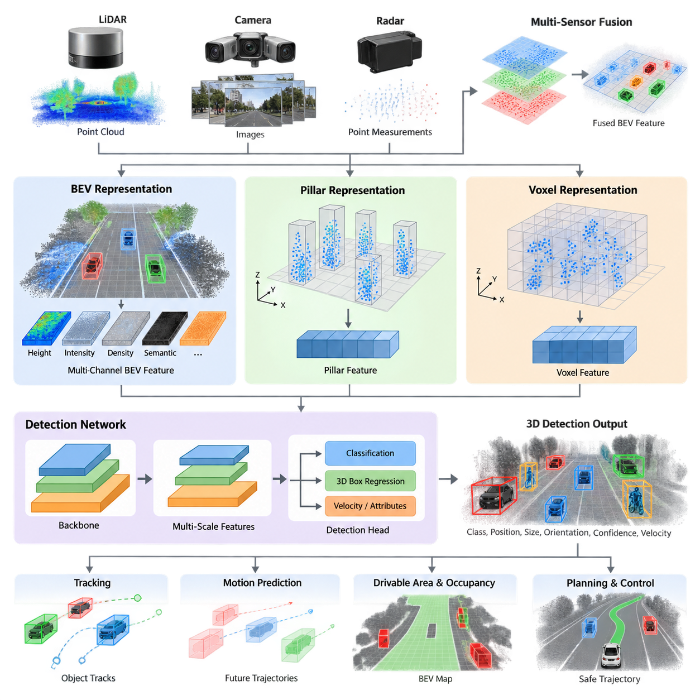
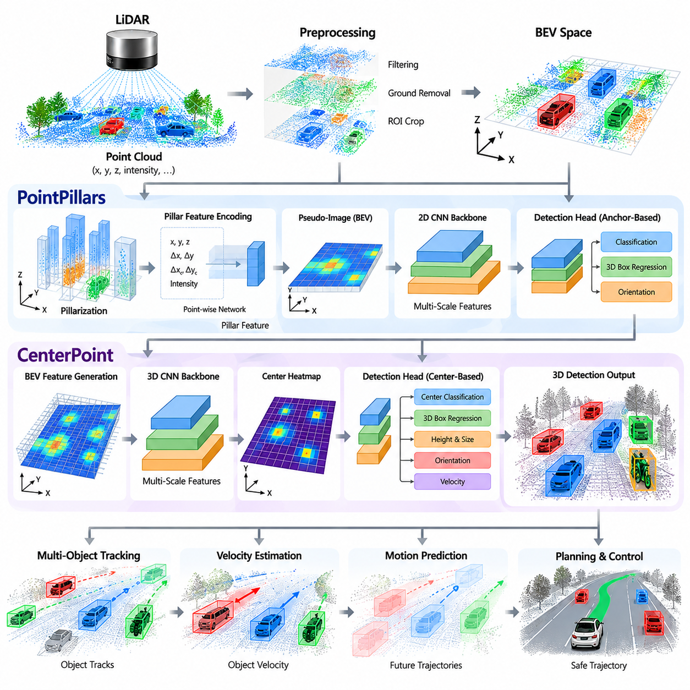
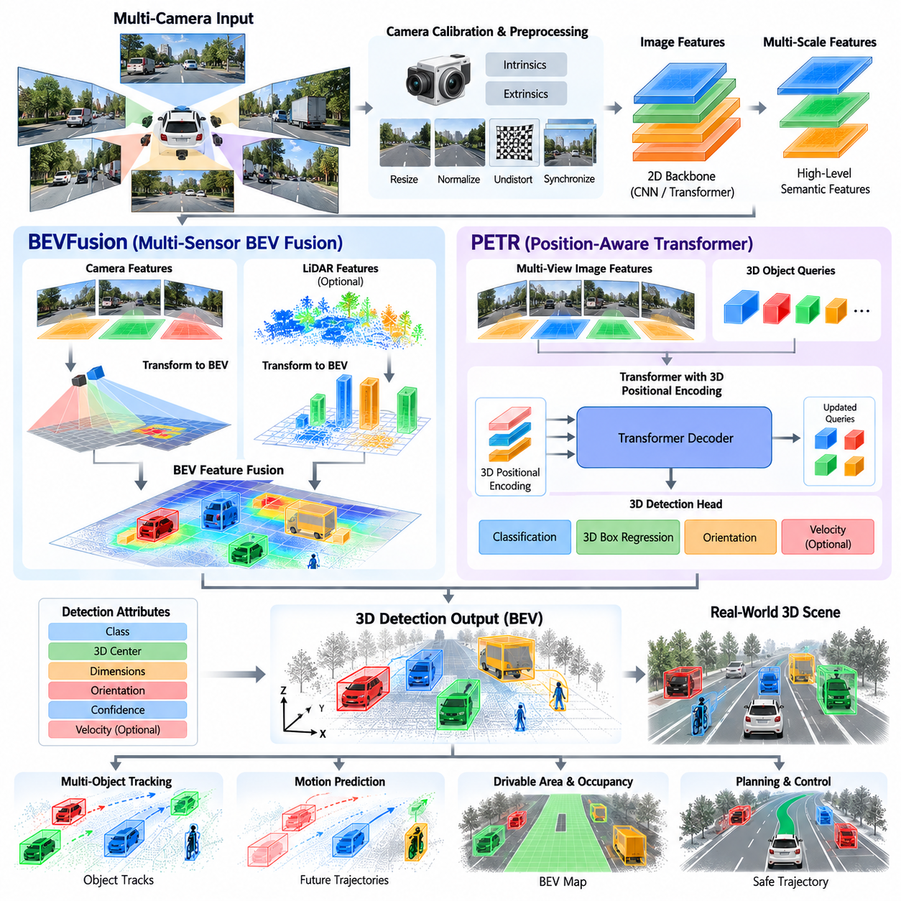
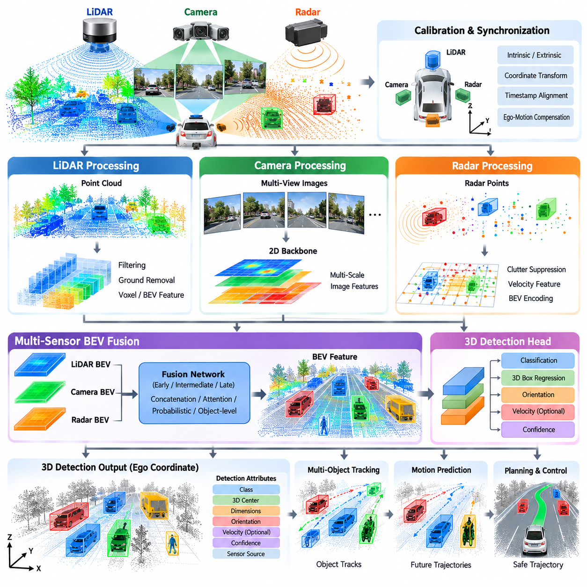
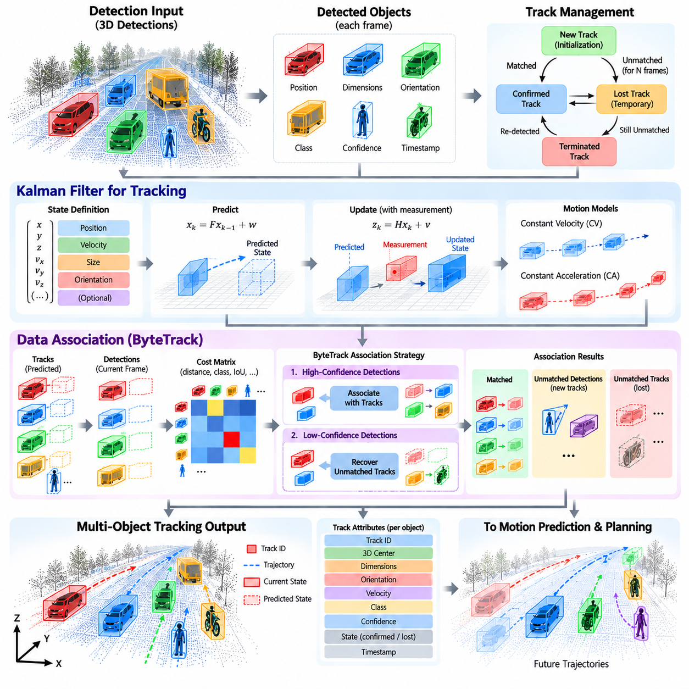
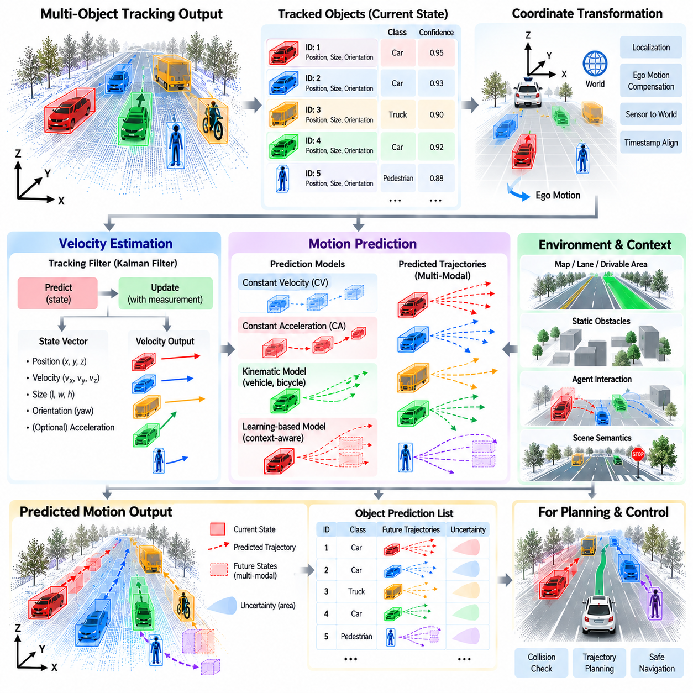
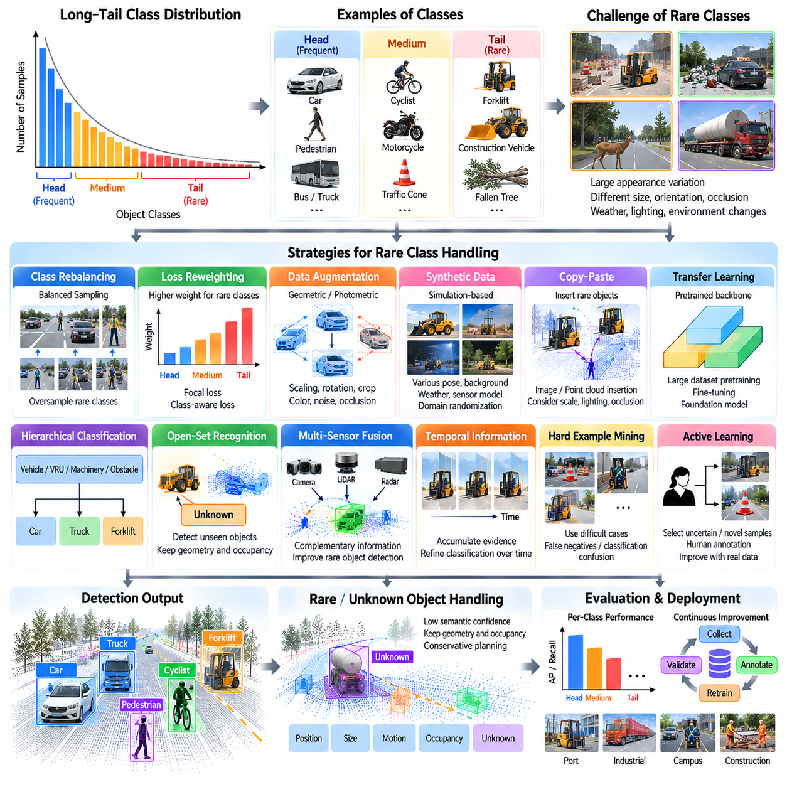
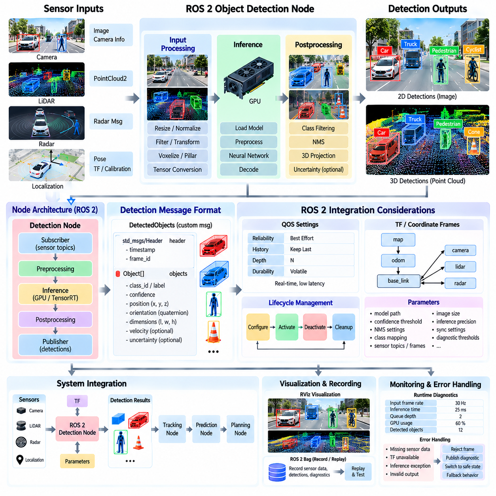
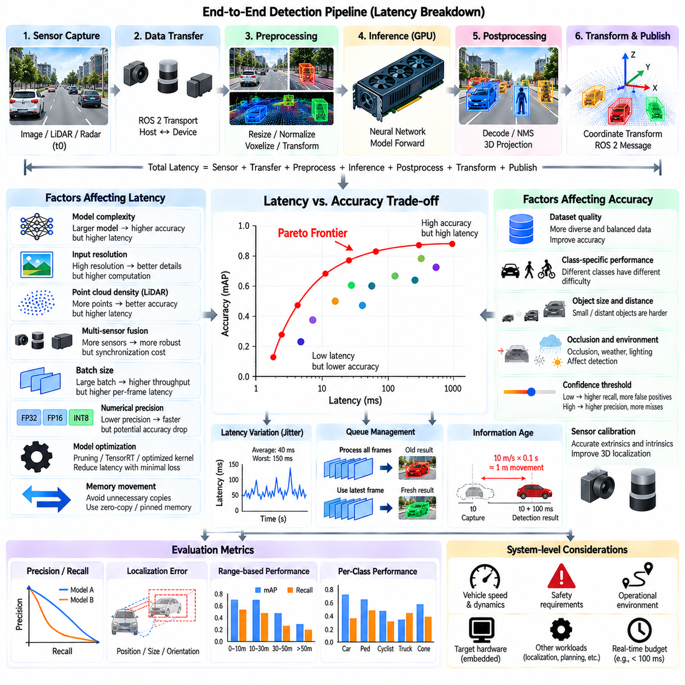
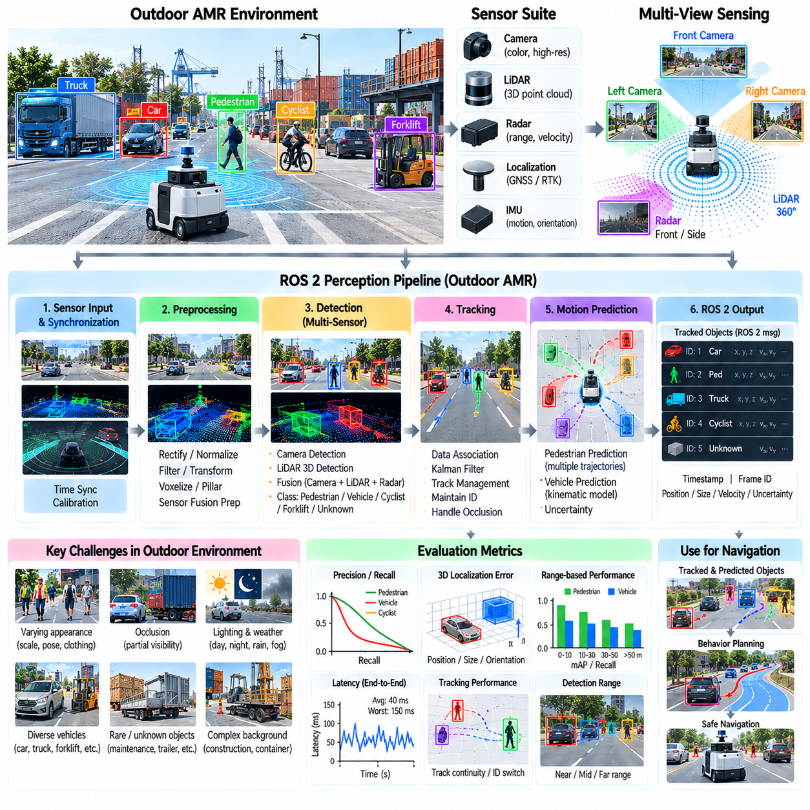

**Volume 12. Autonomous Driving Software**

# Chapter 05. Object Detection and Tracking

## 05.01. 3D Object Detection Architecture BEV Pillar Voxel [w/Code]

{width="7.268055555555556in" height="7.268055555555556in"}

3D object detection is a core perception capability for autonomous driving systems and outdoor AMRs because planning requires more than recognizing that an object exists. The perception stack must estimate an object\'s position, dimensions, orientation, class, and confidence in three-dimensional space. In the provided structure, this topic begins the Object Detection and Tracking chapter and precedes specialized LiDAR, camera, sensor-fusion, and tracking methods.

A typical 3D detector transforms raw sensor observations into an intermediate spatial representation before applying a detection network. For LiDAR, the input is an unordered set of points containing coordinates and attributes such as intensity. Processing these points directly is possible, but autonomous systems commonly organize them into BEV, pillar, or voxel representations that expose spatial structure and enable efficient convolutional or transformer-based feature extraction.

Bird\'s-Eye View, or BEV, represents the environment from a top-down perspective. Sensor information is projected or encoded onto a two-dimensional plane aligned with the ground, where the horizontal axes normally correspond to longitudinal and lateral position. Height, intensity, density, semantic information, or learned features can be stored as channels. This representation naturally matches the coordinate system used by localization, prediction, occupancy estimation, and motion planning.

The major advantage of BEV is that objects preserve their spatial relationship on the ground plane. Vehicles, pedestrians, bicycles, barriers, and other obstacles can therefore be detected while maintaining metric relationships to the ego platform. Unlike perspective camera images, BEV does not inherently shrink distant objects according to perspective. This property makes BEV especially useful when perception results must be consumed directly by trajectory planning and collision avoidance modules.

BEV is not necessarily a sensor-specific representation. LiDAR points can be projected into BEV, while multi-camera features can be lifted from image coordinates into three-dimensional space and transformed into a common BEV feature map. Radar measurements can also be incorporated. Consequently, modern architectures increasingly use BEV as a shared spatial interface in which heterogeneous sensors contribute complementary geometric, semantic, velocity, and confidence information.

Pillar-based architectures provide an efficient method for converting irregular point clouds into structured tensors. The horizontal environment is divided into vertical columns called pillars, while the vertical dimension is not discretized into multiple voxel layers. Points belonging to each pillar are encoded into a compact feature vector, commonly using coordinates, offsets, intensity, and learned point features. The resulting pseudo-image can then be processed efficiently with conventional two-dimensional convolutional networks.

The pillar approach reduces computational complexity because it avoids dense discretization along the height axis. This characteristic is valuable for embedded autonomous systems where GPU memory, inference latency, power consumption, and thermal limits are important design constraints. Pillar representations are particularly effective when most relevant objects occupy a ground-oriented environment, as occurs in road vehicles, logistics yards, campuses, ports, and many outdoor AMR operating domains.

The simplification of the vertical dimension also introduces limitations. Detailed three-dimensional geometry can be partially compressed when points at different heights are aggregated within the same pillar. This may become important for irregular terrain, overhanging structures, vegetation, loading equipment, stacked objects, or environments where vertical separation carries critical semantic information. Pillar resolution therefore represents a practical compromise between geometric fidelity and computational efficiency.

Voxel-based architectures preserve three-dimensional structure more explicitly. The sensing volume is divided into discrete cells along the x, y, and z axes, and points inside each voxel are converted into learned features. Sparse 3D convolution is commonly used because LiDAR space is overwhelmingly empty. Instead of processing every possible cell, sparse operations concentrate computation on occupied voxels and propagate features through selected spatial locations.

Voxelization offers strong geometric representation because vertical relationships remain available throughout the feature extraction process. Fine-grained shape information can improve discrimination between objects with similar footprints but different three-dimensional structures. The cost is greater computational and memory demand than simplified pillar processing. Smaller voxels improve spatial resolution but increase the number of cells, while larger voxels reduce computation at the expense of geometric precision.

Modern detectors frequently combine these ideas rather than treating BEV, pillars, and voxels as mutually exclusive alternatives. A network may initially encode a point cloud as pillars or sparse voxels, extract three-dimensional or pseudo-image features, and finally collapse or transform those features into BEV. A BEV backbone then performs large-scale spatial reasoning before detection heads estimate classes and 3D bounding-box parameters. The architecture is therefore better understood as a sequence of representations.

A conventional detection pipeline can be described as sensor input, preprocessing, spatial encoding, backbone feature extraction, multi-scale feature aggregation, and prediction heads. The final heads typically estimate object confidence, semantic class, center coordinates, dimensions, orientation, and sometimes velocity or additional attributes. These outputs must remain expressed in a well-defined coordinate frame so that downstream tracking and prediction modules can associate detections consistently across time.

Anchor-based detectors define predefined bounding-box templates at spatial locations and predict corrections relative to those templates. Anchor-free detectors instead estimate object centers and regress box properties directly around candidate locations. Center-based formulations have become particularly attractive for BEV detection because object centers form natural targets in the ground plane, reducing dependence on manually designed anchor configurations and simplifying detection across heterogeneous object dimensions.

Feature resolution is a fundamental architectural parameter. A coarse BEV grid reduces memory consumption and increases inference speed but may represent pedestrians, poles, cones, or distant objects with very few cells. A fine grid preserves small-object information but increases computation. Practical systems therefore employ multi-scale backbones, feature pyramids, sparse processing, or selective high-resolution regions to balance detection range, localization accuracy, and real-time performance.

Detection range creates another important trade-off. Increasing the physical area covered by the BEV or voxel grid provides earlier awareness of distant objects, yet a fixed tensor size then implies lower spatial resolution. Increasing both range and resolution produces substantially larger tensors. Outdoor AMRs must therefore configure perception volume according to operational speed, stopping distance, sensor range, environment structure, and available edge-computing resources rather than maximizing detection range independently.

The choice among pillar and voxel encoders also depends on the operating domain. Structured roads with relatively predictable object heights may favor efficient pillar processing, whereas complex industrial or off-road environments can benefit from richer voxel geometry. Uneven ground, construction equipment, vegetation, slopes, curbs, and unusual obstacles increase the importance of vertical structure. The representation should therefore reflect the geometry and hazards defined by the system\'s operational design domain.

For outdoor AMRs, 3D detection is closely connected to drivable-area estimation rather than operating as an isolated perception function. The preceding chapter structure includes LiDAR free-space detection, BEV road segmentation, occupancy grids, off-road traversability analysis, and negative-obstacle detection. A robust autonomy stack can combine these environmental representations with object detections to distinguish traversable terrain from dynamic or static hazards.

Temporal information further strengthens detection. A single point cloud may contain sparse observations, partial occlusion, or measurement noise, particularly at long distance. Multiple sweeps can be transformed into a common coordinate frame using ego-motion compensation and accumulated to increase point density. However, moving objects can produce temporal smearing unless their motion is handled appropriately. Detection architecture must therefore coordinate spatial representation with timestamp alignment and motion estimation.

Once detections are produced, multi-object tracking establishes persistent identities across frames and estimates temporal state. This explains why detection and tracking are organized together in the supplied software structure, with 3D detection followed by sensor-specific detection, multi-sensor fusion, multi-object tracking, velocity estimation, and motion prediction. Detection quality directly influences association stability, trajectory estimation, and downstream behavioral decisions.

Real-time deployment requires evaluating the complete pipeline rather than only neural-network accuracy. Point-cloud transfer, preprocessing, voxelization or pillarization, GPU execution, post-processing, coordinate transformation, middleware communication, and tracking all contribute to end-to-end latency. A detector with excellent benchmark accuracy may be unsuitable if its worst-case latency violates the control cycle or if memory consumption competes with localization, planning, and other GPU workloads.

The resulting architectural design is therefore a multidimensional optimization problem. BEV provides a planning-friendly spatial abstraction, pillars emphasize computational efficiency, and voxels preserve richer three-dimensional geometry. Practical autonomous systems often combine them into hierarchical pipelines that transform sparse sensor measurements into increasingly task-oriented features. The best configuration is determined by sensor characteristics, environment complexity, detection range, object scale, latency budget, and hardware capacity.

For a production outdoor AMR, the 3D detector should ultimately be treated as part of a continuous perception-to-action pipeline. Its output is not merely a collection of bounding boxes; it is a structured representation of nearby actors and obstacles that feeds tracking, prediction, behavior planning, trajectory generation, and safety monitoring. This architectural perspective provides the foundation for the subsequent PointPillars, CenterPoint, camera-based BEV, and multi-sensor fusion implementations defined in the volume structure.

## 05.02. LiDAR 3D Object Detection PointPillars CenterPoint [w/Code]

{width="7.268055555555556in" height="7.268055555555556in"}

LiDAR-based 3D object detection converts sparse three-dimensional measurements into structured object information that can be consumed by autonomous driving and outdoor AMR software. Within the Object Detection and Tracking chapter, PointPillars and CenterPoint represent two important approaches for transforming LiDAR observations into efficient spatial features and 3D detections. Their architectural differences illustrate how point-cloud representation, feature extraction, object localization, and prediction heads can be organized for real-time perception.

A LiDAR sensor produces a point cloud in which each point normally contains three-dimensional coordinates and may also contain intensity, return information, or other attributes. Unlike an image, the points are irregularly distributed and do not naturally form a dense rectangular tensor. A detection network therefore needs an encoding stage that converts this sparse representation into features suitable for neural-network processing. PointPillars performs this transformation by grouping points according to their horizontal location and representing the environment as vertical pillars.

In PointPillars, the detection space is divided into a regular two-dimensional grid on the ground plane. All points falling into the same grid cell are assigned to one pillar, while the height dimension remains implicit rather than being divided into a dense sequence of voxels. Point-level features can include the original coordinates, offsets relative to the pillar center, offsets relative to the mean point location, and intensity. A point-wise network then converts these measurements into learned features that are aggregated within each pillar.

The resulting pillar features can be arranged as a pseudo-image in the BEV coordinate system. This is an important architectural advantage because mature two-dimensional convolutional networks can then be used for feature extraction. A PointPillars pipeline therefore combines point-level encoding with efficient 2D spatial processing. The approach avoids the computational cost of dense three-dimensional convolution while still preserving useful horizontal geometry for detecting vehicles, pedestrians, barriers, and other objects in road-oriented environments.

The backbone processes the pseudo-image to construct increasingly abstract spatial features. Early layers capture local geometric patterns, while deeper layers provide larger receptive fields and more contextual information. Multi-scale feature extraction is useful because objects can appear at different distances and sizes. A nearby vehicle may occupy many BEV cells, while a distant pedestrian may occupy only a small region. Feature-pyramid or multi-resolution structures allow the detector to combine information across these different spatial scales.

The detection head converts the learned BEV features into object predictions. Typical outputs include object classification, center location, dimensions, and orientation. Depending on the implementation, velocity and other object attributes may also be estimated. The predicted 3D bounding box can be expressed in the ego coordinate frame so that downstream tracking, prediction, behavior planning, and collision avoidance modules can directly reason about the object\'s spatial relationship to the robot or vehicle.

CenterPoint follows a different but complementary design philosophy. Instead of relying primarily on predefined anchor boxes, CenterPoint formulates detection around object centers. A network produces a BEV representation and predicts the locations of object centers on the spatial feature map. Additional regression branches then estimate properties such as height, dimensions, orientation, and velocity. This center-based formulation makes the detection process conceptually direct and provides a natural interface to subsequent tracking.

The center representation is particularly useful because the center of an object provides a stable spatial reference for association and motion reasoning. After candidate centers are identified, the network can decode the corresponding 3D bounding-box parameters. Orientation is important for autonomous systems because two objects with similar dimensions and positions can have substantially different occupied regions when their headings differ. Accurate center and orientation estimation therefore contributes directly to collision checking and trajectory planning.

Velocity prediction gives CenterPoint an additional connection to temporal perception. A detector that estimates object velocity can provide more information than a single-frame bounding box. The estimated motion state can be combined with observations from subsequent frames to support tracking and prediction. In practical systems, however, velocity estimates must be interpreted together with timestamp quality, ego-motion compensation, sensor noise, and object occlusion. Detection and tracking should therefore be designed as cooperating stages rather than independent functions.

PointPillars and CenterPoint also differ in how their outputs can support temporal processing. PointPillars provides an efficient set of 3D detections that can be passed to a separate multi-object tracker. CenterPoint\'s center-based representation and velocity estimation can make the transition toward tracking more direct. The overall software architecture can therefore select a detector according to the required balance among inference speed, localization quality, object scale, temporal information, and available computational resources.

The BEV grid resolution is one of the most important configuration parameters for both approaches. A smaller cell size provides finer spatial detail and can improve localization of small objects, but it increases the size of the feature tensor and therefore the computational workload. A larger cell size reduces memory and processing requirements but can merge geometric details that are important for pedestrians, narrow obstacles, or distant objects. The selected resolution must therefore be connected to sensor characteristics and the operational design domain.

Detection range introduces another engineering trade-off. An outdoor AMR may require a relatively large perception area because its stopping distance increases with speed and because obstacles must be identified before they become operationally relevant. Extending the BEV range while maintaining high spatial resolution can significantly increase computation. A practical implementation should therefore establish the required detection distance from vehicle speed, braking capability, localization accuracy, obstacle dimensions, and planning requirements before selecting the LiDAR grid dimensions.

The strengths of PointPillars become particularly relevant when embedded inference efficiency is important. Its conversion from point clouds to a pseudo-image allows efficient GPU processing using established two-dimensional convolutional architectures. CenterPoint provides a center-based formulation that naturally represents object locations and can incorporate velocity estimation. The choice between them should not be treated as a universal winner; it should instead be evaluated against the specific sensor configuration, target classes, required latency, detection range, and downstream autonomy architecture.

For an outdoor AMR, LiDAR detection also needs to operate under conditions that differ from standardized road scenes. Industrial yards, ports, campuses, construction areas, and off-road environments may contain irregular terrain, unusual machinery, containers, temporary structures, vegetation, curbs, and partially occluded objects. These conditions can reduce the effectiveness of assumptions learned from conventional road datasets. Training and validation data should therefore represent the actual operational environment, including variations in object density, illumination-independent LiDAR geometry, weather, surface conditions, and sensor mounting configuration.

The production pipeline must finally consider more than neural-network accuracy. Point-cloud acquisition, timestamp synchronization, coordinate transformation, filtering, pillarization, GPU inference, decoding, non-maximum suppression or center decoding, object tracking, and middleware transmission all contribute to end-to-end latency. A detector should therefore be evaluated using both perception metrics and system-level measurements such as inference time, memory consumption, throughput, detection range, localization error, false-positive rate, and temporal stability.

PointPillars and CenterPoint provide useful reference architectures for understanding the evolution of LiDAR 3D object detection. PointPillars demonstrates how irregular point clouds can be transformed into efficient pillar-based BEV features, while CenterPoint emphasizes object centers as a compact representation for detection and temporal reasoning. In an autonomous AMR software stack, their outputs should be treated as structured perception states that feed tracking, velocity estimation, motion prediction, behavior planning, trajectory generation, and safety functions. This establishes the practical connection between LiDAR detection and the subsequent object-tracking and sensor-fusion modules defined in the chapter structure.

## 05.03. Camera Based 3D Detection BEVFusion PETR [w/Code]

{width="7.268055555555556in" height="7.268055555555556in"}

Camera-based 3D object detection estimates three-dimensional objects from camera images and provides geometric information that can be used by autonomous driving and outdoor AMR systems. Unlike LiDAR, a camera primarily observes color, texture, edges, and semantic appearance in perspective image coordinates. The central challenge is therefore to transform image-based features into a spatial representation suitable for 3D localization. Within the Object Detection and Tracking chapter, BEVFusion and PETR represent important approaches for connecting camera perception with 3D scene understanding and BEV-based detection.

A conventional camera produces one or more perspective images in which the apparent size of an object depends strongly on its distance from the camera. Although this representation is highly informative for semantic recognition, it does not directly provide metric depth. A 3D detection architecture must therefore infer depth or geometric relationships from visual evidence. Image features are extracted first and are subsequently transformed, lifted, or queried so that information can be represented in a three-dimensional coordinate system.

The first stage normally consists of camera calibration and image preprocessing. Intrinsic parameters describe focal length, principal point, and lens characteristics, while extrinsic parameters define the transformation between the camera and vehicle or robot coordinate frames. Accurate calibration is essential because even a small geometric error can cause projected features to appear at incorrect spatial locations. Image resizing, normalization, distortion correction, and synchronized capture are also important because the quality of the visual representation directly affects downstream 3D localization.

A camera-based detector generally begins with a two-dimensional image backbone. Convolutional neural networks or vision transformers convert RGB images into hierarchical feature maps containing increasingly abstract visual information. Early features preserve edges, textures, and local patterns, while deeper features capture semantic structures and object-level context. Multi-scale features are especially important because nearby objects can occupy large image regions while distant pedestrians, vehicles, and obstacles may occupy only a small number of pixels.

The critical architectural problem is the transition from perspective image features to a spatial representation. A perspective image is organized by image coordinates, whereas planning and collision reasoning normally operate in vehicle-centric coordinates. A BEV representation provides a common spatial interface by expressing detected objects and environmental features relative to the ego vehicle. Camera-to-BEV transformation can therefore be understood as a geometric and learned mapping between image space and the ground-oriented representation required by autonomous motion systems.

Depth estimation is central to this transformation. A camera does not directly measure distance in the same way as LiDAR, so the network must infer depth from monocular or multi-camera visual cues. These cues can include perspective, object scale, texture gradients, binocular relationships, temporal consistency, and learned scene priors. Depth prediction does not have to be perfectly accurate for every pixel, but systematic depth errors can cause substantial localization errors after image features are projected into three-dimensional or BEV space.

Multi-camera systems reduce some of the limitations of a single perspective view. Several cameras can surround the autonomous platform and provide overlapping fields of view. Each camera produces its own feature representation, and these features can be transformed into a common coordinate system. This enables objects to remain represented across different viewing angles and reduces blind regions. For an outdoor AMR, camera placement should be designed together with the desired detection range, mounting height, field of view, platform dimensions, and operational environment.

BEV-based camera detection can use explicit depth lifting or learned feature transformation. In an explicit approach, image features are associated with estimated depth distributions and projected into a three-dimensional frustum before being accumulated into BEV cells. In a learned approach, the network learns how visual features correspond to spatial locations through attention, positional encoding, or other geometric mechanisms. Both approaches attempt to solve the same fundamental problem: converting perspective visual evidence into a representation with meaningful spatial relationships.

BEVFusion extends this concept by providing a common BEV space in which multiple sensor modalities can be combined. Camera features can be transformed into BEV, while LiDAR features can be encoded into a compatible spatial representation. The resulting features can then be fused before detection. This architecture is important because cameras provide strong semantic and appearance information, while LiDAR provides direct geometric measurements. Their complementary characteristics can improve scene understanding when the fusion process is properly calibrated and synchronized.

The value of BEVFusion is not limited to simply concatenating feature tensors. Effective fusion requires the different sensor observations to correspond to the same physical locations and approximately the same time. Camera images and LiDAR scans may have different acquisition mechanisms, sampling rates, latencies, and coordinate frames. Calibration, timestamp alignment, ego-motion compensation, and spatial transformation therefore become part of the perception architecture rather than being treated as separate implementation details.

A BEV feature map generated from multiple cameras can represent information from different viewpoints within a common ground-oriented coordinate system. Areas visible to several cameras may contain complementary evidence, while regions visible from only one camera retain their individual observations. Fusion mechanisms can combine these features according to learned relevance. Attention-based architectures can further allow the network to emphasize spatial regions and modalities that provide stronger evidence for a particular object or scene structure.

PETR approaches camera-based 3D perception through position-aware representations and transformer-based reasoning. Rather than treating image features as purely two-dimensional information, PETR incorporates three-dimensional positional information into the visual feature representation. The network can then reason about where image features may correspond to locations in three-dimensional space. This provides a mechanism for connecting perspective visual observations with 3D object queries and spatially structured predictions.

Positional encoding is particularly important because transformer attention alone does not inherently know the physical meaning of a pixel location. A feature at one image coordinate can correspond to very different world locations depending on camera calibration, viewing geometry, and estimated depth. By embedding spatial information into the representation, the network can associate visual evidence with a three-dimensional coordinate framework. This allows the detection process to reason about object location, orientation, and spatial relationships more directly.

Transformer-based detection also changes how object features are gathered. Instead of relying only on dense convolutional processing, object queries can attend to relevant image features and aggregate information required to estimate a particular object. This is useful when an object is partially occluded or when its appearance is distributed across multiple regions of an image. Attention can combine contextual information while maintaining the connection between visual evidence and the target 3D prediction.

The final detection head estimates properties such as object class, three-dimensional center, dimensions, orientation, and confidence. Depending on the architecture, additional attributes such as velocity can also be predicted. The resulting 3D bounding boxes should be expressed in a clearly defined coordinate frame so that downstream tracking and planning modules can consume them consistently. The quality of the coordinate transformation is therefore as important as the neural-network prediction itself.

Camera-based 3D detection has a different error profile from LiDAR-based detection. Visual recognition can remain strong even when depth is uncertain, while metric localization may degrade for distant or visually ambiguous objects. Thin objects, textureless surfaces, strong reflections, repeated patterns, and severe occlusion can also make depth inference difficult. For this reason, confidence should be interpreted jointly with object range, image quality, viewing angle, and temporal consistency rather than treated as an absolute measure of geometric accuracy.

Environmental conditions introduce additional challenges. Camera perception can be affected by illumination, shadows, glare, rain, fog, snow, dirty lenses, nighttime operation, and rapidly changing exposure. Outdoor AMRs may also encounter environments with large variations in surface appearance and artificial lighting. Robust systems therefore require training and validation data that represent the actual operational design domain, including adverse weather, seasonal changes, unusual objects, partial occlusion, and camera contamination.

For an outdoor AMR, camera-based detection should also be considered together with terrain and drivable-area estimation. The preceding structure includes BEV road segmentation, multi-sensor drivable-area fusion, occupancy-grid construction, terrain traversability analysis, and negative-obstacle detection. Camera-derived BEV features can contribute semantic information to these representations, while geometric sensors can provide complementary evidence about distance and surface structure.

BEVFusion is especially relevant when a system already contains LiDAR and camera sensors. Camera features can contribute object categories, visual appearance, lane or road semantics, and contextual information, while LiDAR features provide accurate spatial geometry. Fusion allows the detector to operate on a richer representation than either modality could provide independently. However, the resulting architecture also becomes more sensitive to calibration errors, sensor failures, computational load, and synchronization problems.

Sensor failure must therefore be considered in the architecture. If a camera becomes unavailable because of contamination, communication failure, exposure problems, or hardware faults, the perception system should have a defined degraded operating mode. Similarly, LiDAR failure should not automatically result in uncontrolled behavior when sufficient visual evidence remains available. Sensor fusion architecture should therefore distinguish between normal fusion, reduced-modality operation, confidence degradation, and safety-triggered fallback behavior.

Real-time performance is another major consideration. Camera-based 3D detection may require multiple high-resolution images, large vision backbones, depth estimation, transformer attention, BEV transformation, and multi-camera fusion. These operations can consume substantial GPU memory and computational bandwidth. For embedded AMRs, the model must therefore be evaluated using end-to-end latency, image resolution, camera count, frame rate, memory usage, GPU utilization, and power consumption rather than benchmark detection accuracy alone.

The spatial resolution of the BEV representation also determines the balance between accuracy and efficiency. Fine BEV cells can preserve detailed information about small objects and improve localization, but they increase feature-map size and computation. Coarser cells reduce processing requirements but may lose information about pedestrians, narrow obstacles, curbs, or distant objects. A practical system should therefore select BEV resolution according to object dimensions, detection range, platform speed, planning requirements, and available edge-computing resources.

Camera-based 3D detection can also benefit from temporal information. Consecutive frames provide multiple observations of the same object from slightly different viewpoints. Temporal fusion can improve depth estimation, object stability, and velocity reasoning when ego-motion and timestamps are handled correctly. However, temporal accumulation can also introduce errors when moving objects, camera motion, or synchronization inaccuracies are ignored. Temporal processing should therefore be integrated with motion compensation and tracking rather than simply accumulating image features.

The relationship between detection and tracking is particularly important for autonomous operation. A camera-based detector produces instantaneous 3D hypotheses, while a tracker maintains object identities and estimates their temporal states. Stable detection centers, orientations, dimensions, and confidence values improve data association. Conversely, tracking information can help stabilize uncertain detections and provide temporal context when an object becomes partially occluded. The detector and tracker should therefore be evaluated as a combined perception subsystem.

Model training and validation must reflect the intended deployment domain. General-purpose autonomous-driving datasets provide valuable examples, but outdoor AMRs may operate in ports, campuses, industrial yards, construction areas, logistics facilities, or off-road environments that contain object categories and spatial configurations not adequately represented in conventional datasets. Domain-specific data, synthetic augmentation, adverse-condition samples, and long-tail scenarios can therefore become important components of the training pipeline.

Evaluation should include both conventional detection metrics and system-level measures. Average Precision can measure detection quality, while 3D localization error, orientation error, range-dependent performance, small-object recall, false-positive rate, and temporal stability provide additional information. For a production AMR, perception latency, worst-case processing time, resource utilization, sensor synchronization error, and degraded-mode behavior should also be measured because these factors directly affect planning and safety.

BEVFusion and PETR illustrate two complementary directions in camera-based 3D detection. BEVFusion emphasizes the construction of a common BEV representation in which camera and other sensor information can be integrated, while PETR emphasizes three-dimensional positional information and transformer-based reasoning over camera features. Both approaches address the fundamental problem of converting perspective visual observations into spatially meaningful 3D representations.

In the complete autonomous AMR software architecture, camera-based 3D detection should therefore be viewed as a spatial perception layer rather than an isolated image-classification task. Camera images are transformed through calibration, feature extraction, depth or positional reasoning, BEV projection, and detection into structured 3D object states. These states can then be combined with LiDAR and radar information, passed to multi-object tracking and velocity estimation, and ultimately used by motion prediction, behavior planning, trajectory generation, and safety functions. This connects the camera-based methods in this section directly with the following multi-sensor fusion and tracking modules defined in the Object Detection and Tracking chapter.

## 05.04. Multi Sensor Fusion Detection LiDAR Camera Radar [w/Code]

{width="7.268055555555556in" height="7.268055555555556in"}

Multi-sensor fusion detection combines LiDAR, camera, and radar observations to construct a more complete representation of the surrounding environment. Each sensor provides different information and has different measurement characteristics, so fusion is intended to exploit their complementary strengths rather than relying on a single modality. Within the Object Detection and Tracking chapter, this topic follows LiDAR-based and camera-based 3D detection and establishes the connection toward multi-object tracking and motion prediction.

LiDAR provides accurate geometric measurements in three-dimensional space and can produce reliable distance and object-shape information. Camera sensors provide rich visual and semantic information, including object appearance, color, texture, and contextual scene information. Radar provides complementary measurements related to range and relative motion and can remain useful under conditions where visual sensing becomes degraded. Combining these modalities can therefore produce a perception result that contains both geometric and semantic information.

The first requirement for effective fusion is a common coordinate framework. LiDAR, camera, and radar are normally installed at different physical locations and orientations, so their measurements do not initially share the same coordinate system. Extrinsic calibration defines the spatial transformation between sensors, while intrinsic calibration describes sensor-specific parameters. Accurate calibration is essential because even a small spatial transformation error can cause measurements from different sensors to be associated with the wrong physical object.

Temporal synchronization is equally important. A LiDAR scan, camera frame, and radar measurement may not be captured at exactly the same instant. Moving objects can therefore appear at different positions in the individual sensor observations. Fusion software must consider timestamps, sensor latency, acquisition periods, and ego-motion when aligning observations. Hardware timestamping and deterministic synchronization can improve this process, while software interpolation or motion compensation can reduce residual temporal misalignment.

Sensor preprocessing should normally occur before fusion. LiDAR data may require filtering, ground removal, coordinate transformation, and point-cloud feature extraction. Camera data may require image resizing, normalization, distortion correction, and visual feature extraction. Radar measurements may require detection filtering, clutter suppression, coordinate transformation, and velocity-related processing. The objective is to convert heterogeneous raw measurements into representations that can be associated and combined efficiently.

Fusion can be organized at different levels of the perception pipeline. Early fusion combines relatively low-level measurements or features before substantial modality-specific processing. Intermediate fusion first extracts features independently from each sensor and then combines those features within a shared representation. Late fusion performs independent detection and combines the resulting object hypotheses. The appropriate level depends on computational resources, calibration quality, sensor characteristics, and the desired degree of interaction between modalities.

A common intermediate representation is BEV, because it provides a ground-oriented coordinate system that can accommodate information from multiple sensors. LiDAR features can be projected or encoded into BEV, camera features can be transformed from perspective images into BEV, and radar observations can be mapped into the same spatial coordinate system. Once the representations are aligned, a fusion network can learn relationships between geometric, visual, and motion-related evidence.

LiDAR-camera fusion is particularly useful because the two modalities have complementary properties. LiDAR can provide accurate metric geometry but relatively limited semantic appearance information. Cameras provide strong semantic recognition and detailed visual context but must infer depth. When their features are correctly aligned, visual information can help classify or interpret LiDAR-based structures, while LiDAR geometry can constrain the spatial interpretation of camera observations.

Radar contributes a different type of information. Radar measurements can provide range and relative velocity information and may detect moving objects even when visual appearance is ambiguous. Radar observations can therefore complement camera and LiDAR measurements for dynamic-object perception. However, radar returns can be sparse, noisy, and affected by multipath or reflections. Fusion should therefore represent radar confidence and measurement uncertainty rather than treating every radar return as an exact object observation.

Object association is a central problem in multi-sensor fusion. Measurements from different sensors must be determined to correspond to the same physical object. Spatial proximity can provide an initial association cue, but position alone may be insufficient when objects are close together. Additional information such as object class, dimensions, orientation, velocity, timestamp, and confidence can improve association. A fusion system should also be able to represent unmatched observations because not every sensor will observe every object.

Confidence management is important because sensor reliability changes with operating conditions. Camera confidence may decrease during darkness, glare, fog, rain, or lens contamination. LiDAR performance can be affected by range, reflectivity, occlusion, weather, and sensor contamination. Radar can produce uncertain or ambiguous returns because of reflections and clutter. Fusion should therefore combine measurements according to their reliability rather than assuming that every modality has a constant level of accuracy.

Multi-sensor fusion can be implemented through feature concatenation, learned weighting, attention mechanisms, probabilistic combination, or object-level hypothesis fusion. Neural networks can learn relationships between sensor features, while probabilistic methods can explicitly represent uncertainty. Hybrid architectures can also combine learned perception with rule-based consistency checks. The selected mechanism should be evaluated according to accuracy, computational cost, interpretability requirements, and safety considerations.

For camera-based BEV systems, multi-sensor fusion can provide a way to reduce the uncertainty associated with visual depth estimation. Camera features can supply semantic information while LiDAR or radar measurements provide additional geometric constraints. Conversely, camera information can help interpret sparse geometric measurements. The fusion architecture should preserve the strengths of each modality rather than forcing all sensor information into an identical representation too early.

The spatial resolution of the shared representation affects fusion quality. A coarse BEV grid reduces memory consumption and computation but may cause measurements from nearby objects to become indistinguishable. A fine grid preserves more spatial detail but increases processing requirements. The resolution should therefore be selected according to sensor accuracy, object dimensions, detection range, platform speed, and the computational capacity of the target system.

Detection range must also be considered across all modalities. LiDAR, camera, and radar can have different effective ranges and different detection characteristics at long distances. A fusion system should not assume that all sensors provide equivalent information throughout the perception area. Instead, it can use the strongest available evidence in each spatial region and represent uncertainty where observations become sparse or unreliable.

Outdoor AMRs create additional fusion requirements because their environments can differ substantially from structured road scenes. Industrial yards, ports, campuses, construction sites, and off-road areas can contain irregular terrain, temporary structures, containers, machinery, vegetation, pedestrians, and unusual vehicles. A multi-sensor detector must therefore be trained and validated against the actual operational environment. Sensor mounting height and orientation also become important because the geometry observed by the sensors depends directly on the robot platform.

Fusion should operate continuously with the rest of the perception stack. The preceding structure contains drivable-area estimation, occupancy-grid construction, terrain traversability analysis, and negative-obstacle detection, while the following structure contains multi-object tracking and velocity estimation. A fused detection result can therefore become one of several complementary representations used to understand both static environmental structure and dynamic obstacles.

Temporal fusion provides another opportunity to improve robustness. Consecutive sensor observations can be accumulated or associated to provide more complete object information. However, moving objects and ego-motion require compensation before measurements are combined. Timestamp errors can otherwise produce duplicated, displaced, or blurred object representations. Temporal fusion should therefore be integrated with motion compensation and tracking rather than treated as simple accumulation.

Sensor redundancy is also important for operational robustness. When one modality becomes unavailable, the perception architecture should have a defined degraded mode. For example, a camera failure should not necessarily eliminate all perception if LiDAR and radar remain available, while a LiDAR failure should allow the system to use remaining visual and radar information within their limitations. Such degraded operation requires explicit confidence handling and safety policies rather than assuming that fusion will automatically compensate for any sensor failure.

The computational architecture must support the combined workload of all modalities. Multiple cameras can require substantial image-processing resources, LiDAR requires point-cloud processing, and radar requires its own signal-processing pipeline. Feature extraction and fusion can then increase GPU memory consumption and communication bandwidth. Real-time deployment should therefore measure complete pipeline latency, throughput, memory usage, GPU utilization, sensor-transfer overhead, and worst-case processing time.

Fusion quality should be evaluated at both sensor and system levels. Conventional detection metrics such as precision, recall, and Average Precision can measure object-detection performance. Additional evaluation should examine 3D localization error, orientation accuracy, velocity estimation, range-dependent performance, false positives, missed detections, and temporal stability. System-level testing should also measure behavior under sensor degradation, asynchronous measurements, calibration errors, and adverse environmental conditions.

A practical fusion architecture should maintain traceability of where important information originated. For a detected object, the system may need to know whether its position is strongly supported by LiDAR geometry, its class is primarily supported by camera evidence, or its velocity is strongly supported by radar. Such provenance can support diagnostics, confidence estimation, failure analysis, and safety monitoring. It also helps engineers determine whether a fusion error originates from sensing, calibration, association, or the learned detection model.

For an autonomous AMR, the final fused detection should therefore be represented as a structured object state containing position, dimensions, orientation, class, velocity when available, confidence, timestamp, coordinate frame, and potentially sensor provenance. This state can be passed to multi-object tracking, where persistent object identities are maintained across time. Tracking can then provide more stable velocity and motion estimates for downstream prediction and planning.

Multi-sensor fusion detection represents an architectural bridge between individual sensor perception and integrated autonomous behavior. LiDAR contributes three-dimensional geometry, cameras contribute semantic and visual context, and radar contributes range and motion-related evidence. Their combination requires accurate calibration, temporal alignment, representation conversion, association, uncertainty management, and real-time computation. In the complete Object Detection and Tracking architecture, these capabilities prepare a consistent multi-modal perception state for the subsequent tracking, velocity estimation, and motion-prediction stages.

## 05.05. Multi Object Tracking MOT Kalman ByteTrack [w/Code]

{width="7.268055555555556in" height="7.268055555555556in"}

Multi-object tracking (MOT) maintains the identities and temporal states of multiple objects across consecutive perception frames. While object detection estimates objects independently in each frame, tracking determines which detections correspond to the same physical objects over time. In the Object Detection and Tracking chapter, MOT follows LiDAR, camera, and multi-sensor detection and provides the temporal foundation for velocity estimation and motion prediction.

A tracking system normally receives a sequence of detected objects containing position, dimensions, orientation, class, confidence, and timestamp information. The tracker associates current detections with previously established tracks and updates their states. When an object is temporarily invisible because of occlusion or sensor limitations, the tracker can maintain its track for a limited period using a predicted state. This temporal continuity is essential for autonomous systems because planning requires stable object information rather than independent frame-by-frame detections.

The central problem in MOT is data association. At every frame, the tracker must determine which current detection belongs to which existing track. Spatial distance is an important association cue, but it is not sufficient when several objects are close together. Additional information such as object class, bounding-box dimensions, orientation, velocity, detection confidence, and appearance features can improve association. A robust tracker should also handle unmatched detections and unmatched tracks because objects can enter or leave the sensing region.

The Kalman filter provides a classical framework for estimating an object\'s hidden state from noisy measurements. A state vector may contain position and velocity, and more advanced models can additionally represent acceleration or other motion variables. The filter predicts the next state using a motion model and then corrects that prediction when a new measurement becomes available. This separation between prediction and correction makes the Kalman filter particularly suitable for real-time tracking systems with noisy and intermittent observations.

In a typical tracking cycle, the Kalman filter first predicts the expected state of every active track at the current timestamp. The detector then provides new measurements, and an association algorithm calculates the correspondence between predictions and detections. Matched detections are used to update the corresponding filter states. Tracks without measurements can remain temporarily alive using prediction alone, while newly observed objects can initialize new tracks. Tracks that remain unmatched for too long are eventually terminated.

The quality of the motion model strongly affects tracking performance. A constant-velocity model assumes that an object\'s velocity remains approximately stable over a short interval, while a constant-acceleration model can represent changing motion more explicitly. Vehicle and pedestrian behavior may violate these assumptions during turns, braking, acceleration, or sudden avoidance maneuvers. The tracker therefore needs appropriate process-noise parameters so that it can adapt to deviations between the assumed model and real object motion.

ByteTrack uses a practical association strategy that emphasizes the value of lower-confidence detections. Conventional tracking pipelines may discard detections below a confidence threshold before association. This can remove weak observations of partially occluded objects and cause existing tracks to disappear. ByteTrack instead attempts to associate high-confidence detections first and then uses lower-confidence detections to recover additional associations. This approach can improve track continuity without requiring every low-confidence detection to be accepted as a new object.

The distinction between detection confidence and tracking confidence is important. A detector may assign a low confidence to an object because it is partially occluded, distant, or visually ambiguous, while the track itself may have strong temporal evidence from previous frames. Conversely, a high-confidence detection may be inconsistent with an established track because of an incorrect classification or localization error. A tracking system should therefore consider both instantaneous detection evidence and accumulated temporal evidence when maintaining object identities.

Three-dimensional tracking extends these concepts from image coordinates to physical space. For autonomous driving and outdoor AMRs, the track state can include x and y position, height, dimensions, orientation, velocity, and potentially acceleration in an ego-centered or world coordinate frame. Maintaining the state in a metric coordinate system allows the tracker to provide information that can be directly consumed by motion prediction, collision checking, and trajectory planning.

Coordinate consistency is particularly important for moving platforms. When the AMR or vehicle itself moves, an object may appear to move in sensor coordinates even when it is stationary in the world. Ego-motion compensation can transform observations into a common reference frame before association and state estimation. Accurate localization, timestamps, and coordinate transformations therefore become essential components of reliable multi-object tracking.

Occlusion is one of the principal challenges in real-world MOT. A pedestrian may disappear behind a vehicle, or one vehicle may temporarily hide another from a camera or LiDAR sensor. A tracker can continue predicting the hidden object\'s state for a limited period, but uncertainty increases as the duration of missing observations grows. Track management should therefore distinguish between confirmed, temporarily lost, and terminated tracks rather than immediately deleting every object that is absent from a single frame.

Track initialization and termination also require careful design. A single false-positive detection should not necessarily create a persistent object identity, especially in cluttered environments. Track confirmation can require consistent observations across multiple frames. Similarly, a track should not be removed immediately after one missed detection because temporary occlusion and sensor sparsity are normal. These policies influence false-track creation, track fragmentation, and identity stability.

For outdoor AMRs, MOT must operate across diverse environments such as roads, campuses, ports, industrial yards, construction sites, and mixed pedestrian areas. Objects may include vehicles, pedestrians, bicycles, machinery, containers, and unusual temporary obstacles. Sensor characteristics can also vary substantially with range, terrain, weather, and occlusion. Tracking parameters should therefore be validated against the intended operational design domain rather than tuned exclusively on conventional road datasets.

Multi-sensor detection introduces additional opportunities and challenges for tracking. A fused detection may combine LiDAR geometry, camera semantics, and radar velocity information before entering the tracker. The tracker can use these attributes during association and state estimation. Radar velocity can be particularly useful for distinguishing moving and stationary objects, while LiDAR provides metric position and camera information can support semantic consistency. However, sensor timing and calibration errors can propagate directly into track stability.

Tracking performance should be evaluated using both identity and motion-related metrics. Common MOT evaluation concepts include identity consistency, track fragmentation, false tracks, missed tracks, and association accuracy. For autonomous AMRs, additional measures such as position error, velocity error, track latency, track lifetime, recovery after occlusion, and stability under sensor degradation are also important. The evaluation should reflect the actual temporal behavior required by downstream prediction and planning.

The tracker is ultimately an intermediate state-estimation component rather than the final perception output. Its structured track state should provide persistent object identity together with position, dimensions, orientation, velocity, confidence, timestamp, and coordinate-frame information. These states can then be passed to velocity estimation and motion prediction, allowing the autonomy stack to estimate where surrounding objects are likely to move. In this way, Kalman-based tracking and ByteTrack-style association form the temporal bridge between frame-level detection and future-oriented autonomous behavior.

## 05.06. Velocity Estimation and Motion Prediction [w/Code]

{width="7.268055555555556in" height="7.268055555555556in"}

Velocity estimation and motion prediction extend object detection and tracking from understanding the present scene toward anticipating future states. A detector identifies surrounding objects, while a tracker maintains their identities across time. Velocity estimation determines how those objects are moving, and motion prediction estimates where they may move next. In the Object Detection and Tracking chapter, this stage follows multi-object tracking and provides dynamic information required by behavior planning, trajectory generation, and collision avoidance.

Velocity can be estimated from the change in an object\'s position across consecutive observations. If an object center is represented in a consistent metric coordinate frame, its displacement divided by the elapsed time provides a basic velocity estimate. In practice, direct differentiation is sensitive to localization noise, timestamp errors, missed detections, and association errors. Production systems therefore estimate velocity through temporal filtering rather than calculating independent frame-to-frame differences.

A tracking filter provides a natural framework for velocity estimation. A Kalman filter, for example, can maintain position and velocity within the object state vector and update both variables whenever a new measurement becomes available. The prediction stage propagates the previous motion state forward in time, while the correction stage combines the predicted state with the latest observation. This produces a smoother velocity estimate and allows the system to continue estimating motion during short periods of missing measurements.

The coordinate frame used for velocity estimation must be clearly defined. A moving AMR observes objects from a sensor platform that is itself translating and rotating, so apparent motion in sensor coordinates contains both object motion and ego motion. Ego-motion compensation transforms observations into a stable vehicle-centric or world coordinate frame before velocity is estimated. Localization quality, coordinate transforms, and accurate timestamps therefore directly influence the reliability of estimated object motion.

Radar can provide particularly useful information because Doppler measurements contain direct radial-velocity evidence. This information can complement velocities estimated from LiDAR or camera tracking. LiDAR provides accurate spatial geometry but normally derives velocity through temporal displacement, while cameras infer motion from visual observations and geometric transformation. Multi-sensor fusion can combine these different sources to improve velocity estimation, especially when one modality becomes uncertain.

Velocity is a vector rather than only a scalar speed. The direction of motion is as important as its magnitude because an object moving toward the robot creates a different risk from an object moving away at the same speed. For ground vehicles and pedestrians, velocity is often represented by longitudinal and lateral components in a common coordinate frame. Orientation can provide additional information, although heading and velocity direction are not always identical during turning, lateral movement, or irregular pedestrian motion.

Acceleration can be estimated when the temporal history is sufficiently stable. Including acceleration allows a tracker to represent braking, acceleration, and other non-constant-velocity behaviors. However, acceleration estimates are generally more sensitive to noise because they depend on changes in velocity over time. Filtering and uncertainty management are therefore important. A system should avoid interpreting short-term measurement fluctuations as meaningful acceleration without sufficient temporal evidence.

Motion prediction begins from the estimated dynamic state and projects possible future object states over a prediction horizon. The simplest approach assumes constant velocity, producing a straight future trajectory from the current position and velocity. A constant-acceleration model can represent speed changes, while kinematic vehicle models can account for heading and turning behavior. These models are computationally efficient and remain useful for short prediction horizons and safety-oriented collision checking.

Longer prediction horizons require more than simple kinematics because object motion is influenced by environment structure and behavior. A vehicle may follow a road, turn at an intersection, stop behind another vehicle, or avoid an obstacle. A pedestrian may cross a path, stop, change direction, or interact with other people. Motion prediction therefore evolves from state extrapolation toward context-aware reasoning that incorporates map structure, drivable areas, object type, surrounding agents, and scene semantics.

Prediction can be deterministic or probabilistic. A deterministic predictor produces a single future trajectory, while a probabilistic predictor represents multiple possible trajectories or a spatial probability distribution. Multi-modal prediction is useful because future behavior is inherently uncertain. A vehicle approaching an intersection may continue straight or turn, while a pedestrian near a roadway may remain stationary or begin crossing. Representing several plausible futures allows planning to account for uncertainty rather than relying on one assumed trajectory.

Prediction uncertainty generally increases with time. Near-term object positions can often be estimated relatively accurately because they depend strongly on the current motion state. Farther into the future, small uncertainties in velocity, acceleration, intention, and interaction can produce large differences in position. A prediction system should therefore provide confidence or covariance information together with predicted trajectories so that downstream planning can distinguish high-confidence near-term estimates from uncertain long-term possibilities.

Map and environment information can constrain future motion. Vehicles are usually expected to remain within roads, lanes, intersections, or other traversable regions, while pedestrians may move through sidewalks, crossings, open spaces, and shared areas. Outdoor AMRs may operate in environments without formal lane structures, making occupancy maps, drivable-area estimates, terrain boundaries, buildings, fences, and static obstacles important contextual constraints for motion prediction.

Agent interaction is another major factor. Objects do not move independently when they share the same environment. A following vehicle reacts to the vehicle ahead, pedestrians respond to approaching robots or vehicles, and multiple agents negotiate shared spaces. Interaction-aware models can therefore use neighboring object states as additional inputs. Graph-based networks, attention mechanisms, recurrent models, and transformer architectures can represent relationships among multiple agents when more sophisticated prediction is required.

Prediction for outdoor AMRs introduces operational scenarios that differ from conventional highway driving. Industrial yards, ports, campuses, logistics facilities, and construction areas may contain forklifts, trucks, workers, bicycles, service vehicles, machinery, and robots moving according to different behavioral rules. Some agents may follow structured paths, while others move freely. Prediction models and datasets should therefore represent the actual object types, motion patterns, speeds, and interactions of the intended operational design domain.

Static and dynamic classification can simplify downstream reasoning. An object whose estimated velocity remains close to zero over a sufficient period may be treated as stationary, while a moving object requires temporal prediction. However, the threshold must account for measurement noise and localization uncertainty. A parked vehicle should not repeatedly switch between moving and stationary states because of small tracking fluctuations. Temporal hysteresis or probabilistic state classification can improve stability.

Track history provides valuable information for prediction. Instead of using only the most recent position and velocity, a predictor can consume a sequence of previous states containing positions, velocities, orientations, and timestamps. This history reveals whether an object has been accelerating, turning, stopping, or moving consistently. Temporal neural networks and transformer-based predictors can learn motion patterns from such sequences, while classical filters can summarize history through estimated state and covariance.

Prediction output should be represented in a form directly usable by planning. A predicted trajectory may contain future positions, orientations, velocities, timestamps, and uncertainty over a defined horizon. Multi-modal predictors can provide several candidate trajectories with associated probabilities or confidence values. Occupancy-based prediction can instead estimate regions that an object may occupy over time. The appropriate representation depends on whether the planner uses trajectory sampling, optimization, occupancy reasoning, or risk-based decision making.

Collision assessment connects motion prediction to autonomous behavior. The planner can compare the predicted future states of surrounding objects with candidate trajectories of the ego platform. If predicted occupancies overlap within a critical time interval, the system can slow down, stop, or select another trajectory. Time-to-collision and closest-approach calculations provide useful indicators, but robust planning should also consider prediction uncertainty and alternative object behaviors rather than relying on a single deterministic estimate.

Latency has a direct effect on velocity estimation and prediction quality. If sensor acquisition, detection, tracking, or communication introduces substantial delay, the reported object state may already represent the past when the planner receives it. Timestamp-aware state propagation can compensate by projecting the estimated state to the current planning time. End-to-end latency should therefore be measured and incorporated into the temporal architecture rather than treated only as a computational performance metric.

Evaluation must examine both velocity accuracy and future trajectory quality. Velocity error can be measured using differences between estimated and reference motion vectors. Prediction evaluation can measure displacement error at multiple future horizons, final-position error, miss rate, and probabilistic calibration when multiple trajectories are produced. For autonomous AMRs, evaluation should additionally include sudden stops, turns, occlusions, reappearing objects, unusual agents, sensor degradation, and interactions in shared spaces.

Failure handling is essential because incorrect motion estimates can directly affect safety decisions. An association error may transfer velocity from one object to another, localization drift may create artificial motion, and temporary detection errors may generate unrealistic acceleration. Plausibility checks can constrain maximum velocity, acceleration, turning rate, and displacement according to object type. Confidence degradation should propagate downstream when the underlying track or measurement becomes unreliable.

Velocity estimation and motion prediction therefore form the temporal reasoning layer between multi-object tracking and autonomous planning. Tracking provides persistent identities and filtered object states, velocity estimation characterizes current motion, and prediction extends these states into possible future trajectories. Together they transform perception from a description of where objects are into an estimate of where they may be when the robot reaches future locations.

In the complete autonomous AMR architecture, this temporal information should remain synchronized with detection, localization, maps, drivable-area estimation, and ego motion. The resulting dynamic object representation can include track identity, position, dimensions, orientation, velocity, acceleration when reliable, predicted trajectories, uncertainty, timestamp, and coordinate frame. This structured state becomes a direct input to behavior planning, trajectory generation, collision avoidance, and safety monitoring, completing the transition from object detection toward predictive perception.

## 05.07. Long Tail Object Detection Rare Class Handling

{width="7.268055555555556in" height="7.268055555555556in"}

Long-tail object detection addresses the highly imbalanced distribution of object classes encountered in autonomous driving and outdoor AMR perception. Common objects such as passenger vehicles and pedestrians may appear thousands of times in training data, while unusual machinery, temporary barriers, animals, damaged vehicles, or specialized equipment may appear only occasionally. The chapter structure places rare-class handling after detection, tracking, and motion prediction, emphasizing its role in improving perception robustness beyond frequently observed categories.

A long-tail distribution contains a small number of frequent head classes, a larger group of moderately represented classes, and many rare tail classes. Standard supervised learning tends to optimize performance toward categories that dominate the training samples. As a result, a detector may achieve strong overall accuracy while performing poorly on uncommon objects. This imbalance is particularly important for autonomous systems because rare objects can still represent significant operational or safety hazards.

Rare-class difficulty is not caused only by the number of samples. Tail classes often contain substantial visual and geometric diversity, making the available examples insufficient to represent their complete appearance distribution. A construction vehicle, specialized trailer, mobility device, unusual cargo, or temporary road structure can appear in many configurations. Differences in scale, orientation, occlusion, weather, sensor range, and environment can further increase the effective complexity of a rare category.

Dataset analysis should therefore precede model modification. Engineers should measure the number of objects and scenes for each class, spatial distribution, distance distribution, object size, occlusion level, sensor visibility, and environmental conditions. Scene-level frequency is also important because thousands of nearly identical examples from a small number of locations may provide less diversity than a smaller set collected across many environments. Long-tail analysis should measure diversity as well as raw instance count.

Class rebalancing provides one direct strategy for reducing training imbalance. Rare-class samples can be presented more frequently during training, while extremely common samples can be reduced or weighted differently. Class-aware sampling can intentionally select scenes containing underrepresented objects. However, aggressive oversampling can cause the network to memorize a small set of rare examples. Rebalancing should therefore increase useful exposure without repeatedly presenting nearly identical data.

Loss reweighting changes the importance assigned to individual training examples. Errors on rare classes can receive greater weight than errors on dominant categories, encouraging the model to allocate more capacity to tail objects. Focal-style objectives can reduce the influence of easy examples and emphasize difficult detections. The weighting strategy must be controlled carefully because excessive emphasis on rare classes can reduce calibration, increase false positives, or degrade performance on frequently encountered objects.

Data augmentation can expand the effective variability of rare categories. Conventional transformations such as scaling, rotation, cropping, photometric modification, and geometric perturbation can increase diversity without additional data collection. For 3D perception, object insertion, point-cloud augmentation, and scene composition can place rare objects into new spatial contexts. Augmentation should remain physically plausible because unrealistic geometry, lighting, scale, or sensor characteristics may teach the detector patterns that do not occur in deployment.

Synthetic data provides another mechanism for generating rare scenarios that are difficult or expensive to capture in the real world. Simulation can vary object pose, background, illumination, weather, occlusion, density, and sensor viewpoint systematically. Rare machinery or unusual obstacle configurations can be generated in large numbers. However, synthetic data introduces a domain gap, so rendering quality, sensor modeling, domain randomization, and mixing with real observations should be validated against actual deployment data.

Copy-paste augmentation can be particularly effective when rare objects have already been labeled accurately. An object instance can be extracted from one scene and inserted into another while respecting scale, ground position, orientation, and occlusion. In LiDAR data, point-level insertion must preserve realistic point density and visibility. In camera images, perspective, lighting, shadow, and boundary quality become important. Poorly composed samples can produce artificial cues that reduce real-world generalization.

Transfer learning reduces dependence on large numbers of task-specific examples. A backbone pretrained on broad visual or 3D datasets can already contain representations for shape, texture, geometry, and semantic structure. Fine-tuning then adapts these features to the target operational domain. Foundation models and large pretrained encoders can further improve representation quality, although their performance on specialized industrial objects must still be verified rather than assumed from general benchmark results.

Hierarchical classification can help when fine-grained rare classes are difficult to distinguish. Instead of immediately deciding among many specific categories, the system can first identify a broader semantic group such as vehicle, vulnerable road user, machinery, or obstacle. A second stage can then refine the category when sufficient evidence is available. This structure allows the perception system to preserve useful safety information even when the exact rare subclass cannot be determined confidently.

Open-set recognition becomes relevant when an object does not belong to any class represented during training. A closed-set detector may incorrectly force an unfamiliar object into the nearest known category. For autonomous operation, it can be more useful to represent an object as unknown while preserving its position, dimensions, motion, and occupancy. Unknown-object handling therefore complements long-tail detection by separating low-frequency known categories from genuinely unseen objects.

Objectness and occupancy can provide safety information even when semantic classification is uncertain. An AMR does not always need to know the exact identity of an obstacle before avoiding it. A rare object may be labeled with low semantic confidence but still have a reliable geometric location and occupied volume. This separation between geometric detection and semantic classification allows planning to remain conservative when the detector encounters unfamiliar or weakly represented categories.

Multi-sensor fusion can improve rare-object handling because different sensors expose different characteristics of an unfamiliar object. LiDAR may provide shape and distance even when semantic classification is uncertain, cameras may reveal texture and visual appearance, and radar may provide evidence of motion. Combining these observations can reduce dependence on any single representation. Sensor provenance and confidence should remain available so that uncertainty is not hidden by the fusion process.

Temporal information can also strengthen rare-object recognition. A single observation may be ambiguous because of distance or occlusion, while multiple frames provide different viewpoints and progressively richer evidence. Tracking allows the system to accumulate geometric, semantic, and motion information for the same object. Classification confidence can therefore be refined over time instead of requiring an irreversible decision from the first detection frame.

Hard-example mining focuses training on samples that the current detector finds difficult. False negatives, false positives, low-confidence correct detections, and classification confusions can be collected from validation or operational data and returned to the training pipeline. For long-tail perception, this process is valuable because rare but important failures may otherwise contribute very little to aggregate metrics. Mining should prioritize informative failure patterns rather than simply selecting every low-confidence sample.

Active learning extends this principle by selecting operational data for human annotation according to uncertainty or novelty. Instead of labeling every recorded frame, the system can identify scenes containing unfamiliar objects, unusual geometry, rare interactions, or uncertain predictions. Human reviewers then annotate the most informative examples. This creates a feedback loop in which deployment data gradually improves coverage of the long tail while reducing unnecessary labeling effort.

Rare-class evaluation must be separated from aggregate detector performance. Overall Average Precision can hide severe failures when dominant classes contribute most of the evaluation samples. Performance should therefore be examined by class frequency, object size, range, occlusion, environment, and operational importance. Recall is particularly important for safety-relevant tail objects because a detector with acceptable global precision may still repeatedly miss a rare obstacle category.

Confusion analysis helps determine whether a rare class is being missed entirely or consistently mapped to another category. These two failure modes require different responses. Missing objects may indicate insufficient geometric or visual representation, while systematic confusion can indicate overlapping class definitions or inadequate semantic features. Reviewing confidence distributions and false-positive sources can further reveal whether the problem originates from classification, localization, annotation quality, or insufficient data diversity.

For outdoor AMRs, the relevant long tail depends strongly on the operational design domain. Ports may contain container-handling equipment and unusual trailers, industrial facilities may contain forklifts and mobile machinery, campuses may contain bicycles and personal mobility devices, while construction areas may contain temporary barriers and irregular equipment. A universal class distribution should therefore not be assumed. Rare-class strategy must begin with the objects and hazards that actually occur in the intended environment.

Long-tail handling should also connect with safety-oriented fallback behavior. When an object has high geometric confidence but uncertain semantic identity, the system can preserve the detection as an unknown obstacle and apply conservative planning constraints. When both geometry and classification are uncertain, additional sensor evidence, temporal observations, or reduced vehicle speed may be appropriate. The objective is not merely to maximize classification accuracy but to prevent semantic uncertainty from becoming uncontrolled physical risk.

Deployment monitoring is essential because the long tail continues to evolve after initial training. New equipment, modified infrastructure, seasonal objects, unusual cargo, and changing operational practices can introduce distributions not represented in the original dataset. Logging uncertain detections, unknown objects, track failures, and human interventions can reveal emerging gaps. These observations can feed a continuous data-engine cycle involving selection, annotation, retraining, validation, and controlled model release.

A production rare-class strategy therefore combines dataset analysis, balanced training, augmentation, synthetic data, pretrained representations, uncertainty estimation, open-set handling, temporal evidence, and operational feedback. No single technique completely solves the long-tail problem. The architecture should instead preserve useful geometric information when semantic certainty is weak and continually improve coverage through data collected from actual operating environments.

Within the complete autonomous AMR perception architecture, long-tail detection extends conventional object detection from benchmark-oriented recognition toward robust open-world operation. Frequent objects must remain accurately detected, rare known classes require deliberate representation, and unseen objects must still be treated as physically relevant entities. This capability prepares the perception stack for ROS 2 integration, latency analysis, and outdoor pedestrian and vehicle detection addressed by the subsequent sections of the chapter.

## 05.08. Object Detection ROS2 Node Integration [w/Code]

{width="7.268055555555556in" height="7.268055555555556in"}

Object detection becomes operationally useful only when inference is integrated into the autonomous robot software architecture. In ROS 2, a detector is commonly implemented as a node that receives sensor data, performs preprocessing and neural-network inference, converts predictions into structured messages, and publishes results for tracking and planning modules. This section follows rare-class handling and precedes latency analysis in the chapter structure, connecting perception algorithms with deployable robotic software.

A ROS 2 detection pipeline begins with clearly defined input and output interfaces. Camera-based detectors may subscribe to image and camera-information topics, while LiDAR detectors receive PointCloud2 messages. Multi-sensor systems may consume images, point clouds, radar observations, localization states, and calibration information. The output should represent detected objects consistently so that downstream components do not depend on the internal implementation of a particular neural network.

The detection node typically contains several processing stages. Incoming sensor messages are validated and transformed into the representation expected by the model. Images may be resized, normalized, and converted into tensors, while point clouds may be filtered, transformed, voxelized, or converted into pillars. Inference then generates raw network predictions, which are decoded and filtered before being converted into ROS 2 messages containing object classes, confidence values, positions, dimensions, and orientations.

Message design is an important architectural decision because object detection is usually only one component of a larger perception pipeline. A structured detection message can contain a header with timestamp and coordinate-frame identifier together with an array of detected objects. Each object can include a semantic class, confidence score, pose, dimensions, and optional velocity or uncertainty information. Stable interfaces allow the underlying detector to be replaced without redesigning every downstream node.

Timestamps must preserve the time at which sensor observations were acquired rather than simply recording when inference finished. Neural-network inference may introduce tens of milliseconds of delay, and additional queuing or preprocessing can increase the difference between observation time and publication time. Downstream tracking and sensor-fusion components require the original measurement timestamp to align detections with localization, ego motion, radar, LiDAR, and other temporally related information.

Coordinate frames are equally important. A camera detector may initially produce image-space bounding boxes, while a LiDAR detector can estimate objects directly in a three-dimensional sensor frame. Autonomous navigation normally requires objects in a robot-centric or world coordinate system. ROS 2 transform infrastructure can be used to relate sensor frames, base frames, odometry frames, and map frames, but the detection node must clearly identify the frame associated with every published measurement.

A detector should avoid embedding unnecessary downstream responsibilities into a single node. Detection, tracking, prediction, visualization, logging, and planning can be separated into components with explicit interfaces. This modular architecture allows each function to operate at an appropriate update rate and simplifies debugging and replacement. A new detector can then be evaluated while retaining the same tracker and planner, reducing coupling between perception research and production software.

ROS 2 Quality of Service settings influence how sensor and detection data move through the system. High-rate camera or LiDAR streams often prioritize fresh data over guaranteed delivery of every message because old sensor frames may have little value for real-time navigation. Queue depth, reliability, durability, and history settings should therefore reflect the behavior of each topic. An unsuitable configuration can create message accumulation, excessive latency, or communication incompatibility between publishers and subscribers.

Callback architecture also affects real-time behavior. If sensor reception, preprocessing, inference, and publication are executed sequentially inside one blocking callback, a slow inference cycle can prevent new messages from being handled promptly. Executors, callback groups, worker threads, or asynchronous inference queues can separate communication from computationally expensive processing. The architecture should nevertheless control concurrency carefully so that frames are not reordered and shared GPU or memory resources remain safe.

GPU inference introduces additional integration considerations. Copying large images or point clouds repeatedly between processes and between CPU and GPU memory can consume significant bandwidth. Intra-process communication, composition, pinned memory, shared buffers, and hardware-accelerated transport can reduce unnecessary copies when supported by the platform. The objective is not merely high neural-network throughput but low and predictable end-to-end latency from sensor acquisition to usable detection output.

ROS 2 composition allows multiple components to execute within the same process, reducing serialization and transport overhead between tightly connected stages. A camera preprocessing component, detector, and postprocessing component can potentially share data more efficiently than independent processes. However, process isolation can improve fault containment and debugging. Deployment architecture should therefore balance communication efficiency, software modularity, restart behavior, and failure isolation.

Lifecycle management is valuable for production perception nodes. A detector may require model loading, GPU allocation, calibration verification, and parameter initialization before it can safely process sensor data. A managed lifecycle allows the node to move through configuration, activation, deactivation, cleanup, and shutdown states in a controlled manner. This prevents partially initialized perception modules from publishing apparently valid detections during system startup or recovery.

Parameters should expose deployment-specific configuration without requiring source-code modifications. Model paths, confidence thresholds, non-maximum suppression settings, class mappings, sensor topics, coordinate frames, image sizes, inference precision, and diagnostic thresholds can be configured externally. Parameter validation is important because an invalid model path, incorrect class mapping, or mismatched sensor frame can produce failures that appear to be perception errors rather than configuration errors.

Model initialization should normally occur once rather than during every callback. The node can load network weights, create the inference engine, allocate GPU buffers, and perform an optional warm-up during initialization. After activation, each incoming frame reuses these resources. TensorRT or other optimized inference runtimes may be used when appropriate to the target hardware, while the ROS 2 interface can remain unchanged. This separation keeps model optimization independent from the external perception contract.

Synchronization becomes more complex for multi-sensor detection. Camera images, LiDAR scans, radar measurements, and localization updates may arrive at different frequencies and with different transport delays. Exact or approximate temporal synchronization can associate measurements within defined tolerances, while buffering allows the system to retrieve observations corresponding to a target timestamp. Excessive waiting for synchronization should be avoided because improved temporal alignment can be offset by increased perception latency.

Detection results should include uncertainty whenever it can be estimated meaningfully. Confidence scores describe semantic or detection confidence but do not necessarily represent spatial uncertainty. A three-dimensional detector may have different uncertainty in longitudinal position, lateral position, depth, dimensions, and orientation. Preserving such information through ROS 2 messages allows tracking and fusion modules to weight measurements appropriately rather than treating every detection as equally accurate.

Diagnostics should be integrated into the node rather than added only during troubleshooting. Useful runtime information includes input frequency, processed frame rate, inference time, preprocessing and postprocessing latency, queue depth, dropped frames, GPU utilization, model state, and output object count. Monitoring these signals helps distinguish neural-network failures from communication, synchronization, resource, or sensor problems during field operation.

Error handling must prevent a detector failure from destabilizing the complete autonomy stack. Missing sensor data, malformed messages, unavailable transforms, GPU allocation errors, inference exceptions, or invalid model outputs should be detected explicitly. Depending on system requirements, the node may reject the affected frame, publish diagnostic status, transition to an inactive state, or trigger a higher-level fallback. Publishing stale detections as if they were current should be avoided.

A practical implementation should also separate visualization from machine-readable output. Bounding boxes, point-cloud markers, class labels, and trajectories are valuable for developers and operators, but visualization messages can consume substantial bandwidth and processing resources. The primary detection topic should remain compact and structured, while optional visualization nodes can subscribe to the same results and generate RViz markers, annotated images, or debugging overlays when required.

Recording and replay are essential for detector development. ROS 2 bag data can capture sensor topics, transforms, localization information, detection outputs, and diagnostics from real operation. The same data can later be replayed through modified detection nodes to reproduce failures or compare models under equivalent conditions. Reproducible replay provides an important bridge between field testing, model development, software debugging, and regression validation.

Integration testing should verify more than whether detections appear on a topic. Tests should check message schemas, timestamps, coordinate frames, transform availability, update frequency, startup behavior, parameter handling, dropped-frame behavior, and compatibility with downstream tracking. Recorded scenarios can be used to validate that changes to the detector or inference runtime do not silently alter the interface or temporal behavior expected by other modules.

For an outdoor AMR, the ROS 2 detection node ultimately acts as a boundary between sensor-specific AI computation and the rest of the autonomous-driving software stack. It converts camera, LiDAR, radar, or fused observations into timestamped and frame-consistent object representations that tracking, motion prediction, planning, and safety functions can consume. Well-designed integration preserves modularity while exposing the timing and uncertainty information required for reliable autonomy.

Production deployment therefore requires object detection to be treated as both a machine-learning function and a real-time software component. Model accuracy alone cannot guarantee useful perception if messages are delayed, frames are inconsistent, queues grow uncontrollably, or failures remain invisible. A robust ROS 2 integration combines explicit interfaces, synchronization, transforms, controlled execution, diagnostics, lifecycle management, and reproducible testing, providing the foundation for the detection latency and accuracy trade-off analysis addressed in the following section.

## 05.09. Detection Latency and Accuracy Trade off Analysis

{width="7.268055555555556in" height="7.268055555555556in"}

Detection latency and accuracy form one of the central engineering trade-offs in autonomous-driving and outdoor-AMR perception. A highly accurate detector has limited practical value if its results arrive too late for tracking and planning, while an extremely fast detector may be unsafe if important objects are frequently missed. The chapter therefore places latency and accuracy analysis after ROS 2 detector integration and before the outdoor AMR detection case, connecting algorithm performance with deployable system behavior.

Detection latency should be measured as an end-to-end quantity rather than only as neural-network inference time. Sensor exposure or scan acquisition, data transfer, ROS 2 transport, preprocessing, host-to-device transfer, inference, postprocessing, coordinate transformation, message publication, and communication with downstream modules can all contribute delay. Measuring only GPU execution can therefore significantly underestimate the age of information received by the planner.

The distinction between latency and throughput is fundamental. A detector processing 60 frames per second does not necessarily deliver each observation with a latency of 16.7 milliseconds. Pipelining and batching can produce high throughput while individual frames experience substantial waiting time. Autonomous systems are usually sensitive to both quantities because perception must process data continuously while ensuring that each result remains sufficiently fresh for real-time decision making.

Information age provides another useful perspective. If a camera frame is captured at time t0 but its detection result reaches the planner at t0 plus 100 milliseconds, the object may have moved significantly during that interval. At 10 m/s, 100 milliseconds corresponds to approximately one meter of travel. Timestamp-aware tracking can compensate for part of this delay, but large or variable latency increases uncertainty and reduces the time available for collision avoidance.

Accuracy is also multidimensional. Precision and recall describe false detections and missed objects, while localization quality measures how accurately object positions or bounding boxes are estimated. Three-dimensional detectors additionally require reliable depth, dimensions, and orientation. Class-specific performance matters because an apparently strong aggregate metric may hide poor detection of pedestrians, cyclists, distant vehicles, or rare obstacles that are operationally important.

Model complexity is a major source of the latency-accuracy trade-off. Larger backbones, deeper feature pyramids, higher-capacity detection heads, and more sophisticated fusion modules can improve representation quality but require additional computation and memory bandwidth. Smaller models generally execute faster but may lose accuracy on small, distant, partially occluded, or visually ambiguous objects. Model selection should therefore be based on operational requirements rather than benchmark accuracy alone.

Input resolution has a similarly strong influence. Higher-resolution camera images preserve more information about small and distant objects, but the number of pixels processed by the network increases rapidly with image dimensions. Reducing resolution lowers computation and memory traffic, often improving latency, but can remove features needed for reliable detection. Resolution should therefore be evaluated against the actual object sizes and sensing distances required by the operational design domain.

For LiDAR detection, point-cloud density and spatial range influence computational cost. Processing every point over a large three-dimensional region can increase voxelization, feature extraction, and detection-head workloads. Limiting the region of interest, reducing unnecessary points, or adjusting voxel and pillar resolution can improve speed. However, excessive reduction can degrade the detection of small objects or distant obstacles and reduce geometric localization accuracy.

Multi-sensor fusion can improve robustness and detection accuracy but introduces additional timing costs. Camera, LiDAR, and radar observations must be transported, synchronized, transformed, encoded, and fused. Waiting for multiple sensors can increase latency, particularly when their update rates differ. A fusion architecture must therefore evaluate whether the accuracy gained from additional modalities compensates for synchronization overhead and increased computation within the available real-time budget.

Batch size is another important deployment parameter. Large batches can improve GPU utilization and total throughput, especially in offline processing, but waiting to accumulate multiple frames adds latency. Real-time robotic systems frequently favor batch size one or very small batches so that observations can be processed immediately. Multi-camera systems require additional analysis because processing several synchronized views together may improve efficiency while also increasing memory consumption and scheduling complexity.

Numerical precision affects both inference speed and model behavior. FP32 provides broad numerical range and is commonly used as a reference, while FP16 can reduce memory traffic and improve accelerator throughput. INT8 quantization can provide further performance gains on compatible hardware, but calibration and model validation are required because quantization may alter detection accuracy. Precision selection should therefore be treated as an experimentally validated deployment decision rather than an automatic optimization.

Model pruning and architecture optimization can remove computation that contributes little to final performance. Channel pruning, layer simplification, operator fusion, optimized kernels, and graph-level transformations can reduce inference cost. Hardware-specific runtimes such as TensorRT may further improve execution efficiency. These optimizations should be evaluated using exactly the deployed model and target hardware because theoretical operation counts do not directly determine real execution latency.

Postprocessing can become a meaningful part of the latency budget. Decoding thousands of candidate boxes, confidence filtering, non-maximum suppression, coordinate conversion, and message construction all consume time after the neural network finishes. If postprocessing remains on the CPU while inference is accelerated on the GPU, it may become the new bottleneck. Profiling must therefore cover the entire detection pipeline instead of stopping at the model output tensor.

Memory movement can also dominate execution on edge computers. Camera images, point clouds, intermediate tensors, and detection outputs may be copied repeatedly between sensor buffers, CPU memory, GPU memory, and ROS 2 messages. Avoiding unnecessary serialization and copies can improve latency without changing the neural network. Intra-process communication, reusable buffers, pinned memory, and zero-copy mechanisms can therefore be as important as reducing model computation.

Latency variation, or jitter, deserves separate attention from average latency. A detector averaging 40 milliseconds but occasionally requiring 150 milliseconds can be more difficult to integrate safely than one consistently completing in 50 milliseconds. GPU contention, memory allocation, background processes, thermal throttling, synchronization waits, and queue buildup can create such variation. Real-time evaluation should therefore report percentile and worst-case behavior in addition to averages.

Queue management strongly affects information freshness. When inference is slower than the incoming sensor rate, frames can accumulate in a queue. Processing every queued frame may preserve completeness but causes progressively older detections to reach the planner. For real-time navigation, dropping obsolete frames and processing the newest available observation may be preferable. The correct policy depends on whether the application prioritizes complete records or immediate environmental awareness.

Dynamic inference provides a way to adapt computation to operating conditions. A robot moving slowly in an uncluttered environment may use a lower processing rate or lighter model, while higher speed or dense pedestrian traffic may justify greater computational effort. Region-of-interest processing can similarly allocate resources to safety-critical areas. Adaptive strategies require careful validation because transitions between configurations must not create unpredictable gaps in perception.

The latency budget should be derived from vehicle dynamics and safety requirements rather than selected only from available computing performance. Robot speed, braking capability, stopping distance, sensor range, controller frequency, planning horizon, and expected obstacle motion determine how old perception information can safely become. A low-speed indoor AMR and a faster outdoor vehicle can therefore require very different detection deadlines even when they use similar perception models.

Accuracy should likewise be evaluated according to distance and operational risk. Missing a distant object may have limited immediate consequence if sufficient time remains for later detection, while missing a nearby pedestrian can be critical. Range-binned recall and localization error reveal behavior that a single aggregate score cannot show. Evaluation can also separate static obstacles, moving vehicles, pedestrians, cyclists, and rare objects according to their relevance within the intended operating environment.

A useful engineering analysis evaluates multiple detector configurations rather than searching for one universally optimal model. Each configuration can vary architecture, input resolution, precision, sensor combination, confidence threshold, and inference runtime. Measuring accuracy together with end-to-end latency produces a Pareto frontier in which some configurations are dominated while others represent meaningful compromises. Selection can then be made against explicit platform and operational constraints.

Benchmarking should be performed on the actual target computer whenever possible. Desktop GPU measurements may not represent an embedded platform because compute throughput, memory bandwidth, thermal limits, power modes, and accelerator support differ substantially. The same model can also behave differently under concurrent localization, tracking, planning, recording, and visualization workloads. Isolated detector benchmarks should therefore be complemented by measurements of the complete autonomy stack.

Profiling tools can decompose the pipeline into sensor reception, preprocessing, transfer, inference, postprocessing, ROS 2 communication, and downstream consumption. This decomposition reveals whether optimization should target the model, software architecture, memory transfer, synchronization, or scheduling. Without profiling, replacing a detector with a smaller network may provide little benefit if the dominant delay actually originates from message transport or preprocessing.

The final objective is not minimum latency or maximum benchmark accuracy independently, but sufficient perception quality delivered within a predictable temporal budget. The selected configuration should detect operationally important objects at the required ranges while maintaining bounded end-to-end latency and acceptable jitter under realistic system load. This requires joint evaluation of AI accuracy, computing performance, ROS 2 communication, sensor timing, and vehicle dynamics.

Detection latency and accuracy trade-off analysis therefore converts model evaluation into a system-level engineering process. Accuracy metrics determine what the detector can perceive, while latency determines when that information becomes available to the autonomy stack. Their interaction defines the practical value of perception for tracking, prediction, planning, and safety. This system-level perspective provides the basis for the outdoor AMR pedestrian and vehicle detection case that completes the chapter.

## 05.10. Outdoor AMR Pedestrian Vehicle Detection Case

{width="7.268055555555556in" height="7.268055555555556in"}

An outdoor autonomous mobile robot must detect pedestrians and vehicles reliably while operating in environments that are less structured than conventional indoor AMR spaces. Roads, campuses, industrial yards, ports, apartment complexes, and logistics facilities can contain pedestrians, passenger cars, trucks, bicycles, service vehicles, and machinery sharing the same operating area. This case study closes the Object Detection and Tracking chapter by applying the preceding detection, tracking, prediction, ROS 2 integration, and latency concepts to an outdoor AMR scenario.

The perception objective is not simply to assign object labels. The AMR must determine whether an object occupies or may enter the robot\'s future path, estimate its three-dimensional position, maintain its identity, determine whether it is moving, and provide sufficiently fresh information for planning. Pedestrians require particular attention because their trajectories can change rapidly, while vehicles require reliable range, orientation, and motion estimates over longer sensing distances.

A representative outdoor sensor configuration can combine cameras, LiDAR, radar, localization, and inertial information. Cameras provide dense visual and semantic information useful for distinguishing pedestrians and vehicle classes. LiDAR provides metric geometry and three-dimensional object localization, while radar can contribute range and radial-velocity measurements under conditions where visual appearance is degraded. Localization and IMU information support ego-motion compensation and coordinate transformation.

Sensor placement should provide complementary coverage around the AMR rather than only maximizing the nominal field of view of individual sensors. Front-facing sensors require sufficient range for stopping and avoidance, while side and rear coverage become important during turning, reversing, and operation in shared spaces. Blind zones near the vehicle body can be particularly dangerous for pedestrians. Sensor overlap also provides redundancy and allows objects to remain observable while moving between sensing regions.

The processing pipeline begins by timestamping and synchronizing sensor observations. Camera images are rectified and normalized, LiDAR scans are filtered and transformed, and radar measurements can be associated with spatial observations. Calibration transforms all measurements into known sensor frames relative to the robot. Accurate timing is essential because an AMR moving through the environment can otherwise combine measurements that represent different physical configurations of the scene.

Detection can be performed independently for each modality or through a fused architecture. Camera networks can detect pedestrians, cars, trucks, bicycles, and other semantic classes, while a LiDAR detector estimates three-dimensional boxes from point-cloud geometry. A fusion model can combine image semantics with LiDAR geometry and radar motion information. The preferred architecture depends on available computing resources, sensor characteristics, environmental conditions, and required detection range.

Pedestrian detection presents several practical challenges. A person can appear at different scales, orientations, clothing styles, and poses, and may be partially hidden by parked vehicles, vegetation, infrastructure, or other people. At long range, only a small number of image pixels or LiDAR points may represent the pedestrian. The detector must therefore be evaluated by distance and occlusion rather than relying only on aggregate accuracy measured across all pedestrian instances.

Vehicle detection has a different geometric profile. Passenger cars, vans, buses, trucks, forklifts, and specialized industrial vehicles can vary substantially in dimensions and appearance. Partial visibility is common in parking areas or logistics yards, where vehicles may be hidden behind containers or other equipment. Three-dimensional localization is particularly important because planning requires the physical occupied region rather than only a two-dimensional image bounding box.

After detection, multi-object tracking maintains persistent identities for pedestrians and vehicles. A Kalman-filter-based tracker can predict object states between observations, while association logic connects new detections to existing tracks. ByteTrack-style use of lower-confidence detections can help preserve tracks during temporary occlusion. Track management should prevent a single missed frame from deleting an object while also removing stale tracks after sufficient evidence of disappearance.

Ego-motion compensation is essential because the AMR itself moves while observing the environment. An apparently moving object in the sensor frame may actually be stationary in the world, while the measured relative velocity of a moving vehicle combines its motion with robot motion. Localization and coordinate transforms allow detections and tracks to be represented consistently in robot-centric or world coordinates, improving velocity estimation and subsequent motion prediction.

Pedestrian motion prediction should account for uncertainty because human behavior can change quickly. A pedestrian walking parallel to the AMR may suddenly cross its path, while a person standing near a roadway may begin moving without a long observable preparation period. Short-horizon constant-velocity prediction provides a useful baseline, but multiple possible future trajectories or occupancy regions can represent uncertainty more realistically in shared pedestrian environments.

Vehicle prediction can exploit stronger kinematic constraints. Cars and trucks normally change direction according to steering and roadway geometry, allowing constant-velocity, constant-acceleration, or kinematic models to provide useful short-term predictions. Map information and drivable-area estimates can further constrain likely trajectories. In industrial sites, however, forklifts and service vehicles may reverse, turn sharply, or follow unconventional routes, so road-vehicle assumptions should not be applied universally.

Static objects must remain distinguishable from dynamic agents. Parked vehicles, construction equipment, barriers, containers, and other structures may generate valid object detections but require different prediction behavior. Stable velocity estimates and temporal classification can separate stationary and moving objects. Even when semantic classification is uncertain, reliable geometry should be preserved as an obstacle so that planning does not ignore an unknown object occupying the traversable region.

Rare and unfamiliar objects are particularly relevant in outdoor deployment. A detector trained primarily on road vehicles may encounter maintenance machinery, trailers, mobility devices, unusual cargo, temporary equipment, or modified vehicles. Open-set handling can preserve such detections as unknown objects instead of forcing them into an incorrect class. The AMR can then use position, dimensions, occupancy, and motion information for conservative avoidance despite semantic uncertainty.

Environmental conditions can substantially change sensor performance. Strong sunlight, shadows, nighttime operation, rain, fog, dust, reflective surfaces, and wet roads affect cameras and active sensors differently. LiDAR returns can become sparse or noisy under some conditions, while cameras may lose contrast or experience glare. Multi-sensor redundancy therefore provides value not only for accuracy under normal conditions but also for graceful degradation when individual modalities become unreliable.

The ROS 2 implementation can expose detection, tracking, and prediction through modular nodes or composed components. Sensor topics feed preprocessing and inference, structured detection messages feed the tracker, and tracked states feed motion prediction and planning. Timestamps and coordinate-frame identifiers must remain consistent across this chain. Composition and efficient memory handling can reduce unnecessary copies when high-bandwidth camera and point-cloud data are processed on an edge GPU.

Real-time performance should be evaluated using end-to-end latency rather than detector inference time alone. Sensor acquisition, synchronization, preprocessing, GPU transfer, inference, postprocessing, tracking, coordinate transformation, and ROS 2 communication all consume part of the available temporal budget. Queue buildup should be prevented because a highly accurate pedestrian detection delivered too late can be less useful than a slightly less accurate but sufficiently fresh observation.

The required latency depends on AMR speed, braking performance, sensor range, and obstacle behavior. As speed increases, the robot travels farther during every millisecond of perception delay, reducing the remaining distance available for planning and braking. Pedestrian motion adds additional uncertainty because the obstacle itself may move toward the path. Detection range and temporal budget should therefore be derived together from the operational safety envelope rather than optimized independently.

Confidence thresholds also influence practical behavior. A high threshold reduces false detections but may suppress distant or partially occluded pedestrians, while a low threshold improves recall but can introduce false objects. Tracking can stabilize some low-confidence observations across time, allowing the system to retain weak but consistent evidence. Different thresholds may be appropriate for different classes or ranges when validated against the intended operational design domain.

Evaluation should reproduce the conditions in which the AMR will actually operate. Test scenarios can include pedestrians crossing from behind parked vehicles, people walking along the robot path, vehicles approaching or departing, bicycles crossing laterally, trucks partially occluded by infrastructure, and stationary vehicles near the drivable boundary. Day, night, weather, distance, speed, and sensor-degradation conditions should be represented so that performance is not inferred from ideal scenes alone.

Metrics should connect perception performance with operational consequences. Class-specific precision and recall remain useful, but three-dimensional position error, velocity error, track continuity, detection range, occlusion recovery, latency, and jitter provide additional system-level information. Performance can be separated by distance and object type to determine whether the robot receives sufficiently reliable pedestrian and vehicle states before they become immediate collision hazards.

Recorded operational data can support continuous improvement after deployment. ROS 2 bag recordings can preserve synchronized sensor data, localization, detections, tracks, predictions, and diagnostic information around difficult events. False negatives, false positives, uncertain objects, track fragmentation, and human interventions can then be identified and returned to the data pipeline for annotation, retraining, regression testing, and controlled model updates.

A production outdoor AMR perception system therefore combines semantic detection, three-dimensional geometry, multi-object tracking, velocity estimation, motion prediction, uncertainty, and real-time software integration rather than treating object detection as an isolated neural-network task. The resulting object state must remain spatially consistent, temporally fresh, and sufficiently reliable for collision assessment, behavior planning, and trajectory generation.

This pedestrian and vehicle detection case demonstrates the complete progression of the chapter from detector architecture to deployable perception. Sensor observations become object detections, detections become persistent tracks, tracks acquire velocity and predicted motion, rare or unknown objects remain represented, and ROS 2 delivers these states within a controlled latency budget. The final objective is a continuously updated dynamic representation of the outdoor environment that enables the AMR to navigate safely among people, vehicles, and other physical agents.
