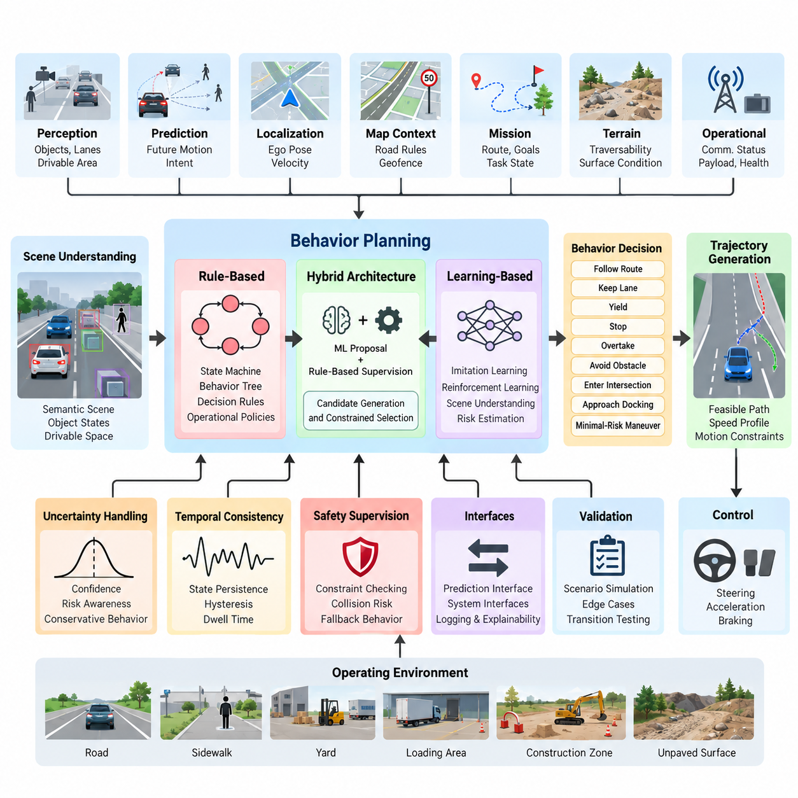
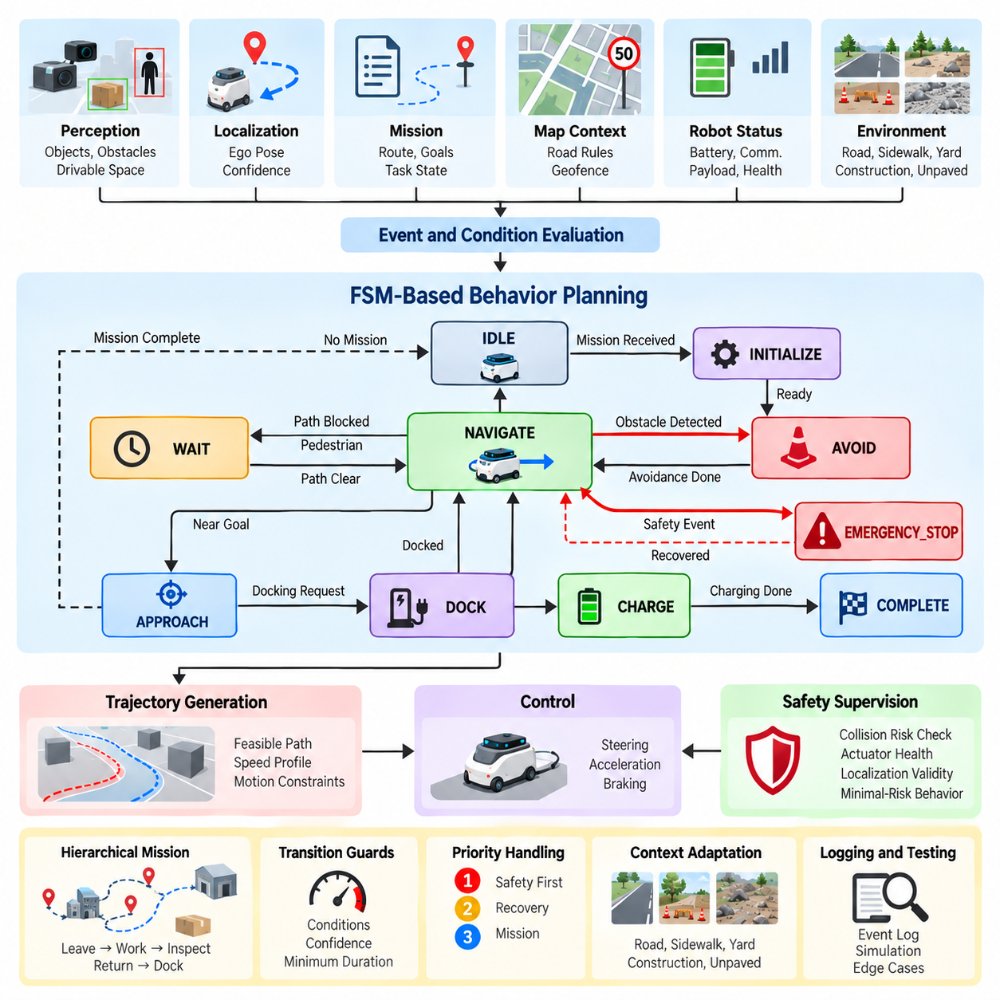
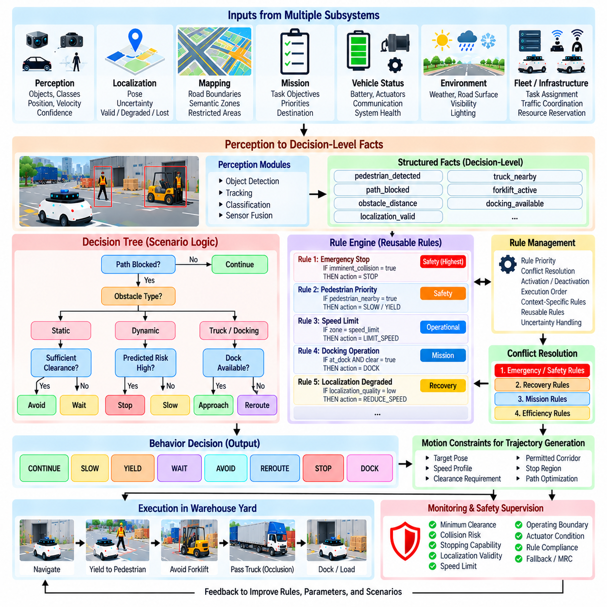
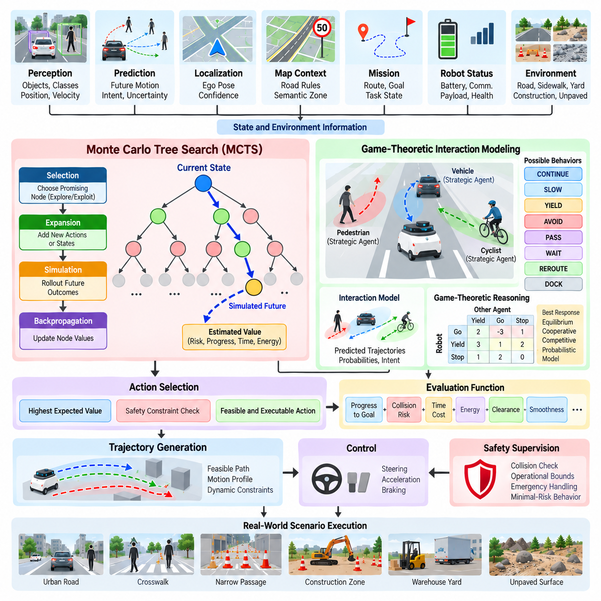
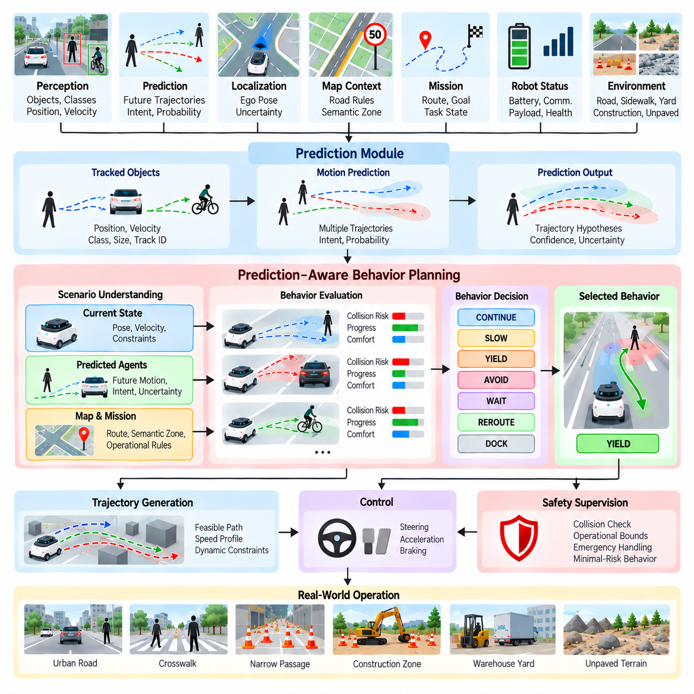
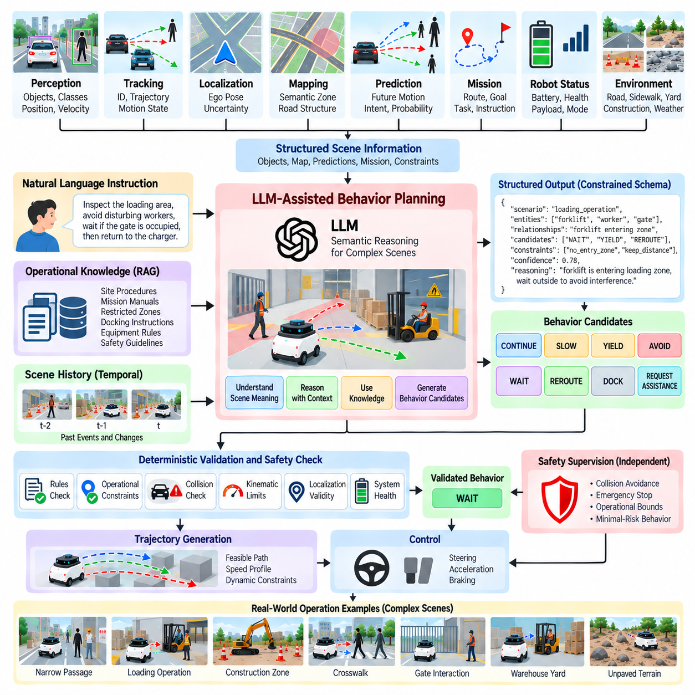
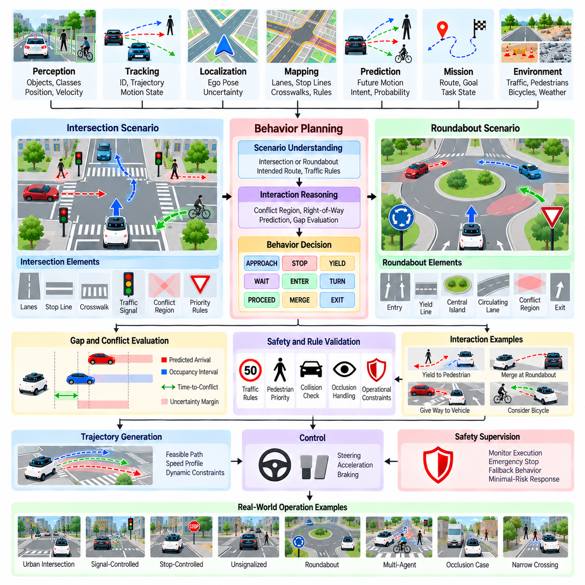
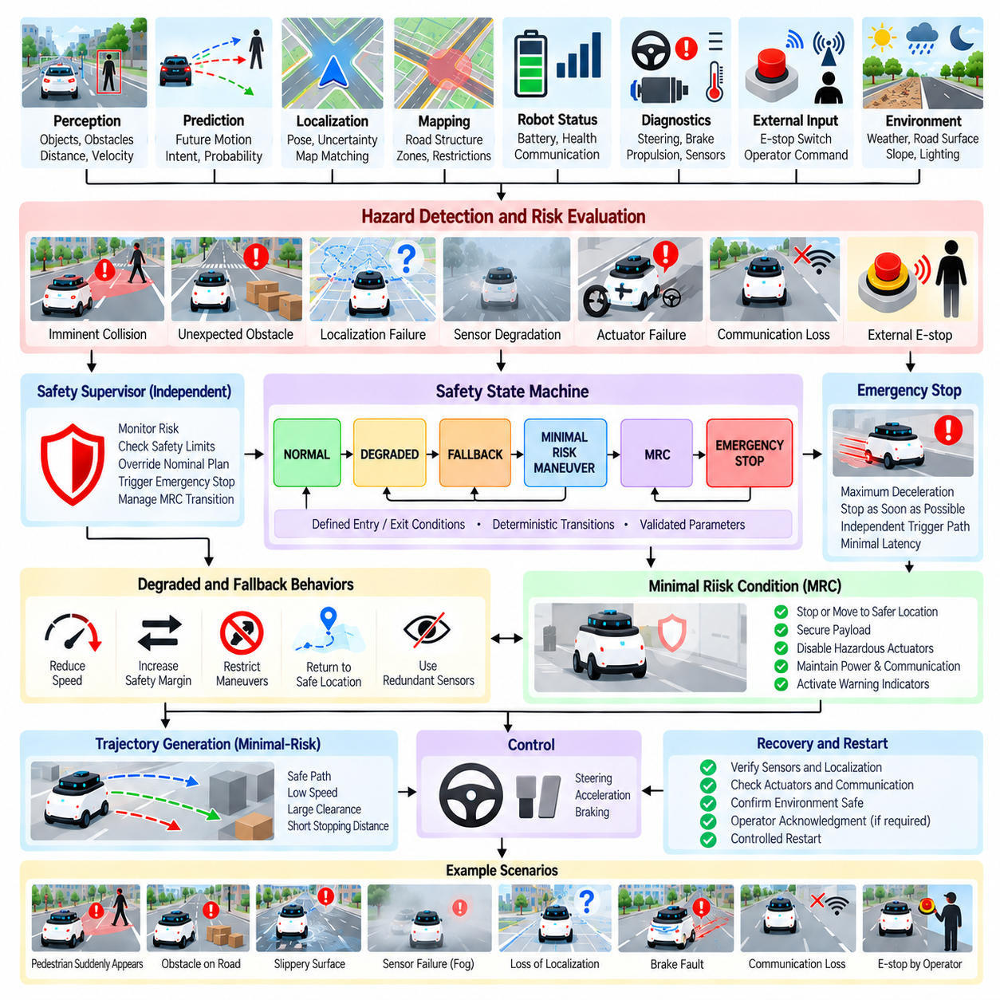
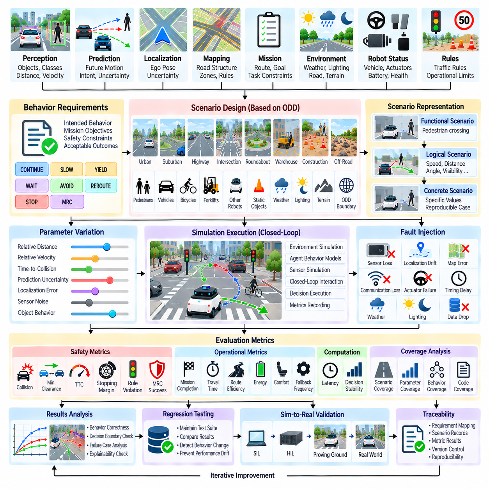

**Volume 12. Autonomous Driving Software**

# Chapter 06. Behavior Planning

## 06.01. Behavior Planning Architecture Rule ML Hybrid

{width="7.268055555555556in" height="7.268055555555556in"}

Behavior planning is the decision-making layer that converts perception, prediction, localization, map context, mission objectives, and safety constraints into a discrete driving or navigation behavior. Within the autonomous driving software stack, it lies between scene understanding and trajectory generation, determining what the vehicle or outdoor AMR should do before a continuous motion trajectory is calculated.

A behavior planner does not normally command steering angles, wheel torques, or acceleration directly. Instead, it produces semantic decisions such as follow route, keep lane, yield, stop, overtake, avoid obstacle, enter intersection, approach docking area, or execute a minimal-risk maneuver. These decisions constrain the downstream trajectory generator, which converts behavioral intent into dynamically feasible paths and speed profiles.

The planner receives a structured representation of the current world. Typical inputs include ego pose and velocity, drivable-area boundaries, static and dynamic obstacles, tracked-object states, predicted trajectories, route information, traffic or operational rules, terrain conditions, and mission state. For outdoor AMRs, additional information may include traversability, restricted zones, communication status, payload condition, and localization confidence.

A rule-based architecture represents driving knowledge explicitly through finite-state machines, behavior trees, decision trees, statecharts, or collections of conditional rules. A planner may transition from CRUISE to YIELD when a pedestrian enters a conflict region, from YIELD to STOP when safe clearance becomes insufficient, and from STOP back to CRUISE after the region becomes clear. Such logic provides deterministic and inspectable behavior.

Rule-based planning is particularly attractive for safety-critical behaviors because engineers can trace a decision to explicit conditions and verify permitted transitions. Operational constraints, speed restrictions, emergency-stop logic, geofenced areas, right-of-way policies, and mission procedures can be encoded directly. This transparency also supports debugging because recorded inputs can be replayed to determine why a specific behavior transition occurred.

The limitation is scalability. Real environments generate combinations of uncertain perception, ambiguous intent, occlusion, unusual obstacle motion, changing terrain, and interaction with humans or other vehicles. As scenario diversity increases, rule sets may accumulate exceptions and overlapping conditions. Maintaining priorities among hundreds or thousands of rules can become difficult, and unanticipated combinations can expose gaps that were not represented during development.

Machine-learning-based behavior planning addresses part of this complexity by learning decision policies from data or interaction. Imitation learning can reproduce behaviors demonstrated by human operators or expert planners, while reinforcement learning can optimize policies using rewards associated with safety, progress, efficiency, comfort, or mission completion. Neural policies can therefore represent decision boundaries that would be cumbersome to describe with explicit rules.

Learning-based planners can also incorporate richer scene representations. Instead of relying only on symbolic states, a model may consume object features, occupancy representations, map elements, predicted motion, or latent scene embeddings. Attention-based networks and other sequence models can reason over multiple interacting agents and temporal context, allowing the behavior decision to depend on how a scene has evolved rather than only on one instantaneous observation.

However, learned behavior introduces uncertainty that must be managed at the system level. A neural policy may behave unexpectedly when its inputs differ substantially from its training distribution, and explaining a particular output can be harder than inspecting an explicit rule. Dataset bias, rare scenarios, reward design, model calibration, distribution shift, and insufficient coverage therefore become architectural concerns rather than merely machine-learning concerns.

A hybrid architecture combines learned decision capability with deterministic constraints. Machine learning may estimate interaction intent, rank candidate maneuvers, evaluate scene risk, or propose a behavior, while a rule-based supervisory layer checks whether the proposal satisfies operational and safety constraints. The resulting architecture separates flexible reasoning from constraints that should remain explicit, testable, and difficult for a learned policy to override.

One common hybrid pattern is candidate generation followed by constrained selection. The system creates alternatives such as continue, slow, stop, yield, pass, or reroute. A learned model estimates costs, probabilities, or expected utility, while deterministic logic rejects candidates that violate collision margins, restricted-area rules, vehicle limitations, mission policies, or safety requirements. The surviving behavior is then passed to trajectory generation.

Another pattern places machine learning inside a hierarchical planner rather than making it responsible for the entire decision process. High-level mission logic may remain deterministic, while learned modules solve specific ambiguous interactions. For example, an outdoor AMR can follow a rule-defined patrol mission but use learned prediction to estimate whether a pedestrian will cross its route. The planner then selects behavior using both prediction and explicit safety constraints.

Temporal consistency is essential regardless of architecture. Behavior planning should not oscillate rapidly between alternatives when sensor estimates fluctuate near a threshold. State persistence, hysteresis, confidence thresholds, minimum dwell times, and transition guards can stabilize decisions. The planner must also preserve enough historical context to distinguish a genuinely changing situation from noise in perception, prediction, localization, or communication.

Uncertainty should therefore propagate into behavior decisions rather than disappearing at module boundaries. Low localization confidence may reduce allowed speed, uncertain object classification may increase clearance, and disagreement among motion predictions may favor a more conservative maneuver. This converts uncertainty into operational behavior and allows the planner to degrade performance systematically when the reliability of upstream information decreases.

For outdoor AMRs, behavior planning differs from conventional road-vehicle planning because the operational environment can be only partially structured. A robot may transition between roads, sidewalks, yards, loading areas, construction zones, or unpaved surfaces. The behavior layer must consequently consider terrain traversability, local operating policies, mission priorities, narrow passages, temporary obstacles, human workers, and infrastructure-specific constraints alongside conventional traffic interactions.

The architecture should maintain a clear boundary between behavior planning and trajectory generation. Behavior planning answers what maneuver should be performed and under which constraints, whereas trajectory generation determines how that maneuver can be executed geometrically and dynamically. This separation enables multiple trajectory candidates to be evaluated under the same behavioral objective and allows behavior logic to remain independent of specific low-level controllers.

Safety supervision should remain active after a behavior has been selected. Runtime monitors can check predicted collision risk, stopping distance, localization validity, perception health, actuator availability, and operational boundaries. If the selected behavior becomes unsafe or required information becomes unavailable, the system can invalidate it and transition toward a fallback behavior, emergency stop, or minimal-risk condition rather than blindly completing the original maneuver.

Behavior planning also requires explicit interfaces with prediction. A planner that ignores how other agents may move becomes reactive and can make unnecessarily abrupt decisions. Prediction-aware planning evaluates possible future interactions before committing to a maneuver. Conversely, planning can influence prediction because another road user or pedestrian may react to the robot\'s motion, creating a coupled decision problem that motivates probabilistic and game-theoretic approaches.

The software implementation should expose the planner\'s internal reasoning for validation and field debugging. Useful outputs include active behavioral state, candidate behaviors, rejected alternatives, transition causes, constraint violations, confidence values, risk estimates, and timestamps. Logging these quantities allows developers to reconstruct not only what the AMR did but also why a particular behavior was selected when an unexpected event occurred.

Validation must cover transitions and interactions rather than testing only isolated states. Scenario-based simulation can vary pedestrian motion, vehicle behavior, obstacle placement, visibility, localization error, terrain condition, communication delay, and sensor uncertainty. Boundary conditions around behavior transitions deserve particular attention because failures often occur when several conditions become true simultaneously or when estimates repeatedly cross decision thresholds.

The broader software structure places behavior planning after object detection and tracking and before trajectory generation, control integration, safety and redundancy, and later system-level safety validation. This makes it a central semantic decision layer connecting environmental understanding with executable motion while preserving interfaces to independent safety mechanisms.

Ultimately, rule-based, machine-learning, and hybrid behavior planning should be viewed as complementary architectural choices rather than mutually exclusive generations of technology. Rules provide explicit constraints and predictable transitions, learning provides adaptability to complex interactions, and hybrid designs combine these capabilities. For practical outdoor AMRs, the architecture can evolve by introducing learned components selectively while retaining deterministic supervision around safety-critical decisions.

## 06.02. FSM Based Behavior Planning for AMR [w/Code]

{width="7.268055555555556in" height="7.268055555555556in"}

A Finite-State Machine (FSM) is a structured method for representing autonomous robot behavior as a set of discrete states and explicitly defined transitions. In an Autonomous Mobile Robot (AMR), FSM-based behavior planning provides a practical bridge between perception, localization, mission logic, and motion execution. The structure defines what behavioral mode the robot is currently in, what conditions permit a transition, and what action should be executed after the transition. The attached software tree places FSM-based behavior planning directly within Chapter 06, following the general behavior-planning architecture and preceding decision-tree, rule-engine, prediction-aware, and more advanced planning approaches.

An AMR FSM can represent the robot\'s operational lifecycle using states such as IDLE, INITIALIZE, NAVIGATE, APPROACH, AVOID, WAIT, DOCK, CHARGE, COMPLETE, and EMERGENCY_STOP. Each state has a defined purpose and a limited set of permitted transitions. For example, the robot can transition from IDLE to NAVIGATE when a valid mission is received, from NAVIGATE to AVOID when an obstacle creates an immediate conflict, and from NAVIGATE to DOCK when the mission requires docking. This explicit structure makes the overall behavior easier to understand, implement, test, and maintain.

The most important design principle is to separate state definition from transition conditions. A state describes the behavior currently being executed, while a transition describes the event or condition that causes the planner to select another state. Conditions may be derived from perception, localization, obstacle tracking, route progress, mission status, battery state, communication availability, or safety monitoring. Keeping these concepts separate prevents individual behaviors from becoming tightly coupled and allows the same transition logic to be reused across different operational scenarios.

A practical FSM should define entry actions, continuous actions, exit actions, transition guards, and failure responses. When entering a NAVIGATE state, the planner may initialize route following and activate the appropriate trajectory generation process. While remaining in NAVIGATE, it continuously evaluates obstacles, localization confidence, route progress, and mission conditions. When leaving the state, temporary resources or commands can be released. Transition guards prevent inappropriate state changes by requiring explicit conditions before a transition is accepted.

For an outdoor AMR, perception events are often major triggers for FSM transitions. A detected pedestrian may cause the robot to enter a YIELD or WAIT state, while a static obstacle may trigger AVOID or REROUTE behavior. If the obstacle disappears, the planner can return to the previous navigation state. However, the transition should not depend on a single noisy detection. Temporal persistence, confidence thresholds, object tracking, and minimum state duration can prevent rapid switching caused by unstable sensor observations.

Localization is another important input to FSM behavior. When localization confidence is high, the robot can execute normal navigation behavior. If localization becomes degraded, the planner may transition to a conservative state that reduces speed or attempts recovery. If localization becomes unavailable beyond an operational threshold, the robot may enter a controlled stop or minimal-risk behavior. This approach allows the FSM to translate system-health information into explicit operational behavior instead of treating localization as an independent subsystem with no behavioral consequences.

Mission management can be modeled as a higher-level FSM or integrated with the navigation FSM through hierarchical states. A mission may contain sequential activities such as leaving a charging station, traveling to a work area, performing an inspection, returning to a designated location, and docking. The high-level mission state determines the current objective, while a lower-level navigation FSM handles local movement. Hierarchical organization prevents one large FSM from containing every possible combination of mission, navigation, obstacle, and safety states.

State explosion is one of the principal limitations of conventional FSM design. If every combination of obstacle type, mission status, terrain condition, localization mode, battery state, and communication condition becomes an independent state, the number of states can grow rapidly. The resulting architecture becomes difficult to review and maintain. A better approach is to keep states semantically meaningful and represent variable information as contextual data or separate supervisory conditions rather than encoding every combination as a separate state.

Priority handling is particularly important when multiple transition conditions occur simultaneously. An AMR may encounter a pedestrian while also approaching a mission waypoint and experiencing reduced localization confidence. The planner therefore needs a deterministic priority policy. Safety-critical transitions should be evaluated before ordinary mission transitions, while recovery conditions should be prevented from overriding an active emergency response. Explicit priority rules make behavior deterministic when several events are valid at the same time.

FSM behavior should also interact cleanly with trajectory generation and control. The FSM determines the desired behavior, while a downstream trajectory planner generates a feasible path and speed profile. For example, an AVOID state may specify that the robot must pass around an obstacle while maintaining a safety margin, but it should not necessarily calculate individual wheel commands. This separation allows the same behavioral logic to operate with different trajectory-generation and control implementations while maintaining a stable software interface.

Safety behavior should be represented as an independent supervisory mechanism rather than as an ordinary navigation state alone. Emergency conditions such as imminent collision, critical actuator failure, severe localization loss, or loss of required safety information can force a transition into EMERGENCY_STOP or another minimal-risk state. The safety mechanism should be able to override ordinary navigation decisions. After the hazard is removed, recovery should require explicit validation rather than automatically returning to the previous state.

FSM implementation benefits from event logging and deterministic replay. Every transition should record the previous state, new state, triggering event, relevant guard conditions, confidence information, and timestamp. Such records allow engineers to reconstruct why the AMR changed behavior during field operation. When a robot unexpectedly stops, waits, reroutes, or fails to resume navigation, the transition history provides a direct starting point for diagnosis and validation.

Testing an FSM requires more than verifying that each individual state works correctly. Every important transition should be tested under nominal, boundary, degraded, and conflicting conditions. Simulation can inject changing obstacle positions, sensor failures, localization errors, communication delays, battery constraints, and mission interruptions. Tests should also examine repeated transitions, recovery after failure, simultaneous events, and conditions near decision thresholds. This is particularly important because many behavioral failures occur not inside a state but during the transition between two states.

An FSM should be designed as a deterministic behavioral framework while allowing its inputs to become increasingly intelligent. Perception and prediction models may provide learned estimates of object type, intent, risk, or future motion, but the FSM can convert these estimates into explicit behavioral transitions. This creates a useful separation in which machine-learning components provide information and the behavior layer applies operational logic. Such an arrangement can improve interpretability while preserving opportunities to introduce learning-based capabilities into more complex environments.

For outdoor AMRs, the FSM can be extended with terrain and operational context. Road, sidewalk, yard, loading area, construction zone, and unpaved environments may require different speed limits, clearance policies, obstacle responses, and mission rules. Instead of creating a completely different planner for each environment, the FSM can maintain a common behavioral structure while adapting parameters and transition guards according to the active operational context. This supports reuse across multiple AMR applications and reduces unnecessary duplication in the software architecture.

The practical value of FSM-based behavior planning lies in its explicitness. Engineers can inspect the current state, identify the permitted transitions, reproduce the triggering conditions, and determine which action should follow. This makes FSMs particularly suitable for the foundational behavioral layer of an AMR, especially when predictable execution, debugging, safety review, and structured validation are important. More advanced methods can subsequently be introduced where FSM complexity becomes excessive, while the FSM remains useful as a supervisory framework for mission execution, safety constraints, and operational mode management.

## 06.03. Decision Tree and Rule Engine for Scenarios [w/Code]

{width="7.268055555555556in" height="7.268055555555556in"}

A Decision Tree and Rule Engine provide a structured method for converting complex environmental and operational conditions into explicit behavior decisions. In an Autonomous Mobile Robot (AMR), this layer extends the basic state-transition concept of an FSM by allowing multiple conditions to be evaluated hierarchically before selecting an action. The software structure places this topic immediately after FSM-based behavior planning within Chapter 06, indicating its role as a more expressive scenario-oriented decision mechanism.

A Decision Tree represents decisions as a hierarchy of conditions and branches. The planner begins with an initial condition and evaluates successive questions until it reaches a terminal action. For example, the system may first determine whether the path is blocked, then determine whether the obstacle is static or dynamic, and finally evaluate whether sufficient clearance exists for avoidance. The resulting branch can select behaviors such as CONTINUE, SLOW, WAIT, AVOID, or REROUTE.

The main advantage of a Decision Tree is that scenario logic becomes visually and logically structured. Each branch represents a condition, while each leaf represents an operational decision. This makes it possible for engineers to understand how combinations of perception, localization, mission, and vehicle-status information lead to a particular behavior. Compared with a large collection of unrelated conditional statements, a well-designed tree provides a clearer hierarchy of decision dependencies.

A Rule Engine generalizes this concept by representing decision knowledge as a collection of explicit rules. A rule typically contains conditions and an associated action or conclusion. When the current robot state satisfies the conditions, the corresponding rule becomes applicable. Multiple rules may be evaluated against the same situation, so the engine requires mechanisms for rule priority, conflict resolution, activation, deactivation, and execution order.

Scenario-based planning benefits from separating reusable rules from the core behavior software. A rule such as reducing speed near pedestrians can potentially be reused across multiple missions, while a rule associated with a particular warehouse zone or construction area can remain context-specific. This separation allows operational policies to evolve without requiring fundamental changes to the entire navigation architecture.

The input conditions of a rule engine can originate from many subsystems. Perception can provide object classes, positions, velocities, and confidence values. Localization can provide pose and localization quality. Mapping can provide road boundaries, restricted areas, and semantic zones. Mission management can provide task objectives and priorities, while vehicle health can provide battery, actuator, communication, and system-status information.

A useful architecture distinguishes raw sensor information from decision-level facts. Instead of allowing every rule to directly interpret camera or LiDAR measurements, perception modules first produce structured facts such as pedestrian_detected, path_blocked, obstacle_distance, localization_valid, or docking_available. The rule engine evaluates these facts rather than raw sensor data. This separation reduces coupling and allows the same decision logic to operate with different perception implementations.

Rules should also account for uncertainty. A condition such as obstacle_detected should normally include detection confidence, temporal persistence, or tracking consistency rather than being triggered by a single observation. Similarly, localization-related rules can distinguish between valid, degraded, and unavailable positioning. Converting uncertain measurements into controlled decision-level conditions helps prevent unstable behavior caused by noisy upstream information.

Rule conflicts are unavoidable in sufficiently complex systems. One rule may request normal navigation because the route is clear, while another may request reduced speed because a pedestrian is nearby. A third rule may request an emergency stop because a safety monitor has detected an imminent hazard. The rule engine therefore needs a deterministic conflict-resolution policy, with safety-related constraints capable of overriding ordinary mission or navigation rules.

Priority can be implemented through explicit rule levels, precedence values, mutually exclusive conditions, or hierarchical evaluation. A practical ordering may place emergency and safety constraints above recovery behavior, mission requirements, and efficiency objectives. The exact policy depends on the AMR\'s operational design, but the important architectural principle is that simultaneous applicable rules must not produce ambiguous or nondeterministic behavior.

Decision Trees and Rule Engines can also be combined. A Decision Tree can provide the high-level scenario structure, while individual nodes invoke a rule set for more detailed evaluation. Conversely, a rule engine can select which Decision Tree should be activated according to the current operational context. This combination allows the architecture to remain organized even when the AMR operates across multiple environments and mission types.

For outdoor AMRs, scenario context can significantly change the appropriate decision. A blocked path on a structured road may lead to a controlled wait or reroute, while the same obstacle in a construction zone may require a different avoidance strategy. Terrain, road surface, pedestrian density, restricted areas, payload condition, and communication availability can therefore become decision variables. Context-aware rules allow common behavioral logic to adapt without creating a completely independent planner for every environment.

Mission logic should be separated from local obstacle response whenever practical. A high-level rule may specify that the robot must complete an inspection sequence, while lower-level rules determine how it reacts to temporary obstacles during that mission. This separation prevents a temporary local event from unnecessarily changing the overall mission objective. Hierarchical decision structures are especially useful when a mission contains multiple sequential tasks and each task has its own local operating rules.

The rule engine should maintain clear entry conditions, execution conditions, exit conditions, and invalidation conditions. A rule that becomes active should not necessarily remain active indefinitely. For example, an avoidance rule may become active when an obstacle enters a defined conflict region and become inactive only after the path has remained clear for a specified duration. Such temporal requirements reduce oscillation and prevent rapid switching between competing behaviors.

Decision logic should produce explainable outputs. Instead of returning only an action such as AVOID, the system should be able to identify which scenario was recognized, which conditions were satisfied, which rules were activated, and why competing rules were rejected. This information is valuable for debugging, field analysis, safety validation, and operational improvement. It also creates a traceable connection between environmental observations and the resulting robot behavior.

A rule engine should not directly replace trajectory generation or low-level control. Its primary responsibility is to determine the intended behavioral response. Once a decision such as AVOID, FOLLOW, WAIT, DOCK, or REROUTE has been selected, the trajectory-generation layer determines a feasible path and motion profile. The control layer then converts that trajectory into steering, acceleration, braking, or drive commands. This separation preserves modularity and allows individual layers to evolve independently.

Safety supervision should remain capable of overriding the decision engine. If a selected rule produces an action that becomes unsafe because the environment changes, a higher-priority safety mechanism should invalidate the action. Collision risk, loss of localization, actuator faults, critical sensor failure, or other safety conditions can force a transition toward emergency stopping or a minimal-risk behavior. The rule engine therefore operates within a larger safety architecture rather than being the ultimate authority over robot motion.

Testing a Decision Tree and Rule Engine requires systematic scenario coverage. Each branch should be exercised with normal and boundary values, while combinations of simultaneously active rules should be tested for conflicts. Simulation can vary obstacle distance, object velocity, localization confidence, communication state, mission status, and environmental context. Recorded field scenarios can then be replayed to verify that the same inputs produce the expected decisions.

The architecture should also support versioning and controlled modification of rules. Operational rules may change more frequently than core navigation software, but uncontrolled modification can introduce unexpected interactions. Rules should therefore have identifiable versions, ownership, activation conditions, validation status, and deployment records. Changes should be tested against regression scenarios before being introduced into operational AMRs.

A Decision Tree and Rule Engine provide a practical middle layer between simple FSM behavior and more adaptive planning approaches. They preserve explicit decision logic while allowing substantially richer combinations of conditions and operational scenarios. Their effectiveness depends less on the number of rules than on the quality of the information model, hierarchy, priority policy, temporal handling, conflict resolution, and validation process.

For an AMR architecture, the most useful role of a Decision Tree and Rule Engine is therefore to organize scenario knowledge into a deterministic and inspectable decision process. Perception, localization, mapping, mission, and vehicle-health systems provide structured facts; the decision layer evaluates those facts under explicit policies; and the resulting behavior is passed to trajectory generation and control. This architecture provides a strong foundation for subsequently integrating prediction, machine learning, or more advanced decision-making methods without abandoning traceability and operational control.

## 06.04. MCTS and Game Theoretic Behavior Planning [w/Code]

{width="7.268055555555556in" height="7.268055555555556in"}

Monte Carlo Tree Search (MCTS) is a search-based decision-making method that evaluates possible future behaviors by expanding a tree of candidate actions through repeated simulation and statistical estimation. In Autonomous Mobile Robot (AMR) behavior planning, MCTS can extend deterministic state and rule-based approaches by explicitly considering multiple future action sequences. The software structure places MCTS and game-theoretic behavior planning after FSM and Decision Tree approaches within the behavior-planning chapter, representing a transition toward more predictive and interaction-aware decision making.

An MCTS planner represents the decision process as a tree whose nodes correspond to behavioral states and whose branches represent possible actions. Starting from the current robot state, the planner repeatedly selects promising branches, expands previously unexplored actions, simulates possible future outcomes, and updates the statistical value of the visited nodes. After sufficient iterations, the planner can select an action according to estimated future value rather than relying only on a fixed sequence of rules.

The four conceptual operations of MCTS are selection, expansion, simulation, and backpropagation. Selection follows a policy that balances exploitation of actions already showing good results with exploration of actions that have received fewer evaluations. Expansion adds a new candidate action or state to the tree. Simulation estimates the future outcome of that branch using a simplified model or policy, and backpropagation transfers the resulting value through the visited nodes. Repeating this cycle gradually improves the quality of the decision estimate.

For an AMR, the action space can contain behaviors such as CONTINUE, SLOW, STOP, YIELD, AVOID, PASS, WAIT, REROUTE, and DOCK. The planner can evaluate these alternatives over a limited future horizon rather than making a decision solely from the current observation. A candidate behavior can therefore be judged according to expected progress, collision risk, travel time, energy consumption, clearance, mission completion, and other operational objectives. The exact reward or cost formulation should reflect the robot\'s operational design.

MCTS becomes particularly useful when the robot interacts with other agents whose future behavior is uncertain. A pedestrian may continue walking, stop, change direction, or cross the robot\'s path, while another vehicle may accelerate, yield, or occupy a conflict region. Instead of assuming one deterministic future, the planner can evaluate multiple possible outcomes and select a behavior that performs acceptably across plausible scenarios. This makes the method suitable for decision problems where future interactions are more important than the immediate geometry of the scene.

Game-theoretic behavior planning extends this idea by explicitly modeling interactions among multiple decision-making agents. The robot and surrounding vehicles or pedestrians can be represented as players whose actions influence one another. The planner considers not only what the robot can do but also how another agent may respond. Depending on the modeling assumptions, the interaction can be formulated using concepts such as best response, equilibrium, cooperative behavior, competitive behavior, or probabilistic response models.

A practical AMR planner does not need to model every surrounding object as a strategic player. Strategic reasoning should be applied selectively to agents whose actions can materially affect the robot\'s decision. For example, a nearby pedestrian approaching a crossing region may require interaction reasoning, while a stationary wall does not. This selective modeling reduces computational requirements and keeps the decision problem focused on agents that can influence future outcomes.

Prediction and game-theoretic reasoning should be connected through explicit uncertainty models. If a pedestrian has several plausible future trajectories, each trajectory can be assigned a probability or confidence estimate. The planner can then evaluate the expected consequence of each robot behavior across those possible futures. When uncertainty is high, the system may prefer a behavior with greater safety margin or lower worst-case consequence rather than selecting the action with the highest nominal efficiency.

The computational cost of MCTS is an important architectural consideration. A behavior planner must operate within a limited decision latency while perception, prediction, localization, trajectory generation, and control continue running. The search depth, branching factor, simulation count, prediction horizon, and state representation therefore need to be controlled. Progressive widening, action pruning, heuristic initialization, parallel simulation, and learned value functions can reduce unnecessary search while preserving useful decision quality.

The interface between MCTS and trajectory generation should remain clearly defined. MCTS should generally select or rank behavioral intentions rather than directly producing low-level steering or wheel commands. Once a behavior such as AVOID or YIELD is selected, the trajectory-generation layer can create geometrically and dynamically feasible trajectories. These trajectories can then be evaluated as candidate outcomes during search, allowing the behavioral planner to consider whether an intended behavior can actually be executed by the robot.

Safety constraints should remain outside the unrestricted search space or act as hard constraints within it. An MCTS algorithm should not be allowed to select a behavior simply because its estimated reward is high when that behavior violates a collision constraint, operational boundary, vehicle limitation, or emergency condition. Safety supervision can reject invalid branches before execution and can override a previously selected behavior when the real environment changes. This preserves a separation between optimization and non-negotiable safety requirements.

For outdoor AMRs, the game-theoretic problem can become more complex because the environment is less structured than a conventional road. The robot may operate around pedestrians, service vehicles, forklifts, construction equipment, gates, narrow passages, and temporary obstacles. Road rules may coexist with site-specific operational policies and terrain constraints. MCTS can incorporate these factors into the evaluation of future behaviors, while game-theoretic models can represent selected interactions with agents whose behavior affects the robot\'s available options.

Hierarchical planning can reduce the complexity of interaction-aware search. A high-level mission planner can determine the current objective, such as reaching an inspection zone or docking station, while MCTS operates locally on a smaller set of behavioral alternatives. This prevents the search tree from mixing long-term mission decisions with every short-term obstacle interaction. The resulting architecture separates strategic mission management from local interactive behavior planning while allowing information to flow between the two levels.

A useful evaluation function should combine multiple dimensions rather than relying on a single reward. Progress toward the mission objective can be combined with collision probability, minimum clearance, time cost, energy consumption, motion smoothness, route deviation, and operational constraints. Hard safety violations should be treated differently from soft optimization objectives. This distinction prevents an improvement in travel efficiency from compensating for a behavior that violates a mandatory safety constraint.

The behavior planner should also account for the reliability of its own predictions and simulations. A search result based on inaccurate object prediction, poor localization, or an incomplete environmental model can create false confidence. Confidence values, model uncertainty, prediction disagreement, and simulation validity can therefore be included in branch evaluation. When uncertainty exceeds a defined threshold, the planner can fall back to conservative behaviors such as WAIT, SLOW, STOP, or another validated minimal-risk response.

MCTS and game-theoretic planning require scenario-based validation because their behavior depends on interactions among multiple agents and future states. Simulation can vary pedestrian intent, vehicle response, obstacle movement, localization error, communication delay, and environmental constraints. Repeated trials can measure collision avoidance, mission progress, decision stability, computational latency, and behavior consistency. Important edge cases include agents that unexpectedly change direction, simultaneous conflicts, incomplete observations, and situations in which several actions have similar predicted values.

Logging is essential for understanding a search-based behavior decision. The system should record the selected behavior, candidate alternatives, estimated values, relevant prediction assumptions, safety constraints, search statistics, and the final execution result. This enables engineers to determine whether an unexpected decision resulted from perception, prediction, search configuration, reward design, or safety intervention. Such traceability is especially important when search behavior becomes more complex than deterministic rule evaluation.

MCTS and game-theoretic planning should therefore be viewed as complementary extensions to deterministic behavior planning rather than replacements for all existing mechanisms. FSMs and rule engines remain useful for explicit operational policies, safety constraints, and predictable state management, while MCTS can evaluate alternative future behaviors and game-theoretic reasoning can address interactions among decision-making agents. A layered architecture can combine these mechanisms according to scenario complexity.

For an outdoor AMR, the practical objective is not to search every possible future but to search the most relevant future decisions within a bounded computational and safety framework. Perception and prediction provide structured information, the search layer evaluates candidate behaviors, game-theoretic reasoning handles selected interactive situations, safety supervision constrains the available actions, and trajectory generation converts the selected behavior into executable motion. This architecture provides a path from deterministic behavior logic toward more predictive and interaction-aware autonomy while preserving operational control and validation requirements.

## 06.05. Prediction Aware Behavior Planning [w/Code]

{width="7.268055555555556in" height="7.268055555555556in"}

Prediction-aware behavior planning extends conventional behavior planning by considering how surrounding agents and environmental conditions may evolve over time. Instead of reacting only to the current scene, the planner uses predicted future states to select a behavior that remains appropriate over a defined planning horizon. Within Chapter 06, this topic follows MCTS and game-theoretic behavior planning, connecting behavioral decisions with future motion prediction and interaction-aware autonomy.

The fundamental input to prediction-aware planning is a representation of possible future states. Object tracking can provide position and velocity, while prediction modules estimate possible future trajectories, intentions, or behavior probabilities. A pedestrian approaching a road crossing, for example, may have several plausible futures, including continuing forward, stopping, changing direction, or entering the robot\'s path. The behavior planner uses these predictions to evaluate whether continuing, slowing, yielding, waiting, or rerouting is appropriate.

Prediction should not be treated as a single deterministic trajectory when the future is uncertain. A practical system can maintain multiple hypotheses with associated probabilities or confidence values. The planner can then evaluate candidate behaviors against these alternatives rather than assuming that one predicted trajectory will certainly occur. This allows the robot to account for uncertainty explicitly and select behaviors that remain acceptable across a range of plausible future outcomes.

A prediction-aware planner typically combines the current ego state, perceived objects, map context, mission objectives, and predicted agent motion. The ego state provides position, velocity, acceleration, and vehicle constraints, while the scene model provides object locations, classifications, and dynamic states. Map information provides route structure, semantic regions, and operational constraints. The prediction layer adds temporal information, allowing the planner to reason about future conflicts instead of only detecting conflicts that already exist.

The planning horizon must be selected according to vehicle speed, environment complexity, and decision latency. A very short horizon may fail to identify an interaction that becomes dangerous several seconds later, while an excessively long horizon can introduce prediction uncertainty and unnecessary computation. The planner therefore needs a bounded horizon in which predictions are sufficiently useful for decision making. The horizon can also vary according to speed, scenario type, and the uncertainty of predicted motion.

Time-to-collision and conflict-region analysis are useful concepts for prediction-aware decisions. Instead of asking only whether an obstacle is currently inside the robot\'s path, the planner can determine whether the robot and another agent are expected to occupy the same region at approximately the same time. A pedestrian several meters away may therefore become more important than a stationary object nearby if the pedestrian\'s predicted trajectory intersects the robot\'s future path.

Prediction-aware planning should distinguish between static and interactive obstacles. Static obstacles generally do not change their behavior in response to the robot, whereas pedestrians, bicycles, vehicles, and other robots can react to the robot\'s movement. This interaction creates a feedback relationship in which the selected robot behavior may change the future behavior of another agent. Consequently, predictions should be interpreted as conditional possibilities rather than guaranteed future events.

For example, if an AMR approaches a pedestrian crossing, an aggressive continuation may cause the pedestrian to stop or alter direction, while a controlled slowdown may allow the pedestrian to cross naturally. The planner can evaluate these possibilities using predicted trajectories and behavioral responses. The objective is not necessarily to predict the exact human action but to identify a sufficiently safe and efficient behavior under the uncertainty associated with human interaction.

Prediction quality should be represented explicitly in the planning interface. Useful information includes trajectory confidence, prediction horizon, multimodal hypotheses, uncertainty estimates, and model validity. If prediction confidence is high, the planner may use a more specific behavioral decision. If confidence is low or multiple predictions strongly disagree, the planner can increase safety margins or select a conservative behavior such as SLOW, WAIT, or STOP.

The relationship between prediction and behavior planning should also include temporal consistency. Predictions may change from one planning cycle to the next as new sensor observations arrive. If the planner immediately changes behavior whenever the predicted trajectory changes slightly, the robot can oscillate between actions. Filtering, hysteresis, prediction persistence, and minimum behavior durations can stabilize decisions while still allowing rapid responses when a genuine safety-critical change occurs.

Prediction-aware planning can be implemented with deterministic rules, probabilistic models, optimization, MCTS, game-theoretic reasoning, or learned policies. A rule-based system can use predicted conflict conditions to trigger YIELD or STOP. A probabilistic planner can evaluate expected outcomes across multiple trajectory hypotheses. MCTS can simulate future behavior sequences, while a game-theoretic model can consider how another decision-making agent may respond to the robot\'s action. These methods can therefore be integrated rather than treated as mutually exclusive alternatives.

The evaluation function should distinguish safety constraints from optimization objectives. Collision risk, minimum clearance, and emergency constraints should act as hard restrictions, while progress, travel time, energy consumption, route deviation, and motion smoothness can be optimized within the safe region. This prevents a behavior with high efficiency from being selected simply because its predicted reward compensates numerically for an unacceptable safety risk.

Outdoor AMRs require prediction-aware planning across environments that may be less structured than conventional roads. A robot can encounter pedestrians, forklifts, service vehicles, construction equipment, bicycles, temporary barriers, and other mobile objects in yards, campuses, loading areas, and construction zones. Their movement patterns can differ significantly by environment. Operational context should therefore influence both the interpretation of predictions and the behavioral response selected by the planner.

Prediction should also be connected to mission-level behavior. A temporary pedestrian interaction should not necessarily change the robot\'s overall mission. If an inspection robot encounters a pedestrian while traveling toward a designated inspection point, the local planner can temporarily yield or wait while the higher-level mission remains unchanged. Once the interaction is resolved, the robot can resume the mission. This separation prevents short-term predictions from unnecessarily disrupting long-term objectives.

Localization and prediction errors can interact in important ways. If the robot\'s estimated position is uncertain, a predicted conflict location may also become uncertain. Similarly, incorrect object association or velocity estimation can produce misleading future trajectories. The behavior planner should therefore consider uncertainty from perception, tracking, localization, and prediction together rather than treating the prediction module as an infallible source of future information.

The planner should provide clear interfaces between prediction, behavior selection, trajectory generation, and control. Prediction supplies possible future states, behavior planning selects an intended response, trajectory generation constructs a feasible path and speed profile, and control executes that trajectory. This separation allows different prediction and planning algorithms to be replaced or improved without redesigning the complete autonomy stack. It also makes testing easier because each interface can expose well-defined inputs, outputs, timestamps, and confidence information.

Safety supervision must remain capable of overriding a prediction-aware decision. A prediction may indicate that an obstacle will probably move away, but the real object may suddenly change direction. The robot therefore cannot rely exclusively on predicted behavior. Runtime safety checks should continuously evaluate the actual scene and predicted collision state. If a previously selected behavior becomes unsafe, the system must be able to reject it and transition to a validated fallback or minimal-risk behavior.

Validation should focus on both prediction accuracy and behavioral consequences. A prediction model can have acceptable average trajectory error while still producing problematic behavior in rare interactions. Scenario-based testing should therefore vary pedestrian intent, vehicle speed, unexpected stops, direction changes, occlusions, sensor noise, localization errors, and communication delays. The evaluation should measure not only prediction metrics but also collision avoidance, decision stability, unnecessary stopping, mission progress, and computational latency.

Field operation data provides an important source for improving prediction-aware planning. Recorded trajectories can reveal situations where the prediction model repeatedly produces uncertain or incorrect hypotheses, while behavior logs can identify cases where the planner selected unnecessary or overly conservative actions. These cases can be converted into regression scenarios and used to evaluate subsequent changes to prediction models, planning policies, and decision thresholds.

A practical prediction-aware architecture should therefore treat prediction as decision-support information rather than as an unquestionable description of the future. The planner combines multiple possible futures with current state information, safety constraints, mission objectives, and vehicle capabilities. It then selects a behavior that is appropriate for the most relevant predicted outcomes while maintaining a fallback when uncertainty becomes excessive.

The progression within behavior planning can consequently move from explicit FSM and rule-based decisions toward increasingly predictive and interaction-aware methods. FSMs provide structured behavioral states, rule engines provide explicit scenario logic, MCTS provides future search, and prediction-aware planning incorporates temporal evolution directly into behavior selection. Together, these mechanisms provide a foundation for outdoor AMRs that must respond not only to where objects are now, but also to where they may move and how those movements can affect future robot behavior.

## 06.06. LLM Assisted Behavior Planning for Complex Scenes [w/Code]

{width="7.268055555555556in" height="7.268055555555556in"}

Large Language Model (LLM)-assisted behavior planning introduces semantic reasoning into the autonomous decision-making stack by using language-capable models to interpret complex scenes, relationships, instructions, and contextual constraints. Rather than replacing deterministic planners, an LLM can operate as a high-level reasoning component that converts rich scene descriptions into structured behavioral suggestions. For outdoor AMRs, this is especially useful when situations cannot be represented efficiently by fixed rules alone.

The LLM should receive a structured representation of the environment rather than unrestricted raw sensor streams. Perception, tracking, localization, mapping, prediction, and mission modules can transform sensor observations into symbolic or textual scene information. Objects, positions, predicted motions, semantic zones, route conditions, operational restrictions, and robot status can then be represented in a compact scene description that provides the model with relevant decision context.

A scene representation may describe that the robot is approaching a narrow passage, a pedestrian is standing near the entrance, a service vehicle is moving toward the same region, and the planned route continues through the passage. The LLM can reason about the relationships among these facts and propose candidate behaviors such as SLOW, YIELD, WAIT, or REROUTE. The final action, however, should remain subject to deterministic validation and safety constraints.

This semantic capability becomes valuable when the meaning of a scene depends on context rather than geometry alone. A temporary barrier, worker gesture, maintenance activity, loading operation, or unusual arrangement of objects may imply operational constraints that are difficult to encode exhaustively. An LLM can combine object semantics, mission context, site rules, and natural-language instructions to generate a higher-level interpretation that complements conventional geometric planning.

LLM-assisted planning can also provide an interface between natural-language mission instructions and executable robot behavior. An operator may request that the robot inspect a loading area, avoid disturbing workers, wait if a gate is occupied, and return to the charging station afterward. The LLM can decompose such instructions into structured mission objectives, behavioral constraints, and conditional actions that conventional mission and behavior planners can process.

The architecture should clearly separate semantic reasoning from motion-critical execution. The LLM can interpret the situation, identify relevant constraints, generate behavioral candidates, or explain alternatives, but trajectory generation and low-level control should remain within dedicated deterministic or validated modules. This separation prevents free-form language generation from directly producing steering, acceleration, braking, or wheel commands without appropriate verification.

A useful LLM output should therefore follow a constrained schema rather than unrestricted natural language. The output can include recognized scenario type, relevant entities, inferred relationships, candidate behaviors, behavioral constraints, confidence information, and a short reasoning summary. Structured outputs allow downstream software to validate values, reject unsupported actions, compare candidates, and maintain stable interfaces even when the underlying language model is changed.

Grounding is essential because an LLM can generate plausible statements that are not supported by the current environment. Every scene-related claim used for planning should be connected to information supplied by perception, maps, mission data, prediction, or approved operational knowledge. If the model refers to an object, rule, or condition that cannot be verified through these sources, the behavior planner should treat the statement as unsupported rather than accepting it as an environmental fact.

Retrieval-Augmented Generation (RAG) can provide operational knowledge that is too extensive or frequently changing to embed directly in prompts. Site procedures, mission manuals, restricted-zone policies, docking instructions, equipment interaction rules, and validated behavioral guidelines can be retrieved according to the current context. The LLM can reason over this selected information while the system maintains provenance showing which operational documents contributed to the recommendation.

Complex-scene reasoning also benefits from combining prediction with semantic understanding. Conventional prediction may indicate that a forklift is likely to enter a shared region, while semantic information identifies the region as an active loading zone. The LLM can interpret these facts together and suggest that the robot wait outside the zone rather than merely calculate a geometrically collision-free path through it. Semantic context can therefore influence the meaning assigned to predicted motion.

Temporal reasoning is necessary because many complex scenes develop over several observations. A worker approaching a gate, opening it, and signaling toward the robot represents a sequence rather than an isolated frame. The LLM-assisted layer can receive summarized event history and reason about changes in scene state. However, temporal conclusions should remain connected to tracked observations so that outdated assumptions do not continue influencing behavior after the situation has changed.

LLM reasoning should operate under explicit behavioral boundaries. The system can define an allowed action vocabulary such as CONTINUE, SLOW, STOP, YIELD, WAIT, AVOID, REROUTE, DOCK, REQUEST_ASSISTANCE, and MINIMAL_RISK. The model selects or ranks only from permitted behaviors instead of inventing arbitrary actions. Additional constraints can specify speed classes, prohibited regions, required clearances, and conditions that always trigger deterministic safety responses.

A safety supervisor should remain independent of the LLM. Even when the model recommends CONTINUE, downstream safety logic must reject the behavior if collision margins, localization validity, operational boundaries, or system-health requirements are violated. Emergency stopping and minimal-risk behavior should not depend on successful LLM inference. This architecture treats the language model as an advisory reasoning component rather than the final authority over safety-critical motion.

Latency is another important consideration. Large models may require substantially more computation than FSMs, rule engines, or conventional optimization modules. An AMR should therefore avoid placing an LLM directly inside the highest-frequency control loop. Semantic reasoning can operate at a slower behavioral frequency, while perception, collision checking, trajectory tracking, and safety monitoring continue at rates appropriate for real-time motion control.

Edge and on-premise deployment can reduce communication dependency and protect operational data when cloud access is undesirable or unavailable. Smaller language models may handle routine scene interpretation locally, while larger models can support offline analysis, difficult scenario review, or policy generation. Model selection should consider reasoning quality, latency, memory consumption, accelerator availability, communication reliability, and the operational consequences of model unavailability.

A hybrid architecture can combine LLM reasoning with FSMs and Rule Engines. The LLM may classify an unusual scene or propose a behavioral interpretation, while an FSM maintains operational state and a Rule Engine verifies explicit constraints. For example, the LLM can identify that a loading operation is temporarily blocking normal passage, the Rule Engine can confirm that entering the zone is prohibited, and the FSM can transition the robot from NAVIGATE to WAIT.

LLMs can also assist with behavior explanation and debugging. Because the planning stack can expose structured scene facts, selected rules, predictions, and candidate behaviors, the language model can generate a human-readable explanation of why the system slowed, waited, rerouted, or requested assistance. Such explanations should be derived from logged evidence rather than generated retrospectively without grounding, allowing operators and engineers to distinguish verified causes from model interpretation.

Human intervention should remain available for scenes whose semantic uncertainty exceeds validated limits. When the model cannot confidently interpret an unusual construction layout, conflicting human instructions, an unknown object, or an ambiguous operational rule, REQUEST_ASSISTANCE may be safer than forcing an autonomous decision. The planner can preserve the robot in a safe state while presenting relevant scene information and candidate interpretations to an authorized operator.

Validation of LLM-assisted planning requires more than evaluating language quality. Testing should measure whether the system selects permitted behaviors, follows operational constraints, remains grounded in supplied information, handles conflicting instructions, recognizes uncertainty, and transitions safely when the model fails. Scenario suites should include unusual objects, incomplete descriptions, misleading contextual cues, prediction errors, contradictory rules, and situations outside the model\'s validated operational domain.

Adversarial and malformed inputs should also be considered because language-capable systems may receive text from operators, databases, maps, or retrieved documents. External text should be treated as data rather than automatically trusted instructions. Input filtering, source authorization, structured interfaces, rule validation, and permission boundaries can prevent untrusted content from modifying safety policies or causing the planner to execute actions outside its authorized behavior set.

Operational logging should record the structured input provided to the model, retrieved knowledge, model version, generated recommendation, confidence or uncertainty information, validation results, selected final behavior, and any safety override. This creates traceability between scene understanding and execution. Model or prompt updates can then be evaluated against recorded scenarios to determine whether behavior changed and whether the change remains consistent with validated requirements.

LLM-assisted behavior planning is therefore most useful as a semantic reasoning layer within a larger hybrid autonomy architecture. Perception and prediction describe the physical scene, maps and mission systems provide operational context, the LLM interprets complex relationships and proposes structured behaviors, deterministic modules validate those proposals, and trajectory generation converts an approved decision into executable motion. Safety supervision remains independent throughout the process.

For complex outdoor AMR scenes, this architecture provides a path beyond manually encoding every possible contextual combination. FSMs preserve predictable operational states, Rule Engines enforce explicit policies, prediction models estimate future motion, search methods evaluate alternatives, and LLMs contribute semantic interpretation of unusual or context-rich situations. Their combination can increase behavioral flexibility while retaining the deterministic interfaces, traceability, bounded authority, and independent safety mechanisms required for deployable autonomous systems.

## 06.07. Intersection and Roundabout Behavior Planning [w/Code]

{width="7.268055555555556in" height="7.268055555555556in"}

Intersection and roundabout behavior planning addresses situations where an autonomous vehicle or outdoor Autonomous Mobile Robot (AMR) must coordinate its motion with multiple traffic participants while following road geometry, right-of-way constraints, and mission objectives. Unlike simple lane following, these environments contain crossing and merging trajectories that create temporary conflict regions. The behavior planner must therefore reason about both spatial relationships and the timing of future interactions before selecting a maneuver.

An intersection can be represented as a collection of approach lanes, stop lines, crosswalks, turning paths, priority relationships, and conflict regions. Map and perception information provide the geometric and semantic structure, while localization determines the robot\'s position relative to these elements. The behavior planner combines this information with detected vehicles, pedestrians, bicycles, and other moving objects to determine whether the robot should APPROACH, STOP, YIELD, WAIT, ENTER, TURN, or PROCEED.

Behavior planning normally begins before the robot reaches the physical intersection. During the APPROACH state, the planner identifies the intersection type, determines the intended route, evaluates applicable traffic or operational rules, and reduces speed when necessary. It also establishes which regions must remain clear before entry. Early reasoning is important because waiting until the robot reaches a conflict point can leave insufficient distance for comfortable or safe deceleration.

A conflict region is an area that may be occupied by two or more traffic participants whose trajectories intersect or merge. The planner should evaluate not only whether another object currently occupies that region but also whether the object is predicted to enter it during the robot\'s planned traversal. Time-to-conflict, predicted arrival time, occupancy intervals, and uncertainty margins can therefore provide more useful decision information than instantaneous distance alone.

At stop-controlled intersections, the behavior planner must coordinate stopping, observation, priority evaluation, and entry. Reaching the stop line does not automatically imply that the robot can proceed. The system should verify that required stopping conditions have been satisfied, evaluate other participants, and determine whether sufficient temporal and spatial gaps exist. If the scene remains uncertain because of occlusion or incomplete perception, the planner can continue waiting rather than committing to entry.

Unsignalized intersections require explicit reasoning about right-of-way and agent interaction. Vehicles or robots may approach from several directions with different speeds and intentions, while pedestrians can enter crosswalks independently of vehicle flow. A deterministic rule layer can encode applicable priority constraints, while prediction estimates future motion. The behavior planner combines both sources so that legal or operational priority is not confused with an assumption that another participant will behave exactly as expected.

Signal-controlled intersections add traffic-signal state and phase timing to the decision process. The planner must associate the relevant signal with the robot\'s intended movement and determine whether sufficient time remains to enter and clear the intersection. Signal perception alone is insufficient because the system must also consider stopped vehicles, pedestrians, blocked exits, and unexpected obstacles. A permissive signal therefore authorizes consideration of entry but does not eliminate collision and occupancy checks.

Occlusion is particularly important near intersections. Parked vehicles, buildings, vegetation, infrastructure, or other traffic participants can hide approaching objects. The planner should represent limited visibility as uncertainty rather than interpreting an unobserved region as empty. Reduced approach speed, staged observation, conservative gap acceptance, or temporary stopping can increase the time available to detect previously hidden participants before the robot commits to a conflict region.

Roundabouts introduce a different interaction structure because vehicles circulate continuously around a central island and entering agents normally merge into an existing flow. The behavior planner must identify the intended entry and exit, observe circulating traffic, estimate acceptable gaps, merge into the roundabout, maintain the appropriate circulating path, and exit at the planned branch. These behaviors form a sequence that requires persistent route and interaction context rather than a single entry decision.

During roundabout approach, the planner evaluates circulating vehicles and predicts whether their trajectories will conflict with the robot\'s intended entry. A gap that is geometrically open at the current moment may become unavailable before the robot reaches the yield line. Prediction-aware gap assessment therefore considers relative speed, arrival time, uncertainty, and the robot\'s acceleration capability. The selected entry should remain feasible throughout the merge rather than being based only on instantaneous clearance.

Gap acceptance is a central behavior-planning problem for both intersections and roundabouts. The planner determines whether the available temporal and spatial separation is sufficient for the robot to enter, cross, turn, or merge without forcing another participant into an unsafe response. Acceptance thresholds can depend on robot size, acceleration capability, payload, surface condition, visibility, localization confidence, and predicted behavior of surrounding agents.

Pedestrians and bicycles require special attention because their motion can change quickly and their paths frequently intersect vehicle trajectories near crossings. A pedestrian standing near a crosswalk may remain stationary or begin crossing, while a bicycle can approach a conflict region faster than expected from simple distance measurements. Tracking history, intent prediction, uncertainty margins, and explicit crosswalk semantics can help the planner determine whether to continue, slow, yield, or wait.

Intersection behavior should remain temporally stable. Without persistence and hysteresis, small changes in object prediction can cause the planner to alternate repeatedly between ENTER and WAIT. Once a yielding or stopping decision has been selected, clearly defined release conditions should determine when progression can resume. Similarly, an entry decision should be continuously monitored, but ordinary prediction noise should not produce unnecessary oscillation after the robot has safely committed to the maneuver.

A commitment concept is useful after the robot begins crossing or merging. Before commitment, the planner can choose among waiting, yielding, or entering. After entering a conflict region, abruptly reversing the decision may create greater risk than completing the maneuver. The planner should therefore identify a point or state beyond which the preferred behavior changes from gap selection to safe completion, while independent emergency mechanisms remain capable of responding to immediate hazards.

Complex intersections may require interaction-aware planning when several agents influence one another. A vehicle may slow because it expects the robot to yield, while the robot may simultaneously wait because it predicts that the vehicle will continue. Such reciprocal assumptions can create unnecessary deadlock. Prediction-aware, game-theoretic, or search-based reasoning can evaluate alternative responses, while deterministic rules maintain right-of-way, operational constraints, and safety boundaries.

Deadlock handling is especially important for low-speed outdoor AMRs operating in mixed environments. At a narrow crossing or shared intersection, several robots, vehicles, or pedestrians may wait for one another indefinitely. The behavior planner can detect insufficient progress over time and invoke a controlled resolution policy, such as maintaining priority, yielding according to predefined rules, selecting an alternate route, or requesting assistance when the situation cannot be resolved within validated autonomy limits.

The interface with trajectory generation should preserve the distinction between behavioral intent and executable motion. The behavior planner may select YIELD, ENTER, TURN_LEFT, MERGE, CIRCULATE, or EXIT and provide associated constraints such as target region, speed range, required clearance, and prohibited occupancy. The trajectory generator then constructs dynamically feasible paths and velocity profiles that satisfy these constraints while respecting vehicle geometry and local obstacles.

Safety supervision remains independent throughout intersection and roundabout execution. Even after the behavior planner has selected entry, runtime monitoring should continuously evaluate collision risk, stopping capability, localization validity, unexpected object motion, and operational boundaries. If the assumptions supporting the selected behavior become invalid, the system should modify or reject the maneuver and transition toward an appropriate fallback or minimal-risk response whenever physically feasible.

Validation requires scenario combinations rather than isolated nominal cases. Simulation should vary approach speed, traffic density, signal state, pedestrian movement, bicycle motion, occlusion, prediction error, localization uncertainty, road geometry, and surface conditions. Roundabout testing should additionally vary circulating speed, entry gaps, multiple exits, lane occupancy, and simultaneous entering agents. Boundary cases around gap acceptance and transitions between WAIT and ENTER deserve particular attention.

Logging should capture the intersection type, intended route, relevant traffic controls, detected participants, predicted trajectories, conflict regions, accepted or rejected gaps, selected behavior, transition causes, and safety interventions. These records make it possible to reconstruct why the robot waited, entered, yielded, or aborted a maneuver. They also provide reusable scenarios for regression testing when perception, prediction, mapping, or behavioral policies are updated.

Intersection and roundabout planning therefore integrates map semantics, perception, prediction, right-of-way logic, temporal reasoning, and safety supervision into a coordinated behavioral process. The objective is not simply to find an open geometric path, but to determine when and under what conditions that path can be used safely and consistently. For outdoor AMRs, this capability forms an important bridge between prediction-aware behavior planning and downstream trajectory generation in structured and mixed-traffic environments.

## 06.08. Emergency Stop and Minimal Risk Condition Behavior

{width="7.268055555555556in" height="7.268055555555556in"}

Emergency Stop and Minimal Risk Condition (MRC) behavior defines how an autonomous vehicle or outdoor Autonomous Mobile Robot (AMR) responds when continued normal operation can no longer be guaranteed to remain safe. An emergency stop addresses hazards requiring immediate deceleration or motion termination, while an MRC represents a controlled state reached after the system reduces risk as far as reasonably possible. These mechanisms form a safety-critical layer above ordinary mission and behavior decisions.

The distinction between an emergency stop and an MRC is important. An emergency stop is primarily a rapid protective action triggered by an immediate hazard, such as imminent collision or critical actuator failure. An MRC is the resulting or deliberately selected operational condition in which the robot is stabilized with minimized residual risk. Depending on the environment, an MRC may involve stopping in place, moving slowly to a safer location, securing the payload, or maintaining a controlled stationary state.

Emergency behavior can be triggered by information from several independent sources. Collision monitoring may detect insufficient stopping distance, perception may identify an unexpected obstacle, localization may become unreliable, or vehicle diagnostics may detect steering, braking, propulsion, power, or communication faults. External emergency-stop devices and authorized operator commands can provide additional triggers. The safety architecture should combine these sources without relying on a single perception or planning component.

Hazard severity and available response time determine the appropriate reaction. When a collision is imminent, the system may have only enough time to command maximum validated deceleration and stop. When degradation develops more gradually, such as decreasing localization confidence or partial sensor loss, the robot may first reduce speed, increase safety margins, restrict available behaviors, and evaluate whether continued operation remains acceptable. This creates a progression from normal operation toward degraded and minimal-risk states.

Stopping behavior must consider the physical dynamics of the robot rather than treating STOP as an instantaneous logical action. Vehicle mass, payload, velocity, road gradient, tire-road friction, actuator delay, braking capability, and surface condition determine the achievable stopping distance. A heavily loaded outdoor AMR traveling downhill on a low-friction surface may require substantially more distance than an unloaded robot moving slowly on dry pavement. Safety decisions should therefore incorporate dynamic stopping capability.

A useful safety architecture separates nominal behavior planning from independent safety supervision. The normal planner may select CONTINUE, YIELD, AVOID, MERGE, or other mission-related behaviors, while a safety supervisor continuously evaluates whether the resulting motion remains inside validated safety limits. If those limits are violated, the supervisor can override the nominal decision and request controlled deceleration, emergency braking, or transition toward an MRC without waiting for the ordinary planner to reconsider the situation.

Minimal-risk behavior should be context dependent. Stopping immediately may be appropriate in a warehouse aisle or open yard but could create additional risk if the robot is positioned in a road intersection, railway crossing, steep slope, or another exposed conflict region. When sufficient control authority and time remain, the system may need to clear a hazardous area before stopping. The MRC strategy should therefore consider both the risk of continued movement and the risk associated with the final stopping location.

The transition into an MRC can be organized through explicit safety states such as NORMAL, DEGRADED, FALLBACK, MINIMAL_RISK_MANEUVER, MRC, and EMERGENCY_STOP. These states provide a deterministic framework for controlling progressively more restrictive behavior. Entry and exit conditions should be clearly defined so that temporary sensor noise does not cause unnecessary emergency transitions while genuine safety-critical failures receive immediate priority.

Degraded operation is useful when complete shutdown is unnecessary. Loss of one redundant sensor, temporary communication degradation, reduced localization confidence, or limited environmental visibility may permit continued operation under stricter constraints. The robot can reduce speed, enlarge clearance margins, disable complex maneuvers, restrict its operating region, or return toward a known safe location. Such degraded modes should only be used when their capabilities and limitations have been explicitly validated.

Localization failure deserves particular attention because behavior and trajectory planning depend on knowing where the robot is relative to roads, obstacles, and operational boundaries. When localization uncertainty exceeds a defined threshold, the system may progressively reduce speed and attempt recovery using alternative localization sources. If reliable positioning cannot be restored, the planner should prevent unrestricted navigation and transition toward an appropriate minimal-risk response.

Perception degradation can produce a similar response. Camera obstruction, LiDAR failure, environmental contamination, heavy rain, fog, glare, darkness, or sensor disagreement can reduce confidence in the surrounding scene. Rather than assuming that an unobserved area is safe, the system should treat insufficient perception as increased uncertainty. Speed restrictions, enlarged stopping margins, sensor redundancy, fallback perception, or eventual transition to MRC can be applied according to the remaining sensing capability.

Actuator and propulsion failures require different fallback strategies because the robot\'s ability to execute a desired maneuver may be physically reduced. Steering degradation may prevent normal path tracking, while propulsion failure may leave the robot unable to clear an intersection or slope. Brake degradation is especially critical because it directly affects stopping capability. The safety supervisor should therefore reason about remaining control authority and select only behaviors that can still be executed with the available actuators.

Communication loss should not automatically produce the same response in every AMR architecture. A robot designed for autonomous local operation may safely continue a limited mission without continuous network connectivity, whereas a remotely supervised system may require transition to a predefined fallback after communication is lost. The appropriate behavior depends on which safety functions remain available locally and whether external authorization or supervision is required for continued operation.

Emergency-stop commands require a short and deterministic path from detection to actuation. Excessive dependence on high-level planning, cloud communication, LLM reasoning, or computationally expensive prediction can introduce unacceptable delay. Safety-critical triggers should therefore use validated communication paths and execution mechanisms with bounded latency. Higher-level software may record, explain, and coordinate the event, but immediate protective action should not depend on nonessential reasoning components.

Once emergency braking begins, the system should continue monitoring the environment and robot state. A commanded stop does not guarantee that the robot has physically stopped, especially on slopes, slippery surfaces, or after actuator degradation. Wheel speed, inertial measurements, position change, brake state, and other available feedback can confirm whether deceleration is occurring as expected. Failure to achieve the expected response may require escalation to additional protective mechanisms.

Reaching an MRC should include stabilization of the complete robotic system rather than only zero vehicle velocity. Drive torque may need to be disabled or controlled, brakes maintained, manipulators placed in a safe condition, payloads secured, hazardous actuators inhibited, and warning indicators activated. The system should preserve sufficient power and communication for diagnostics when possible. The exact safe-state configuration depends on the robot platform and operational environment.

Recovery from an emergency or MRC requires more caution than entering it. A robot should not automatically resume normal operation simply because the original trigger disappears. The system should verify that relevant sensors, localization, actuators, communication, safety monitors, and environmental conditions have returned to acceptable states. Certain failures may require operator acknowledgment, maintenance inspection, system reset, or explicit authorization before motion can resume.

Human-machine interaction is important during fallback operation. Operators should receive concise information describing the trigger, current safety state, robot location, remaining system capability, and whether remote intervention is permitted. Ambiguous messages such as generic system errors provide little operational value. A structured diagnostic explanation can help an authorized operator determine whether the robot should remain stopped, be recovered manually, or undergo controlled restart procedures.

Trajectory generation must support minimal-risk maneuvers when motion remains necessary. Instead of optimizing ordinary travel efficiency, the trajectory generator may prioritize low speed, large clearance, low curvature, short stopping distance, and access to a safe stopping region. The behavior planner supplies the safety objective and restrictions, while trajectory generation determines whether a physically feasible fallback path exists. If no validated fallback trajectory exists, stopping may remain the only acceptable action.

Emergency and MRC behavior should be designed for deterministic verification. Every trigger should map to defined transitions, permitted actions, timing requirements, and recovery conditions. Safety-related parameters such as maximum degraded speed, minimum stopping margin, localization uncertainty limits, and response deadlines should be configuration-controlled. Changes to these values require regression testing because small parameter modifications can significantly alter safety behavior.

Simulation provides an effective method for exercising failures that would be dangerous or expensive to reproduce repeatedly with physical robots. Tests can inject sudden obstacles, sensor loss, localization drift, actuator degradation, brake delay, communication interruption, slippery surfaces, excessive payload, and conflicting planner commands. The evaluation should measure detection latency, intervention latency, stopping distance, residual risk, final MRC location, and successful prevention of unsafe nominal actions.

Physical validation remains necessary because simulation cannot perfectly reproduce braking friction, actuator delays, tire behavior, mechanical faults, or environmental variability. Controlled proving-ground tests can verify stopping performance across speed, payload, gradient, and surface conditions. Results can then calibrate simulation models and safety margins. The validated operational envelope should define where emergency and minimal-risk strategies are known to provide sufficient performance.

Event logging should preserve the conditions preceding the safety intervention, the triggering source, timestamps, robot state, selected fallback behavior, actuator commands, measured response, final MRC state, and recovery sequence. Synchronized logs make it possible to reconstruct whether the safety mechanism responded correctly and whether upstream perception, prediction, planning, or hardware contributed to the event. These records also provide valuable regression scenarios.

Emergency Stop and Minimal Risk Condition behavior therefore provides the final protective behavioral layer when ordinary autonomy can no longer guarantee acceptable operation. Nominal planning attempts to accomplish the mission, degraded modes preserve limited capability when validated, fallback behavior reduces exposure when faults develop, and emergency intervention handles immediate hazards. The resulting MRC establishes a controlled condition from which the system can be diagnosed, recovered, or safely returned to operation.

## 06.09. Behavior Planning Simulation Validation Methodology

{width="7.268055555555556in" height="7.268055555555556in"}

Behavior planning simulation validation provides a systematic method for determining whether an autonomous vehicle or outdoor Autonomous Mobile Robot (AMR) selects appropriate behaviors across normal, degraded, unusual, and safety-critical situations. Because behavior planning connects perception and prediction with trajectory generation and control, validation must examine more than whether individual algorithms execute correctly. It must determine whether complete decision sequences remain safe, consistent, explainable, and operationally acceptable.

The validation process begins by defining the intended behavior of the system. Each operational scenario should identify relevant environmental conditions, traffic participants, robot states, mission objectives, applicable rules, and expected behavioral constraints. Rather than prescribing one exact trajectory, behavior-level requirements can specify acceptable outcomes such as CONTINUE, SLOW, YIELD, WAIT, AVOID, REROUTE, STOP, or transition toward a minimal-risk condition.

Scenario design should be derived from the robot\'s Operational Design Domain (ODD). Road structure, pedestrian density, traffic conditions, terrain, weather, illumination, communication availability, localization quality, and operating speed define the conditions under which the robot is expected to function. Simulation scenarios systematically sample this domain and extend toward its boundaries so that behavior can be evaluated not only under nominal conditions but also near operational limits.

A useful scenario representation separates functional, logical, and concrete levels. A functional scenario describes a situation conceptually, such as a pedestrian crossing in front of the robot. A logical scenario defines parameter ranges including pedestrian speed, initial distance, robot velocity, visibility, and crossing angle. Concrete scenarios instantiate specific values from these ranges. This hierarchy allows a small number of behavioral concepts to generate large numbers of reproducible simulation cases.

Parameter variation is essential because many behavior failures occur near decision boundaries rather than in obvious nominal situations. A planner may behave correctly when an obstacle is clearly distant or clearly dangerous but become unstable near the threshold separating CONTINUE from YIELD. Simulation should therefore vary distance, relative velocity, time-to-collision, prediction confidence, localization uncertainty, and other parameters around transition thresholds to identify oscillation, late decisions, or excessive conservatism.

Scenario combinatorics quickly become too large for exhaustive testing. Pairwise or combinatorial sampling, boundary-value analysis, importance sampling, risk-based prioritization, and randomized generation can reduce the search space while preserving meaningful coverage. Rare but high-consequence events should receive additional attention even when their probability is low. Validation effort should therefore reflect both scenario frequency and potential severity.

Closed-loop simulation is particularly important for behavior planning. In an open-loop test, recorded sensor inputs are replayed while the robot\'s decisions cannot influence the environment. In closed-loop simulation, the selected behavior changes the robot trajectory, which affects surrounding agents and subsequent observations. This feedback is essential for evaluating yielding, merging, intersection negotiation, pedestrian interaction, obstacle avoidance, and other situations in which participants react to one another.

Agent behavior models should represent more than deterministic trajectories. Pedestrians, vehicles, bicycles, forklifts, and other robots can be assigned multiple behavior models with variations in speed, aggressiveness, reaction time, compliance, and intent. Some agents may follow expected rules while others behave unpredictably within realistic limits. Such diversity prevents validation from becoming artificially easy because every simulated participant perfectly follows the assumptions embedded in the planner.

Prediction-aware behavior planning requires validation of both prediction and the resulting decision. A trajectory prediction error does not necessarily produce an unsafe behavior, while a numerically accurate prediction can still lead to an inappropriate decision if uncertainty is handled incorrectly. Validation should therefore connect prediction metrics with behavioral consequences such as collision risk, unnecessary yielding, missed opportunities, unstable switching, and failure to maintain adequate safety margins.

Fault injection extends testing beyond nominal environmental variation. Simulation can deliberately introduce camera loss, LiDAR degradation, localization drift, delayed object tracks, map inconsistencies, communication loss, actuator degradation, corrupted mission information, or timing delays. The objective is to verify that the behavior planner transitions toward validated degraded, fallback, emergency, or minimal-risk behaviors rather than continuing normal operation under invalid assumptions.

Timing faults deserve particular attention because behavior planning depends on synchronized information from multiple modules. Perception, prediction, localization, maps, and vehicle state can arrive at different frequencies and latencies. Simulation can introduce stale messages, timestamp errors, processing delays, dropped updates, or asynchronous data. Validation should determine whether the planner detects information that is too old or inconsistent before it affects a safety-critical decision.

Behavioral correctness should be measured using multiple metrics. Safety-related measures can include collision occurrence, minimum clearance, time-to-collision, stopping margin, rule violations, and successful transition to a minimal-risk condition. Operational metrics can include mission completion, travel time, unnecessary stopping, route efficiency, energy consumption, passenger or payload comfort, and frequency of fallback behavior. Computational latency and decision-cycle stability should also be recorded.

A single metric is insufficient because optimization of one dimension can degrade another. A planner that never moves may achieve excellent collision statistics but fail its mission, while an aggressive planner may achieve high efficiency with unacceptable safety margins. Validation therefore requires a multidimensional acceptance framework in which mandatory safety constraints are separated from performance objectives. Safety violations should not be compensated by improvements in efficiency.

Coverage metrics should describe what the simulation campaign has actually exercised. Scenario coverage can track road types, interaction classes, weather conditions, object combinations, and fault modes. Parameter coverage measures sampled ranges and boundary regions. Behavioral coverage records planner states, transitions, rules, fallback modes, and selected actions. Code coverage can provide supplementary information, but high software coverage alone does not demonstrate adequate behavioral validation.

State-transition coverage is especially useful for FSM and hybrid behavior planners. Validation should confirm not only that each state can be entered but that important transitions occur under their intended conditions. NORMAL-to-DEGRADED, NAVIGATE-to-YIELD, WAIT-to-ENTER, FALLBACK-to-MRC, and similar transitions should be tested with nominal, boundary, conflicting, and invalid inputs. Unexpected or unreachable transitions can reveal architectural or implementation defects.

Rule-based planners require conflict and priority testing. Multiple rules can become active simultaneously, particularly in complex traffic or mixed-use environments. Simulation should create situations where mission progress, obstacle avoidance, pedestrian priority, localization degradation, and emergency conditions compete for control. The validation result should confirm that deterministic precedence is maintained and that safety-critical rules override lower-priority optimization objectives.

Search-based, probabilistic, and learning-assisted planners require repeatability controls. Random seeds, model versions, inference settings, search budgets, simulation initialization, and environmental parameters should be recorded. Repeated execution of identical or statistically equivalent scenarios can reveal decision variance. Where nondeterministic behavior is expected, acceptance criteria should be based on validated distributions and safety bounds rather than requiring identical action sequences.

LLM-assisted behavior planning introduces additional validation dimensions. Tests should determine whether the model remains grounded in structured scene information, selects only authorized behaviors, respects retrieved operational rules, handles ambiguous instructions, and recognizes conditions outside its validated capability. Hallucinated objects or policies must not become executable facts. Deterministic validation and independent safety supervision should remain active regardless of language-model output.

Scenario mutation provides an efficient method for discovering fragile behavior. Once a meaningful scenario has been identified, small changes can be applied to object position, speed, timing, visibility, map geometry, or prediction uncertainty. If a minor variation causes a disproportionate behavioral change, the case may reveal a sensitive decision boundary. Automated mutation can therefore transform individual field incidents or manually designed scenarios into larger regression families.

Recorded real-world data should be incorporated into the simulation workflow. Field logs containing difficult interactions, unexpected stops, near misses, perception failures, or operator interventions can be reconstructed as simulation scenarios. Engineers can then vary the original conditions to determine whether the behavior was specific to one event or represents a broader weakness. This creates a feedback loop between deployment experience and virtual validation.

Regression testing ensures that improvements in one scenario do not damage previously validated behavior. Every significant planner, rule, prediction model, map-processing, or parameter change should trigger execution of a representative regression suite. Safety-critical incidents and previously discovered failures should remain permanently represented in this suite. Automated comparison can highlight changes in selected behavior, timing, clearance, and fallback activation.

Large-scale simulation allows thousands or millions of scenario variations to be executed across parallel compute resources. Such scale is valuable for searching broad parameter spaces and discovering rare combinations, but simulation quantity alone does not guarantee validation quality. Scenario relevance, model fidelity, parameter coverage, oracle quality, and analysis of failures remain essential. Large-scale execution should complement carefully engineered targeted tests rather than replace them.

Simulation results must eventually be connected to physical validation. Simulator models contain approximations in sensing, vehicle dynamics, friction, agent behavior, latency, and environmental conditions. Selected scenarios should therefore progress toward Software-in-the-Loop (SIL), Hardware-in-the-Loop (HIL), controlled proving-ground testing, and limited real-world operation. Differences between simulated and physical behavior should be used to recalibrate models and refine safety margins.

Traceability connects requirements, scenarios, results, and software versions. Each important behavioral requirement should map to validation scenarios and measurable acceptance criteria. Test records should preserve scenario configuration, simulator version, planner version, map data, model versions, random seeds, outputs, metrics, and pass/fail results. This enables engineers to reproduce failures and demonstrate which evidence supports a particular behavioral capability.

Behavior planning simulation validation is therefore an iterative evidence-building process rather than a single test stage. Requirements define expected behavior, scenario models create representative situations, parameter exploration exposes boundaries, fault injection evaluates resilience, metrics quantify outcomes, regression preserves previous capability, and physical testing checks simulation assumptions. Together, these activities provide systematic evidence that the behavior planner can operate predictably across the intended domain while transitioning safely when normal autonomy becomes unreliable.

## 06.10. Outdoor AMR Warehouse Yard Behavior Planning Case

{width="7.268055555555556in" height="7.268055555555556in"}

An outdoor Autonomous Mobile Robot (AMR) operating in a warehouse yard provides a representative behavior-planning case because it must combine structured logistics rules with dynamic interactions found in open environments. Unlike an indoor AMR following controlled aisles, the outdoor robot encounters trucks, forklifts, workers, temporary obstacles, loading operations, changing road conditions, and partially structured traffic. Behavior planning must coordinate mission progress with continuous safety assessment.

A typical mission begins when the fleet or warehouse management system assigns a transport task between locations such as a storage building, loading dock, staging area, charging station, or container zone. The mission layer specifies the destination and operational constraints, while the behavior planner determines how the robot should respond to conditions encountered along the route. Route following therefore becomes a sequence of context-dependent behaviors rather than simple waypoint tracking.

The warehouse yard can be represented using semantic zones that describe how different areas should be used. Travel lanes, pedestrian crossings, loading zones, restricted regions, parking areas, intersections, docking locations, and speed-limited sections provide behavioral context beyond geometric free space. Map semantics allow the planner to understand that two geometrically similar areas may require different behavior because their operational purposes and access rules differ.

During normal travel, the planner can remain in a NAVIGATE or CRUISE behavior while continuously evaluating the route ahead. Target speed is constrained by local speed limits, stopping capability, payload, road surface, visibility, and surrounding traffic. The planner should avoid unnecessary state changes when the environment remains stable, but it must maintain sufficient awareness to transition quickly when another vehicle, worker, obstacle, or operational event changes the situation.

Pedestrian interaction is one of the most important warehouse-yard cases. Workers may cross designated walkways, emerge from behind parked trucks, walk between containers, or enter vehicle lanes while concentrating on loading tasks. The planner should combine pedestrian detection, tracking, predicted motion, crosswalk semantics, visibility, and stopping distance. Depending on risk, the robot may CONTINUE, SLOW, YIELD, WAIT, or STOP while maintaining conservative uncertainty margins.

Forklifts create a different interaction pattern because they can accelerate, reverse, turn sharply, and operate near loading areas with limited visibility. Their forks and carried loads can also change the effective occupied space. The AMR should therefore avoid treating a forklift as a simple point obstacle. Tracking history, orientation, motion state, operational zone, and predicted swept area can support more reliable decisions when yielding, passing, waiting, or rerouting around active material-handling operations.

Large trucks introduce significant occlusion and maneuvering uncertainty. A parked trailer may hide pedestrians or smaller vehicles, while a reversing truck can occupy several lanes during docking. When approaching an occluded region, the planner should reduce speed and increase stopping margin rather than assuming unseen space is empty. If a truck is actively maneuvering, the AMR may establish a temporary exclusion region and wait until the predicted conflict has cleared.

Intersections inside logistics yards often operate without conventional traffic signals. Priority may instead be defined by site rules, marked stop lines, main-lane priority, vehicle type, or operational procedures. The behavior planner must combine these deterministic rules with perception and prediction of actual traffic. Even when the AMR has nominal priority, it should not enter a conflict region if another vehicle is predicted to violate or misunderstand the expected priority.

Loading docks and staging areas require behavior that is closely coordinated with mission state. The robot may need to APPROACH, ALIGN, WAIT_FOR_CLEARANCE, DOCK, LOAD, UNDOCK, and DEPART according to equipment status and operational authorization. A geometrically reachable dock should not be considered available if workers, forklifts, pallets, vehicles, or active loading equipment occupy the required maneuvering region. Operational readiness is therefore part of behavior selection.

Temporary obstacles are common because pallets, containers, cones, maintenance equipment, damaged vehicles, and construction materials may appear in locations not represented by the static map. The planner should first determine whether the obstruction can be safely passed using local avoidance. If the route is effectively blocked, it can WAIT, request a local replan, select an alternate route, or report the obstruction to fleet management rather than repeatedly attempting the same infeasible path.

Warehouse yards also contain narrow passages where two vehicles may not safely pass simultaneously. The behavior planner can evaluate passage width, vehicle dimensions, direction of travel, priority rules, and available waiting spaces before entering. Once one participant commits to the constrained region, the other may need to yield. Explicit commitment and release conditions help prevent both vehicles from repeatedly advancing and stopping or entering a deadlock.

Payload condition affects outdoor AMR behavior. A heavily loaded robot may have longer stopping distance, reduced acceleration, different stability limits, and tighter constraints on slopes or turns. Behavior planning should therefore receive payload state rather than assuming constant vehicle dynamics. Speed selection, gap acceptance, following distance, slope traversal, turning behavior, and emergency stopping margins can then be adjusted to the robot\'s current physical configuration.

Surface and weather conditions can further modify these constraints. Rain, snow, ice, standing water, gravel, damaged pavement, ramps, and uneven surfaces may reduce traction or increase localization and perception uncertainty. The planner can respond by reducing speed, increasing following and stopping margins, avoiding particular regions, or selecting a validated degraded mode. Environmental adaptation should remain within predefined operational limits rather than relying on uncontrolled improvisation.

Localization quality can vary between open yard areas and locations surrounded by warehouses, containers, or large vehicles. GNSS-based positioning may degrade because of multipath or obstruction, while LiDAR, camera, or map-based localization can provide complementary information. When localization uncertainty increases, the planner should reduce behavioral aggressiveness and restrict precision-dependent maneuvers. Persistent loss of reliable localization should eventually trigger fallback or minimal-risk behavior.

Communication with fleet management is important but should be separated from immediate collision safety. The fleet system can assign missions, reserve shared resources, coordinate traffic, report blocked routes, and manage charging or docking queues. Local behavior planning must nevertheless remain capable of responding to pedestrians, vehicles, and obstacles when network latency or temporary communication loss occurs. Safety-critical reactions should remain available at the robot level.

Multi-robot operation introduces resource and traffic coordination problems. Several AMRs may request the same intersection, narrow lane, charger, or loading station. Fleet-level scheduling can allocate priorities and reservations, while onboard behavior planning verifies that executing the reservation is locally safe. A reservation should not force the robot to enter an occupied or hazardous region, and local safety intervention should remain able to override coordination commands.

A representative mission may require the AMR to leave a warehouse, cross a pedestrian zone, travel along a shared road, yield to a forklift, pass an occluded truck, negotiate an intersection, enter a staging area, and dock at a loading point. Each segment activates different behavioral rules while preserving the same mission objective. This illustrates why behavior planning acts as an intermediate reasoning layer between high-level logistics orchestration and low-level trajectory generation.

The planner can implement this case using a hybrid architecture. A finite-state machine provides persistent mission and maneuver states, a rule engine enforces site policies and safety priorities, prediction evaluates dynamic participants, and search or optimization resolves selected interaction cases. Learning-assisted or LLM-assisted components may provide semantic interpretation or high-level suggestions, but executable behaviors should remain constrained by validated actions and independent safety supervision.

The interface to trajectory generation converts behavioral decisions into motion constraints. A YIELD decision may specify a stop region and maximum approach speed, while PASS may define clearance requirements and a permitted corridor. DOCK provides a target pose and alignment constraints, and REROUTE requests a different route segment. This separation allows behavior planning to express intent without directly controlling steering, acceleration, or individual wheel commands.

Independent safety supervision continuously checks whether the commanded behavior remains feasible and safe. Minimum clearance, predicted collision risk, stopping capability, localization validity, actuator condition, speed limits, and operational boundaries can be monitored during execution. If the assumptions behind the selected behavior become invalid, the supervisor can reduce speed, stop the robot, reject the maneuver, or initiate a validated fallback and Minimal Risk Condition (MRC).

Simulation validation should reproduce the operational diversity of the warehouse yard. Scenarios can vary pedestrian emergence, forklift motion, truck reversing, blocked lanes, loading activity, narrow-passage encounters, payload, surface friction, weather, localization degradation, communication loss, and multi-robot congestion. Parameter sweeps around stopping, yielding, gap acceptance, and commitment thresholds are particularly useful for identifying unstable or overly aggressive behavior.

Closed-loop simulation is important because other participants may react to the AMR. A forklift operator may slow when the robot yields, another AMR may wait after detecting a reservation, or a vehicle may unexpectedly continue through an intersection. Agent behavior models should therefore include different reaction times and compliance levels. Fault injection can additionally verify that perception, localization, communication, or actuator degradation produces the intended fallback response.

Operational metrics should measure more than collision avoidance. Mission completion rate, travel time, waiting time, unnecessary stops, minimum clearance, stopping margin, rule compliance, deadlock frequency, rerouting frequency, energy consumption, fallback activation, and docking success provide a broader assessment. Safety metrics remain mandatory constraints, while efficiency metrics determine whether the system can perform useful logistics work within those constraints.

Field operation should continuously feed new evidence back into the validation process. Unexpected stops, near misses, blocked routes, operator interventions, unusual forklift behavior, localization problems, and difficult docking events can be reconstructed in simulation and expanded through scenario mutation. Once corrected, these cases become permanent regression tests, allowing practical warehouse experience to strengthen the behavior planner over successive software releases.

The warehouse-yard case demonstrates how outdoor AMR behavior planning integrates mission context, semantic maps, perception, prediction, vehicle state, site rules, environmental conditions, fleet coordination, and independent safety supervision. The planner converts these inputs into stable behavioral intent while trajectory generation determines executable motion. This layered approach enables an outdoor AMR to perform productive logistics missions while adapting safely to the dynamic and partially structured nature of real warehouse yards.
