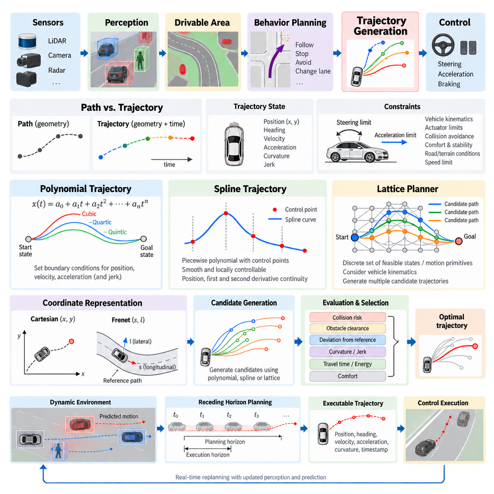
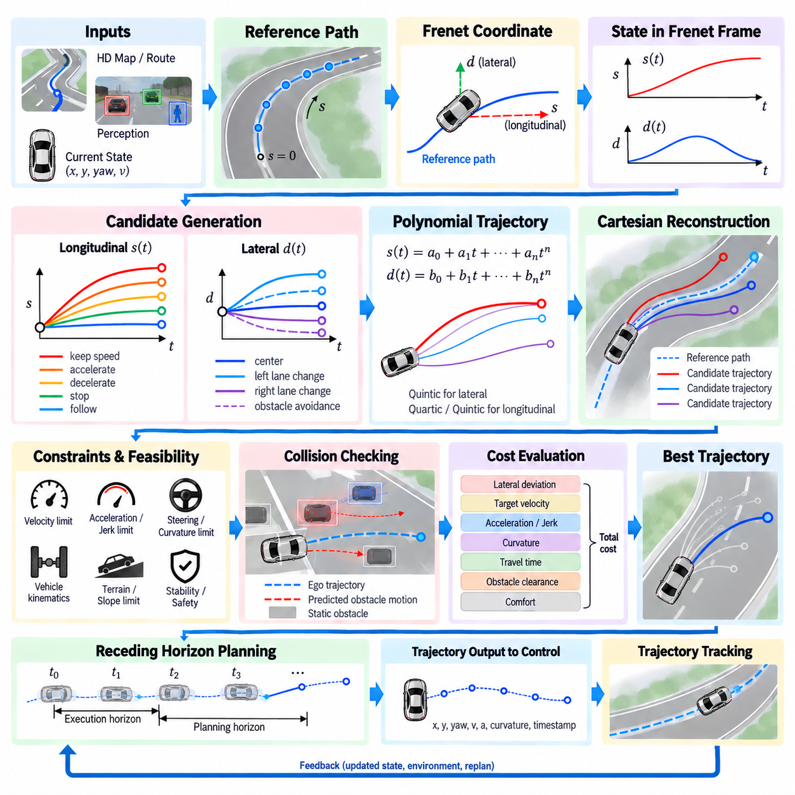
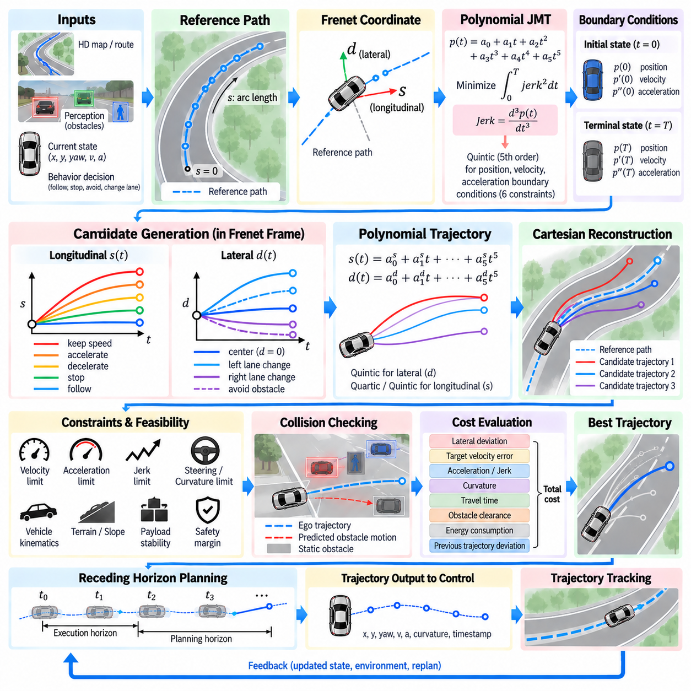
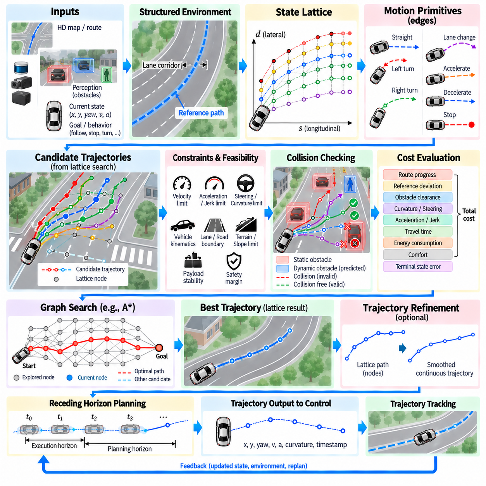
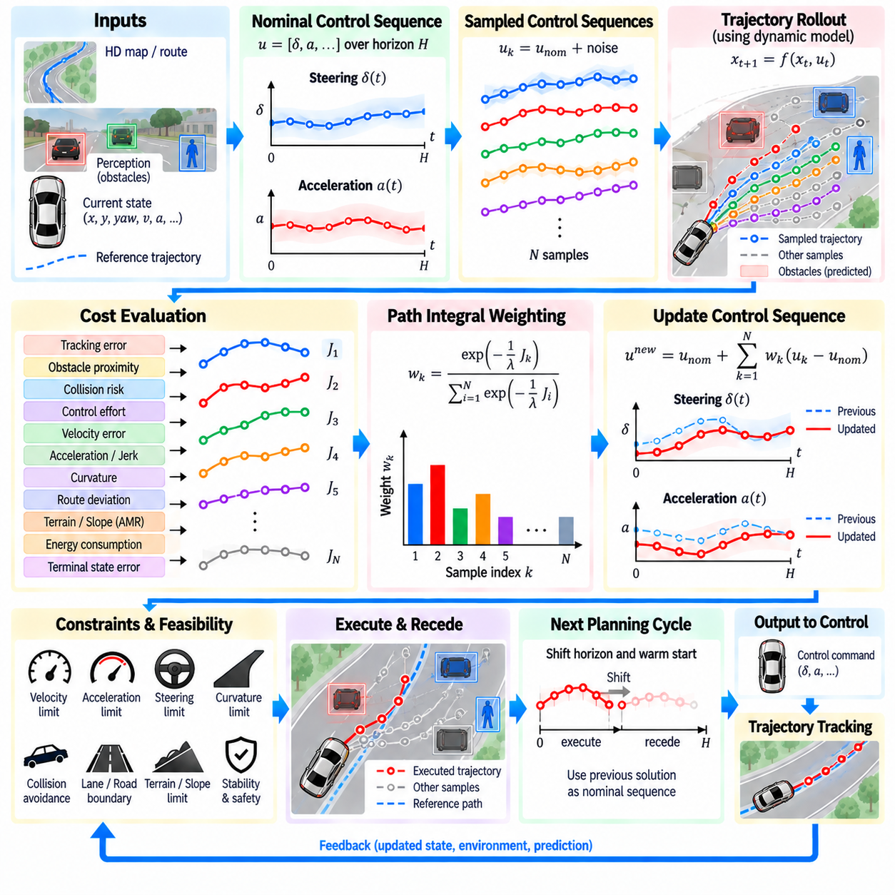
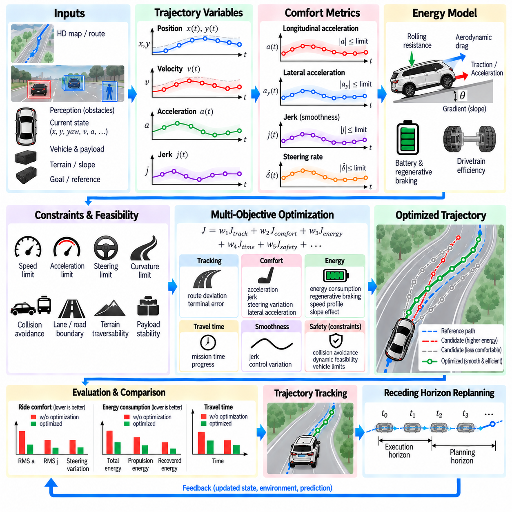
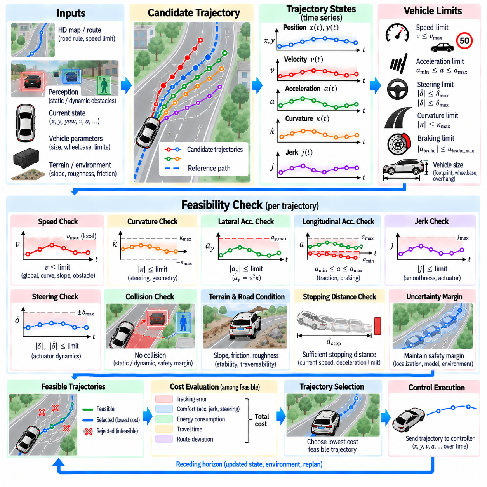
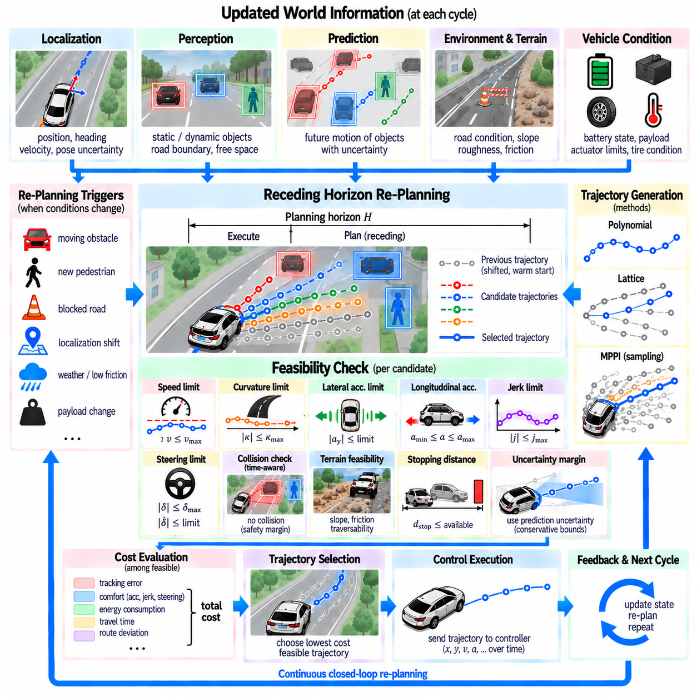
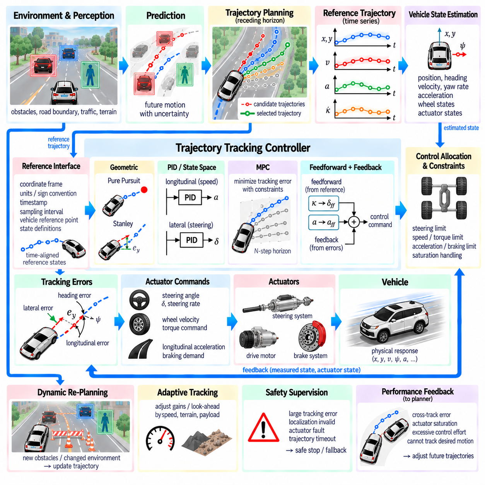
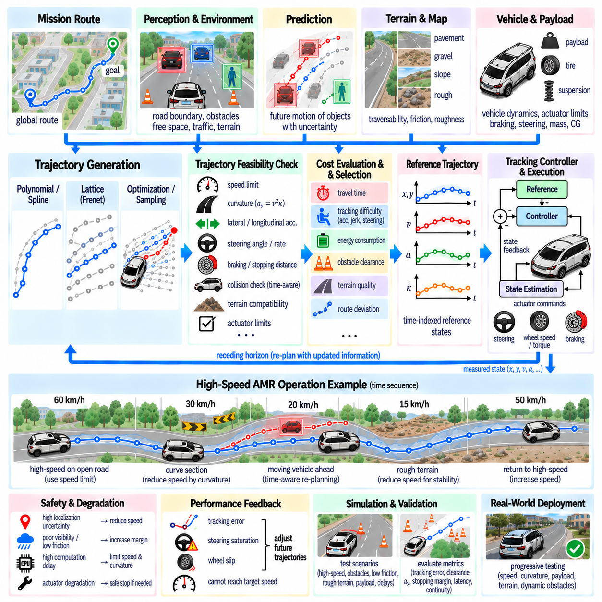

**Volume 12. Autonomous Driving Software**

# Chapter 07. Trajectory Generation

## 07.01. Trajectory Generation Concepts Polynomial Spline Lattice

{width="7.268055555555556in" height="7.268055555555556in"}

Trajectory generation converts a high-level driving decision into a continuous motion plan that a vehicle or autonomous mobile robot can physically execute. Within the autonomous driving software stack, it lies between behavior planning and low-level control, transforming commands such as follow, stop, avoid, or change direction into time-dependent position, heading, velocity, acceleration, and curvature references.

A path and a trajectory are related but fundamentally different representations. A path primarily describes geometric motion through space, typically as a sequence of positions and orientations, while a trajectory associates this geometry with time. A trajectory therefore specifies not only where the platform should travel but also when each state should be reached, allowing velocity, acceleration, steering, and braking requirements to be evaluated before execution.

A practical trajectory generator receives information from several upstream modules. Localization provides the current vehicle pose and motion state, perception identifies static and dynamic obstacles, drivable-area estimation defines usable space, and behavior planning supplies the desired maneuver. The generator combines these inputs with vehicle dimensions, kinematic or dynamic constraints, speed limits, safety margins, and a prediction horizon to construct candidate motions.

Trajectory generation can be formulated as finding a continuous state sequence x(t) and control-compatible motion over a finite horizon. Typical trajectory states contain longitudinal and lateral position, heading, velocity, acceleration, curvature, and sometimes jerk. The resulting trajectory must remain collision-free while respecting bounds imposed by steering geometry, actuator capability, tire or terrain interaction, passenger or payload stability, and the operating environment.

Polynomial trajectories provide one of the simplest mathematical mechanisms for constructing smooth motion. Position can be represented as a polynomial function of time or another trajectory parameter. Boundary conditions at the initial and terminal states determine polynomial coefficients, enabling the planner to connect states while explicitly controlling quantities such as position, velocity, and acceleration. Higher-order forms can additionally constrain jerk or other derivatives.

Cubic polynomials are commonly useful when position and first-derivative continuity are sufficient, while quartic and quintic polynomials provide additional degrees of freedom for motion constraints. Quintic formulations are especially convenient when initial and terminal position, velocity, and acceleration must all be specified. Instead of searching every possible continuous motion directly, planners can generate many polynomial candidates from combinations of terminal conditions and evaluate them efficiently.

Polynomial representations become less convenient when a long or geometrically complicated route must be represented by a single function. Increasing polynomial order can introduce undesirable oscillation and numerical sensitivity. Piecewise representations address this problem by dividing the trajectory into local segments. Each segment remains mathematically manageable while continuity conditions imposed at segment boundaries preserve the smoothness required for stable vehicle motion.

Splines generalize this piecewise approach by joining multiple polynomial segments through control points or knots. Cubic splines, B-splines, and related representations can describe complex road geometry with local control over trajectory shape. Changing one control point generally affects only a limited region of a spline, making spline-based trajectories particularly useful when a planner must refine part of a route without reconstructing the complete trajectory.

Smoothness across spline segments is characterized by continuity of position and derivatives. Position continuity prevents geometric gaps, first-derivative continuity prevents abrupt direction changes, and second-derivative continuity supports smooth curvature evolution. For autonomous vehicles and outdoor AMRs, these properties directly affect steering commands, lateral acceleration, mechanical loading, payload stability, and the ability of the downstream controller to accurately track the generated reference.

A lattice planner approaches trajectory generation from a different perspective. Rather than optimizing one continuous curve immediately, it constructs a structured collection of reachable candidate states or motion primitives. Nodes may represent combinations of longitudinal progress, lateral displacement, heading, velocity, or time. Connections between nodes correspond to feasible vehicle motions, creating a discrete approximation of the much larger continuous trajectory space.

The lattice structure can incorporate vehicle kinematics during candidate construction, which distinguishes it from purely geometric grid search. Motion primitives may be generated using polynomial curves, splines, precomputed vehicle maneuvers, or numerical integration of a motion model. Because infeasible motions can be excluded before search, the planner explores trajectories that are more consistent with steering limits, turning radius, acceleration capability, and vehicle dimensions.

Candidate trajectories require a cost function that expresses desirable driving behavior. Cost terms commonly measure collision risk, obstacle clearance, deviation from a reference route, terminal-state error, curvature, travel time, velocity error, acceleration, jerk, and control effort. Weighted combinations of these terms allow the planner to balance competing objectives, although the weights must be calibrated so that comfort or efficiency objectives never compensate for violations of hard safety constraints.

Hard constraints and soft costs should therefore be treated differently. Collision, maximum curvature, steering limits, minimum clearance, or prohibited regions can invalidate a candidate completely, whereas comfort, route deviation, energy consumption, or progress can be represented as optimization costs. This separation prevents an apparently low-cost trajectory from being selected even though it violates a fundamental physical, operational, or safety requirement.

Polynomial, spline, and lattice methods are complementary rather than mutually exclusive. A lattice planner can define candidate terminal states, polynomial functions can connect the current state to those targets, and splines can represent reference routes or smooth selected geometry. This layered combination reduces the continuous search problem to a manageable candidate set while retaining enough mathematical flexibility to produce smooth and dynamically meaningful motion.

Trajectory generation also depends strongly on the coordinate representation. Cartesian coordinates provide a direct world-space description, while road-relative or reference-path coordinates can separate longitudinal progress from lateral displacement. This separation simplifies structured navigation because candidate motions can be expressed as forward progress and lateral offset relative to a reference line. The following chapter specifically develops Frenet-frame trajectory planning in greater detail.

Static obstacle avoidance can often be handled through geometric collision checking, but dynamic environments require the trajectory to be evaluated in space and time. A geometrically valid path may become unsafe if a pedestrian, vehicle, or another robot occupies the same region at the planned arrival time. Dynamic planning therefore compares candidate trajectories with predicted obstacle motion and continuously updates them as new perception and prediction information becomes available.

The planning horizon creates another important trade-off. A short horizon reduces computation and reacts quickly to local changes but may produce myopic decisions. A longer horizon provides better anticipation of turns, obstacles, and speed transitions but increases uncertainty and computational complexity. Practical systems commonly combine a sufficiently long reference or behavioral horizon with a shorter, frequently regenerated executable trajectory that reflects the latest environment estimate.

Trajectory generation is consequently a receding process rather than a one-time calculation. At each planning cycle, the system observes the current state, updates environmental information, generates or optimizes candidate trajectories, rejects infeasible candidates, selects an acceptable solution, and passes a finite portion to the controller. The next cycle repeats the process from the newly estimated state, enabling adaptation to localization errors, moving obstacles, and changing terrain.

For outdoor AMRs, trajectory feasibility extends beyond conventional road geometry. Uneven terrain, slopes, curbs, low-friction surfaces, narrow passages, and payload-dependent stability can alter the set of executable motions. A trajectory that satisfies planar curvature constraints may still be undesirable when terrain induces excessive roll, pitch, wheel slip, suspension motion, or load transfer. Traversability information can therefore become an additional trajectory constraint or cost.

The interface with control is equally important. A mathematically smooth trajectory is useful only when the physical platform can track it under realistic latency, actuator limits, and state-estimation uncertainty. The trajectory generator should produce references at suitable temporal or spatial resolution and expose consistent quantities such as pose, velocity, acceleration, curvature, and timestamps. This creates a well-defined contract between planning and control.

A robust implementation therefore treats trajectory generation as constrained motion synthesis rather than simple curve drawing. Polynomial methods provide efficient boundary-condition-based motion construction, splines provide flexible and locally controllable smooth geometry, and lattice methods provide structured exploration of feasible alternatives. Together they form a practical foundation for progressively more advanced Frenet, optimization, sampling, and model-based trajectory planners.

Within the broader autonomous driving software architecture, this foundation connects perception-driven understanding and behavior-level decisions to executable physical motion. The chapter structure subsequently expands this foundation into Frenet planning, polynomial optimization, lattice planning, MPPI, comfort and energy objectives, feasibility checking, dynamic replanning, controller integration, and high-speed outdoor AMR operation.

## 07.02. Frenet Frame Based Trajectory Planning [w/Code]

{width="7.268055555555556in" height="7.268055555555556in"}

Frenet frame based trajectory planning transforms vehicle motion from global Cartesian coordinates into a road-relative coordinate system defined by a reference path. Instead of directly planning two-dimensional motion in x and y, the method represents vehicle position using longitudinal progress s along the reference path and lateral displacement d from it. This decomposition simplifies trajectory generation for road-following autonomous vehicles and structured outdoor AMRs.

The reference path forms the geometric foundation of the Frenet coordinate system. It may originate from an HD map, lane centerline, global planner, navigation graph, or previously generated route. Each point along the reference curve is parameterized by accumulated arc length s, while the local tangent and normal directions define longitudinal and lateral axes. Vehicle states can then be projected onto this continuously changing coordinate frame.

Given a vehicle position in Cartesian coordinates, the planner identifies the closest or geometrically corresponding point on the reference path. The arc length of that point becomes the longitudinal coordinate s, while the signed perpendicular distance becomes the lateral coordinate d. Positive and negative lateral values distinguish opposite sides of the reference path according to the coordinate convention used by the planning system.

This representation separates two aspects of driving that are strongly coupled in Cartesian space. Longitudinal motion describes how rapidly the vehicle progresses along the route, while lateral motion describes how it approaches, follows, or departs from the reference path. Speed changes, stopping, and following behavior can therefore be handled mainly through s, while lane positioning, obstacle avoidance, and lateral transitions can be modeled primarily through d.

A Frenet trajectory commonly represents longitudinal and lateral motion as independent time-dependent functions, such as s(t) and d(t). Their derivatives provide longitudinal and lateral velocity, acceleration, and higher-order motion information. Polynomial functions are particularly useful because boundary conditions can specify the current state and desired terminal state while maintaining continuity of velocity and acceleration throughout the planning interval.

Quintic polynomials are frequently applied to lateral trajectory generation because they can satisfy initial and terminal lateral position, velocity, and acceleration constraints. Quartic or quintic polynomials can be used for longitudinal motion depending on whether terminal position, velocity, or both must be constrained. Combining different terminal conditions and planning durations produces a family of candidate trajectories rather than a single predetermined solution.

Candidate generation begins from the current Frenet state of the vehicle. The planner samples possible terminal lateral offsets, target velocities, longitudinal positions, and arrival times over a finite planning horizon. Each sampled terminal state defines boundary conditions for polynomial generation. This process produces multiple combinations of longitudinal and lateral motion that represent alternative ways of accomplishing the requested driving behavior.

For normal path following, candidate terminal lateral offsets can be concentrated near d = 0, corresponding to convergence toward the reference path. During obstacle avoidance or lane transitions, the sampled offsets can expand toward neighboring collision-free regions. Longitudinal samples can simultaneously represent maintaining speed, accelerating, decelerating, stopping, or following another object while the lateral component determines spatial positioning.

The independently generated longitudinal and lateral components must subsequently be combined into complete Frenet trajectories. Samples of s(t), d(t), and their derivatives are evaluated at successive timestamps across the planning horizon. Because the reference path supplies position, heading, and curvature as functions of s, each Frenet sample can be transformed back into Cartesian position and orientation for collision checking and downstream vehicle control.

The Cartesian reconstruction is essential because the vehicle ultimately moves through physical space rather than through an abstract Frenet coordinate system. A lateral displacement d is applied along the local normal direction of the reference path at longitudinal coordinate s. Vehicle heading and curvature are then derived from the relationship between the reference geometry and the changing lateral offset, allowing each candidate to be evaluated against actual environmental geometry.

Not every mathematically generated candidate is physically executable. Feasibility checks reject trajectories that exceed permitted velocity, acceleration, jerk, curvature, steering angle, or other vehicle-specific limits. For outdoor AMRs, additional constraints may include minimum turning radius, wheel slip risk, terrain traversability, slope limits, payload stability, stopping distance, and platform-specific dynamic characteristics.

Collision checking evaluates each feasible trajectory against static and dynamic obstacles. Static obstacles can be tested against the vehicle footprint along the reconstructed Cartesian trajectory. Dynamic obstacles require time-aligned evaluation because their predicted positions change throughout the planning horizon. A trajectory may therefore be geometrically clear at one instant but invalid if the vehicle and an obstacle are predicted to occupy overlapping regions later.

The remaining candidates are ranked through a cost function. Typical terms measure lateral deviation from the desired path, difference from target velocity, acceleration, jerk, curvature, travel time, obstacle clearance, and terminal-state error. Comfort and smoothness can be encouraged by penalizing rapid changes in acceleration or curvature, while progress terms discourage unnecessarily slow trajectories when safe forward motion remains possible.

Cost normalization and weighting require careful engineering because the terms have different physical units and numerical ranges. Excessive weighting of reference-path tracking can discourage necessary obstacle avoidance, whereas excessive progress weighting can favor aggressive motion. Safety-critical requirements should therefore be enforced as hard constraints whenever appropriate rather than relying exclusively on large cost penalties to discourage unsafe candidates.

The selected trajectory is normally only valid for a limited period because perception, localization, prediction, and behavior decisions continuously change. Frenet planning is therefore commonly implemented as a receding-horizon process. The vehicle executes only the initial portion of the selected trajectory, receives updated environmental information, estimates a new initial state, and generates another candidate set during the next planning cycle.

This repeated replanning process provides responsiveness to dynamic environments while preserving short-term motion continuity. However, independently selecting the minimum-cost trajectory at every cycle can cause oscillation between similar candidates. Practical implementations may include consistency costs, previous-trajectory references, hysteresis, terminal-state stabilization, or warm-start information so that newly generated trajectories remain reasonably consistent with the previously executed motion.

The quality of Frenet planning depends strongly on the reference path. Sharp discontinuities, noisy curvature, self-intersections, or poorly parameterized routes can produce unstable coordinate transformations and undesirable trajectories. Reference paths are therefore generally smoothed and represented with sufficient geometric continuity before planning. Reliable calculation of arc length, tangent direction, normal direction, heading, and curvature is particularly important.

Frenet coordinates are especially effective when vehicle motion remains reasonably aligned with a structured reference route. Their advantages become weaker in highly unstructured spaces, during large orientation changes, near complicated intersections, or when multiple reference paths compete. Large lateral offsets can also distort the relationship between Frenet and Cartesian geometry, requiring careful feasibility checks and potentially a transition to another planning representation.

For outdoor AMRs operating on service roads, industrial yards, campuses, ports, or logistics facilities, Frenet planning provides a practical bridge between global routing and local vehicle motion. A global route supplies the reference geometry, behavior planning determines objectives such as following, stopping, or avoidance, and the Frenet planner generates dynamically feasible alternatives that reflect both route progress and local environmental conditions.

The output passed toward trajectory tracking should contain more than a sequence of geometric points. Each sample can include timestamp, Cartesian position, heading, longitudinal velocity, acceleration, curvature, and related reference quantities required by the controller. Maintaining consistent timestamps and coordinate conventions between planning, localization, and control is essential because even a geometrically correct trajectory can become difficult to track when temporal interpretation differs between modules.

Frenet frame based trajectory planning therefore converts a difficult two-dimensional motion search into structured longitudinal and lateral subproblems around a reference path. Polynomial candidate generation, feasibility filtering, collision checking, cost-based selection, Cartesian reconstruction, and continuous replanning together create an efficient trajectory-generation pipeline suitable for autonomous driving and outdoor AMR systems.

## 07.03. Polynomial Trajectory Optimization JMT [w/Code]

{width="7.268055555555556in" height="7.268055555555556in"}

Polynomial trajectory optimization provides a compact mathematical method for generating smooth vehicle motion between specified boundary states. Instead of optimizing every trajectory sample independently, the planner represents motion with a small set of polynomial coefficients. By constraining position, velocity, and acceleration at the beginning and end of a planning interval, a continuous trajectory can be obtained efficiently and evaluated for feasibility, comfort, and safety.

A widely used formulation is the Jerk Minimizing Trajectory, or JMT, which constructs a polynomial whose integrated squared jerk is minimized under prescribed boundary conditions. Jerk is the derivative of acceleration and represents how rapidly acceleration changes with time. Excessive jerk produces uncomfortable motion, abrupt actuator commands, payload disturbance, and poor tracking behavior, making jerk reduction important for autonomous vehicles and outdoor AMRs.

A fifth-order polynomial is particularly suitable for JMT because it contains six coefficients and can therefore satisfy six boundary constraints. For a scalar motion variable p(t), the trajectory may be written as p(t)=a0+a1t+a2t²+a3t³+a4t⁴+a5t⁵. Its first and second derivatives describe velocity and acceleration, while the third derivative represents jerk and becomes a quadratic function of time.

The initial state provides position p(0), velocity p\'(0), and acceleration p\'\'(0), while the desired terminal state at time T provides p(T), p\'(T), and p\'\'(T). The first three polynomial coefficients are obtained directly from the initial conditions. The remaining coefficients are calculated by solving a small linear system derived from the terminal constraints, making trajectory generation computationally inexpensive.

This boundary-value formulation separates trajectory shape from the larger planning problem. Behavior planning can specify a desired terminal state such as a target position, speed, or stopping condition, while the polynomial generator determines a smooth connection from the current state. Multiple terminal states and durations can be sampled, allowing the system to construct a family of trajectories rather than depending on one fixed motion hypothesis.

JMT is closely associated with Frenet-frame trajectory planning. Longitudinal progress along a reference path can be represented by s(t), while lateral displacement can be represented by d(t). Independent polynomial trajectories can therefore be generated for longitudinal and lateral motion before being combined and transformed into Cartesian coordinates. This decomposition makes structured road and route-following problems easier to formulate.

For lateral planning, a quintic polynomial can connect the current lateral position, lateral velocity, and lateral acceleration to a desired terminal offset with specified terminal derivatives. A centerline-following candidate may target d=0, while avoidance or lane-transition candidates may target nonzero lateral offsets. Different terminal times determine how rapidly the lateral maneuver develops and consequently influence lateral acceleration and jerk.

Longitudinal planning can similarly describe acceleration, deceleration, stopping, speed maintenance, or object following. When terminal position, velocity, and acceleration are all constrained, a quintic formulation is appropriate. If terminal position does not need to be fixed and the main objective is reaching a desired terminal velocity, a lower constraint formulation such as a quartic polynomial can provide sufficient degrees of freedom.

The term "jerk minimizing" does not mean that every generated JMT is automatically the best complete vehicle trajectory. The polynomial minimizes jerk within the mathematical boundary conditions used to construct it, but those boundary conditions may themselves lead to excessive speed, curvature, acceleration, or collision risk. JMT therefore acts as a smooth candidate generator inside a broader constrained trajectory planning and optimization pipeline.

Candidate generation typically samples terminal time T together with desired terminal positions, lateral offsets, or velocities. Each combination produces a different polynomial trajectory. Short terminal times can create aggressive acceleration or lateral motion, while longer times usually produce smoother transitions but may reduce progress or responsiveness. Sampling several durations enables the planner to explicitly compare these competing motion characteristics.

After polynomial coefficients are determined, the trajectory is discretized at planning timestamps. Position, velocity, acceleration, and jerk are calculated analytically from the polynomial and its derivatives. These samples provide both the trajectory geometry and the dynamic quantities needed for evaluation. Analytical derivatives are valuable because they avoid noisy numerical differentiation and maintain consistency between the planned position and its higher-order motion states.

Feasibility filtering should occur before detailed ranking. Candidates that violate maximum or minimum velocity, acceleration, jerk, curvature, steering, or other platform constraints can be removed immediately. This prevents the optimization stage from selecting a numerically attractive but physically impossible trajectory. Outdoor AMRs may additionally require constraints related to turning radius, terrain slope, wheel traction, payload stability, and braking capability.

When JMT is generated in Frenet coordinates, candidates must eventually be reconstructed in Cartesian space. Values of s(t) determine locations along the reference path, while d(t) offsets those locations along the local normal direction. The resulting Cartesian position, heading, and curvature can then be calculated. This reconstruction is necessary for checking vehicle geometry, road boundaries, obstacles, and compatibility with the downstream controller.

Collision checking introduces environmental constraints that are not contained in the polynomial itself. The vehicle footprint can be propagated along each candidate and compared with static obstacles, drivable-area boundaries, and predicted dynamic-object positions. Because trajectories are time parameterized, dynamic collision checking can evaluate whether the ego vehicle and another moving object are expected to occupy conflicting regions at corresponding times.

A cost function can then compare the remaining feasible candidates. Jerk cost is naturally important for JMT, but practical trajectory selection can also include acceleration, lateral displacement, deviation from target speed, terminal-state error, travel time, obstacle clearance, curvature, energy consumption, and deviation from the previous trajectory. The selected solution therefore reflects overall driving quality rather than jerk minimization alone.

Integrated squared jerk can be evaluated over the trajectory duration as a smoothness measure. Since jerk is analytically available from the polynomial, this quantity can be calculated efficiently. However, raw cost terms often have different scales and units, so normalization and carefully chosen weights are required. Safety-related limits should remain hard constraints rather than being converted entirely into weighted optimization penalties.

Numerical conditioning deserves attention when solving polynomial coefficients. Large planning times or poorly scaled state variables can produce matrices with unfavorable numerical properties. Practical implementations can improve robustness through appropriate time normalization, consistent units, bounded planning horizons, and stable linear algebra routines. Coefficient calculation should also be validated against the requested terminal conditions to detect implementation or precision errors.

Trajectory continuity across replanning cycles is another important consideration. A planner may calculate an individually smooth JMT at every cycle but still produce discontinuous behavior if the selected terminal condition changes abruptly between cycles. Using the current executed trajectory as the next initial state, penalizing deviation from the previous solution, or maintaining consistent terminal objectives can reduce oscillation and improve temporal stability.

The computational efficiency of polynomial generation makes JMT attractive for real-time planning. Solving a small coefficient system and evaluating closed-form polynomials is considerably cheaper than solving a large nonlinear optimization problem over every trajectory state. This allows many candidate terminal states and durations to be tested within each planning cycle, which is useful when the environment changes rapidly and frequent replanning is required.

JMT nevertheless has limitations. A polynomial does not directly understand obstacles, road topology, vehicle interaction, or terrain conditions, and a single polynomial segment may be unsuitable for highly complex maneuvers. The method is therefore most effective when embedded within a planner that supplies meaningful terminal states, reference geometry, collision constraints, feasibility checks, and repeated replanning rather than treating the polynomial as a complete planning system.

For outdoor AMRs, jerk-aware trajectory generation has additional value because abrupt acceleration changes can affect heavy payloads, wheel-ground traction, suspension response, sensor stability, and mechanical durability. A smooth trajectory can reduce load transfer and improve controller tracking, but terrain-dependent speed and stability constraints must still be incorporated because minimizing jerk alone cannot guarantee safe motion on slopes or irregular surfaces.

In a complete autonomous driving software stack, polynomial JMT optimization connects behavior-level objectives with executable motion references. Behavior planning determines what the vehicle should accomplish, Frenet or Cartesian geometry defines where motion can occur, polynomial generation constructs smooth candidates, and feasibility and collision modules remove invalid solutions. Cost evaluation then selects a trajectory suitable for delivery to the tracking controller.

Polynomial trajectory optimization with JMT is therefore best understood as an efficient constrained motion-generation technique rather than an isolated smoothness formula. Its strength comes from combining explicit boundary states, analytical derivatives, low computational cost, and controllable trajectory duration. When integrated with candidate sampling, Frenet planning, physical constraints, collision checking, cost evaluation, and receding-horizon replanning, it provides a practical foundation for real-time autonomous trajectory generation.

## 07.04. Lattice Planner for Structured Environments [w/Code]

{width="7.268055555555556in" height="7.268055555555556in"}

A lattice planner generates trajectories by searching a structured set of dynamically meaningful motion alternatives rather than exploring arbitrary points in continuous space. It is particularly effective in environments where roads, lanes, corridors, intersections, or predefined routes impose strong geometric structure. For autonomous vehicles and outdoor AMRs, the lattice provides a computational bridge between route-level planning and physically executable local motion.

The fundamental idea is to discretize selected dimensions of the vehicle state space into a collection of nodes and feasible transitions. A node may represent longitudinal position, lateral offset, heading, velocity, or combinations of these quantities. Connections between nodes represent motion primitives that the vehicle can actually execute, allowing the search graph to encode vehicle motion constraints instead of treating the platform as a dimensionless point.

This distinction separates lattice planning from conventional occupancy-grid path search. A grid planner may connect neighboring cells using simple geometric transitions, whereas a state lattice can incorporate heading, curvature, steering behavior, and vehicle kinematics directly into its edges. Consequently, trajectories discovered through the lattice are more likely to satisfy minimum turning radius, steering limits, directional constraints, and other platform-specific requirements.

Structured environments provide natural coordinates for constructing the lattice. A reference path, lane centerline, road boundary, warehouse corridor, or logistics route can define the longitudinal direction, while candidate nodes are distributed across allowable lateral positions. Successive longitudinal stations create layers of possible vehicle states, producing a graph that represents alternative ways of progressing through the environment while remaining related to the intended route.

The lattice resolution determines the density of this search space. Fine longitudinal, lateral, heading, or velocity resolution increases the number of available maneuvers and can improve trajectory quality, but it also increases memory usage and search complexity. Coarser discretization reduces computational cost but may eliminate useful solutions. Practical designs therefore balance resolution against vehicle size, maneuverability, environment complexity, and real-time planning requirements.

Motion primitives form the edges of the lattice and are central to its physical meaning. A primitive describes a feasible transition from one discrete state to another and may represent straight driving, gradual steering, lane shifting, turning, acceleration, deceleration, or stopping. These motions can be generated analytically using polynomials or splines, integrated from a vehicle model, or precomputed offline and stored in a reusable primitive library.

Precomputed motion primitives can significantly reduce online computation because expensive trajectory construction is performed before deployment. Primitive endpoints are selected to align with the discretized state lattice, allowing the same motion patterns to be translated and rotated as required. For vehicles with consistent kinematic properties, this approach creates a compact library of verified transitions that can be searched rapidly during operation.

Alternatively, motion primitives can be generated online when local conditions require greater flexibility. The planner may connect sampled terminal states using polynomial trajectory generation, Frenet-frame methods, or numerical integration. Online generation supports varying speed, payload, terrain, and maneuver objectives, but requires additional computation. Hybrid implementations can combine a reusable primitive library with locally optimized trajectories when predefined motions are insufficient.

A lattice can be constructed in Cartesian coordinates, road-relative coordinates, or a combination of state variables. For structured route-following applications, Frenet-style longitudinal and lateral coordinates are particularly convenient because nodes can be sampled according to progress along a reference path and offset from it. Heading and velocity dimensions may then be added when the planner must distinguish states that occupy similar positions but have different motion conditions.

Planning begins from the vehicle\'s current estimated state, which must be associated with the lattice. If the current state does not exactly coincide with a predefined node, temporary connections can link it to reachable lattice states. The planner then expands feasible transitions toward candidate goal states while rejecting edges that violate geometric, kinematic, dynamic, environmental, or safety constraints.

Graph-search algorithms can be used to explore the lattice efficiently. Each transition carries a cost representing factors such as distance, travel time, curvature, steering effort, acceleration, jerk, deviation from the reference route, or energy consumption. A heuristic can estimate the remaining cost to the goal, helping the search prioritize promising regions of the lattice rather than expanding every reachable state uniformly.

Obstacle information is integrated by checking motion primitives rather than only their endpoints. A transition is valid only when the complete swept vehicle footprint remains collision-free along the primitive. This is especially important for large vehicles and AMRs because a collision can occur between lattice nodes even when both endpoints are free. Vehicle dimensions and orientation must therefore be represented during collision evaluation.

Dynamic obstacles add a temporal dimension to lattice planning. When nodes or primitives contain time information, candidate motions can be compared with predicted positions of pedestrians, vehicles, or other robots. A spatial transition that is blocked at one time may become available later, while an initially clear region may become occupied. Time-aware lattices can therefore represent slowing, waiting, accelerating, or selecting an alternative route around moving objects.

Drivable-area constraints further restrict the search space. Nodes outside road boundaries, traversable surfaces, permitted lanes, or operational corridors can be removed before search, while primitives crossing prohibited regions are rejected. For outdoor AMRs, traversability maps may additionally encode slopes, rough surfaces, curbs, soft ground, narrow passages, or other terrain characteristics that influence whether a motion should be considered feasible.

Kinematic feasibility can be embedded directly in the primitive construction process. For Ackermann-steered platforms, curvature and steering-angle limits constrain transitions, while differential-drive or skid-steer AMRs require different primitive sets. When higher-speed operation is considered, dynamic constraints such as lateral acceleration, braking distance, tire-ground interaction, and stability may become necessary in addition to purely geometric feasibility.

The cost function determines which feasible lattice solution is preferred. Route progress can reward forward motion, reference deviation can encourage route following, and obstacle-clearance terms can provide additional safety margin. Curvature, steering changes, acceleration, and jerk can represent smoothness and comfort, while time and energy terms can express operational efficiency. These objectives are combined without allowing soft costs to override mandatory safety constraints.

The result of graph search is generally a sequence of lattice nodes connected by motion primitives. Although this sequence may already be executable, additional smoothing or local optimization can improve continuity and controller compatibility. The planner can refine primitive boundaries, reduce unnecessary steering variation, or fit a continuous trajectory while preserving collision-free geometry and the essential structure of the selected lattice solution.

Lattice planning is particularly useful when multiple maneuver alternatives must be represented explicitly. At a blocked route segment, the graph can simultaneously contain trajectories that remain near the reference path, shift laterally, slow down, stop, or pass through another available corridor. Search then compares these alternatives systematically instead of relying on a single locally optimized trajectory that may converge to an undesirable solution.

The structured search space also improves interpretability. Each selected motion can be traced through discrete states and known primitives, making it easier to inspect why the planner chose a particular maneuver. This property is useful during simulation, debugging, safety validation, and field testing because engineers can analyze rejected transitions, collision conditions, constraint violations, and accumulated costs along the selected trajectory.

Real-time operation normally uses lattice planning within a receding-horizon architecture. The planner searches only a finite region ahead of the vehicle, executes an initial portion of the selected trajectory, and repeats the process after localization, perception, and prediction are updated. Reusing previous search information or maintaining consistency with the preceding solution can reduce computation and prevent unnecessary oscillation between similar lattice branches.

For outdoor AMRs in campuses, industrial yards, ports, warehouses, and service-road networks, structured lattices can exploit known route geometry while retaining local maneuver flexibility. Vehicle dimensions, payload state, terrain limits, and operational speed can be incorporated into the primitive set and feasibility rules. This makes the approach suitable for platforms that require more realistic motion constraints than simple two-dimensional grid navigation provides.

The primary limitation is the growth of the state space as additional dimensions are introduced. Adding heading, velocity, time, articulation, or other variables can multiply the number of nodes and transitions dramatically. Efficient implementations therefore require careful discretization, pruning, heuristics, hierarchical planning, primitive reuse, and bounded search horizons to preserve real-time performance without removing important maneuver alternatives.

A lattice planner for structured environments is therefore best viewed as a constrained trajectory-search framework built around physically meaningful discrete states and transitions. By combining reference-route structure, motion primitives, vehicle constraints, collision checking, cost-based graph search, dynamic replanning, and optional trajectory refinement, it provides a practical method for generating executable motion for autonomous vehicles and outdoor AMRs.

## 07.05. Model Predictive Path Integral MPPI [w/Code]

{width="7.268055555555556in" height="7.268055555555556in"}

Model Predictive Path Integral (MPPI) is a sampling-based trajectory optimization method that generates control sequences by repeatedly evaluating many possible future actions over a finite prediction horizon. Instead of explicitly calculating gradients of a complex vehicle or robot model, MPPI samples control perturbations, propagates the resulting trajectories, evaluates their costs, and updates the control sequence toward lower-cost behavior. This makes it useful for nonlinear, constrained, and highly dynamic motion-planning problems.

MPPI belongs to the broader family of Model Predictive Control (MPC), but its optimization mechanism is based on stochastic sampling and path-integral principles. At each planning cycle, the controller maintains a nominal sequence of future control commands such as steering and acceleration. Around this nominal sequence, many perturbed control sequences are generated. Each sequence is evaluated through the vehicle model, producing a distribution of possible future motions over the prediction horizon.

The system begins with the current estimated state of the vehicle or robot. This state may include position, heading, velocity, acceleration, and other variables required by the motion model. A nominal control sequence is then extended into the future for a finite horizon. Random control perturbations are added to this sequence, producing many alternative actions. Each alternative is propagated forward through the dynamics model to predict the resulting state trajectory.

The quality of every sampled trajectory is measured using a cost function. The cost can include tracking error, obstacle proximity, collision risk, control effort, velocity error, acceleration, jerk, curvature, route deviation, and terminal-state error. For outdoor AMRs, additional terms can represent terrain traversability, slope, payload stability, wheel slip, energy consumption, or operational constraints. The cost function therefore connects the mathematical optimization process with the physical objectives of the robot.

A key characteristic of MPPI is that the complete trajectory is evaluated rather than only the immediate control action. A sampled control sequence may initially appear attractive but eventually lead to an undesirable state, while another sequence may temporarily increase tracking error but produce a safer and more efficient long-term motion. The prediction horizon allows MPPI to evaluate these future consequences and select control behavior based on accumulated trajectory cost.

The path-integral formulation converts the sampled trajectory costs into weights that determine how strongly each candidate influences the updated control sequence. Lower-cost samples receive greater influence, while high-cost samples contribute less. The nominal control sequence is consequently shifted toward control perturbations associated with better predicted outcomes. This weighted update can be repeated over successive planning cycles without requiring a conventional gradient calculation through the complete nonlinear planning problem.

The sampling distribution is an important part of MPPI performance. If the perturbations are too small, the optimizer explores only a narrow neighborhood around the current solution and may fail to discover better maneuvers. If they are too large, the sampled trajectories become inefficient and many candidates may violate constraints. The distribution and magnitude of control noise therefore need to reflect the vehicle\'s actuation range, operating speed, environment, and computational budget.

MPPI can naturally handle nonlinear vehicle dynamics because trajectory propagation is performed through the chosen model rather than through a linearized approximation alone. The model may represent nonlinear relationships between steering, velocity, acceleration, curvature, and vehicle state. This is particularly valuable when operating conditions depart significantly from simple kinematic assumptions, although the usefulness of the result still depends on the accuracy and computational efficiency of the underlying model.

Constraints can be incorporated through trajectory rejection, cost penalties, control bounds, state limits, or combinations of these mechanisms. Collision with an obstacle, excessive curvature, unacceptable acceleration, or violation of the vehicle\'s steering range can cause a sampled trajectory to be rejected or assigned a very high cost. Hard safety requirements should remain distinguishable from soft optimization objectives so that improved comfort or progress cannot compensate for a fundamental safety violation.

MPPI is well suited to dynamic environments because the optimization is repeated as new information becomes available. Perception and prediction modules update obstacle states, localization provides a new vehicle state, and the planner performs another sampling-and-evaluation cycle. The system therefore operates as a receding-horizon optimizer: only the beginning of the optimized control sequence is executed, after which the horizon is shifted forward and the remaining solution is updated using the latest state and environmental information.

Warm starting can improve both efficiency and temporal consistency. The previously optimized control sequence can be shifted forward and used as the nominal sequence for the next cycle. The newly available terminal portion can be initialized with an appropriate default control. This avoids starting every optimization cycle from an unrelated control sequence and helps maintain smoother behavior while reducing the amount of exploration required to recover a useful solution.

Compared with a lattice planner, MPPI does not require the motion alternatives to be explicitly represented as a discrete set of predefined branches. Sampling can explore a continuous range of control sequences within the limits of the model and sampling distribution. Compared with a polynomial trajectory optimizer, MPPI can directly optimize control sequences while considering nonlinear state evolution. Its flexibility comes at the cost of substantial trajectory-rollout computation because many candidate sequences must be simulated at every planning cycle.

The computational workload is therefore one of the central engineering considerations. If N control samples are evaluated over a horizon containing H time steps, the system must perform a large number of model evaluations during each optimization cycle. GPU parallelization can be particularly effective because many sampled trajectories can be propagated independently. For real-time autonomous systems, the number of samples, horizon length, model complexity, update frequency, and available accelerator resources must be selected together.

MPPI is especially useful when the motion problem contains nonlinear interactions that are difficult to capture with simple local optimization. For an outdoor AMR, the optimizer can consider steering and acceleration together while evaluating obstacle clearance, route tracking, curvature, terrain conditions, and motion smoothness. The resulting control sequence can respond to local changes without requiring the planner to enumerate every possible maneuver explicitly.

The relationship between MPPI and trajectory generation is therefore somewhat different from the relationship between polynomial or lattice methods and trajectory generation. Polynomial methods construct trajectories from analytical functions, and lattice methods search structured combinations of states and motion primitives. MPPI searches in control-sequence space and obtains trajectories by propagating those controls through a model. The resulting state trajectories are therefore consequences of the sampled controls rather than independently specified geometric curves.

A practical MPPI architecture normally combines a reference trajectory with a dynamic model and an environmental cost representation. The reference trajectory supplies desired motion, while the model predicts how candidate controls affect the vehicle. Obstacles and terrain contribute additional costs or constraints, and the sampling process searches for control sequences that produce acceptable future states. The optimizer consequently acts as a bridge between high-level motion objectives and physically executable control.

The choice of prediction horizon is another important design parameter. A short horizon reduces computation and allows rapid updates but may fail to anticipate a future obstacle or sharp maneuver. A longer horizon provides greater foresight but increases sampling cost and may rely on increasingly uncertain predictions. The appropriate horizon therefore depends on vehicle speed, stopping distance, environment structure, control frequency, and the quality of available prediction information.

MPPI can also incorporate smoothness directly into its objective. Penalties on acceleration, steering variation, control effort, or jerk discourage unnecessarily aggressive control sequences. For heavy outdoor AMRs, smooth control can reduce payload disturbance, suspension excitation, wheel slip, and mechanical stress. However, smoothness remains an optimization objective rather than a substitute for physical feasibility, and the system must still enforce limits on acceleration, steering, speed, curvature, and stability.

Dynamic obstacle handling requires the cost evaluation to be time-aware. A sampled trajectory should be compared with predicted obstacle states at corresponding future timestamps rather than simply checking whether the geometric path intersects an obstacle\'s current position. This allows MPPI to consider behaviors such as slowing down, accelerating before an obstacle reaches the path, changing lateral position, or temporarily stopping when these actions provide lower-cost feasible outcomes.

The resulting MPPI solution is normally passed to a low-level tracking or vehicle-control interface as a time-indexed reference or control sequence. Depending on the architecture, MPPI itself may operate as a high-level local controller, or it may generate a trajectory that is subsequently tracked by another controller. The interface should preserve consistent state definitions, timestamps, coordinate frames, and actuator conventions so that the optimized motion remains meaningful when executed by the physical platform.

MPPI also provides a useful mechanism for combining multiple objectives without constructing an enormous discrete maneuver library. Tracking, progress, obstacle clearance, smoothness, energy, and terminal-state objectives can all contribute to the sampled trajectory cost. Nevertheless, cost design remains critical because the numerical relationship between these terms determines the behavior of the optimizer. Safety constraints should therefore be explicitly separated from objectives that merely express preference.

For autonomous driving and outdoor AMR applications, MPPI is best understood as a model-based stochastic trajectory optimizer operating continuously over a finite horizon. It samples future control sequences, propagates them through a motion model, evaluates their accumulated costs and constraints, updates the nominal solution using cost-dependent weighting, executes the beginning of the optimized sequence, and repeats the process using updated state and environment information. This combination provides a flexible approach to real-time nonlinear motion generation.

## 07.06. Trajectory Comfort and Energy Optimization

{width="7.268055555555556in" height="7.268055555555556in"}

Trajectory optimization should not be evaluated only by whether a vehicle reaches its geometric destination. A practical autonomous system must also consider how the motion is experienced and how much energy is consumed while executing it. Trajectory comfort and energy optimization therefore extend conventional path planning by introducing acceleration, jerk, steering variation, curvature, speed profile, payload stability, and power demand into the trajectory objective. The goal is to generate motion that remains safe and feasible while reducing unnecessary dynamic stress and energy consumption.

Comfort is closely related to the derivatives of vehicle motion. Position defines where the vehicle moves, velocity describes how quickly it progresses, and acceleration determines the change in velocity. Jerk, defined as the rate of change of acceleration, becomes particularly important because abrupt acceleration changes can create noticeable vibration and mechanical loading even when the acceleration itself remains within an acceptable limit. A trajectory with continuous acceleration and bounded jerk generally provides smoother physical behavior than one with abrupt control transitions.

For autonomous vehicles carrying passengers, comfort is often associated with longitudinal acceleration, lateral acceleration, jerk, and changes in steering behavior. For outdoor AMRs, the interpretation is broader because the transported payload may be sensitive equipment, inspection instruments, robotic manipulators, containers, or other heavy loads. Excessive acceleration can shift the payload, while rapid lateral motion can generate roll and yaw disturbances. Consequently, comfort optimization for AMRs should consider both vehicle motion quality and the dynamic response of the payload.

Longitudinal comfort can be controlled through the shape of the velocity and acceleration profiles. A trajectory that immediately applies a large acceleration may reach its target speed quickly, but it can produce high mechanical loads and unnecessary disturbances. A smoother profile gradually increases acceleration and subsequently reduces it as the desired velocity is approached. S-curve motion profiles are particularly useful because they constrain jerk while maintaining controlled acceleration and deceleration. This approach can improve both motion quality and mechanical durability.

Lateral comfort depends strongly on curvature, steering rate, lateral acceleration, and vehicle speed. Even when a geometric path is collision-free, entering a sharp curve at excessive speed can generate large lateral acceleration. A trajectory optimizer can therefore coordinate speed and curvature rather than treating them independently. When curvature increases, reducing speed can maintain lateral acceleration within an acceptable range. This coupling is important for high-speed autonomous vehicles and heavy outdoor AMRs operating on roads, ramps, and curved industrial routes.

A useful comfort objective can combine several motion quantities into a weighted cost. Acceleration magnitude can represent dynamic intensity, jerk can represent abruptness, steering variation can represent directional smoothness, and lateral acceleration can represent cornering load. The objective may be expressed conceptually as a weighted sum of these terms over the trajectory horizon. The weights should reflect the vehicle architecture and mission rather than assuming that one universal comfort metric applies to every autonomous platform.

Comfort optimization must not override safety or physical feasibility. A trajectory with very low jerk may require excessive distance to stop, while an extremely smooth steering profile may approach an obstacle too closely. Similarly, minimizing lateral acceleration may cause unnecessary route deviation. Safety distance, braking capability, steering limits, curvature limits, terrain constraints, and collision avoidance should therefore remain mandatory constraints, while comfort terms are optimized within the feasible solution space.

Energy optimization introduces another dimension to trajectory generation. Vehicle energy consumption depends on mass, velocity, acceleration, rolling resistance, aerodynamic resistance, terrain slope, drivetrain efficiency, auxiliary loads, and braking behavior. The trajectory therefore affects energy consumption even when the geometric route remains unchanged. Two trajectories can follow exactly the same route but consume different amounts of energy because one repeatedly accelerates and decelerates while the other maintains a more stable velocity profile.

Vehicle mass becomes particularly important for heavy AMRs. The kinetic energy associated with translational motion increases with the square of velocity, while the force required for acceleration increases with vehicle mass. Consequently, unnecessary speed increases and repeated acceleration events can produce significant energy demand. A trajectory optimizer can reduce this demand by avoiding unnecessary velocity changes and selecting speed profiles that maintain sufficient mission progress without creating excessive acceleration and braking cycles.

Slope has a direct influence on energy demand. During uphill motion, the propulsion system must provide additional force to overcome the gravitational component acting against the vehicle. During downhill motion, gravity can contribute to vehicle acceleration, requiring braking or regenerative operation to maintain the desired speed. Energy-aware trajectory planning can therefore incorporate elevation information and modify velocity profiles according to upcoming slopes rather than treating the route as a purely two-dimensional geometric curve.

Stopping behavior also affects energy efficiency. Frequent short stops followed by repeated acceleration can consume considerably more energy than continuous controlled motion when the environment permits it. However, energy optimization cannot simply eliminate stopping behavior because obstacles, traffic rules, docking operations, pedestrian interactions, and mission requirements may require the vehicle to stop. The planner should therefore minimize unnecessary stopping while preserving all required behavioral and safety constraints.

Regenerative braking provides an important opportunity for energy recovery in electrically powered vehicles and AMRs. During deceleration, traction motors can operate as generators and convert part of the vehicle\'s kinetic energy into electrical energy. An energy-aware trajectory can therefore coordinate acceleration and deceleration so that regenerative braking is used effectively. The recovered energy depends on drivetrain characteristics, battery acceptance capability, operating conditions, and control strategy, so energy recovery should be represented using an appropriate vehicle model rather than assuming that all braking energy can be recovered.

Regenerative braking also has operational limits. Battery state of charge, battery temperature, motor capability, inverter limits, and drivetrain efficiency can restrict the amount of energy that can be returned to the battery. When regenerative capability is insufficient, mechanical braking must dissipate the remaining energy. Trajectory optimization should therefore consider the available braking mechanisms and avoid creating deceleration profiles that exceed either regenerative or mechanical system capabilities.

Comfort and energy objectives can sometimes conflict. Aggressive acceleration can reduce travel time but increase energy consumption and passenger or payload disturbance. Very conservative acceleration can reduce dynamic stress but increase mission duration and potentially increase auxiliary energy consumption. Similarly, maintaining a high speed may improve progress but increase aerodynamic and rolling losses. The trajectory optimizer must therefore balance these objectives within explicit operational requirements.

This balance can be expressed through a multi-objective cost function. A general trajectory cost may contain tracking error, travel time, acceleration, jerk, lateral acceleration, steering variation, energy consumption, obstacle clearance, and terminal-state error. Each term contributes according to its defined weight or normalization. The resulting objective allows the planner to compare trajectories that have different combinations of smoothness, efficiency, and progress. Hard safety constraints remain separate from these preference-based costs.

Normalization is important because comfort and energy terms have different physical units and numerical scales. Acceleration may be measured in meters per second squared, jerk in meters per second cubed, energy in joules or watt-hours, and travel time in seconds. Directly adding these quantities without normalization would give disproportionate influence to whichever term has the largest numerical magnitude. Proper scaling allows the optimization weights to represent meaningful trade-offs rather than accidental numerical effects.

The optimization horizon also affects comfort and energy behavior. A short horizon may produce locally smooth motion but fail to anticipate a steep slope, sharp curve, or required stopping maneuver farther ahead. A longer horizon provides greater opportunity to coordinate speed and acceleration with future road geometry and terrain. However, longer horizons increase computational requirements and depend more strongly on uncertain environmental predictions. Practical systems therefore select the horizon according to vehicle speed, mission conditions, computational capability, and prediction quality.

Trajectory continuity across replanning cycles is especially important for comfort. If each planning cycle independently selects the lowest-cost solution, the target acceleration or steering command can change unexpectedly between cycles. Such changes can create oscillatory behavior even though every individual trajectory is mathematically smooth. Maintaining consistency with the previously selected trajectory, penalizing excessive control variation, and warm-starting the optimization can help preserve smooth motion over successive planning cycles.

For MPPI-based planning, comfort and energy objectives can be incorporated directly into the sampled trajectory cost. Each candidate control sequence is propagated through the vehicle model, and the resulting acceleration, jerk, steering, speed, terrain response, and energy demand are evaluated. Candidates that generate excessive dynamic disturbance or energy consumption receive higher costs. The path-integral weighting mechanism then shifts the control distribution toward trajectories that provide a more desirable combination of motion quality and efficiency.

Polynomial trajectory methods provide another natural mechanism for comfort optimization. Because velocity, acceleration, and jerk can be obtained analytically from polynomial trajectories, these quantities can be included directly in the objective or constrained during trajectory construction. Quintic polynomials are particularly useful when initial and terminal position, velocity, and acceleration must be controlled. The resulting trajectory can be evaluated for jerk and acceleration characteristics before it is passed to the controller.

Lattice planning can also incorporate comfort and energy into its edge costs. Each motion primitive can carry estimates of travel time, acceleration, jerk, curvature, energy demand, and other relevant quantities. During graph search, these costs accumulate along candidate branches. A trajectory containing repeated aggressive maneuvers can therefore become more expensive than a smoother alternative even when both trajectories are geometrically feasible. This allows comfort and efficiency to influence the search without changing the fundamental lattice structure.

Vehicle and payload characteristics should influence the optimization parameters. A lightly loaded platform may tolerate faster acceleration than a heavily loaded platform, while a high center of gravity can increase sensitivity to lateral motion and braking. Sensitive inspection equipment may require stricter vibration and jerk limits than a robust transport payload. The planner can therefore use different motion constraints or objective weights according to estimated mass, payload distribution, center of gravity, mission type, and vehicle operating mode.

Terrain introduces additional interactions between comfort and energy. On uneven surfaces, excessive speed can increase suspension motion, vertical acceleration, wheel unloading, and payload vibration. Reducing speed may improve stability while also reducing energy losses caused by repeated suspension and traction corrections. On soft or low-friction terrain, aggressive acceleration can create wheel slip, wasting energy while reducing controllability. Terrain-aware trajectory optimization should therefore consider traversability, traction, slope, roughness, and vehicle dynamics together.

For heavy outdoor AMRs, the energy model should also account for auxiliary electrical loads when appropriate. Computing systems, LiDAR, cameras, radar, communication equipment, cooling systems, and payload devices can consume significant power independently of vehicle propulsion. A slower trajectory does not automatically minimize total mission energy if it substantially increases operating time and therefore auxiliary consumption. Energy optimization should consequently distinguish propulsion energy from time-dependent auxiliary energy when sufficient system information is available.

Energy-aware planning is also connected to battery management. A trajectory that minimizes instantaneous power may not necessarily minimize overall battery impact. High current demand can affect electrical losses and thermal behavior, while repeated high-power events may influence available operating range. The planner can use battery state, expected terrain, payload, and mission requirements to avoid unnecessary high-power operation while preserving sufficient reserve for future mission segments.

The final optimized trajectory must still be executable by the control system. The trajectory should contain consistent position, heading, velocity, acceleration, curvature, and timing information so that the controller can reproduce the intended motion. If the trajectory contains mathematically smooth but physically unrealistic commands, the controller may saturate or generate tracking errors. Feasibility checking and controller-aware trajectory generation are therefore necessary components of comfort and energy optimization.

Evaluation should be performed using measurable system-level indicators rather than relying only on visual inspection of the trajectory. Useful measures include peak acceleration, peak jerk, integrated squared jerk, lateral acceleration, steering variation, travel time, propulsion energy, recovered regenerative energy, total energy consumption, stopping distance, and tracking error. These measurements allow different trajectory-generation methods and parameter configurations to be compared under repeatable simulation and real-vehicle conditions.

The final objective is not simply to minimize comfort cost or energy cost independently. A practical trajectory should remain collision-free and physically feasible while providing appropriate route progress, stable vehicle behavior, acceptable payload dynamics, and efficient energy use. Polynomial optimization, lattice search, and MPPI can all incorporate these objectives in different ways, allowing the trajectory-generation architecture to select an approach appropriate to the vehicle, environment, and computational resources.

Trajectory comfort and energy optimization therefore extends trajectory generation from geometric motion planning into system-level motion quality optimization. Acceleration and jerk control regulate dynamic smoothness, curvature and lateral acceleration influence cornering behavior, payload characteristics determine acceptable motion intensity, and terrain and drivetrain models determine energy demand. When these factors are integrated with hard safety constraints, dynamic feasibility, collision checking, and receding-horizon replanning, the trajectory becomes not only executable but also better aligned with the physical and operational requirements of autonomous vehicles and outdoor AMRs.

## 07.07. Trajectory Feasibility Check Curvature Speed Limits [w/Code]

{width="7.268055555555556in" height="7.268055555555556in"}

Trajectory feasibility checking is the process of determining whether a generated trajectory can be physically executed by the vehicle while remaining within operational and safety limits. A mathematically smooth trajectory is not necessarily feasible because it may demand excessive speed, acceleration, curvature, steering angle, braking capability, or lateral motion. Feasibility checking therefore acts as a mandatory validation layer between trajectory generation and trajectory selection or control execution.

The first requirement is to evaluate the trajectory as a time-dependent state sequence rather than as a collection of geometric points. Each trajectory sample should provide position, heading, velocity, acceleration, curvature, and timing information when available. These quantities allow the planner to determine whether the complete motion remains within vehicle-specific limits throughout the planning horizon. Checking only the initial and terminal states can miss critical violations occurring between them.

Speed feasibility is one of the most direct checks. The trajectory velocity must remain within the permitted operating range and must also be consistent with environmental and mission constraints. A road may impose a speed limit, while an AMR operating in an industrial yard may have a lower configured maximum speed. Speed should also be reduced when geometry, terrain, obstacle proximity, visibility, or stopping requirements make the nominal maximum speed inappropriate.

A speed limit is therefore not always a single constant value. The feasible speed can depend on curvature, road condition, slope, obstacle distance, localization uncertainty, and vehicle operating mode. A trajectory that remains below a global maximum speed may still be unsafe if it enters a sharp curve too quickly. Practical feasibility checking can consequently derive a local speed bound and compare the planned velocity against the most restrictive applicable limit.

Curvature is a fundamental geometric feasibility variable because it describes how sharply the trajectory changes direction. For a planar path, curvature can be expressed as the rate of change of heading with respect to traveled distance. A vehicle with a finite steering range and wheelbase cannot follow arbitrarily large curvature. The planner must therefore reject or modify trajectories whose curvature exceeds the platform\'s achievable limit, particularly near tight turns, obstacle-avoidance maneuvers, and narrow passages.

Curvature is also coupled to vehicle speed through lateral acceleration. For a trajectory moving at speed v along a path with curvature κ, lateral acceleration can be approximated by a_y = v²κ. This relationship means that a trajectory can satisfy the maximum curvature constraint and still generate excessive lateral acceleration at high speed. Feasibility checking should therefore evaluate curvature and speed together rather than treating them as completely independent limits.

Steering feasibility provides another layer of validation. For an Ackermann-steered vehicle, curvature is related to steering angle through the vehicle\'s geometric parameters, so a curvature limit can be converted into an approximate steering requirement. Steering rate and steering acceleration may also be limited because the actuator cannot change steering instantaneously. A trajectory that is geometrically feasible but requires unrealistic steering dynamics should therefore be rejected or regenerated.

Longitudinal acceleration and braking must also remain within physical limits. Excessive acceleration can exceed motor capability, reduce tire-ground traction, disturb payloads, or increase energy consumption. Excessive deceleration may exceed available braking force or create unacceptable passenger and payload loads. The feasibility checker should evaluate both positive and negative acceleration and should consider whether sufficient distance remains to stop safely under the current speed and environmental conditions.

Jerk provides an additional dynamic feasibility and smoothness constraint. Because jerk is the derivative of acceleration, large jerk values indicate rapid changes in longitudinal or lateral force demand. Although jerk is often treated as a comfort objective, an upper bound can also be useful for actuator protection, payload stability, and controller tracking. A trajectory with acceptable acceleration but extremely abrupt acceleration changes may therefore still fail the feasibility check.

Vehicle dimensions must be included in feasibility evaluation because the trajectory describes the motion of a physical platform rather than a mathematical point. The vehicle footprint, wheelbase, overhangs, and relevant sensor or payload envelopes should be considered when checking road boundaries and obstacles. This is especially important for large outdoor AMRs, where the body may extend significantly beyond the reference trajectory centerline.

Collision feasibility must be evaluated along the complete trajectory. Static obstacles can be checked against the swept vehicle footprint, while dynamic obstacles require comparison between the vehicle trajectory and predicted obstacle positions at corresponding times. A candidate should be rejected if any portion of the planned motion enters a forbidden region or violates the required safety margin. Collision checking is therefore closely connected to, but distinct from, purely kinematic feasibility.

Terrain and operating conditions can further modify the feasible trajectory set for outdoor AMRs. Slopes, rough surfaces, low-friction areas, curbs, soft ground, and uneven terrain can impose additional restrictions on speed, acceleration, curvature, and stability. A trajectory that is feasible on a flat paved road may become unsuitable on rough terrain because of wheel slip, excessive roll or pitch, suspension response, or payload disturbance. Feasibility checking should therefore use available traversability information when required.

The final feasibility decision should distinguish between hard constraints and optimization preferences. Collision, maximum steering, maximum curvature, vehicle speed limits, actuator limits, and minimum stopping capability are generally treated as conditions that can invalidate a candidate. Comfort, energy consumption, route deviation, and travel time can instead remain optimization objectives among the feasible candidates. This separation prevents a low-cost trajectory from being selected simply because it compensates for a fundamental physical or safety violation.

Feasibility checking should also account for uncertainty and execution margins. Localization error, model error, actuator delay, perception uncertainty, and changing road conditions can cause the actual vehicle state to deviate from the nominal trajectory. Operating exactly at a theoretical limit leaves little margin for these uncertainties. Practical systems can therefore apply conservative bounds or safety margins so that the planned trajectory remains executable when real-world conditions differ from the nominal model.

The result of feasibility checking is normally a filtered trajectory set. Candidates that violate mandatory constraints are removed, while the remaining trajectories are passed to the cost evaluation or selection stage. This ordering is important because optimization should not spend resources comparing trajectories that cannot physically or safely be executed. The process can therefore be expressed as trajectory generation, feasibility filtering, collision validation, cost evaluation, selection, and controller execution.

Feasibility must be reconsidered whenever the vehicle state or environment changes. In a receding-horizon architecture, a trajectory that was feasible during one planning cycle may become infeasible during the next cycle because of a newly detected obstacle, changed speed limit, altered localization estimate, terrain condition, or actuator state. Continuous replanning therefore requires the feasibility checker to operate repeatedly rather than treating feasibility as a one-time property of a trajectory.

For high-speed outdoor AMRs, the relationship between speed, curvature, braking distance, and stopping capability becomes especially important. Increasing speed reduces the available reaction and stopping margin while amplifying lateral acceleration for a given curvature. The planner must consequently coordinate speed and path geometry rather than selecting them independently. Feasibility checking provides the mechanism for rejecting trajectories whose combined motion state exceeds the physical or operational capability of the platform.

A robust trajectory feasibility checker therefore serves as a final physical reality filter for trajectory generation. It verifies speed, acceleration, jerk, curvature, steering, braking, vehicle footprint, collision clearance, terrain compatibility, and relevant operating limits across the entire planned motion. By separating mandatory feasibility constraints from softer objectives such as comfort and energy efficiency, it ensures that subsequent trajectory optimization and controller integration operate only on motion candidates that the autonomous vehicle or outdoor AMR can realistically execute.

## 07.08. Dynamic Re Planning Under Changing Conditions [w/Code]

{width="7.268055555555556in" height="7.268055555555556in"}

Dynamic re-planning allows an autonomous vehicle or mobile robot to continuously revise its trajectory when the operating environment differs from what was previously predicted. A trajectory that was safe and efficient only moments earlier may become unsuitable because an obstacle moves, a pedestrian appears, another robot changes direction, localization shifts, or terrain conditions change. Re-planning therefore treats trajectory generation as a continuous closed-loop process rather than a one-time calculation.

The process begins with continuous updates of the vehicle state and surrounding environment. Localization estimates position, heading, and velocity, while perception identifies static and dynamic objects, free space, road boundaries, and relevant terrain characteristics. Prediction modules estimate how moving objects may evolve over the planning horizon. These updated observations form a new planning context that can differ significantly from the assumptions used during the previous trajectory-generation cycle.

A practical architecture commonly follows the receding-horizon principle. The planner generates a trajectory over a finite future horizon but executes only its initial portion. Before the complete trajectory is followed, new localization, perception, and prediction information becomes available and another planning cycle begins. The horizon is shifted forward repeatedly, allowing the trajectory to evolve with the environment while maintaining a forward-looking representation of future vehicle motion.

The previously selected trajectory provides an important reference for the next planning cycle. Re-planning from an entirely unrelated solution at every update can produce unstable or oscillatory motion. Instead, the remaining portion of the previous trajectory can be shifted forward and used as an initial guess, nominal trajectory, or consistency reference. This warm-start strategy reduces computation and encourages temporal continuity while still allowing significant changes when new conditions require them.

Changes in dynamic obstacles are among the most common triggers for trajectory revision. A vehicle entering the planned corridor, a pedestrian crossing the route, or another AMR slowing unexpectedly can invalidate the current trajectory. The planner must compare predicted obstacle states with the ego trajectory at corresponding future times. Depending on the situation, the new solution may reduce speed, stop, modify lateral position, or select another locally feasible path.

Static environmental changes can also require re-planning. Construction barriers, temporarily blocked corridors, parked vehicles, fallen objects, or newly detected road boundaries may invalidate previously available space. Unlike dynamic obstacles, these changes may persist for an extended period and can require a larger modification of the local route. If the local planner cannot find a feasible trajectory, the system may need to request a new route from the global planning layer.

Localization changes represent another source of trajectory invalidation. Improved sensor observations may shift the estimated vehicle pose relative to the map or reference path. Even a small correction can affect lateral offset, heading error, obstacle clearance, and predicted tracking behavior. The planner should therefore regenerate or adjust the trajectory using the latest state estimate rather than assuming that the vehicle remains exactly on the previously predicted motion.

Vehicle condition can also change during operation. Payload variation, battery state, actuator temperature, tire or wheel behavior, braking capability, and steering performance may alter the feasible motion envelope. A heavy payload may require lower acceleration and larger stopping margins, while degraded traction can reduce acceptable lateral acceleration. Dynamic re-planning should therefore use updated platform constraints when they materially affect trajectory feasibility.

Terrain-dependent conditions are especially important for outdoor AMRs. Rain, loose gravel, mud, uneven surfaces, slopes, or newly detected rough terrain can change traction and stability requirements. A trajectory that was feasible under nominal conditions may become unsafe when friction decreases or terrain roughness increases. The planner can respond by reducing speed, limiting curvature, increasing obstacle margins, or selecting a more traversable route segment.

Re-planning must distinguish between minor trajectory correction and major maneuver change. Small deviations may be handled by adjusting speed, curvature, or lateral offset while preserving the existing route. More significant events can require stopping, overtaking, changing corridors, reversing, or requesting global route modification. A hierarchical planning architecture helps separate local trajectory adaptation from route-level decisions so that every environmental change does not unnecessarily trigger a complete global re-plan.

Trajectory feasibility must be checked again after every meaningful update. The newly generated candidate trajectories should satisfy speed, acceleration, jerk, curvature, steering, braking, collision, terrain, and vehicle-footprint constraints. A previously feasible trajectory cannot be assumed to remain feasible simply because its geometric shape has not changed. Updated vehicle state and environmental conditions can change the physical validity of the same nominal trajectory.

Collision checking during dynamic re-planning must be time-aware. The planner should compare the predicted ego position and vehicle footprint with predicted obstacle states at matching future timestamps. This enables the planner to distinguish between a path that is geometrically occupied now but will become free and one that appears clear now but will become occupied. Time-dependent evaluation supports decisions such as slowing, waiting, passing before an obstacle, or selecting another path.

Prediction uncertainty should influence the re-planning strategy. Future motion of pedestrians, vehicles, and other robots cannot be known exactly, particularly over longer horizons. The planner can represent uncertainty through enlarged safety regions, probabilistic predictions, multiple motion hypotheses, or conservative constraints. As uncertainty increases, the system may reduce speed or preserve additional maneuvering space instead of relying on a single deterministic prediction.

Re-planning frequency must be selected according to vehicle dynamics and environmental change rate. Faster planning updates improve responsiveness but increase computational demand and can amplify sensitivity to noisy perception. Slower updates reduce computation but may react too late to rapidly changing conditions. The appropriate frequency depends on operating speed, stopping distance, sensor update rate, controller bandwidth, prediction horizon, and available computing resources.

Latency is as important as nominal planning frequency. Sensor acquisition, perception, prediction, optimization, communication, and actuator execution all consume time. A trajectory calculated from an old state can already be partially outdated when it reaches the controller. Practical systems should therefore maintain consistent timestamps, estimate relevant delays, and propagate vehicle and obstacle states appropriately so that the planner reasons about conditions corresponding to the actual execution time.

Trajectory continuity remains important even during aggressive re-planning. Abruptly switching from one valid trajectory to another can create discontinuities in steering, acceleration, or jerk that are difficult for the controller to track. The planner can penalize deviation from the previous trajectory, constrain the initial segment of the new trajectory, or connect the current executed state smoothly to the new solution. Emergency conditions may override comfort requirements, but ordinary updates should preserve continuity whenever possible.

Different trajectory-generation methods support dynamic re-planning in different ways. Polynomial planners can rapidly regenerate trajectories toward updated terminal states, while lattice planners can search alternative motion primitives when the current branch becomes blocked. MPPI can continuously resample control sequences using updated obstacle and state information. These methods can also be combined within hierarchical architectures according to the complexity and computational requirements of the operating environment.

For sampling-based methods such as MPPI, the previous optimized control sequence can be shifted forward and reused as the nominal solution. New samples then explore alternatives around this updated sequence while incorporating current obstacle predictions and constraints. If conditions change only slightly, the optimizer can remain near the previous solution. If a major obstacle appears, high costs assigned to unsafe rollouts can redirect the sampled control distribution toward substantially different behavior.

For lattice-based planning, dynamic changes can invalidate individual nodes or motion primitives without requiring the entire planning representation to be rebuilt. Edges intersecting newly occupied regions can be removed or assigned invalid status, while alternative branches remain available for search. Reusing graph structure and previous search information can reduce computational cost, particularly in structured environments where the underlying road or corridor geometry remains unchanged.

Fallback behavior is necessary when normal trajectory generation cannot produce a feasible solution. The system should not force selection of an unsafe candidate simply because every available trajectory has high cost. Depending on the platform and situation, the appropriate response may be controlled deceleration, safe stopping, maintaining a protective standstill, or requesting higher-level route recovery. The absence of a feasible trajectory is itself an important planning result that must be communicated explicitly.

Dynamic re-planning also requires coordination with the trajectory-tracking controller. The planner should provide a time-consistent trajectory containing position, heading, velocity, acceleration, curvature, and other required reference values. The controller should receive updated trajectories without interpreting every update as an unrelated command sequence. Clear interfaces between localization, prediction, planning, and control help preserve state consistency and reduce transient behavior during trajectory replacement.

Outdoor multi-robot environments introduce additional complexity because other robots may simultaneously re-plan their own trajectories. Treating every robot as an independently moving obstacle can lead to conservative behavior, deadlocks, or repeated mutual avoidance. When communication infrastructure is available, planned routes, priorities, reservations, or intent information can support coordinated re-planning. Nevertheless, each robot should retain local safety capability when communication becomes unavailable or delayed.

The effectiveness of dynamic re-planning should be evaluated through scenario-based testing rather than only through nominal driving. Useful scenarios include sudden obstacle appearance, unexpected pedestrian motion, blocked corridors, localization jumps, reduced friction, delayed perception, moving vehicles, and complete loss of a previously feasible path. Evaluation can measure collision avoidance, minimum clearance, stopping performance, planning latency, trajectory continuity, constraint violations, and recovery time.

Dynamic re-planning under changing conditions therefore forms the feedback mechanism that keeps trajectory generation connected to the real world. Updated localization, perception, prediction, vehicle condition, and terrain information continuously modify the planning problem. By combining receding-horizon execution, warm starting, time-aware collision checking, feasibility validation, uncertainty margins, fallback behavior, and controller-consistent trajectory updates, an autonomous vehicle or outdoor AMR can adapt its motion while preserving safety, physical feasibility, and operational continuity.

## 07.09. Trajectory Tracking Controller Integration [w/Code]

{width="7.268055555555556in" height="7.268055555555556in"}

Trajectory tracking controller integration connects the trajectory-generation layer with the physical actuators that ultimately move the vehicle. A planner may generate a collision-free, dynamically feasible, and smooth trajectory, but successful autonomous motion depends on whether the control system can reproduce that trajectory under real operating conditions. Integration therefore requires consistent interfaces between planned states, vehicle-state estimation, controller commands, actuator limits, and feedback measurements.

A trajectory normally contains time-indexed reference states describing position, heading, velocity, acceleration, curvature, and sometimes steering or yaw-rate targets. The tracking controller compares these references with the estimated vehicle state and calculates commands that reduce the resulting errors. Depending on the platform, outputs may include steering angle, steering rate, wheel velocity, longitudinal acceleration, motor torque, braking demand, or differential wheel commands.

The interface between planner and controller must define reference quantities precisely. Coordinate frames, units, sign conventions, timestamps, trajectory sampling intervals, vehicle reference points, and state definitions must remain consistent across software modules. A trajectory expressed at the rear axle center, for example, cannot be interpreted as a vehicle-center trajectory without transformation. Interface inconsistency can produce tracking errors even when the planner and controller operate correctly in isolation.

Time synchronization is equally important because trajectory tracking is inherently time dependent. The controller must know which reference state corresponds to the current execution time rather than simply selecting the nearest geometric point. Sensor processing, communication, planning, and actuator commands introduce latency, so the reference may need interpolation or time compensation. Accurate timestamps help ensure that the controller tracks the intended future state instead of an outdated trajectory sample.

State estimation provides the feedback required for closed-loop tracking. Localization supplies position and heading, while wheel encoders, inertial sensors, steering sensors, and other vehicle signals can provide velocity, yaw rate, acceleration, and actuator state. The controller continuously compares this estimated state with the reference trajectory. Reliable tracking therefore depends not only on controller design but also on the accuracy, update rate, and temporal consistency of the underlying state estimator.

Tracking error can be represented in several forms. Cross-track error measures lateral displacement from the reference trajectory, heading error measures orientation difference, and longitudinal error describes progress mismatch along the trajectory. Velocity and acceleration errors may also be evaluated. Using a path-relative or Frenet representation can simplify these relationships by separating longitudinal progress from lateral deviation, particularly for road-following and structured AMR applications.

A basic trajectory-tracking architecture may use geometric controllers such as Pure Pursuit or Stanley control. Pure Pursuit selects a look-ahead target on the reference path and computes steering that guides the vehicle toward that point. Stanley control combines heading error with cross-track error. These methods are computationally efficient and useful for many low- and moderate-speed applications, although their performance depends strongly on tuning, speed, path curvature, and vehicle dynamics.

Feedback control can also be formulated using proportional, integral, and derivative terms or state-space methods. A PID-based speed controller can regulate longitudinal velocity while a separate lateral controller manages steering. Linear Quadratic Regulator (LQR) approaches use a vehicle model and weighted state errors to compute control actions. Such architectures allow systematic treatment of multiple tracking errors, but their performance depends on the validity of the model and the operating range around which it is formulated.

Model Predictive Control (MPC) provides a more integrated approach by predicting future vehicle behavior over a finite horizon and optimizing control commands subject to constraints. Steering, acceleration, actuator limits, and tracking objectives can be considered simultaneously. MPC is especially useful when trajectory tracking must account for coupled vehicle dynamics, although its computational requirements are higher than those of simpler geometric or feedback controllers.

The trajectory generator should produce references that match the controller\'s capabilities. If the planner generates curvature changes faster than the steering actuator can follow, the trajectory may be mathematically feasible but practically untrackable. Similarly, aggressive velocity transitions can exceed motor or braking response. Controller-aware trajectory generation therefore incorporates steering rate, acceleration, jerk, actuator delay, and other execution constraints before the trajectory reaches the tracking layer.

Feedforward control can improve tracking when the trajectory already contains useful dynamic information. Reference curvature can be converted into an expected steering command, while reference acceleration can provide a nominal longitudinal command. Feedback then compensates for modeling error, disturbances, and state-estimation error. Combining feedforward and feedback reduces the burden on error correction and can improve tracking during predictable curves, acceleration, and deceleration.

Actuator interfaces require explicit saturation handling. Steering angle, steering rate, wheel speed, motor torque, acceleration, and braking commands all have physical limits. A controller that requests commands outside these limits cannot reproduce the planned motion, and repeated saturation can cause growing tracking error. The control architecture should therefore clamp commands safely, report saturation conditions, and allow the planning layer to react when actuator limitations persist.

Control allocation becomes important when the platform contains multiple independently controlled actuators. Differential-drive and skid-steer robots must convert desired linear and angular motion into left and right wheel commands. Four-wheel or six-wheel platforms may require torque distribution across several motors, while steering vehicles may coordinate propulsion, steering, and braking. The allocation layer translates high-level trajectory-tracking commands into actuator-specific references while respecting hardware constraints.

Tracking behavior changes with speed and terrain. Controller gains or look-ahead distances suitable for low-speed maneuvering may produce poor performance at higher speeds. Rough terrain, slope, wheel slip, changing friction, and payload variation can further alter vehicle response. Gain scheduling, adaptive parameters, or model updates can therefore be used to adjust tracking behavior according to operating speed, terrain condition, payload, and available traction.

For heavy outdoor AMRs, payload dynamics deserve particular attention. Increased mass changes acceleration and braking response, while a high center of gravity can increase sensitivity to lateral acceleration and abrupt steering. Flexible or moving payloads can introduce additional oscillation. The controller and planner should consequently share relevant operating limits so that trajectory tracking does not demand motion that compromises payload stability or vehicle controllability.

Trajectory updates must be handled without creating command discontinuities. In a receding-horizon system, the planner may deliver a new trajectory many times per second. Immediately switching to a reference with substantially different steering or acceleration can create transient control behavior. The new trajectory should therefore begin consistently from the current executed state, and interpolation, blending, warm starting, or continuity constraints can be used when replacing the previous reference.

Dynamic re-planning and tracking control form two nested feedback loops. The tracking controller reacts rapidly to short-term deviation from the selected trajectory, while the planner responds to larger changes in obstacles, route conditions, terrain, and vehicle state. The controller should not attempt to compensate indefinitely for a trajectory that has become infeasible, and the planner should not re-plan unnecessarily for small errors that the controller can safely correct.

Tracking performance can also provide feedback to trajectory planning. Persistent cross-track error, steering saturation, excessive control effort, wheel slip, or inability to achieve the requested acceleration can indicate that the current trajectory exceeds practical vehicle capability. These signals can be returned to the planner so that future trajectories use reduced speed, smoother curvature, larger margins, or modified dynamic constraints.

Safety supervision should remain independent of normal tracking objectives. If localization becomes invalid, actuator feedback is lost, tracking error exceeds an allowable bound, or the trajectory is no longer safe, the system may need to reject normal controller commands and transition to a fallback state. Depending on the platform, this can involve controlled deceleration, safe stopping, emergency braking, or handing authority to a dedicated safety controller.

The planner-controller interface should therefore include more than trajectory coordinates. Useful information can include trajectory validity time, sequence identifier, operating mode, desired speed, curvature, acceleration, expected completion state, and validity or safety status. The controller can return tracking errors, actuator saturation, execution state, faults, and completion information. This bidirectional contract makes the integration observable and supports diagnosis during simulation and field operation.

Trajectory interpolation is required when planner and controller frequencies differ. A planner may update at a moderate rate while the controller executes at a substantially higher rate. The controller can interpolate position, heading, velocity, curvature, and other references between trajectory samples. Interpolation should preserve trajectory continuity and angular consistency so that higher control frequency does not introduce artificial discontinuities into the reference signal.

Loss of a valid trajectory must have deterministic behavior. The controller should not continue following stale references indefinitely when planner updates stop or trajectory timestamps expire. A watchdog or validity mechanism can detect missing, delayed, or invalid trajectory data. The system can then transition to a predefined fallback behavior, such as maintaining a safe short-term command followed by controlled deceleration and stopping.

Simulation provides an effective environment for validating planner-controller integration before physical testing. Scenarios can introduce trajectory curvature changes, actuator delay, localization noise, wheel slip, payload variation, communication latency, and sudden re-planning. Engineers can measure cross-track error, heading error, velocity error, control saturation, settling behavior, overshoot, and trajectory-switching response before exposing the physical platform to equivalent conditions.

Real-vehicle validation should progressively expand the operating envelope. Initial testing can use low speeds and simple trajectories before introducing tighter curvature, higher velocity, heavier payloads, rough terrain, dynamic obstacles, and frequent re-planning. Logged reference states, estimated states, controller outputs, actuator feedback, timestamps, and safety events allow tracking failures to be traced across the complete planning and control pipeline.

A well-integrated trajectory tracking system therefore operates as a continuous information loop rather than a one-directional planner-to-controller connection. The planner generates executable time-indexed motion, the controller converts that motion into actuator commands, the vehicle responds physically, state estimation measures the resulting behavior, and tracking performance feeds back into both control and planning. Consistent interfaces, synchronization, actuator-aware planning, feedback supervision, and deterministic fallback behavior allow trajectory generation to become reliable physical motion.

## 07.10. AMR High Speed Trajectory Generation Case

{width="7.268055555555556in" height="7.268055555555556in"}

High-speed trajectory generation for an Autonomous Mobile Robot (AMR) differs fundamentally from conventional low-speed indoor navigation. As velocity increases, small errors in localization, curvature, prediction, and control can rapidly become significant safety risks. The trajectory generator must therefore coordinate geometric path shape, velocity profile, vehicle dynamics, terrain conditions, stopping capability, and actuator limits as one integrated motion-planning problem.

Consider an outdoor AMR operating between paved roads, industrial yards, logistics areas, and moderately uneven terrain. The robot may travel slowly near pedestrians and infrastructure but accelerate substantially in open corridors. A single fixed-speed planning strategy is unsuitable for this operating envelope. The system requires a trajectory representation that continuously adapts velocity and curvature according to available space, road geometry, surface condition, perception confidence, and mission requirements.

The planning architecture begins with a global or mission-level route that defines the desired corridor toward the destination. A local trajectory generator then produces executable motion over a shorter receding horizon. Localization supplies the current pose and velocity, perception identifies road boundaries and obstacles, prediction estimates dynamic-object motion, and terrain analysis provides traversability information. These inputs are synchronized before candidate trajectories are evaluated.

At high speed, trajectory generation must consider the AMR as a dynamic vehicle rather than a point moving along a geometric path. Wheelbase, steering geometry, mass, center of gravity, payload, tire characteristics, braking capability, suspension response, and actuator dynamics influence executable motion. A trajectory that fits inside a road corridor may still be unsuitable if it requires excessive steering rate, lateral acceleration, braking force, or rapid load transfer.

Candidate trajectories can be generated using polynomial, spline, lattice, optimization-based, or sampling-based methods. Structured road segments may favor Frenet or lattice representations, while less structured environments can require sampling or optimization in Cartesian space. The important requirement is not a single algorithm but a common trajectory interface containing time-indexed position, heading, velocity, acceleration, curvature, and other states required for feasibility checking and control.

Speed planning becomes tightly coupled with path geometry. Lateral acceleration approximately follows a_y = v²κ, where v is vehicle speed and κ is trajectory curvature. Consequently, even moderate curvature can become restrictive at high speed. Instead of first selecting a path and independently assigning velocity, a high-speed AMR should coordinate path curvature and speed so that lateral acceleration remains within vehicle, tire, terrain, payload, and stability limits.

A practical velocity profile can be constructed from several local limits. Maximum platform speed provides an upper bound, while curvature, obstacle distance, visibility, terrain roughness, friction, slope, mission zone, and localization uncertainty can impose lower local limits. The trajectory generator can combine these restrictions into a position- or time-dependent speed envelope and then generate acceleration and deceleration profiles that remain inside that envelope.

Stopping capability is a critical high-speed constraint. The planner must maintain sufficient distance to decelerate from the current velocity under realistic braking and surface conditions. Perception range alone is not sufficient because sensing, processing, planning, communication, actuator response, and braking all introduce delay. The usable stopping margin should therefore account for system latency as well as physical braking distance and an additional safety margin.

Dynamic obstacles require time-aware reasoning. A pedestrian, vehicle, forklift, or another AMR may occupy different positions when the robot reaches a future trajectory point. Candidate trajectories should therefore be evaluated against predicted obstacle motion using corresponding timestamps rather than only geometric overlap. At higher speed, prediction uncertainty becomes more important because small timing errors can significantly change the predicted interaction between the AMR and another moving object.

Terrain conditions can strongly modify the allowable speed-curvature envelope. Pavement may support relatively high lateral and longitudinal acceleration, while gravel, wet surfaces, slopes, rough terrain, or loose ground may require substantial reduction. Traversability information can therefore influence both trajectory geometry and velocity. A shorter geometric path across poor terrain may be rejected in favor of a longer path that provides better traction, stability, and controllability.

Suspension and body dynamics also become relevant when an outdoor AMR operates at higher velocity. Uneven terrain can excite vertical motion, roll, and pitch even when the planned planar trajectory satisfies conventional curvature limits. Terrain roughness or estimated surface geometry can be used to reduce speed before severe disturbances occur. For heavy platforms, this prevents the trajectory planner from commanding motion that is kinematically valid but dynamically unsuitable for the chassis.

Payload condition should modify trajectory constraints when payload mass or distribution varies significantly. Increased mass can lengthen stopping distance and change acceleration response, while a high or asymmetric center of gravity can reduce acceptable lateral acceleration. The planner can therefore receive payload-dependent limits from the vehicle-management layer and use them when calculating speed, curvature, acceleration, jerk, and emergency stopping margins.

Trajectory feasibility filtering removes candidates that violate mandatory physical or safety constraints. Each candidate can be checked for maximum and minimum speed, longitudinal acceleration, jerk, curvature, steering angle and rate, lateral acceleration, braking capability, vehicle footprint, collision clearance, terrain compatibility, and stopping distance. Only candidates that pass these hard constraints should proceed to optimization or final trajectory selection.

Among feasible trajectories, the planner can evaluate multiple objectives. Travel time encourages progress, while tracking difficulty, curvature variation, acceleration, jerk, energy consumption, obstacle clearance, terrain quality, and deviation from the reference route influence overall motion quality. At high speed, these terms should not replace hard safety limits. Optimization selects the preferred trajectory only after unacceptable candidates have already been eliminated.

Trajectory continuity is particularly important because abrupt changes become increasingly difficult to execute as speed rises. Re-planning should avoid unnecessary jumps in curvature, steering demand, acceleration, or velocity. The remaining portion of the previous trajectory can be shifted forward and reused as a warm start or consistency reference. New trajectories can then be penalized for excessive deviation unless a changed environment requires a significant maneuver.

The receding-horizon cycle allows the AMR to continuously adapt to new information. Only an initial portion of the selected trajectory is executed before localization, perception, prediction, terrain, and vehicle-state information are updated. The planner then generates or optimizes another trajectory from the latest state. This repeated process allows high-speed motion while avoiding dependence on long-term predictions that become increasingly uncertain farther into the future.

Planner frequency and computational latency must be considered together. A high update frequency provides little benefit if perception and optimization introduce excessive delay. The system should track timestamps from sensor acquisition through trajectory delivery and estimate the state corresponding to actual execution time. Candidate generation and feasibility evaluation may also be parallelized so that computationally expensive processing does not unnecessarily reduce reaction margin.

Integration with the tracking controller determines whether the selected trajectory can become reliable physical motion. The planner should provide time-aligned position, heading, velocity, acceleration, curvature, and any feedforward references required by the controller. Persistent cross-track error, steering saturation, wheel slip, or failure to achieve requested acceleration should be returned to the planner because these signals indicate that the practical motion envelope is narrower than expected.

High-speed operation requires explicit degradation strategies. When localization uncertainty increases, perception range decreases, terrain confidence becomes poor, actuator capability is degraded, or communication and computation experience excessive delay, the system should not continue using the same performance limits. The trajectory generator can progressively reduce velocity, enlarge safety margins, restrict curvature, or transition toward a controlled stopping trajectory.

Emergency behavior must remain separate from normal trajectory optimization. If no feasible trajectory exists or an immediate hazard exceeds the normal planner\'s reaction capability, a safety layer should be able to request rapid deceleration or emergency braking. The normal planner can subsequently recover once safe conditions are restored. This separation prevents optimization objectives such as progress, comfort, or energy efficiency from interfering with mandatory hazard response.

A representative high-speed AMR scenario can begin with the robot accelerating along an open industrial road. As it approaches a curved section, the local curvature limit reduces the allowable velocity. A moving vehicle then enters the predicted corridor, causing the planner to regenerate candidates with altered speed and lateral position. Farther ahead, rough terrain produces another speed reduction before the robot returns to a higher-speed segment.

Throughout this scenario, the trajectory is not simply a geometric line connecting waypoints. It is a synchronized motion plan in space and time whose speed, acceleration, curvature, steering demand, obstacle interaction, terrain response, and stopping margin are continuously evaluated. The selected trajectory changes as new information arrives while remaining compatible with the controller and the physical capabilities of the AMR.

Simulation should expose the system to high-speed cornering, sudden obstacles, reduced friction, localization error, delayed perception, actuator saturation, payload changes, rough terrain, and repeated re-planning. Evaluation should include tracking error, minimum obstacle clearance, lateral acceleration, stopping margin, planning latency, trajectory continuity, control saturation, and constraint violations. These measurements reveal interactions that isolated planner tests may not expose.

Physical validation should expand progressively from low-speed paved operation toward higher velocity, tighter curvature, heavier payload, degraded friction, rougher terrain, and dynamic obstacles. Logged localization, perception, predicted objects, candidate trajectories, selected trajectory, controller commands, actuator feedback, and safety events should share synchronized timestamps. This enables failures to be reconstructed across the complete perception-planning-control chain.

A high-speed AMR trajectory-generation system therefore combines route guidance, local trajectory generation, velocity planning, dynamic feasibility, terrain awareness, obstacle prediction, receding-horizon re-planning, controller integration, and safety supervision. Its central principle is coordinated motion: speed cannot be separated from curvature, braking cannot be separated from perception and latency, and trajectory geometry cannot be separated from terrain or vehicle dynamics. This integrated approach allows outdoor AMRs to increase operational speed without treating safety and physical feasibility as secondary corrections.
