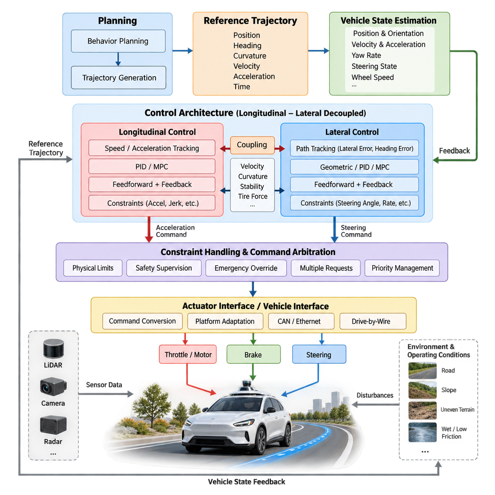
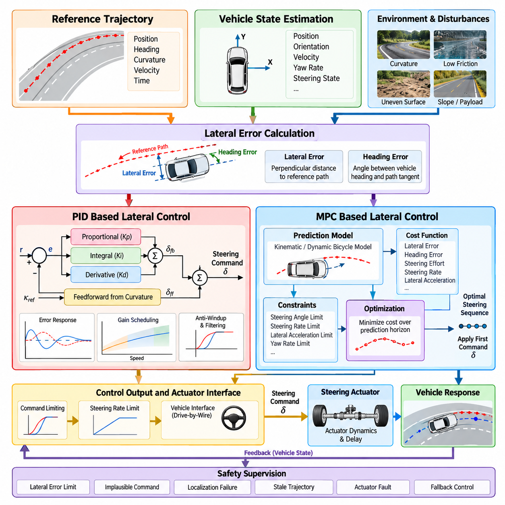
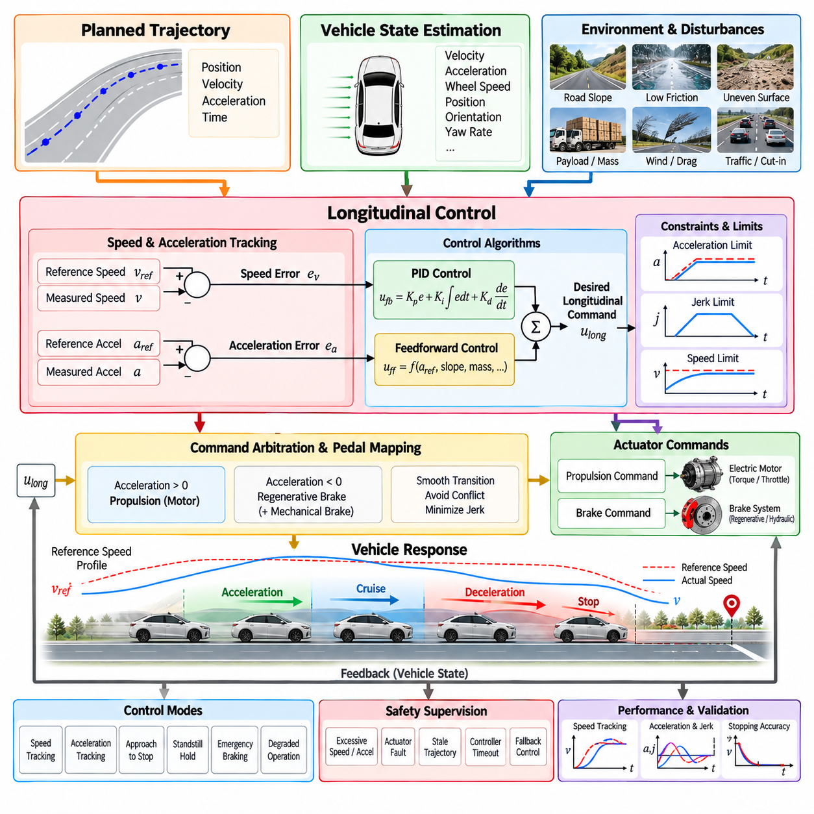
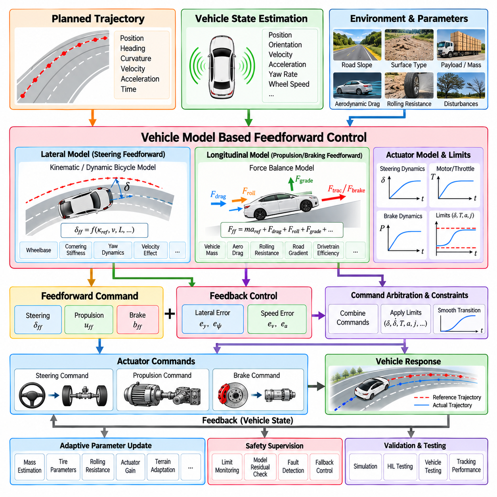
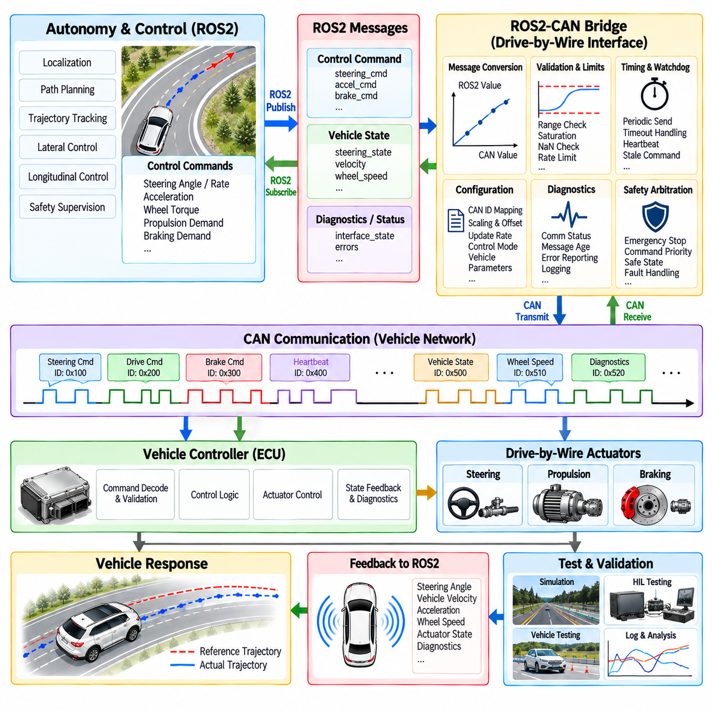
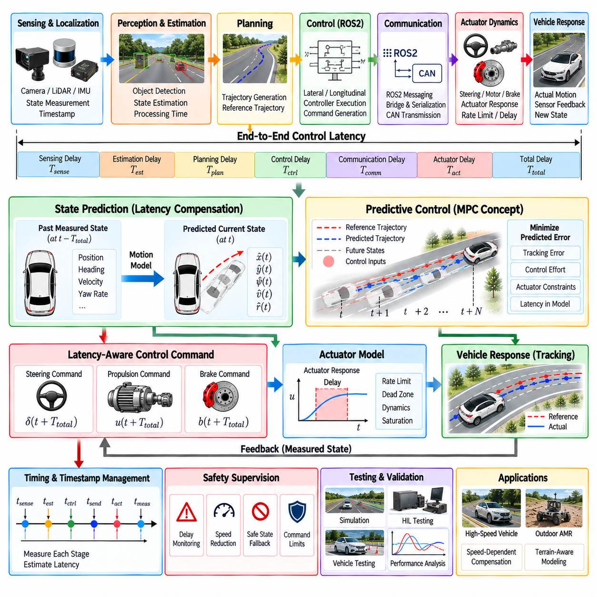
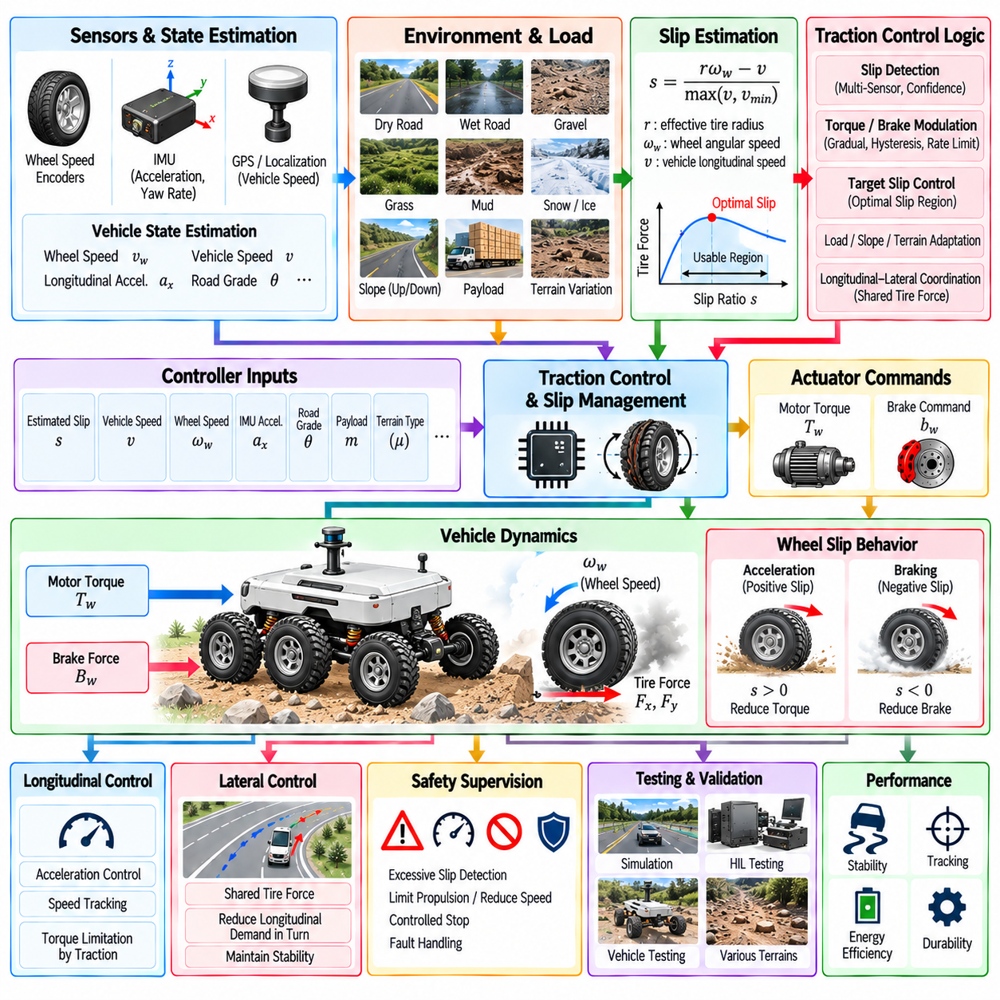
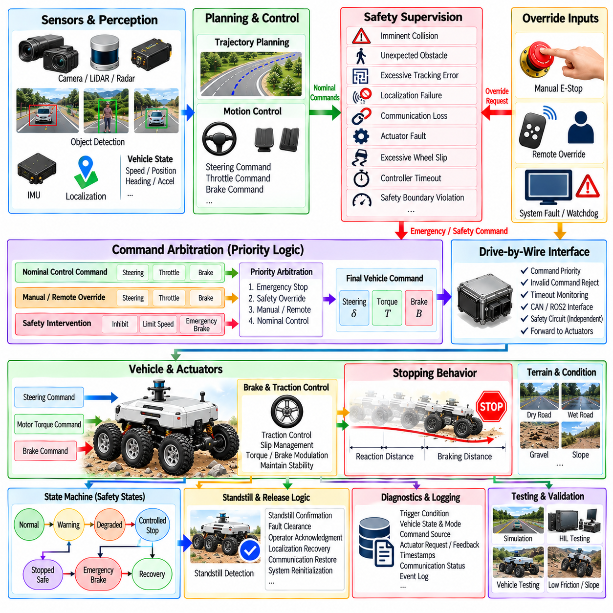
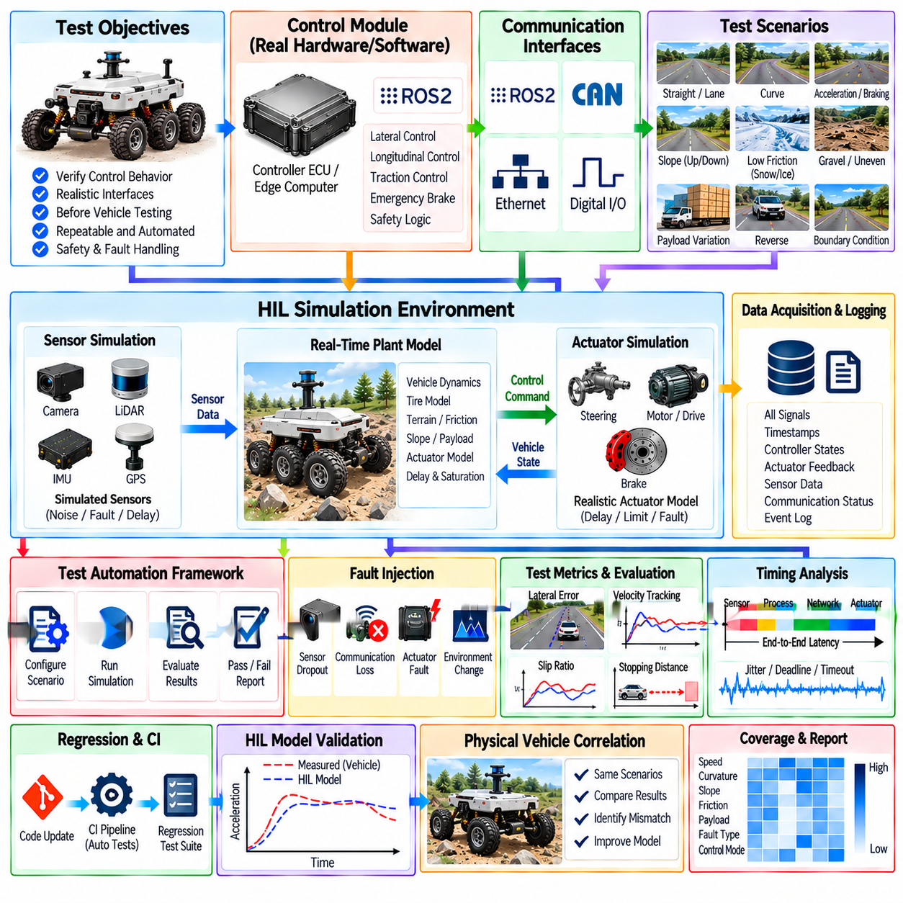
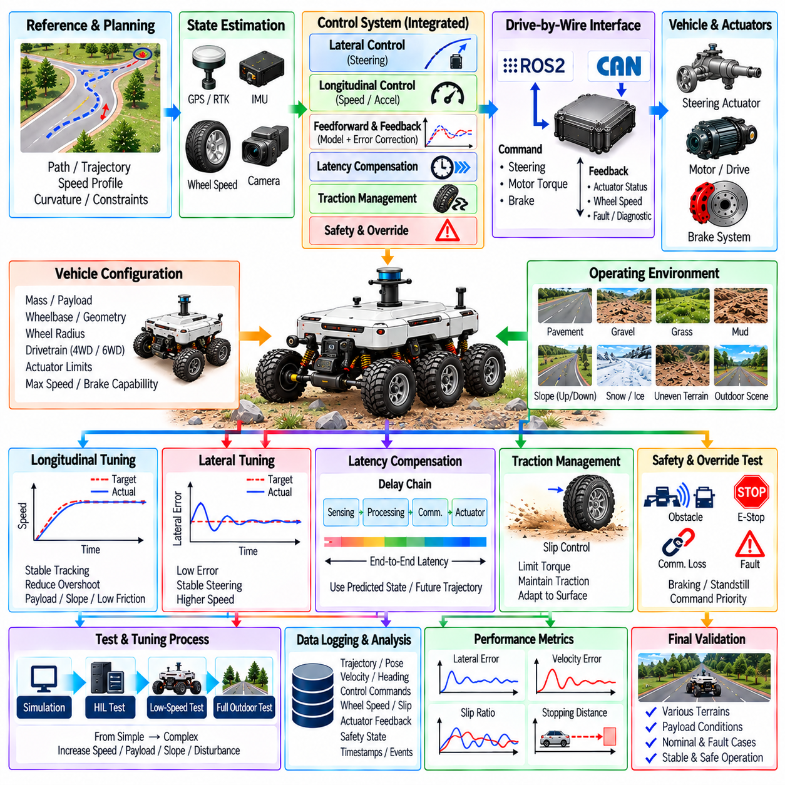

**Volume 12. Autonomous Driving Software**

# Chapter 08. Control Integration

## 08.01. AV Control Architecture Longitudinal Lateral Decoupled

{width="7.268055555555556in" height="7.268055555555556in"}

자율주행 차량 제어 아키텍처(Autonomous Vehicle Control Architecture)는 계획된 궤적(Planned Trajectory)을 실제 액추에이터 명령(Actuator Command)으로 변환하여 차량이 목표 경로(Path), 속도(Speed), 운동 프로파일(Motion Profile)을 추종하도록 한다. 자율주행 소프트웨어 스택(Autonomous Driving Software Stack)에서 제어(Control)는 궤적 생성(Trajectory Generation)과 차량 구동(Vehicle Actuation)을 연결하는 최종 폐루프(Closed-Loop) 단계이다. 제어 시스템은 계획된 운동과 측정된 차량 상태를 지속적으로 비교하고 조향(Steering), 추진(Propulsion), 제동(Braking) 명령을 통해 편차를 보정한다.

널리 사용되는 아키텍처 방식은 차량 운동 제어(Vehicle Motion Control)를 종방향 제어(Longitudinal Control)와 횡방향 제어(Lateral Control) 채널로 분리하는 것이다. 종방향 제어는 차량의 전진 방향을 따라 발생하는 운동을 담당하며 주로 속도(Velocity), 가속(Acceleration), 감속(Deceleration), 정지(Stopping), 추종 거리(Following Distance)를 제어한다. 횡방향 제어는 전진 방향에 수직인 운동을 담당하며 주로 조향각(Steering Angle), 헤딩(Heading), 곡률(Curvature), 기준 궤적에 대한 횡방향 위치(Cross-Track Position)를 제어한다.

이러한 분리는 일반적인 지상 차량(Ground Vehicle)의 물리적 구조를 반영한다. 스로틀(Throttle) 또는 모터 토크(Motor Torque)와 제동력(Braking Force)은 주로 종방향 동역학(Longitudinal Dynamics)에 영향을 미치는 반면, 조향은 주로 횡방향 운동(Lateral Motion)과 요 거동(Yaw Behavior)을 결정한다. 이러한 동작을 독립적인 제어기(Controller)에 할당하면 궤적 계획(Trajectory Planning)과 저수준 차량 구동(Low-Level Vehicle Actuation) 사이에 명확한 인터페이스를 유지하면서 각 제어 루프를 독립적으로 설계, 튜닝, 시험 및 진단할 수 있다.

제어 파이프라인(Control Pipeline)은 일반적으로 위치(Position), 헤딩(Heading), 곡률(Curvature), 속도(Velocity), 가속도(Acceleration)의 목표값을 포함하는 시간 매개변수화 기준 궤적(Time-Parameterized Reference Trajectory)을 입력받는다. 차량 상태 추정(Vehicle-State Estimation)은 현재 위치, 자세(Orientation), 속도, 요율(Yaw Rate), 조향 상태(Steering State), 경우에 따라 휠 속도(Wheel Speed)와 가속도 등의 측정 또는 추정 상태를 제공한다. 제어기는 추종 오차(Tracking Error)를 계산하고 이를 드라이브 바이 와이어(Drive-by-Wire) 또는 액추에이터 제어 계층(Actuator-Control Layer)으로 전달되는 명령으로 변환한다.

종방향 제어(Longitudinal Control)는 일반적으로 속도 및 가속도 오차를 기반으로 동작한다. 궤적의 기준 속도(Reference Velocity)는 측정된 차량 속도와 비교되며, 피드포워드 항(Feedforward Term)은 목표 가속도를 직접 사용할 수 있다. PID와 같은 피드백 알고리즘(Feedback Algorithm)은 외란(Disturbance)과 모델링 오차(Modeling Error)를 보상하며, 보다 발전된 제어기는 추진 또는 제동 명령을 생성할 때 차량 동역학, 액추에이터 제약조건(Actuator Constraint), 도로 경사, 페이로드(Payload) 변화, 휠 슬립(Wheel Slip), 예측된 미래 상태를 고려할 수 있다.

횡방향 제어(Lateral Control)는 기준 경로(Reference Path)에 대한 기하학적 및 동역학적 편차를 최소화하는 것을 목표로 한다. 주요 변수에는 횡방향 위치 오차(Lateral Position Error), 헤딩 오차(Heading Error), 경로 곡률(Path Curvature), 조향각, 요율, 차량 속도가 포함된다. 단순한 시스템에서는 기하학적 제어기(Geometric Controller)를 사용할 수 있으며, 고성능 시스템에서는 기준 곡률로부터 계산한 피드포워드 조향(Feedforward Steering)과 측정된 추종 오차를 기반으로 하는 피드백 제어(Feedback Control)를 결합하는 경우가 많다. 모델 예측 제어(Model Predictive Control, MPC)는 조향 및 안정성 제약조건을 고려하면서 미래의 횡방향 거동을 명시적으로 최적화할 수 있다.

두 채널이 분리형(Decoupled)으로 설명되더라도 물리적으로 완전히 독립적인 것은 아니다. 차량 속도는 횡방향 동역학에 큰 영향을 미치며, 동일한 조향 입력이라도 속도에 따라 서로 다른 요 응답(Yaw Response)을 발생시킨다. 또한 큰 조향 동작에서는 안정성(Stability), 타이어 힘 여유(Tire-Force Margin), 추종 정확도(Tracking Accuracy)를 유지하기 위해 종방향 속도를 낮춰야 할 수 있다. 따라서 아키텍처는 제어기의 책임을 분리하면서도 종방향 및 횡방향 제어 프로세스 사이에서 필요한 정보를 선택적으로 교환한다.

실제 구현에서는 궤적 속도(Trajectory Velocity)를 중요한 결합 변수(Coupling Variable)로 사용하는 경우가 많다. 종방향 제어기는 요청된 속도 프로파일을 추종하고, 횡방향 제어기는 조향 명령을 계산할 때 현재 및 예측 속도를 이용한다. 플래너(Planner)는 곡률이 큰 구간에 진입하기 전에 기준 속도를 낮출 수 있으며, 이를 통해 두 제어기를 하나의 단일 알고리즘으로 통합하지 않고도 횡방향 제어가 조향, 가속도 및 타이어 힘의 실현 가능한 범위 내에서 동작하도록 할 수 있다.

제어 성능은 타이밍(Timing)에 크게 의존한다. 위치 추정(Localization), 궤적 생성, 상태 추정(State Estimation), 제어기 실행, 통신(Communication), 액추에이터 응답(Actuator Response)은 모두 지연시간(Latency)을 발생시킨다. 지연된 차량 상태를 사용하는 제어기는 현재 상태가 아니라 과거 상태에 적합한 명령을 생성할 수 있다. 따라서 실제 운용 아키텍처(Production Architecture)에서는 타임스탬프 데이터(Timestamped Data), 필요한 경우 결정론적 실행(Deterministic Execution), 지연시간 모니터링(Latency Monitoring), 상태 예측(State Prediction), 명령 및 액추에이터 지연의 명시적인 처리가 필요하다.

서로 다른 제어 루프(Control Loop)는 서로 다른 주파수(Frequency)로 실행될 수도 있다. 차량 상태 추정과 저수준 제어(Low-Level Control)는 액추에이터 조절에 빠른 피드백이 필요하므로 행동 계획(Behavior Planning)이나 궤적 생성보다 훨씬 높은 주기로 실행될 수 있다. 제어기는 일반적으로 계획 업데이트 사이에서 가장 최근의 유효한 궤적을 추종하며, 해당 궤적이 계속 사용 가능한지를 지속적으로 평가한다. 누락되거나 오래되었거나 불연속적이거나 유효하지 않은 기준 궤적은 액추에이터 명령으로 무조건 변환하지 않고 반드시 감지해야 한다.

액추에이터 인터페이스(Actuator Interface)는 또 하나의 중요한 아키텍처 경계를 제공한다. 고수준 제어 알고리즘(High-Level Control Algorithm)은 하드웨어별 메시지에 직접 의존하기보다는 목표 가속도, 조향각, 조향 속도(Steering Rate), 휠 토크(Wheel Torque), 제동 요구량(Braking Demand)과 같이 정규화되거나 물리적으로 의미 있는 목표값을 생성하는 것이 바람직하다. 이후 차량 인터페이스(Vehicle Interface) 또는 하드웨어 추상화 계층(Hardware Abstraction Layer)이 이러한 목표값을 특정 차량 플랫폼에 적합한 CAN, Ethernet 또는 드라이브 바이 와이어 명령으로 변환한다.

이러한 추상화(Abstraction)는 특히 자율이동로봇(Autonomous Mobile Robot, AMR)과 다중 플랫폼 자율주행 소프트웨어(Multi-Platform Autonomy Software)에서 중요하다. 서로 다른 플랫폼은 애커만 조향(Ackermann Steering), 차동 구동(Differential Drive), 사륜 조향(Four-Wheel Steering), 독립 휠 모터(Independent Wheel Motor) 등의 구성을 사용할 수 있지만, 상위 자율주행 스택의 상당 부분은 변경하지 않고 유지할 수 있다. 플랫폼별 변환, 액추에이터 보정(Actuator Calibration), 포화 한계(Saturation Limit), 통신 프로토콜은 계획 및 제어 소프트웨어 전체에 분산시키는 대신 하드웨어 인터페이스 근처에 격리할 수 있다.

종방향 및 횡방향 명령은 액추에이터에 도달하기 전에 제약조건 처리(Constraint Handling)를 거쳐야 한다. 조향각과 조향 속도는 기계적 한계(Mechanical Limit)에 의해 제한되며, 추진 및 제동 명령은 모터 성능, 배터리 상태, 타이어-노면 상호작용(Tire-Road Interaction), 페이로드 및 안전 요구사항에 의해 제한된다. 가속도, 감속도, 저크(Jerk), 횡가속도(Lateral Acceleration) 제한 역시 탑승자, 화물, 기계 부품 및 추종 안정성을 불필요하게 공격적인 제어 동작으로부터 보호한다.

여러 소프트웨어 구성요소가 차량 운동을 요청할 수 있는 경우에는 명령 중재(Command Arbitration)가 필요하다. 정상 궤적 추종(Normal Trajectory Tracking), 비상 제동(Emergency Braking), 원격 운전(Remote Operation), 수동 전환(Manual Takeover), 트랙션 제어(Traction Control), 안전 감독(Safety Supervision)이 모두 차량 구동에 영향을 줄 수 있다. 아키텍처는 안전 관련 개입이 정상 제어기 출력을 우선하여 재정의할 수 있도록 결정론적 우선순위(Deterministic Priority)를 정의해야 한다. 중재는 서로 관련 없는 소프트웨어 모듈 내부에서 명령을 통제되지 않은 방식으로 변경하는 대신 명시적인 인터페이스를 통해 수행되어야 한다.

따라서 고장 처리(Failure Handling)는 제어 통합(Control Integration)의 외부 기능이 아니라 그 자체의 일부이다. 유효하지 않은 위치 추정, 과도한 추종 오차, 액추에이터 통신 손실, 오래된 궤적(Stale Trajectory), 제어기 타임아웃(Controller Timeout), 일관되지 않은 차량 피드백은 정상적인 폐루프 제어의 신뢰성을 떨어뜨릴 수 있다. 감독 로직(Supervisory Logic)은 이러한 상태를 모니터링하고 시스템 수준의 안전 전략에 따라 차량을 제어된 감속(Controlled Deceleration), 비상 정지(Emergency Stop), 성능 저하 운전(Degraded Operation) 또는 사전에 정의된 다른 안전 동작으로 전환할 수 있다.

야외 자율이동로봇(Outdoor AMR)은 운용 조건이 평탄한 포장도로로 제한된 차량보다 크게 변화하기 때문에 추가적인 과제를 가진다. 느슨한 자갈, 젖은 노면, 경사로, 연석(Curb), 불규칙 지형(Uneven Terrain), 페이로드 변화, 휠 슬립은 종방향 및 횡방향 응답을 모두 변화시킬 수 있다. 기본적인 분리형 아키텍처는 여전히 유용하지만, 추정된 지형 특성(Terrain Property), 접지 조건(Traction Condition), 페이로드 상태, 안정성 제약조건이 제어기 파라미터와 실현 가능한 명령 한계에 영향을 미치도록 설계할 필요가 있다.

저속에서는 자율이동로봇이 비교적 단순한 차량 모델(Vehicle Model)을 사용할 수 있지만, 도킹(Docking), 좁은 통로, 시설물 또는 보행자 주변에서는 센티미터 수준의 추종 오차도 중요할 수 있다. 속도가 증가하면 동역학적 효과(Dynamic Effect)가 더욱 중요해지고 순수한 기하학적 가정만으로는 신뢰성이 낮아질 수 있다. 따라서 제어기 설계는 하나의 제어 방식이 모든 속도와 지형 조건에서 동일한 성능을 제공한다고 가정하기보다 실제 운용 영역(Operating Envelope)을 반영해야 한다.

궤적 생성과 제어는 좌표계(Coordinate Frame), 곡률, 속도 부호(Velocity Sign), 가속도, 타임스탬프(Timestamp), 차량 기준점(Vehicle Reference Point)에 대해 일관된 정의를 공유해야 한다. 수학적으로 올바른 제어기라도 플래너와 제어기가 이러한 값을 서로 다르게 해석하면 실패할 수 있다. 인터페이스 계약(Interface Contract)은 단위(Unit), 좌표 규약(Coordinate Convention), 유효 범위(Valid Range), 업데이트 주기(Update Rate), 시간 기준(Time Base), 고장 의미론(Failure Semantics)을 정의하여 소프트웨어 모듈과 차량 플랫폼 전반에서 통합 동작을 예측 가능하게 만들어야 한다.

이 장의 구성에서는 이러한 아키텍처를 상세한 횡방향 PID/MPC 제어, 종방향 속도 및 가속도 제어, 피드포워드 제어(Feedforward Control), 드라이브 바이 와이어 통합, 지연시간 보상(Latency Compensation), 트랙션 관리(Traction Management), 비상 오버라이드 로직(Emergency Override Logic), HIL 시험(Hardware-in-the-Loop Testing), 야외 AMR 튜닝보다 먼저 다룬다. 이러한 구성은 종·횡방향 분리 제어 아키텍처(Longitudinal-Lateral Decoupled Control Architecture)를 이후의 전문적인 제어 메커니즘이 동작하는 통합 프레임워크(Integration Framework)로 다루기 위한 것이다.

궁극적으로 종·횡방향 분리(Longitudinal-Lateral Decoupling)는 차량 동역학이 완전히 분리될 수 있다는 의미가 아니라 아키텍처적 분해(Architectural Decomposition)를 의미한다. 그 핵심 가치는 모듈성(Modularity), 명확한 인터페이스, 독립적인 튜닝, 고장 격리(Fault Isolation), 재사용 가능한 소프트웨어 구성요소에 있다. 견고한 자율주행 시스템은 이러한 장점을 유지하면서 속도, 곡률, 타이어 힘, 지형, 액추에이터 한계, 지연시간 및 안전 개입으로 발생하는 물리적 결합(Physical Coupling)을 명시적으로 관리한다.

성숙한 제어 아키텍처(Control Architecture)는 따라서 분리된 종방향 및 횡방향 피드백 루프(Feedback Loop)를 공유 상태 추정(Shared State Estimation), 궤적 정보(Trajectory Information), 제약조건 관리(Constraint Management), 액추에이터 추상화(Actuator Abstraction), 명령 중재(Command Arbitration), 안전 감독(Safety Supervision)과 결합한다. 이렇게 구성된 폐루프 시스템(Closed-Loop System)은 계획 의도(Planning Intent)를 실제 차량 거동(Physical Vehicle Behavior)으로 연결하면서 자율주행 차량과 야외 AMR 플랫폼 전반에서 검증(Verification), 보정(Calibration), 하드웨어 적용(Hardware Adaptation), 향후 제어기 업그레이드를 위한 명확한 경계를 제공한다.

## 08.02. PID and MPC Based Lateral Control [w/Code]

{width="7.268055555555556in" height="7.268055555555556in"}

횡방향 제어(Lateral Control)는 자율주행 차량의 위치와 방향이 기준 경로(Reference Path) 또는 기준 궤적(Reference Trajectory)에 정렬된 상태를 유지하도록 조향하는 역할을 담당한다. 제어기(Controller)는 횡방향 변위(Lateral Displacement), 헤딩 차이(Heading Difference), 곡률(Curvature), 조향 상태(Steering State), 차량 운동(Vehicle Motion)을 지속적으로 평가한 후 추종 오차(Tracking Error)를 감소시키는 조향 명령(Steering Command)을 생성한다. PID와 모델 예측 제어(Model Predictive Control, MPC)는 이러한 폐루프 횡방향 제어(Closed-Loop Lateral Control)를 구현하는 대표적인 두 가지 접근 방식이다.

횡방향 제어 프로세스(Lateral-Control Process)는 궤적 생성 모듈(Trajectory-Generation Module)이 제공하는 기준 궤적으로부터 시작된다. 각각의 궤적점(Trajectory Point)은 위치(Position), 헤딩(Heading), 곡률, 속도(Velocity), 시간(Time) 정보를 포함할 수 있다. 차량 상태 추정(Vehicle-State Estimation)은 이에 대응하는 현재 자세(Pose), 속도, 요율(Yaw Rate), 조향 상태를 제공한다. 이 두 정보 스트림은 일관된 좌표계(Coordinate Frame)에서 비교되어 차량이 목표로 하는 기하학적 및 동역학적 운동으로부터 얼마나 벗어났는지를 결정한다.

횡방향 오차(Lateral Error)는 일반적으로 선택된 차량 기준점(Vehicle Reference Point)과 목표 경로 사이의 수직 거리로 정의된다. 헤딩 오차(Heading Error)는 차량의 방향과 기준 경로의 접선 방향(Tangent Direction) 사이의 각도 차이를 나타낸다. 이러한 오차는 경로 편차(Path Deviation)의 상호 보완적인 측면을 표현한다. 차량이 경로 가까이에 있으면서 방향이 잘못될 수도 있고, 방향은 올바르지만 횡방향으로 벗어나 있을 수도 있으므로 효과적인 제어에서는 일반적으로 두 값을 모두 고려한다.

비례-적분-미분 제어기(Proportional-Integral-Derivative Controller, PID)는 횡방향 추종 오차를 보정하기 위한 비교적 단순한 피드백 메커니즘(Feedback Mechanism)을 제공한다. 비례항(Proportional Term)은 현재 오차에 직접 반응하여 편차가 증가할수록 더 강한 보정을 생성한다. 적분항(Integral Term)은 지속적으로 발생하는 오차를 누적하여 체계적인 편향(Systematic Bias)을 보상할 수 있다. 미분항(Derivative Term)은 오차의 변화율에 반응하며 과도한 진동(Oscillation)이나 빠르게 증가하는 편차를 억제함으로써 감쇠(Damping) 특성을 개선할 수 있다.

PID를 횡방향 제어에 적용하려면 제어 대상 오차(Controlled Error)를 신중하게 정의해야 한다. 제어기는 주로 횡방향 오차, 헤딩 오차 또는 두 오차의 가중 결합(Weighted Combination)을 대상으로 동작할 수 있다. 실제 구현에서는 기준 경로의 곡률로부터 계산되는 피드포워드 성분(Feedforward Component)을 조향 명령에 추가할 수도 있다. 피드포워드(Feedforward)는 앞으로 필요한 도로 형상에 대한 조향을 미리 예측하며, PID 피드백(PID Feedback)은 외란(Disturbance), 불확실성(Uncertainty), 불완전한 차량 모델링(Vehicle Modeling)으로 인해 발생하는 잔여 오차를 보정한다.

PID 성능은 게인 튜닝(Gain Tuning)에 크게 의존한다. 과도한 비례 게인(Proportional Gain)은 조향 진동을 발생시킬 수 있으며, 게인이 부족하면 보정이 느려지고 추종 오차가 증가한다. 강한 적분 동작(Integral Action)은 정상상태 편차(Steady-State Bias)를 제거할 수 있지만 조향이 물리적 한계에 도달하면 적분 와인드업(Integral Windup)을 발생시킬 수 있다. 과도한 미분 동작(Derivative Action)은 측정 노이즈(Measurement Noise)를 증폭할 수 있다. 따라서 안티 와인드업(Anti-Windup), 미분 필터링(Derivative Filtering), 조향 속도 제한(Steering-Rate Limitation), 게인 스케줄링(Gain Scheduling)은 실제 시스템 구현에서 중요한 추가 요소이다.

차량 속도(Vehicle Speed)는 횡방향 동역학(Lateral Dynamics)이 운용 범위에 따라 크게 변화하기 때문에 특히 중요하다. 저속에서 부드러운 추종 성능을 제공하는 PID 게인은 고속에서 진동이나 불안정성을 발생시킬 수 있으며, 보수적으로 설정된 고속용 게인은 정밀한 저속 기동에서 너무 느리게 반응할 수 있다. 게인 스케줄링은 속도, 곡률, 페이로드(Payload), 노면 상태(Surface Condition) 또는 기타 운용 변수에 따라 제어기 파라미터를 선택하거나 보간(Interpolation)할 수 있다.

모델 예측 제어(Model Predictive Control, MPC)는 횡방향 추종을 제약조건을 갖는 최적화 문제(Constrained Optimization Problem)로 다룬다. 현재 추종 오차에만 반응하는 대신 MPC는 수학적 차량 모델(Mathematical Vehicle Model)을 이용하여 유한한 예측 구간(Prediction Horizon)에 걸친 미래 상태를 예측한다. 이후 정의된 제약조건을 만족하면서 비용 함수(Cost Function)를 최소화하는 일련의 조향 동작을 결정한다. 최적화된 명령 중 첫 번째 명령만 실제 차량에 적용하고 새로운 상태 정보가 입력되면 최적화 과정을 다시 수행한다.

예측 모델(Prediction Model)은 단순한 운동학적 자전거 모델(Kinematic Bicycle Model)에서부터 횡방향 속도(Lateral Velocity), 요 동역학(Yaw Dynamics), 타이어 거동(Tire Behavior), 조향 액추에이터 특성(Steering Actuator Characteristics)을 포함하는 보다 상세한 동역학 모델(Dynamic Model)까지 다양하게 구성할 수 있다. 운동학 모델은 계산 효율성이 높고 저속 운용에 적합한 경우가 많다. 속도가 증가하여 관성 및 타이어 힘의 영향이 중요해질수록 동역학 모델이 유용해지지만 더 많은 파라미터와 계산량이 필요하다.

MPC 비용 함수(MPC Cost Function)는 일반적으로 예측된 횡방향 오차, 헤딩 오차, 조향 노력(Steering Effort), 급격한 조향 변화에 페널티(Penalty)를 부여한다. 추가적인 항을 통해 요율 편차(Yaw-Rate Deviation), 과도한 횡가속도(Lateral Acceleration) 또는 기타 바람직하지 않은 거동을 억제할 수 있다. 각 항의 상대적 가중치(Relative Weight)는 제어기가 경로 정확도(Path Accuracy), 부드러움(Smoothness), 안정성(Stability), 액추에이터 사용량(Actuator Usage)을 얼마나 적극적으로 우선시할지를 결정한다. 따라서 제어기 튜닝은 소수의 피드백 게인을 직접 조정하는 문제에서 최적화 설계 문제(Optimization-Design Problem)로 확장된다.

MPC의 주요 장점 중 하나는 제약조건(Constraint)을 명시적으로 포함할 수 있다는 점이다. 조향각(Steering Angle), 조향 속도(Steering Rate), 횡가속도, 요 응답(Yaw Response) 및 기타 물리적 또는 안전 관련 변수의 범위를 최적화 과정에서 제한할 수 있다. 이를 통해 제어기는 제약조건을 고려하지 않은 명령을 계산한 뒤 단순히 제한하는 대신 처음부터 실현 가능한 조향 동작(Feasible Steering Action)을 탐색할 수 있다. 이러한 제약조건 기반 예측(Constraint-Aware Prediction)은 급격한 곡선 구간이나 높은 차량 속도에서 특히 중요하다.

MPC는 미래 궤적 정보(Future Trajectory Information)를 활용하기 위한 자연스러운 메커니즘도 제공한다. 예측 구간에 걸친 기준 경로를 알고 있기 때문에 제어기는 추종 오차가 발생할 때까지 기다리지 않고 앞으로 나타날 곡률을 미리 고려할 수 있다. 이러한 예측 능력(Predictive Capability)은 위상 지연(Phase Lag)을 줄이고 직선 구간과 곡선 구간 사이의 전환 과정에서 부드러운 제어를 향상시킬 수 있다. 이러한 장점을 실현하기 위해서는 정확한 궤적 타이밍(Trajectory Timing)과 충분히 신뢰할 수 있는 차량 상태 예측(Vehicle-State Prediction)이 중요하다.

예측 기능의 장점에는 계산 요구사항(Computational Requirement)이 따른다. 최적화 문제는 제어 주기(Control Cycle)마다 반복적으로 해결되어야 하며 실행 시간은 실시간 운용(Real-Time Operation)이 가능하도록 충분히 제한되어야 한다. 예측 구간의 길이, 모델 복잡도(Model Complexity), 최적화 방법(Optimization Method), 제약조건의 수, 프로세서 성능(Processor Capability)은 지연시간(Latency)에 영향을 미친다. 이론적으로 우수한 제어기라도 최적화의 기준이 된 차량 상태보다 조향 명령이 지나치게 늦게 도착한다면 실제 성능은 저하될 수 있다.

따라서 PID와 MPC는 어느 하나가 항상 우수한 관계라기보다 서로 다른 공학적 절충관계(Engineering Trade-Off)를 나타낸다. PID는 단순성(Simplicity), 낮은 계산 비용(Computational Cost), 비교적 쉬운 구현 및 디버깅(Debugging)이라는 장점을 제공한다. MPC는 명시적인 예측(Explicit Prediction), 다변수 최적화(Multivariable Optimization), 체계적인 제약조건 처리(Systematic Constraint Handling)를 제공한다. 특정 자율주행 차량 또는 AMR에 어떤 방식을 적용할지는 플랫폼 특성, 속도 범위, 추종 요구사항, 프로세서 자원, 액추에이터 동역학, 안전 요구사항에 따라 결정된다.

하이브리드 구현(Hybrid Implementation)은 두 방식의 유용한 특성을 결합할 수 있다. 곡률 기반 피드포워드(Curvature-Based Feedforward)가 기본 조향 요구량을 제공하고 PID가 빠른 피드백 보정을 담당할 수 있다. MPC를 주 궤적 추종 제어기(Primary Trajectory-Tracking Controller)로 사용하면서 최적화가 실패하거나 실행 제한시간을 초과하는 경우 보다 단순한 폴백 제어기(Fallback Controller)를 사용할 수도 있다. 이러한 아키텍처적 분리는 정상 운용 중 고급 제어 기능을 유지하면서 시스템 강건성(Robustness)을 향상시킬 수 있다.

실제 제어기 통합에서는 조향 액추에이터 동역학(Steering Actuator Dynamics)을 고려해야 한다. 요청된 조향각은 명령 생성과 실제 휠 응답 사이에 존재하는 기계적, 전기적, 유압적, 통신 및 소프트웨어 지연으로 인해 즉시 달성되지 않는다. 조향 속도 한계와 액추에이터 지연(Actuator Lag)을 무시하면 상당한 추종 오차가 발생할 수 있다. 제어기 모델, 피드포워드 항 또는 예측 보상(Predictive Compensation)은 명령이 드라이브 바이 와이어 인터페이스(Drive-by-Wire Interface)에 전달되기 전에 이러한 영향을 고려할 수 있다.

상태 정보의 품질(State Quality) 역시 중요하다. 위치 추정 노이즈(Localization Noise)는 횡방향 오차 추정에 직접 영향을 주며, 방향 불확실성(Orientation Uncertainty)은 헤딩 오차에 영향을 미친다. 지연된 속도 또는 요율 측정값은 동역학 피드백(Dynamic Feedback)과 예측을 왜곡할 수 있다. 필터링(Filtering)은 노이즈를 감소시킬 수 있지만 추가적인 지연을 발생시키므로 신호의 부드러움(Signal Smoothness)과 응답성(Responsiveness) 사이의 절충이 필요하다. 따라서 타임스탬프 일관성(Timestamp Consistency)과 동기화된 상태 추정(Synchronized State Estimation)은 신뢰할 수 있는 횡방향 제어를 위한 기본 요구사항이다.

야외 자율이동로봇(Outdoor AMR)은 이상적인 도로 환경에서는 상대적으로 영향이 적은 지형 관련 외란(Terrain-Related Disturbance)을 추가적으로 고려해야 한다. 불규칙 노면(Uneven Surface), 횡경사(Cross Slope), 느슨한 자갈, 젖은 포장도로, 휠 슬립(Wheel Slip), 페이로드 변화, 타이어 변형(Tire Deformation)은 조향 명령과 실제 차량 운동 사이의 관계를 변화시킬 수 있다. PID 게인 스케줄링 또는 MPC 모델 적응(Model Adaptation)을 통해 이러한 변화의 일부를 보상할 수 있으며, 접지력 및 안정성 정보(Traction and Stability Information)를 이용하여 마찰력이 낮은 조건에서 조향 거동을 추가적으로 제한할 수 있다.

저속 정밀도(Low-Speed Precision)와 고속 안정성(Higher-Speed Stability)은 서로 다른 제어 우선순위를 요구한다. 도킹(Docking) 또는 좁은 경로 운용에서는 센티미터 수준의 횡방향 정확도와 부드러운 조향이 주요 목표가 될 수 있다. 속도가 증가하면 요 안정성(Yaw Stability), 조향 속도 한계, 횡가속도, 예측 정확도(Prediction Accuracy)가 더욱 중요해진다. 따라서 실제 운용 제어기(Production Controller)는 운용 조건이 변화함에 따라 게인, 모델 파라미터, 최적화 가중치, 제약조건 또는 제어 모드(Control Mode) 자체를 변경할 수 있다.

안전 감독(Safety Supervision)은 정상적인 최적화 또는 피드백 계산 외부에 위치하지만 제어기 출력에 개입할 수 있는 권한을 가져야 한다. 과도한 횡방향 오차, 비정상적인 조향 명령, 위치 추정 실패(Localization Failure), 오래된 궤적 데이터(Stale Trajectory Data), 액추에이터 고장(Actuator Fault), 제어기 타임아웃(Controller Timeout)은 독립적으로 감지되어야 한다. 정상적인 경로 추종을 더 이상 신뢰할 수 없는 경우 감독 계층(Supervisory Layer)은 조향 명령을 제한하거나 속도 감소를 요청하고, 제어기를 전환하거나 최소 위험 기동(Minimal-Risk Maneuver)을 시작할 수 있다.

검증(Validation)에서는 평균적인 경로 추종 정확도만 평가해서는 안 된다. 최대 횡방향 오차(Maximum Lateral Error), 헤딩 오차, 조향 부드러움(Steering Smoothness), 조향 속도 사용률(Steering-Rate Utilization), 진동, 정착 거동(Settling Behavior), 횡가속도, 계산 시간(Computation Time), 외란에 대한 강건성(Robustness)이 중요한 평가 지표가 된다. 시험은 직선 경로, 곡선, 곡률 전환, 속도 변화, 위치 추정 노이즈, 액추에이터 지연, 노면 변화 등 목표 운용 설계 영역(Operational Design Domain, ODD)을 대표하는 다양한 조건을 포함해야 한다.

PID 및 MPC 기반 횡방향 제어(PID and MPC Based Lateral Control)는 궁극적으로 계획된 기하학적 궤적(Geometric Trajectory)을 안정적이고 실현 가능하며 적시에 수행되는 조향 거동으로 변환한다는 동일한 시스템 목표를 가진다. PID는 주로 오차 기반 피드백(Error-Driven Feedback)을 통해 이를 수행하는 반면, MPC는 예측(Prediction), 최적화(Optimization), 명시적 제약조건(Explicit Constraints)을 결합한다. 성공적인 실제 적용은 제어 수학 자체뿐만 아니라 정확한 상태 추정, 궤적 일관성(Trajectory Consistency), 액추에이터 모델링(Actuator Modeling), 결정론적 타이밍(Deterministic Timing), 안전 감독, 체계적인 차량 수준 튜닝(Vehicle-Level Tuning)에 의해 결정된다.

## 08.03. Longitudinal Speed and Acceleration Control [w/Code]

{width="7.268055555555556in" height="7.268055555555556in"}

종방향 제어(Longitudinal Control)는 계획된 궤적(Planned Trajectory)을 따라 자율주행 차량의 속도(Speed), 가속도(Acceleration), 감속(Deceleration), 정지 거동(Stopping Behavior)을 조절하여 전진 운동을 제어한다. 궤적 계획(Trajectory Planning)에서 생성된 속도 및 가속도 목표를 추진(Propulsion)과 제동(Braking) 명령으로 변환한다. 제어기는 폐루프(Closed Loop) 방식으로 지속적으로 동작하며 목표 운동과 측정된 차량 상태를 비교하고 외란(Disturbance), 액추에이터 동역학(Actuator Dynamics), 도로 상태, 모델링 불확실성(Modeling Uncertainty)으로 발생하는 편차를 보정한다.

종방향 제어의 주요 기준 입력은 일반적으로 계획된 궤적과 연계된 시간 매개변수화 속도 프로파일(Time-Parameterized Speed Profile)이다. 각 궤적점(Trajectory Point)은 목표 속도, 가속도, 위치(Position), 시간(Time)을 지정할 수 있으며, 이를 통해 제어기는 차량이 얼마나 빠르게 이동해야 하는지뿐만 아니라 속도가 어떻게 변화해야 하는지도 파악할 수 있다. 차량 상태 추정(Vehicle-State Estimation)은 추종 오차(Tracking Error)를 계산하는 데 필요한 현재 속도, 가속도, 휠 속도(Wheel Speed) 및 기타 측정값을 제공한다.

속도 오차(Speed Error)는 기준 속도(Reference Velocity)와 측정된 차량 속도의 차이로 정의된다. 양의 오차는 일반적으로 추가적인 추진력이 필요하다는 것을 의미하며, 음의 오차는 추진력을 감소시키거나 제동이 필요할 수 있음을 의미한다. 가속도 오차(Acceleration Error)는 목표 가속도와 실제 가속도를 비교하여 또 다른 동역학적 척도를 제공한다. 두 변수를 함께 사용하면 정상상태 속도(Steady-State Speed)를 조절하면서 궤적의 과도 변화(Transient Change)에 효과적으로 대응할 수 있다.

기본적인 종방향 제어기는 비례-적분-미분 피드백(Proportional-Integral-Derivative Feedback)을 사용할 수 있다. 비례항(Proportional Term)은 현재 속도 오차에 반응하고, 적분항(Integral Term)은 구름 저항(Rolling Resistance)이나 작은 보정 오차와 같은 지속적인 편향을 보상하며, 미분항(Derivative Term)은 급격한 변화에 대한 감쇠(Damping)를 제공한다. 실제 차량 시스템에서는 PID 출력을 추진 하드웨어에 직접 전달하기보다 일반적으로 피드포워드 제어(Feedforward Control), 액추에이터 제한, 필터링(Filtering), 모드 의존 로직(Mode-Dependent Logic)과 결합한다.

가속도 피드포워드(Acceleration Feedforward)는 큰 속도 오차가 발생하기 전에 궤적 플래너(Trajectory Planner)가 요청한 가속도를 활용하여 응답성을 향상시킨다. 궤적에서 가속을 요청하면 피드포워드 경로(Feedforward Path)는 예상 추진 요구량을 즉시 생성할 수 있다. 계획된 감속 과정에서도 마찬가지로 필요한 제동량을 미리 예측할 수 있다. 이후 피드백(Feedback)은 불확실한 차량 질량, 도로 경사(Road Gradient), 공기 저항(Aerodynamic Drag), 구름 저항, 모터 특성 및 기타 외란으로 인해 발생하는 오차를 보상한다.

요구 가속도(Requested Acceleration)와 액추에이터 명령(Actuator Command) 사이의 관계는 플랫폼에 따라 크게 달라진다. 전기자동차(Electric Vehicle)는 모터 토크(Motor Torque)를 직접 제어할 수 있으며, 다른 플랫폼에서는 스로틀 비율(Throttle Percentage), 휠 토크(Wheel Torque), 가속도 요구량 또는 정규화된 추진 명령(Normalized Propulsion Command)을 사용할 수 있다. 제동 역시 브레이크 압력(Brake Pressure), 회생 토크(Regenerative Torque), 감속 요구량 또는 정규화된 제동 명령으로 표현될 수 있다. 차량 인터페이스(Vehicle Interface)는 이러한 하드웨어별 세부 사항을 상위 종방향 제어기로부터 분리해야 한다.

종방향 제어에서는 서로 모순되는 명령이 발생하지 않도록 추진과 제동을 조정해야 한다. 명령 중재(Command Arbitration) 또는 페달 매핑 계층(Pedal-Mapping Layer)은 양의 가속도가 추진을 활성화해야 하는지, 음의 가속도를 회생 제동(Regenerative Braking)만으로 처리할 수 있는지, 그리고 언제 기계식 제동(Mechanical Braking)을 추가해야 하는지를 결정할 수 있다. 추진과 제동 사이의 급격한 전환은 저크(Jerk), 진동(Oscillation), 승차감 저하, 불안정한 저속 거동을 발생시킬 수 있으므로 전환 영역(Transition Region)을 세심하게 보정해야 한다.

가속도 및 저크 제약조건(Acceleration and Jerk Constraints)은 종방향 제어 품질을 결정하는 핵심 요소이다. 차량이 물리적으로 강한 가속이나 제동을 수행할 수 있더라도 제한되지 않은 명령은 불편한 움직임, 페이로드(Payload) 이동, 휠 슬립(Wheel Slip), 기계적 스트레스(Mechanical Stress), 횡방향 제어와의 불안정한 상호작용을 발생시킬 수 있다. 가속도와 가속도 변화율을 제한하면 궤적 생성에서 가정한 운동 프로파일(Motion Profile)을 준수하면서 부드러운 속도 전환을 유지할 수 있다.

정지 거동(Stopping Behavior)은 속도가 0에 가까워질수록 일반적인 속도 피드백을 적용하기 어려워지므로 특별한 주의가 필요하다. 센서 양자화(Sensor Quantization), 구동계 데드존(Drivetrain Dead Zone), 브레이크 히스테리시스(Brake Hysteresis), 정지 마찰(Static Friction), 작은 위치 추정 오차는 정지 지점 주변에서 진동이나 크리핑(Creeping)을 발생시킬 수 있다. 따라서 실제 제어기는 정상 속도 추종에서 제어 감속(Controlled Deceleration), 최종 정지 제어(Final-Stop Control), 브레이크 유지(Brake Hold), 완전 정지 확인(Standstill Confirmation)으로 전환되는 전용 정지 로직을 적용한다.

정밀 정지(Precise Stopping)는 도킹 스테이션(Docking Station), 적재 지점(Loading Point), 검사 위치(Inspection Location), 게이트(Gate), 시설물 주변에서 운용되는 자율이동로봇(Autonomous Mobile Robot, AMR)에 특히 중요하다. 제어기는 속도 조절과 잔여 거리 정보(Remaining-Distance Information)를 결합하여 현재 속도와 목표 지점까지의 거리를 모두 고려해 감속을 조절할 수 있다. 이를 통해 차량이 명목상의 속도 프로파일을 정확히 추종하면서도 실제 목표 정지 위치를 지나치는 문제를 방지할 수 있다.

도로 경사(Road Gradient)는 종방향 운동에 큰 외란으로 작용한다. 오르막 구간에서는 동일한 가속도를 유지하기 위해 추가적인 추진력이 필요하며, 내리막에서는 추진력을 감소시키거나 능동적인 제동(Active Braking)이 필요할 수 있다. 지도(Map), 위치 추정(Localization), 관성측정장치(Inertial Measurement Unit, IMU), 지형 추정(Terrain Estimation)으로부터 경사 정보를 얻을 수 있다면 중력 효과(Gravitational Effect)를 피드포워드 제어에 포함할 수 있다. 피드백은 남아 있는 모델 및 측정 오차를 보정한다.

차량 질량(Vehicle Mass)과 페이로드 역시 종방향 응답에 영향을 미친다. 차량 질량이 변하면 동일한 모터 토크에서도 서로 다른 가속도가 발생하며, 이는 가변 페이로드를 운송하는 물류 AMR에서 특히 중요하다. 무부하 차량을 기준으로 보정된 고정 제어기 게인(Fixed Controller Gain)이나 피드포워드 맵(Feedforward Map)은 최대 적재 상태에서 성능이 저하될 수 있다. 게인 스케줄링(Gain Scheduling), 질량 추정(Mass Estimation), 적응형 파라미터(Adaptive Parameter), 모델 기반 제어(Model-Based Control)를 이용하면 변화하는 페이로드 조건에서도 보다 일관된 성능을 유지할 수 있다.

휠 슬립은 명령된 토크가 항상 종방향 가속도로 직접 변환되는 것은 아니기 때문에 또 다른 제약요소가 된다. 느슨한 자갈, 젖은 포장도로, 눈, 진흙, 급경사, 불규칙한 지형은 사용 가능한 타이어-노면 마찰력(Tire-Road Friction)을 감소시킬 수 있다. 휠 속도 측정값, 관성 가속도(Inertial Acceleration), 차량 속도 추정값을 이용하여 비정상적인 슬립을 감지할 수 있다. 이후 종방향 제어기는 트랙션 제어(Traction Control) 및 안정성 기능(Stability Function)과 연계하여 추진 또는 제동 요구량을 감소시킬 수 있다.

종방향 제어와 횡방향 제어(Lateral Control)는 아키텍처적으로 분리되어 있지만 물리적으로는 서로 결합되어 있다. 높은 속도에서는 곡선 경로를 추종하는 데 필요한 횡가속도(Lateral Acceleration)가 증가하며, 강한 종방향 가속 또는 제동은 사용 가능한 타이어 힘(Tire Force)의 일부를 소모한다. 따라서 궤적 플래너는 곡률이 큰 구간에 진입하기 전에 기준 속도를 낮출 수 있으며, 제어 감독(Control Supervision)은 조향 요구량, 안정성 한계 또는 추정된 노면 마찰력이 여유 감소를 나타낼 경우 가속도를 추가로 제한할 수 있다.

제어 지연시간(Control Latency)은 속도 추종 성능에 직접적인 영향을 미친다. 상태 추정(State Estimation), 궤적 통신(Trajectory Communication), 제어기 실행, 차량 네트워크 전송(Vehicle-Network Transmission), 모터 제어, 제동 하드웨어는 모두 물리적 상태 변화와 그에 대응하는 액추에이터 응답 사이에 지연을 발생시킨다. 이러한 지연이 커지면 현재 측정된 오차만 사용하는 피드백은 너무 늦게 반응할 수 있다. 상태 예측(State Prediction), 명령 예측(Command Prediction), 액추에이터 모델(Actuator Model), 지연시간 보상(Latency Compensation)을 이용하여 이러한 조건에서 성능을 향상시킬 수 있다.

종방향 제어기는 하나의 연속적인 알고리즘만 사용하는 대신 여러 제어 모드(Control Mode)를 통해 동작할 수 있다. 정상 속도 추종(Normal Speed Tracking), 가속도 추종(Acceleration Tracking), 정지 접근(Approach-to-Stop), 정지 상태 유지(Standstill Hold), 비상 제동(Emergency Braking), 성능 저하 운전(Degraded Operation), 수동 또는 원격 오버라이드(Manual or Remote Override)는 서로 다른 로직을 요구할 수 있다. 명시적인 모드 관리(Mode Management)는 상충하는 동작을 방지하고 전체 운용 시퀀스에서 명확한 전환 조건, 명령 우선순위, 제어기 초기화 및 복구 동작을 정의한다.

안전 감독(Safety Supervision)은 종방향 명령과 차량 응답을 독립적으로 모니터링해야 한다. 과도한 가속, 예상하지 못한 차량 운동, 브레이크 고장(Brake Failure), 액추에이터 통신 손실, 오래된 궤적 데이터(Stale Trajectory Data), 제어기 타임아웃(Controller Timeout), 큰 속도 추종 오차는 정상 제어를 더 이상 신뢰할 수 없음을 나타낼 수 있다. 안전 로직(Safety Logic)은 추진력을 제한하거나 제어 감속을 요청하고, 비상 제동을 적용하거나 시스템을 사전에 정의된 최소 위험 상태(Minimal-Risk Condition)로 전환할 수 있다.

야외 자율이동로봇(Outdoor AMR)은 속도가 초당 수 센티미터 수준의 정밀 이동부터 상당히 빠른 야외 주행까지 변화할 수 있기 때문에 특히 까다로운 종방향 제어 조건을 갖는다. 지형 경사, 페이로드, 타이어 변형(Tire Deformation), 노면 마찰력, 배터리 전압(Battery Voltage), 모터 온도(Motor Temperature), 환경 조건은 운용 중 지속적으로 변화할 수 있다. 따라서 제어기 파라미터와 액추에이터 매핑(Actuator Mapping)은 명목상의 평탄 노면 조건에서만 최적화할 것이 아니라 전체 운용 영역(Operating Envelope)에 걸쳐 검증해야 한다.

전기식 AMR(Electric AMR)은 종방향 제어에서 에너지 효율(Energy Efficiency)을 고려함으로써 추가적인 이점을 얻을 수 있다. 급격한 가속은 최대 전력 요구량(Peak Power Demand)을 증가시키고 운용 가능 거리를 감소시킬 수 있으며, 적절히 조정된 회생 제동은 감속 과정에서 운동 에너지(Kinetic Energy)의 일부를 회수할 수 있다. 에너지 인지 궤적 계획(Energy-Aware Trajectory Planning)과 종방향 제어는 필요한 안전 동작을 저해하지 않으면서 이동 시간, 부드러움, 배터리 소비, 모터 열 한계(Motor Thermal Limit), 회생 능력(Regenerative Capability)의 균형을 맞출 수 있다.

검증(Validation)에서는 평균 속도 추종 오차만 측정해서는 안 된다. 주요 지표에는 최대 속도 오차(Maximum Velocity Error), 가속도 오차, 정지 거리 오차(Stopping-Distance Error), 오버슈트(Overshoot), 정착 시간(Settling Time), 저크, 명령 부드러움(Command Smoothness), 추진-제동 전환 거동, 계산 지연시간(Computation Latency), 페이로드 또는 경사 변화에 대한 강건성(Robustness)이 포함된다. 시험에는 가속, 정속 주행, 점진적 및 비상 감속, 정지-출발 운전(Stop-and-Go Operation), 경사로, 저마찰 노면, 액추에이터 지연 조건이 포함되어야 한다.

하드웨어 인 더 루프 시험(Hardware-in-the-Loop Testing, HIL)은 광범위한 실제 차량 시험에 앞서 종방향 제어 소프트웨어를 평가할 수 있다. 시뮬레이션 차량 모델(Simulated Vehicle Model)은 실제 제어기 명령에 응답하면서 구동계 동역학(Drivetrain Dynamics), 브레이크 지연, 경사, 페이로드 변화, 휠 슬립, 센서 노이즈(Sensor Noise), 통신 고장(Communication Fault)을 재현할 수 있다. 이를 통해 정상 및 비정상 조건을 반복적으로 검토하고 명령 제한, 전환 동작, 안전 모니터(Safety Monitor), 고장 처리 동작(Fault-Handling Behavior)을 조정할 수 있는 통제된 환경을 제공한다.

종방향 속도 및 가속도 제어(Longitudinal Speed and Acceleration Control)는 궁극적으로 궤적 생성(Trajectory Generation)이 요구하는 운동과 실제 차량이 제공할 수 있는 추진 및 제동 능력을 연결한다. 신뢰성 높은 성능은 순간적인 속도 오차를 최소화하는 것만으로 달성되지 않는다. 피드백과 피드포워드 제어의 조정, 부드러운 액추에이터 중재(Actuator Arbitration), 정확한 상태 정보, 지연시간 관리, 정지 로직, 제약조건 적용(Constraint Enforcement), 트랙션 인지(Traction Awareness), 안전 감독, 전체 운용 설계 영역(Operational Design Domain, ODD)에 걸친 체계적인 튜닝이 함께 요구된다.

## 08.04. Vehicle Model Based Feedforward Control [w/Code]

{width="7.268055555555556in" height="7.268055555555556in"}

차량 모델 기반 피드포워드 제어(Vehicle Model Based Feedforward Control)는 추종 오차(Tracking Error)가 발생하기 전에 원하는 차량 운동을 만들어 내기 위해 필요한 액추에이터 명령(Actuator Command)을 예측함으로써 궤적 추종 성능(Trajectory Tracking Performance)을 향상시킨다. 피드백 제어(Feedback Control)가 기준 상태와 측정 상태 사이의 차이에 반응하는 방식이라면, 피드포워드 제어는 차량 거동에 대한 수학적 표현(Mathematical Representation)과 궤적 정보를 함께 사용한다. 예측된 명령은 기준 제어 동작을 제공하고, 피드백은 모델링 오차와 외부 외란을 보상한다.

기본적인 개념은 근사 차량 모델(Approximate Vehicle Model)을 역으로 사용하는 것이다. 계획된 궤적에서 원하는 곡률(Curvature), 속도(Velocity), 가속도(Acceleration), 요 응답(Yaw Response)을 알고 있다면, 제어기는 해당 운동을 발생시킬 것으로 예상되는 조향, 추진 또는 제동 입력을 추정할 수 있다. 이러한 방식은 피드백 제어에 필요한 부담을 줄인다. 즉, 차량이 위치, 헤딩(Heading), 속도 또는 가속도에서 상당한 오차를 보일 때까지 기다리지 않고 적절한 액추에이터 응답을 미리 생성할 수 있다.

횡방향 제어(Lateral Control)에서는 기준 경로 곡률(Reference-Path Curvature)이 직접적인 피드포워드 정보의 원천이 된다. 기하학적 차량 모델(Geometric Vehicle Model)은 휠베이스(Wheelbase)와 조향 기하(Steering Geometry)를 이용하여 원하는 곡률을 기준 조향각(Nominal Steering Angle)으로 변환할 수 있다. 단순한 자전거 모델(Bicycle Model)은 저속 조건에서 이상적인 경로 추종에 필요한 조향 관계를 표현할 수 있다. 이후 피드백 제어는 외란과 불완전한 모델링으로 발생하는 잔여 횡방향 및 헤딩 오차를 보정한다.

고속에서는 순수한 기하학적 관계만으로는 충분하지 않을 수 있다. 횡방향 타이어 힘(Lateral Tire Force), 요 동역학(Yaw Dynamics), 차량 질량 분포(Mass Distribution), 속도가 조향 응답에 영향을 미치기 때문이다. 동역학적 자전거 모델(Dynamic Bicycle Model)은 횡슬립(Sideslip), 요율(Yaw Rate), 코너링 강성(Cornering Stiffness), 차축 기하(Axle Geometry), 관성 특성(Inertial Properties)을 표현함으로써 피드포워드 계산을 확장할 수 있다. 이를 통해 조향 명령은 차량이 편차를 발생시킨 후 피드백으로 보정하는 대신 속도에 따른 언더스티어(Understeer) 또는 기타 동역학적 효과를 미리 고려할 수 있다.

종방향 피드포워드(Longitudinal Feedforward)도 동일한 원리를 따른다. 궤적에서 요구되는 목표 가속도를 차량이 해당 가속도를 발생시키는 데 필요한 추진력(Propulsion Force) 또는 제동력(Braking Force)으로 변환할 수 있다. 기본 모델은 차량 질량과 뉴턴의 힘 평형(Newtonian Force Balance)에서 시작하며, 보다 완전한 모델에서는 구름 저항(Rolling Resistance), 공기 저항(Aerodynamic Drag), 도로 경사(Road Gradient), 구동계 효율(Drivetrain Efficiency), 회전 부품(Rotating Components) 등을 포함할 수 있다. 이후 추정된 힘은 모터 토크(Motor Torque), 스로틀(Throttle) 또는 제동 요구량(Braking Demand)으로 변환된다.

도로 경사(Road Slope)는 모델 기반 종방향 제어(Model-Based Longitudinal Control)에서 특히 중요한 요소이다. 차량이 경사를 올라갈 때는 중력에 대항하기 위해 추가적인 힘이 필요하며, 내리막에서는 추진력이 감소하거나 능동 제동(Active Braking)이 필요할 수 있다. 지도(Map), 위치 추정(Localization), 관성측정장치(Inertial Measurement Unit, IMU) 또는 지형 추정(Terrain Estimation)에서 신뢰할 수 있는 경사 정보를 얻을 수 있다면 중력 보상(Gravitational Compensation)을 피드포워드 항에 직접 포함할 수 있다. 이렇게 하면 속도 오차가 발생하기 전에 경사에 필요한 보상을 적용할 수 있다.

공기 저항과 구름 저항은 운용 속도와 차량 크기가 증가할수록 더욱 중요해진다. 공기 저항력(Aerodynamic Force)은 일반적으로 속도가 증가함에 따라 크게 증가하며, 구름 저항은 차량 중량, 타이어 및 노면 상태에 영향을 받는다. 이러한 요소를 모델에 포함하면 목표 가속도와 요구 추진력 사이의 관계를 더욱 정확하게 만들 수 있다. 저속 AMR에서는 공기 저항의 영향이 작을 수 있지만, 구름 저항과 지형 특성은 여전히 중요한 요소가 될 수 있다.

차량 질량(Vehicle Mass)도 중요한 파라미터이다. 동일한 추진력이 작용하더라도 차량 질량이 달라지면 서로 다른 가속도가 발생하기 때문이다. 물류 및 산업용 AMR은 임무에 따라 페이로드가 크게 달라질 수 있다. 따라서 무부하 플랫폼을 기준으로 보정된 피드포워드 모델은 높은 적재 상태에서 필요한 토크를 과소평가할 수 있다. 페이로드 정보, 온라인 질량 추정(Online Mass Estimation) 또는 적응형 모델 파라미터(Adaptive Model Parameter)를 사용하면 다양한 운용 범위에서 보다 일관된 성능을 확보할 수 있다.

피드포워드와 피드백 제어는 일반적으로 서로 경쟁하는 대안이 아니라 함께 사용되어야 한다. 피드포워드는 원하는 운동과 차량 모델을 기반으로 예측한 명령을 생성하고, 피드백은 실제 추종 오차를 기반으로 추가적인 보정량을 계산한다. 최종 액추에이터 요구량(Final Actuator Request)은 두 성분을 결합한 후 제약조건 처리(Constraint Handling)와 명령 중재(Command Arbitration)를 거쳐 생성할 수 있다. 이러한 구조는 빠른 선행 응답을 제공하면서도 모델의 불확실성에 대한 강건성(Robustness)을 유지한다.

두 제어 성분의 상대적인 중요성은 모델의 품질에 따라 달라진다. 차량 모델이 현재 운용 조건을 정확하게 표현한다면 피드포워드가 대부분의 기준 명령을 제공하고 피드백 보정은 상대적으로 작게 유지될 수 있다. 반대로 페이로드 변화, 타이어 거동, 지형, 온도, 마모 또는 액추에이터 변화로 인해 모델 파라미터가 부정확해지면 피드백의 중요성이 증가한다. 따라서 견고한 설계에서는 차량 모델에 항상 일정 수준의 불확실성이 존재한다고 가정해야 한다.

모델 복잡도(Model Complexity)는 필요 이상으로 증가시키기보다 운용 영역(Operating Domain)에 따라 결정해야 한다. 단순한 운동학 모델(Kinematic Model)은 낮은 계산량과 적은 보정 노력으로 저속 운용에서 효과적인 조향 피드포워드를 제공할 수 있다. 고속 차량은 동역학 모델(Dynamic Model)의 이점을 얻을 수 있으며, 오프로드 플랫폼은 슬립(Slip)과 지형 상호작용(Terrain Interaction)에 대한 추가적인 표현이 필요할 수 있다. 복잡도를 증가시키는 것은 추가된 상태와 파라미터를 충분히 신뢰성 있게 추정할 수 있을 때만 의미가 있다.

액추에이터 모델(Actuator Model)도 피드포워드 제어에 포함할 수 있다. 조향 메커니즘, 모터, 브레이크 및 드라이브 바이 와이어(Drive-by-Wire) 시스템에는 게인(Gain), 지연(Delay), 데드존(Dead Zone), 포화(Saturation), 히스테리시스(Hysteresis), 변화율 제한(Rate Limit) 등이 존재할 수 있다. 이러한 특성이 알려져 있다면 제어기는 명령을 생성할 때 예측 가능한 액추에이터 거동을 보상할 수 있다. 이를 통해 차량 모델이 요청된 조향각, 토크 또는 제동력이 즉시 정확하게 구현된다고 잘못 가정하는 것을 방지할 수 있다.

지연시간 보상(Latency Compensation)은 모델 기반 피드포워드 제어와 밀접하게 관련되어 있다. 명령이 액추에이터에 도달하는 시점에는 차량이 이미 명령 계산에 사용된 상태를 벗어나 이동했을 수 있다. 예측 모델(Predictive Model)은 예상되는 액추에이터 작동 시점의 차량 상태를 추정하고 해당 미래 상태에 적합한 명령을 계산할 수 있다. 이러한 보상은 차량 속도, 네트워크 지연, 액추에이터 지연 또는 제어 시스템의 분산 구조가 증가할수록 더욱 중요해진다.

모델 파라미터(Model Parameter)는 일반적으로 설계 데이터, CAD 정보, 부품 사양(Component Specification), 시스템 식별(System Identification) 또는 차량 시험을 통해 얻어진다. 휠베이스와 질량은 직접 측정할 수 있지만, 코너링 강성, 액추에이터 시정수(Actuator Time Constant), 구름 저항 또는 구동계 효율은 실험적 추정이 필요한 경우가 많다. 파라미터 식별(Parameter Identification)은 대표적인 운용 조건을 충분히 포함해야 한다. 하나의 시험 조건에서 얻은 값이 전체 운용 설계 영역(Operational Design Domain, ODD)에서도 정확하다고 보장할 수 없기 때문이다.

적응형 피드포워드 제어(Adaptive Feedforward Control)는 차량이 운용되는 동안 선택된 모델 파라미터를 갱신할 수 있다. 명령과 측정된 응답 사이의 관계를 관찰하면 유효 질량(Effective Mass), 액추에이터 게인, 구름 저항 또는 조향 특성의 변화를 확인할 수 있다. 천천히 변화하는 파라미터는 온라인으로 추정하여 이후의 피드포워드 계산에 반영할 수 있다. 다만 적응 과정은 센서 고장이나 비정상적인 외란으로 인해 안전하지 않은 모델 업데이트가 발생하지 않도록 범위를 제한하고 감독해야 한다.

야외 AMR에서는 지형 의존 모델링(Terrain-Dependent Modeling)이 피드포워드 성능을 크게 향상시킬 수 있다. 포장도로, 자갈, 잔디, 다져진 흙, 경사로, 불규칙한 노면은 서로 다른 저항 및 슬립 특성을 발생시킬 수 있다. 따라서 지형 분류(Terrain Classification) 또는 주행 가능성 추정(Traversability Estimation)은 모델 파라미터를 선택하기 위한 상황 정보(Context Information)를 제공할 수 있다. 제어기는 추정된 노면 상태에 따라 추진 보상(Propulsion Compensation), 조향 예측, 가속도 제한 또는 예상 액추에이터 응답을 조정할 수 있다.

피드포워드 제어는 피드백 제어와 동일한 물리적 및 안전 제약조건을 준수해야 한다. 수학적으로 계산된 조향 또는 토크 명령이 액추에이터 성능이나 안정성 한계를 초과할 수 있기 때문이다. 따라서 조향각, 조향 속도, 모터 토크, 제동력, 가속도, 저크, 횡가속도, 트랙션 한계(Traction Limit)를 결합된 제어 요구량에 적용해야 한다. 안전 감독(Safety Supervision)은 모델이 생성한 명령을 제한하거나 재정의할 수 있는 권한을 유지해야 한다.

고장 감지(Failure Detection)는 잘못된 모델이 그럴듯하지만 체계적으로 잘못된 명령을 생성할 수 있기 때문에 특히 중요하다. 예측된 차량 응답과 실제 측정 응답 사이의 지속적인 불일치는 파라미터 변화(Parameter Drift), 페이로드 불일치(Payload Mismatch), 액추에이터 성능 저하(Actuator Degradation), 예상하지 못한 지형 또는 센서 문제를 나타낼 수 있다. 모델 잔차(Model Residual)를 모니터링하면 유용한 진단 신호를 얻을 수 있으며, 이를 통해 파라미터 적응, 피드백 제어 권한 증가, 성능 저하 운용(Degraded Operation) 또는 폴백 제어(Fallback Control)를 시작할 수 있다.

시뮬레이션(Simulation)은 모델 기반 피드포워드 알고리즘을 개발하기 위한 효율적인 환경을 제공한다. 차량 파라미터와 환경 조건을 체계적으로 변경하면서 추종 오차, 제어 노력(Control Effort), 민감도(Sensitivity), 강건성을 측정할 수 있다. 파라미터 스윕(Parameter Sweep)을 이용하면 단순화된 모델이 어느 범위까지 충분한지, 그리고 어느 조건에서 추가적인 동역학이 필요한지를 확인할 수 있다. 경사, 페이로드, 액추에이터 지연, 마찰 변화, 모델링 오차도 반복 가능한 방식으로 시뮬레이션에 적용할 수 있다.

하드웨어 인 더 루프 시험(Hardware-in-the-Loop Testing, HIL)은 실제 제어 소프트웨어를 실시간 차량 모델(Real-Time Vehicle Model) 및 대표적인 통신 인터페이스와 연결하여 이 과정을 확장한다. 조향 및 종방향 피드포워드 계산은 시뮬레이션된 액추에이터 동역학, 센서 지연, CAN 통신, 페이로드 변화, 지형 외란을 이용하여 평가할 수 있다. 이를 통해 실제 차량 시험을 대규모로 수행하기 전에 타이밍(Timing), 인터페이스 동작, 포화 처리(Saturation Handling), 안전 로직을 검증할 수 있다.

실제 차량 시험도 여전히 필요하다. 실제 시스템에는 완전하게 모델링하기 어려운 다양한 효과가 존재하기 때문이다. 타이어 변형(Tire Deformation), 기계적 탄성(Mechanical Compliance), 구동계 백래시(Drivetrain Backlash), 변화하는 마찰력, 부품 온도, 노면 불규칙성, 구조 진동(Structural Vibration)은 제어 응답에 영향을 줄 수 있다. 기록된 궤적, 상태, 액추에이터 및 타이밍 데이터를 모델 예측과 비교하면 체계적인 잔차를 확인하고 파라미터 또는 모델 구조를 개선할 수 있다.

검증(Validation)에서는 피드포워드와 피드백을 결합한 제어와 피드백만 사용하는 제어를 대표적인 시나리오에서 비교해야 한다. 주요 평가 지표에는 횡방향 및 종방향 추종 오차, 위상 지연(Phase Lag), 조향 노력, 추진 및 제동의 부드러움(Smoothness), 오버슈트(Overshoot), 정착 거동(Settling Behavior), 액추에이터 포화, 계산 시간, 파라미터 불확실성에 대한 민감도가 포함될 수 있다. 목표는 명목 조건에서의 정확도만 향상시키는 것이 아니라 실제 운용 변화 전반에서 예측 가능한 거동을 입증하는 것이다.

차량 모델 기반 피드포워드 제어는 궁극적으로 계획된 운동과 실제 물리적 액추에이션(Physical Actuation) 사이에 예측 기반의 연결을 제공한다. 원하는 곡률, 속도 및 가속도를 기준 조향, 추진, 제동 명령으로 변환함으로써 반응적인 오차 보정에 대한 의존도를 줄일 수 있다. 강건한 피드백, 파라미터 적응, 액추에이터 모델링, 제약조건 적용, 지연시간 보상, 안전 감독과 결합하면 자율주행 차량과 야외 AMR에서 더욱 부드럽고 정확한 궤적 추종을 구현할 수 있다.

## 08.05. Drive by Wire Interface CAN ROS2 Bridge [w/Code]

{width="7.268055555555556in" height="7.268055555555556in"}

드라이브 바이 와이어 인터페이스(Drive-by-Wire Interface)는 자율주행 차량 제어 알고리즘과 조향(Steering), 추진(Propulsion), 제동(Braking)을 담당하는 물리적 시스템 사이의 소프트웨어 경계(Software Boundary)를 제공한다. 고수준 자율주행 모듈이 차량 하드웨어를 직접 조작하도록 허용하는 대신, 인터페이스는 표준화된 제어 요구(Control Request)를 플랫폼별 액추에이터 명령(Actuator Command)으로 변환한다. 자율주행 아키텍처에서 이 경계는 궤적 추종(Trajectory Tracking), 안전 감독(Safety Supervision), 차량 하드웨어가 서로 다른 추상화 수준(Abstraction Level)에서 동작하기 때문에 특히 중요하다.

제어 계층(Control Layer)은 일반적으로 목표 조향각(Desired Steering Angle), 조향 속도(Steering Rate), 가속도(Acceleration), 휠 토크(Wheel Torque), 추진 요구량(Propulsion Demand), 제동 요구량(Braking Demand)과 같은 명령을 생성한다. 이러한 명령은 적절한 통신 인터페이스를 통해 차량 제어기(Vehicle Controller)로 신뢰성 있게 전달되어야 한다. CAN은 결정론적 메시지 중재(Deterministic Message Arbitration), 컴팩트한 프레임(Compact Frame), 오류 검출(Error Detection), 검증된 자동차 통신 메커니즘을 제공하기 때문에 차량 제어에 널리 사용된다. 드라이브 바이 와이어 인터페이스는 고수준 명령을 대상 차량에서 정의한 메시지 식별자(Message Identifier), 신호(Signal), 스케일링 계수(Scaling Factor), 타이밍 요구사항(Timing Requirement)에 맞는 CAN 명령으로 변환한다.

ROS2는 로봇 소프트웨어를 위한 또 다른 통신 추상화(Communication Abstraction)를 제공한다. 제어기와 자율주행 모듈은 기본 차량 네트워크에 직접 의존하지 않고 ROS2 토픽(Topic), 서비스(Service), 액션(Action)을 통해 타입이 정의된 메시지(Typed Message)를 교환할 수 있다. 따라서 ROS2-CAN 브리지는 로봇 소프트웨어 계층과 차량 CAN 인터페이스를 연결할 수 있다. 브리지는 ROS2 제어 메시지를 수신하고, 그 값을 검증 및 변환하고, 적절한 CAN 프레임을 구성하여 차량 제어기로 전송하며, 관련 차량 상태 정보를 ROS2로 다시 전달한다.

브리지는 단순한 메시지 변환 코드가 아니라 명시적인 아키텍처 구성요소(Architectural Component)로 취급해야 한다. 브리지는 ROS2 영역과 차량 네트워크 영역 사이에 명확하게 정의된 계약(Contract)을 유지하는 역할을 담당한다. 이 계약에는 메시지 이름, 데이터 타입(Data Type), 단위(Unit), 좌표 규약(Coordinate Convention), 유효 범위(Valid Range), 타임스탬프(Timestamp), 업데이트 주기(Update Rate), 타임아웃 동작(Timeout Behavior), 고장 의미론(Failure Semantics)이 정의되어야 한다. 이러한 책임을 명확하게 분리하면 시스템을 시험하고, 교체하고, 다른 플랫폼으로 이식하고, 통합 과정에서 발생하는 문제를 진단하기가 쉬워진다.

명령 변환(Command Conversion)에서는 단위와 수치 스케일링(Numerical Scaling)에 세심한 주의를 기울여야 한다. ROS2 제어기는 조향을 라디안(Radian), 가속도를 초당미터제곱(m/s²), 휠 속도를 초당라디안(rad/s)으로 표현할 수 있는 반면, CAN 신호는 특정 오프셋(Offset), 해상도(Resolution), 물리적 범위(Physical Range)를 가진 정수 표현(Integer Representation)을 사용할 수 있다. 잘못된 스케일링은 문법적으로는 유효해 보이지만 실제 차량에서는 잘못된 물리적 동작을 발생시킬 수 있다. 따라서 변환 함수는 명시적이고, 범위가 제한되어 있으며, 버전 관리되고, 독립적으로 시험할 수 있어야 한다.

CAN 통신은 자체적인 타이밍 및 신뢰성 문제를 가진다. 각각의 제어 신호에는 요구 전송 주기(Transmission Period), 메시지 우선순위(Message Priority), 타임아웃 간격(Timeout Interval), 카운터 또는 체크섬 메커니즘(Checksum Mechanism)이 정의될 수 있다. 브리지는 필요한 메시지가 요구되는 주기로 전송되도록 보장하고 오래된 명령(Stale Command)이 차량으로 반복 전달되지 않도록 해야 한다. 통신 오류, 해당되는 경우 누락된 확인 응답, 잘못된 프레임, 버스 오프(Bus-Off) 상태, 예상하지 못한 메시지 타이밍은 감지하여 상위 안전 감독 계층에 보고해야 한다.

견고한 아키텍처에서는 명령 생성(Command Generation)과 명령 전송(Command Transmission)을 분리한다. 종방향 및 횡방향 제어기는 차량이 무엇을 해야 하는지를 결정하고, 드라이브 바이 와이어 인터페이스는 해당 요구를 대상 차량 네트워크에서 어떻게 표현할지를 결정한다. 이러한 분리는 차량별 CAN 식별자와 신호 인코딩(Signal Encoding)이 자율주행 소프트웨어 전체에 확산되는 것을 방지한다. 따라서 차량 인터페이스의 설정(Configuration)이나 어댑터 계층(Adapter Layer)만 변경하면 동일한 제어기를 여러 플랫폼에서 재사용할 수 있다.

반대 방향의 데이터 흐름도 동일하게 중요하다. 차량 제어기는 실제 조향각, 휠 속도, 차량 속도, 가속도, 브레이크 상태(Brake State), 모터 상태(Motor State), 진단 정보(Diagnostic Information) 등을 제공한다. 브리지는 이러한 CAN 신호를 일관된 단위와 타임스탬프를 가진 ROS2 메시지로 변환한다. 이 피드백은 폐루프 제어 시스템(Closed-Loop Control System)의 일부가 되며, 제어기와 안전 모니터(Safety Monitor)가 명령된 차량 동작이 실제로 구현되고 있는지를 판단할 수 있도록 한다.

ROS2와 CAN이 서로 다른 시간 영역(Timing Domain)에서 동작할 경우 타임스탬프 처리가 필수적이다. 제어기가 특정 시점에 메시지를 생성하고, 브리지를 통해 조금 늦게 전송하며, 차량 제어기가 다시 일정 시간 후 수신하고, 센서가 또 다른 시점에 상태를 측정할 수 있다. 따라서 인터페이스는 사용 가능한 타임스탬프를 보존해야 하며 필요한 경우 메시지 생성 시간(Message Generation Time)과 수신 시간(Receive Time)을 구분해야 한다. 이러한 정보는 지연시간 측정(Latency Measurement), 상태 추정, 동기화(Synchronization), 지연된 제어 동작의 진단을 지원한다.

브리지는 전송 전에 명령의 유효성을 검사해야 한다. 조향각, 조향 속도, 가속도, 추진, 제동 요구량은 설정된 물리적 및 소프트웨어 한계와 비교하여 검사해야 한다. NaN 값, 무한값(Infinity), 오래된 타임스탬프, 누락된 필드(Missing Field), 잘못된 열거형 값(Invalid Enumeration), 예상 범위를 벗어난 수치는 차량으로 전달해서는 안 된다. 이러한 경계에서의 검증은 소프트웨어 결함과 자율주행 스택의 다른 부분에서 발생한 손상된 메시지에 대한 추가적인 방어 계층을 제공한다.

타임아웃 처리는 안전 측면에서 특히 중요하다. 브리지가 유효한 제어 명령을 더 이상 수신하지 못하는 경우 마지막 명령을 무기한 반복해서 전송해서는 안 된다. 차량 아키텍처에 따라 인터페이스는 중립 명령(Neutral Command), 제어 감속 요구(Controlled Deceleration Request), 제동 요구 또는 사전에 정의된 다른 안전 응답을 전송할 수 있다. 정확한 동작은 브리지가 임의로 가정하는 것이 아니라 차량의 안전 아키텍처에 의해 정의되어야 한다. 하트비트(Heartbeat) 또는 워치독(Watchdog) 메커니즘을 사용하면 상위 제어기와 통신 경로가 정상적으로 동작하는지도 감지할 수 있다.

ROS2 서비스 품질(Quality of Service, QoS) 설정은 제어 데이터의 특성에 맞게 선택해야 한다. 고주기 제어 명령은 설정 데이터, 진단 데이터 또는 저주기 상태 정보와 다른 통신 특성을 요구한다. 신뢰성(Reliability), 지속성(Durability), 큐 깊이(Queue Depth), 데드라인 관련 동작(Deadline Behavior)은 메시지 전달 방식에 영향을 줄 수 있다. 브리지는 불필요한 버퍼링을 피해야 한다. 과도한 큐잉(Queueing)은 제어 지연시간을 증가시키고 액추에이터가 오래된 명령에 반응하도록 만들 수 있기 때문이다.

제어 주기와 차량 속도가 증가할수록 실시간 고려사항(Real-Time Consideration)이 더욱 중요해진다. ROS2 메시지 처리, 직렬화(Serialization), 실행기 스케줄링(Executor Scheduling), 운영체제 스케줄링, CAN 전송, 액추에이터 응답은 모두 종단간 제어 루프(End-to-End Control Loop)에 지연을 추가한다. 따라서 브리지는 불필요한 처리를 최소화하고 통제되지 않은 블로킹(Blocking)을 피하며 측정 가능한 타이밍 특성을 제공해야 한다. 엄격한 타이밍이 필요한 경우 실시간 실행(Real-Time Execution)과 적절한 운영체제 설정이 필요할 수 있다.

안전 감독은 정상적인 ROS2-CAN 경로를 통해 생성되는 명령을 재정의하거나 제한할 수 있어야 한다. 비상 정지(Emergency Stop), 안전 제어기(Safety Controller), 원격 운용자(Remote Operator), 독립 워치독은 주 자율주행 프로세스가 계속 실행 중이더라도 추진력을 차단하거나 제동을 적용해야 할 수 있다. 아키텍처는 명령 우선순위(Command Priority)와 중재 동작을 명시적으로 정의해야 하며, 정상적인 궤적 추종 명령이 더 높은 우선순위의 안전 개입을 의도하지 않게 무력화하지 않도록 해야 한다.

플랫폼 적응(Platform Adaptation)은 인터페이스 아키텍처의 또 다른 주요 기능이다. 두 차량은 서로 다른 CAN 데이터베이스(CAN Database), 신호 이름, 스케일링 규칙, 조향 규약, 모터 인터페이스, 제동 메커니즘을 사용하면서도 유사한 고수준 제어 의미론(Control Semantics)을 제공할 수 있다. 차량별 어댑터는 이러한 차이를 격리할 수 있다. 이를 통해 ROS2 자율주행 스택은 안정적인 내부 명령 인터페이스를 유지하면서 어댑터가 해당 명령을 특정 하드웨어 구성에 맞게 변환하도록 할 수 있다.

AMR에서는 동일한 개념을 일반적인 자동차 드라이브 바이 와이어 시스템 이상으로 확장할 수 있다. 야외 AMR은 독립 휠 모터(Independent Wheel Motor), 차동 구동(Differential Drive), 애커만 조향(Ackermann Steering), 사륜 조향(Four-Wheel Steering) 또는 기타 구성을 사용할 수 있다. ROS2 제어 인터페이스는 플랫폼 독립적인 운동 의미론(Motion Semantics)을 유지하고, 하위 어댑터는 이를 휠 토크, 조향 액추에이터, 모터 제어기 또는 제동 명령으로 변환할 수 있다. 이는 하나의 자율주행 소프트웨어 아키텍처가 여러 로봇 플랫폼을 지원해야 할 때 특히 유용하다.

진단(Diagnostics)은 브리지의 핵심 기능으로 취급해야 한다. 통신 상태, CAN 버스 오류, 메시지 수명(Message Age), 명령 주파수(Command Frequency), 액추에이터 피드백, 변환 실패(Conversion Failure), 워치독 상태, 안전 오버라이드(Safety Override)는 구조화된 진단 정보(Structured Diagnostic Information)를 통해 확인할 수 있어야 한다. 로깅(Logging)은 현장 사고(Field Incident) 이후 명령 흐름과 타이밍을 재구성할 수 있을 정도의 충분한 정보를 보존해야 한다. 이러한 관찰 가능성(Observability)은 자율주행 제어기 문제와 통신, 액추에이터 또는 차량 인터페이스 문제를 구분하는 데 필수적이다.

설정 관리(Configuration Management) 역시 중요하다. CAN 매핑과 차량 파라미터는 플랫폼이나 소프트웨어 버전에 따라 변경될 수 있기 때문이다. 메시지 식별자, 신호 정의, 스케일링 계수, 제한값, 타임아웃 값, 제어 모드는 애플리케이션 코드 내부에 숨겨두기보다 버전 관리해야 한다. 통제된 설정 방식을 사용하면 통합 오류를 줄이고 시험, 배포, 현장 유지보수 과정에서 검증된 차량 인터페이스 구성을 재현할 수 있다.

시험은 물리적 차량에 인터페이스를 연결하기 전에 메시지 변환 수준부터 시작해야 한다. 단위 시험(Unit Test)은 스케일링, 포화(Saturation), 부호 규약(Sign Convention), 좌표 변환(Coordinate Transformation), 잘못된 값 처리, 타임아웃 로직을 검증할 수 있다. 이후 인터페이스 시험(Interface Test)을 통해 ROS2 메시지 교환과 CAN 프레임 생성을 검증할 수 있다. 시뮬레이션된 CAN 트래픽과 소프트웨어 인 더 루프(Software-in-the-Loop) 환경은 잘못된 명령이 차량 하드웨어에 전달될 위험 없이 정상 및 비정상 통신 동작을 통제된 방식으로 시험할 수 있도록 한다.

하드웨어 인 더 루프(Hardware-in-the-Loop, HIL) 시험에서는 실제 브리지와 제어기 소프트웨어를 시뮬레이션 차량 또는 대표적인 CAN 환경에 연결할 수 있다. 이를 통해 메시지 타이밍, 워치독 동작, 액추에이터 피드백, 명령 제한, 통신 고장, 안전 오버라이드를 반복 가능한 조건에서 시험할 수 있다. 이후 실제 차량 시험은 통제된 운용 조건과 명확하게 정의된 비상 개입 메커니즘(Emergency Intervention Mechanism)을 갖춘 상태에서 진행해야 한다.

ROS2-CAN 드라이브 바이 와이어 브리지는 궁극적으로 고수준 자율주행 지능과 물리적 차량 액추에이션(Physical Vehicle Actuation) 사이를 연결하는 통제된 경계를 제공한다. 그 목적은 단순히 메시지를 변환하는 것이 아니라 서로 다른 소프트웨어 및 통신 영역 사이에서 의미론(Semantics), 타이밍, 유효성, 안전성, 진단, 플랫폼 독립성을 유지하는 것이다. 잘 설계된 인터페이스를 사용하면 궤적 및 제어 알고리즘을 차량별 하드웨어와 독립적으로 발전시키면서도 예측 가능하고 시험 가능한 액추에이터 동작을 유지할 수 있다.

자율주행 차량과 야외 AMR에서 이 아키텍처는 재사용 가능한 통합 패턴(Reusable Integration Pattern)을 제공한다. 제어 알고리즘은 플랫폼 독립적인 운동 요구량(Motion Request)을 생성하고, ROS2는 로봇 소프트웨어 아키텍처 내부에서 이러한 요구량을 전달하며, 브리지는 이를 검증하고 변환한다. 이후 CAN 또는 다른 차량 네트워크가 명령을 전달하고 차량은 동일한 경계를 통해 측정된 상태를 반환한다. 폐루프 피드백(Closed-Loop Feedback), 타이밍 관리, 워치독, 안전 중재, 진단, 체계적인 HIL 및 차량 시험이 결합되어 신뢰성 높은 제어 통합에 필요한 인터페이스를 완성한다.

## 08.06. Control Latency Compensation Predictive Control [w/Code]

{width="7.268055555555556in" height="7.268055555555556in"}

제어 지연시간(Control Latency)은 차량 상태를 감지하고, 제어 결정을 생성하고, 명령을 전송하고, 그 결과로 발생하는 물리적 응답을 얻기까지의 전체 지연을 의미한다. 자율주행 차량에서는 이러한 지연이 위치 추정(Localization), 인지(Perception), 궤적 생성(Trajectory Generation), 제어기 실행(Controller Execution), ROS2 통신, CAN 전송, 액추에이터 동역학(Actuator Dynamics), 센서 피드백(Sensor Feedback) 등에서 발생할 수 있다. 각각의 구성요소가 정상적으로 동작하더라도 이들이 누적되면 폐루프 제어기(Closed-Loop Controller)의 거동이 크게 달라질 수 있다.

지연시간은 제어기가 이미 오래된 차량 상태를 사용하여 액추에이터 명령을 계산하고, 실제로 명령이 적용되는 시점에는 그 상태가 이미 변해 있을 수 있기 때문에 특히 중요하다. 차량이 빠르게 이동하는 경우 비교적 작은 지연도 의미 있는 공간적 이동량으로 변환될 수 있다. 따라서 제어기는 액추에이터가 응답하는 시점의 상태가 아니라 과거의 상태를 기준으로 조향이나 가속을 수행할 수 있다. 이러한 효과는 추종 오차(Tracking Error)를 증가시키고, 진동(Oscillation)을 발생시키며, 안정성 여유(Stability Margin)를 감소시킬 수 있다.

유용한 제어 아키텍처는 지연시간을 하나의 알려지지 않은 지연으로 취급하기보다 측정 가능한 여러 단계로 분리한다. 센서 획득(Sensor Acquisition)과 타임스탬프 처리(Timestamping)는 초기 지연을 발생시키고, 상태 추정(State Estimation)은 처리 시간을 추가하며, 궤적 생성과 제어기 실행은 계산 시간을 필요로 한다. 통신 네트워크는 전송 및 스케줄링 지연을 추가하며, 마지막으로 조향, 모터 또는 브레이크 액추에이터에는 자체적인 응답 동역학이 존재한다. 이러한 단계를 개별적으로 측정하면 지연의 주요 원인을 파악하고 어느 부분에서 보상이 가장 큰 효과를 제공하는지 결정할 수 있다.

타임스탬프 관리(Timestamp Management)는 지연시간 분석에서 핵심적인 역할을 한다. 각각의 상태와 명령에는 물리적 측정이 생성된 시점, 소프트웨어가 이를 처리한 시점, 통신이 수행된 시점을 식별할 수 있는 시간 정보가 포함되어야 한다. 이러한 타임스탬프를 비교하면 센싱 지연(Sensing Delay), 계산 지연(Computational Delay), 네트워크 지연(Network Delay), 액추에이터 관련 지연을 추정할 수 있다. 일관된 시간 기준이 없으면 지연시간을 차량 동역학, 위치 추정 오차 또는 제어기 불안정성과 혼동하기 쉽다.

단순한 보상 방법은 지연된 측정값으로부터 현재 차량 상태를 예측하는 것이다. 최신 위치, 헤딩(Heading), 속도, 요율(Yaw Rate)이 과거 시점의 값이라면 운동 모델(Motion Model)을 사용하여 추정된 지연시간만큼 해당 상태를 미래로 전파할 수 있다. 짧은 예측 구간에서는 등속도(Constant Velocity) 또는 등가속도(Constant Acceleration) 가정만으로도 충분할 수 있다. 차량 제어에서는 조향, 요 동역학(Yaw Dynamics), 가속도가 미래 운동에 크게 영향을 미치는 경우 운동학 모델(Kinematic Model) 또는 동역학 모델(Dynamic Model)이 보다 적절한 예측을 제공할 수 있다.

예측 제어(Predictive Control)는 다음 제어 동작이 실제로 적용될 때 존재하게 될 차량 상태를 고려함으로써 이 개념을 확장한다. 제어기는 현재 측정된 오차만을 기준으로 명령을 계산하는 대신 미래 차량 거동을 추정하고, 예측된 추종 오차를 최소화하는 입력을 선택한다. 이러한 방법은 제어 루프에 상당한 계산 또는 통신 지연이 존재하고 기준 궤적이 이미 여러 단계 앞까지 알려져 있는 경우 특히 유용하다.

모델 예측 제어(Model Predictive Control, MPC)는 미래 시간 구간에서 차량 상태를 예측하기 때문에 자연스럽게 지연시간 보상을 포함할 수 있다. 예측 모델에는 액추에이터 지연, 조향 동역학, 가속도 응답 및 기타 관련 시스템 특성을 포함할 수 있다. 이후 제어기는 지연된 플랜트 응답(Plant Response)을 고려하여 미래 명령을 최적화한다. 최적화된 명령 중 첫 번째 명령만 실제로 적용하고, 이후 새롭게 수신된 상태 정보를 이용하여 예측을 갱신한다. 이러한 반복적인 최적화를 통해 실제 차량 응답이 모델과 다르게 나타나더라도 제어기가 계속해서 적응할 수 있다.

액추에이터 지연(Actuator Delay)은 통신 지연(Communication Delay)과 구분해야 한다. CAN 명령이 차량 제어기에 빠르게 도달하더라도 조향 메커니즘이나 모터가 요청된 물리적 응답을 생성하기까지 추가적인 시간이 필요할 수 있다. 조향 시스템은 변화율 제한(Rate Limit), 데드존(Dead Zone), 기계적 탄성(Mechanical Compliance), 액추에이터 지연을 가질 수 있으며, 추진 및 제동 시스템 역시 각각의 응답 특성을 가질 수 있다. 이러한 효과를 제어 모델에 포함하면 제어기가 액추에이션이 즉시 발생한다고 가정하는 문제를 방지할 수 있다.

지연시간 보상은 궤적 프리뷰(Trajectory Preview)를 사용할 수도 있다. 제어기가 예상 지연시간 동안 차량이 전방으로 이동할 것이라는 사실을 알고 있다면, 현재 위치에서 가장 가까운 기준점을 사용하는 대신 미래의 기준점을 선택할 수 있다. 횡방향 제어(Lateral Control)에서는 미래의 곡률과 헤딩을 미리 확인함으로써 조향 응답 지연의 영향을 줄일 수 있다. 종방향 제어(Longitudinal Control)에서는 미래의 속도 및 가속도 목표를 사용하여 큰 속도 오차가 발생하기 전에 추진 또는 제동 지연을 보상할 수 있다.

보상량은 측정되거나 추정된 종단간 지연(End-to-End Delay)에 대응하도록 설정해야 한다. 과도한 보상 역시 충분하지 않은 보상만큼 문제가 될 수 있다. 예측 시간이 길어질수록 예측 불확실성이 증가하기 때문이다. 모델 오차, 변화하는 지형, 휠 슬립(Wheel Slip), 예상하지 못한 외란, 부정확한 속도 추정은 예측 상태가 실제 상태에서 벗어나도록 만들 수 있다. 따라서 실제 시스템에서는 제한된 예측 구간(Bounded Prediction Horizon)을 사용하고 최신의 유효한 측정값으로 예측을 지속적으로 갱신한다.

지연시간은 제어 주기(Control Frequency)와도 상호작용한다. 제어기 주파수를 증가시키는 것이 센싱, 통신, 액추에이터 지연이 그대로 존재하는 경우 지연시간 자체를 자동으로 제거하지는 않는다. 높은 주파수로 동작하면서 지연된 정보를 사용하는 제어기도 여전히 오래된 응답을 생성할 수 있다. 따라서 아키텍처에서는 샘플링 주파수(Sampling Frequency)와 종단간 지연시간을 구분하고, 해당 운용 조건에서 제어 루프가 충분히 빠르게 응답하는지를 판단할 때 두 요소를 모두 평가해야 한다.

ROS2와 CAN 통합에서는 추가적인 타이밍 고려사항이 발생한다. ROS2 메시지 스케줄링, 실행기(Executor) 동작, 직렬화(Serialization), 전송, 브리지 처리, CAN 전송은 모두 명령 생성부터 액추에이터 수신까지의 시간에 영향을 준다. 메시지가 전송 가능한 속도보다 빠르게 누적되면 큐잉(Queueing)이 실질적인 지연시간을 추가할 수 있다. 따라서 제어에 중요한 통신에서는 불필요한 버퍼링을 피하고 메시지 연령(Message Age), 데드라인 위반(Deadline Violation), 통신 타이밍을 제어 및 안전 감독 계층에서 확인할 수 있도록 해야 한다.

지연시간 보상은 안전 제약조건(Safety Constraint)과 일관성을 유지해야 한다. 예측 상태는 측정값이 아니라 추정값이며, 시간이 증가할수록 예측 불확실성도 커진다. 따라서 안전 로직(Safety Logic)은 예측 데이터의 연령(Prediction Age), 상태 최신성(State Freshness), 위치 추정 유효성(Localization Validity), 액추에이터 피드백, 제어기 실행 시간을 모니터링해야 한다. 추정된 지연시간이 설정된 운용 한계를 초과하면 시스템은 속도를 낮추거나, 보다 보수적인 제어기로 전환하거나, 명령을 제한하거나, 사전에 정의된 최소 위험 상태(Minimal-Risk Condition)로 전환할 수 있다.

야외 AMR은 지형에 따라 명령된 운동과 실제 운동 사이의 관계가 달라질 수 있기 때문에 추가적인 지연시간 관련 불확실성을 경험한다. 느슨한 자갈, 경사로, 젖은 노면, 휠 슬립, 페이로드 변화, 불규칙한 지형은 이미 명령이 전달된 이후에도 가속도 및 조향 응답을 변화시킬 수 있다. 따라서 평탄한 포장도로에서 보정된 예측 모델은 야외에서 부정확해질 수 있다. 지형 인지 파라미터(Terrain-Aware Parameter), 보수적인 예측, 피드백 보정을 통해 이러한 오차를 줄일 수 있다.

저속 AMR 운용에서는 지연시간 보상이 정밀 도킹(Precise Docking), 좁은 통로(Narrow Passage), 저속 조작(Slow Maneuvering)에 집중될 수 있다. 고속에서는 동일한 절대 지연시간이 더 큰 공간적 이동량을 발생시키며 횡방향 안정성에 더 큰 영향을 미칠 수 있다. 따라서 제어 아키텍처는 속도에 따른 보상, 제어기 게인(Controller Gain), 예측 구간, 액추에이터 제한, 궤적 프리뷰를 고려해야 한다. 하나의 고정된 보상값은 전체 운용 범위에서 일관된 거동을 제공하지 못할 수 있다.

지연시간은 추종 성능만으로 추정하기보다 통제된 실험을 통해 측정해야 한다. 알려진 명령을 생성하고, 각 소프트웨어 및 통신 경계에서 타임스탬프를 기록하며, 액추에이터 또는 차량 피드백을 이용하여 실제 물리적 응답이 시작되는 시점을 식별할 수 있다. 이러한 과정을 다양한 계산 부하, 통신 조건, 차량 속도, 액추에이터 상태에서 반복하면 정상 지연시간(Nominal Latency)과 그 변동을 확인할 수 있다. 이러한 변동은 중요하다. 고정된 지연을 가정하여 설계된 제어기는 실제 지연시간이 변할 때 다른 거동을 나타낼 수 있기 때문이다.

시뮬레이션(Simulation)과 하드웨어 인 더 루프(Hardware-in-the-Loop, HIL) 시험은 지연시간 보상 전략을 평가하는 데 유용한 환경을 제공한다. 센싱, 계산, 네트워크, 액추에이터 지연을 서로 독립적으로 체계적으로 추가할 수 있다. 이후 제어기는 횡방향 오차, 헤딩 오차, 속도 오차, 진동, 정착 거동(Settling Behavior), 액추에이터 노력(Actuator Effort), 안정성 여유를 이용하여 평가할 수 있다. HIL 시험은 실제 차량에 큰 지연 제어 오차를 발생시키기 전에 실제 통신 및 스케줄링 동작을 검증하는 데 특히 유용하다.

견고한 구현에서는 예측된 차량 상태와 실제 측정된 차량 상태의 차이도 모니터링해야 한다. 이러한 예측 잔차(Prediction Residual)는 가정된 지연시간, 차량 모델 또는 액추에이터 응답이 더 이상 정확하지 않다는 것을 나타낼 수 있다. 지속적인 잔차 증가는 페이로드 변화, 지형 전환, 타이어 거동, 액추에이터 성능 저하 또는 타이밍 이상(Timing Anomaly)에 의해 발생할 수 있다. 이러한 정보는 적응형 모델 업데이트(Adaptive Model Update), 제어기 모드 변경, 고장 감지(Fault Detection) 또는 안전 제한 강화에 활용할 수 있다.

제어 지연시간 보상(Control Latency Compensation)은 궁극적으로 타이밍을 통제되지 않은 오차 원인에서 제어 문제의 명시적인 요소로 변화시킨다. 아키텍처는 종단간 지연시간을 측정하고, 타임스탬프를 보존하며, 미래 차량 상태를 예측하고, 액추에이터 응답을 모델링하고, 미래 궤적 정보를 미리 확인하며, 새로운 피드백을 이용하여 예측을 지속적으로 보정해야 한다. 이러한 기능을 제약조건이 적용된 예측 제어(Constrained Predictive Control), 안전 감독, ROS2/CAN 타이밍 관리, 체계적인 HIL 및 실제 차량 시험과 결합하면 자율주행 차량과 야외 AMR 제어 시스템에서 피할 수 없는 지연시간에도 불구하고 보다 안정적이고 정확한 궤적 추종을 구현할 수 있다.

## 08.07. Traction Control and Slip Management

{width="7.268055555555556in" height="7.268055555555556in"}

트랙션 제어(Traction Control)와 슬립 관리(Slip Management)는 추진 또는 제동 요구량이 가용 마찰 한계에 접근할 때 타이어와 지면 사이의 유효한 접촉력을 유지한다. 자율주행 차량과 야외 AMR에서는 타이어 힘(Tire Force)이 노면 마찰, 수직 하중(Normal Load), 휠 속도, 지형, 페이로드 및 차량 동역학에 따라 달라지기 때문에 명령된 휠 토크가 항상 예상된 차량 가속도를 만들어 내는 것은 아니다. 따라서 제어 목표는 단순히 토크를 최대화하는 것이 아니라 안정적이고 제어 가능한 종방향 운동(Longitudinal Motion)을 유지하면서 조향과 제동에 필요한 충분한 트랙션을 확보하는 것이다.

휠 슬립(Wheel Slip)은 구동 휠의 회전 속도가 차량의 실제 종방향 운동과 일치하지 않을 때 발생한다. 가속 중에는 모터 토크가 사용 가능한 타이어-노면 마찰력을 초과하면 과도한 양의 슬립(Positive Slip)이 발생할 수 있다. 제동 중에는 과도한 음의 슬립(Negative Slip)이 발생하여 휠이 잠김(Lockup)에 접근할 수 있다. 슬립은 휠 각속도(Wheel Angular Velocity), 유효 타이어 반지름(Effective Tire Radius), 차량 종방향 속도를 이용하여 표현할 수 있다. 그러나 매우 낮은 속도에서는 작은 속도 오차도 큰 슬립 비율(Slip Ratio)을 만들어낼 수 있기 때문에 신뢰성 높은 추정이 어려워진다.

실용적인 트랙션 제어 시스템은 휠 속도 측정값을 차량 속도 및 관성 정보와 결합한다. 휠 엔코더(Wheel Encoder)는 각 휠의 회전 속도를 제공하고, IMU는 종방향 가속도와 각속도 정보를 제공한다. 위치 추정(Localization), 오도메트리(Odometry) 또는 다른 운동 추정 방법은 차량 속도에 대한 독립적인 추정값을 제공할 수 있다. 이러한 정보원을 비교하면 제어기는 정상적인 휠 회전과 낮은 타이어-지면 접착력으로 인해 발생하는 비정상적인 가속 또는 제동 거동을 구분할 수 있다.

사용 가능한 트랙션 힘(Available Traction Force)은 노면 상태와 수직 하중에 크게 의존한다. 마른 포장도로, 젖은 포장도로, 자갈, 잔디, 진흙, 다져진 흙 및 기타 야외 노면은 상당히 다른 마찰 특성을 발생시킬 수 있다. 하중 이동(Load Transfer)은 가속, 제동, 조향 또는 경사로 주행 중 개별 휠에 사용할 수 있는 수직력을 변화시킬 수도 있다. 따라서 트랙션 제어기는 모든 휠과 모든 운용 조건에서 고정된 최대 토크가 유효하다고 가정해서는 안 된다.

4륜 구동(4WD) 또는 6륜 구동(6WD) AMR에서는 개별 휠의 거동이 특히 중요하다. 하나의 휠이 상당한 슬립을 발생시키더라도 차량은 계속 이동할 수 있지만, 해당 휠에 대한 통제되지 않은 토크는 에너지를 낭비하고 전체적인 안정성을 저하시킬 수 있다. 독립 모터 제어(Independent Motor Control)를 사용하면 슬립이 발생한 휠의 토크를 감소시키면서 접지력이 더 좋은 휠에는 유효한 토크를 계속 제공할 수 있다. 이러한 기능은 휠 하중이 지속적으로 변화하는 불규칙한 지형에서 특히 유용하다.

슬립 감지(Slip Detection)는 가능한 경우 하나의 임계값만 사용하는 것보다 여러 정보를 활용해야 한다. 휠 속도와 추정 차량 속도 사이의 갑작스러운 차이는 슬립을 나타낼 수 있지만, 동일한 차이가 센서 오류, 조향 기하, 타이어 반지름 변화 또는 차량 운동의 급격한 변화로 인해 발생할 수도 있다. 휠 속도 차이, IMU 가속도, 추정 차량 속도, 모터 토크 및 시간적 일관성(Temporal Consistency)을 결합하면 감소된 타이어-노면 접착력에 의해 발생하는 비정상적인 운동을 더욱 신뢰성 있게 판단할 수 있다. 센서 품질이 불확실한 경우에는 추정 결과에 신뢰도 정보(Confidence Information)를 포함하는 것도 유용하다.

단순한 트랙션 제어기는 추정된 슬립이 정의된 운용 임계값(Operating Threshold)을 초과하면 요청된 모터 토크를 감소시킬 수 있다. 토크 감소는 일반적으로 갑작스러운 차단보다는 점진적으로 수행하는 것이 좋다. 급격한 토크 변화 자체가 차량을 불안정하게 만들 수 있기 때문이다. 트랙션이 회복되면 제어된 복구 규칙(Controlled Recovery Rule)에 따라 토크를 다시 증가시킬 수 있다. 히스테리시스(Hysteresis), 필터링(Filtering), 변화율 제한(Rate Limit), 최소 활성화 시간(Minimum Activation Time)을 사용하면 추정된 슬립이 임계값 부근에 있을 때 트랙션 상태가 반복적으로 전환되는 것을 방지할 수 있다.

슬립과 사용 가능한 트랙션 사이의 관계는 일정하지 않다. 타이어-지면 마찰은 휠 하중, 속도, 온도, 수분, 노면 재질, 타이어 상태에 따라 변할 수 있다. 일부 조건에서는 일정 수준의 슬립이 높은 종방향 힘(Longitudinal Force)을 발생시킬 수 있지만, 슬립이 과도해지면 사용 가능한 힘이 감소할 수 있다. 따라서 실제 시스템에서는 모든 조건에서 슬립을 0으로 만들려고 하기보다 보정된 슬립 목표값(Slip Target) 또는 적정 운용 영역(Operating Region)을 사용할 수 있다.

제동에서도 상응하는 슬립 관리가 필요하다. 제동 중 과도한 음의 슬립은 종방향 타이어 힘을 감소시키고 조향 능력을 저하시킬 수 있다. 따라서 브레이크 제어는 휠 거동이 잠김에 접근하는 것을 나타낼 경우 제동 요구량을 감소시키면서 가능한 한 요구된 감속도를 유지해야 한다. 전기식 AMR에서는 회생 제동(Regenerative Braking)과 기계식 제동(Mechanical Braking)을 함께 제어해야 할 수도 있으며, 낮은 마찰 노면에서 회생 제동으로 인해 과도한 휠 슬립이 발생하지 않도록 해야 한다.

트랙션 제어는 종방향 속도 및 가속도 제어(Longitudinal Speed and Acceleration Control)와 직접적으로 연계된다. 상위 제어기(Upper-Level Controller)는 특정 가속도를 요청할 수 있지만, 트랙션 계층(Traction Layer)은 현재 노면 조건에서 해당 가속도를 물리적으로 달성할 수 있는지를 결정한다. 사용 가능한 트랙션이 충분하지 않으면 트랙션 제어기는 추진 또는 제동 요구량을 감소시키고 이러한 제한 상태를 상위 제어기에 전달할 수 있다. 이를 통해 원하는 운동(Desired Motion)과 물리적으로 가능한 운동(Physically Feasible Motion)을 명확하게 구분할 수 있다.

트랙션 관리는 횡방향 제어(Lateral Control)와도 직접적으로 상호작용한다. 전체 타이어 힘 능력(Total Tire-Force Capability)은 종방향 힘과 횡방향 힘 사이에서 공유되기 때문이다. 급격한 선회 중에는 타이어가 이미 상당한 횡력을 발생시키고 있어 가속이나 제동에 사용할 수 있는 여유가 줄어든다. 따라서 낮은 마찰 노면에서 조향하면서 강한 추진력을 사용하는 것은 차량 불안정성의 가능성을 증가시킬 수 있다. 통합 제어기는 곡률(Curvature), 횡가속도(Lateral Acceleration), 조향 요구량 또는 추정 마찰력이 사용 가능한 힘의 여유 감소를 나타낼 때 종방향 요구량을 감소시킬 수 있다.

경사로 주행은 또 다른 중요한 요소를 추가한다. 경사에서는 중력이 종방향 힘 평형(Longitudinal Force Balance)을 변화시키며, 차량의 기하구조에 따라 추가적인 휠 하중 또는 하중 감소를 발생시킬 수 있다. 내리막 제동에서는 사용 가능한 타이어 힘을 중력 가속도 및 제동 요구량과 함께 관리해야 한다. 경사에 대한 피드포워드 보상(Feedforward Compensation)은 불필요한 제어기 부담을 줄일 수 있으며, 트랙션 피드백(Traction Feedback)은 결과적인 추진 또는 제동 명령이 실제 노면 접착력과 양립하는지를 판단한다.

페이로드 변화(Payload Variation)는 종방향 동역학과 휠 하중을 모두 변화시킨다. 무부하 AMR과 고하중 AMR은 동일한 모터 토크가 명령되더라도 서로 다른 가속 응답을 나타낼 수 있다. 페이로드 분포(Payload Distribution)는 개별 휠의 수직 하중도 변화시킬 수 있다. 따라서 트랙션 관리는 모든 적재 조건에서 동일한 거동을 가정하기보다 페이로드 인지 종방향 제어(Payload-Aware Longitudinal Control)와 함께 동작해야 한다.

야외 AMR은 서로 다른 노면 사이에서 갑작스러운 전환을 경험할 수 있다. 하나의 휠이 포장도로에서 자갈로, 마른 지면에서 젖은 지면으로, 또는 단단한 노면에서 느슨한 흙으로 이동할 수 있다. 이러한 전환은 안정적인 마찰 추정값을 확보하기 전에 사용 가능한 트랙션을 급격하게 변화시킬 수 있다. 보수적인 토크 제한(Conservative Torque Limiting), 빠른 슬립 감지, 점진적인 토크 회복은 이러한 전환 과정에서 과도한 휠 가속이 발생할 가능성을 줄일 수 있다.

지형 인지(Terrain Perception)는 상당한 슬립이 발생하기 전에 유용한 정보를 제공할 수 있다. 인지 또는 지형 추정 시스템은 노면을 분류하거나 주행 가능성(Traversability)을 추정하여 제어 시스템이 적절한 토크 제한, 가속도 제약 또는 예상 마찰 파라미터를 선택할 수 있도록 한다. 그러나 실제 타이어-지면 상호작용은 추정된 지형 분류와 다를 수 있기 때문에 이러한 정보는 예측적 상황 정보(Predictive Context)로 사용해야 하며 직접적인 트랙션 피드백을 대체해서는 안 된다.

다중 휠 플랫폼에서는 토크 분배(Torque Distribution)가 중요하다. 제어기는 전체 추진 요구량을 균등하게 분배하거나, 차축 하중(Axle Load)에 따라 분배하거나, 개별 휠의 상태에 따라 분배할 수 있다. 하나의 휠이 트랙션을 잃으면 해당 휠의 토크를 감소시키고 사용 가능한 접지력이 더 좋은 휠에 일부 요구량을 재분배함으로써 가용 마찰력을 더욱 효과적으로 사용할 수 있다. 다만 재분배 전략은 모터 한계, 구동계 제약, 열 조건, 차량의 기계적 구조를 동시에 준수해야 한다.

슬립 관리는 액추에이터 응답과 통신 지연시간도 고려해야 한다. 트랙션 제어기가 슬립을 감지했지만 토크 감소를 너무 늦게 적용하면 보정 동작이 효과를 발휘하기 전에 휠 속도가 크게 증가할 수 있다. 반대로 과도한 필터링은 감지를 지연시키고 불필요한 진동(Oscillation)을 발생시킬 수 있다. 따라서 휠 측정에서 추정, 판단, 통신, 모터 응답, 새로운 측정에 이르는 전체 루프를 종단간 동적 시스템(End-to-End Dynamic System)으로 평가해야 한다.

안전 감독(Safety Supervision)은 트랙션 제어를 상위 수준에서 제한하는 경계를 제공한다. 지속적인 과도 슬립, 일관성이 없는 센서 정보, 여러 휠의 트랙션 상실, 예상하지 못한 차량 가속 또는 액추에이터 고장은 정상적인 제어 가정이 더 이상 유효하지 않음을 나타낼 수 있다. 안전 감독 시스템은 추진력을 제한하거나 차량 속도를 감소시키거나 제어 정지를 요청하거나 사전에 정의된 성능 저하 운용 모드(Degraded Operating Mode)로 전환할 수 있다. 따라서 트랙션 제어는 전체 차량 안전 아키텍처를 대체하는 것이 아니라 이를 보완해야 한다.

에너지 효율(Energy Efficiency) 역시 실용적인 고려사항이다. 지속적인 휠 슬립은 유용한 차량 운동을 발생시키지 않으면서 전기 에너지를 타이어와 지면 사이의 손실로 변환한다. 과도한 보정 진동 역시 모터와 구동계 손실을 증가시킬 수 있다. 적절한 트랙션을 유지하면 제어 가능성뿐만 아니라 에너지 활용과 부품 내구성(Component Durability)도 향상시킬 수 있다. 장시간 야외 AMR 임무에서는 트랙션 인지 제어(Traction-Aware Control)가 이동 성능과 운용 효율 모두에 기여할 수 있다.

보정(Calibration)은 대표적인 노면, 하중, 속도 및 운용 조건을 대상으로 수행해야 한다. 부드럽고 건조한 포장도로에서만 보정된 트랙션 전략은 자갈, 잔디, 진흙, 경사 또는 젖은 노면에서 동일하게 효과적이지 않을 수 있다. 시험에서는 서로 다른 토크 수준, 휠 하중, 차량 속도, 조향 조건 및 페이로드 구성에서 가속과 제동을 평가해야 한다. 이렇게 얻은 데이터는 운용 영역에 적합한 임계값, 필터, 회복 속도, 토크 제한 및 모델 파라미터를 설정하는 데 사용할 수 있다.

시뮬레이션(Simulation)과 하드웨어 인 더 루프(Hardware-in-the-Loop, HIL) 시험은 슬립 관리 알고리즘을 개발하기 위한 통제된 환경을 제공한다. 타이어-지면 마찰, 휠 하중, 경사, 페이로드, 모터 토크, 센서 노이즈(Sensor Noise), 액추에이터 지연, 통신 타이밍을 체계적으로 변화시킬 수 있다. 이러한 시험을 통해 실제 차량에서 반복적으로 재현하기 어렵거나 위험하고 비용이 많이 드는 조건을 검토할 수 있다. 이후 실제 차량 시험을 통해 시뮬레이션된 트랙션 거동이 실제 타이어와 지형의 상호작용을 충분히 반영하는지 확인해야 한다.

검증(Validation)에서는 슬립 억제(Slip Suppression)뿐만 아니라 차량 수준의 거동을 함께 평가해야 한다. 주요 측정값에는 슬립 비율, 휠 속도 편차, 종방향 가속도, 차량 속도 오차, 정지 거리, 제동 안정성, 토크 활용률, 에너지 소비, 회복 시간, 진동 및 조향과 가속이 동시에 발생하는 상황에서의 횡방향 거동이 포함될 수 있다. 시험에는 낮은 마찰 노면, 노면 전환, 경사, 불규칙한 지형, 다양한 페이로드 및 대표적인 액추에이터 지연 조건을 포함하여 실제 운용 환경에서 트랙션 제어기가 평가되도록 해야 한다.

트랙션 제어와 슬립 관리는 궁극적으로 원하는 차량 운동과 물리적으로 사용 가능한 타이어-지면 힘 사이에 위치하는 중간 제어 계층(Intermediate Control Layer)을 구성한다. 상위 제어기는 원하는 가속 또는 제동 거동을 지정하고, 트랙션 관리 계층은 해당 요구량 중 어느 정도를 휠을 통해 안전하고 효과적으로 전달할 수 있는지를 결정한다. 슬립 추정, 토크 조절, 제동 조정, 하중 인지, 지형 정보, 종방향 및 횡방향 제어의 통합, 액추에이터 제약, 안전 감독 및 체계적인 검증을 결합하면 자율주행 차량과 야외 AMR이 변화하는 노면 조건에서도 더욱 예측 가능한 이동 성능을 유지할 수 있다.

## 08.08. Emergency Brake and Override Logic [w/Code]

{width="7.268055555555556in" height="7.268055555555556in"}

비상 제동 및 오버라이드 로직(Emergency Braking and Override Logic)은 자율주행 운동 명령과 실제 차량 액추에이션(Physical Vehicle Actuation) 사이에서 최종적인 보호 제어 계층(Protective Control Layer)을 구성한다. 그 목적은 정상적인 궤적 추종(Trajectory Tracking)으로 더 이상 허용 가능한 응답을 보장할 수 없을 때 개입하는 것이다. 속도와 가속도 추종을 최적화하는 정상 종방향 제어(Nominal Longitudinal Control)와 달리, 비상 로직은 신속한 위험 감소, 예측 가능한 명령 권한(Command Authority), 제어된 정지 또는 사전에 정의된 안전 차량 상태(Safe Vehicle State)로의 전환을 우선한다.

아키텍처는 정상 제어(Nominal Control)와 독립적인 안전 감독(Independent Safety Supervision)을 분리해야 한다. 궤적 플래너(Trajectory Planner)와 운동 제어기(Motion Controller)는 일반적으로 조향, 추진, 제동 요구량을 생성하며, 안전 감독기는 이러한 명령이 계속 유효한지를 지속적으로 평가한다. 치명적인 조건이 감지되면 안전 감독기는 정상 명령을 오버라이드(Override)하고, 정상 제어기가 문제를 인식하고 해결하는 것에 의존하지 않은 채 더 높은 우선순위의 제동 또는 운동 억제 요구(Motion-Inhibition Request)를 발생시킬 수 있다.

비상 제동(Emergency Braking)은 여러 종류의 사건에 의해 활성화될 수 있다. 임박한 충돌(Imminent Collision), 예상하지 못한 장애물, 과도한 추종 오차(Tracking Error), 위치 추정 실패(Localization Failure), 제어 통신 손실, 액추에이터 고장(Actuator Fault), 과도한 휠 슬립(Wheel Slip), 제어기 타임아웃(Controller Timeout), 안전 경계(Safety Boundary) 위반 등이 개입을 요구할 수 있다. 트리거 로직(Trigger Logic)은 즉각적인 제동이 필요한 조건과 제어 감속(Controlled Deceleration), 저속 운용 또는 성능 저하 운용 모드(Degraded Operating Mode)로의 전환이 가능한 고장을 구분해야 한다.

상충되는 요구가 모호한 상태로 액추에이터에 전달되지 않도록 명령 우선순위(Command Priority)를 명시적으로 정의해야 한다. 정상 궤적 명령은 안전 개입(Safety Intervention)보다 낮은 권한을 가져야 하며, 비상 정지 요구(Emergency-Stop Request)는 일반적으로 추진 명령보다 우선해야 한다. 시스템 설계에 따라 수동 또는 원격 오버라이드(Manual or Remote Override)가 또 다른 권한 수준을 가질 수 있다. 중재 로직(Arbitration Logic)은 어떤 명령원이 최종 액추에이터 요구량을 결정할 권한을 갖는지 판단하고, 낮은 우선순위의 소프트웨어가 안전 동작을 의도하지 않게 취소하는 것을 방지한다.

비상 제동 거동은 순간적인 감속이 가능하다고 가정하는 것이 아니라 실제 사용 가능한 물리적 정지 능력(Physical Stopping Capability)을 반영해야 한다. 차량 속도, 질량, 페이로드(Payload), 도로 경사(Road Slope), 타이어-지면 마찰(Tire-Ground Friction), 브레이크 성능, 액추에이터 지연(Actuator Delay), 휠 슬립은 달성 가능한 정지 거리에 영향을 준다. 안전 제어기(Safety Controller)는 이러한 요소를 이용하여 최대 제동이 필요한지 또는 차량 안정성을 유지하면서 위험을 줄일 수 있는 제어된 감속 프로파일(Controlled Deceleration Profile)을 사용할 수 있는지를 결정할 수 있다.

정지 거리(Stopping Distance)는 반응 거리(Reaction Distance)와 제동 거리(Braking Distance)를 모두 포함한다. 센싱, 판단, 통신 및 액추에이터 지연 동안 차량은 상당한 제동력이 발생하기 전까지 계속 이동한다. 높은 속도에서는 이러한 지연으로 인한 이동 거리가 전체 정지 거리에서 상당한 비중을 차지할 수 있다. 따라서 안전 설계에서는 장애물 감지 거리, 보호 영역(Protective Zone), 속도 제한, 비상 제동 임계값을 설정할 때 종단간 지연시간(End-to-End Latency)과 물리적인 감속 능력을 함께 고려해야 한다.

비상 제동은 트랙션 및 슬립 관리(Traction and Slip Management)와도 조정되어야 한다. 저마찰 노면에서 최대 제동 요구량을 적용한다고 해서 반드시 최대의 유효 감속도가 발생하는 것은 아니다. 과도한 휠 슬립은 제동력을 감소시키고 조향 능력을 저하시킬 수 있다. 따라서 비상 제어기는 강한 감속을 요청하면서 하위 트랙션 또는 브레이크 제어기(Lower-Level Traction or Brake Controller)가 개별 휠 힘을 조절하여 타이어-지면 접착력과 방향 안정성(Directional Stability)을 유지하도록 할 수 있다.

전기식 AMR(Electric AMR)에서는 회생 제동(Regenerative Braking)과 기계식 제동(Mechanical Braking)이 정지 과정에 함께 참여할 수 있다. 회생 제동은 유효한 감속을 제공하면서 에너지를 회수할 수 있지만, 사용 가능한 토크는 차량 속도, 배터리 상태, 모터 한계 및 트랙션 조건에 따라 달라질 수 있다. 의도된 안전 아키텍처에서 독립적인 제동 메커니즘이 요구된다면 비상 정지는 회생 제동에만 의존해서는 안 된다. 제동 조정(Brake Coordination)은 전기적 운용 조건이 변화하더라도 예측 가능한 감속을 보장해야 한다.

오버라이드 로직(Override Logic)은 비상 제동보다 넓은 범위를 포함한다. 안전 시스템은 추진을 억제하고, 최대 속도를 제한하며, 조향을 제한하고, 차량을 정지 상태로 유지하거나, 제어 권한을 원격 또는 수동 운용자에게 전환해야 할 수 있다. 각각의 오버라이드는 명확하게 정의된 활성화 조건(Activation Condition), 명령 우선순위, 허용되는 액추에이터 동작, 해제 조건(Release Condition)을 가져야 한다. 이를 통해 오버라이드가 새로운 위험을 발생시키는 통제되지 않은 보조 제어 경로가 되는 것을 방지할 수 있다.

수동 오버라이드(Manual Override)는 사람의 입력과 자율주행 명령이 동일한 액추에이터를 두고 경쟁할 수 있기 때문에 특히 주의가 필요하다. 시스템은 제어 권한(Control Authority)이 어떻게 전환되는지, 전환이 어떻게 감지되는지, 자율주행 명령을 즉시 억제할 것인지 또는 부드럽게 해제할 것인지를 정의해야 한다. 운용자는 현재 활성화된 제어 모드(Control Mode)를 명확하게 확인할 수 있어야 하며, 차량이 자율주행, 원격 또는 수동 명령 중 어느 것에 반응하고 있는지 모호해서는 안 된다.

원격 오버라이드(Remote Override)는 통신 의존성(Communication Dependency)을 추가한다. 원격 운용자는 정지를 요청하거나 제어권을 인수할 수 있지만, 통신 지연 또는 링크 손실(Link Loss)로 인해 지속적인 원격 제어가 신뢰성을 잃을 수 있다. 따라서 안전에 중요한 정지 기능은 차량 내부에서 로컬로 사용할 수 있어야 한다. 오버라이드 상태에서 원격 링크가 끊어질 경우 차량이 위치를 유지할지, 제어된 정지를 수행할지, 또는 운용 환경에 적합한 다른 안전 상태로 전환할지를 사전에 정의된 로컬 로직(Local Logic)이 결정해야 한다.

비상 정지(Emergency Stop)와 제어된 안전 정지(Controlled Safety Stop)는 아키텍처적으로 구분해야 한다. 비상 정지는 신속한 위험 감소가 필요한 조건을 위한 것이며 허용되는 범위에서 가장 강한 제동 동작을 사용할 수 있다. 반면 제어된 안전 정지는 충분한 시간과 거리가 남아 있을 때 보다 부드러운 감속 프로파일을 사용할 수 있다. 이러한 두 가지 대응을 구분하면 불필요하게 공격적인 제동을 방지하면서도 치명적인 위험이 발생했을 때 즉각적으로 대응할 수 있는 능력을 유지할 수 있다.

상태 머신(State Machine)은 이러한 운용 모드를 구성하는 데 일반적으로 사용된다. 차량은 정상 운용(Normal Operation), 경고(Warning), 성능 저하 운용(Degraded Operation), 제어 정지(Controlled Stopping), 비상 제동, 안전 정지 상태(Stopped-Safe), 복구(Recovery) 상태 사이를 전환할 수 있다. 각각의 전환은 비공식적인 소프트웨어 동작이 아니라 명시적인 조건과 연결되어야 한다. 상태 머신 구조를 사용하면 각 상태에서 허용되는 명령과 안전 상태 전환을 확인해야 하는 서브시스템도 보다 명확하게 정의할 수 있다.

비상 제동이 활성화된 이후 자동 해제(Automatic Release)는 보수적으로 처리해야 한다. 최초의 트리거가 사라졌다고 해서 정상적인 주행을 즉시 재개할 수 있다는 의미는 아니다. 차량은 완전 정지 확인(Standstill Confirmation), 고장 해제(Fault Clearance), 운용자 승인(Operator Acknowledgment), 위치 추정 복구, 통신 복원 또는 시스템 재초기화(System Reinitialization)를 요구할 수 있다. 특정 안전 상태를 래칭(Latching)하면 빠르게 변화하는 센서 신호로 인해 제동이 반복적으로 활성화되고 해제되는 것을 방지할 수 있다.

따라서 완전 정지 감지(Standstill Detection)는 비상 로직의 중요한 부분이다. 정지 명령이 내려졌다는 사실만으로 차량이 물리적으로 정지했다고 판단할 수는 없다. 휠 속도 센서, 추정 차량 속도, IMU 정보, 브레이크 상태를 결합하여 완전 정지를 확인할 수 있다. 경사로에서는 차량이 안정적인 안전 상태를 선언하기 전에 후방 밀림(Rollback)이나 의도하지 않은 움직임을 방지하기 위해 추가적인 유지 토크(Holding Torque) 또는 기계식 브레이크가 필요할 수 있다.

비상 판단을 수행할 때 센서 유효성(Sensor Validity)을 고려해야 한다. 하나의 잘못된 장애물 감지가 불필요하게 차량을 불안정하게 만들어서는 안 되지만, 지나치게 많은 확인을 기다리면 실제로 필요한 정지가 지연될 수 있다. 안전 아키텍처는 독립적인 관측값, 신뢰도 척도(Confidence Measure), 시간적 일관성(Temporal Consistency), 타당성 검사(Plausibility Check), 보수적인 폴백 규칙(Conservative Fallback Rule)을 결합할 수 있다. 필요한 전략은 미검출(Missed Detection)의 결과와 불필요한 제동의 결과 사이의 관계에 따라 달라진다.

통신 워치독(Communication Watchdog)은 또 다른 중요한 트리거 메커니즘을 제공한다. 드라이브 바이 와이어 인터페이스(Drive-by-Wire Interface)는 제어 메시지의 수명과 주기를 모니터링하고 상위 제어기가 더 이상 유효한 명령을 제공하지 않는 상태를 감지할 수 있다. ROS2 데드라인(Deadline), 하트비트 메시지(Heartbeat Message), CAN 카운터, 체크섬(Checksum), 액추에이터 확인 응답(Actuator Acknowledgment)은 이러한 모니터링에 활용될 수 있다. 통신 정보가 오래되거나 유효하지 않게 되면 이전의 운동 명령을 무기한 유지하는 대신 사전에 정의된 대응 방식에 따라 시스템을 전환해야 한다.

액추에이터 피드백(Actuator Feedback)은 비상 요구가 실제로 실행되고 있는지를 검증하는 데 필요하다. 브레이크 명령이 올바르게 전송되었더라도 실제 브레이크가 예상된 응답을 발생시키지 못할 수 있다. 하드웨어 또는 통신 고장으로 인해 조향이나 추진이 계속 활성화될 수도 있다. 명령된 액추에이터 상태와 측정된 액추에이터 상태를 비교하면 안전 감독기가 개입 실패(Failed Intervention)를 식별하고 중복 제동(Redundant Braking), 추진 차단(Propulsion Isolation) 또는 사용 가능한 다른 안전 메커니즘을 통해 대응 수준을 높일 수 있다.

야외 AMR은 경사, 자갈, 젖은 포장도로, 느슨한 흙, 불규칙한 지형, 변화하는 페이로드 조건에서도 비상 동작이 효과적으로 작동해야 하기 때문에 추가적인 어려움이 존재한다. 평탄한 포장도로에서만 보정된 정지 전략은 다른 조건에서 정지 거리나 안정성 한계를 과소평가할 수 있다. 따라서 안전 시스템은 보수적인 운용 한계(Conservative Operating Limit)를 적용하고, 가능한 경우 지형, 경사, 트랙션, 페이로드 정보를 활용하여 안전 속도와 제동 여유(Braking Margin)를 결정해야 한다.

비상 제동은 횡방향 운동(Lateral Motion)과 강하게 상호작용할 수 있다. 선회 중 강한 제동은 타이어 힘 분배(Tire-Force Distribution)를 변화시키고 경로 안정화에 사용할 수 있는 횡력을 감소시킬 수 있다. 차량 아키텍처에 따라 제어기는 감속으로 인해 불안정한 요 응답(Unstable Yaw Response)이 발생하지 않도록 조향과 제동을 조정해야 할 수 있다. 비상 상황에서의 목표는 완벽한 궤적 추종이 아니라 충분한 방향 안정성을 유지하면서 운동 에너지(Kinetic Energy)와 충돌 위험을 감소시키는 것이다.

드라이브 바이 와이어 인터페이스는 오버라이드 로직을 실행하는 핵심 지점(Critical Enforcement Point)이다. 이 인터페이스는 잘못된 추진 명령을 거부하고, 명령 우선순위를 적용하고, 타임아웃을 모니터링하며, 안전 명령을 적절한 차량 제어기로 전달할 수 있다. 그러나 소프트웨어 아키텍처가 보호되지 않은 단일 고장점(Single Point of Failure)을 생성해서는 안 된다. 안전 개념에서 독립성이 요구되는 경우 비상 정지 회로(Emergency-Stop Circuit), 안전 제어기 또는 전용 하드웨어 경로(Dedicated Hardware Path)를 정상 ROS2 제어 경로와 분리하여 유지할 수 있다.

진단(Diagnostics)과 이벤트 로깅(Event Logging)은 시험 또는 현장 운용 이후 비상 개입의 원인을 설명할 수 있어야 하기 때문에 필수적이다. 로그에는 트리거 조건, 차량 상태, 활성 제어 모드, 명령 소스(Command Source), 액추에이터 요구량, 액추에이터 피드백, 타임스탬프, 통신 상태, 안전 상태 전환 순서가 보존되어야 한다. 이러한 정보는 근본 원인 분석(Root-Cause Analysis)을 지원하고 사건이 인지, 계획, 제어, 통신, 액추에이션 또는 안전 감독 중 어디에서 시작되었는지를 판단하는 데 도움을 준다.

시뮬레이션(Simulation)과 하드웨어 인 더 루프(Hardware-in-the-Loop, HIL) 시험을 이용하면 불필요한 물리적 위험을 발생시키지 않고 비상 로직을 반복적으로 시험할 수 있다. 장애물 이벤트, 오래된 명령(Stale Command), 통신 손실, 액추에이터 지연, 브레이크 고장, 저마찰 조건, 위치 추정 실패, 제어기 충돌(Controller Crash)을 시험 환경에서 주입할 수 있다. HIL 환경은 실제 제어기 소프트웨어, 워치독, CAN 인터페이스 및 명령 중재 기능이 정밀하게 통제된 고장 조건에서 의도한 응답을 생성하는지를 검증하는 데 특히 유용하다.

실제 차량 검증(Physical Vehicle Validation)도 여전히 필요하다. 실제 정지 성능은 타이어, 브레이크, 모터, 질량 분포, 지형 및 기계적 동역학(Mechanical Dynamics)에 영향을 받기 때문이다. 시험에서는 트리거-명령 지연시간(Trigger-to-Command Latency), 명령-제동 지연시간(Command-to-Brake Latency), 전체 정지 거리, 최대 및 평균 감속도, 휠 슬립, 방향 안정성, 완전 정지 확인, 오버라이드 복구(Override Recovery)를 측정해야 한다. 의도된 운용 설계 영역(Operational Design Domain, ODD) 내에서 다양한 속도, 페이로드, 경사, 노면 및 조향 조건을 포함해야 한다.

비상 제동 및 오버라이드 로직은 궁극적으로 정상적인 자율주행 제어가 안전하지 않거나 신뢰할 수 없게 되었을 때 결정론적인 제어 권한(Deterministic Control Authority)을 제공한다. 견고한 아키텍처는 독립적인 위험 감지, 명시적인 명령 중재, 제동 및 트랙션 조정, 워치독, 액추에이터 검증, 안전 상태 관리(Safe-State Management), 제어된 복구, 진단 및 체계적인 고장 시험을 결합한다. 이러한 메커니즘을 정상 궤적 추종보다 상위에 배치하고 실제로 실행 가능한 액추에이터 동작과 직접 연결함으로써 자율주행 차량과 야외 AMR은 치명적인 고장이나 위험이 발생할 경우 정상 주행 상태에서 제어된 안전 상태로 예측 가능하게 전환할 수 있다.

## 08.09. Control Module HIL Test Automation [w/Code]

{width="7.268055555555556in" height="7.268055555555556in"}

하드웨어 인 더 루프(Hardware-in-the-Loop, HIL) 시험은 실제 제어 소프트웨어와 선택된 전자 하드웨어를 시뮬레이션된 차량 환경 내부에 배치하여 광범위한 실제 차량 시험을 수행하기 전에 제어 거동을 평가할 수 있도록 한다. 제어기는 실제와 유사한 센서 및 차량 상태 신호를 수신하고 조향, 추진, 제동 명령을 생성하며 실시간 플랜트 모델(Real-Time Plant Model)과 상호작용한다. 이러한 구성은 전체 제어 인터페이스가 실제 자율주행 차량 또는 AMR에 연결된 것처럼 동작할 수 있도록 한다.

제어 모듈 HIL 환경(Control-Module HIL Environment)은 일반적으로 시험 대상 제어기(Controller Under Test), 실시간 시뮬레이션 컴퓨터, 차량 및 액추에이터 모델, 통신 인터페이스, 신호 조절(Signal Conditioning), 데이터 수집(Data Acquisition), 시험 관리 소프트웨어로 구성된다. 통합 수준에 따라 제어기는 양산 ECU 또는 엣지 컴퓨터(Edge Computer)에서 실행될 수 있으며, ROS2, CAN, Ethernet, 디지털 입출력(Digital I/O) 등의 인터페이스를 통해 시뮬레이터와 연결된다. 목적은 단순히 제어 알고리즘을 오프라인에서 재현하는 것이 아니라 실제와 유사한 타이밍과 인터페이스를 유지하는 것이다.

시뮬레이션 플랜트(Simulated Plant)는 제어기 거동에 실질적으로 영향을 미치는 동역학을 표현해야 한다. 종방향 속도, 가속도, 조향 응답, 요 운동(Yaw Motion), 휠 동역학, 액추에이터 지연, 포화(Saturation), 타이어-지면 상호작용, 관련 센서 출력을 대상 차량에 맞게 모델링할 수 있다. 야외 AMR에서는 제어기가 대표적인 운용 조건을 경험하도록 경사, 페이로드(Payload), 휠 슬립(Wheel Slip), 불규칙한 지형, 구름 저항(Rolling Resistance), 변화하는 마찰 조건을 추가적으로 모델링해야 할 수 있다.

폐루프 실행(Closed-Loop Execution)은 HIL을 단순한 명령 재생(Command Playback)과 구분하는 핵심 요소이다. 제어기는 시뮬레이션 상태를 기반으로 액추에이터 요구량을 계산하고, 플랜트 모델은 해당 요구량을 적용하여 다음 차량 상태를 계산하며, 새로운 센서 피드백이 다시 제어기로 전달된다. 이 과정은 실시간으로 반복된다. 각각의 명령이 이후의 시뮬레이션 상태를 변화시키기 때문에 제어기 불안정성, 진동(Oscillation), 포화, 누적 추종 오차, 복구 거동(Recovery Behavior)이 시험 과정에서 자연스럽게 나타날 수 있다.

실시간 타이밍(Real-Time Timing)은 제어 성능이 수치적인 출력뿐만 아니라 해당 출력이 언제 생성되고 적용되는지에도 영향을 받기 때문에 필수적이다. HIL 플랫폼은 제어기 주기, 센서 갱신 주기, 통신 지연, 액추에이터 지연, 스케줄링 동작을 충분한 결정성(Determinism)을 가지고 재현해야 한다. 타이밍 측정을 통해 비실시간 시뮬레이션에서는 드러나지 않을 수 있는 데드라인 위반(Deadline Violation), 지터(Jitter), 오래된 메시지(Stale Message), 지연된 액추에이터 명령 또는 과도한 계산 시간을 확인할 수 있다.

가능한 경우 통신 인터페이스(Communication Interface)를 우회하지 않고 제어 시스템의 일부로 함께 시험해야 한다. ROS2 메시지를 사용하면 미들웨어 동작과 소프트웨어 통합을 시험할 수 있으며, CAN 통신을 사용하면 프레임 인코딩(Frame Encoding), 카운터, 체크섬(Checksum), 갱신 주기, 타임아웃, 드라이브 바이 와이어(Drive-by-Wire) 상호작용을 검증할 수 있다. 실제 브리지와 통신 경로를 시험하면 직렬화(Serialization), 큐잉(Queueing), 버스 부하(Bus Load), 메시지 손실 또는 인터페이스 설정으로 발생하는 고장을 차량 배치 전에 확인할 수 있다.

자동화 시험(Automated Testing)은 HIL을 단순한 엔지니어링 시연에서 반복 가능한 검증 프로세스(Verification Process)로 전환한다. 시험 프레임워크(Test Framework)는 초기 차량 상태를 설정하고, 시나리오를 불러오고, 제어기를 시작하고, 시뮬레이션을 실행하며, 외란 또는 고장을 주입하고, 신호를 기록하고, 합격 기준(Acceptance Criteria)을 평가하여 결과를 자동으로 생성할 수 있다. 동일한 절차를 소프트웨어 변경 이후 반복함으로써 회귀 시험(Regression Testing)을 통해 이전에 검증된 제어 거동이 유지되는지를 판단할 수 있다.

시험 시나리오(Test Scenario)는 정상 운용 조건과 경계 운용 조건(Boundary Operating Condition)을 모두 표현해야 한다. 직선 주행, 가속, 제동, 차선 또는 경로 추종, 곡률 전환, 정지, 후진, 경사, 페이로드 변화, 저마찰 노면을 이용하여 정상적인 제어기 거동을 시험할 수 있다. 또한 조향, 토크, 가속도, 속도 및 액추에이터 한계에 근접한 추가 시험을 통해 명령이 편안한 정상 영역을 벗어나 물리적 제약에 접근할 때 제어기가 어떻게 동작하는지를 확인할 수 있다.

고장 주입(Fault Injection)은 HIL 시험이 제공하는 가장 강력한 장점 중 하나이다. 센서 데이터 손실, 고정된 측정값(Frozen Measurement), 편향된 신호(Biased Signal), 통신 손실, 지연된 CAN 프레임, 오래된 ROS2 메시지, 액추에이터 지연, 모터 고장, 브레이크 성능 저하, 위치 추정 급변(Localization Jump), 제어기 타임아웃, 불일치 피드백 등을 실제 차량을 물리적으로 손상시키지 않고 주입할 수 있다. 그 결과를 통해 워치독(Watchdog), 폴백 로직(Fallback Logic), 비상 제동, 명령 중재(Command Arbitration), 성능 저하 모드(Degraded Mode), 복구 거동을 검증할 수 있다.

제어 지연시간(Control Latency) 역시 체계적으로 변화시킬 수 있다. 인위적인 센싱, 처리, 네트워크 및 액추에이터 지연을 독립적으로 또는 조합하여 삽입함으로써 제어기가 어느 정도의 지연을 허용할 수 있는지를 판단할 수 있다. 시험에서는 지연시간이 증가함에 따라 추종 성능 저하, 진동, 안정성 여유(Stability Margin), 정지 거리 및 복구 성능을 측정할 수 있다. 이를 통해 예측 보상(Predictive Compensation)을 검증하고 통합 제어 아키텍처의 타이밍 한계를 식별할 수 있다.

트랙션 및 슬립 관리(Traction and Slip Management)는 시뮬레이션된 마찰 및 휠-지면 조건을 변화시켜 평가할 수 있다. 제어기가 계속 동작하는 동안 개별 휠에 서로 다른 마찰계수(Friction Coefficient), 일시적인 접지 손실 또는 노면 전환을 적용할 수 있다. 이후 휠 속도, 차량 속도, 모터 토크, 제동 요구량, 슬립 비율(Slip Ratio), 궤적 오차를 함께 관찰할 수 있다. 이러한 시험은 다양한 야외 지형에서 운용되는 4륜 구동(4WD) 및 6륜 구동(6WD) AMR에 특히 유용하다.

비상 제동 및 오버라이드 로직(Emergency Brake and Override Logic)은 실제 차량에서 반복적으로 시험하기 어려운 기능이므로 전용 자동화 시나리오를 구성해야 한다. HIL 시스템은 정확하게 제어된 시점에 임박한 장애물, 통신 고장, 액추에이터 고장, 과도한 추종 오차 또는 안전 경계 위반을 발생시킬 수 있다. 이후 자동화 시스템은 개입 지연시간(Intervention Latency), 명령 우선순위, 제동 거동, 완전 정지 감지(Standstill Detection), 안전 상태 전환, 래칭(Latching), 허용 가능한 복구 조건을 검증할 수 있다.

자동화된 시험 실행에는 명확한 합격 및 불합격 기준(Pass and Fail Criteria)이 필요하다. 시뮬레이션이 소프트웨어 충돌 없이 완료되었다는 이유만으로 해당 시나리오를 성공으로 판단해서는 안 된다. 합격 기준에는 최대 횡방향 오차, 속도 오차, 오버슈트(Overshoot), 정착 시간(Settling Time), 가속도 제한, 조향 변화율 제한, 휠 슬립, 명령 지연시간, 정지 거리, 액추에이터 포화 지속시간 및 안전 응답 시간이 포함될 수 있다. 임계값은 시스템 요구사항과 의도된 운용 설계 영역(Operational Design Domain, ODD)에 대응해야 한다.

신호 로깅(Signal Logging)은 제어기 거동을 재구성할 수 있을 만큼 충분한 정보를 보존해야 한다. 유용한 신호에는 기준 궤적, 추정 차량 상태, 제어기 오차, 조향 요구량, 모터 토크, 제동 요구량, 액추에이터 피드백, 휠 속도, 슬립 추정값, 안전 상태, 통신 상태, 타임스탬프 및 고장 주입 이벤트가 포함된다. 이러한 신호를 공통 시간 기준(Common Time Reference)에 동기화하면 관측된 고장이 제어 로직, 통신, 액추에이션, 시뮬레이션 또는 타이밍 중 어디에서 발생했는지를 판단할 수 있다.

시험 자동화(Test Automation)는 시험 실행만큼이나 구성 관리(Configuration Management)를 신중하게 수행해야 한다. 제어기 게인(Controller Gain), 차량 파라미터, 페이로드, 타이어 특성, 액추에이터 제한, 통신 설정, 소프트웨어 버전, 시나리오 버전 및 시뮬레이터 모델을 모든 시험 결과와 함께 기록해야 한다. 구성 추적성(Configuration Traceability)이 없으면 동일한 시나리오 이름을 가진 두 시험이 실제로는 서로 다른 시스템을 의미할 수 있다. 따라서 재현성(Reproducibility)을 확보하려면 결정론적 실행과 통제된 구성 관리가 모두 필요하다.

구조화된 시험 기술(Structured Test Description)을 사용하면 시나리오 정의를 실행 로직(Execution Logic)과 분리할 수 있다. 초기 조건, 기준 경로, 속도 프로파일, 환경 파라미터, 고장 이벤트, 예상 응답 및 평가 지표를 기계 판독 가능한 시험 데이터(Machine-Readable Test Data)로 저장할 수 있다. 자동화 프레임워크는 이러한 정보를 해석하고 동일한 시험 절차를 일관되게 실행한다. 이러한 접근 방식은 새로운 시나리오마다 HIL 제어 소프트웨어를 다시 작성하지 않고도 시험 라이브러리(Test Library)를 확장하기 쉽게 한다.

제어 소프트웨어가 발전할수록 회귀 시험(Regression Testing)의 중요성도 증가한다. 횡방향 제어, 종방향 제어, 트랙션 관리, 지연시간 보상, 드라이브 바이 와이어 인터페이스 또는 안전 로직의 변경은 이전에 안정적이었던 기능에 의도하지 않은 영향을 줄 수 있다. 자동화된 HIL 시험 스위트(Test Suite)는 중요한 소프트웨어 업데이트 이후 정의된 대표 시나리오 집합을 실행하고 그 결과를 요구사항 임계값 또는 승인된 기준 거동(Reference Behavior)과 비교할 수 있다.

지속적 통합(Continuous Integration, CI)은 소프트웨어 빌드와 자동화된 시뮬레이션 및 선택된 HIL 시험을 연결함으로써 이러한 개념을 확장할 수 있다. 빠른 소프트웨어 전용 시험은 모든 코드 변경에 대해 실행할 수 있으며, 더 긴 HIL 시험 캠페인(Test Campaign)은 정해진 주기 또는 릴리스 후보(Release Candidate) 생성 전에 수행할 수 있다. 이러한 파이프라인은 실행 비용을 관리하면서 시험의 현실성을 단계적으로 증가시킨다. 실패한 시험은 엔지니어가 고장을 재현할 수 있도록 로그, 구성 정보, 소프트웨어 버전 및 관련 추적 데이터(Trace)를 보존해야 한다.

시험 커버리지(Test Coverage)는 단순히 시험 사례의 개수를 세는 것이 아니라 운용 조건 전체에 걸쳐 고려해야 한다. 차량 속도, 곡률, 페이로드, 경사, 마찰, 제어 모드, 통신 지연, 액추에이터 상태 및 고장 유형은 다차원 시험 공간(Multidimensional Test Space)을 구성한다. 파라미터화된 자동화(Parameterized Automation)를 이용하면 이러한 요소를 체계적으로 변화시켜 수동 시험에서는 거의 다루지 않는 조합을 발견할 수 있다. 경계 중심 샘플링(Boundary-Focused Sampling)은 제어기 한계와 안전 상태 전환 근처에 시험을 집중함으로써 추가적인 가치를 제공할 수 있다.

부정확한 시뮬레이터가 잘못된 신뢰를 제공할 수 있기 때문에 HIL 모델 자체도 검증되어야 한다. 차량 가속도, 조향 응답, 액추에이터 지연, 제동 거동 및 휠 동역학은 가능한 경우 실제 물리 시스템에서 측정된 데이터와 비교해야 한다. 모든 서브시스템에서 최대 수준의 모델 충실도(Model Fidelity)가 필요한 것은 아니지만 시험하려는 거동을 검증하기에는 충분해야 한다. 시뮬레이션과 측정 응답 사이의 차이는 문서화하고 시험 결과를 해석할 때 고려해야 한다.

HIL에서 실제 차량 시험으로 전환할 때는 가능한 한 시나리오와 평가 지표를 유지해야 한다. HIL에서 검증된 경로 추종 시나리오는 이후 동일한 수준의 속도, 곡률, 페이로드 및 합격 기준을 적용하여 시험 차량에서 재현할 수 있다. HIL 결과와 실제 차량 결과의 차이는 모델 불일치(Model Mismatch), 모델링되지 않은 액추에이터 거동, 센서 특성, 지형 효과 및 통합 문제를 식별하는 데 도움을 준다. 이러한 과정은 제어기와 HIL 모델을 모두 개선하는 피드백 루프(Feedback Loop)를 형성한다.

야외 AMR에서는 실제 운용 영역에 페이로드, 지형, 경사, 트랙션, 속도 및 다중 휠 거동의 다양한 조합이 포함될 수 있기 때문에 자동화된 HIL 시험의 가치가 특히 크다. 이러한 모든 조합을 야외에서 반복적으로 재현하는 것은 비용이 많이 들고 조건을 통제하기도 어렵다. HIL을 이용하면 이러한 조건을 체계적으로 탐색한 후 대표적이며 안전에 중요한 소수의 시나리오를 통제된 시험장(Proving Ground) 또는 현장 시험(Field Testing)으로 이전할 수 있다.

성숙한 HIL 자동화 아키텍처(HIL Automation Architecture)는 요구사항, 시나리오, 실시간 시뮬레이션, 양산 환경과 유사한 통신(Production-Like Communication), 제어기 실행, 고장 주입, 동기화된 로깅, 자동화된 평가 및 회귀 관리를 하나로 연결한다. HIL은 실제 차량 시험을 대체하지 않지만, 제어 검증의 상당 부분을 고장을 안전하게 재현할 수 있는 반복 가능한 환경으로 이동시킨다. 이를 통해 자율주행 차량과 야외 AMR 제어 모듈은 성능, 타이밍, 인터페이스 및 안전 거동이 보다 충분히 규명된 상태에서 실제 차량 시험 단계로 진입할 수 있다.

## 08.10. Outdoor AMR Control Integration Tuning Case

{width="7.268055555555556in" height="7.268055555555556in"}

야외 AMR 제어 통합 사례(Outdoor AMR Control Integration Case)는 횡방향 제어(Lateral Control), 종방향 제어(Longitudinal Control), 피드포워드 보상(Feedforward Compensation), 드라이브 바이 와이어 통신(Drive-by-Wire Communication), 지연시간 보상(Latency Compensation), 트랙션 관리(Traction Management), 안전 개입(Safety Intervention)을 하나의 운용 시스템으로 통합한다. 개별 제어기는 독립적으로는 우수하게 동작하더라도 함께 배치될 경우 서로 다른 방식으로 상호작용할 수 있다. 따라서 통합 튜닝(Integration Tuning)은 궤적 기준과 상태 추정에서 명령 생성, 차량 액추에이션, 물리적 운동 및 피드백에 이르는 전체 폐루프(Closed Loop)에 초점을 맞춘다.

튜닝 과정은 명확하게 정의된 차량 구성(Vehicle Configuration)과 운용 범위(Operating Envelope)에서 시작해야 한다. 차량 질량, 페이로드 범위, 휠베이스(Wheelbase), 조향 기하(Steering Geometry), 휠 반지름, 구동계 구조, 액추에이터 한계, 최대 속도, 제동 능력 및 예상 지형은 제어의 물리적 경계를 결정한다. 또한 소프트웨어 게인만으로 알려지지 않은 하드웨어 거동을 신뢰성 있게 보상할 수 없기 때문에 센서 갱신 주기, 위치 추정 정확도, 제어기 주기, 통신 타이밍 및 액추에이터 응답도 특성화해야 한다.

공격적인 제어기 튜닝을 수행하기 전에 기본적인 액추에이터 명령을 독립적으로 검증해야 한다. 저속에서 조향 명령을 적용하여 조향각 응답, 데드존(Dead Zone), 변화율 제한(Rate Limit), 히스테리시스(Hysteresis), 지연시간을 측정할 수 있다. 추진 시험에서는 모터 명령과 가속도 및 정상 상태 속도(Steady Velocity)의 관계를 확인하고, 제동 시험에서는 감속도와 정지 거동을 특성화할 수 있다. 이러한 측정값은 실용적인 액추에이터 모델(Actuator Model)을 구성하고, 그렇지 않으면 제어기 문제로 보일 수 있는 스케일링, 부호, 포화 또는 통신 오류를 발견하는 데 사용된다.

종방향 튜닝(Longitudinal Tuning)은 평탄하고 마찰력이 높은 노면에서 보수적인 가속도와 속도 목표를 사용하여 시작할 수 있다. 목표는 과도한 오버슈트(Overshoot), 진동(Oscillation), 반복적인 토크 포화(Torque Saturation) 없이 안정적인 속도 추종을 확보하는 것이다. 피드포워드 항(Feedforward Term)은 정상적인 구름 저항과 필요한 가속도를 보상하고, 피드백(Feedback)은 잔여 오차를 보정할 수 있다. 기본 거동이 안정화되면 페이로드, 경사, 저마찰 노면 및 고속 운용 조건을 점진적으로 추가할 수 있다.

횡방향 튜닝(Lateral Tuning) 역시 저속 직선 및 일정 곡률(Constant-Curvature) 경로에서 시작해야 한다. 횡방향 추종 오차(Cross-Track Error), 헤딩 오차(Heading Error), 조향 명령, 요율(Yaw Rate), 조향 액추에이터 응답을 함께 분석할 수 있다. AMR이 과도한 조향 진동 없이 기준 경로를 추종할 때까지 제어기 게인 또는 예측 파라미터를 조정한다. 보행 속도에서는 안정적인 횡방향 제어기도 차량 속도가 증가하면 진동하거나 지연될 수 있기 때문에 이후 속도를 점진적으로 증가시켜야 한다.

피드포워드(Feedforward)와 피드백(Feedback) 항은 각각을 독립적으로 최대화하기보다 서로 보완하는 메커니즘으로 튜닝해야 한다. 피드포워드는 기준 궤적과 차량 모델을 이용하여 필요한 조향 또는 추진 입력을 예측하며, 피드백은 모델 불일치(Model Mismatch)와 외란(Disturbance)을 보정한다. 과도한 피드백 게인은 진동과 불필요한 액추에이터 동작을 발생시킬 수 있고, 지나치게 약한 피드백은 지속적인 오차를 허용한다. 적절한 통합에서는 피드포워드로 예측 가능한 오차를 줄이고 피드백으로 남아 있는 불확실성을 처리한다.

전체 소프트웨어 및 통신 경로가 연결된 이후 제어 지연시간(Control Latency)을 측정해야 한다. 타임스탬프(Timestamp)를 사용하면 상태 추정, 궤적 처리, 제어기 실행, ROS2 통신, CAN 브리징(CAN Bridging), 액추에이터 응답을 통과하면서 발생하는 지연을 식별할 수 있다. 이 시간 동안 차량이 의미 있는 거리를 이동한다면 제어기는 예측된 상태(Predicted State) 또는 미래 궤적 기준(Future Trajectory Reference)을 사용해야 한다. 보상은 임의의 프리뷰 거리(Preview Distance)가 아니라 실제 측정된 지연시간을 기준으로 튜닝해야 한다.

야외 운용에서는 트랙션 관리(Traction Management)를 별도의 예외 기능이 아니라 정상적인 제어기 튜닝의 일부로 다루어야 한다. 자갈, 젖은 포장도로, 느슨한 흙, 잔디, 경사 및 불규칙한 노면에서는 동일한 모터 토크 명령도 서로 다른 가속 응답을 발생시킬 수 있다. 휠 속도, 추정 차량 속도, IMU 가속도, 모터 명령을 비교하여 슬립(Slip)을 감지할 수 있다. 토크 제한(Torque Limiting)은 고마찰 노면에서 성능을 불필요하게 감소시키지 않으면서 트랙션을 유지할 수 있을 만큼 빠르게 개입해야 한다.

다중 휠 AMR(Multi-Wheel AMR)은 토크 분배(Torque Distribution)에 대한 추가적인 고려가 필요하다. 4륜 구동(4WD) 또는 6륜 구동(6WD) 플랫폼에서는 차량이 불규칙한 지형을 통과하거나 가속 및 제동하거나 비대칭 페이로드(Asymmetric Payload)를 운반할 때 휠 하중이 변할 수 있다. 따라서 모든 휠에 동일한 토크를 적용하는 방식은 비효율적일 수 있다. 통합 튜닝에서는 휠 속도 차이와 트랙션 조건을 평가하여 슬립이 발생하는 휠의 토크를 감소시키면서 접지력이 더 강한 휠에서는 유효한 추진력을 유지하도록 할 수 있다.

종방향 제어와 횡방향 제어도 동시에 평가해야 한다. 선회 중 강한 가속은 횡방향 추종에 사용되어야 할 타이어 힘의 일부를 소모할 수 있으며, 강한 제동은 요 거동(Yaw Behavior)과 경로 안정성(Path Stability)을 변화시킬 수 있다. 따라서 통합 제어기(Integrated Controller)는 곡률, 조향 요구량, 추정 마찰력 및 차량 속도에 따라 가속 또는 제동을 제한할 수 있다. 목표는 각각의 제어 채널을 독립적으로 최대화하는 것이 아니라 예측 가능한 차량 운동을 유지하는 것이다.

페이로드 변화(Payload Variation)는 가속, 제동, 타이어 하중, 경우에 따라 조향 응답까지 변화시키기 때문에 야외 AMR 튜닝에서 중요한 변수이다. 무부하 상태에서만 튜닝된 제어기는 최대 페이로드 상태에서 느린 가속이나 긴 정지 거리를 발생시킬 수 있다. 반대로 무거운 차량 구성에 맞춰 선택된 공격적인 게인은 무부하 상태에서 과도한 응답을 발생시킬 수 있다. 게인 스케줄링(Gain Scheduling), 질량 추정(Mass Estimation), 페이로드 의존형 피드포워드 파라미터(Payload-Dependent Feedforward Parameter)를 이용하면 이러한 차이를 줄일 수 있다.

경사 시험(Slope Testing)은 오르막과 내리막 운용을 모두 포함해야 한다. 오르막 주행에서는 추가적인 추진력이 필요하며, 내리막에서는 목표 속도를 유지하기 위해 지속적인 제동 또는 회생 토크(Regenerative Torque)가 필요할 수 있다. 잘못된 경사 보상은 속도 오차, 적분 와인드업(Integral Windup), 지형 경사가 변할 때 급격한 전환을 발생시킬 수 있다. 추정된 경사와 피드백 제어를 결합하면 예측 가능한 중력 효과를 보상하면서 모델링 오차에 대한 보정 능력을 유지할 수 있다.

제어 성능은 플래너가 요구하는 운동에 의존하기 때문에 통합 과정에서는 궤적 특성(Trajectory Characteristics)을 고려해야 한다. 갑작스러운 곡률 변화, 불연속적인 속도 목표 또는 물리적으로 실현 불가능한 가속도는 잘 튜닝된 제어기조차 포화 상태로 만들 수 있다. 따라서 제어 시스템은 조향, 가속도, 저크(Jerk), 트랙션 제약조건을 궤적 생성(Trajectory Generation)에 제공해야 한다. 계획과 제어가 차량의 달성 가능한 운동에 대해 일관된 가정을 공유할 때 통합 효과가 가장 높아진다.

안전 한계(Safety Limit)는 전체 튜닝 과정에서 계속 활성화되어 있어야 한다. 최대 속도, 가속도, 조향 변화율, 모터 토크, 제동 요구량, 횡방향 오차, 통신 메시지 연령(Communication Age), 액추에이터 상태를 실험적인 제어기 파라미터와 독립적으로 모니터링할 수 있다. 추종 오차 또는 시스템 거동이 설정된 경계를 초과하면 안전 감독(Safety Supervision)이 속도를 낮추거나 제어된 정지(Controlled Stop)를 시작할 수 있다. 이를 통해 보호 제어 아키텍처를 제거하지 않고도 점진적으로 더 높은 성능 조건으로 튜닝을 진행할 수 있다.

비상 제동 및 오버라이드 동작(Emergency Braking and Override Behavior)은 정상 제어가 안정화된 이후, 그러나 위험도가 높은 현장 시험 전에 검증해야 한다. AMR은 장애물 트리거, 통신 손실, 제어기 타임아웃, 위치 추정 고장 및 수동 비상 정지 명령에 대해 예측 가능하게 반응해야 한다. 시험에서는 명령 우선순위, 추진 억제(Propulsion Inhibition), 브레이크 응답, 완전 정지 감지(Standstill Detection), 복구 조건을 검증해야 한다. 정상 제어기의 출력이 활성화된 상위 우선순위의 안전 개입을 취소할 수 있어서는 안 된다.

통합 제어 문제는 차량의 운동만 관찰해서는 진단하기 어려운 경우가 많기 때문에 로깅(Logging)이 필수적이다. 기준 궤적, 추정 위치, 속도, 헤딩, 횡방향 추종 오차, 조향 명령, 토크, 제동 요구량, 휠 속도, 슬립 추정값, 액추에이터 피드백, 안전 상태 및 타임스탬프를 동기화된 시간축(Synchronized Timeline)에 기록해야 한다. 이러한 신호를 상호 연관하여 분석하면 잘못된 제어기 게인과 위치 추정 노이즈, 액추에이터 지연, 통신 지터(Communication Jitter), 트랙션 손실 또는 궤적 불연속성을 구분할 수 있다.

효과적인 튜닝 캠페인(Tuning Campaign)은 단순하고 통제된 조건에서 시작하여 의도된 운용 영역으로 점진적으로 확장된다. 시뮬레이션(Simulation)과 HIL을 통해 먼저 소프트웨어, 타이밍, 통신 및 고장 처리 문제를 확인할 수 있다. 이후 저속 차량 시험을 통해 예측 가능한 노면에서 액추에이터와 제어기의 기준 성능을 확립한다. 이후 속도, 곡률, 페이로드, 경사, 노면 변화 및 외란을 통제된 단계로 증가시켜 각각의 성능 변화 원인을 식별할 수 있도록 한다.

정량적 지표(Quantitative Metrics)를 사용하면 이러한 진행 과정을 반복 가능하게 만들 수 있다. 횡방향 오차, 헤딩 오차, 속도 오차, 가속도 오차, 오버슈트, 정착 시간(Settling Time), 조향 활동량(Steering Activity), 토크 포화, 휠 슬립, 정지 거리, 명령 지연시간, 안전 개입을 각 시험에서 계산할 수 있다. 소프트웨어 버전과 차량 구성 간의 지표를 비교하면 튜닝 판단이 주관적인 관찰에만 의존하는 것을 방지하고 하나의 제어기 개선으로 인해 다른 거동이 악화되는 회귀(Regression)를 탐지할 수 있다.

파라미터 변경(Parameter Change)은 통제되고 추적 가능해야 한다. 제어기 게인, 피드포워드 계수(Feedforward Coefficient), 예측 구간(Prediction Horizon), 지연시간 추정값, 슬립 임계값, 토크 제한, 조향 제한, 차량 파라미터, 페이로드 구성 및 소프트웨어 버전을 각 시험 결과와 연계해야 한다. 많은 파라미터를 동시에 변경하면 인과관계 분석(Causal Analysis)이 어려워진다. 체계적인 과정에서는 제한된 수의 관련 파라미터만 변경하고 대표 시나리오를 반복한 후 측정 가능한 개선을 보여주는 구성을 유지한다.

지형 전환(Terrain Transition)은 최종적인 통합 과정에서 중요한 과제를 제공한다. AMR은 하나의 임무 중 포장도로에서 자갈로 이동하고, 경사를 만나고, 불규칙한 지형을 통과한 후 다시 고마찰 노면으로 복귀할 수 있다. 제어기는 급격한 토크 변화, 조향 진동 또는 불필요한 안전 개입 없이 이러한 변화에 적응해야 한다. 지형 정보(Terrain Information)를 이용하여 제한값이나 모델 파라미터를 조정할 수 있으며, 인지된 지형 정보가 실제 휠-지면 거동을 정확하게 예측하지 못하는 경우 피드백과 트랙션 추정(Traction Estimation)이 이를 보정한다.

최종 통합 구성(Final Integrated Configuration)은 하나의 정상 운용점에서만 검증하는 것이 아니라 대표적인 조건의 조합 전체에서 검증해야 한다. 무부하 및 적재 상태, 저속 및 고속, 직선 및 곡선 궤적, 경사, 다양한 마찰 수준, 통신 지연 및 선택된 고장 조건을 포함해야 한다. 목표는 모든 조건에서 수학적으로 최적인 하나의 파라미터 집합을 얻는 것이 아니라 의도된 전체 운용 범위에서 안정적이고 제한된 범위 내에 있으며 예측 가능한 거동을 확립하는 것이다.

따라서 야외 AMR 제어 통합(Outdoor AMR Control Integration)은 최종 단계에서 단순히 게인을 조정하는 작업이 아니라 반복적인 시스템 엔지니어링 프로세스(Iterative Systems-Engineering Process)이다. 차량 모델링, 액추에이터 특성화, 횡방향 및 종방향 튜닝, 지연시간 보상, 트랙션 관리, 계획 제약조건, 안전 감독, 로깅, HIL 시험 및 현장 검증(Field Validation)은 지속적으로 서로에게 정보를 제공한다. 이러한 요소를 하나의 완전한 폐루프 시스템으로 통합하여 튜닝하고 검증하면 AMR은 실제 야외 운용에서 발생하는 페이로드, 지형, 속도, 트랙션 및 타이밍 변화에 적응하면서 정확하고 안정적인 운동을 유지할 수 있다.
