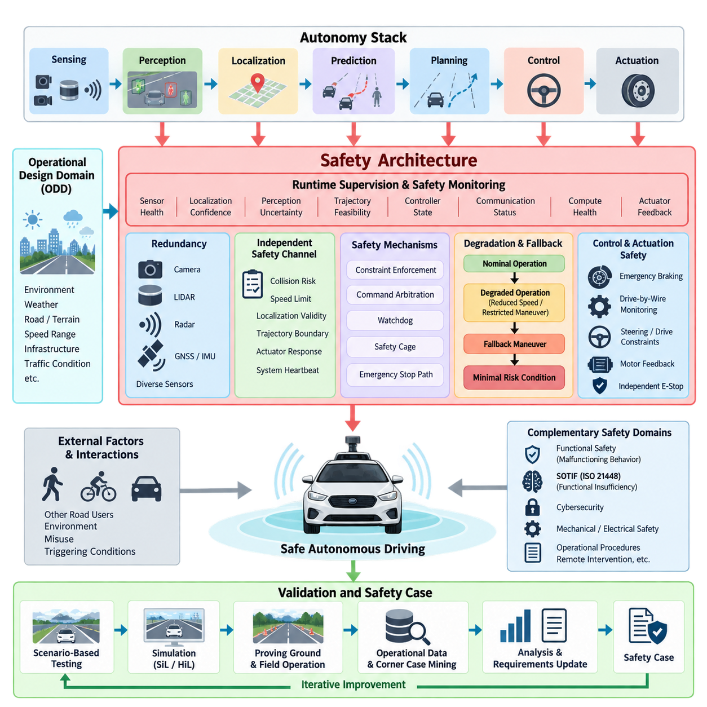
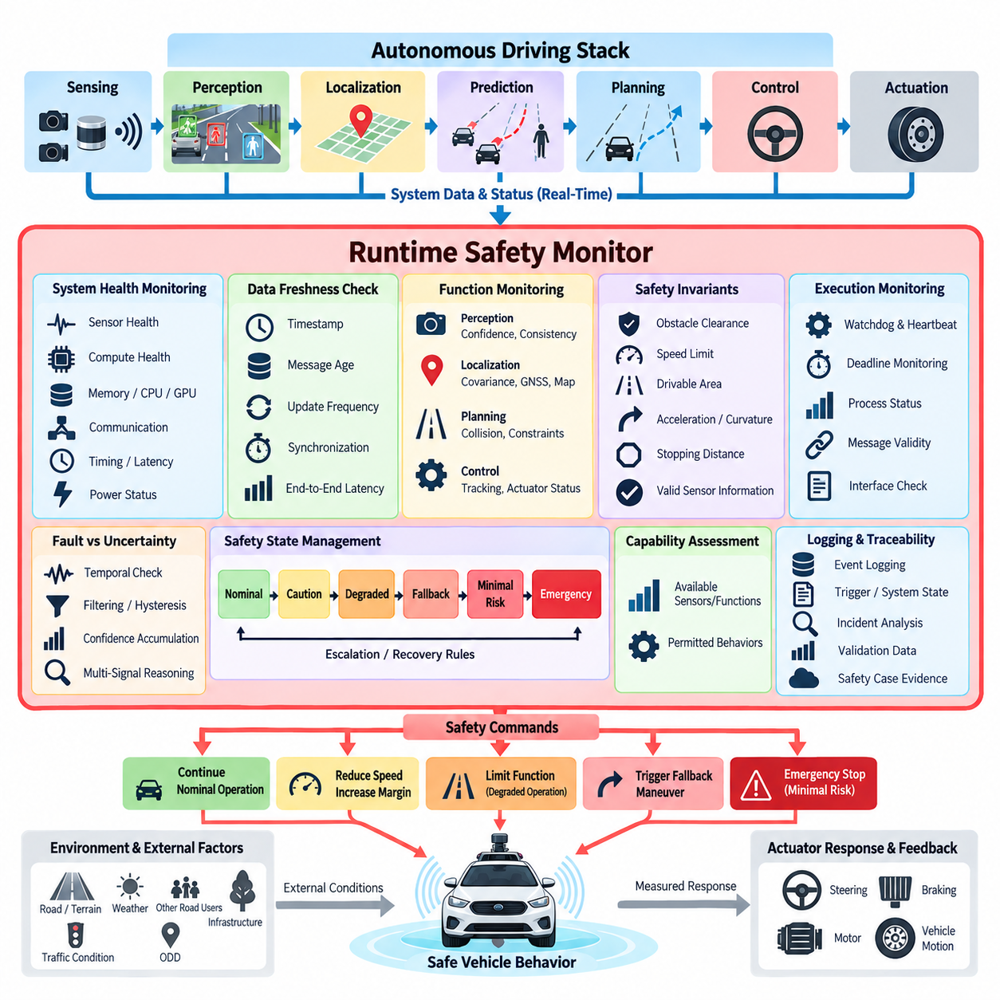
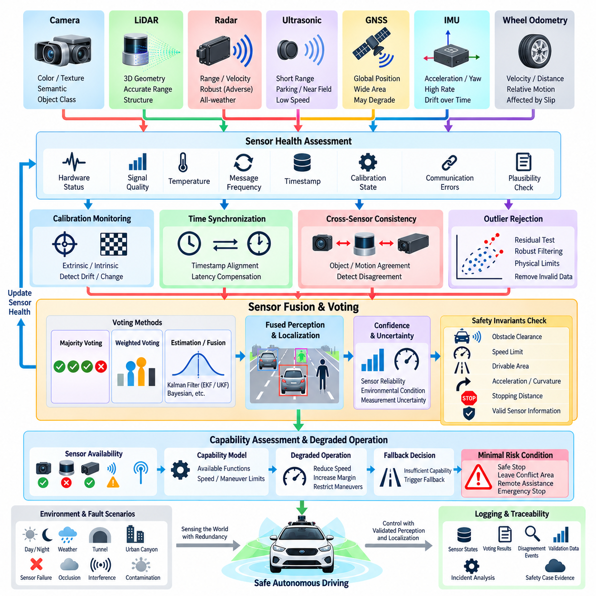
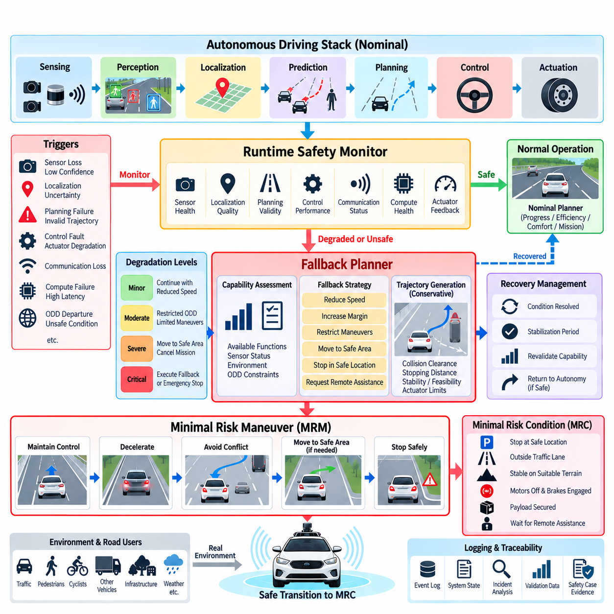
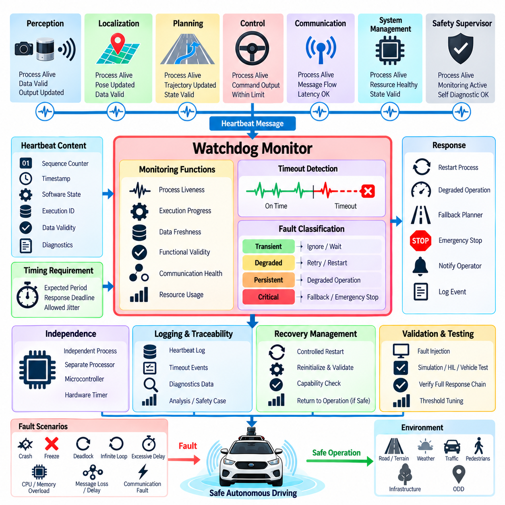
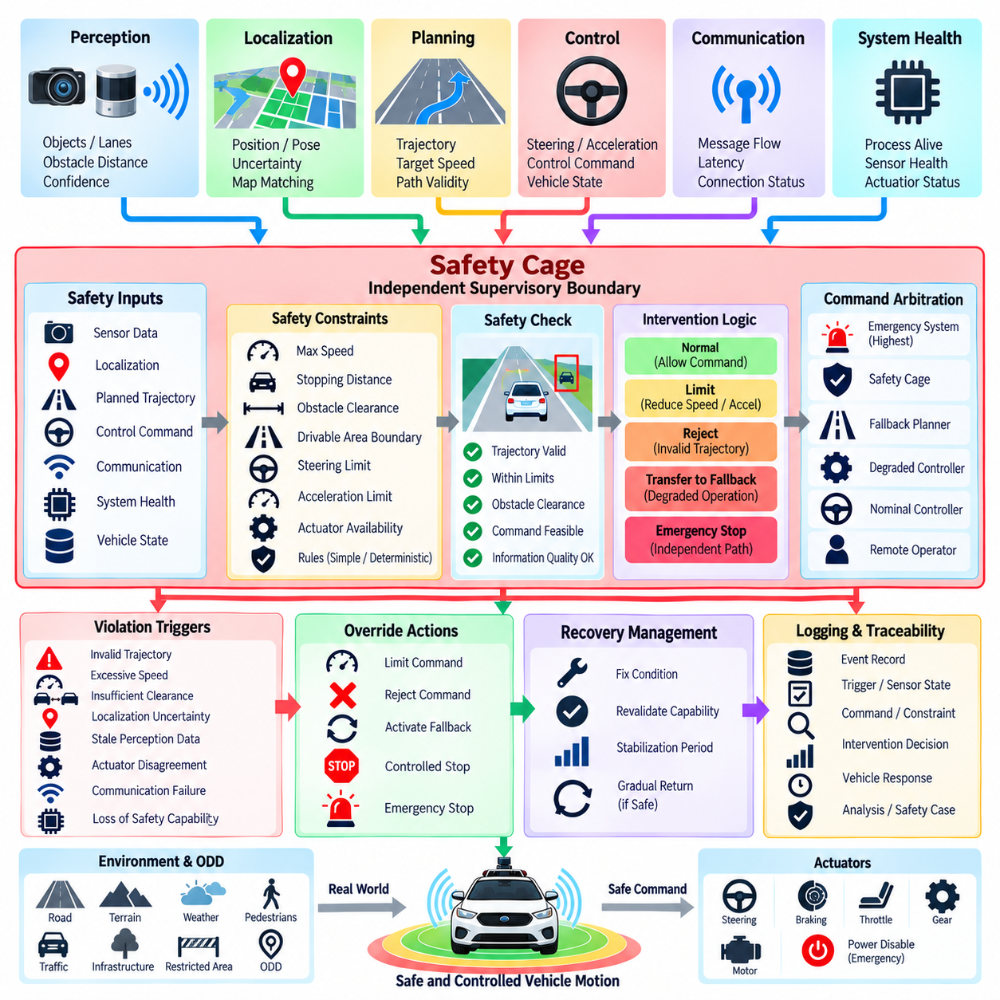
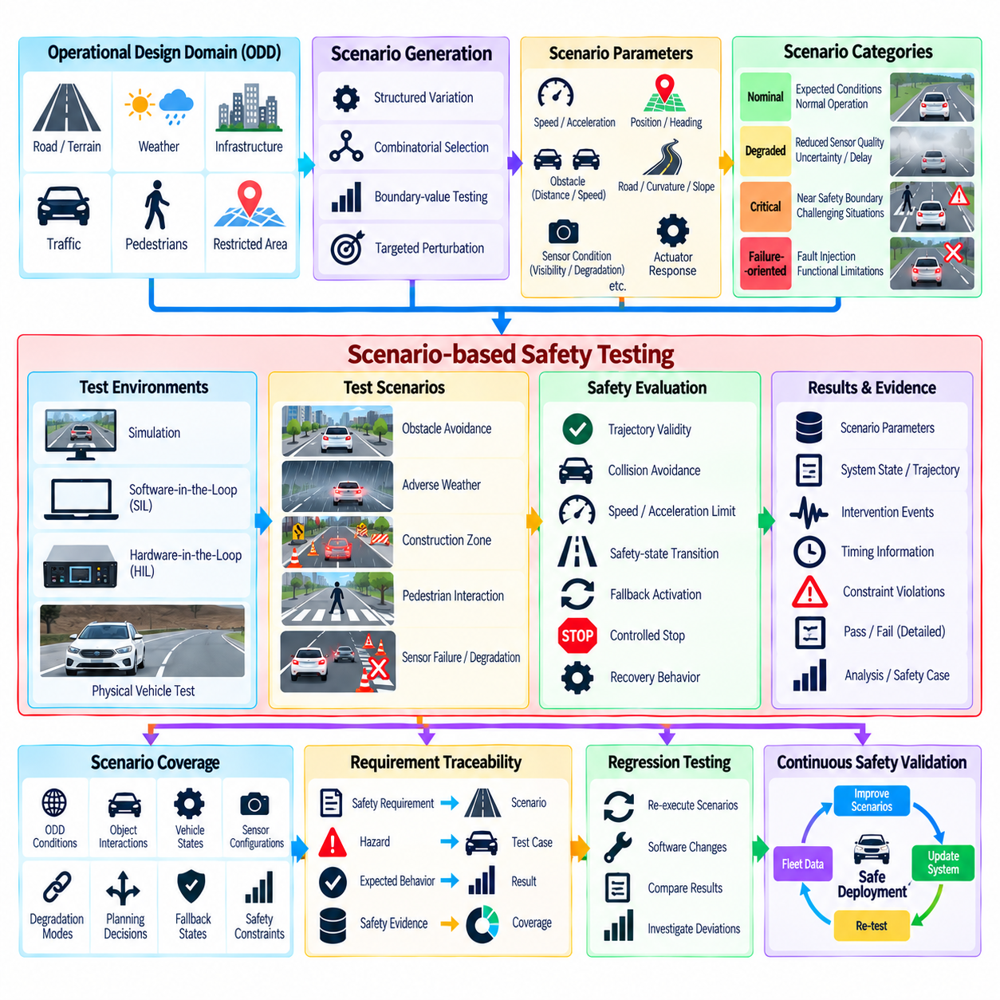
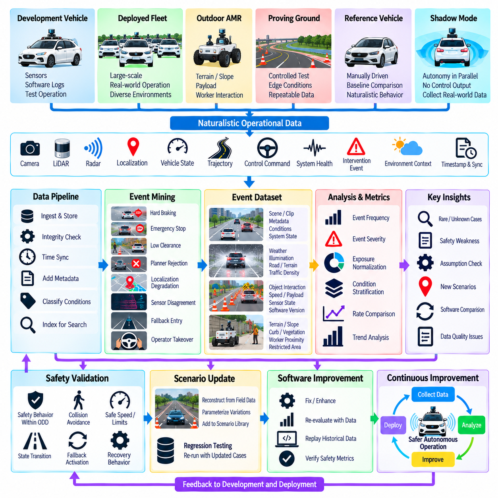
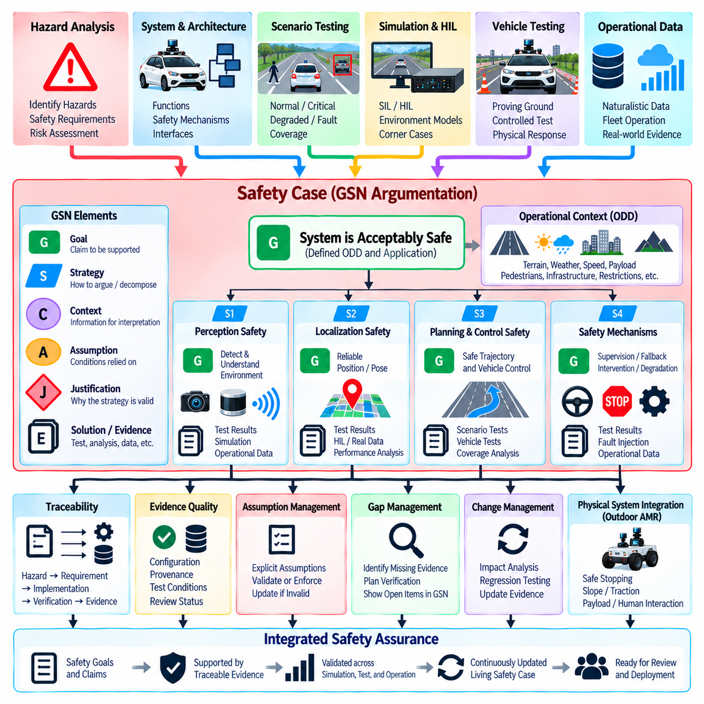
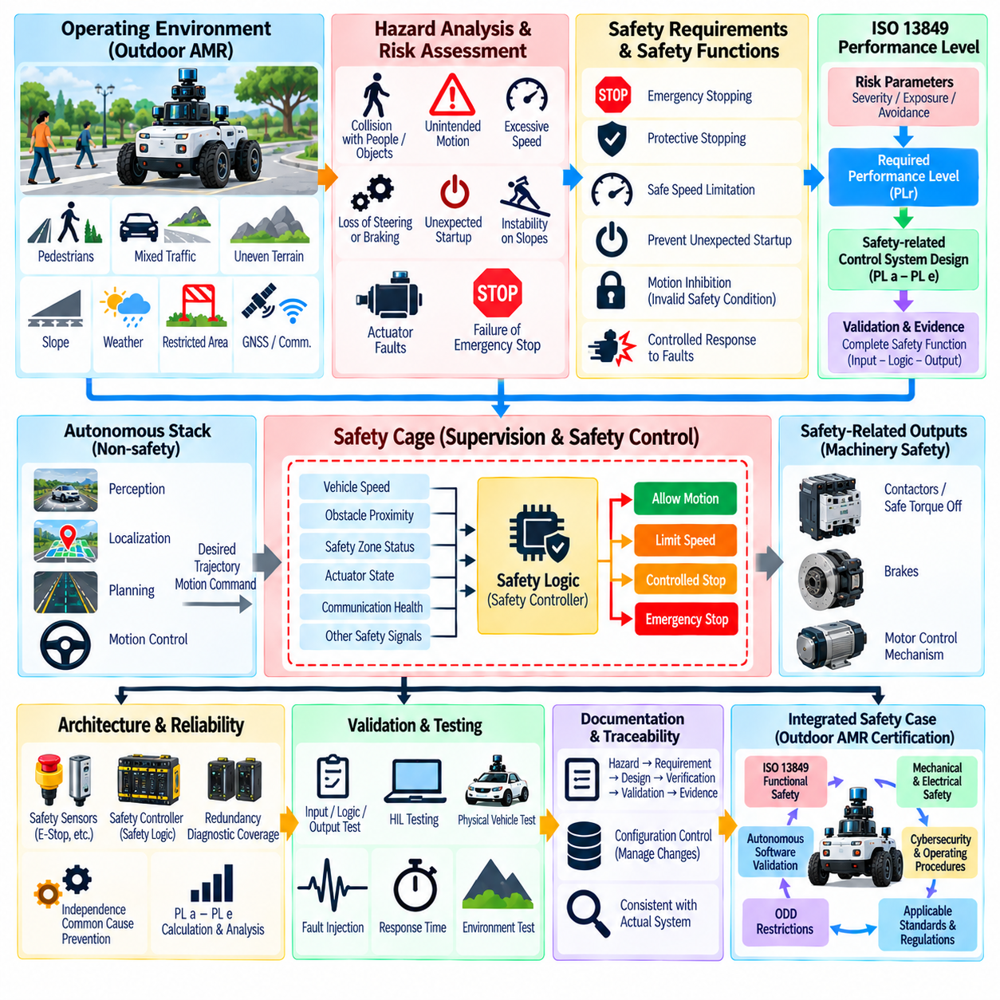

**Volume 12. Autonomous Driving Software**


# Chapter 09. Safety and Redundancy

##  

## 09.01. AV Safety Architecture SOTIF ISO 21448 Overview

{width="7.268055555555556in" height="7.268055555555556in"}

Autonomous vehicle safety architecture must be designed as a system property rather than as an isolated emergency function. Perception, localization, prediction, planning, control, communication, computing, and actuation all contribute to the safety state of the vehicle. The architecture therefore combines preventive mechanisms, runtime supervision, redundancy, degradation strategies, and fallback behavior so that faults or performance limitations do not immediately become hazardous vehicle behavior.

The structure of this volume places safety after perception, behavior planning, trajectory generation, and control integration, allowing safety mechanisms to supervise the complete autonomy chain. It then develops runtime monitoring, sensor redundancy, fallback planning, watchdogs, safety cages, scenario testing, data-driven validation, and safety cases as dedicated topics. This reflects an architectural principle: safety must observe and constrain decisions across subsystem boundaries.

A useful distinction exists between functional safety and the Safety of the Intended Functionality, or SOTIF. Functional safety addresses unreasonable risk caused by malfunctioning behavior of electrical and electronic systems, while SOTIF addresses hazards that can arise even when components operate according to their specifications. An autonomous system may therefore contain no conventional hardware fault and still make an unsafe decision because sensing, interpretation, prediction, or decision logic is insufficient for a particular situation.

ISO 21448 provides the SOTIF framework for identifying and reducing risks associated with such functional insufficiencies. This is particularly important for automated driving functions that depend heavily on complex sensors and algorithms. A camera may be electrically healthy but unable to provide adequate information under glare, fog, darkness, or unusual visual conditions. Similarly, an object detector may execute correctly while producing an incorrect semantic interpretation outside the conditions represented sufficiently during development.

SOTIF consequently shifts part of the safety question from "Did a component fail?" to "Can the intended function remain sufficiently safe under the conditions it encounters?" The analysis considers limitations of sensing and algorithms, reasonably foreseeable misuse, environmental conditions, interaction with other road users, and triggering conditions that expose performance weaknesses. This perspective is essential for autonomy because many hazardous behaviors originate from uncertainty rather than from an easily detectable component failure.

The Operational Design Domain, or ODD, becomes a fundamental safety boundary. It specifies the conditions in which the autonomous function is intended to operate, including road or terrain characteristics, speed ranges, weather, illumination, infrastructure, traffic conditions, and other environmental constraints. The volume establishes ODD definition as an early autonomous-driving topic and separately introduces fail-safe and fail-operational principles, creating the conceptual foundation for later safety architecture.

A safety architecture should continuously determine whether the assumptions supporting autonomous operation remain valid. Sensor health, localization confidence, perception uncertainty, trajectory feasibility, controller state, communication status, compute health, and actuator feedback can all become inputs to runtime supervision. Instead of treating these signals independently, the supervisor evaluates whether the overall system remains inside an acceptable operating envelope and selects an appropriate response when confidence or capability deteriorates.

Redundancy provides another architectural layer, but redundancy should not be interpreted simply as duplication. Multiple sensors using different physical principles can reduce common failure modes: cameras provide rich appearance information, LiDAR supplies geometric measurements, radar can contribute range and relative velocity, and GNSS, IMU, and localization algorithms provide complementary pose information. Diverse redundancy becomes especially valuable when environmental conditions degrade one sensing modality without producing an explicit hardware fault.

Safety mechanisms also require independence from the functions they supervise. A runtime safety monitor should not depend entirely on the same assumptions, algorithms, data paths, or computational resources as the primary autonomy stack. Architectural separation can allow a simpler safety channel to check critical constraints such as collision risk, speed limits, localization validity, trajectory boundaries, actuator response, and system heartbeat. If the nominal autonomy function violates these constraints, the safety layer can restrict or override its command.

The response to degradation should be proportional to available capability and risk. Some faults permit continued operation at reduced speed, restricted maneuverability, or increased safety margins. More serious conditions can require cancellation of the current trajectory and transition toward a fallback maneuver or Minimal Risk Condition. This produces a progression from nominal operation through degraded operation to controlled fallback instead of relying on a binary distinction between fully autonomous operation and immediate shutdown.

For an outdoor AMR, the Minimal Risk Condition may differ substantially from that of an on-road passenger vehicle. Stopping can often be appropriate, but it is not universally safe: an AMR operating on a slope, crossing an access road, occupying an intersection, or carrying a hazardous payload may require a controlled maneuver before stopping. The fallback strategy therefore needs awareness of vehicle dynamics, terrain, surrounding agents, available stopping space, communications, and the specific ODD.

Safety must also extend downward into control and actuation. Emergency braking, command arbitration, drive-by-wire monitoring, steering or differential-drive constraints, motor-controller feedback, and independent emergency-stop paths form the final protective layers between software decisions and physical motion. The preceding control chapter explicitly includes drive-by-wire interfaces and emergency brake and override logic, providing direct interfaces between nominal control and the safety architecture developed here.

The safety architecture is complemented by systematic verification and validation. Scenario-based testing explores combinations of environment, actors, vehicle state, sensor conditions, and triggering events that may expose unsafe behavior. Simulation enables large-scale exploration, while software-in-the-loop, hardware-in-the-loop, proving-ground tests, and field operation progressively introduce physical realism. Operational data can then reveal rare combinations that were not adequately represented during initial development.

A central SOTIF challenge is the transition from unknown unsafe scenarios toward known and controlled scenarios. Developers begin with identified limitations and known hazardous situations, but testing and operational evidence are used to discover previously unknown triggering conditions. These discoveries feed back into requirements, ODD restrictions, perception models, planning policies, monitoring logic, datasets, and validation scenarios, making safety engineering an iterative process rather than a one-time certification activity.

Evidence produced throughout this process should be organized into a safety case linking claims, arguments, requirements, analyses, tests, and operational evidence. The chapter structure therefore progresses from runtime mechanisms and redundancy through scenario and data-driven validation to safety-case development. The objective is not merely to demonstrate that individual components passed tests, but to establish traceable evidence that architectural safety claims are supported.

SOTIF should also be understood as complementary to, rather than a replacement for, other safety disciplines. Functional safety addresses malfunctioning behavior, SOTIF addresses insufficiencies of intended functionality, and cybersecurity engineering addresses threats that can compromise trusted operation. Mechanical safety, electrical protection, operational procedures, remote intervention, and application-specific machinery requirements may add further layers. A production autonomy system therefore requires a coordinated safety framework rather than dependence on a single standard.

For Physical AI and increasingly learning-based autonomy, this architectural approach becomes even more important. Learned perception and decision components can exhibit uncertainty, distribution shift, and unexpected behavior that cannot always be represented by deterministic fault models. Safety supervision must therefore combine conventional diagnostics with confidence monitoring, plausibility checks, independent constraints, ODD monitoring, fallback policies, and continuous collection of safety-relevant operational evidence.

The broader volume deliberately separates this architectural overview from the later chapter devoted specifically to SOTIF and safety validation. That later structure expands into intended behavior, hazard analysis, scenario-based testing, discovery of unknown unsafe scenarios, fleet-data corner-case mining, simulation coverage, statistical validation, documentation, and continuous production monitoring. The present safety architecture provides the system foundation on which those validation activities operate.

Ultimately, an AV safety architecture should create multiple opportunities to prevent a hazardous outcome. Reliable nominal autonomy is the first layer; uncertainty detection, redundancy, runtime supervision, constraint enforcement, degraded operation, fallback planning, and independent intervention provide successive defenses. SOTIF adds the critical recognition that correct execution does not guarantee safe behavior, making continuous analysis of functional limitations and real operating conditions indispensable for autonomous vehicles and outdoor AMRs.

자율주행차(Autonomous Vehicle)의 안전 아키텍처(Safety Architecture)는 단순히 독립된 비상 기능(Emergency Function)으로 설계되는 것이 아니라 시스템 전체의 속성(System Property)으로 설계되어야 한다. 인지(Perception), 위치추정(Localization), 예측(Prediction), 계획(Planning), 제어(Control), 통신(Communication), 컴퓨팅(Computing), 구동(Actuation)은 모두 차량의 안전 상태(Safety State)에 영향을 미친다. 따라서 안전 아키텍처는 결함이나 성능 한계가 즉시 위험한 차량 거동으로 이어지지 않도록 예방 메커니즘(Preventive Mechanism), 런타임 감독(Runtime Supervision), 이중화(Redundancy), 성능 저하 전략(Degradation Strategy), 폴백 동작(Fallback Behavior)을 결합한다.

이 볼륨(Volume)의 구조에서는 인지(Perception), 행동 계획(Behavior Planning), 궤적 생성(Trajectory Generation), 제어 통합(Control Integration) 이후에 안전(Safety)을 배치하여 안전 메커니즘이 전체 자율주행 체인(Autonomy Chain)을 감독할 수 있도록 구성한다. 이후 런타임 모니터링(Runtime Monitoring), 센서 이중화(Sensor Redundancy), 폴백 계획(Fallback Planning), 워치독(Watchdog), 세이프티 케이지(Safety Cage), 시나리오 시험(Scenario Testing), 데이터 기반 검증(Data-Driven Validation), 안전 사례(Safety Case)를 각각 독립된 주제로 확장한다. 이는 안전이 서브시스템(Subsystem)의 경계를 넘어 의사결정을 관찰하고 제한해야 한다는 아키텍처 원칙(Architectural Principle)을 반영한다.

기능 안전(Functional Safety)과 의도된 기능의 안전성(Safety of the Intended Functionality, SOTIF)은 명확하게 구분할 필요가 있다. 기능 안전은 전기·전자 시스템(Electrical and Electronic System)의 오작동 거동(Malfunctioning Behavior)으로 발생하는 불합리한 위험(Unreasonable Risk)을 다루는 반면, SOTIF는 구성요소가 사양에 따라 정상적으로 작동하는 상황에서도 발생할 수 있는 위험을 다룬다. 따라서 자율 시스템(Autonomous System)은 전통적인 하드웨어 결함(Hardware Fault)이 전혀 없더라도 특정 상황에서 센싱(Sensing), 해석(Interpretation), 예측(Prediction), 의사결정 로직(Decision Logic)이 충분하지 않으면 안전하지 않은 결정을 내릴 수 있다.

ISO 21448은 이러한 기능적 불충분성(Functional Insufficiency)과 관련된 위험을 식별하고 감소시키기 위한 SOTIF 프레임워크(SOTIF Framework)를 제공한다. 이는 복잡한 센서와 알고리즘에 크게 의존하는 자동주행 기능(Automated Driving Function)에서 특히 중요하다. 카메라는 전기적으로 정상 상태일 수 있지만 눈부심(Glare), 안개(Fog), 어둠(Darkness), 비정상적인 시각 조건에서 충분한 정보를 제공하지 못할 수 있다. 마찬가지로 객체 검출기(Object Detector)는 정상적으로 실행되더라도 개발 과정에서 충분히 표현되지 않은 조건에서는 잘못된 의미론적 해석(Semantic Interpretation)을 생성할 수 있다.

따라서 SOTIF는 안전에 관한 질문의 일부를 "구성요소가 고장 났는가?"에서 "의도된 기능(Intended Function)이 실제로 직면하는 조건에서 충분한 안전성을 유지할 수 있는가?"로 전환한다. 분석 과정에서는 센싱 및 알고리즘의 한계, 합리적으로 예측 가능한 오사용(Reasonably Foreseeable Misuse), 환경 조건(Environmental Conditions), 다른 도로 이용자와의 상호작용(Interaction), 성능 취약성을 노출하는 트리거 조건(Triggering Conditions)을 고려한다. 이러한 관점은 많은 위험 행동이 명확하게 검출 가능한 부품 고장보다 불확실성(Uncertainty)에서 발생하는 자율 시스템에 필수적이다.

운행 설계 영역(Operational Design Domain, ODD)은 핵심적인 안전 경계(Safety Boundary)가 된다. ODD는 자율 기능이 운용되도록 설계된 조건을 정의하며, 도로 또는 지형 특성, 속도 범위, 날씨, 조명, 인프라, 교통 조건과 기타 환경적 제약을 포함한다. 이 볼륨에서는 자율주행의 초기 주제로 ODD 정의(ODD Definition)를 설정하고, 페일 세이프(Fail-Safe) 및 페일 오퍼레이셔널(Fail-Operational) 원칙을 별도로 도입하여 이후의 안전 아키텍처를 위한 개념적 기반(Conceptual Foundation)을 구성한다.

안전 아키텍처는 자율 운행을 뒷받침하는 가정(Assumption)이 계속 유효한지를 지속적으로 판단해야 한다. 센서 상태(Sensor Health), 위치추정 신뢰도(Localization Confidence), 인지 불확실성(Perception Uncertainty), 궤적 실행 가능성(Trajectory Feasibility), 제어기 상태(Controller State), 통신 상태(Communication Status), 컴퓨팅 상태(Compute Health), 액추에이터 피드백(Actuator Feedback)은 모두 런타임 감독(Runtime Supervision)의 입력이 될 수 있다. 감독 시스템은 이러한 신호를 독립적으로 처리하는 대신 전체 시스템이 허용 가능한 운용 범위(Operating Envelope) 안에 있는지를 평가하고, 신뢰도나 기능이 저하될 경우 적절한 대응을 선택한다.

이중화(Redundancy)는 또 하나의 아키텍처 계층(Architectural Layer)을 제공하지만, 이중화를 단순한 복제(Duplication)로 이해해서는 안 된다. 서로 다른 물리 원리를 사용하는 여러 센서는 공통 고장 모드(Common Failure Mode)를 줄일 수 있다. 카메라는 풍부한 외관 정보를 제공하고, 라이다(LiDAR)는 기하학적 측정값을 제공하며, 레이더(Radar)는 거리와 상대 속도 정보를 제공할 수 있다. 또한 위성항법시스템(GNSS), 관성측정장치(IMU), 위치추정 알고리즘(Localization Algorithm)은 상호보완적인 자세 및 위치 정보(Pose Information)를 제공한다. 다양한 방식의 이중화(Diverse Redundancy)는 환경 조건이 명시적인 하드웨어 고장을 발생시키지 않으면서 특정 센싱 모달리티(Sensing Modality)의 성능을 저하시킬 때 특히 중요하다.

안전 메커니즘(Safety Mechanism)은 자신이 감독하는 기능으로부터 일정 수준의 독립성(Independence)도 확보해야 한다. 런타임 안전 모니터(Runtime Safety Monitor)는 주 자율주행 스택(Primary Autonomy Stack)과 동일한 가정, 알고리즘, 데이터 경로 또는 컴퓨팅 자원에 전적으로 의존해서는 안 된다. 아키텍처 분리(Architectural Separation)를 통해 보다 단순한 안전 채널(Safety Channel)이 충돌 위험(Collision Risk), 속도 제한(Speed Limit), 위치추정 유효성(Localization Validity), 궤적 경계(Trajectory Boundary), 액추에이터 응답(Actuator Response), 시스템 하트비트(System Heartbeat)와 같은 핵심 제약을 확인하도록 구성할 수 있다. 정상 자율 기능(Nominal Autonomy Function)이 이러한 제약을 위반하면 안전 계층(Safety Layer)이 해당 명령을 제한하거나 오버라이드(Override)할 수 있다.

성능 저하(Degradation)에 대한 대응은 사용 가능한 기능 수준과 위험도에 비례해야 한다. 일부 결함에서는 속도를 낮추거나, 기동 범위를 제한하거나, 안전 여유(Safety Margin)를 확대하면서 운행을 계속할 수 있다. 보다 심각한 상황에서는 현재 궤적을 취소하고 폴백 기동(Fallback Maneuver) 또는 최소 위험 상태(Minimal Risk Condition, MRC)로 전환해야 할 수 있다. 이러한 접근은 완전한 자율 운행과 즉각적인 시스템 정지라는 이분법적 구분에 의존하는 대신 정상 운행(Nominal Operation)에서 성능 저하 운행(Degraded Operation), 제어된 폴백(Controlled Fallback)으로 이어지는 단계적 전환을 형성한다.

야외 자율이동로봇(Outdoor Autonomous Mobile Robot, Outdoor AMR)의 최소 위험 상태(MRC)는 일반 도로용 승용차의 최소 위험 상태와 상당히 다를 수 있다. 정지는 많은 상황에서 적절하지만 항상 안전한 것은 아니다. 경사로에서 운행하거나, 진입로를 횡단하거나, 교차 구역을 점유하거나, 위험한 페이로드(Hazardous Payload)를 운반하는 AMR은 정지하기 전에 제어된 기동(Controlled Maneuver)이 필요할 수 있다. 따라서 폴백 전략(Fallback Strategy)은 차량 동역학(Vehicle Dynamics), 지형(Terrain), 주변 이동체(Surrounding Agents), 사용 가능한 정지 공간(Stopping Space), 통신 상태, 구체적인 ODD를 고려해야 한다.

안전은 하위 계층인 제어(Control)와 구동(Actuation)까지 확장되어야 한다. 비상 제동(Emergency Braking), 명령 중재(Command Arbitration), 드라이브 바이 와이어 모니터링(Drive-by-Wire Monitoring), 조향 또는 차동구동 제약(Steering or Differential-Drive Constraints), 모터 제어기 피드백(Motor-Controller Feedback), 독립적인 비상 정지 경로(Independent Emergency-Stop Path)는 소프트웨어 의사결정과 실제 물리적 움직임 사이의 최종 보호 계층을 형성한다. 앞선 제어 장에서는 드라이브 바이 와이어 인터페이스(Drive-by-Wire Interface)와 비상 제동 및 오버라이드 로직(Emergency Brake and Override Logic)을 다루며, 정상 제어와 여기서 설명하는 안전 아키텍처 사이의 직접적인 인터페이스를 제공한다.

안전 아키텍처는 체계적인 검증 및 유효성 확인(Verification and Validation)으로 보완되어야 한다. 시나리오 기반 시험(Scenario-Based Testing)은 환경, 주변 객체, 차량 상태, 센서 조건, 트리거 이벤트의 다양한 조합을 탐색하여 안전하지 않은 거동을 노출할 가능성이 있는 조건을 찾아낸다. 시뮬레이션(Simulation)은 대규모 탐색을 가능하게 하며, 소프트웨어 인 더 루프(Software-in-the-Loop), 하드웨어 인 더 루프(Hardware-in-the-Loop), 시험장 테스트(Proving-Ground Test), 필드 운용(Field Operation)은 단계적으로 물리적 현실성을 높인다. 이후 실제 운용 데이터(Operational Data)를 이용하여 초기 개발 과정에서 충분히 표현되지 않았던 희귀한 조건 조합을 발견할 수 있다.

SOTIF의 핵심 과제 중 하나는 알려지지 않은 위험 시나리오(Unknown Unsafe Scenario)를 알려지고 통제 가능한 시나리오(Known and Controlled Scenario)로 전환하는 것이다. 개발자는 식별된 한계와 알려진 위험 상황에서 시작하지만, 시험과 운용 증거(Operational Evidence)를 이용하여 이전에 알려지지 않았던 트리거 조건을 발견한다. 이러한 발견은 요구사항(Requirements), ODD 제한(ODD Restrictions), 인지 모델(Perception Model), 계획 정책(Planning Policy), 모니터링 로직(Monitoring Logic), 데이터셋(Dataset), 검증 시나리오(Validation Scenario)로 다시 피드백된다. 이에 따라 안전 엔지니어링(Safety Engineering)은 일회성 인증 활동이 아니라 반복적 과정(Iterative Process)이 된다.

이 과정에서 생성되는 증거는 주장(Claim), 논증(Argument), 요구사항(Requirement), 분석(Analysis), 시험(Test), 운용 증거(Operational Evidence)를 연결하는 안전 사례(Safety Case)로 체계화되어야 한다. 따라서 이 장의 구조는 런타임 메커니즘(Runtime Mechanism)과 이중화에서 시작하여 시나리오 기반 및 데이터 기반 검증을 거쳐 안전 사례 개발(Safety Case Development)로 확장된다. 목표는 개별 구성요소가 시험을 통과했다는 사실만을 보여주는 것이 아니라, 아키텍처 수준의 안전 주장(Architectural Safety Claim)이 추적 가능한 증거(Traceable Evidence)에 의해 뒷받침되고 있음을 입증하는 것이다.

또한 SOTIF는 다른 안전 분야를 대체하는 것이 아니라 상호보완하는 개념으로 이해해야 한다. 기능 안전(Functional Safety)은 오작동 거동을 다루고, SOTIF는 의도된 기능의 불충분성(Insufficiency of Intended Functionality)을 다루며, 사이버보안 엔지니어링(Cybersecurity Engineering)은 신뢰할 수 있는 운용을 손상시킬 수 있는 위협을 다룬다. 여기에 기계 안전(Mechanical Safety), 전기 보호(Electrical Protection), 운용 절차(Operational Procedure), 원격 개입(Remote Intervention), 응용 분야별 기계 요구사항(Application-Specific Machinery Requirements)이 추가적인 계층으로 결합될 수 있다. 따라서 양산 수준의 자율 시스템은 단일 표준에 의존하는 것이 아니라 통합된 안전 프레임워크(Coordinated Safety Framework)를 필요로 한다.

피지컬 AI(Physical AI)와 점차 확대되는 학습 기반 자율 시스템(Learning-Based Autonomy)에서는 이러한 아키텍처 접근이 더욱 중요해진다. 학습 기반 인지 및 의사결정 구성요소는 기존의 결정론적 결함 모델(Deterministic Fault Model)만으로 항상 표현하기 어려운 불확실성(Uncertainty), 분포 이동(Distribution Shift), 예상하지 못한 거동(Unexpected Behavior)을 나타낼 수 있다. 따라서 안전 감독(Safety Supervision)은 기존 진단 기능과 함께 신뢰도 모니터링(Confidence Monitoring), 개연성 검사(Plausibility Check), 독립적 제약(Independent Constraints), ODD 모니터링, 폴백 정책(Fallback Policy), 안전 관련 운용 증거의 지속적인 수집을 결합해야 한다.

이 볼륨의 전체 구조에서는 이러한 아키텍처 개요와 이후에 다루는 SOTIF 및 안전 검증(Safety Validation) 장을 의도적으로 분리한다. 이후 장에서는 의도된 거동(Intended Behavior), 위험 분석(Hazard Analysis), 시나리오 기반 시험, 알려지지 않은 위험 시나리오의 발견, 플릿 데이터(Fleet Data)를 이용한 코너 케이스 마이닝(Corner-Case Mining), 시뮬레이션 커버리지(Simulation Coverage), 통계적 검증(Statistical Validation), 문서화(Documentation), 실제 운용 환경의 지속적 모니터링(Continuous Production Monitoring)을 더욱 상세하게 다룬다. 현재의 안전 아키텍처는 이러한 검증 활동이 수행될 수 있는 시스템 기반(System Foundation)을 제공한다.

궁극적으로 자율주행차 안전 아키텍처(AV Safety Architecture)는 위험한 결과가 발생하기 전에 이를 방지할 수 있는 여러 단계의 기회를 제공해야 한다. 신뢰할 수 있는 정상 자율 기능(Reliable Nominal Autonomy)이 첫 번째 계층이며, 불확실성 검출(Uncertainty Detection), 이중화, 런타임 감독, 제약 강제(Constraint Enforcement), 성능 저하 운행, 폴백 계획, 독립적 개입(Independent Intervention)이 연속적인 방어 계층을 형성한다. SOTIF는 기능이 정확하게 실행된다는 사실만으로 안전한 거동이 보장되는 것은 아니라는 중요한 관점을 추가하며, 기능적 한계와 실제 운용 조건에 대한 지속적인 분석을 자율주행차와 야외 AMR의 필수적인 안전 활동으로 만든다.

##  

## 09.02. Runtime Safety Monitor Design for AV SW [w/Code]

{width="7.268055555555556in" height="7.268055555555556in"}

Runtime safety monitoring is a supervisory capability that observes an autonomous vehicle software stack while the vehicle is operating and determines whether its behavior remains within predefined safety constraints. Unlike offline verification, a runtime monitor evaluates live system states, confidence values, timing behavior, and command outputs. Its purpose is to detect abnormal or unsafe conditions early enough for the system to restrict, degrade, override, or terminate autonomous operation.

The monitor should be architecturally separated from the nominal autonomy functions whenever practical. Perception, localization, prediction, planning, and control modules may contain complex algorithms whose internal failures are difficult to diagnose directly. A safety monitor therefore focuses on externally observable properties and safety invariants rather than reproducing the complete autonomy computation. This separation also reduces the possibility that one software defect disables both nominal operation and its safety supervision.

Runtime monitoring begins with systematic observation of system health. Sensor availability, message frequency, timestamps, processing latency, CPU and GPU utilization, memory status, network communication, controller heartbeat, actuator feedback, and power conditions can indicate whether the autonomy platform remains operational. Monitoring these signals establishes a basic health layer that can identify missing data, frozen processes, excessive latency, communication loss, or abnormal resource consumption before they propagate into vehicle motion.

Data freshness is particularly important in autonomous vehicle software. A perception result may be numerically valid but unsafe if it describes a scene observed hundreds of milliseconds earlier. Runtime monitors should therefore evaluate timestamps, message age, update frequency, synchronization error, and end-to-end latency. When information becomes stale, the monitor can invalidate the affected data or reduce the allowable operating capability instead of allowing downstream modules to treat outdated information as current.

Perception monitoring evaluates whether environmental understanding remains sufficiently reliable for continued operation. The monitor can observe detection confidence, object consistency, free-space availability, sensor agreement, tracking stability, and uncertainty estimates. It does not necessarily determine the correct interpretation of every object. Instead, it detects conditions in which the perception system lacks enough reliable evidence to support safe planning, such as severe sensor degradation or persistent disagreement among sensing modalities.

Localization requires similar supervision because an apparently plausible pose can still be dangerously inaccurate. Runtime checks can compare localization confidence, covariance, GNSS quality, IMU consistency, map matching, wheel odometry, and independent localization sources. Sudden pose jumps, excessive covariance, inconsistent velocity estimates, or divergence between redundant sources can trigger degraded operation. The safety response should depend on how much positioning capability remains and on the requirements of the current Operational Design Domain.

Planning monitors examine whether proposed trajectories satisfy explicit safety constraints before they reach the controller. Typical checks include collision clearance, drivable-area boundaries, speed limits, acceleration and deceleration limits, curvature, stopping distance, predicted time to collision, and trajectory continuity. This creates an independent verification boundary between complex planning algorithms and physical vehicle motion. A trajectory that violates a critical invariant can be rejected even if the planner itself reports successful computation.

Control monitoring extends supervision from planned motion to actual vehicle response. Steering commands, wheel speeds, acceleration, braking, yaw rate, motor current, actuator status, and measured vehicle motion can be compared against expected behavior. A persistent difference between commanded and measured states may indicate actuator degradation, traction loss, mechanical problems, communication errors, or controller instability. The monitor can then limit commands or initiate an appropriate fallback before tracking errors become hazardous.

A runtime safety monitor should distinguish faults from temporary uncertainty whenever possible. A short-lived confidence reduction caused by a shadow, packet delay, or momentary wheel slip should not necessarily produce an emergency stop. Persistence timers, hysteresis, filtering, confidence accumulation, and multi-signal reasoning can prevent excessive intervention. At the same time, critical conditions such as imminent collision or loss of braking capability may require immediate action without waiting for temporal confirmation.

Safety rules can be represented as invariants defining conditions that must remain true during operation. Examples include maintaining minimum obstacle clearance, keeping commanded speed below the context-dependent limit, preventing trajectories outside the permitted operating region, and ensuring that required sensor information remains sufficiently fresh. Such invariants provide a simpler and more auditable supervision mechanism than attempting to verify every internal decision made by an increasingly complex autonomous driving stack.

Monitoring outputs should be converted into explicit safety states rather than isolated warning messages. A practical state model may include nominal, caution, degraded, fallback, minimal-risk, and emergency states. Each transition can be associated with entry conditions, persistence requirements, permitted vehicle capabilities, recovery conditions, and escalation rules. This approach prevents individual modules from independently selecting incompatible safety responses and provides a coherent system-level interpretation of detected abnormalities.

Degraded operation is useful when sufficient capability remains for controlled motion. Loss of one camera, temporary GNSS degradation, reduced perception range, or elevated localization uncertainty may justify reduced speed and larger safety margins rather than immediate shutdown. The runtime monitor therefore needs a capability model that relates available sensors and software functions to permitted behaviors. Safety becomes a controlled adjustment of operating authority according to remaining system capability.

When the remaining capability is insufficient, the monitor should request or enforce a fallback maneuver leading toward a Minimal Risk Condition. The response may include slowing down, stopping in a safe region, leaving a conflict area, requesting remote assistance, or activating an independent emergency stop. For outdoor AMRs, the correct response depends strongly on terrain, traffic interaction, payload, stopping distance, communication availability, and whether stopping at the current location would itself introduce additional risk.

The safety monitor must also supervise software execution timing because correct algorithms can become unsafe when deadlines are missed. Watchdogs and heartbeat mechanisms can detect crashed, blocked, or unresponsive processes, while deadline monitors identify excessive execution time. End-to-end timing supervision can verify that sensing, perception, planning, and control complete within the latency budget required for the current speed. Repeated deadline violations can therefore trigger speed reduction or transition to fallback operation.

Communication between the monitor and nominal autonomy stack should use clearly defined interfaces. Safety-relevant messages need explicit timestamps, validity indicators, confidence information, source identification, and state semantics. The monitor should avoid depending on undocumented internal variables whose meaning changes with software revisions. Stable safety interfaces make it easier to modify perception or planning algorithms while preserving the supervisory architecture and its verification evidence.

Implementation should minimize the complexity of the safety monitor itself. A monitor containing equally complex AI models, planning algorithms, and dependencies can reproduce the same failure modes as the primary system and become difficult to validate. Whenever possible, critical checks should use deterministic logic, bounded computations, geometric constraints, threshold tests, state machines, and independently derived signals. More sophisticated monitors can be added where necessary, but their additional complexity must provide measurable safety value.

Logging and traceability are essential because runtime monitoring also generates evidence for safety engineering. Every intervention should record the triggering signals, system state, relevant sensor status, monitor decision, commanded response, and subsequent recovery or escalation. These records support incident analysis, scenario reconstruction, threshold tuning, corner-case mining, regression testing, and safety-case development. Fleet operation can therefore transform runtime monitoring events into a continuous source of validation data.

The runtime safety monitor ultimately acts as a boundary between autonomy intelligence and permitted physical behavior. It does not replace reliable perception, planning, control, functional safety, or SOTIF engineering. Instead, it provides an independent operational layer that continuously asks whether the information, decisions, timing, and vehicle responses remain acceptable. By combining health supervision, safety invariants, capability assessment, controlled degradation, fallback, and traceable intervention, autonomous vehicle software can fail more predictably and safely.

런타임 안전 모니터링(Runtime Safety Monitoring)은 자율주행차가 운행되는 동안 자율주행 소프트웨어 스택(Autonomous Vehicle Software Stack)을 관찰하고, 시스템의 동작이 사전에 정의된 안전 제약(Safety Constraints) 내에 유지되는지를 판단하는 감독 기능(Supervisory Capability)이다. 오프라인 검증(Offline Verification)과 달리 런타임 모니터(Runtime Monitor)는 실시간 시스템 상태, 신뢰도 값, 타이밍 동작(Timing Behavior), 명령 출력을 평가한다. 목적은 비정상 또는 위험한 상태를 조기에 감지하여 시스템이 자율 운행을 제한, 성능 저하, 오버라이드(Override) 또는 종료할 수 있도록 하는 것이다.

런타임 안전 모니터는 가능한 경우 정상 자율주행 기능(Nominal Autonomy Functions)과 아키텍처적으로 분리되어야 한다. 인지(Perception), 위치추정(Localization), 예측(Prediction), 계획(Planning), 제어(Control) 모듈은 내부 결함을 직접 진단하기 어려운 복잡한 알고리즘을 포함할 수 있다. 따라서 안전 모니터는 전체 자율주행 연산을 복제하기보다 외부에서 관찰 가능한 속성(Externally Observable Properties)과 안전 불변조건(Safety Invariants)에 집중한다. 이러한 분리는 하나의 소프트웨어 결함이 정상 운행과 안전 감독을 동시에 무력화할 가능성도 줄여준다.

런타임 모니터링은 시스템 상태(System Health)에 대한 체계적인 관찰에서 시작한다. 센서 가용성(Sensor Availability), 메시지 주기(Message Frequency), 타임스탬프(Timestamps), 처리 지연(Processing Latency), CPU 및 GPU 사용률, 메모리 상태, 네트워크 통신, 제어기 하트비트(Controller Heartbeat), 액추에이터 피드백(Actuator Feedback), 전원 상태는 자율주행 플랫폼이 정상적으로 동작하는지를 판단하는 지표가 될 수 있다. 이러한 신호를 모니터링하면 누락 데이터, 정지된 프로세스, 과도한 지연, 통신 손실, 비정상적인 자원 사용이 차량 움직임으로 전파되기 전에 식별할 수 있는 기본 상태 계층(Health Layer)을 구성할 수 있다.

데이터 최신성(Data Freshness)은 자율주행차 소프트웨어에서 특히 중요하다. 인지 결과 자체의 수치가 정상적이더라도 수백 밀리초 이전에 관측된 장면을 나타낸다면 안전하지 않을 수 있다. 따라서 런타임 모니터는 타임스탬프, 메시지 경과 시간(Message Age), 업데이트 주기(Update Frequency), 동기화 오차(Synchronization Error), 종단 간 지연(End-to-End Latency)을 평가해야 한다. 정보가 오래되면 하위 모듈이 과거 정보를 현재 정보로 처리하도록 허용하는 대신 해당 데이터를 무효화하거나 허용 가능한 운용 기능을 축소할 수 있다.

인지 모니터링(Perception Monitoring)은 주변 환경에 대한 이해가 지속적인 운행에 충분한 신뢰성을 유지하는지를 평가한다. 모니터는 검출 신뢰도(Detection Confidence), 객체 일관성(Object Consistency), 자유 공간 가용성(Free-Space Availability), 센서 간 일치성(Sensor Agreement), 추적 안정성(Tracking Stability), 불확실성 추정(Uncertainty Estimates)을 관찰할 수 있다. 모든 객체의 정확한 의미를 직접 판단할 필요는 없으며, 심각한 센서 성능 저하나 센싱 모달리티(Sensing Modality) 간 지속적인 불일치처럼 안전한 계획을 지원하기에 충분한 증거가 부족한 상태를 감지하는 것이 핵심이다.

위치추정(Localization) 역시 유사한 감독이 필요하다. 겉으로 타당해 보이는 위치 및 자세(Pose)도 실제로는 위험할 정도로 부정확할 수 있기 때문이다. 런타임 검사는 위치추정 신뢰도, 공분산(Covariance), GNSS 품질, 관성측정장치(IMU) 일관성, 지도 정합(Map Matching), 휠 오도메트리(Wheel Odometry), 독립적인 위치추정 소스를 비교할 수 있다. 갑작스러운 위치 점프, 과도한 공분산, 일관되지 않은 속도 추정, 이중화된 소스 사이의 발산은 성능 저하 운행(Degraded Operation)을 유발할 수 있다. 안전 대응은 남아 있는 위치추정 능력과 현재 운행 설계 영역(Operational Design Domain, ODD)의 요구사항에 따라 결정되어야 한다.

계획 모니터(Planning Monitor)는 생성된 궤적이 제어기(Controller)로 전달되기 전에 명시적인 안전 제약을 만족하는지 검사한다. 대표적인 검사 항목에는 충돌 여유 거리(Collision Clearance), 주행 가능 영역 경계(Drivable-Area Boundaries), 속도 제한, 가속 및 감속 제한, 곡률(Curvature), 정지 거리(Stopping Distance), 예상 충돌 시간(Time to Collision), 궤적 연속성(Trajectory Continuity)이 포함된다. 이를 통해 복잡한 계획 알고리즘과 실제 차량 움직임 사이에 독립적인 검증 경계(Independent Verification Boundary)를 형성할 수 있다. 계획기가 연산 성공을 보고하더라도 핵심 불변조건을 위반하는 궤적은 거부될 수 있다.

제어 모니터링(Control Monitoring)은 계획된 움직임에서 실제 차량 응답까지 감독 범위를 확장한다. 조향 명령(Steering Commands), 휠 속도(Wheel Speeds), 가속, 제동, 요 레이트(Yaw Rate), 모터 전류, 액추에이터 상태, 측정된 차량 움직임을 예상 동작과 비교할 수 있다. 명령 상태와 측정 상태 사이의 차이가 지속되면 액추에이터 성능 저하, 접지력 손실(Traction Loss), 기계적 문제, 통신 오류 또는 제어기 불안정성을 의미할 수 있다. 모니터는 추종 오차(Tracking Error)가 위험한 수준으로 증가하기 전에 명령을 제한하거나 적절한 폴백(Fallback)을 시작할 수 있다.

런타임 안전 모니터는 가능한 경우 실제 결함(Fault)과 일시적인 불확실성(Temporary Uncertainty)을 구분해야 한다. 그림자, 패킷 지연(Packet Delay), 순간적인 휠 슬립(Wheel Slip)으로 발생하는 짧은 신뢰도 저하가 반드시 비상 정지(Emergency Stop)를 유발할 필요는 없다. 지속 시간 타이머(Persistence Timer), 히스테리시스(Hysteresis), 필터링(Filtering), 신뢰도 누적(Confidence Accumulation), 다중 신호 추론(Multi-Signal Reasoning)을 사용하면 과도한 개입을 방지할 수 있다. 반면 임박한 충돌이나 제동 기능 상실과 같은 심각한 상황에서는 시간적 확인을 기다리지 않고 즉각적인 대응이 필요할 수 있다.

안전 규칙(Safety Rules)은 운행 중 반드시 참으로 유지되어야 하는 조건을 정의하는 불변조건(Invariants)으로 표현할 수 있다. 대표적인 예로 최소 장애물 여유 거리 유지, 명령 속도를 상황별 제한 속도 이하로 유지, 허용된 운행 영역 외부의 궤적 방지, 필수 센서 정보의 충분한 최신성 보장 등이 있다. 이러한 불변조건은 점점 복잡해지는 자율주행 스택 내부에서 수행되는 모든 의사결정을 직접 검증하려는 방식보다 단순하고 감사 가능한(Auditable) 감독 메커니즘을 제공한다.

모니터링 결과는 개별적인 경고 메시지로 처리하기보다 명확한 안전 상태(Safety States)로 변환해야 한다. 실용적인 상태 모델(State Model)은 정상(Nominal), 주의(Caution), 성능 저하(Degraded), 폴백(Fallback), 최소 위험(Minimal-Risk), 비상(Emergency) 상태를 포함할 수 있다. 각 상태 전이는 진입 조건(Entry Conditions), 지속 조건(Persistence Requirements), 허용되는 차량 기능(Permitted Vehicle Capabilities), 복구 조건(Recovery Conditions), 단계 상승 규칙(Escalation Rules)과 연결할 수 있다. 이를 통해 개별 모듈이 서로 충돌하는 안전 대응을 독립적으로 선택하는 것을 방지하고, 감지된 이상 상태에 대한 일관된 시스템 수준 해석을 제공할 수 있다.

성능 저하 운행(Degraded Operation)은 제어된 움직임을 수행할 수 있는 충분한 기능이 남아 있을 때 유용하다. 카메라 하나의 손실, 일시적인 GNSS 성능 저하, 인지 거리 감소, 위치추정 불확실성 증가는 즉각적인 시스템 종료보다 속도 감소와 안전 여유 확대를 요구할 수 있다. 따라서 런타임 모니터는 사용 가능한 센서 및 소프트웨어 기능을 허용되는 동작과 연결하는 기능 모델(Capability Model)을 필요로 한다. 안전은 남아 있는 시스템 기능에 따라 운용 권한(Operating Authority)을 제어된 방식으로 조정하는 과정이 된다.

남아 있는 기능이 충분하지 않을 경우 모니터는 최소 위험 상태(Minimal Risk Condition, MRC)로 이어지는 폴백 기동(Fallback Maneuver)을 요청하거나 강제해야 한다. 대응에는 감속, 안전한 영역에서의 정지, 충돌 가능 구역에서의 이탈, 원격 지원(Remote Assistance) 요청, 독립적인 비상 정지 활성화가 포함될 수 있다. 야외 자율이동로봇(Outdoor AMR)의 경우 적절한 대응은 지형, 교통 상호작용, 페이로드(Payload), 정지 거리, 통신 가용성, 현재 위치에서 정지하는 행위 자체가 추가적인 위험을 발생시키는지 여부에 크게 좌우된다.

안전 모니터는 소프트웨어 실행 타이밍(Software Execution Timing)도 감독해야 한다. 정확한 알고리즘이라도 마감시간(Deadline)을 지키지 못하면 안전하지 않을 수 있기 때문이다. 워치독(Watchdog)과 하트비트(Heartbeat) 메커니즘은 충돌, 블로킹(Blocked), 무응답 상태의 프로세스를 감지할 수 있으며, 데드라인 모니터(Deadline Monitor)는 과도한 실행 시간을 식별할 수 있다. 종단 간 타이밍 감독(End-to-End Timing Supervision)은 센싱, 인지, 계획, 제어가 현재 속도에서 요구되는 지연 예산(Latency Budget) 내에 완료되는지를 검증할 수 있다. 반복적인 데드라인 위반은 속도 감소나 폴백 운행으로의 전환을 유발할 수 있다.

모니터와 정상 자율주행 스택 사이의 통신은 명확하게 정의된 인터페이스(Interface)를 사용해야 한다. 안전 관련 메시지에는 명시적인 타임스탬프, 유효성 표시(Validity Indicator), 신뢰도 정보, 소스 식별(Source Identification), 상태 의미론(State Semantics)이 포함되어야 한다. 모니터는 소프트웨어 개정에 따라 의미가 달라질 수 있는 문서화되지 않은 내부 변수에 의존하는 것을 피해야 한다. 안정적인 안전 인터페이스(Safety Interface)는 감독 아키텍처와 검증 증거를 유지하면서 인지 또는 계획 알고리즘을 수정하기 쉽게 만든다.

구현 과정에서는 안전 모니터 자체의 복잡성을 최소화해야 한다. 동일하게 복잡한 AI 모델, 계획 알고리즘, 종속성을 포함하는 모니터는 주 시스템(Primary System)과 동일한 고장 모드(Failure Mode)를 재현할 수 있으며 검증도 어려워진다. 가능한 경우 핵심 검사는 결정론적 로직(Deterministic Logic), 제한된 연산(Bounded Computation), 기하학적 제약(Geometric Constraints), 임계값 검사(Threshold Test), 상태 머신(State Machine), 독립적으로 생성된 신호를 사용해야 한다. 필요한 경우 더욱 정교한 모니터를 추가할 수 있지만, 증가하는 복잡성은 측정 가능한 안전 가치(Measurable Safety Value)를 제공해야 한다.

로깅(Logging)과 추적성(Traceability)은 런타임 모니터링이 안전 엔지니어링(Safety Engineering)을 위한 증거도 생성하기 때문에 필수적이다. 모든 개입(Intervention)은 트리거 신호, 시스템 상태, 관련 센서 상태, 모니터의 판단, 명령된 대응, 이후의 복구 또는 단계 상승 과정을 기록해야 한다. 이러한 기록은 사고 분석(Incident Analysis), 시나리오 재구성(Scenario Reconstruction), 임계값 튜닝(Threshold Tuning), 코너 케이스 마이닝(Corner-Case Mining), 회귀 시험(Regression Testing), 안전 사례 개발(Safety-Case Development)을 지원한다. 따라서 플릿 운용(Fleet Operation)에서 발생하는 런타임 모니터링 이벤트를 지속적인 검증 데이터(Validation Data)의 원천으로 활용할 수 있다.

궁극적으로 런타임 안전 모니터(Runtime Safety Monitor)는 자율주행 지능(Autonomy Intelligence)과 허용 가능한 물리적 거동(Permitted Physical Behavior) 사이의 경계 역할을 한다. 이는 신뢰할 수 있는 인지, 계획, 제어, 기능 안전(Functional Safety), 의도된 기능의 안전성(SOTIF) 엔지니어링을 대체하지 않는다. 대신 정보, 의사결정, 타이밍, 차량 응답이 지속적으로 허용 가능한지를 확인하는 독립적인 운용 계층(Independent Operational Layer)을 제공한다. 상태 감독, 안전 불변조건, 기능 평가(Capability Assessment), 제어된 성능 저하, 폴백, 추적 가능한 개입(Traceable Intervention)을 결합함으로써 자율주행 소프트웨어는 장애 상황에서도 보다 예측 가능하고 안전한 방식으로 대응할 수 있다.

##  

## 09.03. Sensor Redundancy and Voting for AV Safety [w/Code]

{width="7.268055555555556in" height="7.268055555555556in"}

Sensor redundancy is a fundamental safety mechanism for autonomous vehicles because no individual sensing technology can provide reliable environmental information under every operating condition. Cameras, LiDAR, radar, ultrasonic sensors, GNSS, IMUs, and wheel odometry exhibit different strengths and failure characteristics. A safety-oriented architecture combines these complementary sources so that degradation or loss of one sensor does not immediately eliminate the vehicle's ability to perceive, localize, and operate safely.

Redundancy should not be understood simply as installing multiple identical sensors. Identical devices can improve availability when failures are independent, but they may remain vulnerable to common-cause failures such as weather, contamination, electromagnetic interference, software defects, or shared power loss. Diverse redundancy uses different sensing principles and independent processing paths, reducing the probability that a single environmental condition or implementation defect simultaneously invalidates all safety-relevant observations.

Camera sensors provide rich color, texture, semantic, and object-class information but can degrade under darkness, glare, fog, rain, or lens contamination. LiDAR provides accurate geometric range measurements and three-dimensional structure but may suffer from precipitation, reflective surfaces, contamination, or limited return characteristics. Radar offers robust range and relative-velocity information under many adverse conditions, while its spatial resolution and semantic information can be more limited than those of cameras or LiDAR.

Localization requires another form of sensor redundancy. GNSS can provide globally referenced position but may become unreliable near buildings, under vegetation, inside tunnels, or during interference and jamming. IMUs provide high-rate inertial information but accumulate drift, while wheel odometry can be affected by slip and terrain conditions. Combining GNSS, IMU, wheel encoders, LiDAR localization, and visual localization enables the system to cross-check estimates and maintain useful positioning capability when individual sources deteriorate.

A redundant sensor architecture requires continuous health assessment before measurements participate in safety decisions. Hardware status, message frequency, timestamps, signal quality, temperature, communication errors, calibration state, measurement covariance, and plausibility can all contribute to sensor-health estimation. A sensor that continues transmitting data is not necessarily healthy. Frozen values, excessive noise, stale timestamps, calibration drift, or physically implausible measurements must therefore be detectable by the supervision layer.

Cross-sensor consistency checking provides an important mechanism for identifying hidden failures. Measurements from different modalities can be transformed into a common spatial or semantic representation and compared for agreement. Radar detections can be compared with LiDAR objects, camera detections with projected point clouds, and GNSS motion with inertial and wheel-derived motion. Persistent disagreement does not automatically identify which sensor is wrong, but it indicates that confidence in the combined estimate should be reduced.

Voting mechanisms convert redundant observations into a system-level decision. Simple majority voting is appropriate when several independent channels produce comparable discrete states, such as valid or invalid, occupied or free, or obstacle present or absent. If three independent channels produce the same type of safety decision, a two-out-of-three scheme can tolerate one disagreeing channel. However, autonomous vehicle sensors usually generate continuous and heterogeneous information, making naive majority voting insufficient for many perception tasks.

Weighted voting addresses differences in sensor reliability by assigning greater influence to observations with higher confidence. Weights may depend on sensor health, environmental conditions, measurement uncertainty, distance, visibility, or historical performance. A camera may receive lower confidence at night, while radar can retain greater influence for velocity estimation. The weighting strategy should remain bounded and interpretable so that a temporarily overconfident algorithm cannot dominate a safety-critical decision without appropriate checks.

For continuous measurements such as position, velocity, distance, or orientation, redundancy is often implemented through estimation and fusion rather than literal voting. Kalman filters, extended or unscented Kalman filters, Bayesian estimators, and other fusion methods combine observations according to their uncertainties. Safety supervision should remain separate from the estimator itself, because a mathematically consistent fused output can still be incorrect when several inputs share correlated errors or incorrect assumptions.

Outlier rejection is therefore an essential component of sensor voting. Residual tests, innovation bounds, geometric consistency checks, temporal continuity, physical limits, and robust statistical methods can identify measurements that differ substantially from expected behavior. Rejected observations should not simply disappear from the system. Their rejection should update sensor-health status and contribute to determining whether the remaining sensing configuration still satisfies the minimum capability required for autonomous operation.

Voting must also consider correlated and common-mode failures. Two cameras using the same image-processing software may agree because both experience the same algorithmic error, while multiple GNSS receivers can simultaneously report incorrect positions under spoofing or shared satellite conditions. Consequently, the number of agreeing channels alone does not determine safety confidence. Architectural diversity, independent algorithms, separate power and communication paths, and different physical sensing principles strengthen the meaning of agreement.

Sensor redundancy should be connected to a capability model that describes which autonomous functions remain available under each sensor configuration. Loss of one peripheral camera may permit continued low-speed operation, while loss of all forward ranging sensors may eliminate safe obstacle avoidance. Localization degradation may restrict the vehicle to a reduced operating area or require stopping. The system therefore maps sensor availability and confidence to permitted speed, maneuvering authority, and Operational Design Domain constraints.

Graceful degradation is preferable to uncontrolled continuation or unnecessary emergency intervention. When redundancy absorbs a single failure, the vehicle may continue normally while recording the degraded state. As additional sensors become unavailable, the system can reduce speed, enlarge obstacle margins, restrict maneuvers, or disable specific autonomous functions. If the remaining sensing capability falls below a defined safety threshold, the runtime safety monitor should initiate fallback behavior leading toward a Minimal Risk Condition.

Sensor voting also requires careful temporal alignment. Two correct measurements acquired at significantly different times may appear inconsistent when the vehicle or surrounding objects are moving rapidly. Hardware timestamps, synchronized clocks, interpolation, motion compensation, and bounded communication latency are therefore part of the redundancy architecture. Voting logic should compare observations representing approximately the same physical state rather than treating asynchronous measurements as simultaneous evidence.

Calibration integrity is equally important because redundant sensors must share consistent spatial relationships. Incorrect extrinsic calibration between camera, LiDAR, radar, and vehicle coordinate frames can create systematic disagreement that resembles sensor failure. Runtime calibration monitoring can detect changes in relative orientation or position caused by vibration, impact, maintenance, or mounting deformation. Safety logic should distinguish calibration degradation from transient measurement noise whenever sufficient evidence exists.

Redundant sensing should extend through the processing architecture rather than ending at physical sensors. Two sensors connected through the same communication switch, compute process, power rail, or software driver may share a single point of failure. Safety-oriented design therefore examines independence across sensing hardware, power supply, communication, preprocessing, fusion, and decision paths. The objective is to prevent apparently redundant channels from becoming unavailable because of one shared infrastructure failure.

Every redundancy decision should be observable and traceable. The system should record sensor-health states, confidence values, voting results, rejected measurements, disagreement events, active sensor configurations, and resulting safety-state transitions. These records support failure analysis, threshold tuning, scenario reconstruction, regression testing, and safety-case evidence. Fleet data can also reveal recurring combinations of weather, terrain, sensor condition, and software behavior that were not anticipated during development.

Validation must deliberately inject sensor faults rather than relying only on naturally occurring failures. Simulation, software-in-the-loop, hardware-in-the-loop, and vehicle testing can introduce dropped messages, frozen measurements, noise, bias, calibration errors, latency, communication loss, partial field-of-view obstruction, and complete sensor failure. Tests should verify not only whether voting detects the fault, but also whether capability assessment, degradation, fallback, and recovery behave correctly after detection.

Ultimately, sensor redundancy and voting provide safety through diversity, supervision, and controlled decision authority rather than through sensor quantity alone. A robust autonomous vehicle architecture continuously evaluates which observations are trustworthy, determines whether independent sources agree, rejects implausible information, and assesses the capability remaining after degradation. By connecting these decisions to runtime monitoring, degraded operation, and fallback behavior, sensing failures can be transformed from unpredictable hazards into manageable system states.

센서 이중화(Sensor Redundancy)는 어떠한 단일 센싱 기술도 모든 운용 조건에서 신뢰할 수 있는 환경 정보를 제공할 수 없기 때문에 자율주행차의 핵심적인 안전 메커니즘(Safety Mechanism)이다. 카메라(Camera), 라이다(LiDAR), 레이더(Radar), 초음파 센서(Ultrasonic Sensor), 위성항법시스템(GNSS), 관성측정장치(IMU), 휠 오도메트리(Wheel Odometry)는 서로 다른 장점과 고장 특성을 가진다. 안전 중심 아키텍처(Safety-Oriented Architecture)는 이러한 상호보완적 정보원을 결합하여 하나의 센서가 성능 저하되거나 손실되더라도 차량의 인지, 위치추정, 안전 운행 능력이 즉시 상실되지 않도록 한다.

이중화(Redundancy)는 단순히 동일한 센서를 여러 개 설치하는 것으로 이해해서는 안 된다. 동일한 장치는 고장이 서로 독립적인 경우 가용성(Availability)을 향상시킬 수 있지만, 날씨, 오염, 전자기 간섭(Electromagnetic Interference), 소프트웨어 결함, 공통 전원 손실과 같은 공통 원인 고장(Common-Cause Failure)에는 여전히 취약할 수 있다. 다양성 이중화(Diverse Redundancy)는 서로 다른 센싱 원리와 독립적인 처리 경로를 사용하여 하나의 환경 조건이나 구현 결함이 모든 안전 관련 관측값을 동시에 무효화할 가능성을 감소시킨다.

카메라 센서(Camera Sensor)는 풍부한 색상, 질감, 의미론적 정보(Semantic Information), 객체 클래스(Object Class) 정보를 제공하지만 어둠, 눈부심(Glare), 안개, 비 또는 렌즈 오염 환경에서는 성능이 저하될 수 있다. 라이다는 정확한 기하학적 거리 측정과 3차원 구조 정보를 제공하지만 강수, 반사 표면, 오염 또는 제한적인 반사 특성(Return Characteristics)의 영향을 받을 수 있다. 레이더는 다양한 악조건에서도 견고한 거리 및 상대속도 정보를 제공하지만 공간 해상도(Spatial Resolution)와 의미론적 정보는 카메라나 라이다보다 제한적일 수 있다.

위치추정(Localization)에는 또 다른 형태의 센서 이중화가 필요하다. GNSS는 전역 기준 위치(Global Referenced Position)를 제공할 수 있지만 건물 주변, 수목 아래, 터널 내부 또는 전파 간섭과 재밍(Jamming)이 발생하는 환경에서는 신뢰성이 저하될 수 있다. IMU는 높은 주기의 관성 정보를 제공하지만 드리프트(Drift)가 누적되며, 휠 오도메트리는 슬립(Slip)과 지형 조건의 영향을 받을 수 있다. GNSS, IMU, 휠 인코더(Wheel Encoder), 라이다 위치추정(LiDAR Localization), 비전 위치추정(Visual Localization)을 결합하면 개별 정보원의 성능이 저하될 때 서로의 추정 결과를 교차 검증하고 유용한 위치추정 능력을 유지할 수 있다.

이중화 센서 아키텍처(Redundant Sensor Architecture)에서는 측정값이 안전 의사결정에 사용되기 전에 지속적인 상태 평가(Health Assessment)가 수행되어야 한다. 하드웨어 상태, 메시지 주기, 타임스탬프(Timestamp), 신호 품질, 온도, 통신 오류, 보정 상태(Calibration State), 측정 공분산(Measurement Covariance), 개연성(Plausibility)은 모두 센서 상태 추정에 활용될 수 있다. 센서가 데이터를 계속 전송한다고 해서 반드시 정상인 것은 아니다. 고정된 값(Frozen Value), 과도한 노이즈, 오래된 타임스탬프, 보정 드리프트(Calibration Drift), 물리적으로 타당하지 않은 측정값을 감독 계층(Supervision Layer)이 검출할 수 있어야 한다.

센서 간 일관성 검사(Cross-Sensor Consistency Checking)는 숨겨진 고장(Hidden Failure)을 식별하기 위한 중요한 메커니즘을 제공한다. 서로 다른 모달리티(Modality)의 측정값을 공통 공간 또는 의미 표현(Common Spatial or Semantic Representation)으로 변환하여 일치 여부를 비교할 수 있다. 레이더 검출값은 라이다 객체와, 카메라 검출값은 투영된 포인트 클라우드(Projected Point Cloud)와, GNSS 기반 움직임은 관성 및 휠 기반 움직임과 비교할 수 있다. 지속적인 불일치가 어느 센서가 잘못되었는지를 자동으로 결정하지는 않지만, 결합된 추정 결과의 신뢰도를 낮춰야 한다는 것을 나타낸다.

투표 메커니즘(Voting Mechanism)은 이중화된 관측값을 시스템 수준의 의사결정으로 변환한다. 단순 다수결 투표(Simple Majority Voting)는 유효 또는 무효, 점유 또는 자유, 장애물 존재 또는 부재와 같이 여러 독립 채널이 비교 가능한 이산 상태(Discrete State)를 생성할 때 적합하다. 세 개의 독립 채널이 동일한 형태의 안전 판단을 생성한다면 3중 2선택 방식(Two-Out-of-Three Scheme)을 통해 하나의 불일치 채널을 허용할 수 있다. 그러나 자율주행차 센서는 일반적으로 연속적이고 이질적인 정보를 생성하므로 단순 다수결만으로는 많은 인지 작업을 충분히 처리할 수 없다.

가중 투표(Weighted Voting)는 센서 신뢰도의 차이를 반영하여 신뢰도가 높은 관측값에 더 큰 영향력을 부여한다. 가중치(Weight)는 센서 상태, 환경 조건, 측정 불확실성, 거리, 가시성 또는 과거 성능에 따라 결정될 수 있다. 야간에는 카메라의 신뢰도를 낮출 수 있는 반면, 속도 추정에서는 레이더가 더 높은 영향력을 유지할 수 있다. 일시적으로 과도한 신뢰도를 출력하는 알고리즘이 적절한 검사 없이 안전 중요 의사결정(Safety-Critical Decision)을 지배하지 않도록 가중치 전략은 제한된 범위 내에서 동작하고 해석 가능해야 한다.

위치, 속도, 거리, 방향과 같은 연속 측정값(Continuous Measurement)의 경우 이중화는 문자 그대로의 투표보다 추정 및 융합(Estimation and Fusion)을 통해 구현되는 경우가 많다. 칼만 필터(Kalman Filter), 확장 칼만 필터(Extended Kalman Filter), 무향 칼만 필터(Unscented Kalman Filter), 베이지안 추정기(Bayesian Estimator) 등의 융합 방법은 각 관측값의 불확실성에 따라 정보를 결합한다. 여러 입력이 상관된 오류(Correlated Error)나 잘못된 가정을 공유하면 수학적으로 일관된 융합 결과도 잘못될 수 있으므로 안전 감독 기능은 추정기 자체와 분리되어야 한다.

따라서 이상치 제거(Outlier Rejection)는 센서 투표에서 필수적인 요소이다. 잔차 검사(Residual Test), 이노베이션 경계(Innovation Bounds), 기하학적 일관성 검사(Geometric Consistency Check), 시간적 연속성(Temporal Continuity), 물리적 한계, 강건 통계 기법(Robust Statistical Method)을 사용하여 예상 동작에서 크게 벗어나는 측정값을 식별할 수 있다. 거부된 관측값은 단순히 시스템에서 사라져서는 안 된다. 해당 관측값의 거부는 센서 상태에 반영되어야 하며, 남아 있는 센싱 구성(Sensing Configuration)이 자율 운행에 필요한 최소 기능을 계속 만족하는지를 판단하는 데 활용되어야 한다.

투표 과정에서는 상관 고장(Correlated Failure)과 공통 모드 고장(Common-Mode Failure)도 고려해야 한다. 동일한 영상 처리 소프트웨어를 사용하는 두 카메라는 같은 알고리즘 오류를 경험하여 서로 일치할 수 있으며, 여러 GNSS 수신기는 스푸핑(Spoofing)이나 공통 위성 조건으로 인해 동시에 잘못된 위치를 보고할 수 있다. 따라서 단순히 많은 채널이 동일한 결과를 출력한다는 사실만으로 안전 신뢰도(Safety Confidence)가 결정되는 것은 아니다. 아키텍처 다양성(Architectural Diversity), 독립적인 알고리즘, 분리된 전원 및 통신 경로, 서로 다른 물리적 센싱 원리를 적용하면 센서 간 일치 결과의 신뢰성을 강화할 수 있다.

센서 이중화는 각각의 센서 구성에서 어떠한 자율 기능을 계속 사용할 수 있는지를 정의하는 기능 모델(Capability Model)과 연결되어야 한다. 주변 카메라 하나의 손실은 저속 운행을 계속 허용할 수 있지만, 전방 거리 센서가 모두 손실되면 안전한 장애물 회피 기능을 유지할 수 없을 수 있다. 위치추정 성능 저하는 차량의 운행 영역을 제한하거나 정지를 요구할 수 있다. 따라서 시스템은 센서의 가용성과 신뢰도를 허용 속도, 기동 권한(Maneuvering Authority), 운행 설계 영역(Operational Design Domain, ODD)의 제약과 연결해야 한다.

점진적 성능 저하(Graceful Degradation)는 통제되지 않은 운행 지속이나 불필요한 비상 개입보다 바람직하다. 이중화가 하나의 고장을 흡수할 수 있다면 차량은 성능 저하 상태를 기록하면서 정상 운행을 계속할 수 있다. 추가적인 센서를 사용할 수 없게 되면 시스템은 속도를 줄이고, 장애물 안전 여유를 확대하며, 기동을 제한하거나 특정 자율 기능을 비활성화할 수 있다. 남아 있는 센싱 능력이 정의된 안전 임계값(Safety Threshold)보다 낮아지면 런타임 안전 모니터(Runtime Safety Monitor)는 최소 위험 상태(Minimal Risk Condition)로 이어지는 폴백 동작(Fallback Behavior)을 시작해야 한다.

센서 투표는 정확한 시간 정렬(Temporal Alignment)도 필요로 한다. 차량이나 주변 객체가 빠르게 움직이는 상황에서 서로 상당히 다른 시점에 획득된 두 개의 정확한 측정값은 서로 불일치하는 것처럼 보일 수 있다. 따라서 하드웨어 타임스탬프(Hardware Timestamp), 동기화된 클록(Synchronized Clock), 보간(Interpolation), 모션 보상(Motion Compensation), 제한된 통신 지연(Bounded Communication Latency)이 이중화 아키텍처의 일부가 되어야 한다. 투표 로직은 비동기 측정값(Asynchronous Measurement)을 동시에 획득된 증거로 취급하는 대신 거의 동일한 물리 상태를 나타내는 관측값을 비교해야 한다.

보정 무결성(Calibration Integrity) 역시 중요하다. 이중화 센서는 서로 일관된 공간적 관계(Spatial Relationship)를 공유해야 하기 때문이다. 카메라, 라이다, 레이더, 차량 좌표계 사이의 잘못된 외부 보정(Extrinsic Calibration)은 센서 고장처럼 보이는 체계적인 불일치를 발생시킬 수 있다. 런타임 보정 모니터링(Runtime Calibration Monitoring)은 진동, 충격, 정비 또는 장착부 변형으로 발생한 상대 방향이나 위치 변화를 감지할 수 있다. 충분한 증거가 존재한다면 안전 로직은 보정 성능 저하와 일시적인 측정 노이즈를 구분해야 한다.

이중화 센싱(Redundant Sensing)은 물리적인 센서에서 끝나는 것이 아니라 처리 아키텍처(Processing Architecture) 전체로 확장되어야 한다. 두 센서가 동일한 통신 스위치, 컴퓨팅 프로세스, 전원 레일(Power Rail), 소프트웨어 드라이버를 사용한다면 하나의 고장점(Single Point of Failure)을 공유할 수 있다. 따라서 안전 중심 설계는 센싱 하드웨어, 전원 공급, 통신, 전처리, 융합, 의사결정 경로 전체에서 독립성을 검토한다. 목적은 외형적으로 이중화된 채널이 하나의 공통 인프라 고장으로 동시에 사용 불가능해지는 것을 방지하는 것이다.

모든 이중화 의사결정(Redundancy Decision)은 관찰 가능하고 추적 가능해야 한다. 시스템은 센서 상태, 신뢰도 값, 투표 결과, 거부된 측정값, 불일치 이벤트, 활성 센서 구성, 그에 따른 안전 상태 전환(Safety-State Transition)을 기록해야 한다. 이러한 기록은 고장 분석(Failure Analysis), 임계값 튜닝(Threshold Tuning), 시나리오 재구성(Scenario Reconstruction), 회귀 시험(Regression Testing), 안전 사례 증거(Safety-Case Evidence)를 지원한다. 또한 플릿 데이터(Fleet Data)를 활용하여 개발 과정에서 예상하지 못했던 날씨, 지형, 센서 상태, 소프트웨어 동작의 반복적인 조합을 발견할 수 있다.

검증(Validation)에서는 자연적으로 발생하는 고장에만 의존하지 않고 의도적으로 센서 결함(Sensor Fault)을 주입해야 한다. 시뮬레이션(Simulation), 소프트웨어 인 더 루프(Software-in-the-Loop), 하드웨어 인 더 루프(Hardware-in-the-Loop), 실제 차량 시험을 통해 메시지 손실, 고정된 측정값, 노이즈, 바이어스(Bias), 보정 오류, 지연, 통신 손실, 부분적인 시야 차단(Field-of-View Obstruction), 완전한 센서 고장을 주입할 수 있다. 시험에서는 투표 로직이 결함을 감지하는지만 확인하는 것이 아니라 감지 이후 기능 평가(Capability Assessment), 성능 저하, 폴백, 복구가 올바르게 동작하는지도 검증해야 한다.

궁극적으로 센서 이중화와 투표(Sensor Redundancy and Voting)는 단순히 센서의 수를 증가시키는 것이 아니라 다양성(Diversity), 감독(Supervision), 제어된 의사결정 권한(Controlled Decision Authority)을 통해 안전성을 확보한다. 견고한 자율주행차 아키텍처는 어떤 관측값을 신뢰할 수 있는지 지속적으로 평가하고, 독립적인 정보원이 서로 일치하는지를 판단하며, 물리적으로 타당하지 않은 정보를 제거하고, 성능 저하 이후에도 남아 있는 시스템 기능을 평가한다. 이러한 판단을 런타임 모니터링, 성능 저하 운행, 폴백 동작과 연결함으로써 센싱 고장을 예측하기 어려운 위험 요소에서 관리 가능한 시스템 상태(Manageable System State)로 전환할 수 있다.

##  

## 09.04. Fallback Planner and Minimal Risk Condition MRC [w/Code]

{width="7.268055555555556in" height="7.268055555555556in"}

A fallback planner is a dedicated safety component that determines how an autonomous vehicle should transition from normal or degraded operation toward a safer state when the primary autonomy system can no longer guarantee acceptable behavior. Unlike the nominal planner, which optimizes progress, efficiency, comfort, and mission objectives, the fallback planner prioritizes risk reduction, controllability, stopping feasibility, and preservation of essential vehicle functions.

Fallback planning is closely connected to runtime safety monitoring. The safety monitor observes perception confidence, localization quality, sensor availability, planning validity, control performance, communication status, computation health, and actuator feedback. When these indicators exceed predefined safety limits, the monitor determines that nominal autonomy is no longer sufficiently trustworthy and requests a transition to degraded operation or activates the fallback planner according to the severity of the detected condition.

The Minimal Risk Condition, or MRC, represents a system state reached after performing a Minimal Risk Maneuver when continued autonomous operation is no longer appropriate. An MRC should not be interpreted simply as stopping the vehicle immediately. The safest achievable state depends on the vehicle, environment, Operational Design Domain, current motion, surrounding traffic, terrain, payload, available sensing capability, and the nature of the failure that initiated the fallback process.

For an autonomous passenger vehicle, a suitable fallback may involve controlled deceleration and stopping in an appropriate location. For an outdoor AMR, stopping immediately can sometimes create additional risk. A robot crossing an access road, operating on a steep slope, blocking an industrial intersection, transporting a heavy payload, or moving near workers may need to leave a conflict area or reach stable terrain before stopping. MRC design must therefore remain application and context dependent.

Fallback activation begins with detection and classification of the triggering condition. Sensor loss, localization uncertainty, stale perception data, trajectory-generation failure, controller malfunction, excessive latency, communication loss, compute failure, actuator degradation, or departure from the permitted ODD can require different responses. The safety architecture should classify whether the condition is temporary, recoverable, progressively degrading, or immediately hazardous before selecting the corresponding fallback strategy.

A capability assessment provides the bridge between fault detection and fallback planning. Instead of reasoning only about which component failed, the system evaluates which autonomous capabilities remain available. Loss of GNSS may still permit local navigation using LiDAR and inertial localization, while severe degradation of all forward perception channels may remove safe obstacle-avoidance capability. Fallback behavior should therefore be selected according to remaining functional capability rather than fault identity alone.

A useful architecture separates fallback responses into progressive safety levels. Minor degradation may permit continued operation with reduced speed, increased obstacle clearance, restricted maneuvering, or a smaller permitted operating region. More serious degradation may require mission cancellation and controlled movement toward a predefined safe area. When the remaining capability cannot support such movement, the system should execute the safest feasible stop or activate an independent emergency intervention mechanism.

The fallback planner must operate under stricter assumptions than the nominal planner because some of the information normally used for planning may already be unavailable or unreliable. A sophisticated planner depending on detailed semantic perception, high-definition maps, and precise localization may not be suitable after those capabilities have degraded. Fallback planning should therefore use the simplest reliable information that remains available, together with conservative constraints and independently monitored safety boundaries.

Trajectory generation during fallback should prioritize feasibility and risk reduction rather than nominal driving quality. Candidate maneuvers can be evaluated using collision clearance, stopping distance, vehicle stability, road or terrain boundaries, actuator limitations, predicted interaction with nearby agents, and confidence in the available perception and localization information. Acceleration, steering, curvature, and speed constraints should become increasingly conservative as system capability decreases.

Stopping-distance estimation is particularly important because a fallback maneuver must remain physically achievable. Current velocity, vehicle mass, road gradient, tire or wheel traction, surface condition, braking capability, actuator delay, control latency, and payload can influence the required stopping distance. Outdoor AMRs operating on gravel, wet pavement, slopes, or uneven terrain may require substantially different safety margins from those calculated for stable, high-friction surfaces.

Fallback planning also needs explicit handling of dynamic obstacles and other road users. A technically feasible stopping trajectory may still be unsafe if it places the vehicle directly in the path of another vehicle, pedestrian, or mobile robot. The planner should therefore consider predicted occupancy and conflict regions while sufficient perception capability remains. When prediction becomes unreliable, conservative assumptions and larger spatial margins can reduce dependence on uncertain behavior estimates.

The transition between the nominal planner and fallback planner must be deterministic and carefully controlled. Command arbitration should ensure that only one authority controls vehicle motion at a given time and that stale commands from the nominal planner cannot overwrite fallback commands. Safety state, planner authority, trajectory validity, timestamps, and actuator acknowledgements should be explicitly communicated so that the system can verify that the requested fallback behavior is actually being executed.

A fallback planner should also define recovery conditions. Some triggering events, such as temporary communication interruption, short GNSS degradation, or transient sensor obstruction, may disappear before an MRC is reached. Immediate return to full autonomy can create unstable switching between operating modes. Persistence timers, hysteresis, health stabilization periods, and capability revalidation can ensure that recovery occurs only after the required functions have remained trustworthy for a sufficient period.

Remote assistance can form part of a fallback architecture, particularly for outdoor AMRs operating in controlled industrial environments. The autonomous system may stop in a safe state and request operator guidance when local planning cannot resolve the situation. However, remote intervention should not be treated as an instantaneous safety mechanism because communication may be delayed or unavailable. The vehicle must first maintain or reach a condition that remains safe while assistance is requested.

Independent emergency stopping remains the final protective layer when controlled fallback cannot be guaranteed. This path should minimize dependence on the failed autonomy functions and may use dedicated safety controllers, emergency-stop circuits, independent obstacle sensors, or hardware-level braking interfaces. Emergency stopping is not equivalent to normal fallback planning; it is the last intervention used when the available time or remaining capability is insufficient for a more controlled Minimal Risk Maneuver.

For outdoor AMRs, MRC definitions can be represented as several context-specific terminal states rather than one universal stop state. Examples include stationary in a designated safe zone, stopped outside a vehicle lane, stabilized on suitable terrain, motors disabled with brakes engaged, payload secured, or waiting for remote recovery. Defining these states explicitly allows the fallback planner to reason about achievable safety objectives instead of treating zero velocity as the only measure of safety.

Fallback events must be recorded with sufficient context for later safety analysis. Logs should include the initiating fault or uncertainty, sensor and localization health, safety state, available capabilities, selected fallback strategy, generated trajectory, actuator response, time required to reach the MRC, and any recovery attempt. These records support scenario reconstruction, fault analysis, regression testing, threshold refinement, fleet-level corner-case mining, and development of safety-case evidence.

Validation should test the complete fallback sequence rather than only the planner algorithm. Simulation, software-in-the-loop, hardware-in-the-loop, proving-ground tests, and field testing can inject sensor failures, localization loss, communication interruption, compute overload, actuator degradation, blocked routes, and dynamic obstacles. Evaluation should verify detection, capability assessment, planner transition, command arbitration, trajectory feasibility, MRC achievement, recovery logic, and emergency escalation as one integrated safety process.

The fallback planner ultimately transforms autonomy degradation into controlled risk reduction. Its purpose is not merely to stop the vehicle but to determine what safe behavior remains achievable with the capabilities still available. By linking runtime monitoring, capability assessment, conservative planning, command arbitration, degraded operation, Minimal Risk Maneuvers, MRC definitions, recovery logic, and independent emergency intervention, the autonomous system can respond predictably when nominal operation can no longer be trusted.

폴백 플래너(Fallback Planner)는 주 자율주행 시스템(Primary Autonomy System)이 더 이상 허용 가능한 수준의 안전한 동작을 보장할 수 없을 때, 자율주행차가 정상 운행 또는 성능 저하 운행에서 보다 안전한 상태로 전환하는 방법을 결정하는 전용 안전 구성요소(Safety Component)이다. 정상 플래너(Nominal Planner)가 진행성, 효율성, 승차감, 임무 목표를 최적화하는 것과 달리, 폴백 플래너는 위험 감소(Risk Reduction), 제어 가능성(Controllability), 정지 가능성(Stopping Feasibility), 필수 차량 기능의 보존을 우선한다.

폴백 계획(Fallback Planning)은 런타임 안전 모니터링(Runtime Safety Monitoring)과 밀접하게 연결된다. 안전 모니터는 인지 신뢰도(Perception Confidence), 위치추정 품질(Localization Quality), 센서 가용성(Sensor Availability), 계획 유효성(Planning Validity), 제어 성능(Control Performance), 통신 상태(Communication Status), 연산 상태(Compute Health), 액추에이터 피드백(Actuator Feedback)을 관찰한다. 이러한 지표가 사전에 정의된 안전 한계를 초과하면 모니터는 정상 자율주행(Nominal Autonomy)을 더 이상 충분히 신뢰할 수 없다고 판단하고, 상황의 심각도에 따라 성능 저하 운행(Degraded Operation)으로 전환하거나 폴백 플래너를 활성화한다.

최소 위험 상태(Minimal Risk Condition, MRC)는 자율주행을 계속하는 것이 더 이상 적절하지 않을 때 최소 위험 기동(Minimal Risk Maneuver)을 수행한 후 도달하는 시스템 상태를 의미한다. MRC를 단순히 차량을 즉시 정지시키는 상태로 해석해서는 안 된다. 가장 안전하게 달성 가능한 상태는 차량의 종류, 주변 환경, 운행 설계 영역(Operational Design Domain, ODD), 현재 움직임, 주변 교통, 지형, 페이로드(Payload), 사용 가능한 센싱 능력, 그리고 폴백을 발생시킨 고장의 종류에 따라 달라진다.

자율주행 승용차의 경우 적절한 폴백은 제어된 감속(Controlled Deceleration)과 적절한 위치에서의 정지를 포함할 수 있다. 그러나 야외 자율이동로봇(Outdoor AMR)의 경우 즉시 정지가 추가적인 위험을 발생시킬 수 있다. 진입로를 횡단하거나, 급경사에서 운행하거나, 산업 현장의 교차 구역을 차단하거나, 무거운 페이로드를 운반하거나, 작업자 주변에서 움직이는 로봇은 정지하기 전에 충돌 위험 구역(Conflict Area)을 벗어나거나 안정된 지형에 도달해야 할 수 있다. 따라서 MRC 설계는 응용 분야와 상황에 따라 달라져야 한다.

폴백 활성화(Fallback Activation)는 트리거 조건(Triggering Condition)의 검출과 분류에서 시작된다. 센서 손실, 위치추정 불확실성, 오래된 인지 데이터(Stale Perception Data), 궤적 생성 실패, 제어기 오작동, 과도한 지연, 통신 손실, 컴퓨팅 장애, 액추에이터 성능 저하, 허용된 ODD의 이탈은 서로 다른 대응을 요구할 수 있다. 안전 아키텍처는 대응할 폴백 전략을 선택하기 전에 해당 조건이 일시적인지, 복구 가능한지, 점진적으로 악화되는지, 즉각적인 위험을 발생시키는지를 분류해야 한다.

기능 평가(Capability Assessment)는 고장 검출과 폴백 계획 사이를 연결하는 역할을 한다. 단순히 어떤 구성요소가 고장 났는지만 판단하는 대신, 시스템은 어떤 자율 기능이 여전히 사용 가능한지를 평가한다. GNSS 손실이 발생하더라도 라이다와 관성 기반 위치추정(LiDAR and Inertial Localization)을 이용하여 지역 내비게이션(Local Navigation)이 가능할 수 있지만, 모든 전방 인지 채널이 심각하게 저하되면 안전한 장애물 회피 기능을 상실할 수 있다. 따라서 폴백 동작은 고장의 종류 자체보다 남아 있는 기능 능력(Remaining Functional Capability)에 따라 선택되어야 한다.

실용적인 아키텍처는 폴백 대응을 점진적인 안전 수준(Progressive Safety Levels)으로 분리한다. 경미한 성능 저하는 속도 감소, 장애물 여유 거리 증가, 기동 제한 또는 운행 가능 영역 축소를 적용하면서 운행을 계속하도록 허용할 수 있다. 보다 심각한 성능 저하는 임무를 취소하고 사전에 정의된 안전 영역(Safe Area)으로 제어된 이동을 수행하도록 요구할 수 있다. 남아 있는 기능으로 이러한 이동조차 지원할 수 없다면 시스템은 가능한 가장 안전한 정지를 수행하거나 독립적인 비상 개입 메커니즘(Independent Emergency Intervention Mechanism)을 활성화해야 한다.

폴백 플래너는 정상 플래너보다 더 엄격한 가정 아래에서 동작해야 한다. 폴백 상황에서는 정상적으로 계획에 사용되는 일부 정보가 이미 사용할 수 없거나 신뢰할 수 없을 수 있기 때문이다. 상세한 의미론적 인지(Semantic Perception), 고정밀 지도(High-Definition Map), 정밀한 위치추정에 의존하는 복잡한 플래너는 이러한 기능이 저하된 이후 적합하지 않을 수 있다. 따라서 폴백 계획은 남아 있는 가장 단순하고 신뢰할 수 있는 정보를 사용하고, 보수적인 제약(Conservative Constraints)과 독립적으로 감독되는 안전 경계를 함께 적용해야 한다.

폴백 중 궤적 생성(Trajectory Generation)은 정상 주행 품질보다 실행 가능성(Feasibility)과 위험 감소(Risk Reduction)를 우선해야 한다. 후보 기동(Candidate Maneuver)은 충돌 여유 거리, 정지 거리, 차량 안정성, 도로 또는 지형 경계, 액추에이터 한계, 주변 이동체와의 예상 상호작용, 사용 가능한 인지 및 위치추정 정보의 신뢰도를 기준으로 평가할 수 있다. 시스템 기능이 감소할수록 가속도, 조향, 곡률, 속도 제약은 더욱 보수적으로 설정되어야 한다.

정지 거리 추정(Stopping-Distance Estimation)은 폴백 기동이 실제로 수행 가능한지를 판단하기 때문에 특히 중요하다. 현재 속도, 차량 질량, 도로 경사, 타이어 또는 휠 접지력, 노면 상태, 제동 성능, 액추에이터 지연, 제어 지연, 페이로드는 필요한 정지 거리에 영향을 줄 수 있다. 자갈, 젖은 포장도로, 경사면 또는 불균일한 지형에서 운행하는 야외 AMR은 안정적인 고마찰 노면에서 계산된 값보다 상당히 다른 안전 여유가 필요할 수 있다.

폴백 계획은 동적 장애물(Dynamic Obstacle)과 다른 도로 이용자에 대한 명시적인 처리도 필요로 한다. 기술적으로 실행 가능한 정지 궤적이라도 다른 차량, 보행자 또는 이동 로봇의 진행 경로에 차량을 배치한다면 안전하지 않을 수 있다. 따라서 충분한 인지 능력이 남아 있는 동안 플래너는 예상 점유 영역(Predicted Occupancy)과 충돌 영역(Conflict Region)을 고려해야 한다. 예측 기능의 신뢰도가 낮아지면 보수적인 가정과 더 넓은 공간적 여유를 사용하여 불확실한 행동 예측에 대한 의존도를 줄일 수 있다.

정상 플래너와 폴백 플래너 사이의 전환은 결정론적(Deterministic)이고 신중하게 제어되어야 한다. 명령 중재(Command Arbitration)는 특정 시점에 오직 하나의 주체만 차량 움직임을 제어하도록 보장해야 하며, 정상 플래너에서 발생한 오래된 명령이 폴백 명령을 덮어쓰지 못하도록 해야 한다. 안전 상태(Safety State), 플래너 권한(Planner Authority), 궤적 유효성(Trajectory Validity), 타임스탬프(Timestamp), 액추에이터 확인 응답(Actuator Acknowledgement)은 명시적으로 전달되어야 하며, 시스템은 요청된 폴백 동작이 실제로 수행되고 있는지를 확인할 수 있어야 한다.

폴백 플래너는 복구 조건(Recovery Condition)도 정의해야 한다. 일시적인 통신 중단, 짧은 GNSS 성능 저하, 순간적인 센서 시야 차단과 같은 일부 트리거 이벤트는 MRC에 도달하기 전에 사라질 수 있다. 즉시 완전 자율주행으로 복귀하면 운용 모드 사이에서 불안정한 전환이 반복될 수 있다. 따라서 지속 시간 타이머(Persistence Timer), 히스테리시스(Hysteresis), 상태 안정화 기간(Health Stabilization Period), 기능 재검증(Capability Revalidation)을 통해 필요한 기능이 충분한 시간 동안 신뢰할 수 있는 상태를 유지한 이후에만 복구가 이루어지도록 해야 한다.

원격 지원(Remote Assistance)은 특히 통제된 산업 환경에서 운용되는 야외 AMR의 폴백 아키텍처의 일부가 될 수 있다. 자율 시스템은 안전한 상태에서 정지한 후 로컬 계획(Local Planning)으로 해결할 수 없는 상황에 대해 작업자의 지침을 요청할 수 있다. 그러나 통신이 지연되거나 사용할 수 없을 수 있으므로 원격 개입을 즉각적인 안전 메커니즘으로 취급해서는 안 된다. 차량은 지원을 요청하는 동안에도 먼저 안전한 상태를 유지하거나 해당 상태에 도달할 수 있어야 한다.

제어된 폴백을 보장할 수 없는 경우 독립적인 비상 정지(Independent Emergency Stop)가 최종 보호 계층이 된다. 이 경로는 고장 난 자율주행 기능에 대한 의존성을 최소화해야 하며 전용 안전 제어기(Safety Controller), 비상 정지 회로(Emergency-Stop Circuit), 독립 장애물 센서(Independent Obstacle Sensor), 하드웨어 수준 제동 인터페이스(Hardware-Level Braking Interface)를 사용할 수 있다. 비상 정지는 정상적인 폴백 계획과 동일하지 않으며, 사용 가능한 시간이 부족하거나 남아 있는 기능이 제어된 최소 위험 기동을 수행하기에 충분하지 않을 때 사용하는 최종 개입 수단이다.

야외 AMR의 경우 MRC를 하나의 보편적인 정지 상태로 정의하기보다 상황에 따른 여러 종단 상태(Terminal State)로 표현할 수 있다. 예를 들어 지정된 안전 구역에서 정지, 차량 통행로 밖에서 정지, 적절한 지형에서 안정화, 브레이크를 체결한 상태에서 모터 비활성화, 페이로드 확보(Payload Secured), 원격 복구를 기다리는 상태 등이 있을 수 있다. 이러한 상태를 명시적으로 정의하면 폴백 플래너는 정지 속도 0만을 안전의 유일한 기준으로 취급하지 않고 달성 가능한 안전 목표(Safety Objective)를 기준으로 판단할 수 있다.

폴백 이벤트는 이후의 안전 분석을 위해 충분한 상황 정보를 포함하여 기록되어야 한다. 로그에는 폴백을 시작시킨 고장 또는 불확실성, 센서 및 위치추정 상태, 안전 상태, 사용 가능한 기능, 선택된 폴백 전략, 생성된 궤적, 액추에이터 응답, MRC에 도달하는 데 걸린 시간, 복구 시도 등을 포함해야 한다. 이러한 기록은 시나리오 재구성, 고장 분석, 회귀 시험, 임계값 개선, 플릿 수준의 코너 케이스 마이닝(Fleet-Level Corner-Case Mining), 안전 사례(Safety Case) 증거 개발을 지원한다.

검증(Validation)에서는 폴백 플래너 알고리즘만을 시험해서는 안 되며 전체 폴백 시퀀스를 검증해야 한다. 시뮬레이션, 소프트웨어 인 더 루프(Software-in-the-Loop), 하드웨어 인 더 루프(Hardware-in-the-Loop), 시험장 테스트(Proving-Ground Test), 필드 테스트(Field Testing)를 통해 센서 고장, 위치추정 손실, 통신 중단, 컴퓨팅 과부하, 액추에이터 성능 저하, 차단된 경로, 동적 장애물을 주입할 수 있다. 검증에서는 검출, 기능 평가, 플래너 전환, 명령 중재, 궤적 실행 가능성, MRC 달성, 복구 로직, 비상 단계 상승(Emergency Escalation)을 하나의 통합된 안전 프로세스로 평가해야 한다.

궁극적으로 폴백 플래너는 자율주행 시스템의 성능 저하를 제어된 위험 감소(Control Risk Reduction) 과정으로 전환한다. 목적은 단순히 차량을 정지시키는 것이 아니라 현재 남아 있는 기능으로 어떤 안전한 행동이 가능한지를 결정하는 것이다. 런타임 모니터링, 기능 평가, 보수적인 계획(Conservative Planning), 명령 중재, 성능 저하 운행, 최소 위험 기동(Minimal Risk Maneuver), MRC 정의, 복구 로직, 독립적인 비상 개입을 연결함으로써 정상 운행을 더 이상 신뢰할 수 없는 상황에서도 자율 시스템은 예측 가능하게 대응할 수 있다.

##  

## 09.05. Watchdog and Heartbeat for AV Safety SW [w/Code]

{width="7.268055555555556in" height="7.268055555555556in"}

A watchdog is a safety mechanism that detects whether a critical autonomous-driving software component continues to execute as expected. An autonomous vehicle depends on many processes operating within defined timing and availability requirements, including perception, localization, planning, control, communication, and safety supervision. A process can fail by crashing, freezing, deadlocking, entering an infinite loop, or becoming excessively delayed. A watchdog provides an independent means of recognizing such execution failures.

A heartbeat is a periodic indication that a software component is alive and functioning sufficiently to continue operating. The heartbeat should not merely indicate that a process is running; for safety-critical supervision, it should provide evidence that the monitored function is progressing through its expected execution cycle. A process that remains alive while producing stale outputs may continue sending superficial status signals, so heartbeat design must be connected to execution progress, data freshness, and functional validity.

The watchdog and heartbeat architecture should be designed around explicit timing requirements. Each monitored component can have an expected execution period, an allowable response deadline, and an acceptable tolerance for temporary timing variation. If a heartbeat arrives within the expected interval, the component can remain in its current safety state. If the heartbeat becomes late, stops, or indicates an invalid execution state, the supervisor can classify the condition according to severity and initiate an appropriate safety response.

Different autonomous functions require different monitoring characteristics. A high-frequency control loop may require relatively tight timing supervision, while a slower mission-management function may tolerate longer intervals. Perception pipelines can also have variable execution times depending on sensor load and computational demand. Therefore, a single global watchdog timeout is generally insufficient. Monitoring should reflect the timing budget and safety importance of each function while maintaining clear system-level rules for escalation.

A robust heartbeat should contain more information than a simple alive flag. It can include a sequence counter, timestamp, software state, execution-cycle identifier, data-validity status, and diagnostic information. Sequence numbers can reveal repeated or missing cycles, while timestamps allow the supervisor to evaluate data age and communication delay. State information can distinguish initialization, normal operation, degraded operation, shutdown, and fault conditions. These elements make heartbeat monitoring more useful for safety supervision and post-event analysis.

The watchdog itself should have sufficient independence from the software it supervises. If the monitored process controls the same resources required by the watchdog, a common failure could prevent both detection and response. Depending on the required safety architecture, supervision can be implemented through an independent process, separate processor, microcontroller, safety controller, hardware timer, or other appropriately isolated mechanism. The required degree of independence depends on the system safety goals and applicable engineering requirements.

Watchdog supervision should cover both process liveness and functional progress. A process may continue responding to operating-system checks while its internal computation has become blocked or its output has stopped updating. Functional heartbeats can therefore be generated only after a critical processing cycle has completed successfully. For example, a perception component might update its heartbeat only after receiving valid sensor data, completing processing, publishing a new result, and passing basic internal validity checks.

Communication paths also require watchdog supervision. Autonomous-driving software is often distributed across multiple processes, computers, networks, and middleware components. A healthy application may become ineffective if messages are delayed, lost, duplicated, or delivered out of sequence. Monitoring should therefore consider communication heartbeat, message freshness, sequence continuity, transport status, and end-to-end latency. This allows the safety architecture to distinguish an application failure from a communication-path failure and select an appropriate response.

Watchdog responses should be connected to the system safety-state model. A single missed heartbeat does not necessarily require an immediate emergency stop because transient scheduling delays, temporary computational overload, or network jitter can occur. Persistence thresholds, consecutive-miss counters, hysteresis, and fault classification can prevent unnecessary intervention. Conversely, repeated missed deadlines or simultaneous failures in safety-critical functions should cause escalation toward degraded operation, fallback planning, Minimal Risk Condition, or emergency intervention.

Recovery behavior is an important part of watchdog design. After a monitored process fails, the system may attempt a controlled restart if the function can safely recover without compromising vehicle behavior. Restarting a process should not automatically return the vehicle to full autonomous operation. The system should first verify initialization, sensor availability, data validity, synchronization, functional outputs, and safety-state conditions. Only after capability has been revalidated should the affected function regain operational authority.

Watchdog and heartbeat events should be logged with precise timing and system context. Records can include the monitored component, expected heartbeat period, observed interval, missed-cycle count, sequence information, processor or communication status, active safety state, and resulting intervention. Such evidence supports root-cause analysis, fault reproduction, regression testing, threshold adjustment, and safety-case development. In fleet operation, repeated watchdog events can also reveal workload-dependent failures or environmental conditions associated with software instability.

Testing should intentionally reproduce watchdog-relevant failures rather than relying only on naturally occurring faults. Software-in-the-loop, hardware-in-the-loop, simulation, and vehicle testing can introduce process crashes, deadlocks, infinite loops, CPU overload, GPU overload, memory exhaustion, communication delays, dropped messages, frozen outputs, clock errors, and excessive execution latency. Testing should verify not only detection but also the complete response chain from fault recognition through safety-state transition, command handling, recovery, fallback, and emergency escalation.

For autonomous vehicles and outdoor AMRs, watchdog design should ultimately be viewed as part of a broader runtime safety architecture. The watchdog determines whether critical software continues to execute within its required temporal and functional boundaries, while the runtime safety monitor determines what the vehicle should do when those boundaries are violated. Their integration creates a clear chain from heartbeat generation and deadline supervision to fault classification, capability assessment, degraded operation, fallback planning, and Minimal Risk Condition.

The essential principle is that software being "alive" is not equivalent to software being "safe." A reliable safety architecture must determine whether critical functions are executing, producing fresh and valid outputs, meeting timing requirements, and communicating correctly. By combining independent watchdog mechanisms, meaningful functional heartbeats, deadline monitoring, fault persistence logic, controlled recovery, and traceable safety responses, autonomous-driving software can detect execution failures early and prevent silent software degradation from propagating into unsafe physical behavior.

워치독(Watchdog)은 중요한 자율주행 소프트웨어 구성요소(Critical Autonomous-Driving Software Component)가 예상대로 계속 실행되고 있는지를 감지하는 안전 메커니즘(Safety Mechanism)이다. 자율주행차는 인지(Perception), 위치추정(Localization), 계획(Planning), 제어(Control), 통신(Communication), 안전 감독(Safety Supervision)을 포함한 많은 프로세스가 정의된 타이밍 및 가용성 요구사항(Timing and Availability Requirements) 안에서 동작해야 한다. 프로세스는 충돌(Crash), 정지(Freeze), 교착상태(Deadlock), 무한 루프(Infinite Loop), 과도한 지연(Excessive Delay) 등의 방식으로 고장날 수 있다. 워치독은 이러한 실행 실패(Execution Failure)를 인식할 수 있는 독립적인 수단을 제공한다.

하트비트(Heartbeat)는 소프트웨어 구성요소가 살아 있고 정상적으로 기능하여 계속 실행될 수 있음을 나타내는 주기적인 신호(Periodic Indication)이다. 안전 중요 감독(Safety-Critical Supervision)을 위해서는 단순히 프로세스가 실행 중이라는 사실만 나타내서는 안 되며, 감시 대상 기능이 예상된 실행 주기(Execution Cycle)에 따라 실제로 진행되고 있다는 증거를 제공해야 한다. 실행 중인 프로세스가 오래된 출력(Stale Output)을 계속 생성하면서 표면적인 상태 신호만 보낼 수도 있기 때문에, 하트비트 설계는 실행 진행 상황(Execution Progress), 데이터 최신성(Data Freshness), 기능적 유효성(Functional Validity)과 연결되어야 한다.

워치독 및 하트비트 아키텍처(Watchdog and Heartbeat Architecture)는 명확한 타이밍 요구사항(Timing Requirements)을 기반으로 설계되어야 한다. 각 감시 대상 구성요소는 예상 실행 주기(Expected Execution Period), 허용 가능한 응답 데드라인(Response Deadline), 일시적인 타이밍 변동(Temporary Timing Variation)을 허용하는 범위를 가질 수 있다. 하트비트가 예상된 시간 간격 내에 도착하면 구성요소는 현재 안전 상태(Safety State)를 유지할 수 있다. 하트비트가 늦어지거나 중단되거나 유효하지 않은 실행 상태를 나타내면 감독 시스템은 상황의 심각도를 분류하고 적절한 안전 대응을 시작할 수 있다.

서로 다른 자율주행 기능은 서로 다른 모니터링 특성을 필요로 한다. 고주기 제어 루프(High-Frequency Control Loop)는 상대적으로 엄격한 타이밍 감독(Timing Supervision)을 필요로 할 수 있는 반면, 보다 느린 임무 관리 기능(Mission-Management Function)은 더 긴 주기를 허용할 수 있다. 인지 파이프라인(Perception Pipeline) 역시 센서 부하와 계산량에 따라 실행 시간이 변할 수 있다. 따라서 하나의 전역 워치독 타임아웃(Global Watchdog Timeout)만으로는 일반적으로 충분하지 않다. 모니터링은 각 기능의 타이밍 예산(Timing Budget)과 안전 중요도(Safety Importance)를 반영하면서 명확한 시스템 수준의 단계 상승 규칙(System-Level Escalation Rules)을 유지해야 한다.

견고한 하트비트(Robust Heartbeat)는 단순한 생존 플래그(Alive Flag)보다 많은 정보를 포함해야 한다. 시퀀스 카운터(Sequence Counter), 타임스탬프(Timestamp), 소프트웨어 상태(Software State), 실행 주기 식별자(Execution-Cycle Identifier), 데이터 유효성 상태(Data-Validity Status), 진단 정보(Diagnostic Information)를 포함할 수 있다. 시퀀스 번호는 반복되거나 누락된 실행 주기를 식별할 수 있으며, 타임스탬프는 감독 시스템이 데이터 경과 시간(Data Age)과 통신 지연(Communication Delay)을 평가할 수 있도록 한다. 상태 정보는 초기화(Initialization), 정상 운행(Normal Operation), 성능 저하 운행(Degraded Operation), 종료(Shutdown), 고장(Fault) 상태를 구분할 수 있다. 이러한 요소는 하트비트 모니터링을 안전 감독과 사후 이벤트 분석(Post-Event Analysis)에 더욱 유용하게 만든다.

워치독 자체는 감독하는 소프트웨어로부터 충분한 독립성(Independence)을 가져야 한다. 감시 대상 프로세스가 워치독에 필요한 동일한 자원을 제어한다면 공통 고장(Common Failure)이 발생하여 고장 검출과 대응이 모두 불가능해질 수 있다. 요구되는 안전 아키텍처에 따라 감독 기능은 독립적인 프로세스(Independent Process), 별도의 프로세서(Separate Processor), 마이크로컨트롤러(Microcontroller), 안전 제어기(Safety Controller), 하드웨어 타이머(Hardware Timer) 또는 적절하게 격리된 다른 메커니즘을 통해 구현할 수 있다. 필요한 독립성의 수준은 시스템 안전 목표(System Safety Goals)와 적용되는 엔지니어링 요구사항(Engineering Requirements)에 따라 결정된다.

워치독 감독(Watchdog Supervision)은 프로세스 생존성(Process Liveness)과 기능적 진행(Function Progress)을 모두 다루어야 한다. 프로세스가 운영체제의 상태 확인에는 계속 응답하면서 내부 계산이 중단되거나 출력 업데이트가 멈출 수도 있다. 따라서 기능적 하트비트(Functional Heartbeat)는 중요한 처리 주기(Critical Processing Cycle)가 성공적으로 완료된 후에만 생성되도록 할 수 있다. 예를 들어 인지 구성요소는 유효한 센서 데이터를 수신하고, 처리를 완료하고, 새로운 결과를 발행하며, 기본적인 내부 유효성 검사를 통과한 후에만 하트비트를 갱신할 수 있다.

통신 경로(Communication Path) 역시 워치독 감독이 필요하다. 자율주행 소프트웨어는 여러 프로세스, 컴퓨터, 네트워크, 미들웨어 구성요소에 분산되어 실행되는 경우가 많다. 정상적인 애플리케이션이라도 메시지가 지연되거나 손실되거나 중복되거나 순서가 뒤바뀌면 효과적으로 기능하지 못할 수 있다. 따라서 감독 기능은 통신 하트비트(Communication Heartbeat), 메시지 최신성(Message Freshness), 시퀀스 연속성(Sequence Continuity), 전송 상태(Transport Status), 종단 간 지연(End-to-End Latency)을 고려해야 한다. 이를 통해 안전 아키텍처는 애플리케이션 고장과 통신 경로 고장을 구분하고 적절한 대응을 선택할 수 있다.

워치독 대응(Watchdog Response)은 시스템 안전 상태 모델(System Safety-State Model)과 연결되어야 한다. 단 한 번의 하트비트 누락이 항상 즉각적인 비상 정지(Emergency Stop)를 요구하는 것은 아니다. 일시적인 스케줄링 지연(Scheduling Delay), 순간적인 계산 과부하(Computational Overload), 네트워크 지터(Network Jitter)가 발생할 수 있기 때문이다. 지속성 임계값(Persistence Threshold), 연속 누락 카운터(Consecutive-Miss Counter), 히스테리시스(Hysteresis), 고장 분류(Fault Classification)를 적용하면 불필요한 개입을 방지할 수 있다. 반대로 반복적인 데드라인 위반(Repeated Deadline Violation)이나 안전 중요 기능(Safety-Critical Function)의 동시 고장은 성능 저하 운행, 폴백 계획(Fallback Planning), 최소 위험 상태(Minimal Risk Condition), 비상 개입(Emergency Intervention)으로의 단계 상승을 유발해야 한다.

복구 동작(Recovery Behavior)은 워치독 설계에서 중요한 부분이다. 감시 대상 프로세스가 고장난 후에도 차량의 동작을 손상시키지 않고 안전하게 복구할 수 있다면 시스템은 제어된 재시작(Controlled Restart)을 시도할 수 있다. 그러나 프로세스를 재시작했다고 해서 자동으로 완전한 자율주행으로 복귀해서는 안 된다. 시스템은 먼저 초기화 상태, 센서 가용성, 데이터 유효성, 동기화 상태, 기능 출력, 안전 상태 조건을 확인해야 한다. 기능 능력(Capability)이 다시 검증된 이후에만 영향을 받은 기능이 운용 권한(Operational Authority)을 다시 획득해야 한다.

워치독 및 하트비트 이벤트(Watchdog and Heartbeat Event)는 정확한 시간 정보와 시스템 상황을 포함하여 기록해야 한다. 기록에는 감시 대상 구성요소, 예상 하트비트 주기, 실제 관측 간격, 누락된 실행 주기 수, 시퀀스 정보, 프로세서 또는 통신 상태, 활성 안전 상태, 결과적으로 수행된 개입을 포함할 수 있다. 이러한 증거는 근본 원인 분석(Root-Cause Analysis), 고장 재현(Fault Reproduction), 회귀 시험(Regression Testing), 임계값 조정(Threshold Adjustment), 안전 사례(Safety Case) 개발을 지원한다. 플릿 운용(Fleet Operation)에서는 반복적으로 발생하는 워치독 이벤트를 통해 부하에 따른 고장이나 소프트웨어 불안정성과 관련된 환경 조건도 발견할 수 있다.

시험(Test)은 자연적으로 발생하는 고장에만 의존하지 않고 워치독과 관련된 고장을 의도적으로 재현해야 한다. 소프트웨어 인 더 루프(Software-in-the-Loop), 하드웨어 인 더 루프(Hardware-in-the-Loop), 시뮬레이션(Simulation), 실제 차량 시험(Vehicle Testing)을 통해 프로세스 충돌, 교착상태, 무한 루프, CPU 과부하, GPU 과부하, 메모리 고갈(Memory Exhaustion), 통신 지연, 메시지 손실, 출력 정지(Frozen Output), 클록 오류(Clock Error), 과도한 실행 지연을 주입할 수 있다. 시험에서는 단순히 고장을 검출하는 것뿐만 아니라 고장 인식부터 안전 상태 전환, 명령 처리, 복구, 폴백, 비상 단계 상승까지 전체 대응 체인을 검증해야 한다.

자율주행차와 야외 자율이동로봇(Outdoor AMR)에서 워치독 설계는 보다 광범위한 런타임 안전 아키텍처(Runtime Safety Architecture)의 일부로 보아야 한다. 워치독은 핵심 소프트웨어가 요구되는 시간적 및 기능적 경계 안에서 계속 실행되는지를 판단하는 반면, 런타임 안전 모니터(Runtime Safety Monitor)는 이러한 경계가 위반되었을 때 차량이 무엇을 해야 하는지를 판단한다. 두 기능을 통합하면 하트비트 생성과 데드라인 감독에서 시작하여 고장 분류, 기능 평가(Capability Assessment), 성능 저하 운행, 폴백 계획, 최소 위험 상태로 이어지는 명확한 안전 대응 체계를 구축할 수 있다.

핵심 원칙은 소프트웨어가 "살아 있다(Alive)"는 것이 소프트웨어가 "안전하다(Safe)"는 것과 동일하지 않다는 것이다. 신뢰할 수 있는 안전 아키텍처는 핵심 기능이 실행되고 있는지, 최신이며 유효한 출력을 생성하고 있는지, 요구되는 타이밍을 충족하고 있는지, 통신을 정상적으로 수행하고 있는지를 판단해야 한다. 독립적인 워치독 메커니즘, 의미 있는 기능적 하트비트, 데드라인 모니터링(Deadline Monitoring), 고장 지속성 로직(Fault Persistence Logic), 제어된 복구, 추적 가능한 안전 대응(Traceable Safety Response)을 결합함으로써 자율주행 소프트웨어는 실행 실패를 조기에 감지하고, 조용한 소프트웨어 성능 저하(Silent Software Degradation)가 위험한 물리적 거동으로 전파되는 것을 방지할 수 있다.

##  

## 09.06. Safety Cage Intervention Override Logic [w/Code]

{width="7.268055555555556in" height="7.268055555555556in"}

A safety cage is an independent supervisory boundary that constrains autonomous vehicle behavior when the nominal autonomy stack approaches or violates predefined safety limits. It does not attempt to replace perception, planning, or control. Instead, it observes safety-relevant states and commands and determines whether those commands remain physically and operationally acceptable. When necessary, the safety cage can restrict, modify, reject, or override a nominal command before it reaches the vehicle actuators.

The safety cage extends the runtime safety architecture by creating a final software-level protection layer between autonomous decision-making and physical vehicle motion. Perception, localization, planning, control, communication, and system-health information can provide inputs to the cage. The cage evaluates these inputs against explicit safety constraints such as maximum speed, stopping distance, obstacle clearance, drivable-area boundaries, steering limits, acceleration limits, and actuator availability.

A critical design principle is that the safety cage should not reproduce the complete autonomous driving stack. Reimplementing perception or planning inside the safety mechanism would increase complexity and could reproduce the same failure modes. Instead, the cage should use relatively simple, deterministic, and independently verifiable rules whenever practical. Its responsibility is to determine whether an already generated command is permitted, not to determine the complete optimal driving strategy under every possible situation.

Intervention begins when a monitored condition indicates that nominal behavior can no longer be accepted without additional restriction. Examples include an invalid trajectory, insufficient obstacle clearance, excessive commanded speed, localization uncertainty beyond an allowed limit, stale perception information, actuator disagreement, communication failure, or loss of a required safety capability. The intervention threshold should be explicitly defined so that the transition from normal operation to restricted authority is predictable and traceable.

Override logic determines what happens after a violation or imminent violation is detected. A low-severity condition may result in command limiting, such as reducing maximum speed or acceleration. A more serious condition may reject the current trajectory and transfer authority to a fallback planner. If controlled fallback is no longer feasible, the safety cage may command a controlled stop or activate an independent emergency mechanism. The response therefore depends on both the severity of the condition and the remaining vehicle capability.

Command arbitration is essential because multiple software components may attempt to influence vehicle motion simultaneously. The safety architecture must establish a clear authority hierarchy between the nominal controller, degraded controller, fallback planner, remote operator, and emergency system. A lower-priority command must not overwrite a safety intervention that has already been activated. Authority transitions should include explicit state information, command validity, timestamps, and acknowledgement so that the actual control path remains observable.

Safety constraints should be expressed in terms that can be evaluated independently of complex AI behavior. A generated trajectory can be checked against geometric boundaries, obstacle distances, maximum curvature, speed limits, acceleration constraints, and stopping feasibility. Control commands can be checked against actuator limits and vehicle-state constraints. These checks create a safety envelope around nominal behavior and allow the system to reject commands that are computationally valid but physically unacceptable.

The safety cage should also account for the quality of the information used to evaluate a command. A trajectory may appear safe when based on accurate and recent perception but become unsafe when the underlying sensor data are stale or uncertain. Sensor health, localization confidence, timestamp validity, communication status, and watchdog state can therefore influence the authority granted to the nominal controller. Reduced information quality should generally lead to reduced operational authority rather than unrestricted continuation.

Intervention logic should avoid unnecessary oscillation between nominal operation and override states. Temporary violations can occur because of sensor noise, communication jitter, or short-duration computational delays. Persistence conditions, hysteresis, temporal filtering, and recovery confirmation can prevent repeated switching. At the same time, conditions involving immediate collision risk, loss of braking capability, or a critical safety violation may require immediate intervention without waiting for persistence.

Recovery after intervention must be treated as a controlled safety transition. Clearing the original trigger does not automatically mean that nominal autonomy is trustworthy again. The system should verify that the relevant sensors, localization, planning, control, communication, and actuator functions have returned to acceptable conditions. Capability revalidation and a stabilization period can then determine whether authority may gradually return to the nominal system or whether the vehicle should remain in degraded or fallback operation.

For outdoor AMRs, the safety cage should incorporate the physical and operational characteristics of the platform. Terrain, slope, payload, traction, stopping distance, vehicle width, obstacle height, surrounding workers, and restricted areas can influence whether a command is safe. A simple emergency stop may be appropriate in one environment but undesirable in another if stopping would leave the robot on unstable terrain or inside a conflict area. Safety constraints therefore need to reflect the actual operating context and ODD.

The safety cage should have an independent path to emergency intervention when software-level command limiting cannot provide sufficient protection. Depending on the architecture, this can connect to a dedicated safety controller, emergency-stop circuit, braking interface, motor-disable mechanism, or other appropriately independent control path. The purpose is to provide a final layer of protection when the nominal software, fallback planner, or communication system cannot reliably guarantee safe motion.

Testing the safety cage requires deliberate violation and fault-injection scenarios. Simulation, software-in-the-loop, hardware-in-the-loop, and vehicle testing can introduce excessive speed commands, invalid trajectories, sensor failures, localization errors, stale messages, communication loss, actuator disagreement, blocked paths, and rapidly developing obstacles. The evaluation should verify not only that the cage detects violations but also that command arbitration, intervention timing, fallback activation, emergency escalation, and recovery operate correctly as an integrated chain.

Every intervention should generate traceable evidence. The system should record the triggering condition, relevant sensor and localization states, commanded trajectory, safety constraints evaluated, intervention decision, command actually delivered to the actuator interface, resulting vehicle response, and subsequent recovery state. These records support failure analysis, regression testing, threshold refinement, scenario reconstruction, and safety-case development. Repeated intervention patterns can also identify weaknesses in upstream perception, planning, or control functions.

The safety cage ultimately provides controlled separation between autonomy intelligence and physical authority. Normal autonomy is permitted to operate within a defined safety envelope, while the cage continuously verifies that the resulting behavior remains within that envelope. When the boundary is approached or crossed, the system can limit commands, transfer authority, activate fallback planning, or initiate emergency intervention. This architecture allows increasingly complex autonomous software to operate while retaining an independent mechanism capable of preventing unsafe commands from directly becoming unsafe physical motion.

세이프티 케이지(Safety Cage)는 정상 자율주행 스택(Nominal Autonomy Stack)이 사전에 정의된 안전 한계(Safety Limit)에 접근하거나 이를 위반할 때 자율주행차의 동작을 제한하는 독립적인 감독 경계(Independent Supervisory Boundary)이다. 세이프티 케이지는 인지(Perception), 계획(Planning), 제어(Control)를 대체하려는 것이 아니다. 대신 안전과 관련된 상태와 명령을 관찰하고, 해당 명령이 물리적 및 운용 측면에서 허용 가능한지를 판단한다. 필요한 경우 세이프티 케이지는 정상 명령(Nominal Command)이 차량 액추에이터(Actuator)에 도달하기 전에 이를 제한(Limit), 수정(Modify), 거부(Reject)하거나 오버라이드(Override)할 수 있다.

세이프티 케이지는 자율주행 의사결정(Autonomous Decision-Making)과 차량의 물리적 움직임(Physical Vehicle Motion) 사이에 최종 소프트웨어 수준 보호 계층(Final Software-Level Protection Layer)을 생성함으로써 런타임 안전 아키텍처(Runtime Safety Architecture)를 확장한다. 인지, 위치추정(Localization), 계획, 제어, 통신(Communication), 시스템 상태(System Health) 정보가 세이프티 케이지의 입력으로 사용될 수 있다. 세이프티 케이지는 이러한 입력을 최대 속도(Maximum Speed), 정지 거리(Stopping Distance), 장애물 여유 거리(Obstacle Clearance), 주행 가능 영역 경계(Drivable-Area Boundary), 조향 한계(Steering Limit), 가속도 한계(Acceleration Limit), 액추에이터 가용성(Actuator Availability)과 같은 명시적인 안전 제약(Safety Constraint)과 비교하여 평가한다.

핵심 설계 원칙은 세이프티 케이지가 전체 자율주행 스택을 다시 구현해서는 안 된다는 것이다. 안전 메커니즘 내부에서 인지 또는 계획 기능을 다시 구현하면 복잡성이 증가하고 동일한 고장 모드(Failure Mode)가 반복될 수 있다. 대신 가능한 경우 단순하고 결정론적이며 독립적으로 검증할 수 있는 규칙(Simple, Deterministic, Independently Verifiable Rules)을 사용해야 한다. 세이프티 케이지의 책임은 모든 가능한 상황에서 최적의 주행 전략을 결정하는 것이 아니라 이미 생성된 명령이 허용되는지를 판단하는 것이다.

개입(Intervention)은 감시 대상 조건이 정상 동작을 추가적인 제한 없이 더 이상 허용할 수 없음을 나타낼 때 시작된다. 예를 들어 유효하지 않은 궤적(Invalid Trajectory), 부족한 장애물 여유 거리, 과도한 명령 속도(Excessive Commanded Speed), 허용 한계를 초과한 위치추정 불확실성(Localization Uncertainty), 오래된 인지 정보(Stale Perception Information), 액추에이터 불일치(Actuator Disagreement), 통신 장애 또는 필수 안전 기능의 상실이 이에 해당할 수 있다. 개입 임계값(Intervention Threshold)은 명시적으로 정의되어야 하며, 이를 통해 정상 운행에서 제한된 제어 권한(Restricted Authority)으로의 전환을 예측 가능하고 추적 가능하게 만들어야 한다.

오버라이드 로직(Override Logic)은 위반 또는 임박한 위반이 감지된 이후 어떤 동작을 수행할지를 결정한다. 심각도가 낮은 조건에서는 최대 속도나 가속도를 낮추는 것과 같은 명령 제한(Command Limiting)이 적용될 수 있다. 보다 심각한 조건에서는 현재 궤적을 거부하고 폴백 플래너(Fallback Planner)로 제어 권한을 이전할 수 있다. 제어된 폴백(Controlled Fallback)이 더 이상 실행 가능하지 않다면 세이프티 케이지는 제어된 정지(Controlled Stop)를 명령하거나 독립적인 비상 메커니즘(Independent Emergency Mechanism)을 활성화할 수 있다. 따라서 대응 방식은 조건의 심각도와 차량에 남아 있는 기능 능력(Remaining Vehicle Capability)에 따라 결정된다.

명령 중재(Command Arbitration)는 여러 소프트웨어 구성요소가 동시에 차량의 움직임에 영향을 주려고 할 수 있기 때문에 필수적이다. 안전 아키텍처는 정상 제어기(Nominal Controller), 성능 저하 제어기(Degraded Controller), 폴백 플래너, 원격 작업자(Remote Operator), 비상 시스템(Emergency System) 사이의 명확한 권한 계층(Authority Hierarchy)을 설정해야 한다. 낮은 우선순위의 명령이 이미 활성화된 안전 개입을 덮어써서는 안 된다. 권한 전환에는 명시적인 상태 정보, 명령 유효성(Command Validity), 타임스탬프(Timestamp), 확인 응답(Acknowledgement)을 포함하여 실제 제어 경로(Control Path)를 관찰할 수 있도록 해야 한다.

안전 제약은 복잡한 AI 동작과 독립적으로 평가할 수 있는 형태로 표현되어야 한다. 생성된 궤적은 기하학적 경계(Geometric Boundary), 장애물 거리, 최대 곡률(Maximum Curvature), 속도 제한, 가속도 제약, 정지 가능성(Stopping Feasibility)을 기준으로 검사할 수 있다. 제어 명령은 액추에이터 한계와 차량 상태 제약(Vehicle-State Constraint)을 기준으로 검사할 수 있다. 이러한 검사는 정상 동작 주위에 안전 영역(Safety Envelope)을 형성하고, 계산적으로는 유효하지만 물리적으로는 허용할 수 없는 명령을 거부할 수 있도록 한다.

세이프티 케이지는 명령을 평가하는 데 사용되는 정보의 품질도 고려해야 한다. 정확하고 최신의 인지 정보에 기반한 궤적은 안전해 보일 수 있지만, 해당 센서 데이터가 오래되었거나 불확실하다면 같은 궤적이 안전하지 않을 수 있다. 따라서 센서 상태(Sensor Health), 위치추정 신뢰도(Localization Confidence), 타임스탬프 유효성(Timestamp Validity), 통신 상태, 워치독 상태(Watchdog State)는 정상 제어기에 부여되는 권한 수준에 영향을 줄 수 있다. 정보의 품질이 낮아지면 일반적으로 운용 권한을 감소시켜야 하며, 제한 없이 운행을 계속하도록 해서는 안 된다.

개입 로직은 정상 운행과 오버라이드 상태 사이에서 불필요하게 반복 전환되는 현상을 방지해야 한다. 센서 잡음(Sensor Noise), 통신 지터(Communication Jitter), 짧은 계산 지연(Short-Duration Computational Delay)으로 인해 일시적인 위반이 발생할 수 있다. 지속성 조건(Persistence Condition), 히스테리시스(Hysteresis), 시간 필터링(Temporal Filtering), 복구 확인(Recovery Confirmation)을 적용하면 반복적인 모드 전환을 방지할 수 있다. 그러나 즉각적인 충돌 위험, 제동 능력 상실, 또는 중대한 안전 위반과 관련된 조건은 지속성 확인을 기다리지 않고 즉시 개입해야 할 수 있다.

개입 이후의 복구(Recovery)는 제어된 안전 전환(Controlled Safety Transition)으로 취급해야 한다. 최초의 트리거 조건이 사라졌다고 해서 정상 자율주행을 자동으로 다시 신뢰할 수 있다는 의미는 아니다. 시스템은 관련 센서, 위치추정, 계획, 제어, 통신, 액추에이터 기능이 허용 가능한 상태로 회복되었는지를 확인해야 한다. 기능 재검증(Capability Revalidation)과 안정화 기간(Stabilization Period)을 통해 정상 시스템에 제어 권한을 점진적으로 반환할지, 아니면 차량을 계속 성능 저하 운행 또는 폴백 상태에 유지할지를 결정할 수 있다.

야외 자율이동로봇(Outdoor AMR)의 경우 세이프티 케이지는 플랫폼의 물리적 및 운용 특성을 반영해야 한다. 지형(Terrain), 경사(Slope), 페이로드(Payload), 접지력(Traction), 정지 거리, 차량 폭(Vehicle Width), 장애물 높이(Obstacle Height), 주변 작업자, 제한 구역(Restricted Area)은 특정 명령이 안전한지를 결정하는 데 영향을 줄 수 있다. 한 환경에서는 단순한 비상 정지(Emergency Stop)가 적절할 수 있지만, 다른 환경에서는 로봇이 불안정한 지형이나 충돌 위험 구역(Conflict Area)에 남게 되므로 바람직하지 않을 수 있다. 따라서 안전 제약은 실제 운용 환경과 운행 설계 영역(Operational Design Domain, ODD)을 반영해야 한다.

소프트웨어 수준의 명령 제한만으로 충분한 보호를 제공할 수 없는 경우 세이프티 케이지는 비상 개입을 위한 독립적인 경로(Independent Emergency Intervention Path)를 가져야 한다. 아키텍처에 따라 이 경로는 전용 안전 제어기(Dedicated Safety Controller), 비상 정지 회로(Emergency-Stop Circuit), 제동 인터페이스(Braking Interface), 모터 비활성화 메커니즘(Motor-Disable Mechanism) 또는 적절한 독립성을 갖춘 다른 제어 경로에 연결될 수 있다. 목적은 정상 소프트웨어, 폴백 플래너 또는 통신 시스템이 안전한 움직임을 안정적으로 보장할 수 없는 경우 최종적인 보호 계층을 제공하는 것이다.

세이프티 케이지의 시험에는 의도적인 위반 및 고장 주입(Fault Injection) 시나리오가 필요하다. 시뮬레이션(Simulation), 소프트웨어 인 더 루프(Software-in-the-Loop), 하드웨어 인 더 루프(Hardware-in-the-Loop), 실제 차량 시험(Vehicle Testing)을 통해 과도한 속도 명령, 유효하지 않은 궤적, 센서 고장, 위치추정 오류, 오래된 메시지, 통신 손실, 액추에이터 불일치, 차단된 경로, 급격하게 발생하는 장애물 등을 주입할 수 있다. 평가에서는 세이프티 케이지가 위반을 검출하는지뿐만 아니라 명령 중재, 개입 시간, 폴백 활성화, 비상 단계 상승(Emergency Escalation), 복구가 통합된 전체 체인으로 올바르게 동작하는지를 검증해야 한다.

모든 개입은 추적 가능한 증거(Traceable Evidence)를 생성해야 한다. 시스템은 트리거 조건, 관련 센서 및 위치추정 상태, 명령된 궤적, 평가된 안전 제약, 개입 결정, 액추에이터 인터페이스에 실제로 전달된 명령, 그에 따른 차량 응답, 이후의 복구 상태를 기록해야 한다. 이러한 기록은 고장 분석(Failure Analysis), 회귀 시험(Regression Testing), 임계값 개선(Threshold Refinement), 시나리오 재구성(Scenario Reconstruction), 안전 사례(Safety Case) 개발을 지원한다. 반복적인 개입 패턴은 상위 단계의 인지, 계획 또는 제어 기능에 존재하는 약점을 식별하는 데에도 활용될 수 있다.

궁극적으로 세이프티 케이지는 자율주행 지능(Autonomy Intelligence)과 물리적 제어 권한(Physical Authority) 사이에 제어된 분리(Controlled Separation)를 제공한다. 정상 자율주행은 정의된 안전 영역 내에서 동작하도록 허용되며, 세이프티 케이지는 생성된 동작이 계속해서 해당 영역 안에 있는지를 지속적으로 검증한다. 안전 경계에 접근하거나 이를 넘어서는 경우 시스템은 명령을 제한하거나, 제어 권한을 이전하거나, 폴백 계획을 활성화하거나, 비상 개입을 시작할 수 있다. 이러한 아키텍처를 통해 더욱 복잡한 자율주행 소프트웨어가 운용되더라도, 안전하지 않은 명령이 그대로 물리적 위험 동작으로 전환되는 것을 방지할 수 있는 독립적인 메커니즘을 유지할 수 있다.

##  

## 09.07. Scenario Based Safety Testing and Coverage

{width="7.268055555555556in" height="7.268055555555556in"}

Scenario-based safety testing provides a structured way to evaluate whether an autonomous vehicle remains safe across representative, adverse, and safety-critical operating situations. Within the Chapter 09 structure, this topic follows runtime supervision, sensor redundancy, fallback planning, watchdog mechanisms, and safety-cage intervention, and precedes data-driven safety validation. It therefore connects architectural safety mechanisms with systematic testing by asking whether those mechanisms continue to work correctly when the vehicle encounters different combinations of environment, system state, uncertainty, and failure conditions.

A scenario represents a defined situation in which autonomous behavior can be evaluated under controlled conditions. It may describe the environment, road or terrain structure, static objects, dynamic agents, vehicle state, sensor conditions, mission context, and relevant system events. A useful safety scenario is not simply a test route. It specifies the conditions and interactions that could influence safety, allowing the same situation to be reproduced across simulation, hardware-in-the-loop testing, proving-ground experiments, and controlled field operation.

Scenario testing should begin with the intended operational context and the boundaries of the Operational Design Domain. Conditions such as road geometry, terrain, weather, illumination, traffic density, pedestrian presence, infrastructure, speed, and communication availability can substantially change the safety behavior of an autonomous system. Testing should therefore represent both ordinary operating conditions and conditions near the limits of the defined ODD, where sensing uncertainty, planning difficulty, and fallback requirements can become more significant.

Safety scenarios should contain meaningful variations rather than a collection of isolated examples. A basic obstacle-avoidance situation can be expanded by changing obstacle position, relative velocity, vehicle speed, visibility, road surface, sensor availability, and localization quality. Combining these dimensions creates a scenario space in which safety behavior can be examined under different circumstances. The objective is not to enumerate every theoretically possible combination, but to identify combinations that are relevant to safety claims and system limitations.

A useful distinction exists between nominal, degraded, critical, and failure-oriented scenarios. Nominal scenarios examine whether normal autonomous functions behave correctly under expected conditions. Degraded scenarios introduce reduced sensor quality, increased uncertainty, communication delays, or limited computational capability. Critical scenarios place the vehicle close to safety boundaries, while failure-oriented scenarios deliberately introduce faults or functional limitations. Together, these categories allow testing to examine both normal performance and the transitions between safety states.

Scenario parameters should include variables that directly affect vehicle risk. Initial vehicle speed, acceleration, position, heading, obstacle distance, obstacle velocity, available stopping space, road curvature, terrain slope, sensor visibility, localization uncertainty, and actuator response can all influence the outcome. For an outdoor AMR, payload, wheel traction, ground condition, worker proximity, restricted areas, and available recovery locations may also become important. Parameterization allows one scenario definition to generate many controlled test cases.

Scenario generation can be performed through structured variation, combinatorial selection, boundary-value testing, and targeted perturbation. Simple random variation may generate many cases but can waste computational resources on situations with little safety relevance. More useful approaches concentrate testing around operational boundaries, known weaknesses, safety constraints, and interactions between important variables. The scenario-generation process should therefore be guided by engineering knowledge, previous failures, safety analysis, and evidence collected from earlier validation activities.

Scenario coverage should measure more than the number of executed tests. A large collection of similar scenarios can provide poor coverage if important environmental conditions, system states, or safety boundaries remain unexplored. Coverage can be considered across ODD conditions, object interactions, vehicle states, sensor configurations, degradation modes, planning decisions, fallback states, and critical safety constraints. The purpose of coverage analysis is to identify meaningful regions of the scenario space that have not yet received sufficient evidence.

Safety requirements should be traceable to the scenarios used to evaluate them. A requirement concerning minimum obstacle clearance should correspond to scenarios that exercise obstacle distance and vehicle motion near that boundary. A fallback requirement should be evaluated using scenarios that cause the nominal system to lose the capability required for continued operation. This traceability connects requirements, hazards, scenarios, expected behavior, test results, and safety evidence, making the validation process more systematic and auditable.

Expected outcomes must be defined before executing safety-critical scenarios. A test should specify what constitutes acceptable behavior, including permitted speed, collision avoidance, trajectory validity, safety-state transitions, fallback activation, stopping behavior, and recovery conditions. The evaluation should not depend only on whether the vehicle completed its mission. An autonomous system can reach a destination while violating safety constraints, so scenario assessment must examine the complete safety behavior throughout the test.

Simulation provides an efficient environment for executing large numbers of scenarios and exploring combinations that would be expensive or dangerous to reproduce physically. Software-in-the-loop can evaluate algorithms and decision logic, while hardware-in-the-loop can introduce realistic timing, interfaces, and hardware behavior. Physical vehicle testing adds real sensor characteristics, actuator limitations, terrain interaction, and environmental uncertainty. These methods should complement one another rather than being treated as interchangeable sources of evidence.

Scenario testing should deliberately examine transitions between autonomous operating states. A vehicle may begin in nominal operation, encounter degraded perception, lose localization confidence, activate a safety intervention, transfer authority to a fallback planner, and eventually reach a Minimal Risk Condition. The test is successful only when the complete transition behaves as intended. This is especially important because many safety failures occur not within an individual subsystem but at the interfaces between detection, decision, intervention, control, and recovery.

Corner cases and rare interactions require particular attention because they may expose limitations that ordinary scenarios do not reveal. Examples include an obstacle appearing immediately after a sensor degradation event, multiple objects entering the same conflict region, localization uncertainty occurring during a maneuver, or communication loss during fallback activation. Such cases should be derived from known limitations and previous observations rather than generated solely as arbitrary extreme situations. Their results can then inform additional scenarios and future validation priorities.

Scenario results should be recorded as structured evidence rather than simple pass or fail labels. Relevant records can include scenario parameters, software and hardware versions, sensor configuration, initial conditions, system state transitions, trajectories, intervention events, timing information, safety-constraint violations, and final outcomes. This information supports reproducibility and regression testing while also creating a foundation for later data-driven safety validation. The chapter structure places naturalistic and operational-data validation immediately after scenario-based testing, allowing scenario evidence to connect naturally with field-derived evidence.

Regression testing is essential whenever autonomous-driving software changes. A modification to perception, localization, planning, control, safety monitoring, or sensor fusion can alter behavior in scenarios that previously passed validation. A maintained scenario library therefore becomes a reusable safety asset. Critical scenarios should be automatically re-executed after relevant software changes, and deviations from established safety behavior should be investigated before the updated system is accepted for further testing or deployment.

The ultimate purpose of scenario-based safety testing is not to prove that an autonomous vehicle is safe in every possible situation, which is generally not achievable through finite testing. Its purpose is to construct systematic and traceable evidence that important operating conditions, safety boundaries, degradation modes, and interactions have been explored and that the system responds according to its defined safety behavior. By connecting scenario generation, meaningful coverage, requirement traceability, expected outcomes, simulation, physical validation, regression testing, and evidence management, scenario-based testing becomes a central bridge between safety architecture and continuous safety validation.

시나리오 기반 안전 시험(Scenario-Based Safety Testing)은 자율주행차가 대표적인 상황, 악조건, 안전 중요 운용 상황에서 안전성을 유지하는지를 평가하기 위한 체계적인 방법을 제공한다. Chapter 09의 구조에서 이 주제는 런타임 감독(Runtime Supervision), 센서 이중화(Sensor Redundancy), 폴백 계획(Fallback Planning), 워치독 메커니즘(Watchdog Mechanism), 세이프티 케이지 개입(Safety-Cage Intervention)의 뒤에 위치하고 데이터 기반 안전 검증(Data-Driven Safety Validation)에 앞선다. 따라서 다양한 환경, 시스템 상태, 불확실성, 고장 조건에서 이러한 안전 메커니즘이 올바르게 동작하는지를 검증함으로써 안전 아키텍처와 체계적인 시험을 연결한다.

시나리오(Scenario)는 자율주행 동작을 통제된 조건에서 평가할 수 있도록 정의된 상황을 의미한다. 시나리오는 환경, 도로 또는 지형 구조, 정적 객체(Static Object), 동적 객체(Dynamic Agent), 차량 상태, 센서 조건, 임무 상황(Mission Context), 관련 시스템 이벤트를 기술할 수 있다. 유용한 안전 시나리오는 단순한 시험 경로(Test Route)가 아니다. 안전에 영향을 줄 수 있는 조건과 상호작용을 명시하여 동일한 상황을 시뮬레이션(Simulation), 하드웨어 인 더 루프(Hardware-in-the-Loop), 시험장 실험(Proving-Ground Experiment), 통제된 필드 운용(Controlled Field Operation)에서 반복적으로 재현할 수 있도록 한다.

시나리오 시험(Scenario Testing)은 의도된 운용 환경과 운행 설계 영역(Operational Design Domain, ODD)의 경계에서 시작해야 한다. 도로 형상(Road Geometry), 지형, 날씨, 조명, 교통 밀도, 보행자 존재 여부, 인프라, 속도, 통신 가용성과 같은 조건은 자율 시스템의 안전 동작에 상당한 영향을 미칠 수 있다. 따라서 시험은 일반적인 운용 조건뿐만 아니라 정의된 ODD의 한계에 가까운 조건도 포함해야 하며, 이러한 영역에서는 센싱 불확실성(Sensing Uncertainty), 계획 난이도, 폴백 요구사항이 더욱 중요해질 수 있다.

안전 시나리오는 서로 분리된 사례들의 집합이 아니라 의미 있는 변형(Meaningful Variation)을 포함해야 한다. 기본적인 장애물 회피 상황은 장애물 위치, 상대 속도, 차량 속도, 가시성, 노면 상태, 센서 가용성, 위치추정 품질을 변경하여 확장할 수 있다. 이러한 차원을 조합하면 다양한 조건에서 안전 동작을 검토할 수 있는 시나리오 공간(Scenario Space)이 형성된다. 목적은 이론적으로 가능한 모든 조합을 열거하는 것이 아니라 안전 주장(Safety Claim)과 시스템 한계(System Limitation)에 관련된 조합을 식별하는 것이다.

정상 시나리오(Nominal Scenario), 성능 저하 시나리오(Degraded Scenario), 임계 시나리오(Critical Scenario), 고장 중심 시나리오(Failure-Oriented Scenario)를 구분하는 것은 유용하다. 정상 시나리오는 예상된 조건에서 정상 자율 기능이 올바르게 동작하는지를 평가한다. 성능 저하 시나리오는 센서 품질 저하, 불확실성 증가, 통신 지연 또는 제한된 연산 능력을 도입한다. 임계 시나리오는 차량을 안전 경계(Safety Boundary)에 가깝게 배치하며, 고장 중심 시나리오는 의도적으로 고장이나 기능 제한을 주입한다. 이러한 범주를 함께 사용하면 정상 성능뿐만 아니라 안전 상태 사이의 전환도 평가할 수 있다.

시나리오 매개변수(Scenario Parameter)는 차량 위험에 직접적인 영향을 주는 변수를 포함해야 한다. 초기 차량 속도, 가속도, 위치, 진행 방향, 장애물 거리, 장애물 속도, 사용 가능한 정지 공간, 도로 곡률, 지형 경사, 센서 가시성, 위치추정 불확실성, 액추에이터 응답 등이 결과에 영향을 줄 수 있다. 야외 자율이동로봇(Outdoor AMR)의 경우 페이로드(Payload), 휠 접지력(Wheel Traction), 지면 상태, 작업자 근접성, 제한 구역(Restricted Area), 사용 가능한 복구 위치(Recovery Location) 역시 중요할 수 있다. 매개변수화를 통해 하나의 시나리오 정의에서 다수의 통제된 시험 사례를 생성할 수 있다.

시나리오 생성(Scenario Generation)은 구조화된 변형(Structured Variation), 조합 선택(Combinatorial Selection), 경계값 시험(Boundary-Value Testing), 목표 지향적 교란(Targeted Perturbation)을 통해 수행할 수 있다. 단순한 무작위 변형(Random Variation)은 많은 사례를 생성할 수 있지만 안전 관련성이 낮은 상황에 계산 자원을 낭비할 수 있다. 보다 유용한 방법은 운용 경계, 알려진 취약점, 안전 제약, 중요한 변수 사이의 상호작용을 중심으로 시험을 집중하는 것이다. 따라서 시나리오 생성 과정은 엔지니어링 지식, 이전 고장 사례, 안전 분석, 기존 검증 활동에서 수집된 증거를 기반으로 수행되어야 한다.

시나리오 커버리지(Scenario Coverage)는 단순히 실행된 시험의 수보다 더 많은 것을 측정해야 한다. 유사한 시나리오를 대량으로 실행하더라도 중요한 환경 조건, 시스템 상태 또는 안전 경계가 탐색되지 않았다면 커버리지는 낮을 수 있다. 커버리지는 ODD 조건, 객체 상호작용(Object Interaction), 차량 상태, 센서 구성, 성능 저하 모드(Degradation Mode), 계획 결정(Planning Decision), 폴백 상태(Fallback State), 주요 안전 제약의 관점에서 평가할 수 있다. 커버리지 분석의 목적은 아직 충분한 증거가 확보되지 않은 의미 있는 시나리오 공간의 영역을 식별하는 것이다.

안전 요구사항(Safety Requirement)은 이를 평가하는 데 사용되는 시나리오와 추적 가능해야 한다. 최소 장애물 여유 거리에 관한 요구사항은 해당 경계 근처에서 장애물 거리와 차량 움직임을 평가하는 시나리오와 연결되어야 한다. 폴백 요구사항은 정상 시스템이 운행 지속에 필요한 기능을 상실하도록 만드는 시나리오를 통해 평가되어야 한다. 이러한 추적성(Traceability)은 요구사항, 위험(Hazard), 시나리오, 예상 동작(Expected Behavior), 시험 결과, 안전 증거(Safety Evidence)를 연결하여 검증 프로세스를 더욱 체계적이고 감사 가능한 형태로 만든다.

안전 중요 시나리오(Safety-Critical Scenario)를 실행하기 전에 예상 결과(Expected Outcome)를 정의해야 한다. 시험에서는 허용 속도, 충돌 회피, 궤적 유효성(Trajectory Validity), 안전 상태 전환(Safety-State Transition), 폴백 활성화, 정지 동작, 복구 조건을 포함하여 무엇이 허용 가능한 동작인지 명확하게 정의해야 한다. 평가는 차량이 임무를 완료했는지 여부에만 의존해서는 안 된다. 자율 시스템은 안전 제약을 위반하면서도 목적지에 도달할 수 있기 때문에 시나리오 평가는 시험 전체 과정의 안전 동작을 검토해야 한다.

시뮬레이션은 많은 수의 시나리오를 실행하고 실제 환경에서 재현하기에 비용이 많이 들거나 위험한 조합을 탐색할 수 있는 효율적인 환경을 제공한다. 소프트웨어 인 더 루프(Software-in-the-Loop)는 알고리즘과 의사결정 로직을 평가할 수 있으며, 하드웨어 인 더 루프(Hardware-in-the-Loop)는 현실적인 타이밍, 인터페이스, 하드웨어 동작을 포함할 수 있다. 실제 차량 시험(Physical Vehicle Testing)은 실제 센서 특성, 액추에이터 한계, 지형 상호작용, 환경 불확실성을 추가한다. 이러한 방법들은 서로 대체 가능한 증거로 취급하기보다 상호보완적으로 사용해야 한다.

시나리오 시험에서는 자율 운용 상태(Autonomous Operating State) 사이의 전환을 의도적으로 평가해야 한다. 차량은 정상 운행으로 시작하여 인지 성능 저하를 경험하고, 위치추정 신뢰도를 상실하고, 안전 개입(Safety Intervention)을 활성화하고, 폴백 플래너로 제어 권한을 이전한 후 최종적으로 최소 위험 상태(Minimal Risk Condition, MRC)에 도달할 수 있다. 전체 전환 과정이 의도한 대로 동작해야 시험이 성공한 것으로 판단할 수 있다. 많은 안전 고장이 개별 서브시스템 내부가 아니라 검출, 판단, 개입, 제어, 복구 사이의 인터페이스에서 발생할 수 있기 때문에 이러한 검증은 특히 중요하다.

코너 케이스(Corner Case)와 드문 상호작용(Rare Interaction)은 일반적인 시나리오에서 드러나지 않는 한계를 노출할 수 있으므로 특별한 주의가 필요하다. 예를 들어 센서 성능 저하 직후 장애물이 나타나는 상황, 여러 객체가 동일한 충돌 영역에 진입하는 상황, 기동 중 위치추정 불확실성이 발생하는 상황, 폴백 활성화 중 통신이 손실되는 상황 등이 있다. 이러한 사례는 임의적인 극한 상황만으로 생성하기보다 알려진 한계와 기존 관찰 결과를 기반으로 도출해야 한다. 그 결과는 추가적인 시나리오 생성과 향후 검증 우선순위를 결정하는 데 활용할 수 있다.

시나리오 결과는 단순한 통과 또는 실패(Pass or Fail) 표시가 아니라 구조화된 증거(Structured Evidence)로 기록되어야 한다. 관련 기록에는 시나리오 매개변수, 소프트웨어 및 하드웨어 버전, 센서 구성, 초기 조건, 시스템 상태 전환, 궤적, 개입 이벤트, 타이밍 정보, 안전 제약 위반, 최종 결과 등이 포함될 수 있다. 이러한 정보는 재현성(Reproducibility)과 회귀 시험(Regression Testing)을 지원하는 동시에 이후의 데이터 기반 안전 검증을 위한 기반을 형성한다. 장 구조상 시나리오 기반 시험 다음에 자연주행 및 운용 데이터 기반 검증(Naturalistic and Operational-Data Validation)이 배치되어 있어 시나리오 증거를 실제 운용에서 확보된 증거와 자연스럽게 연결할 수 있다.

자율주행 소프트웨어가 변경될 때마다 회귀 시험(Regression Testing)은 필수적이다. 인지, 위치추정, 계획, 제어, 안전 모니터링 또는 센서 융합(Sensor Fusion)의 변경은 이전에 검증을 통과했던 시나리오의 동작까지 변화시킬 수 있다. 따라서 유지 관리되는 시나리오 라이브러리(Scenario Library)는 재사용 가능한 안전 자산(Safety Asset)이 된다. 관련 소프트웨어가 변경된 이후에는 주요 시나리오를 자동으로 다시 실행해야 하며, 기존에 확립된 안전 동작과 차이가 발생하면 업데이트된 시스템을 추가 시험이나 배포에 사용하기 전에 그 원인을 조사해야 한다.

궁극적으로 시나리오 기반 안전 시험의 목적은 유한한 시험만으로 자율주행차가 가능한 모든 상황에서 안전하다는 것을 증명하는 것이 아니다. 그 목적은 중요한 운용 조건, 안전 경계, 성능 저하 모드, 상호작용이 체계적으로 탐색되었으며 시스템이 정의된 안전 동작에 따라 대응한다는 추적 가능한 증거를 구축하는 것이다. 시나리오 생성, 의미 있는 커버리지, 요구사항 추적성, 예상 결과, 시뮬레이션, 물리적 검증, 회귀 시험, 증거 관리를 연결함으로써 시나리오 기반 시험은 안전 아키텍처와 지속적인 안전 검증(Continuous Safety Validation)을 연결하는 핵심적인 역할을 수행한다.

##  

## 09.08. Data Driven Safety Validation Naturalistic Data

{width="7.268055555555556in" height="7.268055555555556in"}

Data-driven safety validation uses evidence collected from real or representative autonomous operation to evaluate whether safety assumptions remain valid outside predefined test scenarios. Naturalistic data captures ordinary driving, rare interactions, environmental variation, system degradation, and unexpected combinations that may be difficult to anticipate during design. It complements scenario-based testing by revealing how the autonomous system actually behaves across large populations of operational situations.

Naturalistic data can originate from development vehicles, deployed fleets, outdoor AMRs, proving-ground operations, manually driven reference vehicles, or shadow-mode autonomy systems. Relevant records may include camera images, LiDAR and radar measurements, localization estimates, vehicle states, trajectories, control commands, system-health information, intervention events, and environmental context. Accurate timestamps and synchronization are essential because safety analysis often depends on reconstructing interactions across multiple subsystems.

Raw operational data is rarely useful for safety validation without systematic processing. A data pipeline should ingest recordings, verify integrity, synchronize sensor and software streams, attach metadata, classify operating conditions, and create searchable event representations. Important contextual attributes can include location type, weather, illumination, road or terrain condition, traffic density, pedestrian activity, vehicle speed, payload, sensor configuration, software version, and autonomous operating state.

Event mining transforms continuous operational recordings into safety-relevant segments. Instead of reviewing every kilometer or operating hour equally, the system can identify events such as hard braking, emergency stops, rapid steering changes, short time-to-collision, small obstacle clearance, planner rejection, localization degradation, sensor disagreement, watchdog activation, safety-cage intervention, fallback entry, or operator takeover. These events provide concentrated evidence about conditions near the system\'s safety boundaries.

Naturalistic data is especially valuable for discovering rare and previously unknown situations. A deployed fleet may encounter unusual object configurations, unexpected pedestrian behavior, temporary construction, degraded road surfaces, unusual weather, sensor contamination, communication disturbances, or combinations of conditions that were not represented in the original scenario library. Such observations can expose assumptions that appeared reasonable during development but are incomplete under real operational conditions.

Safety validation should distinguish event frequency from event severity. A frequently occurring event may represent a benign operational characteristic, while a rare event may reveal a potentially severe safety weakness. Analysis should therefore consider how often an event occurs, how close the system approaches a safety boundary, what consequences could result, and whether existing safety mechanisms respond correctly. This prevents large datasets from being interpreted only through simple occurrence counts.

Exposure information provides the denominator required to interpret operational events. Ten interventions observed over a short operating period have a different meaning from ten interventions observed across a very large fleet exposure. Exposure can be expressed using distance, operating hours, missions, intersections, obstacle encounters, pedestrian interactions, or another unit appropriate to the application. The selected measure should correspond to the safety question being evaluated and remain consistent across comparisons.

Data-driven validation also requires careful stratification of operational conditions. Aggregate fleet statistics can conceal weaknesses that occur only within specific environments. Data can therefore be partitioned according to weather, illumination, terrain, speed range, traffic density, sensor state, payload, geographic context, or ODD category. Comparing event rates and safety metrics across these partitions helps identify conditions in which system performance or safety intervention frequency differs from normal operation.

For outdoor AMRs, naturalistic data should reflect characteristics that are less prominent in conventional road vehicles. Terrain roughness, slope, wheel slip, curb interaction, vegetation, dust, rain, payload variation, worker proximity, temporary obstacles, GNSS quality, wireless communication, and restricted operating zones may all affect safety. Combining these environmental variables with vehicle and software states makes it possible to identify operational patterns associated with degraded autonomy or repeated safety interventions.

Naturalistic evidence should feed back into the scenario-based validation process. When field data reveals a new safety-relevant event, the event can be reconstructed as a reproducible scenario, parameterized around the observed conditions, and added to the regression library. Nearby variations can then be generated to explore whether the observed case represents an isolated event or a broader region of weakness. This creates a closed loop between fleet observation, scenario generation, testing, software improvement, and redeployment.

The same data can support comparison between software versions. Before deploying an updated perception, localization, planning, control, or safety function, historical operational data can be replayed to determine whether the new version changes decisions in safety-relevant situations. After deployment, fleet metrics can be compared with previous versions while accounting for differences in exposure and operating conditions. Unexpected changes can trigger investigation, additional simulation, or targeted field testing.

Data quality must itself be validated because corrupted or incomplete recordings can produce misleading safety conclusions. Missing sensor packets, clock drift, incorrect calibration, inconsistent software metadata, dropped messages, storage failures, or inaccurate event labels can distort reconstruction. Validation pipelines should therefore track data provenance, synchronization quality, recording completeness, configuration information, and processing versions so that every safety conclusion can be traced back to reliable source data.

Privacy, storage capacity, and computational cost also influence naturalistic-data architectures. Continuous raw recording from multiple high-bandwidth sensors can create extremely large datasets, making selective logging and event-triggered retention attractive. However, aggressive filtering can discard information needed to understand an unexpected event. A practical architecture may combine rolling buffers, trigger-based preservation, summarized fleet telemetry, selected raw sensor uploads, and centralized indexing for later investigation.

Naturalistic data does not automatically constitute proof of safety. The absence of observed failures may simply indicate insufficient exposure to rare hazardous conditions, and operational data is inherently biased toward situations that the deployed fleet has actually encountered. Evidence should therefore be interpreted together with scenario coverage, simulation, fault injection, safety requirements, and statistical confidence. Field observations strengthen safety arguments when their scope and limitations are explicitly understood.

A mature data-driven safety process converts fleet operation into continuous validation evidence. Operational data is collected, quality-checked, indexed, mined for safety-relevant events, normalized by exposure, stratified by operating conditions, and compared across system versions. Newly discovered cases return to the scenario library and regression pipeline, while recurring patterns guide engineering priorities. In this way, naturalistic data transforms real-world operation from passive logging into an active feedback mechanism for continuous safety improvement.

데이터 기반 안전 검증(Data-Driven Safety Validation)은 실제 또는 대표적인 자율 운행에서 수집된 증거를 활용하여 사전에 정의된 시험 시나리오 외부에서도 안전 가정(Safety Assumption)이 유효하게 유지되는지를 평가한다. 자연주행 데이터(Naturalistic Data)는 일반적인 주행, 드문 상호작용, 환경 변화, 시스템 성능 저하, 설계 단계에서 예상하기 어려운 예기치 않은 조건의 조합을 포착한다. 이는 대규모 운용 상황에서 자율 시스템이 실제로 어떻게 동작하는지를 보여줌으로써 시나리오 기반 시험(Scenario-Based Testing)을 보완한다.

자연주행 데이터는 개발 차량(Development Vehicle), 배치된 플릿(Deployed Fleet), 야외 자율이동로봇(Outdoor AMR), 시험장 운용(Proving-Ground Operation), 수동 운전 기준 차량(Manually Driven Reference Vehicle), 섀도 모드 자율주행 시스템(Shadow-Mode Autonomy System) 등에서 생성될 수 있다. 관련 기록에는 카메라 영상, 라이다(LiDAR) 및 레이더(Radar) 측정값, 위치추정 결과(Localization Estimate), 차량 상태, 궤적(Trajectory), 제어 명령(Control Command), 시스템 상태 정보(System-Health Information), 개입 이벤트(Intervention Event), 환경 상황(Environmental Context)이 포함될 수 있다. 안전 분석은 여러 서브시스템 간의 상호작용을 재구성해야 하는 경우가 많으므로 정확한 타임스탬프(Timestamp)와 동기화(Synchronization)가 필수적이다.

원시 운용 데이터(Raw Operational Data)는 체계적인 처리 과정 없이 안전 검증에 직접 활용하기 어렵다. 데이터 파이프라인(Data Pipeline)은 기록 데이터를 수집하고, 무결성(Integrity)을 검증하며, 센서와 소프트웨어 데이터 스트림을 동기화하고, 메타데이터(Metadata)를 연결하며, 운용 조건을 분류하고, 검색 가능한 이벤트 표현(Searchable Event Representation)을 생성해야 한다. 중요한 상황 속성에는 위치 유형, 날씨, 조명, 도로 또는 지형 상태, 교통 밀도, 보행자 활동, 차량 속도, 페이로드(Payload), 센서 구성, 소프트웨어 버전, 자율 운용 상태 등이 포함될 수 있다.

이벤트 마이닝(Event Mining)은 연속적으로 기록된 운용 데이터를 안전과 관련된 구간으로 변환한다. 모든 주행 거리나 운용 시간을 동일하게 검토하는 대신 급제동(Hard Braking), 비상 정지(Emergency Stop), 급격한 조향 변화, 짧은 충돌 예상 시간(Time-to-Collision), 작은 장애물 여유 거리, 플래너 거부(Planner Rejection), 위치추정 성능 저하(Localization Degradation), 센서 불일치(Sensor Disagreement), 워치독 활성화(Watchdog Activation), 세이프티 케이지 개입(Safety-Cage Intervention), 폴백 진입(Fallback Entry), 작업자 제어 전환(Operator Takeover) 등의 이벤트를 식별할 수 있다. 이러한 이벤트는 시스템의 안전 경계(Safety Boundary) 부근에서 발생하는 조건에 대한 집중된 증거를 제공한다.

자연주행 데이터는 드물거나 이전에 알려지지 않았던 상황을 발견하는 데 특히 유용하다. 실제 배치된 플릿은 비정상적인 객체 구성, 예상하지 못한 보행자 행동, 임시 공사 구역, 성능이 저하된 노면, 특이한 기상 조건, 센서 오염(Sensor Contamination), 통신 장애, 또는 기존 시나리오 라이브러리(Scenario Library)에 포함되지 않았던 복합적인 조건을 경험할 수 있다. 이러한 관찰은 개발 단계에서는 합리적으로 보였지만 실제 운용 조건에서는 불완전한 것으로 드러나는 가정들을 발견할 수 있게 한다.

안전 검증에서는 이벤트 빈도(Event Frequency)와 이벤트 심각도(Event Severity)를 구분해야 한다. 자주 발생하는 이벤트가 무해한 운용 특성을 나타낼 수도 있는 반면, 매우 드문 이벤트가 잠재적으로 심각한 안전 취약점(Safety Weakness)을 나타낼 수도 있다. 따라서 분석에서는 이벤트 발생 빈도뿐만 아니라 시스템이 안전 경계에 얼마나 근접했는지, 어떤 결과가 발생할 수 있는지, 기존 안전 메커니즘(Safety Mechanism)이 올바르게 대응했는지를 함께 고려해야 한다. 이를 통해 대규모 데이터셋을 단순한 발생 횟수만으로 해석하는 것을 방지할 수 있다.

노출 정보(Exposure Information)는 운용 이벤트를 해석하는 데 필요한 분모(Denominator)를 제공한다. 짧은 운용 기간 동안 관측된 10회의 개입과 매우 큰 플릿 노출(Fleet Exposure)에서 관측된 10회의 개입은 서로 다른 의미를 가진다. 노출은 주행 거리, 운용 시간, 임무 횟수, 교차로 통과 횟수, 장애물 조우 횟수, 보행자 상호작용 횟수 또는 해당 응용 분야에 적합한 다른 단위를 사용하여 표현할 수 있다. 선택한 측정 기준은 평가하려는 안전 문제와 대응해야 하며 비교 과정에서 일관되게 유지되어야 한다.

데이터 기반 검증에서는 운용 조건에 대한 신중한 계층화(Stratification)도 필요하다. 전체 플릿 통계(Aggregate Fleet Statistics)는 특정 환경에서만 발생하는 취약점을 감출 수 있다. 따라서 데이터는 날씨, 조명, 지형, 속도 범위, 교통 밀도, 센서 상태, 페이로드, 지리적 상황(Geographic Context), ODD 범주에 따라 구분할 수 있다. 이러한 구간별 이벤트 발생률(Event Rate)과 안전 지표(Safety Metric)를 비교하면 시스템 성능 또는 안전 개입 빈도가 정상 운용과 달라지는 조건을 식별하는 데 도움이 된다.

야외 자율이동로봇(Outdoor AMR)의 자연주행 데이터는 일반적인 도로 차량에서는 상대적으로 중요도가 낮은 특성까지 반영해야 한다. 지형 거칠기(Terrain Roughness), 경사(Slope), 휠 슬립(Wheel Slip), 연석 상호작용(Curb Interaction), 식생(Vegetation), 먼지, 비, 페이로드 변화, 작업자 근접성, 임시 장애물, GNSS 품질, 무선 통신(Wireless Communication), 제한 운용 구역(Restricted Operating Zone) 등이 모두 안전에 영향을 줄 수 있다. 이러한 환경 변수와 차량 및 소프트웨어 상태를 결합하면 자율 기능 저하(Degraded Autonomy) 또는 반복적인 안전 개입과 관련된 운용 패턴을 식별할 수 있다.

자연주행 증거(Naturalistic Evidence)는 시나리오 기반 검증 프로세스(Scenario-Based Validation Process)로 다시 피드백되어야 한다. 필드 데이터(Field Data)에서 새로운 안전 관련 이벤트가 발견되면 해당 이벤트를 재현 가능한 시나리오로 재구성하고, 관찰된 조건을 중심으로 매개변수화(Parameterization)한 후 회귀 시험 라이브러리(Regression Library)에 추가할 수 있다. 이후 주변 조건을 변형하여 관찰된 사례가 단독 이벤트인지 더 넓은 취약 영역을 나타내는지 탐색할 수 있다. 이를 통해 플릿 관찰(Fleet Observation), 시나리오 생성, 시험, 소프트웨어 개선, 재배포(Redeployment)를 연결하는 폐루프(Closed Loop)가 형성된다.

동일한 데이터는 소프트웨어 버전(Software Version) 간 비교에도 활용할 수 있다. 업데이트된 인지(Perception), 위치추정(Localization), 계획(Planning), 제어(Control), 안전 기능(Safety Function)을 배포하기 전에 과거 운용 데이터를 재생하여 새로운 버전이 안전 관련 상황에서 의사결정을 변경하는지를 확인할 수 있다. 배포 이후에는 노출 및 운용 조건의 차이를 고려하면서 플릿 지표(Fleet Metric)를 이전 버전과 비교할 수 있다. 예상하지 못한 변화가 발견되면 추가 조사, 시뮬레이션 또는 목표 지향적 필드 시험(Targeted Field Testing)을 수행할 수 있다.

손상되거나 불완전한 기록은 잘못된 안전 결론을 유발할 수 있으므로 데이터 품질(Data Quality) 자체도 검증해야 한다. 센서 패킷 누락, 클록 드리프트(Clock Drift), 잘못된 보정(Incorrect Calibration), 일관되지 않은 소프트웨어 메타데이터, 메시지 손실, 저장 장치 장애(Storage Failure), 부정확한 이벤트 레이블(Event Label)은 상황 재구성을 왜곡할 수 있다. 따라서 검증 파이프라인(Validation Pipeline)은 데이터 출처 추적성(Data Provenance), 동기화 품질, 기록 완전성(Recording Completeness), 구성 정보, 처리 버전을 관리하여 모든 안전 결론이 신뢰할 수 있는 원천 데이터까지 추적될 수 있도록 해야 한다.

개인정보 보호(Privacy), 저장 용량(Storage Capacity), 연산 비용(Computational Cost) 역시 자연주행 데이터 아키텍처에 영향을 준다. 여러 고대역폭 센서에서 원시 데이터를 지속적으로 기록하면 매우 큰 데이터셋이 생성되므로 선택적 로깅(Selective Logging)과 이벤트 기반 보존(Event-Triggered Retention)이 유용할 수 있다. 그러나 지나치게 적극적인 필터링은 예상하지 못한 이벤트를 이해하는 데 필요한 정보를 제거할 수 있다. 실용적인 아키텍처는 롤링 버퍼(Rolling Buffer), 트리거 기반 보존(Trigger-Based Preservation), 요약된 플릿 텔레메트리(Fleet Telemetry), 선택적인 원시 센서 데이터 업로드, 중앙 집중식 인덱싱(Centralized Indexing)을 결합할 수 있다.

자연주행 데이터 자체가 자동으로 안전의 증명(Proof of Safety)이 되는 것은 아니다. 관측된 고장이 없다는 사실은 단순히 드문 위험 조건에 대한 노출이 충분하지 않았음을 의미할 수 있으며, 운용 데이터는 실제 배치된 플릿이 경험한 상황에 본질적으로 편향되어 있다. 따라서 이러한 증거는 시나리오 커버리지(Scenario Coverage), 시뮬레이션, 고장 주입(Fault Injection), 안전 요구사항(Safety Requirement), 통계적 신뢰도(Statistical Confidence)와 함께 해석해야 한다. 필드 관찰은 그 적용 범위와 한계를 명확하게 이해할 때 안전 주장(Safety Argument)을 강화하는 증거가 될 수 있다.

성숙한 데이터 기반 안전 프로세스(Data-Driven Safety Process)는 플릿 운용을 지속적인 검증 증거(Continuous Validation Evidence)로 변환한다. 운용 데이터를 수집하고, 품질을 검사하고, 인덱싱하고, 안전 관련 이벤트를 마이닝하며, 노출 기준으로 정규화(Normalization)하고, 운용 조건별로 계층화한 후 시스템 버전 간에 비교한다. 새롭게 발견된 사례는 시나리오 라이브러리와 회귀 시험 파이프라인으로 다시 전달되며, 반복적으로 나타나는 패턴은 엔지니어링 우선순위(Engineering Priority)를 결정하는 데 활용된다. 이러한 방식으로 자연주행 데이터는 실제 운용을 단순한 수동적 로깅(Passive Logging)에서 지속적인 안전 개선(Continuous Safety Improvement)을 위한 능동적 피드백 메커니즘(Active Feedback Mechanism)으로 전환한다.

##  

## 09.09. Safety Case Development GSN Argumentation

{width="7.268055555555556in" height="7.268055555555556in"}

A safety case is a structured body of reasoning and evidence used to justify that an autonomous-driving system is acceptably safe for a defined application and operating context. It does not consist of a single test report or certification document. Instead, it connects safety objectives, identified hazards, architectural controls, verification activities, operational assumptions, and supporting evidence into an explicit argument explaining why the system's safety claims are considered adequately supported.

Goal Structuring Notation, commonly abbreviated as GSN, provides a graphical and logical framework for expressing this argument. Rather than presenting hundreds of requirements and test results as disconnected documents, GSN organizes them around claims that must be demonstrated. The argument is progressively decomposed from high-level safety goals into strategies, sub-goals, contextual assumptions, justifications, and evidence until each relevant claim is supported by information that can be reviewed and challenged.

The top-level goal should clearly define what is being claimed and under which conditions. A statement that an autonomous vehicle is simply "safe" is too broad to support meaningful assurance. The claim should identify the system, intended operation, relevant lifecycle state, and defined Operational Design Domain. For an outdoor AMR, this context can include terrain, maximum speed, payload, pedestrian interaction, weather limits, localization availability, communication assumptions, and restricted operating areas.

GSN arguments commonly use goals, strategies, contexts, assumptions, justifications, and solutions as distinct reasoning elements. A goal expresses a claim that requires support, while a strategy explains how that claim will be decomposed or argued. Context defines information necessary to interpret the claim, and assumptions identify conditions on which the reasoning depends. Justifications explain why a reasoning approach is appropriate, while solutions reference evidence such as analyses, test reports, inspection results, simulation records, or operational data.

A high-level autonomous-driving safety claim can be decomposed according to hazards, system functions, architectural layers, operating conditions, or lifecycle activities. One branch may argue that perception-related risks are adequately controlled, another may address localization, planning, and control, while additional branches address runtime supervision, fallback behavior, emergency intervention, and system degradation. The decomposition should follow the actual safety architecture so that the argument reflects how risk is controlled in the implemented system.

The safety mechanisms developed throughout the architecture become important components of the argument. Sensor redundancy can support claims concerning continued environmental awareness, while runtime safety monitors provide evidence for detecting invalid system behavior. Watchdogs and heartbeats support execution-integrity claims, fallback planning supports degraded-operation claims, and the safety cage supports intervention and command-control claims. These mechanisms become meaningful safety evidence only when their requirements, implementation, and verification can be traced consistently.

Evidence should be appropriate to the specific claim it supports. Unit and integration tests may demonstrate individual software requirements, while software-in-the-loop and hardware-in-the-loop testing can evaluate interactions and timing behavior. Scenario-based simulation can provide broad behavioral coverage, and controlled vehicle testing can verify physical responses. Naturalistic fleet data can add evidence about operation under real environmental variation. No single evidence source is normally sufficient for every level of the safety argument.

Traceability is fundamental because the reviewer must be able to move from a safety claim to the requirements and evidence that support it. A hazard identified during safety analysis can generate one or more safety requirements, which are allocated to architectural elements and verified through specific tests or analyses. The resulting evidence should then link back into the corresponding GSN claim. This chain allows missing requirements, unsupported claims, obsolete evidence, and untested assumptions to be identified systematically.

Scenario-based safety testing can become direct evidence within the safety case when scenarios are linked to specific claims and requirements. A claim that the system maintains safe obstacle clearance, for example, can reference tests spanning relevant speeds, obstacle configurations, environmental conditions, and degradation modes. Coverage information strengthens the argument by showing which parts of the defined scenario space have been examined and where limitations or remaining evidence gaps still exist.

Naturalistic operational data provides another evidence layer by showing whether assumptions made during development remain valid in field operation. Intervention rates, fallback events, sensor degradation, operator takeovers, near-boundary behavior, and newly discovered scenarios can be connected to relevant safety claims. Field evidence can also reveal that an assumption used in the original safety argument is incomplete, requiring the argument, requirements, scenario library, or operational restrictions to be revised.

Confidence in evidence depends not only on test results but also on the quality of the process that produced them. A successful test has limited assurance value if the tested software version is unknown, sensor configuration is undocumented, timestamps are unreliable, or acceptance criteria were defined after observing the result. Safety-case evidence should therefore preserve configuration, provenance, test conditions, expected outcomes, tool information, and review status so that its relevance and credibility can be independently assessed.

Assumptions require explicit management because hidden assumptions can weaken an otherwise convincing safety argument. The system may assume that GNSS accuracy remains within a defined range, that a safety controller is independently powered, that operators respond within a specified time, or that certain terrain is excluded from the ODD. These assumptions should appear in the argument and be verified or enforced where possible. If an assumption no longer holds, dependent claims may need to be reconsidered rather than silently remaining valid.

Incomplete arguments and evidence gaps should be visible rather than concealed. During development, some goals may remain unsupported because testing is unfinished, a subsystem has changed, or sufficient operational exposure has not yet been accumulated. GSN can explicitly expose these open areas and connect them to planned verification activities. This makes the safety case useful as an engineering management tool during development rather than treating it only as documentation produced after the system is complete.

Change management is particularly important for autonomous software because perception models, planning algorithms, maps, sensor configurations, and safety thresholds may evolve frequently. A software update should trigger an impact analysis identifying which requirements, hazards, GSN claims, assumptions, and evidence are affected. Regression tests and updated validation results can then replace or supplement obsolete evidence. Maintaining these relationships prevents the safety case from becoming disconnected from the actual deployed system.

For outdoor AMRs, the safety argument should connect software behavior with the physical machine and its operating environment. Claims concerning safe stopping, obstacle avoidance, slope operation, traction, payload, actuator faults, emergency stopping, and human interaction require evidence that includes physical platform characteristics. Software assurance alone cannot demonstrate these properties. The argument therefore needs to integrate autonomous software evidence with vehicle-level testing, hardware safety mechanisms, operational procedures, and ODD restrictions.

A mature safety case is therefore a living assurance structure rather than a static collection of documents. High-level safety goals are decomposed into reviewable claims, connected to explicit assumptions and contexts, and supported by traceable evidence from analysis, simulation, scenario testing, HIL, vehicle testing, and naturalistic operation. As the system changes and new evidence becomes available, the GSN argument evolves with it, maintaining a visible chain from hazards and safety requirements to implemented controls and demonstrated safety behavior.

안전 사례(Safety Case)는 자율주행 시스템이 정의된 적용 분야와 운용 환경에서 허용 가능한 수준으로 안전하다는 것을 정당화하기 위해 사용되는 구조화된 논증과 증거(Reasoning and Evidence)의 집합이다. 이는 하나의 시험 보고서나 인증 문서로 구성되는 것이 아니다. 대신 안전 목표(Safety Objective), 식별된 위험(Hazard), 아키텍처 제어(Architectural Control), 검증 활동(Verification Activity), 운용 가정(Operational Assumption), 지원 증거(Supporting Evidence)를 명시적인 논증으로 연결하여 시스템의 안전 주장(Safety Claim)이 왜 충분한 근거를 갖는지를 설명한다.

목표 구조 표기법(Goal Structuring Notation, GSN)은 이러한 논증을 표현하기 위한 그래픽 및 논리적 프레임워크(Graphical and Logical Framework)를 제공한다. 수백 개의 요구사항과 시험 결과를 서로 분리된 문서로 제시하는 대신, GSN은 입증해야 하는 주장(Claim)을 중심으로 이들을 구성한다. 논증은 상위 수준의 안전 목표에서 전략(Strategy), 하위 목표(Sub-Goal), 상황적 가정(Contextual Assumption), 정당화(Justification), 증거(Evidence)로 점진적으로 분해되며, 최종적으로 각각의 관련 주장이 검토되고 반박 가능하도록 충분한 정보로 뒷받침된다.

최상위 목표(Top-Level Goal)는 무엇을 주장하는지 그리고 어떤 조건에서 그 주장이 성립하는지를 명확하게 정의해야 한다. 자율주행차가 단순히 "안전하다(Safe)"고 표현하는 것은 의미 있는 보증(Assurance)을 제공하기에는 지나치게 광범위하다. 해당 주장은 시스템, 의도된 운용(Intended Operation), 관련 수명주기 상태(Lifecycle State), 정의된 운행 설계 영역(Operational Design Domain, ODD)을 명시해야 한다. 야외 자율이동로봇(Outdoor AMR)의 경우 이러한 상황에는 지형, 최대 속도, 페이로드(Payload), 보행자 상호작용, 기상 한계, 위치추정 가용성(Localization Availability), 통신 가정, 제한 운용 구역 등이 포함될 수 있다.

GSN 논증(GSN Argument)은 일반적으로 목표(Goal), 전략(Strategy), 상황(Context), 가정(Assumption), 정당화(Justification), 솔루션(Solution)을 서로 다른 논증 요소(Reasoning Element)로 사용한다. 목표는 지원이 필요한 주장을 표현하고, 전략은 해당 주장을 어떻게 분해하거나 논증할 것인지를 설명한다. 상황은 주장을 해석하는 데 필요한 정보를 정의하며, 가정은 논증이 의존하는 조건을 식별한다. 정당화는 특정 논증 방식이 적절한 이유를 설명하고, 솔루션은 분석 자료, 시험 보고서, 검사 결과, 시뮬레이션 기록, 운용 데이터와 같은 증거를 참조한다.

상위 수준의 자율주행 안전 주장(Autonomous-Driving Safety Claim)은 위험, 시스템 기능, 아키텍처 계층, 운용 조건 또는 수명주기 활동에 따라 분해할 수 있다. 하나의 분기(Branch)는 인지 관련 위험(Perception-Related Risk)이 적절하게 제어되는지를 논증할 수 있으며, 다른 분기는 위치추정(Localization), 계획(Planning), 제어(Control)를 다룰 수 있다. 추가적인 분기에서는 런타임 감독(Runtime Supervision), 폴백 동작(Fallback Behavior), 비상 개입(Emergency Intervention), 시스템 성능 저하(System Degradation)를 다룰 수 있다. 이러한 분해는 실제 안전 아키텍처를 따라야 하며, 이를 통해 구현된 시스템에서 위험이 어떻게 제어되는지를 논증 구조가 반영하도록 해야 한다.

아키텍처 전반에서 개발된 안전 메커니즘(Safety Mechanism)은 논증의 중요한 구성요소가 된다. 센서 이중화(Sensor Redundancy)는 지속적인 환경 인식(Continued Environmental Awareness)에 관한 주장을 지원할 수 있으며, 런타임 안전 모니터(Runtime Safety Monitor)는 유효하지 않은 시스템 동작을 검출하기 위한 증거를 제공한다. 워치독 및 하트비트(Watchdog and Heartbeat)는 실행 무결성 주장(Execution-Integrity Claim)을 지원하고, 폴백 계획(Fallback Planning)은 성능 저하 운행 주장(Degraded-Operation Claim)을 지원하며, 세이프티 케이지(Safety Cage)는 개입 및 명령 제어 주장(Intervention and Command-Control Claim)을 지원한다. 이러한 메커니즘은 요구사항, 구현, 검증이 일관되게 추적될 수 있을 때 의미 있는 안전 증거가 된다.

증거(Evidence)는 해당 증거가 지원하는 특정 주장에 적합해야 한다. 단위 시험(Unit Test)과 통합 시험(Integration Test)은 개별 소프트웨어 요구사항을 입증할 수 있으며, 소프트웨어 인 더 루프(Software-in-the-Loop)와 하드웨어 인 더 루프(Hardware-in-the-Loop)는 상호작용과 타이밍 동작을 평가할 수 있다. 시나리오 기반 시뮬레이션(Scenario-Based Simulation)은 광범위한 동작 커버리지(Behavioral Coverage)를 제공할 수 있으며, 통제된 차량 시험(Controlled Vehicle Testing)은 물리적 응답을 검증할 수 있다. 자연주행 플릿 데이터(Naturalistic Fleet Data)는 실제 환경 변화에서의 운용에 관한 증거를 추가할 수 있다. 일반적으로 하나의 증거 출처만으로 모든 수준의 안전 논증을 충분히 지원할 수는 없다.

추적성(Traceability)은 검토자가 안전 주장으로부터 이를 지원하는 요구사항과 증거까지 이동할 수 있어야 하기 때문에 핵심적이다. 안전 분석 과정에서 식별된 위험은 하나 이상의 안전 요구사항(Safety Requirement)을 생성할 수 있으며, 이러한 요구사항은 아키텍처 요소에 할당되고 특정 시험 또는 분석을 통해 검증된다. 그 결과로 생성된 증거는 해당 GSN 주장과 다시 연결되어야 한다. 이러한 연결 구조를 통해 누락된 요구사항, 지원되지 않는 주장, 오래된 증거(Obsolete Evidence), 시험되지 않은 가정(Untested Assumption)을 체계적으로 식별할 수 있다.

시나리오 기반 안전 시험(Scenario-Based Safety Testing)은 시나리오가 특정 주장 및 요구사항과 연결될 경우 안전 사례의 직접적인 증거가 될 수 있다. 예를 들어 시스템이 안전한 장애물 여유 거리(Safe Obstacle Clearance)를 유지한다는 주장은 관련 속도, 장애물 구성, 환경 조건, 성능 저하 모드를 포함하는 시험을 참조할 수 있다. 커버리지 정보(Coverage Information)는 정의된 시나리오 공간(Scenario Space) 중 어떤 부분이 검토되었는지, 그리고 어떤 한계나 잔여 증거 공백(Evidence Gap)이 존재하는지를 보여줌으로써 논증을 강화한다.

자연주행 운용 데이터(Naturalistic Operational Data)는 개발 과정에서 설정된 가정이 실제 필드 운용에서도 유효하게 유지되는지를 보여주는 또 다른 증거 계층(Evidence Layer)을 제공한다. 개입 발생률(Intervention Rate), 폴백 이벤트(Fallback Event), 센서 성능 저하, 작업자 제어 전환(Operator Takeover), 안전 경계 근처 동작(Near-Boundary Behavior), 새롭게 발견된 시나리오는 관련 안전 주장과 연결될 수 있다. 필드 증거(Field Evidence)는 기존 안전 논증에서 사용한 가정이 불완전하다는 사실을 드러낼 수도 있으며, 이 경우 논증, 요구사항, 시나리오 라이브러리(Scenario Library) 또는 운용 제한(Operational Restriction)을 수정해야 할 수 있다.

증거에 대한 신뢰도(Confidence)는 시험 결과뿐만 아니라 해당 결과를 생성한 프로세스의 품질에도 의존한다. 시험에 성공했더라도 시험된 소프트웨어 버전을 알 수 없거나, 센서 구성이 문서화되지 않았거나, 타임스탬프(Timestamp)가 신뢰할 수 없거나, 결과를 확인한 후 합격 기준(Acceptance Criteria)을 정의했다면 해당 시험의 보증 가치는 제한적이다. 따라서 안전 사례 증거는 구성(Configuration), 출처 추적성(Provenance), 시험 조건, 예상 결과(Expected Outcome), 도구 정보(Tool Information), 검토 상태(Review Status)를 보존하여 증거의 관련성과 신뢰성을 독립적으로 평가할 수 있도록 해야 한다.

가정(Assumption)은 숨겨진 가정이 설득력 있는 안전 논증을 약화시킬 수 있으므로 명시적으로 관리해야 한다. 시스템은 GNSS 정확도가 정의된 범위 내에 유지되고, 안전 제어기(Safety Controller)가 독립적인 전원을 사용하며, 작업자가 지정된 시간 안에 대응하고, 특정 지형이 ODD에서 제외된다고 가정할 수 있다. 이러한 가정은 논증에 명시되어야 하며 가능한 경우 검증되거나 강제되어야 한다. 가정이 더 이상 성립하지 않는다면 이에 의존하는 주장을 그대로 유효한 것으로 유지하는 것이 아니라 다시 검토해야 할 수 있다.

불완전한 논증(Incomplete Argument)과 증거 공백(Evidence Gap)은 숨기기보다 명확하게 드러나야 한다. 개발 과정에서는 시험이 완료되지 않았거나, 서브시스템이 변경되었거나, 충분한 운용 노출(Operational Exposure)이 아직 축적되지 않아 일부 목표가 충분한 지원을 받지 못할 수 있다. GSN은 이러한 미해결 영역(Open Area)을 명시적으로 나타내고 계획된 검증 활동과 연결할 수 있다. 이를 통해 안전 사례를 시스템 완성 이후에 작성되는 문서로만 취급하지 않고 개발 과정에서 활용되는 엔지니어링 관리 도구(Engineering Management Tool)로 사용할 수 있다.

변경 관리(Change Management)는 인지 모델(Perception Model), 계획 알고리즘(Planning Algorithm), 지도(Map), 센서 구성, 안전 임계값(Safety Threshold) 등이 빈번하게 변경될 수 있는 자율주행 소프트웨어에서 특히 중요하다. 소프트웨어 업데이트는 어떤 요구사항, 위험, GSN 주장, 가정, 증거가 영향을 받는지를 식별하는 영향 분석(Impact Analysis)을 시작해야 한다. 이후 회귀 시험(Regression Test)과 업데이트된 검증 결과를 통해 오래된 증거를 교체하거나 보완할 수 있다. 이러한 관계를 지속적으로 유지하면 안전 사례가 실제 배포 시스템(Deployed System)과 분리되는 것을 방지할 수 있다.

야외 자율이동로봇(Outdoor AMR)의 경우 안전 논증은 소프트웨어 동작을 실제 물리적 기계 및 운용 환경과 연결해야 한다. 안전 정지(Safe Stopping), 장애물 회피, 경사면 운행(Slope Operation), 접지력(Traction), 페이로드, 액추에이터 고장(Actuator Fault), 비상 정지(Emergency Stopping), 인간 상호작용(Human Interaction)에 관한 주장은 물리적 플랫폼 특성을 포함하는 증거를 필요로 한다. 소프트웨어 보증(Software Assurance)만으로는 이러한 특성을 입증할 수 없다. 따라서 논증은 자율주행 소프트웨어 증거와 차량 수준 시험(Vehicle-Level Testing), 하드웨어 안전 메커니즘(Hardware Safety Mechanism), 운용 절차(Operational Procedure), ODD 제한을 통합해야 한다.

따라서 성숙한 안전 사례(Mature Safety Case)는 정적인 문서 집합이 아니라 살아 있는 보증 구조(Living Assurance Structure)이다. 상위 수준의 안전 목표는 검토 가능한 주장으로 분해되고, 명시적인 가정과 상황에 연결되며, 분석, 시뮬레이션, 시나리오 시험, 하드웨어 인 더 루프(HIL), 차량 시험, 자연주행 운용에서 확보된 추적 가능한 증거(Traceable Evidence)로 지원된다. 시스템이 변경되고 새로운 증거가 확보됨에 따라 GSN 논증 역시 함께 발전하며, 위험과 안전 요구사항에서 구현된 제어 및 입증된 안전 동작(Demonstrated Safety Behavior)에 이르는 가시적인 연결 구조를 지속적으로 유지한다.

##  

## 09.10. Outdoor AMR Safety Certification ISO 13849 Case

{width="7.268055555555556in" height="7.268055555555556in"}

An outdoor Autonomous Mobile Robot requires a safety architecture that connects autonomous software behavior with machinery-level functional safety. ISO 13849 provides a framework for designing and evaluating safety-related parts of control systems, while the autonomous stack provides perception, localization, planning, and motion control. Certification-oriented engineering therefore requires a clear boundary between normal autonomy functions and safety-related control functions that must achieve defined risk-reduction performance.

The process begins with defining the machine, its intended use, reasonably foreseeable misuse, operating environment, and system boundaries. For an outdoor AMR, relevant conditions can include pedestrian interaction, mixed traffic, uneven terrain, slopes, restricted zones, payload variation, weather, limited visibility, GNSS degradation, communication loss, and maintenance activity. These conditions establish the context in which hazards are identified and safety functions are derived.

Risk assessment converts identified hazards into explicit risk-reduction requirements. Typical hazards include collision with people or objects, unintended motion, excessive speed, loss of steering or braking, unexpected startup, instability on slopes, actuator faults, and failure of emergency stopping. Each hazard should be associated with hazardous situations, possible consequences, exposure conditions, avoidance possibilities, and protective measures rather than being treated as an isolated component failure.

A safety function defines the control-system behavior required to reduce a particular risk. Examples for an outdoor AMR can include emergency stopping, protective stopping, safe speed limitation, prevention of unexpected startup, motion inhibition when a safety condition is invalid, and controlled response to detected faults. Each function should specify its trigger, required response, safe state, response time, interfaces, reset behavior, and conditions for returning to normal operation.

ISO 13849-1 uses Performance Level as a central concept for expressing the ability of safety-related control functions to perform under foreseeable conditions. Required Performance Level is determined from risk considerations, after which the implemented safety-related parts of the control system are designed to achieve the required capability. The assessment therefore concerns the complete safety function and its input, logic, and output path rather than simply assigning a safety designation to an individual sensor or controller.

Architecture is important because fault tolerance depends partly on how safety-related components are organized. A safety function may include safety sensors or emergency-stop devices as inputs, safety logic implemented in an appropriate controller, and contactors, safe torque off interfaces, brakes, or motor-control mechanisms as outputs. Diagnostic mechanisms and redundancy can be introduced where required so that relevant faults are detected and do not silently eliminate the intended protective function.

Quantitative reliability information also contributes to the achieved Performance Level. Component reliability, diagnostic coverage, architectural structure, and measures against common-cause failures must be considered together. Redundant channels provide limited benefit if both channels can fail because of the same power source, environmental disturbance, wiring damage, software dependency, or communication failure. Independence and common-cause considerations therefore need to be addressed explicitly in the safety design.

The autonomous-driving software should not automatically be assumed to be a safety-rated implementation merely because it contributes to safe behavior. AI perception, localization, planning, and complex software can support operational safety while a separate safety-related control path enforces critical protective functions. For example, the autonomy stack may generate the desired trajectory, while an independently designed safety layer can restrict motion or initiate stopping when defined safety conditions are violated.

This separation can be implemented through a safety cage that supervises the commands produced by the autonomy stack. Vehicle speed, obstacle proximity, safety-zone status, actuator state, communication health, and other selected signals can be evaluated before motion authority is maintained. If the autonomous command violates a defined safety constraint, the system can limit authority, request a controlled stop, or activate a more independent protective mechanism according to the required safety response.

Emergency stopping requires particular attention because stopping behavior depends on the complete physical vehicle. Detection latency, controller response, communication delay, drive response, brake behavior, vehicle speed, mass, payload, slope, traction, and surface condition all influence stopping distance. An outdoor AMR should therefore be validated using representative physical conditions rather than relying solely on software timing calculations or nominal actuator specifications.

Safe speed and protective separation are similarly coupled to vehicle dynamics and sensing capability. A speed that is acceptable on level pavement may not provide equivalent stopping performance on a wet slope, loose surface, or heavily loaded platform. Safety-related speed limits may therefore depend on operating mode and validated physical constraints. The safety architecture should ensure that autonomous planning cannot command motion outside the envelope established for the applicable operating condition.

Fault reaction is another essential part of the certification case. The system should define what happens when a safety sensor fails, communication is interrupted, a controller detects an internal fault, an actuator does not respond as commanded, or redundant channels disagree. Depending on the safety function, the required reaction may include motion inhibition, controlled deceleration, protective stop, emergency stop, or prevention of restart until the fault has been acknowledged and corrected.

Reset and restart logic must prevent a stopped robot from unexpectedly resuming motion. Clearing an emergency-stop input or restoring communication should not by itself authorize autonomous movement. The system should verify the relevant safety conditions, establish that the protective function is available, confirm the required operating state, and then follow a defined restart procedure. Where human acknowledgement is required, the reset action should not itself initiate hazardous motion.

Validation must demonstrate that each safety function satisfies its specified requirements under relevant normal and fault conditions. Testing should include input activation, logic processing, output response, timing, diagnostic behavior, fault injection, restart behavior, and representative environmental or operating conditions. Hardware-in-the-loop testing can support development, but physical vehicle testing remains important when braking, traction, payload, terrain, or actuator dynamics influence the safety function.

Documentation should maintain traceability from hazard analysis through risk assessment, required safety functions, Performance Level requirements, architecture, component data, calculations, verification, validation, and final evidence. Configuration information is equally important because a change in sensor type, controller firmware, drive interface, brake hardware, software logic, or wiring can affect the safety-related function. Certification evidence must therefore correspond to the actual configuration being assessed.

For an outdoor AMR, ISO 13849 should be treated as one part of a broader safety engineering framework rather than as a complete certification solution for autonomous behavior. Functional safety of safety-related control functions must be integrated with mechanical safety, electrical design, autonomous-software validation, cybersecurity considerations, operating procedures, ODD restrictions, and applicable machine requirements. The exact set of standards and conformity activities depends on the machine, intended market, application, and regulatory context.

The resulting certification case connects physical hazards to implemented risk controls through traceable engineering evidence. Autonomous intelligence can remain responsible for sophisticated perception and navigation, while defined safety-related control functions provide independently justified protection against critical hazardous motion. By combining risk assessment, safety-function specification, Performance Level engineering, fault-tolerant architecture, physical validation, configuration control, and safety-case evidence, an outdoor AMR can be developed toward a defensible and auditable machinery-safety argument.

야외 자율이동로봇(Outdoor Autonomous Mobile Robot)은 자율주행 소프트웨어 동작과 기계 수준 기능 안전(Machinery-Level Functional Safety)을 연결하는 안전 아키텍처(Safety Architecture)를 필요로 한다. ISO 13849는 제어 시스템의 안전 관련 부분(Safety-Related Parts of Control Systems)을 설계하고 평가하기 위한 프레임워크를 제공하며, 자율주행 스택(Autonomous Stack)은 인지(Perception), 위치추정(Localization), 계획(Planning), 모션 제어(Motion Control)를 제공한다. 따라서 인증 지향 엔지니어링(Certification-Oriented Engineering)에서는 정상 자율 기능(Normal Autonomy Function)과 정의된 위험 저감 성능(Risk-Reduction Performance)을 달성해야 하는 안전 관련 제어 기능(Safety-Related Control Function) 사이의 명확한 경계를 설정해야 한다.

프로세스는 기계(Machine), 의도된 사용(Intended Use), 합리적으로 예측 가능한 오사용(Reasonably Foreseeable Misuse), 운용 환경(Operating Environment), 시스템 경계(System Boundary)를 정의하는 것에서 시작한다. 야외 자율이동로봇(Outdoor AMR)의 관련 조건에는 보행자 상호작용, 혼합 교통(Mixed Traffic), 불규칙한 지형, 경사면, 제한 구역, 페이로드(Payload) 변화, 날씨, 제한된 가시성, GNSS 성능 저하, 통신 손실, 유지보수 활동 등이 포함될 수 있다. 이러한 조건은 위험(Hazard)을 식별하고 안전 기능(Safety Function)을 도출하기 위한 상황적 기반을 형성한다.

위험성 평가(Risk Assessment)는 식별된 위험을 명시적인 위험 저감 요구사항(Risk-Reduction Requirement)으로 변환한다. 대표적인 위험에는 사람 또는 물체와의 충돌, 의도하지 않은 움직임(Unintended Motion), 과도한 속도, 조향 또는 제동 기능 상실, 예기치 않은 기동(Unexpected Startup), 경사면에서의 불안정성, 액추에이터 고장(Actuator Fault), 비상 정지 기능의 실패 등이 포함된다. 각각의 위험은 단순히 개별 구성요소의 고장으로 취급하기보다 위험 상황(Hazardous Situation), 가능한 결과, 노출 조건(Exposure Condition), 회피 가능성(Avoidance Possibility), 보호 조치(Protective Measure)와 연결되어야 한다.

안전 기능(Safety Function)은 특정 위험을 감소시키기 위해 제어 시스템이 수행해야 하는 동작을 정의한다. 야외 AMR의 예로는 비상 정지(Emergency Stopping), 보호 정지(Protective Stopping), 안전 속도 제한(Safe Speed Limitation), 예기치 않은 기동 방지(Prevention of Unexpected Startup), 안전 조건이 유효하지 않을 때의 움직임 억제(Motion Inhibition), 검출된 고장에 대한 제어된 대응(Controlled Response)이 포함될 수 있다. 각 기능은 트리거(Trigger), 요구되는 대응, 안전 상태(Safe State), 응답 시간(Response Time), 인터페이스(Interface), 리셋 동작(Reset Behavior), 정상 운용으로 복귀하기 위한 조건을 명확하게 정의해야 한다.

ISO 13849-1은 안전 관련 제어 기능이 예측 가능한 조건에서 기능을 수행할 수 있는 능력을 표현하기 위한 핵심 개념으로 성능 수준(Performance Level)을 사용한다. 요구 성능 수준(Required Performance Level)은 위험을 고려하여 결정되며, 이후 제어 시스템의 안전 관련 부분은 요구되는 능력을 달성하도록 설계된다. 따라서 평가는 개별 센서나 제어기에 단순히 안전 등급(Safety Designation)을 부여하는 것이 아니라 입력(Input), 로직(Logic), 출력(Output) 경로를 포함하는 전체 안전 기능을 대상으로 한다.

아키텍처(Architecture)는 고장 허용 능력(Fault Tolerance)이 안전 관련 구성요소의 구성 방식에 부분적으로 의존하기 때문에 중요하다. 안전 기능은 입력으로 안전 센서(Safety Sensor) 또는 비상 정지 장치(Emergency-Stop Device)를 포함할 수 있으며, 적절한 제어기에 구현된 안전 로직(Safety Logic)과 출력으로 접촉기(Contactor), 안전 토크 차단(Safe Torque Off), 브레이크 또는 모터 제어 메커니즘을 포함할 수 있다. 필요한 경우 진단 메커니즘(Diagnostic Mechanism)과 이중화(Redundancy)를 적용하여 관련 고장을 검출하고 의도된 보호 기능이 조용히 상실되지 않도록 해야 한다.

정량적 신뢰성 정보(Quantitative Reliability Information) 역시 달성된 성능 수준(Performance Level)에 영향을 준다. 구성요소 신뢰성(Component Reliability), 진단 범위(Diagnostic Coverage), 아키텍처 구조(Architectural Structure), 공통 원인 고장(Common-Cause Failure)에 대한 대책을 함께 고려해야 한다. 두 개의 이중화 채널이 동일한 전원, 환경적 교란, 배선 손상, 소프트웨어 의존성 또는 통신 고장으로 동시에 실패할 수 있다면 이중화의 효과는 제한적이다. 따라서 독립성(Independence)과 공통 원인 고장에 대한 고려는 안전 설계에서 명시적으로 다루어져야 한다.

자율주행 소프트웨어가 안전한 동작에 기여한다는 이유만으로 자동으로 안전 등급 구현(Safety-Rated Implementation)이라고 가정해서는 안 된다. AI 인지(AI Perception), 위치추정, 계획, 복잡한 소프트웨어는 운용 안전(Operational Safety)을 지원할 수 있으며, 별도의 안전 관련 제어 경로(Safety-Related Control Path)가 핵심 보호 기능을 강제할 수 있다. 예를 들어 자율주행 스택이 원하는 궤적(Desired Trajectory)을 생성하는 동안 독립적으로 설계된 안전 계층(Safety Layer)은 정의된 안전 조건이 위반될 경우 움직임을 제한하거나 정지를 시작할 수 있다.

이러한 분리는 자율주행 스택이 생성한 명령을 감독하는 세이프티 케이지(Safety Cage)를 통해 구현할 수 있다. 차량 속도, 장애물 근접도(Obstacle Proximity), 안전 구역 상태(Safety-Zone Status), 액추에이터 상태, 통신 상태(Communication Health), 기타 선택된 신호를 평가한 후 움직임 권한(Motion Authority)을 유지할지를 결정할 수 있다. 자율주행 명령이 정의된 안전 제약(Safety Constraint)을 위반하면 시스템은 요구되는 안전 대응에 따라 권한을 제한하거나, 제어된 정지(Controlled Stop)를 요청하거나, 보다 독립적인 보호 메커니즘(Protective Mechanism)을 활성화할 수 있다.

비상 정지(Emergency Stopping)는 정지 동작이 전체 물리적 차량(Physical Vehicle)에 의존하기 때문에 특별한 주의가 필요하다. 검출 지연(Detection Latency), 제어기 응답, 통신 지연, 구동계 응답(Drive Response), 브레이크 동작, 차량 속도, 질량, 페이로드, 경사도, 접지력(Traction), 노면 상태가 모두 정지 거리(Stopping Distance)에 영향을 준다. 따라서 야외 AMR은 소프트웨어 타이밍 계산이나 공칭 액추에이터 사양(Nominal Actuator Specification)에만 의존하지 않고 대표적인 물리적 조건에서 검증되어야 한다.

안전 속도(Safe Speed)와 보호 분리(Protective Separation) 역시 차량 동역학(Vehicle Dynamics) 및 센싱 능력(Sensing Capability)과 밀접하게 연결된다. 평탄한 포장도로에서 허용 가능한 속도가 젖은 경사면, 느슨한 노면 또는 무거운 페이로드가 탑재된 플랫폼에서는 동일한 정지 성능을 제공하지 못할 수 있다. 따라서 안전 관련 속도 제한(Safety-Related Speed Limit)은 운용 모드(Operating Mode)와 검증된 물리적 제약에 따라 달라질 수 있다. 안전 아키텍처는 자율주행 계획 시스템이 해당 운용 조건에 설정된 안전 영역(Safety Envelope)을 벗어나는 움직임을 명령하지 못하도록 해야 한다.

고장 대응(Fault Reaction)은 인증 사례(Certification Case)의 또 다른 핵심 요소이다. 안전 센서가 고장나거나, 통신이 중단되거나, 제어기가 내부 고장을 감지하거나, 액추에이터가 명령대로 응답하지 않거나, 이중화 채널 간 불일치가 발생했을 때 시스템이 어떻게 대응할지를 정의해야 한다. 안전 기능에 따라 필요한 대응은 움직임 억제, 제어된 감속(Controlled Deceleration), 보호 정지, 비상 정지 또는 고장이 확인되고 수정될 때까지 재기동 방지(Prevention of Restart)를 포함할 수 있다.

리셋 및 재기동 로직(Reset and Restart Logic)은 정지된 로봇이 예기치 않게 다시 움직이는 것을 방지해야 한다. 비상 정지 입력을 해제하거나 통신을 복구하는 것만으로 자율 움직임을 허용해서는 안 된다. 시스템은 관련 안전 조건을 검증하고, 보호 기능이 사용 가능한 상태인지 확인하고, 요구되는 운용 상태를 확립한 후 정의된 재기동 절차(Restart Procedure)를 따라야 한다. 작업자의 확인(Human Acknowledgement)이 필요한 경우 리셋 동작 자체가 위험한 움직임을 시작해서는 안 된다.

검증(Validation)은 각각의 안전 기능이 관련 정상 및 고장 조건에서 명시된 요구사항을 충족한다는 것을 입증해야 한다. 시험에는 입력 활성화(Input Activation), 로직 처리(Logic Processing), 출력 응답(Output Response), 타이밍, 진단 동작, 고장 주입(Fault Injection), 재기동 동작, 대표적인 환경 또는 운용 조건이 포함되어야 한다. 하드웨어 인 더 루프(Hardware-in-the-Loop) 시험은 개발을 지원할 수 있지만, 제동, 접지력, 페이로드, 지형 또는 액추에이터 동역학이 안전 기능에 영향을 미치는 경우 실제 차량 시험(Physical Vehicle Testing)이 중요하다.

문서화(Documentation)는 위험 분석(Hazard Analysis)에서 위험성 평가, 요구 안전 기능, 성능 수준 요구사항(Performance Level Requirement), 아키텍처, 구성요소 데이터, 계산, 검증(Verification), 유효성 확인(Validation), 최종 증거(Final Evidence)에 이르는 추적성(Traceability)을 유지해야 한다. 센서 유형, 제어기 펌웨어(Controller Firmware), 구동 인터페이스, 브레이크 하드웨어, 소프트웨어 로직 또는 배선의 변경이 안전 관련 기능에 영향을 줄 수 있기 때문에 구성 정보(Configuration Information) 역시 중요하다. 따라서 인증 증거(Certification Evidence)는 실제 평가 대상 구성과 일치해야 한다.

야외 AMR에서 ISO 13849는 자율 동작에 대한 완전한 인증 솔루션(Complete Certification Solution)이 아니라 보다 광범위한 안전 엔지니어링 프레임워크(Safety Engineering Framework)의 일부로 다루어야 한다. 안전 관련 제어 기능의 기능 안전(Functional Safety)은 기계 안전(Mechanical Safety), 전기 설계(Electrical Design), 자율주행 소프트웨어 검증, 사이버보안 고려사항(Cybersecurity Consideration), 운용 절차, ODD 제한, 적용 가능한 기계 요구사항과 통합되어야 한다. 정확한 표준 및 적합성 평가 활동(Conformity Activity)의 조합은 기계, 목표 시장, 적용 분야, 규제 환경(Regulatory Context)에 따라 달라진다.

최종적인 인증 사례는 추적 가능한 엔지니어링 증거(Traceable Engineering Evidence)를 통해 물리적 위험을 구현된 위험 제어(Risk Control)와 연결한다. 자율 지능(Autonomous Intelligence)은 복잡한 인지와 내비게이션을 담당할 수 있으며, 정의된 안전 관련 제어 기능은 중대한 위험 동작(Critical Hazardous Motion)에 대해 독립적으로 정당화된 보호 기능을 제공할 수 있다. 위험성 평가, 안전 기능 명세(Safety-Function Specification), 성능 수준 엔지니어링(Performance Level Engineering), 고장 허용 아키텍처(Fault-Tolerant Architecture), 물리적 검증(Physical Validation), 구성 관리(Configuration Control), 안전 사례 증거(Safety-Case Evidence)를 결합함으로써 야외 AMR은 방어 가능하고 감사 가능한 기계 안전 논증(Defensible and Auditable Machinery-Safety Argument)을 구축하는 방향으로 개발될 수 있다.
