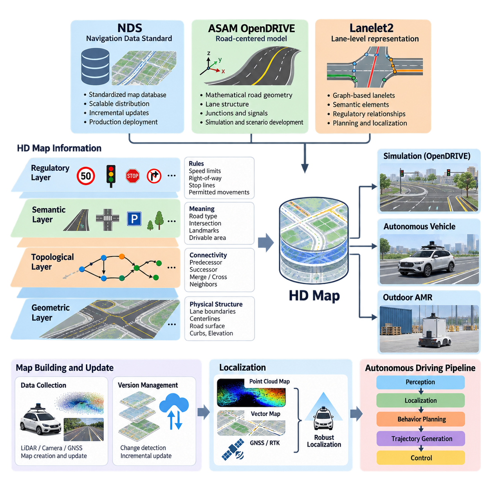
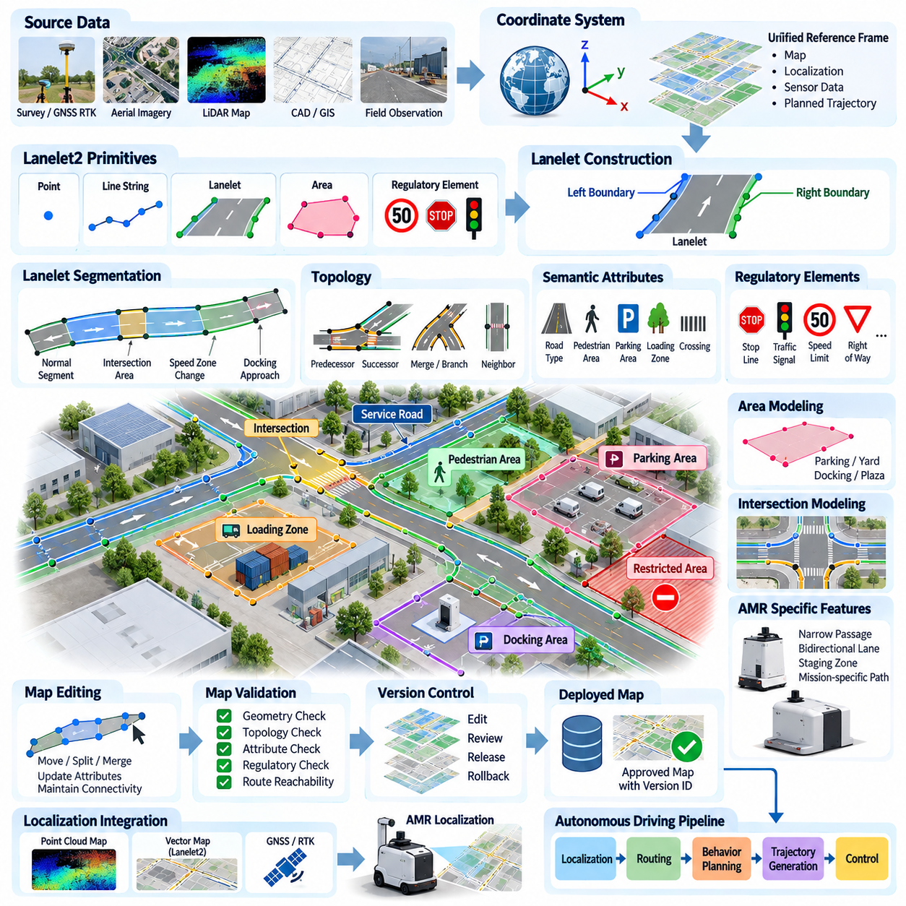
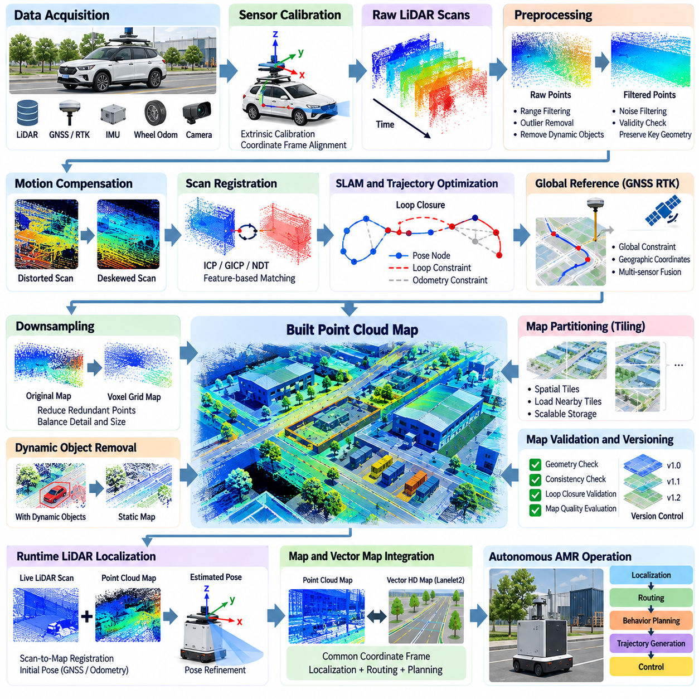
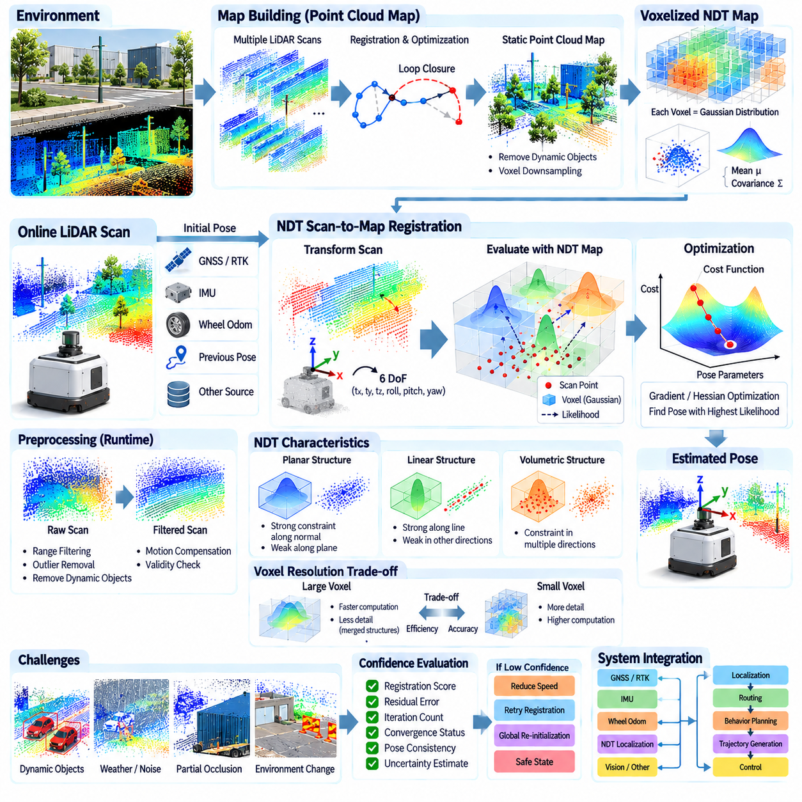
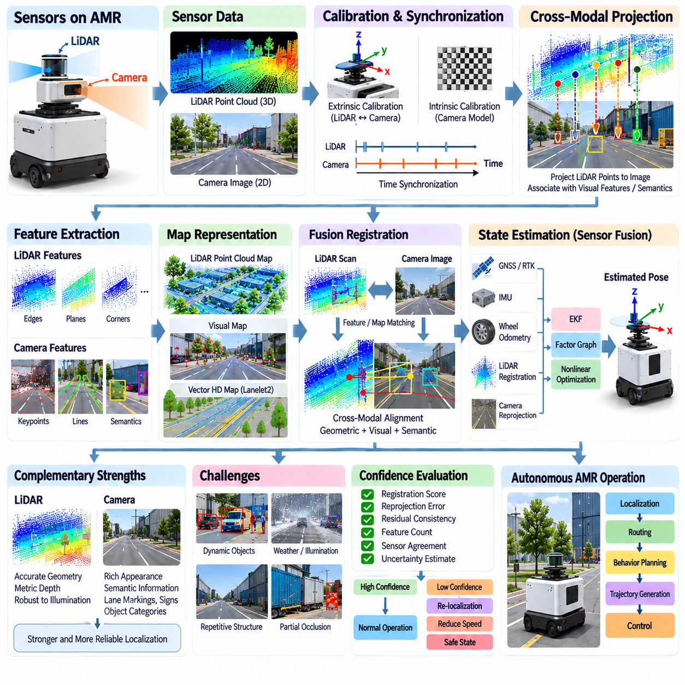
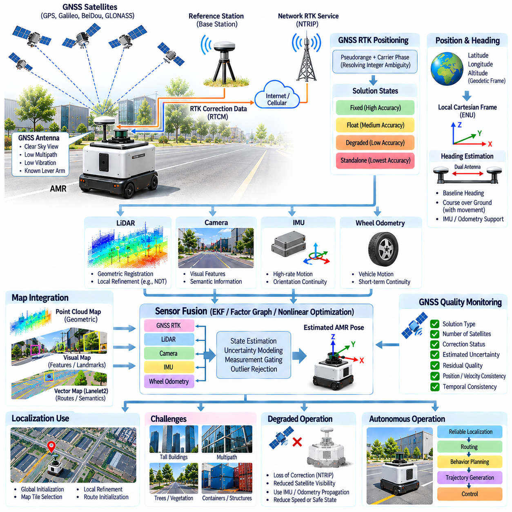
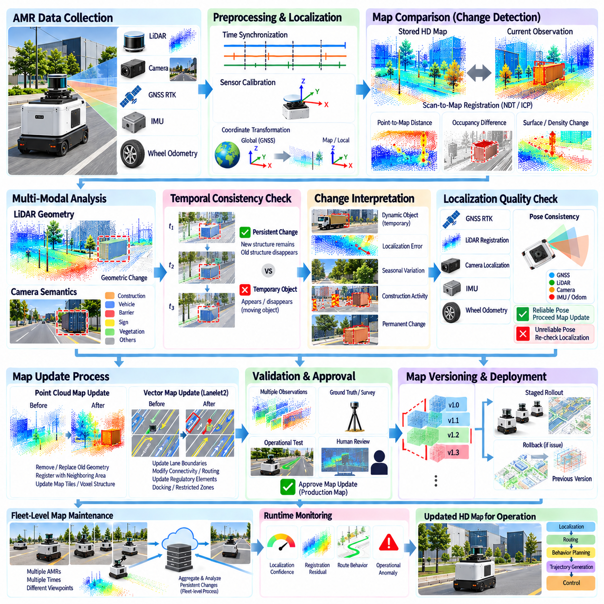
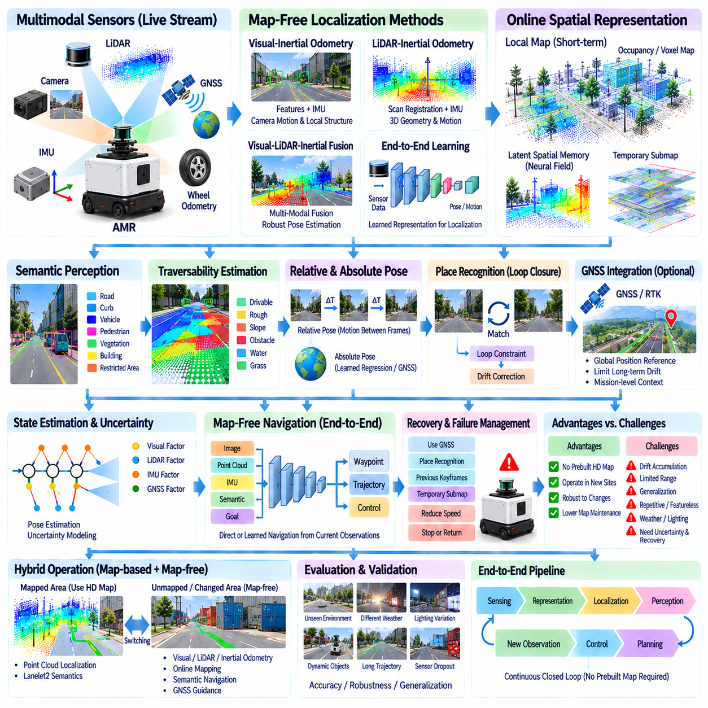
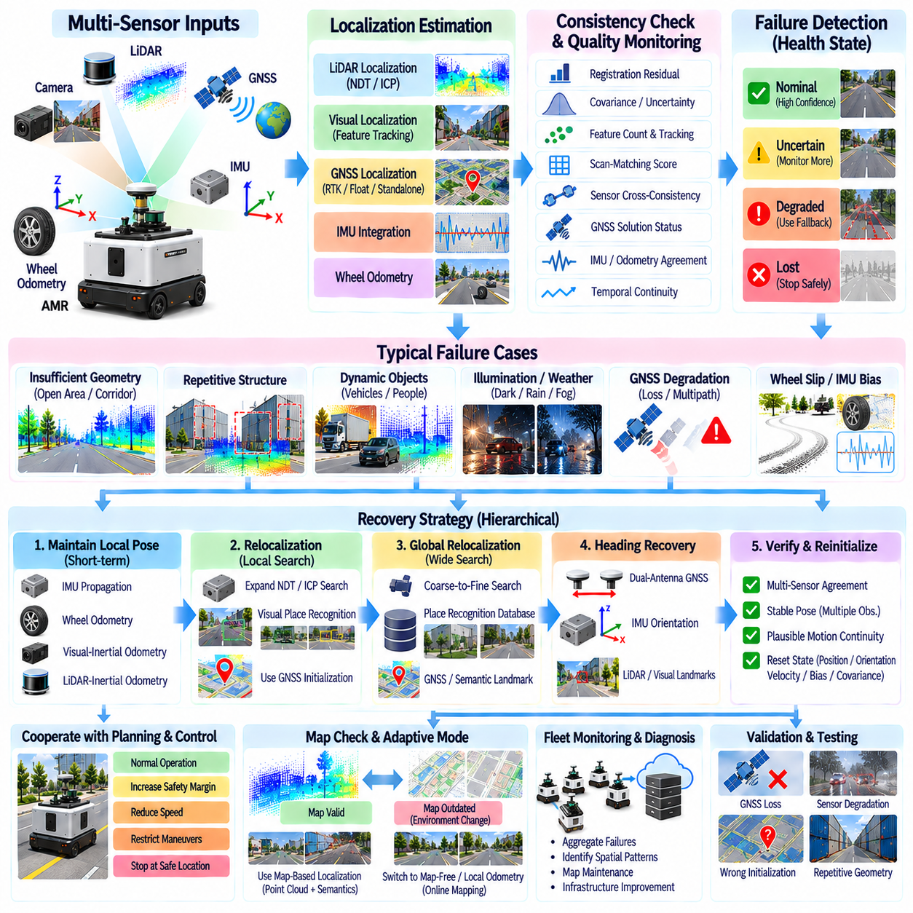
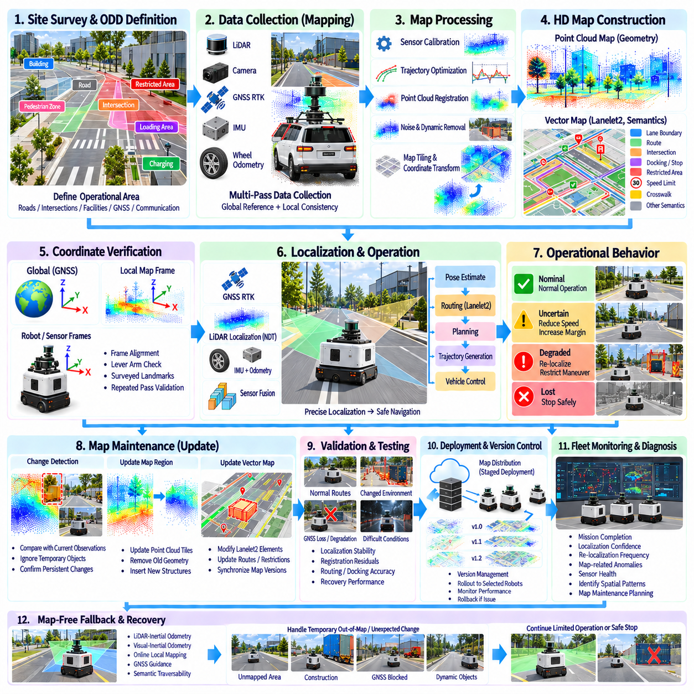

**Volume 12. Autonomous Driving Software**

# Chapter 10. HD Map and Localization

## 10.01. HD Map Standards NDS OpenDRIVE Lanelet2 Overview

{width="7.268055555555556in" height="7.268055555555556in"}

고정밀 지도(High-Definition Map, HD Map)는 기존 내비게이션 지도에서 제공되는 기하학적 정보(geometric information)를 넘어, 자율주행 시스템(autonomous driving system)이 주변 환경을 구조적으로 이해할 수 있도록 표현한다. 차선 경계(lane boundary), 중심선(centerline), 도로 위상 구조(road topology), 교차로(intersection), 교통 규칙(traffic rule), 랜드마크(landmark), 연석(curb), 정지선(stop line) 등의 의미론적 요소(semantic element)를 포함할 수 있다. 따라서 고정밀 지도(HD Map)는 인지(perception), 위치추정(localization), 행동 계획(behavior planning), 궤적 생성(trajectory generation)을 연결하는 핵심 인터페이스(interface)를 형성한다.

고정밀 지도(HD Map)는 단순히 일반 소비자용 내비게이션 지도보다 정확한 지도가 아니다. 주요 목적은 기계 해석(machine interpretation)에 있다. 자율주행 시스템은 차량이나 로봇이 어디로 이동할 수 있는지, 인접 도로나 경로 구간이 어떻게 연결되는지, 어떠한 규제 조건(regulatory constraint)이 적용되는지, 어떤 기하학적 특징(geometric feature)을 위치추정에 활용할 수 있는지를 이해해야 한다. 따라서 고정밀 지도는 일반적으로 지리 좌표만 사용하는 것이 아니라 기하학적, 위상학적(topological), 의미론적(semantic), 규제적(regulatory) 정보를 결합한다.

기하학적 계층(geometric layer)은 운용 환경(operating environment)의 물리적 구조를 기술한다. 차선 경계, 기준선(reference line), 도로 표면(road surface), 연석, 교차로, 주차 구역(parking area), 갓길(shoulder) 및 기타 공간적 특징(spatial feature)을 표현할 수 있다. 응용 분야에 따라 좌표는 지리 좌표계(geographic coordinate system) 또는 투영 좌표계(projected coordinate system)로 표현되며, 자율주행 스택(autonomous stack)에서 사용하는 로컬 좌표계(local frame)로 변환될 수 있다. 지도 특징을 센티미터 수준 위치추정의 기준으로 사용할 경우 높은 기하학적 일관성(geometric consistency)이 특히 중요하다.

위상학적 계층(topological layer)은 물리적 형상 자체보다 연결성과 관계를 표현한다. 어떤 차선이나 경로가 다른 차선의 이전(predecessor), 이후(successor), 병합(merge), 교차(cross), 또는 인접(neighbor) 관계에 있는지를 기술한다. 이러한 정보는 경로 계획기(route planner)가 교통망을 통과할 수 있는 유효한 전이(feasible transition)를 판단하도록 한다. 의미론적 계층(semantic layer)은 기하학적 객체에 의미를 추가하며, 규제 정보(regulatory information)는 속도 제한(speed limit), 통행 우선권(right-of-way), 정지 요구사항(stop requirement), 허용 이동(permitted movement) 등의 요소를 특정 지도 영역과 연결한다.

자율 모빌리티(autonomous mobility)의 서로 다른 영역에서는 서로 다른 추상화(abstraction)가 필요하기 때문에 다양한 지도 형식과 생태계가 발전해 왔다. 내비게이션 데이터 표준(Navigation Data Standard, NDS)은 표준화된 자동차 지도 데이터베이스와 지도 배포(map distribution)에 초점을 둔다. ASAM 오픈드라이브(OpenDRIVE)는 도로 중심의 수학적 표현(road-centered mathematical representation)을 이용해 도로망을 기술하며, 특히 시뮬레이션(simulation)과 시나리오 기반 개발(scenario-based development)에 유용하다. 레인렛2(Lanelet2)는 원자적 주행 가능 구간(atomic drivable segment)과 규제 관계(regulatory relationship)를 중심으로 설계된 확장 가능한 차선 수준 표현(lane-level representation)을 사용한다.

NDS는 자동차 내비게이션 및 지도 데이터를 위한 산업 지향적 표준(industry-oriented specification)이다. 하나의 거대한 파일로 지도를 관리하는 대신, NDS 생태계는 내비게이션, 자동화 주행(automated driving), 지도 업데이트(map update), 차량 배포(vehicle deployment)를 지원할 수 있는 구조화된 데이터베이스(structured database)와 표준화된 인터페이스(standardized interface)를 중심으로 설계된다. 이는 지도 정보를 다양한 차량 플랫폼과 지역에서 일관성 있게 저장, 배포, 업데이트, 버전 관리(version management), 활용해야 하는 양산 시스템(production system)에서 중요하다.

자율주행 관점에서 NDS 기반 아키텍처(NDS-oriented architecture)의 강점은 표현 방식뿐 아니라 생명주기 관리(lifecycle management)에 있다. 양산 차량은 매우 넓은 지리적 영역에서 운행할 수 있기 때문에 전체 지도를 매번 교체하는 방식은 비효율적이다. 따라서 지도 데이터베이스는 분할(partitioning), 증분 업데이트(incremental update), 버전 관리, 제어된 배포(controlled delivery)를 지원하는 메커니즘을 갖추는 것이 유리하다. 이러한 기능은 차량군 규모 지도 인프라(fleet-scale map infrastructure)를 제한된 장소의 AMR이나 로봇 실험에서 사용하는 소규모 정적 지도(static map)와 구분하는 중요한 특징이다.

ASAM 오픈드라이브(OpenDRIVE)는 다른 관점에서 지도 표현에 접근한다. 주로 수학적으로 정의된 도로 형상(road geometry)과 이에 연결된 차선 구조(lane structure)를 이용하여 도로망을 기술한다. 기준선(reference line)은 도로 기하 구조의 기반을 형성하며, 차선은 이 기준선을 기준으로 정의된다. 이후 도로 고도(road elevation), 횡방향 프로파일(lateral profile), 차선 폭(lane width), 교차부(junction), 신호(signal), 객체(object) 등의 속성을 도로 모델과 연결함으로써 구조화된 교통 인프라의 간결한 수학적 표현을 구성할 수 있다.

이러한 표현 방식은 오픈드라이브(OpenDRIVE)를 주행 시뮬레이션(driving simulation)에 특히 유용하게 만든다. 단순히 샘플링된 폴리라인(polyline)만 저장하는 대신 시뮬레이터(simulator)는 수학적 정의로부터 연속적인 도로 형상을 재구성하고 이에 대응하는 도로 표면, 차선, 교차부 구조를 생성할 수 있다. 동일한 논리적 도로 표현(logical road description)을 시나리오 생성(scenario generation), 가상 검증(virtual validation), 자율주행 소프트웨어 시험에 활용할 수 있다. 따라서 오픈드라이브는 도로 모델링과 시뮬레이션 기반 개발 워크플로(simulation-oriented development workflow)를 연결하는 인프라 표현으로 활용될 수 있다.

레인렛2(Lanelet2)는 자율주행 차량과 이동 로봇(mobile robot)의 계획 및 위치추정 파이프라인에 적합한 그래프 지향 표현(graph-oriented representation)을 사용한다. 핵심 개념은 레인렛(lanelet)으로, 일반적으로 좌측과 우측 라인 스트링(line string)으로 경계가 정의되는 원자적 차선 구간이다. 레인렛은 라우팅 그래프(routing graph)로 연결될 수 있으며, 추가적인 지도 기본 요소(map primitive)를 통해 점(point), 라인 스트링, 영역(area), 관계(relationship)를 표현한다. 이러한 구조를 이용하면 복잡한 도로망을 관리 가능한 의미론적 요소로 분해할 수 있다.

레인렛2(Lanelet2)의 주요 특징 중 하나는 규제 요소 모델(regulatory-element model)이다. 교통 규칙은 단순히 기하학적 구조에 느슨하게 부착된 속성(attribute)으로만 표현되는 것이 아니라, 지도 기본 요소와 규제 개념(regulatory concept) 사이의 명시적인 관계로 표현될 수 있다. 따라서 정지선, 신호등(traffic light), 통행 우선권 관계, 속도 제한 및 기타 규칙을 해당 규칙이 적용되는 레인렛과 연결할 수 있다. 이를 통해 계획 소프트웨어(planning software)는 기하학적 경로를 지도에 정의된 운용 제약조건을 준수하는 행동으로 변환할 수 있다.

야외 자율이동로봇(Outdoor AMR)의 경우 레인렛2(Lanelet2)는 일반적인 공공 도로와 다른 환경도 표현할 수 있다. 산업 단지(industrial campus), 물류 야드(logistics yard), 항만(port), 보행자 공유 경로(pedestrian-shared path), 서비스 도로(service road), 대규모 야외 시설 등에는 지역적으로 정의된 운용 규칙을 갖는 주행 통로(drivable corridor)가 존재할 수 있다. 차선 수준 기본 요소를 이러한 통로 표현에 적용하고, 영역과 규제 관계를 이용하여 교차로, 제한 구역(restricted zone), 도킹 접근 구간(docking approach), 횡단 구역(crossing) 등의 임무 관련 영역을 기술할 수 있다.

따라서 NDS, 오픈드라이브(OpenDRIVE), 레인렛2(Lanelet2)를 완전히 동일한 문제를 해결하는 상호 교환 가능한 세 가지 파일 형식으로 이해해서는 안 된다. NDS는 확장 가능한 자동차 지도 데이터베이스와 배포 중심 지도 생태계에 중점을 둔다. 오픈드라이브는 정밀한 도로망 표현을 강조하며 시뮬레이션 및 가상 도로 환경(virtual road environment)과 강하게 연계된다. 레인렛2는 의미론적 차선 수준 모델링, 라우팅 관계(routing relationship), 자율주행 및 로봇 소프트웨어와의 실용적 통합에 중점을 둔다.

실제 자율주행 개발 환경에서는 결과적으로 하나 이상의 표현 방식을 함께 사용할 수 있다. 도로망 데이터가 상용 또는 기업용 지도 데이터베이스에서 생성되고, 시뮬레이션을 위해 오픈드라이브(OpenDRIVE) 표현으로 변환된 후, 자율주행 스택에서 사용할 레인렛2(Lanelet2) 지도로 다시 변환될 수 있다. 각 표현은 서로 다른 의미 체계(semantics)와 가정을 가지므로 변환이 항상 무손실(lossless)로 이루어지는 것은 아니다. 따라서 견고한 파이프라인은 어떤 객체, 좌표계, 속성, 규제 관계를 권위 있는 지도 정보(authoritative map information)로 사용할 것인지 정의해야 한다.

고정밀 지도(HD Map)는 위치추정(localization)과도 직접적으로 상호작용한다. 포인트 클라우드 지도(point-cloud map)는 라이다(LiDAR) 관측 데이터를 정합(registration)할 수 있는 고밀도 3차원 특징을 제공할 수 있으며, 벡터 지도(vector map)는 의미론적 및 위상학적 문맥을 제공한다. 위성항법시스템(GNSS)과 실시간 이동측위(RTK)는 전역 위치 제약(global position constraint)을 제공할 수 있으며, 카메라는 지도에 기록된 차선 표시, 기둥, 표지판 등의 랜드마크를 관측할 수 있다. 자율주행 시스템은 이러한 정보원을 결합하여 하나의 센서 또는 지도 표현에 위치추정이 전적으로 의존하지 않도록 구성할 수 있다.

위치추정 지도(localization map)와 계획 지도(planning map)의 구분은 실제 운용에서 중요하다. 고밀도 포인트 클라우드 지도는 스캔 정합(scan matching)에 매우 효과적일 수 있지만 경로 추론(route reasoning)에는 비효율적일 수 있다. 반대로 벡터 지도는 차선 연결성과 교통 규칙을 효율적으로 표현할 수 있지만 정밀한 라이다 정합에 필요한 충분한 환경 질감(environmental texture)을 포함하지 않을 수 있다. 따라서 실제 아키텍처에서는 일관된 좌표계, 타임스탬프(timestamp), 지도 식별자(map identifier), 버전 정보를 통해 연결되는 여러 상호보완적 지도 계층을 유지하는 경우가 많다.

지도 최신성(map freshness)은 또 하나의 핵심 요구사항이다. 도로, 공사 구역(construction zone), 장벽(barrier), 식생(vegetation), 차선 표시, 적재 구역(loading area), 산업 시설 배치 등은 지도 제작 이후 변경될 수 있다. 기하학적으로 정밀하지만 오래된 지도는 불확실성이 올바르게 표현된 낮은 상세도의 지도보다 더 위험할 수 있다. 따라서 양산 시스템은 환경 변화 감지(change detection), 후보 업데이트 검증(update validation), 승인된 지도 개정판(map revision)의 배포, 차량에서 현재 활성화된 지도 버전을 확인하는 메커니즘을 필요로 한다.

이러한 요구사항은 고정밀 지도 표준(HD-map standard)을 보다 넓은 자율주행 소프트웨어 생명주기(autonomous-driving software lifecycle)와 연결한다. 본 장의 구조에서는 지도 표준 이후에 레인렛2 지도 생성(Lanelet2 map creation), 포인트 클라우드 지도 구축(point-cloud map building), 정규분포 변환 위치추정(NDT localization), 센서 융합 위치추정(sensor-fusion localization), GNSS RTK 통합, 지도 업데이트, 지도 비의존 접근법(map-free approach), 위치추정 복구(localization recovery), 야외 AMR 배포가 이어진다. 이러한 구성은 지도 표현이 이후의 위치추정 및 운용 메커니즘을 구축하기 위한 기반이라는 점을 반영한다.

시스템 아키텍트(system architect)의 관점에서 중요한 설계 질문은 어떤 고정밀 지도 표준이 보편적으로 가장 우수한가가 아니라, 자율주행 파이프라인의 각 인터페이스에서 어떤 표현을 사용해야 하는가이다. 선택은 지리적 규모(geographic scale), 필요한 의미 정보, 시뮬레이션 호환성(simulation compatibility), 라우팅 요구사항, 위치추정 방법, 업데이트 주기(update frequency), 도구 지원(tool support), 배포 아키텍처(deployment architecture)에 따라 달라진다. 이러한 관심사를 명확하게 분리하면 여러 소프트웨어 모듈이 지도를 서로 다른 방식으로 해석하는 불투명한 의존성(opaque dependency)을 방지할 수 있다.

성숙한 고정밀 지도 아키텍처(HD-map architecture)는 궁극적으로 운용 환경을 지속적으로 관리하는 디지털 표현(digital representation)으로 동작한다. 기하 구조(geometry)는 공간적 구조를 제공하고, 위상 구조(topology)는 연결성을 제공하며, 의미 정보(semantics)는 의미를 부여하고, 규제 정보(regulation)는 행동을 제한하며, 위치추정 계층(localization layer)은 디지털 표현을 실제 센서 관측(real sensor observation)과 연결한다. NDS, 오픈드라이브(OpenDRIVE), 레인렛2(Lanelet2)는 이러한 요구사항을 해결하기 위한 상호보완적 접근법을 보여주며, 지도 중심 자율주행 소프트웨어(map-centered autonomous-driving software)를 이해하기 위한 기반을 제공한다.

## 10.02. Lanelet2 Map Creation and Editing for AMR [w/Code]

{width="7.268055555555556in" height="7.268055555555556in"}

자율이동로봇(Autonomous Mobile Robot, AMR)을 위한 레인렛2(Lanelet2) 지도 생성은 운용 환경(operational environment)을 일반적인 도로 이미지가 아니라 주행 가능한 통로(navigable corridor)의 구조화된 네트워크로 정의하는 것에서 시작한다. 지도는 AMR이 어디로 이동할 수 있는지, 개별 경로 구간이 어떻게 연결되는지, 어떤 운용 제약조건(operational constraint)이 적용되는지를 표현해야 한다. 야외 AMR의 경우 서비스 도로(service road), 보행자 공유 경로(pedestrian-shared path), 적재 구역(loading zone), 교차로(intersection), 도킹 구역(docking area), 제한 구역(restricted region) 등이 포함될 수 있다.

레인렛2(Lanelet2)의 기본 표현은 지도 기본 요소(map primitive)를 기반으로 구성된다. 점(point)은 지리적 또는 공간적 위치를 정의하고, 라인 스트링(line string)은 순서가 지정된 점들을 연결하여 경계 또는 기준 특징(reference feature)을 형성하며, 레인렛(lanelet)은 좌우 경계를 결합하여 원자적 주행 가능 구간(atomic navigable segment)을 구성한다. 영역(area)은 차선 형태의 통로로 자연스럽게 표현하기 어려운 공간을 나타내며, 규제 요소(regulatory element)는 교통 또는 운용 규칙을 해당 규칙이 적용되는 지도 객체와 연결한다.

지도 생성은 일반적으로 신뢰할 수 있는 공간 기준(spatial reference)을 확보하는 것에서 시작한다. 측량 좌표(surveyed coordinate), 위성항법시스템 실시간 이동측위(GNSS RTK) 측정값, 항공 영상(aerial imagery), 기존 CAD 또는 GIS 데이터, 라이다 지도(LiDAR map), 현장 관측(field observation) 등을 기하학적 기준으로 사용할 수 있다. AMR 배포에서는 필요한 위치추정 정확도(localization accuracy)와 운용 규모에 적합한 데이터 소스를 선택해야 한다. 지도 형상, 위치추정 결과, 센서 데이터, 계획 궤적(planned trajectory)이 최종적으로 호환 가능한 기준 좌표계(reference frame)에서 위치를 표현해야 하므로 좌표계 일관성(coordinate-system consistency)이 필수적이다.

첫 번째 실질적인 모델링 작업은 일반적으로 경계 라인 스트링(boundary line string)을 구성하는 것이다. 단순히 중심 경로(center path)만 그리는 대신 지도 설계자는 각 주행 가능 통로의 좌측과 우측 한계를 정의한다. 이러한 경계는 차선 표시(lane marking), 연석(curb), 벽(wall), 울타리(fence), 포장 경계(pavement edge), 가상 안전 경계(virtual safety boundary), 운용 한계(operational limit)에 대응할 수 있다. 이렇게 구성된 표현은 계획 소프트웨어(planning software)에 로봇 이동을 위해 할당된 공간 영역에 대한 명시적인 정보를 제공한다.

레인렛(lanelet)은 서로 호환되는 좌측 및 우측 경계를 쌍으로 구성하면서 방향 해석(directional interpretation)을 유지하여 생성한다. 경계점(boundary point)의 순서는 레인렛의 방향과 이동 방향(travel direction)을 결정하는 데 영향을 주기 때문에 중요하다. 인접한 레인렛은 경계 라인 스트링을 공유할 수 있으며, 이를 통해 중복된 기하 구조를 줄이고 공통 경계를 수정할 때 일관성을 유지할 수 있다. 복잡한 경로는 비교적 단순한 여러 레인렛 구간이 연결된 시퀀스(sequence)로 표현된다.

레인렛 분할(lanelet segmentation)은 기하 구조, 연결성(connectivity), 운용 규칙의 의미 있는 변화를 반영해야 한다. 긴 통로를 반드시 하나의 레인렛으로 표현할 필요는 없다. 교차로, 병합 구간(merge), 횡단 구역(crossing), 속도 구역 전환(speed-zone transition), 도킹 접근 구간(docking approach), 서로 다른 규칙이 활성화되는 영역 주변에서 여러 구간으로 분할할 수 있다. 적절한 분할은 라우팅 관계(routing relationship)를 명확하게 하고 규제 정보를 실제 적용되는 환경 구간에 정확하게 연결할 수 있도록 한다.

위상 구조(topology)는 레인렛 사이에 유효한 관계를 설정함으로써 생성된다. 후속(successor) 및 선행(predecessor) 관계는 종방향 연결성(longitudinal connectivity)을 나타내며, 인접 관계(neighboring relationship)는 필요한 경우 횡방향 판단(lateral reasoning)을 지원한다. 교차로나 분기 지점(branching point)에서는 여러 개의 유효한 전이가 존재할 수 있다. 이러한 관계로부터 생성된 라우팅 그래프(routing graph)를 통해 자율주행 스택(autonomous-driving stack)은 요청된 경로가 지도 네트워크를 통해 물리적 및 운용적으로 도달 가능한지를 판단할 수 있다.

야외 자율이동로봇(Outdoor AMR)의 위상 구조는 일반적인 승용 차량과 다를 수 있다. 로봇은 사설 서비스 도로, 물류 야드(logistics yard), 항만 구역(port area), 캠퍼스(campus), 보행자 혼재 환경(mixed pedestrian environment) 등 기존 차선 규칙만으로 충분히 표현하기 어려운 장소에서 운용될 수 있다. 따라서 지도 설계자는 기하학적으로 이동 가능한 경로와 실제 운용상 허용된 경로를 명확하게 구분하면서 좁은 통로, 양방향 통로(bidirectional corridor), 임시 운용 차선(temporary operating lane), 대기 구역(staging zone), 임무별 연결 경로(mission-specific connection)를 모델링할 수 있다.

의미론적 속성(semantic attribute)은 기하학적 네트워크에 기계 판독 가능한 의미(machine-readable meaning)를 추가한다. 지도 요소는 도로 또는 통로 유형, 보행자 영역, 주차 또는 적재 구역, 횡단 구역, 정지선(stop line) 및 자율주행 운용에 필요한 기타 특징을 식별할 수 있다. 이러한 속성을 통해 계획 모듈(planning module)은 기하학적으로 유사한 공간도 서로 다르게 해석할 수 있다. 예를 들어 물류 야드의 포장 통로는 폭이 유사한 보행자 공유 경로와 다른 주행 행동을 요구할 수 있다.

규제 요소(regulatory element)는 규칙을 구조적으로 표현하기 위한 메커니즘을 제공한다. 정지 요구사항(stop requirement), 통행 우선권 관계(right-of-way relationship), 교통 신호(traffic signal), 속도 제한(speed restriction) 등의 제약조건을 해당 규칙의 영향을 받는 레인렛과 연결할 수 있다. AMR에서는 지도 모델 내에서 표현할 수 있는 경우 동일한 개념을 현장별 운용 제한(site-specific operational restriction)에 적용할 수 있다. 이를 통해 계획 소프트웨어는 이동이 기하학적으로 가능한 위치뿐만 아니라 해당 영역에서 어떤 행동이 허용되는지도 함께 판단할 수 있다.

교차로(intersection)는 좁은 영역 안에서 기하 구조, 위상 구조, 규제 정보가 결합되므로 특히 주의해서 모델링해야 한다. 진입 레인렛(incoming lanelet)과 진출 레인렛(outgoing lanelet)을 올바르게 연결해야 하며, 충돌 가능 경로(conflicting path)를 식별할 수 있어야 하고, 정지 또는 우선권 관계가 의도된 교통 행동과 일치해야 한다. 과도한 분할(over-segmentation)은 지도를 불필요하게 복잡하게 만들 수 있고, 불충분한 분할은 규제 관계를 모호하게 만들 수 있다. 따라서 편집 과정에서는 물리적 배치와 계획 의미(planning semantics) 사이의 명확한 관계를 유지해야 한다.

영역(area)은 AMR의 이동을 좁은 차선 통로만으로 적절하게 모델링하기 어려울 때 유용하다. 주차 구역(parking area), 개방형 물류 야드(open logistics yard), 도킹 구역, 광장(plaza), 대기 구역, 회차 및 기동 공간(maneuvering space)에서는 보다 넓은 2차원 영역을 통한 이동이 허용될 수 있다. 이러한 영역은 레인렛과 함께 사용할 수 있으며, 구조화된 통로에서는 레인렛을 통해 일반적인 내비게이션을 수행하고 넓은 영역에서는 지역 경로 계획(local planning) 또는 임무 로직(mission logic)을 통해 세부 경로를 결정하도록 구성할 수 있다.

기존 레인렛2(Lanelet2) 지도를 편집하는 작업은 단순히 기하학적 점의 위치를 변경하는 것 이상을 의미한다. 하나의 경계를 수정하면 이를 공유하는 인접 레인렛에 영향을 줄 수 있으며, 레인렛을 분할하거나 병합하면 라우팅 연결성과 규제 요소의 연관 관계가 변경될 수 있다. 따라서 모든 구조적 수정 이후에는 기하 구조, 위상 구조, 의미론적 속성, 규칙을 함께 점검해야 한다. 특히 운용 지도에서는 시각적으로 올바르게 보이는 수정이라도 유효하지 않거나 도달할 수 없는 라우팅 그래프를 생성할 수 있으므로 이러한 검증이 중요하다.

지도 검증(map validation)은 배포 전에 잘못 구성된 경계, 일관되지 않은 방향성(directionality), 단절된 경로(disconnected route), 의도하지 않은 중첩(unintended overlap), 누락된 속성(missing attribute), 손상된 규제 참조(broken regulatory reference)를 식별해야 한다. 경로 수준 시험(route-level test)을 통해 충전소(charging station), 도킹 위치(docking location), 적재 구역, 안전 정지 구역(safe stopping zone) 등 주요 임무 지점까지의 경로가 계속 도달 가능한지 확인할 수 있다. 시각화(visualization)도 중요하지만 많은 의미론적 오류는 기하 구조만 보고 발견하기 어렵기 때문에 자동화된 일관성 검사(automated consistency check)가 필요하다.

레인렛2(Lanelet2) 지도는 주변 고정밀 지도(HD Map) 워크플로에서 설명되는 위치추정 아키텍처(localization architecture)와도 정렬되어야 한다. 벡터 지도(vector map)는 의미론적 도로 네트워크를 정의하고, 포인트 클라우드 지도(point-cloud map)는 라이다 정합(LiDAR registration)을 지원하며, GNSS RTK는 전역 위치 제약(global position constraint)을 제공할 수 있다. 이러한 표현들은 명확하게 정의된 좌표 변환(coordinate transformation)을 공유해야 하며, 이를 통해 위치가 추정된 AMR의 자세(pose)를 올바른 레인렛, 경로, 교차로 또는 규제 요소와 신뢰성 있게 연결할 수 있다.

야외 환경은 시간에 따라 변화하므로 지도 생성은 일회성 모델링 작업이 아니라 생명주기(lifecycle)의 시작으로 다루어야 한다. 공사 작업(construction work), 이동된 장벽, 변경된 교통 흐름(traffic flow), 새로운 도킹 위치, 수정된 제한 구역 등은 기존에 올바르게 구성된 지도 요소를 더 이상 유효하지 않게 만들 수 있다. 따라서 지도 편집 과정은 버전 관리(version control), 변경 검토(change review), 현장 검증(field verification), 통제된 배포(controlled deployment)를 지원해야 하며, 이를 통해 로봇이 승인되고 식별 가능한 지도 개정판(map revision)을 사용하도록 해야 한다.

실용적인 AMR 지도 파이프라인(map pipeline)은 원본 데이터(source data), 편집 가능한 지도 콘텐츠(editable map content), 검증된 배포 지도(validated release map), 실제 운용 지도(deployed runtime map)를 분리한다. 이러한 분리는 실험적인 수정 사항이 운용 중인 로봇에 즉시 영향을 미치는 것을 방지하고, 지도 개정으로 예상하지 못한 문제가 발생했을 때 롤백(rollback)을 가능하게 한다. 또한 지도 식별자(map identifier)와 버전을 운용 로그(operational log)에 기록하면 위치추정 또는 계획 실패가 발생했을 때 당시 사용된 정확한 환경 표현까지 추적할 수 있다.

최종 목표는 시각적으로 상세한 지도를 만드는 것이 아니라 AMR 운용 환경을 간결하고 일관된 기계 판독 가능 모델(machine-readable model)로 구축하는 것이다. 기하 구조(geometry)는 주행 가능 공간을 정의하고, 위상 구조(topology)는 도달 가능한 연결 관계를 정의하며, 의미 정보(semantics)는 환경의 의미를 설명하고, 규제 요소(regulatory element)는 행동 제약조건을 정의한다. 이러한 구성요소를 함께 편집하고 검증하면 레인렛2(Lanelet2)는 물리적 현장 구조, 위치추정(localization), 라우팅(routing), 행동 계획(behavior planning), 자율 AMR 운용(autonomous AMR operation)을 연결하는 효과적인 기반이 된다.

## 10.03. Point Cloud Map Building for LiDAR Localization [w/Code]

{width="7.268055555555556in" height="7.268055555555556in"}

포인트 클라우드 지도(point cloud map)는 라이다 위치추정(LiDAR localization)을 위한 기하학적 기준(geometric reference)으로 사용할 수 있는 환경의 고밀도 3차원 표현(dense three-dimensional representation)을 제공한다. 차선, 경로, 규제 관계를 주로 기술하는 의미론적 벡터 지도(semantic vector map)와 달리 포인트 클라우드는 라이다가 관측한 측정 가능한 표면과 구조물을 보존한다. 건물, 연석(curb), 기둥(pole), 벽, 장벽(barrier), 도로 경계 등의 정적 객체(static object)는 새로운 센서 스캔(sensor scan)을 정합할 수 있는 공간적 지문(spatial fingerprint)을 형성한다.

포인트 클라우드 지도 구축(point cloud map building)은 대상 운용 환경(operational environment)에 대한 체계적인 데이터 수집(data acquisition)에서 시작한다. 매핑 차량(mapping vehicle) 또는 자율이동로봇(AMR)은 일반적으로 라이다 스캔과 함께 위성항법시스템(GNSS), 실시간 이동측위(RTK), 관성측정장치(IMU), 휠 오도메트리(wheel odometry), 비전 센서(visual sensor)의 동기화된 이동 정보를 기록한다. 목표는 단순히 많은 점을 수집하는 것이 아니라 기하학적으로 일관된 환경을 재구성할 수 있도록 충분한 공간 중첩(spatial overlap), 관측 시점 다양성(viewpoint diversity), 시간 정확도(timing accuracy), 궤적 커버리지(trajectory coverage)를 확보하는 것이다.

센서 보정(sensor calibration)은 생성되는 지도의 품질에 큰 영향을 미친다. 라이다 좌표계(LiDAR coordinate frame)와 로봇 베이스(robot base), IMU, GNSS 안테나 및 다른 센서 사이의 변환 관계를 정확하게 알아야 한다. 작은 회전 또는 병진 보정 오차(rotational or translational calibration error)도 많은 스캔을 병합할 때 구조물이 중복되거나 변형되는 현상으로 누적될 수 있다. 따라서 매핑은 신뢰할 수 있는 내부 설정(intrinsic configuration), 외부 보정(extrinsic calibration), 좌표계 정의(coordinate-frame definition), 타임스탬프 동기화(timestamp synchronization)에 의존한다.

각각의 라이다 스캔은 처음에는 측정 순간의 센서 좌표계(sensor coordinate frame)에 존재한다. 전역 지도(global map)를 구축하려면 이러한 스캔을 추정된 로봇 자세(robot pose)에 따라 변환하고 공통 지도 좌표계(map frame)에 누적해야 한다. 자세 추정값(pose estimate)은 GNSS RTK, 관성항법(inertial navigation), 라이다 오도메트리(LiDAR odometry), 동시적 위치추정 및 지도작성(SLAM) 또는 이들의 조합으로부터 얻을 수 있다. 따라서 매핑 정확도(mapping accuracy)는 개별 스캔 등록(registration)에 사용되는 궤적의 정확성과 일관성에 직접적으로 연결된다.

원시 포인트 클라우드(raw point cloud)는 일반적으로 지도 통합(map integration) 전에 전처리(preprocessing)가 필요하다. 센서 노이즈(sensor noise), 다중경로 반사(multipath reflection), 먼지, 비, 이동 객체 또는 신뢰할 수 없는 거리 측정값(range return)은 정합과 지도 품질을 저하시킬 수 있다. 거리 필터링(range filtering), 통계적 이상치 제거(statistical outlier removal), 반경 기반 필터링(radius-based filtering), 센서별 유효성 검사(sensor-specific validity check)를 통해 불안정한 관측값을 제거할 수 있다. 전처리는 저장 공간과 연산량만 증가시키는 불필요한 데이터를 제거하면서 기하학적으로 유용한 구조를 보존해야 한다.

라이다가 로봇 이동 중에 점을 순차적으로 획득하는 경우 운동 왜곡(motion distortion)도 중요한 고려사항이다. 하나의 스캔에서 처음과 마지막에 수집된 점은 서로 조금 다른 차량 자세(vehicle pose)에 대응한다. 이를 보정하지 않으면 벽이 휘어 보이거나 수직 구조물이 흐려질 수 있다. 디스큐잉(deskewing)은 IMU, 오도메트리 또는 연속 자세 보간(continuous pose interpolation)으로부터 얻은 움직임 추정값을 사용하여 정합 전에 측정값을 공통 획득 시점(common acquisition time)으로 변환한다.

연속적인 스캔은 이후 정확하게 정합되어야 한다. 스캔 정합(scan registration)은 서로 다른 위치에서 관측한 기하학적 구조가 가장 잘 일치하도록 상대 변환(relative transformation)을 추정한다. 반복 최근접점(Iterative Closest Point, ICP), 일반화 ICP(Generalized ICP, GICP), 정규분포 변환(Normal Distributions Transform, NDT), 특징 기반 라이다 매칭(feature-based LiDAR matching) 등의 알고리즘을 이 과정에 활용할 수 있다. 지역 정합(local registration)은 연속 스캔 사이에 충분한 중첩 영역과 식별 가능한 기하학적 구조가 존재할 때 가장 효과적으로 동작한다.

증분 스캔 매칭(incremental scan matching)만 사용하면 긴 궤적에서 드리프트(drift)가 누적될 수 있다. 각 정합 단계에서 발생하는 작은 오차가 점진적으로 누적되어 전체 지도를 왜곡할 수 있다. 따라서 라이다 SLAM(LiDAR SLAM) 시스템은 지역 오도메트리(local odometry)와 전역 최적화(global optimization) 메커니즘을 결합한다. 포즈 그래프(pose graph)는 로봇 자세를 노드(node)로, 상대 측정값을 제약조건(constraint)으로 표현하며, 최적화를 통해 누적 관측 전체의 전역 일관성(global consistency)을 향상하도록 궤적을 조정한다.

루프 폐쇄(loop closure)는 매핑 플랫폼이 이전에 관측했던 위치로 다시 돌아왔을 때 중요한 제약조건을 제공한다. 동일한 물리적 영역을 재인식하면 시간적으로 멀리 떨어진 자세 사이의 관계를 추정하여 누적된 드리프트를 보정할 수 있다. 그러나 잘못된 루프 폐쇄(false loop closure)는 지도 전체를 심각하게 변형할 수 있다. 따라서 전역 최적화 과정에서 루프 제약(loop constraint)을 받아들이기 전에 후보 탐지(candidate detection)와 기하학적 검증(geometric verification)을 충분히 견고하게 수행해야 한다.

GNSS RTK는 야외 AMR 매핑에서 추가적인 전역 기준(global reference)을 제공할 수 있다. 고품질 RTK 측정값은 장기적인 드리프트를 제한하고 포인트 클라우드를 지리 좌표계(geographic coordinate system)에 연결하는 데 도움이 된다. 그러나 건물 주변, 수목 아래, 컨테이너 옆 또는 부분적으로 가려진 시설에서는 GNSS 품질이 저하될 수 있다. 따라서 견고한 매핑 파이프라인은 GNSS가 항상 완벽하게 제공된다고 가정하기보다 다중 센서 추정 아키텍처(multi-sensor estimation architecture)의 하나의 측정 정보원으로 활용해야 한다.

궤적 최적화(trajectory optimization)가 완료되면 정합된 스캔을 공통 포인트 클라우드에 누적한다. 측정된 모든 점을 그대로 유지하면 중복 관측이 포함된 매우 큰 지도가 생성될 수 있다. 복셀 그리드 다운샘플링(voxel-grid downsampling)은 공간 셀(spatial cell) 내부의 측정값을 대표화하여 밀도를 줄이면서 위치추정에 필요한 주요 기하 구조를 유지한다. 복셀 크기(voxel size)는 기하학적 세부 수준, 저장 용량, 메모리 사용량, 정합 정확도, 런타임 연산 비용(runtime processing cost)의 균형을 고려하여 결정해야 한다.

동적 객체(dynamic object)는 장기간 안정적인 기준을 제공하지 않기 때문에 위치추정 지도에서 가능한 한 제거해야 한다. 차량, 보행자, 지게차, 임시 팔레트, 이동 가능한 장비 등의 일시적 객체(transient object)는 원시 매핑 데이터에 반복적으로 나타날 수 있다. 시간적 일관성 분석(temporal consistency analysis), 의미론적 필터링(semantic filtering), 반복 주행(repeated pass), 점유 통계(occupancy statistics)를 활용하면 지속적으로 존재하는 환경 구조와 임시 관측을 구분하여 보다 안정적인 정적 지도(static map)를 생성할 수 있다.

지도 품질은 시각적인 포인트 밀도보다 위치추정에 유용한 기하 구조(localization-relevant geometry)에 더 크게 의존한다. 특징이 거의 없는 긴 평탄 도로는 수백만 개의 점을 포함하더라도 스캔 매칭에 약한 제약조건만 제공할 수 있다. 수직 벽, 기둥, 연석, 건물 외벽(building facade), 장벽, 불규칙한 3차원 구조는 일반적으로 더 강한 기하학적 정보를 제공한다. 따라서 매핑 경로(mapping route)는 AMR이 실제 운용 중 관측하게 될 시점에서 지속적으로 관측 가능한 특징을 확보하도록 설계해야 한다.

대규모 운용 환경에서는 지도 분할(map partitioning)이 유용하다. 캠퍼스, 항만, 물류 야드 또는 산업 단지 전체를 메모리에 한꺼번에 적재하는 대신 포인트 클라우드를 타일(tile) 또는 공간 영역(spatial region)으로 나눌 수 있다. 위치추정 시스템은 현재 로봇 위치 주변의 지도 구간만 로딩하고 로봇 이동에 따라 이를 교체한다. 타일 기반 아키텍처(tiled architecture)는 메모리 사용량을 줄이는 동시에 확장 가능한 저장, 배포, 업데이트, 다중 사이트 운용(multi-site operation)을 지원한다.

포인트 클라우드 지도는 라우팅(routing)과 행동 계획(behavior planning)에 사용되는 벡터 고정밀 지도(vector HD map)와 일관된 공간 관계를 공유해야 한다. 라이다 위치추정은 고밀도 3차원 기하 구조를 이용해 AMR 자세를 추정하고, 레인렛2(Lanelet2)는 차선, 교차로, 도킹 접근 구간 및 규제 정보를 표현할 수 있다. 이러한 계층 사이의 정확한 좌표 변환(coordinate transformation)을 통해 추정된 자세를 올바른 의미론적 통로(semantic corridor)에 투영하고 적절한 경로와 연결할 수 있다.

런타임 라이다 위치추정(runtime LiDAR localization)은 현재 센서 스캔과 사전에 구축된 지도를 비교하여 두 데이터가 가장 잘 정렬되는 변환을 추정한다. 일반적으로 GNSS, 오도메트리, 이전 위치추정 결과 또는 다른 위치 정보원으로부터 초기 자세 추정값(initial pose estimate)이 필요하며, 이후 정합 알고리즘이 이 값을 정밀하게 보정한다. 위치추정 품질은 지도 정확도, 현재 스캔 품질, 환경 유사도(environmental similarity), 초기 자세 불확실성(initial-pose uncertainty), 선택한 정합 알고리즘의 수치적 특성에 영향을 받는다.

양산 및 실제 운용 시스템(production system)은 모든 정합 결과를 무조건 사용하는 대신 위치추정 신뢰도(localization confidence)를 평가해야 한다. 매칭 점수(matching score), 잔차 오차(residual error), 공분산(covariance), 수렴 상태(convergence state), 자세 불연속성(pose discontinuity), GNSS 또는 오도메트리와의 일관성을 이용해 결과의 신뢰성을 판단할 수 있다. 신뢰도가 허용 임계값 이하로 떨어지면 자율주행 스택은 속도를 낮추거나 재위치추정(relocalization)을 시도하고, 다른 위치 정보원으로 전환하거나 정의된 안전 운용 상태(safe operational state)로 이동할 수 있다.

야외 환경은 지속적으로 변화하기 때문에 포인트 클라우드 지도에도 생명주기 관리(lifecycle management)가 필요하다. 공사, 주차된 컨테이너, 식생 성장(vegetation growth), 이동된 울타리, 변경된 적재 구역, 신규 인프라는 저장된 지도와 현재 관측 사이의 대응 관계를 약화시킬 수 있다. 변화 감지(change detection)를 통해 지속적인 차이를 식별할 수 있지만, 임시 객체나 손상된 측정값이 영구적인 위치추정 기준으로 등록되는 것을 방지하기 위해 지도 업데이트는 배포 전에 검증되어야 한다.

따라서 지도 버전(map version)은 다른 양산 소프트웨어 산출물(production software artifact)과 유사한 방식으로 관리해야 한다. 원시 매핑 데이터(raw mapping data), 보정 파라미터(calibration parameter), 추정 궤적(estimated trajectory), 처리 설정(processing configuration), 생성된 지도 타일, 검증 결과(validation result), 배포 지도(released map)를 추적 가능하게 유지해야 한다. 배포된 로봇은 자신이 사용하고 있는 지도 버전을 식별할 수 있어야 하며, 이를 통해 위치추정 실패를 당시 운용에 사용된 정확한 환경 표현과 연결하여 재현하고 비교할 수 있다.

전체 지도 구축 워크플로(map-building workflow)는 센서 데이터 수집에서 시작하여 보정, 전처리, 정합, 궤적 최적화, 정적 지도 생성, 다운샘플링(downsampling), 검증, 버전 관리, 배포로 이어지는 폐쇄형 엔지니어링 파이프라인(closed engineering pipeline)을 구성한다. 그 목적은 단순히 시각적으로 인상적인 3차원 포인트 클라우드를 생성하는 것이 아니라 실제 AMR 운용 조건에서 반복적인 위치추정에 최적화된 안정적인 기하학적 기준을 구축하는 것이다.

야외 자율주행(outdoor autonomous driving)에서 포인트 클라우드 지도는 궁극적으로 다중 계층 위치추정 아키텍처(multi-layer localization architecture)의 하나의 구성요소로 동작한다. 고밀도 라이다 기하 구조는 정밀한 지역 정합(local alignment)을 제공하고, GNSS RTK는 전역 제약조건을 제공하며, 관성 및 휠 측정값은 단기적인 움직임 연속성(short-term motion continuity)을 유지하고, 벡터 고정밀 지도는 의미론적 문맥(semantic context)을 제공한다. 이러한 요소를 통합적으로 사용함으로써 AMR은 자신의 물리적 자세와 라우팅, 계획, 제어에 필요한 디지털 환경 표현 사이의 신뢰성 높은 관계를 유지할 수 있다.

## 10.04. NDT Normal Distributions Transform Localization [w/Code]

{width="7.268055555555556in" height="7.268055555555556in"}

정규분포 변환(Normal Distributions Transform, NDT)은 현재 라이다 스캔(current LiDAR scan)과 기준 지도(reference map) 사이의 상대 자세(relative pose)를 추정하는 포인트 클라우드 정합(point-cloud registration) 방법이다. NDT는 명시적인 점 대 점 대응(point-to-point correspondence)을 설정하는 대신, 기준 포인트 클라우드를 공간 셀(spatial cell)로 나누고 각 셀에 포함된 점들을 가우시안 분포(Gaussian distribution)로 모델링한다. 위치추정(localization)은 관측된 스캔에 대해 가장 높은 가능도(likelihood)를 생성하는 로봇 자세를 탐색하는 최적화 문제(optimization problem)로 변환된다.

NDT의 핵심 개념은 기준점(reference point)의 이산적인 집합을 연속적인 확률 표현(continuous probabilistic representation)으로 대체하는 것이다. 각 점유 복셀(occupied voxel) 또는 공간 셀에 대해 알고리즘은 해당 영역에 포함된 점들로부터 평균 벡터(mean vector)와 공분산 행렬(covariance matrix)을 추정한다. 평균은 해당 지역의 기하학적 중심(geometric center)을 나타내고, 공분산은 점들이 서로 다른 방향으로 어떻게 분포하는지를 나타낸다. 따라서 평면(planar), 선형(linear), 체적(volumetric) 구조는 서로 다른 확률적 특성을 생성하며, 이를 스캔 정합에 활용할 수 있다.

위치추정이 시작되기 전에 적절한 포인트 클라우드 지도를 준비해야 한다. 지도에는 충분히 안정적인 환경 구조(environmental structure)가 포함되어야 하며, 일반적으로 지도 구축 시점과 실제 운용 시점 사이에 변경될 수 있는 일시적 객체(transient object)는 제외해야 한다. 복셀화(voxelization)는 지도 해상도(map resolution)와 연산 비용(computational cost)을 제어하기 위해 일반적으로 사용된다. 선택된 복셀 크기(voxel size)는 어느 정도의 기하학적 세부 정보를 유지할 것인지와 정합 과정에서 평가해야 하는 지역 가우시안 분포의 개수를 결정한다.

NDT 표현의 품질은 각 셀에 포함된 기하학적 구조에 크게 의존한다. 명확하게 정의된 벽이나 연석의 점들이 포함된 셀은 의미 있는 공분산 구조를 생성할 수 있지만, 너무 적은 점을 포함하는 셀에서는 불안정한 추정값이 생성될 수 있다. 따라서 퇴화된 셀(degenerate cell)이나 데이터가 부족한 셀은 위치추정 성능을 약화시킬 수 있다. 지도 전처리(map preprocessing)에서는 최소 점 개수, 이상치 제거(outlier removal), 공간 밀도(spatial density), 로봇의 위치와 자세에 유용한 제약조건을 제공하는 구조의 보존을 고려해야 한다.

런타임에서 입력되는 라이다 스캔은 후보 로봇 자세(candidate robot pose)에 따라 변환되고 NDT 지도와 비교하여 평가된다. 변환된 각 스캔 점에 대해 알고리즘은 해당 지도 셀의 관련 가우시안 분포를 결정하고 그 점이 해당 분포와 얼마나 잘 일치하는지를 평가한다. 등록 목적함수(registration objective)는 이러한 가능도 관련 기여값을 여러 관측점에 걸쳐 결합하며, 현재 스캔과 기준 지도 사이의 일관성을 나타내는 점수(score)를 생성한다.

미지의 자세는 일반적으로 3차원 차량 모델에서 6개의 자유도(six degrees of freedom)를 가진다. 여기에는 3개의 병진 성분(translation component)과 3개의 회전 성분(rotation component)이 포함된다. 최적화 알고리즘(optimization algorithm)은 정합 목적함수를 개선하기 위해 이러한 파라미터를 반복적으로 수정한다. 구현 방식에 따라 NDT 비용 함수(cost function)를 미분하여 그래디언트(gradient)를 얻을 수 있으며, 일부 방식에서는 헤시안(Hessian) 또는 근사 2차 정보를 사용할 수도 있다. 이를 통해 가능한 모든 자세를 직접 탐색하지 않고 효율적인 수치 최적화(numerical optimization)를 수행할 수 있다.

NDT는 적절한 초기 자세(initial pose)가 필요하다는 특징을 가진다. 초기 추정값은 GNSS RTK, 휠 오도메트리(wheel odometry), IMU 적분(IMU integration), 이전 위치추정 결과 또는 다른 위치추정 정보원으로부터 얻을 수 있다. 초기 오차가 충분히 작다면 NDT는 관측 스캔을 지도와 정합하여 자세를 정밀하게 보정할 수 있다. 그러나 초기 추정값이 실제 위치에서 크게 벗어나 있다면 최적화기는 잘못된 지역해(local solution)로 수렴하거나 수렴 자체에 실패할 수 있다.

이러한 특성 때문에 NDT는 완전한 전역 위치추정(global localization) 메커니즘과는 본질적으로 다르다. NDT는 임의의 미지 자세를 항상 복구하는 방법이라기보다 스캔 대 지도 정밀화(scan-to-map refinement)를 수행하는 기법이다. 따라서 실제 AMR 아키텍처에서는 초기 자세를 제공하는 메커니즘이 필요하며, NDT를 GNSS, 오도메트리, 관성 추정(inertial estimation), 장소 인식(place recognition) 또는 다른 전역 재위치추정(global relocalization) 방법과 결합할 수 있다. 초기화(initialization), 지역 정밀화(local refinement), 복구(recovery)의 역할은 명확하게 분리하는 것이 바람직하다.

NDT의 중요한 장점 중 하나는 기존 ICP 구현에서 요구되는 명시적인 최근접 이웃 대응(nearest-neighbor correspondence) 탐색을 피할 수 있다는 점이다. 각 스캔 점을 특정 지도 점과 반복적으로 짝짓는 대신, NDT는 점을 연속적인 확률 모델(continuous probability model)과 비교하여 평가한다. 이를 통해 최적화 과정이 더 부드러워질 수 있으며 스캔 샘플링 밀도의 작은 변화에 대한 민감도를 줄일 수 있다. 또한 지역 기하학적 불확실성(geometric uncertainty)을 표현하기 위한 자연스러운 수학적 프레임워크를 제공한다.

복셀 해상도(voxel resolution)의 선택은 계산 효율(computational efficiency)과 기하학적 표현 사이에 직접적인 절충 관계(trade-off)를 만든다. 큰 셀은 가우시안 분포의 수를 줄여 계산 효율을 높일 수 있지만 서로 다른 구조를 하나로 합쳐 중요한 기하학적 세부 정보를 잃을 수 있다. 매우 작은 셀은 더 많은 지역 구조를 보존하지만 더 많은 지도 메모리와 연산을 필요로 하며 충분한 점이 확보되지 않을 수 있다. 따라서 적절한 해상도는 라이다 특성, 차량 속도, 환경 구조, 요구되는 위치추정 정확도에 따라 결정해야 한다.

공분산 행렬(covariance matrix)은 각 지역 확률 분포의 형태와 방향을 결정하기 때문에 특히 중요하다. 평면 표면(planar surface)은 표면 법선(surface normal)과 관련된 방향에서 강한 기하학적 정보를 제공하지만 평면을 따라서는 상대적으로 약한 제약을 제공한다. 선형 구조(linear structure)는 또 다른 특성의 분포를 나타낸다. 이러한 특성을 이해하면 NDT가 벽, 연석, 건물 외벽, 기둥 및 기타 지속적인 3차원 구조를 포함하는 환경에서 효과적으로 위치추정을 수행할 수 있는 이유를 이해할 수 있다.

NDT 성능은 현재 스캔의 품질과 완전성에도 영향을 받는다. 먼지, 비, 움직이는 식생, 주차 차량, 보행자, 반사 표면(reflective surface), 센서 노이즈, 부분적인 가림(partial occlusion)은 현재 스캔과 지도 사이에서 유용한 대응 관계의 양을 감소시킬 수 있다. NDT가 모든 일시적 객체를 영구적인 구조와 자동으로 구분하는 것은 아니다. 따라서 견고한 전처리(robust preprocessing), 동적 객체 필터링(dynamic-object filtering), 거리 제한(range limit), 센서 품질 검사를 통해 위치추정 입력의 신뢰성을 향상시킬 수 있다.

AMR이 이동하면서 라이다 스캔을 획득하는 경우 운동 왜곡(motion distortion)도 고려해야 한다. 하나의 스캔에 포함된 서로 다른 점들은 서로 다른 순간의 로봇 자세에 대응할 수 있다. 모든 점이 동시에 획득된 것처럼 처리하면 기하학적 구조가 왜곡되고 정합 정확도가 낮아질 수 있다. IMU 또는 오도메트리 정보를 사용한 디스큐잉(deskewing)을 통해 NDT에 스캔을 입력하기 전에 이러한 영향을 보정할 수 있다.

NDT는 매핑(mapping)과 위치추정(localization) 모두에 사용할 수 있지만 두 과정의 운용 요구사항은 서로 다르다. 지도 구축 과정에서는 여러 스캔으로부터 정확하고 전역적으로 일관된 표현을 생성하는 것이 목적이다. 런타임 위치추정에서는 이미 검증된 지도(validated map)를 기준으로 현재 AMR의 자세를 추정하는 것이 목적이다. 따라서 런타임 과정은 지도 품질, 좌표계 일관성, 초기화 품질, 지도에 표현된 환경 구조의 안정성에 크게 의존한다.

야외 AMR의 경우 기준 지도(reference map)는 GNSS RTK 또는 다른 측량 과정을 통해 전역 지리 좌표계(global geographic frame)와 연결되는 경우가 많다. 이후 NDT는 이러한 전역 기준에 대해 지역적인 기하학적 정합(local geometric alignment)을 제공한다. 이 조합을 사용하면 GNSS가 대략적인 전역 위치를 제공하고 라이다 정합이 지속적으로 관측 가능한 환경 기하 구조를 이용하여 지역 자세를 정밀하게 보정할 수 있다. 건물, 컨테이너, 식생 또는 기타 신호 저하 요인으로 인해 GNSS의 신뢰성이 떨어지는 경우에도 충분한 지도 특징이 관측된다면 라이다 기반 구성요소는 지역적인 이동 제약(local motion constraint)을 계속 제공할 수 있다.

NDT 위치추정은 최적화기가 단순히 수치적인 자세를 반환하는지만으로 평가해서는 안 된다. 실제 시스템은 정합 품질(registration quality)과 일관성(consistency)을 함께 검사해야 한다. 유용한 지표로는 최종 최적화 점수, 잔차 변화(residual behavior), 반복 횟수(iteration count), 수렴 상태(convergence status), 추정된 자세 변화량, 가능한 경우 공분산 또는 불확실성 측정값, 독립적인 이동 또는 위치 정보원과의 일관성 등이 있다. 수치적으로 수렴한 결과가 반드시 물리적으로 올바른 위치추정 결과인 것은 아니다.

위치추정 신뢰도 계층(localization confidence layer)은 이러한 지표를 사용하여 추정된 자세가 자율 운용에 충분히 신뢰할 수 있는지를 판단할 수 있다. 신뢰도가 높은 상태에서는 추정 자세를 라우팅(routing), 행동 계획(behavior planning), 궤적 생성(trajectory generation), 제어(control)에 전달할 수 있다. 신뢰도가 낮아지면 시스템은 운용 속도를 낮추거나 다른 센서에 대한 의존도를 높이고, 다시 정합을 수행하거나 새로운 전역 초기화를 요청하거나 미리 정의된 복구 상태(recovery state) 또는 안전 상태(safe state)로 전환할 수 있다.

환경 변화(environmental change)는 또 다른 중요한 제한 요소이다. NDT는 현재 스캔의 상당 부분이 저장된 지도와 여전히 호환된다는 가정을 기반으로 한다. 공사 활동, 새롭게 설치된 장벽, 이동된 컨테이너, 식생 성장, 도로 변경, 주차 장비의 대규모 변화 등은 이러한 호환성을 감소시킬 수 있다. 따라서 지도 관리 시스템(map-management system)은 지속적인 스캔 대 지도 불일치(scan-to-map discrepancy)를 감시하고, 이것이 위치추정 실패인지 일시적인 환경 변화인지 또는 실제 지도 개정(map revision)이 필요한 상황인지 판단해야 한다.

대규모 야외 배포에서는 NDT 지도를 공간 타일(spatial tile)로 분할하여 필요한 영역만 메모리에 로딩할 수 있다. 위치추정 시스템은 현재 추정 위치를 기준으로 주변 타일을 선택하고 AMR이 이동함에 따라 해당 타일을 교체할 수 있다. 이러한 방식은 런타임 자원 요구량(runtime resource requirement)을 줄이고 대규모 캠퍼스, 항만, 산업 시설, 물류 환경을 지원할 수 있다. 타일 경계에는 충분한 중첩 영역(overlap)이 있어야 하며, 이를 통해 지도 영역이 전환될 때 위치추정이 불안정해지는 것을 방지해야 한다.

NDT는 완전한 HD 지도 솔루션으로 취급하기보다 의미론적 및 벡터 지도 표현(semantic and vector map representation)과 통합되어야 한다. 포인트 클라우드 지도(point-cloud map)는 위치추정을 위한 고밀도 기하학적 정보를 제공하고, 레인렛2(Lanelet2) 또는 이에 상응하는 벡터 지도는 차선, 경로, 교차로, 도킹 영역 및 운용 규칙을 표현할 수 있다. 두 표현은 명확하게 정의된 좌표 관계(coordinate relationship)를 공유해야 하며, 이를 통해 NDT가 추정한 자세를 라우팅과 계획에서 사용하는 올바른 의미론적 위치(semantic location)에 연결할 수 있다.

견고한 NDT 위치추정 아키텍처는 보다 광범위한 추정 및 복구 시스템(estimation and recovery system)의 일부로 동작한다. GNSS RTK는 전역 초기화와 지리적 제약을 제공하고, IMU와 휠 오도메트리는 단기적인 이동 연속성(short-term motion continuity)을 제공하며, NDT는 안정적인 3차원 지도 기하 구조를 기준으로 자세를 정밀하게 보정할 수 있다. 추가적인 비전 또는 의미론적 위치추정 방법은 라이다 기하 구조가 모호해지는 상황에서 상호보완적인 정보를 제공할 수 있다. 시스템은 하나의 위치추정 방법이 모든 환경에서 계속 신뢰할 수 있다고 가정하기보다 서로 다른 방법의 상호보완적인 고장 특성(complementary failure characteristics)을 기반으로 설계해야 한다.

검증(validation)은 깨끗한 실험실 환경뿐만 아니라 실제 운용 조건을 대표하는 환경을 대상으로 수행해야 한다. 정상 운용, 다양한 접근 방향, 다양한 차량 속도, 부분적인 지도 중첩, 관련 보조 센서의 조명 변화, 동적 객체, 임시 장애물, GNSS 성능 저하, 지도 타일 간 전환 등을 포함해야 한다. 성능은 적절한 기준 궤적(ground-truth or reference trajectory)을 사용하여 측정하고 위치추정 정확도뿐 아니라 실패 감지 동작(failure-detection behavior)도 함께 평가해야 한다.

전체 NDT 워크플로는 검증된 포인트 클라우드 지도에서 복셀화된 가우시안 분포(voxelized Gaussian distribution), 초기 자세 추정, 스캔 변환, 확률적 평가(probabilistic evaluation), 수치 최적화, 자세 정밀화(pose refinement), 신뢰도 평가(confidence assessment), 자율주행 스택과의 통합으로 이어지는 과정으로 이해할 수 있다. NDT의 가치는 개별적인 점 대응에만 의존하는 것이 아니라 환경 기하 구조를 연속적인 확률적 기준으로 활용한다는 데 있다.

야외 AMR에서 NDT는 계층형 위치추정 아키텍처(layered localization architecture) 내부의 지역 기하학적 위치추정 엔진(local geometric localization engine)으로 보는 것이 적절하다. 그 효과는 지도 품질, 복셀 해상도, 환경 관측 가능성(environmental observability), 스캔 전처리, 운동 보정(motion compensation), 초기화, 최적화 안정성(optimization stability), 독립적인 신뢰도 모니터링에 의해 결정된다. 이러한 요소를 통합적으로 설계하면 NDT는 정확하고 계산 효율적인 라이다 기반 자세 정밀화를 제공하면서 GNSS, 오도메트리, 벡터 지도, 라우팅, 계획 및 안전한 운용 복구(safe operational recovery)와 통합될 수 있다.

## 10.05. LiDAR Camera Fusion Localization [w/Code]

{width="7.268055555555556in" height="7.268055555555556in"}

라이다-카메라 융합(LiDAR-camera fusion)은 하나의 센서만으로 충분한 정보를 제공하기 어려운 환경에서 상호보완적인 센싱 특성을 결합하여 위치추정(localization)을 향상시킨다. 라이다(LiDAR)는 정확한 기하 구조와 깊이 정보를 제공하는 반면, 카메라는 차선 표시(lane marking), 표지판(sign), 질감(texture), 객체 종류(object category)와 같은 풍부한 외관 및 의미론적 정보를 제공한다. 이러한 관측 정보를 공통 위치추정 프레임워크(common localization framework) 안에서 결합하면 AMR은 하나의 센서에만 의존하지 않고 기하학적 일관성(geometric consistency)과 시각적 문맥(visual context)을 함께 사용하여 자세(pose)를 추정할 수 있다.

두 센서는 근본적으로 서로 다른 형태로 환경을 관측한다. 라이다는 명시적인 거리 정보를 포함하는 3차원 점을 생성하는 반면, 카메라는 2차원 영상 측정값(image measurement)을 생성하며 깊이는 추가적인 방법을 통해 추론하거나 획득해야 한다. 따라서 두 센서의 융합에는 정확한 공간적 및 시간적 관계(spatial and temporal relationship)가 필요하다. 시스템은 라이다와 카메라 좌표계 사이의 강체 변환(rigid transformation)을 알고 있어야 하며, 서로 호환되는 시점에 획득된 측정값을 연결할 수 있어야 한다.

외부 보정(Extrinsic calibration)은 라이다와 카메라 사이의 회전(rotation)과 병진(translation)을 정의한다. 작은 보정 오차도 특히 먼 거리나 객체 경계(object boundary) 주변에서 라이다 점이 영상 특징(image feature)에 대해 잘못 투영되는 결과를 만들 수 있다. 카메라 내부 보정(intrinsic camera calibration) 역시 초점거리(focal length), 주점(principal point), 렌즈 왜곡(lens distortion)을 모델링하기 위해 필요하다. 따라서 완전한 보정 과정은 융합을 위치추정에 사용하기 전에 신뢰할 수 있는 센서 모델(sensor model), 좌표 변환(coordinate transformation), 검증 절차(validation procedure)를 확립해야 한다.

시간 동기화(time synchronization)도 동일하게 중요하다. AMR은 라이다와 카메라 측정 사이에서 상당한 거리를 이동할 수 있기 때문이다. 센서가 서로 다른 타임스탬프(timestamp) 또는 통신 지연(communication delay)을 가진다면, 투영된 라이다 점은 서로 다른 차량 자세에서 촬영된 영상에 대응할 수 있다. 하드웨어 트리거(hardware triggering), 동기화된 클록(synchronized clock), 정확한 타임스탬프, 운동 보정(motion compensation)은 이러한 시간적 불일치(temporal misalignment)를 줄일 수 있다. 위치추정 파이프라인은 비동기 센서 데이터를 마치 동시에 획득한 것처럼 처리하기보다 측정 시점을 보존해야 한다.

일반적인 융합 방법은 보정된 외부 및 내부 파라미터를 사용하여 라이다 점을 카메라 영상으로 투영하는 것이다. 투영된 점은 이후 영상 영역(image region), 시각적 특징(visual feature), 의미론적 객체(semantic object), 차선 표시 또는 영상에서 추출된 다른 정보와 연결할 수 있다. 반대로 영상 관측값(image observation)을 3차원 라이다 기하 구조와 연결할 수도 있다. 이렇게 하면 포인트 클라우드나 영상만을 독립적으로 사용하는 것보다 더 강한 제약조건을 제공할 수 있는 센서 간 대응(cross-modal correspondence)을 구축할 수 있다.

특징 수준 융합(feature-level fusion)은 라이다의 기하학적 특징과 카메라에서 추출한 시각적 특징을 결합할 수 있다. 라이다는 에지(edge), 평면(plane), 코너(corner), 표면 법선(surface normal), 지역 기하학적 기술자(local geometric descriptor) 등을 제공할 수 있으며, 카메라는 키포인트(keypoint), 기술자(descriptor), 선(line), 의미론적 경계(semantic boundary), 학습 기반 심층 특징(learned deep feature)을 제공할 수 있다. 이러한 상호보완적 특징을 매칭하면 기하 구조 자체가 반복적이거나 영상 정보만으로 신뢰할 수 있는 거리 정보를 얻기 어려운 환경에서 위치추정을 향상시킬 수 있다.

지도 기반 융합(map-based fusion)은 사전에 구축된 고정밀 지도(HD Map)가 존재할 때 특히 유용하다. 라이다 포인트 클라우드 지도(point-cloud map)는 스캔 대 지도 정합(scan-to-map registration)을 위한 3차원 기하학적 기준을 제공하고, 시각 지도(visual map)는 영상 특징, 차선 표시, 표지판, 기둥, 건물 외벽(facade), 의미론적 랜드마크(semantic landmark) 등을 포함할 수 있다. 따라서 현재 라이다 스캔과 카메라 영상을 서로 보완적인 지도 계층(map layer)과 비교할 수 있다. 두 센서 사이의 일치도가 높으면 위치추정 신뢰도(localization confidence)를 향상시키고 모호한 기하학적 매칭을 거부하는 데 도움이 될 수 있다.

위치추정 상태(localization state)는 일반적으로 선택된 기준 좌표계(reference frame)에서 AMR의 자세를 나타낸다. 3차원 차량 모델의 경우 여기에는 6자유도 자세(six-degree-of-freedom pose)로 표현되는 위치(position)와 방향(orientation)이 포함될 수 있다. 라이다 정합(LiDAR registration)은 기하학적 정렬(geometric alignment)을 통해 자세를 제약할 수 있고, 카메라 관측값은 재투영(reprojection) 또는 특징 일관성(feature consistency)을 통해 자세를 제약할 수 있다. 융합 추정기(fused estimator)는 이러한 잔차(residual)를 사전 이동 정보(prior motion information)와 결합하여 여러 독립적인 측정값을 동시에 만족하는 자세를 계산할 수 있다.

센서 융합(sensor fusion)은 서로 다른 아키텍처 수준에서 수행할 수 있다. 측정 수준 융합(measurement-level fusion)은 상대적으로 원시적인 관측값을 결합하고, 특징 수준 융합(feature-level fusion)은 추출된 표현을 결합하며, 상태 수준 융합(state-level fusion)은 개별 위치추정 모듈에서 생성된 자세 또는 이동 추정값을 결합한다. 적절한 수준은 사용 가능한 연산 능력, 동기화 품질, 센서 인터페이스, 소프트웨어 아키텍처에 따라 달라진다. 실제 AMR 시스템에서는 하나의 방법만 선택하기보다 서로 다른 융합 수준을 동시에 사용할 수도 있다.

카메라 정보의 중요한 장점 중 하나는 의미론적 식별(semantic discrimination) 능력이다. 두 위치가 유사한 라이다 기하 구조를 가지고 있더라도 서로 다른 표지판, 차선 표시, 건물 외벽, 색상 또는 객체 배치를 가질 수 있다. 시각적 관측은 이러한 위치를 구분하고 스캔 매칭의 모호성을 줄이는 데 도움을 줄 수 있다. 이는 긴 복도, 반복적인 산업 시설, 주차 구조물, 창고, 물류 야드와 같이 기하학적 패턴이 상당한 거리에서 반복되는 환경에서 특히 유용하다.

라이다는 시각적 모호성을 보완하는 중요한 역할을 할 수 있다. 조명 변화, 그림자, 반사, 낮은 조도(low illumination), 눈부심(glare), 시각적으로 유사한 표면은 카메라 기반 위치추정을 저하시킬 수 있다. 라이다는 일반적으로 조명 조건에 덜 의존하는 직접적인 기하학적 측정값을 제공한다. 시각적 신뢰도가 낮아질 경우에도 충분한 안정적 구조가 관측된다면 기하학적 정합을 통해 자세를 계속 제약할 수 있다. 이러한 상호보완적 특성은 두 센서를 통합하는 주요 이유 중 하나이다.

이동 객체(moving object)는 두 센서가 모두 일시적인 환경 요소(transient scene element)를 관측할 수 있기 때문에 신중하게 처리해야 한다. 차량, 보행자, 지게차, 임시 장벽, 장비는 라이다 점과 강한 시각적 특징을 생성할 수 있지만 안정적인 지도 랜드마크(map landmark)를 나타내지는 않는다. 동적 객체 검출 및 필터링(dynamic-object detection and filtering)은 이러한 관측값이 위치추정을 지배하는 것을 방지할 수 있다. 지속적으로 존재하는 환경 구조는 서로 다른 운용 시점에서도 반복 가능한 기준을 제공하므로 더 높은 가중치를 부여하는 것이 적절하다.

환경 조건(environmental condition)은 두 센싱 방식에 서로 다른 영향을 미친다. 비, 안개, 먼지, 눈, 반사 표면, 식생, 직사광선은 측정 품질을 변화시킬 수 있다. 견고한 융합 시스템은 센서의 신뢰도가 항상 일정하다고 가정하기보다 센서별 품질 지표(sensor-specific quality indicator)를 모니터링해야 한다. 추정기는 신뢰도에 따라 측정 가중치(measurement weight)를 조정하거나 유효하지 않은 관측값을 제거하고, 하나의 센서가 저하된 상태에서도 나머지 위치추정 정보원을 유지하면서 해당 센서에 대한 의존도를 일시적으로 낮출 수 있다.

카메라-라이다 융합(camera-LiDAR fusion)은 GNSS RTK, IMU, 휠 오도메트리(wheel odometry)와도 결합할 수 있다. GNSS RTK는 대략적인 전역 지리 기준(global geographic reference)을 제공하고, IMU 측정값은 단기적인 이동 연속성(short-term motion continuity)을 제공하며, 휠 오도메트리는 차량 이동 제약(vehicle-motion constraint)에 기여한다. 라이다는 기하학적 정합을 제공하고 카메라는 시각적 및 의미론적 제약을 제공한다. 이러한 정보원을 함께 사용하면 각 센서가 다른 센서의 약점을 부분적으로 보완할 수 있는 계층형 위치추정 아키텍처(layered localization architecture)를 구성할 수 있다.

확장 칼만 필터(Extended Kalman Filter, EKF), 팩터 그래프(factor graph), 비선형 최적화 프레임워크(nonlinear optimization framework) 등의 추정기를 사용하여 이러한 측정값을 결합할 수 있다. 기본 원리는 각 관측값을 로봇 상태(robot state)에 대한 제약조건으로 표현하고, 결합된 불일치성을 최소화하는 자세를 추정하는 것이다. 융합 프레임워크는 측정 불확실성(measurement uncertainty)을 고려해야 하며, 단순히 많은 수의 관측값을 생성한다는 이유만으로 특정 센서에 과도한 가중치를 부여해서는 안 된다.

다중 센서 시스템에서도 초기화(initialization)는 여전히 중요하다. GNSS, 이전 자세(previous pose), 휠 오도메트리 또는 다른 전역 위치추정 메커니즘(global localization mechanism)이 지역적인 라이다-카메라 정합(local LiDAR-camera registration)에 필요한 초기 상태를 제공할 수 있다. 초기 자세가 실제 위치에서 크게 벗어나 있다면 지역 최적화(local optimization)가 잘못된 해로 수렴할 수 있다. 따라서 전역 초기화(global initialization)와 지역 정밀화(local refinement)는 아키텍처 내부에서 서로 분리된 기능으로 유지하는 것이 바람직하다.

신뢰도 평가는 센서 간 일치 여부를 고려해야 한다. 라이다 정합은 강한 기하학적 점수를 보고하지만 카메라 관측은 낮은 시각적 일관성을 나타낼 수 있고, 반대로 카메라는 높은 신뢰도의 특징 매칭을 생성하지만 라이다 기하 구조는 모호할 수 있다. 이러한 불일치는 중요한 진단 정보가 된다. 시스템은 융합된 자세를 승인하기 전에 잔차, 공분산(covariance), 특징 개수, 정합 점수, 시간적 연속성(temporal continuity), 센서 간 일관성(cross-sensor consistency)을 비교할 수 있다.

신뢰도가 낮아지면 위치추정 시스템은 정의된 복구 동작(recovery behavior)을 수행해야 한다. 다시 지역 정합을 시도하거나 탐색 영역(search region)을 확대하거나 새로운 전역 초기화를 요청하거나 일시적으로 관성 및 휠 이동 정보에 의존하거나 감속 운용 상태(reduced-speed operating state)로 전환할 수 있다. 복구 기능은 독립적인 위치추정 예외 처리(localization exception)가 아니라 자율주행 스택과 통합되어야 한다. 목적은 불확실한 위치추정 결과가 라우팅, 계획, 제어 단계로 조용히 전달되는 것을 방지하는 것이다.

카메라-라이다 융합은 서로 분리되어 있지만 연결된 지도 표현(map representation)을 유지하는 방식에서도 이점을 얻을 수 있다. 포인트 클라우드 지도는 기하학적 정합에 최적화하고, 레인렛2(Lanelet2) 또는 유사한 벡터 지도는 차선, 경로, 교차로, 도킹 영역, 운용 제약조건을 표현할 수 있다. 카메라에서 추출한 랜드마크와 의미론적 특징은 또 하나의 계층을 구성할 수 있다. 공유 좌표 변환(shared coordinate transformation)과 지도 버전 정보(map version information)를 사용하면 모든 지도 표현을 하나의 데이터 구조로 강제하지 않고도 서로 연결할 수 있다.

대규모 야외 AMR 배포에서는 계산 효율(computational efficiency)이 중요해진다. 영상 처리, 포인트 클라우드 정합, 특징 추출, 센서 융합은 상당한 엣지 연산(edge computation)을 요구할 수 있다. 공간 지도 타일링(spatial map tiling)을 사용하면 활성 위치추정 영역을 제한할 수 있고, 특징 선택(feature selection)과 포인트 클라우드 다운샘플링(point-cloud downsampling)을 통해 불필요한 연산을 줄일 수 있다. 런타임 시스템은 모든 주기마다 가능한 한 많은 원시 센서 데이터를 처리하는 것보다 위치추정에 중요한 정보를 우선하고 예측 가능한 지연시간(predictable latency)을 유지해야 한다.

검증(validation)은 대표적인 실제 운용 조건에서 융합 시스템을 시험해야 한다. 정상적인 주간 환경, 낮은 조도, 변화하는 날씨, 부분적인 가림(partial occlusion), 동적 객체, 반복적인 구조, GNSS 성능 저하, 다양한 AMR 속도, 지도 영역 간 전환 등을 포함해야 한다. 평가에서는 절대 위치추정 오차(absolute localization error)뿐만 아니라 수렴 동작(convergence behavior), 신뢰도 평가, 복구 성능(recovery performance), 지연시간(latency), 실패 감지(failure detection)도 검토해야 한다. 이상적인 조건에서는 정확하지만 위치추정 저하를 인식하지 못하는 시스템은 양산 운용을 위한 완전한 시스템이라고 보기 어렵다.

전체 카메라-라이다 위치추정 워크플로는 동기화된 센싱(synchronized sensing), 보정(calibration), 전처리(preprocessing), 센서 간 연관(cross-modal association), 특징 추출(feature extraction), 지도 매칭(map matching), 상태 추정(state estimation), 신뢰도 평가, 복구(recovery)를 연결한다. 라이다는 계측 가능한 3차원 기하 구조(metric three-dimensional geometry)를 제공하고, 카메라는 시각적 외관과 의미론적 문맥을 제공한다. GNSS, IMU, 오도메트리는 추가적인 전역 및 시간적 제약조건을 제공할 수 있다. 결과적으로 이러한 아키텍처는 단순한 센서 조합이 아니라 상호보완적인 정보와 고장 특성(failure characteristic)을 기반으로 설계된 통합 추정 시스템(coordinated estimation system)이다.

야외 AMR에서 실질적인 목표는 변화하는 환경 조건에서도 신뢰할 수 있는 자세 추정값을 유지하고 하위 자율주행 기능에 충분한 정보를 제공하는 것이다. 카메라-라이다 융합은 기하학적 정보 또는 시각적 정보 중 하나만으로 모호한 상황에서 위치추정을 강화할 수 있지만, 그 효과는 보정, 동기화, 지도 품질, 초기화, 불확실성 모델링(uncertainty modeling), 견고한 고장 처리(robust failure handling)에 의존한다. 이러한 요소를 통합적으로 설계하면 다중 센서 위치추정(multimodal localization)은 물리적 센싱, 고정밀 지도, 라우팅, 계획, 안전한 자율 운용을 연결하는 중요한 기반이 될 수 있다.

## 10.06. GNSS RTK Integration for Outdoor AMR [w/Code]

{width="7.268055555555556in" height="7.268055555555556in"}

GNSS는 위성항법 신호(satellite navigation signal)로부터 얻은 전역 위치 기준(global position reference)을 야외 AMR에 제공한다. 그러나 일반적인 GNSS만으로는 자율 운용에 필요한 정확도, 연속성, 신뢰성을 충분히 제공하지 못할 수 있다. 실시간 이동측위(Real-Time Kinematic, RTK) 처리는 보정 정보(correction information)와 반송파 위상 측정값(carrier-phase measurement)을 사용하여 적절한 조건에서 훨씬 높은 위치 정확도를 제공한다. 따라서 야외 AMR에서 GNSS RTK는 유일한 위치추정 수단이 아니라 보다 광범위한 위치추정 아키텍처(localization architecture)의 전역 위치추정 구성요소(global positioning component)로 취급하는 것이 적절하다.

RTK가 장착된 AMR은 일반적으로 GNSS 수신기(GNSS receiver), 하나 이상의 안테나(antenna), 그리고 기준국(reference station) 또는 보정 서비스(correction service)에 대한 접근 수단을 포함한다. 수신기는 위성 관측값(satellite observation)과 보정 정보를 함께 처리하여 자신의 위치를 추정한다. 기준국은 보정 정보를 직접 제공할 수 있으며, 네트워크 기반 서비스(network-based service)는 통신 링크(communication link)를 통해 보정 데이터를 전달할 수 있다. 이러한 아키텍처에서는 보정 정보의 가용성, 통신 지연(communication latency), 수신기 성능, 안테나 설치, 보정 서비스의 지리적 범위(geographic coverage)를 고려해야 한다.

RTK 위치추정은 일반적인 의사거리 관측값(pseudorange observation)에 더하여 반송파 위상 측정값(carrier-phase measurement)을 사용하는 경우가 많다. 반송파 위상은 훨씬 정밀한 측정 정보를 제공하지만, 수신기는 반송파 주기(carrier cycle)와 관련된 정수 모호성(integer ambiguity)을 해결해야 한다. 이러한 모호성이 올바르게 해결되면 시스템은 높은 정밀도의 고정해(fixed solution) 상태로 진입할 수 있다. 부동해(float solution)는 모호성 해결이 완전히 확립되지 않은 상태를 의미하며, 저하된 해(degraded solution) 또는 단독 측위(standalone solution)는 상대적으로 낮은 정밀도의 위치를 제공할 수 있다. 자율주행 시스템은 모든 GNSS 출력값을 동일한 신뢰도로 취급하지 않고 이러한 해 상태(solution state)를 구분해야 한다.

안테나 설치(antenna installation)는 위치추정 품질에 직접적인 영향을 미친다. 안테나는 하늘을 충분히 볼 수 있는 위치에 설치하고 장애물(obstruction), 다중경로(multipath), 진동(vibration), 전자기 간섭(electromagnetic interference)을 최소화해야 한다. 또한 GNSS 안테나와 AMR 기준 좌표계(reference frame) 사이의 물리적 관계도 정확하게 측정해야 한다. 이러한 레버 암(lever arm)은 안테나 위치를 로봇 기준 위치(robot reference position)로 변환할 때 필요하다. 다중 안테나 시스템에서는 안테나 사이의 상대적인 기하 구조(relative geometry)를 추가적으로 이용하여 헤딩(heading)을 추정하고, 로봇이 매우 느리게 움직이는 상황에서도 방향 관측 가능성(orientation observability)을 향상시킬 수 있다.

좌표계 관리(coordinate-frame management)는 GNSS RTK를 라이다(LiDAR), IMU, 휠 오도메트리(wheel odometry), 고정밀 지도(HD map)와 통합할 때 필수적이다. GNSS는 전역 측지 기준(global geodetic reference)에서 위도(latitude), 경도(longitude), 고도(altitude)를 제공할 수 있지만 자율주행 스택은 일반적으로 로컬 직교 좌표계(local Cartesian frame)에서 동작한다. 따라서 전역 좌표계(global frame), 로컬 지도 좌표계(local map frame), 로봇 베이스 좌표계(robot base frame), 개별 센서 좌표계(sensor frame)를 연결하는 일관된 변환 관계(transformation)가 필요하다. 잘못된 좌표계 정의는 겉보기에는 안정적이지만 체계적으로 위치가 벗어난 위치추정 결과를 만들 수 있으므로, 좌표계 검증(frame verification)은 시스템 시운전(commissioning)의 중요한 부분이다.

GNSS RTK는 라이다 기반 위치추정(LiDAR-based localization)을 위한 중요한 초기화 정보원(initialization source)이 될 수 있다. AMR이 알려진 야외 영역에서 시작할 때 RTK는 대략적인 전역 자세(global pose)를 제공할 수 있으며, 이를 통해 NDT와 같은 라이다 정합 알고리즘(LiDAR registration algorithm)이 포인트 클라우드 지도(point-cloud map)의 제한된 영역에서 탐색할 수 있다. 이후 라이다 시스템은 지속적으로 존재하는 환경 기하 구조(persistent environmental geometry)를 이용하여 지역 자세(local pose)를 정밀화할 수 있다. 이러한 역할 분담을 통해 GNSS는 전역적인 문맥(global context)을 제공하고 라이다는 지역적인 기하학적 정밀화(local geometric refinement)를 수행할 수 있다.

GNSS의 가용성과 정확도는 높은 건물, 컨테이너, 밀집된 식생, 구조물 또는 기타 신호 차단(signal obstruction)과 다중경로의 원인을 포함하는 환경에서 저하될 수 있다. AMR이 환경을 이동함에 따라 위성 가시성(satellite visibility)도 변화할 수 있다. 따라서 견고한 시스템은 단순히 고정된 업데이트 주기에 따라 위치 데이터를 사용하는 것이 아니라 GNSS 해의 품질을 지속적으로 모니터링해야 한다. 해 유형(solution type), 위성 가용성, 보정 상태(correction status), 추정 불확실성(estimated uncertainty), 잔차 품질(residual quality), 시간적 일관성(temporal consistency) 등의 지표를 GNSS 신뢰도 평가(GNSS confidence evaluation)에 활용할 수 있다.

위치추정 아키텍처는 GNSS를 관성 및 차량 이동 정보와 결합해야 한다. IMU 측정값은 높은 주기의 단기 이동 정보를 제공하고, 휠 오도메트리는 차량 기준 이동(vehicle-relative movement)을 표현할 수 있다. GNSS는 장기적인 드리프트(long-term drift)를 제한하는 절대적인 지리적 기준(absolute geographic reference)을 제공한다. 필터(filter) 또는 팩터 그래프(factor-graph) 기반 추정기는 이러한 측정값을 각자의 불확실성과 시간적 특성에 따라 결합할 수 있다. 하나의 정보원이 일시적으로 신뢰성을 잃는 경우 추정기는 해당 정보원의 영향력을 줄이면서 나머지 측정값을 통해 위치추정의 연속성을 유지할 수 있다.

야외 AMR에서는 GNSS RTK를 고정밀 지도 아키텍처(HD-map architecture)와도 연결해야 한다. RTK 위치는 로봇이 운용 중인 대략적인 지리적 영역을 식별하고 해당 영역에 대응하는 포인트 클라우드 지도와 벡터 지도 타일(vector-map tile)을 선택하는 데 사용할 수 있다. 이후 레인렛2(Lanelet2) 지도는 의미론적 경로 정보를 제공하고 포인트 클라우드 지도는 정밀한 기하학적 위치추정을 지원할 수 있다. 따라서 GNSS 좌표는 단순한 위치추정 측정값을 넘어 지도 선택(map selection), 경로 초기화(route initialization), 지리적 연계(geographic association)를 위한 수단으로도 활용될 수 있다.

헤딩 추정(heading estimation)은 특히 주의가 필요하다. 단일 GNSS 위치 측정값만으로는 AMR이 정지해 있을 때 신뢰할 수 있는 방향을 직접 제공하기 어렵기 때문이다. 충분한 이동이 발생하면 지상속도 방향(course over ground) 추정값이 의미를 갖게 되며, 이중 안테나 GNSS 시스템(dual-antenna GNSS system)은 두 안테나 사이에서 측정된 기준선(baseline)을 이용하여 헤딩을 계산할 수 있다. 많은 AMR에서는 IMU와 휠 오도메트리가 단기적인 방향 연속성(orientation continuity)을 제공하고, 라이다 정합이 추가적인 기하학적 제약을 제공한다. 따라서 위치 정확도가 자동으로 동일한 수준의 헤딩 정확도를 의미한다고 가정해서는 안 된다.

GNSS RTK는 지도 구축(map construction)과 지도 유지관리(map maintenance)에도 활용할 수 있다. 지도 구축 과정에서는 고품질 전역 위치정보(global positioning)가 누적된 궤적을 제약하여 장기적인 드리프트를 줄이는 데 도움을 줄 수 있다. 이후 실제 운용에서는 RTK 측정값을 라이다 위치추정 및 저장된 지도와 비교하여 지속적인 공간적 불일치(persistent spatial discrepancy)를 식별할 수 있다. 이러한 불일치는 GNSS 성능 저하, 위치추정 실패, 환경 변화 또는 오래된 지도(outdated map)를 나타낼 수 있다. 검증된 운용 지도를 수정하기 전에 이러한 원인을 서로 구분하는 것이 중요하다.

네트워크 RTK 보정 정보를 사용하는 경우 통신 신뢰성(communication reliability)이 중요한 고려사항이 된다. 일시적인 통신 손실은 위성 가시성이 여전히 양호하더라도 보정 정보 전달을 중단시킬 수 있다. 따라서 위치추정 시스템은 보정 정보의 가용성과 저하 운용(degraded operation)을 명확한 상태로 관리해야 한다. 짧은 통신 중단은 관성 또는 오도메트리 기반 전파(odometric propagation)를 통해 처리할 수 있으며, 장기간 성능 저하가 발생하면 임무 요구사항에 따라 다른 위치추정 방법으로 전환하거나 운용 속도를 낮추거나 사전에 정의된 안전 상태(safe state)로 전환해야 할 수 있다.

GNSS 측정값은 단순히 수치적으로 존재한다는 이유만으로 받아들여서는 안 된다. 해 상태, 불확실성, 보정 정보의 경과 시간(correction age), 위성 기하(satellite geometry), 위치 점프(position jump), 속도 일관성(velocity consistency), 독립적인 위치추정 정보원과의 일치 여부를 검사해야 한다. 갑작스러운 GNSS 위치 변화가 라이다, IMU, 휠 오도메트리와 충돌한다면 이를 즉시 내비게이션 시스템에 전달하기보다 잠재적으로 유효하지 않은 측정값으로 처리해야 한다. 따라서 측정 게이팅(measurement gating)과 이상치 제거(outlier rejection)는 융합 아키텍처의 중요한 구성요소이다.

대규모 야외 시설에서는 전역 위치추정과 지역 위치추정 사이의 관계를 명확하게 유지해야 한다. GNSS RTK는 지리적 문맥, 지도 선택, 장기적인 위치 제약을 제공하고, 라이다 정합은 지역적인 기하학적 정렬을 제공하며, IMU와 휠 오도메트리는 연속적인 이동 추정값을 제공하고, 벡터 고정밀 지도는 의미론적 및 경로 정보를 제공한다. 이러한 계층형 아키텍처를 사용하면 하나의 위치추정 정보원이 일시적으로 성능을 잃더라도 AMR이 위치추정을 유지할 수 있다.

전체 GNSS RTK 통합 워크플로는 안테나와 수신기 설정, 보정 데이터 획득(correction-data acquisition), 좌표계 정의, 품질 모니터링, 초기화, 센서 융합(sensor fusion), 지도 연계(map association), 저하 모드 처리(degraded-mode handling), 복구(recovery)를 포함한다. 목표는 GNSS RTK가 자율주행 위치추정을 단독으로 책임지도록 만드는 것이 아니라, 전역 기준 제공 능력을 라이다, IMU, 오도메트리, 고정밀 지도와 함께 사용하는 것이다. 이러한 인터페이스를 명확하게 설계하고 지속적으로 모니터링하면 GNSS RTK는 신뢰할 수 있는 야외 AMR 위치추정과 지리적으로 일관된 자율 운용을 위한 강력한 기반이 될 수 있다.

## 10.07. HD Map Update and Change Detection Pipeline [w/Code]

{width="7.268055555555556in" height="7.268055555555556in"}

HD 지도 유지관리(HD map maintenance)는 지도에 표현된 물리적 환경이 시간에 따라 변화하기 때문에 지속적으로 수행되어야 하는 과정이다. 도로가 재구성되고, 차선 표시가 이동하며, 장벽이 설치되고, 적재 구역이 재배치되며, 임시 객체가 나타났다가 사라질 수 있다. 따라서 자율주행 AMR은 HD 지도를 영구적으로 정확한 정적 산출물(static artifact)로 취급해서는 안 된다. 업데이트 파이프라인(update pipeline)은 현재 관측값과 기존 지도를 지속적으로 비교하고, 감지된 차이가 일시적인 변화인지, 위치추정 오류(localization error)인지, 또는 지속적인 환경 변화(persistent environmental change)인지를 판단해야 한다.

변화 감지(change detection)는 일반적인 AMR 운용 또는 별도의 매핑 주행(mapping run) 중 새로운 관측 데이터를 수집하는 것에서 시작한다. 라이다 스캔(LiDAR scan), 카메라 영상(camera image), GNSS RTK 측정값, IMU 데이터, 휠 오도메트리(wheel odometry), 기존 위치추정 결과가 현재 환경에 대한 정보를 제공할 수 있다. 새로운 데이터는 먼저 저장된 지도와 동일한 좌표 프레임(coordinate framework)으로 변환되어야 한다. 따라서 정확한 시간 동기화(time synchronization), 센서 보정(sensor calibration), 자세 추정(pose estimation), 좌표 변환(coordinate transformation)이 필수적인 전제조건이다. 그렇지 않으면 실제 환경 차이가 센서 또는 위치추정 오류에 의해 발생한 것처럼 나타날 수 있다.

기하학적 변화 감지를 위한 가장 직접적인 방법은 현재 라이다 관측값과 저장된 포인트 클라우드 지도의 대응 영역을 비교하는 것이다. 현재 스캔은 NDT 또는 ICP와 같은 방법을 사용하여 지도에 정합할 수 있으며, 이후 점-지도 거리(point-to-map distance), 점유 차이(occupancy difference), 표면 편차(surface deviation), 지역 밀도 변화(local density change)를 평가할 수 있다. 하나의 큰 잔차(residual)가 발생했다고 해서 즉시 지도 업데이트를 실행해서는 안 된다. 임시 객체, 가림(occlusion), 센서 노이즈, 불완전한 정합도 모두 국부적인 불일치를 생성할 수 있기 때문이다.

반복적인 관측은 해당 차이가 지속적인 것인지 판단하기 위한 더 강력한 근거를 제공한다. 동일한 공간 영역을 여러 번 관측했을 때 새로운 구조물이 지속적으로 나타나고 기존 지도 구조물이 계속 사라진다면 실제 환경 변화라는 증거가 강해진다. 따라서 시간적 일관성(temporal consistency)은 주차 차량, 보행자, 지게차, 팔레트, 임시 장벽 또는 기타 이동 가능한 장비와 같은 일시적 객체와 지속적인 환경 변화를 구분하는 데 활용할 수 있다. 이러한 일시적 객체는 일반적으로 영구적인 위치추정 지도에 포함되어서는 안 된다.

카메라 관측은 의미론적 정보(semantic information)를 제공하여 라이다 기반 변화 감지를 보완할 수 있다. 카메라는 건설 장비, 도로 표시, 표지판, 컨테이너, 식생 또는 라이다 기하 정보만으로 분류하기 어려운 기타 객체를 식별할 수 있다. 의미론적 분할(semantic segmentation)과 객체 검출(object detection)은 기하학적 불일치가 의미 있는 환경 객체에 해당하는지를 판단하는 데 도움을 줄 수 있다. 그러나 의미론적 인식 자체에도 불확실성이 존재하므로 시각적 증거를 절대적인 지도 업데이트 신호로 취급하기보다 기하학적 및 시간적 증거와 함께 사용해야 한다.

변화 감지는 여러 공간적 규모(spatial scale)에서 수행할 수 있다. 지역적인 변화는 이동된 장벽, 변경된 연석, 새롭게 설치된 객체 등을 포함할 수 있으며, 더 큰 변화는 전체 도로 구간, 교차로, 건물 출입구 또는 물류 영역과 관련될 수 있다. 따라서 변화 감지 시스템은 지역적인 기하학적 잔차와 상위 수준의 공간 클러스터(spatial cluster)를 모두 유지해야 한다. 서로 가까운 차이들을 하나의 일관된 변화 영역(change region)으로 묶으면 이후의 검증이 쉬워지고, 다수의 개별 점 수준 차이가 서로 관련 없는 변화로 해석되는 것을 방지할 수 있다.

유용한 변화 감지 파이프라인은 감지(detection)와 해석(interpretation)을 분리한다. 감지는 현재 관측값이 지도와 다른 위치를 식별하고, 해석은 어떤 종류의 변화가 발생했는지를 판단한다. 가능한 해석에는 임시 동적 객체(temporary dynamic object), 센서 이상(sensor artifact), 위치추정 오류, 계절적 변화(seasonal variation), 공사 활동(construction activity), 영구적인 인프라 변경(permanent infrastructure modification), 실제 지도 노후화(map obsolescence) 등이 있다. 이러한 결정을 분리하면 하나의 감지 메커니즘이 충분한 증거 없이 운영 지도(production map)를 직접 수정하는 위험을 줄일 수 있다.

감지된 차이를 받아들이기 전에 위치추정 품질(localization quality)을 확인해야 한다. AMR의 자세가 잘못되어 있다면 변화하지 않은 벽이나 연석도 지도에 비해 이동한 것처럼 나타날 수 있다. GNSS RTK, NDT 정합, 카메라 위치추정, IMU 전파(propagation), 휠 오도메트리는 추정된 자세에 대한 독립적인 증거를 제공할 수 있다. 이러한 정보원 사이에 상당한 불일치가 발생한다면 환경이 변화했다고 결론 내리기보다 먼저 위치추정 품질을 조사해야 한다.

정적 지도 계층(static map layer)과 동적 지도 계층(dynamic map layer)도 분리해야 한다. 동적 객체는 자주 변화할 것으로 예상되므로 일반적으로 영구적인 위치추정 계층에서 제외해야 한다. 공사 구역이나 일시적으로 제한된 영역과 같은 준정적 정보(semi-static information)는 명시적인 유효 기간(validity period)을 갖는 별도의 운용 계층(operational layer)이 필요할 수 있다. 영구적인 기하학적 변화는 적절한 검증을 거친 후 최종적으로 배포된 HD 지도에 통합할 수 있다. 이러한 계층화 방식은 일시적인 조건이 장기적인 위치추정 기준을 오염시키는 것을 방지한다.

레인렛2(Lanelet2) 기반 벡터 지도(vector map)의 경우 변화 감지는 포인트 클라우드의 기하학적 변화만을 고려해서는 안 된다. 물리적 변화는 차선 경계(lane boundary), 차선 연결(lane connectivity), 경로 관계(routing relationship), 규제 요소(regulatory element), 횡단 영역(crossing area), 도킹 영역(docking region), 제한 구역(restricted zone)의 변경을 요구할 수 있다. 예를 들어 새로운 장벽은 전체 기하 지도를 다시 구축할 필요는 없지만 기존 경로 연결을 무효화할 수 있다. 따라서 벡터 지도 유지관리는 기하학적 차이와 함께 의미론적 및 위상학적 영향(semantic and topological consequence)을 평가해야 한다.

포인트 클라우드 지도 업데이트 역시 동일한 수준의 관리가 필요하다. 감지된 구조적 변화는 단순히 기존 포인트 클라우드에 추가해서는 안 된다. 기존 기하 구조를 제거하거나 더 이상 유효하지 않은 것으로 표시해야 할 수 있으며, 대체 기하 구조는 주변 영역과 일관되게 정합되어야 한다. 지도 타일(map tile), 복셀 구조(voxel structure), 공간 인덱스(spatial index), 파생된 위치추정 표현(localization representation)도 모두 다시 생성해야 할 수 있다. 업데이트 과정에서는 변경되지 않은 영역의 연속성을 유지하여 영향을 받지 않는 영역에서 위치추정 동작이 불필요하게 변경되지 않도록 해야 한다.

후보 변화(candidate change)는 운영 지도에 포함되기 전에 검증 단계(validation stage)를 거쳐야 한다. 검증에서는 후보 기하 구조를 독립적인 관측값, 측량 정보(survey information), GNSS RTK 데이터, 카메라 증거 또는 추가적인 매핑 주행과 비교할 수 있다. 운용 경로 시험(operational route test)을 통해 중요한 경로가 계속 연결되어 있는지, 도킹, 충전, 정지, 제한 구역이 의도한 의미를 유지하는지도 확인할 수 있다. 후보 지도는 이러한 검증이 완료될 때까지 제안된 산출물(proposed artifact)로 취급해야 한다.

모호하거나 영향이 큰 변화에 대해서는 사람의 검토(human review)가 여전히 유용할 수 있다. 대규모 플릿을 대상으로 완전 자동 업데이트를 수행하는 것은 매력적이지만, 자율 시스템이 감지된 모든 차이를 영구적인 지도 수정으로 자동 승인해서는 안 된다. 교차로, 도로 위상(road topology), 교통 규칙(traffic rule), 안전 경계(safety boundary), 주요 경로 구조에 영향을 미치는 변화는 단순한 기하학적 변화 이상의 결과를 가져올 수 있다. 따라서 운영 영향이 사전에 정의된 조건을 초과하는 변화에는 검토 및 승인 단계(approval gate)를 둘 수 있다.

지도 버전 관리(map versioning)는 통제된 배포를 위해 필수적이다. 배포되는 모든 지도는 식별 가능한 버전을 가져야 하며, 원본 관측 데이터, 처리 설정(processing configuration), 검증 결과, 영향을 받은 지리적 영역과 연결되어야 한다. 로봇은 운용 중 어떤 지도 버전이 활성화되어 있었는지를 보고할 수 있어야 한다. 이러한 추적성(traceability)은 위치추정 실패를 재현할 수 있게 하고, 문제가 현재 환경, 위치추정 소프트웨어 또는 특정 지도 개정판(map revision)에서 발생했는지를 판단할 수 있도록 한다.

대규모 야외 AMR 운용에서는 전체 지도를 교체하기보다 증분 지도 업데이트(incremental map update)를 사용하는 것이 유리하다. 대규모 캠퍼스, 항만 또는 물류 시설의 일부 영역만 변경되었다면 영향을 받은 지도 타일만 업데이트하고 변경되지 않은 영역은 유지할 수 있다. 타일 수준 버전 관리(tile-level versioning)는 통제된 배포와 롤백(rollback)도 가능하게 한다. 그러나 타일 경계 주변에서는 일관성 검사를 수행해야 한다. 경계 부근의 변화가 인접 영역의 위치추정 또는 경로 계획 동작에도 영향을 줄 수 있기 때문이다.

지도 업데이트 결정에서는 불확실성(uncertainty)을 명시적으로 고려해야 한다. 환경 관측은 완벽하지 않으며, 변화 감지 임계값(change-detection threshold)은 라이다 정확도, 정합 잔차, 센서 관측 시점, 식생의 움직임, GNSS 품질, 위치추정 불확실성을 고려해야 한다. 따라서 유용한 시스템은 감지된 변화뿐만 아니라 해당 변화에 대한 신뢰도(confidence)도 표현한다. 높은 신뢰도의 지속적인 차이는 검증 단계로 진행할 수 있고, 불확실한 차이는 추가 관측을 위해 후보 상태로 유지할 수 있다.

실용적인 플릿 아키텍처(fleet architecture)는 여러 AMR을 분산된 환경 정보원(distributed source of environmental evidence)으로 활용할 수 있다. 서로 다른 시간과 서로 다른 관측 시점에서 운용되는 로봇들은 동일한 영역에 대한 관측 데이터를 수집할 수 있다. 이러한 데이터는 엣지 또는 클라우드 환경에서 통합할 수 있으며, 반복적인 관측을 정렬하고 지속적인 변화를 분석할 수 있다. 이를 통해 지도 유지관리는 모든 업데이트마다 별도의 전용 매핑 차량을 요구하기보다 플릿 수준의 과정(fleet-level process)이 될 수 있다. 그러나 실제 운영 지도에 배포하기 전에는 여전히 검증이 필요하다.

지도 업데이트는 위치추정 및 계획 스택과도 동기화되어야 한다. 새로운 지도 버전이 활성화되면 위치추정 엔진은 호환되는 포인트 클라우드 데이터를 로딩해야 하고, 벡터 지도 시스템은 대응하는 의미론적 버전을 사용해야 하며, 라우팅 및 계획 모듈은 변경된 위상 또는 제한 조건을 이해할 수 있어야 한다. 기하 지도와 의미 지도 버전이 서로 일치하지 않으면 각각의 지도 계층이 개별적으로는 유효해 보이더라도 일관되지 않은 동작이 발생할 수 있다.

최종 배포 단계에서는 통제된 배포(controlled rollout)와 롤백 메커니즘을 사용해야 한다. 후보 지도는 전체 배포 전에 제한된 운용 영역 또는 선택된 로봇에서 먼저 평가할 수 있다. 런타임 모니터링(runtime monitoring)은 위치추정 신뢰도, 경로 동작, 정합 잔차, 운용 이상 현상을 이전 버전과 비교할 수 있다. 예상하지 못한 성능 저하가 발생하면 시스템은 긴급하게 지도를 다시 구축하기보다 이전에 검증된 지도로 되돌아갈 수 있어야 한다.

전체 HD 지도 업데이트 및 변화 감지 파이프라인은 현재 환경 센싱(current-environment sensing)에서 좌표 정렬(coordinate alignment), 변화 감지, 시간적 필터링(temporal filtering), 의미론적 해석, 위치추정 검증, 후보 생성(candidate generation), 검증, 버전 관리, 통제된 배포, 모니터링으로 이어지는 생명주기(lifecycle)를 구성한다. 핵심 원칙은 차이를 감지하는 것과 지도 변경을 승인하는 것은 서로 다른 결정이라는 점이다. 이러한 분리는 위치추정 기준의 안정성을 보호하면서 물리적 환경의 변화에 따라 디지털 표현이 진화할 수 있도록 한다.

야외 AMR에서 성숙한 목표는 가능한 한 자주 업데이트되는 지도를 유지하는 것이 아니라, 변경 사항이 정당화되고 추적 가능하며 검증되고 운용 측면에서도 일관된 지도를 유지하는 것이다. 라이다는 기하학적 증거(geometric evidence)를 제공하고, 카메라는 의미론적 증거를 제공하며, GNSS RTK는 지리적 기준(geographic reference)을 제공하고, 반복적인 플릿 관측은 시간적 증거(temporal evidence)를 제공한다. 이러한 정보원을 명시적인 신뢰도 관리와 배포 제어(release control)와 통합하면 HD 지도 유지관리는 신뢰할 수 있는 위치추정, 라우팅, 계획 및 장기적인 자율 운용을 지원하는 통제된 엔지니어링 프로세스(controlled engineering process)가 될 수 있다.

## 10.08. Map Free Localization End to End Approaches [w/Code]

{width="7.268055555555556in" height="7.268055555555556in"}

맵 프리 위치추정(map-free localization) 접근법은 사전에 구축되고 지속적으로 유지관리되는 고정밀 지도(HD map)를 주요 위치추정 기준으로 요구하지 않으면서 로봇의 자세를 추정하고 자율주행을 지원하는 것을 목표로 한다. 현재 관측값을 고정된 포인트 클라우드 지도(point-cloud map)나 벡터 지도(vector map)와 정합하는 대신, 시스템은 실시간 센서 스트림(live sensor stream), 지역 환경 구조(local environmental structure), 학습된 표현(learned representation) 또는 임시 내부 지도(temporary internal map)를 이용하여 위치와 움직임을 추정한다. 이러한 접근법은 특히 환경이 자주 변화하는 곳에서 비용이 많이 드는 지도 구축 및 지도 유지관리 파이프라인에 대한 의존성을 줄일 수 있다.

맵 프리(map-free)라는 용어가 반드시 로봇이 어떠한 공간 표현(spatial representation)도 유지하지 않는다는 의미는 아니다. 많은 시스템은 운용 중 단기간 유지되는 지역 지도(local map), 잠재 공간 메모리(latent spatial memory), 점유 표현(occupancy representation) 또는 궤적 이력(trajectory history)을 생성한다. 중요한 차이점은 위치추정이 배포 전에 준비된 영구적이고 수동으로 검증된 전역 고정밀 지도(global HD map)에 의존하지 않는다는 것이다. 로봇은 임무가 진행되는 동안 필요한 표현을 지속적으로 구축하고 이를 폐기하거나 압축하거나 업데이트할 수 있다.

시각-관성 오도메트리(visual-inertial odometry)는 맵 프리 위치추정을 위한 중요한 기반 중 하나이다. 카메라는 영상 특징(image feature)과 장면 움직임(scene motion)을 제공하고, 관성측정장치(IMU)는 높은 주기의 각속도(angular velocity)와 가속도(acceleration) 측정값을 제공한다. 카메라 움직임, 관성 바이어스(inertial bias), 장면 구조(scene structure)를 공동으로 추정하면 외부 지도 없이 지역적으로 일관된 궤적을 복원할 수 있다. 스테레오 또는 깊이 카메라(depth camera)는 추가적으로 계측 가능한 깊이(metric depth)를 제공할 수 있으며, 단안 시스템(monocular system)은 스케일(scale)을 결정하고 누적 드리프트(accumulated drift)를 제어하기 위한 메커니즘이 필요하다.

라이다-관성 오도메트리(LiDAR-inertial odometry)는 주로 3차원 기하 구조에 기반한 관련 접근법을 제공한다. 연속적인 라이다 스캔을 최근 관측값 또는 지역적으로 누적된 서브맵(submap)에 정합하고, IMU 측정값은 움직임 예측(motion prediction)과 고주파 방향 제약(high-frequency orientation constraint)을 제공한다. 기준 정보가 영구 지도에서 로딩되는 것이 아니라 온라인으로 생성되기 때문에 AMR은 이전에 매핑되지 않은 환경에서도 운용될 수 있다. 장기적인 전역 드리프트가 여전히 누적될 수 있지만 결과 궤적은 지역적으로 높은 정확도를 유지할 수 있다.

시각-라이다-관성 시스템(visual-LiDAR-inertial system)은 상호보완적인 기하학, 외관, 움직임 정보를 결합한다. 라이다는 계측 가능한 깊이와 구조적 제약(structural constraint)을 제공하고, 카메라는 질감(texture)과 의미론적 정보(semantic information)를 제공하며, IMU는 빠른 움직임의 연속성을 유지한다. 강결합 추정기(tightly coupled estimator)는 이러한 관측값을 공통 상태 표현(common state representation) 내에서 최적화할 수 있다. 이러한 다중 모달 접근법(multimodal approach)은 저조도에서 카메라 성능이 저하되거나 기하학적으로 반복적인 환경에서 라이다 정보가 약해지는 것처럼 특정 센서가 일시적으로 취약해지는 경우 특히 유용하다.

종단간 학습(end-to-end learning)은 맵 프리 위치추정에 대한 또 다른 해석을 제공한다. 모든 기하학적 특징, 대응 규칙(correspondence rule), 추정기(estimator)를 수작업으로 설계하는 대신 신경망(neural network)이 센서 관측값과 움직임, 자세, 장소 유사성(place similarity) 또는 내비게이션 행동(navigation action)을 연결하는 표현을 학습할 수 있다. 입력에는 영상, 포인트 클라우드, 관성 측정값, 레이더(radar) 또는 이러한 센서의 조합이 포함될 수 있다. 학습된 표현은 기존의 수작업 특징(handcrafted feature)으로 설명하기 어려운 환경 단서를 포착할 수 있다.

절대 자세 회귀(absolute pose regression)는 네트워크가 센서 관측값으로부터 카메라 또는 로봇의 자세를 직접 예측하는 학습 기반 접근법이다. 이러한 모델은 학습 데이터로부터 외관과 위치 사이의 관계를 학습할 수 있지만, 이것이 자동으로 모든 환경에서 사용할 수 있는 맵 프리 방식이라는 의미는 아니다. 네트워크가 학습 과정에서 특정 환경을 기억했다면 모델 파라미터(model parameter) 자체가 사실상 환경별 공간 정보(environment-specific spatial information)를 포함하게 된다. 따라서 진정한 지도 독립적 운용(map-independent operation)을 논의할 때 새로운 위치에 대한 일반화(generalization)가 핵심 요구사항이 된다.

상대 자세 추정(relative pose estimation)은 보다 유연한 학습 기반 구성요소를 제공할 수 있다. 전역 좌표를 직접 예측하는 대신 모델은 연속적인 관측값 사이 또는 선택된 키프레임(keyframe) 사이의 움직임을 추정한다. 이러한 상대 변환(relative transformation)을 시간에 따라 적분하여 궤적을 형성하고 IMU 또는 휠 오도메트리(wheel odometry)와 결합할 수 있다. 시스템 수준에서는 기존 오도메트리와 유사하지만 학습 기반 특징 추출(feature extraction), 대응 관계 추정(correspondence estimation), 깊이 예측(depth prediction), 움직임 추론(motion inference)이 일부 수작업 설계 구성요소를 대체할 수 있다.

장소 인식(place recognition)은 고밀도 계측 고정밀 지도에 의존하지 않고 누적 드리프트로부터 복구하는 것을 지원할 수 있다. 학습된 기술자(descriptor)는 영상 또는 포인트 클라우드를 압축된 표현으로 인코딩하고 이전에 관측한 위치와 비교할 수 있다. 로봇이 동일한 임무 중 이전에 방문했던 장소를 다시 인식하면 생성된 루프 제약(loop constraint)을 이용하여 궤적 드리프트를 보정할 수 있다. 이를 통해 운용 전에 완전한 환경 모델을 요구하는 대신 경험과 함께 성장하는 온라인 공간 메모리(online spatial memory)를 구축할 수 있다.

신경 암시적 표현(neural implicit representation)은 공간 지식을 온라인으로 구축하는 또 다른 메커니즘을 제공한다. 명시적인 점이나 복셀(voxel)만을 저장하는 대신 신경 필드(neural field)는 기하 구조, 점유 상태(occupancy), 외관 또는 부호 거리(signed distance)를 공간 좌표의 연속 함수(continuous function)로 표현할 수 있다. 로봇이 환경을 탐색하면서 센서 관측값을 이용해 이러한 표현을 업데이트한다. 이후 학습된 필드를 기준으로 위치추정을 수행할 수 있다. 이러한 방법은 압축되고 연속적인 표현을 생성할 수 있지만 학습 비용(training cost), 업데이트 지연시간(update latency), 견고성(robustness)은 여전히 중요한 엔지니어링 고려사항이다.

월드 모델(world model)은 이러한 개념을 기하학적 위치추정 이상의 범위로 확장한다. 학습된 월드 모델은 관측값, 로봇 상태(robot state), 행동(action), 환경 동역학(environmental dynamics)이 시간에 따라 어떻게 관계되는지를 인코딩하려 한다. 사전에 정의된 지도에서 로봇이 어디에 있는지만 질문하는 대신 시스템은 현재 상황을 요약하고 미래의 관측 또는 결과를 예측하는 잠재 상태(latent state)를 유지한다. 위치추정은 학습된 환경 동역학을 통해 계획과 제어를 지원하는 보다 광범위한 상태 추정 문제(state-estimation problem)의 하나의 구성요소가 된다.

종단간 내비게이션(end-to-end navigation)은 센서 관측값과 임무 목표로부터 웨이포인트(waypoint), 궤적(trajectory) 또는 제어 관련 출력(control-related output)을 직접 예측하는 단계까지 발전할 수 있다. 이러한 시스템에서는 명시적으로 전역 위치가 결정된 자세(explicit globally localized pose)가 모든 의사결정의 중심일 필요성이 감소할 수 있다. 로봇은 지역 기하 구조, 의미론적 목표(semantic goal), 학습된 행동유도성(learned affordance), 단기 메모리(short-term memory)를 이용하여 이동할 수 있다. 그러나 명시적인 위치추정을 제거한다고 해서 공간적 일관성, 불확실성 처리, 충돌 회피(collision avoidance), 임무 진행 추적(mission progress tracking), 안전한 복구(safe recovery)의 필요성이 사라지는 것은 아니다.

GNSS는 맵 프리 아키텍처에서도 여전히 유용할 수 있다. 고정밀 지도가 없다는 것이 반드시 전역 좌표(global coordinate)가 없어야 한다는 의미는 아니다. 야외 AMR은 GNSS RTK 또는 상대적으로 낮은 정확도의 GNSS를 사용하여 지리적 위치(geographic position)를 제공받으면서 시각, 라이다, 관성 또는 학습 기반 오도메트리를 지역 이동 추정에 사용할 수 있다. 이러한 조합은 장기적인 드리프트를 제한하고 모든 운용 영역에 고밀도 포인트 클라우드 지도를 사전에 구축하지 않고도 임무 수준의 지리적 문맥(mission-level geographic context)을 제공할 수 있다.

의미론적 인식(semantic perception)은 전통적으로 HD 지도가 담당하던 일부 기능을 대체할 수도 있다. 카메라 및 라이다 네트워크는 현재 관측값으로부터 도로, 연석, 주행 가능 표면(traversable surface), 보도, 식생, 차량, 건물, 제한 구역을 직접 검출할 수 있다. 로봇은 지역 의미론적 표현(local semantic representation)을 구축하고 그 내부에서 경로를 계획할 수 있다. 이는 시스템의 일부 기능을 지도 조회(map lookup)에서 온라인 환경 이해(online environmental understanding)로 이동시키며, 인식 신뢰성과 불확실성 추정(uncertainty estimation)의 중요성을 증가시킨다.

주행 가능성 추정(traversability estimation)은 구조화된 도로를 벗어나 운용되는 야외 AMR에서 특히 중요하다. 로봇은 잔디, 자갈, 경사면, 불규칙한 지면, 물웅덩이, 연석 또는 부분적으로 장애물이 있는 표면을 안전하게 통과할 수 있는지 판단해야 할 수 있다. 기하학적 분석(geometric analysis)은 경사도와 거칠기(roughness)를 추정할 수 있고, 학습 기반 모델은 시각 및 라이다 관측으로부터 지형 특성을 추론할 수 있다. 맵 프리 내비게이션 시스템은 새로운 센서 데이터가 입력될 때마다 지역 주행 가능성 필드(local traversability field)를 지속적으로 재구성할 수 있다.

맵 프리 운용의 주요 장점은 사전 매핑(prior mapping)과 지도 최신성(map freshness)에 대한 의존성을 줄일 수 있다는 것이다. 로봇은 새로운 현장에 진입한 후 먼저 완전한 위치추정 지도를 제작하지 않고도 잠재적으로 운용을 시작할 수 있다. 환경이 자주 변화하는 경우에도 시스템이 주로 현재 관측값을 기반으로 판단하기 때문에 이점을 얻을 수 있다. 이를 통해 모든 물리적 변화를 기존 HD 지도 파이프라인에서 감지, 검증, 버전 관리(versioning), 배포해야 하는 운용 부담을 줄일 수 있다.

맵 프리 운용의 주요 단점은 강력하고 지속적인 전역 기준(persistent global reference)을 잃게 된다는 것이다. 순수 오도메트리(pure odometry)는 드리프트가 누적되고, 지역 인식(local perception)은 관측 범위가 제한되며, 학습된 모델은 학습 분포(training distribution)를 벗어난 관측값을 만날 수 있다. 반복적인 환경, 낮은 가시성, 특징이 부족한 지형, 악천후, 센서 성능 저하 또는 장시간 임무에서는 이러한 한계가 나타날 수 있다. 따라서 맵 프리 위치추정은 불확실성을 제거하는 것이 아니라 불확실성이 자율주행 아키텍처에 유입되는 위치와 이를 관리하는 방식을 변화시킨다.

따라서 불확실성 추정(uncertainty estimation)은 필수적이다. 시스템은 시각 특징 품질(visual feature quality), 라이다 기하학적 관측 가능성(LiDAR geometric observability), IMU 일관성, 오도메트리 잔차(odometry residual), 의미가 있는 경우 신경망 신뢰도(neural-network confidence), GNSS 품질, 센서 모달리티 간 불일치(disagreement among modalities)를 모니터링해야 한다. 학습 모델이 항상 출력값을 생성한다는 이유만으로 해당 결과를 신뢰해서는 안 된다. 위치추정 또는 내비게이션 정보가 신뢰할 수 없는 상태가 되었는지를 판단하기 위해 신뢰도 측정과 독립적인 일관성 검사(independent consistency check)가 필요하다.

복구 메커니즘(recovery mechanism)도 동일하게 중요하다. 지역 오도메트리가 드리프트하거나 인식 결과가 모호해지면 로봇은 GNSS, 장소 인식, 이전에 관측한 키프레임, 임시 서브맵, 의미론적 랜드마크 또는 다른 독립적인 위치 정보원을 사용하여 복구할 수 있다. 복구에 실패하면 자율주행 스택은 속도를 낮추거나 안전하게 정지하거나 지원을 요청하거나 더 강력한 위치추정 근거가 존재하는 영역으로 복귀할 수 있다. 따라서 맵 프리 운용에서도 명시적인 고장 관리(failure management)가 필요하다.

실용적인 아키텍처는 지도 기반(map-based) 방식과 맵 프리(map-free) 방식을 서로 배타적인 대안으로 취급하지 않고 결합할 수 있다. 충분히 매핑된 운용 영역에서는 AMR이 포인트 클라우드 위치추정과 레인렛2(Lanelet2)의 의미론적 정보를 사용할 수 있다. 매핑되지 않았거나 최근에 변경된 영역으로 진입하면 라이다-관성 또는 시각-관성 오도메트리, 온라인 매핑(online mapping), 의미론적 주행 가능성(semantic traversability), GNSS 유도(GNSS guidance)를 중심으로 전환할 수 있다. 이러한 하이브리드 아키텍처(hybrid architecture)는 지도가 존재하는 곳에서 높은 정밀도를 유지하면서 매핑 영역 밖에서도 이동성을 유지할 수 있다.

맵 프리 시스템의 검증(validation)은 위치추정 정확도뿐만 아니라 일반화 성능도 시험해야 한다. 평가에는 이전에 경험하지 않은 환경(unseen environment), 변화하는 날씨, 다양한 조명 조건, 동적 객체, 반복적인 기하 구조, 장거리 궤적, GNSS 성능 저하, 센서 탈락(sensor dropout), 지형 변화, 익숙한 영역과 새로운 영역 사이의 전환을 포함해야 한다. 학습 기반 접근법은 분포 변화(distribution shift)에 대해서도 시험해야 한다. 학습 데이터와 유사한 환경에서의 성능이 새로운 배포 현장에서의 동작을 대표한다고 보장할 수 없기 때문이다.

종단간 맵 프리 파이프라인(end-to-end map-free pipeline)은 다중 모달 센싱(multimodal sensing)에서 특징 또는 잠재 표현(feature or latent representation), 움직임 추정, 지역 공간 메모리(local spatial memory), 의미론적 이해(semantic understanding), 주행 가능성 추정, 불확실성 평가, 계획, 행동, 새로운 관측으로 이어지는 연속적인 루프로 이해할 수 있다. 기존 HD 지도 파이프라인과 달리 환경 표현은 주로 운용 과정에서 생성된다. 따라서 인식과 위치추정은 계획 및 제어와 더욱 긴밀하게 결합된다.

야외 AMR에서 맵 프리 위치추정은 지도를 완전히 제거하는 기술이라기보다 지속적인 사전 지도(persistent prior map)에서 온라인 공간 지능(online spatial intelligence)으로 중심을 이동시키는 접근법으로 보는 것이 적절하다. 시각, 라이다, 관성, GNSS, 의미론적 정보, 학습된 표현을 함께 사용하여 로봇과 주변 환경 사이의 관계를 유지하고, 임시 지도 또는 잠재 메모리(latent memory)를 통해 단기적인 공간 구조를 보존할 수 있다. 장기적인 엔지니어링 기회는 HD 지도가 가치를 제공하는 곳에서는 이를 활용하면서도 신뢰할 수 있는 사전 지도가 없는 환경에서는 스스로 위치를 추정하고 환경을 이해하며 안전하게 이동할 수 있는 하이브리드 시스템(hybrid system)을 구축하는 데 있다.

## 10.09. Localization Failure Detection and Recovery [w/Code]

{width="7.268055555555556in" height="7.268055555555556in"}

위치추정 실패(localization failure)는 추정된 로봇 자세(robot pose)가 안전한 자율 운용에 필요한 충분한 정확도로 로봇의 실제 위치와 방향을 더 이상 나타내지 못할 때 발생한다. 이러한 실패는 점진적인 드리프트(gradual drift), 갑작스러운 자세 점프(pose jump), 잘못된 지도 정합(map matching), 헤딩 오류(heading error), 또는 자세 관측 가능성(pose observability)의 완전한 상실 형태로 나타날 수 있다. 계획과 제어가 위치추정에 의존하기 때문에 AMR은 자세 오차가 위험한 궤적, 잘못된 경로 판단 또는 충돌을 유발할 정도로 커지기 전에 성능 저하를 감지해야 한다.

따라서 실패 감지(failure detection)는 위치추정 알고리즘이 단순히 출력값을 생성하는지 여부에 의존하지 않고 위치추정 품질(localization quality)을 지속적으로 모니터링해야 한다. 기반 관측값의 신뢰성이 이미 저하된 이후에도 추정기는 수치적으로 유효한 자세를 계속 생성할 수 있다. 유용한 지표에는 정합 잔차(registration residual), 공분산(covariance), 이노베이션 통계(innovation statistics), 특징점 수(feature count), 스캔 정합 점수(scan-matching score), GNSS 해 상태(solution status), IMU 일관성, 휠 오도메트리 일치도, 추정 궤적의 시간적 연속성(temporal continuity)이 포함된다.

라이다 위치추정(LiDAR localization)은 환경의 기하 구조가 부족하거나 저장된 지도와 일치하지 않을 때 실패할 수 있다. 긴 복도, 개방된 공간, 반복적인 구조물, 식생, 이동 차량, 공사 구역 또는 큰 환경 변화는 기하학적 관측 가능성(geometric observability)을 감소시킬 수 있다. 이 경우 NDT 또는 ICP가 수학적으로 유효한 변환을 출력하면서도 잘못된 국소 최적해(local optimum)로 수렴할 수 있다. 수렴 품질(convergence quality), 잔차 분포(residual distribution), 대응 관계 구조(correspondence structure), 예측된 움직임과의 일관성을 모니터링하면 이러한 잘못된 정합(false match)을 식별하는 데 도움이 된다.

카메라 기반 위치추정(camera-based localization)은 서로 다른 실패 모드(failure mode)를 가진다. 강한 조명 변화, 어둠, 눈부심(glare), 비, 안개, 모션 블러(motion blur), 질감이 부족한 표면, 반복적인 시각 패턴 또는 카메라 오염은 신뢰할 수 있는 시각 특징의 수와 품질을 감소시킬 수 있다. 따라서 시각 추정기(visual estimator)는 특징 추적(feature tracking), 재투영 오차(reprojection error), 공간적 특징 분포(spatial feature distribution), 영상 품질, 관성 움직임과의 일관성을 모니터링해야 한다. 특징점의 수가 많더라도 해당 특징들이 약한 기하학적 제약만 제공한다면 충분하지 않다.

GNSS 기반 위치추정은 위성 신호 차단, 다중경로(multipath), 보정 정보 손실, 간섭(interference), 불량한 위성 기하(satellite geometry)로 인해 성능이 저하될 수 있다. RTK 수신기는 고정해(fixed solution)에서 부동해(float solution), 성능 저하 상태(degraded solution), 또는 단독 측위(standalone positioning)로 전환될 수 있다. 명확한 통신 장애 없이 갑작스러운 위치 이동이 발생할 수도 있다. 자율주행 시스템은 모든 GNSS 위치를 직접 받아들이기보다 해 유형, 보정 정보 경과시간(correction age), 불확실성, 위성 가용성, 속도 일관성, 라이다·IMU·오도메트리와의 일치도를 모니터링해야 한다.

IMU와 휠 오도메트리(wheel odometry)는 중요한 단기 연속성을 제공하지만 각각 고유한 실패 메커니즘을 가지고 있다. IMU 바이어스(IMU bias)와 적분 오차(integration error)는 시간에 따라 누적되며, 휠 오도메트리는 미끄러짐(slip), 불규칙한 지형, 휠 들림(wheel lift), 타이어 변형 또는 잘못된 휠 파라미터로 인해 부정확해질 수 있다. 따라서 이러한 센서는 예상 움직임을 예측하고 다른 센서와의 불일치를 감지하는 데 유용하지만, 다른 위치추정 정보원이 실패했다고 해서 자동으로 기준값(ground truth)으로 간주해서는 안 된다.

센서 간 일관성(cross-sensor consistency)은 위치추정 성능 저하를 감지하는 가장 강력한 메커니즘 중 하나이다. 라이다 위치추정이 큰 횡방향 이동을 보고하지만 IMU와 휠 오도메트리는 부드러운 전진 움직임을 나타낸다면 이러한 불일치는 적어도 하나의 정보원이 신뢰할 수 없다는 증거가 된다. 마찬가지로 스캔 정합과 관성 전파(inertial propagation)에 모순되는 GNSS 위치 점프는 거부하거나 가중치를 낮춰야 한다. 다중 센서 잔차 모니터링(multi-sensor residual monitoring)을 사용하면 하나의 고정 임계값에 의존하는 대신 정보원 사이의 불일치를 통해 실패를 식별할 수 있다.

위치추정 건전성(localization health)은 단순한 유효 또는 무효 플래그가 아니라 상태(state)로 표현할 수 있다. 시스템은 신뢰도와 센서 가용성에 따라 위치추정 상태를 정상(nominal), 불확실(uncertain), 성능 저하(degraded), 상실(lost), 복구 중(recovering)으로 분류할 수 있다. 이러한 상태를 이용하면 자율주행 스택이 단계적으로 대응할 수 있다. 신뢰도가 약간 감소한 경우에는 모니터링 강화만 필요할 수 있지만 지속적인 성능 저하는 속도 감소, 재계획(replanning), 기동 제한 또는 최종적으로 제어된 정지(controlled stop)를 유발할 수 있다.

실패 감지는 시간적 거동(temporal behavior)도 고려해야 한다. 하나의 비정상적인 측정값은 센서 노이즈에 의해 발생할 수 있으므로 반드시 복구를 실행해야 하는 것은 아니지만, 여러 관측에 걸쳐 지속되는 불일치는 실패에 대한 더 강력한 증거를 제공한다. 시간적 필터링(temporal filtering), 히스테리시스(hysteresis), 지속성 카운터(persistence counter), 신뢰도 추세(confidence trend)를 사용하면 상태가 빠르게 반복 전환되는 것을 방지할 수 있다. 그러나 물리적으로 불가능한 자세 점프와 같은 심각한 불연속은 반복 관측을 기다리지 않고 즉시 거부해야 할 수 있다.

위치추정이 성능 저하 상태로 분류되면 시스템은 먼저 지역적으로 일관된 자세 추정(local pose estimate)을 유지해야 한다. IMU 전파, 휠 오도메트리, 시각-관성 오도메트리(visual-inertial odometry), 라이다-관성 오도메트리(LiDAR-inertial odometry)는 주요 전역 위치추정 정보원을 사용할 수 없는 동안 단기적인 움직임을 유지할 수 있다. 이러한 추측항법 구간(dead-reckoning interval)은 시간과 거리에 따라 불확실성이 증가하므로 명시적으로 제한되어야 한다. 로봇은 전파된 자세가 동일한 정확도를 계속 유지한다고 가정하지 않고 증가하는 불확실성을 추적해야 한다.

재위치추정(relocalization)은 알려진 환경 기준에 대해 로봇 자세를 복구하는 과정이다. 포인트 클라우드 위치추정 시스템은 NDT 또는 ICP 탐색 영역을 확대하거나, 여러 자세 가설(pose hypothesis)을 시험하거나, GNSS를 이용하여 새로운 초기값을 제공할 수 있다. 카메라 시스템은 시각적 장소 인식(visual place recognition), 랜드마크(landmark), 저장된 키프레임(keyframe)을 사용하여 후보 위치를 생성할 수 있다. 잘못된 재위치추정은 위치추정 상실을 선언하는 것보다 더 위험할 수 있으므로 후보 자세를 현재 추정값으로 대체하기 전에 기하학적으로 검증해야 한다.

이전 자세 추정값을 더 이상 사용할 수 없는 경우 전역 재위치추정(global relocalization)이 필요하다. 마지막으로 알려진 위치 주변만 탐색하는 대신 시스템은 현재 관측값을 더 넓은 지도 영역 또는 장소 인식 데이터베이스(place-recognition database)와 비교한다. 대략적인 GNSS 좌표, 의미론적 랜드마크(semantic landmark), 라이다 기술자(LiDAR descriptor), 시각 기술자(visual descriptor), 지도 타일(map tile)을 사용하여 탐색 공간을 줄일 수 있다. 거친 단계에서 정밀 단계로 진행하는 전략(coarse-to-fine strategy)을 사용하면 먼저 후보 영역을 식별한 다음 가장 가능성이 높은 후보 영역에서 정밀한 기하학적 정합을 수행할 수 있다.

복구 과정에서는 위치 복구(position recovery)와 방향 복구(orientation recovery)를 구분해야 한다. 시스템은 대략적인 지리적 위치를 파악하더라도 헤딩에 대해서는 여전히 불확실할 수 있으며, 특히 시스템 재시작 이후 또는 단일 GNSS 안테나를 사용하는 경우 이러한 문제가 발생할 수 있다. 이중 안테나 GNSS(dual-antenna GNSS), IMU 방향 정보, 차량 움직임, 라이다 기하 구조, 시각 랜드마크 또는 시간에 따른 다중 관측을 이용하여 헤딩을 복구할 수 있다. 위치와 방향의 불확실성이 필요한 기동 수준에 적합해질 때까지 정상적인 내비게이션을 재개해서는 안 된다.

복구 과정에서는 지도 불일치(map inconsistency)도 고려해야 한다. 동일한 영역에서 위치추정 실패가 반복적으로 발생한다면 위치추정 알고리즘 자체의 문제가 아니라 지도가 오래되었음을 의미할 수 있다. 시스템은 현재 라이다 및 카메라 관측값을 저장된 기하 구조 및 의미 정보와 비교하여 지속적인 환경 변화를 식별할 수 있다. 지도의 유효성이 의심되는 경우 오래된 지도에 관측값을 반복적으로 강제 정합하기보다 지역 오도메트리(local odometry) 또는 맵 프리 내비게이션(map-free navigation)으로 전환하는 것이 더 안전할 수 있다.

하이브리드 복구 아키텍처(hybrid recovery architecture)는 여러 위치추정 모드를 활용할 수 있다. 정상 운용에서는 포인트 클라우드 위치추정과 HD 지도 의미 정보(HD-map semantics)를 사용하고, 성능 저하가 발생하면 라이다-관성 또는 시각-관성 오도메트리로 전환할 수 있다. 야외에서는 GNSS가 대략적인 전역 초기화(coarse global initialization)를 제공할 수 있으며, 온라인 지역 매핑(online local mapping)은 변경되었거나 매핑되지 않은 영역의 주행을 지원할 수 있다. 이러한 모드 다양성(mode diversity)은 하나의 위치추정 알고리즘이 단일 장애점(single point of failure)이 되는 것을 방지하고 환경 조건에 따라 적절한 복구 전략을 적용할 수 있도록 한다.

복구 동작은 모션 계획(motion planning) 및 제어와 조정되어야 한다. 위치추정 불확실성이 증가하는 동안 정상 속도로 계속 주행하면 로봇이 실제로 존재할 가능성이 있는 물리적 영역이 빠르게 확대될 수 있다. 따라서 계획기는 위치추정 신뢰도에 따라 안전 여유(safety margin)를 확대하고, 속도를 낮추고, 복잡한 기동을 제한하고, 좁은 통로를 피하거나 안전한 정지 위치를 선택해야 한다. 위치추정 건전성은 단순한 내부 추정기 지표가 아니라 운용 제약조건(operational constraint)이 된다.

위치추정을 완전히 상실한 경우에는 정의된 최소 위험 대응(minimum-risk response)으로 전환해야 한다. 차량과 환경에 따라 제어된 감속 및 정지, 정지 상태에서의 장애물 회피 기능 유지, 플릿 관리자(fleet manager)에 대한 장애 통보, 진단을 위한 센서 데이터 보존 등이 포함될 수 있다. 시스템이 충분한 신뢰도로 자신의 위치를 확인할 수 없는 상태에서 임무 목표를 향해 무작정 계속 이동하는 것은 적절하지 않다. 가능한 경우 물리적으로 안전한 상태에서 복구를 시작해야 한다.

후보 자세가 복구된 이후에는 정상 운용으로 복귀하기 전에 이를 검증해야 한다. 검증 과정에서는 라이다 정합, GNSS, 시각 관측, IMU 전파, 휠 오도메트리, 예상 지도 기하 구조 사이의 일치를 요구할 수 있다. 복구된 자세는 여러 관측에 걸쳐 안정적으로 유지되어야 하며 물리적으로 타당한 움직임 연속성(motion continuity)을 나타내야 한다. 이러한 확인 단계(confirmation stage)는 일시적인 잘못된 정합이 즉시 완전한 자율주행 속도와 경로 실행을 복원하는 것을 방지한다.

복구에는 추정기 재초기화(estimator reinitialization)도 필요하다. 위치, 방향, 속도, 센서 바이어스(sensor bias), 공분산, 지역 서브맵(local submap), 필터 이력(filter history)과 같은 상태 변수는 복구된 자세에 맞게 재설정하거나 조정해야 할 수 있다. 내부 상태가 서로 일치하지 않는 상태에서 전역 위치만 갑자기 변경하면 또 다른 실패가 발생할 수 있다. 따라서 추정기는 정상적인 센서 융합(sensor fusion)을 다시 시작하기 전에 상호 일관된 상태를 확립하는 명시적인 복구 전환(recovery transition)을 정의해야 한다.

플릿 수준 모니터링(fleet-level monitoring)은 여러 로봇에서 발생하는 공간적 패턴을 식별하여 실패 진단을 향상시킬 수 있다. 여러 AMR이 동일한 위치에서 위치추정 성능 저하를 경험한다면 원인은 개별 센서 고장보다 환경 변화, GNSS 차단, 반사 표면, 공사 활동 또는 오래된 지도일 수 있다. 따라서 집계된 실패 이벤트(aggregated failure event)는 지도 유지관리, 인프라 개선, 센서 진단 및 지속적인 위치추정 취약 영역(localization weak zone)의 식별을 지원할 수 있다.

위치추정 복구는 정상 주행 시험뿐만 아니라 의도적인 장애 주입(failure injection)을 통해서도 검증해야 한다. 시험 시나리오에는 GNSS 손실, RTK 보정 중단, 라이다 차단, 카메라 성능 저하, 휠 슬립(wheel slip), IMU 바이어스, 잘못된 초기화, 오래된 지도, 반복적인 기하 구조, 갑작스러운 센서 탈락(sensor dropout)이 포함될 수 있다. 평가에서는 감지 지연시간(detection latency), 오경보(false alarm), 최대 자세 오차, 복구 시간, 복구 성공 여부, 불확실성 변화, 성능 저하 구간에서의 로봇 움직임 안전성을 측정해야 한다.

전체 위치추정 실패 관리 파이프라인(localization failure-management pipeline)은 센서 모니터링과 일관성 검사에서 건전성 상태 추정(health-state estimation), 성능 저하 감지, 불확실성 증가, 대체 위치추정(fallback localization), 재위치추정, 자세 검증, 추정기 재초기화, 정상 운용 복귀로 이어지는 폐루프(closed loop)를 형성한다. 복구를 통해 충분한 신뢰도를 확보하지 못하면 자율 운용을 강제로 계속하는 대신 제어된 안전 상태(controlled safe state)에서 루프를 종료한다. 모든 상태 전환은 관측 가능하고 진단 가능해야 한다.

따라서 야외 AMR에서 견고한 위치추정(robust localization)은 이상적인 운용 조건에서 센티미터 수준의 정확도를 달성하는 것만으로 정의되지 않는다. 정확도가 상실된 시점을 인식하고, 잘못된 자세가 계획과 제어로 전파되는 것을 방지하며, 임시 움직임 추정을 유지하고, 독립적인 증거를 이용하여 복구하며, 복구가 불가능할 경우 안전하게 정지할 수 있어야 한다. 실패 감지와 복구는 위치추정을 단순한 자세 생성 알고리즘에서 신뢰할 수 있는 장기 자율 운용을 지원하는 장애 인지형 자율주행 서브시스템(fault-aware autonomy subsystem)으로 확장한다.

## 10.10. Outdoor AMR HD Map Deployment Operation Case

{width="7.268055555555556in" height="7.268055555555556in"}

야외 AMR을 위한 HD 지도 위치추정 시스템(HD-map localization system)을 배포하려면 포인트 클라우드 지도(point-cloud map)를 생성하여 로봇에 로딩하는 것 이상의 작업이 필요하다. 실제 운영 배포(production deployment)는 측량(surveying), 매핑(mapping), 위치추정(localization), 의미론적 경로 정의(semantic route definition), 차량 제어, 안전, 플릿 운용(fleet operation), 지도 유지관리(map maintenance)를 하나의 운영 생명주기(operational lifecycle)로 연결해야 한다. 목표는 변화하는 야외 조건에서도 AMR이 실제 임무를 반복적으로 수행하는 동안 충분한 정확성과 가용성을 유지하는 지리적 기준(geographic reference)을 구축하는 것이다.

일반적인 배포는 자율 운용의 운용설계영역(Operational Design Domain, ODD)과 지리적 경계를 정의하는 현장 조사(site survey)에서 시작한다. 도로, 교차로, 적재 구역, 보행자 구역, 건물, 게이트, 경사로, 좁은 통로, 충전 위치, 제한 구역을 식별한다. 또한 매핑 차량이 체계적인 데이터 수집을 시작하기 전에 GNSS 가시성(GNSS visibility), 통신 커버리지(communication coverage), 교통 패턴, 환경의 동적 특성(environmental dynamics), 잠재적인 위치추정 취약 영역(localization weak zone)을 조사한다.

매핑 데이터(mapping data)는 차량이 계획된 운용 영역을 주행하는 동안 라이다(LiDAR), 카메라, GNSS RTK, 관성측정장치(IMU), 휠 오도메트리(wheel odometry)를 이용하여 수집할 수 있다. 여러 차례 반복 주행하면 서로 다른 관측 시점에서 환경을 확인할 수 있고 지속적인 구조물과 임시 객체를 구분하는 데 도움이 된다. GNSS RTK는 전역 지리적 기준(global geographic reference)을 제공하고, 라이다와 관성 추정(inertial estimation)은 지역적인 기하학적 일관성을 유지한다. 이렇게 생성된 궤적은 전역 정렬된 포인트 클라우드 지도(globally aligned point-cloud map)를 구축하기 위한 기반이 된다.

원시 매핑 데이터(raw mapping data)는 실제 위치추정 자산(production localization asset)으로 사용되기 전에 처리되어야 한다. 센서 보정(sensor calibration), 타임스탬프 검증(timestamp verification), 궤적 최적화(trajectory optimization), 포인트 클라우드 정합(point-cloud registration), 노이즈 필터링(noise filtering), 동적 객체 제거(dynamic-object removal), 좌표 변환(coordinate transformation), 지도 타일링(map tiling) 등이 필요할 수 있다. 생성된 지도는 건물, 연석, 기둥, 벽과 같은 지속적인 구조를 보존하면서 차량, 팔레트, 식생의 움직임 또는 임시 공사 장비에 과도하게 의존하지 않도록 해야 한다.

기하 지도(geometric map)는 레인렛2(Lanelet2)와 같은 의미론적 벡터 지도(semantic vector map)로 보완된다. 차선 경계(lane boundary), 경로 연결성(route connectivity), 교차로, 도킹 위치, 정지 구역, 속도 제한, 제한 구역, 보행자 상호작용 구역(pedestrian interaction zone) 및 기타 운용 의미 정보를 고밀도 포인트 클라우드와 분리하여 표현할 수 있다. 포인트 클라우드 계층은 주로 정밀한 기하학적 위치추정을 지원하고, 벡터 계층은 라우팅, 행동 결정(behavioral decision), 임무 수준 내비게이션에 필요한 구조를 제공한다.

현장 배포 전에 좌표 일관성(coordinate consistency)을 검증해야 한다. GNSS 좌표, 지역 지도 좌표계(local map frame), 로봇 베이스 좌표계(robot base frame), 라이다 좌표계, 카메라 좌표계, IMU 좌표계는 검증된 변환 체인(transformation chain)을 구성해야 한다. 매우 정확한 지도라도 좌표계 정의나 센서 레버 암(sensor lever arm)이 잘못되면 체계적인 위치추정 오차를 발생시킬 수 있다. 알려진 기준 위치, 측량된 랜드마크(surveyed landmark), GNSS RTK 측정값, 반복적인 로봇 주행을 이용하여 전역 좌표와 지역 좌표가 일치하는지 확인할 수 있다.

정상 운용 중 GNSS RTK는 AMR의 대략적인 전역 위치(global location)를 제공하고 적절한 지도 영역 또는 타일을 식별하는 데 사용할 수 있다. 이후 포인트 클라우드 위치추정은 NDT와 같은 방법으로 현재 라이다 관측값을 저장된 기하 구조와 정합하여 로봇 자세를 정밀화한다. IMU와 휠 오도메트리는 위치추정 업데이트 사이에서 높은 주기의 움직임 연속성(motion continuity)을 제공한다. 융합된 추정값(fused estimate)은 라우팅, 계획, 궤적 생성(trajectory generation), 차량 제어 모듈에 안정적인 자세 정보를 제공한다.

초기화(initialization)는 단순한 소프트웨어 시작 기능이 아니라 중요한 운용 이벤트(operational event)이다. AMR의 전원을 켜거나 다른 영역으로 운송하거나 정비 이후 재시작할 때 위치추정 시스템은 초기 위치와 헤딩(heading)을 결정해야 한다. GNSS RTK는 지리적 탐색 영역을 제한할 수 있고 라이다 정합은 지역적인 기하학적 자세를 검증한다. 이중 안테나 GNSS(dual-antenna GNSS), IMU 정보, 차량 움직임 또는 지도 기하 구조를 이용하여 자율 이동이 시작되기 전에 추가적인 헤딩 정보를 확보할 수 있다.

벡터 지도는 위치추정된 자세를 운용 문맥(operational context)으로 변환한다. AMR이 레인렛2 구간(Lanelet2 segment) 또는 다른 의미론적 영역과 연결되면 라우팅 시스템은 임무 목적지까지 유효한 연결 경로를 결정할 수 있다. 이후 계획기(planner)는 도로 경계, 교차로, 제한 구역, 장애물, 지역 교통 조건을 고려한다. 따라서 정밀한 위치추정은 물리적 센서 관측값을 의미론적 지도 규칙(semantic map rule)에 연결하고 최종적으로 실행 가능한 궤적으로 변환한다.

야외 운용에서는 위치추정 품질이 변화하는 영역이 필연적으로 존재한다. 건물은 GNSS 신호를 차단할 수 있고, 컨테이너와 금속 구조물은 다중경로(multipath)를 발생시킬 수 있으며, 식생은 라이다 기하 구조를 변화시키고, 주차된 차량은 지도에 저장된 구조물을 가릴 수 있다. 공사 작업은 환경 자체를 크게 변화시킬 수도 있다. 따라서 GNSS 상태, 스캔 정합 잔차(scan-matching residual), 공분산(covariance), 센서 일치도(sensor agreement), 시간적 연속성(temporal continuity) 및 기타 신뢰도 지표를 통해 위치추정 품질을 지속적으로 모니터링해야 한다.

운용 동작은 이러한 위치추정 신뢰도(localization confidence)에 대응해야 한다. 정상 조건에서는 AMR이 계획된 임무를 정상적으로 수행할 수 있다. 불확실성이 증가하면 시스템은 속도를 낮추고, 장애물 안전 여유(obstacle margin)를 확대하고, 어려운 기동을 제한하거나, 관성 및 오도메트리 전파(inertial and odometric propagation)에 더 크게 의존할 수 있다. 위치추정의 신뢰성이 떨어지면 제어된 정지(controlled stop)가 필요한지 결정하기 전에 GNSS 초기화, 더 넓은 범위의 라이다 정합, 장소 인식(place recognition), 대체 오도메트리(alternative odometry)를 이용하여 재위치추정(relocalization)을 시도할 수 있다.

배포된 시스템은 위치추정 실패(localization failure)와 지도 실패(map failure)도 구분해야 한다. 하나의 로봇에서만 독립적인 불일치가 발생하면 센서, 보정 또는 추정기(estimator)에 문제가 있을 수 있다. 여러 로봇이 동일한 지리적 영역에서 반복적으로 큰 잔차를 경험한다면 저장된 지도가 더 이상 실제 환경을 나타내지 못하는 것일 수 있다. 따라서 위치추정 품질을 플릿 수준에서 집계하면 점검 또는 지도 유지관리가 필요한 영역을 식별하는 데 유용한 근거를 제공할 수 있다.

지도 유지관리는 배포 이후 일상적인 운용의 일부가 된다. 현재 라이다 및 카메라 관측값을 운영 지도(production map)와 비교하여 지속적인 기하학적 또는 의미론적 변화를 식별할 수 있다. 임시 차량, 보행자, 팔레트 또는 공사 장비가 나타났다고 해서 영구 지도를 즉시 수정해서는 안 된다. 반복 관측, 시간적 일관성(temporal consistency), 위치추정 검증, 의미론적 해석(semantic interpretation)을 이용하여 감지된 차이가 실제 환경 변화를 나타내는지 판단할 수 있다.

지속적인 변화가 확인되면 전체 현장을 반드시 다시 구축하지 않고도 영향을 받은 지도 영역을 업데이트할 수 있다. 포인트 클라우드 타일(point-cloud tile)을 다시 생성하고 오래된 기하 구조를 제거하며, 변경되지 않은 인접 영역과의 정렬을 유지하면서 새로운 구조를 삽입할 수 있다. 차선 경계, 경로 연결성, 도킹 구역 또는 제한 구역이 변경되었다면 대응하는 레인렛2 요소도 수정해야 할 수 있다. 기하 지도와 의미론적 지도 버전(semantic-map version)은 서로 동기화된 상태를 유지해야 한다.

후보 지도 업데이트(candidate map update)는 플릿 전체에 배포되기 전에 검증되어야 한다. 업데이트된 영역은 기록된 센서 데이터, 시뮬레이션(simulation), 전용 검증 주행(validation run), 제한된 수의 AMR을 이용하여 시험할 수 있다. 위치추정 안정성, 정합 잔차, 경로 연결성, 도킹 정확도, 장애물 여유 거리, 변경된 영역 주변의 동작을 평가해야 한다. 검증이 성공적으로 완료된 이후에만 후보 지도를 더 넓은 플릿에서 사용할 수 있는 운영 버전(production version)으로 전환해야 한다.

지도 배포에는 명시적인 버전 관리(version control)가 필요하다. 각 AMR은 자신이 사용하는 포인트 클라우드 및 의미론적 지도 버전을 알고 있어야 하며, 플릿 관리 시스템(fleet management system)은 단계적 배포(staged deployment)를 조정할 수 있어야 한다. 새로운 버전은 먼저 선택된 로봇이나 특정 지리적 영역에 배포하고 운용 지표를 모니터링할 수 있다. 예상하지 못한 위치추정 또는 라우팅 성능 저하가 발생하면 이전에 검증된 버전으로 롤백(rollback)할 수 있어야 한다.

운용 모니터링(operational monitoring)은 위치추정 정확도만을 대상으로 하지 않는다. 임무 완료율(mission completion), 위치추정 신뢰도, 재위치추정 빈도, GNSS 성능 저하, 경로 이탈(route deviation), 비상 정지, 도킹 성능, 센서 건전성(sensor health), 지도 관련 이상(map-related anomaly)을 통해 초기 시운전(initial commissioning) 과정에서는 나타나지 않았던 취약점을 발견할 수 있다. 이력 데이터를 이용하면 반복되는 공간적 패턴을 식별하고 지도, 센서, 인프라, 위치추정 알고리즘 또는 운용 규칙 가운데 어떤 부분을 개선해야 하는지 판단할 수 있다.

배포 아키텍처는 맵 프리 대체 운용(map-free fallback operation)도 지원할 수 있다. 매핑된 영역이 갑자기 변경되거나 로봇이 검증된 HD 지도 경계를 일시적으로 벗어난 경우 라이다-관성 오도메트리(LiDAR-inertial odometry), 시각-관성 오도메트리(visual-inertial odometry), 온라인 지역 매핑(online local mapping), GNSS 유도(GNSS guidance), 의미론적 주행 가능성 추정(semantic traversability estimation)을 이용하여 제한적인 이동성을 유지할 수 있다. 이러한 운용은 불확실성과 안전 규칙에 의해 제한되어야 하지만 모든 지도 불일치가 즉시 전체 임무 실패로 이어지는 것을 방지할 수 있다.

플릿 운용은 여러 로봇이 동일한 환경을 반복적으로 관측하기 때문에 추가적인 지도 지능(map intelligence)의 원천이 된다. 각 로봇의 위치추정 잔차, 센서 관측값, GNSS 품질, 감지된 변화, 실패 이벤트를 엣지(edge) 또는 중앙 시스템에서 통합할 수 있다. 서로 다른 로봇이 서로 다른 시간에 수집한 일관된 관측값은 단일 주행보다 강력한 증거를 제공하며, HD 지도 유지관리를 주기적인 수동 재매핑(manual remapping)에서 통제된 데이터 기반 생명주기(data-driven lifecycle)로 점진적으로 전환할 수 있다.

검증에는 정상 경로뿐만 아니라 비정상 조건(abnormal condition)도 포함해야 한다. GNSS 손실, RTK 보정 중단, 지도 불일치, 라이다 성능 저하, 카메라 오염, 휠 슬립(wheel slip), 통신 손실, 오래된 지도 영역, 잘못된 초기화, 위치추정 복구를 의도적으로 시험해야 한다. 목표는 모든 것이 정상적으로 작동할 때 AMR이 지도를 정확하게 따라가는지만 확인하는 것이 아니라 개별 가정이나 구성요소가 실패했을 때 성능 저하를 감지하고 안전하게 처리하는지 검증하는 것이다.

성숙한 야외 배포(mature outdoor deployment)는 현장 조사, 센서 데이터 수집, 기하 및 의미론적 지도 구축, 좌표 정렬 검증, 위치추정 배포, 임무 수행, 위치추정 건전성 모니터링, 환경 변화 감지, 지도 업데이트 검증, 통제된 버전 배포, 지속적인 플릿 운용 평가로 이어지는 폐쇄형 생명주기(closed lifecycle)로 동작한다. 각각의 운용 주기는 다음 지도 및 위치추정 설정(localization configuration)을 개선할 수 있는 새로운 근거를 생성한다.

HD 지도의 실질적인 가치는 궁극적으로 지도 밀도(map density)나 시각적 세부 수준이 아니라 운용 신뢰성(operational reliability)에 의해 평가된다. 성공적인 야외 AMR 배포는 전역 기준을 제공하는 GNSS RTK, 정밀한 라이다 위치추정, 연속적인 관성 및 오도메트리 추정, 의미론적 벡터 지도, 신뢰도 기반 복구(confidence-aware recovery), 통제된 지도 유지관리, 플릿 수준 모니터링을 결합한다. 이러한 구성요소가 함께 작동할 때 HD 지도는 정적인 매핑 산출물(static mapping artifact)을 넘어 장기적인 자율 이동을 지원하는 관리형 운용 인프라(managed operational infrastructure)로 발전한다.
