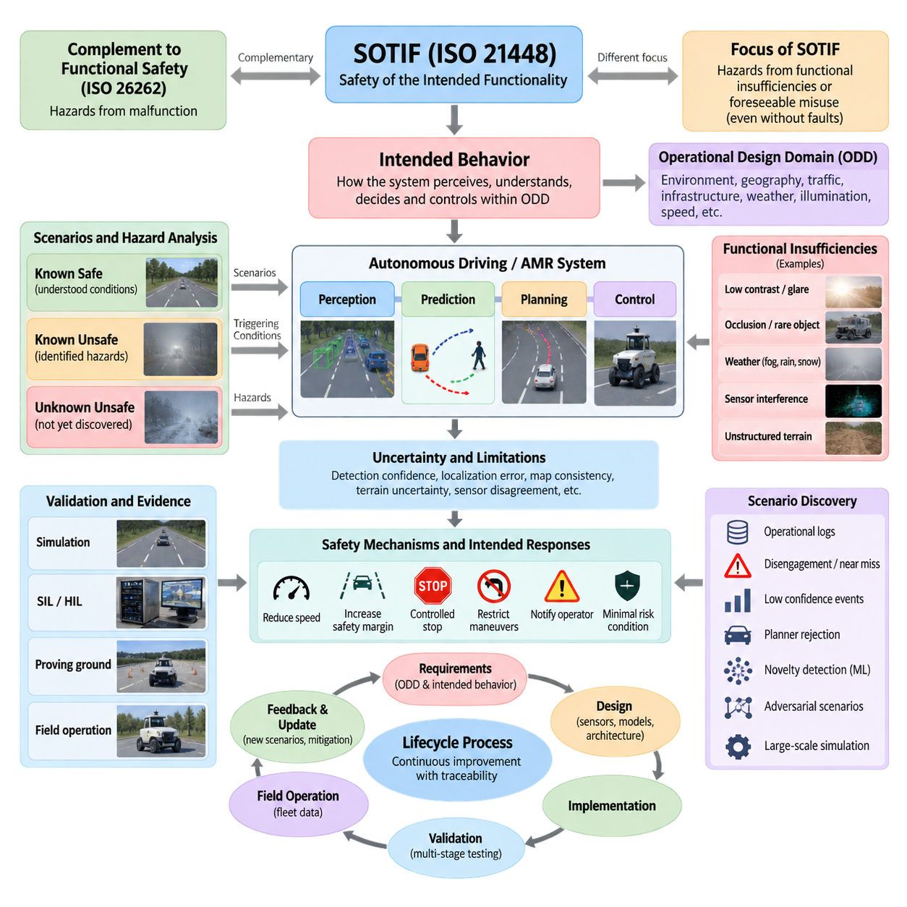
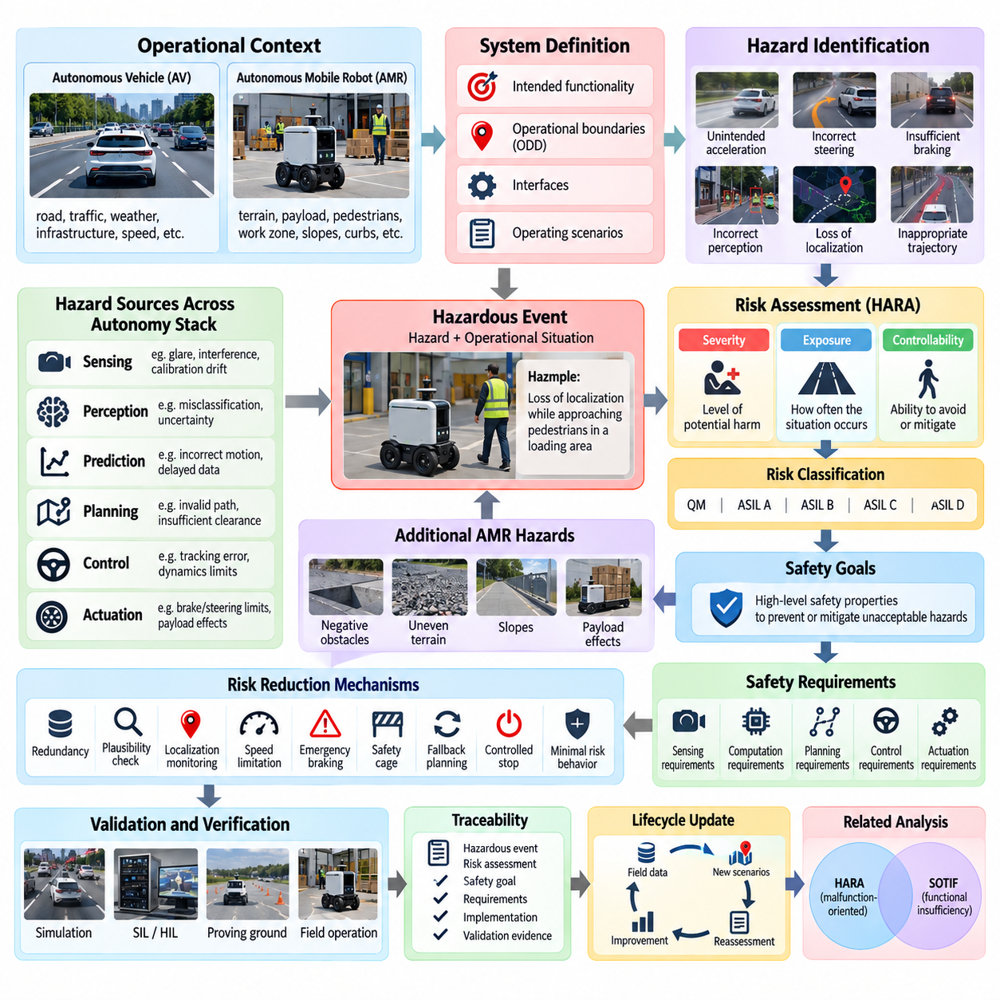
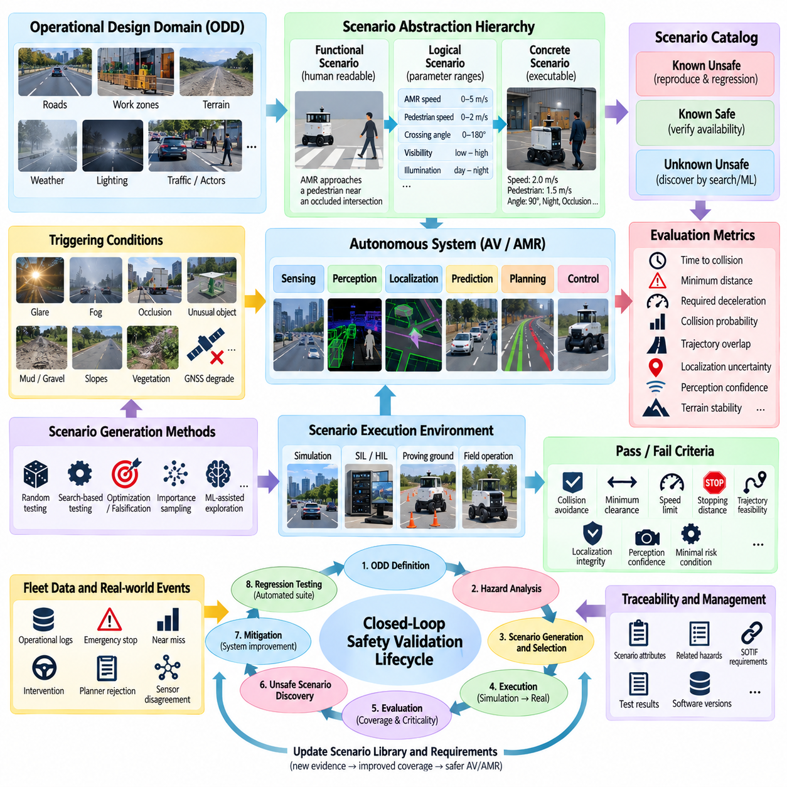
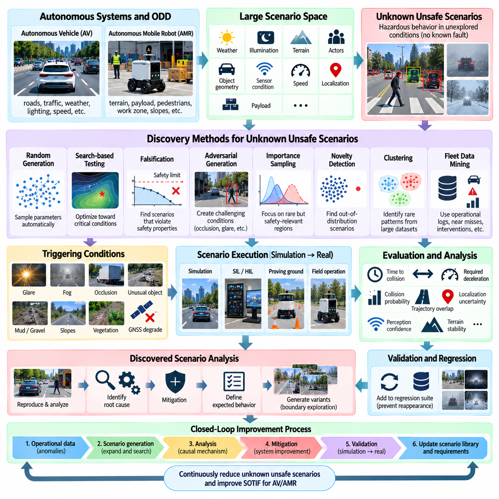
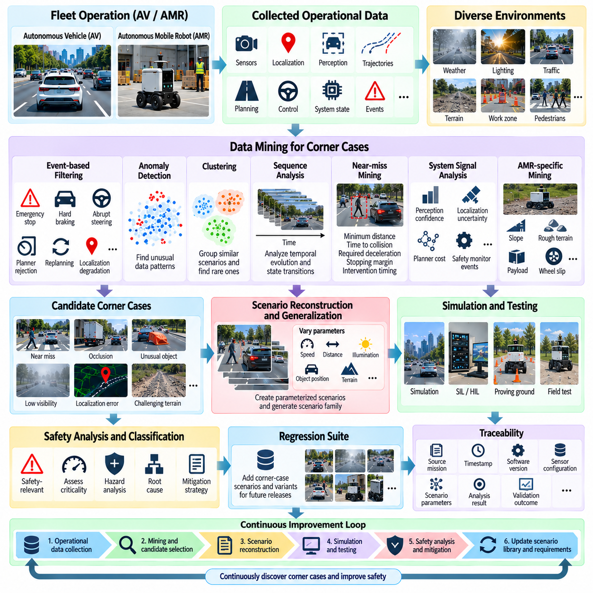
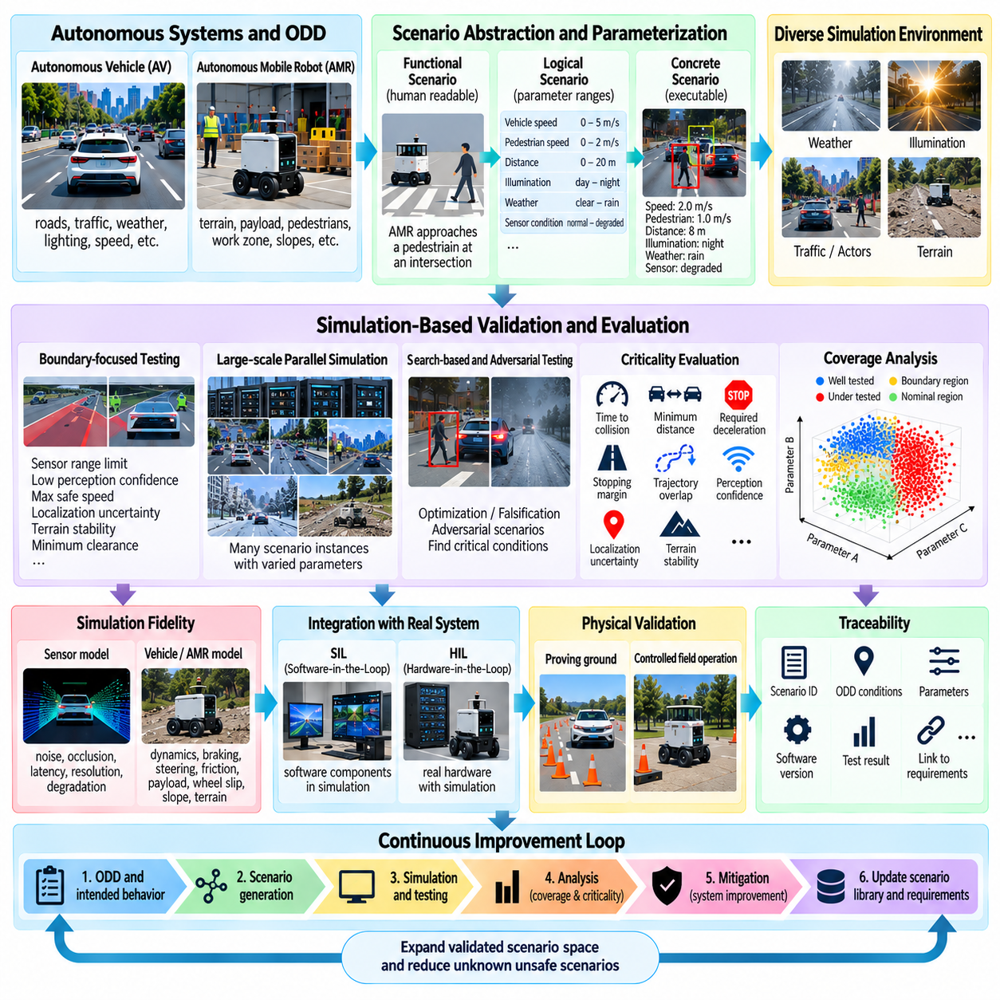
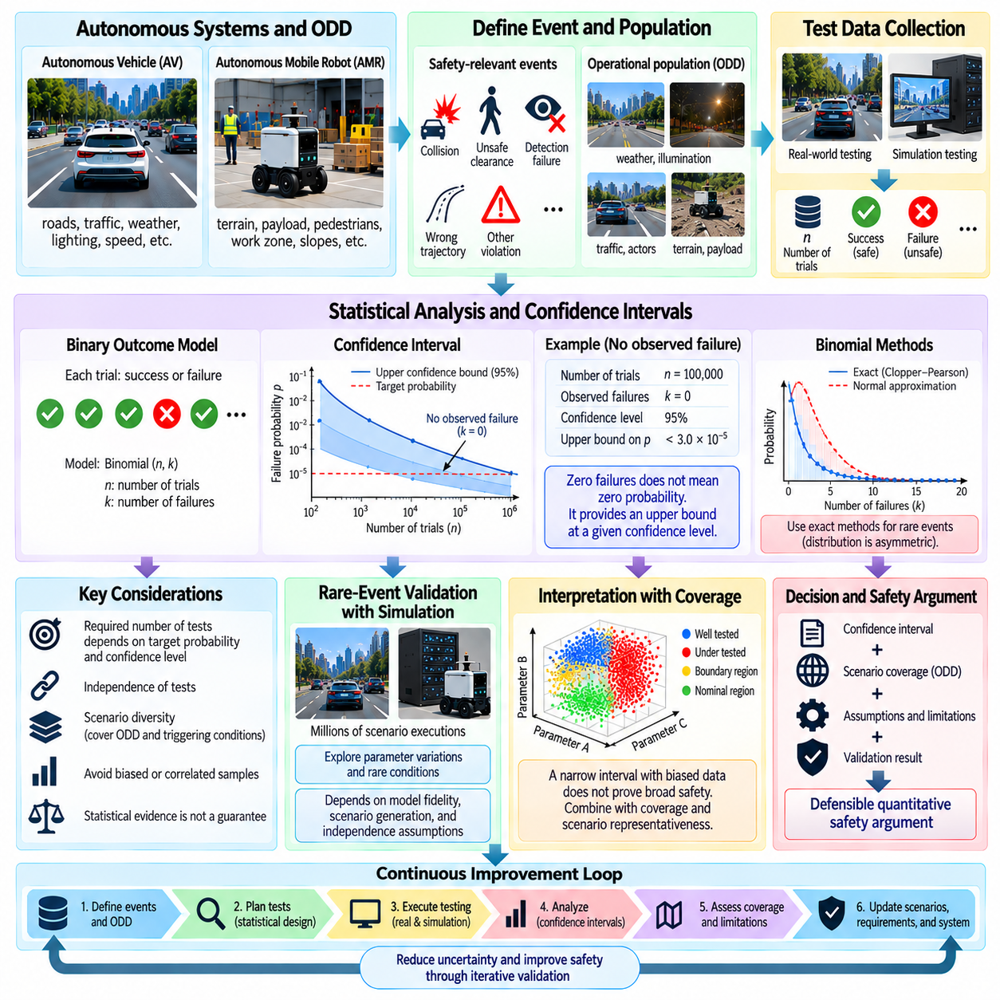
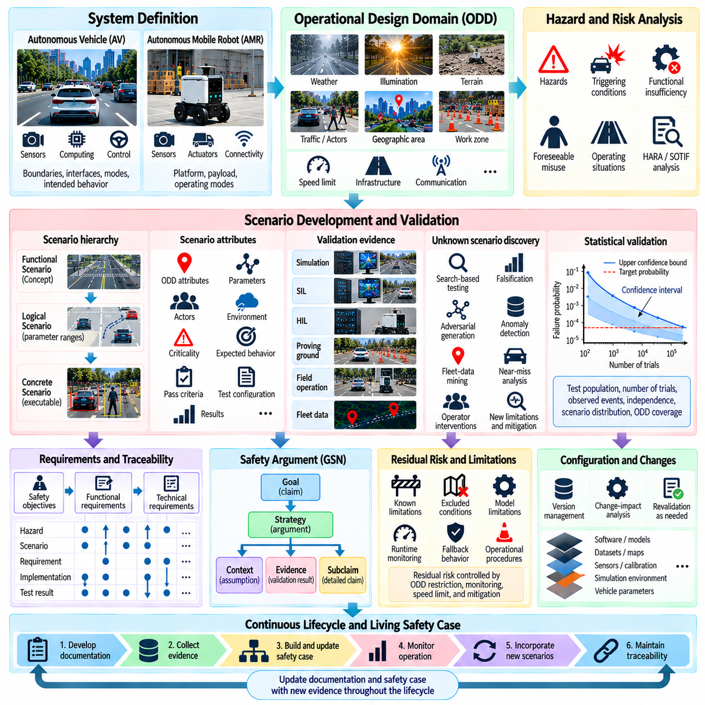
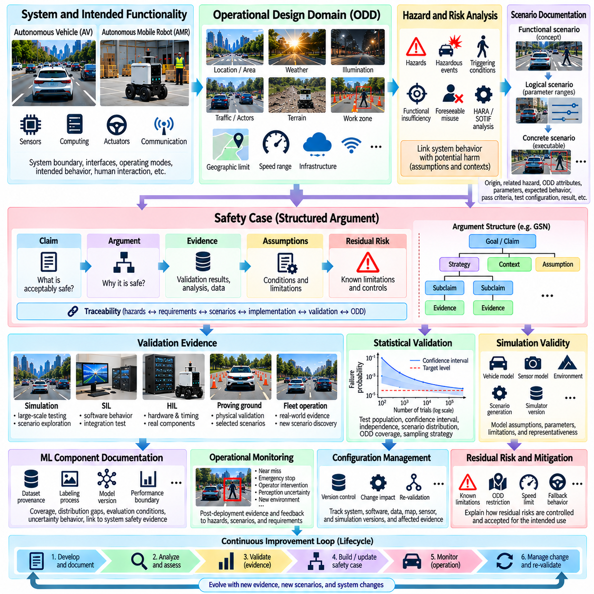
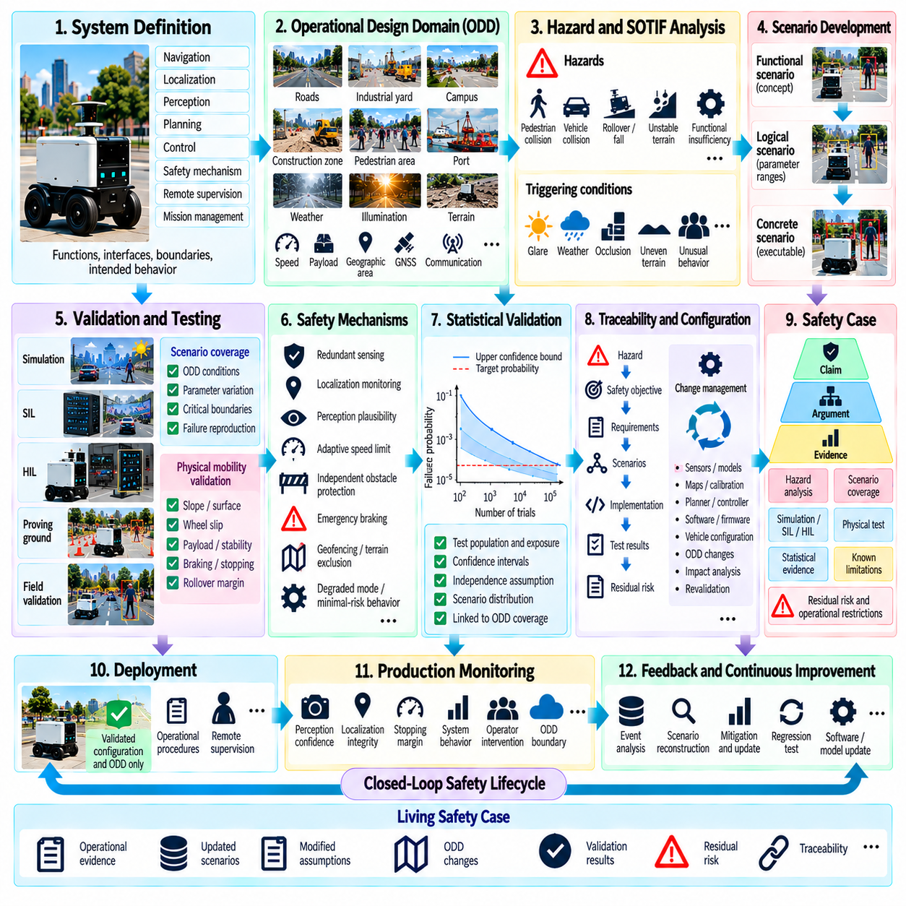

**Volume 12. Autonomous Driving Software**

# Chapter 11. SOTIF and Safety Validation

## 11.01. SOTIF ISO 21448 Framework and Intended Behavior

{width="7.268055555555556in" height="7.268055555555556in"}

의도된 기능의 안전성(Safety of the Intended Functionality, SOTIF)은 ISO 21448에 표준화되어 있으며, 자율주행 시스템에 기존의 하드웨어 또는 소프트웨어 고장이 존재하지 않는 경우에도 발생할 수 있는 위험요인(hazard)을 다룬다. 핵심 관심사는 의도된 기능(intended functionality) 자체가 성능 한계, 불충분한 상황 이해, 합리적으로 예측 가능한 오사용(reasonably foreseeable misuse), 또는 시스템 설계에서 가정한 능력을 초과하는 운용 조건으로 인해 안전하지 않은 행동을 발생시킬 수 있는지 여부이다.

이러한 관점은 기능 안전(functional safety)을 보완한다. ISO 26262가 주로 전기·전자 시스템의 오작동 행위(malfunctioning behavior)로 인해 발생하는 위험을 다루는 반면, SOTIF는 구성요소가 설계된 대로 작동하고 있는 상황에서도 기능적 불충분성(functional insufficiency)이나 합리적으로 예측 가능한 오사용으로 인해 발생하는 위험을 다룬다. 자율주행(autonomous driving)과 야외 자율이동로봇(outdoor AMR)에서는 기술적으로 정상인 인지(perception) 또는 계획(planning) 모듈도 모호하거나 익숙하지 않은 조건에 직면하면 안전하지 않은 결정을 내릴 수 있으므로 두 관점이 모두 필요하다.

의도된 행동(intended behavior)의 개념은 SOTIF의 핵심 요소이다. 의도된 행동은 시스템이 정의된 운용 조건 내에서 환경을 어떻게 인지하고, 상황을 해석하며, 행동을 선택하고, 차량을 제어할 것으로 기대되는지를 설명한다. 여기에는 정상적인 주행 행동, 다른 도로 이용자와의 상호작용, 불확실한 인지에 대한 대응, 운용 상태 간 전환, 그리고 신뢰도 또는 환경 조건이 허용 가능한 수준을 벗어났을 때 수행되는 대체 행동(fallback action)이 포함된다.

따라서 의도된 행동은 운용설계영역(Operational Design Domain, ODD)과 명시적으로 연결되어야 한다. ODD는 자동화 기능이 작동하도록 설계된 환경, 지리적 범위, 운용 조건, 교통 상황, 인프라, 날씨, 조도, 속도 및 기타 조건을 정의한다. 해당 영역 내부에서는 충분히 안전하다고 판단되는 행동도 영역을 벗어나면 부적절해질 수 있으므로, ODD 모니터링(ODD monitoring)과 경계 감지(boundary detection)는 안전 아키텍처(safety architecture)의 중요한 요소가 된다.

SOTIF 분석은 상황이 알려져 있는지 또는 알려져 있지 않은지, 그리고 안전한지 또는 안전하지 않은지에 따라 상황을 구분한다. 알려진 안전 시나리오(known safe scenario)는 의도된 기능이 적절하게 작동하는 것으로 이해된 운용 조건을 의미한다. 알려진 불안전 시나리오(known unsafe scenario)는 개발 과정에서 이미 식별된 위험 조건이다. 알려지지 않은 불안전 시나리오(unknown unsafe scenario)는 개발자가 아직 발견하지 못한 위험한 조건의 조합이나 유발 조건(triggering condition)을 포함하기 때문에 특히 중요하다.

이러한 분류는 반복적인 안전 목표(safety objective)를 형성한다. 개발 과정에서는 알려진 시나리오에서 허용 가능한 행동을 입증하고, 알려진 불안전 조건을 식별하여 완화하며, 알려지지 않은 불안전 조건의 영역을 체계적으로 축소하는 것을 목표로 한다. 복잡한 자율 시스템에서 불확실성을 완전히 제거하는 것은 일반적으로 현실적이지 않기 때문에, SOTIF 엔지니어링(SOTIF engineering)은 잔여 위험(residual risk)이 감소되었으며 시스템의 한계가 적절하게 감지·제어되거나 제한된다는 것을 보여주는 구조화된 증거를 중요하게 다룬다.

유발 조건(triggering condition)은 기능적 불충분성을 드러내고 잠재적으로 위험한 행동으로 이어질 수 있는 특정 상황이다. 대표적인 예로 낮은 대비(low contrast), 눈부심(glare), 안개(fog), 부분 가림(partial occlusion), 비정상적인 객체 형상, 열화된 도로 표시, 센서 간섭(sensor interference), 모호한 자유공간 경계(free-space boundary), 예상하지 못한 보행자 행동 등이 있다. 유발 조건 자체가 반드시 구성요소의 고장을 의미하는 것은 아니며, 인지, 예측(prediction), 계획, 위치추정(localization), 또는 제어(control)의 한계를 노출시키는 조건을 의미한다.

야외 자율이동로봇(outdoor AMR)의 경우 유발 조건은 일반적인 도로 주행의 가정을 넘어 더욱 다양하게 확장된다. 자갈, 진흙, 경사면, 연석, 포트홀, 식생, 건설 자재, 반사 표면, 하역 장비, 불규칙한 보행자 이동, 위성항법시스템 열화(GNSS degradation), 빠르게 변화하는 작업 구역 등이 인지 결과와 실제 주행가능성(traversability) 사이의 관계를 변화시킬 수 있다. 따라서 안전 검증(safety validation)은 의미론적 장면 이해뿐 아니라 로봇, 지형, 적재물(payload), 환경 사이의 물리적 상호작용도 함께 고려해야 한다.

기능적 불충분성(functional insufficiency)은 자율주행 파이프라인(autonomy pipeline) 전체에서 발생할 수 있다. 카메라가 정상적으로 동작하더라도 눈부심 상황에서는 충분한 정보를 제공하지 못할 수 있다. 라이다(LiDAR)가 유효한 측정값을 반환하더라도 반사성 또는 흡수성 재질 주변에서는 이를 해석하기 어려울 수 있다. 신경망(neural network)은 그럴듯하지만 잘못된 분류를 생성할 수 있으며, 계획기는 불완전한 예측을 기반으로 수학적으로는 유효하지만 실제로는 부적절한 궤적을 생성할 수 있다. SOTIF는 이러한 한계가 어떻게 위험한 차량 행동으로 전파되는지를 고려한다.

인지 불확실성(perception uncertainty)은 특히 중요하다. 하위 단계 모듈은 환경에 대한 직접적인 지식이 아니라 추정값을 입력으로 사용하는 경우가 많기 때문이다. 따라서 검출 신뢰도(detection confidence), 위치추정 공분산(localization covariance), 객체 추적 안정성(object-track stability), 지도 일관성(map consistency), 지형 불확실성(terrain uncertainty), 센서 불일치(sensor disagreement)는 안전과 관련된 중요한 정보가 될 수 있다. SOTIF 지향 아키텍처는 불확실한 입력을 일반적인 측정값처럼 처리하는 대신 불확실성을 전파하여 속도를 제한하고, 안전 여유를 증가시키며, 중복 시스템(redundancy)을 활성화하거나 대체 행동을 수행할 수 있다.

의도된 행동 명세(intended behavior specification)는 정상적인 주행 동작 이상의 내용을 정의해야 한다. 자율 시스템이 불완전하거나 상충되거나 지연된 정보 또는 검증된 한계를 벗어난 정보를 받았을 때 어떻게 행동할 것인지를 설명해야 한다. 보수적인 속도 감소, 추종 거리 증가, 궤적 거부(trajectory rejection), 제어된 정지(controlled stopping), 기동 제한, 운영자 알림(operator notification), 최소 위험 상태(minimal risk condition)로의 전환 등을 불확실성 임계값과 운용 경계에 연결된 명시적인 행동으로 정의할 수 있다.

따라서 안전 검증(safety validation)에는 운용 조건, 유발 조건, 기능적 한계, 시스템 대응, 잠재적 위험을 서로 연결하는 시나리오가 필요하다. 시나리오의 가치는 단순히 많은 거리의 시뮬레이션 또는 실제 주행을 수행하는 데 있는 것이 아니라, 행동 경계 부근에서 의미 있는 매개변수 조합을 시험하는 데 있다. 매개변수화된 시나리오 집합(parameterized scenario family)을 사용하면 날씨, 조도, 객체 움직임, 지형, 센서 품질, 위치추정 불확실성, 상호작용 패턴 등을 체계적으로 변화시키면서 검증할 수 있다.

SOTIF 검증은 서로 보완적인 여러 증거 자료를 결합함으로써 효과를 높일 수 있다. 시뮬레이션(simulation)은 대규모 탐색과 제어된 매개변수 변화를 제공하고, 소프트웨어 인 더 루프(Software-in-the-Loop, SIL) 및 하드웨어 인 더 루프(Hardware-in-the-Loop, HIL) 시험은 구현과 통합에 따른 영향을 확인한다. 시험장(proving ground) 시험은 선택된 중요 시나리오를 재현하며, 실제 현장 운용(field operation)은 개발 과정에서 예상하지 못했던 자연적인 상황을 발견하도록 한다. 이후 플릿 데이터(fleet data)를 통해 발견된 엣지 케이스(edge case)를 다시 시뮬레이션, 회귀 시험(regression testing), 모델 개선 과정으로 피드백할 수 있다.

시나리오 발견(scenario discovery)은 알려지지 않은 불안전 행동을 줄이는 데 특히 중요하다. 운용 로그, 자율주행 해제(disengagement), 비상 정지(emergency stop), 아차 사고(near miss), 낮은 신뢰도의 인지 이벤트, 계획기 거부(planner rejection), 비정상적인 제어기 개입, 센서 불일치 등을 분석하여 잠재적인 코너 케이스(corner case)를 발굴할 수 있다. 머신러닝(machine learning), 군집화(clustering), 신규성 탐지(novelty detection), 탐색 기반 시험(search-based testing), 적대적 시나리오 생성(adversarial scenario generation), 대규모 시뮬레이션을 이용하면 수작업으로 설계한 시험 목록을 넘어 이러한 탐색 과정을 확장할 수 있다.

학습 기반 기능은 행동이 결정론적 요구사항만으로 정의되는 것이 아니라 데이터로부터 학습되기 때문에 SOTIF와 머신러닝(machine learning)의 관계는 특별한 주의가 필요하다. 데이터셋 커버리지(dataset coverage), 라벨링 품질(labeling quality), 클래스 불균형(class imbalance), 도메인 시프트(domain shift), 희귀 객체 표현, 환경 다양성, 모델 불확실성(model uncertainty)은 의도된 기능에 영향을 줄 수 있다. 따라서 안전 엔지니어링은 평균 검출 정확도와 같은 종합 지표에만 의존하지 않고 데이터 거버넌스(data governance)와 모델 평가를 시스템 수준의 시나리오와 연결해야 한다.

인지 모델(perception model)의 전체 정확도가 높더라도 안전에 중요한 운용 영역에서 오류가 집중된다면 허용하기 어려울 수 있다. 검증 과정에서는 거리, 상대 속도, 조도, 날씨, 객체 유형, 가림(occlusion), 지형 및 기타 관련 변수에 따른 조건부 성능을 조사해야 한다. 이러한 조건부 분석(conditional analysis)은 종합 지표가 감출 수 있는 성능 경계(performance boundary)를 드러내며, 식별된 한계를 중심으로 운용 제약이나 완화 메커니즘(mitigation mechanism)을 설정하는 데 도움을 준다.

SOTIF는 아키텍처 수준의 모니터링(architectural monitoring)과도 밀접하게 연관된다. 런타임 안전 모니터(runtime safety monitor)는 기본 자율주행 로직과 독립적으로 신뢰도, 센서 일관성, 위치추정 무결성(localization integrity), 궤적 실행 가능성(trajectory feasibility), 정지 거리, ODD 준수 여부, 통신 상태 등을 관찰할 수 있다. 모니터링 변수들이 검증된 경계에 접근하면 명확한 고장이 발생할 때까지 기다리지 않고 기능을 점진적으로 축소함으로써 불확실성을 제어 가능한 운용 행동으로 전환할 수 있다.

야외 자율이동로봇(outdoor AMR)에서는 이러한 개념을 계층형 대응 전략(layered response strategy)으로 구현할 수 있다. 인지 품질, 위치추정 신뢰도, 지형 평가, 예측된 여유 공간이 검증된 한계를 만족하면 정상 운용을 허용한다. 불확실성이 증가하면 속도를 낮추거나 장애물 안전 여유를 확대할 수 있다. 불확실성이 지속되면 가능한 기동을 제한하며, 심각하거나 해결되지 않는 불확실성이 발생하면 제어된 정지 또는 해당 운용 환경에 적합하도록 정의된 최소 위험 행동(minimal-risk behavior)을 수행할 수 있다.

SOTIF 엔지니어링은 최종 검증 활동이 아니라 전체 수명주기 프로세스(lifecycle process)로 다루어야 한다. 의도된 행동과 ODD에 관한 가정은 요구사항, 센서 선정, 인지 아키텍처, 계획 제약, 시뮬레이션 설계, 데이터 수집, 현장 시험에 영향을 미친다. 검증 과정에서 수집된 증거는 이전에 알려지지 않았던 한계를 발견할 수 있으며, 이러한 결과는 이후 개발 반복 과정에서 요구사항, 모델, 안전 메커니즘, 시나리오 라이브러리(scenario library), 운용 제약을 다시 수정하는 데 활용된다.

이러한 수명주기 전체에서는 추적성(traceability)이 필수적이다. 식별된 위험요인은 유발 조건, 기능적 불충분성, 안전 요구사항(safety requirement), 완화 메커니즘, 검증 시나리오, 시험 결과, 잔여 위험 논증(residual-risk argument)과 연결되어야 한다. 이를 통해 잠재적인 불안전 행동에서 해당 위험을 통제하기 위해 사용된 공학적 증거까지 감사 가능한 연결 구조(auditable chain)를 형성할 수 있으며, 기술적 의사결정과 일관된 안전 사례(safety case)의 구축을 지원한다.

자율주행 소프트웨어와 야외 자율이동로봇(outdoor AMR)에서 ISO 21448 프레임워크의 실질적인 가치는 규제 준수 문서를 작성하는 데만 국한되지 않는다. 이 프레임워크는 정상적으로 작동하는 자율 시스템도 여전히 안전하지 않게 행동할 수 있는지, 성능 경계가 어디에 존재하는지, 어떤 조건이 이러한 경계를 노출하는지, 그리고 시스템이 이에 어떻게 대응해야 하는지를 체계적으로 분석하는 방법을 제공한다. 결과적으로 의도된 행동, ODD 정의, 시나리오 발견, 불확실성 관리, 검증, 운용 피드백을 하나의 지속적인 안전 엔지니어링 루프(continuous safety-engineering loop)로 연결한다.

## 11.02. Hazard Analysis HARA for AV AMR Systems

{width="7.268055555555556in" height="7.268055555555556in"}

위험 분석 및 위험 평가(Hazard Analysis and Risk Assessment, HARA)는 위험한 행동을 식별하고, 잠재적인 결과를 평가하며, 자율주행차(Autonomous Vehicle, AV)와 자율이동로봇(Autonomous Mobile Robot, AMR)을 위한 안전 요구사항(safety requirements)을 도출하는 체계적인 방법을 제공한다. AV 및 AMR 개발에서 HARA는 운용 상황(operational situation)과 발생 가능한 시스템 행동을 연결함으로써 개별 구성요소의 고장이 아니라 차량 수준에서 경험할 수 있는 위험요인(hazard)을 중심으로 안전 엔지니어링(safety engineering)을 시작하도록 한다.

분석은 일반적으로 시스템, 의도된 기능(intended functionality), 운용 경계(operational boundary), 인터페이스(interface), 관련 운용 시나리오(operating scenario)를 정의하는 것에서 시작한다. 자율주행 시스템에서는 도로 유형, 차량 속도, 교통 상호작용, 날씨, 인프라 등이 포함될 수 있다. 야외 자율이동로봇(outdoor AMR)에서는 지형, 적재물(payload), 보행자와의 거리, 작업 구역 구조, 경사면, 연석, 사람과 기계가 혼재하는 교통 환경 등이 중요한 운용 조건으로 추가된다.

위험요인(hazard)은 특정 운용 상황에서 시스템 행동으로 인해 발생할 수 있는 잠재적인 위해(harm)의 원인을 의미한다. 따라서 위험요인 식별(hazard identification)은 개별 센서, 프로세서 또는 액추에이터(actuator)의 고장 여부만을 고려하지 않는다. 의도하지 않은 가속, 잘못된 조향, 불충분한 제동, 잘못된 자유공간 추정(free-space estimation), 위치추정 상실, 지연된 장애물 대응, 부적절한 궤적 생성 등은 관련 환경 조건과 결합될 경우 모두 위험한 행동이 될 수 있다.

위험 사건(hazardous event)은 위험요인과 운용 상황을 결합하여 구성한다. 위치추정 상실(loss of localization) 자체는 하나의 시스템 상태를 나타내지만, AMR이 보행자 주변을 이동하거나 하역 구역에 접근하는 동안 위치추정을 상실하는 상황은 보다 의미 있는 위험 사건을 형성한다. 이러한 시나리오 지향 표현(scenario-oriented representation)은 엔지니어가 시스템 수준에서 결과를 분석할 수 있도록 하며 자율 행동, 운용 환경, 잠재적 위해 사이에 직접적인 연결 관계를 형성한다.

전통적인 자동차 HARA에서는 일반적으로 심각도(severity), 노출도(exposure), 통제 가능성(controllability)을 이용하여 위험 사건을 평가한다. 심각도는 위험 사건이 발생했을 때 예상되는 위해의 수준을 나타낸다. 노출도는 관련 운용 상황을 얼마나 자주 경험할 수 있는지를 나타내며, 통제 가능성은 영향을 받는 사람이나 다른 참여자가 발생한 위해를 회피하거나 완화할 수 있는 능력을 평가한다. 이러한 요소는 위험 분류(risk classification)와 안전 요구사항 도출을 위한 체계적인 기반을 제공한다.

AV 및 AMR 시스템에서는 자율화가 인간 운영자의 역할을 변화시키므로 이러한 요소를 신중하게 해석해야 한다. 고도로 자동화된 로봇은 운전자가 즉시 개입할 수 없는 상태에서 운용될 수 있으며, 로봇 주변의 보행자는 시스템의 내부 상태를 거의 알지 못할 수 있다. 따라서 통제 가능성에 대한 가정은 실제 운용 환경, 사용 가능한 감독 체계, 로봇 속도, 정지 능력, 경고 메커니즘(warning mechanism), 예상되는 인간의 대응을 반영해야 한다.

심각도 분석(severity analysis)은 자율 플랫폼의 물리적 특성을 고려해야 한다. 차량 질량, 최대 속도, 제동 거리, 적재물, 형상, 운동에너지(kinetic energy), 교통약자(vulnerable road user)와의 상호작용은 위험 행동의 잠재적 결과에 영향을 준다. 상대적으로 낮은 속도로 운행하는 야외 AMR은 승용 차량과 다른 위험 특성을 가질 수 있지만, 무거운 적재물, 급경사 지형, 제한된 공간 또는 산업 장비와의 상호작용은 여전히 심각한 위험 상황을 발생시킬 수 있다.

노출도(exposure) 역시 일반적인 확률로 취급하기보다 운용설계영역(Operational Design Domain, ODD)을 기준으로 평가해야 한다. 물류 야드(warehouse yard)에 배치된 AMR은 지게차, 작업자, 하역장, 임시 장애물, 변화하는 교통 흐름을 빈번하게 경험할 수 있다. 반면 보안 순찰 로봇(security patrol robot)은 야간 운용, 낮은 조도, 날씨 변화, 드문 보행자 출현, 반복되는 경로 등을 경험할 수 있다. 따라서 위험 평가는 실제 임무 프로파일(mission profile)을 반영해야 한다.

통제 가능성(controllability)은 회피 가능성이 로봇과 주변 참여자 모두의 행동에 의존할 수 있기 때문에 자율 시스템에서 특히 어려운 평가 요소이다. 보행자는 개방된 공간에서 천천히 접근하는 로봇을 피할 수 있지만, 시야가 가려져 있거나 공간이 제한된 상황에서는 대응할 기회가 거의 없을 수 있다. 따라서 자율적인 완화 조치가 합리적으로 제공될 수 있는 경우 시스템 아키텍처(system architecture)는 외부 인간의 개입에 지나치게 의존하지 않도록 설계되어야 한다.

HARA 결과는 허용할 수 없는 위험 행동을 방지하거나 완화하기 위해 필요한 상위 수준의 안전 속성을 정의하는 안전 목표(safety goal)를 도출하는 데 사용된다. 안전 목표에는 의도하지 않은 가속 방지, 안전한 정지 능력 유지, 잘못된 위치추정 감지, 점유 공간으로 진입하는 궤적 방지 등이 포함될 수 있다. 이후 이러한 목표는 센싱(sensing), 연산(computation), 계획(planning), 제어(control), 구동(actuation)에 분배되는 기능적 및 기술적 안전 요구사항으로 구체화된다.

자율 시스템의 위험 분석에서는 전체 인지-예측-계획-제어(perception-prediction-planning-control) 체인에서 발생하는 오류 전파(error propagation)를 고려해야 한다. 잘못된 객체 분류는 움직임 예측을 변화시키고, 이는 계획기의 의사결정을 변경하여 궁극적으로 안전하지 않은 제어 명령을 생성할 수 있다. 마찬가지로 지연된 타임스탬프(timestamp) 또는 일관되지 않은 좌표계(coordinate frame)는 개별적으로는 작은 오류처럼 보이지만 결합될 경우 차량 수준에서 상당한 공간적 또는 시간적 편차를 발생시킬 수 있다.

센서 관련 위험(sensor-related hazard)은 완전한 고장뿐 아니라 정보 품질 저하(degraded information quality)도 분석해야 한다. 카메라 눈부심, 라이다(LiDAR) 성능 저하, 레이더 간섭(radar interference), 위성항법시스템 다중경로(GNSS multipath), 보정값 변화(calibration drift), 시간 정렬 오류(timing misalignment), 부분적인 시야각(field of view) 차단 등은 기존의 고장 감지 방식으로 즉시 발견되지 않을 수 있다. 이러한 현상의 안전 중요성은 자율주행 스택이 해당 정보를 어떻게 해석하고 중복성(redundancy), 불확실성 모니터링, 대체 메커니즘(fallback mechanism)이 위험 행동을 방지할 수 있는지에 따라 결정된다.

계획(planning)과 제어(control)는 또 다른 유형의 위험을 발생시킨다. 계획기는 충돌이 없는 경로를 생성하더라도 차량 동역학(vehicle dynamics), 정지 거리 제약, 지형 한계 또는 허용 가능한 안전 여유(clearance margin)를 위반할 수 있다. 제어기는 요청된 궤적을 정확하게 추종하더라도 타이어 미끄러짐(tire slip)이나 적재물 변화로 실제 물리적 응답이 달라질 수 있다. 따라서 HARA는 소프트웨어의 의사결정을 플랫폼의 실제 동적 능력과 제약 조건에 연결해야 한다.

야외 자율이동로봇(outdoor AMR)에서는 주행가능성(traversability)과 지형 상호작용(terrain interaction)에 관련된 추가적인 위험 범주를 고려해야 한다. 음의 장애물(negative obstacle), 느슨한 자갈, 진흙, 경사면, 배수로, 연석, 식생, 건설 잔해, 불규칙한 노면은 불안정, 이동 불능, 충돌 또는 전복(rollover)을 발생시킬 수 있다. 적재물의 위치와 질량 분포 또한 제동 및 안정성 특성을 변화시킬 수 있으므로 임무 구성(mission configuration)은 위험 분석의 중요한 매개변수가 된다.

HARA와 의도된 기능의 안전성(Safety of the Intended Functionality, SOTIF) 분석은 밀접하게 관련되어 있지만 서로 다른 안전하지 않은 행동의 원인을 다룬다. HARA는 전통적으로 위험 사건을 식별하고 위험도를 평가하는 구조화된 프레임워크를 제공하는 반면, SOTIF는 기존의 오작동이 존재하지 않더라도 기능적 불충분성(functional insufficiency)과 예측 가능한 오사용(foreseeable misuse)으로 발생하는 위험을 강조한다. 따라서 자율 시스템의 안전은 오작동 중심 분석과 성능 한계를 다루는 시나리오 기반 분석을 연결함으로써 강화될 수 있다.

이러한 연결은 머신러닝 기반 인지(machine-learning-based perception)에서 특히 중요하다. 신경망(neural network)은 구현된 방식 그대로 정확하게 실행되면서도 희귀 객체, 비정상적인 조명 조건 또는 익숙하지 않은 환경에서 잘못된 결과를 생성할 수 있다. 이러한 행동은 단순한 구성요소 고장 모델(component-failure model)로 설명하기 어려울 수 있다. 그러나 위험한 결과 자체는 HARA를 통해 분석할 수 있으며, SOTIF 기반 시나리오 분석은 해당 행동을 발생시키는 유발 조건(triggering condition)과 성능 한계(performance limitation)를 조사할 수 있다.

위험 저감 메커니즘(risk reduction mechanism)은 개발 마지막 단계에서 독립적으로 추가하는 것이 아니라 식별된 위험 사건으로부터 도출되어야 한다. 중복 센싱(redundant sensing), 타당성 검사(plausibility checking), 위치추정 무결성 모니터링(localization integrity monitoring), 속도 제한, 비상 제동(emergency braking), 안전 케이지(safety cage), 워치독(watchdog), 대체 계획(fallback planning), 제어된 정지(controlled stopping), 최소 위험 행동(minimal-risk behavior)은 서로 다른 위험 경로를 해결할 수 있다. 이러한 메커니즘의 효과는 각각이 도입된 운용 상황을 대상으로 검증되어야 한다.

추적성(traceability)은 위험 분석을 구현 및 검증(verification)과 연결한다. 각각의 중요한 위험 사건은 가정, 위험 평가, 안전 목표, 도출된 요구사항, 아키텍처 메커니즘, 검증 증거(validation evidence)와 연계되어야 한다. ODD, 센서 구성, 차량 동역학, 적재 한계 또는 자율주행 소프트웨어가 변경될 경우 이러한 추적성을 이용하여 어떤 위험 분석과 안전 논증(safety argument)을 다시 평가해야 하는지 판단할 수 있다.

따라서 HARA는 초기 설계 과정에서 한 번 작성하고 종료되는 문서가 아니라 자율 시스템과 함께 지속적으로 발전해야 한다. 시뮬레이션 결과, 현장 시험(field test), 자율주행 해제(disengagement), 아차 사고(near miss), 플릿 로그(fleet log), 새롭게 발견된 코너 케이스(corner case), 운용 사고 등은 이전에 과소평가되었거나 고려되지 않았던 위험 상황을 드러낼 수 있다. 이러한 증거를 다시 위험 분석에 반영하면 설계 가정과 실제 시스템 행동을 연결하는 폐루프 안전 개발(closed-loop safety development) 체계를 구축할 수 있다.

AV 및 야외 AMR 개발에서 HARA의 실질적인 목적은 광범위한 안전 우려를 명시적인 공학적 의무(engineering obligation)로 변환하는 것이다. 운용 상황, 위험 행동, 심각도, 노출도, 통제 가능성, 안전 목표, 완화 메커니즘, 검증 증거를 서로 연결함으로써 정의된 ODD와 전체 운용 수명주기(operational lifecycle)에 걸쳐 자율 시스템이 허용 가능한 수준의 안전성을 유지하도록 설계하기 위한 체계적인 기반을 제공한다.

## 11.03. Scenario Based Testing Methodology for SOTIF

{width="7.268055555555556in" height="7.268055555555556in"}

시나리오 기반 시험(Scenario-based Testing)은 자율 시스템이 환경 조건, 교통 상호작용, 시스템 한계, 유발 사건(triggering event)의 의미 있는 조합을 대상으로 평가되어야 하기 때문에 의도된 기능의 안전성(Safety of the Intended Functionality, SOTIF)을 검증하는 핵심 방법론이다. 단순히 누적 주행 거리에 의존하는 대신, 기존의 하드웨어나 소프트웨어 고장이 없어도 안전하지 않은 행동을 노출시킬 수 있는 상황을 중심으로 검증을 구성한다.

시나리오(scenario)는 시간의 흐름에 따라 변화하는 운용 상황(operational situation)을 표현한다. 시나리오는 자율 행동에 영향을 주는 관련 객체, 인프라, 환경 조건, 시스템 상태, 궤적, 상호작용, 사건 등을 기술한다. 자율주행차(Autonomous Vehicle, AV) 또는 야외 자율이동로봇(outdoor AMR)의 경우 보행자, 차량, 장애물, 지형, 날씨, 조도, 위치추정 품질, 센서 가시성, 속도, 사용 가능한 기동 공간 등이 포함될 수 있다.

시나리오 기반 시험은 일반적으로 서로 다른 추상화 수준(abstraction level)을 통해 단계적으로 구체화된다. 기능 시나리오(functional scenario)는 가려진 교차로 주변에서 보행자에게 접근하는 AMR과 같이 사람이 이해할 수 있는 개념으로 상황을 표현한다. 논리 시나리오(logical scenario)는 이러한 개념을 매개변수 범위와 관계로 변환하며, 구체 시나리오(concrete scenario)는 시뮬레이션, 시험장 또는 현장 실험에서 반복 실행할 수 있도록 특정 수치 값을 할당한다.

이러한 추상화 계층(abstraction hierarchy)을 이용하면 상대적으로 적은 수의 안전 관련 상황을 대규모 시험 공간(test space)으로 체계적으로 확장할 수 있다. 예를 들어 논리적 보행자 횡단 시나리오에서는 로봇 속도, 보행자 속도, 횡단 각도, 가시성, 제동 거리, 조도, 센서 신뢰도, 장애물 가림 정도 등을 변화시킬 수 있다. 각각의 매개변수 조합은 서로 다른 시스템 행동 영역을 탐색하는 후보 구체 시나리오가 된다.

시나리오 선정은 운용설계영역(Operational Design Domain, ODD)과 밀접하게 연결되어야 한다. ODD는 자율 기능이 작동하도록 의도된 조건을 정의하고, 시나리오 카탈로그(scenario catalog)는 해당 경계 내부 또는 경계 부근에서 대표적이면서 도전적인 조건의 조합을 기술한다. 도로, 작업 구역, 지형 유형, 날씨, 조명, 교통 밀도, 보행자 행동, 인프라, 속도 제한, 통신 조건 등이 시나리오 매개변수가 될 수 있다.

SOTIF 시험에서는 기능적 불충분성(functional insufficiency)을 노출시키는 유발 조건(triggering condition)에 특별한 주의를 기울인다. 눈부심(glare)은 카메라 인지 품질을 저하시킬 수 있고, 안개는 유효 센싱 거리를 제한하며, 부분 가림(partial occlusion)은 보행자 감지를 지연시킬 수 있고, 비정상적인 객체 형상은 잘못된 분류를 발생시킬 수 있다. 야외 AMR에서는 진흙, 자갈, 연석, 경사면, 식생, 반사 표면, 위성항법시스템 열화(GNSS degradation), 임시 건설 구역 배치 등이 유사하게 시스템 한계를 노출시킬 수 있다.

알려진 불안전 시나리오(known unsafe scenario)는 위험 특성이 이미 이해되어 있기 때문에 중요한 출발점을 제공한다. 엔지니어는 이러한 상황을 재현하여 완화 메커니즘(mitigation mechanism)을 검증하고, 이전에 식별된 불안전 행동이 다시 발생하지 않도록 회귀 시험(regression test)을 구축할 수 있다. 알려진 안전 시나리오(known safe scenario)도 필요하며, 환경이 검증된 운용 조건에 있음에도 과도한 안전 개입이 가용성, 이동성, 임무 수행 능력을 저하시키는지를 평가해야 한다.

더 어려운 목표는 알려지지 않은 불안전 시나리오(unknown unsafe scenario)를 발견하는 것이다. 안전에 중요한 조합은 고차원 매개변수 공간(high-dimensional parameter space)의 매우 작은 영역에 존재할 수 있기 때문에 무작위 시험만으로는 효율적인 탐색이 어렵다. 탐색 기반 시험(search-based testing), 최적화(optimization), 반증(falsification), 중요도 샘플링(importance sampling), 신규성 탐지(novelty detection), 적대적 시나리오 생성(adversarial scenario generation), 머신러닝 기반 탐색을 이용하여 불안전 행동이 나타날 가능성이 높은 경계 영역에 연산 자원을 집중할 수 있다.

임계도 지표(criticality metric)는 이러한 탐색의 우선순위를 결정하는 데 도움을 준다. 충돌까지의 시간(Time-to-Collision), 대응까지의 시간(Time-to-React), 최소 거리, 요구 감속도(required deceleration), 예측 충돌 확률, 궤적 중첩(trajectory overlap), 정지 여유(stopping margin), 위치추정 불확실성, 인지 신뢰도, 지형 안정성 등이 시나리오가 불안전 상태에 얼마나 가까워지고 있는지를 나타낼 수 있다. 하나의 지표만으로 모든 위험을 표현할 수 없으므로 일반적으로 물리적, 행동적, 인지적, 시스템 수준의 지표를 함께 사용한다.

시나리오 커버리지(scenario coverage)는 단순한 주행거리 커버리지(mileage coverage)와 근본적으로 다르다. 수백만 킬로미터를 주행하더라도 일반적인 조건만 반복적으로 경험한다면 드물지만 안전에 중요한 조합에 대한 증거는 거의 얻지 못할 수 있다. 시나리오 기반 검증은 관련 매개변수 영역, 상호작용 패턴, ODD 조건, 기능 경계(functional boundary), 유발 조건 중 어떤 부분이 실제로 시험되었는지를 분석하여 시험 활동을 식별된 안전 문제와 직접 연결한다.

커버리지 모델(coverage model)은 시나리오 매개변수를 여러 범위 또는 동등 클래스(equivalence class)로 구분하고 어떤 조합이 시험되었는지를 추적할 수 있다. 자율 시스템의 성능은 센싱 한계, 정지 거리 임계값, 위치추정 허용오차, 지형 제약, ODD 경계 부근에서 급격하게 변화할 수 있으므로 경계 조건(boundary condition)이 특히 중요하다. 조합 시험(combinatorial testing)을 이용하면 가능한 모든 구성을 전수 조사하지 않고도 매개변수 사이의 상호작용을 탐색할 수 있다.

시뮬레이션(simulation)은 많은 수의 구체 시나리오를 안전하고 반복 가능한 방식으로 실행할 수 있기 때문에 특히 중요하다. 날씨, 조명, 객체 궤적, 센서 특성, 마찰력, 지형, 통신 지연, 위치추정 품질 등을 통제된 조건에서 변화시킬 수 있다. 가속 및 병렬 시뮬레이션(accelerated and parallel simulation)을 이용하면 수천 또는 수백만 개의 시나리오 변형을 평가할 수 있으며, 결정론적 재생(deterministic replay)은 불안전 행동 발견 이후 디버깅과 회귀 분석을 지원한다.

그러나 시뮬레이션 결과는 모델 충실도(model fidelity)를 고려하여 해석해야 한다. 센서 노이즈, 차량 동역학, 지형 상호작용, 보행자 행동, 환경 효과가 비현실적으로 표현된다면 안전한 것으로 보이는 결과도 잘못된 판단을 유도할 수 있다. 따라서 시나리오 기반 SOTIF 검증은 시뮬레이션과 함께 소프트웨어 인 더 루프(Software-in-the-Loop, SIL), 하드웨어 인 더 루프(Hardware-in-the-Loop, HIL), 시험장 시험(proving-ground testing), 통제된 현장 운용(field operation)을 결합하는 것이 효과적이다.

다단계 검증 전략(multi-stage validation strategy)을 사용하면 확장 가능한 가상 시험에서 실제 물리적 검증으로 시나리오를 점진적으로 이동시킬 수 있다. 먼저 대규모 시나리오 집합을 시뮬레이션에서 탐색하고, 중요 사례를 점차 실제 시스템과 가까운 통합 환경에서 재현한 후, 선택된 안전 관련 시나리오를 실제 플랫폼에서 최종 검증한다. 이러한 방식은 비용이 높은 실제 시험을 가장 많은 안전 정보를 제공하는 사례에 집중할 수 있도록 한다.

가능한 경우 시나리오 실행 전에 합격 및 불합격 기준(pass and fail criteria)을 정의해야 한다. 기준에는 충돌 회피, 최소 안전거리, 최대 허용 속도, 정지 거리, 궤적 실행 가능성(trajectory feasibility), 위치추정 무결성(localization integrity), 인지 신뢰도, 개입 시점(intervention timing), 최소 위험 상태(minimal risk condition)로의 성공적인 전환 등이 포함될 수 있다. 명확하게 정의된 기준은 모호한 결과 해석을 방지하고 대규모 시나리오 집합의 자동 평가를 가능하게 한다.

야외 자율이동로봇(outdoor AMR)의 시나리오 평가 기준에는 임무와 지형 특성도 반영되어야 한다. 로봇이 충돌을 회피하더라도 불안정한 지형에 진입하거나, 허용 경사를 초과하거나, 음의 장애물(negative obstacle)에 지나치게 접근하거나, 충분한 접지력(traction)을 상실하거나, 작업자 주변에 안전하지 않은 여유 공간을 형성할 수 있다. 따라서 적재물 질량, 무게중심(center of gravity), 제동 성능, 노면 마찰, 사용 가능한 회피 공간도 안전 관련 시나리오 변수가 될 수 있다.

시나리오 기반 시험은 개별 알고리즘만이 아니라 전체 자율주행 체인(autonomy chain)을 평가해야 한다. 인지 오류는 예측과 계획이 충분히 보수적으로 동작한다면 위험하지 않을 수 있지만, 작은 위치추정 오류도 좁은 안전 여유와 높은 속도가 결합되면 위험해질 수 있다. 종단간 시나리오 실행(end-to-end scenario execution)은 센싱, 인지, 위치추정, 예측, 계획, 제어, 안전 메커니즘이 함께 어떻게 작동하는지를 관찰함으로써 이러한 상호작용을 드러낸다.

운용 플릿 데이터(operational fleet data)는 또 다른 중요한 시나리오 공급원이다. 비상 정지, 계획기 거부(planner rejection), 낮은 신뢰도의 검출, 위치추정 성능 저하, 운영자 개입, 아차 사고(near miss), 비정상 궤적, 센서 불일치 등을 통해 추가 조사가 필요한 조건을 식별할 수 있다. 기록된 사건을 재구성하고 매개변수화하여 시나리오 라이브러리(scenario library)에 추가하면 실제 운용 경험을 통해 검증 커버리지를 지속적으로 확장할 수 있다.

따라서 시나리오 라이브러리는 지속적으로 발전하는 공학적 자산(engineering asset)으로 관리해야 한다. 각 시나리오는 출처, ODD 속성, 매개변수 정의, 관련 위험요인, 유발 조건, 임계도 지표, 예상 행동, 시험 결과, 소프트웨어 버전을 유지할 수 있다. 추적성(traceability)을 확보하면 시나리오를 SOTIF 요구사항과 연결하고 모델, 센서, 알고리즘 또는 운용 조건이 변경된 이후 어떤 시험을 다시 수행해야 하는지를 판단할 수 있다.

회귀 시험(regression testing)은 발견된 안전 지식을 지속적인 보호 수단으로 전환한다. 불안전 시나리오가 식별되고 수정되면 대표적인 변형 시나리오를 자동화된 검증 시험군(automated validation suite)에 계속 유지해야 한다. 이후 소프트웨어 또는 머신러닝 모델이 업데이트될 때 이러한 시나리오를 다시 평가함으로써 특정 운용 영역의 성능 개선이 다른 영역에서 이전에 완화했던 위험 행동을 다시 발생시키는 가능성을 줄일 수 있다.

전체 방법론은 ODD 정의, 위험 분석(hazard analysis), 시나리오 생성, 실행, 임계도 평가, 불안전 시나리오 발견, 완화, 회귀 시험을 연결하는 폐루프 안전 검증(closed-loop safety validation)을 형성한다. 시뮬레이션과 실제 운용 데이터는 지속적으로 새로운 증거를 제공하며, 발견된 시스템 한계는 시나리오 카탈로그와 시스템 요구사항을 다시 개선한다. 이를 통해 시나리오 기반 시험은 AV와 AMR 시스템의 알려진 불안전 행동과 알려지지 않은 불안전 행동을 점진적으로 감소시키는 전체 수명주기 안전 메커니즘(lifecycle safety mechanism)이 된다.

## 11.04. Unknown Unsafe Scenarios Discovery Methods

{width="7.268055555555556in" height="7.268055555555556in"}

알려지지 않은 불안전 시나리오(unknown unsafe scenario)는 자율 시스템이 개발 과정에서 해당 시나리오와 그 유발 조건(triggering condition)이 아직 식별되지 않았음에도 위험한 행동을 발생시킬 수 있는 운용 상황(operating situation)을 의미한다. 의도된 기능의 안전성(Safety of the Intended Functionality, SOTIF)에서는 이러한 시나리오를 발견하는 것이 중요하다. 기존의 검증 방법은 자연스럽게 알려진 요구사항과 예상된 조건에 집중하기 때문에 환경, 객체, 시스템 한계, 운용 상태가 결합된 미탐색 영역에 중요한 잔여 위험(residual risk)이 남을 수 있다.

이러한 발견 문제는 자율주행차(Autonomous Vehicle, AV)와 자율이동로봇(Autonomous Mobile Robot, AMR)이 매우 넓은 시나리오 공간(scenario space)에서 운용되기 때문에 어렵다. 날씨, 조도, 지형, 교통 참여자, 객체 형상, 센서 상태, 차량 속도, 위치추정 품질, 적재물(payload), 행동 상호작용 등이 동시에 변화할 수 있다. 각각의 매개변수(parameter)가 개별적으로는 안전해 보이더라도 특정한 조합에서는 인지(perception), 예측(prediction), 계획(planning), 제어(control)의 한계를 노출시키는 상황이 발생할 수 있다.

따라서 알려지지 않은 불안전 시나리오 발견은 고정된 체크리스트가 아니라 탐색 문제(search problem)로 다루어야 한다. 목적은 운용설계영역(Operational Design Domain, ODD)과 그 경계에서 시스템의 행동이 불확실하거나 불안정하거나 안전에 중요한 영향을 미치는 영역을 탐색하는 것이다. 발견 방법은 일반적인 상황에서 시험을 수행하는 대신 드문 매개변수 조합, 상태 전이, 상호작용, 기능적 경계(functional boundary)로 시험을 이동시켜 이전에 발견되지 않은 위험요인이 나타날 가능성이 높은 영역을 탐색한다.

무작위 시나리오 생성(random scenario generation)은 탐색을 위한 단순한 기준 방법(baseline)을 제공한다. 차량 속도, 보행자 위치, 가시성, 마찰, 센서 노이즈, 장애물 구성과 같은 매개변수를 자동으로 샘플링하고 시뮬레이션에서 실행할 수 있다. 무작위 시험은 예상하지 못한 상호작용을 발견할 수 있지만, 차원이 증가하면 대부분의 샘플이 일반적인 영역에 머물고 중요한 조건을 유발하는 좁은 영역에 도달하지 못하기 때문에 효율성이 빠르게 감소한다.

탐색 기반 시험(search-based testing)은 안전 관련 목적함수(safety-related objective)를 이용하여 시나리오 생성을 유도함으로써 효율성을 높인다. 최적화 알고리즘(optimization algorithm)은 거리를 최소화하거나, 충돌까지의 시간(time-to-collision), 정지 여유(stopping margin), 인지 신뢰도(perception confidence) 또는 기타 임계도 지표(criticality metric)를 변화시키도록 시나리오 매개변수를 조정할 수 있다. 시나리오 공간을 균일하게 탐색하는 대신 탐색 과정은 자율 시스템을 불안전 경계(unsafe boundary) 방향으로 이동시키는 조건에 점차 집중하여 잠재적인 취약점에 대한 더 많은 정보를 제공한다.

반증(falsification)은 이러한 개념을 보다 형식적인 형태로 구현한다. 시스템이 얼마나 잘 작동하는지만 묻는 것이 아니라, 지정된 안전 속성(safety property)을 위반하는 매개변수 조합을 찾는 것을 목표로 한다. 예를 들어 보행자와의 최소 안전거리를 유지해야 한다는 요구사항을 측정 가능한 조건으로 변환한 후, 탐색 과정에서 해당 조건의 여유도(robustness)를 의도적으로 감소시켜 반례(counterexample) 또는 중요한 경계를 발견할 수 있다.

적대적 시나리오 생성(adversarial scenario generation)은 자율주행 스택(autonomy stack)에 의도적으로 어려운 조건을 생성한다. 객체 위치, 가림(occlusion), 조도, 객체 궤적, 센서 가시성 또는 환경 구조를 작게 변화시키더라도 시스템 행동이 불균형적으로 크게 변화할 수 있다. 머신러닝 기반 인지(machine-learning-based perception)에서는 모델의 신뢰도가 높게 유지되는 상태에서 실제 해석은 잘못되는 영역을 적대적 탐색(adversarial exploration)을 통해 발견할 수 있으며, 이러한 시나리오는 SOTIF 조사에 특히 중요하다.

중요도 샘플링(importance sampling)은 정상적인 운용 빈도에 따라 샘플링하는 대신 드물지만 안전과 관련된 영역에 시뮬레이션 자원을 집중한다. 충돌에 근접한 상황, 비상 제동(emergency braking), 비정상적인 상호작용, 인지 성능 저하와 관련된 후보 시나리오를 더 자주 샘플링하고, 통계적 가중(statistical weighting)을 적용하여 실제 발생 확률을 반영할 수 있다. 이 방법은 실제 운용에서 드문 사건을 직접 관찰하기 위해 비현실적으로 많은 시험을 수행해야 하는 문제를 완화하는 데 유용하다.

신규성 및 분포 외 탐지(novelty and out-of-distribution detection)는 알려지지 않은 시나리오를 발견하는 또 다른 방법을 제공한다. 센서 관측값, 인지 출력, 궤적, 내부 모델 상태에서 얻은 특징 표현(feature representation)을 기존에 관측된 데이터와 비교할 수 있다. 기존 클러스터에서 멀리 떨어진 이벤트는 비정상적인 환경, 객체, 상호작용 또는 시스템 응답을 나타낼 수 있으며, 이를 사람의 검토, 재생(replay), 시뮬레이션 재구성, 추가 검증의 우선 대상으로 선정할 수 있다.

군집화(clustering)는 대규모 운용 데이터셋을 반복적으로 발생하는 행동 또는 환경 패턴으로 구성하는 데 사용할 수 있다. 규모가 큰 일반적인 클러스터는 충분히 표현된 상황을 나타내는 반면, 작은 클러스터와 고립된 샘플은 추가 조사가 필요한 드문 조합을 나타낼 수 있다. 목적은 모든 비정상 샘플이 안전하지 않다고 가정하는 것이 아니라, 기존 시나리오 카탈로그(scenario catalog)에 충분히 표현되지 않은 조건을 식별할 수 있도록 방대한 플릿 데이터를 관리 가능한 그룹으로 축소하는 것이다.

플릿 운용(fleet operation)은 사람이 수작업으로 예상하기 어려운 복잡성을 실제 환경이 포함하고 있기 때문에 특히 중요하다. 비상 정지(emergency stop), 운영자 개입(operator intervention), 계획기 거부(planner rejection), 갑작스러운 궤적 변화, 낮은 신뢰도의 검출, 위치추정 성능 저하, 센서 불일치(sensor disagreement), 아차 사고(near miss) 등은 발견 신호(discovery signal)로 활용될 수 있다. 이러한 이벤트는 운용 로그(operational log)에서 추출하여 실제 충돌이나 명시적인 시스템 고장이 발생하지 않은 경우에도 후보 시나리오로 변환할 수 있다.

아차 사고 분석(near-miss analysis)은 기존 사고 분석(conventional incident analysis)에서 놓칠 수 있는 정보를 제공한다. 로봇이 보행자, 장애물, 불안정한 지형 또는 이동 차량을 가까스로 회피한 경우 즉각적인 안전 기준은 충족했을 수 있지만 안전 여유가 부족했음을 나타낼 수 있다. 최소 거리, 요구 감속도(required deceleration), 급격한 제어 개입, 궤적 진동(trajectory oscillation), 갑작스러운 신뢰도 감소 등은 실제 위험 사건이 발생하기 전에 추가 조사가 필요한 시나리오를 식별할 수 있다.

런타임 불확실성(runtime uncertainty) 역시 발견을 위한 트리거로 사용할 수 있다. 높은 위치추정 공분산(localization covariance), 센서 간 불일치, 불안정한 객체 추적, 낮은 인지 신뢰도, 지도 관측의 불일치, 반복적인 재계획(replanning), 급격하게 변화하는 예측 결과 등은 시스템이 검증된 지식의 한계에 근접한 상태에서 운용되고 있음을 나타낼 수 있다. 이러한 내부 불확실성 신호 주변의 시나리오 맥락을 기록하면 향후 SOTIF 분석에 활용할 수 있는 증거로 변환할 수 있다.

야외 자율이동로봇(outdoor AMR)의 경우 발견 과정에는 지형 및 적재물 조건과의 물리적 상호작용도 포함되어야 한다. 경사도, 노면 마찰, 느슨한 자갈, 진흙, 음의 장애물(negative obstacle), 휠 슬립(wheel slip), 적재물 질량, 무게중심(center of gravity) 변화, 제한된 기동 공간이 결합되면서 알려지지 않은 위험이 발생할 수 있다. 이러한 요소들은 인지와 제어에 동시에 영향을 미칠 수 있으므로 도로 장면 분석이나 객체 검출 성능 지표만으로는 발견하기 어려운 불안전 상태를 만들 수 있다.

시뮬레이션(simulation)은 이러한 발견 방법을 실제 시험에서는 불가능한 규모로 실행할 수 있도록 한다. 많은 시나리오 변형을 병렬로 실행하면서 최적화 알고리즘이 매개변수를 자동으로 변경할 수 있다. 중요한 사례가 발견되면 결정론적 재생(deterministic replay)을 통해 이를 반복하고, 민감도 분석(sensitivity analysis)을 통해 어떤 변수가 해당 행동을 유발했는지를 확인하며, 주변의 매개변수 영역을 추가로 탐색하여 불안전 영역의 크기와 형태를 추정할 수 있다.

그러나 시뮬레이션의 충실도(simulation fidelity)는 여전히 중요하다. 발견 결과가 실제 시스템과 의미 있게 대응할 때만 해당 발견이 유용하기 때문이다. 따라서 센서 아티팩트(sensor artifact), 차량 동역학(vehicle dynamics), 지형 상호작용, 마찰, 지연시간(latency), 객체 행동은 대상 위험에 적합한 수준의 충실도로 모델링되어야 한다. 가상 환경에서 발견된 중요 시나리오는 적절한 경우 소프트웨어 인 더 루프(Software-in-the-Loop, SIL), 하드웨어 인 더 루프(Hardware-in-the-Loop, HIL), 시험장(proving ground), 통제된 현장 시험을 통해 점진적으로 확인해야 한다.

머신러닝(machine learning)은 시나리오의 신규성, 임계도 또는 알려진 위험 사건과의 유사도를 추정하여 우선순위를 결정하는 데 도움을 줄 수 있다. 학습된 표현(learned representation)은 수백만 개의 기록 또는 시뮬레이션 시나리오를 탐색하는 데 활용할 수 있으며, 능동학습(active learning)은 추가적인 라벨링이나 시험을 수행했을 때 가장 많은 정보를 얻을 수 있는 사례를 식별할 수 있다. 그러나 비정상적인 행동이 자동으로 위험하다는 의미는 아니며 익숙한 행동이 자동으로 안전하다는 의미도 아니므로 이러한 방법은 명시적인 안전 기준을 대체하기보다 지원하는 역할을 해야 한다.

발견된 시나리오는 고립된 시험 실패(test failure)로 남겨두지 말고 구조화된 공학 자산(engineering asset)으로 변환해야 한다. 관련 ODD 매개변수, 유발 조건, 시스템 상태, 임계도 지표, 센서 관측값, 소프트웨어 버전, 관찰된 결과를 보존해야 한다. 이후 시나리오는 추적 가능한 시나리오 관리 프로세스(traceable scenario management process)를 통해 위험요인, SOTIF 요구사항, 완화 메커니즘, 검증 결과, 회귀 시험(regression test)과 연결할 수 있다.

알려지지 않은 불안전 시나리오가 이해되면 해당 시나리오는 사실상 알려진 불안전 시나리오(known unsafe scenario)가 된다. 엔지니어는 원인이 된 기능적 불충분성(functional insufficiency)을 식별하고, 완화 방법(mitigation)을 적용하며, 예상되는 행동(expected behavior)을 정의하고, 발견된 경계 주변에 대표적인 시험 변형을 생성할 수 있다. 이러한 변형 시나리오는 회귀 시험군(regression suite)에 유지되어야 하며, 향후 인지 모델, 계획기, 제어기, 센서 또는 플랫폼 구성이 변경되더라도 동일한 위험 행동이 다시 발생하지 않도록 해야 한다.

시나리오 발견은 완전한 위험 목록을 한 번에 찾는 작업이 아니라 불확실성을 지속적으로 감소시키는 반복적인 과정이다. 운용 데이터는 이상 현상(anomaly)을 생성하고, 시뮬레이션은 이를 시나리오 패밀리(scenario family)로 확장하며, 탐색 알고리즘은 주변 경계를 탐색하고, 공학적 분석은 인과 메커니즘(causal mechanism)을 식별하며, 완화 조치는 새로운 검증 요구사항을 생성한다. 개선된 시스템은 다시 실제 운용으로 돌아가며, 추가적인 증거가 이전에 탐색되지 않았던 새로운 한계를 다시 드러낼 수 있다.

SOTIF의 실질적인 목적은 모든 알려지지 않은 불안전 시나리오가 제거되었다고 주장하는 것이 아니며, 복잡한 자율 시스템에서는 일반적으로 그러한 목표를 달성하기 어렵다. 대신 안전과 관련된 알려지지 않은 요소를 지속적으로 발견하기 위한 체계적이고 개선되는 프로세스를 구축하는 것이 목적이다. 플릿 데이터, 임계도 분석, 신규성 탐지, 탐색, 반증, 적대적 시나리오 생성, 시뮬레이션, 물리적 검증, 회귀 시험을 결합하면 AV와 AMR 운용에서 아직 탐색되지 않은 불안전 영역을 점진적으로 감소시킬 수 있다.

## 11.05. Corner Case Mining from Fleet Operational Data [w/Code]

{width="7.268055555555556in" height="7.268055555555556in"}

플릿 운용 데이터(fleet operational data)를 이용한 코너 케이스 마이닝(corner-case mining)은 수작업으로 설계된 시험에서 발견하기 어려운 안전 관련 상황을 찾아내는 실용적인 방법이다. 자율주행차(Autonomous Vehicle, AV)와 야외 자율이동로봇(outdoor Autonomous Mobile Robot, AMR)은 지속적으로 센서 관측값, 위치추정 상태, 인지 출력, 궤적, 계획 결정, 제어 명령, 시스템 이벤트를 포함한 운용 데이터를 생성한다. 이러한 데이터를 마이닝하면 비정상적인 조건, 아차 사고(near miss), 비정상적인 시스템 응답, 이전에는 관찰되지 않았던 드문 조합을 식별하여 잠재적인 안전 한계를 발견할 수 있다.

핵심 목적은 단순히 비정상적인 데이터를 수집하는 것이 아니라, 운용 관측값을 SOTIF 분석과 검증을 지원할 수 있는 구조화된 코너 케이스로 변환하는 것이다. 코너 케이스는 드문 환경 조건, 비정상적인 객체 구성, 예상하지 못한 도로 참여자 간 상호작용, 성능이 저하된 센싱, 또는 개별적으로는 허용 가능한 조건들의 특정 조합으로 구성될 수 있다. 따라서 마이닝 과정은 실제 플릿 행동을 시나리오 발견(scenario discovery), 위험 분석(hazard analysis), 시뮬레이션, 완화(mitigation), 회귀 시험(regression testing)과 연결한다.

플릿 데이터는 시스템이 다양한 환경에서 반복적으로 운용될 때 특히 높은 가치를 가진다. 개별 임무는 일상적인 것으로 보일 수 있지만 수천 개의 임무를 누적하면 날씨, 조도, 교통 밀도, 지형, 객체 행동, 위치추정 품질, 센서 상태의 다양한 변화를 확인할 수 있다. 이러한 관측값의 축적은 운용 영역에 대한 대규모 실증적 표현을 형성하며, 엔지니어는 단순한 고장뿐 아니라 자율 시스템이 불안전 경계에 접근했던 상황도 분석할 수 있다.

유용한 마이닝 파이프라인은 동기화된 운용 기록(synchronized operational record)에서 시작한다. 센서 데이터, 타임스탬프(timestamp), 위치추정 정보, 인지 결과, 객체 추적(object tracking), 계획된 궤적, 차량 상태, 제어 명령, 안전 모니터 출력, 운영자 개입을 공통 시간 표현(common temporal representation)으로 정렬해야 한다. 신뢰할 수 있는 동기화가 없다면 비정상적으로 보이는 이벤트가 실제로는 타임스탬프 오류나 일관되지 않은 좌표계(coordinate frame)로 인해 발생했을 수 있다. 따라서 데이터 품질(data quality)과 데이터 출처(provenance)는 의미 있는 코너 케이스 마이닝의 기본 요소이다.

이벤트 기반 필터링(event-based filtering)은 대규모 플릿 데이터셋을 효율적으로 축소하는 방법을 제공한다. 모든 기록된 프레임을 조사하는 대신 시스템은 비상 정지(emergency stop), 급제동, 급격한 조향, 계획기 거부(planner rejection), 반복적인 재계획(replanning), 위치추정 성능 저하, 센서 불일치, 낮은 인지 신뢰도, 예상하지 못한 감속, 운영자 개입과 같은 이벤트를 자동으로 식별할 수 있다. 이러한 이벤트는 발견 신호(discovery signal)로 작용하여 더 상세한 분석이 필요한 시간 구간을 식별한다.

아차 사고(near miss)는 실제 충돌이 발생하지 않더라도 안전 여유가 충분하지 않았음을 보여줄 수 있기 때문에 특히 중요하다. 로봇이 보행자나 장애물을 가까스로 회피한 경우 충돌 회피 요구사항은 기술적으로 충족했을 수 있지만 물리적 한계 또는 인지 한계에 근접하여 운용되었음을 나타낼 수 있다. 최소 거리, 충돌까지의 시간(time-to-collision), 요구 감속도(required deceleration), 궤적 편차, 정지 여유(stopping margin), 개입 시점(intervention timing) 등의 지표를 사용하여 이러한 상황을 식별하고 추가 조사의 우선순위를 정할 수 있다.

이상 탐지(anomaly detection)는 사전에 정의된 규칙을 넘어 이벤트 기반 필터링을 확장할 수 있다. 통계적 방법(statistical method)과 머신러닝 모델(machine-learning model)은 기존의 운용 패턴과 크게 다른 관측값을 식별할 수 있다. 비정상적인 궤적, 드문 객체 클래스 조합, 예상하지 못한 센서 분포, 비정상적인 위치추정 행동, 익숙하지 않은 환경 특징 등을 검토 대상으로 표시할 수 있다. 이상(anomaly)은 자동으로 불안전하다고 분류되어서는 안 되며, 해당 상황이 추가적인 안전 분석을 수행할 가치가 있음을 나타내는 증거로 활용해야 한다.

군집화(clustering)는 수백만 개의 운용 관측값을 유사한 환경, 행동 또는 시스템 특성을 가진 그룹으로 구성할 수 있다. 대규모 클러스터는 일반적이고 충분히 이해된 운용 조건을 나타낼 수 있는 반면, 작은 클러스터나 고립된 관측값은 드문 시나리오를 나타낼 수 있다. 특징 표현(feature representation)에는 장면 특성, 객체 구성, 궤적 형상, 차량 속도, 센서 신뢰도, 위치추정 불확실성, 시스템 상태 등이 포함될 수 있다. 이를 통해 방대한 데이터셋을 엔지니어링 분석에 적합한 관리 가능한 시나리오 패밀리(scenario family)로 축소할 수 있다.

많은 코너 케이스는 하나의 관측값이 아니라 시간에 따른 변화로 정의되기 때문에 시퀀스 분석(sequence analysis)이 중요하다. 예를 들어 보행자는 처음에는 로봇의 경로 밖에 있다가 갑자기 경로 안으로 진입할 수 있으며, 위치추정 품질은 계획기가 궤적을 거부하기 전에 점진적으로 저하될 수 있다. 따라서 마이닝은 시간적 시퀀스와 시스템 상태 간 전이(transition)를 보존해야 한다. 이전 조건, 유발 이벤트(triggering event), 시스템 응답, 최종 결과 사이의 관계는 개별 프레임보다 더 많은 안전 정보를 제공하는 경우가 많다.

야외 자율이동로봇(outdoor AMR)의 경우 마이닝에는 로봇의 행동에 강한 영향을 미치는 물리적 운용 조건도 포함되어야 한다. 지형 경사, 노면 유형, 느슨한 자갈, 진흙, 식생, 연석, 음의 장애물(negative obstacle), 휠 슬립(wheel slip), 적재물 질량, 무게중심(center of gravity)의 변화 등을 차량 동역학(vehicle dynamics) 및 자율주행 행동과 연계하여 분석할 수 있다. 예를 들어 인지 신뢰도 저하가 높은 적재량 및 저마찰 지형과 동시에 발생하는 드문 조합은 각 요소가 개별적으로 비정상적이지 않더라도 안전과 관련된 시나리오가 될 수 있다.

자율주행 스택(autonomy stack) 역시 중요한 마이닝 신호를 제공한다. 인지 신뢰도, 객체 추적 안정성, 위치추정 공분산(localization covariance), 지도 일관성(map consistency), 예측 불확실성, 계획기 비용(planner cost), 궤적 거부, 제어기 오차, 안전 모니터 활성화(safety-monitor activation)는 시스템이 검증된 성능 경계에 접근하고 있음을 나타낼 수 있다. 여러 모듈을 교차 분석하면 하나의 명확한 고장이 아니라 여러 개의 작은 편차가 상호작용하면서 발생하는 코너 케이스를 특히 효과적으로 발견할 수 있다.

후보 이벤트가 식별되면 이를 시나리오 설명(scenario description)으로 재구성해야 한다. 재구성 과정에는 관련 ODD 조건, 참여 객체, 환경, 시스템 상태, 유발 조건, 관찰된 행동, 안전 관련 지표를 포함해야 한다. 이후 원본 플릿 기록을 시뮬레이션이나 물리 시험에서 재현할 수 있는 매개변수화된 시나리오(parameterized scenario)로 변환할 수 있다. 이러한 변환은 고립된 운용 이벤트가 체계적으로 재생되고 변화될 수 있도록 만들어 코너 케이스의 가치를 크게 높인다.

시나리오 일반화(scenario generalization)는 발견된 이벤트가 고립된 사건인지 더 넓은 불안전 영역의 일부인지를 판단할 수 있도록 한다. 속도, 거리, 조도, 객체 위치, 지형 조건, 센서 성능 저하, 객체 행동과 같은 매개변수를 원래 관측값 주변에서 변화시킬 수 있다. 인접한 여러 매개변수 조합에서도 유사한 불안전 행동이 발생한다면 원래 코너 케이스를 시나리오 패밀리로 확장하고 보다 광범위한 SOTIF 검증 커버리지(validation coverage)에 포함할 수 있다.

따라서 플릿 마이닝과 시뮬레이션의 관계는 반복적이다. 실제 운용 데이터는 사람이 쉽게 예상하기 어려운 실제 사례를 제공하고, 시뮬레이션은 이러한 사례를 최초 관측 범위를 훨씬 넘어 확장할 수 있도록 한다. 마이닝된 시나리오는 재현할 수 있으며, 그 매개변수를 체계적으로 변화시키고 중요 경계(critical boundary)를 탐색할 수 있다. 이후 생성된 시나리오는 안전 요구사항(safety requirement)에 따라 평가하고 완화 메커니즘의 효과가 유지되는지를 검증하는 데 사용할 수 있다.

원래의 운용 기록에서 최종 검증 시나리오까지 추적성(traceability)을 유지해야 한다. 각 마이닝 사례는 출처 임무(source mission), 타임스탬프, 소프트웨어 버전, 센서 구성, ODD 맥락, 유발 조건, 탐지된 이상, 관련 위험요인, 분석 결과, 완화 조치, 검증 결과에 대한 정보를 유지할 수 있다. 이러한 정보는 엔지니어가 해당 시나리오가 생성된 이유, 이를 뒷받침하는 증거, 향후 소프트웨어 또는 하드웨어 변경 시 재시험이 필요한지를 판단할 수 있도록 한다.

코너 케이스가 안전과 관련된 것으로 확인되면 영구적인 회귀 시험군(permanent regression suite)의 일부가 되어야 한다. 원래의 이벤트 하나만으로는 충분하지 않을 수 있으며, 완화 조치가 하나의 정확한 발생 사례에만 과도하게 맞춰지는 것을 방지하기 위해 대표적인 변형 시나리오도 유지해야 한다. 이후 새로운 인지 모델, 계획기, 제어기, 센서 구성, 차량 플랫폼을 배포하기 전에 발견된 시나리오 패밀리를 대상으로 평가할 수 있다.

코너 케이스 마이닝은 안전에 중요한 이상과 단순한 운용 비효율도 구분해야 한다. 과도한 재계획, 비정상적인 궤적, 빈번한 운영자 개입은 안전 한계를 나타낼 수도 있지만 보수적인 행동, 잘못된 임무 구성, 성능 최적화 문제로 인해 발생할 수도 있다. 따라서 모든 이상을 위험요인으로 취급하기보다는 시스템 맥락과 안전 기준을 활용한 엔지니어링 해석(engineering interpretation)이 필요하다.

전체 과정은 플릿에서 검증으로 이어지는 지속적인 피드백 루프(continuous fleet-to-validation feedback loop)를 형성한다. 운용 데이터가 후보 이벤트를 생성하고, 이벤트 필터링이 이상을 식별하며, 군집화와 시퀀스 분석이 이를 구조화하고, 시나리오 재구성(scenario reconstruction)이 재현 가능한 사례로 변환한다. 이후 시뮬레이션이 주변 매개변수 공간을 확장하고 안전 분석이 기능적 불충분성 또는 위험한 행동의 존재 여부를 판단한다. 확인된 사례는 완화 조치, 요구사항, 회귀 시험을 생성하여 자율 시스템을 개선한다.

코너 케이스 마이닝의 장기적인 가치는 설계된 행동과 실제 환경에서의 행동 사이의 차이를 점진적으로 줄이는 데 있다. 수작업 시나리오 설계는 엔지니어가 예상하는 상황에서 시작하지만 플릿 마이닝은 시스템이 실제 운용에서 무엇을 경험하는지를 보여준다. 운용 증거를 시나리오 라이브러리(scenario library), SOTIF 분석, 시뮬레이션, 회귀 검증에 지속적으로 반영함으로써 AV와 AMR 개발은 드문 조건을 체계적으로 발견하고 실제 운용 경험을 재사용 가능한 안전 지식(safety knowledge)으로 전환할 수 있다.

## 11.06. Simulation Based SOTIF Validation Coverage [w/Code]

{width="7.268055555555556in" height="7.268055555555556in"}

시뮬레이션 기반 SOTIF 검증(simulation-based SOTIF validation)은 자율주행 시스템 또는 자율이동로봇 시스템이 광범위한 운용 조건에서 안전하게 행동하는지를 체계적으로 평가하기 위해 시뮬레이션을 활용한다. 주요 목적은 정상적인 상황에서 시스템이 작동한다는 것을 단순히 입증하는 데 있지 않으며, 실제 차량을 이용하여 반복적으로 재현하기 어렵거나 비용이 많이 들거나 위험한 기능적 한계(functional limitation), 유발 조건(triggering condition), 경계 조건(boundary condition), 위험 시나리오(hazardous scenario)를 탐색하는 데 있다.

시뮬레이션은 자율 시스템이 고차원의 대규모 시나리오 공간(multidimensional scenario space)에서 운용되기 때문에 SOTIF에 특히 유용하다. 날씨, 조도, 교통 참여자, 객체 형상, 지형, 차량 속도, 센서 품질, 위치추정 불확실성, 적재물(payload), 시스템 상태 등이 동시에 변화할 수 있다. 시뮬레이션을 이용하면 이러한 변수를 독립적으로 또는 조합하여 제어할 수 있으며, 특정 조건이 인지(perception), 예측(prediction), 계획(planning), 제어(control), 그리고 전체 시스템 행동에 어떤 영향을 미치는지를 조사할 수 있다.

의미 있는 시뮬레이션 검증 프레임워크(simulation validation framework)는 운용설계영역(Operational Design Domain, ODD)과 시스템의 의도된 행동(intended behavior)에서 시작한다. ODD는 자율 기능이 작동하도록 예상되는 환경 및 운용 조건을 정의하며, 의도된 행동은 해당 조건에서 시스템이 어떻게 인지하고, 판단하고, 행동해야 하는지를 정의한다. 따라서 시뮬레이션 시나리오는 정상적인 운용 영역뿐 아니라 설계 과정에서 가정했던 환경 또는 시스템 조건의 한계에 접근하는 경계 영역도 표현해야 한다.

시나리오 매개변수화(scenario parameterization)는 유용한 커버리지(coverage)를 확보하는 데 필수적이다. 기능 시나리오(functional scenario)는 속도, 보행자 위치, 객체 거리, 가시성, 조도, 도로 또는 지형 조건, 센서 성능 저하와 같은 변수의 범위를 포함하는 논리 시나리오(logical scenario)로 변환할 수 있다. 이후 구체 시나리오(concrete scenario)는 특정 매개변수 값을 할당하여 생성된다. 이러한 구조를 이용하면 모든 개별 시나리오를 수작업으로 정의하지 않고도 하나의 개념적 상황을 대규모 실행 가능한 시험 사례로 확장할 수 있다.

커버리지(coverage)는 단순한 시뮬레이션 주행거리보다는 안전과 관련된 시나리오 공간(safety-relevant scenario space)의 관점에서 고려해야 한다. 시뮬레이터가 수백만 킬로미터를 실행하더라도 일반적인 상황을 반복적으로 시험하면서 드문 조합은 탐색하지 못할 수 있다. 따라서 SOTIF 지향 커버리지는 어떤 ODD 영역, 유발 조건, 상호작용 패턴, 매개변수 조합, 기능적 경계(functional boundary)가 실제로 시험되었는지를 분석해야 한다. 커버리지 지표(coverage metric)는 충분히 시험된 영역과 추가적인 탐색이 필요한 영역을 모두 식별하는 데 도움을 주어야 한다.

경계 중심 시험(boundary-focused testing)은 성능 한계 근처에서 불안전한 행동이 발생할 수 있기 때문에 특히 중요하다. 예로는 최소 센서 검출 거리, 낮은 인지 신뢰도, 특정 정지 거리에 대한 최대 안전 속도, 위치추정 불확실성 한계, 지형 안정성 임계값, 최소 장애물 안전거리 등이 있다. 시뮬레이션은 이러한 경계를 향해 매개변수를 체계적으로 이동시키고 시스템이 허용 가능한 행동을 유지하는지, 점진적으로 성능을 저하시키는지, 또는 불안전 상태로 진입하는지를 확인할 수 있다.

임계도 지표(criticality measure)는 대규모 시뮬레이션 시나리오를 자동으로 평가할 수 있는 방법을 제공한다. 충돌까지의 시간(time-to-collision), 최소 거리, 요구 감속도(required deceleration), 정지 여유(stopping margin), 궤적 중첩(trajectory overlap), 위치추정 불확실성, 인지 신뢰도, 지형 안정성 등을 시뮬레이션 실행 중에 모니터링할 수 있다. 이러한 지표를 시스템 수준의 안전 요구사항(safety requirement)과 결합하면 정의된 안전 조건에 접근하거나 이를 위반하는 시나리오를 식별하고 추가 분석이 필요한 사례를 선정할 수 있다.

탐색 기반 시뮬레이션(search-based simulation)은 이러한 과정을 상당히 효율적으로 만들 수 있다. 모든 매개변수를 균일하게 샘플링하는 대신 최적화(optimization) 및 반증(falsification) 방법을 이용하여 안전 여유를 최소화하거나 특정 안전 속성을 위반하는 조건을 탐색할 수 있다. 적대적 시나리오 생성(adversarial scenario generation)은 가림(occlusion), 눈부심(glare), 비정상적인 객체, 센싱 성능 저하, 예상하지 못한 객체 행동과 같은 어려운 조건을 의도적으로 조합할 수 있다. 이러한 방법은 불안전한 행동이 드물게 발생하는 영역을 탐색하는 데 특히 유용하다.

대규모 병렬 시뮬레이션(large-scale parallel simulation)은 이러한 발견 능력을 더욱 확장한다. 서로 다른 환경, 객체, 센서, 차량 상태, 시스템 매개변수 조합을 가진 여러 시나리오 인스턴스를 동시에 실행할 수 있다. 중요한 시나리오가 발견되면 인접한 매개변수 값들을 추가로 탐색하여 해당 행동이 고립된 하나의 지점인지 아니면 더 넓은 불안전 영역의 일부인지를 판단할 수 있다. 이러한 과정은 개별적인 실패를 보다 체계적인 SOTIF 분석에 활용할 수 있는 시나리오 패밀리(scenario family)로 변환한다.

그러나 시뮬레이션은 조사하려는 안전 문제에 충분한 충실도(fidelity)를 유지해야 한다. 센서 모델은 관련 노이즈, 가림, 지연시간(latency), 해상도, 성능 저하 특성을 적절하게 표현해야 하며, 차량 모델은 필요한 동역학(dynamics), 제동 특성, 조향 응답, 마찰력, 적재물 효과를 표현해야 한다. 야외 자율이동로봇(outdoor AMR)의 경우 안전 행동에 영향을 준다면 지형 상호작용, 휠 슬립(wheel slip), 경사면, 느슨한 노면, 음의 장애물(negative obstacle), 변화하는 적재 조건도 모델에 포함해야 할 수 있다.

가능한 경우 시뮬레이션 환경은 실제 자율주행 소프트웨어와 연결되어야 한다. 소프트웨어 인 더 루프(Software-in-the-Loop, SIL)는 시뮬레이션 환경에서 소프트웨어 구성요소의 행동을 평가할 수 있으며, 하드웨어 인 더 루프(Hardware-in-the-Loop, HIL)는 실제 연산 또는 제어 하드웨어를 포함하여 구현 및 타이밍 효과를 노출시킨다. 이러한 단계적 접근은 추상적인 시나리오 탐색과 실제 자율 플랫폼에서 재현될 수 있는 행동 사이의 차이를 줄이는 데 도움을 준다.

시뮬레이션 결과는 해당 시나리오가 안전에 중요하거나 시뮬레이션 가정에 상당한 불확실성이 존재하는 경우 대상 물리 검증(targeted physical validation)으로 이어져야 한다. 선택된 사례는 시뮬레이션에서 SIL과 HIL을 거쳐 시험장(proving ground) 시험 및 통제된 현장 운용(controlled field operation)으로 진행될 수 있다. 목적은 모든 시뮬레이션 시나리오를 물리적으로 재현하는 것이 아니라 중요한 행동을 확인하고 시뮬레이션 모델이 개발 중인 특정 안전 논증(safety argument)에 충분한 증거를 제공하는지를 검증하는 것이다.

추적성(traceability)은 시스템 수명주기(system lifecycle) 동안 시뮬레이션 증거를 유용하게 만들기 위해 필요하다. 각 시나리오는 ODD 조건, 매개변수, 유발 조건, 예상 행동, 안전 요구사항, 소프트웨어 버전, 시뮬레이션 구성, 평가 지표, 시험 결과와 연결되어야 한다. 인지 모델(perception model), 계획기(planner), 제어기(controller), 센서 구성, 차량 플랫폼 또는 운용 조건이 변경되면 이러한 정보를 통해 어떤 시나리오에 대해 회귀 시험(regression testing) 또는 재검증(renewed validation)이 필요한지를 식별할 수 있다.

시뮬레이션 기반 SOTIF 검증은 궁극적으로 최종 시험 단계가 아니라 지속적인 프로세스(continuous process)이다. 운용 플릿 데이터(operational fleet data)는 새로운 코너 케이스(corner case)를 발견할 수 있으며, 이를 재구성하여 시뮬레이션 시나리오 라이브러리(scenario library)에 추가할 수 있다. 탐색 알고리즘은 이러한 사례를 그 경계 주변으로 확장할 수 있으며, 안전 분석은 새롭게 발견된 행동이 기능적 불충분성(functional insufficiency) 또는 위험 조건을 나타내는지를 판단한다. 이후 완화 메커니즘(mitigation mechanism)을 원래 사례와 생성된 변형 시나리오에 대해 평가할 수 있다.

자율주행차(Autonomous Vehicle, AV)와 야외 자율이동로봇(outdoor AMR)의 경우 목적은 시뮬레이션을 의도된 기능에 대한 불확실성을 감소시키는 확장 가능한 메커니즘(scalable mechanism)으로 활용하는 것이다. 효과적인 커버리지는 ODD 표현, 시나리오 매개변수화, 경계 탐색, 임계도 평가, 대규모 실행, 물리적 확인, 추적성, 회귀 시험을 결합한다. 검증된 시나리오 공간을 지속적으로 확장하고 새롭게 발견된 증거를 요구사항과 시스템 설계에 다시 반영함으로써 시뮬레이션 기반 검증은 SOTIF 수명주기에서 중요한 요소가 된다.

## 11.07. Statistical Safety Validation Confidence Intervals

{width="7.268055555555556in" height="7.268055555555556in"}

통계적 안전성 검증(statistical safety validation)은 반복적인 자율 시스템 시험을 통해 얼마나 많은 증거를 확보할 수 있는지를 정량적으로 추정하는 프레임워크를 제공한다. SOTIF에서 목적은 단순히 성공한 시험 횟수를 세는 것이 아니라, 관찰된 시험 결과가 실제 불안전 사건의 발생 확률에 대해 무엇을 의미하는지를 판단하는 것이다. 신뢰구간(confidence interval)이 중요한 이유는 유한한 횟수의 성공적인 시험만으로 실제 고장 확률이 정확히 0이라고 증명할 수 없기 때문이다.

검증 캠페인(validation campaign)은 관심 있는 사건(event)을 정의하고 해당 증거가 적용되는 모집단(population)을 정의하는 것에서 시작한다. 자율주행차(Autonomous Vehicle, AV) 또는 자율이동로봇(Autonomous Mobile Robot, AMR)의 경우 해당 사건은 충돌, 안전하지 않은 거리, 장애물 검출 실패, 잘못된 궤적 선택 또는 기타 안전 요구사항 위반이 될 수 있다. 또한 시험 모집단은 운용설계영역(Operational Design Domain, ODD)을 통해 특성화되어야 한다. 한 운용 모집단에서 얻은 통계적 증거를 실질적으로 다른 조건에 자동으로 일반화할 수는 없기 때문이다.

안전과 관련된 사건을 이진 결과(binary outcome)로 모델링하면 각 시험은 성공(success) 또는 실패(failure)로 분류할 수 있다. 많은 독립적인 시험이 수행되고 불안전 사건이 관찰되지 않는 경우 측정된 실패율은 0이지만 실제 실패 확률이 반드시 0인 것은 아니다. 따라서 통계 분석은 시험 횟수와 신뢰수준(confidence level)을 이용하여 통계 모델에 따른 미지의 실제 실패 확률에 대한 상한 신뢰한계(upper confidence bound)를 계산한다.

예를 들어 자율 시스템이 정의된 위험 사건을 관찰하지 않은 상태에서 많은 수의 독립적인 시험을 완료했다면, 신뢰구간을 이용하여 통계 모델의 가정하에서 해당 사건의 확률에 대한 상한을 설정할 수 있다. 여기에서 중요한 차이는 관찰된 실패가 0이라는 사실과, 명시된 신뢰수준에서 실제 실패 확률이 특정 목표값보다 낮다는 것을 입증하는 것 사이에 있다. 이러한 차이를 통해 관찰된 실패가 0이라는 결과를 완전한 안전성의 증명으로 잘못 해석하는 것을 방지할 수 있다.

이항 모델(binomial model)은 각 시험이 명확하게 성공 또는 실패라는 결과를 생성할 때 일반적으로 적용할 수 있다. 시험 횟수를 n, 관찰된 실패 횟수를 k로 나타내면 통계적 추정을 통해 실제 사건 확률의 구간을 계산할 수 있다. 실패가 매우 드문 경우에는 분포가 0 부근에서 강하게 비대칭적이기 때문에 근사 방법보다 Clopper--Pearson 구간과 같은 정확한 방법(exact method)을 사용하는 것이 적절할 수 있다.

신뢰수준(confidence level)은 이미 계산된 특정 구간 안에 특정 고정된 매개변수가 존재할 확률을 의미하는 것이 아니라, 구간 구성 방법(interval construction procedure)에 연결된 통계적 포함 수준을 의미한다. 예를 들어 95% 신뢰 절차(95% confidence procedure)는 동일한 통계 절차를 반복적으로 적용할 경우, 그 가정하에서 장기적으로 명시된 비율로 실제 매개변수를 포함하도록 설계된다. 이러한 해석은 신뢰구간을 안전성 문서에 사용할 때 보장(guarantee)으로 잘못 이해하지 않도록 주의하여 설명해야 한다.

필요한 시험 횟수는 허용 가능한 사건 확률과 요구되는 신뢰수준에 크게 의존한다. 매우 드문 사건에 대한 증거를 확보하려면 상대적으로 빈번한 사건에 대한 증거를 확보하는 것보다 훨씬 많은 관측이 필요하다. 따라서 매우 낮은 잔여 위험(residual risk)에 대한 요구사항은 일반적으로 적은 수의 일반적인 시험을 수행하는 것만으로 충족하기 어렵다. 시험 캠페인 이전에 통계적 계획(statistical planning)을 수행하여 수집되는 증거가 명확한 정량적 목적을 갖도록 해야 한다.

독립성(independence)은 많은 통계 계산에서 중요한 가정이다. 거의 동일한 조건에서 동일한 시나리오를 반복하는 것은 진정으로 독립적인 실행을 수행하는 것과 동일한 증거 가치를 반드시 제공하지 않는다. 반복적인 동일 경로, 동일한 환경 조건, 동일한 객체 행동, 동일한 소프트웨어 상태, 중복된 시뮬레이션 시드(simulation seed) 등에서 상관된 샘플(correlated sample)이 발생할 수 있다. 이러한 의존성을 무시하면 기록된 시험 횟수보다 실제 유효 표본 크기(effective sample size)가 훨씬 작아질 수 있다.

따라서 시나리오 기반 SOTIF 검증(scenario-based SOTIF validation)은 통계적 증거를 시나리오 다양성(scenario diversity)과 연결해야 한다. 많은 횟수의 실행은 단순히 정상적인 사례를 반복하는 것이 아니라 관련 ODD 영역, 유발 조건(triggering condition), 객체 상호작용, 환경 상태, 시스템 구성을 포함해야 한다. 매우 집중된 샘플을 기반으로 계산한 신뢰구간은 해당 표본 모집단에 대해서는 통계적으로 정확할 수 있지만, 더 넓은 운용 영역에서 시험되지 않은 영역에 대해서는 제한적인 증거만 제공할 수 있다.

희귀 사건 검증(rare-event validation)에서는 시뮬레이션이 대규모의 통제된 시험을 생성하는 실용적인 방법을 제공할 수 있다. 수백만 개의 시나리오 실행을 이용하여 사건 발생 빈도를 추정하고, 매개변수 분포를 탐색하며, 불안전 행동과 관련된 조건을 식별할 수 있다. 그러나 시뮬레이션 결과는 시나리오 생성 과정, 물리 모델, 센서 모델, 객체 행동, 독립성 가정이 유효하다는 조건에 의존한다. 통계적 정밀도(statistical precision)는 체계적인 모델링 오류(systematic modeling error)를 보상할 수 없다.

따라서 신뢰구간은 커버리지 분석(coverage analysis) 및 시나리오 대표성(scenario representativeness)과 함께 해석해야 한다. 대규모이지만 편향된 데이터셋을 기반으로 계산된 좁은 신뢰구간이 광범위한 안전성 증거를 의미하는 것은 아니다. 반대로 더 넓은 신뢰구간은 제한된 증거를 정직하게 반영할 수 있다. SOTIF 검증에서는 통계 모집단, 시나리오 정의, 관찰된 결과, 시험 조건, 의도된 운용영역 사이의 관계를 유지하여 결과로 얻어진 신뢰한계(confidence bound)의 의미가 명확하게 유지되도록 해야 한다.

통계적 증거는 적절한 경우 베이지안 접근법(Bayesian approach)이나 순차적 접근법(sequential approach)과 결합할 때 더욱 유용할 수 있다. 사전의 공학적 지식(prior engineering knowledge)은 베이지안 모델에 반영할 수 있으며, 순차 시험(sequential testing)은 추가 시험이 완료됨에 따라 증거를 업데이트할 수 있다. 이러한 방법은 효율적인 시험 계획을 지원할 수 있지만, 사용된 가정과 사전분포 선택(prior choice)은 투명하게 유지되어야 한다. 또한 이러한 방법은 시나리오 기반 발견(scenario-based discovery)과 공학적 분석(engineering analysis)을 대체하기보다 보완해야 한다.

야외 자율이동로봇(outdoor AMR)의 통계적 검증에서는 보행자, 지형 유형, 적재 조건, 날씨, 조도, 위치추정 상태와 같은 임무별 모집단(mission-specific population)을 고려해야 한다. 평평하고 건조한 지면에서 관찰된 낮은 사고율이 경사면, 느슨한 지형, 젖은 노면 또는 높은 적재량 조건의 운용을 자동으로 대표한다고 볼 수는 없다. 따라서 서로 다른 운용 조건이 평가 대상 안전 행동에 실질적인 영향을 미친다면 통계 모집단을 구분하거나 층화(stratification)해야 한다.

최종 목적은 하나의 통계적 숫자를 만드는 것이 아니라 방어 가능한 정량적 안전 논증(defensible quantitative safety argument)을 구축하는 것이다. 시험 횟수, 관찰된 사건, 신뢰구간, 시나리오 커버리지, ODD 표현, 독립성 가정, 모델의 한계, 검증 결과는 관련 안전 요구사항과 추적 가능해야 한다. 따라서 통계적 안전성 검증은 정량적인 불확실성 추정(quantitative uncertainty estimation)을 시나리오 발견, 시뮬레이션, 물리적 시험, 지속적인 회귀 검증과 결합하는 보다 광범위한 SOTIF 증거 프레임워크의 한 구성요소이다.

## 11.08. SOTIF Documentation and Safety Case Build

{width="7.268055555555556in" height="7.268055555555556in"}

SOTIF 문서화(SOTIF documentation)는 의도된 기능(intended functionality)과 관련된 위험이 어떻게 식별되고, 분석되고, 완화되고, 검증되었는지를 보여주는 구조화된 증거로 안전 엔지니어링 활동을 전환한다. 자율주행차(Autonomous Vehicle, AV)와 자율이동로봇(Autonomous Mobile Robot, AMR)의 경우 문서화를 개발 완료 후 수행하는 행정적 기록으로 취급해서는 안 된다. 문서화는 시스템과 함께 발전하면서 가정, 위험요인, 시나리오, 요구사항, 검증 결과, 운용 한계, 잔여 위험 사이의 추적 가능한 관계를 유지해야 한다.

안전 사례(safety case)는 시스템이 정의된 적용 분야와 운용설계영역(Operational Design Domain, ODD)에서 허용 가능한 수준으로 안전하다는 주장을 사용 가능한 증거가 어떻게 뒷받침하는지를 설명하는 구조화된 논증(structured argument)을 제공한다. 안전 사례는 절대적인 안전성을 확립하거나 가능한 모든 불안전 시나리오가 제거되었음을 증명하는 것이 아니다. 대신 주장(claim), 논증(argument), 가정(assumption), 증거(evidence)를 체계적으로 구성하여 안전성 평가의 근거를 시스템 수명주기 동안 검토하고, 반론을 제기하고, 유지하며, 업데이트할 수 있도록 한다.

문서화 프로세스(documentation process)는 시스템과 의도된 기능에 대한 명확한 설명에서 시작한다. 시스템 경계, 인터페이스, 운용 모드, 자율 기능, 센서, 컴퓨팅 플랫폼, 액추에이터(actuator), 통신 의존성, 인간과의 상호작용, 외부 인프라를 식별해야 한다. 의도된 행동(intended behavior)은 시스템이 무엇을 수행하도록 기대되는지뿐 아니라 정보가 불확실하거나, 상충되거나, 성능이 저하되거나, 검증된 운용 조건을 벗어났을 때 시스템이 어떻게 대응해야 하는지를 설명해야 한다.

운용설계영역(Operational Design Domain, ODD)은 문서화 기준(documentation baseline)의 또 다른 핵심 요소를 제공한다. 환경 조건, 지리적 제약, 지형, 날씨, 조도, 인프라, 교통 참여자, 운용 속도, 통신 가용성 및 기타 관련 제한사항을 명시적으로 정의해야 한다. 야외 자율이동로봇(outdoor AMR)의 경우 적재 범위, 경사도, 노면 상태, 보행자 상호작용, 작업 구역 구성, 위성항법시스템 가용성(GNSS availability), 주행가능성 제약(traversability constraint)도 문서화된 운용 범위의 중요한 요소가 될 수 있다.

위험 분석(hazard analysis)은 시스템 행동과 잠재적 위해(harm) 사이의 연결 관계를 설정한다. 식별된 위험요인(hazard), 위험 사건(hazardous event), 유발 조건(triggering condition), 기능적 불충분성(functional insufficiency), 예측 가능한 오사용(foreseeable misuse), 관련 운용 상황을 그 기반이 되는 가정과 함께 기록해야 한다. HARA, SOTIF 분석 및 관련 안전 활동은 서로 연결된 상태로 유지하여 기존의 오작동으로 발생하는 위험과 정상적으로 작동하는 자율 기능의 한계로 인해 발생하는 불안전 행동을 구분할 수 있어야 한다.

시나리오 문서화(scenario documentation)는 이러한 안전 문제를 재현 가능한 검증 조건으로 변환한다. 기능 시나리오(functional scenario)는 상황을 개념적으로 설명하고, 논리 시나리오(logical scenario)는 매개변수 범위와 관계를 정의하며, 구체 시나리오(concrete scenario)는 실행 가능한 매개변수 값을 지정한다. 안전과 관련된 각 시나리오는 출처, 관련 위험요인, ODD 속성, 유발 조건, 임계도 지표(criticality measure), 예상 행동, 합격 기준(pass criteria), 시험 구성, 관찰된 결과에 대한 정보를 유지해야 한다.

알려지지 않은 불안전 시나리오(unknown unsafe scenario)의 발견 과정 역시 감사 가능한 증거 추적(auditable evidence trail)을 남겨야 한다. 탐색 기반 시험(search-based testing), 반증(falsification), 적대적 생성(adversarial generation), 시뮬레이션 탐색, 이상 탐지(anomaly detection), 플릿 데이터 마이닝(fleet-data mining), 아차 사고 분석(near-miss analysis), 운영자 개입 등을 통해 이전에 알려지지 않았던 한계를 발견할 수 있다. 이러한 시나리오가 이해되면 어떻게 발견되었는지, 왜 안전과 관련된 것으로 판단했는지, 어떤 기능적 불충분성이 식별되었는지, 어떤 완화 조치가 도입되었는지를 문서화해야 한다.

요구사항 추적성(requirements traceability)은 안전 분석을 구현(implementation)과 연결한다. 상위 수준의 안전 목표(safety objective)는 센싱, 인지, 위치추정, 예측, 계획, 제어, 모니터링, 구동에 할당되는 기능적 및 기술적 요구사항으로 구체화되어야 한다. 양방향 추적성(bidirectional traceability)은 엔지니어가 위험요인에서 관련 요구사항과 검증 증거까지 추적할 수 있도록 하고, 구현된 안전 메커니즘에서 그 존재를 정당화한 위험요인이나 안전 논증까지 역방향으로 추적할 수 있도록 한다.

증거(evidence)는 하나의 시험 환경에 국한되지 않고 여러 검증 수준(validation level)을 나타내야 한다. 시뮬레이션(simulation)은 대규모 시나리오 탐색을 제공하고, 소프트웨어 인 더 루프(Software-in-the-Loop, SIL)는 통합된 소프트웨어 행동을 평가하며, 하드웨어 인 더 루프(Hardware-in-the-Loop, HIL)는 하드웨어와 타이밍의 영향을 확인할 수 있다. 시험장(proving ground) 또는 통제된 현장 시험은 선택된 물리적 행동을 확인할 수 있으며, 플릿 운용(fleet operation)은 실제 환경에 대한 추가적인 증거를 제공하고 개발 과정에서 충분히 표현되지 않았던 시나리오를 발견할 수 있다.

시뮬레이션 증거(simulation evidence)는 그 유효성과 한계를 명시적으로 문서화해야 한다. 시뮬레이터 버전, 물리 모델, 센서 모델, 환경 가정, 차량 동역학, 지연시간 특성, 시나리오 생성 방법, 난수 시드(random seed), 구성 매개변수는 모두 결과에 영향을 줄 수 있다. 따라서 안전 사례는 어떤 시뮬레이션 결과를 얻었는지만 설명하는 것이 아니라, 해당 결과가 지원하는 특정 안전 주장(safety claim)에 대해 시뮬레이션 환경이 왜 충분한 대표성을 가진다고 판단하는지도 설명해야 한다.

통계적 검증 증거(statistical validation evidence) 역시 사용된 가정을 보존해야 한다. 시험 모집단(test population), 시험 횟수, 관찰된 불안전 사건, 신뢰구간(confidence interval), 독립성 가정(independence assumption), 시나리오 분포, ODD 커버리지, 샘플링 전략은 통계 결과의 해석에 영향을 미친다. 많은 시험 횟수나 좁은 신뢰구간을 시나리오 대표성(scenario representativeness)과 분리하여 제시해서는 안 된다. 통계적 정밀도(statistical precision)는 시험된 운용 공간에 존재하는 체계적인 공백을 보완할 수 없기 때문이다.

안전 논증(safety argument)은 최상위 주장(top-level claim)에서 점차 구체적인 하위 주장(subclaim)과 증거로 이어지는 계층적 구조로 구성할 수 있다. 최상위 주장은 정의된 ODD 내에서 자율 기능이 허용 가능한 안전 수준을 달성한다는 내용을 나타낼 수 있다. 이를 지원하는 논증은 위험 완화, 의도된 행동의 적절성, 시나리오 커버리지, 인지 한계, 위치추정 무결성(localization integrity), 궤적 안전성, 대체 행동(fallback behavior), 시뮬레이션 유효성, 물리적 검증, 운용 모니터링 등을 포함할 수 있다.

목표 구조 표기법(Goal Structuring Notation, GSN)과 같은 구조화된 논증 방법(structured argumentation method)을 이용하면 이러한 관계를 명확하게 표현할 수 있다. 주장 또는 목표(goal)는 전략(strategy), 맥락(context), 가정, 정당화(justification), 하위 주장, 증거와 연결된다. 이러한 표기법의 가치는 그래픽 표현 자체에 있는 것이 아니라 체계적인 논리 전개에 있다. 안전 논증을 체계적으로 분해하면 근거가 부족한 주장, 문서화되지 않은 가정, 누락된 검증 결과, 불완전한 논리적 연결을 보다 쉽게 식별할 수 있다.

잔여 위험(residual risk)은 성공적인 검증 결과 뒤에 숨기지 않고 명시적으로 문서화해야 한다. 알려진 한계, 제외된 운용 조건, 해결되지 않은 불확실성, 외부 참여자에 대한 가정, 모델 한계, 배포 제한(deployment restriction)을 명확하게 유지해야 한다. 안전 사례는 ODD 제한, 런타임 모니터링(runtime monitoring), 속도 제한, 대체 행동, 최소 위험 상태(minimal-risk condition), 운용 절차 또는 기타 완화 메커니즘을 통해 이러한 잔여 위험을 어떻게 통제하는지를 설명해야 한다.

자율 시스템은 빈번하게 변경되기 때문에 구성 관리(configuration management)가 필수적이다. 인지 모델, 데이터셋, 지도, 계획기, 제어기, 센서 보정(sensor calibration), 컴퓨팅 하드웨어, 펌웨어, 시뮬레이션 환경, 차량 매개변수 등이 모두 변화할 수 있다. 따라서 안전 증거는 식별 가능한 버전 및 구성과 연결되어야 한다. 이후 변경 영향 분석(change-impact process)을 통해 시스템 변경 이후 어떤 가정, 시나리오, 요구사항, 분석, 검증 활동을 다시 수행해야 하는지를 결정할 수 있다.

머신러닝 구성요소(machine-learning component)는 실행 가능한 소프트웨어뿐 아니라 학습 및 검증 데이터에도 행동이 의존하기 때문에 추가적인 문서화 요구사항이 필요하다. 데이터셋 출처(dataset provenance), 라벨링 프로세스, 커버리지 특성, 알려진 분포 공백(distribution gap), 모델 버전, 평가 조건, 불확실성 행동, 관련 성능 경계(performance boundary)를 시스템 수준의 안전 증거와 연결해야 한다. 종합적인 모델 정확도(aggregate model accuracy)만으로는 전체 ODD에 걸친 안전성을 논증하기에 충분한 정보를 제공하지 못한다.

운용 모니터링(operational monitoring)은 안전 사례를 초기 배포 이후까지 확장한다. 비상 정지, 운영자 개입, 위치추정 성능 저하, 인지 불확실성, 계획기 거부(planner rejection), 아차 사고, 비정상 궤적, 새롭게 관찰된 환경 조건 등은 배포 이후의 증거(post-deployment evidence)를 제공할 수 있다. 이러한 관측 결과가 새로운 한계를 드러내거나 기존 가정을 무효화하는 경우 위험 분석, 시나리오 라이브러리, 모델 평가, 회귀 시험(regression testing), 안전 요구사항으로 다시 피드백되어야 한다.

따라서 살아있는 안전 사례(living safety case)는 자율 시스템과 운용 증거의 변화에 따라 함께 발전한다. 새롭게 발견된 코너 케이스(corner case)는 기존 주장을 수정할 수 있고, 새로운 완화 조치는 추가적인 요구사항을 생성할 수 있으며, 소프트웨어 업데이트는 이전 시험 결과의 유효성을 상실시킬 수 있다. 또한 ODD 확장은 새로운 증거를 요구할 수 있다. 이러한 관계를 지속적으로 유지함으로써 안전 문서가 실제 배포된 시스템 구성과 분리되는 것을 방지할 수 있다.

AV와 야외 AMR 시스템에서 효과적인 SOTIF 문서화는 궁극적으로 의도된 기능과 ODD 정의에서 시작하여 위험요인, 유발 조건, 요구사항, 시나리오, 구현, 검증, 잔여 위험, 운용 피드백으로 이어지는 지속적인 증거 사슬(continuous evidence chain)을 형성한다. 이러한 추적 가능한 사슬을 중심으로 안전 사례를 구축하면 무엇이 검증되었는지, 어떤 가정이 남아 있는지, 어디에 한계가 존재하는지, 그리고 지속적으로 축적되는 증거가 자율 시스템의 전체 수명주기 동안 안전 논증을 유지하는 데 어떻게 활용되는지를 체계적으로 입증할 수 있다.

## 11.09. Continuous Safety Monitoring in Production [w/Code]

{width="7.268055555555556in" height="7.268055555555556in"}

{width="7.268055555555556in" height="7.268055555555556in"}

실제 운용 환경에서의 지속적 안전 모니터링(continuous safety monitoring in production)은 SOTIF 활동을 개발 및 배포 전 검증 단계에서 실제 운용 단계까지 확장한다. 자율주행차(Autonomous Vehicle, AV)와 자율이동로봇(Autonomous Mobile Robot, AMR)은 배포 전에 완전히 표현하기 어려운 환경 조건의 조합, 인간 행동, 인프라 변화, 시스템 상호작용을 실제 운용 중 경험한다. 따라서 실제 운용 모니터링(production monitoring)은 새롭게 나타나는 위험요인, 기능적 한계(functional limitation), 운용 위험 프로파일(operational risk profile)의 변화를 탐지하기 위한 지속적인 증거를 제공한다.

모니터링 아키텍처(monitoring architecture)는 외부 운용 조건과 내부 시스템 행동을 모두 관찰해야 한다. 관련 정보에는 센서 상태, 인지 신뢰도(perception confidence), 객체 추적(object track), 위치추정 불확실성(localization uncertainty), 예측 결과, 계획된 궤적, 제어기 오차(controller error), 차량 동역학(vehicle dynamics), 안전 모니터 상태, 통신 품질, 환경 조건 등이 포함될 수 있다. 야외 AMR의 경우 지형 상태, 휠 슬립(wheel slip), 적재 상태, 위성항법시스템 품질(GNSS quality), 경사도, 주행가능성(traversability) 등이 추가적인 안전 관련 신호를 제공할 수 있다.

모니터링은 운용설계영역(Operational Design Domain, ODD)과 밀접하게 연결되어야 한다. 시스템은 현재 운용 조건이 검증된 경계 내에 유지되는지, 그리고 안전 검증 과정에서 사용된 가정이 계속 유효한지를 판단해야 한다. 날씨, 조도, 지형, 지리적 영역, 속도, 보행자 밀도, 인프라, 통신 가용성, 위치추정 품질은 운용 중 변화할 수 있다. 따라서 ODD 경계에 접근하거나 이를 넘어서는 상황은 명시적인 런타임 이벤트(runtime event)로 처리해야 한다.

런타임 안전 지표(runtime safety indicator)는 연속적으로 생성되는 텔레메트리(telemetry)를 해석 가능한 증거로 변환할 수 있다. 최소 장애물 거리, 충돌까지의 시간(time-to-collision), 정지 여유(stopping margin), 요구 감속도(required deceleration), 인지 신뢰도, 위치추정 공분산(localization covariance), 궤적 실행 가능성(trajectory feasibility), 제어기 추종 오차(controller tracking error), 센서 불일치(sensor disagreement) 등이 대표적이다. 이러한 지표를 이용하면 충돌, 비상 정지 또는 기타 위험 결과가 발생하기 전에 점진적인 성능 저하와 안전 여유 감소를 식별할 수 있다.

임계값 기반 모니터링(threshold-based monitoring)은 사전에 정의된 비정상 조건을 탐지하는 직접적인 방법을 제공한다. 위치추정 불확실성이 한계를 초과하거나, 센서 신뢰도가 임계값 이하로 감소하거나, 제동 여유가 불충분해지거나, 로봇이 제외된 지형 조건에 접근하면 안전 이벤트를 생성할 수 있다. 임계값은 단순히 정상 운용 통계만을 기준으로 선정하기보다 검증된 요구사항과 시스템 능력에 연결되어야 한다. 안전 한계는 공학적 제약(engineering constraint)을 나타내기 때문이다.

실제 운용에서 발생하는 모든 안전 문제를 사전에 정의된 임계값만으로 표현할 수 있는 것은 아니다. 이상 탐지(anomaly detection)를 이용하면 개발 및 검증에 사용된 데이터와 크게 다른 운용 패턴을 식별할 수 있다. 예상하지 못한 센서 분포, 익숙하지 않은 객체, 비정상적인 궤적, 환경 조건의 특이한 조합, 자율주행 모듈 사이의 비정상적인 상호작용 등은 이전에 탐색되지 않았던 상황을 나타낼 수 있다. 이러한 이상은 자동으로 위험하다고 분류하기보다 추가 조사가 필요한 대상으로 처리해야 한다.

아차 사고 모니터링(near-miss monitoring)은 실제 위해가 발생하기 전에 정보를 확보할 수 있기 때문에 특히 중요하다. 차량이 충돌을 회피했더라도 극단적인 제동, 비정상적으로 작은 안전거리, 급격한 재계획(replanning), 마지막 순간의 개입이 필요했을 수 있다. 이러한 이벤트를 기록하면 안전 여유가 작아졌던 조건에 대한 증거를 보존할 수 있다. 유사한 특성의 아차 사고가 반복된다면 일반적인 사고 통계가 낮게 유지되는 경우에도 체계적인 기능적 불충분성(functional insufficiency)을 나타낼 수 있다.

운영자 개입(operator intervention)과 자율 대체 행동(autonomous fallback action) 역시 중요한 모니터링 신호이다. 수동 제어 전환(manual takeover), 원격 지원(remote assistance), 비상 정지, 임무 취소, 성능 저하 운용 모드(degraded operating mode), 최소 위험 상태(minimal-risk condition)로의 전환은 정상적인 자율 운용을 예상대로 지속할 수 없었던 상황을 나타낸다. 엔지니어가 실제 안전 한계와 운용, 임무 계획 또는 인프라 관련 문제를 구분할 수 있도록 각 개입의 주변 맥락을 함께 보존해야 한다.

플릿 수준 집계(fleet-level aggregation)를 이용하면 개별 로봇에서는 확인하기 어려운 패턴을 발견할 수 있다. 여러 차량에서 유사한 인지 불확실성, 위치추정 실패, 계획기 거부(planner rejection), 비상 정지가 반복적으로 발생한다면 특정 소프트웨어 버전, 센서 구성, 지리적 영역, 기상 조건 또는 시나리오 유형과 관련된 체계적인 한계를 나타낼 수 있다. 따라서 플릿 분석(fleet analytics)은 고립된 이벤트를 통계적·운용적으로 의미 있는 안전 증거로 전환할 수 있다.

실제 운용 모니터링에는 신뢰할 수 있는 이벤트 기록(event recording)과 데이터 출처 관리(data provenance)가 필요하다. 안전 관련 기록에는 동기화된 센서 관측값, 타임스탬프(timestamp), 시스템 상태, 소프트웨어 및 모델 버전, 보정 정보(calibration information), 지도, 구성 매개변수(configuration parameter), 안전 모니터 출력, 관련 운영자 행동을 보존해야 한다. 이러한 맥락이 없다면 배포된 시스템이 업데이트된 이후 이벤트를 재현하기 어려워지고, 관찰된 행동과 특정 시스템 구성 사이의 관계를 잃을 수 있다.

전체 플릿에서 모든 센서 스트림을 지속적으로 저장하는 것은 현실적으로 어려울 수 있으므로 데이터 우선순위화(data prioritization)가 필요하다. 이벤트 트리거 기록(event-triggered recording)을 이용하면 비상 정지, 아차 사고, ODD 경계 이벤트, 불확실성 급증, 계획기 실패 또는 운영자 개입 전후의 상세 데이터를 보존할 수 있다. 정상 운용은 낮은 해상도의 요약 데이터로 표현하고 중요한 이벤트 전후의 선택된 구간만 상세하게 유지하면 핵심 진단 증거를 잃지 않으면서 확장 가능한 플릿 모니터링을 구현할 수 있다.

탐지된 이벤트는 구조화된 분류 프로세스(structured triage process)로 연결되어야 한다. 엔지니어는 해당 이벤트가 예상된 행동, 운용 비효율, 센서 성능 저하, 알려진 한계, 새로운 코너 케이스(corner case), 또는 잠재적인 불안전 시나리오인지를 분류할 수 있다. 이후 안전 중요도(safety significance)에 따라 조사 우선순위를 결정하고 배포 제한, 추가 모니터링, 시뮬레이션 재구성, 소프트웨어 수정 또는 즉각적인 완화 조치가 필요한지를 판단할 수 있다.

실제 운용 이벤트는 재현 가능한 시나리오(reproducible scenario)로 재구성할 수 있을 때 특히 높은 가치를 가진다. 관련 객체, 환경, ODD 조건, 시스템 상태, 유발 이벤트(triggering event), 안전 지표를 운용 기록에서 추출하여 매개변수화된 시험 사례(parameterized test case)로 변환할 수 있다. 이후 시뮬레이션에서 원래 상황을 재생하고 주변 매개변수를 변화시켜 해당 이벤트가 고립된 사례인지 아니면 보다 넓은 불안전 행동 영역에 포함되는지를 판단할 수 있다.

이렇게 생성된 시나리오는 기존의 SOTIF 검증 프로세스로 다시 들어가야 한다. 탐색 기반 시뮬레이션(search-based simulation)을 통해 경계를 탐색하고, 소프트웨어 인 더 루프(Software-in-the-Loop, SIL)와 하드웨어 인 더 루프(Hardware-in-the-Loop, HIL) 시험을 통해 시스템 상호작용을 재현하며, 선택된 사례는 통제된 물리적 시험을 통해 확인할 수 있다. 완화 조치가 구현되면 원래 시나리오와 대표적인 변형 시나리오를 회귀 시험(regression test)에 포함하여 향후 시스템 업데이트에서 동일한 안전 한계가 다시 발생하지 않도록 해야 한다.

지속적 모니터링은 분포 변화(distribution shift)를 탐지하는 데도 필요하다. 건설 작업, 계절별 기상 변화, 새로운 인프라, 교통 패턴 변화, 식생 성장, 센서 노화(sensor aging), 사용자 행동 변화 등으로 환경은 지속적으로 변화할 수 있다. 따라서 머신러닝 구성요소(machine-learning component)는 학습 및 검증 과정에서 사용된 데이터와 다른 분포를 경험할 수 있다. 모니터링은 이러한 변화를 식별하고 기존의 성능 및 안전 가정이 여전히 신뢰할 수 있는지를 판단해야 한다.

소프트웨어와 모델 업데이트는 또 다른 중요한 모니터링 차원을 형성한다. 새로운 인지 모델(perception model), 계획기(planner), 제어기(controller), 지도, 보정값(calibration), 펌웨어 버전은 물리적 플랫폼이 동일하더라도 시스템 행동을 변화시킬 수 있다. 따라서 안전 지표는 식별 가능한 시스템 구성별로 비교되어야 한다. 운영자 개입률, 불확실성, 궤적 행동 또는 중요 이벤트 발생 빈도에 예상하지 못한 변화가 나타나면 변경 영향 분석(change-impact analysis)과 대상 재검증(targeted revalidation)을 수행할 수 있다.

모니터링 메커니즘 자체가 안전 아키텍처에서 통제되지 않은 의존성(uncontrolled dependency)이 되지 않도록 설계해야 한다. 안전 중요 런타임 모니터(safety-critical runtime monitor)는 입력, 출력, 타이밍 요구사항, 고장 시 행동, 시스템 동작에 대한 제어 권한을 명확하게 정의해야 한다. 탐지된 조건에 따라 경고, 속도 감소, 안전거리 증가, 성능 저하 모드, 제어된 정지(controlled stopping), 임무 종료 또는 정의된 최소 위험 상태로의 전환 등을 수행할 수 있다.

통계 분석(statistical analysis)은 실제 운용 증거를 해석하는 데 도움을 줄 수 있지만 단순한 이벤트 발생률에는 운용 맥락이 필요하다. 사고 감소는 더 안전한 행동 때문일 수도 있지만 ODD 노출 변화, 운용 시간 감소 또는 임무 구성 변화로 인해 발생할 수도 있다. 따라서 운용 시간, 주행거리, 시나리오 발생 빈도, 지형 분류, 환경 조건과 같은 노출 지표(exposure measure)를 이벤트 횟수와 함께 관리해야 한다. 이를 통해 실제 운용 모집단(operational population)을 기준으로 추세를 해석할 수 있다.

실제 운용 증거(production evidence)는 안전 사례(safety case)를 지속적으로 업데이트해야 한다. 새롭게 발견된 시나리오는 기존 가정에 문제를 제기할 수 있고, 반복적인 운영자 개입은 검증 커버리지(validation coverage)의 부족을 드러낼 수 있으며, 분포 변화는 문서화된 ODD를 수정하도록 요구할 수 있다. 반대로 축적된 운용 증거가 특정 시스템 구성, 운용 조건, 안전 요구사항, 검증된 시나리오 클래스와 추적 가능하게 연결되어 있다면 기존 안전 주장을 강화하는 근거가 될 수 있다.

전체 프로세스는 배포(deployment), 모니터링, 탐지, 조사, 시나리오 재구성, 검증, 완화, 회귀 시험, 재배포(redeployment)를 연결하는 폐루프 안전 수명주기(closed-loop safety lifecycle)를 형성한다. 따라서 실제 운용은 SOTIF 검증의 끝이 아니라 새로운 안전 증거를 지속적으로 생성하는 단계이다. 실제 플릿 행동을 의도된 행동(intended behavior), 검증된 ODD 가정, 설정된 안전 여유와 지속적으로 비교함으로써 AV와 AMR 시스템은 새롭게 나타나는 위험을 점진적으로 식별하고 전체 운용 수명주기 동안 살아있는 안전 사례(living safety case)를 유지할 수 있다.

## 11.10. Outdoor AMR SOTIF Compliance Roadmap

{width="7.268055555555556in" height="7.268055555555556in"}

야외 자율이동로봇(Autonomous Mobile Robot, AMR)을 위한 실질적인 SOTIF 준수 로드맵(SOTIF compliance roadmap)은 안전 원칙을 시스템 정의, 위험 분석, 시나리오 검증, 배포, 지속적 모니터링을 포함하는 전체 수명주기 프로세스로 전환해야 한다. ISO 21448은 주로 도로 차량을 대상으로 개발되었으므로 야외 AMR에 적용할 때는 단순한 절차의 전용이 아니라 공학적 조정(engineering adaptation)이 필요하다. 핵심 목적은 기존의 오작동이 없는 상태에서도 기능적 불충분성(functional insufficiency)으로 발생할 수 있는 위험을 통제하는 것이다.

로드맵은 의도된 기능(intended functionality)과 시스템 경계(system boundary)를 정의하는 것에서 시작한다. 내비게이션, 위치추정, 장애물 검출, 지형 인지, 경로 계획, 모션 제어, 비상 행동, 원격 감독, 임무 관리를 각각의 인터페이스와 의존성과 함께 설명해야 한다. 이후 분석에서 어떤 행동이 의도된 것인지, 어떤 행동이 보호 기능인지, 어떤 가정이 안전한 운용을 뒷받침하는지를 판단할 수 있도록 정상적인 자율 기능과 독립적인 안전 메커니즘(independent safety mechanism)을 구분하여 정의해야 한다.

운용설계영역(Operational Design Domain, ODD)은 전체 로드맵의 기반을 제공한다. 야외 AMR은 포장도로, 산업용 야드, 캠퍼스, 항만, 건설 구역 또는 보행자와 로봇이 혼재하는 환경에서 운용될 수 있다. 따라서 지형 경사, 노면 상태, 날씨, 조도, 온도, 위성항법시스템 가용성(GNSS availability), 통신 품질, 보행자 밀도, 차량과의 상호작용, 최대 속도, 적재물(payload), 지리적 제한을 가능한 경우 측정 가능한 운용 조건으로 표현해야 한다.

이후 관련 ODD 조건에 대한 의도된 행동(intended behavior)을 정의해야 한다. 로봇은 장애물 회피, 보행자 상호작용, 정지 거리, 속도 조절, 주행가능성 평가(traversability assessment), 위치추정 무결성(localization integrity), 경로 선택, 대체 행동(fallback behavior)에 대해 명확한 기대 행동을 가져야 한다. 또한 인지 신뢰도가 저하되면 속도를 감소시키고, 위치추정 무결성이 불충분하면 정지하며, 주행가능성을 신뢰성 있게 판단할 수 없는 지형은 거부하는 것과 같이 불확실성에 대한 대응도 명시해야 한다.

위험요인 식별(hazard identification)은 이러한 행동을 잠재적인 위해(harm)와 연결한다. 야외 AMR의 위험요인에는 보행자 또는 차량과의 충돌, 의도하지 않은 움직임, 불충분한 제동, 불안정한 지형으로의 진입, 전복(rollover), 가장자리에서의 추락, 잘못된 위치추정, 불안전한 경로 생성, 적재물 불안정, 장애물 인식 실패 등이 포함될 수 있다. 분석에서는 기존의 오작동뿐 아니라 모든 구성요소가 기술적으로 정상 작동하더라도 결과적인 자율 행동이 불안전해지는 상황도 고려해야 한다.

SOTIF 분석은 특히 기능적 불충분성과 이를 발생시키는 유발 조건(triggering condition)에 집중해야 한다. 카메라 눈부심(glare), 라이다 성능 저하(LiDAR degradation), 위성항법시스템 다중경로(GNSS multipath), 부분 가림(partial occlusion), 익숙하지 않은 객체, 낮은 조도, 반사 표면, 진흙, 식생, 음의 장애물(negative obstacle), 휠 슬립(wheel slip), 비정상적인 보행자 행동, 변화하는 지형은 기존의 구성요소 고장을 발생시키지 않으면서도 시스템의 한계를 노출할 수 있다. 각각의 한계는 안전과 관련될 수 있는 운용 조건과 연결되어야 한다.

구조화된 시나리오 프레임워크(structured scenario framework)는 이러한 안전 문제를 실행 가능한 검증 자산으로 변환한다. 기능 시나리오(functional scenario)는 안전 관련 상황을 개념적으로 설명하고, 논리 시나리오(logical scenario)는 매개변수 범위를 정의하며, 구체 시나리오(concrete scenario)는 실행을 위한 특정 값을 제공한다. 예를 들어 장애물 뒤에서 보행자가 나타나는 상황은 로봇 속도, 보행자 속도, 가시성, 노면 마찰, 적재물, 센서 신뢰도, 정지 거리를 변화시켜 체계적인 검증 시나리오 패밀리(scenario family)로 확장할 수 있다.

알려진 불안전 시나리오(known unsafe scenario)는 먼저 반복 가능한 시험으로 변환하고 명시적인 완화 요구사항(mitigation requirement)과 연결해야 한다. 알려진 안전 시나리오(known safe scenario)도 보수적인 안전 메커니즘으로 인해 정상적인 임무 수행이 불필요하게 제한되지 않는지 평가해야 한다. 이후 로드맵은 탐색 기반 시험(search-based testing), 반증(falsification), 적대적 시나리오 생성(adversarial scenario generation), 이상 탐지(anomaly detection), 시뮬레이션 탐색, 플릿 데이터 마이닝(fleet-data mining), 아차 사고 분석(near-miss analysis)을 이용하여 알려지지 않은 불안전 시나리오(unknown unsafe scenario)의 탐색으로 확장되어야 한다.

시뮬레이션(simulation)은 광범위한 SOTIF 탐색에 필요한 확장성을 제공한다. 대규모 시나리오 집합에서 날씨, 조도, 지형, 객체, 센서 성능 저하, 위치추정 불확실성, 마찰, 적재물, 차량 동역학을 통제된 방식으로 변화시킬 수 있다. 탐색 알고리즘은 정상적인 사례를 반복하는 대신 중요한 경계 부근에 실행을 집중할 수 있다. 발견된 실패는 결정론적으로 재현하고 매개변수 변화와 민감도 분석(sensitivity analysis)을 통해 시나리오 패밀리로 확장할 수 있다.

시뮬레이션 커버리지(simulation coverage)는 누적된 가상 주행거리가 아니라 안전 관련 시나리오 공간을 기준으로 측정해야 한다. 검증 프로그램은 어떤 ODD 영역, 유발 조건, 매개변수 조합, 기능적 경계(functional boundary), 위험 관련 시나리오가 실제로 시험되었는지를 판단해야 한다. 센싱 거리, 정지 여유(stopping margin), 위치추정 불확실성, 최대 경사, 최소 안전거리, 지형 안정성, 통신 성능 저하, 유효한 운용 조건과 유효하지 않은 운용 조건 사이의 전이와 같은 한계에 특별한 주의를 기울여야 한다.

시뮬레이션 증거는 소프트웨어 인 더 루프(Software-in-the-Loop, SIL), 하드웨어 인 더 루프(Hardware-in-the-Loop, HIL), 시험장 시험(proving-ground testing), 통제된 현장 검증(controlled field validation)을 통해 실제 시스템과 점진적으로 연결되어야 한다. 각 단계는 서로 다른 불확실성을 다룬다. SIL은 통합 소프트웨어 행동을 평가하고, HIL은 컴퓨팅 및 타이밍 특성을 포함하며, 물리적 시험은 시뮬레이션에서 완벽하게 표현하기 어려운 차량 동역학, 센싱, 지형 상호작용, 제동 및 기타 실제 효과를 확인한다.

야외 AMR 검증에서는 물리적 이동성(physical mobility)에 특별한 주의를 기울여야 한다. 로봇이 접지력을 잃거나, 안정적으로 주행할 수 있는 경사를 초과하거나, 음의 장애물을 만나거나, 적재물 분포로 인해 불안정해진다면 지형 인지와 충돌 회피만으로 안전성을 보장할 수 없다. 따라서 검증에서는 자율주행 성능 지표와 함께 차량 질량, 무게중심(center of gravity), 적재물, 휠 슬립, 제동 능력, 지상고(ground clearance), 노면 마찰, 서스펜션 거동(suspension behavior), 전복 여유(rollover margin)와 같은 물리적 변수를 함께 고려해야 한다.

안전 메커니즘(safety mechanism)은 식별된 위험요인과 기능적 한계로부터 도출되어야 한다. 적용 분야에 따라 중복 센싱(redundant sensing), 위치추정 무결성 모니터링, 인지 타당성 검사(perception plausibility check), 적응형 속도 제한(adaptive speed limit), 독립적인 장애물 보호, 비상 제동, 지오펜싱(geofencing), 지형 제외(terrain exclusion), 성능 저하 운용 모드(degraded operating mode), 제어된 정지(controlled stopping), 최소 위험 행동(minimal-risk behavior) 등이 포함될 수 있다. 각 메커니즘에는 활성화 조건, 예상 응답, 인터페이스, 검증 증거가 정의되어야 한다.

통계적 안전성 검증(statistical safety validation)은 관찰된 사건 발생률의 불확실성을 정량화함으로써 시나리오 기반 증거를 보완할 수 있다. 시험 모집단, 노출도(exposure), 신뢰구간(confidence interval), 독립성 가정(independence assumption), 시나리오 분포를 명시적으로 문서화해야 한다. 많은 성공적인 시험도 유사한 운용 조건만 반복적으로 포함한다면 충분하지 않다. 따라서 통계적 증거는 독립적인 안전성 증명으로 취급하기보다 ODD 대표성과 시나리오 커버리지에 연결되어야 한다.

추적성(traceability)은 위험요인, 유발 조건, 안전 목표, 요구사항, 시나리오, 구현, 시험 결과, 잔여 위험(residual risk)을 서로 연결해야 한다. 센서, 머신러닝 모델, 계획기(planner), 제어기(controller), 차량 구성, 적재 한계 또는 ODD 조건이 변경될 경우 어떤 안전 논증(safety argument)과 검증 활동이 영향을 받는지 식별할 수 있어야 한다. 따라서 구성 관리(configuration management)는 출시 직전에 수행하는 단순한 문서화 작업이 아니라 로드맵의 핵심 요소이다.

안전 사례(safety case)는 야외 AMR이 정의된 운용 범위 내에서 허용 가능한 수준으로 안전한 이유를 설명하는 검토 가능한 논증으로 이러한 증거를 구성해야 한다. 각각의 주장(claim)은 위험 분석, 시나리오 커버리지, 시뮬레이션 증거, SIL 및 HIL 결과, 물리 시험, 통계적 증거, 문서화된 한계를 통해 뒷받침되어야 한다. 잔여 위험과 제외된 조건도 명확하게 유지하고, 이를 통제하기 위한 운용 제한과 런타임 메커니즘(runtime mechanism)을 함께 제시해야 한다.

배포(deployment)는 안전 증거가 대표하는 검증된 시스템 구성과 ODD 내부에서만 이루어져야 한다. 런타임 모니터링(runtime monitoring)은 ODD 경계, 인지 신뢰도, 위치추정 무결성, 정지 여유, 제어기 행동, 안전 시스템 활성화, 운영자 개입 및 기타 적용 분야별 지표를 관찰해야 한다. 운용 조건이 검증된 가정을 벗어나면 로봇은 사전에 정의된 행동에 따라 속도 감소, 성능 저하 모드, 제어된 정지 또는 임무 종료로 전환해야 한다.

이후 플릿 운용(fleet operation)은 검증 프로세스의 일부가 된다. 비상 정지, 아차 사고, 운영자 개입, 위치추정 성능 저하, 계획기 거부, 센서 불일치, 비정상적인 지형 상호작용, 새롭게 경험한 환경을 기록하고 분석해야 한다. 안전과 관련된 이벤트는 시나리오로 재구성하고 시뮬레이션에서 재현하며, 인접한 매개변수 영역으로 확장할 수 있다. 적절한 완화 조치가 구현된 이후에는 이를 회귀 시험(regression testing)에 추가해야 한다.

소프트웨어와 머신러닝 업데이트에는 배포 전에 변경 영향 평가(change-impact assessment)가 필요하다. 새로운 인지 모델, 학습 데이터셋, 지도, 보정 매개변수(calibration parameter), 계획기, 제어기, 펌웨어 또는 하드웨어 구성은 이전에 확보된 안전 증거의 일부를 무효화할 수 있다. 따라서 어떤 변경에 대상 회귀 시험(targeted regression testing), 광범위한 시나리오 재검증, 물리적 확인 또는 안전 사례와 ODD 가정의 수정이 필요한지를 로드맵에서 정의해야 한다.

결과적으로 전체 프로세스는 선형적인 인증 프로젝트가 아니라 폐루프 수명주기(closed lifecycle)로 운용되어야 한다. 의도된 기능과 ODD 정의에서 시작하여 위험 및 SOTIF 분석, 시나리오 생성, 시뮬레이션, SIL/HIL 시험, 물리적 검증, 안전 사례 구축, 통제된 배포, 실제 운용 모니터링, 운용 피드백으로 이어진다. 새롭게 발견된 한계는 다시 분석 및 검증 단계로 전달되어 안전 증거의 범위를 지속적으로 확장한다.

따라서 야외 AMR의 SOTIF 준수(SOTIF compliance)는 단순한 체크리스트가 아니라 증거 기반 엔지니어링 로드맵(evidence-driven engineering roadmap)으로 접근해야 한다. 가장 강력한 프레임워크는 명확한 ODD 경계, 의도된 행동, 기능적 불충분성 분석, 시나리오 커버리지, 시뮬레이션, 물리적 검증, 런타임 모니터링, 구성 관리, 추적성, 살아있는 안전 사례(living safety case)를 결합한다. 이를 통해 로봇, 소프트웨어, 환경, 임무가 변화하더라도 안전한 자율 운용을 점진적으로 입증하고 지속적으로 유지할 수 있는 실질적인 경로를 구축할 수 있다.
