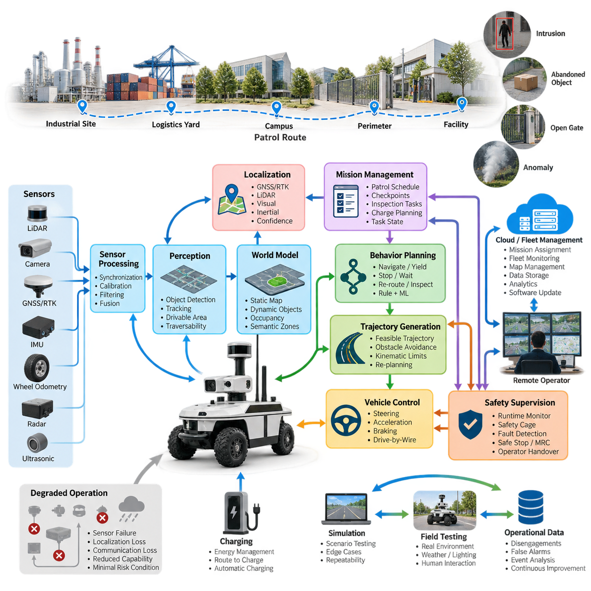
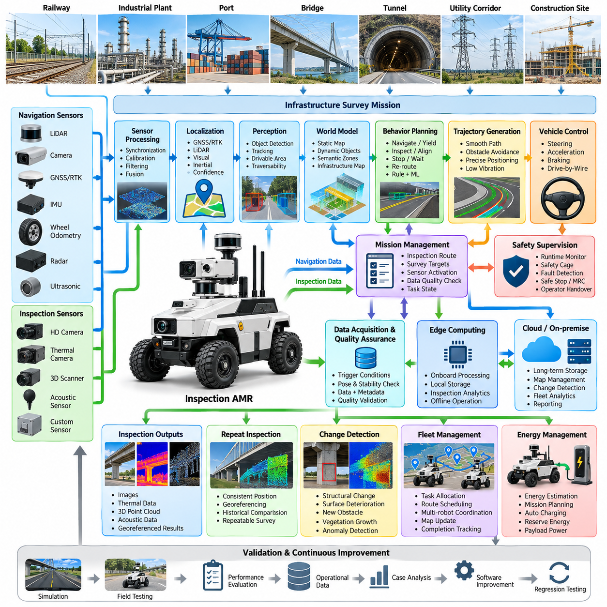
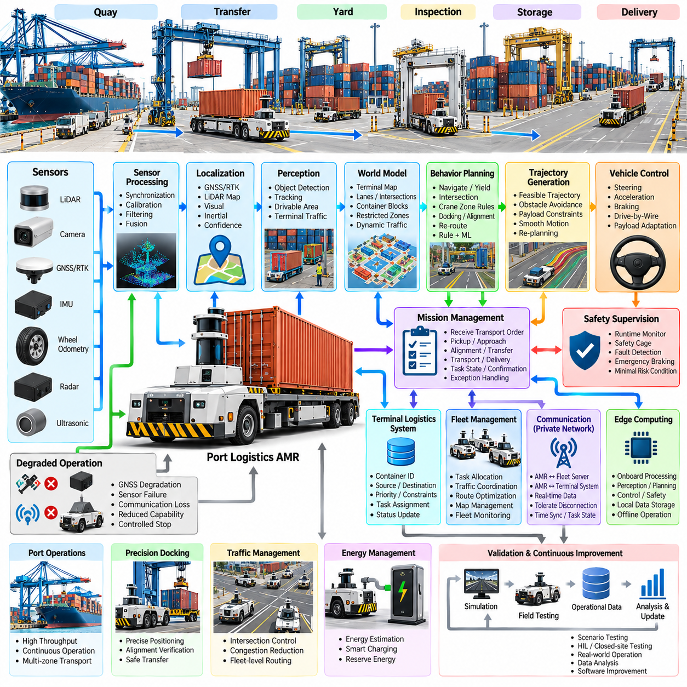
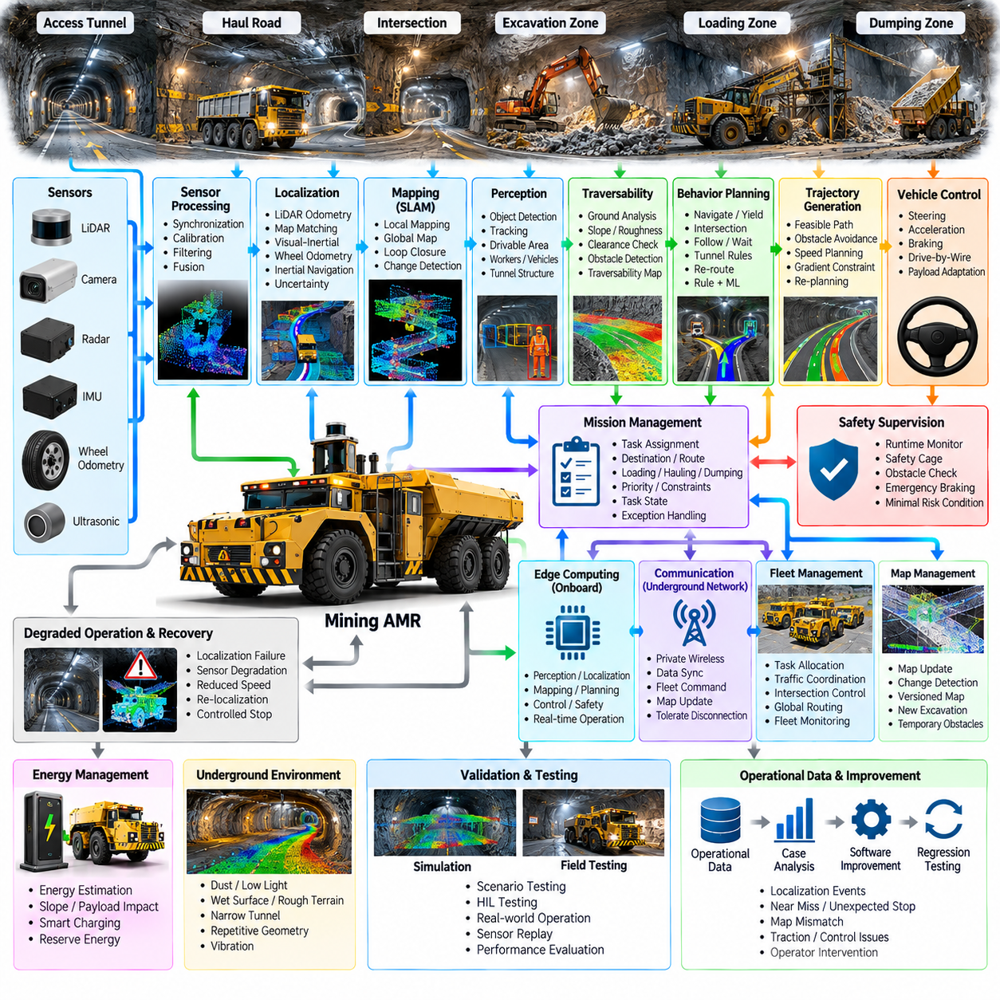
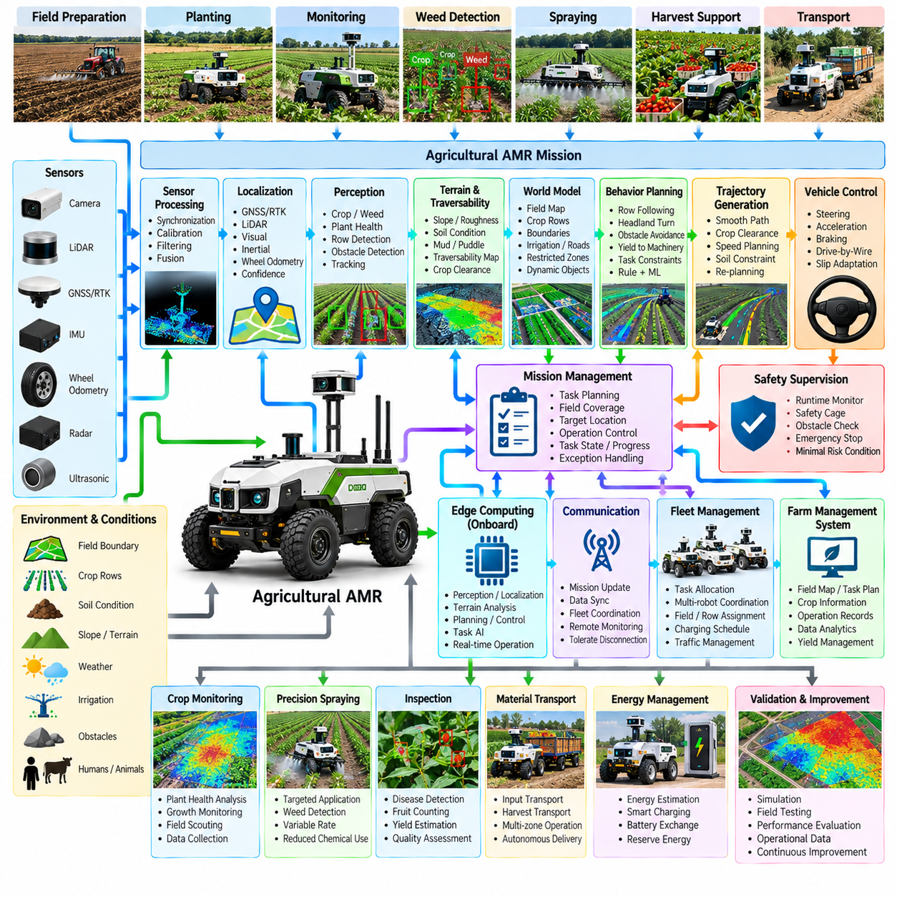
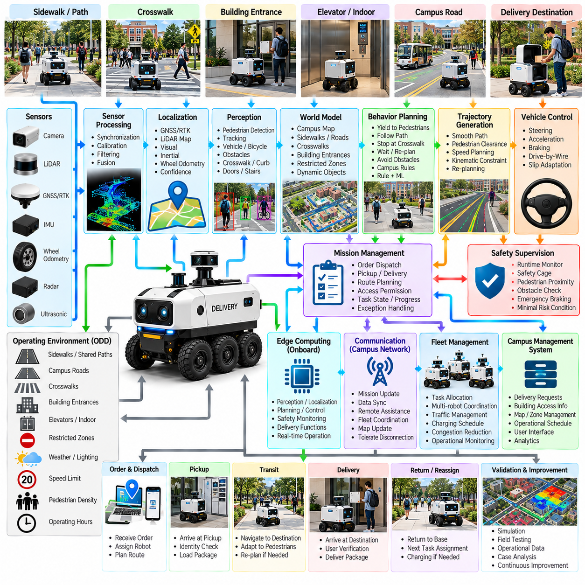
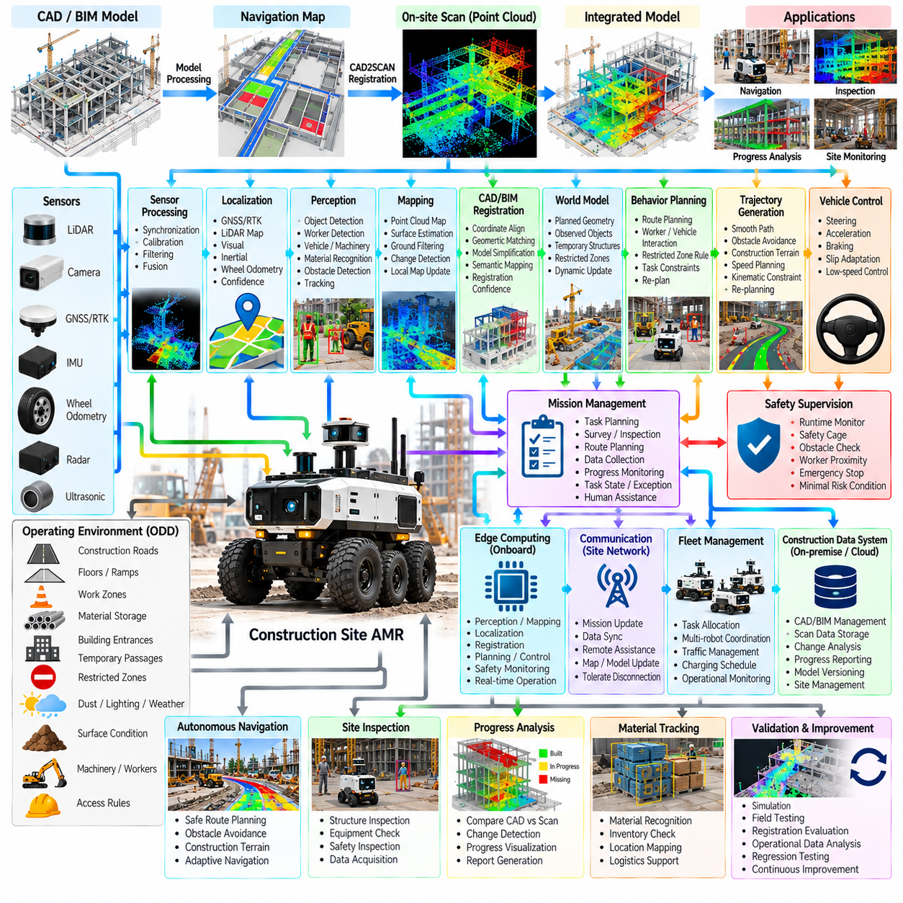
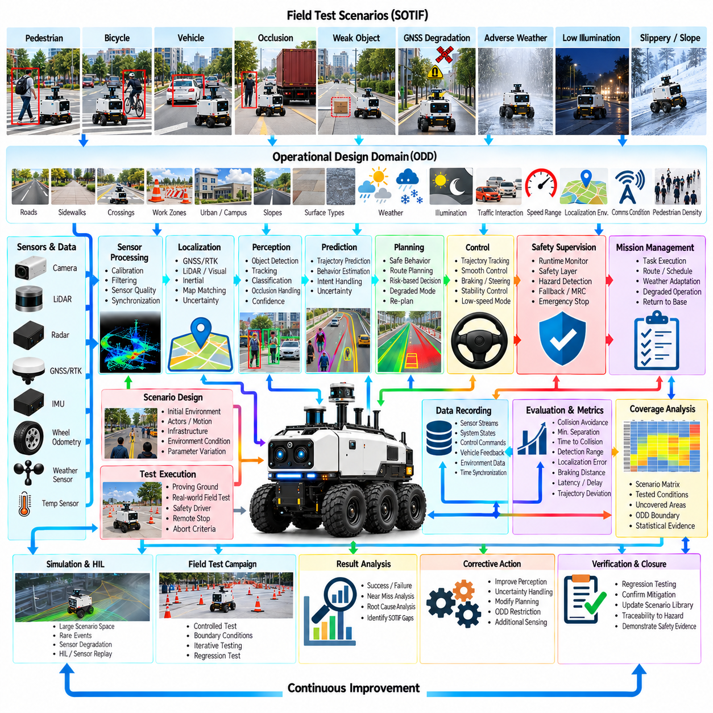

**Volume 12. Autonomous Driving Software**

# Chapter 12. Outdoor AMR Case Studies

## 12.01. Outdoor Security AMR Autonomous Patrol SW Case

{width="7.268055555555556in" height="7.268055555555556in"}

An outdoor security AMR extends autonomous driving software from transportation into persistent physical security operations. Unlike a road vehicle whose primary mission is point-to-point mobility, a patrol robot repeatedly executes routes, observes designated zones, detects abnormal conditions, and reports evidence. Its software therefore integrates autonomous navigation, perception, mission management, safety supervision, and remote fleet operation into one continuous operational loop.

The operational design domain must describe where and under what conditions autonomous patrol is permitted. Typical environments include industrial campuses, logistics yards, ports, power facilities, apartment complexes, and fenced infrastructure sites. The ODD specifies road geometry, pedestrian access, allowable speed, lighting, weather, terrain, communication coverage, localization availability, and restricted areas so that autonomy behavior can be constrained to validated conditions.

A practical software architecture separates sensing, localization, perception, world modeling, behavior planning, trajectory generation, vehicle control, safety supervision, and mission orchestration. This separation allows individual components to evolve without redesigning the complete robot. Outdoor security operation also requires interfaces to patrol schedules, alarm systems, remote operators, charging infrastructure, maps, and fleet services, making orchestration an important layer above the conventional autonomous-driving stack.

The sensing pipeline commonly combines LiDAR, cameras, GNSS/RTK, IMU, wheel odometry, and optionally radar or ultrasonic sensors. Raw measurements are timestamped, calibrated, filtered, and transformed into common coordinate frames before fusion. The resulting representation supports obstacle detection, free-space estimation, localization, and security perception. Sensor-health monitoring is equally important because contamination, glare, rain, vibration, or communication faults can degrade individual sensing channels during long unattended missions.

Localization normally combines globally referenced and locally referenced estimates rather than depending on one technology. GNSS/RTK can provide accurate outdoor positioning in open areas, while LiDAR localization, visual features, inertial estimation, and wheel odometry maintain continuity near buildings or vegetation. The localization software should continuously estimate confidence and detect disagreement among sources. When uncertainty exceeds an operational threshold, the system can reduce speed, request recovery, or transition toward a minimal-risk condition.

Perception transforms sensor observations into an operational model of the patrol environment. The robot must distinguish traversable surfaces from curbs, walls, vegetation, vehicles, pedestrians, temporary objects, and negative obstacles where relevant. Object detection and tracking provide position, velocity, and trajectory estimates for dynamic agents, while occupancy or traversability representations describe usable space. Security-specific analytics can operate alongside navigation perception without being allowed to compromise safety-critical obstacle detection.

The world model provides the shared environmental state consumed by planning modules. It combines static map information with dynamic obstacles, localization uncertainty, drivable-area estimates, route constraints, semantic regions, and temporary hazards. A patrol mission may additionally define checkpoints, observation zones, prohibited areas, speed-limited regions, charging stations, and communication-sensitive locations. Maintaining these elements in a coherent representation reduces inconsistent decisions between mission, behavior, and motion-planning layers.

Mission-level software converts security objectives into executable robot tasks. A patrol schedule may contain route segments, checkpoints, dwell times, inspection actions, camera orientations, and return-to-charge conditions. Instead of treating the robot as a vehicle following a fixed path, the mission manager maintains task state and determines what should happen next. It can skip inaccessible checkpoints, retry interrupted observations, prioritize alarms, or return to a previously defined safe location after abnormal events.

Behavior planning translates mission intent and perceived conditions into driving decisions such as proceed, yield, follow, stop, wait, bypass, re-route, inspect, or return. Outdoor patrol environments are often semi-structured, so purely lane-oriented automotive logic is insufficient. The planner must handle parked vehicles, pedestrians crossing informal paths, temporary construction barriers, narrow passages, gates, and unexpected obstacles while respecting operational rules and preserving a deterministic safety envelope.

Trajectory generation converts the selected behavior into a dynamically feasible motion sequence. Candidate trajectories are evaluated against obstacle clearance, curvature, steering limits, acceleration, braking capability, terrain constraints, and predicted movement of surrounding agents. Re-planning occurs continuously as the scene changes. At patrol speeds, smoothness remains useful for sensor stability and mechanical durability, but collision avoidance and reliable stopping distance take precedence when environmental uncertainty increases.

The control layer converts the selected trajectory into steering, propulsion, and braking commands through the drive-by-wire interface. Longitudinal and lateral controllers compensate for vehicle dynamics, actuator delay, payload variation, slope, and surface conditions. Outdoor platforms require additional attention to wheel slip and traction because wet pavement, gravel, grass, ramps, and uneven surfaces can invalidate assumptions made on uniform roads. Feedback from actuators must therefore return continuously to planning and safety functions.

Safety supervision should remain logically independent from normal autonomy wherever practical. Runtime monitors check localization validity, sensor health, obstacle distance, commanded velocity, controller status, communication state, and software heartbeat signals. A safety cage can reject unsafe commands even when the primary planner considers them valid. Depending on the detected fault, the robot may reduce speed, stop immediately, execute a controlled stop, enter a minimal-risk condition, or request intervention from a remote operator.

Autonomous patrol also requires explicit handling of degraded operation. Loss of RTK correction does not necessarily require an immediate emergency stop if another validated localization mode remains available, whereas simultaneous localization degradation and obstacle-sensing failure may require termination of autonomous movement. This motivates a degradation-state machine that maps combinations of component health and environmental conditions to permitted capabilities rather than representing the entire autonomy stack with a simple healthy-or-failed state.

Security perception forms a second interpretation layer over the navigation scene. Depending on the application, software may detect unauthorized presence, prolonged loitering, intrusion into restricted zones, abandoned objects, open gates, smoke-like visual anomalies, or other predefined events. These detections should be treated as evidence with confidence and context rather than automatic conclusions. Temporal tracking, repeated observations, sensor corroboration, and remote confirmation can reduce false alarms in changing outdoor environments.

When an event is detected, the robot should preserve operational context rather than transmitting only an alarm flag. Relevant data can include time, robot pose, sensor observations, object tracks, event classification, confidence, and a short history before and after detection. The mission manager may command the robot to stop at a safe observation point or reposition within predefined constraints. Remote personnel can then review the evidence and determine whether escalation, continued observation, or mission resumption is appropriate.

Connectivity must be treated as an operational resource rather than an assumption. High-bandwidth video may be available only in portions of a patrol area, while safety-critical autonomy must continue locally at the edge. The robot therefore performs perception, localization, planning, control, and immediate safety decisions onboard. Cloud or on-premise systems can handle mission assignment, fleet monitoring, historical storage, analytics, software distribution, and operator interfaces without becoming mandatory participants in every real-time driving cycle.

A fleet-management layer becomes important when multiple security AMRs share a facility. It assigns patrol regions, avoids redundant coverage, coordinates charging, tracks robot health, and redistributes missions when one robot becomes unavailable. The fleet system can also maintain common maps and temporary operational restrictions. However, each robot should retain enough local autonomy to stop safely and manage short communication interruptions rather than depending on continuous centralized motion commands.

Long-duration patrol introduces energy as part of autonomy planning. Battery state, predicted route consumption, environmental temperature, payload power, compute load, and distance to charging infrastructure affect whether a mission can be completed safely. Charging should therefore be represented as a mission behavior rather than a separate maintenance activity. The system can reserve sufficient energy for recovery, schedule charging between patrol cycles, and interrupt lower-priority tasks before energy margins become operationally unsafe.

Validation of the complete system requires more than measuring perception accuracy or trajectory-tracking error independently. Scenario-based testing should combine pedestrians, vehicles, blocked routes, localization degradation, sensor faults, communication loss, weather variation, low illumination, emergency stopping, and mission recovery. Simulation can provide repeatability and large scenario coverage, while closed-course and operational field testing reveal interactions with surfaces, lighting, radio conditions, contamination, and human behavior that are difficult to model completely.

Operational data closes the development loop. Disengagements, false alarms, emergency stops, localization confidence drops, unusual obstacle configurations, planner failures, and operator interventions can be recorded as structured events. Engineers can reconstruct these cases, classify their causes, reproduce them in simulation, and convert representative failures into regression scenarios. In this way, fleet operation becomes a source of evidence for continuous improvement rather than merely the final stage after software deployment.

The complete patrol case demonstrates why outdoor AMR autonomy is a system problem rather than a collection of isolated algorithms. Sensor processing, traversability estimation, object tracking, localization, behavior planning, trajectory generation, control, safety, mission management, fleet operation, and data feedback must cooperate under changing real-world conditions. This case therefore integrates the major autonomous-driving software functions developed across the volume into one persistent robotic operational workflow.

## 12.02. Outdoor Inspection AMR Infrastructure Survey Case

{width="7.268055555555556in" height="7.268055555555556in"}

An outdoor inspection AMR transforms autonomous mobility into a persistent infrastructure surveying platform capable of collecting spatial, visual, thermal, and condition data while moving through large facilities. Unlike a patrol robot focused primarily on security events, an inspection AMR must coordinate vehicle motion with measurement quality. Navigation, sensor positioning, inspection sequencing, localization, data acquisition, and quality verification therefore operate as a tightly integrated software workflow.

Typical deployment environments include rail facilities, industrial plants, ports, construction sites, utility corridors, bridges, tunnels, campuses, and large logistics complexes. These environments contain paved roads, gravel, ramps, curbs, narrow passages, machinery, pedestrians, temporary structures, and changing work zones. The operational design domain defines terrain, allowable speed, inspection distance, weather limits, localization availability, communication coverage, and areas requiring supervised operation.

The software architecture combines an autonomous-driving stack with an inspection mission layer. Sensor processing, localization, traversability estimation, object detection, behavior planning, trajectory generation, control, and safety supervision provide mobility, while mission orchestration manages inspection routes, measurement points, sensor activation, data capture, and survey completion. This separation allows the same mobile platform to support different inspection payloads without redesigning the complete autonomy system.

Navigation sensors can include LiDAR, cameras, GNSS/RTK, IMU, wheel odometry, radar, and ultrasonic sensing, while inspection payloads may contain high-resolution cameras, thermal imagers, 3D scanners, acoustic sensors, or other application-specific instruments. The software must distinguish navigation observations from inspection measurements while maintaining common timestamps and coordinate frames. Accurate synchronization allows every captured measurement to be associated with the robot pose and inspection location.

Localization quality directly affects the value of infrastructure survey data. GNSS/RTK can provide globally referenced positions in open environments, while LiDAR, visual, inertial, and odometric localization maintain continuity around buildings, structures, or partially obstructed areas. The system should record localization confidence together with inspection measurements so downstream users can determine whether an observation is sufficiently reliable for comparison, mapping, maintenance analysis, or repeated inspection.

Traversability estimation determines whether the AMR can safely reach each requested inspection location. LiDAR and camera information can identify free space, curbs, slopes, surface boundaries, negative obstacles, temporary barriers, and terrain changes. Instead of assuming that a predefined survey route remains valid, the robot continuously updates its local representation. When access becomes unsafe or physically impossible, the mission layer can select another viewpoint or mark the inspection point as incomplete.

The world model combines static infrastructure maps with dynamic information collected during operation. It can represent roads, structures, survey regions, restricted zones, inspection targets, obstacles, temporary construction areas, and safe stopping locations. Semantic information is particularly useful because inspection behavior depends on what the robot is observing. A bridge support, rail component, wall surface, utility cabinet, or pavement region may require a different viewpoint, sensor configuration, and acquisition procedure.

Inspection missions are commonly represented as sequences of survey targets rather than simple navigation waypoints. Each target may contain a desired robot pose, observation direction, required sensor, measurement duration, acceptable localization uncertainty, and data-quality requirement. The mission manager tracks completion status and determines whether a target should be accepted, retried, skipped, or approached from another position. This creates a direct relationship between autonomous navigation and inspection objectives.

Behavior planning must account for both traffic interaction and measurement requirements. During normal transit the AMR can proceed, yield, stop, bypass obstacles, or re-route similarly to other outdoor autonomous vehicles. Near an inspection target, however, the planner may reduce speed, align the chassis, approach a specified observation distance, stabilize the platform, and hold position. Inspection behavior therefore extends conventional driving decisions with sensor-oriented positioning and measurement states.

Trajectory generation converts these behaviors into feasible motion while considering vehicle geometry, curvature, acceleration, braking distance, obstacle clearance, terrain, and inspection positioning accuracy. A trajectory that is acceptable for transportation may not be suitable for surveying if it produces excessive vibration or places the sensor at an unfavorable angle. Near measurement targets, smooth low-speed trajectories and precise final positioning can become more important than minimum travel time.

Vehicle control executes the generated trajectory through steering, propulsion, and braking interfaces. Outdoor survey platforms must tolerate changes in slope, payload mass, tire-ground interaction, and surface roughness while maintaining stable motion. Control accuracy becomes particularly important during final approach to inspection points. Position and orientation errors can alter camera perspective, LiDAR geometry, scanner coverage, or measurement repeatability, reducing the usefulness of data collected across multiple survey cycles.

Data acquisition should be triggered by explicit inspection conditions rather than simply recorded continuously without context. The software can verify that the robot is within an acceptable pose tolerance, motion has stabilized, the required sensor is healthy, and localization confidence satisfies the mission requirement before capturing data. Each observation can then be packaged with timestamp, robot pose, sensor configuration, target identifier, environmental context, and quality metadata for later processing.

Quality assurance can occur immediately after acquisition. The system may verify image exposure, blur, point-cloud density, field-of-view coverage, sensor availability, file integrity, and localization confidence before declaring an inspection target complete. When quality is insufficient, the mission manager can repeat the measurement or adjust the robot viewpoint. Performing this validation at the edge reduces the risk of discovering missing or unusable data only after the robot has completed a long survey route.

Repeated infrastructure inspection benefits from spatial consistency across missions. When the AMR revisits the same asset, observations should be captured from comparable positions and coordinate frames whenever practical. Stable georeferencing allows new measurements to be aligned with historical data and supports change detection. Differences in geometry, surface appearance, temperature patterns, or other measured properties can then be associated with specific infrastructure locations instead of being treated as unrelated sensor observations.

Change detection converts repeated surveys into condition-monitoring information. Current observations can be compared with baseline maps, point clouds, images, or previous inspection records to identify structural displacement, surface deterioration, new obstacles, vegetation growth, construction changes, or other anomalies relevant to the application. Automated algorithms can prioritize regions requiring human review, while the original sensor data remains available as evidence for engineering interpretation and maintenance decisions.

Safety supervision operates independently of inspection productivity. Runtime monitors observe localization health, sensor status, obstacle proximity, commanded motion, actuator feedback, communication state, and software heartbeats. If a survey target requires an unsafe approach, the safety layer must prevent the motion even when it would improve measurement quality. Depending on the condition, the robot can stop, retreat, select another observation position, enter a minimal-risk state, or request remote assistance.

Infrastructure sites frequently produce degraded localization and communication conditions. GNSS can be obstructed near large structures, wireless connectivity may disappear behind buildings, and inspection sensors may become contaminated by dust, rain, or vibration. The software therefore requires explicit degraded-operation logic. Local autonomy can continue when sufficient validated capability remains, while combinations of failures that violate safety or measurement requirements cause the mission to pause or transition to a controlled recovery state.

Edge computing allows mobility and inspection functions to remain operational without continuous cloud connectivity. Perception, localization, planning, control, safety monitoring, data-quality checks, and selected inspection analytics can execute onboard. Larger datasets can be buffered locally and transferred when suitable connectivity becomes available. On-premise or cloud infrastructure can subsequently perform long-term storage, map management, cross-mission comparison, fleet analytics, reporting, and computationally intensive processing.

Fleet operation extends the approach to large infrastructure sites where several AMRs survey different regions. A fleet manager can allocate inspection zones, schedule routes, coordinate charging, distribute map updates, and track completion status. Survey tasks can be reassigned when a robot becomes unavailable or a region becomes inaccessible. Standardized mission and data interfaces allow heterogeneous robots or sensor payloads to contribute to a common infrastructure inspection database while preserving measurement provenance.

Energy management must consider both mobility and inspection payload consumption. High-performance computers, LiDAR systems, lighting, thermal cameras, scanners, and communication equipment may significantly increase electrical load during surveys. Mission planning can estimate energy required for travel, inspection, return, and recovery before accepting a route. Charging can then be scheduled between survey segments, while sufficient reserve energy is maintained to reach a safe location if operating conditions change.

Validation must evaluate the complete survey workflow rather than autonomous driving alone. Tests should measure navigation success, positioning accuracy, inspection coverage, measurement repeatability, data quality, obstacle handling, degraded operation, and recovery behavior. Simulation can reproduce route and failure scenarios, while controlled and field testing expose the system to real terrain, vibration, illumination, weather, radio conditions, sensor contamination, and changing infrastructure configurations.

Operational survey data creates a closed development loop. Failed approaches, localization degradation, incomplete coverage, poor measurements, planner interventions, safety stops, and operator corrections can be stored as structured events. Engineers can reconstruct these cases, identify failure causes, reproduce representative conditions in simulation, improve autonomy or inspection logic, and add the resulting scenarios to regression testing. Each deployment therefore contributes evidence for improving subsequent missions.

The infrastructure survey case demonstrates how an outdoor AMR becomes more than an autonomous vehicle carrying sensors. Mobility, inspection geometry, measurement quality, localization confidence, safety, mission orchestration, edge processing, and historical data management must operate as one coordinated system. By connecting autonomous driving with repeatable spatial data acquisition, the AMR can provide a scalable foundation for persistent inspection, digital infrastructure records, condition monitoring, and data-driven maintenance.

## 12.03. Port Logistics AMR Autonomous Container Transport

{width="7.268055555555556in" height="7.268055555555556in"}

Port logistics AMRs extend autonomous driving technology into high-throughput freight environments where vehicles repeatedly transport containers or container-related loads between quay, yard, storage, inspection, and transfer zones. The autonomy system must combine reliable navigation with logistics execution, because vehicle movement is valuable only when synchronized with cranes, yard equipment, container assignments, and terminal operating schedules.

A container terminal presents a structured but continuously changing operational design domain. Wide transport lanes coexist with intersections, stacking blocks, crane workspaces, parked equipment, temporary barriers, service vehicles, and human workers. Container stacks can modify visibility and GNSS reception, while rain, sea spray, illumination changes, and surface contamination affect sensing. The ODD therefore includes infrastructure geometry, traffic rules, environmental limits, communication coverage, and operational restrictions.

The vehicle software can be organized into sensor processing, localization, perception, world modeling, behavior planning, trajectory generation, vehicle control, safety supervision, and logistics mission management. Real-time autonomy remains responsible for immediate motion decisions, while the mission layer interprets transport orders and terminal state. This separation prevents high-level logistics delays from directly interfering with safety-critical perception and control loops.

Outdoor sensing commonly combines LiDAR, cameras, GNSS/RTK, IMU, wheel odometry, radar, and short-range sensors. LiDAR provides geometric structure around vehicles and containers, cameras contribute semantic information, radar improves detection under some adverse visibility conditions, and GNSS/RTK supplies globally referenced positioning where reception is available. Timestamp synchronization and calibration are essential because container vehicles operate around large moving machines and narrow transfer interfaces.

Port localization should combine multiple positioning sources because container stacks and cranes can create GNSS shadowing and multipath. RTK positioning can dominate in open transport corridors, while LiDAR map matching, inertial estimation, wheel odometry, and visual information maintain continuity in degraded regions. The localization system continuously estimates uncertainty so that speed, route selection, docking behavior, and fallback actions can be adapted when positioning confidence decreases.

Perception constructs a dynamic representation of terminal traffic. The system identifies drivable surfaces, lane boundaries, containers, trucks, autonomous vehicles, forklifts, cranes, pedestrians, barriers, and unexpected obstacles. Object tracking estimates motion and predicts short-term interactions, while free-space and occupancy representations determine where the AMR can safely travel. Detection performance must remain robust against partial occlusion caused by stacked containers and large industrial equipment.

The world model combines the static terminal map with continuously changing operational information. It can represent transport lanes, intersections, container blocks, crane transfer points, restricted zones, temporary closures, charging locations, and dynamic traffic. Logistics information can additionally associate locations with container identifiers, pickup points, destinations, and task states, allowing navigation decisions to remain consistent with the physical organization of terminal operations.

A transport mission begins when the logistics system assigns a container movement task to an available vehicle. The mission manager converts the order into pickup, approach, alignment, transfer, transport, delivery, confirmation, and recovery states. Each state has different navigation and safety requirements. Mission execution therefore becomes a stateful workflow rather than a simple command to drive from one coordinate to another, and task progress remains visible to fleet-level systems.

Pickup and delivery require higher positioning precision than ordinary transit. The AMR may need to align with a crane, transfer platform, container handling mechanism, or designated loading position within a controlled tolerance. The autonomy system can transition from global navigation to precision approach using local geometric references and reduced speed. Final alignment should be verified before transfer operations begin so that mobility and material-handling equipment share a consistent physical state.

Behavior planning manages interactions with terminal traffic and infrastructure. The planner determines when to proceed, yield, stop, follow, merge, cross an intersection, wait for equipment, or select an alternative route. Unlike public-road driving, many port interactions follow terminal-specific priorities and geofenced rules. Crane zones, loading areas, narrow passages, and mixed-traffic intersections can therefore use dedicated behavior policies while remaining inside a common planning framework.

Trajectory generation converts the selected behavior into dynamically feasible vehicle motion. Candidate trajectories consider vehicle dimensions, steering geometry, payload mass, curvature, acceleration, braking distance, obstacle clearance, and local speed restrictions. Heavy container transport makes smooth acceleration and braking particularly important because abrupt commands increase tire forces, energy consumption, mechanical stress, and load instability. Continuous re-planning responds to changing traffic and blocked routes.

Vehicle control translates trajectories into steering, propulsion, and braking commands through the drive-by-wire interface. Controllers must accommodate large changes in gross vehicle mass between unloaded and loaded operation as well as slope, wet pavement, tire condition, and actuator delay. Feedforward and feedback control can be adapted using vehicle state and payload information. Traction and slip monitoring become especially important when heavy loads are transported across contaminated outdoor surfaces.

Safety supervision provides an independent protective layer around normal autonomy. Runtime monitors evaluate obstacle distance, localization confidence, sensor health, actuator feedback, commanded speed, communication status, and software heartbeats. A safety cage can limit or reject unsafe commands, while emergency braking provides a final intervention mechanism. Fault severity determines whether the vehicle continues at reduced capability, performs a controlled stop, or enters a minimal-risk condition.

Port operations require explicit degraded-mode strategies because stopping every vehicle after a single sensor or communication fault can disrupt the entire logistics flow. A validated redundant sensor configuration may permit reduced-speed operation after one sensing channel is lost. Conversely, simultaneous degradation of localization, obstacle detection, or braking capability may require immediate withdrawal from autonomous service. Capability-based degradation logic therefore connects component health directly to permitted driving behavior.

Fleet management coordinates multiple AMRs as a shared transportation resource. It assigns tasks according to vehicle position, payload capability, battery state, congestion, destination, and equipment availability. Route coordination prevents unnecessary conflicts and distributes traffic across the terminal network. The fleet layer can also reserve critical areas or time windows for specific movements, reducing congestion around cranes and transfer stations while maintaining local collision avoidance on each robot.

Traffic management becomes increasingly important as fleet size grows. If every AMR independently selects the shortest route, vehicles may converge on the same intersections and create congestion. Fleet-level routing can incorporate predicted traffic density, blocked lanes, crane activity, and task priority. Local planners still respond to immediate obstacles, but global coordination distributes demand across available corridors. This hierarchical arrangement combines terminal-wide optimization with real-time vehicle autonomy.

Integration with terminal logistics systems connects physical robot motion to container information. A transport task may contain container identity, source, destination, priority, handling constraints, and required completion time. Vehicle status and task progress are returned to the logistics layer as structured events. Clear interfaces between autonomy, fleet management, and terminal operations reduce ambiguity about whether a container is waiting, loaded, moving, delivered, or unavailable because of an exception.

Edge computing supports the real-time workload required for autonomous transport. Sensor processing, object detection, localization, prediction, planning, control, and safety monitoring execute onboard so that vehicle operation does not depend on continuous cloud communication. On-premise infrastructure can provide fleet optimization, map services, operational databases, monitoring, and historical analytics. This distribution keeps latency-sensitive functions close to the vehicle while centralizing terminal-wide coordination.

Communication nevertheless remains essential for coordinated logistics. Private wireless networks, industrial Wi-Fi, or cellular infrastructure can connect AMRs with fleet servers, terminal systems, and operators. The autonomy architecture should tolerate temporary communication interruption by retaining local safety and limited mission capability. Messages should include timestamps and task state so that synchronization can be restored after reconnection without generating duplicate transport commands or inconsistent container records.

Energy management is tightly connected to fleet productivity. Heavy payloads, acceleration cycles, onboard computing, environmental control, and communication systems influence consumption. The fleet manager can predict energy requirements from route length, payload, traffic, and operating conditions before assigning a mission. Charging can be scheduled during natural idle periods, while reserve energy is preserved for safe completion or recovery instead of allowing battery depletion to interrupt a container movement.

Validation must reproduce both driving hazards and logistics interactions. Simulation can test dense fleet traffic, blocked intersections, crane delays, GNSS degradation, sensor faults, emergency stops, communication loss, and changing task priorities at scales difficult to create physically. Hardware-in-the-loop and closed-site testing then verify vehicle dynamics and interfaces. Field operation finally evaluates the combined autonomy and logistics workflow under real terminal conditions.

Operational data supports continuous improvement of both individual vehicles and the complete fleet. Near collisions, unexpected stops, localization degradation, route congestion, task delays, control anomalies, and operator interventions can be captured with synchronized context. Representative events are reconstructed and converted into simulation or regression scenarios. Fleet statistics can additionally reveal systemic bottlenecks that would not be visible when analyzing autonomous-driving performance on one vehicle alone.

The autonomous container transport case demonstrates the transition from standalone outdoor autonomy to coordinated industrial mobility. Perception, localization, planning, control, safety, precision positioning, mission execution, fleet coordination, logistics integration, communication, and energy management must operate as one system. When these layers share consistent state and interfaces, autonomous AMRs can become dependable participants in continuous port logistics rather than isolated robotic vehicles.

## 12.04. Mining AMR GPS Denied Underground Navigation

{width="7.268055555555556in" height="7.268055555555556in"}

Underground mining AMRs operate in one of the most demanding environments for autonomous navigation because satellite-based positioning is unavailable and the surrounding geometry can change continuously. Tunnels, intersections, ramps, excavation zones, equipment, workers, dust, darkness, water, and uneven terrain create a navigation problem that differs substantially from structured outdoor driving. Reliable autonomy therefore depends on locally referenced perception, localization, mapping, planning, and safety functions.

The operational design domain for an underground AMR defines tunnel dimensions, gradients, minimum clearance, road surface conditions, permitted speeds, traffic rules, loading areas, ventilation zones, communication coverage, and emergency locations. It must also describe environmental limitations such as dust concentration, water, low illumination, vibration, repetitive tunnel geometry, and temporary excavation activity. These conditions determine which autonomy capabilities can be safely activated.

The software architecture separates sensor processing, localization, mapping, perception, traversability estimation, behavior planning, trajectory generation, vehicle control, safety supervision, and mission management. Unlike outdoor systems that can use GNSS as a global reference, the underground stack must maintain navigation continuity entirely from onboard and infrastructure-assisted information. Localization confidence therefore becomes a first-class system state consumed by planning, control, mission, and safety modules.

LiDAR is particularly valuable underground because tunnel walls, ceilings, equipment, and structural features provide geometric observations independent of visible light. Cameras contribute semantic information when illumination is sufficient or controlled, while IMUs and wheel odometry provide high-rate motion estimates. Radar can complement optical sensing under dust or reduced visibility. Every sensor stream requires accurate timestamping, calibration, coordinate transformation, filtering, and continuous health monitoring.

Localization can combine LiDAR odometry, LiDAR map matching, visual-inertial estimation, wheel odometry, and inertial navigation. Short-term motion is estimated continuously while observations are registered against a previously constructed map or local submap. No single source should be assumed to remain reliable everywhere. Wheel slip can corrupt odometry, repetitive tunnel geometry can reduce scan-matching observability, and vibration or long operation can increase inertial drift.

Simultaneous localization and mapping becomes especially important when the mine geometry is incomplete or changing. The AMR can construct local point-cloud or occupancy representations while estimating its own pose, then connect these local regions into a larger mine map. Loop closure can reduce accumulated drift when previously observed locations are revisited. Mapping software must nevertheless distinguish persistent infrastructure from temporary machinery, vehicles, stored materials, and excavation-related changes.

Repetitive underground geometry creates a significant localization challenge. Long tunnels may contain similar walls, intersections, supports, and textures, allowing different locations to produce comparable sensor observations. Localization should therefore use temporal motion consistency, multiple sensing modalities, topology, known junction structure, and uncertainty estimates rather than accepting the highest scan-matching score without additional evidence. Ambiguous localization should trigger conservative behavior.

A mine world model combines geometric maps with semantic and operational information. It can represent tunnels, junctions, ramps, loading zones, dumping areas, restricted regions, ventilation infrastructure, refuge locations, charging stations, and known hazards. Dynamic information adds workers, trucks, loaders, drilling machines, temporary barriers, and blocked passages. This representation gives planning modules a common interpretation of both mine structure and current operating conditions.

Traversability estimation determines whether detected free space is actually safe for the vehicle. Underground roads may contain loose material, potholes, standing water, steep gradients, narrow edges, debris, and irregular surfaces. LiDAR and camera observations can estimate ground geometry, slope, clearance, and obstacles, while vehicle state provides evidence of slip or poor traction. The resulting traversability map influences route selection, local planning, speed, and recovery decisions.

Behavior planning handles mine-specific interactions such as tunnel entry, intersection priority, vehicle following, passing restrictions, loading-zone approach, obstacle waiting, and emergency yielding. Narrow tunnels often prevent immediate bypassing, so stopping or reversing to a predefined passing area may be safer than local obstacle avoidance. Rules can incorporate vehicle size, payload, tunnel width, visibility, traffic direction, and operational priorities established by the mine management system.

Trajectory generation converts behavior decisions into dynamically feasible paths while respecting tunnel boundaries, vehicle dimensions, steering geometry, curvature, gradient, braking distance, and obstacle clearance. Large underground vehicles require sufficient margins because localization and perception uncertainty cannot be ignored. Speed profiles can be reduced near junctions, workers, machinery, steep ramps, or uncertain terrain. Continuous re-planning responds to newly detected obstacles and changing passage conditions.

Vehicle control must maintain stable trajectory tracking despite slopes, payload variation, loose surfaces, wheel slip, and limited traction. Steering, propulsion, and braking commands are generated through the vehicle interface while feedback reports actual motion and actuator status. Comparing commanded motion with measured inertial, wheel, and localization behavior can also reveal abnormal slip. Control limits should adapt when road conditions or localization confidence reduce the safe operating envelope.

Mission management converts mining objectives into navigation tasks such as traveling to an excavation zone, transporting material, visiting inspection locations, reaching a loading point, or returning to charging or maintenance areas. The mission state contains destinations, route constraints, task priority, payload information, and completion conditions. If a tunnel becomes blocked or localization becomes unreliable, the mission manager can suspend the task, request an alternative route, or initiate recovery.

Safety supervision operates independently from normal mission productivity. Runtime monitors evaluate obstacle proximity, localization uncertainty, sensor health, vehicle speed, actuator status, communication state, and software heartbeats. A safety layer can override planning commands and initiate speed reduction, controlled stopping, emergency braking, or a minimal-risk condition. Underground operation requires particularly conservative stopping behavior because visibility and escape space can be severely constrained.

Localization failure requires explicit recovery logic rather than immediate blind continuation. When confidence falls, the AMR can reduce speed and attempt relocalization using recent submaps, known tunnel geometry, alternative sensor combinations, or recognized junctions. If reliable pose estimation cannot be recovered, movement can be restricted or stopped at a safe location. The system should preserve uncertainty instead of forcing an apparently precise position estimate from weak or ambiguous observations.

Communication infrastructure can support underground autonomy but should not replace onboard safety. Wireless access points, private networks, or dedicated mine communication systems may provide fleet commands, map updates, traffic coordination, and operator connectivity. Coverage can nevertheless disappear in deep or obstructed passages. The robot therefore retains local perception, localization, planning, control, and safe-stop capability during temporary disconnection and synchronizes mission state after communication returns.

Fleet management coordinates several AMRs and conventional mining vehicles across a constrained tunnel network. It can allocate missions, reserve narrow passages, manage directional traffic, coordinate intersections, and prevent vehicles from entering routes that cannot support simultaneous movement. Global routing can account for blocked tunnels, congestion, equipment activity, and task priority, while onboard autonomy remains responsible for immediate collision avoidance and execution of locally safe trajectories.

Map management is a continuous operational requirement because mining environments evolve. Excavation extends passages, material piles move, support structures are added, and access restrictions change. New observations can be compared with the current map to identify meaningful differences before updates are accepted. Versioned maps allow robots and fleet systems to share a consistent representation while retaining the ability to identify when localization failure results from environmental change rather than sensor malfunction.

Edge computing is essential because core autonomy cannot depend on a remote data center. LiDAR processing, localization, mapping, perception, traversability analysis, planning, control, and safety monitoring execute onboard with bounded latency. Mine servers can provide fleet optimization, long-term map storage, mission databases, analytics, and software distribution. This architecture allows each AMR to remain operationally safe even when network bandwidth or connectivity is temporarily degraded.

Energy planning must include underground route topology and elevation. Climbing long ramps with heavy payloads can consume substantially more energy than unloaded travel on level tunnels, while onboard sensing and computing add continuous electrical demand. Mission allocation can estimate consumption from distance, gradient, payload, traffic, and expected waiting time. Sufficient reserve energy should remain available for recovery, communication loss, blocked routes, or travel to a safe charging location.

Validation requires scenarios that specifically challenge GPS-denied navigation. Simulation and recorded sensor replay can test localization drift, repetitive tunnels, map changes, dust, sensor degradation, wheel slip, blocked passages, communication loss, moving machinery, and pedestrian encounters. Hardware-in-the-loop and controlled mine-like environments verify timing and vehicle interfaces, while field testing determines whether localization, planning, control, and recovery remain dependable under actual underground conditions.

Operational data closes the development loop by recording localization confidence drops, relocalization attempts, unexpected stops, map mismatches, traction events, planner failures, safety interventions, and operator recovery actions. Representative failures can be reconstructed and converted into simulation and regression scenarios. Repeated analysis also identifies tunnel regions where infrastructure, maps, sensing configuration, or autonomy policies should be improved rather than treating every event as an isolated software failure.

The GPS-denied mining case demonstrates that underground autonomy is fundamentally a problem of maintaining trustworthy local spatial awareness without satellite positioning. LiDAR-centric sensing, multi-source localization, SLAM, traversability estimation, uncertainty-aware planning, robust control, safety supervision, evolving maps, fleet coordination, and recovery logic must operate together. Their integration allows an AMR to navigate changing underground networks while preserving safe behavior when localization, sensing, or communication quality deteriorates.

## 12.05. Agricultural AMR Field Navigation and Operation

{width="7.268055555555556in" height="7.268055555555556in"}

Agricultural AMRs extend autonomous mobility from structured roads and industrial facilities into fields where terrain, vegetation, weather, and crop conditions continuously change. The robot must navigate while performing agricultural tasks such as crop monitoring, field scouting, targeted inspection, weed detection, spraying, harvesting support, or material transport. Unlike conventional outdoor AMRs, agricultural robots cannot assume stable road geometry, because soil, crops, slopes, mud, irrigation structures, and seasonal changes directly influence both navigation and operation.

The operational design domain for an agricultural AMR describes field boundaries, crop rows, terrain slope, soil conditions, vegetation density, irrigation structures, obstacles, permitted speed, weather limitations, and areas requiring human supervision. Seasonal changes are particularly important because the same field can present very different visual and geometric conditions during planting, growth, and harvesting. The autonomy system must therefore distinguish persistent field structure from temporary crop and environmental changes when determining whether autonomous operation remains valid.

The software architecture combines sensor processing, localization, perception, terrain and traversability estimation, world modeling, behavior planning, trajectory generation, vehicle control, safety supervision, and agricultural mission management. Navigation functions determine where the robot can move, while the mission layer determines what agricultural operation should be performed at each location. This separation allows the same autonomous platform to support multiple field operations while maintaining a common mobility and safety foundation.

Agricultural sensing commonly combines cameras, LiDAR, GNSS/RTK, IMU, wheel odometry, radar, and short-range sensors. Cameras provide crop and semantic information, LiDAR provides three-dimensional terrain and obstacle geometry, and GNSS/RTK provides globally referenced positioning when satellite reception is available. IMU and wheel odometry provide high-rate motion information, while radar can provide complementary detection under conditions where optical sensing becomes less reliable. Sensor synchronization and calibration remain essential because measurements must be associated with both robot position and agricultural targets.

Localization can combine GNSS/RTK with LiDAR, visual, inertial, and odometric estimation. Open fields may provide strong satellite visibility, but trees, structures, terrain features, or local interference can reduce GNSS reliability. Row-based agriculture introduces another challenge because repeated crop patterns can create visually and geometrically similar observations. The localization system should therefore maintain confidence estimates and use multiple sources rather than assuming that one positioning technology remains reliable throughout the entire field.

Perception must understand both the environment and the agricultural objects that define the mission. The robot may need to distinguish crop plants, weeds, soil, irrigation equipment, stones, fences, farm machinery, workers, animals, and temporary obstacles. Depending on the application, perception can also estimate plant height, canopy condition, row structure, fruit presence, or other task-specific properties. Navigation perception and agricultural perception should share calibrated spatial information while remaining sufficiently separated so that task-specific AI does not compromise safety-critical obstacle detection.

Terrain understanding is particularly important because agricultural fields are rarely geometrically uniform. Slopes, furrows, loose soil, mud, puddles, crop residue, uneven ground, and drainage channels can affect vehicle stability and traction. Traversability estimation combines terrain geometry, surface appearance, vehicle state, and operational constraints to determine where the AMR can safely travel. A region may be physically traversable but unsuitable for a specific agricultural task because excessive vibration, soil pressure, or crop contact could damage the field or reduce measurement quality.

The world model combines field maps with dynamic agricultural information. It can represent field boundaries, crop rows, headlands, access roads, irrigation channels, restricted zones, charging locations, obstacles, and designated work areas. Seasonal crop information can be associated with spatial regions so that mission planning understands where specific operations are required. Dynamic observations update this model as workers, farm machinery, animals, water, temporary equipment, and crop conditions change during operation.

Agricultural mission management converts farm objectives into spatially organized tasks. A mission may require the robot to follow crop rows, visit sampling points, inspect selected plants, survey an entire field, transport materials, or return to a charging location. Each task can specify a target region, required sensor configuration, operating speed, observation conditions, and completion criteria. If a row is blocked or a target cannot be observed with sufficient quality, the mission manager can re-route, retry, skip the target, or request human intervention.

Behavior planning must account for agricultural-specific movement patterns. The robot may operate along crop rows, turn within headlands, cross designated access paths, avoid sensitive crops, wait for farm machinery, or stop when workers enter the operating area. Unlike road vehicles, agricultural AMRs may intentionally drive across areas without conventional lane markings. Planning therefore relies on field geometry, crop structure, task constraints, and traversability rather than only road-based traffic rules.

Trajectory generation converts these decisions into feasible motion while considering vehicle dimensions, steering geometry, slope, soil conditions, crop clearance, turning radius, and obstacle distance. Smooth motion is particularly valuable because excessive vibration can affect cameras, LiDAR, robotic tools, and agricultural measurements. At the same time, the trajectory must minimize unnecessary crop contact and soil disturbance. Re-planning allows the robot to respond when crop rows become blocked, terrain conditions change, or new obstacles appear.

Vehicle control must handle substantial variation in traction and vehicle dynamics. Wet soil, loose soil, grass, mud, slopes, and crop residue can produce wheel slip and reduce the relationship between commanded and actual motion. Feedback from wheel encoders, IMU, localization, and vehicle state can be used to identify slip and adjust control behavior. Speed and acceleration limits can be reduced when terrain uncertainty or traction loss increases, preserving vehicle stability and reducing damage to crops and soil.

Agricultural missions frequently require precise positioning relative to plants or field structures. For crop inspection, the camera or other sensor may need to maintain a specified distance, viewing angle, or height. For spraying or mechanical operations, positioning accuracy may directly affect application quality and crop safety. The autonomy system can therefore transition from general field navigation to task-specific precision positioning near an agricultural target, using local perception and reduced speed to achieve the required alignment.

Safety supervision must remain independent from agricultural productivity objectives. Runtime monitoring evaluates localization confidence, obstacle proximity, sensor health, vehicle state, actuator feedback, communication status, and software heartbeat signals. Workers, animals, and farm vehicles require conservative handling because their movement can be unpredictable. If an unsafe condition occurs, the safety layer can reduce speed, stop the robot, interrupt the agricultural operation, or enter a minimal-risk condition without waiting for the higher-level mission planner to complete its decision process.

Agricultural environments also require explicit degraded-operation strategies. GNSS quality can decrease near trees or structures, cameras can be affected by strong sunlight or low illumination, LiDAR can be affected by dust or vegetation, and wheel odometry can become unreliable on soft ground. The robot should identify which capabilities remain valid and adapt its behavior accordingly. For example, reduced-speed local navigation may remain possible after loss of RTK, while simultaneous degradation of localization and obstacle detection may require the robot to stop and request assistance.

Communication is useful for mission updates, fleet coordination, agricultural data transfer, and remote supervision, but field autonomy should not depend on continuous connectivity. Edge computing can perform perception, localization, traversability estimation, planning, control, safety monitoring, and selected agricultural AI functions directly on the robot. Field data can be stored locally when connectivity is unavailable and synchronized later with farm management or on-premise systems. This architecture allows the robot to continue safe local operation across large agricultural areas with inconsistent network coverage.

Fleet management becomes important when multiple agricultural AMRs operate across the same farm. Robots can be assigned different fields, crop rows, inspection regions, or transport tasks while avoiding unnecessary overlap. Fleet coordination can consider battery state, sensor payload, mission priority, field accessibility, and charging availability. Shared maps and task states help coordinate operations, while each robot retains local autonomy for immediate obstacle avoidance and safety decisions.

Energy management must account for terrain, payload, soil resistance, slope, agricultural equipment, and long operating periods. A robot performing continuous sensing or carrying a working payload may consume considerably more energy than one traveling without equipment. Mission planning can estimate energy requirements from route length, terrain, expected task duration, and payload configuration. Charging or battery exchange can then be incorporated into the mission schedule while maintaining sufficient reserve energy for recovery and safe return.

Validation should evaluate both autonomous mobility and agricultural task performance. Simulation can test field layouts, terrain variations, crop-row configurations, obstacles, weather effects, sensor degradation, and mission interruption. Controlled field testing can then evaluate actual soil interaction, wheel slip, vibration, crop contact, GNSS behavior, lighting variation, and sensor contamination. Measurements should include navigation success, positioning accuracy, task coverage, crop interaction, data quality, safety behavior, and recovery performance.

Operational data creates a continuous improvement loop for agricultural autonomy. Localization failures, wheel-slip events, unexpected obstacles, incomplete field coverage, poor sensor observations, crop-contact events, operator interventions, and mission interruptions can be recorded with spatial and temporal context. These cases can be reproduced in simulation, converted into regression scenarios, and used to improve perception, planning, control, and mission policies. Historical field data can also support comparisons between growing seasons and help identify persistent operational problems.

The agricultural AMR case demonstrates that field autonomy requires integration between autonomous driving and agricultural task intelligence. Perception, localization, terrain understanding, traversability estimation, planning, control, safety, mission management, edge computing, fleet coordination, and agricultural data processing must operate as one system. By combining reliable field navigation with task-specific spatial intelligence, an agricultural AMR can move from simple autonomous transportation toward persistent field monitoring, precision operation, and data-driven agricultural workflows.

## 12.06. Campus Delivery AMR Mixed Pedestrian Environment

{width="7.268055555555556in" height="7.268055555555556in"}

A campus delivery AMR extends outdoor autonomous mobility into environments where pedestrians, bicycles, service vehicles, buildings, walkways, roads, and delivery destinations coexist. Universities, hospitals, corporate campuses, resorts, and large residential complexes can contain highly variable traffic patterns within a relatively compact area. The robot must therefore combine autonomous navigation with delivery mission execution while continuously adapting to human activity and changing access conditions.

The operational design domain defines the areas and conditions in which autonomous delivery is permitted. It includes sidewalks, shared paths, crossings, service roads, loading areas, building entrances, ramps, elevators, and restricted zones. Speed limits, pedestrian density, lighting, weather, communication coverage, surface conditions, and operating hours can also be part of the ODD. Clear boundaries allow the system to distinguish validated autonomous operation from situations requiring supervision.

The software architecture combines sensor processing, localization, perception, behavior planning, trajectory generation, vehicle control, safety supervision, and delivery mission management. Navigation determines how the robot can move safely through the campus, while mission management determines where a package should be collected and delivered. Separating these functions allows delivery applications to change without redesigning the fundamental autonomous driving and safety stack.

Campus sensing commonly combines cameras, LiDAR, GNSS/RTK, IMU, wheel odometry, radar, and ultrasonic sensors. Cameras provide pedestrian and semantic information, LiDAR supplies geometric structure, and GNSS/RTK can provide globally referenced positioning in open areas. IMU and wheel odometry support continuous motion estimation, while radar and short-range sensors can complement perception near vehicles and obstacles. Accurate calibration and timestamp synchronization are essential because pedestrian interactions require consistent spatial and temporal information.

Localization must operate across both pedestrian areas and vehicle-accessible paths. GNSS/RTK may provide useful global positioning outdoors, but buildings, trees, covered walkways, and urban-like structures can create multipath or signal blockage. LiDAR map matching, visual localization, inertial estimation, and wheel odometry can maintain local continuity. The system should maintain localization confidence and adapt behavior when uncertainty increases, particularly near crossings, entrances, and areas with dense human activity.

Perception must identify pedestrians as dynamic and potentially unpredictable agents. The robot detects and tracks people, bicycles, vehicles, pets, barriers, curbs, stairs, doors, and other environmental features that affect navigation. Motion prediction provides estimates of likely pedestrian movement, but the planner should not rely on perfect prediction. Occlusions around buildings, parked vehicles, vegetation, and groups of people require conservative obstacle handling and sufficient stopping distance.

The world model combines the campus map with dynamic information. It can represent sidewalks, roads, pedestrian crossings, building entrances, delivery points, loading areas, restricted regions, charging stations, and temporary closures. Dynamic states may include pedestrian density, service vehicles, construction barriers, events, and blocked paths. Semantic information is important because the same physical space can permit different behaviors depending on whether it is a roadway, pedestrian zone, loading area, or emergency access route.

Delivery mission management converts logistics orders into executable tasks. A mission may contain package identification, pickup location, destination, delivery priority, access permissions, and confirmation requirements. The robot transitions through states such as dispatch, route selection, pickup, transit, destination approach, delivery, confirmation, and return or reassignment. If an entrance is inaccessible or a route becomes blocked, the mission manager can re-plan, wait, select another access point, or request human assistance.

Behavior planning is particularly important in mixed pedestrian environments. The robot may need to yield to pedestrians, maintain greater clearance in crowded areas, stop before crossings, wait for a group to pass, follow designated paths, or temporarily reduce speed near building entrances. Human behavior is not always governed by fixed traffic rules, so planning must combine formal campus rules with perception-based interaction. Conservative behavior should increase as pedestrian uncertainty or density rises.

Trajectory generation converts behavior decisions into smooth and feasible motion. The planner considers vehicle dimensions, curvature, acceleration, braking distance, pedestrian clearance, sidewalk width, surface conditions, and local speed limits. Unlike a vehicle operating on an isolated road, the AMR may need to make frequent low-speed adjustments around people. Smooth acceleration and braking improve comfort and reduce unexpected behavior, while sufficient lateral and longitudinal clearance provides additional protection against prediction errors.

Vehicle control executes the planned trajectory through steering, propulsion, and braking interfaces. Low-speed precision is particularly important during final delivery approach, narrow sidewalk traversal, curb negotiation, and building entry. Wheel slip may occur on wet pavement, ramps, grass, or other surfaces, so feedback from wheel odometry, IMU, and vehicle state should be used to identify deviations from commanded motion. Control behavior can become more conservative when traction or localization confidence decreases.

Safety supervision remains independent from delivery productivity. Runtime monitoring checks localization confidence, obstacle distance, pedestrian proximity, sensor health, commanded velocity, actuator feedback, communication state, and software heartbeat signals. A safety cage can limit or reject unsafe motion commands, while emergency braking provides a final protective mechanism. If the environment becomes uncertain or unsafe, the robot can stop, wait, retreat, or enter a minimal-risk condition without depending on the delivery mission to finish its current action.

Communication supports dispatch, delivery status, remote assistance, fleet coordination, and data synchronization, but safe local operation should not depend on continuous connectivity. Edge computing can execute perception, localization, prediction, planning, control, and safety monitoring onboard. Campus management systems can provide delivery requests, building access information, map updates, and operational schedules. When communication is temporarily unavailable, the robot can retain local safety and limited mission capability and synchronize its state after reconnection.

Fleet management becomes important when multiple delivery AMRs operate across the same campus. Tasks can be allocated according to robot location, battery state, payload capacity, destination, congestion, and delivery priority. Fleet-level routing can distribute robots across available paths and reduce unnecessary congestion around buildings and loading areas. Each robot nevertheless retains local collision avoidance and safety authority because pedestrian conditions can change faster than centralized systems can respond.

Validation must evaluate the complete interaction between delivery tasks and pedestrian behavior. Simulation can reproduce crossings, dense pedestrian groups, blocked sidewalks, unexpected route changes, vehicle interactions, communication loss, sensor degradation, and delivery interruptions. Controlled field testing can then evaluate actual pedestrian behavior, surface conditions, lighting, weather, localization, stopping performance, and building access. Operational data from unexpected stops, near encounters, route failures, operator interventions, and incomplete deliveries can be converted into regression scenarios, creating a continuous improvement loop for safer and more reliable campus delivery.

## 12.07. Construction Site AMR CAD2SCAN Integration Case

{width="7.268055555555556in" height="7.268055555555556in"}

A construction-site AMR operates in an environment where the physical world changes continuously and planned geometry may differ from actual site conditions. Buildings, foundations, temporary structures, machinery, materials, workers, and access routes evolve throughout construction. CAD2SCAN integration connects design information from CAD or BIM models with three-dimensional sensor observations collected by the AMR, allowing navigation and inspection functions to reason about both planned and observed site geometry.

The operational design domain includes construction roads, floors, ramps, work zones, material storage areas, building entrances, temporary passages, and restricted regions. Unlike a completed facility, these areas may be created, removed, or relocated during different construction phases. The autonomy system must therefore distinguish persistent geometric references from temporary objects and construction changes. Site access rules, lighting, dust, weather, surface conditions, and communication availability also influence the permitted autonomy level.

The software architecture combines sensor processing, localization, perception, mapping, CAD/BIM registration, world modeling, behavior planning, trajectory generation, vehicle control, safety supervision, and mission management. CAD and BIM information provide a prior representation of intended geometry, while LiDAR and camera observations describe the current physical environment. The integration layer compares these representations and provides a common spatial reference that can support navigation, progress assessment, inspection, and construction-site monitoring.

CAD/BIM data may contain walls, floors, columns, doors, structural elements, equipment locations, access areas, and other planned objects. Before use by the AMR, the design model may require coordinate transformation, geometric simplification, semantic filtering, and conversion into navigation-relevant representations. Excessively detailed building models are not automatically useful for real-time navigation. The system should extract the geometry and semantics needed for localization, collision checking, route planning, inspection targets, and site-specific operational constraints.

SCAN data is generated from onboard LiDAR, depth cameras, stereo cameras, or other three-dimensional sensing systems. The resulting point clouds contain the actual geometry observed during operation, including both permanent structures and temporary construction objects. Preprocessing can remove noise, downsample dense regions, estimate surfaces, and separate ground or structural components. Accurate timestamping and sensor calibration are essential because the scanned geometry must be associated with the robot pose and the corresponding design coordinate frame.

Registration aligns the observed point cloud with the CAD or BIM reference. Depending on the available positioning infrastructure, the initial alignment can use GNSS/RTK, surveyed control points, fiducial references, known building coordinates, or an existing map. Local registration can then refine the transformation using geometric matching methods. The system should maintain registration confidence because an apparently successful alignment can still be incorrect in repetitive corridors, partially constructed areas, or regions with insufficient geometric features.

The integrated world model represents both planned and observed states. A construction wall may exist in the design model but not yet be physically present, while a temporary barrier or stored material may appear in the scan but not in the original model. The autonomy system must therefore avoid treating CAD geometry as an unquestionable representation of reality. Observed sensor evidence can update the operational model, while discrepancies between planned and actual geometry can become useful information for inspection and construction progress analysis.

Navigation uses the combined representation to determine safe and appropriate routes. Planned geometry can provide useful prior information about expected corridors, rooms, access points, and structural boundaries, while current scans identify obstacles and changes that were not present in the design. Traversability estimation evaluates actual ground conditions such as debris, uneven surfaces, ramps, holes, temporary barriers, and construction materials. The robot should prioritize current physical safety over an outdated design assumption.

Behavior planning must account for construction-specific interactions. Workers, forklifts, cranes, excavators, delivery vehicles, temporary barriers, and partially completed structures can appear without being represented in the original CAD model. The AMR may need to stop, yield, wait, select another route, or request remote assistance when a planned passage becomes unavailable. Restricted work zones and dynamic site rules can be incorporated into the mission and world model so that navigation behavior reflects current construction operations.

CAD2SCAN integration also enables construction inspection and progress assessment. Repeated scans can be registered to the design model to evaluate whether constructed geometry corresponds with the planned configuration. Differences can indicate missing components, displaced structures, changed access routes, accumulated materials, or other deviations requiring review. The AMR does not need to determine engineering acceptance autonomously; instead, it can provide spatially registered evidence that engineers and site managers can use for verification and decision-making.

Safety supervision remains independent of CAD-based planning. Runtime monitoring evaluates localization confidence, scan registration quality, obstacle proximity, sensor health, vehicle state, actuator feedback, communication status, and software heartbeats. If the design model indicates that a route should be open but sensors show a physical obstruction, the safety layer must treat the observed obstacle as operationally relevant. CAD information is therefore a planning and contextual resource, not a substitute for real-time perception or safety sensing.

Construction environments frequently produce degraded localization and sensing conditions. Dust can reduce visibility, unfinished surfaces may provide weak geometric references, lighting can change rapidly, and large machinery can temporarily block previously visible structures. The system should identify which localization and mapping capabilities remain valid and adapt accordingly. If reliable registration cannot be maintained, the AMR can reduce speed, switch to a local navigation mode, stop at a safe location, or request operator intervention rather than continuing with an uncertain spatial reference.

Edge computing supports real-time CAD2SCAN processing directly on the AMR. Sensor preprocessing, localization, point-cloud generation, local registration, obstacle detection, planning, control, and safety monitoring require bounded latency. Larger CAD/BIM models, historical scans, cross-site comparisons, and computationally intensive change analysis can be processed on an on-premise or cloud system. This separation allows the robot to remain operationally autonomous while construction data is centrally managed and analyzed.

Mission management connects CAD2SCAN capabilities with construction tasks. A mission can specify a survey region, inspection target, planned route, scan density, required viewpoint, data-quality threshold, or construction milestone. The robot can navigate to the designated area, acquire measurements, verify data quality, and associate the resulting scan with the appropriate design location. If coverage is incomplete or registration confidence is insufficient, the mission manager can repeat the observation, select another viewpoint, or mark the task for human review.

Data provenance is particularly important when design and scan information are compared over time. Each observation should retain the relevant timestamp, robot pose, coordinate transformation, sensor configuration, model version, scan quality, and processing status. Versioned CAD/BIM references allow historical comparisons even when the construction design changes. This provides a traceable relationship between what was planned, what was observed, and which model revision was used during analysis.

Validation must evaluate the complete CAD2SCAN workflow rather than registration accuracy alone. Tests should include coordinate-frame errors, incomplete models, temporary obstacles, repetitive geometry, moving machinery, dust, lighting changes, localization degradation, communication loss, and changes between construction phases. Simulation can provide repeatable geometric scenarios, while field testing verifies registration stability, navigation behavior, sensor performance, and data quality under actual site conditions.

Operational data closes the improvement loop by recording registration failures, localization degradation, unexpected obstacles, route changes, incomplete scans, safety interventions, and operator corrections. Representative cases can be reconstructed and added to simulation and regression testing. Repeated comparisons between design models and field scans can also reveal recurring site conditions that require better mapping, sensing, planning, or mission policies. The construction site therefore becomes both an operational environment and a continuous source of autonomy-development data.

The CAD2SCAN construction AMR case demonstrates how autonomous mobility can connect digital construction models with continuously changing physical reality. CAD/BIM provides structured prior knowledge, while sensor scans provide current evidence of the site. Registration, world modeling, perception, planning, control, safety, mission management, and change analysis must work together without allowing design data to override physical observations. This integration creates a foundation for safer navigation, repeatable site surveying, construction progress monitoring, and data-driven inspection.

## 12.08. Outdoor AMR Adverse Weather Operation Case

{width="7.268055555555556in" height="7.268055555555556in"}

Outdoor AMRs must maintain dependable mobility when weather changes the relationship between sensors, terrain, vehicle dynamics, and environmental visibility. Rain, snow, fog, wind, heat, cold, ice, and surface water can simultaneously degrade perception and traction. Adverse-weather autonomy therefore requires more than weather-resistant hardware; the software must recognize environmental degradation, estimate remaining capability, adapt driving behavior, and transition safely when operating limits are exceeded.

The operational design domain defines the weather conditions under which each autonomous function has been validated. Environmental limits can include rainfall intensity, snowfall, visibility distance, temperature, wind, water depth, surface friction, and sensor contamination. Rather than describing weather only as acceptable or unacceptable, the ODD can associate environmental conditions with permitted speed, sensing configuration, route constraints, payload limits, and required supervision.

The autonomy architecture combines environmental sensing, sensor processing, localization, perception, traversability estimation, world modeling, behavior planning, trajectory generation, vehicle control, safety supervision, and mission management. A weather-awareness layer can distribute environmental state and confidence to these modules. This allows the system to modify multiple functions consistently instead of allowing each subsystem to react independently to rain, snow, fog, or degraded terrain.

Rain affects both sensing and vehicle motion. Water droplets on camera lenses can reduce contrast and obscure image regions, while heavy precipitation may generate unwanted LiDAR returns. Wet pavement reduces available friction and increases braking distance, and accumulated water can hide potholes or surface boundaries. The robot should therefore combine sensor-quality monitoring with terrain and vehicle-state information rather than interpreting rain solely as a perception problem.

Snow introduces additional geometric and semantic uncertainty. Falling snow can appear as transient measurements, while accumulated snow can cover lane markings, curbs, paths, and previously mapped terrain features. Snowbanks may alter the effective drivable corridor even when the underlying map remains unchanged. Localization and planning should rely on persistent structures where possible, while traversability estimation evaluates the currently visible surface instead of assuming that mapped boundaries remain physically accessible.

Fog primarily reduces optical visibility and can also influence active optical sensors depending on density and sensing technology. Cameras may lose long-range contrast, and LiDAR measurements can become noisier or shorter in effective range. Radar can provide complementary information under some degraded-visibility conditions. Sensor fusion should account for changing measurement reliability so that a degraded sensor contributes less confidence rather than silently producing observations with the same weight as under clear conditions.

Low temperature affects batteries, actuators, electronics, tires, and sensors in addition to environmental perception. Available battery capacity and power capability can decrease, while condensation, frost, or ice may obstruct sensor surfaces. Mechanical response and tire traction can also change. The autonomy system should combine environmental measurements with component health information so that mission range, acceleration limits, stopping margins, and recovery energy are adapted to actual operating conditions.

High temperature creates a different set of constraints. Onboard computers, power electronics, batteries, motors, and sensor systems can approach thermal limits during sustained operation. Thermal management should therefore become part of mission capability assessment rather than remaining only a hardware protection function. When temperatures rise, the system can reduce computational load, vehicle speed, payload activity, or mission duration before component protection mechanisms force an abrupt shutdown.

Wind can affect large or lightweight AMRs, particularly when carrying elevated payloads, masts, manipulators, or broad external structures. Strong crosswinds may influence path tracking and vehicle stability, while airborne dust or debris can degrade sensing. Vehicle-state estimation can compare commanded and measured motion to detect unexpected lateral disturbance. Mission and safety logic can restrict exposed routes or reduce speed when environmental disturbance approaches validated stability limits.

Sensor health monitoring is central to adverse-weather operation. The system can evaluate image contrast, lens obstruction, LiDAR return statistics, radar consistency, GNSS quality, IMU status, and cross-sensor agreement. A sensor may remain electrically functional while becoming operationally unreliable because of water, mud, snow, frost, or condensation. Functional health and measurement quality should therefore be treated as separate concepts when estimating autonomous capability.

Localization must adapt when weather changes the visibility of mapped features. GNSS/RTK can continue to provide global position in many weather conditions, but local map matching may degrade when snow covers landmarks or heavy precipitation changes sensor observations. Multi-source localization can combine satellite, LiDAR, visual, inertial, and odometric information while maintaining uncertainty estimates. Increasing uncertainty can directly trigger lower speed, larger clearance, restricted routes, or relocalization behavior.

Traversability estimation becomes critical when weather changes the ground itself. Wet soil, mud, snow, ice, puddles, standing water, and loose material can make geometrically open terrain unsafe. Perception estimates surface geometry and appearance, while vehicle feedback provides evidence of slip, sinkage, or reduced traction. The traversability model should represent not only obstacle occupancy but also confidence and terrain difficulty so that planning can avoid regions whose physical condition exceeds the vehicle capability.

Behavior planning translates weather-related uncertainty into operational decisions. The AMR can reduce speed, increase following distance, avoid steep slopes, bypass flooded areas, select sheltered routes, wait for conditions to improve, or return to a safe location. These decisions should reflect both mission importance and remaining autonomous capability. A high-priority task does not remove safety constraints, but mission context can influence which validated alternative route or recovery action is selected.

Trajectory generation must account for reduced friction and increased uncertainty. Speed, acceleration, deceleration, curvature, and obstacle clearance can be adjusted according to estimated surface condition and perception range. On slippery terrain, smoother commands reduce the probability of wheel slip and loss of control. When sensing range decreases, the trajectory should remain compatible with the distance over which obstacles can be reliably detected and the vehicle can safely stop.

Vehicle control provides another source of environmental information. Differences between wheel speed, inertial motion, steering response, and localization estimates can indicate slip or reduced traction. The controller can reduce propulsion torque, modify acceleration, increase stability margins, or request a lower-level operating mode. Control adaptation should remain within validated limits; severe or persistent loss of traction should cause the vehicle to stop rather than continuously attempting increasingly aggressive compensation.

Safety supervision evaluates whether the combined degradation remains inside the validated operating envelope. Runtime monitors can observe sensor quality, localization confidence, obstacle-detection range, surface condition, vehicle stability, battery state, thermal state, actuator health, and communication. A capability manager can translate these observations into allowed functions. The result may be normal operation, reduced-speed operation, restricted autonomy, controlled return, safe stop, or a minimal-risk condition.

Degraded operation should be capability based rather than triggered by a single generic weather flag. Light rain may permit normal navigation with modified sensor confidence, while heavy rain combined with poor localization and low friction may require substantial speed reduction or mission termination. This approach avoids unnecessary shutdown when sufficient capability remains, while preventing the system from continuing merely because individual components have not reported explicit hardware faults.

Mission management incorporates weather capability into task execution. Before dispatch, the system can evaluate route exposure, expected duration, battery reserve, terrain condition, and available sensing capability. During operation, environmental changes can trigger route modification, task postponement, return to base, or transfer of the mission to another robot. Mission state should record the reason for weather-related interruption so that fleet and operational systems can distinguish environmental limitations from technical failures.

Fleet management can use weather information at a broader spatial scale. Different robots may have different tires, sensor cleaning systems, environmental ratings, payload configurations, or terrain capabilities. Tasks can therefore be assigned according to both location and weather suitability. Fleet-level maps can identify flooded paths, icy slopes, low-visibility regions, or wind-exposed areas and distribute this information to other robots before they encounter the same condition.

Edge computing allows weather-aware autonomy to continue without continuous network connectivity. Sensor-quality assessment, localization, perception, traversability estimation, planning, control, and safety decisions must execute onboard with predictable latency. On-premise or cloud systems can aggregate environmental observations from the fleet, maintain weather-related operational maps, analyze historical performance, and distribute updated policies or route restrictions when communication is available.

Validation requires controlled exposure to combinations of adverse conditions rather than testing each weather factor independently. Simulation and sensor degradation models can reproduce reduced visibility, noisy measurements, low friction, thermal constraints, and localization uncertainty. Environmental chambers, wet surfaces, artificial rain, controlled fog, snow facilities, and outdoor field testing can then verify real sensor and vehicle behavior. Boundary conditions near the ODD limits are especially important because capability transitions must occur predictably.

Operational data should capture environmental measurements together with autonomy performance. Sensor degradation, localization uncertainty, wheel slip, emergency stops, route changes, thermal events, battery behavior, operator interventions, and mission interruptions can be associated with weather and terrain context. These records support failure reconstruction and regression testing while helping engineers refine environmental thresholds, sensor fusion policies, control limits, and degraded-operation strategies.

The adverse-weather outdoor AMR case demonstrates that robust autonomy depends on managing uncertainty across the complete system rather than attempting to make every sensor individually immune to weather. Environmental awareness, sensor-quality estimation, multi-modal localization, traversability analysis, adaptive planning, traction-aware control, capability management, safety supervision, mission adaptation, and fleet coordination must work together. This integrated approach allows the AMR to preserve useful autonomy when conditions degrade while transitioning safely before environmental uncertainty exceeds validated capability.

## 12.09. SOTIF Safety Validation Field Test Case

{width="7.268055555555556in" height="7.268055555555556in"}

SOTIF-oriented field validation for an outdoor AMR evaluates whether the autonomous system remains acceptably safe when hardware and software are functioning as designed but perception, localization, prediction, or planning capabilities encounter difficult operating conditions. The objective is not limited to finding component failures. Validation must expose functional insufficiencies, triggering conditions, foreseeable misuse, and combinations of uncertainty that can produce hazardous behavior during real outdoor operation.

The validation process begins with a clearly defined operational design domain. Roads, sidewalks, crossings, work zones, slopes, surface types, weather, illumination, pedestrian density, vehicle interactions, speed ranges, communication conditions, and localization environments establish the boundaries of intended operation. Field testing should represent both nominal regions of this ODD and conditions near its boundaries, because performance limitations frequently become visible when several environmental factors approach their validated limits simultaneously.

Scenario design connects safety analysis with executable field tests. Each scenario describes the initial environment, robot state, dynamic actors, infrastructure, environmental conditions, expected interactions, and safety-relevant outcomes. Examples include a pedestrian emerging from an occlusion, a bicycle crossing the path, an obstacle with weak sensor characteristics, GNSS degradation near buildings, slippery terrain, or an unexpected temporary barrier. Parameter variation transforms a single scenario into a family of test cases.

SOTIF validation distinguishes known safe behavior from areas where insufficient knowledge remains. Previously identified triggering conditions can be reproduced systematically, while exploratory testing searches for unknown combinations that expose new limitations. Field data, simulation failures, operator reports, near encounters, and previous safety interventions can continuously generate additional scenarios. The scenario library therefore evolves with operational experience instead of remaining fixed after the initial validation campaign.

Perception validation evaluates more than object-detection accuracy. The test must determine whether safety-relevant objects are detected early enough and consistently enough to support safe behavior. Distance, relative velocity, object size, contrast, partial occlusion, background complexity, illumination, precipitation, and sensor contamination can be varied. The resulting measurement should connect perception quality with the downstream ability of the AMR to predict, plan, brake, or avoid rather than treating perception as an isolated AI benchmark.

Localization tests evaluate position and orientation accuracy together with confidence estimation. GNSS/RTK degradation, multipath, temporary signal loss, repetitive geometry, weak visual features, wheel slip, and map changes can be introduced under controlled conditions. An important safety question is whether the system recognizes increasing uncertainty before localization error becomes operationally hazardous. Validation therefore examines both estimation error and whether uncertainty propagates correctly into planning, speed limitation, recovery, or safe stopping.

Dynamic-agent scenarios evaluate interactions with pedestrians, bicycles, vehicles, workers, and other robots. Actors can approach from different directions and speeds, stop unexpectedly, reverse direction, cross near the AMR, or become temporarily hidden by obstacles. Prediction algorithms will never perfectly determine human intent, so validation should focus on whether the complete autonomy stack preserves adequate safety margins when predicted behavior differs from actual movement.

Occlusion scenarios are especially important because outdoor environments contain parked vehicles, vegetation, walls, containers, equipment, and groups of people that restrict sensor visibility. The robot should approach blind corners and obscured crossings with behavior compatible with what cannot yet be observed. Field tests can vary occluder geometry, actor emergence time, robot speed, and available stopping distance to determine whether perception uncertainty is translated into sufficiently conservative planning.

Trajectory and control validation determines whether planned safety margins survive physical execution. Braking distance, steering response, path-tracking error, wheel slip, slope, payload, surface friction, actuator delay, and vehicle speed influence the difference between a mathematically safe trajectory and actual motion. Tests should therefore measure the complete chain from hazard observation through decision and command generation to final vehicle response, including latency and physical stopping performance.

Environmental testing introduces rain, fog, snow, low illumination, glare, dust, heat, cold, wet surfaces, and other relevant conditions within the intended ODD. Environmental degradation can affect several subsystems simultaneously, creating interactions that are difficult to identify through isolated component testing. Reduced visibility combined with localization uncertainty and lower friction, for example, can produce substantially different system behavior from any of those conditions tested individually.

Safety supervision is validated by deliberately creating conditions that require intervention. Runtime monitors can be challenged with degraded sensor quality, localization uncertainty, obstacle proximity, abnormal vehicle response, communication loss, or autonomy software faults. The test determines whether the safety layer detects the condition, limits unsafe commands, reduces speed, performs a controlled stop, or enters a minimal-risk condition within the required time and distance.

Degraded-operation testing evaluates transitions between capability states. The AMR may move from normal autonomy to reduced speed, restricted routing, local-only navigation, controlled return, or safe stop as confidence decreases. Validation should confirm that these transitions occur predictably and do not introduce new hazards. Recovery must also be tested, because returning from a degraded state to normal operation requires evidence that the necessary sensing, localization, and environmental conditions have actually recovered.

Field validation should preserve synchronized evidence from the complete autonomy stack. Sensor streams, localization estimates, perception outputs, predictions, world-model states, planner decisions, control commands, vehicle feedback, safety interventions, and mission states should share a traceable time reference. Environmental conditions and test configuration must also be recorded. This allows engineers to reconstruct why the robot behaved as it did rather than relying only on video or final pass/fail results.

Safety metrics should describe both outcome and internal system behavior. Collision avoidance and successful stopping are essential, but minimum separation distance, time to collision, detection range, localization error, braking latency, trajectory deviation, safety intervention timing, and uncertainty evolution can reveal deteriorating margins before an actual hazardous event occurs. Metric thresholds should be linked to scenario conditions and system requirements so that test results remain technically interpretable.

Coverage is a central challenge because real outdoor environments contain an effectively unlimited number of possible situations. Validation therefore organizes scenarios using relevant dimensions such as actor type, relative motion, weather, illumination, road geometry, surface condition, localization quality, occlusion, speed, and payload. Coverage analysis identifies combinations already tested and regions that remain weakly represented. This supports systematic expansion of the validation campaign rather than relying primarily on accumulated driving distance.

Simulation and field testing should operate as a connected validation loop. Large scenario spaces and rare hazardous combinations can first be explored efficiently in simulation, while selected cases are transferred to controlled physical testing. Field observations then reveal modeling gaps and new triggering conditions that are returned to simulation. Hardware-in-the-loop and sensor replay can bridge these stages by reproducing software and timing behavior without requiring every iteration to be performed with a complete vehicle.

Controlled proving-ground tests provide repeatability before deployment in less constrained environments. Soft pedestrian targets, movable obstacles, controlled vehicles, artificial occlusions, variable surfaces, and predefined routes allow hazardous interactions to be evaluated without exposing people to unnecessary risk. Once expected behavior is demonstrated, testing can progressively introduce more realistic environments while maintaining operational controls, safety drivers, remote stop mechanisms, and clearly defined abort criteria.

Test execution requires configuration management because autonomy behavior depends on software, AI models, maps, calibration, vehicle parameters, and safety thresholds. Every result should be associated with the exact configuration used during the test. A successful result from an earlier software version cannot automatically validate a modified perception model or planner. Regression testing therefore re-executes representative safety scenarios whenever changes can affect relevant behavior.

Unexpected field events are particularly valuable because they can reveal assumptions missing from the original scenario catalog. An unusual pedestrian interaction, previously unseen obstacle, map inconsistency, sensor contamination pattern, or unexpected traction condition should be captured and reviewed. Safety-relevant events can be converted into reproducible scenarios, parameterized around the observed condition, and added to future regression campaigns so that operational experience becomes permanent validation knowledge.

Human supervision and test governance remain necessary during physical validation. Test personnel define safety zones, communication procedures, emergency-stop authority, environmental limits, and termination criteria before execution. The purpose of field testing is to collect evidence without creating uncontrolled exposure to hazards. Test progression should therefore increase complexity only after the previous level demonstrates the expected behavior and the remaining uncertainty is understood sufficiently to proceed.

Validation evidence should maintain traceability from identified hazards and triggering conditions to scenarios, test configurations, measurements, results, and corrective actions. When a test exposes insufficient behavior, the response may involve perception improvement, revised uncertainty handling, lower speed, larger clearance, ODD restriction, additional sensing, or modified safety logic. The corresponding scenario should remain in the regression set to verify that the mitigation continues to work after future system changes.

Statistical evidence complements deterministic scenario testing. Repeated execution can characterize variability in detection, localization, stopping distance, planner response, and other safety-relevant measurements. However, accumulated mileage alone does not demonstrate that critical triggering conditions have been adequately exercised. Statistical results should therefore be interpreted together with scenario coverage, ODD representation, system requirements, and targeted testing of rare but safety-relevant conditions.

The SOTIF field-validation case demonstrates that outdoor AMR safety cannot be established by a single test, metric, or driving-distance target. Safety evidence emerges from structured scenarios, boundary testing, uncertainty monitoring, physical vehicle measurements, coverage analysis, simulation, controlled field experiments, regression, and operational feedback. By continuously connecting discovered limitations with reproducible tests and verified mitigations, the validation process progressively reduces unsafe unknowns while maintaining traceable evidence of the AMR\'s demonstrated operating capability.

## 12.10. Future Outdoor AMR Autonomy Roadmap

Future outdoor AMR autonomy will evolve from navigation-centered robots toward adaptive physical-AI systems capable of understanding environments, coordinating missions, managing uncertainty, and learning from long-term operation. The roadmap is therefore not simply a progression toward better perception or faster planning. It connects sensing, world models, reasoning, control, safety, fleet intelligence, infrastructure, and lifecycle learning into an increasingly integrated autonomy architecture.

Near-term development will continue to strengthen robust localization and perception across diverse outdoor environments. GNSS/RTK, LiDAR, cameras, radar, inertial sensing, and wheel odometry will be combined according to their changing reliability rather than through fixed sensor assumptions. The objective is graceful degradation when individual sensing modalities become unreliable because of occlusion, weather, lighting, multipath, contamination, or environmental change.

Perception will progress from independent object detection toward unified scene understanding. Future systems will jointly represent dynamic agents, terrain, free space, infrastructure, semantic regions, weather effects, and operational constraints. Temporal information will become increasingly important because a sequence of observations can distinguish persistent structures from temporary obstacles and reveal motion, intent, environmental change, and uncertainty that cannot be reliably inferred from a single sensor frame.

Localization and mapping will increasingly become lifelong processes rather than functions completed during initial deployment. Outdoor environments change because of construction, vegetation, parked objects, seasonal conditions, infrastructure modification, and surface degradation. Long-term map management will identify stable references, temporary changes, and obsolete information while maintaining versioned spatial knowledge. Multiple robots can contribute observations so that maps evolve continuously without losing traceability.

World models will become a central interface between perception and decision-making. Instead of passing only detected objects to the planner, the autonomy stack will maintain structured representations of geometry, semantics, dynamic agents, traversability, uncertainty, mission context, and predicted environmental evolution. Learned world models may complement explicit geometric and probabilistic representations, enabling the robot to evaluate possible future states before committing to physical actions.

Prediction will expand from short-horizon trajectory forecasting toward interaction-aware reasoning. Pedestrians, vehicles, workers, machines, and other robots influence one another, and their future behavior may depend on the AMR\'s own actions. Future systems will represent multiple plausible outcomes rather than relying on one predicted trajectory. Planning can then consider uncertainty, interaction, and consequence while selecting actions that remain safe across a useful range of possible futures.

Behavior planning will move toward hierarchical decision architectures combining deterministic safety rules, optimization, learned policies, and reasoning models. High-level systems can interpret mission objectives and contextual constraints, while lower levels retain predictable real-time behavior. Learned components may improve adaptation in complex environments, but safety-critical boundaries, vehicle constraints, emergency responses, and minimal-risk behavior should remain explicitly supervised and independently enforceable.

Trajectory generation and vehicle control will become more terrain aware and dynamically adaptive. Future AMRs will estimate friction, slip, sinkage, slope, roughness, wheel contact, payload effects, and available actuator capability while moving. Planning and control can then jointly adapt speed, torque, steering, suspension behavior, and path geometry. This is particularly important for heavy-duty, off-road, construction, mining, defense, agricultural, and logistics platforms operating beyond structured pavement.

Self-supervised and weakly supervised learning will reduce dependence on manually labeled outdoor datasets. Large fleets can collect enormous volumes of video, point clouds, vehicle states, trajectories, interventions, and environmental observations during normal operation. Representation learning can exploit these data to improve perception and environmental understanding, while carefully selected human annotation remains useful for safety-critical classes and difficult edge cases.

Foundation models and vision-language-action technologies may provide higher-level semantic reasoning for future AMRs. They can help interpret complex instructions, recognize unusual situations, associate visual observations with task knowledge, and support human-robot interaction. However, open-ended model outputs should not directly bypass deterministic safety and control layers. Their role is more appropriate as contextual reasoning and mission-level assistance surrounded by constrained interfaces and runtime verification.

Simulation will develop into a continuous autonomy engineering environment rather than a separate validation stage. Digital twins, procedural scenario generation, synthetic sensor data, domain randomization, and learned environment models can generate conditions that are expensive, rare, or dangerous to reproduce physically. Real operational data can continuously update simulation distributions, while simulation failures can produce targeted field tests and new regression scenarios.

Sim-to-real and real-to-sim loops will become increasingly automated. Differences between simulated and physical behavior can be measured through sensor statistics, vehicle dynamics, environmental interactions, and autonomy outcomes. Calibration pipelines can update simulation parameters, while field observations reveal missing scenario dimensions. This bidirectional process allows simulation to remain representative as vehicles, software, sensors, operating environments, and mission profiles evolve.

Safety engineering will progress toward continuous runtime assurance. Traditional design-time analysis and predeployment validation will remain necessary, but future AMRs will also estimate whether current sensing, localization, planning, control, and environmental conditions remain within demonstrated capability. Runtime monitors and capability managers can restrict functions, reduce speed, change routes, request assistance, or transition to a minimal-risk condition before uncertainty becomes unacceptable.

SOTIF validation will increasingly rely on structured scenario spaces, uncertainty analysis, coverage metrics, and operational feedback. Instead of using accumulated mileage as the primary evidence of maturity, validation systems will track which combinations of actors, environments, weather, visibility, terrain, localization quality, and vehicle states have been exercised. Newly discovered triggering conditions can automatically become candidates for simulation, physical testing, and permanent regression suites.

Fleet autonomy will transform individual AMRs into coordinated distributed systems. Robots can share map changes, hazards, congestion, terrain conditions, weather effects, charging availability, and mission status. Fleet-level orchestration can allocate tasks according to vehicle capability, location, energy, payload, environmental suitability, and operational priority. Local robots must nevertheless retain sufficient autonomy to remain safe when network connectivity becomes intermittent or unavailable.

Edge computing will become increasingly heterogeneous. CPUs, GPUs, NPUs, dedicated accelerators, and safety-oriented processors may execute different parts of the autonomy stack according to latency, power, determinism, and criticality requirements. High-bandwidth sensor processing and learned models will coexist with deterministic control and safety functions. Compute orchestration will therefore become part of system architecture, particularly as increasingly capable AI models move from cloud infrastructure to vehicles.

On-premise and cloud infrastructure will provide fleet-scale intelligence without replacing onboard real-time autonomy. Central systems can train models, analyze operational data, manage maps, generate scenarios, maintain digital twins, coordinate fleets, and distribute validated updates. The vehicle should continue performing safety-critical perception, localization, planning, control, and fallback functions locally so that loss of external connectivity does not immediately remove essential autonomous capability.

Communication architectures will evolve toward multi-layer connectivity supporting robot-to-infrastructure, robot-to-robot, fleet, and remote-operation services. 5G, future wireless systems, private networks, Wi-Fi, and specialized links can provide complementary coverage. Communication quality itself will become an input to autonomy management. The system can decide which functions require connectivity, which can continue locally, and when remote assistance is unavailable or inappropriate.

Human supervision will shift from continuous teleoperation toward exception management. Operators can oversee larger fleets while robots independently execute routine missions and request assistance for ambiguous or unsupported situations. Remote assistance should provide bounded guidance such as route selection, semantic confirmation, or mission modification rather than silently replacing autonomy with unrestricted remote driving. Clear responsibility and traceability will remain essential.

Energy intelligence will become more tightly integrated with autonomy. Route planning will consider terrain, payload, temperature, traffic, surface resistance, compute load, charging opportunities, and battery condition rather than relying only on geometric distance. Fleet systems can coordinate charging and task allocation, while onboard systems maintain sufficient reserve for recovery and safe return. Energy therefore becomes a planning state directly connected to mission feasibility.

Predictive maintenance will use operational data from motors, batteries, suspension, steering, brakes, sensors, thermal systems, and compute hardware. Changes in vibration, current, temperature, response time, calibration stability, or control residuals can reveal degradation before a hard failure occurs. Maintenance prediction can be combined with mission planning so that vehicles are serviced according to actual condition without allowing maintenance optimization to override safety requirements.

Autonomy development will increasingly use continuous data loops. Field operation produces representative cases, difficult scenarios, interventions, failures, and near misses; these are curated into datasets, simulations, training pipelines, and regression tests. Updated models and software are evaluated against historical safety-critical cases before deployment. Versioned data, models, maps, software, requirements, and test evidence provide traceability across the complete autonomy lifecycle.

The long-term direction is toward outdoor AMRs that can adapt across missions and environments without requiring complete software redesign for every deployment. Common autonomy services can support security, inspection, logistics, construction, agriculture, mining, and other domains while platform-specific interfaces define sensors, dynamics, payloads, and safety limits. Reusable world models, mission abstractions, capability interfaces, and validation frameworks can reduce the engineering effort required to expand into new applications.

Increasing autonomy does not imply removing explicit engineering structure. As AI capabilities become more powerful, architectural separation between open-ended reasoning and safety-critical execution becomes more important. Future systems will need clear interfaces between learned intelligence, deterministic control, runtime assurance, mission orchestration, and human authority. The objective is not unrestricted machine decision-making but progressively broader autonomous capability inside measurable and enforceable operational boundaries.

The future outdoor AMR roadmap therefore converges toward a closed-loop Physical AI architecture in which robots perceive, localize, model, predict, reason, plan, act, evaluate, and learn while remaining connected to fleet and lifecycle infrastructure. Progress will come from integrating stronger AI with physical dynamics, safety engineering, simulation, operational data, edge computing, and human supervision. The resulting systems can expand autonomy gradually while preserving traceability, recoverability, and evidence that each new capability operates within validated limits.
